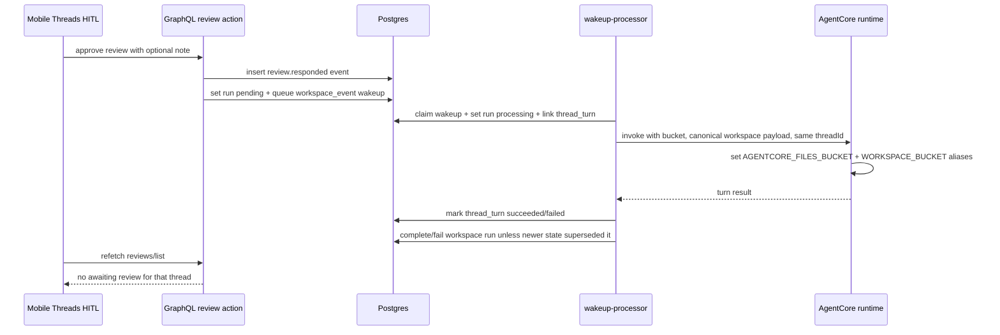

# fix: Complete workspace HITL resume lifecycle

## Overview

Finish the feature slice that PR #609 exposed in dev: the mobile Threads HITL confirmation UI is live, review decisions are auditable, and review approval resumes the same thread, but the resumed agent turn still receives incomplete workspace context and the `agent_workspace_runs` row does not reach a terminal state when the resumed turn finishes.

This plan keeps the current Threads-first UX. The work is backend/runtime lifecycle hardening plus focused tests, followed by a native simulator retest with `pnpm run ios`.

---

## Problem Frame

The deployed smoke test proved the human-facing surface works:

- `CHAT-170` pinned to the top with `Needs answer`.
- The mobile confirmation panel accepted a note.
- `review.responded` event `1922` was inserted.
- Wakeup `01f54153-11e6-41c3-b22d-07b19b6b3055` resumed thread `91a22b0b-18fc-47c2-897b-3410e7a5b743`.
- Thread turn `f1eda114-cca5-4a73-ab70-6797406eb195` succeeded.

Two correctness gaps remain:

- The resumed runtime reported `WORKSPACE_BUCKET not configured`, even though the wakeup processor has the bucket and passes `workspace_bucket` to AgentCore. The Python runtime only aliases this value to `AGENTCORE_FILES_BUCKET`, while existing workspace skill scripts still expect `WORKSPACE_BUCKET`.
- The workspace run stayed `pending` after the resumed turn succeeded. This leaves DB lifecycle state misleading and risks stale review/run surfaces even though the mobile list cleared once the query no longer returned `awaiting_review`.

There is also a payload naming mismatch: workspace event wakeups write `targetPath` and `sourceObjectKey`, but `wakeup-processor` reads `workspaceTargetPath`, `workspaceSourceObjectKey`, and `workspaceRequestObjectKey`. The simulator showed `Target: .` even though the review run target was `smoke-test`.

---

## Requirements Trace

- R8-R9. Blocked HITL runs must resume through the same file/event contract and same `runId`.
- R11. Runtime is stateless per wake and must be given enough durable workspace context to reconstitute work.
- R12-R14. Operators need a trustworthy run/event lifecycle and an explainable wake source.
- PR #609 behavior: preserve tenant isolation, protected write rules, audit events, mobile Threads-first HITL, and same-thread resume.
- User retest requirement: verify with the native mobile simulator using `pnpm run ios`, not Expo Go.

---

## Scope Boundaries

- Do not redesign the mobile HITL surface or reintroduce a separate Tasks tab.
- Do not bypass orchestration writer protections or write directly to protected eventful prefixes from generic workspace APIs.
- Do not add a workflow engine or platform fan-in behavior.
- Do not make runtime state persistent; each wake still receives enough context to read durable files and exit.
- Do not add a new database migration unless implementation discovers the existing schema cannot represent the lifecycle transition.

---

## Context & Research

### Relevant Code and Patterns

- `packages/api/src/lib/workspace-events/review-actions.ts` creates review decision events and queues resume wakeups. It currently emits payload keys including `targetPath`, `responseMarkdown`, `threadId`, and `causeType`.
- `packages/api/src/lib/workspace-events/processor.ts` creates initial workspace wakeups with `targetPath` and `sourceObjectKey`.
- `packages/api/src/handlers/wakeup-processor.ts` validates `workspaceRunId`, inserts `thread_turns`, links `agent_workspace_runs.current_thread_turn_id`, builds the human-readable workspace wake message, sends `workspace_bucket`, and marks the wakeup/thread turn complete or failed.
- `packages/agentcore-strands/agent-container/container-sources/server.py` receives `workspace_bucket` and sets `AGENTCORE_FILES_BUCKET`, but not `WORKSPACE_BUCKET`.
- `packages/skill-catalog/workspace-memory/scripts/memory.py` expects `WORKSPACE_BUCKET`, which matches the runtime failure observed in the simulator.
- `apps/mobile/app/(tabs)/index.tsx`, `apps/mobile/app/thread/[threadId]/index.tsx`, `apps/mobile/lib/thread-hitl-state.ts`, and `apps/mobile/lib/workspace-review-state.ts` contain the now-deployed Threads-first HITL UI and should stay behaviorally stable except for critical stale-state cleanup if needed.
- `packages/api/src/__tests__/workspace-review-actions.test.ts` and `packages/api/src/__tests__/workspace-event-processor.test.ts` already provide focused coverage for review decision and workspace event wakeup payloads.

### Institutional Learnings

- `docs/solutions/patterns/apply-invocation-env-field-passthrough-2026-04-24.md`: invocation payload fields crossing API -> AgentCore -> container need passthrough tests.
- `docs/solutions/best-practices/defer-integration-tests-until-shared-harness-exists-2026-04-21.md`: use focused unit/contract tests for Lambda/runtime paths when no shared integration harness exists.
- `docs/solutions/best-practices/probe-every-pipeline-stage-before-tuning-2026-04-20.md`: verify each stage of an async pipeline before tuning UI or retries.

### External References

- External research skipped. This is an internal contract/lifecycle fix with strong local patterns and no new external API behavior.

---

## Key Technical Decisions

- **Normalize workspace wakeup payloads at both producer and consumer boundaries.** Producers should emit the canonical `workspaceTargetPath`, `workspaceSourceObjectKey`, and `workspaceRequestObjectKey` keys expected by `wakeup-processor`, while `wakeup-processor` should remain backward-compatible with `targetPath` and `sourceObjectKey` for already queued dev wakeups.
- **Alias workspace bucket in the runtime, not the skill.** `server.py` should set both `AGENTCORE_FILES_BUCKET` and `WORKSPACE_BUCKET` from `workspace_bucket` so existing skill scripts continue to work and future runtime tools can use either historical name.
- **Run status follows wakeup turn lifecycle when no newer canonical event overrides it.** When a `workspace_event` wakeup starts, set the workspace run to `processing`. When the turn succeeds, mark the run `completed`; when the turn fails, mark it `failed`. If another canonical event has moved the run to `awaiting_review`, `awaiting_subrun`, `cancelled`, `completed`, or `failed` after the turn started, do not overwrite that newer state.
- **Keep the mobile UI as a verifier, not the source of truth.** The list/detail should continue to derive HITL state from `agentWorkspaceReviews(status: "awaiting_review")`; the backend lifecycle fix should remove stale states rather than client-side hiding.

---

## Open Questions

### Resolved During Planning

- Should this be another UI slice? No. The UI path passed the simulator test; the remaining failures are backend/runtime contract gaps.
- Should review acceptance create a second wake in a new thread? No. PR #609 correctly resumes the same `threadId`; preserve this.
- Should the run be marked completed if the runtime fails to emit `run.completed`? For this slice, yes, when the `thread_turn` succeeds and no newer canonical event has changed the run state. This keeps the v1 lifecycle honest while still allowing future explicit lifecycle events to take precedence.

### Deferred to Implementation

- Exact helper shape for guarded workspace run status updates in `wakeup-processor.ts`. The invariant is more important than the name: only update the expected run for the same tenant/agent, and avoid clobbering newer blocking/terminal states.
- Whether to add a small exported helper for workspace wake payload normalization or keep it local to `wakeup-processor.ts`; decide based on local code clarity.

---

## High-Level Technical Design

> *This illustrates the intended approach and is directional guidance for review, not implementation specification. The implementing agent should treat it as context, not code to reproduce.*

---

## Implementation Units

- U1. **Normalize workspace wake payloads**

**Goal:** Ensure workspace event wakeups carry the keys `wakeup-processor` expects while preserving compatibility for existing queued rows.

**Requirements:** R8-R9, R11, R14.

**Dependencies:** None.

**Files:**
- Modify: `packages/api/src/lib/workspace-events/processor.ts`
- Modify: `packages/api/src/lib/workspace-events/review-actions.ts`
- Modify: `packages/api/src/handlers/wakeup-processor.ts`
- Test: `packages/api/src/__tests__/workspace-event-processor.test.ts`
- Test: `packages/api/src/__tests__/workspace-review-actions.test.ts`

**Approach:**
- Add canonical payload fields to initial work wakeups and review resume wakeups: `workspaceTargetPath`, `workspaceSourceObjectKey`, and where applicable `workspaceRequestObjectKey`.
- Preserve current payload fields such as `targetPath` and `sourceObjectKey` for compatibility and easier operator debugging.
- In `wakeup-processor`, resolve workspace payload values through a small compatibility layer that checks canonical keys first and legacy keys second.
- Ensure the workspace wake message displays the real target path (`smoke-test` in the dev fixture), not `.`.

**Patterns to follow:**
- Existing `workspaceRunId` and `workspaceEventId` validation in `packages/api/src/handlers/wakeup-processor.ts`.
- Existing focused payload assertions in `packages/api/src/__tests__/workspace-review-actions.test.ts`.

**Test scenarios:**
- Happy path: review accept wakeup payload includes both canonical `workspaceTargetPath` and legacy `targetPath`, plus `threadId`.
- Happy path: work.requested wakeup payload includes canonical source/request object keys.
- Backward compatibility: a wakeup payload with only `targetPath` still produces a workspace wake message with that target.

**Verification:**
- API tests prove queued wakeup payloads are normalized and legacy payloads still work.

---

- U2. **Pass workspace bucket through to runtime-compatible env names**

**Goal:** Stop resumed workspace turns from reporting `WORKSPACE_BUCKET not configured`.

**Requirements:** R11, PR #609 same-thread resume.

**Dependencies:** U1.

**Files:**
- Modify: `packages/agentcore-strands/agent-container/container-sources/server.py`
- Test: `packages/agentcore-strands/agent-container/test_workspace_invocation_env.py` or an existing nearby runtime test file

**Approach:**
- When `_execute_agent_turn` receives `workspace_bucket`, set both `AGENTCORE_FILES_BUCKET` and `WORKSPACE_BUCKET`.
- At module/bootstrap time, if only `AGENTCORE_FILES_BUCKET` is present, mirror it into `WORKSPACE_BUCKET` so the alias exists even when payloads are omitted in tests or alternate invocation paths.
- Keep cleanup behavior consistent with other per-invocation env values so warm containers do not leak a stale bucket between tenants. If cleanup cannot remove global env safely because `AGENTCORE_FILES_BUCKET` is process-level config, prefer deterministic overwrite on each invocation.

**Patterns to follow:**
- Existing per-payload env handling in `_execute_agent_turn`.
- `packages/agentcore-strands/agent-container/container-sources/run_skill_dispatch.py` for the current `workspace_bucket` field source.

**Test scenarios:**
- Happy path: invoking the runtime helper with `workspace_bucket = "bucket-a"` makes both env vars visible during the turn.
- Edge case: if `AGENTCORE_FILES_BUCKET` is already set and `WORKSPACE_BUCKET` is missing, runtime bootstrap aliases it.
- Isolation: a later invocation with `workspace_bucket = "bucket-b"` overwrites the prior bucket alias.

**Verification:**
- Python runtime test passes without needing AWS.

---

- U3. **Complete workspace run lifecycle from wakeup outcomes**

**Goal:** Keep `agent_workspace_runs.status` aligned with the actual resumed turn lifecycle.

**Requirements:** R12-R14.

**Dependencies:** U1.

**Files:**
- Modify: `packages/api/src/handlers/wakeup-processor.ts`
- Create or modify: `packages/api/src/__tests__/wakeup-processor-workspace-lifecycle.test.ts`

**Approach:**
- When a `workspace_event` wakeup is claimed and the thread turn row is created, update the matching workspace run to `processing`, set `current_wakeup_request_id`, set `current_thread_turn_id`, and bump `last_event_at` / `updated_at`.
- On successful AgentCore completion, mark the workspace run `completed` and `completed_at` if it is still owned by that wakeup/turn and in a non-terminal in-flight status.
- On AgentCore invocation failure, mark the workspace run `failed` if it is still owned by that wakeup/turn and in a non-terminal in-flight status.
- Do not overwrite states that indicate a newer canonical event happened during the turn, especially `awaiting_review`, `awaiting_subrun`, `cancelled`, `completed`, or `failed`.

**Patterns to follow:**
- Existing atomic wakeup claim in `processWakeup`.
- Existing `threadTurns` status updates and AppSync notifications in `wakeup-processor.ts`.

**Test scenarios:**
- Happy path: a `workspace_event` wakeup transitions run `pending -> processing -> completed` when AgentCore succeeds.
- Error path: a `workspace_event` wakeup transitions run `processing -> failed` when AgentCore throws.
- Edge case: if a newer event moves the run to `awaiting_review` before turn completion, the success handler does not overwrite it with `completed`.
- Tenant isolation: lifecycle updates include tenant id and agent id predicates and do not update a run owned by another tenant or agent.

**Verification:**
- Focused wakeup-processor lifecycle tests prove the DB updates without invoking real AgentCore.

---

- U4. **Retest deployed/mobile HITL flow**

**Goal:** Prove the fix works after PR deployment and preserve the Threads-first HITL experience.

**Requirements:** user simulator retest requirement.

**Dependencies:** U1-U3 merged and deployed.

**Files:**
- Test expectation: none -- this is manual dev-stack verification after deploy.

**Approach:**
- After CI is green and the PR is merged/deployed, create or reuse a dev review fixture for tenant `sleek-squirrel-230`.
- Launch the native simulator from `apps/mobile` with `pnpm run ios`.
- Confirm a pending review pins the thread and shows the HITL panel.
- Approve with a note.
- Verify DB state: `review.responded` event exists, wakeup completes, turn succeeds, and `agent_workspace_runs.status` reaches `completed` or a newer explicit blocked/terminal state.
- Confirm mobile list clears the amber HITL treatment without requiring client-side hacks.

**Patterns to follow:**
- The simulator smoke flow from PR #609.
- Existing `scripts/smoke/_env.sh` DB access pattern for dev verification.

**Test scenarios:**
- Happy path: approve review -> toast -> same-thread assistant response -> run completed.
- Error observation: if runtime cannot read workspace storage, capture exact payload/env values before adding UI workarounds.

**Verification:**
- Native simulator and DB both reflect successful resume completion.

---

## System-Wide Impact

- **Interaction graph:** GraphQL review decision -> `agent_wakeup_requests` -> `wakeup-processor` -> AgentCore runtime -> thread messages -> workspace run lifecycle.
- **Error propagation:** GraphQL decision conflicts still surface synchronously; runtime errors should mark the workspace run failed in addition to thread turn failed.
- **State lifecycle risks:** A late lifecycle update must not clobber a newer `awaiting_review`, `awaiting_subrun`, `cancelled`, `completed`, or `failed` state produced by canonical events during the turn.
- **API surface parity:** Admin and mobile both use the same GraphQL review decision mutations; payload normalization must serve both.
- **Integration coverage:** Unit tests cover payload and lifecycle transitions; simulator retest covers the deployed cross-layer path.
- **Unchanged invariants:** Tenant isolation, protected orchestration writer rules, audit events, and Threads-first mobile HITL stay unchanged.

---

## Risks & Dependencies

| Risk | Mitigation |
|------|------------|
| Completing runs from wakeup outcome hides explicit agent lifecycle events | Only complete/fail when the run is still associated with the same wakeup/turn and in an in-flight status; do not overwrite newer blocked/terminal states. |
| Existing queued dev wakeups use legacy payload keys | Consumer fallback reads legacy `targetPath` / `sourceObjectKey` while producers start emitting canonical keys. |
| Warm runtime env leaks prior bucket aliases | Overwrite aliases on every invocation and add a runtime test for repeated bucket values. |
| Simulator passes before deployed GraphQL/API is updated | Treat simulator retest as post-merge/deploy verification, not local-only proof. |

---

## Documentation / Operational Notes

- PR description should include the post-deploy simulator checklist and the DB fields to inspect.
- No user-facing docs update is required unless implementation changes the operator-visible lifecycle vocabulary.
- If the dev AgentCore runtime continues to lack bucket access after env aliasing, capture the runtime payload and Terraform env before widening scope.

---

## Sources & References

- Origin document: `docs/brainstorms/2026-04-25-s3-file-orchestration-primitive-requirements.md`
- Prior plan: `docs/plans/2026-04-25-001-feat-s3-file-orchestration-plan.md`
- Prior HITL plan: `docs/plans/2026-04-26-002-feat-workspace-review-detail-actions-plan.md`
- Related PR: #609 `feat(workspace): add review detail actions`
- Related code: `packages/api/src/lib/workspace-events/review-actions.ts`
- Related code: `packages/api/src/handlers/wakeup-processor.ts`
- Related code: `packages/agentcore-strands/agent-container/container-sources/server.py`
- Related code: `packages/skill-catalog/workspace-memory/scripts/memory.py`
