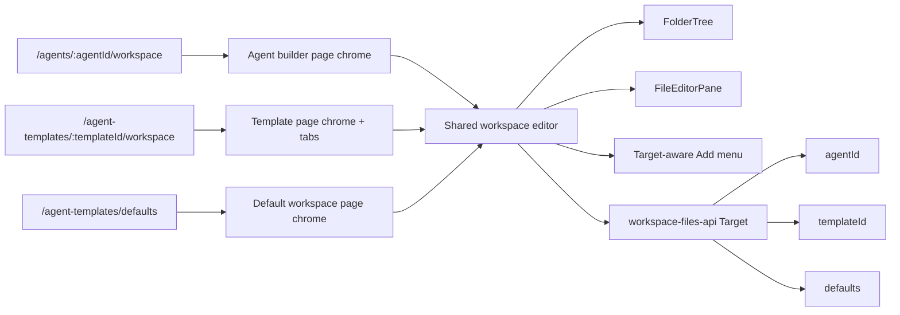

# refactor(admin): unify template and agent workspace editors

## Overview

Make the Agent Template workspace editor use the same workspace editor implementation as the Agent Editor. The current Agent Editor uses the newer `AgentBuilderShell` component family (`FolderTree`, `FileEditorPane`, routing table editor, snippets, shared Add menu, inherited-source indicators, and the recent selected-file outline), while the Agent Template route still carries its own older `buildTree`, `WsTreeItem`, CodeMirror toolbar, file-create dialog, and save/delete state.

This plan converts the builder into a target-aware workspace editor that can render agent, template, and default-workspace targets through one component model. The template route keeps its own top-level navigation tabs and template configuration Save/Delete controls; the workspace tab embeds the shared editor rather than reimplementing it.

---

## Problem Frame

The screenshots show a product-level split: the Agent Editor workspace is now the canonical builder experience, but Agent Templates still render an older, flatter editor. That creates UI drift exactly where template authors and agent authors need identical behavior: folder tree density, selected-row styling, file actions, routing-table editing, snippets, and Add flows.

This drift was already identified as follow-up work in `docs/plans/2026-04-25-007-feat-agent-builder-skill-authoring-plan.md` U5, but the current UI makes it a blocking consistency problem. Fixing it by copying styles into the template route would only create another fork. The correct fix is to remove the duplicate template workspace editor and reuse the same editor components against `{ templateId }` and `{ defaults: true }` targets supported by `apps/admin/src/lib/workspace-files-api.ts`.

---

## Requirements Trace

- **R1.** The template workspace tab must render the same file tree, selected-file outline, editor toolbar, routing-table editor, snippets control, and file save/delete behavior as the agent workspace editor.
- **R2.** The template workspace tab must keep the Agent Template page navigation/header: template title, Configuration/Workspace/Skills/MCP Servers tabs, and template-level Save/Delete controls.
- **R3.** The Agent Editor and Agent Template workspace must share implementation, not just visual styles, so future changes to the workspace editor land once.
- **R4.** The Add affordance must be part of the shared workspace editor chrome, with target-aware actions. Agent-only actions such as import bundle remain hidden or disabled for template/default targets until backend support exists.
- **R5.** The Default Workspace route under Agent Templates must either use the same shared workspace editor or intentionally route through the same component in a target mode for `{ defaults: true }`, so it does not become the next fork.
- **R6.** New tests must assert target-specific behavior for agent, template, and default workspace targets, and guard against reintroducing route-local workspace tree/editor logic in template routes.

**Origin actors:** A1 (template author), A2 (tenant operator), A4 (agent runtime).
**Origin flows:** F1 (template inheritance), F3 (sub-agent delegation).
**Origin acceptance examples:** AE6 (workspace-skills unification), AE8 (starter snippets and organize flow).

---

## Scope Boundaries

- Do not change the `/api/workspaces/files` contract unless implementation proves a missing target capability. The existing client already supports `{ agentId }`, `{ templateId }`, and `{ defaults: true }`.
- Do not add template bundle import in this slice. The current import endpoint is agent-specific (`/api/agents/{agentId}/import-bundle`).
- Do not migrate or remove the Agent Template `Skills` tab in this slice. It remains a separate transitional metadata surface from prior plans.
- Do not redesign the whole Agent Template configuration page. Preserve its tabs, title, config Save/Delete controls, and sync dialog behavior.
- Do not add drag-to-organize, template swap, or route-row auto-sync beyond what the current Agent Editor already has.

### Deferred to Follow-Up Work

- Template bundle import once a target-aware import backend exists.
- Full retirement or reframe of the Agent Template `Skills` tab after folder-native skill metadata has a settled home.
- Drag-to-organize route-row synchronization from the fat-folder requirements.

---

## Context & Research

### Relevant Code and Patterns

- `apps/admin/src/components/agent-builder/AgentBuilderShell.tsx` owns the current Agent Editor workspace: target state, file list, content loading, save/delete, Add menu, import accordion, pin-status update dialog, and page header.
- `apps/admin/src/components/agent-builder/FolderTree.tsx` is the current shared-quality tree: synthetic `agents` grouping from `AGENTS.md`, expand/collapse state, delete affordances, inherited/update badges, and selected-row styling.
- `apps/admin/src/components/agent-builder/FileEditorPane.tsx` is the current editor surface: file toolbar, snippets, Discard/Save/Delete, `AGENTS.md` routing-table editor, and CodeMirror markdown editor.
- `apps/admin/src/lib/workspace-files-api.ts` already exposes a `Target` union for `{ agentId }`, `{ templateId }`, and `{ defaults: true }`.
- `apps/admin/src/routes/_authed/_tenant/agent-templates/$templateId.$tab.tsx` still has a route-local workspace editor: `buildTree`, `WsTreeItem`, `wsFiles`, `wsSelectedFile`, `wsContent`, `wsOriginalContent`, file create/save/delete handlers, and inline CodeMirror.
- `apps/admin/src/routes/_authed/_tenant/agent-templates/defaults.tsx` is another workspace editor surface for defaults and should not be left behind as a third implementation.
- `docs/plans/2026-04-25-007-feat-agent-builder-skill-authoring-plan.md` U5 already chose component-driven template parity over route copying.
- `docs/plans/2026-04-25-006-feat-phase-e-agent-builder-shell-plan.md` established the component split that should now become target-aware.

### Institutional Learnings

- `docs/solutions/workflow-issues/agent-builder-smoke-cleanup-needs-manifest-regeneration-2026-04-26.md` documents that the builder’s synthetic `agents` section is derived from `AGENTS.md` routing rows, not physical storage folders. Shared editor behavior must preserve that model across targets.
- `docs/solutions/best-practices/every-admin-mutation-requires-requiretenantadmin-2026-04-22.md` reinforces staying on existing authenticated admin mutation paths rather than adding bypassing writes.
- `docs/solutions/workflow-issues/workspace-defaults-md-byte-parity-needs-ts-test-2026-04-25.md` is relevant if implementation touches default workspace source files; this plan should avoid content changes.

### External References

External research skipped. This is an internal React/Vite/TanStack Router refactor using existing repo components and API clients.

---

## Key Technical Decisions

- **Extract editor core from page chrome.** The shared workspace editor should own file-tree/editor/add behavior. Host routes should own page title, breadcrumbs, template tabs, and template-level save/delete.
- **Use target-aware capabilities, not target-specific forks.** The editor should receive a target and capability flags derived from target type: agent targets can show import and pin-update review; template/default targets use file/folder/local authoring but hide agent-only import/update flows unless supported.
- **Replace the template workspace tab, do not restyle it.** Remove route-local `buildTree`, `WsTreeItem`, inline CodeMirror, and workspace state from `$templateId.$tab.tsx` once the shared editor is embedded.
- **Keep template page navigation intact.** The template route remains the owner of Configuration/Workspace/Skills/MCP Servers tabs. The shared workspace editor should render inside the Workspace tab without creating a nested `PageLayout`.
- **Bring defaults along now.** Since `workspace-files-api` already supports `{ defaults: true }`, the Default Workspace route should consume the same editor target mode rather than preserving another fork.

---

## Open Questions

### Resolved During Planning

- **Q: Should this be a visual patch to the template tree?** No. The duplicate editor implementation is the root cause; visual patching would keep future drift alive.
- **Q: Should the template route lose its navigation tabs?** No. The shared editor should be embeddable inside the existing template route chrome.
- **Q: Can the shared editor target templates through existing APIs?** Yes. `workspace-files-api.ts` already has `{ templateId }` and `{ defaults: true }` target variants for list/get/put/delete.
- **Q: Should agent-only import bundle appear in template workspace?** No. Hide it for template/default targets until there is a target-aware backend import endpoint.

### Deferred to Implementation

- The exact component names after extraction. `WorkspaceEditor`, `WorkspaceBuilderEditor`, or `AgentBuilderWorkspace` are all acceptable if the boundary is clear and consistent.
- Whether target-aware sub-agent creation should call a new shared helper or use generic `putWorkspaceFile` seeding for template/default targets. Implementation should prefer existing API behavior and avoid new backend work unless necessary.
- The exact responsive placement of the shared Add menu when embedded in the template tab. It must not displace the existing template tabs or template Save/Delete controls.

---

## High-Level Technical Design

> *This illustrates the intended approach and is directional guidance for review, not implementation specification. The implementing agent should treat it as context, not code to reproduce.*

---

## Implementation Units

- U1. **Extract target-aware workspace editor core**

**Goal:** Separate the reusable workspace editor from the Agent Editor page shell so it can render for agent, template, and defaults targets.

**Requirements:** R1, R3, R4.

**Dependencies:** None.

**Files:**
- Create: `apps/admin/src/components/agent-builder/WorkspaceEditor.tsx`
- Modify: `apps/admin/src/components/agent-builder/AgentBuilderShell.tsx`
- Modify: `apps/admin/src/components/agent-builder/FolderTree.tsx`
- Modify: `apps/admin/src/components/agent-builder/FileEditorPane.tsx`
- Modify: `apps/admin/src/lib/agent-builder-api.ts`
- Test: `apps/admin/src/components/agent-builder/__tests__/WorkspaceEditor.target.test.tsx`

**Approach:**
- Move file list/content state, open/save/delete/create handlers, file source mapping, tree rendering, editor pane rendering, and Add menu wiring into a target-aware component.
- Keep `AgentBuilderShell` as the agent page wrapper: it fetches agent details, renders `PageLayout` with `Agent Builder : <name>`, and passes `{ agentId }` plus agent capabilities to the shared editor.
- Model capabilities explicitly: import bundle and template-update review are agent-only; snippets, routing-table editor, new file/folder, local skill creation, delete, and selected-file styling are shared unless implementation discovers a target restriction.
- Preserve the current selected-file border implementation in `FolderTree` so template and defaults targets inherit the same look.
- Keep file writes on `workspace-files-api` and avoid introducing a new endpoint.

**Execution note:** Characterization-first. Before moving code, add focused coverage for target capability decisions so the extraction can prove parity instead of relying on visual inspection alone.

**Patterns to follow:**
- `apps/admin/src/components/agent-builder/AgentBuilderShell.tsx`
- `apps/admin/src/components/agent-builder/FolderTree.tsx`
- `apps/admin/src/components/agent-builder/FileEditorPane.tsx`
- `apps/admin/src/lib/workspace-files-api.ts`

**Test scenarios:**
- Happy path: rendering the shared editor with an agent target shows the import affordance and agent-only update review plumbing.
- Happy path: rendering with a template target hides import but keeps file tree, Add menu, routing editor, snippets, Save, Discard, and Delete.
- Happy path: rendering with a defaults target hides import and update review but can list/open/save files through `{ defaults: true }`.
- Edge case: empty file lists render the same empty state across targets with target-appropriate create/default actions.
- Regression: selected file styling comes from `FolderTree` for every target, not route-local classes.

**Verification:**
- Agent Editor still loads through `AgentBuilderShell` with the same visible behavior as before extraction.
- The shared editor can be mounted in tests with agent, template, and defaults targets without duplicating route-local tree/editor code.

---

- U2. **Replace Agent Template workspace tab with shared editor**

**Goal:** Remove the old workspace editor from the Agent Template route and embed the shared editor in the Workspace tab.

**Requirements:** R1, R2, R3, R4.

**Dependencies:** U1.

**Files:**
- Modify: `apps/admin/src/routes/_authed/_tenant/agent-templates/$templateId.$tab.tsx`
- Modify: `apps/admin/src/components/agent-builder/WorkspaceEditor.tsx`
- Test: `apps/admin/src/routes/_authed/_tenant/agent-templates/__tests__/template-workspace-editor.test.tsx`

**Approach:**
- Delete the route-local `buildTree`, `WsTreeItem`, workspace file state, file content handlers, new-file dialog, inline CodeMirror toolbar, and workspace-only delete confirmation logic from `$templateId.$tab.tsx`.
- Keep template configuration state, tab navigation, template Save/Delete, linked-agent sync dialog, skills tab, and MCP tab unchanged.
- When `tab === "workspace"` and the template exists, render the shared editor with `{ templateId }` and template-target capabilities.
- Keep new templates from opening workspace editing until the template has been created, matching existing disabled-tab behavior.
- Ensure the shared editor’s own file-level Save/Discard/Delete remain independent from template configuration Save. Editing a workspace file should not mark the template config form dirty unless it already does today.

**Patterns to follow:**
- Existing template header/tabs in `apps/admin/src/routes/_authed/_tenant/agent-templates/$templateId.$tab.tsx`
- Current agent editor embedding in `apps/admin/src/routes/_authed/_tenant/agents/$agentId_.workspace.tsx`

**Test scenarios:**
- Happy path: a saved template on the Workspace tab renders `WorkspaceEditor` with `{ templateId }`.
- Happy path: selecting and saving `AGENTS.md` writes through workspace-files with the template target.
- Happy path: the template tabs and template-level Save/Delete remain visible above the workspace editor.
- Edge case: `templateId === "new"` keeps Workspace disabled and does not mount the shared editor.
- Regression: the route no longer renders `WsTreeItem` or a route-local CodeMirror workspace editor.

**Verification:**
- The Agent Template workspace visually matches the Agent Editor workspace tree and editor controls while preserving the template navigation/header from the screenshot.
- Workspace file edits still save immediately through the file toolbar, and template config save behavior is unchanged.

---

- U3. **Move Default Workspace onto the same editor**

**Goal:** Prevent the default-template workspace page from remaining as a third workspace editor fork.

**Requirements:** R3, R5, R6.

**Dependencies:** U1.

**Files:**
- Modify: `apps/admin/src/routes/_authed/_tenant/agent-templates/defaults.tsx`
- Modify: `apps/admin/src/components/agent-builder/WorkspaceEditor.tsx`
- Test: `apps/admin/src/routes/_authed/_tenant/agent-templates/__tests__/default-workspace-editor.test.tsx`

**Approach:**
- Replace the default workspace route-local tree/editor implementation with the shared editor using `{ defaults: true }`.
- Preserve the route’s title and any default-workspace-specific seeding controls that are still needed, but place file actions through the shared Add menu where practical.
- Hide agent-only import, pin update, and linked-template sync behavior for defaults.
- If default seeding has behavior not present in the shared Add menu, expose it as a target-specific extra action slot rather than forking the editor.

**Patterns to follow:**
- `apps/admin/src/routes/_authed/_tenant/agent-templates/defaults.tsx`
- `apps/admin/src/lib/workspace-files-api.ts`

**Test scenarios:**
- Happy path: Default Workspace mounts the shared editor with `{ defaults: true }`.
- Happy path: creating, selecting, saving, and deleting a defaults file uses workspace-files defaults target.
- Edge case: default seeding remains reachable if no files exist.
- Regression: default workspace route no longer owns its own tree item/editor implementation.

**Verification:**
- Agent, template, and defaults workspace surfaces all share one editor component family.

---

- U4. **Unify workspace header/Add affordances without merging page navigation**

**Goal:** Make the Add controls and workspace header behavior come from the shared editor while preserving host-page navigation chrome.

**Requirements:** R2, R4.

**Dependencies:** U1, U2.

**Files:**
- Modify: `apps/admin/src/components/agent-builder/WorkspaceEditor.tsx`
- Modify: `apps/admin/src/components/agent-builder/AgentBuilderShell.tsx`
- Modify: `apps/admin/src/routes/_authed/_tenant/agent-templates/$templateId.$tab.tsx`
- Test: `apps/admin/src/components/agent-builder/__tests__/WorkspaceEditor.actions.test.tsx`

**Approach:**
- Treat the editor Add menu as editor chrome, not route chrome. Host pages can place it in their header slot or let the editor render it in the panel header, but action definitions should be shared.
- Keep Agent Template route tabs in the template route. Do not add Configuration/Skills/MCP tabs to the Agent Editor unless another agent page navigation plan defines those routes.
- Ensure target-specific actions are explicit:
  - Agent target: Add Sub-agent, New Skill, New File, common folders, Import bundle.
  - Template target: Add Sub-agent/folder/file/local skill where those can be expressed as workspace file writes; no Import bundle.
  - Defaults target: New File/common folders/default seeding; no agent-only runtime actions.
- Keep the file-count/import row visually consistent across targets, with absent actions leaving no awkward blank space.

**Patterns to follow:**
- Add menu in `apps/admin/src/components/agent-builder/AgentBuilderShell.tsx`
- Template tabs/header in `apps/admin/src/routes/_authed/_tenant/agent-templates/$templateId.$tab.tsx`

**Test scenarios:**
- Happy path: agent target exposes import and all agent Add actions.
- Happy path: template target exposes file/folder authoring actions but not import.
- Happy path: defaults target exposes defaults-appropriate add/seed actions but not agent/template-only actions.
- Edge case: hiding an action does not change file tree/editor layout height in a way that clips content.

**Verification:**
- The Agent Editor and Agent Template workspace use the same Add action labels and behavior where the targets support them.
- The Agent Template navigation header remains recognizable and stable.

---

- U5. **Parity tests and visual verification**

**Goal:** Lock in shared-editor parity so future workspace editor changes do not fork again.

**Requirements:** R1, R3, R6.

**Dependencies:** U1, U2, U3, U4.

**Files:**
- Modify: `apps/admin/src/components/agent-builder/__tests__/FolderTree.test.ts`
- Create: `apps/admin/src/components/agent-builder/__tests__/WorkspaceEditor.parity.test.tsx`
- Modify: `apps/admin/src/routes/_authed/_tenant/agent-templates/$templateId.$tab.tsx`
- Modify: `apps/admin/src/routes/_authed/_tenant/agent-templates/defaults.tsx`

**Approach:**
- Add focused component tests for target rendering and action visibility instead of relying only on route-level smoke tests.
- Add a lightweight regression assertion that template route files no longer contain route-local workspace tree/editor helpers. This can be a test around exports or an implementation review checklist if route-file text assertions are too brittle.
- Run browser verification against the admin dev server for:
  - Agent Editor workspace selected file, Add menu, routing editor.
  - Agent Template workspace selected file, Add menu, routing editor.
  - Default Workspace selected file and file actions.
- Include responsive/density checks for the file tree so the selected blue border does not overlap adjacent rows.

**Patterns to follow:**
- Existing `apps/admin/src/components/agent-builder/__tests__/FolderTree.test.ts`
- Existing admin Vite test/build workflow in `apps/admin/package.json`

**Test scenarios:**
- Happy path: both agent and template routes render the same `FolderTree` row structure for the same file list.
- Happy path: both agent and template routes render `RoutingTableEditor` for `AGENTS.md`.
- Edge case: selected row border has reserved layout space and does not overlap adjacent hover/selected rows.
- Regression: template workspace tab does not import CodeMirror directly after unification.
- Regression: agent builder still opens `?folder=<path>` deep links after extraction.

**Verification:**
- Focused tests pass for `agent-builder` components and template/default workspace routes.
- `@thinkwork/admin` build succeeds.
- Browser screenshots confirm the highlighted tree/editor areas match between Agent Editor and Agent Template workspace.

---

## System-Wide Impact

- **Interaction graph:** Admin routes for agent workspace, template workspace, and default workspace converge on one editor component. Writes continue through `workspace-files-api`, so backend composition, manifests, and derived skill behavior remain unchanged.
- **Error propagation:** File API errors should surface in the shared editor once, consistently across targets. Template config save errors remain route-owned and separate.
- **State lifecycle risks:** File-level dirty state must stay separate from template configuration dirty state. Deleting selected files must clear editor content across all targets.
- **API surface parity:** The editor must not expose agent-only import or pin-update flows for template/default targets unless those targets support the backend contract.
- **Integration coverage:** Component tests prove target capability gating; browser checks prove real route chrome and editor layout interact correctly.
- **Unchanged invariants:** No changes to GraphQL template config mutations, template sync dialog semantics, workspace-files REST request shape, or runtime workspace composition are planned.

---

## Risks & Dependencies

| Risk | Mitigation |
|------|------------|
| Shared editor accidentally marks template config dirty when editing files | Keep workspace file state inside the shared editor and template form state inside the route; test file save separately from config save. |
| Template target lacks a backend action currently used by agent Add menu | Gate actions by target capability; implement template-safe actions as workspace file writes where possible, defer import. |
| Extracting `AgentBuilderShell` regresses `?folder=` deep links | Preserve this as U1/U5 test coverage and manual verification. |
| Default Workspace route keeps a stale fork | Include defaults in this plan through `{ defaults: true }`, not as follow-up work. |
| Shared component becomes too target-branchy | Keep target differences in a small capability/config layer; tree/editor rendering should stay target-neutral. |

---

## Documentation / Operational Notes

- No end-user documentation is required for the refactor itself.
- If the visible Add menu labels change, update any admin docs screenshots or prose that name workspace editor actions.
- The dev server must have `apps/admin/.env` copied into the worktree before browser validation, per AGENTS.md.

---

## Sources & References

- **Origin document:** `docs/brainstorms/2026-04-24-fat-folder-sub-agents-and-workspace-consolidation-requirements.md`
- Prior plan: `docs/plans/2026-04-25-006-feat-phase-e-agent-builder-shell-plan.md`
- Prior parity unit: `docs/plans/2026-04-25-007-feat-agent-builder-skill-authoring-plan.md`
- Prior delete parity fix: `docs/plans/2026-04-25-008-fix-agent-workspace-delete-parity-plan.md`
- Related code: `apps/admin/src/components/agent-builder/AgentBuilderShell.tsx`
- Related code: `apps/admin/src/components/agent-builder/FolderTree.tsx`
- Related code: `apps/admin/src/components/agent-builder/FileEditorPane.tsx`
- Related code: `apps/admin/src/routes/_authed/_tenant/agent-templates/$templateId.$tab.tsx`
- Related code: `apps/admin/src/routes/_authed/_tenant/agent-templates/defaults.tsx`
- Related code: `apps/admin/src/lib/workspace-files-api.ts`
