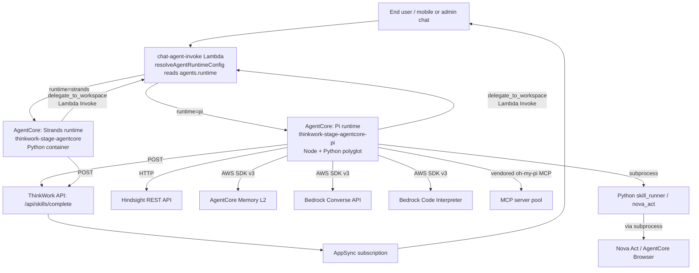

# feat: Add Pi-based parallel AgentCore runtime alongside Strands

## Overview

Add a second AgentCore-hosted runtime container — Node.js + Pi (`badlogic/pi-mono`) headless SDK with selectively vendored MCP and sub-agent extensions from `can1357/oh-my-pi` — running in parallel with the existing Strands Python container at `packages/agentcore-strands/agent-container`. A new per-agent `runtime: 'strands' | 'pi'` selector (default `'strands'`) on `agents` and `agent_templates` rows determines which AgentCore runtime ARN `chat-agent-invoke` dispatches to. Strands stays default and is not retired. Both runtimes are maintained indefinitely.

The first agent on the Pi runtime is a brand-new **deep researcher with sub-agent fan-out** that exercises MCP, `delegate_to_workspace`, and a script skill in real conversations — chosen to validate the three most-doubted v1 parity points on one user-facing surface.

This plan ships in four phases. Phase A lays foundation seams (DB, dispatcher, container scaffold, deploy pipeline) inert. Phase B lights the Pi runtime end-to-end with a stub system prompt and basic chat. Phase C adds the seven capability surfaces (memory, MCP, delegate, Hindsight, skills, sandbox, browser). Phase D ships the operator UX and the first production agent.

---

## Problem Frame

ThinkWork's agent runtime is Strands-only on AWS Bedrock AgentCore. Strands is opinionated and capable, but it owns much of the agent loop — auto-injecting prompt content via the `AgentSkills` plugin, owning tool dispatch through its `@tool` decorator. The user has a long-term gut feeling that Pi's transparency and customizability model is a better directional fit for ThinkWork (see origin: `docs/brainstorms/2026-04-26-pi-agent-runtime-parallel-substrate-requirements.md`). Rather than wholesale-swap or run a time-boxed spike, the decision is to invest in a parallel production runtime.

This is a strategic investment, not a forced response to a specific blocker. The plan explicitly preserves Strands as default and frames Pi as an opt-in runtime per agent.

---

## Requirements Trace

- R1. Pi runtime container at `packages/agentcore-pi/agent-container` running Pi headless SDK on Node.js LTS, Lambda Web Adapter, same `/invocations` HTTP shape as Strands → U4, U6
- R2. Bedrock auth via same IAM-role pattern; `pi-ai` Bedrock provider; prompt caching where adapter exposes it → U6
- R3. Pi runtime owns the entire system prompt; ThinkWork composes it server-side, passes it whole, no AgentSkills auto-injection equivalent → U6
- R4. Completion-callback POST to `/api/skills/complete` with same payload contract as Strands → U6
- R5. `runtime` selector with values `'strands'` (default) and `'pi'` on `agents` and `agent_templates` records, editable from admin → U1, U15
- R6. `chat-agent-invoke` dispatches to correct AgentCore runtime ID by selector; auth, payload, AppSync notify path unchanged → U2. **All other code paths that invoke AgentCore** (`packages/api/src/handlers/wakeup-processor.ts`, `packages/api/src/graphql/utils.ts`, `packages/api/src/handlers/eval-runner.ts`, `packages/api/src/graphql/resolvers/core/deploymentStatus.query.ts`) must honor the same selector → U20
- R7. Operator can flip an agent between runtimes without losing thread history, memory, workspace state, or per-user MCP tokens → U2, U6, U8 (verification crosses U2/U8)
- R8. Agent config UI shows current runtime as labelled selector; no capability matrix at v1 → U15
- R9. pi-mono pinned in container `package.json`; vendored oh-my-pi extensions under `packages/agentcore-pi/vendor/oh-my-pi/<name>/` with PROVENANCE.md (upstream URL, commit SHA, license, import date, local modifications) → U7, U16
- R10. Vendored oh-my-pi MCP extension is imported with proper provenance (R10 covers vendoring hygiene; R13 covers runtime behavior — R13 depends on R10) → U7
- R11. Vendored oh-my-pi sub-agent task primitives provide in-loop orchestration surface; `delegate_to_workspace` is a TS tool that calls back into `chat-agent-invoke` (so the child's runtime selector is honored, not the parent's) → U10, U16. **For Strands→Pi cross-runtime fan-out, Strands' `delegate_to_workspace_tool.py` also gains a Lambda re-entry path** when the child agent's runtime differs from the parent's → U21
- R12. AgentCore Memory L2 reads and writes from Node, equivalent semantics to `memory_tools.py` → U8
- R13. MCP server support end-to-end via vendored extension; honors per-user OAuth tokens → U9
- R14. `delegate_to_workspace` end-to-end; spawned workspaces complete and return → U10
- R15. Hindsight via Node HTTP client against existing REST API; preserves async semantics; captures token usage → U11
- R16. Script-based skills (`packages/skill-catalog`) via Python subprocess from Node; container ships Python 3.12 + `skill_runner.py` deps; per-call subprocess with JSON stdin/stdout; timeout/memory limits; structured tool errors on failure → U12
- R17. Sandbox tool via Node port using AWS SDK v3 → U13
- R18. Browser automation supported in Pi runtime; Nova Act is Python-only, so Pi calls a Python helper subprocess (same pattern as U12 for skills) → U14
- R19. OpenTelemetry traces + token-usage metrics into same observability sinks; AgentCore Evaluations runs tagged with source runtime → U18
- R20. Per-runtime support markers on tools (forward compatibility for future divergence) → U2, U15
- R21. Pi version + each vendored oh-my-pi SHA pinned in container manifest; monthly upgrade cadence → U7, U16 (process documented in operational notes)

**Origin actors:** A1 (Operator), A2 (Agent instance), A3 (End user), A4 (Platform engineer)

**Origin flows:** F1 (Operator routes agent to Pi), F2 (End-user chat hits Pi runtime exercising full tool surface), F3 (Per-tool capability gap — future-proofing only)

**Origin acceptance examples:** AE1 (covers R5, R6, R7), AE2 (covers R3, R4), AE3 (covers R13, R14, R16), AE4 (covers R20, F3)

---

## Scope Boundaries

- Adopting the whole `oh-my-pi` fork as a runtime dependency — out of scope. We vendor specific extensions only.
- Replacing or retiring the Strands runtime — out of scope. Both runtimes maintained indefinitely.
- Migrating existing agents off Strands — out of scope. Operators opt agents in to Pi explicitly.
- Multi-provider model routing via `pi-ai` (calling non-Bedrock providers) — out of scope for v1; AWS-native preference holds.
- Operator-facing capability matrix UI — not built in v1 because there are no v1 capability gaps to surface. The R20 per-tool marker pattern is in place for future per-tool divergence; the matrix UI is built when the first divergence actually exists.
- Upstream contributions back to `pi-mono` or `oh-my-pi` — out of scope for v1.

### Deferred to Follow-Up Work

- Cold-start mitigation for skill subprocess Python interpreter (warm worker pool, Unix-socket protocol): deferred until measurement shows user-perceived latency impact (see U12 deferred notes).
- Cross-runtime delegate_to_workspace observability dashboards (parent/child runtime correlation in traces): deferred to a follow-up after U18 ships baseline OTel.
- Pi runtime support in `agentcore-admin` reconciler endpoints: deferred until/unless Pi gains the AgentCore-managed (Bedrock-direct) endpoint mode that Strands' default endpoint uses; today both runtimes use the Lambda-fronted path which doesn't need the reconciler.

---

## Context & Research

### Relevant Code and Patterns

- `packages/agentcore-strands/agent-container/Dockerfile`, `server.py`, `requirements.txt` — reference shape for `/invocations` HTTP entry, Lambda Web Adapter wiring (port 8080, `/ping` readiness), AgentCoreHandler pattern (`server.py:2034-2085`), env var contract (`PORT`, `AGENTCORE_MEMORY_ID`, `AGENTCORE_FILES_BUCKET`, `MEMORY_ENGINE`, `MEMORY_RETAIN_FN_NAME`, `THINKWORK_API_URL`, `API_AUTH_SECRET`, `THINKWORK_GIT_SHA`, `THINKWORK_BUILD_TIME`, OTel distro vars).
- `packages/agentcore-activation/agent-container/` — closest precedent for a parallel narrow runtime; uses the inert→live seam swap pattern. Mirror its container layout, narrow tool surface, EXPECTED_TOOLS boot assertion.
- `packages/api/src/handlers/chat-agent-invoke.ts` — dispatcher; today invokes a single Lambda function name from `AGENTCORE_FUNCTION_NAME` env at lines 422-428 via `LambdaClient.send(InvokeCommand)` with `RequestResponse`. Payload wrapped in API GW v2 event shape targeting `/invocations` (lines 414-420).
- `packages/api/src/lib/resolve-agent-runtime-config.ts` — currently hardcodes `runtimeType = "strands"` at lines 107 and 545. `runtimeType` is already plumbed into the dispatch payload at `chat-agent-invoke.ts:384`. The seam exists; we just need to make it data-driven.
- `packages/agentcore-strands/agent-container/container-sources/skill_runner.py` (170 lines) — pattern for in-process skill loading via `importlib.util.spec_from_file_location` + `strands.tool` decorator. Pi runs this same code in a subprocess.
- `packages/agentcore-strands/agent-container/container-sources/hindsight_tools.py` — async `arecall`/`areflect` pattern with retry; we mirror the contract in Node.
- `packages/agentcore-strands/agent-container/container-sources/sandbox_tool.py` and `server.py:879-935` — `build_execute_code_tool` factory takes injectable async callables; design is portable to Node.
- `packages/agentcore-strands/agent-container/container-sources/delegate_to_workspace_tool.py` (30KB) — current Strands implementation. Pi gets a much smaller TS implementation that calls Lambda Invoke on `chat-agent-invoke` rather than re-doing orchestration.
- `terraform/modules/app/agentcore-runtime/main.tf` — pattern for AgentCore Lambda + ECR + role + SSM. Clone to `terraform/modules/app/agentcore-runtime-pi/`.
- `terraform/modules/thinkwork/main.tf:254-273` — wires `module "agentcore"`. Add sibling `module "agentcore_pi"`.
- `scripts/build-lambdas.sh` (line 122 for `chat-agent-invoke`) — modifying the dispatcher needs no build script change. Adding a new Lambda would.
- `packages/database-pg/src/schema/agents.ts:42` — `source: text("source").notNull().default("user")` pattern; mirror for `runtime: text("runtime").notNull().default("strands")`. Same pattern in `agent-templates.ts`.
- `packages/agentcore/scripts/create-runtime.sh:39-44` — already accepts `--runtime pi`; SSM path `/thinkwork/${stage}/agentcore/runtime-id-pi` is already namespaced.
- `.github/workflows/deploy.yml` — `detect-changes` job + `UpdateAgentRuntime` step; Pi must be added to source-touch list and gets its own update step.
- `scripts/post-deploy.sh --min-source-sha` — verifies runtime image freshness via `git merge-base --is-ancestor`; Pi runtime added.

### Institutional Learnings

- `docs/solutions/architecture-patterns/inert-to-live-seam-swap-pattern-2026-04-25.md` — load-bearing for this plan's PR sequencing. Pi container ships inert (`pi_loop_fn = _inert`), then a follow-up PR swaps to live SDK call. Reduces review surface and rollback to one revert.
- `docs/solutions/workflow-issues/agentcore-completion-callback-env-shadowing-2026-04-25.md` — Pi runtime must snapshot `process.env.THINKWORK_API_URL` and `process.env.API_AUTH_SECRET` at coroutine entry; never re-read after the agent turn. Same shape of bug will hit Node otherwise.
- `docs/solutions/workflow-issues/agentcore-runtime-no-auto-repull-requires-explicit-update-2026-04-24.md` — Pi runtime needs its own `UpdateAgentRuntime` call in `deploy.yml`; `READY` ≠ current.
- `docs/solutions/runtime-errors/stale-agentcore-runtime-image-entrypoint-not-found-2026-04-25.md` — `detect-changes` and `--min-source-sha` must include `packages/agentcore-pi`.
- `docs/solutions/build-errors/multi-arch-image-lambda-vs-agentcore-split-tags-2026-04-24.md` — Pi container goes to AgentCore Runtime → arm64. Use separate tag namespace from Strands' `${sha}-arm64`.
- `docs/solutions/build-errors/dockerfile-explicit-copy-list-drops-new-tool-modules-2026-04-22.md` — Pi container starts with subdirectory + wildcard COPY. Ship startup tool-roster assertion that fails loud on drop. (Bug recurred 4× under explicit-COPY in Strands.)
- `docs/solutions/best-practices/activation-runtime-narrow-tool-surface-2026-04-26.md` — narrow runtimes assert exact tool allowlist at boot; mirror for Pi (initial allowlist matches deep-researcher's surface).
- `docs/solutions/patterns/apply-invocation-env-field-passthrough-2026-04-24.md` — Pi's Node equivalent of `apply_invocation_env` must pass full payload through; do not build a subset dict at the call site (drops new envelope fields like `runtime`, `parent_run_id`).
- `docs/solutions/best-practices/inline-helpers-vs-shared-package-for-cross-surface-code-2026-04-21.md` — completion-callback envelope and HMAC computation triplicated across Strands Python, Pi Node, and dispatcher TS rather than extracted; rely on `/api/skills/complete` CAS + `skill_runs` partial unique index for drift detection.
- `docs/solutions/best-practices/invoke-code-interpreter-stream-mcp-shape-2026-04-24.md` — Pi's vendored MCP plugin must consume the canonical MCP result shape (`content[]`, `structuredContent`); prefer `structuredContent` over text concatenation.
- `docs/solutions/best-practices/bedrock-agentcore-sdk-version-drift-prefer-raw-boto3-2026-04-24.md` — Node equivalent: prefer `@aws-sdk/client-bedrock-agentcore` raw operations over community wrappers.
- `docs/solutions/integration-issues/agentcore-runtime-role-missing-code-interpreter-perms-2026-04-24.md` — Pi runtime gets its own IAM role; every Bedrock/S3/Secrets/Lambda action gets explicit terraform statements in the same PR as the calling code.
- `docs/solutions/workflow-issues/workspace-defaults-md-byte-parity-needs-ts-test-2026-04-25.md` — if Pi reads workspace files independently, both runtimes use the same `loadDefaults()` source; pre-push test catches drift.

**Notable absences worth flagging:** No prior `docs/solutions/` entries cover (a) vendoring third-party code, (b) Python+Node coexistence in one container, or (c) multi-engine runtime selector at dispatch time. This plan establishes those patterns.

### External References

External research was already exhaustively done in the brainstorm phase — see `docs/brainstorms/2026-04-26-pi-agent-runtime-parallel-substrate-requirements.md` for the Pi vs oh-my-pi capability matrix and citations. Skipping a second external pass.

---

## Key Technical Decisions

- **Pi container is polyglot (Node + Python coexisting), not pure Node.** Pi runtime ships Node.js LTS as primary plus Python 3.12 + Strands' `requirements.txt` so it can subprocess into the existing `skill_runner.py` (R16) and into a Python Nova Act helper for browser automation (R18). **Rationale:** Self-sufficient runtime; no cross-runtime callbacks; Pi failure modes don't depend on Strands runtime availability. Cost: ~600MB+ image. Honors the user's "full customization of Pi" stance better than HTTP-callback-to-Strands alternatives.
- **`delegate_to_workspace` is a small TS tool that calls back into `chat-agent-invoke` via Lambda Invoke**, not a re-port of the 30KB Python `delegate_to_workspace_tool.py`, and not a Pi-native sub-agent primitive. **Rationale:** The child agent's runtime is determined by *the child's* runtime selector, not the parent's. So delegation must go through the dispatcher anyway. This makes Pi→Strands and Strands→Pi cross-runtime fan-out work for free, with no additional code. Vendored oh-my-pi sub-agent primitives (R11) remain available for in-loop orchestration but are not used by `delegate_to_workspace`.
- **Inert→live seam swap pattern for the Pi runtime go-live.** U4 ships the container scaffold with `pi_loop_fn = _inert` (returns a stable stub). U6 swaps to the live Pi SDK call. Reduces review surface and lets each PR be small and revertible. (See: `docs/solutions/architecture-patterns/inert-to-live-seam-swap-pattern-2026-04-25.md`.)
- **Subdirectory + wildcard `COPY` in the Pi Dockerfile from day one**, with a startup `EXPECTED_TOOLS` assertion that fails the container loud on drop. **Rationale:** the explicit-COPY-list pattern in Strands has caused silent partial-toolset shipping 4× in 7 days; we don't repeat it.
- **Triplicate the completion-callback envelope and HMAC computation across Strands Python, Pi Node, and dispatcher TS.** No new shared package across language boundaries. Drift caught loudly by `/api/skills/complete` CAS + `skill_runs` partial unique index. Each site carries a top-of-block comment naming the other locations.
- **`runtime` is `text + default + CHECK ('strands','pi')` on both `agents` and `agent_templates`.** This is a **deliberate departure** from the existing `source` field pattern at `agents.ts:42`, which is `text + default` with **no** CHECK (validation lives in resolvers). We add CHECK here because the runtime enum is short, stable, and security-relevant (a typo'd value silently dispatching to a non-existent runtime is worse than a constraint-violation rejection). Hand-rolled `drizzle/*.sql` for the CHECK constraint, registered in the manual-migration drift reporter per CLAUDE.md. Precedent for CHECK on a string-enum column exists at `packages/database-pg/drizzle/0018_skill_runs.sql:47`.
- **Dispatcher pattern: a `runtime → AGENTCORE_FUNCTION_NAME` map** in `chat-agent-invoke.ts`, populated at module init from env (`AGENTCORE_FUNCTION_NAME` for strands, `AGENTCORE_PI_FUNCTION_NAME` for pi). Resolver returns the runtime; dispatcher picks the function name. One additional `if/switch` at the InvokeCommand site.
- **Vendoring ceremony**: each vendored oh-my-pi extension lives at `packages/agentcore-pi/vendor/oh-my-pi/<extension-name>/` with a `PROVENANCE.md` declaring `upstream_repo`, `upstream_commit_sha`, `license`, `imported_date`, `local_modifications`. `packages/agentcore-pi/vendor/oh-my-pi/UPGRADE.md` documents the monthly upgrade gate (diff against upstream, run integration tests, bump SHA in PROVENANCE).
- **Browser automation stays Python (Nova Act subprocess)** because Nova Act has no Node SDK and a from-scratch Node port is materially harder than acknowledged in the brainstorm. Not worth the engineering cost; the polyglot container already accepts Python.
- **Node version pin: Node 20 LTS** (latest LTS as of plan date) to maximize Lambda Web Adapter compatibility and match modern AWS SDK v3 expectations.
- **Cross-runtime call-depth bound: `MAX_TASK_DEPTH = 5`** — bounds *recursion call depth* (parent calling child calling grandchild). This is a **net-new concept** introduced by this plan, distinct from Strands' existing `MAX_DEPTH = MAX_FOLDER_DEPTH = 5` at `packages/agentcore-strands/agent-container/container-sources/delegate_to_workspace_tool.py:60`, which bounds *workspace path segment depth* in `validate_path()`. The two values happen to be the same (5) because both are conservative bounds, but they enforce different invariants: path-depth at validation time, call-depth at dispatcher re-entry time. Originally considered 10; lowered after architecture review flagged exponential branching at deeper recursion against account-level Lambda concurrency. The dispatcher rejects re-entry envelopes with `task_depth > MAX_TASK_DEPTH` independently from the path-depth check.
- **Per-agent-turn fan-out limit: 5 concurrent `delegate_to_workspace` calls.** Distinct from `MAX_DEPTH`; prevents wide-fan denial-of-service amplification through the dispatcher. Enforced in U10's `delegate-to-workspace.ts`.
- **Dispatcher re-entry authentication: HMAC-signed agent-originated envelope with nonce + timestamp.** When `chat-agent-invoke` is called from inside a runtime (via `delegate_to_workspace`), the envelope carries an HMAC over `{parent_tenant_id, parent_agent_id, parent_run_id, child_workspace_path, task_depth, userMessage_sha256, nonce, iat}` signed with `API_AUTH_SECRET`. `nonce` is a UUIDv4 generated per re-entry call; `iat` is epoch seconds at envelope construction. Dispatcher validates HMAC, rejects envelopes with `|now - iat| > 30s` (replay window), rejects nonces it has already seen in a short-lived dedupe cache (DynamoDB TTL or in-memory LRU keyed per dispatcher Lambda), then resolves the child agent identity from `child_workspace_path` (server-side lookup), explicitly **ignoring** any caller-supplied `tenantId`/`agentId`. **`userMessage_sha256` is included in the HMAC** so an attacker who replays the envelope cannot substitute a different prompt while preserving the signature. **Path-traversal validation:** the dispatcher applies the same rules as Strands' `validate_path()` to `child_workspace_path` (reject absolute paths, reject `..` segments, reject reserved folder names, reject depth > MAX_FOLDER_DEPTH=5) BEFORE the DB lookup.
- **API_AUTH_SECRET rotation tolerance: dual-key validation window.** Dispatcher accepts HMAC computed with EITHER the current secret value OR the previous value during a rotation window (default 5 minutes; configurable via `API_AUTH_SECRET_ROTATION_WINDOW_SECONDS`). Pre-rotation, the new value is injected as `API_AUTH_SECRET_NEXT`; rotation flips `API_AUTH_SECRET` to the new value while the old value remains accessible as `API_AUTH_SECRET_PREVIOUS` for the window duration; post-window the old value is removed. **Why:** memory `project_api_auth_secret_rotated` confirms platform-wide rotation on 2026-04-24 — without dual-key tolerance, every Pi delegate chain in flight at rotation time aborts mid-flight (env-snapshot pattern intentionally pins old secret in the parent runtime; dispatcher with new secret rejects the parent's HMAC). The runbook updates: pre-rotation set `API_AUTH_SECRET_NEXT`, run rotation, dispatcher tries both for ≥5min, then drop the old.
- **Subprocess env allowlist (Pi container).** Skill subprocess (U12) and Nova Act subprocess (U14) spawn with explicit env allowlist (`PATH`, `AWS_REGION`, `AWS_LAMBDA_RUNTIME_API`, `AWS_CONTAINER_CREDENTIALS_*`, `HOME`, plus per-skill-declared additions). **Never inherit** `API_AUTH_SECRET`, `THINKWORK_API_URL`, MCP tokens, or Hindsight bearer. Regression test asserts spawned subprocess env does not contain `API_AUTH_SECRET`.
- **MCP plugin instances are per-invocation, never module-cached.** `register.ts` exposes `disposeMCPServers()` called in a `try/finally` around the agent loop in `pi-loop.ts`. Tests assert no MCP token strings remain reachable from module state after dispose. Vendored oh-my-pi MCP plugin audited at vendoring time (U7) for module-level token caches; findings recorded in PROVENANCE.md.
- **Cross-runtime delegation forwarded-fields allowlist.** When parent's `delegate_to_workspace` re-enters the dispatcher, only `{parent_run_id, task_depth, userMessage, child_workspace_path}` plus the HMAC are forwarded. **Per-user MCP OAuth tokens are NOT forwarded** — the child resolves its own per-`assigned_user` tokens via the dispatcher. This prevents a parent assigned to user U1 from leaking U1's third-party tokens into a child assigned to U2.
- **Skill completion envelope JSON Schema** (new file `packages/database-pg/contracts/skill-completion-envelope.schema.json`). Validated in CI from all three sites (Strands Python via jsonschema in pytest, Pi Node via ajv in vitest, dispatcher TS via ajv in vitest). Zero runtime cost; catches shape drift at PR time that the `/api/skills/complete` CAS would miss. Captured as new unit U19.
- **Vendoring integrity gate.** PROVENANCE.md adds `content_sha256` field — content hash of vendored files at the pinned upstream SHA. CI script re-computes and fails on drift. Separate CI job fails when `imported_date` is >45 days stale, forcing the monthly upgrade conversation rather than relying on an engineer to remember.
- **U4 inert ships to dev only.** U4's terraform stage-conditional gates the Pi runtime Lambda + ECR provisioning to `stage = 'dev'` (and any future non-prod stages). U6 lifts the gate when the live SDK swap lands. **Rationale:** activation runtime shipped inert to dev+prod safely, but activation isn't user-routable. Pi is — between U4 and U6 a misclick or partial deploy with `runtime: 'pi'` would surface inert stubs to real users. **Gate precedence:** the terraform stage-conditional is the **primary** safety mechanism (no Pi Lambda exists in prod between U4 and U6). The U2 dispatcher's empty-`AGENTCORE_PI_FUNCTION_NAME` check is a **secondary** safeguard (returns structured "Pi runtime not provisioned" error if invoked). If both fail simultaneously (terraform misapply + non-empty function name in prod), the dispatcher routes to a non-existent Lambda and the InvokeCommand fails — surfaces a clear AWS error, no silent fallback to Strands.
- **Polyglot image cold-start gating: absolute size + measured latency, not delta.** CI gate fails if Pi image size exceeds an absolute ceiling (initial: 1.5GB; revisit after U4 measurement) AND if measured P95 cold-start time exceeds 5s in dev. The PR-over-PR delta gate (originally proposed at >20%) is replaced because a baseline that's already too large can grow stably under a delta gate while user-perceived cold-start tanks. **Action at U4 time:** measure actual image size; if substantially larger than the 600MB estimate, revisit the polyglot-vs-separate-Lambda decision (the rejected "Python-skill-execution Lambda" alternative becomes more attractive at >1GB).
- **Vendoring upgrade gate ownership: named owner + escalation.** UPGRADE.md names a specific engineer (or rotating role) as owner. CI staleness fires at 45 days and posts to a team channel. At 60 days CI moves from advisory-fail to merge-blocking on PRs touching `packages/agentcore-pi/`. At 75 days it pages on-call. Without enumerated escalation, the gate becomes ignored noise within months — the vendoring decision was justified partially on staying current; if the gate is theatrical the security argument collapses. Owner named in UPGRADE.md is mandatory at U7 land.

---

## Open Questions

### Resolved During Planning

- **Cross-language runtime strategy** (origin R-OQ4 + skill subprocess): polyglot Pi container with Python sidecar. Not HTTP callback to Strands. **Third alternative considered and rejected**: a separate Python-skill-execution Lambda that Pi calls via SDK (decouples Pi from Strands without inheriting Strands' `requirements.txt` into the Pi image). Rejected because subprocess latency (~50ms cold-start) beats Lambda invoke latency (~150-300ms cold-start) for the per-call cost ThinkWork agents incur on every skill invocation.
- **`delegate_to_workspace` implementation** (origin R-OQ4): TS tool calls Lambda Invoke on `chat-agent-invoke`; child runtime selector honored downstream. Not a vendored oh-my-pi primitive, not a Python re-port.
- **Browser automation** (origin R18 deferred): Python subprocess (Nova Act stays Python). Not a Node port in v1.
- **Vendored oh-my-pi pieces** (origin R10/R11): MCP plugin (load-bearing) + sub-agent task primitives (vendored even though not used by `delegate_to_workspace`, since they may be wanted for in-loop orchestration in future agent shapes; cheap to vendor while we're already taking on the integration cost).
- **Inert→live PR sequencing**: U4 inert, U6 live. Mirrors activation runtime precedent.
- **Image arch**: arm64 for Pi (matches AgentCore Strands tag). Tag namespace `${sha}-pi-arm64` to keep separate from `${sha}-arm64`.
- **Capability matrix UI** (origin R8): label-only runtime selector at v1, no separate matrix page or per-tool annotations. Pattern (R20) in code only.

### Deferred to Implementation

- Lambda Web Adapter Node binary path inside the AgentCore-managed container — language-agnostic per docs but verify empirically in U4 before committing the Dockerfile shape.
- Exact Pi version pin and exact oh-my-pi commit SHA to vendor in U7 — pick at U7 implementation against then-current upstream.
- AgentCore Memory L2 Node SDK exact API surface — `@aws-sdk/client-bedrock-agentcore` is documented; confirm in U8 that it provides parity with the Python `bedrock-agentcore` client used by `memory_tools.py`.
- Python subprocess cold-start mitigations (warm worker pool, Unix socket) — defer to follow-up work after measurement shows user-perceived latency impact (see deferred section).
- OTel distro shape for Node (`@aws/aws-distro-opentelemetry-node-autoinstrumentation` vs alternatives) — decide in U18.
- Whether the AppSync notification path needs any Node-side changes — based on repo research, the notification is owned by `chat-agent-invoke.ts` after the agent returns, so likely none. Confirm in U6.
- Per-call MCP server payload translation from chat-agent-invoke's existing format to vendored oh-my-pi's MCP config format — confirm in U9.

---

## Output Structure

```
packages/
  agentcore-pi/
    agent-container/
      Dockerfile                          # Node 20 LTS + Python 3.12 polyglot
      package.json                        # pi-mono pinned
      requirements.txt                    # mirror of Strands requirements.txt for skill subprocess
      src/
        server.ts                         # /ping, /invocations entry; AgentCoreHandler equivalent
        runtime/
          pi-loop.ts                      # the seam: live SDK call (U6) or _inert (U4)
          system-prompt.ts                # composed prompt (no auto-injection)
          env-snapshot.ts                 # snapshot at coroutine entry
          spawn-env.ts                    # subprocess env-allowlist helper (U4; used by U12/U14)
          completion-callback.ts          # POST /api/skills/complete (validates U19 schema)
          otel-init.ts                    # OTel auto-instrumentation init (U18)
          bedrock-provider.ts             # pi-ai Bedrock wrapper (U6)
        tools/
          memory.ts                       # AgentCore Memory L2 Node client (U8)
          delegate-to-workspace.ts        # TS tool, Lambda Invoke chat-agent-invoke (U10)
          hindsight.ts                    # HTTP client for Hindsight REST (U11)
          script-skill-bridge.ts          # spawn Python subprocess per call (U12)
          sandbox.ts                      # AWS SDK v3 Code Interpreter (U13)
          browser-automation.ts           # spawn Python Nova Act helper (U14)
          tool-roster-assertion.ts        # boot-time EXPECTED_TOOLS check
        mcp/
          register.ts                     # bridge to vendored oh-my-pi MCP plugin (U9)
      python-helpers/
        skill_runner_entry.py             # JSON-stdin wrapper around skill_runner.register_skill_tools
        nova_act_helper.py                # JSON-stdin wrapper for browser automation
      vendor/
        oh-my-pi/
          UPGRADE.md                      # monthly upgrade gate procedure
          mcp/
            PROVENANCE.md                 # upstream URL, SHA, license, date
            <vendored TS files>           # U7
          sub-agent-tasks/
            PROVENANCE.md
            <vendored TS files>           # U16
      tests/
        server.test.ts                    # /ping, /invocations contract
        env-snapshot.test.ts              # coroutine env shadowing guard
        tool-roster.test.ts               # EXPECTED_TOOLS assertion
        delegate-to-workspace.test.ts     # cross-runtime fan-out via Lambda Invoke mock
        memory.test.ts
        hindsight.test.ts
        script-skill-bridge.test.ts       # subprocess JSON contract
        sandbox.test.ts
        browser-automation.test.ts
        mcp/register.test.ts              # MCP shape parity
        body-swap-safety.test.ts          # asserts pi-loop.ts default is live, not inert (U6)

terraform/
  modules/
    app/
      agentcore-runtime-pi/               # cloned from agentcore-runtime/, dev-stage-gated until U6
        main.tf                           # ECR thinkwork-${stage}-agentcore-pi, Lambda, role, SSM
        variables.tf
        outputs.tf

packages/
  database-pg/
    contracts/
      skill-completion-envelope.schema.json   # U19; validated from all three runtimes in CI
      hmac-fixtures.json                       # U10; cross-language HMAC byte-equality fixtures

packages/
  api/
    src/
      lib/
        resolve-runtime-function-name.ts       # U20; central resolver shared across all invocation paths

scripts/
  check-vendor-provenance.sh              # U7; runs in CI on every PR + daily scheduled (with upstream byte-comparison)
  seed-deep-researcher-template.ts        # U17; reviewable seed payload

docs/
  plans/
    2026-04-26-009-feat-pi-agent-runtime-parallel-substrate-plan.md   # this plan
```

This is a scope declaration of expected output shape. The implementer may adjust if a better layout emerges. Per-unit `**Files:**` sections are authoritative.

---

## High-Level Technical Design

> *This illustrates the intended approach and is directional guidance for review, not implementation specification. The implementing agent should treat it as context, not code to reproduce.*



Key invariants the diagram surfaces:
- `chat-agent-invoke` is the only place that knows how to map a runtime selector to an AgentCore function name. Both runtimes call back into it for `delegate_to_workspace`, so cross-runtime fan-out works without special-case code.
- The Pi container is polyglot — Python helpers run in subprocess for skills and Nova Act, isolated from the Node agent loop.
- The completion callback envelope is identical across runtimes; the contract is enforced by `/api/skills/complete` CAS + the `skill_runs` partial unique index.

---

## Implementation Units

### Phase A: Foundation seams (no production routing yet)

- U1. **DB schema: runtime selector on agents and templates**

**Goal:** Add `runtime` column on `agents` and `agent_templates` so the dispatcher and admin UI have data to read.

**Requirements:** R5, R7 (verification only)

**Dependencies:** None

**Files:**
- Modify: `packages/database-pg/src/schema/agents.ts`
- Modify: `packages/database-pg/src/schema/agent-templates.ts`
- Create: `packages/database-pg/drizzle/<NNNN>_add_agent_runtime.sql` (drizzle generator output)
- Create: `packages/database-pg/drizzle/<NNNN+1>_agent_runtime_check.sql` (hand-rolled CHECK constraint with these EXACT marker types per `scripts/db-migrate-manual.sh:36-39`: `-- creates-column: public.agents.runtime`, `-- creates-column: public.agent_templates.runtime`, `-- creates-constraint: public.agents.<check_constraint_name>`, `-- creates-constraint: public.agent_templates.<check_constraint_name>`. NOT plain `-- creates:` — that marker probes via `to_regclass` and would report MISSING for column/constraint targets, failing the migration-drift CI gate every PR. Precedent: `packages/database-pg/drizzle/0036_user_scoped_memory_wiki.sql` and `packages/database-pg/drizzle/0035_workspace_review_decisions.sql` use these marker types correctly.)
- Test: `packages/database-pg/src/schema/agents.test.ts` (extend if exists; create otherwise)

**Approach:**
- Add `runtime: text("runtime").notNull().default("strands")` to both schemas. Column-shape mirrors `source` field at `agents.ts:42`, but **adds a CHECK constraint** that `source` deliberately does not have (see Key Technical Decisions).
- Hand-rolled CHECK constraint: `CHECK (runtime IN ('strands','pi'))`. Register in manual-migration drift reporter with `-- creates: public.agents.runtime` and `-- creates: public.agent_templates.runtime` markers per CLAUDE.md.
- Run `pnpm --filter @thinkwork/database-pg db:generate`, then `db:push -- --stage dev` after merge.
- Regenerate codegen in every consumer with a `codegen` script (`apps/cli`, `apps/admin`, `apps/mobile`, `packages/api`).

**Patterns to follow:**
- `agents.ts:42` `source: text("source").notNull().default("user")` for the column shape
- `packages/database-pg/drizzle/0018_skill_runs.sql:47` (`CHECK (invocation_source IN (...))`) for the CHECK constraint precedent

**Test scenarios:**
- Happy path: insert a new agent without specifying `runtime`; row defaults to `'strands'`.
- Happy path: insert a new agent with `runtime: 'pi'`; row stores `'pi'`.
- Edge case: insert a new agent with `runtime: 'unknown'`; CHECK constraint rejects with a constraint-violation error.
- Edge case: existing agents from before the migration retain `'strands'` after backfill (default applies).
- Same scenarios on `agent_templates`.

**Verification:**
- `pnpm --filter @thinkwork/database-pg test` passes including new schema tests.
- `pnpm db:migrate-manual` reports the new CHECK constraint as present in dev.
- A fresh `pnpm install && pnpm -r --if-present codegen` succeeds across all consumers.

---

- U2. **Dispatcher: runtime selector → AgentCore function name map**

**Goal:** Make `chat-agent-invoke` route to the correct AgentCore Lambda based on the agent's `runtime`. Pi function name is plumbed but Pi runtime doesn't exist yet — the dispatcher returns a clear error if `runtime: 'pi'` is selected before U3-U6 ship.

**Requirements:** R6, R20

**Dependencies:** U1 (DB column read), U3 (provisions `AGENTCORE_PI_FUNCTION_NAME` so Pi-routing test scenarios are meaningfully exercisable end-to-end)

**Files:**
- Modify: `packages/api/src/lib/resolve-agent-runtime-config.ts`
- Modify: `packages/api/src/handlers/chat-agent-invoke.ts`
- Modify: `terraform/modules/app/lambda-api/handlers.tf` (add `AGENTCORE_PI_FUNCTION_NAME` env var stub, sourced from variable; default to empty string until U3 lands)
- Modify: `packages/api/src/handlers/chat-agent-invoke.test.ts` (extend) or create new
- Test: `packages/api/src/lib/resolve-agent-runtime-config.test.ts`

**Approach:**
- Replace hardcoded `runtimeType = "strands"` at `resolve-agent-runtime-config.ts:107` and `:545` with a read of `agent.runtime` (with fallback to `template.runtime` and final default `'strands'`). Plumb through to the existing `runtimeType` payload field.
- Add a module-init constant in `chat-agent-invoke.ts`: `RUNTIME_FUNCTION_MAP: Record<'strands' | 'pi', string>` populated from `process.env.AGENTCORE_FUNCTION_NAME` and `process.env.AGENTCORE_PI_FUNCTION_NAME`.
- Switch the InvokeCommand FunctionName at lines 422-428 to `RUNTIME_FUNCTION_MAP[runtime]`.
- Behavior when `runtime: 'pi'` and `AGENTCORE_PI_FUNCTION_NAME` is empty: return a structured error response surfacing "Pi runtime not yet provisioned in this stage."

**Patterns to follow:**
- The existing `apply_invocation_env`-shaped envelope passthrough (per `docs/solutions/patterns/apply-invocation-env-field-passthrough-2026-04-24.md`); do NOT build a subset dict at the call site, pass full payload through.
- Existing per-call config plumbing in `resolveAgentRuntimeConfig` for memory engine selection (use as structural reference).

**Test scenarios:**
- Happy path: `runtime: 'strands'` → invoke uses `AGENTCORE_FUNCTION_NAME`.
- Happy path: `runtime: 'pi'` with `AGENTCORE_PI_FUNCTION_NAME` set → invoke uses Pi function name.
- Error path: `runtime: 'pi'` with empty `AGENTCORE_PI_FUNCTION_NAME` → structured error returned to caller, not a silent fallback to Strands and not an unhandled exception.
- Edge case: agent record has `runtime: 'pi'` but template has `runtime: 'strands'` → agent value wins (R5).
- Edge case: existing agent from before U1 (no runtime in payload) → default `'strands'` applies in resolver.
- Integration: `runtime: 'strands'` end-to-end with mocked Lambda → payload shape unchanged from pre-U2 behavior; AppSync notify path unchanged.
- **Covers AE1.** Flipping a row's `runtime` from `'strands'` to `'pi'` (without recreating the agent) routes the next invoke to the Pi function name.

**Verification:**
- `pnpm --filter @thinkwork/api test` passes including new dispatcher tests.
- `pnpm --filter @thinkwork/api typecheck` passes.
- After dev deploy, manual smoke: create an agent with `runtime: 'pi'`, send a chat — receive the structured "Pi runtime not provisioned" error rather than a 500.

---

- U3. **Terraform: agentcore-runtime-pi module + wiring (dev-stage-gated)**

**Goal:** Provision the Pi AgentCore Lambda + ECR repo + IAM role + SSM key, **gated to non-prod stages**. No image yet (placeholder image until U4 builds the real one). U6 lifts the stage gate.

**Requirements:** R1 (infrastructure)

**Dependencies:** U2 (dispatcher needs the function name to plumb)

**Files:**
- Create: `terraform/modules/app/agentcore-runtime-pi/main.tf` (cloned from `agentcore-runtime/main.tf`)
- Create: `terraform/modules/app/agentcore-runtime-pi/variables.tf`
- Create: `terraform/modules/app/agentcore-runtime-pi/outputs.tf`
- Modify: `terraform/modules/thinkwork/main.tf` (add `module "agentcore_pi"` with `count = var.stage == "prod" ? 0 : 1` or equivalent stage-conditional)
- Modify: `terraform/modules/app/lambda-api/handlers.tf` (wire `AGENTCORE_PI_FUNCTION_NAME` from `try(module.agentcore_pi[0].agentcore_function_name, "")` so prod gets empty string, dispatcher returns structured "Pi runtime not provisioned" per U2)

**Approach:**
- Clone `agentcore-runtime/` to `agentcore-runtime-pi/`. Rename: ECR `thinkwork-${stage}-agentcore-pi`, Lambda `thinkwork-${stage}-agentcore-pi`, IAM role `thinkwork-${stage}-agentcore-pi-role`, SSM `/thinkwork/${stage}/agentcore/runtime-id-pi`.
- **ECR security knobs (verify cloned values, not assumed inheritance):** `image_scanning_configuration { scan_on_push = true }`, `image_tag_mutability = "IMMUTABLE"`, lifecycle policy that retains last N images and expires older ones. Audit Strands' module to confirm these are set; if not, add to both modules in this PR.
- **IAM role: explicit statements for every AWS API the Pi container will call** — Bedrock InvokeModel, S3 workspace bucket (least-privilege paths), Secrets Manager (only the specific Pi secrets), AgentCore Memory, Bedrock AgentCore Code Interpreter, AgentCore Browser. **`lambda:InvokeFunction` is scoped to the specific `chat-agent-invoke` ARN, not `*`** (for U10's cross-runtime fan-out). Per `docs/solutions/integration-issues/agentcore-runtime-role-missing-code-interpreter-perms-2026-04-24.md`, do not assume the Strands role is reusable.
- **Stage gate:** module instantiation conditional on `var.stage != "prod"`. After U6 lifts the gate (changes the conditional or removes the count), prod ECR/Lambda/role/SSM all provision.
- Initial Lambda image: a placeholder image (e.g., AWS-provided base) so terraform-apply succeeds before U4 builds the real image. Image lifecycle handed off to U4/U5.
- Surface `agentcore_function_name` output for `lambda-api/handlers.tf`.

**Execution note:** Land terraform with the placeholder image first; container build pipeline (U5) takes over once U4's Dockerfile exists.

**Patterns to follow:**
- `terraform/modules/app/agentcore-runtime/main.tf` for every resource shape and naming convention
- `terraform/modules/thinkwork/main.tf:254-263` for module wiring

**Test scenarios:**
- Test expectation: none — Terraform module additions, no behavioral logic. Verified by successful `terraform plan` and `terraform apply -target=module.agentcore_pi -s dev` in the deploy path.

**Verification:**
- `terraform plan -var-file=examples/greenfield/terraform.tfvars` produces a clean diff that matches expectations.
- After dev apply: `aws lambda get-function --function-name thinkwork-dev-agentcore-pi` returns the placeholder image. `aws ssm get-parameter --name /thinkwork/dev/agentcore/runtime-id-pi` returns a value.
- After U2 redeploy: `aws lambda get-function-configuration --function-name thinkwork-dev-graphql-http` shows `AGENTCORE_PI_FUNCTION_NAME` set.

---

- U4. **Pi container scaffold (inert)**

**Goal:** Ship the Pi container Dockerfile + minimal Node app that responds to `/ping` and `/invocations` with an inert stub. Container builds, deploys, and AgentCore can route to it — but the agent loop is a stub. Includes the full env contract, env-snapshot helper, completion-callback helper (callable but not yet exercised), tool-roster assertion (initially empty), and subdirectory wildcard COPY pattern.

**Requirements:** R1 (container), R3 (prompt ownership scaffold), R4 (callback shape scaffold), R20 (per-runtime markers in code)

**Dependencies:** U3 (terraform Lambda exists to receive the image)

**Files:**
- Create: `packages/agentcore-pi/agent-container/Dockerfile`
- Create: `packages/agentcore-pi/agent-container/package.json` — depends on the actual published npm packages from the badlogic/pi-mono monorepo: `@mariozechner/pi-agent-core`, `@mariozechner/pi-ai`, plus any tool-host runtime needed (verify exact set during U4 implementation by reading pi-mono's published manifests). `pi-mono` is the GitHub monorepo name, NOT a published npm package — the `@mariozechner/*` packages are what gets installed. Pin each to the same version SHA.
- Create: `packages/agentcore-pi/agent-container/requirements.txt` — mirror of Strands requirements.txt for the Python sidecar EXCEPT for the nova-act exclusion: Strands intentionally omits `nova-act` due to a `strands-agents-tools` version conflict (see `packages/agentcore-strands/agent-container/requirements.txt:4-7`). Pi container does NOT include `strands-agents-tools` so the conflict does not apply — Pi can install nova-act. If we copy Strands' requirements.txt verbatim, U14 ships with browser_automation_tool's lazy-import returning "unavailable" and the tool is silently a no-op. Add nova-act explicitly to Pi's requirements.txt.
- Create: `packages/agentcore-pi/agent-container/src/server.ts`
- Create: `packages/agentcore-pi/agent-container/src/runtime/pi-loop.ts` (`pi_loop_fn = _inert`)
- Create: `packages/agentcore-pi/agent-container/src/runtime/env-snapshot.ts`
- Create: `packages/agentcore-pi/agent-container/src/runtime/completion-callback.ts`
- Create: `packages/agentcore-pi/agent-container/src/tools/tool-roster-assertion.ts`
- Create: `packages/agentcore-pi/agent-container/src/runtime/spawn-env.ts` (subprocess env-allowlist helper)
- Create: `packages/agentcore-pi/agent-container/tests/server.test.ts`
- Create: `packages/agentcore-pi/agent-container/tests/env-snapshot.test.ts`
- Create: `packages/agentcore-pi/agent-container/tests/tool-roster.test.ts`
- Create: `packages/agentcore-pi/agent-container/tests/spawn-env.test.ts`
- Create: `packages/agentcore-pi/agent-container/tsconfig.json` and lint config

**Approach:**
- Dockerfile: `FROM node:20-slim` (Debian bookworm base — note this ships Python 3.11 by default, not 3.12; install Python 3.12 explicitly via deadsnakes apt source or build-from-source step in the Dockerfile). Install Python 3.12 + pip + Pi container's `requirements.txt`, copy Lambda Web Adapter from `public.ecr.aws/awsguru/aws-lambda-adapter:0.9.1` to `/opt/extensions/lambda-adapter`, set `AWS_LWA_PORT=8080`, `AWS_LWA_READINESS_CHECK_PATH=/ping`, `EXPOSE 8080`, `CMD ["node", "dist/server.js"]`. **Subdirectory + wildcard COPY** of `src/`, `python-helpers/`, `vendor/` (the COPY pattern is load-bearing — see institutional learnings). The LWA wiring mirrors `packages/agentcore-strands/agent-container/Dockerfile:95-97`; do NOT mirror activation runtime's Dockerfile, which uses native Lambda runtime (no LWA) and is a different shape.
- **Subprocess env-allowlist scaffold (used by U12, U14):** create `src/runtime/spawn-env.ts` exporting `buildSubprocessEnv(addons: Record<string, string>): NodeJS.ProcessEnv` that returns ONLY `PATH`, `AWS_REGION`, `AWS_LAMBDA_RUNTIME_API`, any `AWS_CONTAINER_CREDENTIALS_*` keys present in `process.env`, `HOME`, `LANG`, plus `addons`. **Never includes** `API_AUTH_SECRET`, `THINKWORK_API_URL`, MCP tokens, or Hindsight bearer. U12 and U14 call this when spawning Python subprocesses.
- `server.ts`: Express or built-in `http` HTTP server bound to `0.0.0.0:8080`. `/ping` returns 200. `/invocations` POST: parse body, call `pi_loop_fn(payload)`, return result.
- `pi-loop.ts`: exports `pi_loop_fn` that defaults to `_inert` (returns `{ status: 'inert', runtime: 'pi', echo: payload }`). The seam stays stable; U6 swaps the body.
- `env-snapshot.ts`: snapshots `THINKWORK_API_URL`, `API_AUTH_SECRET`, `THINKWORK_GIT_SHA`, `THINKWORK_BUILD_TIME`, `AGENTCORE_MEMORY_ID`, `AGENTCORE_FILES_BUCKET` at request handler entry; threads through as a `RuntimeEnv` value object passed to all downstream callees. Forbids re-reading `process.env.*` after snapshot (lint rule or convention enforced by tests).
- `completion-callback.ts`: function that POSTs to `${env.THINKWORK_API_URL}/api/skills/complete` with HMAC computed from `env.API_AUTH_SECRET`. Triplicates the envelope (top-of-file comment names Python and TS dispatcher copies).
- `tool-roster-assertion.ts`: at server startup, asserts the registered tool names match `EXPECTED_TOOLS` constant; throws + exits non-zero on mismatch. At U4 the EXPECTED_TOOLS is `[]`; U8-U14 each grow it.
- Build with `tsc` to `dist/`. Add a top-level `pnpm --filter @thinkwork/agentcore-pi build` script.

**Execution note:** Verify Lambda Web Adapter Node binary works in AgentCore Lambda runtime empirically (per Open Question deferred to implementation). If it doesn't work, raise to user before proceeding.

**Patterns to follow:**
- `packages/agentcore-strands/agent-container/Dockerfile` for env contract and Lambda Web Adapter wiring
- `packages/agentcore-activation/agent-container/` for narrow runtime container shape and EXPECTED_TOOLS pattern
- `docs/solutions/build-errors/dockerfile-explicit-copy-list-drops-new-tool-modules-2026-04-22.md` for subdirectory wildcard COPY (REQUIRED)
- `docs/solutions/workflow-issues/agentcore-completion-callback-env-shadowing-2026-04-25.md` for env snapshot pattern (REQUIRED)

**Test scenarios:**
- Happy path: POST `/ping` returns 200.
- Happy path: POST `/invocations` with a valid envelope returns `{ status: 'inert', runtime: 'pi', echo: <payload> }`.
- Edge case: POST `/invocations` with malformed JSON returns 400 with structured error.
- Edge case: env-snapshot called inside a request handler captures correct values; calling `process.env.THINKWORK_API_URL` after the snapshot returns the same value (test guards against test-time mutation, a proxy for runtime mutation).
- Edge case: tool-roster assertion: with EXPECTED_TOOLS `['a', 'b']` and registered `['a']`, container exits non-zero with message naming the missing tool.
- Edge case: tool-roster assertion: with EXPECTED_TOOLS `['a']` and registered `['a', 'b']`, container exits non-zero (extra tool also a roster mismatch).
- Edge case: `buildSubprocessEnv({})` does NOT include `API_AUTH_SECRET`, `THINKWORK_API_URL`, or any key starting with `MCP_TOKEN_` or `HINDSIGHT_BEARER_` — even if those are present in `process.env`. This is the subprocess env-leak guard regression test.
- Edge case: `buildSubprocessEnv({ FOO: 'bar' })` includes `FOO: 'bar'` plus the allowlisted base; addon keys override allowlist if names collide.
- Integration: docker build + run locally; curl `/ping` returns 200, curl `/invocations` returns inert response.

**Verification:**
- `pnpm --filter @thinkwork/agentcore-pi test` passes.
- `pnpm --filter @thinkwork/agentcore-pi typecheck` and lint pass.
- Local docker build succeeds; `docker run -p 8080:8080 ...` responds correctly.
- Dev deploy: `aws lambda get-function thinkwork-dev-agentcore-pi` shows the new image SHA. `aws lambda invoke` with a chat payload returns the inert stub.

---

- U5. **Deploy pipeline: Pi runtime in deploy.yml + post-deploy.sh**

**Goal:** Plumb the Pi runtime through the existing CI/CD invariants so deploys don't go stale and image staleness is detected.

**Requirements:** R1 (operational)

**Dependencies:** U4 (the Dockerfile that the pipeline will build)

**Files:**
- Modify: `.github/workflows/deploy.yml`
- Modify: `scripts/post-deploy.sh`
- Modify: `scripts/build-lambdas.sh` (NO change expected — this is a new container, not a Lambda handler. Verify in implementation.)

**Approach:**
- `detect-changes` job: add `packages/agentcore-pi` to source-touch list (sibling to `packages/agentcore-strands` and `packages/agentcore`).
- ECR build/push job: clone Strands' arm64 build branch for Pi; tag pattern `${sha}-pi-arm64` (separate namespace from `${sha}-arm64`). **Trivy scan step:** after ECR push, run `aws ecr describe-image-scan-findings` (or Trivy via the standard GHA action) and fail the workflow on HIGH or CRITICAL findings. Apply this same step to the existing Strands build job to close the same gap (the prior plan's claim of Trivy gating was unbacked — this unit makes it real for both runtimes).
- `UpdateAgentRuntime` step: clone Strands' branch for Pi, pointing at SSM `/thinkwork/${stage}/agentcore/runtime-id-pi`. Same greenfield-skip guard.
- `post-deploy.sh --min-source-sha`: include Pi runtime in the staleness check. Use `git merge-base --is-ancestor` (per learnings) so a newer image satisfies older required source.

**Patterns to follow:**
- Existing Strands branches in `deploy.yml` and `post-deploy.sh` — the Pi branches are near-clones with renamed identifiers
- `docs/solutions/runtime-errors/stale-agentcore-runtime-image-entrypoint-not-found-2026-04-25.md` for source-SHA detection
- `docs/solutions/build-errors/multi-arch-image-lambda-vs-agentcore-split-tags-2026-04-24.md` for tag namespacing
- `docs/solutions/workflow-issues/agentcore-runtime-no-auto-repull-requires-explicit-update-2026-04-24.md` for explicit UpdateAgentRuntime step

**Test scenarios:**
- Test expectation: none — pipeline configuration. Verified by triggering a deploy on a feature branch and observing: detect-changes flags Pi when `packages/agentcore-pi/**` changes; build-and-push job runs for Pi; UpdateAgentRuntime step runs for Pi; post-deploy validation passes.

**Verification:**
- A deploy that touches only `packages/agentcore-pi/**` triggers Pi build + UpdateAgentRuntime, leaves Strands untouched.
- A deploy that touches only `packages/agentcore-strands/**` leaves Pi untouched.
- `post-deploy.sh` correctly fails when the deployed Pi image is older than the source-touch SHA.

---

### Phase B: Pi runtime live with stub system prompt

- U6. **Pi server: live SDK call (seam swap from U4 inert)**

**Goal:** Swap `pi_loop_fn` from `_inert` to a live Pi headless SDK call. ThinkWork composes the system prompt server-side and passes it whole. Completion-callback fires on agent return. AppSync notification path unchanged (owned by `chat-agent-invoke` after agent returns). No tools yet — the agent can have a conversation but cannot do anything.

**Requirements:** R2, R3, R4, R6 (end-to-end with stub agent)

**Dependencies:** U4, U5

**Files:**
- Modify: `packages/agentcore-pi/agent-container/src/runtime/pi-loop.ts` (replace `_inert` body with live SDK call)
- Create: `packages/agentcore-pi/agent-container/src/runtime/system-prompt.ts`
- Create: `packages/agentcore-pi/agent-container/src/runtime/bedrock-provider.ts` (thin wrapper over pi-ai's Bedrock provider; handles AWS auth via container's IAM role)
- Modify: `packages/agentcore-pi/agent-container/src/server.ts` (wire env-snapshot → completion-callback chain)
- Modify: `terraform/modules/thinkwork/main.tf` (lift the U3 stage gate — Pi runtime now provisions in prod too)
- Modify: `terraform/modules/app/lambda-api/handlers.tf` (replace `try(module.agentcore_pi[0]...)` with direct reference)
- Create: `packages/agentcore-pi/agent-container/tests/body-swap-safety.test.ts`
- Modify: `packages/agentcore-pi/agent-container/tests/server.test.ts`

**Approach:**
- Import `Agent` and `agentLoop()` (or equivalent) from pi-mono. Call with composed system prompt + Bedrock provider + empty tools list.
- `system-prompt.ts`: receives the agent record's system prompt content from the invocation payload (mirrors what Strands' `chat-agent-invoke` already passes); composes any THINKWORK boilerplate. No auto-injection equivalent of AgentSkills.
- `bedrock-provider.ts`: configures pi-ai Bedrock provider with prompt caching enabled where supported. Region from env.
- On agent return: snapshot env at request entry → call agent loop → POST completion callback with snapshotted env. **Never re-read process.env after agent return.**
- Body-swap safety test: assert that `pi_loop_fn` is the live function, not `_inert`. Mirrors the activation runtime pattern (see learnings).

**Execution note:** Test-first for the body-swap safety integration test — write the assertion that fails on `_inert`, then swap the body.

**Patterns to follow:**
- `packages/agentcore-strands/agent-container/server.py` for the request handling shape
- `docs/solutions/architecture-patterns/inert-to-live-seam-swap-pattern-2026-04-25.md` for the body-swap safety test pattern

**Test scenarios:**
- Happy path: send a chat invocation with a simple system prompt and user message; receive a Bedrock-generated assistant message in the response payload.
- Edge case: missing system prompt in payload → return structured error (no fallback prompt).
- Edge case: Bedrock invoke error (throttle, model unavailable) → propagate as structured error in completion callback, not a 500.
- Edge case: env snapshot at coroutine entry — mutate `process.env.THINKWORK_API_URL` mid-test before completion callback fires, assert callback uses the snapshotted value, not the mutated one.
- Integration: Body-swap safety: assert `pi_loop_fn !== _inert`. Test fails if a future PR accidentally reverts the seam.
- Integration: end-to-end via dev deploy — flip a test agent's `runtime` to `'pi'`, send a chat message from admin, assert response arrives via AppSync.
- **Covers AE2.** Completion-callback POST to `/api/skills/complete` includes `skill_run_id`, `status`, `token_usage` (with breakdown), `latency_ms` matching the Strands payload contract; existing API consumers handle it without modification.

**Verification:**
- `pnpm --filter @thinkwork/agentcore-pi test` passes including body-swap safety.
- Dev deploy + manual chat test: Pi-routed agent returns a real Bedrock response.
- `/api/skills/complete` row in `skill_runs` shows `runtime: 'pi'` (or appropriate marker — TBD in U2's payload contract whether to add this field) and a non-error status.

---

- U7. **Vendor oh-my-pi MCP plugin**

**Goal:** Import oh-my-pi's MCP plugin source into `packages/agentcore-pi/vendor/oh-my-pi/mcp/` with full provenance metadata. Plugin imported but not yet wired into the Pi loop (that's U9). Establishes the vendoring ceremony pattern.

**Requirements:** R9, R10, R21

**Dependencies:** U6 (Pi runtime exists to vendor against)

**Files:**
- Create: `packages/agentcore-pi/agent-container/vendor/oh-my-pi/UPGRADE.md`
- Create: `packages/agentcore-pi/agent-container/vendor/oh-my-pi/mcp/PROVENANCE.md`
- Create: `packages/agentcore-pi/agent-container/vendor/oh-my-pi/mcp/<vendored TS files>`
- Create: `packages/agentcore-pi/agent-container/vendor/oh-my-pi/mcp/index.ts` (exported entry)
- Create: `packages/agentcore-pi/agent-container/tests/vendor/mcp-import-smoke.test.ts`

**Approach:**
- Identify the minimal file set in `can1357/oh-my-pi` for the MCP plugin. **Note:** as of 2026-04-26, MCP support in oh-my-pi is integrated in the main `@oh-my-pi/pi-coding-agent` package (NOT a separable npm module). We vendor the specific MCP-related TypeScript files from the main repo at a pinned commit SHA, not a clean module boundary. Document the file list explicitly in PROVENANCE.md so future upgrades target the same files.
- `PROVENANCE.md` declares: `upstream_repo: https://github.com/can1357/oh-my-pi`, `upstream_commit_sha: <sha>`, `license: <license>` (verify), `imported_date: 2026-04-26`, `local_modifications: <none | list>`, `original_path_in_upstream: <path>`, **`content_sha256: <hash>`** (combined hash of vendored files at import time).
- `UPGRADE.md` documents the monthly upgrade procedure: diff against upstream HEAD, run integration tests, bump SHA + recompute `content_sha256` in PROVENANCE.
- License check: confirm oh-my-pi license is compatible with our Apache-2.0; document in PROVENANCE. If license is incompatible, raise immediately and revisit vendoring decision.
- Smoke test: import the vendored module and instantiate the MCP plugin class without errors.
- **Audit MCP plugin code at vendoring time for module-level token caches** (security finding: per-user OAuth tokens must not be cached across invocations). Record findings in PROVENANCE.md `audit_notes` field. **Disqualifying audit outcomes (U7 aborts if any hold):** vendored plugin retains auth tokens, OAuth grants, or per-server credentials in module-level state that survive across invocations. On disqualification U7 either (a) builds an MCP client in-house against pi-mono primitives, or (b) wraps the plugin in a per-invocation forked subprocess to enforce isolation by process boundary. The audit checklist also runs at every monthly upgrade (added to UPGRADE.md) so re-introduced caches are caught.
- **CI integrity check** (`scripts/check-vendor-provenance.sh`):
  - Validates PROVENANCE.md required fields are present (`upstream_repo`, `upstream_commit_sha`, `license`, `imported_date`, `content_sha256`, `audit_notes`, `owner`)
  - Recomputes `content_sha256` over vendored files; fails if drift from PROVENANCE value (catches accidental local edit or post-vendoring tampering)
  - **Daily scheduled CI workflow** additionally fetches the upstream repo at `upstream_commit_sha` and compares each vendored file byte-for-byte with the upstream content at that SHA (modulo declared `local_modifications`). Without this, a SHA pin is a label not an integrity check — an attacker editing PROVENANCE.md to point at one SHA while vendoring different content from a malicious fork would bypass the local-content hash check.
  - Fails if `imported_date` is >45 days stale (advisory at 45d, **merge-blocking on PRs touching `packages/agentcore-pi/` at 60d**, pages on-call at 75d — see Key Technical Decisions on vendoring upgrade gate ownership)

**Patterns to follow:**
- No prior precedent in the repo for vendoring (notable absence flagged in research). This unit establishes the pattern.

**Test scenarios:**
- Happy path: vendored module imports and instantiates without errors.
- Edge case: PROVENANCE.md missing required fields → `scripts/check-vendor-provenance.sh` fails CI.
- Edge case: vendored file modified locally after import (simulated test) → recomputed `content_sha256` differs from PROVENANCE value → CI fails.
- Edge case: PROVENANCE `imported_date` is >45 days old → CI fails with explicit "vendored extension is stale, run upgrade gate" message.

**Verification:**
- `pnpm --filter @thinkwork/agentcore-pi test` includes the smoke test.
- `pnpm --filter @thinkwork/agentcore-pi typecheck` passes against the vendored TS.
- `scripts/check-vendor-provenance.sh` runs in CI on every PR and on a daily scheduled workflow (so staleness fires even without a PR touching the vendored dir).
- Code review confirms PROVENANCE fields complete, license compatible, and audit_notes capture any module-level cache concerns.

---

### Phase C: Capability parity (one capability per unit)

- U8. **AgentCore Memory L2 Node client**

**Goal:** Pi runtime can read and write AgentCore Memory L2 with semantics equivalent to `memory_tools.py` (`remember`, `recall`, `forget`).

**Requirements:** R7 (memory continuity across runtime flip), R12

**Dependencies:** U6

**Files:**
- Create: `packages/agentcore-pi/agent-container/src/tools/memory.ts`
- Modify: `packages/agentcore-pi/agent-container/src/runtime/pi-loop.ts` (register memory tools when present in the agent's tool surface)
- Modify: `packages/agentcore-pi/agent-container/src/tools/tool-roster-assertion.ts` (extend EXPECTED_TOOLS as appropriate per agent surface)
- Create: `packages/agentcore-pi/agent-container/tests/memory.test.ts`

**Approach:**
- Use `@aws-sdk/client-bedrock-agentcore` for `BatchCreateMemoryRecordsCommand`, `RetrieveMemoryRecordsCommand`, `DeleteMemoryRecordsCommand` (or whatever the Node SDK names them — confirm in implementation).
- Tool functions registered as Pi tools using the vendored MCP plugin's tool registration API OR pi-mono's native `pi.registerTool()`.
- Mirror the Python wrapper's contract: `remember(content, tags?)`, `recall(query, limit?)`, `forget(record_id)`.

**Patterns to follow:**
- `packages/agentcore-strands/agent-container/container-sources/memory_tools.py` for the contract shape
- `docs/solutions/best-practices/bedrock-agentcore-sdk-version-drift-prefer-raw-boto3-2026-04-24.md` — prefer raw SDK calls over community wrappers

**Test scenarios:**
- Happy path: `remember("foo")` then `recall("foo")` returns the record.
- Happy path: `remember` with tags persists tags; `recall` with tag filter returns matching record.
- Happy path: `forget(id)` removes the record; subsequent `recall` does not return it.
- Edge case: `recall` with no matches returns empty list, not error.
- Edge case: `forget` with unknown id returns structured "not found" tool result, not 500.
- Error path: AgentCore Memory throttle → automatic retry with backoff (mirroring Strands behavior); after retries exhausted, structured error.
- Integration: AE1 (covers R5, R6, R7) — flip an agent from Strands to Pi, run `recall("known_phrase")`, confirm pre-existing memory record is returned.

**Verification:**
- `pnpm --filter @thinkwork/agentcore-pi test` passes.
- Dev deploy: chat with a Pi agent that has memory tools; remember a phrase; new chat session recalls it.

---

- U9. **MCP server registration via vendored plugin**

**Goal:** When `chat-agent-invoke` passes per-call MCP server config to the Pi runtime, the Pi container translates it to the vendored oh-my-pi MCP plugin format, registers MCP tools at agent-loop init, and honors per-user OAuth tokens.

**Requirements:** R10, R13

**Dependencies:** U7, U8

**Files:**
- Create: `packages/agentcore-pi/agent-container/src/mcp/register.ts`
- Modify: `packages/agentcore-pi/agent-container/src/runtime/pi-loop.ts` (call `registerMCPServers(payload.mcp_servers)` before the agent loop)
- Create: `packages/agentcore-pi/agent-container/tests/mcp/register.test.ts`

**Approach:**
- `registerMCPServers(configs[])`: for each config (URL, transport, auth, optional tool allowlist), translate to vendored oh-my-pi MCP plugin's config format, instantiate plugin, hand to Pi's tool registry.
- **Per-invocation lifecycle (no module caching):** plugin instances are created fresh per `/invocations` call and disposed in a `try/finally` around the agent loop in `pi-loop.ts`. `register.ts` exposes `disposeMCPServers(plugins)` for the finally block. **Tests assert no MCP token strings remain reachable from module state after dispose.** This prevents per-user OAuth token cross-contamination between concurrent invocations on the same warm container (security finding HIGH).
- Honor per-call auth tokens (Bearer / OAuth) — these flow in from `chat-agent-invoke` already (they're the same payload Strands receives today). Tokens never persist beyond the invocation that received them.
- MCP result shape parsing: prefer `structuredContent` over text concatenation per `docs/solutions/best-practices/invoke-code-interpreter-stream-mcp-shape-2026-04-24.md`.

**Patterns to follow:**
- `packages/agentcore-strands/agent-container/server.py:1525-1568` (Strands MCP registration) for the per-call payload shape — this is the input contract Pi needs to honor

**Test scenarios:**
- Happy path: Pi receives one MCP server config (HTTP transport, Bearer auth); MCP `tools/list` discovers tools; agent invokes one and gets a response.
- Happy path: multiple MCP servers configured; tools from each are registered; agent invokes a tool from each.
- Edge case: MCP server unreachable at startup → log warning, continue without that server's tools, agent still functions for non-MCP work.
- Edge case: MCP server tool returns `structuredContent` with `stdout` key → Pi extracts `stdout`, not the raw JSON.
- Error path: MCP tool execution fails → structured error returned to agent loop, agent continues.
- Edge case: tool allowlist filters server's exposed tools; non-allowlisted tools are not registered.
- Integration: per-user OAuth token in payload → MCP request to a real (test) MCP server includes the token in the auth header.
- Edge case (security): two back-to-back invocations with different per-user MCP tokens on the same warm container — second invocation cannot read tokens from the first (no module-state retention). Specifically: after `disposeMCPServers()` runs, scanning `Object.values(require.cache)` for the first token string returns no hits.

**Verification:**
- `pnpm --filter @thinkwork/agentcore-pi test` passes.
- Dev deploy: a Pi agent with one MCP server (e.g., a simple test server) successfully invokes a tool.

---

- U10. **`delegate_to_workspace` TS tool**

**Goal:** Pi runtime supports `delegate_to_workspace` end-to-end. The TS tool calls Lambda Invoke on `chat-agent-invoke` (cross-runtime fan-out works for free — child's `runtime` selector is honored downstream).

**Requirements:** R11, R14

**Dependencies:** U6, U2 (dispatcher needs to handle Lambda re-entry)

**Files:**
- Create: `packages/agentcore-pi/agent-container/src/tools/delegate-to-workspace.ts`
- Modify: `packages/agentcore-pi/agent-container/src/runtime/pi-loop.ts` (register tool)
- Modify: `packages/agentcore-pi/agent-container/src/tools/tool-roster-assertion.ts` (add `delegate_to_workspace` to EXPECTED_TOOLS)
- Create: `packages/agentcore-pi/agent-container/tests/delegate-to-workspace.test.ts`
- Modify: `packages/api/src/handlers/chat-agent-invoke.ts` (verify cross-runtime fan-out semantics; payload from a Lambda re-entry must not infinite-loop — depth check or parent_run_id propagation)

**Approach:**

> **Important context:** Today's `delegate_to_workspace_tool.py` does NOT call back into `chat-agent-invoke` — it spawns sub-agents in-process via `strands.Agent(...)` (lines 494-507). Cross-runtime fan-out via Lambda re-entry is **genuinely net-new infrastructure** introduced by this unit, not a port of an existing pattern. The Strands implementation continues to use in-process spawning for Strands→Strands fan-out; only Pi-originated `delegate_to_workspace` calls (and any future Strands→Pi fan-out) take the new Lambda re-entry path.

- Tool signature: `delegate_to_workspace(workspace_path: string, task: string)`. Uses `LambdaClient.send(InvokeCommand)` with `RequestResponse` to invoke `chat-agent-invoke`.
- **Authn on the re-entry envelope (security HIGH):** envelope includes `parent_run_id`, `task_depth`, `parent_tenant_id`, `parent_agent_id`, `child_workspace_path`, `userMessage_sha256`, `nonce` (UUIDv4 per call), `iat` (epoch seconds), plus an HMAC computed over all of those fields with `API_AUTH_SECRET`. **Includes `userMessage_sha256`** so a replayed envelope can't substitute a different prompt. **Includes `nonce` and `iat`** so the dispatcher can reject replays (`|now-iat|>30s` rejected; nonces seen in a short-lived dedupe cache rejected). Dispatcher validates HMAC against current AND previous secret values during the rotation window (Key Technical Decisions: dual-key validation), then **applies path-traversal validation to `child_workspace_path`** using the same rules as Strands' `validate_path()` (reject absolute, reject `..`, reject reserved folder names, reject depth > MAX_FOLDER_DEPTH=5), then **resolves the child agent identity from `child_workspace_path` server-side**, ignoring any caller-supplied `tenantId`/`agentId`. Without these layers, a compromised Pi agent could escalate cross-tenant via path traversal or replay attacks.
- **Cross-language HMAC fixture test (security MEDIUM):** capture 5-10 canonical input field-set examples in `packages/database-pg/contracts/hmac-fixtures.json` (each fixture: `input: {parent_tenant_id, parent_agent_id, parent_run_id, child_workspace_path, task_depth, userMessage_sha256, nonce, iat}`, `expected_hmac: <hex>`). Pi Node test (`packages/agentcore-pi/agent-container/tests/hmac.test.ts`), Strands Python test (`packages/agentcore-strands/agent-container/test_hmac_parity.py`), and dispatcher TS test all load the same fixtures and assert their computation matches. Catches cross-language byte-divergence (key ordering, float serialization, whitespace, Unicode normalization) at PR time before any cross-runtime invocation in prod.
- **Forwarded-fields allowlist (security MEDIUM):** ONLY `{parent_run_id, task_depth, userMessage, child_workspace_path}` plus the HMAC envelope are forwarded. **Per-user MCP OAuth tokens are NOT forwarded**; the child resolves its own per-`assigned_user` tokens via the dispatcher's normal path.
- **Call-depth bound: `MAX_TASK_DEPTH = 5`** (net-new constant for recursion-call depth; distinct from Strands' `MAX_FOLDER_DEPTH = 5` which bounds path segments — see Key Technical Decisions). Dispatcher rejects with structured error if exceeded.
- **Per-turn fan-out limit: 5 concurrent `delegate_to_workspace` calls per agent turn** (security HIGH; prevents wide-fan DoS amplification). Enforced in `delegate-to-workspace.ts` via a per-turn counter on the agent loop's context. **Concurrency math review:** at depth 5 × fan-out 5 the worst-case tree is 5^5 = 3125 concurrent waiting Lambdas per user turn. Adversarial review flagged this as account-level concurrency exhaustion at enterprise scale. The Open Questions section ("Lambda concurrency self-DoS at enterprise scale") tracks the architectural decision about whether to drop fan-out to 2-3 or introduce an async hop (SQS/Step Functions) before U17 ships to prod.
- **Lambda concurrency math:** a depth-3 chain consumes 3 reserved-concurrency slots per user turn (parent + child + grandchild are each waiting on a Lambda). At enterprise scale (4 enterprises × 100+ agents), document the math and reserve account-level concurrency or rate limits accordingly. See Documentation/Operational Notes.
- Result: returns child agent's final response to the parent agent.
- IAM role for Pi (U3) includes `lambda:InvokeFunction` **scoped to the specific `chat-agent-invoke` ARN**, not `*`.

**Execution note:** This is the load-bearing interaction with Plan 008's `delegate_to_workspace` substrate. The Strands tool (`packages/agentcore-strands/agent-container/container-sources/delegate_to_workspace_tool.py`) is the authoritative reference for the EXTERNAL contract (signature, return shape, error handling) but NOT for internal mechanics — Pi uses the new Lambda re-entry path; Strands keeps its in-process spawn.

**Patterns to follow:**
- `packages/agentcore-strands/agent-container/container-sources/delegate_to_workspace_tool.py` for external contract (signature, return shape, error semantics)
- The Plan 008 inert→live PRs (#578 inert, #589 spawn-live) for reference behavior

**Test scenarios:**
- Happy path: delegate to a workspace on the SAME runtime (Pi → Pi) with a small task; receive child response.
- Happy path: delegate to a workspace on a DIFFERENT runtime (Pi → Strands) by setting child agent's `runtime: 'strands'`; receive child response. **This validates the cross-runtime fan-out claim.**
- Happy path: delegate from Strands → Pi (mirror image; relies on same dispatcher fix).
- Edge case: workspace path doesn't resolve to an agent → structured "agent not found" tool result.
- Edge case: child agent's runtime is empty/null → defaults to `'strands'` (per U2 resolver).
- Error path: child agent fails (Bedrock error, timeout) → structured error returned to parent; parent agent continues, doesn't crash.
- Edge case: `task_depth >= MAX_TASK_DEPTH` (5) → dispatcher rejects with structured error; depth bound enforced.
- Edge case (security): re-entry envelope without HMAC → dispatcher rejects with 401-equivalent structured error. Re-entry envelope with malformed/wrong-secret HMAC → same.
- Edge case (security): replayed envelope (`iat` more than 30s in the past) → dispatcher rejects with structured error; replay window enforced.
- Edge case (security): replayed envelope (`nonce` already seen in the dedupe cache) → dispatcher rejects with structured error.
- Edge case (security): replayed envelope where attacker substitutes a different `userMessage` after capturing a valid HMAC — `userMessage_sha256` no longer matches → HMAC verification fails. Test asserts attacker cannot swap prompts while keeping the signature.
- Edge case (security): re-entry envelope sets `tenantId` to a different tenant than the workspace_path resolves to → dispatcher uses workspace_path's resolved tenant; caller-supplied `tenantId` ignored. Test asserts the resolved tenant matches workspace_path, not the envelope value.
- Edge case (security): re-entry envelope with `child_workspace_path: '../other-tenant/agent'` → dispatcher rejects with structured "invalid workspace path" error BEFORE any DB query. Same for absolute paths and reserved folder names.
- Edge case (security): API_AUTH_SECRET rotation mid-flight — dispatcher accepts envelopes signed with previous secret value during the 5-minute rotation window. Test simulates rotation during a depth-2 chain; depth-2 child's HMAC (signed with old secret) still validates.
- Edge case (security): an agent attempts to fan out to 6 children in a single turn → 6th call rejected with structured fan-out-limit error; first 5 complete normally.
- Edge case (security): per-user MCP token in parent's context — assert the child invocation's payload (captured via Lambda Invoke mock) does NOT contain the parent's MCP token.
- Cross-language fixture test: HMAC computation in Pi Node, Strands Python, and dispatcher TS all produce identical bytes for each fixture in `packages/database-pg/contracts/hmac-fixtures.json`.
- Integration: full chain Pi-parent → Pi-child → Pi-grandchild (depth 3) succeeds and returns nested results.
- Integration: AppSync notifications fire for each child invocation, threaded back to the originating user session.

**Verification:**
- `pnpm --filter @thinkwork/agentcore-pi test` passes.
- `pnpm --filter @thinkwork/api test` passes including new dispatcher cross-runtime tests.
- Dev deploy: a Pi-runtime agent successfully delegates to a Strands-runtime agent and receives the result.

---

- U11. **Hindsight Node client**

**Goal:** Pi runtime can use Hindsight via Node HTTP client against the existing REST API. Preserves async semantics (`arecall`, `areflect`, retain), captures token usage, returns it in the response payload.

**Requirements:** R15

**Dependencies:** U6

**Files:**
- Create: `packages/agentcore-pi/agent-container/src/tools/hindsight.ts`
- Modify: `packages/agentcore-pi/agent-container/src/runtime/pi-loop.ts` (conditionally register if HINDSIGHT_ENDPOINT env present)
- Modify: `packages/agentcore-pi/agent-container/src/tools/tool-roster-assertion.ts`
- Create: `packages/agentcore-pi/agent-container/tests/hindsight.test.ts`

**Approach:**
- Node `fetch`-based client targeting Hindsight's REST endpoints (`/recall`, `/retain`, `/reflect`) with timeout 300s.
- Async tool wrappers: `recall(bank_id, query, budget?, max_tokens?)`, `reflect(bank_id, query, budget?)`, `retain` (vendor-style; mirror Strands).
- Token-usage capture: parse from response headers/body (the Python monkey-patch is bypassed since we own the HTTP client). Return `hindsight_usage` array in the agent response payload, equivalent shape to Strands.
- Retry: exponential backoff on 5xx and throttle codes; surface error to agent on final failure.
- Docstrings for `recall` and `reflect` carry the same chain instruction as Python (per memory `feedback_hindsight_recall_reflect_pair`).

**Execution note:** Async pattern is invariant per memory `feedback_hindsight_async_tools` — keep async/await throughout, fresh client per call, retry, no monkey-patches in Node (we don't need them since we own the client).

**Patterns to follow:**
- `packages/agentcore-strands/agent-container/container-sources/hindsight_tools.py` for retry, async pattern, docstring chain
- `packages/agentcore-strands/agent-container/container-sources/hindsight_usage_capture.py` for token-usage shape (we replicate the output, not the monkey-patch mechanism)

**Test scenarios:**
- Happy path: `recall(bank_id, "foo")` returns matching records.
- Happy path: `retain(bank_id, content)` succeeds; subsequent `recall` returns the new record.
- Happy path: `reflect(bank_id, "what did I learn")` returns synthesized response.
- Edge case: empty bank → `recall` returns empty results, not error.
- Error path: 503 from Hindsight → retry with backoff up to N times, then structured error.
- Error path: timeout → retry, then structured error.
- Integration: token usage captured and returned in `hindsight_usage` array shape matching Strands payload.

**Verification:**
- `pnpm --filter @thinkwork/agentcore-pi test` passes.
- Dev deploy: a Pi agent with HINDSIGHT_ENDPOINT set successfully retains and recalls.

---

- U12. **Script-skill subprocess bridge**

**Goal:** Pi runtime supports script-based skills (`packages/skill-catalog`) via Python subprocess. Per-skill-call: spawn Python subprocess that imports the skill function via `skill_runner.py`, pipes JSON-on-stdin → JSON-on-stdout. Subprocess respects timeout + memory limits. Failures surface as structured tool errors.

**Requirements:** R16

**Dependencies:** U4 (Python deps installed in container), U6

**Files:**
- Create: `packages/agentcore-pi/agent-container/src/tools/script-skill-bridge.ts`
- Create: `packages/agentcore-pi/agent-container/python-helpers/skill_runner_entry.py`
- Modify: `packages/agentcore-pi/agent-container/src/runtime/pi-loop.ts` (register script skills from invocation payload)
- Modify: `packages/agentcore-pi/agent-container/src/tools/tool-roster-assertion.ts`
- Create: `packages/agentcore-pi/agent-container/tests/script-skill-bridge.test.ts`

**Approach:**
- TypeScript bridge: `runScriptSkill(skill_id, function_name, args)` spawns `python skill_runner_entry.py` as subprocess with JSON env on stdin and reads JSON result from stdout. Subprocess timeout: per-skill-configured or default (e.g., 60s). Memory limit: Linux ulimit.
- **Subprocess env contract (security HIGH):** spawn uses `buildSubprocessEnv({...})` from U4's `spawn-env.ts`, NOT default env inheritance. Skills inherit AWS credentials (so they can hit S3/DynamoDB) but do NOT inherit `API_AUTH_SECRET`, `THINKWORK_API_URL`, MCP tokens, or Hindsight bearer. A regression test asserts the spawned subprocess env contains no `API_AUTH_SECRET` value even when the parent process has it set.
- `skill_runner_entry.py`: thin wrapper script that reads JSON from stdin, calls into the existing `packages/agentcore-strands/agent-container/container-sources/skill_runner.py` `register_skill_tools` machinery, invokes the requested function, writes JSON to stdout. Reuses existing skill_runner code — does not fork.
- For invocation: at `pi_loop.ts` boot, the invocation payload's `skills[]` (same shape Strands uses) is enumerated; each skill's tool surface is registered as TS shims that call `runScriptSkill(...)`.
- Subprocess errors: Python exceptions, non-zero exit, timeout, OOM all surface as structured tool errors (`{ ok: false, error: "..." }`).
- Cold-start mitigation deferred (see Open Questions).

**Patterns to follow:**
- `packages/agentcore-strands/agent-container/container-sources/skill_runner.py` for the import/decorate machinery (we reuse, not reimplement)
- Container's `requirements.txt` (mirrors Strands) for Python deps the subprocess needs

**Test scenarios:**
- Happy path: register a simple test skill (e.g., `echo` function), call it via the bridge, get the expected return value.
- Happy path: register a skill that imports `boto3` and reads from S3; subprocess inherits AWS credentials from container's IAM role.
- Edge case: skill function raises Python exception → bridge surfaces as structured tool error including exception type and message.
- Edge case: skill function exceeds timeout → subprocess killed; bridge returns structured timeout error.
- Edge case: skill function exceeds memory limit → subprocess killed; bridge returns structured OOM error.
- Edge case: subprocess fails to start (Python missing, script syntax error) → bridge returns clear startup error.
- Edge case (security): set `process.env.API_AUTH_SECRET = "test-secret"` in the test, invoke `runScriptSkill`, capture the spawned subprocess env (use a stub script that prints `os.environ`), assert `"API_AUTH_SECRET"` does not appear in the printed env. Same assertion for `THINKWORK_API_URL`.
- Integration: register a real skill from `packages/skill-catalog` (matching what the deep-researcher will use), invoke via Pi loop, succeed end-to-end.

**Verification:**
- `pnpm --filter @thinkwork/agentcore-pi test` passes.
- Dev deploy: Pi-routed agent successfully invokes a script skill.
- Manual: measure subprocess cold-start latency on dev; record in `docs/solutions/` if it exceeds 200ms (signal for the deferred mitigation work).

---

- U13. **Sandbox tool Node port**

**Goal:** Pi runtime supports sandbox (Bedrock AgentCore Code Interpreter) via `@aws-sdk/client-bedrock-agentcore` raw operations. Equivalent semantics to Python boto3 wrapper.

**Requirements:** R17

**Dependencies:** U6

**Files:**
- Create: `packages/agentcore-pi/agent-container/src/tools/sandbox.ts`
- Modify: `packages/agentcore-pi/agent-container/src/runtime/pi-loop.ts` (conditionally register if sandbox is in agent's tool surface)
- Modify: `packages/agentcore-pi/agent-container/src/tools/tool-roster-assertion.ts`
- Create: `packages/agentcore-pi/agent-container/tests/sandbox.test.ts`

**Approach:**
- Node SDK v3 commands: `StartCodeInterpreterSessionCommand`, `InvokeCodeInterpreterCommand`, `StopCodeInterpreterSessionCommand`.
- Stream consumer: drain the event stream synchronously per Strands pattern (see `sandbox_tool.py` `_consume_invoke_stream`).
- Tool factory mirrors `build_execute_code_tool` in the Strands code (which already takes injectable async callables) — port the factory shape, not just the calls.
- Result extraction: prefer `structuredContent` (`stdout`, `stderr`, `exitCode`) over text concatenation per learnings.

**Patterns to follow:**
- `packages/agentcore-strands/agent-container/container-sources/sandbox_tool.py` and `server.py:879-935` for the factory shape and behavior
- `docs/solutions/best-practices/invoke-code-interpreter-stream-mcp-shape-2026-04-24.md` for result shape parsing

**Test scenarios:**
- Happy path: `execute_code("print('hello')")` returns `{ stdout: 'hello\n', stderr: '', exitCode: 0 }`.
- Happy path: code with stderr returns it correctly.
- Edge case: code that exits non-zero returns `exitCode: 1`, not an error.
- Error path: `StartCodeInterpreterSession` fails → structured error.
- Integration: code that imports a Python package included in the sandbox image runs successfully.

**Verification:**
- `pnpm --filter @thinkwork/agentcore-pi test` passes.
- Dev deploy: Pi agent with sandbox tool runs a small `print(2+2)` and gets `4`.

---

- U14. **Browser automation Python subprocess bridge**

**Goal:** Pi runtime supports browser automation by subprocessing into a Python helper that uses Nova Act + AgentCore Browser. Same subprocess pattern as U12.

**Requirements:** R18

**Dependencies:** U4 (Python deps including Nova Act in container), U6

**Files:**
- Create: `packages/agentcore-pi/agent-container/src/tools/browser-automation.ts`
- Create: `packages/agentcore-pi/agent-container/python-helpers/nova_act_helper.py`
- Modify: `packages/agentcore-pi/agent-container/src/runtime/pi-loop.ts` (conditionally register if browser tool is in agent's tool surface)
- Modify: `packages/agentcore-pi/agent-container/src/tools/tool-roster-assertion.ts`
- Create: `packages/agentcore-pi/agent-container/tests/browser-automation.test.ts`

**Approach:**
- TS bridge `runBrowserAutomation(action, args)` spawns `python nova_act_helper.py` subprocess; JSON-on-stdin/stdout. Spawn uses `buildSubprocessEnv({...})` (same env-allowlist pattern as U12; never inherits `API_AUTH_SECRET`).
- Python helper imports the existing `browser_automation_tool.py` machinery and exposes its actions via stdin/stdout protocol.
- Cost tracking unchanged from Strands (NOVA_ACT_AGENT_HOUR_USD, etc. constants live in the Python helper).
- Same subprocess timeout / OOM / structured-error pattern as U12.

**Patterns to follow:**
- `packages/agentcore-strands/agent-container/container-sources/browser_automation_tool.py` for actions and cost model
- U12's bridge pattern for subprocess shape

**Test scenarios:**
- Happy path: invoke a simple browser action (e.g., navigate + extract title) via the bridge; receive expected result.
- Edge case: subprocess startup error → structured error.
- Edge case: Nova Act session timeout → structured error with cost data captured up to timeout.
- Integration: real browser session against a known URL succeeds in dev.

**Verification:**
- `pnpm --filter @thinkwork/agentcore-pi test` passes (with mocked subprocess).
- Dev deploy + manual: Pi agent with browser tool successfully navigates a test URL.

---

### Phase D: Operator UX, observability, first agent

- U15. **Admin UI: runtime selector on agent config**

**Goal:** Operators see and edit each agent's `runtime` selector in admin. Label-only, no separate capability matrix page (per origin R8 / Key Decisions).

**Requirements:** R5, R8, R20 (the per-tool marker is in code; UI placeholder hook for future divergence)

**Dependencies:** U1 (DB column), U2 (resolver)

**Files:**
- Modify: `apps/admin/src/routes/_authed/_tenant/agent-templates/$templateId.$tab.tsx` — the runtime selector lives in the **template editor** (where model + skills + tools live), not in the basic AgentFormDialog (which only handles name + template + budget).
- Modify: `apps/admin/src/components/agents/AgentFormDialog.tsx` — add runtime override on the agent record (operator can deviate from template's runtime per-agent).
- Modify: `packages/database-pg/graphql/types/agents.graphql` (lines 17-46 — extend `Agent` type with `runtime` field; mirror on `CreateAgentInput`/`UpdateAgentInput` at lines 131, 153)
- Modify: `packages/database-pg/graphql/types/agent-templates.graphql` (mirror for `AgentTemplate` type)
- Modify: `packages/api/src/graphql/resolvers/templates/createAgentTemplate.mutation.ts` and sibling update resolvers (set/update runtime)
- Modify: `packages/api/src/graphql/resolvers/agents/<update>.ts` (set/update runtime; **enforce admin-role authz + tenant scoping** — find the existing pattern from Plan 008's resolvers)
- Run: `pnpm --filter @thinkwork/admin codegen` AND `pnpm --filter @thinkwork/mobile codegen` AND `pnpm --filter @thinkwork/cli codegen` AND `pnpm --filter @thinkwork/api codegen` after GraphQL change
- Test: `apps/admin/src/routes/_authed/_tenant/agent-templates/$templateId.$tab.test.tsx` (extend) or component test
- Test: `packages/api/src/graphql/resolvers/agents/<update>.test.ts` (authz scenarios)

**Approach:**
- Add a single-select `<RuntimeSelector />` to the template editor: options `Strands (default)`, `Pi`. Default to `'strands'`. Component lives in the existing template editor's "Model" or "Settings" tab (pick during implementation — locate by reading current tab structure in the route file; if no tab clearly fits, add to an existing settings-style tab rather than creating a new tab).
- AgentFormDialog allows operator to override runtime per-agent (selector starts at template value; operator can change for this specific agent).
- **Save UX:** selector auto-saves on change (matches existing form patterns in the template editor — verify by reading the current implementation). On save success: inline confirmation (e.g., a small "Saved" badge that fades after 2s, matching admin's existing toast pattern). On save failure: inline error below the selector with the server's structured error message; selector reverts to prior value.
- **Mid-conversation warning:** when an operator changes runtime on an agent that has at least one in-flight thread (active within last 5 minutes), surface a small warning chip near the selector: "In-flight chat will complete on the previous runtime; new chats use the new runtime." This is the operator-visible documentation of the risk row's "operator flips runtime mid-conversation" concern.
- **Pi runtime not provisioned (Phase A only):** if the operator selects `Pi` while the dispatcher returns "Pi runtime not provisioned" (because U6 hasn't shipped to the operator's stage yet), the inline error explains it and the selector reverts.
- GraphQL: extend `Agent` and `AgentTemplate` types with `runtime: AgentRuntime!` (enum `STRANDS | PI`); add `updateAgentRuntime(agentId, runtime)` and update `updateAgentTemplate` to accept `runtime` in its input.
- **Authz on `updateAgentRuntime` and `updateAgentTemplate.runtime` (security MEDIUM):** both resolvers require admin role AND scope to caller's tenant via `resolveCallerTenantId(ctx)` (per `feedback_oauth_tenant_resolver` memory). The existing `updateAgentTemplate.mutation.ts` calls `requireTenantAdmin` — confirm the new `runtime` field flows through that gate (no separate authz hole). Test cases below.
- No capability matrix UI in v1 (per origin).

**Patterns to follow:**
- Existing agent config form patterns in `apps/admin/src/routes/`
- GraphQL codegen flow per CLAUDE.md ("regenerate codegen in every consumer that has a `codegen` script")

**Test scenarios:**
- Happy path: open agent config; runtime selector shows current value.
- Happy path: change selector to `Pi`; save; row's `runtime` column is `'pi'`.
- Happy path: change selector back to `Strands`; row's `runtime` is `'strands'`.
- Edge case: existing agents (no runtime in payload) → selector shows `Strands` (default).
- Edge case: GraphQL mutation rejects invalid enum value at the API layer.
- Edge case (authz): non-admin user in same tenant calls `updateAgentRuntime` → resolver returns authorization error; row unchanged.
- Edge case (authz): admin user in **different** tenant calls `updateAgentRuntime` for an agent in another tenant → resolver returns "agent not found" or authorization error (don't leak existence); row unchanged.
- Edge case (authz): admin user in **same** tenant as agent calls `updateAgentRuntime` → mutation succeeds.
- Integration: AE1 (covers R5, R6, R7) — flip an agent in admin, send a chat from mobile, dispatch hits Pi runtime.

**Verification:**
- `pnpm --filter @thinkwork/admin test` passes.
- `pnpm --filter @thinkwork/api test` passes including new resolver tests.
- Dev deploy: admin shows the selector; flipping it changes the runtime in subsequent chats.

---

- U16. **Vendor oh-my-pi sub-agent task primitives**

**Goal:** Vendor oh-my-pi's sub-agent task primitives following the U7 ceremony. Not yet wired into any tool — vendored to make them available for future agent shapes that want in-loop orchestration. The deep-researcher in U17 does NOT use these primitives (it uses `delegate_to_workspace` for sub-agent work, per Key Technical Decisions).

**Requirements:** R11 (vendored availability)

**Dependencies:** U7 (vendoring pattern established)

**Files:**
- Create: `packages/agentcore-pi/agent-container/vendor/oh-my-pi/sub-agent-tasks/PROVENANCE.md`
- Create: `packages/agentcore-pi/agent-container/vendor/oh-my-pi/sub-agent-tasks/<vendored TS files>`
- Create: `packages/agentcore-pi/agent-container/vendor/oh-my-pi/sub-agent-tasks/index.ts`
- Create: `packages/agentcore-pi/agent-container/tests/vendor/sub-agent-tasks-import-smoke.test.ts`

**Approach:**
- Identify minimal file set in `can1357/oh-my-pi` for the sub-agent task primitives (`Agent`, `agentLoop()`, `taskDepth`, `parentTaskPrefix`).
- **Alternative:** the `@oh-my-pi/subagents` npm package exists as a standalone module (last published ~4 months before this plan date — confirm current status at U16 implementation time). If it's still maintained and stable, prefer `npm install @oh-my-pi/subagents` with version pin over source-vendoring. If it's abandoned (no activity in 6+ months by U16 time), source-vendor with the standard PROVENANCE ceremony.
- Same provenance ceremony as U7 if source-vendored.
- Smoke test only — instantiate primitives without errors.

**Test scenarios:**
- Happy path: vendored primitives import and instantiate.
- Edge case: PROVENANCE.md is checked by the same provenance lint script from U7.

**Verification:**
- `pnpm --filter @thinkwork/agentcore-pi test` includes smoke test.
- Code review confirms PROVENANCE complete.

---

- U17. **Deep-researcher agent template (first prod agent on Pi)**

**Goal:** Brand-new agent template designed for Pi v1: deep researcher with sub-agent fan-out. Tool surface = MCP search server + `delegate_to_workspace` (spawns explore children) + script skill (formatter) + AgentCore Memory. Ships with `runtime: 'pi'`. Operators can clone the template into specific agents.

**Requirements:** R12, R13, R14, R16, F2, AE3 (covers R13, R14, R16)

**Dependencies:** U8, U9, U10, U12 (capability units), U15 (admin UX to instantiate)

**Files:**
- Create: insert one row into `agent_templates` via the `createAgentTemplate` resolver path with `source='system'` (no separate seed file convention; templates are DB rows, not markdown files — see `packages/database-pg/src/schema/agent-templates.ts:30-95`). Capture the seed payload as a script under `scripts/seed-deep-researcher-template.ts` so the seed is reviewable in source.
- Modify: `packages/skill-catalog/package/templates/research_brief.md.tmpl` (add a fourth template to the existing `package` skill rather than creating a new skill — see `packages/skill-catalog/package/SKILL.md:67-73` for the "Adding a format" instructions). 3-step diff inside the existing skill.
- Modify: `packages/agentcore-pi/agent-container/src/tools/tool-roster-assertion.ts` EXPECTED_TOOLS (final allowlist for deep-researcher: `['recall', 'remember', 'forget', 'delegate_to_workspace', 'package']` plus the MCP search-server tool name).
- Create: `scripts/seed-deep-researcher-template.test.ts` (verifies seed payload is well-formed)

**Approach:**
- Template includes: system prompt for deep-researcher persona, MCP search server config (name TBD during implementation — pick an existing search MCP we already have wired in Strands; carry over the same config), `delegate_to_workspace` tool, `package` skill (with `research_brief` template), memory tools.
- Sub-agent shape: explore children are simple agents (Strands or Pi — operator's choice per child template) that take a sub-question and return findings.
- Formatter: invoke `package` skill with `template: research_brief, vars: {findings: [...]}` → returns markdown summary deterministically (no LLM in the formatter step).
- Initial memory: empty.
- Template flagged `runtime: 'pi'` (in the `runtime` column added by U1) so cloned agents inherit (per U2 resolver).

**Execution note:** This is the agent that validates AE3 in production. Treat the test scenarios as launch criteria.

**Optional pattern reference:** the community `ext-tilldone` extension (`disler/pi-vs-claude-code`) is a 3-state task discipline gate (`idle → in_progress → done`) that prevents agent loops from terminating before objectives are met. The deep-researcher's research → delegate-to-explore → synthesize-findings → format-output flow could borrow this shape if we observe the agent terminating prematurely on long research tasks. Implementation detail; not a v1 requirement.

**Patterns to follow:**
- Existing agent templates (locate in repo during implementation; likely `packages/system-workspace/` per CLAUDE.md mention)
- Plan 008's delegate_to_workspace usage patterns for the sub-agent invocation shape

**Test scenarios:**
- Happy path: instantiate template into an agent; agent responds to a research query end-to-end (MCP search → multiple delegate_to_workspace explore children → formatter skill → final markdown response).
- Happy path: an explore child whose runtime is `'strands'` is invoked from the Pi parent and returns findings (cross-runtime fan-out validated in production).
- Happy path: memory recall surfaces prior research findings on a related query.
- Edge case: search MCP returns zero results → agent reports "no relevant sources found" without erroring.
- Edge case: a delegate_to_workspace child times out → parent surfaces partial results.
- Error path: formatter skill subprocess crashes → parent reports structured error, doesn't lose prior findings in memory.
- **Covers AE3.** First prod traffic message exercises (a) MCP-backed tool, (b) `delegate_to_workspace`, (c) script skill — all three succeed end-to-end.

**Verification:**
- Template instantiates cleanly via admin.
- Dev deploy + ≥10 real research queries succeed end-to-end.
- After ≥2 weeks of dev/prod traffic: latency, completion success rate, AgentCore Eval scores comparable to a Strands-runtime reference (Success Criteria).

---

- U18. **OTel for Node + AgentCore Eval runtime tagging**

**Goal:** Pi runtime emits OTel traces and token usage into the same observability sinks as Strands. AgentCore Eval runs are tagged with source runtime (`runtime: 'pi'` or `'strands'`) so DX/quality comparisons are tractable.

**Requirements:** R19

**Dependencies:** U6

**Files:**
- Modify: `packages/agentcore-pi/agent-container/Dockerfile` (install `@aws/aws-distro-opentelemetry-node-autoinstrumentation`)
- Modify: `packages/agentcore-pi/agent-container/src/server.ts` (initialize OTel at startup; **propagate trace-context across the dispatcher boundary** so Pi → chat-agent-invoke → Strands child traces stitch together end-to-end)
- Create: `packages/agentcore-pi/agent-container/src/runtime/otel-init.ts`
- Modify: `packages/api/src/handlers/eval-runner.ts` (tag results with source runtime via the existing `evaluator_results.source` jsonb field — no schema change required; see `packages/database-pg/src/schema/evaluations.ts:163-166`)
- Modify: `packages/api/src/graphql/resolvers/evaluations/index.ts` (around line 328 — capture runtime when starting the run)
- Modify: `packages/api/src/handlers/scheduled-jobs.ts` (around line 463 — same)
- Modify: `packages/agentcore-pi/agent-container/src/tools/delegate-to-workspace.ts` (inject W3C `traceparent` header into the cross-runtime Lambda invoke so child spans link to the parent's trace; dispatcher reads and re-emits)
- Modify: corresponding test files

**Approach:**
- OTel: pin `@aws/aws-distro-opentelemetry-node-autoinstrumentation`. **Net-new dependency to the repo** — there is no existing Node OTel precedent; document this in the PR description.
- Spans align with Strands' shapes where they overlap; new spans for Pi-specific lifecycle (subprocess spawn, vendored extension calls) are additive.
- **Cross-runtime trace continuity:** `delegate_to_workspace` propagates the W3C `traceparent` header in its Lambda Invoke envelope; `chat-agent-invoke` extracts it and continues the trace into the child runtime. This makes Pi → Strands → Pi chains debuggable end-to-end.
- Token usage: from Bedrock response metadata; emit as span attributes matching Strands convention.
- Eval tag: when an eval run is recorded, store `runtime` discriminator inside `evaluator_results.source` (which is already a jsonb column accepting `"agentcore" | "in_house"` values today — extend the union to carry runtime sub-tag). **No schema change.** Query layer (admin or CLI eval reports) groups/filters by parsing the source jsonb.

**Patterns to follow:**
- `packages/agentcore-strands/agent-container/Dockerfile` OTel auto-instrumentation invocation
- Existing eval-run record shape in DB

**Test scenarios:**
- Happy path: chat invocation produces traces with expected span structure.
- Happy path: token-usage span attributes match Strands shape on the same input.
- Happy path: eval row written with `runtime: 'pi'`.
- Edge case: OTel collector unreachable → container does not crash; instrumentation degrades gracefully.
- Integration: cross-runtime trace stitching — Pi parent → chat-agent-invoke → Strands child invocation; assert all three spans share the same `trace_id` in the observability sink, child spans reference parent span via `parent_span_id`.

**Verification:**
- `pnpm --filter @thinkwork/agentcore-pi test` passes.
- `pnpm --filter @thinkwork/api test` passes including eval tagging tests.
- Dev deploy: traces appear in observability sink with `service.name` set to the Pi runtime; eval rows have runtime sub-tag inside `evaluator_results.source`; cross-runtime trace stitch verified by tracing one real Pi-parent → Strands-child chain end-to-end.

---

- U19. **Skill completion envelope JSON Schema (cross-runtime contract enforcement)**

**Goal:** Add a JSON Schema for the `/api/skills/complete` envelope and validate against it from all three sites (Strands Python, Pi Node, dispatcher TS). Catches shape drift at PR time that the runtime-only `/api/skills/complete` CAS would silently accept (CAS catches duplicate writes, not shape divergence).

**Requirements:** R4 (envelope contract durability across runtimes)

**Dependencies:** U6 (Pi completion-callback exists). No Strands code change required for the schema file itself; Strands' validation lands in this unit.

**Files:**
- Create: `packages/database-pg/contracts/skill-completion-envelope.schema.json` (JSON Schema draft 2020-12)
- Modify: `packages/api/src/handlers/chat-agent-invoke.ts` (validate inbound completion shape via `ajv` before persistence)
- Modify: `packages/agentcore-pi/agent-container/src/runtime/completion-callback.ts` (validate envelope via `ajv` before POST)
- Modify: `packages/agentcore-strands/agent-container/container-sources/run_skill_dispatch.py` (validate via `jsonschema` before POST); add `jsonschema` to `requirements.txt` if not already present
- Test: `packages/database-pg/contracts/skill-completion-envelope.test.ts` (unit tests against known good and bad payloads)
- Test: `packages/api/src/handlers/chat-agent-invoke.test.ts` (extend — schema validation runs)
- Test: `packages/agentcore-pi/agent-container/tests/completion-callback.test.ts` (extend)
- Test: `packages/agentcore-strands/agent-container/test_run_skill_dispatch_envelope.py` (Python schema validation)

**Approach:**

> **Important:** the existing `/api/skills/complete` handler (`packages/api/src/handlers/skills.ts:2974-2992`) only stores `runId`, `tenantId`, `status`, `failureReason`, `deliveredArtifactRef` in `skill_runs`. Fields like `token_usage`, `latency_ms`, `runtime`, `hindsight_usage` are NOT persisted today — they're informational, used for OTel span attributes (U18) and downstream analytics. The schema in this unit formalizes the wire contract so all three runtimes emit consistently, but does NOT change what gets stored. If we later want these fields persisted, that's a separate scope item adding columns + handler updates.

- Schema captures: required fields (`skill_run_id`, `status`, `token_usage`, `latency_ms`, `runtime`, plus error fields when `status === 'error'`), optional fields (`hindsight_usage`, etc.), enum values for `status` and `runtime` (`'strands' | 'pi'`).
- All three sites read from the same JSON file path (Python and Node both load the file at module init); CI in each language validates payloads against the file at test time.
- When the schema needs to change, the PR touches all three sites — divergence becomes structurally impossible to merge.
- Each completion-callback site retains the top-of-block comment naming the other two locations (per Key Technical Decisions); the JSON Schema file path becomes the canonical reference those comments point to.
- `additionalProperties: false` so a runtime adding a new field without updating the schema fails validation loud.

**Patterns to follow:**
- `docs/solutions/best-practices/inline-helpers-vs-shared-package-for-cross-surface-code-2026-04-21.md` — triplicated implementation with structural drift detection (this unit IS the structural detection mechanism)

**Test scenarios:**
- Happy path: a known-good completion envelope passes schema validation in all three languages.
- Edge case: missing required field (`token_usage`) → schema validation fails in all three languages.
- Edge case: extra unknown field (e.g., a hand-edited Pi adds a custom field but doesn't update the schema) → validation fails because `additionalProperties: false`.
- Edge case: invalid enum value (`status: 'unknown'`) → schema fails in all three languages.
- Integration: an actual Strands completion-callback payload from a real dev invocation passes the schema (capture once, store as fixture).
- Integration: an actual Pi completion-callback payload (after U6) passes the schema.

**Verification:**
- `pnpm --filter @thinkwork/agentcore-pi test`, `pnpm --filter @thinkwork/api test`, `uv run pytest packages/agentcore-strands/agent-container/test_run_skill_dispatch_envelope.py` all pass.
- A deliberately-broken local edit to one site's envelope (e.g., remove `latency_ms`) makes that site's tests fail in CI before merge — verify by experiment in a throwaway branch.

---

- U20. **Runtime selector plumbed through ALL invocation paths (not just chat-agent-invoke)**

**Goal:** Apply the runtime selector dispatch logic from U2 to every other code path that invokes AgentCore so flipping an agent to `runtime: 'pi'` actually routes consistently. Without this, Pi agents woken by scheduled jobs, evaluated by eval-runner, or invoked from admin via utils.ts silently route to Strands.

**Requirements:** R6, R7

**Dependencies:** U2 (resolver), U3 (Pi function name available)

**Files:**
- Modify: `packages/api/src/handlers/wakeup-processor.ts` (around L75 + invokeAgentCore at L95-109 — read agent's runtime selector before constructing the LambdaClient.send call; pick the function name from the same map U2 introduced)
- Modify: `packages/api/src/graphql/utils.ts` (around L438 and L528 — agentcore-invoke Lambda lookup must consult runtime selector)
- Modify: `packages/api/src/handlers/eval-runner.ts` (around L44 — `AGENTCORE_RUNTIME_SSM_STRANDS` is currently hardcoded; thread runtime through)
- Modify: `packages/api/src/graphql/resolvers/core/deploymentStatus.query.ts` (around L21 — runtime-aware deployment status if it currently reports per-runtime info)
- Test: extend each modified file's existing test (or create new test)

**Approach:**
- Extract the runtime → function-name resolution into a single helper at `packages/api/src/lib/resolve-runtime-function-name.ts` that all invocation paths import. U2 introduces the map; U20 generalizes it.
- Each invocation path reads `agent.runtime` (or template runtime as fallback) before invoking and passes the resolved function name to the LambdaClient.
- For eval-runner: an eval may run against an agent of either runtime; the eval result should record which runtime it ran on (already covered by U18's evaluator_results.source extension).

**Patterns to follow:**
- U2's `RUNTIME_FUNCTION_MAP` pattern for the central resolver.
- Existing per-call AgentCore function lookup in each modified file — replace the hardcoded `AGENTCORE_FUNCTION_NAME` env read with a call to the new helper.

**Test scenarios:**
- Happy path: scheduled wakeup for an agent with `runtime: 'pi'` invokes the Pi function name. Same agent flipped to Strands invokes the Strands function name.
- Happy path: eval-runner against a Pi-runtime agent invokes the Pi function name; eval row records `runtime: 'pi'` in `evaluator_results.source`.
- Happy path: utils.ts admin-invoke path honors runtime selector for both Pi and Strands.
- Edge case: runtime field empty/null → defaults to 'strands' (consistent with U2 resolver).
- Integration: flip an agent in admin from Strands → Pi, trigger a wakeup; assert Pi runtime received the invocation, not Strands.

**Verification:**
- `pnpm --filter @thinkwork/api test` passes including new dispatch tests across all four paths.
- Dev deploy: a Pi-flagged agent's scheduled wakeup runs in the Pi runtime (verify via CloudWatch log group separation).

---

- U21. **Strands → Pi cross-runtime fan-out (Strands' delegate_to_workspace gains Lambda re-entry path)**

**Goal:** Today's Strands `delegate_to_workspace_tool.py` spawns sub-agents in-process via `strands.Agent(...)` — that path has no concept of dispatching to another runtime. For Strands → Pi cross-runtime fan-out (parent on Strands, child on Pi) to actually work, Strands' tool needs to detect when the child agent's runtime differs from the parent's runtime and switch to the same Lambda re-entry path U10 introduces for Pi.

**Requirements:** R11

**Dependencies:** U10 (defines the re-entry envelope contract — HMAC, nonce, fields), U20 (resolver helper used to resolve child agent runtime)

**Files:**
- Modify: `packages/agentcore-strands/agent-container/container-sources/delegate_to_workspace_tool.py` (around L494-507 in-process spawn path) — before spawning, resolve child agent's runtime; if it differs from the parent's runtime (`'strands' != child.runtime`), construct the same HMAC re-entry envelope U10 uses and call `chat-agent-invoke` via boto3 LambdaClient instead of in-process spawn.
- Modify: corresponding tests in the Strands container's test suite

**Approach:**
- Resolve child runtime via the same lookup the dispatcher uses (workspace_path → DB → agent record).
- Construct the same HMAC envelope (Python `hmac` + `hashlib` matching the cross-language fixtures from U10 — assertions in `test_hmac_parity.py` ensure parity).
- For Strands → Strands fan-out (the common case, child runtime matches parent runtime), keep in-process spawn — no change to existing behavior.
- For Strands → Pi: Lambda re-entry path returns child's response same way Pi → Pi does (via U10's mechanism — depends on the U10 architectural decision about how `chat-agent-invoke` returns the agent text synchronously, see Open Questions).

**Patterns to follow:**
- U10's TS implementation of cross-runtime fan-out — Strands gets the Python equivalent.
- Existing in-process spawn at `delegate_to_workspace_tool.py:494-507` is preserved unchanged for Strands → Strands.

**Test scenarios:**
- Happy path: Strands parent delegates to a Strands child → in-process spawn (existing behavior, regression test).
- Happy path: Strands parent delegates to a Pi child → Lambda re-entry path; child responds via U10's mechanism.
- Edge case (security): Strands parent's HMAC envelope validates against the dispatcher (cross-language fixture parity).
- Edge case: child runtime resolves to `'pi'` but Pi is not provisioned in this stage → structured error returned to parent (same as Pi → Pi case).

**Verification:**
- `uv run pytest packages/agentcore-strands/agent-container/` passes including new cross-runtime tests.
- Dev deploy: Strands parent successfully delegates to a Pi child and receives the response.

---

## System-Wide Impact

- **Interaction graph:** `chat-agent-invoke` becomes a runtime-routing dispatcher (was: single-target invoker). Cross-runtime fan-out via `delegate_to_workspace` re-enters `chat-agent-invoke` from inside an agent invocation. AppSync notification path is reused unchanged.
- **Error propagation:** Pi runtime errors flow through `/api/skills/complete` (same contract as Strands) → `skill_runs` CAS → admin/mobile chat surface. Subprocess errors (skill, browser) become tool-result errors in the Pi agent loop, not agent-loop crashes.
- **State lifecycle risks:** (a) Runtime selector flip mid-conversation: operator flips agent during an in-flight chat turn — the in-flight turn completes on the old runtime; the next turn lands on the new runtime. Document this in U15 UX. (b) Cross-runtime fan-out depth: enforce `MAX_DEPTH` in dispatcher (U10). (c) Subprocess leakage: ensure subprocess kill on parent exit / timeout (U12, U14).
- **API surface parity:** GraphQL `Agent` type gains `runtime` field; `updateAgentRuntime` mutation. Mobile and admin both regenerate codegen. CLI may want a flag eventually but not in v1 scope.
- **Integration coverage:** the cross-runtime fan-out tests in U10 (Pi → Strands and Strands → Pi) are the integration coverage for the dispatcher reentry path; they cannot be proven by unit mocks alone.
- **Unchanged invariants:** Strands runtime container (`packages/agentcore-strands/agent-container`), `skill_runner.py`, Hindsight REST API, AgentCore Memory L2 contract, AppSync notification path, completion-callback CAS semantics, `skill_runs` partial unique index. Pi must honor these contracts; this plan does not propose changes to any of them.

---

## Risks & Dependencies

### Operational

| Risk | Severity | Mitigation |
|------|----------|------------|
| Lambda Web Adapter Node binary may not work in AgentCore Lambda runtime | Medium | Verify empirically in U4 before committing the Dockerfile shape; if blocked, escalate to user before continuing |
| Polyglot Pi container image bloat (~600MB+ realistically may be 1.0-1.5GB with Python + Strands deps + Chromium for Nova Act) | High | CI gate fails if Pi image size exceeds an absolute ceiling (initial 1.5GB; revisit after U4 measurement) AND if measured P95 cold-start exceeds 5s in dev. Replaces the prior PR-over-PR delta gate — a baseline that's already too large can grow stably under a delta gate while user-perceived cold-start tanks. If actual size after U4 is >1GB, revisit the polyglot-vs-separate-Lambda decision (rejected alternative becomes more attractive at higher size) |
| Subprocess cold-start latency for skill calls (Python interpreter ~50-200ms) | Low | Defer mitigations until measurement shows user-perceived latency impact; warm worker pool / Unix socket are the known options |
| Vendored oh-my-pi extensions diverge from upstream in incompatible ways | Medium | Monthly upgrade gate (U7 UPGRADE.md) with named owner + escalation: 45d advisory CI fail, 60d merge-blocking on PRs touching `packages/agentcore-pi/`, 75d on-call page. PROVENANCE.md SHA + `content_sha256` (local) + daily upstream-content verification CI prevent drift between syncs and detect supply-chain tampering |
| Cross-runtime fan-out (Pi parent → Strands child) introduces latency or failure modes | Medium | U10 integration tests cover both directions; `MAX_DEPTH = 5` and per-turn fan-out limit (5 concurrent) prevent runaway recursion |
| Lambda concurrent-execution exhaustion from deep delegation chains | High | Account-level reserved concurrency: a depth-3 chain consumes 3 reserved-concurrency slots per user turn. At 400+ agents × fan-out, reserve concurrency or document the math (see Operational Notes) |
| `delegate_to_workspace` TS port misses semantics from the 30KB Python original | Low | TS port is intentionally minimal (Lambda Invoke + envelope shape); Python tool's EXTERNAL contract is the authoritative reference; mechanics differ deliberately (re-entry vs in-process) |
| Pi version churn (~weekly upstream releases) breaks vendored extensions or Pi SDK | Medium | Monthly upgrade cadence (R21); each upgrade is a normal PR with full CI gate; 45-day staleness CI prevents indefinite stalling |
| Single upstream maintainer for both pi-mono (Zechner) and oh-my-pi (can1357) — bus factor | Medium | Vendoring pattern (we own the source) is the contingency; if upstream goes stale, our vendored copy continues to work indefinitely |
| Triplicated completion-callback envelope drifts across Strands/Pi/dispatcher | Low | U19 JSON Schema validated in CI from all three sites — drift becomes structurally impossible to merge |
| New IAM role for Pi missing a permission discovered at runtime | Medium | Per learning `agentcore-runtime-role-missing-code-interpreter-perms-2026-04-24`, add IAM statements in the same PR as the calling code (per-unit) |
| Strands runtime makes a future `apply_invocation_env` change without updating Pi | Low | U19 JSON Schema and triplication tradeoff documented in `inline-helpers-vs-shared-package-for-cross-surface-code-2026-04-21`; reviewers check both runtimes when changing the envelope |
| Operator flips runtime mid-conversation and gets confused by mixed-runtime trace history | Low | U15 UX clearly indicates current runtime; observability tags in U18 distinguish per-turn; cross-runtime trace stitch (U18) shows the boundary explicitly |
| Inert Pi runtime accidentally serves real users between U4 and U6 | High | U4 stage-gates Pi runtime to non-prod stages; U6 lifts the gate when live SDK lands. U2 dispatcher returns structured "Pi runtime not provisioned" if invoked when function name is empty |

### Security

| Risk | Severity | Mitigation |
|------|----------|------------|
| Dispatcher re-entry has no caller authentication; cross-tenant escalation possible | **High** | U10 + U2: agent-originated envelope HMAC-signed with `API_AUTH_SECRET` over fields including `nonce`, `iat`, `userMessage_sha256`; dispatcher rejects replays (`|now-iat|>30s`, seen-nonce dedupe), validates path-traversal via Strands' `validate_path()` rules, resolves child identity from `child_workspace_path` server-side, **ignores** caller-supplied `tenantId`/`agentId`; tests verify cross-tenant attempt returns "agent not found" not the target agent. Cross-language HMAC fixture test catches Python/Node byte divergence at PR time |
| API_AUTH_SECRET rotation aborts in-flight delegate chains (parent's snapshotted secret no longer matches dispatcher's current secret) | **High** | U10: dispatcher accepts HMAC computed with EITHER current OR previous secret value during a 5-minute rotation window. Rotation runbook: pre-rotation set `API_AUTH_SECRET_NEXT`, then promote, then dispatcher tries both for ≥5min, then drop old |
| `lambda:InvokeFunction` from long-running agent enables DoS amplification | **High** | U3: scope `lambda:InvokeFunction` to specific `chat-agent-invoke` ARN, not `*`. U10: per-turn fan-out limit of 5 concurrent delegate calls (distinct from `MAX_DEPTH = 5`) |
| Subprocess inherits container env including `API_AUTH_SECRET`; malicious skill could exfiltrate platform-wide auth | **High** | U4 + U12 + U14: explicit env allowlist via `buildSubprocessEnv()`; never inherit `API_AUTH_SECRET`, `THINKWORK_API_URL`, MCP tokens, Hindsight bearer; regression test asserts subprocess env contains no `API_AUTH_SECRET` value |
| Per-user MCP OAuth token cross-contamination on warm container between concurrent invocations | **High** | U9: MCP plugin instances per-invocation, never module-cached; `disposeMCPServers()` in `try/finally`; tests assert no MCP token strings remain reachable from module state after dispose; vendoring audit at U7 records any module-level cache concerns |
| Cross-runtime delegation could leak parent's per-user MCP tokens to child assigned to a different user | Medium | U10: forwarded-fields allowlist excludes MCP tokens; child resolves its own per-`assigned_user` tokens via the dispatcher's normal path |
| Vendored oh-my-pi has no integrity check between SHA bumps; supply-chain modification undetected | Medium | U7: `content_sha256` field in PROVENANCE.md; CI script recomputes and fails on drift; daily scheduled CI workflow runs the check even without a PR touching the vendored dir |
| `updateAgentRuntime` GraphQL mutation lacks authz; non-admin could route agent to runtime with broader IAM | Medium | U15: resolver requires admin role + tenant scoping via `resolveCallerTenantId(ctx)`; test cases for non-admin same-tenant rejected, admin different-tenant rejected, admin same-tenant accepted |
| New ECR repo lacks scan-on-push, immutable tags, or signing | Medium | U3: cloned terraform module sets `image_scanning_configuration { scan_on_push = true }`, `image_tag_mutability = "IMMUTABLE"`, lifecycle policy. U5: deploy.yml runs Trivy/ECR scan after push and fails workflow on HIGH/CRITICAL findings (applies to both Pi and Strands jobs). Image signing (cosign / Notation) deferred but explicit |
| `child_workspace_path` path-traversal in dispatcher could enable cross-tenant probing | High | U10: dispatcher applies Strands' `validate_path()` rules to `child_workspace_path` before any DB lookup — reject absolute paths, `..` segments, reserved folder names, depth > MAX_FOLDER_DEPTH=5. Test scenario covers `'../other-tenant/agent'` rejection |
| Cross-language HMAC computation drifts silently between Python and Node | Medium | U10: cross-language HMAC fixture file at `packages/database-pg/contracts/hmac-fixtures.json`, validated from Pi Node, Strands Python, and dispatcher TS in CI. Drift caught at PR time; production bug presents as a 401 on first cross-runtime call otherwise |
| `content_sha256` only verifies local files; supply-chain tampering at vendoring time undetected | Medium | U7: daily scheduled CI workflow fetches upstream repo at `upstream_commit_sha` and byte-compares vendored files against upstream content. PROVENANCE.md SHA pin then becomes a real integrity check, not a label |
| MCP plugin audit (U7) discovers module-level token caches; mitigation unclear | Medium | U7: disqualifying audit outcomes named explicitly — if vendored plugin retains tokens or per-server credentials in module state, U7 aborts vendoring and switches to (a) in-house MCP client built on pi-mono, or (b) per-invocation forked subprocess for isolation |

---

## Documentation / Operational Notes

- **Monthly Pi/oh-my-pi upgrade gate** (R21): documented in `packages/agentcore-pi/agent-container/vendor/oh-my-pi/UPGRADE.md`. Engineer runs the gate, opens a PR with bumped SHAs + recomputed `content_sha256` in PROVENANCE.md, runs CI + dev soak (≥1 week), merges if green.
- **45-day vendoring staleness CI gate** (U7): a daily scheduled CI workflow runs `scripts/check-vendor-provenance.sh`. If any PROVENANCE.md `imported_date` is >45 days old, the workflow fails and posts to the team channel — forcing the upgrade conversation rather than relying on engineer memory.
- **Pi container image-size delta CI gate**: PR check fails if the Pi container image size grows >20% PR-over-PR. Catches Strands `requirements.txt` bumps that silently expand the polyglot image.
- **Lambda concurrent-execution math** (operational note for cross-runtime fan-out): a `delegate_to_workspace` chain of depth N consumes N reserved-concurrency slots per user turn (parent + each ancestor are blocked waiting on Lambda). At 4 enterprises × 100+ agents × `MAX_DEPTH = 5` × per-turn fan-out 5, sustained worst-case can hit account-level concurrency. **Reserve concurrency on `chat-agent-invoke` and the AgentCore Lambdas** when scaling past dev. Document the math in the runbook.
- **Cross-runtime trace stitching** (U18): runbook section explaining how to follow a single user turn across runtimes via OTel `trace_id`. Pi parent → chat-agent-invoke → Strands child should appear as one stitched trace in the observability sink.
- **Runbook addition** for the Pi runtime: how to inspect Pi-runtime logs vs Strands-runtime logs (different log groups), how to flip an agent's runtime in admin, how to roll back a Pi-routed agent to Strands if Pi misbehaves, how to read the JSON Schema (`packages/database-pg/contracts/skill-completion-envelope.schema.json`) to debug envelope failures.
- **Eval comparison report**: a periodic dashboard or CLI query that compares completion success rate, latency, and eval scores between Pi-routed and Strands-routed agents (success criteria input).
- **DX comparison writeup** (Success Criteria): post ≥2 weeks of prod traffic, an engineer drafts `docs/solutions/best-practices/<pi-vs-strands-dx-comparison>.md` capturing prompt visibility, dispatch ergonomics, debugging, customization headroom, observability fidelity, vendoring overhead. Steers future template runtime choices.
- **Capability matrix UI deferred**: when the first per-tool divergence ships (a tool only one runtime supports), build the inline annotation surface on agent config. Not in this plan.
- **`/api/skills/complete` envelope contract**: top-of-file comment in each of the three implementations (Strands `run_skill_dispatch.py`, Pi `completion-callback.ts`, dispatcher `chat-agent-invoke.ts`) names the other two locations and points to `packages/database-pg/contracts/skill-completion-envelope.schema.json` as the canonical contract (U19).
- **Audit trail for runtime flips**: agent runtime changes via `updateAgentRuntime` should land in `agent_audit` (or equivalent — confirm in implementation). Captured as Deferred to Follow-Up Work if no audit table exists today.
- **Image signing**: cosign / Notation image signing for the Pi runtime ECR repo is deferred to a follow-up after v1 ships. Not silent — explicitly tracked.
- **docs/solutions/ pattern extraction**: this plan establishes three patterns with no prior precedent in `docs/solutions/`: (a) vendoring third-party code with provenance + integrity gates, (b) Python+Node coexistence in one container, (c) multi-engine runtime selector at dispatch time. After v1 ships, extract into `docs/solutions/best-practices/vendoring-third-party-extensions-2026-XX-XX.md`, `docs/solutions/architecture-patterns/polyglot-container-python-node-2026-XX-XX.md`, `docs/solutions/architecture-patterns/multi-engine-runtime-dispatcher-2026-XX-XX.md`. Tracked as Deferred to Follow-Up Work.
- **Pi ecosystem watchlist**: revisit the vendoring-source decision if `dungle-scrubs/tallow` reaches 1.0 + multi-contributor + separable extension packaging (today: 59 stars, single-contributor, monolithic bundle — not viable as a vendoring source). Also revisit if upstream `badlogic/pi-mono` publishes an official extension marketplace or canonical MCP/sub-agent reference implementations (which would obsolete community vendoring entirely).

---

## Deferred / Open Questions

### From 2026-04-26 ce-doc-review pass

These are judgment-call findings surfaced during document review that need user decision rather than mechanical resolution. Address during `/ce-work` execution as the relevant unit comes up, OR resolve inline with a follow-up `/ce-brainstorm` if the answer changes scope.

- **U10 sync response gap (P0).** `chat-agent-invoke.ts:110` is `Promise<void>` — response delivery is via DB+AppSync side effects, not a synchronous return value. U10 assumes RequestResponse Lambda Invoke returns the child agent's final response, but the existing handler has no synchronous text return. **Decision needed:** (a) refactor `chat-agent-invoke` to also return the agent text synchronously (touches every existing call site), (b) introduce a new dispatcher Lambda just for delegate re-entry that returns text, or (c) Pi runtime polls/subscribes to the child's thread for completion. Each is non-trivial; this MUST be resolved before U10 can ship. Option (b) is least disruptive to existing code but adds an infra surface; option (c) keeps `chat-agent-invoke` shape but couples Pi to the messages table; option (a) is cleanest long-term but expensive.

- **Lambda concurrency self-DoS at enterprise scale (P1).** At `MAX_TASK_DEPTH=5` × per-turn fan-out 5, worst-case tree is 5^5 = 3125 concurrent waiting Lambdas per user turn — three concurrent deep-researcher turns hit ~10K, exceeding default account-level Lambda concurrency. **Decision needed:** before U17 ships to prod, either (a) lower fan-out to 2-3 and depth to 3, (b) introduce an asynchronous step (SQS DLQ + worker pool, or Step Functions express) for fan-out so the parent releases its slot while waiting, or (c) request account-level reserved concurrency increase AND scope-down by tenant. Option (b) is the most architecturally sound but requires significant U10/U21 rework; option (a) is the cheapest. Recommend running a load test in dev (10 simultaneous depth-3 fan-out chains) and gating U17 launch on result.

- **First production agent risk profile (P1).** The deep-researcher (U17) exercises MCP + delegate_to_workspace + script skill at depth-3 fan-out — the worst case for the unproven Lambda re-entry path. **Decision needed:** consider sequencing two first-prod agents: (a) a tool-narrow Pi agent (memory + one MCP server, no delegation, no skills) that runs in prod for 1 week to shake out runtime/deploy/observability bugs; THEN (b) the deep-researcher to validate fan-out under prod load. The current plan compresses both into one launch and cannot distinguish "Pi runtime bug" from "fan-out infra bug" from "deep-researcher prompt bug" when first incident fires.

- **"≥2 weeks of prod traffic" success criterion is unfalsifiable as a customizability test (P1).** The success criterion measures stability, not customizability. The DX comparison writeup is qualitative and risks confirmation bias. **Decision needed:** define a concrete falsification target. Suggested form: list 3 specific agent shapes ThinkWork wants to ship in the next 6 months that the team predicts would be hard or impossible to build on Strands but easy on Pi. Build prototype on Pi, attempt parallel build on Strands, measure delta. If Pi doesn't show clear advantage on at least 2/3, revert. Without concrete falsification, the parallel-runtime investment is locked in regardless of outcome.

- **U16 vendors oh-my-pi sub-agent primitives with no v1 consumer (P1).** The deep-researcher uses `delegate_to_workspace` (Lambda re-entry), not vendored sub-agent primitives — so U16 ships dead code into the repo with maintenance overhead (PROVENANCE.md, monthly upgrade gate, integrity check) and zero v1 capability. **Decision needed:** cut U16 from this plan and defer until the first agent shape that needs in-loop sub-agent primitives is designed, OR keep U16 as forward-looking optionality.

- **U18 cross-runtime trace stitching is Phase D polish (P1).** The plan deferred "cross-runtime delegate_to_workspace observability dashboards" to a follow-up but pulled the underlying trace-stitching infrastructure into U18 — effectively un-deferring the work at the infra layer. The dependent finding (U18 missing edits to `chat-agent-invoke.ts` headers + Strands server.py traceparent extraction) is real. **Decision needed:** split U18 into (a) Pi OTel init + token usage + eval runtime tagging — ship in Phase D as planned, and (b) cross-runtime traceparent propagation through Lambda Invoke — defer to the same follow-up that the dashboards are deferred to. If kept in-scope, U18 must also explicitly modify `chat-agent-invoke.ts` to splice traceparent into the lambdaEventPayload.headers AND modify Strands' server.py to extract from inbound `/invocations` payload headers.

- **Capability matrix UI placement (P2).** Origin brainstorm Resolve-Before-Planning item: "Where does the capability matrix live in admin UI — sidebar in agent config, separate runtime-comparison page, or inline annotations on each tool?" Plan defers since v1 has no gaps to surface. When the first per-tool divergence ships post-v1, this needs an answer.

- **U17 template discoverability in admin (P2).** The deep-researcher template is seeded via `createAgentTemplate` with `source='system'`. Admin UI doesn't yet specify how operators find system templates, distinguish them from user-created templates, or instantiate them. **Decision needed:** product/UX decision about how system templates surface in the admin template list.

- **Specific tab in template editor for the runtime selector (P2).** U15 says the runtime selector lives in `apps/admin/src/routes/_authed/_tenant/agent-templates/$templateId.$tab.tsx` but doesn't pick a tab. Implementer should choose the existing settings-style tab during implementation, but if no tab clearly fits, the IA decision (new tab vs add to existing) needs user input.

- **MCP search server identity for deep-researcher (P2).** U17 says "pick an existing search MCP we already have wired in Strands; carry over the same config" but doesn't name it. If no existing search MCP exists, U17 either ships with a stub, or we add a new MCP server in scope. **Decision needed at U17 implementation time.**

- **OTel sensitive-data filtering (P2 / FYI).** AWS ADOT Node auto-instrumentation can capture HTTP request/response bodies as span attributes by default. If enabled for Hindsight calls, span attributes will contain user memory content and OAuth bearer tokens. **Decision needed:** before U18 enables OTel, configure attribute suppression for Hindsight and MCP HTTP clients, and add a test asserting Hindsight recall body does not appear in emitted span attributes.

- **Runtime-flip audit trail (P2 / FYI).** `activity_log` table exists with `recordActivity()` callable from resolvers — security-relevant configuration changes (which runtime an agent uses) should land there. **Decision needed:** upgrade U15 to call `recordActivity(tenantId, 'user', actorId, 'agent.runtime_changed', 'agent', agentId, { from, to })` on the `updateAgentRuntime` resolver. Cheap to add; significant value for incident response at scale.

- **U4 inert echo response could mislead developers (P2 / FYI).** The inert stub returns `{ status: 'inert', runtime: 'pi', echo: payload }` with HTTP 200 — visually similar to a valid empty agent response. A developer who doesn't read the payload closely could believe Pi is working when it isn't. **Decision needed:** consider returning HTTP 503 or completion-callback `status: 'error'` with explicit "Pi runtime is inert — Phase A stub awaiting U6 seam swap" message instead.

- **Cross-runtime per-turn cost budget (P2 / FYI).** Failed delegate subtrees consume real Bedrock tokens, Hindsight calls, AgentCore Browser sessions across multiple child runtimes. There is no idempotency story for partial-completion at the cross-runtime tree level. **Decision needed:** add per-user-turn cost budget enforced at the dispatcher, OR explicitly accept the cost-of-failure as v1 risk and track post-launch.

---

## Alternative Approaches Considered

- **Pure-Node Pi container with HTTP callback to Strands runtime for Python-only capabilities (skills, browser).** Rejected: couples the two runtimes operationally; Pi's failure modes depend on Strands runtime availability; introduces a circular dependency at runtime (Pi → Strands → maybe → Pi via dispatcher). The polyglot self-sufficient container is more decisive and matches the user's "full customization of Pi" stance.
- **Separate Python-skill-execution Lambda that Pi calls via SDK** (the third alternative architecture review surfaced). Decouples Pi from Strands without inheriting Strands' `requirements.txt` into the Pi image; image stays Node-only (~150MB); cold-start happens once per Lambda, not per subprocess. Rejected on latency grounds: Lambda invoke (~150-300ms cold) is materially slower than subprocess spawn (~50ms cold) for the per-call cost ThinkWork agents incur on every skill invocation. Worth revisiting if the polyglot image bloat becomes operationally painful (track via the image-size-delta CI gate).
- **Adopt the whole oh-my-pi fork as a runtime npm dependency.** Rejected: smaller attack surface (less code to vendor), but also smaller community than pi-mono, daily-breaking releases on `@oh-my-pi/pi-coding-agent` (publishes multiple times per day with no semver stability guarantee), and a second active upstream to track without the ability to selectively pin pieces. Selective vendoring picks the parts we want and freezes them at SHAs we own.
- **`npm install` individual oh-my-pi extension packages with version pin.** The `@oh-my-pi/*` namespace publishes individual packages including `@oh-my-pi/subagents`. Tempting because it would skip the PROVENANCE.md ceremony. Rejected for two reasons: (1) MCP support is integrated in `@oh-my-pi/pi-coding-agent` (the main package) — NOT a separable npm module, so vendoring the specific MCP files from the main package is the only path to MCP without taking the whole CLI as a dependency; (2) `@oh-my-pi/pi-coding-agent` publishes multiple times per day with breaking changes, so a live npm dep would silently churn under us — source-vendoring with SHA pin gives us deterministic stability. `@oh-my-pi/subagents` (separate package, last published 4 months ago) could be considered for U16 specifically — flagged as a U7-time decision in Open Questions if we keep U16 in scope.
- **Vendor from `dungle-scrubs/tallow` instead of `can1357/oh-my-pi`.** Tallow exists (MIT, single-contributor, ~59 stars as of 2026-04-26) and was claimed in external commentary to have "95% Claude Code parity." Verified: that claim does NOT appear in Tallow's own documentation; extensions in Tallow are bundled monolithically into `@dungle-scrubs/tallow` (not separable for selective vendoring); MCP support is a single `mcp-adapter` extension whose depth is unconfirmed; sub-agent model is a higher-level shared task board, not the lower-level worktree-isolation primitives oh-my-pi exposes. Rejected on every maturity axis (3,500 vs 59 stars, multi-contributor vs solo, full MCP vs adapter, extractable vs bundled). Re-evaluate if Tallow reaches 1.0 + multi-contributor + separable extension packaging.
- **Build MCP and sub-agent extensions from scratch on pi-mono.** Rejected: full control with no upstream supply-chain risk, but multi-week engineering cost for capabilities that already exist in oh-my-pi at production quality. Vendoring is a leverage tradeoff.
- **Time-boxed spike (build Pi runtime, evaluate, decide whether to keep).** Rejected at brainstorm time (see origin doc Key Decisions): the user committed to parallel production runtime, accepting indefinite two-runtime maintenance cost in exchange for learning at production scale.

---

## Phased Delivery

### Phase A — Foundation seams, **dev-stage-only** (U1, U2, U3, U4, U5, U20)

Ships the runtime selector, dispatcher (and the same selector logic plumbed into wakeup-processor / eval-runner / utils via U20), terraform (gated to non-prod), container scaffold (inert), and deploy pipeline with Trivy scanning. Strands behavior unchanged. Pi runtime exists in dev but returns inert stubs. Prod has the dispatcher path but no Pi function name (returns structured "Pi runtime not provisioned" error if `runtime: 'pi'` is selected in prod). **Gate to Phase B:** Pi runtime container deploys cleanly to dev; `aws lambda invoke` returns the inert stub; flipping an agent's runtime in dev correctly routes ALL invocation paths (chat, wakeup, eval, admin-invoke).

### Phase B — Pi runtime live, **prod gate lifted** (U6, U7)

Pi runtime serves real chat conversations end-to-end with a stub system prompt and zero tools. MCP plugin vendored but not yet wired. U6 also lifts the U3 stage gate so prod provisions the Pi runtime infrastructure simultaneously with the live SDK swap (no inert-in-prod window). **Gate to Phase C:** A test agent flagged `runtime: 'pi'` returns a real Bedrock response from a chat invocation in dev.

### Phase C — Capability parity (U8, U9, U10, U11, U12, U13, U14, U19)

Each unit ships one capability with tests. Order can be partially parallelized but U8 (memory) and U10 (delegate) are the highest-value first picks because they unblock the deep-researcher. U11/U13/U14 are independent and can ship in any order. U19 (skill completion envelope JSON Schema) ships alongside or after U6 — it's the contract enforcement that all subsequent completion-callback work depends on. **Gate to Phase D:** all seven capabilities deploy to dev; manual smoke test of each succeeds; envelope schema validation passes from all three sites.

### Phase D — Operator UX, observability, first agent, cross-runtime fan-out (U15, U16, U17, U18, U21)

Admin selector lands; sub-agent primitives vendored; deep-researcher template ships; OTel + eval tagging + cross-runtime trace stitching shipped; Strands' `delegate_to_workspace` gains the cross-runtime Lambda re-entry path so Strands→Pi fan-out actually works. **Production gate:** deep-researcher serves real end-user traffic for ≥2 weeks; eval scores comparable to Strands reference; DX comparison writeup drafted.

---

## Sources & References

- **Origin document:** `docs/brainstorms/2026-04-26-pi-agent-runtime-parallel-substrate-requirements.md`
- Related code: `packages/agentcore-strands/agent-container/`, `packages/agentcore-activation/agent-container/`, `packages/api/src/lib/resolve-agent-runtime-config.ts`, `packages/api/src/handlers/chat-agent-invoke.ts`, `terraform/modules/app/agentcore-runtime/`
- Related solutions:
  - `docs/solutions/architecture-patterns/inert-to-live-seam-swap-pattern-2026-04-25.md`
  - `docs/solutions/workflow-issues/agentcore-completion-callback-env-shadowing-2026-04-25.md`
  - `docs/solutions/workflow-issues/agentcore-runtime-no-auto-repull-requires-explicit-update-2026-04-24.md`
  - `docs/solutions/runtime-errors/stale-agentcore-runtime-image-entrypoint-not-found-2026-04-25.md`
  - `docs/solutions/build-errors/multi-arch-image-lambda-vs-agentcore-split-tags-2026-04-24.md`
  - `docs/solutions/build-errors/dockerfile-explicit-copy-list-drops-new-tool-modules-2026-04-22.md`
  - `docs/solutions/best-practices/activation-runtime-narrow-tool-surface-2026-04-26.md`
  - `docs/solutions/patterns/apply-invocation-env-field-passthrough-2026-04-24.md`
  - `docs/solutions/best-practices/inline-helpers-vs-shared-package-for-cross-surface-code-2026-04-21.md`
  - `docs/solutions/best-practices/invoke-code-interpreter-stream-mcp-shape-2026-04-24.md`
  - `docs/solutions/best-practices/bedrock-agentcore-sdk-version-drift-prefer-raw-boto3-2026-04-24.md`
  - `docs/solutions/integration-issues/agentcore-runtime-role-missing-code-interpreter-perms-2026-04-24.md`
- Related memory entries:
  - `project_pi_runtime_parallel_decision.md` — the architectural commitment this plan implements
  - `feedback_completion_callback_snapshot_pattern.md` — env snapshot at coroutine entry
  - `feedback_avoid_fire_and_forget_lambda_invokes.md` — RequestResponse + surface errors
  - `feedback_lambda_zip_build_entry_required.md` — applies if any new TS handler is added
  - `feedback_hindsight_async_tools.md`, `feedback_hindsight_recall_reflect_pair.md` — Hindsight tool wrapper invariants (Node port must mirror)
  - `project_s3_event_orchestration_decision.md` — Plan 008 substrate that delegate_to_workspace honors
  - `feedback_aws_native_preference.md` — AWS-resident over external SaaS holds for Pi runtime infra choices
- External references: see origin brainstorm for Pi (`github.com/badlogic/pi-mono`) and oh-my-pi (`github.com/can1357/oh-my-pi`) research citations.
