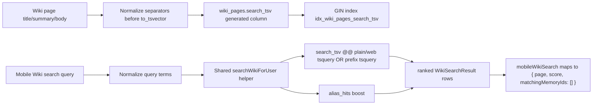

# fix: Mobile Wiki search uses flexible search_tsv matching

## Overview

Mobile device -> Wiki -> Search should return useful compiled wiki pages from the Postgres `wiki_pages.search_tsv` index, not behave like an exact-title or exact-token lookup. The current mobile resolver already references `search_tsv`, but it builds a strict `plainto_tsquery` condition directly in `mobileWikiSearch`. That leaves two gaps visible in the user's example: punctuation-combined lexemes like `cafe/restaurant` can fail when the user types one side of the compound, and prefix/partial inputs are brittle even though the compiled text clearly contains searchable terms such as `gogo`, `food`, `fresh`, `miami`, `beach`, and `empanada`.

This plan keeps the fast FTS architecture from the 2026-04-19 performance fix, strengthens tokenization and query construction, and routes mobile through the shared wiki search path so mobile, admin, and MCP-facing wiki search do not drift.

---

## Problem Frame

The mobile Wiki search surface is required to preserve the existing footer search behavior from the Browse requirements document (see origin: `docs/brainstorms/2026-04-20-mobile-wiki-browse-feature-requirements.md`, R12). It should remain Postgres FTS over compiled wiki pages, not Hindsight semantic recall.

Repo research shows:

- `packages/api/src/graphql/resolvers/memory/mobileWikiSearch.query.ts` already queries `p.search_tsv @@ plainto_tsquery('english', query)`, so the issue is not a total absence of `search_tsv`.
- `packages/api/src/lib/wiki/search.ts` is the shared helper used by `wikiSearch`; it has alias support but still uses `plainto_tsquery`.
- `packages/database-pg/src/schema/wiki.ts` defines `search_tsv` as `to_tsvector('english', title || summary || body_md)`, with a GIN index.
- The user's observed `search_tsv` value includes `'cafe/restaurant':4`, which implies punctuation-separated phrases are being indexed as combined lexemes instead of separately searchable words. A query for `restaurant` may therefore miss an otherwise obvious page.
- `packages/api/src/__tests__/mobile-wiki-search.test.ts` already guards the mobile FTS path and wire-shape compatibility, but does not cover punctuation-separated tokenization or prefix/flexible matching.

The plan should not reintroduce slow semantic recall. It should make the indexed lexical search behave like a mobile search box.

---

## Requirements Trace

- R1. Mobile Wiki search uses the persisted `wiki_pages.search_tsv` column as the primary match and rank source.
- R2. Searches for terms visible in compiled wiki text return the page even when the page text used punctuation-separated compounds, e.g. `restaurant` should match text indexed from `Cafe/Restaurant`.
- R3. Searches support common mobile partial/prefix input without requiring exact full lexemes, e.g. `empan` can match `empanada` and `restaur` can match `restaurant`.
- R4. Multi-term searches remain precise enough for browse search: matching should prefer pages containing all normalized terms, with alias matches included and boosted.
- R5. The resolver preserves strict `(tenant_id, owner_id)` scoping and active-page filtering.
- R6. The mobile GraphQL response shape stays compatible: `mobileWikiSearch` continues returning `{ page, score, matchingMemoryIds }`.
- R7. Empty search still falls back to `recentWikiPages`; no client-side exact-match filtering is introduced.
- R8. Documentation no longer describes `mobileWikiSearch` as Hindsight semantic recall when the implementation is FTS.

**Origin flows:** R12 Search Coexistence from `docs/brainstorms/2026-04-20-mobile-wiki-browse-feature-requirements.md`.

---

## Scope Boundaries

- Do not replace FTS with Hindsight semantic recall, Bedrock embeddings, OpenSearch, or pgvector.
- Do not add fuzzy semantic ranking or typo tolerance beyond token normalization, prefix matching, and existing alias matching.
- Do not change the mobile Wiki search UI unless investigation finds client-side filtering that prevents server results from rendering.
- Do not change `recentWikiPages` behavior.
- Do not broaden visibility beyond the current user-scoped wiki invariant.

### Deferred to Follow-Up Work

- Full semantic wiki retrieval: deferred to a separate retrieval-quality effort; the 2026-04-26 knowledge-reachability requirements explicitly keep wiki search lexical for v1.
- Search snippets/highlighting via `ts_headline`: useful polish, not needed to fix missing results.
- Typo tolerance via trigram similarity: consider later if users search misspellings; do not add it in this fix.

---

## Context & Research

### Relevant Code and Patterns

- `packages/api/src/graphql/resolvers/memory/mobileWikiSearch.query.ts` -- mobile resolver currently does a direct FTS query and maps rows to the legacy mobile response shape.
- `packages/api/src/lib/wiki/search.ts` -- reusable `searchWikiForUser` helper used by `wikiSearch`; best place to centralize alias boost and flexible FTS query behavior.
- `packages/api/src/graphql/resolvers/wiki/wikiSearch.query.ts` -- admin-facing resolver already delegates to `searchWikiForUser`.
- `packages/database-pg/src/schema/wiki.ts` -- `search_tsv` generated column and `idx_wiki_pages_search_tsv` GIN index.
- `packages/database-pg/drizzle/` -- hand-rolled migrations require `-- creates:` / `-- creates-column:` markers when they are not registered in Drizzle's journal; schema-expression changes should be planned carefully.
- `packages/api/src/__tests__/mobile-wiki-search.test.ts` -- existing mobile resolver tests for empty input, auth, FTS path, limit clamping, timestamp coercion, and no-Hindsight regression.
- `packages/react-native-sdk/src/hooks/use-mobile-memory-search.ts` and `apps/mobile/components/wiki/WikiList.tsx` -- client passes the trimmed query to `mobileWikiSearch` and renders returned hits; no obvious exact client filter by inspection.

### Institutional Learnings

- `docs/solutions/best-practices/mobile-sub-screen-headers-use-detail-layout-2026-04-23.md` is mobile UI-specific but not relevant to this backend search fix.
- `docs/brainstorms/2026-04-26-user-knowledge-reachability-and-knowledge-pack-requirements.md` records that wiki search remains lexical Postgres FTS for v1; semantic retrieval is explicitly outside this task.
- `docs/plans/2026-04-19-007-fix-mobile-wiki-search-performance-plan.md` is the predecessor plan: it moved mobile search off Hindsight and onto `search_tsv` for speed, while deferring alias-aware/mobile breadth.

### External References

- External research skipped. Existing repo patterns and PostgreSQL FTS usage in the codebase are sufficient; the fix should be grounded in current schema, migrations, and resolver behavior.

---

## Key Technical Decisions

- Centralize flexible wiki search in `searchWikiForUser`: Mobile should call the same shared helper as `wikiSearch` so alias boost, `search_tsv` matching, ranking, and future tuning have one source of truth.
- Keep `search_tsv` as the primary index: The fix should improve how the generated tsvector tokenizes page text and how queries are converted into tsquery; it should not fall back to broad `ILIKE` scans for core matching.
- Normalize punctuation before indexing: Separator-heavy text such as `Cafe/Restaurant` should contribute separate lexemes (`cafe`, `restaurant`) to `search_tsv`. The database expression is the right layer because every caller benefits and the GIN index remains usable.
- Add prefix tsquery matching as a complement to plain/web search matching: Mobile search should tolerate common partial input while keeping all-term precision for multi-word queries.
- Preserve mobile's response contract: `mobileWikiSearch` may internally reuse `searchWikiForUser`, but it should continue returning `matchingMemoryIds: []` rather than exposing admin-only `matchedAlias`.

---

## Open Questions

### Resolved During Planning

- Should this switch mobile back to Hindsight recall? No. The existing product and performance direction says mobile Wiki search is lexical FTS over compiled pages.
- Is this purely a mobile client bug? No. The mobile client sends the query and renders returned hits; the brittle behavior lives in server-side query construction and tsvector tokenization.
- Should admin `wikiSearch` receive the same matching improvements? Yes, by improving `searchWikiForUser`; this keeps parity instead of special-casing mobile.

### Deferred to Implementation

- Exact tsquery builder details: choose the smallest safe helper that parameterizes user input, handles apostrophes and punctuation, and avoids raw tsquery syntax injection.
- Exact migration shape for changing the generated column expression: confirm whether the existing generated column can be altered directly in the target Postgres version or must be dropped/recreated with its GIN index.
- Whether prefix matching should apply to every token or only the final token: default plan is every normalized token for mobile usefulness; implementation can tighten if tests show ranking noise.

---

## High-Level Technical Design

> _This illustrates the intended approach and is directional guidance for review, not implementation specification. The implementing agent should treat it as context, not code to reproduce._

---

## Implementation Units

- U1. **Normalize wiki search_tsv tokenization**

**Goal:** Ensure `wiki_pages.search_tsv` indexes punctuation-separated words as independently searchable lexemes while preserving the existing GIN-indexed generated-column architecture.

**Requirements:** R1, R2, R5.

**Dependencies:** None.

**Files:**

- Modify: `packages/database-pg/src/schema/wiki.ts`
- Create: `packages/database-pg/drizzle/0043_wiki_search_tsv_tokenization.sql`
- Test: `packages/api/src/__tests__/wiki-search.test.ts`

**Approach:**

- Update the generated `search_tsv` expression to normalize separator punctuation in the concatenated `title`, `summary`, and `body_md` text before calling `to_tsvector('english', ...)`.
- Preserve the column name `search_tsv` and index name `idx_wiki_pages_search_tsv` so callers keep using the same search surface.
- Write the migration as a deliberate schema change that rebuilds the generated column/index safely for deployed Aurora Postgres.
- Include drift-reporting markers if the migration is hand-rolled outside Drizzle's journal.
- Keep scoping and status filters outside the generated column; `search_tsv` remains text-only.

**Execution note:** Characterize the current tokenization first with the user's example (`GoGo Fresh Food Cafe/Restaurant ... Miami Beach ... empanada`) so the migration proves the exact failure mode before changing the expression.

**Patterns to follow:**

- `packages/database-pg/src/schema/wiki.ts` existing generated column and GIN index definition.
- Existing hand-rolled migration headers in `packages/database-pg/drizzle/0016_wiki_schema_drops.sql`, `0017_wiki_places.sql`, and `0036_user_scoped_memory_wiki.sql`.

**Test scenarios:**

- Happy path: a page body containing `Cafe/Restaurant` produces searchable lexemes for both `cafe` and `restaurant`.
- Happy path: the sample page containing `GoGo`, `Fresh`, `Food`, `Miami Beach`, and `empanada` can be matched by each individual normalized term.
- Edge case: apostrophes and punctuation in page titles do not produce invalid tsvector values.
- Edge case: null `summary` or `body_md` still indexes `title` without error.
- Integration: the GIN index remains on `search_tsv` after the migration and query plans can use it for `@@` matching.

**Verification:**

- The generated column expression and migration both produce separate terms for punctuation-separated compounds.
- Existing callers still reference `wiki_pages.search_tsv` unchanged.

---

- U2. **Centralize flexible FTS query behavior in searchWikiForUser**

**Goal:** Make the shared wiki search helper support normalized full-term and prefix matching against `search_tsv`, with alias boost preserved.

**Requirements:** R1, R2, R3, R4, R5.

**Dependencies:** U1.

**Files:**

- Modify: `packages/api/src/lib/wiki/search.ts`
- Test: `packages/api/src/__tests__/wiki-search.test.ts`
- Test: `packages/api/src/__tests__/mobile-wiki-search.test.ts`

**Approach:**

- Keep `searchWikiForUser` as the canonical helper for `(tenantId, userId, query, limit)`.
- Normalize query text consistently with the tsvector normalization enough that punctuation and slashes in user input do not create brittle exactness.
- Build parameterized tsquery expressions for:
  - normal full-text matching for complete terms;
  - prefix matching for normalized terms, so partial mobile input can match indexed words;
  - alias hits, including existing exact/substring alias behavior.
- Score results from `search_tsv` matches and alias matches without letting alias-only substring hits hide stronger FTS matches.
- Preserve ordering by score descending, then `last_compiled_at DESC NULLS LAST`.

**Execution note:** Implement the query helper test-first because user input -> tsquery conversion is the riskiest part of this fix.

**Patterns to follow:**

- Existing `searchWikiForUser` SQL CTE shape in `packages/api/src/lib/wiki/search.ts`.
- Existing `mobileWikiSearch` SQL-assertion tests that inspect the mocked `sql` template without requiring a live database.

**Test scenarios:**

- Happy path: query `restaurant` matches a page whose indexed text came from `Cafe/Restaurant`.
- Happy path: query `empan` matches a page containing `empanada` through prefix FTS.
- Happy path: query `miami beach` ranks a page containing both terms above a page containing only one term, if one-term fallback is retained at all.
- Happy path: alias-only match still returns a page with a positive boosted score.
- Edge case: query `Dake's Shoppe` or similar apostrophe input is safely parameterized and does not require callers to write tsquery syntax.
- Edge case: punctuation-only or whitespace-only query returns `[]` without executing broad search SQL.
- Error path: no result from FTS or aliases returns `[]`, not null and not an exception.
- Integration: SQL still filters by `p.tenant_id`, `p.owner_id`, and `p.status = 'active'` before returning rows.

**Verification:**

- The helper's SQL clearly uses `p.search_tsv @@ ...` for the primary match path.
- Admin `wikiSearch` behavior improves automatically because it already delegates to `searchWikiForUser`.

---

- U3. **Route mobileWikiSearch through the shared wiki search helper**

**Goal:** Remove mobile's duplicate direct FTS query and reuse `searchWikiForUser`, preserving mobile's legacy wire shape.

**Requirements:** R1, R3, R4, R5, R6, R7.

**Dependencies:** U2.

**Files:**

- Modify: `packages/api/src/graphql/resolvers/memory/mobileWikiSearch.query.ts`
- Test: `packages/api/src/__tests__/mobile-wiki-search.test.ts`

**Approach:**

- Keep `requireMemoryUserScope` as the mobile auth/scope gate, including legacy `agentId` compatibility.
- Keep empty/whitespace query short-circuit before any database work.
- Clamp limits as today.
- Call `searchWikiForUser({ tenantId, userId, query: trimmed, limit: cappedLimit })`.
- Map shared results into `{ page, score, matchingMemoryIds: [] }`.
- Do not expose `matchedAlias` through `MobileWikiSearchResult` unless a separate schema change is explicitly planned later.

**Patterns to follow:**

- `packages/api/src/graphql/resolvers/wiki/wikiSearch.query.ts` delegation style.
- Current `mobileWikiSearch.query.ts` response mapping and console logging.

**Test scenarios:**

- Happy path: mobile query `restaurant` returns the page produced by mocked `searchWikiForUser`, with `matchingMemoryIds: []`.
- Happy path: mobile query `empan` passes the trimmed query to `searchWikiForUser`.
- Edge case: empty and whitespace-only queries return `[]` without calling `searchWikiForUser`.
- Edge case: limit remains clamped to `MAX_LIMIT` and minimum `1`.
- Error path: caller/user mismatch still throws through `requireMemoryUserScope`.
- Integration: `getMemoryServices().recall` remains uncalled, preserving the FTS-only performance invariant.

**Verification:**

- Mobile resolver no longer has a separate raw SQL search implementation.
- Existing mobile client receives the same GraphQL fields as before.

---

- U4. **Verify mobile Wiki list renders server-ranked results without exact client filtering**

**Goal:** Confirm the mobile app renders whatever `mobileWikiSearch` returns and does not apply a secondary exact-match filter that would reintroduce the bug.

**Requirements:** R6, R7.

**Dependencies:** U3.

**Files:**

- Inspect: `packages/react-native-sdk/src/hooks/use-mobile-memory-search.ts`
- Inspect: `apps/mobile/components/wiki/WikiList.tsx`
- Modify only if needed: `packages/react-native-sdk/src/hooks/use-mobile-memory-search.ts`
- Modify only if needed: `apps/mobile/components/wiki/WikiList.tsx`

**Approach:**

- Keep this as a verification-first unit. Static inspection already suggests no client exact filter exists.
- If implementation finds a client-side filter, remove it so server-ranked results are authoritative.
- Preserve the current recent-pages behavior when search query is empty.

**Patterns to follow:**

- Current `useMobileMemorySearch` mapping from `mobileWikiSearch` to `WikiSearchHit`.
- Current `WikiList` branch between `search` and `recent`.

**Test scenarios:**

- Happy path: mocked server returns a hit whose title does not exactly equal the query; the row still renders.
- Happy path: clearing the query returns the list to `recentWikiPages`.
- Edge case: server returns `[]` for a non-empty query; mobile shows the existing "No wiki pages matching" empty state.
- Edge case: a result with `matchedAlias: null` still renders normally.

**Verification:**

- On simulator or device, search `restaurant`, `empan`, `miami`, and `beach` against the sample page; returned server hits appear in the Wiki list.

---

- U5. **Update docs and generated artifacts affected by search behavior**

**Goal:** Keep docs and generated GraphQL artifacts aligned with the actual FTS behavior.

**Requirements:** R8.

**Dependencies:** U3.

**Files:**

- Modify: `docs/src/content/docs/api/compounding-memory.mdx`
- Modify: `docs/src/content/docs/concepts/knowledge/compounding-memory-pages.mdx`
- Modify if GraphQL comments change: `packages/database-pg/graphql/types/memory.graphql`
- Regenerate if GraphQL comments/schema change: `apps/cli/src/gql/*`, `apps/admin/src/gql/*`, `apps/mobile/lib/gql/*`, and package-local generated files for `packages/api`

**Approach:**

- Replace stale documentation that says `mobileWikiSearch` uses Hindsight recall and reverse-joins memory sources.
- Describe mobile search as the same compiled-page FTS path as wiki search, with mobile preserving `matchingMemoryIds: []` for backward compatibility.
- Only edit GraphQL schema descriptions if they are inaccurate after the implementation; if schema descriptions change, run the repo's required codegen consumers.

**Patterns to follow:**

- Existing `docs/src/content/docs/concepts/knowledge/compounding-memory-pages.mdx` Search section.
- AGENTS.md GraphQL codegen guidance.

**Test scenarios:**

- Test expectation: none -- documentation-only unless GraphQL schema text changes.

**Verification:**

- Docs no longer contradict resolver behavior.
- If codegen ran, generated files reflect only schema/comment output changes and no runtime type drift.

---

## System-Wide Impact

- **Interaction graph:** Mobile Wiki -> SDK `MobileMemorySearchQuery` -> GraphQL `mobileWikiSearch` -> shared `searchWikiForUser` -> `wiki_pages.search_tsv` and `wiki_page_aliases`. Admin `wikiSearch` also uses the same helper and receives the same matching improvements.
- **Error propagation:** Auth/scope errors continue to come from `requireMemoryUserScope` on mobile and `assertCanReadWikiScope` on admin. Search misses return empty arrays.
- **State lifecycle risks:** Changing a generated column expression can rebuild `search_tsv` and its GIN index; rollout should account for migration duration and index recreation on deployed data.
- **API surface parity:** Mobile keeps its legacy `matchingMemoryIds` field; admin keeps `matchedAlias`. The shared backend helper aligns behavior without forcing schema parity.
- **Integration coverage:** Unit tests should prove query construction and resolver delegation; at least one deployed-stage smoke test should prove actual Postgres tokenization and index behavior for the user's sample terms.
- **Unchanged invariants:** FTS-only mobile search, user-scoped wiki pages, active-page filtering, empty-query recent feed, no Hindsight recall.

---

## Risks & Dependencies

| Risk                                                                                                                                      | Mitigation                                                                                                                                                                                                                                                     |
| ----------------------------------------------------------------------------------------------------------------------------------------- | -------------------------------------------------------------------------------------------------------------------------------------------------------------------------------------------------------------------------------------------------------------- |
| Generated column migration may require dropping/recreating `search_tsv` and the GIN index, which can be disruptive on larger wiki tables. | Confirm Aurora/Postgres DDL support during implementation, keep the migration explicit, and deploy through the normal pipeline. Wiki pages are derived and expected volume is manageable, but index rebuild should still be treated as a production migration. |
| Prefix matching can broaden results too much.                                                                                             | Keep all-term precision for multi-term queries, rank full-term matches above prefix-only matches, and cover representative sample queries in tests.                                                                                                            |
| Raw tsquery construction can break on apostrophes or punctuation.                                                                         | Build a small parameterized query-normalization helper and cover apostrophe, slash, punctuation-only, and whitespace inputs.                                                                                                                                   |
| Admin search behavior changes because the helper is shared.                                                                               | This is intentional parity, but tests should include alias boost and existing admin-like cases so behavior improves without regressing exact alias hits.                                                                                                       |
| Docs and generated GraphQL comments may drift again.                                                                                      | Update docs in the same PR and run codegen only if schema descriptions change.                                                                                                                                                                                 |

---

## Documentation / Operational Notes

- This change should ship through the normal PR-to-main deploy path because it touches GraphQL Lambda behavior and database schema/migration.
- The PR description should include the user's sample terms and smoke-test results for `restaurant`, `empan`, `miami`, and `beach`.
- If the migration is hand-rolled, run the manual migration drift reporter against dev after deploy so missing generated-column/index changes do not ship silently.

---

## Sources & References

- Origin document: [docs/brainstorms/2026-04-20-mobile-wiki-browse-feature-requirements.md](docs/brainstorms/2026-04-20-mobile-wiki-browse-feature-requirements.md)
- Related plan: [docs/plans/2026-04-19-007-fix-mobile-wiki-search-performance-plan.md](docs/plans/2026-04-19-007-fix-mobile-wiki-search-performance-plan.md)
- Related requirements: [docs/brainstorms/2026-04-26-user-knowledge-reachability-and-knowledge-pack-requirements.md](docs/brainstorms/2026-04-26-user-knowledge-reachability-and-knowledge-pack-requirements.md)
- Related code: `packages/api/src/graphql/resolvers/memory/mobileWikiSearch.query.ts`
- Related code: `packages/api/src/lib/wiki/search.ts`
- Related code: `packages/database-pg/src/schema/wiki.ts`
- Related tests: `packages/api/src/__tests__/mobile-wiki-search.test.ts`
