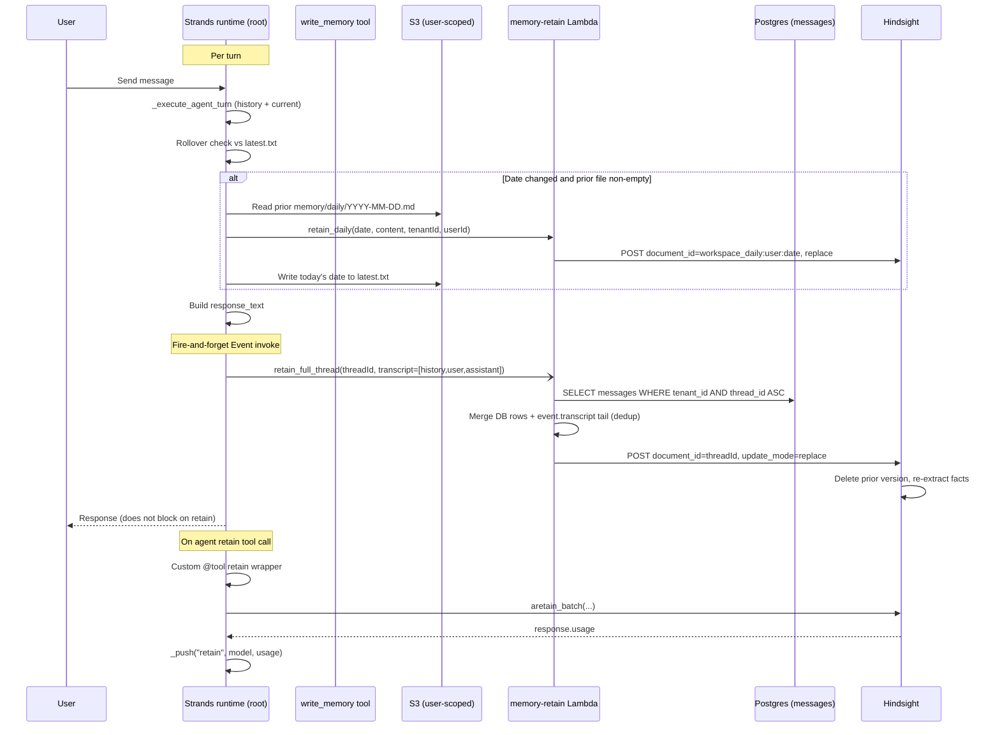

# Hindsight Ingest Reshape + Daily Workspace Memory + Strands Runtime Cleanup

## Overview

Three coordinated changes to how the Strands AgentCore runtime feeds Hindsight:

1. **Per-turn full-transcript upsert** — replace today's per-message fragmented retain with one full-transcript upsert per root turn, keyed by `document_id=threadId` with `update_mode=replace`. Sub-agent transcripts are not auto-retained.
2. **Daily workspace memory channel** — agent writes `memory/daily/YYYY-MM-DD.md` via the existing `write_memory` tool; runtime rolls over on the first turn of a new date and posts the prior day's file to Hindsight as a separate document.
3. **Strands runtime tool cleanup** — replace `hindsight_usage_capture.install()` module-level monkey-patches with custom `@tool` wrappers that capture Bedrock usage in-body via `_push(...)`. Keep `install_loop_fix()` as-is (vendor SDK bug workaround on a separate axis).

Plus a one-shot wipe-and-reload migration that drops the legacy fragmented Hindsight items so the new shape is the only shape after deployment.

This plan supersedes both predecessor plans (`docs/plans/2026-04-24-001-refactor-user-scope-memory-and-hindsight-ingest-plan.md` and `docs/plans/2026-04-27-001-feat-hindsight-retain-lifecycle-plan.md`), neither of which had units shipped. The 4/24 plan's broader user-scope schema cascade (wiki FK flip, threads dual-keyed, GraphQL/admin/mobile cascade) is **deferred to a follow-up plan** — see Scope Boundaries.

---

## Problem Frame

The Strands runtime currently retains memory in three broken ways that compound (see origin `docs/brainstorms/2026-04-27-hindsight-ingest-and-runtime-cleanup-requirements.md`):

1. **Per-turn fragmentation with no `document_id`.** Every turn becomes its own Hindsight document via `retain_turn_pair` → `retainTurn` (per-message split at `packages/api/src/lib/memory/adapters/hindsight-adapter.ts:190-200`). Hindsight's docs explicitly require a full conversation as a single item; the current behavior creates N documents per thread, charges N retain-LLM extractions, and prevents cross-turn extraction context.
2. **No daily working memory channel.** The agent has no convention for distilling "what mattered today" into Hindsight as a high-signal document. The existing topic-based `memory/lessons.md` etc. files never close a daily loop.
3. **Vendored monkey-patches.** `hindsight_usage_capture.install()` patches four `Hindsight` methods at module scope to capture Bedrock token usage. This is structural debt: it fights the Strands SDK's tool-wrapper extension model and will silently break on a `hindsight-client` upgrade.

Adapter-side machinery for the right shapes already exists (`retainConversation`, `retainDailyMemory`, `user_${userId}` bank resolution — verified in research). The runtime hasn't switched to using them, the daily-memory writer hasn't been built, and the monkey-patches haven't been retired.

This plan ships the runtime side end-to-end so the broken behaviors are gone for v1.

---

## Requirements Trace

All R-IDs reference `docs/brainstorms/2026-04-27-hindsight-ingest-and-runtime-cleanup-requirements.md`.

- **R1.** Single item per conversation (not per message) — addressed by U1, U3.
- **R2.** `document_id=threadId`, `update_mode="replace"` — addressed by U1 (already in the adapter; this plan ensures the runtime exercises it).
- **R3.** `"<role> (<ts>): <text>"` content format, empty messages dropped — addressed by U1 (already implemented in `retainConversation`).
- **R4.** Per-turn trigger, no buffering — addressed by U2, U3.
- **R5.** Pass full conversation history from the invocation payload — addressed by U1 (Lambda full-thread fetch + tail merge), U3.
- **R6.** Sub-agent invocations do not trigger thread upsert — addressed by U3 (call site stays in `do_POST`, not `_execute_agent_turn`).
- **R7.** Upsert failure does not block the agent response — addressed by U2 (fire-and-forget Event invoke), U3.
- **R8.** Meaningful `context` literals + metadata — addressed by U1 (adapter already does this).
- **R9.** `memory/daily/YYYY-MM-DD.md` convention via `write_memory` — addressed by U4, U5.
- **R10.** "Daily working memory" `MEMORY_GUIDE.md` section — addressed by U5.
- **R11.** Activity-triggered rollover hook against `memory/daily/latest.txt` — addressed by U6, U7.
- **R12.** Idempotent rollover (replace-in-place, empty no-op, crash-safe) — addressed by U6, U7.
- **R13.** User-scoped S3 prefix for `memory/daily/*` — addressed by U4 (write path) and U6 (rollover read path).
- **R14.** Bedrock usage from agent-driven retain via Strands hooks (not module-level patch) — addressed by U8 with the in-body wrapper variant chosen over `AfterToolInvocationEvent`. See Key Technical Decisions.
- **R15.** Bedrock usage from runtime-driven retain captured at the call site — addressed by U2 / U3 (Lambda owns the cost-events sink as today; no per-turn-upsert usage rises into the runtime).
- **R16.** `hindsight_usage` shape `[{phase, model, input_tokens, output_tokens}]` unchanged — addressed by U8, U9, U10.
- **R17.** `install()` removed; `install_loop_fix()` kept — addressed by U10.
- **R18.** User-scoped retain payloads + `user_${userId}` bank — already shipped on the adapter side; verified by U3 manual smoke check.
- **R19.** Wipe-and-reload migration drops legacy fragmented items — addressed by U11.
- **R20.** `api_memory_client.py` stops calling per-message retain — addressed by U2 (replaces / removes `retain_turn_pair`).
- **R21.** Operator can map `thread_id` → 0 or 1 Hindsight document — addressed by U3 verification.
- **R22.** Agent-callable `retain` tool kept — addressed by U8 (custom wrapper preserves the agent surface).
- **R23.** `recall` and `reflect` wrappers unchanged in shape — addressed by U9 (only adds usage push to reflect; doesn't change behavior).

**Origin actors:** A1 (Strands runtime — root, `_execute_agent_turn`), A2 (Strands runtime — sub-agent), A3 (Agent model), A4 (`memory-retain` Lambda), A5 (Hindsight service), A6 (Human user — rollover boundary frame).

**Origin flows:** F1 (per-turn thread upsert), F2 (daily workspace memory rollover), F3 (agent-driven explicit retain), F4 (sub-agent isolation).

**Origin acceptance examples:** AE1 (covers R1–R3, R5), AE2 (R4 — per-turn cadence), AE3 (R6 — sub-agent isolation), AE4 (R14, R16, R22 — usage capture via wrapper), AE5 (R7 — failure non-blocking), AE6 (R11, R12 — daily rollover idempotent), AE7 (R10 — agent discipline on daily file), AE8 (R21 — operator observability).

---

## Scope Boundaries

- **Not flipping the broader user-scope schema.** The 4/24 plan's wiki FK flip, `threads.user_id` dual-key, `users.wiki_compile_external_enabled` flag, GraphQL/admin/mobile user-scope cascade are **out of scope** for this plan. Hindsight bank derivation is already user-scoped via the legacy `agents.human_pair_id` fallback (verified in research at `packages/api/src/lib/memory/adapters/hindsight-adapter.ts:437`), so the ingest reshape doesn't depend on the schema flip. See `### Deferred to Follow-Up Work`.
- **Not introducing buffering, idle thresholds, or boundary flush.** Per-turn upsert is the simplification (origin R4). Cost premium accepted; pre-vetted mitigations (sampled checkpoints, append-mode hybrid) are on file in origin Dependencies.
- **Not changing AgentCore managed memory.** Separate engine adapter, different semantics, not broken.
- **Not preserving today's per-message Hindsight items.** The wipe-and-reload migration drops them (U11).
- **Not adding runtime auto-distill for daily memory.** Agent writes the file or nothing does. No new runtime LLM cost.
- **Not adding scheduled rollover (cron / EventBridge).** Activity-triggered only.
- **Not introducing per-thread-per-day documents.** A thread is one document for its lifetime.
- **Not exposing rollover or retain controls as user-facing toggles.** Admin owns infra (`feedback_user_opt_in_over_admin_config`).
- **Not building hierarchical daily → weekly → monthly promotion.** That's `docs/brainstorms/2026-04-19-compounding-memory-hierarchical-aggregation-requirements.md`.
- **Not refactoring `recall`, the agent-callable `retain` tool semantics, or the `_run_async` loop fix.** `install_loop_fix()` stays in `hindsight_usage_capture.py` (origin R17).
- **Not touching `chat-agent-invoke` or `cost_events` schema.** R16 freezes the `hindsight_usage` contract.
- **Not touching the Pi parallel-substrate runtime** (`project_pi_runtime_parallel_decision`). Pi ships its own retain integration.
- **Not re-evaluating Hindsight as the brain.** The 2026-04-27 brain-engine session settled on stay-and-watch.

### Deferred to Follow-Up Work

- **Broader user-scope schema cascade** (originally 4/24 plan U1–U7 + U9a): Postgres migration to flip wiki FKs to `users`, dual-key `threads` with `user_id`, add `users.wiki_compile_external_enabled`; GraphQL schema + resolver + clients to user-scope; mobile + admin UI flip; in-container Hindsight bank unification. **Why deferred:** Hindsight bank derivation is already user-scoped via the existing legacy fallback, so the ingest reshape works without it. **What changes for the 4/24 plan:** rather than supersede in full, this plan supersedes only the daily-memory + retain-reshape + wipe pieces. The 4/24 plan's frontmatter flips to `status: paused` (not `superseded`) with a re-evaluation trigger: "revisit when `agents.human_pair_id` fallback is the next refactor target, or when `wiki_*` tables need a multi-agent overhaul, or by 2026-Q3, whichever comes first." This prevents the schema cascade from silently dying. **Concretely:** edit the 4/24 plan's frontmatter to `status: paused`, add a `paused-by-plan: docs/plans/2026-04-27-002-feat-hindsight-ingest-and-runtime-cleanup-plan.md` field, and add the trigger note at the top.
- **Thread deletion lifecycle in Hindsight** (new — surfaced by adversarial review): Today's per-message Hindsight items had no deletion hook from `threads` deletion (user-initiated delete, retention policy, GDPR request). After this plan ships, a 50-turn thread document hangs around in Hindsight indefinitely keyed by `threadId`. Out of scope here; explicitly listed as a follow-up. Triggered by the first GDPR/retention-policy request that needs Hindsight cleanup.
- **`hindsight-client` SDK upgrade to retire `install_loop_fix()`.** Separate dependency-upgrade PR (origin R17).
- **MCP edge integration** (originally 4/24 plan U7): paused per `project_mcp_next_steps`. Doc-only follow-up when unpaused.

---

## Context & Research

### Relevant Code and Patterns

- `packages/agentcore-strands/agent-container/container-sources/server.py:1819` — `_execute_agent_turn(payload)`; transcript built from `payload["messages_history"]` (line 1938-1951).
- `packages/agentcore-strands/agent-container/container-sources/server.py:2185` — Only retain call site today (`do_POST` chat handler). This is the seam to swap in U3.
- `packages/agentcore-strands/agent-container/container-sources/api_memory_client.py:29` — `retain_turn_pair`, `InvocationType="Event"` fire-and-forget.
- `packages/agentcore-strands/agent-container/container-sources/api_memory_client.py:89` — `retain_conversation` exists, currently unused in production.
- `packages/agentcore-strands/agent-container/container-sources/api_memory_client.py:114` — `retain_daily` exists, currently unused.
- `packages/api/src/handlers/memory-retain.ts:40` — Router accepts both legacy `messages` and new `transcript` / `kind:daily` payloads.
- `packages/api/src/lib/memory/adapters/hindsight-adapter.ts:221-247` — `retainConversation` already implements `document_id=threadId`, `update_mode="replace"`, role-prefixed transcript.
- `packages/api/src/lib/memory/adapters/hindsight-adapter.ts:249-271` — `retainDailyMemory` already implements `document_id=workspace_daily:${ownerId}:${date}`, `update_mode="replace"`.
- `packages/agentcore-strands/agent-container/container-sources/hindsight_tools.py:43` — `make_hindsight_tools` registration site; existing `hindsight_recall` and `hindsight_reflect` async wrappers (lines 92-232) are the pattern to mirror for U8.
- `packages/agentcore-strands/agent-container/container-sources/hindsight_usage_capture.py:51-67, 198-209` — `_push` / `drain` / `reset` helpers preserved across the cleanup; `install()` (lines 70-150) is what U10 deletes.
- `packages/agentcore-strands/agent-container/container-sources/write_memory_tool.py:59-62, 176` — `write_memory` tool definition and allowlist regex; allowlist needs extension for `memory/daily/YYYY-MM-DD.md`.
- `packages/api/src/handlers/chat-agent-invoke.ts:617-656` — Hindsight cost-events sink reads `hindsight_usage` and writes to `cost_events`. R16 contract.
- `packages/database-pg/src/schema/core.ts:203` — `users.timezone` (nullable IANA string). Available for U6 rollover boundary.
- `packages/workspace-defaults/files/MEMORY_GUIDE.md` — canonical guide; new "Daily working memory" section lands here in U5. **Note:** package is `workspace-defaults`, not `system-workspace` (CLAUDE.md is stale on this name).
- `packages/workspace-defaults/src/index.ts` — inlined string constants must be updated whenever the `.md` files change (per learning, see below).
- `packages/database-pg/drizzle/` — highest existing migration `0043`; next is `0044`.

### Institutional Learnings

- `docs/solutions/workflow-issues/agentcore-completion-callback-env-shadowing-2026-04-25.md` — Strands/botocore can transiently shadow `THINKWORK_API_URL` / `API_AUTH_SECRET` mid-turn. Snapshot env at coroutine entry; pass through. Applies to the daily-memory rollover and any post-turn HTTP path. (Already a feedback memory: `feedback_completion_callback_snapshot_pattern`.)
- `docs/solutions/workflow-issues/manually-applied-drizzle-migrations-drift-from-dev-2026-04-21.md` — wipe scripts go hand-rolled; declare `-- creates: public.X` markers; gated by `db:migrate-manual` reporter in `deploy.yml`. (Note: U11's wipe is **not** a Drizzle migration; it's a one-shot script. But the gating principle informs operational handling.)
- `docs/solutions/workflow-issues/survey-before-applying-parent-plan-destructive-work-2026-04-24.md` — before the wipe in U11, run a fresh consumer survey of every Hindsight reader (recall callsites, eval harness, mobile/admin renderers, wiki-compile) to confirm no surface depends on the legacy item shape.
- `docs/solutions/architecture-patterns/inert-to-live-seam-swap-pattern-2026-04-25.md` — ship U2 inert (function exists, tests pass, no caller); U3 swaps the call site live. Validates contract before flipping behavior. (`feedback_ship_inert_pattern`.)
- `docs/solutions/patterns/apply-invocation-env-field-passthrough-2026-04-24.md` — pass full payloads through hooks; never reconstruct subset dicts that silently drop new fields. Applies to U6 rollover hook.
- `docs/solutions/workflow-issues/agentcore-runtime-no-auto-repull-requires-explicit-update-2026-04-24.md` — after deploy, verify AgentCore runtime `containerUri` matches the merged SHA via `aws bedrock-agentcore-control get-agent-runtime`. CI green ≠ runtime serving new code.
- `docs/solutions/workflow-issues/workspace-defaults-md-byte-parity-needs-ts-test-2026-04-25.md` — every `.md` edit in `packages/workspace-defaults/files/` requires a paired update to `packages/workspace-defaults/src/index.ts` and `pnpm --filter @thinkwork/workspace-defaults test`. Applies to U5.
- `docs/solutions/best-practices/bedrock-agentcore-sdk-version-drift-prefer-raw-boto3-2026-04-24.md` — pin Strands version; capture event/tool shape in fixtures so a future bump can't silently break ingest.

### External References

- Hindsight retain API: https://hindsight.vectorize.io/developer/api/retain — confirms `document_id` + `update_mode=replace` semantics ("delete previous version and reprocess from scratch") and the "full conversation as a single item" guidance.

---

## Key Technical Decisions

- **In-body `@tool` wrapper for retain usage capture, not Strands `AfterToolInvocationEvent`.** Origin R14 says "Strands hook, not module-level patch." The 4/27 plan settled on a custom async `@tool` wrapper that calls `aretain_batch` directly and pushes usage in-body via `_push("retain", retain_model, response.usage)`. **This plan adopts that approach** because (a) it doesn't depend on the unverified `AfterToolInvocationEvent` SDK surface, (b) it matches the existing `hindsight_recall` / `hindsight_reflect` async wrapper pattern (consistency), (c) the test fixture is simpler. The wrapper achieves R14's *intent* (no module-level monkey-patch) but at a **narrower coverage set** than a hook: the wrapper only fires for tools registered through `make_hindsight_tools`, while a hook would fire for every Hindsight tool call regardless of registration path.
- **Architectural invariant: all Hindsight tools route through `make_hindsight_tools`.** This is the load-bearing assumption that makes the in-body wrapper sufficient. No code path may register a Hindsight `retain` / `reflect` tool by another route (vendor SDK direct, MCP server, sub-agent's own factory, etc.). U8 + U9 own the wrappers; any future Hindsight surface must land via this factory. Code-review gate: PR comments flag any `hindsight_strands.tools.*` import outside `hindsight_tools.py`.
- **Per-turn upsert with idempotent `replace`, not buffer-and-flush.** Hindsight's `update_mode=replace` does dedup; the 4/24 plan's idle/threshold flush model added in-process state, crash-recovery rehydration, and configurable thresholds — all unnecessary. Cost premium accepted (origin Dependencies); mitigations pre-vetted.
- **Lambda owns the full-thread fetch.** The runtime sends the just-completed pair as `event.transcript`; the Lambda fetches the full transcript from the `messages` table (filtered by both `tenant_id` and `thread_id` for cross-tenant safety) and merges with the runtime tail. This survives the 30-turn `messages_history` cap in `chat-agent-invoke.ts:279` without lifting it. The merge handles the messages-table-commit-vs-Lambda-fire race.
- **`Event` invocation, not `RequestResponse`, for `retain_full_thread`.** Fire-and-forget preserves agent SLA. Cost-events for the per-turn upsert are captured at the Lambda level (existing path), not surfaced back to the runtime. Trade-off accepted in origin Outstanding Questions.
- **Activity-triggered daily rollover, no scheduled job.** First turn of a new date checks `memory/daily/latest.txt`; if a prior date is named with a non-empty file, ingest then advance the marker. Crash-mid-rollover replays safely (Hindsight `replace` is idempotent).
- **Daily-memory file lives at user-scoped S3 path, not agent-scoped.** Workspace daily memory is user-level by intent (origin R13). U4 extends `write_memory` to detect `memory/daily/*` and route to `tenants/{tenant}/users/{user}/workspace/memory/daily/...` (mirroring the existing user-scoped knowledge-pack key at `user_storage.py:35`). Other `memory/*.md` writes stay agent-scoped.
- **`write_memory` allowlist extended to permit `memory/daily/YYYY-MM-DD.md`.** Existing allowlist regex permits only three named files; daily memory needs a date-suffix pattern. Validate at write time; reject anything else under `memory/daily/`.
- **One-shot wipe script, not a Drizzle migration.** U11 is a TypeScript script run once during deploy that calls Hindsight's delete-document API for every `bank_id` matching `user_*` for items lacking `document_id`. Hand-rolled migrations are for Postgres state; Hindsight is external storage. Document with a `docs/solutions/` learning post-deploy.
- **Daily-memory `MEMORY_GUIDE.md` section ships with TS parity.** `packages/workspace-defaults/files/MEMORY_GUIDE.md` and `packages/workspace-defaults/src/index.ts` are kept in sync; the workspace-defaults vitest suite enforces parity.
- **Plan supersedes both predecessors but defers the broader user-scope schema cascade.** This plan owns the runtime ingest reshape + daily memory + monkey-patch cleanup. The 4/24 plan's schema work (wiki FK flip, threads dual-keyed, GraphQL/admin/mobile cascade) is split out — see Scope Boundaries and Risks.

---

## Open Questions

### Resolved During Planning

- **Runtime hook surface for usage capture.** Resolved: in-body `@tool` wrapper, not `AfterToolInvocationEvent`. Rationale in Key Technical Decisions.
- **Buffer-and-flush vs per-turn.** Resolved: per-turn (origin R4); 4/24 plan's flush model dropped.
- **Workspace S3 path for daily memory.** Resolved: user-scoped (`tenants/{tenant}/users/{user}/workspace/memory/daily/...`); mirrors knowledge-pack pattern.
- **Migration form for the legacy wipe.** Resolved: one-shot TypeScript script (not Drizzle); operationally gated by deploy step in U11.
- **Plan scope vs 4/24 schema cascade.** Resolved: defer schema cascade to a separate plan; this plan owns runtime ingest only.

### Deferred to Implementation

- Exact field name in `_execute_agent_turn` payload for prior history. Comment names it `messages_history`; verify in `_call_strands_agent` payload before U3.
- Whether to **rename** `retain_conversation` → `retain_full_thread` or add the new function alongside (U2). Default: rename (decisive over hybrid).
- Whether `users.timezone` is populated in dev for the rollover boundary. If null, U6 falls back to UTC with a code comment to revisit.
- Whether the post-deploy wipe (U11) runs as a CI step, an operator-triggered script, or a Lambda. Plan: operator-triggered with a deploy-runbook entry; CI step is over-automation for a one-shot.
- Exact wording of the new `MEMORY_GUIDE.md` "Daily working memory" section (U5). Draft phrasing at implementation time, voice-matched to existing sections.
- Allowlist regex for `memory/daily/YYYY-MM-DD.md` in `write_memory_tool.py`. Plan: extend the existing allowlist constant; exact regex picked at implementation.
- Whether `retain_turn_pair` is deleted or kept as deprecated (U2). Default: delete after U3 swap is verified.
- Whether `messages_history`'s 30-turn cap in `chat-agent-invoke.ts` should be lifted or left as-is. Default: leave; the Lambda's full-thread fetch (U1) provides the canonical transcript independently of `messages_history`.

---

## High-Level Technical Design

> *This illustrates the intended approach and is directional guidance for review, not implementation specification. The implementing agent should treat it as context, not code to reproduce.*

The runtime call site (`do_POST` in `server.py`, line 2185) stays where it is. Sub-agent isolation is preserved by the call site choice — `_execute_agent_turn` runs sub-agents internally, but `retain_full_thread` only fires from the outer chat handler.

---

## Implementation Units

### Phase A — Lambda + Strands runtime ingest swap

- U1. **Lambda full-thread fetch in `memory-retain`**

**Goal:** When `memory-retain` is invoked with a `threadId`, fetch the canonical full transcript from the `messages` table (tenant-scoped) and merge with the runtime-supplied tail before calling `adapter.retainConversation`.

**Requirements:** R1, R2, R3, R5, R8.

**Dependencies:** None.

**Files:**
- Modify: `packages/api/src/handlers/memory-retain.ts`
- Test: `packages/api/src/handlers/memory-retain.test.ts` (new)

**Approach:**
- After resolving `tenantId` / `userId` / `threadId` and the active engine adapter, if the adapter implements `retainConversation` AND `threadId` is present, call a new helper `fetchThreadTranscript(db, tenantId, threadId)` that returns `Array<{role, content, createdAt}>` in ASC order. **The SQL query MUST filter on BOTH `tenant_id` AND `thread_id`** to prevent confused-deputy attacks via forged `threadId`.
- Merge DB rows (canonical for committed turns) with `event.transcript` tail entries that aren't already in the DB rows. **Match by order-preserving `(role, content)` suffix overlap, not by timestamp.** Rationale: `createdAt` differs between runtime-stamped event entries and DB-writer-stamped rows; including timestamp in the dedup key produces phantom duplicates over long threads. Algorithm: walk the event tail; for each entry, if its `(role, content)` matches the next-expected position after the DB tail, consume it. Stop at the first non-match; append the rest. This is a strict suffix merge, not a set dedup. Closes the messages-commit-vs-Lambda-fire race without a stable message id.
- `retainConversation` already implements `document_id=threadId`, `update_mode=replace`, role/timestamp-prefixed lines, `context="thinkwork_thread"`, full metadata — no adapter change needed.
- Zero rows after merge → no-op return `{ ok: false, error: "no_content" }`.
- `kind: "daily"` events bypass the fetch; route to `retainDailyMemory` as today.
- Snapshot env at handler entry (`feedback_completion_callback_snapshot_pattern`).
- Logging hygiene: never include message content in logs; identifiers are prefix-truncated. Tenant anomaly is ERROR-level (DLQ alarm surface).

**Patterns to follow:**
- `packages/api/src/lib/memory/adapters/hindsight-adapter.ts:221-247` — `retainConversation` shape (no changes here).
- `packages/api/src/lib/memory/adapters/hindsight-adapter.test.ts` — vitest mock pattern (`vi.hoisted()` for `getDb`, `vi.spyOn(globalThis, "fetch")`).

**Test scenarios:**
- *Covers AE1, AE8.* Happy path: event `threadId=t123` + 32 messages in DB → adapter receives 32 messages in ASC order with `document_id=t123`.
- Happy path (merge race): DB has 30 msgs (turns 1-15), `event.transcript` has the latest pair (turn 16 not yet committed) → merged transcript is 32 messages.
- Happy path (dedup): DB has 32 msgs including the latest pair, `event.transcript` repeats it (same `role` + `content`, different `createdAt`) → merged stays 32. No double counting. **Pins the timestamp-agnostic suffix-match contract.**
- Happy path (timestamp skew regression): DB and event tail have the same final `(role, content)` pair but timestamps drift by 50ms → suffix match still consumes the event entry. Document does not grow duplicates over a 30-turn run.
- Edge case (legitimate user repetition): user types "ok" three times across three turns → DB has all three; if event tail repeats the third `("user", "ok")`, suffix match catches it; assistant responses between them prevent collapse of legitimate repeats earlier in the thread.
- Happy path (new thread): event with `threadId` and 0 DB rows but non-empty `event.transcript` → adapter receives event tail; warning logged.
- **Tenant-scope rejection (security regression guard):** `threadId=T-X` belongs to tenant B but event carries `tenantId=A` → `fetchThreadTranscript` returns zero rows due to the WHERE filter. Falls through to event tail (which has A's content). No cross-tenant leak.
- Tenant anomaly defense-in-depth: injected mismatched rows → ERROR log + `{ ok: false, error: "tenant_anomaly" }` without calling adapter.
- *Covers daily routing.* `kind: "daily"` event → bypasses fetch; calls `retainDailyMemory`.
- AgentCore engine fallback: adapter without `retainConversation` → falls back to today's `retainTurn` (engine isolation).
- Edge case: empty event.transcript AND zero DB rows → no-op return.
- Error path: DB throws → catch + warning + fallback to event.transcript; never propagate.
- Integration: 100+ message merge — no silent capping (no cap imposed by this plan).
- Error path: adapter throws on `retainConversation` (5xx) → handler returns `{ ok: false, error }`.

**Verification:**
- `pnpm --filter @thinkwork/api test memory-retain` passes.
- **Before merging U1**, run a `replace`-semantics smoke against dev Hindsight: POST two identical `retainConversation` calls back-to-back; assert one document survives in the bank AND extraction was redone (verify by checking extracted-fact timestamps). Pins origin Dependencies "[Unverified]" flag on Hindsight `update_mode=replace` semantics.
- Manual dev: thread to 5 / 30 / 50 turns → query Hindsight bank by `document_id=threadId` → one document with full transcript at each checkpoint.

---

- U2. **`retain_full_thread` in `api_memory_client.py`**

**Goal:** Add the runtime-side bridge to invoke `memory-retain` with `{tenantId, userId, threadId, transcript}` as fire-and-forget Event. Replaces `retain_turn_pair` once U3 swaps the call site.

**Requirements:** R4, R5, R7, R20.

**Dependencies:** None for landing inert. U1 should land first so production behavior is correct when U3 flips the seam.

**Files:**
- Modify: `packages/agentcore-strands/agent-container/container-sources/api_memory_client.py`
- Test: `packages/agentcore-strands/agent-container/test_api_memory_client.py` (new)

**Approach:**
- Add `retain_full_thread(thread_id, transcript, tenant_id=None, user_id=None) -> bool`. Snapshot env at entry (`MEMORY_RETAIN_FN_NAME`, `TENANT_ID` / `_MCP_TENANT_ID`, `USER_ID` / `CURRENT_USER_ID`).
- Reject early (debug log + return `False`) if any required field is missing.
- Payload `{"tenantId", "userId", "threadId", "transcript": list(transcript)}` — no `agentId` (user-scoped).
- `InvocationType="Event"`. Wrap in `try/except Exception` returning `False` with a warning; never raise.
- **Decision:** Rename existing `retain_conversation` to `retain_full_thread` (the existing fn is unused per research); delete `retain_turn_pair` after U3 verifies. Decisive over hybrid.

**Execution note:** Test-first. Land the function with passing tests in this unit; the chat handler still uses `retain_turn_pair` until U3.

**Patterns to follow:**
- Existing `retain_turn_pair` (lines 29-86) for shape, minus per-message split, minus `agentId`.
- Existing `retain_conversation` (lines 89-111) for payload form; switch invocation type to Event.

**Test scenarios:**
- *Covers AE1.* Happy path: env populated, valid 5-msg transcript → boto3 invoke called once with `InvocationType="Event"`, correct payload. Returns `True`.
- Happy path (large): 50-msg transcript → no truncation.
- Edge case: `thread_id=""` → returns `False`, no boto3 call.
- Edge case: `transcript=[]` → returns `False`.
- Edge case: env unset → returns `False`, debug log only.
- *Covers AE5.* Error path: boto3 raises → returns `False` with warning; never propagates.
- Snapshot regression: env mutated between snapshot and invoke → snapshot value used. Mirror `feedback_completion_callback_snapshot_pattern`.

**Verification:**
- `uv run pytest packages/agentcore-strands/agent-container/test_api_memory_client.py` passes.
- **Before deletion of `retain_turn_pair`:** `grep -rn "retain_turn_pair" packages/agentcore-strands/` enumerates ALL call sites; verify each is either swapped (U3) or in test files. Don't trust `feedback_diff_against_origin_before_patching` — actively grep before deletion.
- `grep -r "retain_turn_pair" packages/agentcore-strands/` after U3 + U2 cleanup returns zero hits (except CHANGELOG-style references, if any).

---

- U3. **Swap `do_POST` chat handler to `retain_full_thread`**

**Goal:** Replace the per-turn `retain_turn_pair` call at `server.py:2185` with `retain_full_thread(thread_id, transcript, tenant_id, user_id)` where transcript is `messages_history + [user, assistant]`. Live behavior change.

**Requirements:** R1, R4, R5, R6, R7, R20.

**Dependencies:** U1, U2.

**Files:**
- Modify: `packages/agentcore-strands/agent-container/container-sources/server.py` (lines ~2173-2193)
- Test: `packages/agentcore-strands/agent-container/test_server_chat_handler_retain.py` (new — focused contract test mocking `api_memory_client.retain_full_thread`)

**Approach:**
- Build `transcript`: validated `messages_history` + `{role:"user", content:message}` + `{role:"assistant", content:response_text}`.
- Call `api_memory_client.retain_full_thread(thread_id=ticket_id, transcript=transcript, tenant_id=tenant_id, user_id=user_id)`. Resolve `user_id` from existing identity env (`USER_ID` / `CURRENT_USER_ID`).
- Keep the outer `try/except retain_err: logger.warning(...)` block (defense-in-depth, mirrors today's pattern).
- **Do NOT move this into `_execute_agent_turn`.** The `do_POST` location IS the sub-agent isolation mechanism (R6). Sub-agents that run inside `_execute_agent_turn` do not see this code path.
- Remove the import of `retain_turn_pair` if U2 deleted it.

**Execution note:** Land alongside a mock-based contract test asserting exact `(thread_id, transcript=[...], tenant_id, user_id)` arguments. Don't rely on existing server tests catching this.

**Patterns to follow:**
- Existing `try/except` block at `server.py:2183-2193`.
- Skill-dispatch path's NON-call to retain (`run_skill_dispatch.py:454`) — confirms call site choice.

**Test scenarios:**
- *Covers AE1.* Happy path: 3-turn thread → `retain_full_thread` called with transcript length 6, correct ordering.
- Happy path: brand-new thread (history empty) → transcript length 2.
- Edge case: missing `messages_history` → empty list assumed; transcript = [user, assistant].
- Edge case: non-user/assistant roles in history → already filtered upstream; transcript only contains user/assistant.
- Edge case: empty `response_text` → still calls retain with the user message.
- *Covers AE5.* Error path: `retain_full_thread` raises (shouldn't, given U2's contract) → outer try/except logs warning; response still returned.
- *Covers AE3.* Sub-agent regression: turn that includes `delegate_to_workspace_tool` internally → `retain_full_thread` called exactly ONCE per outer turn, not once per sub-agent invocation.
- Skill-run path (`run_skill_dispatch`) → `retain_full_thread` NOT called.

**Verification:**
- All existing server tests pass.
- `grep "retain_turn_pair" packages/agentcore-strands/agent-container/` returns zero hits (assuming U2 deletion).
- *Covers AE8.* Manual dev smoke: 5-turn thread → exactly one Hindsight document for that thread, full transcript content present, `bank_id="user_<userId>"`.

---

### Phase B — Daily workspace memory channel

- U4. **Extend `write_memory` allowlist + user-scoped routing for `memory/daily/*`**

**Goal:** Permit the agent to write `memory/daily/YYYY-MM-DD.md` via the existing `write_memory` tool. Route `memory/daily/*` writes to the user-scoped S3 prefix (mirroring the knowledge-pack pattern), keeping other `memory/*.md` writes agent-scoped as today.

**Requirements:** R9, R13.

**Dependencies:** None.

**Files:**
- Modify: `packages/agentcore-strands/agent-container/container-sources/write_memory_tool.py` (allowlist regex + path resolution)
- Modify: `packages/agentcore-strands/agent-container/container-sources/user_storage.py` (new helper for user-scoped daily-memory key, mirroring `user_knowledge_pack_key`)
- Test: extend `packages/agentcore-strands/agent-container/test_write_memory_tool.py`

**Approach:**
- Extend the allowlist regex (currently permits only `memory/{lessons|preferences|contacts}.md`) to also permit `memory/daily/\d{4}-\d{2}-\d{2}\.md`. Reject anything else under `memory/daily/`.
- When path matches `memory/daily/*`, resolve target S3 key as `tenants/{tenant_id}/users/{user_id}/workspace/memory/daily/<filename>` (new helper in `user_storage.py`).
- All other `memory/*.md` writes continue to use the agent-scoped prefix.
- Snapshot env at tool entry (env-shadowing pattern).
- Markdown append semantics if the target already exists (read existing → append → write); first write creates with the appended content. Idempotent: same content appended twice produces the same document because Hindsight rollover ingests by replace.

**Patterns to follow:**
- `user_storage.py:35` — `user_knowledge_pack_key` shape.
- Existing `write_memory` validation flow.

**Test scenarios:**
- *Covers AE7.* Happy path: agent calls `write_memory("memory/daily/2026-04-27.md", "- learning bullet")` → S3 key `tenants/<tid>/users/<uid>/workspace/memory/daily/2026-04-27.md`, content = the bullet.
- Happy path (append): two writes to the same day → second write produces concatenation (markdown append).
- Edge case: `memory/daily/badname.md` → reject with validation error.
- Edge case: `memory/daily/2026-04-27.txt` → reject (must be `.md`).
- Edge case: `memory/lessons.md` → still routes to agent-scoped path (unchanged).
- Snapshot regression: env mutated between entry and S3 write → snapshot value used.

**Verification:**
- `uv run pytest packages/agentcore-strands/agent-container/test_write_memory_tool.py` passes.
- Manual dev: agent writes to `memory/daily/<today>.md` → S3 object exists at the user-scoped prefix.

---

- U5. **`MEMORY_GUIDE.md` "Daily working memory" section + TS parity**

**Goal:** Add a new "Daily working memory" section to `MEMORY_GUIDE.md` instructing the agent when to write to `memory/daily/<date>.md` and what NOT to capture there (no per-turn journaling). Update the inlined TS constant to match.

**Requirements:** R10.

**Dependencies:** U4 (the path the guide references must work).

**Files:**
- Modify: `packages/workspace-defaults/files/MEMORY_GUIDE.md`
- Modify: `packages/workspace-defaults/src/index.ts` (matching inlined string constant — required by parity test)
- Test: `packages/workspace-defaults/test/*` (existing TS parity test must pass; no new tests unless the parity suite needs an addition)

**Approach:**
- New section "Daily working memory" between existing sections, voice-matched. Content covers: when to write (non-routine learnings, decisions, recurring patterns, finished/abandoned tasks), when NOT to write (routine turns, mundane Q&A — AgentCore managed memory and Hindsight thread retain handle that), file convention (`memory/daily/YYYY-MM-DD.md`), append semantics.
- Update the inlined `MEMORY_GUIDE` constant in `packages/workspace-defaults/src/index.ts` to match byte-for-byte.
- Run `pnpm --filter @thinkwork/workspace-defaults test` before push (per `docs/solutions/workflow-issues/workspace-defaults-md-byte-parity-needs-ts-test-2026-04-25.md`).

**Patterns to follow:**
- Voice + structure of existing `MEMORY_GUIDE.md` sections ("Automatic retention", "Managed memory tools", "Knowledge Bases").

**Test scenarios:**
- *Test expectation: workspace-defaults TS parity test.* Existing vitest suite asserts the `.md` file content equals the inlined TS constant; new section landing in both surfaces passes.
- Lint: markdown renders cleanly in Starlight (visual smoke; no test).
- *Covers AE7.* Behavioral check (manual): seed agent with the new guide; mundane question (`what's 2+2`) → no `memory/daily/*` write. Heating-schedule update → short dated bullet appears.

**Verification:**
- `pnpm --filter @thinkwork/workspace-defaults test` passes.
- New section visible in the rendered docs site.

---

- U6. **Daily-memory rollover hook in Strands runtime**

**Goal:** On the first turn of a new calendar date (per user timezone), read the prior day's `memory/daily/YYYY-MM-DD.md`, post it to Hindsight via `retain_daily`, and advance `memory/daily/latest.txt`.

**Requirements:** R11, R12, R13.

**Dependencies:** U4 (write path), U7 (Strands client method).

**Files:**
- Modify: `packages/agentcore-strands/agent-container/container-sources/server.py` (rollover hook in `do_POST`, before retain — see Approach)
- Modify: `packages/agentcore-strands/agent-container/container-sources/user_storage.py` (helper to read/write `latest.txt` and prior-day file under user-scoped prefix)
- Test: `packages/agentcore-strands/agent-container/test_daily_memory_rollover.py` (new)

**Approach:**
- Hook point: in `do_POST` chat handler, BEFORE the `retain_full_thread` call (so the rollover is part of the same turn's event sequence). One async helper `await maybe_rollover_daily_memory(tenant_id, user_id)`.
- Read `users.timezone` (via existing identity resolution); fall back to UTC if unset. Compute today's date.
- Read `tenants/{tid}/users/{uid}/workspace/memory/daily/latest.txt`. If missing → write today's date, no ingest. If present and equal to today → no-op. If present and earlier → fetch the prior-day file; if non-empty, call `retain_daily(date=prior, content=file, tenant_id, user_id)`. Then write today's date to `latest.txt`.
- Crash-safety: write `latest.txt` AFTER successful retain. If retain succeeded but marker write failed, next turn replays — `update_mode=replace` makes that idempotent.
- Empty prior-day file → skip retain, still advance `latest.txt`.
- Snapshot env at entry (env-shadowing pattern).
- Failure logs warning, returns; does NOT block the turn.
- Pass full payload through the helper (per `docs/solutions/patterns/apply-invocation-env-field-passthrough-2026-04-24.md`); never reconstruct subset dicts.

**Patterns to follow:**
- Existing `_execute_agent_turn` env snapshot pattern.
- Existing S3 read/write helpers under `user_storage.py`.
- `retain_full_thread`'s never-raises contract (U2).

**Test scenarios:**
- *Covers AE6.* Happy path: yesterday's file has 3 bullets, `latest.txt` names yesterday → first turn today calls `retain_daily(yesterday, content, tenant, user)`, then writes today to `latest.txt`.
- Happy path: `latest.txt` missing → write today, no ingest.
- Happy path: `latest.txt` already today → no-op (no retain, no write).
- Edge case: yesterday's file is empty → skip retain, advance marker.
- Edge case: yesterday's file is whitespace-only → skip retain (matched semantically), advance marker.
- Edge case: `users.timezone` null → UTC fallback; behavior identical to a populated user.
- Crash recovery: retain succeeds, `latest.txt` write fails → next turn re-reads yesterday's file, calls `retain_daily` again (Hindsight replaces in place), advances marker.
- Error path: `retain_daily` raises → warning logged, marker NOT advanced (so retry happens next turn).
- Sub-agent isolation: rollover only fires from `do_POST`, NOT from sub-agent paths (`delegate_to_workspace_tool`, `run_skill_dispatch`).
- Snapshot regression: env mutated mid-turn → snapshot used.

**Verification:**
- `uv run pytest packages/agentcore-strands/agent-container/test_daily_memory_rollover.py` passes.
- *Covers AE6.* Manual dev: write daily file with content; advance system date; first turn next day → Hindsight bank shows `workspace_daily:<userId>:<prior-date>` document.

---

- U7. **`retain_daily` Strands client method (or surface existing)**

**Goal:** Ensure `api_memory_client.py` exposes `retain_daily(date, content, tenant_id, user_id)` that invokes `memory-retain` with `kind:"daily"` payload. Existing function may already meet this need; verify, adjust if needed.

**Requirements:** R11.

**Dependencies:** None.

**Files:**
- Modify: `packages/agentcore-strands/agent-container/container-sources/api_memory_client.py` (verify / adjust `retain_daily` at line 114)
- Test: extend `packages/agentcore-strands/agent-container/test_api_memory_client.py`

**Approach:**
- Verify the existing `retain_daily` (line 114) sends `{tenantId, userId, kind:"daily", date, content}`. If yes, no code change — just tests.
- Decide invocation type: **`Event`** for consistency with `retain_full_thread` (fire-and-forget, never blocks the turn). If existing `retain_daily` uses `RequestResponse`, switch to Event.
- Snapshot env at entry. Never raise.

**Test scenarios:**
- Happy path: env populated, valid date + content → boto3 invoke called once with Event, correct payload.
- Edge case: empty content → returns `False`, no boto3 call (rollover hook also skips, but defense-in-depth).
- Error path: boto3 raises → returns `False` with warning.
- Snapshot regression: env mutated → snapshot used.

**Verification:**
- `uv run pytest packages/agentcore-strands/agent-container/test_api_memory_client.py` passes.

---

### Phase C — Strands runtime tool cleanup

- U8. **Custom retain `@tool` wrapper with in-body usage capture**

**Goal:** Replace the vendored `hindsight_strands.tools.retain` with a custom async `@tool` wrapper that calls `client.aretain_batch(...)` directly, captures `response.usage` via `_push("retain", retain_model, usage)`, and returns the same model-facing string the vendor tool returned. Tool name and signature unchanged.

**Requirements:** R14, R16, R22.

**Dependencies:** None for landing inert (no consumers until tool registration at agent boot).

**Files:**
- Modify: `packages/agentcore-strands/agent-container/container-sources/hindsight_tools.py`
- Test: extend `packages/agentcore-strands/agent-container/test_hindsight_tools.py`

**Approach:**
- In `make_hindsight_tools(...)`, drop the `vendor_factory` retain registration. Replace with a custom `@strands_tool async def retain(content: str) -> str:` wrapper that:
  1. Creates a fresh `Hindsight` client via `client_factory()` (mirrors recall/reflect).
  2. Calls `client.aretain_batch(bank_id=hs_bank, items=[{"content": content, "tags": list(hs_tags or [])}])` (or matching shape per pinned `hindsight-client>=0.4.22`).
  3. Reads `response.usage` (`input_tokens`, `output_tokens`).
  4. Calls `hindsight_usage_capture._push("retain", retain_model, response.usage)`. Snapshot `retain_model` from `HINDSIGHT_API_RETAIN_LLM_MODEL` at registration time (closure capture).
  5. Returns the model-facing success string identical to the vendor tool's (capture during implementation).
  6. Retry semantics matching existing recall/reflect wrappers (3 attempts on transient, exponential backoff).
  7. `await _close_client(client, tool_name="retain")` in `finally`.

**Patterns to follow:**
- `hindsight_recall` (`hindsight_tools.py:92-178`) and `hindsight_reflect` (`hindsight_tools.py:180-232`) — async + fresh client + retry + `finally aclose`.
- `_close_client`, `_is_transient_error` helpers.

**Test scenarios:**
- *Covers AE4.* Happy path: fake client returns `aretain_batch` response with `usage(input_tokens=42, output_tokens=10)` → tool returns success string AND `_push` called once with `("retain", retain_model, usage)`.
- Happy path: fresh client per call (calling retain twice → two factory invocations).
- Edge case: response has no `usage` attr → `_push` NOT called; tool returns success.
- Error path: `aretain_batch` raises transient `(503)` → retry succeeds; `_push` called once.
- Error path: `aretain_batch` raises non-transient → returns error string; `_push` NOT called.
- Closure-snapshot regression: `os.environ["HINDSIGHT_API_RETAIN_LLM_MODEL"]` mutated after registration → original used.
- Tool list shape: `make_hindsight_tools(...)` returns `(retain, hindsight_recall, hindsight_reflect)` in that order.
- Empty-config short-circuit: `make_hindsight_tools(strands_tool, hs_endpoint="", hs_bank="")` returns `()`.

**Verification:**
- `uv run pytest packages/agentcore-strands/agent-container/test_hindsight_tools.py -v` passes.
- `grep "vendor_factory\|hindsight_strands" packages/agentcore-strands/agent-container/container-sources/hindsight_tools.py` returns zero matches (after U8 + U10 cleanup).

---

- U9. **Add usage capture inside `hindsight_reflect` wrapper**

**Goal:** Read `response.usage` from `client.areflect(...)` inside the existing reflect wrapper and push to `_usage_log`. Mirrors U8 for reflect. `hindsight_recall` is untouched (no LLM cost).

**Requirements:** R14, R16, R23.

**Dependencies:** None.

**Files:**
- Modify: `packages/agentcore-strands/agent-container/container-sources/hindsight_tools.py` (the existing `hindsight_reflect` body)
- Test: extend `packages/agentcore-strands/agent-container/test_hindsight_tools.py`

**Approach:**
- Inside the `hindsight_reflect` body, after `response = await client.areflect(...)` and before reading `response.text`, call `hindsight_usage_capture._push("reflect", reflect_model, getattr(response, "usage", None))`. The push helper already no-ops on `None`/zero-token usage.
- Snapshot `reflect_model` at registration time alongside `retain_model` (U8), reading `HINDSIGHT_API_REFLECT_LLM_MODEL`.

**Patterns to follow:**
- Same helpers as U8.

**Test scenarios:**
- Happy path: `areflect` returns response with `usage(input_tokens=80, output_tokens=120)` → tool returns `response.text`, `_push` called once with `("reflect", reflect_model, usage)`.
- Edge case: response has no `usage` → `_push` NOT called; tool returns text.
- Snapshot regression: env mutated post-registration → original used.
- Recall non-regression: `hindsight_recall` does NOT call `_push` — assert by mock.

**Verification:**
- `uv run pytest packages/agentcore-strands/agent-container/test_hindsight_tools.py::test_hindsight_reflect_pushes_usage` passes.
- All existing reflect tests pass.

---

- U10. **Retire `hindsight_usage_capture.install()`; keep `install_loop_fix()`**

**Goal:** Delete `install()` and its four method-replacement patches. Keep `_push`, `_lock`, `_usage_log`, `drain`, `reset` as the public surface — U8 and U9 push directly. `install_loop_fix()` stays as-is.

**Requirements:** R17.

**Dependencies:** U8, U9. **MUST land in the same Strands container image as U8 and U9 — atomic with respect to the AgentCore runtime repull.** Phased Delivery PR 3 ships U8 + U9 + U10 in one commit cluster; no "land then immediately after" workaround is acceptable. The double-counting window (between PR merge and AgentCore container repulling new image) is bounded by AgentCore's repull lag, which is hours-to-a-day in practice — long enough to corrupt cost-events. Add a CI guard test that asserts importing `hindsight_usage_capture` does NOT install monkey-patches AND that `make_hindsight_tools` registers wrappers that push via `_push`; if both conditions hold simultaneously and the patches would also be active, fail the build.

**Files:**
- Modify: `packages/agentcore-strands/agent-container/container-sources/hindsight_usage_capture.py`
- Modify: `packages/agentcore-strands/agent-container/container-sources/server.py` (line ~1064 — remove `install()` call; keep `install_loop_fix()` and `reset()`)
- Test: `packages/agentcore-strands/agent-container/test_hindsight_usage_capture.py` (new — covers `_push` / `drain` / `reset`, idempotency, equivalence with prior monkey-patch behavior)

**Approach:**
- Delete `install()` body and `_installed` global. Update module docstring.
- Keep `install_loop_fix()` exactly as-is. Update its docstring to call out it's a vendor SDK workaround scoped separately.
- Keep `_push`, `_lock`, `_usage_log`, `drain`, `reset` unchanged.
- In `server.py`: keep `install_loop_fix()` and `reset()` calls; remove `install()` call.

**Patterns to follow:**
- Existing `_push`, `drain`, `reset` semantics.

**Test scenarios:**
- *Covers AE4.* Happy path: `_push("retain", "model-x", TokenUsage(input_tokens=10, output_tokens=5))` → `drain()` returns `[{"phase":"retain","model":"model-x","input_tokens":10,"output_tokens":5}]`; `_usage_log` then empty.
- Happy path: multiple pushes accumulate; one drain returns all in order; second drain returns `[]`.
- Edge case: usage with `input_tokens=0, output_tokens=0` → push no-ops.
- Edge case: usage `None` → push no-ops.
- Edge case: malformed usage (no `input_tokens`/`output_tokens` attrs) → push no-ops + warning.
- Idempotency: `install_loop_fix()` twice → second returns `False`.
- Concurrency: parallel pushes → all entries appear; no drops.
- Non-regression: importing the module does NOT patch `Hindsight.*` (assert `Hindsight.aretain_batch is original_aretain_batch`).
- **Equivalence:** simulate a turn that calls retain 2× and reflect 3× → `_usage_log` has exactly 5 entries with the same `(phase, model, input_tokens, output_tokens)` tuples the prior `install()` would have produced. Pins cost-events row count contract.

**Verification:**
- `uv run pytest packages/agentcore-strands/agent-container/test_hindsight_usage_capture.py` passes.
- `grep -E "Hindsight\.(retain_batch|aretain_batch|reflect|areflect)\s*=" packages/agentcore-strands/agent-container/container-sources/` returns zero matches.
- `hindsight_client._run_async` is still patched (loop fix retained).
- *End-to-end manual:* dev turn that calls `retain` and `reflect` → `cost_events` table has one row each with correct phase/model/tokens.

---

### Phase D — Migration + verification

- U11. **`scripts/wipe-external-memory-stores.ts` for legacy fragmented Hindsight items**

**Goal:** One-shot script that iterates all `bank_id` matching `user_*`, lists Hindsight documents, and deletes those that lack `document_id` or carry the legacy `context="thread_turn"` literal. Runs once during deploy of this plan.

**Requirements:** R19.

**Dependencies:** Phase A and B units shipped (U1–U7) so the new shape is the ONLY shape ingested after wipe.

**Files:**
- Create: `packages/api/scripts/wipe-external-memory-stores.ts`
- Test: `packages/api/scripts/wipe-external-memory-stores.test.ts` (mock-based — Hindsight HTTP responses faked)

**Approach:**
- CLI args: `--stage <dev|prod>`, `--dry-run` (default true), `--user <userId>` (optional scope; default all), `--surveyed-on <YYYY-MM-DD>` (REQUIRED for live run).
- **`--surveyed-on` enforcement:** If `--dry-run=false`, the script rejects (exit non-zero, error to stderr) when `--surveyed-on` is missing OR the supplied date is more than 7 days old. This codifies the pre-flight consumer survey as a runtime contract, not a docstring (per `docs/solutions/workflow-issues/survey-before-applying-parent-plan-destructive-work-2026-04-24.md`). Future operators running the script in a new stage MUST re-survey and pass a fresh date.
- **Pre-flight consumer survey:** document the surveyed Hindsight readers (recall callsites, eval harness, mobile/admin renderers, wiki-compile) in the script's docstring AND in the PR body. Confirm none filter by the legacy `context="thread_turn"` literal.
- For each in-scope `bank_id`:
  1. Fetch documents via Hindsight `/documents` API.
  2. Filter: items where `document_id` is null OR `context == "thread_turn"`.
  3. If `--dry-run`: print summary `bank=<bank> would_delete=<n>`.
  4. Else: **delete in batches of ≤100 per batch with a 30-second pause + per-batch summary log between batches. Abort the run (non-zero exit) if >1% of attempted deletes in any batch return non-2xx.**
- Per-bank summary log (count, sample IDs prefix-truncated). Never log full content.
- Return non-zero exit on any HTTP error (fails the deploy step).
- **Recovery story:** Hindsight ECS holds its own backups; verify with platform team before live run. A consumer regression triggers Hindsight backup restore + targeted re-ingest from `messages` table (existing data flow once U1–U10 are live).

**Patterns to follow:**
- Existing `packages/api/scripts/*.ts` shape (CLI parsing, env resolution).
- `ce-data-migration-expert` style: dry-run by default, explicit confirmation for destructive run.

**Test scenarios:**
- Happy path (dry-run): mock Hindsight returns 5 banks with mixed legacy + new items → script prints expected delete counts; no DELETE calls fired. `--surveyed-on` not required for dry-run.
- Happy path (live, with valid survey): `--dry-run=false --surveyed-on 2026-04-25` (today is 2026-04-27) → expected DELETEs fired in batches of 100 with 30s pause between.
- **Survey enforcement: missing flag** — `--dry-run=false` without `--surveyed-on` → exit non-zero with stderr error.
- **Survey enforcement: stale date** — `--dry-run=false --surveyed-on 2026-04-15` (12 days old) → exit non-zero with stderr error.
- **Batch abort threshold:** mock returns 200 documents to delete; 5 of them 5xx → script aborts after first batch (5/100 = 5% > 1%) with exit non-zero; remaining 100 not attempted.
- **Batch happy path with isolated failures:** mock returns 200 documents; 1 of them 5xx (1/100 = 1%, exactly at threshold) → script continues; final summary shows 199 deleted, 1 failed.
- **Pause between batches:** test asserts ≥30s between batch invocations (use a fake clock).
- Edge case: bank with zero legacy items → no DELETEs, summary `would_delete=0`.
- Edge case: empty bank list → script exits 0.
- Error path: Hindsight 5xx on list → exit non-zero, partial work surfaces in logs.
- Error path: DELETE returns 404 → continue (idempotent re-runs), log info.
- Scoped run: `--user <userId>` → only that user's bank touched.

**Verification:**
- `pnpm --filter @thinkwork/api test wipe-external-memory-stores` passes.
- *Manual dev rehearsal:* dry-run against dev → numbers match expected by-eye inspection of Hindsight data; live run wipes legacy items; subsequent traffic creates only new-shape documents.

---

- U12. **Post-deploy verification + learning doc**

**Goal:** Codify the deploy runbook step (when to run U11), capture observability checks for the new ingest path, and write a `docs/solutions/` learning post-deploy.

**Requirements:** R21, success criteria (idempotency, context literal sampling, daily file flow, cost attribution).

**Dependencies:** U1–U11.

**Files:**
- Modify: `docs/runbooks/deploy.md` (or equivalent — add a "Hindsight wipe-and-reload" step)
- Create: `docs/solutions/workflow-issues/hindsight-ingest-reshape-deploy-<date>.md` (post-deploy)

**Approach:**
- Runbook entry: when the PR carrying U1–U11 merges and Terraform applies, run `pnpm --filter @thinkwork/api ts-node scripts/wipe-external-memory-stores.ts --stage <stage> --dry-run` first; verify counts; then live run; then verify AgentCore runtime `containerUri` matches merged SHA via `aws bedrock-agentcore-control get-agent-runtime` (per `docs/solutions/workflow-issues/agentcore-runtime-no-auto-repull-requires-explicit-update-2026-04-24.md`).
- Observability checks:
  - `SELECT COUNT(*) FROM hindsight.memory_units WHERE bank_id = 'user_<userId>' GROUP BY metadata->>'thread_id'` → one row per thread.
  - Sample 20 retained items: `context ∈ {"thinkwork_thread", "thinkwork_workspace_daily", <vendor default>}`; never `"thread_turn"`.
  - Daily files: `aws s3 ls tenants/<tid>/users/<uid>/workspace/memory/daily/` → date-named files for active days.
  - Cost-events: `cost_events` rows continue to flow with `phase ∈ {retain, reflect}` and the new attribution; no schema change.
- Write a `docs/solutions/` learning post-deploy capturing: what shipped, what got wiped, observed metrics (item count delta, recall quality if measurable), and whether any consumer surveyed in U11 surfaced an unexpected dependency on legacy shape.

**Test scenarios:**
- *Test expectation: none — runbook + doc writeup, no behavioral code.*

**Verification:**
- Runbook entry visible in `docs/runbooks/deploy.md`.
- `docs/solutions/` learning doc exists; indexed by topic in `docs/solutions/INDEX.md` if that index is convention.

---

## System-Wide Impact

- **Interaction graph:** `do_POST` → `_execute_agent_turn` → `retain_full_thread` (Event) → `memory-retain` Lambda → `retainConversation` adapter → Hindsight POST. Daily rollover hook fires before retain in the same handler. Sub-agent paths (`delegate_to_workspace_tool`, `run_skill_dispatch`, `mode:agent`) explicitly do NOT trigger thread retain or rollover.
- **Error propagation:** Retain failures (Lambda invoke, adapter, Hindsight HTTP) log warnings and never block agent response. Rollover failures log warnings and leave `latest.txt` un-advanced so retry happens next turn. Wipe-script errors fail the deploy step (non-zero exit).
- **State lifecycle risks:** `memory/daily/latest.txt` and `memory/daily/YYYY-MM-DD.md` are user-scoped S3 objects; a partial-write race during rollover (write file, fail to write marker) replays cleanly via Hindsight's `replace` idempotency. The `messages` table commit race vs. Lambda fire is closed by U1's tail merge.
- **API surface parity:** Adapter `retainConversation` and `retainDailyMemory` are already in place; this plan does not change them. `chat-agent-invoke` cost-events sink contract is frozen at `[{phase, model, input_tokens, output_tokens}]`.
- **Integration coverage:** U10's equivalence test pins the cost-events row count contract — protects against drift between in-body push frequency and what `install()` would have produced. U3's sub-agent isolation regression test (mocked `delegate_to_workspace_tool` invocation) is the structural guard.
- **Unchanged invariants:** `recall` semantics, `reflect` return value, `_run_async` loop fix, AgentCore managed memory engine adapter, `messages_history` 30-turn cap in `chat-agent-invoke.ts:279`, `cost_events` schema, MCP tool registration, agent-callable `retain` tool name + signature.

---

## Risks & Dependencies

| Risk | Likelihood | Impact | Mitigation |
|------|---|---|---|
| Strands SDK pin doesn't expose the assumed `aretain_batch` shape on `Hindsight` client | Medium | High | U8 implementation reads pinned `hindsight-client` version (≥0.4.22 per repo) and verifies the shape against its installed package. Falls back to `retain_batch` (sync) wrapped in `asyncio.to_thread` if needed. |
| Wipe script deletes items some unsurveyed consumer depends on | Low-Medium | High | Pre-flight consumer survey codified in U11's docstring (per `docs/solutions/.../survey-before-applying-parent-plan-destructive-work-2026-04-24.md`). Dry-run by default; live run only after manual count check. |
| Runtime ships before adapter user-scope shipped fully (i.e., bank derivation falls back through agents.human_pair_id but agent has no `human_pair_id`) | Low | Medium | Adapter already returns `null` ownerId for system agents and skips retain in that case; verified in research. Add U3 manual smoke for an agent with null `human_pair_id` (system agent path). |
| Daily-memory file written but rollover never fires (e.g., user inactive for weeks) | Low | Low | Acceptable behavior per origin Key Decisions (activity-triggered, no cron). When the user returns, rollover fires for the most recent prior date. Hindsight `replace` is idempotent. |
| Cost premium of replace-every-turn at 50+ turn threads compounds | Medium | Medium | **Quantitative trigger thresholds:** if Hindsight retain calls exceed 500/active-user/day OR per-thread retain p95 latency exceeds 3 seconds OR `cost_events` daily total for `phase=retain` exceeds 2× the pre-launch baseline, the sampled-checkpoint mitigation (`docs/brainstorms/2026-04-27-hindsight-ingest-and-runtime-cleanup-requirements.md` Dependencies) activates within 14 days via a follow-up plan. U12's observability checks include these queries. Without quantitative triggers "watch and revisit" becomes "ignore until it's a fire." |
| Thread document hangs around in Hindsight forever after `threads` row deletion | Low | Medium-High | Acknowledged in `### Deferred to Follow-Up Work`. Per-message-keyed items had the same gap. Triggered by first GDPR / retention request; not blocking v1. |
| Multi-runtime concurrent rollover (two containers, same user, same date boundary) | Low | Low | Both POST same content via Hindsight `replace` (idempotent); both write same `latest.txt` (benign). If Hindsight extraction proves non-atomic on overlapping replace, fall back to a Postgres advisory lock keyed by `(userId, date)` at the runtime — out of scope unless observed. |
| AgentCore runtime fails to repull after merge — new code in CI but old container still serving | Medium | High | U12 runbook step verifies `containerUri` matches merged SHA (`docs/solutions/.../agentcore-runtime-no-auto-repull-requires-explicit-update-2026-04-24.md`). |
| Wipe script (U11) runs partially or post-rollback leaves bank in an inconsistent state | Low-Medium | High | **Batched delete with abort threshold** (≤100 deletes per batch, 30s pause + summary log between batches; abort and exit non-zero if >1% of attempted deletes return non-2xx). **Pre-flight `--surveyed-on YYYY-MM-DD` flag enforced** (rejects when date is >7 days old, refuses to run live without it). **Recovery story:** Hindsight ECS holds its own backups (verify with platform team before live run); a regression triggers Hindsight backup restore + targeted re-ingest from `messages` table. Adding S3 export-before-delete is rejected as overkill given Hindsight's own backup story; revisit if the platform team confirms backups are insufficient. |
| Env-shadowing in any new post-turn callback (rollover hook, custom retain tool) | Medium | Medium | Snapshot env at entry per `feedback_completion_callback_snapshot_pattern`; codified in U2, U6, U7 approach. Test scenarios assert snapshot regression in each. |
| Confused-deputy attack on `memory-retain` via forged `threadId` | Low | High | U1 SQL filters by both `tenant_id` AND `thread_id`; defense-in-depth ERROR log on tenant anomaly. Test scenario in U1 pins the predicate. |

---

## Phased Delivery

### Phase A (PR 1) — Lambda + runtime ingest swap
- U1 (Lambda full-thread fetch + tenant-scope predicate + tail merge)
- U2 (`retain_full_thread` inert)
- U3 (call site swap; live)

Outcome: per-turn upsert behavior is live; `retain_turn_pair` retired. Sub-agent isolation in place. Acceptance: AE1, AE2, AE3, AE5, AE8 all green.

### Phase B (PR 2) — Daily workspace memory channel
- U4 (write_memory allowlist + user-scoped routing)
- U5 (MEMORY_GUIDE.md + TS parity)
- U6 (rollover hook in server.py)
- U7 (retain_daily client method verified)

Outcome: agent can write `memory/daily/<date>.md`; rollover ingests prior day on first turn of new date. Acceptance: AE6, AE7 green.

### Phase C (PR 3) — Strands runtime tool cleanup
- U8 (custom retain @tool wrapper)
- U9 (reflect usage capture)
- U10 (retire install())

Outcome: zero monkey-patches on the `Hindsight` integration. Acceptance: AE4 green; cost-events end-to-end unchanged.

### Phase D (PR 4) — Migration + verification
- U11 (wipe-external-memory-stores.ts script)
- U12 (runbook + post-deploy learning doc)

Outcome: legacy fragmented items dropped; observability codified.

PR boundaries are coordination guidance — `/ce-work` may collapse adjacent phases into a single PR if iteration shows that's clearer. Phase D requires Phases A + B + C live.

---

## Documentation / Operational Notes

- `docs/runbooks/deploy.md` (or equivalent) gains a "Hindsight wipe-and-reload" step (U12).
- `MEMORY_GUIDE.md` gains "Daily working memory" section (U5).
- `docs/solutions/` post-deploy learning doc (U12) captures observed metrics + any unexpected consumer dependency.
- AgentCore runtime `containerUri` verification step is the deploy gate (per `docs/solutions/.../agentcore-runtime-no-auto-repull-requires-explicit-update-2026-04-24.md`).
- No GraphQL schema changes; no `terraform/schema.graphql` regen needed.
- Both predecessor plans (`2026-04-24-001-...`, `2026-04-27-001-feat-hindsight-retain-lifecycle-plan.md`) get `superseded-by:` frontmatter pointing at this plan once it's accepted.

---

## Sources & References

- **Origin document:** `docs/brainstorms/2026-04-27-hindsight-ingest-and-runtime-cleanup-requirements.md`
- **Superseded plans:**
  - `docs/plans/2026-04-24-001-refactor-user-scope-memory-and-hindsight-ingest-plan.md` (broader user-scope cascade deferred; daily memory + wipe-and-reload absorbed here)
  - `docs/plans/2026-04-27-001-feat-hindsight-retain-lifecycle-plan.md` (per-turn upsert + monkey-patch cleanup absorbed verbatim)
- **Related brainstorms:**
  - `docs/brainstorms/2026-04-24-hindsight-retain-reshape-and-daily-memory-requirements.md` (superseded — merged into origin)
  - `docs/brainstorms/2026-04-27-hindsight-retain-lifecycle-and-integration-requirements.md` (superseded — merged into origin)
  - `docs/brainstorms/2026-04-19-compounding-memory-hierarchical-aggregation-requirements.md` (forward dependency; daily memory may become a leaf source)
- **Related code:**
  - `packages/api/src/lib/memory/adapters/hindsight-adapter.ts` (adapter — already implements target shapes)
  - `packages/api/src/handlers/memory-retain.ts` (Lambda router)
  - `packages/agentcore-strands/agent-container/container-sources/server.py:1819,2185` (runtime hooks)
  - `packages/agentcore-strands/agent-container/container-sources/api_memory_client.py` (Strands → Lambda bridge)
  - `packages/agentcore-strands/agent-container/container-sources/hindsight_tools.py` (recall/reflect/retain wrappers)
  - `packages/agentcore-strands/agent-container/container-sources/hindsight_usage_capture.py` (in-body push helpers + loop fix)
  - `packages/agentcore-strands/agent-container/container-sources/write_memory_tool.py` (allowlist target)
  - `packages/workspace-defaults/files/MEMORY_GUIDE.md` + `packages/workspace-defaults/src/index.ts` (parity pair)
- **Institutional learnings:**
  - `docs/solutions/workflow-issues/agentcore-completion-callback-env-shadowing-2026-04-25.md`
  - `docs/solutions/workflow-issues/manually-applied-drizzle-migrations-drift-from-dev-2026-04-21.md`
  - `docs/solutions/workflow-issues/survey-before-applying-parent-plan-destructive-work-2026-04-24.md`
  - `docs/solutions/architecture-patterns/inert-to-live-seam-swap-pattern-2026-04-25.md`
  - `docs/solutions/patterns/apply-invocation-env-field-passthrough-2026-04-24.md`
  - `docs/solutions/workflow-issues/agentcore-runtime-no-auto-repull-requires-explicit-update-2026-04-24.md`
  - `docs/solutions/workflow-issues/workspace-defaults-md-byte-parity-needs-ts-test-2026-04-25.md`
- **External docs:** Hindsight retain API at https://hindsight.vectorize.io/developer/api/retain
