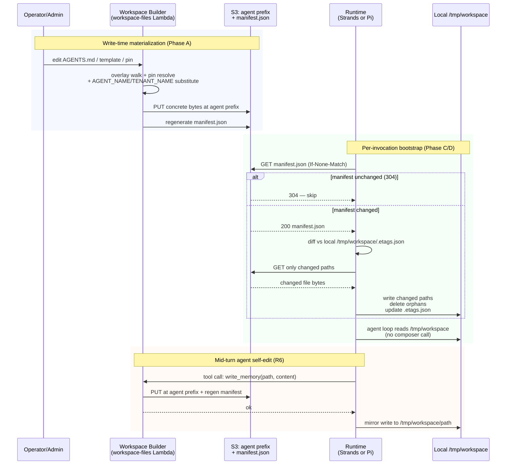

# refactor: materialize agent workspace at write time, drop runtime composer

## Overview

Move every responsibility of the runtime workspace composer to write-time. The agent's S3 prefix becomes the only thing any runtime reads. Bootstrap collapses to: GET `manifest.json`, compare ETags against a local cache, fetch what changed, optionally substitute nothing because the bytes on disk are already concrete. Both Strands and Pi runtimes ride the same primitive. Per the user's directive, `{{HUMAN_*}}` substitution is removed entirely — USER.md is the only file using those tokens, and it is already written-in-full at assignment time, so no runtime substitution is needed for any HUMAN field.

This is a Deep, cross-cutting refactor. It touches both runtimes, the API server, the workspace-files Lambda, the `createAgentFromTemplate` mutation, the deploy pipeline, and one-time backfill of every existing agent's S3 prefix. The brainstorm at `docs/brainstorms/2026-04-27-materialize-at-write-time-workspace-bootstrap-requirements.md` captures the product intent; this plan captures sequencing and unit-level decisions.

---

## Problem Frame

Today every agent invocation routes through a runtime composer (`workspace_composer_client.py` + the `composeFile`/`composeList` surface in `workspace-overlay.ts`) with a 60-second LRU cache and explicit `invalidateComposerCache` calls in every mutating handler. The composer walks a 3-tier overlay (agent → template → defaults), walks ancestor folders, resolves pinned-version SHAs against a content-addressable store, runs read-time placeholder substitution with a sanitization pipeline, and re-validates tenant isolation. That made sense when agents stored *diffs* against templates, sub-agents were *virtual*, and placeholders were resolved per-read. Three recent commitments invalidate that model: the Workspace Builder ("everything is files"), the Fat-folder consolidation (sub-agents are concrete folders), and the S3-event-orchestration substrate (file changes are events).

The simplification: materialize at write time, sync at boot. Workspace Builder owns overlay walk + pin resolution + AGENT_NAME/TENANT_NAME substitution at write time, persisting concrete bytes into the agent's prefix. Each runtime does an ETag-aware sync against `manifest.json` on every invocation. The composer module disappears. Pi's "really small runtime" claim becomes structurally true; Strands gets simpler in the same motion.

---

## Requirements Trace

- R1. Both runtimes implement `bootstrap_workspace(tenantSlug, agentSlug, localDir)` that performs an ETag-aware sync against `manifest.json` from `tenants/{tenantSlug}/agents/{agentSlug}/workspace/`. (origin R1, R3)
- R2. Bootstrap runs on every invocation (warm and cold). Steady-state cost when nothing changed is one GetObject of `manifest.json`. (origin R2)
- R3. Runtime code reads only the agent's prefix. No reads of `_catalog/{template}/`, `_catalog/defaults/`, or `workspace-versions/` from any runtime. (origin R3)
- R4. Workspace Builder runs overlay + pin resolution + write-time substitution of `{{AGENT_NAME}}` and `{{TENANT_NAME}}` only, persisting concrete bytes at the agent's prefix. (origin R4)
- R5. Pinned content (GUARDRAILS / PLATFORM / CAPABILITIES) is materialized as a real concrete file at the agent's prefix; no runtime SHA lookup. (origin R5)
- R6. Tools that mutate workspace files (`write_memory`, `update_identity`, `update_agent_name`, `update_user_profile`) write to the agent prefix and also mirror locally to `/tmp/workspace/{path}` so within-turn reads see what was just written. (origin R6)
- R7. `{{HUMAN_*}}` placeholder substitution is removed entirely. USER.md is the only file containing those tokens; it is already written-in-full at assignment time, so the runtime never sees them. The `PLACEHOLDER_VARIABLES` set shrinks to `{AGENT_NAME, TENANT_NAME}`. (user directive resolving origin R-OQ1; supersedes origin R7)
- R8. AGENTS.md derivation (`derive-agent-skills.ts`) continues to run after an AGENTS.md write, reading from the agent prefix directly rather than from the composer. (origin R8)
- R9. `delegate_to_workspace` reads the parent agent's already-synced `/tmp/workspace/{folder_path}/` rather than calling the composer. (origin R9)
- R10. Template version updates do not auto-propagate. An explicit per-agent or per-tenant `rematerialize` action re-runs Workspace Builder against selected agents. (origin R10)
- R11. New agents created via `createAgentFromTemplate` get a fully materialized prefix at creation time, in the same transaction as the agent row insert. (origin R11)
- R12. A one-time backfill walks every existing agent through `materializeAgentWorkspace` and writes the result to its prefix. Idempotent — re-runs are no-ops. (origin R12)
- R13. Cutover is one-shot, no flag dance. Pre-launch posture per project memory. (origin R13)
- R14. Runtime cleanup: `workspace_composer_client.py` deleted, all `fetch_composed_workspace*` and `invalidate_composed_workspace_cache` references removed, in-process cache module gone, Strands `Dockerfile` COPY line removed, startup assertion that the composer module is absent. (origin R14)
- R15. API cleanup: `composeFile`, `composeList`, `composeFileCached` removed from `workspace-overlay.ts`; `agentPinStatus`, `agent-snapshot`, `derive-agent-skills`, and the `workspace-files` handler migrated to read from the agent prefix or call into the materializer. (origin R15)
- R16. Pi container source paths added to `.github/workflows/deploy.yml` `detect-changes` source-list and `scripts/post-deploy.sh --min-source-sha` strict-mode in the same PR that introduces the Pi bootstrap, to prevent stale-image regressions per `docs/solutions/workflow-issues/agentcore-runtime-no-auto-repull-requires-explicit-update-2026-04-24.md`. (new — surfaced by learnings research)

**Origin actors:** A1 (Workspace Builder), A2 (Agent runtime — Strands or Pi), A3 (Operator), A4 (Agent), A5 (End user).
**Origin flows:** F1 (per-invocation bootstrap), F2 (operator edits a workspace file), F3 (agent self-edits mid-turn), F4 (template version update with operator opt-in), F5 (new agent from template).
**Origin acceptance examples:** AE1 (covers R1, R2 — warm-path cost), AE2 (covers R1, R2, F2 — edit propagates without invalidation), AE3 (covers R5, R10 — template update does not auto-propagate), AE4 (covers R6, R9 — within-turn write visibility), AE5 (superseded by R7 — `{{HUMAN_*}}` substitution removed; behavior is "tokens render literally if any non-USER.md file ever contains them, but no live file does"), AE6 (covers R12 — backfill idempotent).

---

## Scope Boundaries

- Auto-propagation of template-version updates — out of scope. R10 is explicit: operator opt-in only.
- Removing the `_catalog/` prefix structure — out of scope. Templates and defaults stay there as Workspace Builder's *inputs*; the runtime just no longer reads them.
- Removing the workspace-files Lambda — out of scope. It stays as the operator-edit entry point with a simplified body.
- Cross-tenant template sharing — out of scope. Tenants stay isolated.
- Multi-runtime sub-agent fan-out (Pi parent → Strands sub-agent or vice versa) — out of scope here; covered by the Pi runtime brainstorm's R-OQ4.
- Removing the placeholder-substitution sanitization pipeline — out of scope. Sanitization keeps running at write time inside the materializer; only HUMAN_* substitution is eliminated.

### Deferred to Follow-Up Work

- Admin UI surface for "re-materialize from template" (R10): the Lambda action lands in U4; the operator UI is a separate PR after this plan ships.
- Manifest-driven runtime delete-orphans semantics (when a path disappears from the manifest, delete it locally): in U6/U12 helpers as a TODO; safe-default skip in v1, harden if needed.
- Replacing the explicit-COPY Dockerfile pattern with a wildcard + `.dockerignore` (recommended in `docs/solutions/build-errors/dockerfile-explicit-copy-list-drops-new-tool-modules-2026-04-22.md`): out of scope here; this plan only removes the composer line.

---

## Context & Research

### Relevant Code and Patterns

- `packages/api/src/lib/workspace-overlay.ts` — current composer (~1,000 LOC). Will retain only the internal helpers needed by the new materializer; `composeFile`/`composeList`/`composeFileCached` removed.
- `packages/api/src/lib/workspace-manifest.ts` — already regenerated after every write; runtime source of truth for "what's at this prefix" under the new model.
- `packages/api/src/lib/placeholder-substitution.ts` — shrinks to 2 tokens (`AGENT_NAME`, `TENANT_NAME`); HUMAN_* removed.
- `packages/api/src/lib/identity-md-writer.ts` (`writeIdentityMdForAgent`) — existing pattern for managed-write-in-full at mutation time. Same pattern extends to the materializer.
- `packages/api/workspace-files.ts` — workspace-files Lambda. Read paths (handleGet/handleList) currently call `composeFile`/`composeList`; will read directly from agent prefix.
- `packages/api/src/graphql/resolvers/templates/createAgentFromTemplate.mutation.ts` — explicit "No copy-on-create" today. Becomes "full copy-on-create" via materializer.
- `packages/agentcore-strands/agent-container/container-sources/server.py` line 1915 (`_ensure_workspace_ready`) — current cold-start composer fetch with fingerprint-skip on warm invocations. Replaced with bootstrap call on every invocation.
- `packages/agentcore-strands/agent-container/container-sources/workspace_composer_client.py` — deleted.
- `packages/agentcore-strands/agent-container/container-sources/delegate_to_workspace_tool.py` — switches from composer fetch to local `/tmp/workspace/{folder}/` walk.
- `packages/agentcore-pi/agent-container/src/runtime/pi-loop.ts` — wires in the new TS bootstrap before `agent.prompt`.

### Institutional Learnings

- `docs/solutions/workflow-issues/agentcore-runtime-no-auto-repull-requires-explicit-update-2026-04-24.md` — high-severity. Pi container source paths must be added to `detect-changes` and `--min-source-sha` strict-mode source list, otherwise composer-deletion deploys serve stale Pi images. Drives U13.
- `docs/solutions/workflow-issues/workspace-defaults-md-byte-parity-needs-ts-test-2026-04-25.md` — `pnpm --filter @thinkwork/workspace-defaults test` enforces byte parity between `files/<n>.md` and inlined `*_MD` constants in `src/index.ts`. Run on any unit that touches default strings (U1 may, U2 will).
- `docs/solutions/architecture-patterns/inert-to-live-seam-swap-pattern-2026-04-25.md` — recommends 3-PR rollout (inert → live → delete). User's pre-launch directive overrides this; we proceed one-shot per phase but keep the seam pattern as the rollback recipe (revert U7/U11 to fall back to composer).
- `docs/solutions/build-errors/dockerfile-explicit-copy-list-drops-new-tool-modules-2026-04-22.md` — when deleting `workspace_composer_client.py`, also remove its `COPY` line from the Strands Dockerfile. Drives U11.
- `docs/solutions/workflow-issues/agent-builder-smoke-cleanup-needs-manifest-regeneration-2026-04-26.md` — manifest regeneration is the Builder's responsibility; runtimes consume it, never recompute it. Drives U2 manifest call.
- Auto-memory `feedback_workspace_user_md_server_managed` — confirms USER.md is written-in-full at assignment events; eliminating HUMAN_* substitution leaves no gap.
- Auto-memory `feedback_oauth_tenant_resolver` — `ctx.auth.tenantId` is null for Google-federated users; `resolveCallerTenantId(ctx)` is the fallback. Materializer must honor this on all server-side call sites.
- Auto-memory `feedback_completion_callback_snapshot_pattern` — env vars must be snapshotted at agent-coroutine entry, not re-read after the agent turn. Bootstrap helpers take config as positional args, no `os.environ` reads inside.

### External References

- AWS S3 ETag conditional GET: `If-None-Match` header returns 304 when the ETag matches; cheap warm-path read.
- AWS SDK v3 (`@aws-sdk/client-s3`): `GetObjectCommand` accepts `IfNoneMatch`. `ListObjectsV2Command` returns `ETag` per object — used as a fallback when `manifest.json` is missing.

---

## Key Technical Decisions

- **Manifest-first, not ListObjectsV2-first.** The runtime bootstrap GETs `manifest.json` (single object), compares its top-level fingerprint to a local cache, and only ListObjects + GETs files when the manifest changed. Fewer S3 calls, single source of truth, avoids race between Builder writes and runtime list. Falls back to ListObjectsV2 + per-object ETag check if the manifest is missing or stale.
- **Native AWS SDK in both runtimes; no `aws s3 sync` CLI dependency.** Keeps Pi container slim; gives both runtimes a uniform contract. Strands uses boto3, Pi uses `@aws-sdk/client-s3`.
- **Per-runtime helpers, not a shared library.** Surface is small (under 100 LOC each per the brainstorm's success criterion). Sharing via OpenAPI/spec adds more glue than it saves. Each runtime owns its bootstrap, asserts the same observable contract.
- **`{{HUMAN_*}}` removed completely; not just deferred.** USER.md is the only file using HUMAN_* tokens, and USER.md is managed-write-in-full at assignment. There is no other code path that needs HUMAN_* substitution. `PLACEHOLDER_VARIABLES` shrinks to `{AGENT_NAME, TENANT_NAME}`.
- **Materialization is idempotent and content-addressed.** Materializer writes a path only when its content SHA differs from the existing object's ETag. Re-running the backfill writes zero bytes if nothing changed.
- **`createAgentFromTemplate` writes everything in one transaction.** Agent row insert + materialization + manifest regeneration succeed together or roll back together. No half-created agents with empty prefixes.
- **Local ETag cache lives at `/tmp/workspace/.etags.json`.** Same VM's local filesystem; regenerated if missing. Not external state.
- **Per-invocation re-sync is the contract; warm-path optimization is implementation detail.** The runtime always asks "anything changed?" via manifest GET. If no, skip. If yes, sync the deltas. Operators get "edit lands on next turn" without any cache-invalidation plumbing.
- **One-shot cutover, not staged.** Pre-launch posture (per memory `project_v1_agent_architecture_progress` and brainstorm R13). The inert→live seam pattern stays as the documented rollback recipe but is not the default rollout shape here.
- **Composer-absent startup assertion** in Strands' boot path catches accidental re-introduction of the module. Mirrors the `EXPECTED_TOOLS` pattern in `test_boot_assert.py`.

---

## Open Questions

### Resolved During Planning

- **HUMAN_* substitution: keep, defer, or remove?** Resolved per user directive: **remove entirely**. Verified by code read — USER.md is the only file using HUMAN_* tokens, and it is managed-write-in-full at assignment time. PLACEHOLDER_VARIABLES shrinks to two tokens.
- **ETag-aware sync mechanism: AWS CLI `s3 sync` vs native SDK?** Resolved: native SDK in both runtimes. Avoids CLI binary dependency in Pi container; uniform contract.
- **Manifest vs ListObjectsV2 as source of truth?** Resolved: manifest.json. Already regenerated by every write; single source of truth; cheaper warm-path. ListObjectsV2 stays as fallback if manifest is missing.
- **Where does the bootstrap helper live?** Resolved: per-runtime, not shared. Surface is too small to be worth abstraction.
- **Cutover shape: staged flag or one-shot?** Resolved: one-shot per pre-launch posture. Inert→live seam pattern stays as documented rollback recipe.
- **Within-turn write visibility for `write_memory`, etc.?** Resolved: tools mirror writes locally to `/tmp/workspace/{path}` after the server-side write succeeds. Same agent loop's subsequent reads see the new content without re-syncing.

### Deferred to Implementation

- Exact concurrency limit for the backfill script (10 agents at a time is the starting point; tune during U5 dry-run).
- Whether `derive-agent-skills.ts` should run inside the `materializeAgentWorkspace` transaction or as a post-write callback (depends on AGENTS.md write ordering; resolve in U2/U14).
- Whether the manifest should embed a single top-level fingerprint hash to short-circuit the per-file ETag comparison, or whether per-file ETag compare is fast enough at typical agent file counts (~50). Resolve in U2 once a real agent's manifest size is observable.
- Exact format of the local `.etags.json` cache file (JSON with `{path: etag}` map vs newline-delimited). Resolve in U6 / U12 — chose whichever is simpler.

---

## High-Level Technical Design

> *This illustrates the intended approach and is directional guidance for review, not implementation specification. The implementing agent should treat it as context, not code to reproduce.*

---

## Implementation Units

- U1. **Eliminate `{{HUMAN_*}}` from PLACEHOLDER_VARIABLES**

**Goal:** Reduce the placeholder set to `{AGENT_NAME, TENANT_NAME}`. USER.md is the only file using HUMAN_* tokens and is already managed-write-in-full at assignment, so no runtime substitution is needed.

**Requirements:** R7

**Dependencies:** None — must land first because every other unit assumes the smaller token set.

**Files:**
- Modify: `packages/api/src/lib/placeholder-substitution.ts` — remove HUMAN_* entries from `PLACEHOLDER_VARIABLES`, `STRUCTURED_PLACEHOLDER_VARIABLES`, the `PlaceholderValues` / `StructuredPlaceholderValues` types, and the per-token sanitization branches that only fire on HUMAN_* fields.
- Modify: `packages/api/src/lib/workspace-overlay.ts` — `loadAgentContext` no longer fetches `users` / `userProfiles` rows for placeholder values; `placeholderValues` becomes `{AGENT_NAME, TENANT_NAME}` only.
- Test: `packages/api/src/__tests__/placeholder-substitution.test.ts` — drop HUMAN_* test cases; assert `substitute()` leaves `{{HUMAN_NAME}}` etc. unchanged as literal text.
- Test: `packages/api/src/__tests__/placeholder-aware-comparator.test.ts` — drop HUMAN_* fixtures.
- Test: `packages/api/src/__tests__/workspace-overlay.test.ts` — drop the "renders {{HUMAN_*}} as em-dash pre-assignment" test case; the new behavior is "literal text passes through" but per R7 no live file contains HUMAN_* tokens, so the case is moot.

**Approach:**
- Verify pre-flight: `grep -r "HUMAN_" packages/workspace-defaults/files/` returns only USER.md hits, confirming USER.md is the sole source.
- Remove HUMAN_* tokens from the constant arrays first; let TypeScript surface every consumer that breaks.
- Each compile error is either a test fixture (drop the HUMAN_* assertions) or a placeholder-values producer (drop the field set).
- Run `pnpm --filter @thinkwork/workspace-defaults test` to confirm USER.md byte parity is preserved (the file content doesn't change; only the substitution code that processed it does).

**Patterns to follow:**
- Existing token removal pattern in `STRUCTURED_PLACEHOLDER_VARIABLES` — narrow scope, drop branches, let types catch consumers.

**Test scenarios:**
- Happy path: `substitute({AGENT_NAME: "Riley"}, "Hi {{AGENT_NAME}}")` returns `"Hi Riley"`.
- Happy path: `substitute({TENANT_NAME: "Acme"}, "From {{TENANT_NAME}}")` returns `"From Acme"`.
- Happy path: `PLACEHOLDER_VARIABLES.length === 2`.
- Edge case: `substitute({AGENT_NAME: "Riley"}, "Hi {{HUMAN_NAME}}")` returns `"Hi {{HUMAN_NAME}}"` unchanged — token is no longer recognized; passes through literal.
- Edge case: USER.md from `packages/workspace-defaults/files/USER.md` no longer triggers HUMAN_* substitution at any read site (verify by reading the file content through the new placeholder-substitution path and asserting tokens pass through).
- Integration: workspace-overlay byte-parity test at `packages/workspace-defaults/test` still passes after the changes.

**Verification:**
- `pnpm --filter @thinkwork/api typecheck && pnpm --filter @thinkwork/api test` green.
- `pnpm --filter @thinkwork/workspace-defaults test` green (byte parity confirmed).
- Grep `HUMAN_` across `packages/api/src` returns only test-deletion lines (i.e., the symbol is gone from production code).

---

- U2. **Extract `materializeAgentWorkspace` write-time helper**

**Goal:** Single function that materializes an agent's full workspace tree into its S3 prefix — overlay walk + ancestor fallback + pin resolution + AGENT_NAME/TENANT_NAME substitution + manifest regeneration. Idempotent (content-SHA-skip).

**Requirements:** R4, R5

**Dependencies:** U1.

**Files:**
- Create: `packages/api/src/lib/workspace-materializer.ts` — new export `materializeAgentWorkspace(ctx, agentId, opts?): Promise<MaterializeResult>`.
- Modify: `packages/api/src/lib/workspace-overlay.ts` — internal helpers (`loadAgentContext`, `composeFileForAgent`, `s3Get`, `collectUnionPaths`) stay; consumed only by the materializer now. Mark `composeFile` / `composeList` / `composeFileCached` as `@deprecated` for U15 to delete.
- Modify: `packages/api/src/lib/workspace-manifest.ts` — confirm or expose a `regenerateManifestForAgent(tenantSlug, agentSlug)` that the materializer can call after writing.
- Test: `packages/api/src/__tests__/workspace-materializer.test.ts` — new file.

**Approach:**
- Reuse `composeFileForAgent`'s overlay logic (agent-override → pin-resolution → template walk → defaults walk).
- Iterate the union of paths via existing `collectUnionPaths`.
- For each path: resolve composed bytes, check if `s3Head(agentPrefix + path).ETag` matches `sha256(composedBytes)` — skip write if equal, write otherwise.
- Track orphans: paths that exist at `agentPrefix` but not in the composed union → delete.
- After all writes complete, call `regenerateManifestForAgent(tenantSlug, agentSlug)`.
- Return `{ written: number, skipped: number, deleted: number, manifestSha: string }`.
- `MaterializeResult` is consumed by `createAgentFromTemplate` (U3), backfill (U5), `rematerialize` action (U4), and ad-hoc admin queries.

**Patterns to follow:**
- `packages/api/src/lib/identity-md-writer.ts` — managed-write-in-full pattern at mutation time. Same shape, broader scope.
- `packages/api/src/lib/workspace-overlay.ts` `composeList` body for the overlay-walk skeleton.

**Test scenarios:**
- Happy path — Covers AE6: materializing a brand-new agent against a template writes one concrete file per template path; subsequent re-run writes zero.
- Happy path: agent with two pinned files (GUARDRAILS, PLATFORM) materializes both as concrete bytes at `agentPrefix + path`; pinned content matches the SHA recorded in `agent_pinned_versions`.
- Happy path: AGENT_NAME and TENANT_NAME tokens in template content render to concrete values in the materialized files.
- Edge case: an agent-override exists at a path; materializer writes the override's content (not the template's) at the agent prefix.
- Edge case: orphan deletion — agent prefix has `obsolete.md` that's no longer in the composed union; materializer deletes it.
- Edge case: idempotent re-run — running the materializer twice in succession writes 0 files on the second call (skipped by SHA equality).
- Edge case: ancestor walk for sub-agent folder — `support/escalation/IDENTITY.md` falls through to `support/IDENTITY.md` then root `IDENTITY.md`; materializer writes the resolved bytes at the literal `support/escalation/IDENTITY.md` path.
- Error path: agent's tenantId mismatches caller's tenantId → throws `AgentNotFoundError`; no S3 writes occur.
- Error path: pinned SHA can't be resolved (content-addressable store has neither the version object nor a current-content match) → throws `PinnedVersionNotFoundError`; partial-write rollback. (Test by reading agent prefix afterward and confirming no GUARDRAILS file changed.)
- Integration: after materializer runs, `regenerateManifestForAgent` is called and `manifest.json` reflects the final set of paths + ETags.

**Verification:**
- New tests green; `composeList` consumers in `agent-snapshot.ts`, `agentPinStatus.query.ts`, `derive-agent-skills.ts` still work (deprecation warnings only).

---

- U3. **Materialize on `createAgentFromTemplate`**

**Goal:** New agents created from templates land with a fully materialized prefix at creation time. No more "empty prefix, lazy compose at first turn."

**Requirements:** R11, F5

**Dependencies:** U2.

**Files:**
- Modify: `packages/api/src/graphql/resolvers/templates/createAgentFromTemplate.mutation.ts` — call `materializeAgentWorkspace` inside the existing transaction, after the agent row insert.
- Test: `packages/api/src/__tests__/createAgentFromTemplate.test.ts` — extend (or add if missing) to assert post-create S3 state.

**Approach:**
- Replace the "No copy-on-create" comment with a call to `materializeAgentWorkspace(ctx, newAgentId, { txn })` (passing the open Drizzle transaction so a write failure rolls back the agent row).
- Confirm `initializePinnedVersions` runs *before* materialization, since materializer reads `agent_pinned_versions` rows.
- USER.md write-at-assignment continues to fire as today; materializer either skips USER.md (because it's already concrete bytes from the assignment write) or overwrites with the same bytes (idempotent).

**Patterns to follow:**
- Existing `writeIdentityMdForAgent` call pattern in `updateAgent.mutation.ts` — runs inside the same DB transaction; rollback covers both DB and S3.

**Test scenarios:**
- Happy path: creating an agent from `customer-support` template produces an S3 prefix containing AGENTS.md, IDENTITY.md, GUARDRAILS.md, PLATFORM.md, CAPABILITIES.md, USER.md, plus any nested folders the template defines.
- Happy path: the new agent's `manifest.json` exists and lists every materialized path with non-empty ETags.
- Happy path: `{{AGENT_NAME}}` and `{{TENANT_NAME}}` tokens in template files render to the new agent's actual name/tenant in the materialized files.
- Error path: simulated S3 write failure during materialization → DB transaction rolls back; no `agents` row exists; no S3 prefix exists for the would-be agent.
- Integration: subsequent invocation of the new agent (mocked runtime calling `bootstrap_workspace`) finds every expected file.

**Verification:**
- New agent's S3 prefix populated; manifest present; agent invokable end-to-end without ever calling the composer.

---

- U4. **Add `rematerialize` action + drop composer reads from workspace-files Lambda**

**Goal:** Operators can opt agents in to template-version updates via a new Lambda action. Direct-agent edits keep working as today (writes go straight to agent prefix; manifest regenerated). Read paths in the Lambda no longer call `composeFile`/`composeList`.

**Requirements:** R10, F4, R8

**Dependencies:** U2.

**Files:**
- Modify: `packages/api/workspace-files.ts` — add `handleRematerialize(action: { agentId } | { tenantId, agentIds })`; in `handleGet` and `handleList`, replace `composeFile`/`composeList` with direct `s3Get` / `s3List` against the agent's prefix.
- Modify: `packages/api/src/lib/derive-agent-skills.ts` — when invoked from `handlePut` after an AGENTS.md write, read AGENTS.md directly from the agent prefix instead of via `composeList` (the file is already at the prefix at that point because direct edits write there first).
- Test: `packages/api/src/__tests__/workspace-files-handler.test.ts` — add cases for `rematerialize`; rewrite the `handleGet`/`handleList` cases to assert reads come from agent prefix only.
- Test: `packages/api/src/__tests__/derive-agent-skills.test.ts` — assert it reads from the agent prefix, not via composer.

**Approach:**
- Direct-agent writes already land at the agent prefix; no functional change other than removing the now-redundant `invalidateComposerCache` calls.
- `rematerialize` action reuses `materializeAgentWorkspace` directly. Optional per-tenant fan-out (sequenced with the same backfill concurrency settings).
- Reads (`handleGet` / `handleList`) bypass the overlay entirely — what's at the agent prefix *is* the truth. No more "compose at read time."
- The `handleUpdateIdentityField` path (line 656) already does line-surgery on the agent's IDENTITY.md and writes back; just drop the composer-cache invalidation call afterward.

**Patterns to follow:**
- Existing handler-action pattern (handlePut, handleDelete, handleCreateSubAgent in `workspace-files.ts`).
- Manifest regeneration happens inside `materializeAgentWorkspace`; handler does not need to call it separately.

**Test scenarios:**
- Happy path — Covers F4: `rematerialize` against a single agent rewrites its prefix to match the current template version; subsequent invocation sees the new bytes.
- Happy path — Covers F2: operator PUTs a new AGENTS.md at agent prefix → handler writes to S3 → `derive-agent-skills` reads the just-written file and updates `agent_skills` rows. No composer call in the trace.
- Happy path: `handleGet` for a path returns the bytes from `agentPrefix + path` directly.
- Happy path: `handleList` returns the union of objects under `agentPrefix` (no template/defaults fallback).
- Edge case: `rematerialize` on a tenant fan-out runs N agents concurrently bounded by the configured limit; partial failures don't block the remaining agents.
- Error path: `rematerialize` for an agent whose materializer call fails returns a structured error with the agent ID; other agents in the batch succeed.
- Edge case: `handleGet` for a path that doesn't exist at the agent prefix returns 404, not a fall-through to template/defaults.

**Verification:**
- `grep -n "composeFile\|composeList\|invalidateComposerCache" packages/api/workspace-files.ts packages/api/src/lib/derive-agent-skills.ts` returns no matches.
- All workspace-files-handler tests green.

---

- U5. **One-time backfill script**

**Goal:** Walk every existing agent through `materializeAgentWorkspace`, write results to each agent's prefix. Idempotent dry-run + apply modes.

**Requirements:** R12, AE6

**Dependencies:** U2.

**Files:**
- Create: `packages/api/scripts/backfill-materialize-workspaces.ts` — new.
- Test: `packages/api/src/__tests__/backfill-materialize-workspaces.test.ts` — new.

**Approach:**
- Script accepts `--stage <dev|prod>`, `--dry-run`, `--concurrency <n>` (default 10).
- Iterates `agents` table → per-agent: run materializer → collect counts → log per-agent summary.
- Dry-run: materializer's "skipped vs would-write" diff is reported but no S3 writes.
- Run via `pnpm --filter @thinkwork/api exec node scripts/backfill-materialize-workspaces.ts --stage dev --dry-run`.

**Patterns to follow:**
- `packages/api/scripts/regen-all-workspace-maps.ts` — existing walker over agents with concurrency control. Mirror its CLI shape.

**Test scenarios:**
- Happy path — Covers AE6: backfilling against a fixture set of N agents writes the expected number of files; second run writes zero.
- Edge case: `--dry-run` reports counts but invokes no S3 writes (verified via mocked S3 client).
- Error path: a single agent's materializer call fails; the script logs the error, marks that agent as failed in the summary, and continues with the remaining agents.
- Edge case: concurrency limit is honored — at no point are more than N S3 sessions in flight.
- Integration: end-to-end on a local stack — backfill an agent, then call the materializer again, observe zero writes.

**Verification:**
- Dry-run on dev reports a clear diff; apply produces the expected set of writes; re-running apply writes zero.

---

- U6. **Strands `bootstrap_workspace.py` helper**

**Goal:** ETag-aware sync from agent prefix → `/tmp/workspace`, manifest-first with ListObjectsV2 fallback. Replaces `fetch_composed_workspace`.

**Requirements:** R1, R2, R3, AE1

**Dependencies:** U2 (manifest format), U5 (backfilled state to test against on dev).

**Files:**
- Create: `packages/agentcore-strands/agent-container/container-sources/bootstrap_workspace.py` — new module exporting `bootstrap_workspace(tenant_slug, agent_slug, local_dir, s3_client, bucket) -> BootstrapResult`.
- Create: `packages/agentcore-strands/agent-container/test_bootstrap_workspace.py` — new.

**Approach:**
- Read `tenants/{tenantSlug}/agents/{agentSlug}/workspace/manifest.json` with `If-None-Match` against last-known ETag from `local_dir/.etags.json`. 304 → no-op. 200 → diff manifest entries against local cache.
- For each path with a changed ETag: GetObject, write to `local_dir/{path}`, update `.etags.json`.
- For each local path absent from the manifest: delete locally.
- Falls back to ListObjectsV2 + per-object conditional GET if `manifest.json` is missing (e.g., during the brief window before backfill of a particular agent, or recovery scenarios).
- All config (region, bucket, paths) takes positional args — no `os.environ` reads inside the function (per `feedback_completion_callback_snapshot_pattern`).
- Returns `BootstrapResult(synced: int, deleted: int, manifest_sha: str | None, fallback_used: bool)`.

**Execution note:** Test-first. Define the manifest contract and the per-file delta semantics in tests before writing the implementation.

**Patterns to follow:**
- Existing snapshot/positional-args pattern in `workspace_composer_client.py` (the thing being replaced) — but without the multi-tier overlay logic.
- `test_workspace_composer_client.py` — mirror the boto3-stubber test setup.

**Test scenarios:**
- Happy path — Covers AE1: warm path with manifest unchanged returns 304, performs zero GETs beyond the manifest GET, returns `BootstrapResult(synced=0, deleted=0)`.
- Happy path — Covers AE2: manifest changed with one file edited; bootstrap writes exactly that file locally and updates `.etags.json`.
- Happy path: cold start (local_dir empty) downloads every file in the manifest and seeds `.etags.json`.
- Edge case: manifest absent (404) → falls back to ListObjectsV2; logs the fallback; still produces a correct local tree.
- Edge case: a path was deleted upstream → bootstrap deletes the local file and removes its `.etags.json` entry.
- Edge case: stale `.etags.json` (a path tracked locally that is now missing from manifest) → reconciles by deleting locally.
- Error path: S3 throws on a single GET → bootstrap returns a partial result with the failing path identified; does not mutate `.etags.json` for the failed path.
- Error path: bucket misconfigured → raises early with a clear message.
- Integration: against a real S3 bucket on dev, two consecutive invocations: first downloads N files, second performs zero downloads.

**Verification:**
- Tests green.
- Manual dev validation: invoke an agent, confirm `/tmp/workspace` matches the agent's S3 prefix and `.etags.json` exists.

---

- U7. **Wire `bootstrap_workspace` into Strands `server.py`; drop composer calls**

**Goal:** Strands runtime calls only `bootstrap_workspace` on every invocation; `_ensure_workspace_ready` becomes a thin wrapper or is replaced.

**Requirements:** R1, R2, F1

**Dependencies:** U6.

**Files:**
- Modify: `packages/agentcore-strands/agent-container/container-sources/server.py` — replace the `fetch_composed_workspace` block (around line 376) and the cold-start fingerprint-skip logic (around line 417) with a call to `bootstrap_workspace`. Bootstrap runs on every `do_POST`, not only first invocation.
- Modify: `packages/agentcore-strands/agent-container/test_server_*.py` — update tests that mocked the composer call.

**Approach:**
- The existing `_ensure_workspace_ready` (line 1915) is the natural insertion point. Replace its body with a `bootstrap_workspace` call.
- Drop the fingerprint-skip optimization; the manifest's ETag-based 304 path is the new warm-path optimization and is cheaper than the old fingerprint comparison.
- Pass `tenant_slug` and `agent_slug` from the invocation payload (already plumbed today).

**Patterns to follow:**
- Existing snapshot pattern: read all env vars at the top of `_ensure_workspace_ready`, pass into `bootstrap_workspace` as positional args.

**Test scenarios:**
- Happy path: a second invocation against the same warm container with no edits between turns triggers exactly one `manifest.json` GET (no GETs of file content).
- Happy path: an invocation after an operator edit between turns triggers one manifest GET + GETs only for changed paths.
- Edge case: cold container start downloads the full tree on first invocation.
- Integration: full agent loop end-to-end on dev — agent serves a turn, operator edits AGENTS.md, agent serves the next turn with the new content.

**Verification:**
- Strands tests green.
- `grep -n "fetch_composed_workspace\|composer" packages/agentcore-strands/agent-container/container-sources/server.py` returns no matches outside import-deletion lines.

---

- U8. **Update `delegate_to_workspace_tool.py` to read from local `/tmp/workspace`**

**Goal:** Sub-agent spawns read the parent's local synced tree; no composer fetch during delegation.

**Requirements:** R9, AE4

**Dependencies:** U7.

**Files:**
- Modify: `packages/agentcore-strands/agent-container/container-sources/delegate_to_workspace_tool.py` — replace `fetch_composed_workspace_cached` call (line 556) with a local-directory walk: read `/tmp/workspace/{folder_path}/**` and produce the same `[{path, content, sha256}, …]` payload shape.
- Modify: `packages/agentcore-strands/agent-container/test_delegate_to_workspace_tool.py` — swap composer mock for a temp-directory fixture.

**Approach:**
- Replace `composer_fetch` parameter (defaulting to `fetch_composed_workspace_cached`) with `read_local_workspace` (defaulting to a tiny helper that walks `/tmp/workspace/{folder_path}`).
- The skill_resolver (U10) consumes the same shape; no other callers.

**Patterns to follow:**
- Tests already use a fake composer payload — swap it for files-on-disk via tmp_path.

**Test scenarios:**
- Happy path — Covers AE4: parent agent's tree is already on local disk; delegating to `support/escalation` returns the resolved files for that subtree without an S3 call.
- Happy path: the resolved payload shape matches what `skill_resolver` expects.
- Edge case: target folder has no local files (sub-agent hasn't been materialized for this parent) → returns empty list.
- Error path: invalid folder path (path traversal, reserved names) → raises the existing `DelegateToWorkspaceError`.
- Integration: delegate end-to-end with skill_resolver consuming the result.

**Verification:**
- Tests green.
- No composer import remains in `delegate_to_workspace_tool.py`.

---

- U9. **Update `write_memory_tool.py` to mirror locally; drop `invalidate_composed_workspace_cache`**

**Goal:** Within-turn write visibility (R6, AE4). The same agent loop sees what `write_memory` just wrote without an S3 round-trip. Drop the now-unneeded composer cache invalidation.

**Requirements:** R6, AE4

**Dependencies:** U7.

**Files:**
- Modify: `packages/agentcore-strands/agent-container/container-sources/write_memory_tool.py` — after the server-side write succeeds, also write the same bytes to `/tmp/workspace/{path}`. Remove the `invalidate_composed_workspace_cache` import and call (line 47, 226).
- Modify: `packages/agentcore-strands/agent-container/test_write_memory_tool.py` — assert the local mirror happens; drop the cache-invalidation assertion.

**Approach:**
- Mirror is a simple local file write inside a `try/except` — failures don't propagate (server-side write already succeeded; local mirror is best-effort for within-turn consistency).
- Subsequent `write_memory` calls in the same turn re-mirror, keeping the local view current.

**Patterns to follow:**
- Existing post-write cleanup in the tool body — slot the local-mirror write in the same try-block.

**Test scenarios:**
- Happy path — Covers AE4: two `write_memory` calls in succession on the same turn; the second call's prior local write is readable from `/tmp/workspace`.
- Happy path: server-side write succeeds → local mirror written → tool returns ok.
- Edge case: local-mirror write fails (e.g., permission error in test) → tool still returns ok because the server-side write succeeded; warning logged.
- Edge case: path validation rejects bad paths (existing behavior preserved).
- Integration: sub-agent in same turn reads the mirrored file via direct `/tmp/workspace` read.

**Verification:**
- Tests green.
- No `invalidate_composed_workspace_cache` references in `write_memory_tool.py`.

---

- U10. **Update `skill_resolver.py` to consume local `/tmp/workspace`**

**Goal:** Skill resolution reads from the local synced tree (or accepts a payload sourced from it) without referencing the composer.

**Requirements:** R3

**Dependencies:** U7.

**Files:**
- Modify: `packages/agentcore-strands/agent-container/container-sources/skill_resolver.py` — drop the `fetch_composed_workspace` reference in the docstring (line 21, 267); accept `composed_tree` (renamed `workspace_tree`) sourced from local disk.
- Modify: `packages/agentcore-strands/agent-container/test_skill_resolver.py` — swap composer-payload fixtures for tmp-directory fixtures matching the new source.

**Approach:**
- Resolver's contract was already "given a tree, find a skill"; just swap the source. The walking-precedence logic (local → ancestor → platform catalog) stays unchanged.

**Patterns to follow:**
- Existing test fixtures using composer-style dicts; convert to filesystem fixtures.

**Test scenarios:**
- Happy path: skill at `{folder}/skills/{slug}/SKILL.md` is resolved when the local tree contains that file.
- Happy path: skill not at folder, but at ancestor → resolver walks up.
- Happy path: skill not in local tree but in platform catalog → resolver returns the platform-catalog ResolvedSkill.
- Error path: skill not found anywhere → raises `SkillNotResolvable`.
- Edge case: reserved folder names (`memory/`, `skills/`) properly excluded from walking.

**Verification:**
- Tests green; no `fetch_composed_workspace` references in source.

---

- U11. **Delete `workspace_composer_client.py`, Strands COPY line, add startup composer-absent assertion**

**Goal:** Composer is gone from the Strands runtime. Boot fails loudly if anything tries to import it.

**Requirements:** R14

**Dependencies:** U7, U8, U9, U10.

**Files:**
- Delete: `packages/agentcore-strands/agent-container/container-sources/workspace_composer_client.py`.
- Delete: `packages/agentcore-strands/agent-container/test_workspace_composer_client.py` (if exists).
- Modify: `packages/agentcore-strands/agent-container/Dockerfile` — remove the explicit `COPY` line for `workspace_composer_client.py`.
- Modify: `packages/agentcore-strands/agent-container/container-sources/_boot_assert.py` (or `test_boot_assert.py`) — add an assertion that `workspace_composer_client` does not appear in `sys.modules` and is not importable.

**Approach:**
- Pure deletion after dependents are migrated.
- Startup assertion mirrors the EXPECTED_TOOLS pattern — fails the container boot rather than silently fall-through if composer code is reintroduced.

**Patterns to follow:**
- `docs/solutions/build-errors/dockerfile-explicit-copy-list-drops-new-tool-modules-2026-04-22.md` — note: this plan does not switch to wildcard COPY; that's deferred to follow-up.
- `test_boot_assert.py` — assertion mechanism.

**Test scenarios:**
- Happy path: container boots; startup assertion confirms composer module is absent.
- Edge case: a stray import of `workspace_composer_client` in any container-sources file fails the boot assertion. Verify by adding a test that creates a probe file `import workspace_composer_client` and runs the assertion (expecting failure).
- Integration: `pnpm build:lambdas`-equivalent for the Strands container completes without referencing the deleted file.

**Verification:**
- `find packages/agentcore-strands -name "workspace_composer_client.py"` returns nothing.
- Strands container builds and boots; tests green.

---

- U12. **Pi `bootstrap-workspace.ts` helper + wire into pi-loop**

**Goal:** TypeScript port of the same primitive in the Pi runtime. Under 100 LOC. Wired into `runPiAgent` before `agent.prompt`. Validates the brainstorm's "really small Pi runtime" success criterion.

**Requirements:** R1, R2, R3

**Dependencies:** U2 (manifest format) — independent of Phase C work; can run in parallel with U6–U11.

**Files:**
- Create: `packages/agentcore-pi/agent-container/src/runtime/bootstrap-workspace.ts` — new export `bootstrapWorkspace(tenantSlug, agentSlug, localDir, opts): Promise<BootstrapResult>`.
- Create: `packages/agentcore-pi/agent-container/tests/bootstrap-workspace.test.ts` — new.
- Modify: `packages/agentcore-pi/agent-container/src/runtime/pi-loop.ts` — call `bootstrapWorkspace` before constructing the `Agent`. Pass `localDir` so the agent's tools (when ported in future units) can read from it. Use `mkdtemp` if no env-supplied dir.
- Modify: `packages/agentcore-pi/agent-container/src/runtime/env-snapshot.ts` — surface `bucket`, `localWorkspaceDir` if not already.

**Execution note:** Test-first. Mirror the Strands test contract from U6 so the two implementations are observably identical.

**Approach:**
- Use `@aws-sdk/client-s3` (already a dep). `GetObjectCommand` with `IfNoneMatch`. Catch `NoSuchKey` for missing manifest fallback to `ListObjectsV2Command`.
- Local cache file `${localDir}/.etags.json` — read at start, write after sync.
- Same delete-orphan semantics as Strands.
- Returns `{ synced: number, deleted: number, manifestSha: string | null, fallbackUsed: boolean }`.

**Patterns to follow:**
- Existing Pi runtime structure: small, self-contained module under `src/runtime/`, registered through `tools/registry.ts` shape (here: bootstrap is not a tool, but the file-organization style is the same).

**Test scenarios:**
- Happy path: manifest unchanged → 304 → returns `{synced: 0, deleted: 0}`; no GET calls beyond the manifest GET.
- Happy path: manifest changed with one file edited → exactly one file GET + write.
- Happy path: cold start (empty localDir) → downloads every manifest entry.
- Edge case: manifest absent → falls back to ListObjectsV2; result still correct.
- Edge case: orphan file deleted upstream → removed locally and from `.etags.json`.
- Error path: GetObject fails for one path → result identifies the failure; `.etags.json` not updated for that path.
- Error path: bucket misconfigured → throws early with clear message.
- Integration in `pi-loop.ts`: bootstrap is called before `agent.prompt`; if it throws, the invocation fails with a structured error.
- Bound-check: `wc -l packages/agentcore-pi/agent-container/src/runtime/bootstrap-workspace.ts` returns under 100 (success criterion from the brainstorm).

**Verification:**
- Tests green; line-count under 100.
- Pi container builds and boots; full Pi runtime invocation against a materialized agent prefix succeeds.

---

- U13. **Add Pi container source paths to deploy detect-changes + post-deploy.sh strict-mode**

**Goal:** Prevent stale-image regressions per `docs/solutions/workflow-issues/agentcore-runtime-no-auto-repull-requires-explicit-update-2026-04-24.md`. Lands in the same PR as U12.

**Requirements:** R16

**Dependencies:** None — can land alongside U12.

**Files:**
- Modify: `.github/workflows/deploy.yml` — add Pi container source paths to the `detect-changes` job's `git log -1 --format=%H -- …` source list.
- Modify: `scripts/post-deploy.sh` — add Pi container paths to the `--min-source-sha` strict-mode source list.

**Approach:**
- Mirror the existing entries for `packages/agentcore-strands/`. Add `packages/agentcore-pi/` as an equivalent entry.
- Ensure both the SHA-detection path and the freshness-check path see the same source list.

**Test scenarios:**
- Test expectation: none — pure CI/deploy plumbing change. Verified at the next dev deploy: a no-op Pi PR triggers a Pi runtime image rebuild and `UpdateAgentRuntime` call; the freshness check passes.

**Verification:**
- After this PR merges, dev deploy logs show Pi-runtime SHA detection firing on Pi-only changes.

---

- U14. **Migrate `agentPinStatus`, `agent-snapshot`, `derive-agent-skills` off `composeList`**

**Goal:** The remaining server-side `composeList` consumers read directly from the agent prefix or call `materializeAgentWorkspace`'s read-only path.

**Requirements:** R8, R15

**Dependencies:** U2.

**Files:**
- Modify: `packages/api/src/graphql/resolvers/agents/agentPinStatus.query.ts` — replace `composeList` with a direct ListObjectsV2 + per-object HEAD against the agent prefix; pin status compares per-path object SHA against `agent_pinned_versions`.
- Modify: `packages/api/src/lib/agent-snapshot.ts` — replace `composeList` with a direct prefix read; the snapshot captures the as-materialized state, which is now the single source of truth.
- Modify: `packages/api/src/lib/derive-agent-skills.ts` (already touched in U4) — confirm the AGENTS.md read goes through the agent prefix only.
- Modify: `packages/api/src/__tests__/agent-snapshot-overlay.test.ts` and any pin-status tests — switch fixtures from compose-time mocks to S3-prefix mocks.

**Approach:**
- Each call site is independent — three small focused changes. Run them sequentially or in parallel; no inter-dependencies among them.
- `agentPinStatus` semantics tighten slightly: under the new model, "pinned" means "this path was materialized from a pin-resolved source." That state is recorded by the materializer (consider: a small `agent_pinned_materialized_at` column or a marker file at the prefix). Decision deferred to implementation — possibly just compare current prefix SHA against the pin-recorded SHA.

**Test scenarios:**
- Happy path: `agentPinStatus` for an agent with all files at their pinned SHAs returns `pinned: true` for every pinned path.
- Edge case: post-rematerialize, pin status reflects the new materialized SHAs.
- Happy path: `agent-snapshot` produces a snapshot of the agent's prefix; round-trip via `rollbackAgentVersion` (existing behavior) continues to work because the snapshot is of concrete bytes.
- Happy path — Covers F2, R8: AGENTS.md write triggers `derive-agent-skills`, which reads the just-written file from the prefix (no compose call).
- Integration: full agent-builder smoke flow — operator edits AGENTS.md, agent_skills rows update, no composer trace.

**Verification:**
- All three modified call sites' tests green.
- `grep -rn "composeList\|composeFile" packages/api/src` returns only matches inside `workspace-overlay.ts` (deprecated exports being deleted in U15).

---

- U15. **Delete `composeFile`, `composeList`, `composeFileCached`; trim `workspace-overlay.ts`**

**Goal:** Public surface of `workspace-overlay.ts` shrinks. Internal helpers reused by the materializer remain; everything else goes.

**Requirements:** R15

**Dependencies:** U14, U11.

**Files:**
- Modify: `packages/api/src/lib/workspace-overlay.ts` — delete `composeFile`, `composeList`, `composeFileCached`, the LRU cache, `invalidateComposerCache`, `pruneCache`, and any helpers that exist only to support those exports. Keep `loadAgentContext`, `composeFileForAgent` (rename to `resolveOverlayedFile` or similar to retire the "compose" word), `s3Get`, `collectUnionPaths`, key builders.
- Modify: `packages/api/src/__tests__/workspace-overlay.test.ts` (1,392 LOC) — drop the read-time-overlay tests that were covered through `composeFile`/`composeList`. Move test coverage of the overlay logic into `workspace-materializer.test.ts` (which exercises the same helpers via the materializer surface).
- Delete: any test file purely testing the removed exports.

**Approach:**
- Run last so dependent migrations all land first.
- The size of the test-file pruning should be substantial — bias toward deleting tests rather than mass-rewriting; the materializer tests should cover the overlay semantics.
- Rename the surviving "compose"-named internals to retire the term in the codebase. Keep the rename minimal.

**Test scenarios:**
- Happy path: `workspace-overlay.ts` exports `materializeAgentWorkspace` (re-exported from `workspace-materializer.ts`) and the renamed internal helpers needed by it. No `compose*` exports remain.
- Happy path: TypeScript build green across the monorepo.
- Edge case: a stray import of `composeFile` / `composeList` anywhere in the codebase fails the build (verifies the cleanup is complete).

**Verification:**
- `grep -rn "composeFile\|composeList\|composeFileCached\|invalidateComposerCache" packages/` returns no matches in production code.
- Full test suite green.

---

## System-Wide Impact

- **Interaction graph:** workspace-files Lambda, `createAgentFromTemplate`, `updateAgent` mutation, `updateUserProfile` mutation, `agentPinStatus` resolver, `agent-snapshot`, `derive-agent-skills`, both runtime containers, deploy pipeline. The simplification *reduces* coupling — the composer was a hub; after this plan, the hub is replaced by a single materializer call from a small set of write paths.
- **Error propagation:** Materializer failures roll back the surrounding DB transaction (in `createAgentFromTemplate`) or surface as structured handler errors (in `rematerialize`). Bootstrap failures inside the runtime fail the invocation with a clear error (no silent fall-through to "empty workspace").
- **State lifecycle risks:** Backfill (U5) is the load-bearing migration. Dry-run on dev first; verify zero-write idempotency before apply. After backfill, the inert→live seam pattern is the documented rollback recipe (revert U7/U11, restore composer paths from git history) but is not the default cutover shape per pre-launch posture.
- **API surface parity:** GraphQL resolvers' externally visible shape does not change; consumers see the same fields. The `rematerialize` action is additive.
- **Integration coverage:** End-to-end on dev: edit AGENTS.md → agent_skills updates → next agent turn sees the new file. Cross-runtime: same agent invokable on Strands and Pi, both bootstraps produce identical local trees.
- **Unchanged invariants:** Tenant isolation (IAM at S3 level + `agents.tenant_id === ctx.auth.tenantId` check in materializer's `loadAgentContext`); reserved folder names (`memory/`, `skills/`); path validation; depth caps; AGENTS.md routing semantics; sub-agent skill resolution precedence (local → ancestor → platform catalog).

---

## Risks & Dependencies

| Risk | Likelihood | Impact | Mitigation |
|------|------------|--------|------------|
| Backfill misses an agent or partially materializes it; that agent's first invocation has incomplete files | Med | High | U5 is idempotent + dry-run first; backfill summary lists per-agent counts; second-pass sweep before composer deletion in U11/U15. Bootstrap fallback (ListObjectsV2 when manifest is missing) catches manifest-only failures. |
| Pi container ships without source-SHA tracking and serves a stale image when composer-deletion deploys | Med | High | U13 lands in the same PR as U12 by mandate; deploy.yml + post-deploy.sh changes are part of the same review. |
| `derive-agent-skills` regression because read source changed from compose to direct prefix read | Low | Med | Existing `derive-agent-skills.test.ts` (444 LOC) is rewritten in U4/U14 with prefix-read fixtures; integration test exercises the AGENTS.md write → agent_skills update path end-to-end. |
| Within-turn local-mirror writes (U9) drift from server state on partial failure | Low | Low | Mirror is best-effort; server-side write is the source of truth. Next invocation's bootstrap reconciles. Logged warning surfaces drift for investigation. |
| `agentPinStatus` semantics shift subtly (pin status now means "materialized from pin" not "would-resolve-to-pin") | Med | Med | U14 covers semantics in tests; admin UI for pin status is unaffected because the GraphQL field shape is preserved. If a real semantic gap appears, add a comparison-with-template-source field. |
| Strands `Dockerfile` COPY list drops a still-needed module by accident | Low | Med | U11 limits the deletion to the `workspace_composer_client.py` line only. Container build runs in CI before deploy. |
| `workspace-overlay.test.ts` (1,392 LOC) test-pruning in U15 accidentally removes coverage | Med | Med | U15 explicitly preserves coverage by moving overlay-logic tests into `workspace-materializer.test.ts`. Coverage report compared before/after. |
| Manifest regeneration race between concurrent writes to the same agent | Low | Low | Existing `workspace-manifest.ts` already handles this in production; behavior unchanged here. |
| Real prod tenants exist by the time this ships, breaking the one-shot-cutover assumption | Low | High | Confirmed pre-launch posture per memory; if it changes before this plan executes, switch to inert→live seam pattern (3-PR rollout with composer fallback during transition). Risk owner: revisit at start of U7. |

---

## Documentation / Operational Notes

- After U15 lands, write a brief `docs/solutions/architecture-patterns/materialize-at-write-time-workspace-bootstrap-2026-XX-XX.md` recording the decision and the inert→live rollback recipe — pairs with the existing `inert-to-live-seam-swap-pattern-2026-04-25.md`.
- Update `CLAUDE.md` "Architecture: the end-to-end data flow" section, item 4 (Persistence) — note that workspace files are materialized at write time and runtimes do flat ETag-aware sync. Remove any composer-era language.
- Update auto-memory: replace `feedback_workspace_user_md_server_managed` (or extend it) to reflect that the same managed-write-in-full pattern is now the universal write path, not just USER.md's quirk.
- Backfill runbook (U5): state which order to run it in (dev → confirm → prod when prod exists), what counts to expect, and the rollback step (re-running the composer-era branch's backfill if needed).

---

## Sources & References

- **Origin document:** `docs/brainstorms/2026-04-27-materialize-at-write-time-workspace-bootstrap-requirements.md`
- Related brainstorm: `docs/brainstorms/2026-04-26-pi-agent-runtime-parallel-substrate-requirements.md` — Wave 4 (Pi bootstrap) is U12 here.
- Related code:
  - `packages/api/src/lib/workspace-overlay.ts` (composer surface, ~1,000 LOC)
  - `packages/api/src/lib/workspace-manifest.ts` (manifest contract)
  - `packages/api/src/lib/placeholder-substitution.ts`
  - `packages/api/workspace-files.ts` (Lambda handler)
  - `packages/api/src/graphql/resolvers/templates/createAgentFromTemplate.mutation.ts`
  - `packages/agentcore-strands/agent-container/container-sources/workspace_composer_client.py` (to be deleted)
  - `packages/agentcore-strands/agent-container/container-sources/server.py` (`_ensure_workspace_ready`, line 1915)
  - `packages/agentcore-strands/agent-container/Dockerfile`
  - `packages/agentcore-pi/agent-container/src/runtime/pi-loop.ts`
  - `.github/workflows/deploy.yml`, `scripts/post-deploy.sh`
- Related institutional learnings:
  - `docs/solutions/workflow-issues/agentcore-runtime-no-auto-repull-requires-explicit-update-2026-04-24.md`
  - `docs/solutions/workflow-issues/workspace-defaults-md-byte-parity-needs-ts-test-2026-04-25.md`
  - `docs/solutions/architecture-patterns/inert-to-live-seam-swap-pattern-2026-04-25.md`
  - `docs/solutions/build-errors/dockerfile-explicit-copy-list-drops-new-tool-modules-2026-04-22.md`
  - `docs/solutions/workflow-issues/agent-builder-smoke-cleanup-needs-manifest-regeneration-2026-04-26.md`
- Auto-memory references:
  - `feedback_workspace_user_md_server_managed`
  - `feedback_completion_callback_snapshot_pattern`
  - `feedback_oauth_tenant_resolver`
  - `project_v1_agent_architecture_progress`
- AWS docs: S3 ETag conditional GET (`If-None-Match`), AWS SDK v3 `@aws-sdk/client-s3`.
