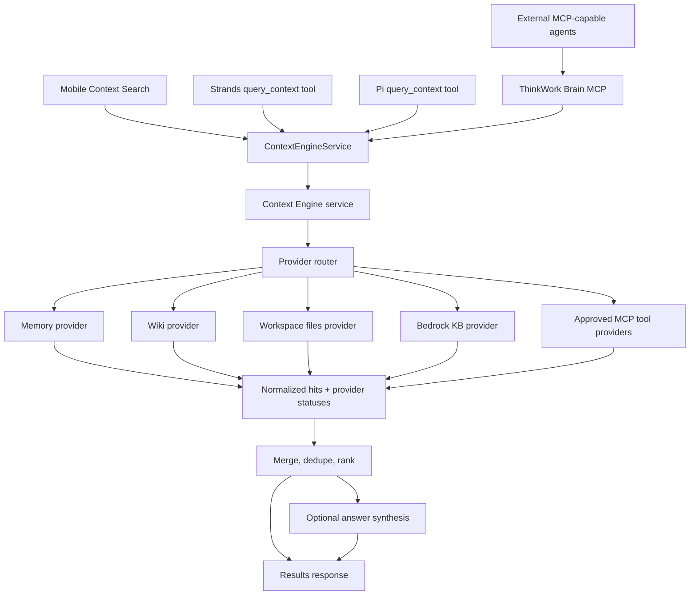

# feat: Add Context Engine

## Overview

Add Context Engine as Thinkwork's shared enterprise context primitive: one tenant-aware `query_context` contract that can search Hindsight memory, compiled wiki pages, workspace files, AWS Bedrock Knowledge Bases, and approved read-only/search-safe MCP tools. The implementation should follow Scout's provider-registry product shape while staying API-owned, AWS-native, and shared by mobile, Strands, and Pi.

The central design choice is to build the provider registry and router in `packages/api`, then expose it through a native first-party service interface plus an MCP facade:

- A native `ContextEngineService` interface for first-party Thinkwork callers: mobile and the agent harness.
- The same service interface for Strands and Pi runtimes through their existing harness integration points.
- A read-only ThinkWork Brain MCP server that wraps the same service for external agents and MCP-native workflows.

There is no standalone Context Engine REST or GraphQL product API in v0. MCP is the external agent-native access point; the native service interface is the internal boundary first-party Thinkwork surfaces share.

---

## Problem Frame

Thinkwork already has strong context stores, but users and agents still fail by choosing the wrong one: Hindsight for a wiki fact, wiki for a KB document, direct MCP tools for search, or a separate file search for workspace context. Context Engine reframes the problem as provider-routed enterprise search rather than wiki replication. Hindsight and wiki remain distinct systems, but both become Context Engine providers (see origin: `docs/brainstorms/2026-04-28-context-engine-requirements.md`).

Scout is the right architectural inspiration: every source is a `ContextProvider`, each provider exposes natural-language reads, status is inspectable, MCP servers collapse behind provider-level query tools, and evals catch wrong-tool routing drift. Thinkwork should mimic that product pattern, not Scout's exact runtime or database choices.

---

## Requirements Trace

- R1. Expose one shared `query_context` primitive for mobile, Strands, Pi, and external MCP-capable agents.
- R2. Accept `query`, `mode`, `scope`, `depth`, and optional provider selection.
- R3. Support `results` and `answer`, defaulting to citation-first `results`.
- R4. Preserve `personal`, `team`, and `auto` scope.
- R5. Support bounded `quick` and deeper `deep` modes.
- R6. Ship a user-facing mobile search surface.
- R7. Support pre-search provider chips, defaulting safe/core sources on.
- R8. Support post-search provider-family filtering.
- R9. Open source detail first, with an "ask about this" action.
- R10. Include Hindsight memory, wiki, workspace/filesystem search, Bedrock KB, and approved read-only/search-safe MCP tools in v0.
- R11. Normalize hits with source family, provider id, title, snippet, rank/score, provenance, scope, and metadata.
- R12. Expose provider health/status so partial failures degrade gracefully.
- R13. Approve MCP providers at individual tool level before default search.
- R14. Keep the provider contract friendly to later PostgreSQL vector providers.
- R15. Inject `query_context` as a Strands built-in tool.
- R16. Inject the same contract as a Pi tool.
- R17. Encourage ordinary context lookup through `query_context` before specialized tools.
- R18. Keep v0 read-only; reserve `act_on_context` but do not ship mutations.
- R19. Ensure future action support requires provider-declared capability, admin approval, and explicit intent.
- R20. Expose ThinkWork Brain as a read-only MCP server so external agents can query permissioned Context Engine sources without starting a full Thinkwork agent.

**Origin actors:** A1 mobile end user, A2 Strands agent, A3 Pi agent, A4 tenant admin, A5 context provider, A6 context router.

**Origin flows:** F1 mobile context query, F2 result detail and follow-up, F3 agent turn uses Context Engine, F4 admin enables an MCP tool for Context Engine.

**Origin acceptance examples:** AE1 unified Hindsight+wiki result set, AE2 quick vs. deep behavior, AE3 tool-level MCP default eligibility, AE4 Strands/Pi parity, AE5 no mutation through search.

---

## Scope Boundaries

### Deferred for later

- Custom PostgreSQL vector DB providers. The v0 contract should anticipate them, but Bedrock KB ships first.
- Live `act_on_context` mutations. v0 may reserve the name in docs or internal types, but source-system mutation is outside this plan.
- Web, Slack, Google Drive, GitHub, Gmail, and Calendar as first-party providers unless they arrive through approved MCP or Bedrock KB.
- Routing-learning loops based on clicks, agent outcomes, or cross-provider reinforcement.
- Permission models beyond personal/team/auto unless existing tenant/user controls already support them.

### Outside this product's identity

- A single unified index that ingests every source into one backend as the main product.
- Replacing Hindsight, AgentCore managed memory, or the compiled wiki.
- A mobile-only search feature with a separate agent implementation.
- An unrestricted MCP tool browser.

### Deferred to Follow-Up Work

- `act_on_context` implementation and mutation-policy UI should become a separate plan after the read path has shipped and been dogfooded.
- Custom PostgreSQL vector provider implementation should follow Bedrock KB once provider lifecycle and ranking are stable.
- Routing-quality automation from production traces should follow the initial eval suite.

---

## Context & Research

### Relevant Code and Patterns

- `packages/api/src/lib/memory/index.ts` and `packages/api/src/graphql/resolvers/memory/mobileMemorySearch.query.ts` already provide a normalized Hindsight-backed recall path for a user scope.
- `packages/api/src/lib/wiki/search.ts` and `packages/api/src/graphql/resolvers/memory/mobileWikiSearch.query.ts` are the shared FTS path for compiled wiki pages and should remain the wiki provider's base.
- `packages/api/src/handlers/mcp-user-memory.ts` already exposes memory+wiki through an MCP JSON-RPC surface with structured content; this is a useful response-shape precedent, but Context Engine should live as an internal service rather than a user-memory MCP fork.
- `packages/api/src/handlers/admin-ops-mcp.ts`, `packages/api/src/handlers/mcp-oauth.ts`, and `packages/api/src/handlers/mcp-user-memory.ts` provide local patterns for MCP JSON-RPC handlers, OAuth protected-resource metadata, `tools/list`, `tools/call`, and structured MCP responses.
- `packages/api/workspace-files.ts` centralizes tenant/user-safe workspace file listing and reads against S3-backed workspace prefixes.
- `packages/database-pg/src/schema/knowledge-bases.ts`, `packages/api/knowledge-base-manager.ts`, `packages/api/knowledge-base-files.ts`, and `packages/agentcore-strands/agent-container/container-sources/server.py` already establish Bedrock KB configuration and runtime retrieval.
- `packages/api/src/lib/resolve-agent-runtime-config.ts` and `packages/api/src/lib/mcp-configs.ts` are the handoff points for per-turn runtime configuration, including KB and MCP data.
- `packages/database-pg/src/schema/mcp-servers.ts`, `packages/api/src/handlers/skills.ts`, and `apps/admin/src/routes/_authed/_tenant/capabilities/mcp-servers.tsx` already support server-level MCP registration, discovery, auth, and approval.
- `packages/agentcore-strands/agent-container/container-sources/server.py` registers platform-owned tools directly, filters them with tenant/template policy, and should receive `query_context` as an injected built-in.
- `packages/agentcore-pi/agent-container/src/runtime/tools/registry.ts`, `hindsight.ts`, and `mcp.ts` show Pi's direct tool builders and request/cleanup patterns.
- `apps/mobile/app/(tabs)/index.tsx`, `apps/mobile/components/wiki/*`, `apps/mobile/lib/workspace-api.ts`, and `packages/react-native-sdk/src/hooks/use-mobile-memory-search.ts` provide the current mobile search/client patterns to replace or broaden.

### Institutional Learnings

- `docs/solutions/best-practices/service-endpoint-vs-widening-resolvecaller-auth-2026-04-21.md`: keep service identity narrow and explicit rather than widening shared caller resolution.
- `docs/solutions/best-practices/injected-built-in-tools-are-not-workspace-skills-2026-04-28.md`: `query_context` is platform-owned runtime code and must be injected as a built-in tool, not copied into workspace skills.
- `docs/solutions/best-practices/activation-runtime-narrow-tool-surface-2026-04-26.md`: focused runtimes need explicit tool allowlists and assertions; Context Engine should narrow ordinary search instead of expanding every specialized tool.
- `docs/solutions/best-practices/bedrock-agentcore-sdk-version-drift-prefer-raw-boto3-2026-04-24.md`: prefer stable AWS SDK/API clients over drifting wrapper abstractions for AWS integrations.
- `docs/solutions/best-practices/invoke-code-interpreter-stream-mcp-shape-2026-04-24.md`: MCP-like outputs should preserve `content` and `structuredContent` rather than throwing away structured payloads.
- `docs/solutions/logic-errors/mobile-wiki-search-tsv-tokenization-2026-04-27.md`: mobile search must tolerate partial input and punctuation-heavy text while reusing shared server-side search helpers.
- `docs/solutions/best-practices/inline-helpers-vs-shared-package-for-cross-surface-code-2026-04-21.md`: avoid premature shared-package extraction unless contract drift cannot be pinned by focused tests.

### External References

- Scout's public repo describes an enterprise context agent built from N `ContextProvider`s, where each source exposes natural-language reads, optional writes, status, and provider-specific tools. Its MCP provider maps a server into one provider-facing query surface rather than dumping raw tool choice onto the main agent.
- Scout's `AGENTS.md` calls out wiring evals that catch tool-shape drift and behavioral evals that catch wrong-tool routing.
- AWS Bedrock Knowledge Bases `Retrieve` queries a KB and returns retrieval results containing content, location, metadata, score, pagination, guardrail action, and documented failures.
- AWS Bedrock Knowledge Bases user docs position KBs as RAG sources that can return relevant data, support generated answers with citations, and use reranking.

---

## Key Technical Decisions

- **API-owned registry and router:** Put Context Engine in `packages/api` so mobile, Strands, and Pi share one provider implementation. Runtime-local clients would recreate the current drift problem.
- **Native service plus MCP facade:** Use an internal `ContextEngineService` as the first-party boundary for mobile and agent harness callers, then expose a read-only ThinkWork Brain MCP server over the same service for external agents. The MCP facade uses OAuth/resource-server patterns already present in Thinkwork.
- **Provider contract first:** Define normalized provider inputs, hits, status, and errors before wiring UI or agents.
- **Quick/deep as bounded modes:** `quick` performs one routed provider pass with tight timeouts. `deep` may run a bounded second pass or synthesis step, but not an unbounded autonomous loop in v0.
- **Results-first answer mode:** `mode: "answer"` synthesizes only from returned hits and must include citations/provenance. It should not hide raw source hits.
- **MCP as tool-level providers:** A Context Engine MCP provider represents one approved MCP tool, not an entire MCP server. The provider id should encode server/tool identity.
- **Read-only by default:** `query_context` never calls mutation-capable tools. `act_on_context` remains a future design anchor, not a live v0 surface.
- **Tenant/team preserved in the service contract:** Even if some providers only support personal scope at launch, the request/response contract should carry `scope` and status explaining skipped providers.
- **ThinkWork Brain MCP is a facade, not a fork:** The MCP server should call the Context Engine service and expose `query_context`, provider listing/status, and optional source-detail reads. It should not implement its own provider routing.

---

## Open Questions

### Resolved During Planning

- **Should agents call runtime-local providers or the shared service?** Shared native service interface. This keeps Strands/Pi/mobile behavior aligned and lets provider status/ranking evolve centrally.
- **Does the external access point need to be MCP?** Yes. External agents should get a read-only ThinkWork Brain MCP server. First-party mobile uses the native Thinkwork service interface because it is not an MCP client.
- **Should Bedrock KB appear as one provider family or separate chips?** Family plus per-KB provider ids. Mobile can show a Bedrock KB family chip with optional detail per KB once multiple KBs exist.
- **Should MCP eligibility be server-level or tool-level?** Tool-level. Existing server approval remains necessary but insufficient for default Context Engine search.
- **Should `act_on_context` ship now?** No. Reserve the name in documentation/design notes only; do not expose a callable mutation primitive in v0.
- **Should wiki be replicated into Hindsight for v0?** No. Context Engine routes to wiki and Hindsight as separate providers.

### Deferred to Implementation

- **Exact router scoring weights:** Implementation should start with deterministic normalization and a transparent ranking formula, then tune from eval fixtures and dogfood traces.
- **Exact timeout values:** Choose concrete budgets during implementation after checking current mobile/service latency behavior; the plan requires separate quick/deep budgets and partial failure reporting.
- **Final TypeScript type names, MCP tool names, and client helper names:** Keep the semantic contract here, but let existing service and MCP handler conventions shape exact names.
- **MCP read-only/search-safe metadata convention:** Implementation should accept a conservative metadata shape first, document it, and treat missing declarations as not eligible.
- **Workspace filesystem search depth:** Start with permissioned workspace text files and manifest/list metadata; deeper content indexing can follow if S3 listing/read latency is too high.

---

## Output Structure

This tree is directional scope for the internal Context Engine service shape; implementation may adjust file names to fit local conventions.

```text
packages/api/src/lib/context-engine/
  types.ts
  router.ts
  providers/
    bedrock-knowledge-base.ts
    index.ts
    mcp-tool.ts
    memory.ts
    wiki.ts
    workspace-files.ts
  service.ts
  synthesis.ts
packages/api/src/handlers/mcp-context-engine.ts
```

---

## High-Level Technical Design

> *This illustrates the intended approach and is directional guidance for review, not implementation specification. The implementing agent should treat it as context, not code to reproduce.*



---

## Implementation Units

- U1. **Define Context Engine Core**

**Goal:** Establish the shared request/response types, provider contract, registry, router skeleton, status model, timeout handling, and normalization primitives.

**Requirements:** R1, R2, R3, R4, R5, R11, R12, R14.

**Dependencies:** None.

**Files:**
- Create: `packages/api/src/lib/context-engine/types.ts`
- Create: `packages/api/src/lib/context-engine/router.ts`
- Create: `packages/api/src/lib/context-engine/providers/index.ts`
- Test: `packages/api/src/lib/context-engine/__tests__/router.test.ts`
- Test: `packages/api/src/lib/context-engine/__tests__/provider-normalization.test.ts`

**Approach:**
- Define a provider interface with `id`, `family`, `displayName`, `defaultEnabled`, `status`, and `query`.
- Make providers return normalized hits plus provider-local status/errors instead of throwing the whole query.
- Model `providers` input as optional provider ids/families with default source selection resolved by the registry.
- Implement `quick` as one bounded fanout pass and define `deep` as a router option even if later units add the second-pass behavior.
- Include `scope` in the context request and in each hit/status so mixed personal/team behavior is explainable.
- Keep ranking simple and transparent: provider rank/score normalization, exact title boosts where available, and stable provider-family tie-breaks.

**Execution note:** Start with tests for the normalized response contract and partial-provider failure behavior before adding provider implementations.

**Patterns to follow:**
- `packages/api/src/lib/memory/types.ts` for small domain type modules.
- `packages/api/src/lib/wiki/search.ts` for reusable helper boundaries.
- `docs/solutions/best-practices/inline-helpers-vs-shared-package-for-cross-surface-code-2026-04-21.md` for avoiding premature shared packages while tests pin the contract.

**Test scenarios:**
- Happy path: query with no provider selection resolves default-enabled providers and returns a stable response envelope with `hits`, `providers`, and optional `answer`.
- Happy path: explicit provider-family selection only invokes matching providers.
- Edge case: empty query is rejected or returns a validation error consistently before providers are called.
- Edge case: `scope: "team"` with only personal providers returns skipped statuses, not cross-user data.
- Error path: one provider timeout produces a provider status error while other provider hits still return.
- Error path: unknown provider id returns a validation error that names the invalid provider.
- Integration: a fake memory provider and fake wiki provider with overlapping ids/snippets dedupe into one ranked result with preserved provenance.

**Verification:**
- The API package has a tested provider contract that can be used by first-party mobile clients and runtime tools without source-specific branching.

---

- U2. **Implement Built-In Providers**

**Goal:** Add v0 providers for Hindsight memory, compiled wiki, workspace/filesystem search, and Bedrock Knowledge Bases using existing services and AWS APIs.

**Requirements:** R4, R5, R10, R11, R12, R14, AE1, AE2.

**Dependencies:** U1.

**Files:**
- Create: `packages/api/src/lib/context-engine/providers/memory.ts`
- Create: `packages/api/src/lib/context-engine/providers/wiki.ts`
- Create: `packages/api/src/lib/context-engine/providers/workspace-files.ts`
- Create: `packages/api/src/lib/context-engine/providers/bedrock-knowledge-base.ts`
- Modify: `packages/api/src/lib/context-engine/providers/index.ts`
- Test: `packages/api/src/lib/context-engine/__tests__/providers-memory-wiki.test.ts`
- Test: `packages/api/src/lib/context-engine/__tests__/providers-workspace-files.test.ts`
- Test: `packages/api/src/lib/context-engine/__tests__/providers-bedrock-kb.test.ts`

**Approach:**
- Memory provider should call `getMemoryServices().recall.recall` with the same tenant/user ownership rules as mobile memory search.
- Wiki provider should call `searchWikiForUser` so prefix matching, alias boosts, and tenant/user scoping do not drift.
- Workspace provider should reuse target resolution and safe path rules from `packages/api/workspace-files.ts`, searching permissioned workspace manifests and supported text files only.
- Bedrock KB provider should query tenant/team-available KB rows in `knowledge_bases` and use the Bedrock Agent Runtime `Retrieve` API. Map `content`, `location`, `metadata`, and `score` into normalized hits.
- Bedrock KB failures should stay provider-local: unavailable KBs should show status/errors while other providers still answer.
- For `answer` mode, providers still return hits; synthesis belongs in the router/service layer rather than each provider.

**Patterns to follow:**
- `packages/api/src/graphql/resolvers/memory/mobileMemorySearch.query.ts`
- `packages/api/src/graphql/resolvers/memory/mobileWikiSearch.query.ts`
- `packages/api/src/lib/wiki/search.ts`
- `packages/api/workspace-files.ts`
- `packages/api/src/lib/wiki/bedrock.ts` for Bedrock client style and timeout handling.

**Test scenarios:**
- Covers AE1. Happy path: memory and wiki providers both return hits for the same query, with distinct families and provenance.
- Happy path: Bedrock KB provider maps AWS `retrievalResults` content/location/metadata/score into normalized hits.
- Happy path: workspace provider returns only files under the resolved tenant/agent/template/default target.
- Edge case: wiki query with punctuation or partial terms still uses the shared prefix-aware search path.
- Edge case: KB row without `aws_kb_id` is skipped with provider status instead of failing the whole query.
- Error path: Bedrock throttling or access denial becomes a KB provider error status.
- Error path: workspace target not found returns skipped/error status without leaking whether another tenant owns it.
- Integration: provider registry can build the correct default set for `scope: "auto"` when memory, wiki, files, and KBs are available.

**Verification:**
- Built-in providers return normalized, citation-friendly hits and degrade independently when a source is unavailable.

---

- U3. **Add MCP Tool-Level Context Eligibility**

**Goal:** Extend MCP registration and admin controls so individual MCP tools can become Context Engine providers only when they are read-only/search-safe and tenant-approved.

**Requirements:** R10, R11, R12, R13, R18, R19, AE3, AE5.

**Dependencies:** U1.

**Files:**
- Modify: `packages/database-pg/src/schema/mcp-servers.ts`
- Add migration under: `packages/database-pg/drizzle/`
- Modify: `packages/api/src/handlers/skills.ts`
- Modify: `packages/api/src/lib/mcp-configs.ts`
- Create: `packages/api/src/lib/context-engine/providers/mcp-tool.ts`
- Modify: `apps/admin/src/lib/mcp-api.ts`
- Modify: `apps/admin/src/routes/_authed/_tenant/capabilities/mcp-servers.tsx`
- Test: `packages/api/src/__tests__/mcp-context-tools.test.ts`
- Test: `packages/api/src/__tests__/mcp-approval.test.ts`
- Test: `apps/admin/src/routes/_authed/_tenant/capabilities/__tests__/mcp-context-tools.test.tsx`

**Approach:**
- Keep existing server-level approval as the first gate; add tool-level Context Engine eligibility as a second gate.
- Prefer a new relational table such as `tenant_mcp_context_tools` over burying approval state only inside `tenant_mcp_servers.tools`, because approval/default state needs auditability, indexing, and stable joins.
- Store server id, tool name, declared read-only/search-safe flags, admin approval state, default-enabled flag, approver, timestamps, and metadata.
- During MCP test/discovery, refresh discovered tool metadata and upsert eligibility records without auto-approving new tools.
- Treat missing or ambiguous read-only/search-safe declarations as ineligible.
- The MCP provider should call only the approved tool and normalize MCP `content` / `structuredContent` into Context Engine hits. It must never call mutation tools from `query_context`.
- Admin UI should show tool-level rows under each MCP server with clear default-search and opt-in eligibility controls.

**Patterns to follow:**
- `packages/database-pg/src/schema/mcp-servers.ts` for tenant MCP schema style.
- `packages/api/src/handlers/mcp-approval.ts` for approval metadata and URL hash gating.
- `apps/admin/src/routes/_authed/_tenant/capabilities/mcp-servers.tsx` for existing server detail UI.
- Scout's MCP provider pattern: one provider-facing query surface per MCP source/tool instead of making the main agent pick raw tools.

**Test scenarios:**
- Covers AE3. Happy path: an approved server with one approved search-safe tool appears in default Context Engine provider choices.
- Happy path: a search-safe but not-default-approved tool appears as opt-in but is not selected by default.
- Edge case: server-level pending/rejected state hides all of its tool providers.
- Edge case: changing MCP URL/auth requiring server re-approval also suppresses Context Engine tool providers.
- Error path: a mutation-looking or undeclared tool cannot be approved for Context Engine default search through the admin handler.
- Error path: MCP tool call returning `isError` becomes a provider error status.
- Integration: admin approval updates are reflected in provider discovery without assigning the MCP server to a specific agent template.

**Verification:**
- Admins can safely make one LastMile/customer MCP search tool available to Context Engine without exposing sibling mutation tools.

---

- U4. **Implement Native Context Engine Service**

**Goal:** Add the internal service interface that first-party mobile/harness callers and the ThinkWork Brain MCP facade all use to get the same normalized result shape.

**Requirements:** R1, R2, R3, R4, R5, R11, R12, R15, R16, AE1, AE2, AE4.

**Dependencies:** U1, U2, U3.

**Files:**
- Create: `packages/api/src/lib/context-engine/service.ts`
- Create: `packages/api/src/lib/context-engine/caller-scope.ts`
- Test: `packages/api/src/lib/context-engine/__tests__/service.test.ts`
- Test: `packages/api/src/lib/context-engine/__tests__/caller-scope.test.ts`

**Approach:**
- Define a TypeScript service request/response contract for mode, scope, depth, provider selection, hit family, status, provenance, metadata, and optional answer.
- First-party mobile callers should enter through the existing Thinkwork mobile/backend integration layer and resolve tenant/user through existing Cognito-backed helpers; this plan does not add a standalone Context Engine API.
- Agent harness callers should pass explicit, already-resolved tenant/user/agent context through runtime invocation payloads or existing harness service bridges; the service validates that claimed identity remains tenant-scoped.
- Keep Context Engine as an internal service object rather than widening shared GraphQL auth or publishing a new REST route.
- The same service method should serve mobile, Strands, Pi, and Brain MCP callers, sharing timeout, status, ranking, and synthesis behavior.
- `mode: "answer"` should call a small synthesis helper over returned hits, using Bedrock Converse patterns already present in the wiki compiler. The answer must include citations/hit ids and never run source mutations.

**Patterns to follow:**
- `packages/api/src/graphql/resolvers/core/require-user-scope.ts`
- `packages/api/src/lib/cognito-auth.ts`
- `docs/solutions/best-practices/service-endpoint-vs-widening-resolvecaller-auth-2026-04-21.md`
- `packages/api/src/lib/wiki/bedrock.ts`

**Test scenarios:**
- Covers AE1. Service query from a Cognito-resolved user returns memory+wiki hits in one response.
- Covers AE2. `quick` and `deep` requests produce the same response envelope, with deep allowed to include expanded provider status/synthesis.
- Covers AE4. Service returns the same hit/status shape for mobile, Strands, Pi, and MCP facade callers for the same mocked provider responses.
- Happy path: `mode: "answer"` includes answer text plus supporting hit ids/provenance.
- Edge case: provider selection by family and by provider id both work.
- Error path: service call with missing or invalid caller scope is rejected before providers are called.
- Error path: service call claiming a user outside the tenant returns a denied result without leaking cross-tenant state.
- Error path: all providers fail returns a valid response envelope with errors and no answer hallucination.
- Integration: mobile, Strands, Pi, and MCP facade adapters can all call the service with the same semantic request shape.

**Verification:**
- Mobile and both runtimes have one stable service contract for `query_context`.

---

- U5. **Expose ThinkWork Brain MCP**

**Goal:** Add a read-only MCP server that exposes Context Engine to external agents as ThinkWork Brain.

**Requirements:** R1, R2, R3, R4, R5, R11, R12, R18, R20, AE1, AE2, AE4, AE5.

**Dependencies:** U4.

**Files:**
- Create: `packages/api/src/handlers/mcp-context-engine.ts`
- Modify: `terraform/modules/app/lambda-api/handlers.tf`
- Modify: `scripts/build-lambdas.sh`
- Modify: `packages/api/src/handlers/mcp-oauth.ts` only if a new protected-resource metadata path is needed.
- Test: `packages/api/src/__tests__/mcp-context-engine.test.ts`
- Test: `packages/api/src/__tests__/mcp-context-engine-auth.test.ts`

**Approach:**
- Expose MCP server info as "thinkwork-brain" or "thinkwork-context-engine" and keep it read-only in v0.
- Implement `tools/list` with `query_context`, `list_context_providers`, and optionally `get_context_source` if source-detail reads are needed outside the mobile UI.
- Implement `tools/call` by validating the MCP bearer/OAuth claims, resolving tenant/user scope, and calling the same internal Context Engine service as first-party callers.
- Return MCP `content` for model-readable summaries and `structuredContent` for hits, provider statuses, provenance, and trace ids.
- Do not expose `act_on_context`, mutation tools, or raw provider credentials through this MCP server.
- Support external-agent use without requiring a Thinkwork agent/thread to be created first; the external agent gets read-only permissioned context through OAuth scopes.

**Patterns to follow:**
- `packages/api/src/handlers/mcp-user-memory.ts`
- `packages/api/src/handlers/admin-ops-mcp.ts`
- `packages/api/src/handlers/mcp-oauth.ts`
- `docs/solutions/best-practices/invoke-code-interpreter-stream-mcp-shape-2026-04-24.md`

**Test scenarios:**
- Covers AE1. MCP `query_context` returns memory and wiki hits in `structuredContent`.
- Covers AE2. MCP `query_context` accepts quick/deep and returns provider statuses.
- Covers AE4. External MCP callers receive the same normalized hit/status shape as first-party service callers.
- Covers AE5. `tools/list` does not include `act_on_context` or mutation-capable provider tools.
- Happy path: `list_context_providers` returns default-enabled and opt-in provider metadata for the authenticated tenant/user.
- Error path: invalid MCP bearer token returns JSON-RPC auth failure.
- Error path: token without context-read scope cannot call `query_context`.
- Integration: MCP protected-resource metadata advertises the correct resource URL so external agents can authenticate.

**Verification:**
- A non-Thinkwork agent that supports MCP can connect to ThinkWork Brain and call read-only `query_context` without starting a Thinkwork thread.

---

- U6. **Build Mobile Context Search**

**Goal:** Add the mobile user-facing Context Engine search surface with pre-search source chips, unified results, provider filtering, source detail, and "ask about this".

**Requirements:** R1, R2, R3, R6, R7, R8, R9, R10, R11, AE1, AE2, AE3.

**Dependencies:** U4.

**Files:**
- Create: `packages/react-native-sdk/src/context-engine.ts`
- Modify: `packages/react-native-sdk/src/types.ts`
- Create: `packages/react-native-sdk/src/hooks/use-context-query.ts`
- Modify: `packages/react-native-sdk/src/index.ts`
- Modify: `apps/mobile/lib/auth-context.tsx` only if the first-party service client needs a shared token accessor.
- Modify: `apps/mobile/app/(tabs)/index.tsx`
- Create: `apps/mobile/components/context/ContextSearch.tsx`
- Create: `apps/mobile/components/context/ContextProviderChips.tsx`
- Create: `apps/mobile/components/context/ContextResultList.tsx`
- Create: `apps/mobile/components/context/ContextResultSheet.tsx`
- Test: `packages/react-native-sdk/src/hooks/__tests__/use-context-query.test.ts`
- Test: `apps/mobile/components/context/__tests__/ContextSearch.test.tsx`

**Approach:**
- Add a Context tab or replace the current wiki-only search affordance with Context Engine while preserving wiki list/graph access where it still matters.
- Show provider chips before search, defaulting to safe/core providers returned by service status. Users can opt additional approved providers in before running the query.
- After search, provide provider-family filters over the returned hits.
- Result rows should lead with source family/provider, title, snippet, and provenance clarity. Tapping opens detail before agent follow-up.
- "Ask about this" should create/start an agent thread with the selected hit/result-set metadata attached so the agent can call `query_context` again or use the cited context.
- Keep the UI functional and compact; this is an operational search product, not a landing page.

**Patterns to follow:**
- `apps/mobile/app/(tabs)/index.tsx` for existing tab/footer state.
- `apps/mobile/components/wiki/WikiList.tsx` for mobile search list behavior.
- `apps/mobile/components/wiki/graph` for preserving wiki graph access if the tab is broadened.
- `packages/react-native-sdk/src/hooks/use-mobile-memory-search.ts`
- `docs/solutions/logic-errors/mobile-wiki-search-tsv-tokenization-2026-04-27.md`

**Test scenarios:**
- Covers AE1. Query renders memory and wiki hits together with visible provider labels.
- Covers AE2. Quick and deep controls send the selected depth and render partial provider statuses.
- Covers AE3. Default provider chips reflect admin-approved MCP default eligibility; opt-in providers stay unselected until tapped.
- Happy path: tapping a hit opens a detail sheet with snippet, provenance, provider metadata, and ask action.
- Happy path: provider-family filter hides/shows returned hits without re-querying.
- Edge case: no providers available shows an actionable empty state without starting an agent turn.
- Edge case: provider error status displays source-specific degradation without blanking successful results.
- Integration: "ask about this" creates or routes to a thread carrying selected context metadata.

**Verification:**
- A mobile user can run one search across core providers, inspect source detail first, and continue into an agent turn from a selected result.

---

- U7. **Inject Query Context Into Strands**

**Goal:** Add a Strands built-in `query_context` tool that calls the native Context Engine service through the harness and de-emphasizes specialized search tools for ordinary lookup.

**Requirements:** R1, R2, R3, R4, R5, R15, R17, AE4, AE5.

**Dependencies:** U4.

**Files:**
- Create: `packages/agentcore-strands/agent-container/container-sources/context_engine_tool.py`
- Modify: `packages/agentcore-strands/agent-container/container-sources/server.py`
- Modify: `packages/agentcore-strands/agent-container/container-sources/api_runtime_config.py`
- Modify: `packages/api/src/lib/resolve-agent-runtime-config.ts`
- Modify: `packages/api/src/handlers/chat-agent-invoke.ts`
- Modify: `packages/api/agentcore-invoke.ts`
- Test: `packages/agentcore-strands/agent-container/test_context_engine_tool.py`
- Test: `packages/api/src/lib/__tests__/resolve-agent-runtime-config.test.ts`

**Approach:**
- Pass `thinkwork_api_url`, `thinkwork_api_secret`, tenant id, user id, agent id, and trace id to the runtime payload where not already present.
- Register `query_context` as a platform-owned built-in tool alongside other direct tools, not as a workspace skill.
- Tool parameters should mirror the shared contract: query, mode, scope, depth, provider ids/families.
- Tool output should include concise text for the model plus structured details containing hits, statuses, provider calls, and trace ids.
- Update Strands instructions/tool descriptions so ordinary context lookup prefers `query_context`; keep specialized tools available for explicit drill-in or legacy paths.
- Ensure existing built-in filtering can disable `query_context` by slug if needed without breaking runtime startup.

**Patterns to follow:**
- `packages/agentcore-strands/agent-container/container-sources/hindsight_tools.py`
- `packages/agentcore-strands/agent-container/container-sources/wiki_tools.py`
- `packages/agentcore-strands/agent-container/container-sources/builtin_tool_filter.py`
- `docs/solutions/best-practices/injected-built-in-tools-are-not-workspace-skills-2026-04-28.md`
- `docs/solutions/best-practices/activation-runtime-narrow-tool-surface-2026-04-26.md`

**Test scenarios:**
- Covers AE4. Strands tool sends the shared request shape and returns normalized hits/statuses in structured details.
- Covers AE5. Tool has no mutation parameters and cannot invoke `act_on_context`.
- Happy path: missing provider selection defaults to service-selected providers.
- Edge case: empty query produces a local validation error before calling the service.
- Error path: service timeout or harness bridge failure returns an agent-readable failure without leaking secrets.
- Error path: missing service credentials prevents tool registration or returns a clear disabled message, depending on existing runtime convention.
- Integration: tool registration survives builtin filtering and appears exactly once in the Strands tool list.

**Verification:**
- A Strands agent can call `query_context` during a turn and receive the same normalized result structure as mobile.

---

- U8. **Inject Query Context Into Pi**

**Goal:** Add the same `query_context` tool contract to the Pi runtime using Pi's TypeScript tool builder patterns.

**Requirements:** R1, R2, R3, R4, R5, R16, R17, AE4, AE5.

**Dependencies:** U4.

**Files:**
- Create: `packages/agentcore-pi/agent-container/src/runtime/tools/context-engine.ts`
- Modify: `packages/agentcore-pi/agent-container/src/runtime/tools/registry.ts`
- Modify: `packages/agentcore-pi/agent-container/src/runtime/tools/types.ts`
- Modify: `packages/api/agentcore-invoke.ts`
- Modify: `packages/api/src/handlers/chat-agent-invoke.ts`
- Test: `packages/agentcore-pi/agent-container/src/runtime/tools/__tests__/context-engine.test.ts`

**Approach:**
- Follow the Pi `hindsight.ts` and `mcp.ts` style: parse payload fields defensively, use `fetch` with timeout, return text content plus structured details.
- Register `query_context` before generic MCP tools so the model sees the platform search primitive clearly.
- Use the same native service request schema as Strands.
- Add payload fields for service bridge context and identity only where missing; avoid a Pi-specific provider implementation.
- Keep the response formatter aligned with the Strands tool so evals can compare observable behavior across runtimes.

**Patterns to follow:**
- `packages/agentcore-pi/agent-container/src/runtime/tools/hindsight.ts`
- `packages/agentcore-pi/agent-container/src/runtime/tools/mcp.ts`
- `packages/agentcore-pi/agent-container/src/runtime/tools/registry.ts`

**Test scenarios:**
- Covers AE4. Pi tool emits the same `query_context` parameters and structured result shape as Strands.
- Covers AE5. Pi tool exposes no mutation/action capability.
- Happy path: successful Context Engine service response formats top hits and provider statuses for the model.
- Edge case: provider errors are preserved in `details` and summarized in content.
- Error path: missing `thinkwork_api_url` or secret prevents unsafe network calls and returns a clear disabled state.
- Error path: service/harness failure is redacted and model-readable.
- Integration: Pi registry includes `query_context` exactly once alongside Hindsight and MCP tools.

**Verification:**
- A Pi agent can use `query_context` with parity to Strands for ordinary context lookup.

---

- U9. **Add Evals, Observability, Docs, and Rollout Controls**

**Goal:** Prove Context Engine reduces wrong-tool routing, expose provider timing/status, document the contract, and make rollout controllable.

**Requirements:** R12, R15, R16, R17, R18, R19, success criteria.

**Dependencies:** U1, U2, U3, U4, U5, U6, U7, U8.

**Files:**
- Modify: `packages/api/src/lib/eval-seeds.ts`
- Add fixtures under: `seeds/eval-test-cases/`
- Add tests under: `packages/api/src/__tests__/context-engine-evals.test.ts`
- Modify: `packages/agentcore-strands/agent-container/container-sources/server.py`
- Modify: `packages/agentcore-pi/agent-container/src/runtime/pi-loop.ts`
- Create: `docs/src/content/docs/api/context-engine.mdx`
- Modify: `docs/src/content/docs/concepts/knowledge/compounding-memory-pages.mdx`
- Modify: `packages/workspace-defaults/files/CAPABILITIES.md` only if default agent guidance needs a platform-level mention.

**Approach:**
- Add deterministic service tests for provider selection, forbidden mutation tools, partial failure, empty results, answer citations, and cross-tenant denial.
- Add agent eval fixtures where expected behavior is "call `query_context`" instead of choosing Hindsight/wiki/KB/MCP directly.
- Track provider timings, selected providers, skipped providers, error categories, result counts, answer mode, depth, and trace id in logs/telemetry.
- Add a tenant or environment feature flag if needed so mobile UI and runtime injection can roll out independently.
- Document `query_context`, provider status, MCP tool eligibility, quick/deep expectations, and the reserved `act_on_context` concept.

**Patterns to follow:**
- Scout's eval tiers: wiring checks for tool shape and behavioral cases for wrong-tool selection.
- `packages/api/src/lib/eval-seeds.ts`
- Existing Strands/Pi tool invocation telemetry fields.
- `docs/src/content/docs/api/compounding-memory.mdx`

**Test scenarios:**
- Happy path: eval seed expecting a KB answer passes when provider selection includes Bedrock KB.
- Happy path: eval seed expecting wiki/page facts passes without direct `search_wiki` being the first ordinary lookup.
- Edge case: empty-result query returns "no results" with provider statuses, not a fabricated answer.
- Error path: prompt-injection-like MCP result text is returned as a cited source snippet but not executed as an instruction.
- Error path: mutation MCP tool stays unavailable in Context Engine even if present on the server.
- Integration: Strands and Pi eval traces both record `query_context` calls with comparable structured details.

**Verification:**
- The team can see whether Context Engine is selected, which providers were queried, why providers were skipped, and whether wrong-tool cases regress.

---

## System-Wide Impact

- **Interaction graph:** Mobile, native Context Engine service, ThinkWork Brain MCP, Bedrock KB, Hindsight, wiki FTS, workspace S3 files, MCP servers, Strands, Pi, and external MCP-capable agents all touch this contract.
- **Error propagation:** Provider failures should become provider statuses. Only auth/validation errors should fail the whole request.
- **State lifecycle risks:** MCP eligibility introduces persistent approval/default state and must stay in sync with discovered tool metadata and server-level approval.
- **Interface parity:** Mobile service client, ThinkWork Brain MCP, Strands, and Pi must preserve the same request semantics and normalized result shape.
- **Integration coverage:** Unit tests alone are insufficient; need cross-layer tests for first-party caller scope, MCP OAuth/tool calls, mobile rendering, and runtime tool registration.
- **Unchanged invariants:** Existing memory, wiki, KB, workspace-file, and MCP surfaces remain available. Context Engine adds a shared read surface and should not remove specialized tools in v0.

---

## Risks & Dependencies

| Risk | Likelihood | Impact | Mitigation |
|------|------------|--------|------------|
| Router becomes another shallow search wrapper instead of agentic enterprise search | Medium | High | Keep provider status, answer synthesis, quick/deep, and evals in scope; avoid collapsing into one FTS query. |
| MCP tool metadata is too inconsistent to trust for read-only/search-safe | High | High | Require both self-declaration and admin approval; missing metadata means not eligible. |
| Bedrock KB latency or throttling hurts mobile search | Medium | Medium | Provider timeouts, partial statuses, quick/deep budgets, and result limits. |
| Service caller scope widens impersonation | Medium | High | Keep caller scope explicit, verify claimed user/tenant membership, and do not change shared GraphQL auth helpers. |
| Strands and Pi drift in tool behavior | Medium | High | Both call the same service interface and share eval fixtures against observable response shape. |
| Ranking mixes incompatible provider scores poorly | High | Medium | Start transparent and deterministic, log provider scores, tune with evals/dogfood. |
| Mobile UI overexposes source complexity | Medium | Medium | Default chips to safe/core providers, keep source detail inspectable, and use provider-family filters after search. |
| Future `act_on_context` leaks into v0 | Low | High | Do not expose callable mutation API; document it as reserved future work only. |

---

## Phased Delivery

### Phase 1: Service Contract and Core Providers

- Land U1, U2, and the non-MCP parts of U4 behind tests.
- Verify memory/wiki/files/Bedrock KB normalized results and provider statuses.

### Phase 2: MCP Governance and Admin Control

- Land U3 and MCP portions of U4.
- Verify one approved read-only/search-safe MCP tool can participate without enabling mutation siblings.

### Phase 3: Brain MCP and Mobile Product Surface

- Land U5 and U6 using the native Context Engine service.
- Dogfood citation-first results, source chips, filters, detail sheet, and ask-about-this handoff.

### Phase 4: Agent Runtime Parity

- Land U7 and U8.
- Use evals to confirm Strands and Pi both choose `query_context` for ordinary lookup.

### Phase 5: Hardening and Docs

- Land U9, tighten observability, write docs, and tune defaults based on dogfood traces.

---

## Alternative Approaches Considered

- **Runtime-local provider clients in Strands/Pi:** Rejected because it duplicates provider logic, makes mobile parity harder, and recreates wrong-tool routing at each runtime.
- **GraphQL or REST Context Engine API:** Rejected because it creates a standalone product API for a primitive that should be native inside Thinkwork and MCP-facing outside Thinkwork.
- **MCP as the only internal service boundary:** Rejected because mobile and API provider code should not depend on MCP JSON-RPC as the internal hop. MCP remains the external agent-native facade over the shared Context Engine service.
- **One unified vector index:** Rejected by the origin product identity. Context Engine should route live providers rather than ingest every source into one backend.
- **MCP server-level Context Engine approval:** Rejected because a server can contain both safe search tools and mutation tools.
- **Ship `act_on_context` with v0:** Rejected because the current product goal is read-only enterprise context retrieval; mutation approval and intent need their own design.
- **Continue with separate memory/wiki/KB/file search calls:** Rejected because it does not solve the user's current failure mode: tool wiring, wrong search choice, and separate mobile/agent behavior.

---

## Success Metrics

- Mobile can return unified results across Hindsight, wiki, files, Bedrock KB, and at least one approved MCP tool from one call.
- External MCP-capable agents can connect to read-only ThinkWork Brain and call `query_context` without a Thinkwork thread.
- Strands and Pi both expose `query_context` and return the same normalized result structure.
- Dogfood traces show fewer direct wrong-tool calls for ordinary lookup, especially memory-vs-wiki-vs-KB cases.
- Provider failures appear as statuses without failing successful providers.
- Tenant admins can approve exactly one MCP search tool for default Context Engine search while leaving sibling mutation tools unavailable.

---

## Documentation / Operational Notes

- Add user/developer docs for the native Context Engine service contract, ThinkWork Brain MCP, `query_context`, provider families, mode/scope/depth, MCP tool eligibility, and `act_on_context` as future reserved terminology.
- Add rollout notes for enabling the mobile surface separately from runtime tool injection if feature flags are introduced.
- Add logging fields for selected providers, skipped providers, provider duration, hit counts, answer mode, depth, tenant id, agent id, user id, and trace id.
- No GraphQL schema/codegen or standalone REST route should be required for the v0 Context Engine service surface.
- If adding a hand-rolled migration for MCP tool eligibility, include drift reporter markers and update `pnpm db:migrate-manual` expectations.

---

## Sources & References

- **Origin document:** `docs/brainstorms/2026-04-28-context-engine-requirements.md`
- Scout README: `https://github.com/agno-agi/scout`
- Scout AGENTS.md: `https://github.com/agno-agi/scout/blob/main/AGENTS.md`
- Scout MCP setup: `https://github.com/agno-agi/scout/blob/main/docs/MCP_CONNECT.md`
- AWS Bedrock Retrieve API: `https://docs.aws.amazon.com/bedrock/latest/APIReference/API_agent-runtime_Retrieve.html`
- AWS Bedrock Knowledge Bases user guide: `https://docs.aws.amazon.com/bedrock/latest/userguide/knowledge-base.html`
- Related code: `packages/api/src/lib/memory/index.ts`
- Related code: `packages/api/src/lib/wiki/search.ts`
- Related code: `packages/api/workspace-files.ts`
- Related code: `packages/database-pg/src/schema/knowledge-bases.ts`
- Related code: `packages/database-pg/src/schema/mcp-servers.ts`
- Related code: `packages/api/src/lib/resolve-agent-runtime-config.ts`
- Related code: `packages/agentcore-strands/agent-container/container-sources/server.py`
- Related code: `packages/agentcore-pi/agent-container/src/runtime/tools/registry.ts`
- Related learning: `docs/solutions/best-practices/service-endpoint-vs-widening-resolvecaller-auth-2026-04-21.md`
- Related learning: `docs/solutions/best-practices/injected-built-in-tools-are-not-workspace-skills-2026-04-28.md`
- Related learning: `docs/solutions/logic-errors/mobile-wiki-search-tsv-tokenization-2026-04-27.md`
