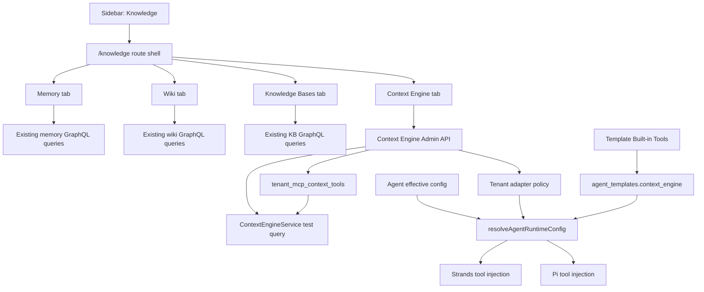

# feat: Add Admin Knowledge Center

## Overview

Add a unified Admin **Knowledge** center that replaces the separate Memories, Wiki Pages, and Knowledge Bases sidebar destinations with one tabbed operational surface. The page should preserve the existing Memory, Wiki, and Knowledge Base inspection workflows while adding Context Engine adapter configuration, safe test queries, and visibility into the effective Global -> Template -> Agent provider policy.

The implementation should land as a phased admin/configuration change, not a rewrite of the underlying memory or wiki systems. Existing source-specific pages move under a shared route shell. Context Engine configuration becomes operator-manageable through tenant-level adapter settings, template-level built-in tool/profile opt-in, and agent-level effective-config inspection.

---

## Problem Frame

Thinkwork now has several related context surfaces: Hindsight memory, compiled wiki pages, Bedrock Knowledge Bases, workspace/files, and approved MCP context tools. Admin used to spread those across separate navigation entries and adjacent capability/template screens, which made dogfood testing slow and made it hard to explain why an agent used raw Hindsight, Context Engine, Wiki, or a KB.

The origin document defines the product shape: one combined admin page with top tabs, Context Engine adapter management, and scoped configuration inheritance (see origin: `docs/brainstorms/2026-04-29-admin-memory-knowledge-center-requirements.md`). The earlier Context Engine plan already shipped the core service shape; this plan makes it operator-manageable in Admin and gates runtime injection cleanly.

---

## Requirements Trace

- R1. Replace separate primary sidebar entries for Memories, Wiki Pages, and Knowledge Bases with one combined Knowledge item.
- R2. Use top tabs matching the Capabilities page pattern for Memory, Wiki, Knowledge Bases, and Context Engine.
- R3. Preserve existing Memory table, graph, search, pagination, and user filtering.
- R4. Preserve existing Wiki list/graph/search/detail and Knowledge Base list/detail flows.
- R5. List Context Engine adapter families: Hindsight Memory, Wiki, Bedrock KB, workspace/filesystem, and approved MCP tools.
- R6. Show adapter status, enabled/default policy, last test result, last tested time, latency, and partial-failure reason.
- R7. Tenant-global config controls adapter eligibility and default participation.
- R8. Expose product-relevant provider settings such as Hindsight recall/reflect, timeout budget, selected bank/scope, KB inclusion, and MCP tool approval/default state.
- R9. Include a safe Admin test query flow with provider statuses and cited hits.
- R10. Tenant-global settings are source of truth for adapter eligibility, credentials/connection posture, health, and defaults.
- R11. Agent templates can opt into built-in Context Engine tools and choose a default context profile.
- R12. Template overrides operate only within globally approved providers.
- R13. Agent views show effective context configuration with inherited vs overridden values.
- R14. Agent-level overrides are visibly marked as drift and limited to explicit exceptions.
- R15. Hindsight appears as a Context Engine adapter when agents use `query_context` or `query_memory_context`, not as a confusing peer tool.
- R16. Distinguish raw source inspection from Context Engine routing configuration.
- R17. MCP providers remain approved at individual tool level before default search.
- R18. Provider failures/timeouts show as partial degradation.

**Origin actors:** A1 tenant admin, A2 agent/template operator, A3 support/debug operator, A4 agent runtime.

**Origin flows:** F1 admin reviews all memory and knowledge surfaces, F2 admin configures Context Engine adapters, F3 template operator chooses default context behavior, F4 operator inspects an agent's effective context policy.

**Origin acceptance examples:** AE1 unified nav/tabs, AE2 partial provider failure in Admin test query, AE3 global disable blocks template enablement, AE4 Hindsight shown through inherited Context Engine adapter, AE5 MCP search-safe tool-level approval.

---

## Scope Boundaries

- This plan does not merge Hindsight, Wiki, Knowledge Bases, or MCP data into one backend store.
- This plan does not replace the existing source-specific inspection workflows; they move under one page and keep their current core behavior.
- This plan does not build the true mobile Context Search screen.
- This plan does not make arbitrary MCP tools searchable; MCP Context Engine eligibility remains tool-level and search-safe.
- This plan does not make every provider knob editable at every hierarchy layer. Global, template, and agent each own distinct responsibility.

### Deferred to Follow-Up Work

- Rich mobile Context Search UI should remain a separate mobile product plan.
- Advanced provider tuning, eval dashboards, clickthrough learning, and routing-quality analytics should follow once the first operator surface is dogfooded.
- Broad agent-level editing of Context Engine overrides should wait until template/global behavior is stable; this plan only requires effective-config display plus narrow explicit override support.

---

## Context & Research

### Relevant Code and Patterns

- `apps/admin/src/routes/_authed/_tenant/capabilities.tsx` is the tabbed route-shell pattern to mirror.
- `apps/admin/src/components/Sidebar.tsx` currently lists `"/memory"`, `"/wiki"`, and `"/knowledge-bases"` as separate Agents-section nav items.
- `apps/admin/src/routes/_authed/_tenant/memory/index.tsx` owns the existing Memory table/graph/search/user-filter behavior and already uses `MemorySystemConfigQuery` to hide Hindsight-only graph UI when unavailable.
- `apps/admin/src/routes/_authed/_tenant/wiki/index.tsx` owns the existing Wiki pages/graph/search/user-filter behavior.
- `apps/admin/src/routes/_authed/_tenant/knowledge-bases/index.tsx` and `apps/admin/src/routes/_authed/_tenant/knowledge-bases/$kbId.tsx` own the KB list/detail/create/update flow.
- `apps/admin/src/routes/_authed/_tenant/capabilities/builtin-tools.tsx`, `apps/admin/src/lib/builtin-tools-api.ts`, and `apps/admin/src/lib/mcp-api.ts` show the Admin REST-client pattern for operator-managed tool configuration that is not modeled as pure GraphQL CRUD.
- `packages/api/src/lib/context-engine/*` already contains the Context Engine provider contract, router, service, and core providers.
- `packages/api/src/handlers/mcp-context-engine.ts` exposes `query_context` and `list_context_providers` through the API-owned MCP facade and formats provider status into tool output.
- `packages/database-pg/src/schema/mcp-servers.ts` already contains `tenant_mcp_context_tools`, which should be reused for MCP tool-level Context Engine approval/default state.
- `packages/database-pg/src/schema/agent-templates.ts` already stores built-in tool opt-in JSON for `sandbox`, `browser`, `web_search`, and `send_email`.
- `packages/api/src/lib/resolve-agent-runtime-config.ts` resolves template fields and agent capability overrides into the per-turn runtime payload for Strands/Pi.
- `packages/agentcore-strands/agent-container/container-sources/server.py` currently registers `query_context` unconditionally when the module/env are available.
- `packages/agentcore-pi/agent-container/src/runtime/tools/registry.ts` currently pushes Context Engine if API URL/secret are present, before raw Hindsight tools.

### Institutional Learnings

- `docs/solutions/best-practices/injected-built-in-tools-are-not-workspace-skills-2026-04-28.md`: platform tools like Context Engine should be injected built-ins, not workspace skills.
- `docs/solutions/best-practices/activation-runtime-narrow-tool-surface-2026-04-26.md`: focused runtimes need explicit tool allowlists; the Admin UI should reduce raw-tool confusion instead of expanding every direct provider tool.
- `docs/solutions/logic-errors/mobile-wiki-search-tsv-tokenization-2026-04-27.md`: keep Wiki search on the fast compiled-wiki FTS path and do not regress mobile/admin Wiki search through memory recall.
- `docs/solutions/best-practices/probe-every-pipeline-stage-before-tuning-2026-04-20.md`: provider diagnostics should show where a pipeline failed rather than relying on one aggregate success/failure.

### External References

- Not used. The repo already has the relevant Admin, Context Engine, TanStack Router, GraphQL, and runtime patterns; external research would add little for this implementation plan.

---

## Key Technical Decisions

- **Use `/knowledge` as the combined route family.** The sidebar label should be **Knowledge**. Child tabs route to `/knowledge/memory`, `/knowledge/wiki`, `/knowledge/knowledge-bases`, and `/knowledge/context-engine`. Existing `/memory`, `/wiki`, and `/knowledge-bases` URLs should redirect to the matching new tabs.
- **Extract before reshaping.** Move existing Memory, Wiki, and KB bodies into reusable tab components first, preserving behavior, then wire them under the new route shell. This lowers the chance of breaking current search/detail flows.
- **Use a hybrid API boundary.** Source inspection remains on existing GraphQL queries. Context Engine adapter config and test query can use a small Admin REST client because related built-in/MCP operator configuration already lives behind REST handlers, while template fields continue through GraphQL.
- **Store tenant adapter policy separately from runtime providers.** Add tenant-level Context Engine adapter configuration for non-MCP providers and reuse `tenant_mcp_context_tools` for MCP approval/default state. The Context Engine router should resolve effective provider selection from this config at query time.
- **Model template opt-in like other built-in tools.** Add a template-level `context_engine` JSON config and validator alongside `web_search`, `send_email`, `browser`, and `sandbox`.
- **Gate runtime injection through resolved config.** Strands and Pi should only register Context Engine tools when the resolved runtime payload enables them. This aligns with the Admin template toggle and removes the current unconditional registration behavior.
- **Show effective agent config before broad editing.** Agent-level UI should prioritize inherited/effective display and limited override markers; broad agent override editing is deferred unless the implementation finds an existing capability override path that is low-risk.

---

## Open Questions

### Resolved During Planning

- **Should this be one global page or template-specific only?** Both, with scoped responsibility: tenant-global adapter policy lives on the new page, while templates choose built-in tool injection and context profile.
- **Should Hindsight appear as a separate built-in tool in agent config?** No. In normal agent configuration it appears as a Context Engine adapter. Raw Hindsight tools may remain available for debugging/runtime compatibility but should not be presented as the ordinary path.
- **Should the Admin test query call the same Context Engine service as runtimes?** Yes. It should call the API-owned Context Engine facade/service so provider status matches Strands/Pi behavior.
- **Should the first pass rework mobile Wiki search?** No. The Wiki tab should preserve existing compiled-wiki FTS behavior; mobile Context Search remains follow-up work.

### Deferred to Implementation

- **Exact tenant adapter table shape:** The plan requires durable tenant adapter config; implementation should choose the smallest migration that supports provider id/family, enabled/default state, config JSON, and last-test status without duplicating `tenant_mcp_context_tools`.
- **Exact Hindsight setting labels:** Implementation should map operator-facing labels to the current provider capabilities after verifying whether recall/reflect mode and bank selection are available in the deployed service path.
- **Exact route compatibility coverage:** Implementation should verify all internal links to `/memory`, `/wiki`, and `/knowledge-bases` and either update or redirect them.
- **Exact test query response shape:** Implementation should reuse `ContextEngineResponse` where possible but may add Admin-only wrapper metadata for last-tested persistence and toast/error UX.

---

## High-Level Technical Design

> *This illustrates the intended approach and is directional guidance for review, not implementation specification. The implementing agent should treat it as context, not code to reproduce.*

---

## Implementation Units

- U1. **Add tenant Context Engine adapter configuration**

**Goal:** Add the backend persistence and admin service boundary needed to list, update, and test Context Engine adapter settings at the tenant-global layer.

**Requirements:** R5, R6, R7, R8, R9, R10, R17, R18; F2; AE2, AE5.

**Dependencies:** None.

**Files:**
- Create: `packages/database-pg/src/schema/context-engine-settings.ts`
- Modify: `packages/database-pg/src/schema/index.ts`
- Create: `packages/database-pg/drizzle/NNNN_context_engine_settings.sql`
- Modify: `packages/api/src/graphql/utils.ts`
- Modify: `packages/api/src/handlers/skills.ts`
- Create: `packages/api/src/lib/context-engine/admin-config.ts`
- Create: `packages/api/src/lib/context-engine/__tests__/admin-config.test.ts`
- Modify: `packages/api/src/lib/context-engine/__tests__/service.test.ts`

**Approach:**
- Introduce durable tenant adapter config for non-MCP providers with provider family/id, enabled state, default-enabled state, config JSON, last test metadata, and timestamps.
- Reuse `tenant_mcp_context_tools` for MCP tool approval/default state rather than creating a second MCP approval table.
- Add an Admin-facing list/update/test boundary that returns one normalized adapter catalog including built-in providers and approved/eligible MCP tools.
- Persist last test result and latency for operator visibility, but keep individual query hits out of durable storage.
- Keep source inspection GraphQL as-is; this unit only adds the configuration/diagnostic boundary.

**Execution note:** Start with backend characterization tests around adapter merge behavior so MCP and non-MCP provider policy cannot drift.

**Patterns to follow:**
- `packages/database-pg/src/schema/builtin-tools.ts` for tenant-owned tool configuration.
- `packages/database-pg/src/schema/mcp-servers.ts` for `tenant_mcp_context_tools`.
- `packages/api/src/handlers/skills.ts` for existing Admin REST handler style and tenant slug resolution.
- `packages/api/src/lib/context-engine/service.ts` for shared query execution.

**Test scenarios:**
- Happy path: listing adapters for a tenant returns Hindsight, Wiki, workspace/files, Bedrock KB, and discovered MCP context tools with normalized enabled/default/status fields.
- Happy path: approving a search-safe MCP tool updates `tenant_mcp_context_tools.approved` and `default_enabled` without changing server-level MCP registration.
- Edge case: an MCP tool that lacks read-only/search-safe metadata remains visible as ineligible and cannot be marked default.
- Error path: a test query where Hindsight times out but Wiki succeeds returns partial provider status and persists the degraded last-test state.
- Integration: Context Engine service selection respects tenant adapter defaults when no explicit provider selection is supplied.

**Verification:**
- Backend tests prove adapter listing, update validation, MCP eligibility, and partial-failure test-query behavior.
- Generated GraphQL/admin types include any newly added schema fields.

---

- U2. **Create the Knowledge route shell**

**Goal:** Add the combined Admin route family and replace the sidebar's three separate entries with one tabbed Knowledge destination.

**Requirements:** R1, R2, R16; F1; AE1.

**Dependencies:** None.

**Files:**
- Create: `apps/admin/src/routes/_authed/_tenant/knowledge.tsx`
- Create: `apps/admin/src/routes/_authed/_tenant/knowledge/index.tsx`
- Create: `apps/admin/src/routes/_authed/_tenant/knowledge/memory.tsx`
- Create: `apps/admin/src/routes/_authed/_tenant/knowledge/wiki.tsx`
- Create: `apps/admin/src/routes/_authed/_tenant/knowledge/knowledge-bases.tsx`
- Create: `apps/admin/src/routes/_authed/_tenant/knowledge/context-engine.tsx`
- Modify: `apps/admin/src/components/Sidebar.tsx`
- Modify: `apps/admin/src/routeTree.gen.ts`
- Test: `apps/admin/src/routes/_authed/_tenant/knowledge/-knowledge-tabs.test.ts`

**Approach:**
- Mirror the Capabilities route shell: title/icon at left, centered `TabsList`, route-child `Outlet`.
- Use `/knowledge/memory` as the default landing tab and redirect `/knowledge` there.
- Sidebar label should be "Knowledge"; choose an icon that reads as memory/knowledge without duplicating the KB-specific book icon.
- Keep tab labels short: Memory, Wiki, Knowledge Bases, Context Engine.
- Implement a small pure helper for current-tab selection so route matching can be unit tested without a full router harness.

**Patterns to follow:**
- `apps/admin/src/routes/_authed/_tenant/capabilities.tsx`
- `apps/admin/src/components/Sidebar.tsx`

**Test scenarios:**
- Happy path: pathname `/knowledge/memory` selects the Memory tab.
- Happy path: pathname `/knowledge/context-engine` selects the Context Engine tab.
- Edge case: unknown `/knowledge/*` child paths fall back to a sensible default tab state.
- Integration: sidebar item set contains one Knowledge entry and no separate Memories/Wiki Pages/Knowledge Bases entries.

**Verification:**
- The route tree contains the new route family and the sidebar visibly exposes one combined destination.

---

- U3. **Move existing Memory, Wiki, and Knowledge Base surfaces under tabs**

**Goal:** Preserve the existing source inspection workflows while relocating them under the new route family and maintaining compatibility for old links.

**Requirements:** R3, R4, R16; F1; AE1.

**Dependencies:** U2.

**Files:**
- Modify: `apps/admin/src/routes/_authed/_tenant/memory/index.tsx`
- Modify: `apps/admin/src/routes/_authed/_tenant/wiki/index.tsx`
- Modify: `apps/admin/src/routes/_authed/_tenant/knowledge-bases/index.tsx`
- Modify: `apps/admin/src/routes/_authed/_tenant/knowledge-bases/$kbId.tsx`
- Create: `apps/admin/src/components/knowledge-center/MemoryTab.tsx`
- Create: `apps/admin/src/components/knowledge-center/WikiTab.tsx`
- Create: `apps/admin/src/components/knowledge-center/KnowledgeBasesTab.tsx`
- Test: `apps/admin/src/components/knowledge-center/__tests__/knowledge-center-routing.test.ts`

**Approach:**
- Extract the current Memory, Wiki, and KB page bodies into tab components before changing routes.
- Keep current table/graph toggles, search params, user/agent filters, sheets, and detail flows working inside each tab.
- Convert old top-level routes to redirects into `/knowledge/*`, preserving compatible query params where possible.
- For Knowledge Base detail pages, either nest the detail under `/knowledge/knowledge-bases/$kbId` or keep the current detail route as a compatibility route that renders within the new shell; choose the smallest approach that preserves back navigation and breadcrumbs.
- Update internal links that point to the old routes after redirects are in place.

**Execution note:** Treat this as a preservation refactor; avoid visual redesign beyond the new parent tabs.

**Patterns to follow:**
- Existing route bodies in `apps/admin/src/routes/_authed/_tenant/memory/index.tsx`, `apps/admin/src/routes/_authed/_tenant/wiki/index.tsx`, and `apps/admin/src/routes/_authed/_tenant/knowledge-bases/index.tsx`.
- `apps/admin/src/components/PageLayout.tsx` and `apps/admin/src/context/BreadcrumbContext.tsx`.

**Test scenarios:**
- Covers AE1. Happy path: opening the Memory tab renders the current memory search/table controls and still supports graph mode when Hindsight is enabled.
- Covers AE1. Happy path: opening the Wiki tab renders current page/search controls and can open the existing page detail sheet.
- Covers AE1. Happy path: opening Knowledge Bases lists KB rows and preserves New KB/dialog behavior.
- Edge case: old `/memory?view=graph&agent=...` redirects to the Memory tab without dropping meaningful filters.
- Edge case: old `/wiki?view=graph&agent=...` redirects to the Wiki tab without dropping meaningful filters.
- Integration: a KB row click still lands on a KB detail surface with the combined page's navigation context intact.

**Verification:**
- Admin build succeeds with route generation.
- Manual browser verification confirms existing Memory/Wiki/KB workflows behave the same inside the new tabs.

---

- U4. **Build the Context Engine Admin tab**

**Goal:** Give operators a first-class UI for adapter status, default policy, provider-specific settings, MCP tool approval/default state, and safe test queries.

**Requirements:** R5, R6, R7, R8, R9, R10, R16, R17, R18; F2; AE2, AE5.

**Dependencies:** U1, U2.

**Files:**
- Modify: `apps/admin/src/routes/_authed/_tenant/knowledge/context-engine.tsx`
- Create: `apps/admin/src/lib/context-engine-api.ts`
- Create: `apps/admin/src/components/context-engine/ContextEngineAdaptersTable.tsx`
- Create: `apps/admin/src/components/context-engine/ContextEngineAdapterSheet.tsx`
- Create: `apps/admin/src/components/context-engine/ContextEngineTestQuery.tsx`
- Create: `apps/admin/src/components/context-engine/__tests__/context-engine-adapters.test.ts`
- Create: `apps/admin/src/components/context-engine/__tests__/context-engine-test-query.test.ts`

**Approach:**
- Render an adapter table with provider display name, family, status, enabled/default policy, last test, latency, and last error/reason.
- Use an edit sheet for operator settings so the table remains dense and scannable.
- For Hindsight, expose only settings the backend can actually honor; default to reflect-vs-recall and timeout as named fields if available, otherwise show them as planned but disabled with an explanatory status.
- For KBs, show the family status plus the number of eligible KBs, and link into the Knowledge Bases tab/detail where appropriate.
- For MCPs, list tool-level eligibility from `tenant_mcp_context_tools` and enforce read-only/search-safe gating in the UI.
- Add a test query panel that calls the same backend test boundary and renders provider statuses plus top cited hits.

**Patterns to follow:**
- `apps/admin/src/routes/_authed/_tenant/capabilities/builtin-tools.tsx` for tool configuration table/edit/test UX.
- `apps/admin/src/lib/builtin-tools-api.ts` and `apps/admin/src/lib/mcp-api.ts` for REST helper shape.
- `apps/admin/src/components/ui/data-table.tsx`, `apps/admin/src/components/ui/sheet.tsx`, and `apps/admin/src/components/ui/badge.tsx`.

**Test scenarios:**
- Covers AE2. Happy path: a test query with Memory and Wiki hits renders provider statuses and top cited hits.
- Covers AE2. Error path: a provider timeout renders as degraded while successful provider results remain visible.
- Covers AE5. Error path: attempting to default-enable an MCP tool that is not read-only/search-safe is blocked client-side and rejected server-side.
- Edge case: an adapter with no prior test shows an empty last-tested state without looking broken.
- Integration: toggling a provider default updates the adapter table after refetch without requiring page reload.

**Verification:**
- Operators can run a real dev-stage test query from Admin and see provider-level status comparable to agent/mobile smoke output.

---

- U5. **Add template Context Engine built-in tool controls and runtime gating**

**Goal:** Let templates explicitly inject Context Engine built-in tools into Strands and Pi and ensure runtime registration follows the resolved template policy.

**Requirements:** R10, R11, R12, R15, R16; F3; AE3, AE4.

**Dependencies:** U1.

**Files:**
- Modify: `packages/database-pg/src/schema/agent-templates.ts`
- Modify: `packages/database-pg/graphql/types/agent-templates.graphql`
- Create: `packages/database-pg/drizzle/NNNN_agent_template_context_engine.sql`
- Create: `packages/api/src/lib/templates/context-engine-config.ts`
- Modify: `packages/api/src/graphql/resolvers/templates/agentTemplate.query.ts`
- Modify: `packages/api/src/graphql/resolvers/templates/createAgentTemplate.mutation.ts`
- Modify: `packages/api/src/graphql/resolvers/templates/updateAgentTemplate.mutation.ts`
- Modify: `packages/api/src/lib/resolve-agent-runtime-config.ts`
- Modify: `packages/api/src/lib/__tests__/resolve-agent-runtime-config.test.ts`
- Modify: `packages/api/src/handlers/agents-runtime-config.ts`
- Modify: `packages/api/src/handlers/agents-runtime-config.test.ts`
- Modify: `apps/admin/src/lib/graphql-queries.ts`
- Modify: `apps/admin/src/gql/graphql.ts`
- Modify: `apps/admin/src/routes/_authed/_tenant/agent-templates/$templateId.$tab.tsx`
- Modify: `packages/agentcore-strands/agent-container/container-sources/server.py`
- Modify: `packages/agentcore-strands/agent-container/container-sources/context_engine_tool.py`
- Modify: `packages/agentcore-strands/agent-container/test_context_engine_tool.py`
- Modify: `packages/agentcore-pi/agent-container/src/runtime/tools/registry.ts`
- Modify: `packages/agentcore-pi/agent-container/src/runtime/tools/context-engine.ts`
- Test: `packages/agentcore-pi/agent-container/src/runtime/tools/context-engine.test.ts`

**Approach:**
- Add an `agent_templates.context_engine` JSON config validated like existing built-in tool configs. Initial shape should cover enabled state, default profile/provider families, and optional specialized tool exposure.
- Add a Context Engine card to the Agent Template configuration sidebar alongside Code Sandbox, Browser Automation, Web Search, and Send Email.
- Validate that template-selected providers are a subset of globally approved tenant adapter policy before saving or before runtime resolution.
- Extend `resolveAgentRuntimeConfig` to include a normalized `contextEngineConfig` payload for Strands/Pi.
- Change Strands and Pi tool registration from environment-only to config-gated. If config disables Context Engine, the tool is absent even when API URL/secret exist.
- If specialized `query_memory_context` / `query_wiki_context` tools are present in the target runtime branch, gate them under the same template config and present them as Context Engine variants, not raw provider peers.

**Execution note:** Add runtime resolver tests before changing container registration; this is the boundary that prevents the UI toggle from becoming decorative.

**Patterns to follow:**
- `packages/api/src/lib/templates/web-search-config.ts`
- `packages/api/src/lib/templates/send-email-config.ts`
- `packages/api/src/lib/resolve-agent-runtime-config.ts`
- Existing cards in `apps/admin/src/routes/_authed/_tenant/agent-templates/$templateId.$tab.tsx`
- `packages/agentcore-pi/agent-container/src/runtime/tools/web-search.ts`

**Test scenarios:**
- Covers AE3. Happy path: a template with Context Engine enabled and globally approved Memory/Wiki providers yields a runtime payload that enables `query_context`.
- Covers AE3. Error path: a template cannot enable a provider family that is globally disabled.
- Covers AE4. Happy path: Strands registers `query_context` only when resolved config enables it.
- Covers AE4. Happy path: Pi registers `query_context` only when resolved config enables it.
- Edge case: missing API URL/secret still disables the runtime tool gracefully even when the template is enabled.
- Integration: saving a template with Context Engine disabled removes the tool from a newly resolved runtime config.

**Verification:**
- Template UI exposes a Context Engine toggle/profile.
- Runtime config tests prove template settings affect Strands and Pi tool registration.

---

- U6. **Show effective agent context policy**

**Goal:** Make agent-level Context Engine behavior explainable by showing inherited global/template config and narrow override drift.

**Requirements:** R13, R14, R15, R16; F4; AE4.

**Dependencies:** U1, U5.

**Files:**
- Modify: `packages/database-pg/graphql/types/agents.graphql`
- Modify: `packages/api/src/graphql/resolvers/agents/agent.query.ts`
- Modify: `packages/api/src/graphql/resolvers/agents/index.ts`
- Create: `packages/api/src/graphql/resolvers/agents/agentContextPolicy.query.ts`
- Modify: `apps/admin/src/lib/graphql-queries.ts`
- Modify: `apps/admin/src/gql/graphql.ts`
- Modify: `apps/admin/src/routes/_authed/_tenant/agents/$agentId.tsx`
- Modify: `apps/admin/src/routes/_authed/_tenant/agents/$agentId_.knowledge.tsx`
- Modify: `apps/admin/src/routes/_authed/_tenant/agents/$agentId_.memory.tsx`
- Create: `apps/admin/src/components/context-engine/AgentContextPolicyPanel.tsx`
- Create: `apps/admin/src/components/context-engine/__tests__/agent-context-policy.test.ts`

**Approach:**
- Add a GraphQL read model for an agent's effective Context Engine policy: global adapter state, template profile, agent override state, and final enabled/default provider list.
- Surface this panel on the agent detail/knowledge-memory area where operators already troubleshoot agent context.
- Mark inherited values, template overrides, and agent drift visually with compact badges.
- Make Hindsight appear under the Context Engine provider list rather than as a standalone raw Hindsight peer when the effective tool is `query_context`.
- If editing agent-level overrides is implemented in this unit, keep it narrow and explicit: enable/disable Context Engine for this agent or provider inclusion exceptions within global approval limits.

**Patterns to follow:**
- Agent capability/effective config conventions in `packages/api/src/lib/resolve-agent-runtime-config.ts`.
- Existing agent detail subroutes under `apps/admin/src/routes/_authed/_tenant/agents/`.
- Badges/tables used by Capabilities and Knowledge Bases pages.

**Test scenarios:**
- Covers AE4. Happy path: an agent with an enabled template and no override shows Context Engine enabled, Hindsight as an adapter, and all values marked inherited/template.
- Covers AE4. Edge case: an agent override is displayed as drift from the template.
- Error path: globally disabled provider appears unavailable and cannot be shown as effectively enabled through template or agent override.
- Integration: effective config read model matches the runtime resolver's output for the same agent.

**Verification:**
- Operators can open an agent and explain which Context Engine providers it will use before starting a chat.

---

- U7. **Codegen, visual verification, and rollout polish**

**Goal:** Regenerate schemas/routes, verify Admin UI behavior in browser, and document rollout/redirect expectations.

**Requirements:** R1-R18; all origin flows and acceptance examples.

**Dependencies:** U1-U6.

**Files:**
- Modify: `apps/admin/src/routeTree.gen.ts`
- Modify: `apps/admin/src/gql/graphql.ts`
- Modify: `terraform/schema.graphql`
- Modify: `docs/brainstorms/2026-04-29-admin-memory-knowledge-center-requirements.md` if implementation decisions require a requirements correction
- Test: existing tests referenced by U1-U6

**Approach:**
- Run all required codegen after GraphQL and route changes.
- Verify the Admin page at desktop widths and a narrow viewport so tab text, tables, and action buttons do not overlap.
- Confirm old routes redirect cleanly and browser back behavior is not disorienting.
- Verify the Context Engine test query against dev-stage data with both success and partial-failure responses when available.
- Keep deployment risk low by preserving existing GraphQL source flows and introducing redirects rather than removing old paths abruptly.

**Patterns to follow:**
- Admin dev-server instructions in `AGENTS.md`.
- Capabilities page screenshot/pattern from the user request.

**Test scenarios:**
- Covers AE1. Browser verification: sidebar has one Knowledge entry and tabs switch without losing shell layout.
- Covers AE2. Browser verification: Context Engine test query displays degraded provider status without hiding successful hits.
- Covers AE3. Browser/API verification: global-disabled provider cannot be enabled in template UI.
- Covers AE4. Browser verification: agent effective policy panel shows Hindsight under Context Engine.
- Covers AE5. Browser/API verification: MCP mutation tools are not default-search eligible.

**Verification:**
- Admin build/typecheck/codegen are clean.
- Browser smoke confirms Memory, Wiki, KB, Context Engine, template config, and agent effective policy paths.

---

## System-Wide Impact

- **Interaction graph:** Sidebar and TanStack routes change for three existing pages; GraphQL/admin API adds config reads/writes; runtime config resolver now controls Context Engine tool registration for Strands and Pi.
- **Error propagation:** Provider failures must remain provider-local statuses in Context Engine responses and Admin test query results, not whole-page failures.
- **State lifecycle risks:** Tenant global adapter defaults, template context config, and optional agent overrides can drift. The effective config read model is required so operators can see which layer wins.
- **API surface parity:** Admin, runtime config, Strands, and Pi must agree on whether `query_context` is enabled.
- **Integration coverage:** Unit tests alone will not prove route redirects, visual density, and real provider statuses; browser/dev-stage verification is part of completion.
- **Unchanged invariants:** Existing Memory/Wiki/KB inspection behavior and mobile Wiki FTS search are preserved; this plan adds Admin organization/configuration rather than replacing source-specific reads.

---

## Risks & Dependencies

| Risk | Mitigation |
|------|------------|
| Route migration breaks existing bookmarked links or internal links | Ship redirects for old routes and update internal links after verifying routeTree generation |
| Context Engine config duplicates or conflicts with `tenant_mcp_context_tools` | Reuse `tenant_mcp_context_tools` for MCP approval/default state and reserve new config for non-MCP adapters |
| Template toggle is decorative if runtimes still register tools from env only | Make runtime config resolver and Strands/Pi registration tests part of U5 |
| Hindsight performance issues are hidden by aggregate test status | Provider status must include latency and partial failure reason; Admin test query must show degraded Hindsight separately |
| UI becomes too broad for one PR | Land in dependency order: route consolidation and preserved tabs first, then Context Engine config, then template/agent effective policy |

---

## Documentation / Operational Notes

- The new sidebar item is called **Knowledge**. "Memory & Knowledge" was the planning label and should not appear in product copy.
- Existing operator docs/screenshots referencing Memories, Wiki Pages, or Knowledge Bases as separate nav items need follow-up updates after the UI ships.
- Dev verification should use the running Admin dev server and dev-stage backend so Hindsight/Wiki/KB provider statuses are real.
- Deployment should be watched for GraphQL schema/codegen consistency if new schema fields are added.

### Implementation Checkpoint — 2026-04-29

- U2 and U3 are implemented in the current branch: Memory, Wiki, Knowledge Bases, and Context Engine live under `/knowledge/*`; the sidebar shows one Knowledge item.
- U4 has a working first pass: the Context Engine tab lists built-in adapter families and has a dev-stage test harness with adapter selection, agent/workspace target, Hindsight recall/reflect strategy, provider statuses, top hits, and markdown/full-result dialogs.
- U5 has the core path in progress/implemented for template-level Context Engine built-in tool injection and runtime gating in Strands/Pi. The Template UI includes a Context Engine card and configuration dialog.
- U6 broad agent-level override editing remains a follow-up. Current agent targeting is available in the Admin test harness to verify workspace-file retrieval against a selected agent.

---

## Sources & References

- **Origin document:** [docs/brainstorms/2026-04-29-admin-memory-knowledge-center-requirements.md](../brainstorms/2026-04-29-admin-memory-knowledge-center-requirements.md)
- Related requirements: [docs/brainstorms/2026-04-28-context-engine-requirements.md](../brainstorms/2026-04-28-context-engine-requirements.md)
- Existing Context Engine plan: [docs/plans/2026-04-28-008-feat-context-engine-plan.md](2026-04-28-008-feat-context-engine-plan.md)
- Related Admin route shell: `apps/admin/src/routes/_authed/_tenant/capabilities.tsx`
- Related Admin pages: `apps/admin/src/routes/_authed/_tenant/memory/index.tsx`, `apps/admin/src/routes/_authed/_tenant/wiki/index.tsx`, `apps/admin/src/routes/_authed/_tenant/knowledge-bases/index.tsx`
- Related backend service: `packages/api/src/lib/context-engine/service.ts`
- Related MCP facade: `packages/api/src/handlers/mcp-context-engine.ts`
- Related MCP context tools table: `packages/database-pg/src/schema/mcp-servers.ts`
- Related runtime resolver: `packages/api/src/lib/resolve-agent-runtime-config.ts`
