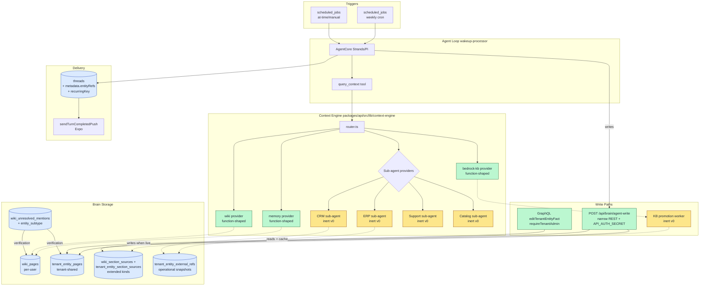

# feat: Company Brain v0

## Overview

Company Brain v0 reframes the existing Context Engine into an **agent-augmentation substrate** for LastMile sales reps. Wedge tasks: cold-opportunity triage (Monday automation) and pre-meeting one-pager (calendar trigger). Both deliver via existing agent threads + push notifications — no new mobile surface in v0.

The plan extends (does not replace) the shipped 2026-04-28 Context Engine plan. New work clusters into:

1. Schema foundation: `entity_subtype` field, parallel `tenant_entity_pages` table family, extended `WikiSectionSourceKind` for ERP/CRM/order/support/KB back-pointers.
2. Sub-agent context provider shape (in-Lambda Bedrock Converse) with read-only inert seams in v0; designed for v1+ writes.
3. Brain-write API (live in v0) — narrow REST endpoint for agents to capture notes/follow-ups/relationship-state into `tenant_entity_pages` facets.
4. Bidirectional source-system links so the agent (and rep) can navigate from any cited fact back to its origin (Hindsight session, ERP order, CRM opportunity, KB document).
5. KB-sourced → compiled facet promotion (inert in v0; live in PR-2 of the seam swap).
6. Trust gradient encoded as defense-in-depth (schema labels + resolver gates + agent prompt).
7. Wedge automations writing to existing agent threads with push delivery; per-rep recurring thread keying via `ensureRecurringThread`.
8. Verification UX extending `wiki_unresolved_mentions` with subtype assignment and personal-vs-tenant routing.
9. Operator verification panel for the new sub-agent providers (per-adapter hit count, latency, freshness state, agent-target binding).
10. Evals + dogfood for one rep × 4 weeks of triage + one-pager.

---

## Problem Frame

LastMile sales reps fail at scale not because data is missing but because it lives across N systems with separate logins (ERP, support, catalog) and disconnected mental models. The shipped Context Engine fans out across knowledge sources but stops at search. The product goal has shifted: **pair reps with agents that do routine work end-to-end**, where output quality requires rich, current, trust-graded context that survives rep turnover.

The Brain becomes an agent-feeding substrate first and a rep-facing browse surface second. Compounding (write-back) and operational continuity (knowledge survives staff turnover) are the actual product. See origin: `docs/brainstorms/2026-04-29-company-brain-v0-requirements.md`.

---

## Requirements Trace

**Wedge tasks**
- R1. Cold-opportunity triage runs on a per-rep weekly schedule, writes to a recurring agent thread with push notification, and ranks opps with "why cold" reasoning grounded in operational + relationship + activity facets.
- R2. Pre-meeting one-pager renders structured customer brief (operational, relationship, activity, KB-sourced facets) into a per-meeting or per-customer thread with push notification. v0 trigger: manual or `scheduled_jobs.at` row; auto-calendar source connector deferred (see Scope Boundaries).

**Identity, facets, trust**
- R3. Page identity binds 1:1 to either a per-user `wiki_pages` row (personal pages) or a tenant-scoped `tenant_entity_pages` row (Customer/Opportunity/Order/Person). No orphan pages; no widening of `wiki_pages` owner-scoping.
- R4. Pages compose typed facets: **operational** (live, never stored), **relationship** (append-only durable), **activity** (Hindsight-backed), **compiled** (curated narrative), **KB-sourced** (Bedrock KB citations), **external** (transient web/MCP with TTL).
- R5. Trust gradient enforced at three layers — schema (`aggregation.facet_type` labels per section), resolver (insert/update gates that refuse cross-tier promotion without an explicit step), agent prompt (system message includes the trust ladder).
- R6. Every fact carries source citation and an "as of" timestamp. Citations are navigable back to the source (Hindsight unit, ERP record, CRM record, KB document) via the extended `wiki_section_sources` / new `tenant_entity_section_sources` tables.

**Sub-agent context providers**
- R7. Sub-agent provider shape extends `ContextProviderDescriptor` with typed `subAgent?` config (prompt ref, tool allowlist, depth cap, process model). v0 process model is in-Lambda Bedrock Converse; AgentCore sub-runtime reserved for v1+.
- R8. Sub-agent providers are **read-only in v0**, designed with a write-capable seam shape so v1+ activates writes without re-architecting (per inert→live seam pattern).
- R9. Sub-agent providers normalize hits to the existing Context Engine `ContextHit` shape; provider statuses extend with `state: 'stale'` and `freshness: { asOf, ttlSeconds }` for operational facet freshness rendering.
- R10. ERP, CRM, support, catalog sub-agent providers ship as inert-seam stubs in v0 (return `{ok: false, reason: "<adapter> not yet wired"}`); the function-shaped Memory and Wiki providers stay function-shaped (their quirks are thin).

**Brain write surface (v0 live)**
- R11. Brain writes (notes, follow-ups, decisions, relationship-state) land via a narrow `POST /api/brain/agent-write` REST endpoint authenticated with `API_AUTH_SECRET`, taking `tenantId` + `invokerUserId` + `entityRef` + `factPayload`. Tenant cross-check on every call. Never widen `resolveCaller`.
- R12. GraphQL mutations exposed for rep audit/edit/reject of agent-written facts on `tenant_entity_pages`; every mutation calls `requireTenantAdmin(ctx, row.tenant_id)` before any side effect.
- R13. Brain writes capture provenance via `tenant_entity_section_sources` rows pointing back to the originating Hindsight session/turn.
- R14. v0 Brain writes are scoped to the Brain itself. Operational system writes (ERP/CRM mutations) deferred to v1+ via the same sub-agent provider seam.

**Source-system back-pointers (the user's explicit concern)**
- R15. `WikiSectionSourceKind` extended to include `'erp_customer' | 'crm_opportunity' | 'erp_order' | 'crm_person' | 'support_case' | 'bedrock_kb'` (loose `text` column — additive, no enum migration).
- R16. New `tenant_entity_section_sources` table (parallel to existing `wiki_section_sources`) carries the same `(section_id, source_kind, source_ref)` shape against `tenant_entity_page_sections`.
- R17. Forward and reverse traversal helpers (`recordSectionSources`, `findMemoryUnitPageSources`, `listSourceMemoryIdsForPage`, `countSourceMemoriesForPage`) generalized to operate over both wiki and tenant-entity tables. Reverse traversal is what powers "which pages cite this Hindsight unit / ERP record" lookups.
- R18. New `tenant_entity_external_refs` table (modeled after `wiki_places`) caches operational-facet snapshots with `source_kind`, `external_id`, `source_payload jsonb`, `as_of`, `ttl_seconds` columns. Refresh-on-staleness; first-write-wins on the row identity.

**KB-sourced facet promotion**
- R19. Bedrock KB provider hits flow into a post-query promotion worker. Promotion writes `tenant_entity_section_sources` rows with `source_kind = 'bedrock_kb'` and `source_ref = ${awsKbId}:${location}`, and updates the KB-sourced facet section on the matching entity page.
- R20. Promotion algorithm v0: conservative — Bedrock score ≥ 0.7 AND no conflicting fact already in the compiled facet. Tunable via tenant config; eval-driven adjustment in dogfood.
- R21. KB-promotion uses the inert→live seam pattern: PR-1 emits `would_promote` log events without writing; PR-2 lights up writes after dogfood validates accuracy.

**Proactive triggers via existing automations**
- R22. Wedge tasks invoke through existing `scheduled_jobs → job-schedule-manager → EventBridge → job-trigger → wakeup-processor` pipeline. No new platform infrastructure.
- R23. New `ensureRecurringThread` helper (or typed `threads.metadata.recurringKey`) so per-rep weekly triage finds-or-creates instead of accumulating one new thread per fire.
- R24. Per-meeting / per-customer thread context typed via `threads.metadata.entityRefs: Array<{pageTable, pageId, subtype}>`. Additive to existing jsonb; no schema migration.

**Entity typing and verification**
- R25. New `entity_subtype text NULLABLE` column on `wiki_pages` (additive migration; backfill best-effort) and on the new `tenant_entity_pages` (populated from creation). Vocabulary: `'customer' | 'opportunity' | 'order' | 'person' | 'concept' | 'reflection' | …`.
- R26. `wiki_unresolved_mentions` extended with `entity_subtype` field. Promotion routes either to `wiki_pages` (when subtype is personal — `concept`, `reflection`) or `tenant_entity_pages` (when subtype is tenant-shared — `customer`, `opportunity`, etc.).
- R27. Mobile verification UI surfaces pending mentions with subtype suggestion; rep can accept (creates canonical page record), edit subtype/relationships, or reject.

**Mobile delivery**
- R28. Wedge output lands in the existing thread UI via push notification. No new "Brain" tab in v0. SDK adds typed thread metadata for entity refs.
- R29. Mobile SDK gains hooks for tenant-entity page reads and facet edit/reject mutations: `useTenantEntityPage`, `useTenantEntityFacets`, edit/reject mutations.

**Continuity and onboarding**
- R30. Durable knowledge survives rep turnover via tenant-scoped facets on `tenant_entity_pages`, not via threads. New-rep briefing draws from accumulated relationship facet, not the prior rep's per-user wiki or per-rep working threads.

**Operator verification**
- R31. Operator panel (extension of Admin → Knowledge → Context Engine tab) shows per-sub-agent-provider hit count, latency, skipped/degraded/stale state, agent-target binding. No-hit results are inspectable so operators can distinguish "no data" from "wrong target" from "rate limited" from "model picked the raw tool."

**Origin actors:** A1 (LastMile sales rep), A2 (AI agent), A3 (sub-agent context provider), A4 (new rep onboarded), A5 (tenant admin), A6 (existing automations runtime).

**Origin flows:** F1 (cold-opp triage), F2 (pre-meeting one-pager), F3 (closed-loop write-back), F4 (KB-backed enrichment on gap), F5 (new-rep onboarding briefing), F6 (entity verification by user).

**Origin acceptance examples:** AE1 (triage list with why-cold), AE2 (one-pager with KB-sourced terms), AE3 (post-call write-back), AE4 (KB → compiled vs web → external split), AE5 (rep-leaves new-rep-inherits), AE6 (sub-agent stale failure mode), AE7 (entity verification flow), AE8 (tenant-scoped page survives rep transition).

---

## Scope Boundaries

### Deferred for later

(Carried from origin)

- Operational system writes (ERP, CRM, support, catalog mutations). Sub-agent contract designed to support; v0 ships read-only.
- Quarterly check-in drafting and outbound communication generation.
- Schema-on-demand for novel knowledge types (Scout's `scout_<thing>` pattern).
- Voice or push-to-talk Brain interaction.
- First-party Slack / Drive / Gmail / GitHub / Calendar providers (beyond the calendar trigger source connector for one-pager).
- Multi-tenant domain packs across non-LastMile verticals.
- Auto-promotion of external (web/MCP) facts into compiled facet without a reasoning gate.
- Cross-rep aggregations (book-level pattern detection).

### Outside this product's identity

(Carried from origin)

- General-purpose Notion-style wiki for human-only knowledge capture.
- Unified vector index that ingests every source as the primary architecture.
- Pure CRM that competes with LastMile customers' existing operational ERP/CRM.
- Agent platform that operates without a Brain.
- "Ask anything" search bar as the primary UX.

### Deferred to Follow-Up Work

- **Calendar source connector for R2 auto-trigger.** v0 ships the one-pager logic with a manual-fire / `scheduled_jobs.at`-based trigger. Calendar integration (Google Calendar / O365 → `scheduled_jobs.at` rows) is a separate plan. The wedge can dogfood without auto-calendar-trigger.
- **AgentCore sub-runtime process model for sub-agent providers.** v0 ships in-Lambda Bedrock Converse only. AgentCore option reserved for v1+ when sub-agents need pagination loops or larger tool surfaces.
- **Cross-rep activity facet aggregation.** Hindsight banks are user-keyed; v0 renders per-rep activity in each rep's view of the entity. Shared activity facet (post-turn worker that materializes per-entity activity rows) is a follow-up plan.
- **KB-promotion threshold tuning.** v0 ships conservative threshold (Bedrock score ≥ 0.7); production tuning via dogfood traces is follow-up.
- **Auto-write-back via inert→live seam swap (PR-2 of each sub-agent provider).** v0 lands inert-seam adapters; activation is per-adapter follow-up plans.

---

## Context & Research

### Relevant Code and Patterns

**Wiki and source-back-pointer foundation**
- `packages/database-pg/src/schema/wiki.ts` — single source of truth for the wiki schema (645 lines). Tables: `wiki_pages`, `wiki_page_sections`, `wiki_page_links`, `wiki_page_aliases`, `wiki_unresolved_mentions`, `wiki_section_sources`, `wiki_compile_jobs`, `wiki_places`. The `WikiSectionSourceKind` type union is the extension point for new back-pointer kinds.
- `packages/api/src/lib/wiki/repository.ts` — `recordSectionSources`, `findMemoryUnitPageSources`, `countSourceMemoriesForPage`, `listSourceMemoryIdsForPage` (the four traversal helpers to generalize for `tenant_entity_section_sources`).
- `packages/api/src/lib/wiki/journal-import.ts` (lines 288-339) — back-pointer flattening pattern (external row IDs → Hindsight `memory_units.metadata` → wiki). The convention for ERP/CRM/order back-pointers should mirror this.
- `packages/api/src/lib/wiki/section-writer.ts` and `packages/api/src/lib/wiki/aggregation-planner.ts` — the LLM section-writer is already disciplined to keep prose free of inline citations and require `source_refs` per section. Generalizes for tenant entities.
- `packages/api/src/lib/wiki/places-service.ts`, `google-places-client.ts` — the precedent for first-class external-system identity caching (modeled into `tenant_entity_external_refs`).

**Context Engine provider foundation**
- `packages/api/src/lib/context-engine/types.ts` — `ContextProviderDescriptor`, `ContextProviderResult`, `ContextProviderStatus`, `ContextHit`, `ContextHitProvenance`. The contract to extend.
- `packages/api/src/lib/context-engine/router.ts` — parallel fan-out, `runProvider` with `withTimeout`, `FAMILY_ORDER` for tie-breaks. Sub-agent providers slot in here.
- `packages/api/src/lib/context-engine/service.ts` — per-request provider loading; tenant config caching.
- `packages/api/src/lib/context-engine/providers/index.ts` (`createCoreContextProviders`, `createTenantMcpContextProviders`) — registration pattern.
- `packages/api/src/lib/context-engine/providers/{memory,wiki,workspace-files,bedrock-knowledge-base,mcp-tool}.ts` — five existing function-shaped providers.
- `packages/api/src/handlers/mcp-context-engine.ts` — MCP JSON-RPC facade Lambda.
- `packages/api/src/lib/context-engine/admin-config.ts` — operator-level adapter eligibility (extension point for sub-agent provider config).

**Sub-agent precedent**
- `packages/agentcore-strands/agent-container/container-sources/delegate_to_workspace_tool.py` (31KB, well-tested) — the live shape: path validation, depth cap (`MAX_FOLDER_DEPTH = 5`), fresh Bedrock model + scoped tool allowlist, structured return. Brain v0 sub-agent providers should mirror this conceptually but live in `packages/api`, not Strands.
- `packages/api/src/lib/wiki/bedrock.ts` (`invokeClaude`) — the in-Lambda Bedrock Converse pattern Brain v0 sub-agent providers should reuse.

**Thread + push + automation pipeline**
- `packages/database-pg/src/schema/threads.ts` — `threads`, `thread_labels`, `thread_attachments`. `metadata jsonb` is the extension point for `entityRefs`. Identifier scheme `${PREFIX}-${tenants.issue_counter}`.
- `packages/database-pg/src/lib/thread-helpers.ts` (`ensureThreadForWork`) — the single creation helper. Brain v0 adds `ensureRecurringThread` parallel to it.
- `packages/database-pg/src/schema/scheduled-jobs.ts` — `scheduled_jobs`, `thread_turns`, `thread_turn_events`, `agent_wakeup_requests`. The substrate for triage automation.
- `packages/lambda/job-schedule-manager.ts` and `packages/lambda/job-trigger.ts` — EventBridge schedule creation and target Lambda. Brain v0 adds new scheduled-job rows but does not modify these handlers.
- `packages/api/src/handlers/wakeup-processor.ts` (lines 1916-1954) — the canonical post-turn flow: thread metadata update + `sendTurnCompletedPush` + `notifyThreadTurnUpdate`. No changes; Brain v0 reuses.
- `packages/api/src/lib/push-notifications.ts` — `sendTurnCompletedPush` payload `data: { threadId, type: "turn_completed" }`. No changes.

**Hindsight integration**
- `packages/api/src/lib/memory/index.ts`, `packages/api/src/lib/memory/types.ts`, `packages/api/src/lib/memory/adapters/hindsight-adapter.ts` — `MemoryOwnerRef` (per-user banks confirmed), `ThinkWorkMemoryRecord.id = String(unit.id)`, `backendRefs: [{ backend: "hindsight", ref: ... }]` already on every record. Provenance flows through.
- `packages/api/src/lib/context-engine/providers/memory.ts` (lines 96-104) — `provenance.sourceId = hit.record.id` already set; Brain back-pointers come for free for activity facet citations.

**Mobile SDK**
- `packages/react-native-sdk/src/hooks/use-thread.ts`, `use-threads.ts`, `use-messages.ts`, `use-context-query.ts`, `use-subscriptions.ts` — existing hooks Brain v0 reuses for the wedge.
- `packages/react-native-sdk/src/context-engine.ts` — `queryContext()` HTTP wrapper to MCP facade. No changes for v0 read paths.
- `packages/react-native-sdk/src/index.ts` — public exports; new tenant-entity hooks added here.
- mobile-apps consumer: `/Users/ericodom/Projects/lastmile/mobile-apps/apps/mobile/src/components/thinkwork/` — verifies the SDK contract end-to-end.

**Admin / operator UI**
- `apps/admin/src/routes/_authed/_tenant/knowledge/context-engine.tsx` — the Context Engine tab Brain v0 extends with sub-agent operator panel.

### Institutional Learnings

The following `docs/solutions/` entries are MUST-HONOR for this plan; deviations require an explicit Key Decision entry.

- `docs/solutions/best-practices/context-engine-adapters-operator-verification-2026-04-29.md` — Each adapter must report hit count, latency, skipped/degraded state, agent-target binding. No-hit results are ambiguous without per-adapter inspection. Drives R31.
- `docs/solutions/design-patterns/audit-existing-ui-and-data-model-before-parallel-build-2026-04-28.md` — Run the 5-step audit on `wiki_pages` before introducing `tenant_entity_pages`. Documented in Key Technical Decisions; the audit was performed and the parallel-table approach stands because the documented v1 owner-scoping invariant on `wiki_pages` (lines 9-22, 71 of `wiki.ts`) explicitly forbids `owner_id IS NULL`.
- `docs/solutions/best-practices/every-admin-mutation-requires-requiretenantadmin-2026-04-22.md` — Every mutation on `tenant_entity_pages` requires `requireTenantAdmin(ctx, row.tenant_id)` *before any side effect*, with `tenantId` row-derived (not `ctx.auth.tenantId` or arg-match). Drives R12. Audit the new mutation surface in one PR sweep, not resolver-by-resolver.
- `docs/solutions/best-practices/service-endpoint-vs-widening-resolvecaller-auth-2026-04-21.md` — Do not widen `resolveCaller` to honor `API_AUTH_SECRET`; ship narrow REST endpoint instead. Drives R11.
- `docs/solutions/architecture-patterns/inert-to-live-seam-swap-pattern-2026-04-25.md` — All sub-agent providers ship as inert seams in v0 with the body-swap test pattern. Drives R8, R10, R21.
- `docs/solutions/workflow-issues/manually-applied-drizzle-migrations-drift-from-dev-2026-04-21.md` — Hand-rolled migrations need `Apply manually` header, `to_regclass` pre-flights, correct `-- creates: / -- creates-column: / -- creates-constraint:` markers, dev-apply before merge. Drives U1, U2 verification.
- `docs/solutions/best-practices/injected-built-in-tools-are-not-workspace-skills-2026-04-28.md` — Sub-agent context providers are platform-owned built-ins, not workspace skills. Add slugs to `packages/api/src/lib/builtin-tool-slugs.ts`.
- `docs/solutions/best-practices/activation-runtime-narrow-tool-surface-2026-04-26.md` — Sub-agent runtimes assert their exact tool allowlist at boot. Trust gradient enforced at both tool layer (refuse the call) and resolver layer (refuse the durable insert). Drives R5, U7.
- `docs/solutions/logic-errors/compile-continuation-dedupe-bucket-2026-04-20.md` — Any new dedupe-keyed enqueue (KB-promotion job, recurring-thread find-or-create) must derive next-key math from parsing parent keys (never `Date.now()` or `created_at`) and log silent dedupe collisions explicitly.
- `docs/solutions/logic-errors/mobile-wiki-search-tsv-tokenization-2026-04-27.md` — If `tenant_entity_pages` ships its own `search_tsv`, copy the tokenizer formula verbatim and route through a shared helper.
- `docs/solutions/workflow-issues/agentcore-completion-callback-env-shadowing-2026-04-25.md` — Snapshot `THINKWORK_API_URL` / `API_AUTH_SECRET` at coroutine entry for any long-running agent loop that calls back to the brain-write API.
- `docs/solutions/workflow-issues/survey-before-applying-parent-plan-destructive-work-2026-04-24.md` — Before any operation in this plan claims to retire or supersede a Context Engine surface, run a fresh consumer survey across `packages/api/`, `packages/database-pg/graphql/`, `apps/admin/`, `apps/mobile/`.

### External References

External research was deliberately skipped — the codebase has strong local patterns for every surface this plan touches (Postgres + Drizzle, Bedrock, AgentCore, MCP, AppSync, mobile SDK), and the brainstorm already references Scout for product-pattern inspiration. See origin doc Sources & References for Scout / Bedrock KB / AWS docs.

---

## Key Technical Decisions

- **Sub-agent provider process model: in-Lambda Bedrock Converse shipped inert in v0; live activation budget is per-adapter and unspecified.** Reuses `packages/api/src/lib/wiki/bedrock.ts:invokeClaude` (which itself defaults to a 120s timeout — `WIKI_BEDROCK_CALL_TIMEOUT_MS`). The Context Engine deep-mode hard cap is 8s (`router.ts:20` `DEFAULT_DEEP_TIMEOUT_MS`), with per-provider override via `ContextProviderDescriptor.timeoutMs`. v0 inert seams have zero Bedrock latency; live PR-2 of any adapter must (a) measure baseline p50/p95 against Bedrock Converse + 1-2 source-system tool calls, (b) set the per-provider `timeoutMs` accordingly, (c) escalate to AgentCore sub-runtime if measured p95 exceeds what the adapter can afford. AgentCore is the seam-swap escape hatch *per adapter*, not "reserved for v1+ across the board."

- **Source-system back-pointer mechanism: extend `WikiSectionSourceKind` (loose `text` column).** Adding `'erp_customer' | 'crm_opportunity' | 'erp_order' | 'crm_person' | 'support_case' | 'bedrock_kb'` to the type union is a one-line change. No enum migration. Reuses `recordSectionSources` and the four traversal helpers verbatim. Forward citation and reverse "which pages cite this record" lookups work today.

- **`tenant_entity_external_refs` parallel to `wiki_places` for cached operational snapshots.** The simple back-link via `tenant_entity_section_sources` covers navigation; `tenant_entity_external_refs` adds first-class identity caching with `source_payload jsonb`, `as_of`, and `ttl_seconds` for the operational facet's "as of" rendering. Two-table split mirrors the precedent that `wiki_places` is separate from `wiki_section_sources`.

- **`wiki_places` is owner-scoped, not global — Brain v0 cannot inherit `place_id` FK as-written.** Verified during deepening (deep review): `wiki.ts:446-451` shows `wiki_places` has `(tenant_id NOT NULL, owner_id NOT NULL)` since the 2026-04-24 user-scoping refactor (migration `0036`). A tenant-shared `tenant_entity_pages` row referencing an owner-scoped `wiki_places.id` would couple a tenant entity to one rep's view of a place. v0 resolution: **`tenant_entity_pages.place_id` is omitted from v0**; geographic identity for tenant entities is deferred. If a tenant entity needs a Place reference later, add `tenant_entity_places` as a parallel tenant-scoped table (matches the parallel-table decision pattern). Documented in U1.

- **Cross-table source-row queries require an explicit UNION helper, not parameterization alone.** The four wiki-side traversal helpers (`recordSectionSources`, `findMemoryUnitPageSources`, `listSourceMemoryIdsForPage`, `countSourceMemoriesForPage`) currently hardcode joins through `wikiPageSections → wikiPages` filtered by `(tenant_id, owner_id, status)`. Parameterizing by `(table, sourcesTable)` produces two parallel single-table builders, NOT a cross-table query. The canonical "find all pages citing this Hindsight unit" use case (R17) needs `findPageSourcesAcrossSurfaces({tenantId, sourceKind, sourceRef})` returning hits from both `wiki_section_sources` and `tenant_entity_section_sources` in one call, with rows tagged by `pageTable`. Existing single-table helpers stay; the new union helper is what callers use when they need cross-surface visibility. Documented in U2.

- **Trust-gradient `sourceFacetType` is required and server-derived, not caller-asserted.** v0 contract: `writeFacetSection({pageId, facetType, content, sources, sourceFacetType})` — all five required. The `sourceFacetType` is **derived server-side from the `sources[].kind` array** (e.g., `bedrock_kb` → `kb_sourced`; `web_url` → `external`; `hindsight_memory_unit` → `activity`; `erp_customer` → `operational`). Callers cannot self-declare their own source tier. Brain-write API (U5) and `promoteFacet` (U4) both go through this derivation. Without this, an agent could write external content into compiled facet by passing `sourceFacetType: 'compiled'`. Per the security review (F3, F5) and the activation-runtime-narrow-tool-surface learning.

- **`tenant_entity_section_sources` carries denormalized `tenant_id` for cross-tenant query safety.** Mirrors the pattern of having tenant_id directly available for reverse-traversal queries ("which pages cite this `erp_customer/cust-12345`?") without requiring joins through page tables. Schema-enforced via CHECK that `tenant_id` matches the parent page's `tenant_id`. Without this, every query needs a multi-table join to enforce tenant isolation, and a forgotten join silently leaks cross-tenant citations. Per the data-integrity review.

- **Brain-write API gets a per-tenant kill switch checked before `API_AUTH_SECRET` validation.** A `tenant_brain_write_enabled` flag (or equivalent in `tenant_context_provider_settings` from migration `0048`) lets an operator disable brain-writes for a tenant via a single SQL UPDATE in <5 minutes, without revoking the shared secret (which would break every other handler that uses it). Required for incident response and dogfood scoping. Per deployment-verification review.

- **Brain-write API requires an Idempotency-Key per request.** Append-only relationship facet (R4) means a captured request can be replayed unbounded times to amplify a single fact into N. `(tenantId, invokerUserId, idempotencyKey)` unique constraint on a `brain_write_log` (or extension to `tenant_entity_section_sources`) rejects duplicate keys with 200-replay or 409. Mirrors the dedupe pattern in `startSkillRunService` (`packages/api/src/handlers/skills.ts:3603-3610`). Per security review F3.

- **Wedge output target tables must exist before Phase 3 brain-write goes live (Phase 5 dependency on Phase 3 is a pre-requisite, not a follow-on).** Brain-write API (U5, Phase 3) writes to `tenant_entity_pages.id`; the only path for entities to enter the table is the verification UX (U10, Phase 5) extended with subtype routing. Dogfood cannot start until at least a manual seed-from-CRM batch (one-time script, not a unit) exists OR U10 ships. v0 resolution: a one-shot `scripts/seed-tenant-entities-for-dogfood.ts` lands in U1 alongside the schema, populating the dogfood tenant's known customers/opportunities/orders into `tenant_entity_pages`. U10 is then the *durable* path; the seed is dogfood-only.

- **Parallel `tenant_entity_pages` table over widening `wiki_pages` scope.** The Inbox-pivot audit was performed (per `audit-existing-ui-and-data-model-before-parallel-build-2026-04-28.md`). The documented v1 scope rule on `wiki_pages` (lines 9-22, 71 of `packages/database-pg/src/schema/wiki.ts`) explicitly forbids `owner_id IS NULL` and defers tenant scope to a future `scope_type` model. Adding a `scope` column would violate the documented invariant. Parallel table preserves the v1 contract, ships independently, and matches reality (a Customer is a tenant entity, not a personal one). When the deferred `scope_type` work eventually lands, the parallel-vs-merge decision is future-us's call.

- **Trust gradient as defense-in-depth at three layers: schema, resolver, prompt.** Per `activation-runtime-narrow-tool-surface-2026-04-26.md`. Schema labels facet sections with `aggregation.facet_type ∈ {operational, relationship, activity, compiled, kb_sourced, external}`. Resolver gates refuse cross-tier promotion writes (e.g., external-facet content cannot be inserted into compiled facet without an explicit promotion call). Agent system prompts include the trust ladder so model output respects ordering. Single-layer enforcement is brittle; three-layer defense is the institutional pattern.

- **Brain writes via narrow REST endpoint, not widened `resolveCaller`.** `POST /api/brain/agent-write` authenticated with `API_AUTH_SECRET`, takes `tenantId` + `invokerUserId` + `entityRef` + `factPayload`. Cross-checks claimed invoker's tenant membership. Per `service-endpoint-vs-widening-resolvecaller-auth-2026-04-21.md`. Widening `resolveCaller` would silently make a leaked secret a universal impersonation credential.

- **Inert→live seam swap for sub-agent providers and KB-promotion writes.** PR-1 ships the contract with `seam_fn: Callable | None = None` defaulting to `_seam_fn_inert(...)` returning `{ok: false, reason: "<seam> not yet wired", ...resolved_context}`. PR-2 swaps the body and adds the body-swap safety integration test. Per `inert-to-live-seam-swap-pattern-2026-04-25.md`. Read paths for sub-agent providers (operational facet rendering) can ship live in v0; promotion writes ship inert.

- **Per-rep recurring threads via `ensureRecurringThread` helper, not new schema.** `threads.metadata jsonb` already exists; new helper looks up most-recent open thread by `(agent_id, user_id, channel='schedule', metadata.recurringKey=$key)`. Lighter than a `recurring_threads` lookup table.

- **Per-customer / per-meeting thread context via typed `threads.metadata.entityRefs`.** No schema migration; SDK type addition + server-side serializer. `Array<{pageTable: 'wiki_pages' | 'tenant_entity_pages'; pageId: string; subtype: string}>`.

- **KB-promotion confidence threshold: conservative v0 (score ≥ 0.7), tunable in dogfood.** Per `probe-every-pipeline-stage-before-tuning-2026-04-20.md`, ship per-stage audit script before tuning. Eval fixtures track promotion accuracy.

- **Calendar trigger for one-pager: deferred to follow-up.** v0 ships the one-pager logic; trigger source is manual / `scheduled_jobs.at`-based. Auto-calendar source connector is a separate plan because it touches OAuth scopes and per-tenant calendar binding decisions.

- **Cross-rep activity facet: deferred.** v0 renders per-rep activity in each rep's view of an entity. Hindsight banks remain user-keyed; cross-rep aggregation is its own design problem (post-turn worker materializing per-entity activity rows) and shouldn't gate the wedge.

---

## Open Questions

### Resolved During Planning

- **What's the sub-agent provider process model?** In-Lambda Bedrock Converse. AgentCore reserved for v1+.
- **Source back-pointer mechanism?** Extend `WikiSectionSourceKind` (additive type-union change, zero enum migration). Add `tenant_entity_external_refs` for operational-facet snapshot caching.
- **How is trust gradient encoded?** Schema labels (`aggregation.facet_type`) + resolver gates + agent prompt — defense-in-depth at three layers.
- **How is brain-write authenticated?** Narrow REST `POST /api/brain/agent-write` with `API_AUTH_SECRET` + tenant cross-check. Never widen `resolveCaller`.
- **KB-promotion conservatism?** Score ≥ 0.7 + no compiled-facet conflict. Tunable in dogfood.
- **Per-rep recurring thread keying?** `ensureRecurringThread` helper using `metadata.recurringKey`.
- **Per-meeting thread entity context?** Typed `threads.metadata.entityRefs`.
- **Calendar trigger for one-pager?** Deferred. v0 uses manual/at-based trigger.
- **Cross-rep activity facet?** Deferred. v0 is per-rep view.
- **Inbox-pivot audit on `tenant_entity_pages`?** Performed; parallel table stands because documented owner-scoping invariant forbids the alternative.

### Deferred to Implementation

- Final TypeScript type names, GraphQL schema names, and helper function names — let existing conventions in `packages/api/src/lib/wiki/repository.ts` and `packages/api/src/lib/context-engine/types.ts` shape exact names.
- Drizzle migration file numbering and exact `-- creates:` marker strings — depends on what's already in `packages/database-pg/drizzle/` at PR time.
- Exact tenant-config shape for sub-agent provider settings (depth caps, prompt refs) — depends on inspection of existing `tenant_mcp_context_tools` / `admin-config.ts` shapes during U4.
- Concrete promotion-worker invocation pattern (post-query Lambda invoke vs in-router synchronous) — sized during U6 based on KB query latency observed in dogfood.
- Body-swap integration test shape for each sub-agent provider — modeled after the test in `delegate_to_workspace_tool.py` test suite.
- Final `aggregation.facet_type` enum values and section_slug naming convention — needs cross-check with existing wiki section templates.

### Open Questions Surfaced During Deepening

- **Dedicated `BRAIN_WRITE_SECRET` separate from shared `API_AUTH_SECRET`?** v0 reuses the shared secret with cross-tenant + per-tenant kill switch + `timingSafeEqual` mitigations. A dedicated secret would scope leak blast-radius to brain-write only. Open Question for the next planning cycle: per-skill-run scoped HMAC (mirroring `skills.ts:3617` `completion_hmac_secret`) so each agent invocation gets a single-page-scope secret. Defer if v0 cannot fit.
- **Cross-rep activity facet aggregation strategy** — Hindsight banks remain user-keyed; tenant-shared `tenant_entity_pages` need a story for "what's the team's activity history with this customer." v0 ships per-rep view (deferred). v1 design: post-turn worker materializes per-entity activity rows from each paired rep's Hindsight bank, OR explicit recall-time fan-out across rep banks.
- **Cross-table alias dedupe at write time** — when an agent proposes "ACE Corp" and both `wiki_pages` and `tenant_entity_pages` have alias matches, v0 routes by subtype only and accepts that two pages can coexist with the same conceptual identity. Follow-up: should the verification flow proactively merge or warn?
- **Per-adapter sub-agent process model** — v0 inert seams; per-adapter PR-2 measures and chooses in-Lambda vs AgentCore. What's the rubric for "is this adapter cheap enough for in-Lambda" — is there a ms-budget operators should treat as a switch threshold?
- **Subtype mutation across personal↔tenant categories** — v0 forbids transitions via CHECK constraint. Follow-up: explicit "split entity" mutation if reps need to promote a personal concept page into a tenant entity (or vice versa).
- **`activity_log` capacity** — every trust-gradient refusal and every brain-write logs a row. Per-fact rate cap mitigates spam, but tenant-admin-visible audit query (`tenantBrainWriteHistory`) needs pagination + retention policy. Follow-up: define retention.

---

## Output Structure

This plan creates several net-new files alongside extending existing ones. Tree shows the expected layout for the new work; per-unit `Files:` sections are authoritative.

```text
packages/database-pg/src/schema/
  wiki.ts                                              # MODIFIED: extend WikiSectionSourceKind
  tenant-entity-pages.ts                               # NEW: parallel page family
  tenant-entity-external-refs.ts                       # NEW: operational snapshot cache

packages/database-pg/drizzle/
  NNNN_brain_v0_entity_subtype.sql                     # NEW: hand-rolled, additive column
  NNNN_brain_v0_tenant_entity_pages.sql                # NEW: hand-rolled, full table family
  NNNN_brain_v0_external_refs.sql                      # NEW: hand-rolled

packages/api/src/lib/
  brain/                                               # NEW directory
    repository.ts                                      # NEW: tenant_entity_pages CRUD + traversal
    facet-types.ts                                     # NEW: trust gradient + facet labels
    write-service.ts                                   # NEW: brain-write resolver helpers
  context-engine/
    types.ts                                           # MODIFIED: subAgent? config; freshness state
    providers/
      sub-agent-base.ts                                # NEW: in-Lambda Bedrock Converse helper
      erp-customer.ts                                  # NEW: inert-seam stub
      crm-opportunity.ts                               # NEW: inert-seam stub
      support-case.ts                                  # NEW: inert-seam stub
      catalog.ts                                       # NEW: inert-seam stub
  kb-promotion/                                        # NEW directory
    promotion-worker.ts                                # NEW: post-query inert-seam worker
    promotion-policy.ts                                # NEW: score + conflict logic
  builtin-tool-slugs.ts                                # MODIFIED: add new sub-agent slugs

packages/api/src/handlers/
  brain-agent-write.ts                                 # NEW: narrow REST endpoint Lambda

packages/api/src/graphql/resolvers/
  brain/                                               # NEW directory
    tenantEntityPage.query.ts                          # NEW
    tenantEntityFacets.query.ts                        # NEW
    editTenantEntityFact.mutation.ts                   # NEW (requireTenantAdmin)
    rejectTenantEntityFact.mutation.ts                 # NEW (requireTenantAdmin)
  unresolvedMentions/
    extendedSubtype.ts                                 # MODIFIED: add entity_subtype field

packages/database-pg/src/lib/
  thread-helpers.ts                                    # MODIFIED: ensureRecurringThread

packages/api/src/lib/wiki/
  repository.ts                                        # MODIFIED: parameterize traversal helpers

packages/react-native-sdk/src/
  hooks/
    use-tenant-entity-page.ts                          # NEW
    use-tenant-entity-facets.ts                        # NEW
  brain.ts                                             # NEW: client wrappers for facet edits
  types.ts                                             # MODIFIED: thread metadata.entityRefs

apps/admin/src/routes/_authed/_tenant/knowledge/
  context-engine.tsx                                   # MODIFIED: sub-agent operator panel

apps/admin/src/components/
  ContextEngineSubAgentPanel.tsx                       # NEW: per-adapter inspection UI

terraform/modules/app/lambda-api/
  handlers.tf                                          # MODIFIED: brain-agent-write Lambda

scripts/
  build-lambdas.sh                                     # MODIFIED: bundle brain-agent-write
```

---

## High-Level Technical Design

> *This illustrates the intended approach and is directional guidance for review, not implementation specification. The implementing agent should treat it as context, not code to reproduce.*



Yellow = inert seam in v0. Green = live in v0. Blue = storage.

---

## Implementation Units

### Phase 1: Schema Foundation

- U1. **Schema additions: `entity_subtype` and `tenant_entity_pages` family**

**Goal:** Land the schema substrate. Additive `entity_subtype` on `wiki_pages`; new `tenant_entity_pages`, `tenant_entity_page_sections`, `tenant_entity_page_links`, `tenant_entity_page_aliases`, `tenant_entity_section_sources`, `tenant_entity_external_refs` tables. Extend `WikiSectionSourceKind` type union.

**Requirements:** R3, R4 (storage shape only), R15, R16, R18, R25.

**Dependencies:** None.

**Files:**
- Modify: `packages/database-pg/src/schema/wiki.ts` (add `entity_subtype` column to `wiki_pages`; extend `WikiSectionSourceKind` type union with `'erp_customer' | 'crm_opportunity' | 'erp_order' | 'crm_person' | 'support_case' | 'bedrock_kb'`)
- Create: `packages/database-pg/src/schema/tenant-entity-pages.ts` (full table family, schema-symmetric to `wiki_pages`)
- Create: `packages/database-pg/src/schema/tenant-entity-external-refs.ts` (modeled after `wiki_places`)
- Modify: `packages/database-pg/src/schema/index.ts` (re-export new tables)
- Create: `packages/database-pg/drizzle/0050_brain_v0_entity_subtype.sql` (hand-rolled, additive column on `wiki_pages` and on `tenant_entity_pages` from creation)
- Create: `packages/database-pg/drizzle/0050_brain_v0_entity_subtype_rollback.sql` (sibling rollback with `-- drops:` markers; NOT applied automatically)
- Create: `packages/database-pg/drizzle/0051_brain_v0_tenant_entity_pages.sql` (hand-rolled, full table family with all indexes mirroring `wiki_pages` minus `place_id`)
- Create: `packages/database-pg/drizzle/0051_brain_v0_tenant_entity_pages_rollback.sql`
- Create: `packages/database-pg/drizzle/0052_brain_v0_external_refs.sql` (hand-rolled)
- Create: `packages/database-pg/drizzle/0052_brain_v0_external_refs_rollback.sql`
- Create: `packages/api/scripts/seed-tenant-entities-for-dogfood.ts` (one-shot dogfood seeder that imports known customers/opportunities/orders into `tenant_entity_pages` for the dogfood tenant; unblocks Phase 3 brain-write before Phase 5 verification UX ships)
- Test: `packages/database-pg/src/__tests__/schema-tenant-entity-pages.test.ts`

**Approach:**
- `tenant_entity_pages` mirrors `wiki_pages` column-for-column except: no `owner_id`; required `tenant_id`; required `entity_subtype text NOT NULL` with CHECK constraint listing the closed v0 vocabulary (`'customer' | 'opportunity' | 'order' | 'person' | 'concept' | 'reflection'`); same `type ∈ {entity, topic, decision}` constraint; same `parent_page_id` self-FK; **no `place_id` FK in v0** — `wiki_places` is owner-scoped (`wiki.ts:446-451`), not global, and cannot be inherited by a tenant-shared row (per Key Decision); same `search_tsv` generated column with the verbatim tokenizer formula from `mobile-wiki-search-tsv-tokenization-2026-04-27`.
- Slug uniqueness on `tenant_entity_pages`: `(tenant_id, type, entity_subtype, slug)` — subtype is part of the key so two distinct subtypes can share a slug intentionally.
- Postgres `COMMENT ON ... IS 'brain-v0: docs/plans/2026-04-29-004-feat-company-brain-v0-plan.md'` on every new table and column for forensic provenance per `pg_description`.
- Each migration ships with a sibling `*_rollback.sql` containing `-- drops:` markers (NOT applied automatically) so an operator can `psql -f` to reverse if Phase 2 is killed.
- `tenant_entity_page_sections` mirrors `wiki_page_sections`. The `aggregation jsonb` slot extends to carry `facet_type`.
- `tenant_entity_page_links` mirrors `wiki_page_links` with the same `kind` vocabulary.
- `tenant_entity_page_aliases` mirrors `wiki_page_aliases` with trigram GIN index.
- `tenant_entity_section_sources` mirrors `wiki_section_sources` with one critical addition: a denormalized `tenant_id uuid NOT NULL REFERENCES tenants(id)` column with a CHECK constraint asserting it matches the parent page's `tenant_id`. Reverse-lookup index becomes `(tenant_id, source_kind, source_ref)` — one-pass scan with schema-enforced isolation. `wiki_section_sources` does not need this denormalization because every wiki page is owner-scoped (`owner_id NOT NULL`); for tenant-shared pages, the cross-tenant leak surface is materially larger without it.
- `tenant_entity_external_refs`: `(tenant_id, source_kind, external_id)` partial unique index `WHERE external_id IS NOT NULL` (mirrors `uq_wiki_places_scope_google_place_id`); `source_payload jsonb`, `as_of timestamptz`, `ttl_seconds int`. **Refresh policy v0: refuse with `state: 'stale'` when `now - as_of > ttl_seconds`**; sub-agent provider (U3) decides whether to refresh. Refresh writes use upsert `ON CONFLICT (tenant_id, source_kind, external_id) DO UPDATE SET source_payload = EXCLUDED.source_payload, as_of = EXCLUDED.as_of WHERE EXCLUDED.as_of > tenant_entity_external_refs.as_of` (last-fresh-wins, not last-write-wins, prevents slow stale fetch from clobbering fast fresh fetch). v0 inert seams mean this table is empty at runtime; refresh policy is forward-compatible shape for v1+ adapters.
- Hand-rolled migrations include: `Apply manually:` header, plan link, executable `to_regclass` pre-flight that names every object created OR required from a prior migration, `-- creates: / -- creates-column: / -- creates-constraint: / -- creates-extension:` markers per `manually-applied-drizzle-migrations-drift-from-dev-2026-04-21.md`.
- **Migration deployment order is explicit** (the cited learning has 3 prior incidents from out-of-order application):
  1. `0050_brain_v0_entity_subtype.sql` — additive column on `wiki_pages` (independent).
  2. `0051_brain_v0_tenant_entity_pages.sql` — full table family (depends on `tenants`, `users` only).
  3. `0052_brain_v0_external_refs.sql` — depends on `tenants`.
  4. `0053_brain_v0_unresolved_mentions_subtype.sql` — additive column on `wiki_unresolved_mentions`; **must apply after 0051** because `routeBySubtype` depends on `tenant_entity_pages` existing.

  Each migration's pre-flight asserts the prior dependencies via `to_regclass`. Numbering uses sequential `0050-0053` to match the existing `0036`/`0048` precedent.
- `WikiSectionSourceKind` extension is enforced at the seam: a shared `KNOWN_SECTION_SOURCE_KINDS` const in `packages/api/src/lib/brain/facet-types.ts` is imported by `recordSectionSources` (existing) and rejects unknown kinds before insert. Defends against typos (`'erp_customer '` with trailing space, `'erp-customer'` hyphen variant) that would silently insert un-findable rows.
- `entity_subtype` is enforced at the seam: same `KNOWN_ENTITY_SUBTYPES` const used by `routeBySubtype` (U10), `findOrCreatePage` (U2), and the agent prompt's allowed-subtype list. Single source of truth; prevents vocabulary drift across surfaces.
- A one-shot `scripts/seed-tenant-entities-for-dogfood.ts` lands in U1 to populate the dogfood tenant's known customers/opportunities/orders into `tenant_entity_pages`. This unblocks Phase 3 (brain-write) before Phase 5 (verification UX with subtype routing) ships. Seed is dogfood-only; not part of the v0 durable path.
- `aggregation.facet_type` jsonb shape is enforced via CHECK constraint: `aggregation->>'facet_type' IS NULL OR aggregation->>'facet_type' IN ('operational', 'relationship', 'activity', 'compiled', 'kb_sourced', 'external')` on `tenant_entity_page_sections`. Prevents typos from silently breaking the trust gradient gate (which would otherwise compare against `undefined`).

**Execution note:** Apply migrations to dev with `bash scripts/db-migrate-manual.sh` *before* PR merge; verify zero `MISSING` reports.

**Patterns to follow:**
- `packages/database-pg/src/schema/wiki.ts` for table shape, indexes, generated tsvector, trigram patterns.
- `docs/solutions/workflow-issues/manually-applied-drizzle-migrations-drift-from-dev-2026-04-21.md` for migration markers and pre-flight discipline.
- `docs/solutions/logic-errors/mobile-wiki-search-tsv-tokenization-2026-04-27.md` for `search_tsv` tokenizer formula.

**Test scenarios:**
- Happy path: insert a row into `tenant_entity_pages` with `entity_subtype='customer'`; verify FTS search returns it; verify trigram alias dedupe works.
- Happy path: insert `tenant_entity_section_sources` row with `source_kind='erp_customer'`, `source_ref='cust-12345'`; verify reverse lookup returns the section.
- Happy path: insert `tenant_entity_external_refs` row, refresh, verify `source_payload` updates while preserving `created_at`.
- Edge case: insert `tenant_entity_pages` row without `tenant_id` — should fail NOT NULL.
- Edge case: insert duplicate `(tenant_id, type, slug)` — should fail unique constraint.
- Edge case: `entity_subtype` NULL on `wiki_pages` legacy row — should be allowed (backfill best-effort).
- Error path: extending `WikiSectionSourceKind` type union with a new kind that's not in the runtime `text` value set — TypeScript should surface unused-narrowing if the helper switches on kind.
- Integration: schema migrations apply cleanly to a fresh dev DB; then to a populated dev DB; both report zero `MISSING` from `pnpm db:migrate-manual`.

**Verification:**
- All new tables/indexes/constraints present per `to_regclass` checks.
- `pnpm typecheck` passes across all consumers.
- `pnpm db:migrate-manual` reports no MISSING markers.

---

- U2. **Repository layer for tenant entities and back-pointer traversal**

**Goal:** Create `packages/api/src/lib/brain/repository.ts` mirroring the wiki repository for `tenant_entity_pages` operations. Generalize the four traversal helpers (`recordSectionSources`, `findMemoryUnitPageSources`, `listSourceMemoryIdsForPage`, `countSourceMemoriesForPage`) to operate over both wiki and tenant-entity tables.

**Requirements:** R3, R6, R15, R16, R17.

**Dependencies:** U1.

**Files:**
- Create: `packages/api/src/lib/brain/repository.ts`
- Create: `packages/api/src/lib/brain/facet-types.ts` (TypeScript types for facet shape; `FacetType` union; `FactCitation` shape)
- Modify: `packages/api/src/lib/wiki/repository.ts` (parameterize the four traversal helpers by `(table, sourcesTable)` rather than hardcoding `wiki_pages`/`wiki_section_sources`)
- Test: `packages/api/src/lib/brain/__tests__/repository.test.ts`
- Test: `packages/api/src/lib/wiki/__tests__/repository-traversal-generalized.test.ts`

**Approach:**
- `BrainRepository` exports CRUD for `tenant_entity_pages` plus section-level `recordSectionSources` against `tenant_entity_section_sources`.
- The four wiki-side traversal helpers (`recordSectionSources`, `findMemoryUnitPageSources`, `listSourceMemoryIdsForPage`, `countSourceMemoriesForPage`) **stay single-table** — they retain their `(tenant_id, owner_id)` predicate shape and continue to filter `source_kind='memory_unit'` where they already do (intentional; they answer "how many Hindsight units back this page?" not "how many sources?"). Existing call sites unchanged.
- A new `findPageSourcesAcrossSurfaces({tenantId, sourceKind, sourceRef})` helper issues a UNION query across `wiki_section_sources` and `tenant_entity_section_sources`, returning rows tagged with `pageTable: 'wiki_pages' | 'tenant_entity_pages'`. This is the helper Brain providers and agent paths use when they need cross-surface visibility.
- Same-conceptual-entity overlap rule: when the same conceptual entity exists in both `wiki_pages` (per-rep personal notes) and `tenant_entity_pages` (canonical), the Brain provider returns BOTH pages with `pageTable` tags; the agent prompt and `TRUST_RANK` (U4) instruct the model to treat tenant-table content as authoritative for shared facets and per-user-table content as personal-context-only. Cross-table alias dedupe at write time is deferred to follow-up; v0 accepts that two pages can coexist with the same conceptual identity.
- Page resolution helpers (`findOrCreatePage`, `resolveByAlias`) live in the brain repository for tenant entities; identity-binding logic to ontology-style entities (R26 routing personal vs tenant) reuses the existing alias trigram path.
- `FacetType` union: `'operational' | 'relationship' | 'activity' | 'compiled' | 'kb_sourced' | 'external'`. Each section's `aggregation jsonb` carries `{facet_type: FacetType, ...}`.

**Patterns to follow:**
- `packages/api/src/lib/wiki/repository.ts` (74KB) — the pattern. Generalization by table reference, not duplication.
- `packages/api/src/lib/wiki/journal-import.ts` (lines 288-339) — back-pointer flattening pattern for external IDs.

**Test scenarios:**
- Happy path: `BrainRepository.findOrCreatePage({tenantId, type: 'entity', subtype: 'customer', slug: 'ace-corp'})` creates a page when missing, returns existing on second call.
- Happy path: `recordSectionSources(sectionId, [{kind: 'erp_customer', ref: 'cust-12345'}])` inserts; second call with same key is idempotent (`onConflictDoNothing`).
- Happy path: `findPagesBySource('erp_customer', 'cust-12345')` returns all pages citing that record across both wiki and tenant-entity tables.
- Edge case: `findOrCreatePage` with whitespace-mismatched slug uses trigram alias resolution to find the existing page (no duplicate created).
- Edge case: `recordSectionSources` with empty array returns immediately, no DB call.
- Error path: `findOrCreatePage` against a tenant-entity subtype that's not in the allowed vocabulary should fail validation before DB.
- Integration: a wiki page section and a tenant_entity_page section both citing the same Hindsight `memory_unit.id` — `findMemoryUnitPageSources` returns both.

**Verification:**
- All wiki-side existing tests pass after generalization (no behavior change at default call sites).
- New brain-repository tests pass.

---

### Phase 2: Read Paths

- U3. **Sub-agent context provider contract and inert-seam adapters**

**Goal:** Extend `ContextProviderDescriptor` with typed `subAgent?` config; add `state: 'stale'` and `freshness` to `ContextProviderStatus`; ship inert-seam stubs for ERP, CRM, support, catalog providers; ship the in-Lambda Bedrock Converse base helper.

**Requirements:** R7, R8, R9, R10.

**Dependencies:** U1, U2.

**Files:**
- Modify: `packages/api/src/lib/context-engine/types.ts` (extend `ContextProviderDescriptor.config` with typed `subAgent?: { promptRef: string; toolAllowlist: string[]; depthCap: number; processModel: 'in-lambda' }`; extend `ContextProviderStatus.state` with `'stale'`; add optional `freshness: { asOf: string; ttlSeconds: number }`)
- Create: `packages/api/src/lib/context-engine/providers/sub-agent-base.ts` (in-Lambda Bedrock Converse helper; reuses `packages/api/src/lib/wiki/bedrock.ts:invokeClaude`)
- Create: `packages/api/src/lib/context-engine/providers/erp-customer.ts` (inert-seam stub)
- Create: `packages/api/src/lib/context-engine/providers/crm-opportunity.ts` (inert-seam stub)
- Create: `packages/api/src/lib/context-engine/providers/support-case.ts` (inert-seam stub)
- Create: `packages/api/src/lib/context-engine/providers/catalog.ts` (inert-seam stub)
- Modify: `packages/api/src/lib/context-engine/providers/index.ts` (register new providers via `createCoreContextProviders` extension)
- Modify: `packages/api/src/lib/builtin-tool-slugs.ts` (add `query_erp_customer_context`, `query_crm_opportunity_context`, `query_support_case_context`, `query_catalog_context` slugs to the blocked-from-skills list)
- Test: `packages/api/src/lib/context-engine/__tests__/sub-agent-base.test.ts`
- Test: `packages/api/src/lib/context-engine/__tests__/inert-seam-providers.test.ts`

**Execution note:** Test-first for the seam contract — write a failing test asserting the inert default returns the documented shape before implementing the live body in U3.

**Approach:**
- `subAgent?` config uses `seam_fn: Callable | None` defaulting to `_seam_fn_inert(...)` returning `{ok: false, reason: '<adapter> not yet wired', resolved_context}` per `inert-to-live-seam-swap-pattern-2026-04-25.md`. The contract is what ships; the live body is each adapter's PR-2.
- `sub-agent-base.ts` exposes `invokeSubAgent({prompt, toolAllowlist, depthCap, request, providerConfig})` returning normalized hits + provider status. Wraps `invokeClaude` with the depth-cap assertion + tool-allowlist enforcement.
- **Tool allowlist enforced at provider registration, not per-call**: the allowlist is a property of provider config loaded once at provider construction; if a tool name isn't in the registered tool set, provider construction throws. Per-call dispatcher wraps Bedrock Converse `toolConfig.tools` filter (the actual mechanism for restricting what the model can request) AND a defensive check at handler-dispatch time that refuses tool calls outside the allowlist (in case Bedrock returns an off-list `tool_use` from prompt injection or model misbehavior).
- **Provider-level `timeoutMs` is mandatory for sub-agent providers**: each adapter's `ContextProviderDescriptor.timeoutMs` is set explicitly (the 8s deep-mode default is unlikely to fit a real Bedrock Converse + tool-call loop). Inert v0 adapters set `timeoutMs: 1_000` (returns immediately); live PR-2 of any adapter must measure baseline first.
- Inert adapters respect `tenant_context_provider_settings.enabled` (default `false` for the new four — they don't appear in `query_context` for non-dogfood tenants). Per deployment review.
- `freshness: { asOf, ttlSeconds }` is set on every operational-facet hit; status flips to `'stale'` when `now - asOf > ttlSeconds`.
- Inert adapters return a stub `ContextProviderResult` with `hits: []`, `status: { state: 'skipped', message: '<adapter> not yet wired (v0 inert seam)' }`. Body-swap test asserts the live `seam_fn` actually fires when injected.

**Patterns to follow:**
- `packages/agentcore-strands/agent-container/container-sources/delegate_to_workspace_tool.py` for sub-agent shape (depth caps, tool allowlist, structured return).
- `packages/api/src/lib/wiki/bedrock.ts:invokeClaude` for Bedrock Converse client.
- `docs/solutions/architecture-patterns/inert-to-live-seam-swap-pattern-2026-04-25.md` for seam shape and body-swap test.

**Test scenarios:**
- Happy path: register the ERP inert adapter; call `query_context` with `providers: ['erp-customer']`; receive `hits: []` and `status: { state: 'skipped' }` with the documented reason.
- Happy path: `sub-agent-base.invokeSubAgent` against a fake Bedrock client returns normalized hits with `provenance.sourceId` and `freshness` populated.
- Edge case: `freshness.asOf` older than `ttlSeconds` causes `status.state = 'stale'`; hit is still returned but rendered with the staleness affordance.
- Edge case: sub-agent attempts to call a tool not in the allowlist; tool layer refuses the call; provider returns `status.state = 'error'` with reason.
- Error path: sub-agent depth cap exceeded mid-call; provider returns `status.state = 'error'` and emits a warning.
- Error path: Bedrock throttling triggers a single retry then returns `status.state = 'error'` with throttle reason.
- Integration (body-swap safety): build provider factory without injecting `seam_fn`; assert the *live* default fires (count Bedrock client calls); the seam should be wired even when no test injection happens.

**Verification:**
- Provider registration includes the new four adapters.
- `query_context` with explicit provider selection returns inert-skipped responses for each.
- Body-swap test passes against the real (inert) default.

---

- U4. **Trust gradient encoding (defense-in-depth)**

**Goal:** Encode the trust gradient at three layers — schema (`aggregation.facet_type` labels), resolver (insert/update gates that refuse cross-tier promotion writes), agent prompt (system message includes the trust ladder).

**Requirements:** R5.

**Dependencies:** U2, U3.

**Files:**
- Modify: `packages/api/src/lib/brain/facet-types.ts` (add `TRUST_RANK: Record<FacetType, number>`; helper `canPromote(fromFacet: FacetType, toFacet: FacetType): boolean`)
- Modify: `packages/api/src/lib/brain/repository.ts` (insert/update gates: `writeFacetSection({pageId, facetType, content, sources, sourceFacetType?})` refuses when `sourceFacetType` ranks below `facetType` without an explicit promotion call)
- Create: `packages/api/src/lib/brain/promotion.ts` (the explicit `promoteFacet({fromSection, toFacet, justification})` API that bypasses the gate with audit logging)
- Modify: `packages/api/src/lib/context-engine/service.ts` (system-prompt augmentation: include the trust ladder as a documented preamble for `query_context` when sub-agent providers are in scope)
- Modify: `packages/agentcore-strands/agent-container/container-sources/context_engine_tool.py` (tool description bumps to mention trust gradient)
- Modify: `packages/agentcore-pi/agent-container/src/runtime/tools/context-engine.ts` (same)
- Test: `packages/api/src/lib/brain/__tests__/trust-gradient.test.ts`

**Approach:**
- `TRUST_RANK`: `{operational: 5, relationship: 4, compiled: 3, kb_sourced: 2, activity: 2, external: 1}`. Operational and relationship are top-tier; activity and KB-sourced are mid; external is lowest.
- `writeFacetSection({pageId, facetType, content, sources, sourceFacetType})` — **all five params required**. The `sourceFacetType` is **derived server-side from `sources[].kind`** via a `deriveSourceFacetType(sources)` helper (e.g., `bedrock_kb` → `kb_sourced`; `web_url`/`mcp_url` → `external`; `hindsight_memory_unit` → `activity`; `erp_customer`/`crm_opportunity`/etc. → `operational`). Callers cannot self-declare. If `sources` is empty or kinds are inconsistent, `deriveSourceFacetType` returns the lowest-trust kind found (defensive default).
- Resolver gate rejects writes where `TRUST_RANK[derivedSourceFacetType] < TRUST_RANK[targetFacetType]` unless caller is `promoteFacet`. The gate emits an audit-log event with `{tenantId, pageId, fromFacet, toFacet, refused: true, sources}`.
- `promoteFacet({fromSection, toFacet, justification})` is the single call site that bypasses the gate. It re-reads `fromSection.facet_type` from DB (not from caller) before computing the source tier; agent-supplied source-tier hints are ignored. Writes to `activity-log` with `event_type='facet_promotion'`. Missing `justification` returns 422.
- Agent system prompt addition: a single paragraph in `context-engine/service.ts:buildSystemPrompt()` that lists the facet tiers in trust order and instructs the model to prefer high-trust facets when forming output.

**Patterns to follow:**
- `docs/solutions/best-practices/activation-runtime-narrow-tool-surface-2026-04-26.md` for two-layer enforcement (tool + resolver).
- `packages/database-pg/src/schema/activity-log.ts` for the audit-log shape.

**Test scenarios:**
- Happy path: write to `compiled` facet from `compiled` source — succeeds.
- Happy path: `promoteFacet({fromFacet: 'kb_sourced', toFacet: 'compiled', justification: 'high-confidence Bedrock score'})` succeeds and writes audit log row.
- Edge case: write to `compiled` from `external` facet without `promoteFacet` — refused; audit-log row with `refused: true`.
- Edge case: write to `external` facet from `compiled` source — succeeds (downgrade is fine).
- Error path: missing `justification` on `promoteFacet` — validation error before DB.
- Integration: agent system prompt actually includes the trust ladder when `query_context` tool is invoked (snapshot-test the prompt assembly).

**Verification:**
- All cross-tier write attempts are gated and logged.
- Agent prompt diff includes the trust ladder paragraph.
- `pnpm test` passes across the trust-gradient suite.

---

### Phase 3: Write Paths

- U5. **Brain-write API (live in v0): narrow REST endpoint and GraphQL mutations**

**Goal:** Land the live brain-write surface. Narrow REST `POST /api/brain/agent-write` Lambda for agent-driven writes; GraphQL mutations for rep audit/edit/reject of agent-written facts.

**Requirements:** R11, R12, R13, R14.

**Dependencies:** U2, U4.

**Files:**
- Create: `packages/api/src/handlers/brain-agent-write.ts` (Lambda handler)
- Create: `packages/api/src/lib/brain/write-service.ts` (shared write logic)
- Create: `packages/api/src/graphql/resolvers/brain/editTenantEntityFact.mutation.ts`
- Create: `packages/api/src/graphql/resolvers/brain/rejectTenantEntityFact.mutation.ts`
- Create: `packages/api/src/graphql/resolvers/brain/tenantEntityPage.query.ts`
- Create: `packages/api/src/graphql/resolvers/brain/tenantEntityFacets.query.ts`
- Modify: `packages/database-pg/graphql/types/*.graphql` (add new query/mutation/subscription types)
- Modify: `terraform/modules/app/lambda-api/handlers.tf` (register new Lambda)
- Modify: `scripts/build-lambdas.sh` (bundle handler)
- Test: `packages/api/src/__tests__/brain-agent-write.test.ts`
- Test: `packages/api/src/graphql/resolvers/brain/__tests__/edit-fact.test.ts`
- Test: `packages/api/src/graphql/resolvers/brain/__tests__/reject-fact.test.ts`

**Execution note:** Write the auth-rejection tests first (invalid `API_AUTH_SECRET`, mismatched tenant, missing `requireTenantAdmin`) before implementing the happy path. The first commit should refuse every unauthenticated request.

**Approach:**
- `brain-agent-write.ts` accepts `{tenantId, invokerUserId, entityRef: {pageTable, pageId, subtype}, factPayload: {facetType, content, sources}, idempotencyKey}` JSON (also accepts `Idempotency-Key` header). Auth flow runs in this **strict order, every check before any side effect**:
  1. **Per-tenant kill switch**: read `tenant_brain_write_enabled` (or equivalent in `tenant_context_provider_settings`) for the claimed `tenantId`. If disabled, return 503 `{reason: 'brain_writes_disabled_for_tenant'}` *before* validating the secret. (Operator can disable via SQL UPDATE in <5 min for incident response without rotating the shared secret.)
  2. **Validate `API_AUTH_SECRET`** using `crypto.timingSafeEqual` (not plain string compare — fixes a pre-existing CWE-208 in `packages/api/src/lib/auth.ts:28-32`).
  3. **Cross-check invoker-tenant binding**: `invokerUserId` must belong to claimed `tenantId`.
  4. **Cross-check entity-tenant binding**: resolve `entityRef.pageId` → `tenant_id`; assert it equals claimed `tenantId`. **Return 404 (not 403)** on mismatch — same body shape as not-found, to avoid leaking cross-tenant page existence (per `agents-runtime-config.ts:96-99` precedent).
  5. **Idempotency check**: look up `(tenantId, invokerUserId, idempotencyKey)`; if found, return 200 with the prior response (replay-safe).
  6. **Payload validation**: max content length, no Bedrock/Anthropic special tokens (`<|im_start|>`, `<|im_end|>`, zero-width chars) in `content`, `sources` non-empty.
  7. **Source-ref tenant validation**: for `source_kind ∈ {erp_customer, crm_opportunity, erp_order, ...}`, assert each `source_ref` exists in this tenant's `tenant_entity_external_refs` (when populated; v0 inert means this check is no-op until adapters go live).
  8. **Then** write via `write-service.ts` inside a single `db.transaction()`.
- `write-service.writeFact` runs the section write + `tenant_entity_section_sources` insert + audit-log row in a **single `db.transaction()`**. Any failure (DB blip, gate refusal, audit-log full) rolls back atomically. No orphan section without provenance.
- GraphQL mutations: tenant resolution uses **a single join query** (not chained `findFirst` calls): `SELECT page.tenant_id FROM tenant_entity_section_sources s JOIN tenant_entity_page_sections sec ON sec.id = s.section_id JOIN tenant_entity_pages page ON page.id = sec.page_id WHERE s.id = $factId`. Returns 404 if no row (skips `requireTenantAdmin` cleanly). If found, calls `requireTenantAdmin(ctx, page.tenant_id)` *before any side effect*. FK `ON DELETE RESTRICT` (not CASCADE) on `tenant_entity_section_sources → section_id` and `…sections → page_id` prevents orphan-row windows.
- Edit mutation appends a revision to the fact row (preserves history); reject marks `status='rejected'` with audit-log preserved.
- Audit-log coverage: `activity_log` rows for `brain_write_accepted` (success), `brain_write_rejected_auth` (401), `brain_write_rejected_cross_tenant` (404 from step 4 above), `brain_write_rejected_replay` (replayed idempotency key), `brain_fact_edited` (with `changes: {before, after}`), `brain_fact_rejected`. New GraphQL query `tenantBrainWriteHistory(tenantId, since, limit)` gated by `requireTenantAdmin` returns these rows.
- Per-fact rate cap on audit-log refusal rows (e.g., 10 refusals/min/tenant aggregate after the cap) so a misbehaving agent can't spam-fill the audit log.
- Snapshot env at handler entry per `agentcore-completion-callback-env-shadowing-2026-04-25.md` for long-running Strands callbacks.
- Lambda cold-start mitigation: enable provisioned concurrency on `brain-agent-write` (1 unit per region for v0 dogfood). Cold-start is ~2-3s; agent invocation budget is 8s deep-mode default. Without provisioned concurrency, first-invocation timeout is likely.

**Patterns to follow:**
- `docs/solutions/best-practices/service-endpoint-vs-widening-resolvecaller-auth-2026-04-21.md` for the narrow-REST + cross-tenant-check pattern.
- `docs/solutions/best-practices/every-admin-mutation-requires-requiretenantadmin-2026-04-22.md` for mutation gating order (existence → auth → write).
- `packages/api/src/handlers/mcp-context-engine.ts` for Lambda handler structure.
- `packages/api/src/graphql/resolvers/wiki/*.mutation.ts` for resolver auth conventions.

**Test scenarios:**
- Covers AE3. Happy path: agent posts `{factType: 'follow_up', content: 'Send Customer X delivery-window update by Friday'}`; row appears in relationship facet; `tenant_entity_section_sources` row links back to the originating Hindsight session.
- Happy path: rep edits the agent-written fact via GraphQL; revision count increments; original content preserved in audit log.
- Happy path: rep rejects agent-written fact; row marked `status='rejected'`; audit log preserved.
- Edge case: write to `compiled` facet from external source (would violate trust gradient) — rejected by U4 gate; brain-write API returns 422 with reason.
- Error path: invalid `API_AUTH_SECRET` — 401 Unauthorized; no DB writes.
- Error path: `invokerUserId` doesn't belong to claimed `tenantId` — 403 Forbidden; no DB writes.
- Error path: GraphQL `editTenantEntityFact` without `requireTenantAdmin` (simulate by passing a non-admin user) — auth error; no writes.
- Error path: write to a `pageId` that doesn't exist — 404; no writes.
- Integration (cross-tenant safety): agent for Tenant A posts a write claiming `tenantId = TenantB`; rejected at cross-tenant check; audit-log captures the attempt.
- Integration: brain-write fires; mobile thread subscription emits update; rep sees the new fact in real time.

**Verification:**
- All auth-rejection tests pass before any happy-path test does.
- `pnpm typecheck` passes after GraphQL codegen across all consumers (`pnpm --filter @thinkwork/{cli,admin,mobile,api} codegen`).
- One end-to-end manual run: agent writes a fact, rep edits, rep rejects; audit log shows the full chain.

---

- U6. **KB → compiled facet promotion worker (inert seam in v0)**

**Goal:** Add a post-Context-Engine-query worker that *would* promote KB hits with high-confidence citations into the compiled facet of matching entity pages. v0 ships the inert seam (logs `would_promote` events without writing); PR-2 lights up writes.

**Requirements:** R19, R20, R21.

**Dependencies:** U2, U4, U5.

**Files:**
- Create: `packages/api/src/lib/kb-promotion/promotion-worker.ts` (post-query inert-seam worker)
- Create: `packages/api/src/lib/kb-promotion/promotion-policy.ts` (score + conflict logic)
- Modify: `packages/api/src/lib/context-engine/router.ts` (post-query hook to invoke the worker after KB hits land)
- Modify: `packages/api/src/lib/context-engine/providers/bedrock-knowledge-base.ts` (preserve full KB metadata through to provenance for the worker)
- Test: `packages/api/src/lib/kb-promotion/__tests__/promotion-policy.test.ts`
- Test: `packages/api/src/lib/kb-promotion/__tests__/promotion-worker-inert.test.ts`

**Approach:**
- `promotion-worker.invoke({tenantId, kbHits, entityRef})` evaluates each hit against `promotion-policy.shouldPromote(hit, existingCompiledFacet)` and emits a structured log event `{type: 'kb_would_promote', tenantId, entityPageId, hitProvenance, score, decision}`.
- v0 inert seam: log only, no writes. The seam shape returns `{would_promote: count, would_skip: count}` for observability.
- `promotion-policy.shouldPromote`: `hit.score >= 0.7` AND no conflicting fact in compiled facet (string-overlap heuristic + LLM-judge for ambiguous cases — but the LLM-judge is itself behind an inert seam in v0).
- Worker invocation is fire-and-forget from the router (per existing AGENTS.md guidance: don't block the user-facing query on background promotion work). For the inert v0, even logging is async.
- Per `compile-continuation-dedupe-bucket-2026-04-20.md`: any future enqueue (when worker writes go live) must derive next-bucket dedupe keys from parsing the parent key and log silent dedupe collisions explicitly.

**Patterns to follow:**
- `packages/api/src/lib/wiki/repository.ts:recordSectionSources` for the eventual write path.
- `docs/solutions/architecture-patterns/inert-to-live-seam-swap-pattern-2026-04-25.md` for seam shape.
- `docs/solutions/best-practices/probe-every-pipeline-stage-before-tuning-2026-04-20.md` for committing per-stage audit scripts before threshold tuning.

**Test scenarios:**
- Happy path: KB hit with score 0.85 and no compiled-facet conflict — `shouldPromote` returns true; worker logs `would_promote`.
- Happy path: KB hit with score 0.5 — `shouldPromote` returns false; worker logs `would_skip` with reason.
- Edge case: KB hit with score 0.85 but compiled facet contains a directly conflicting fact ("Customer prefers diesel" vs new "Customer prefers gasoline") — `shouldPromote` returns false; worker logs `would_skip` with conflict reason.
- Edge case: KB hits empty — worker returns immediately, no log spam.
- Error path: malformed KB hit (missing score or location) — worker logs error and skips that hit, continues with others.
- Integration: full Context Engine query with KB provider returns hits; router invokes worker; logs show expected `would_promote`/`would_skip` mix per hit.

**Verification:**
- Inert seam never writes to `tenant_entity_section_sources` (assert via DB row count delta).
- Logs emit structured `kb_would_promote` events parseable for follow-up tuning.
- Audit script (`packages/api/scripts/kb-promotion-audit.ts`) committed in this unit and runnable to summarize a day's worth of `would_promote` decisions.

---

### Phase 4: Wedge Integrations

- U7. **Per-rep recurring thread keying and `entityRefs` thread metadata**

**Goal:** Add `ensureRecurringThread` helper and type `threads.metadata.entityRefs` so wedge automations can find-or-create per-rep weekly threads and per-customer/per-meeting threads carry entity context.

**Requirements:** R23, R24.

**Dependencies:** U1.

**Files:**
- Modify: `packages/database-pg/src/lib/thread-helpers.ts` (add `ensureRecurringThread({tenantId, agentId, userId, recurringKey, title}): Promise<{thread, created}>`)
- Modify: `packages/database-pg/src/schema/threads.ts` (no migration; add typed JSDoc/TSDoc on `metadata.entityRefs` shape)
- Create: `packages/database-pg/src/lib/__tests__/ensure-recurring-thread.test.ts`
- Modify: `packages/react-native-sdk/src/types.ts` (add `ThreadEntityRef` type; extend `ThreadMetadata`)

**Approach:**
- `ensureRecurringThread` queries `threads` for `(tenant_id, agent_id, user_id, channel='schedule', metadata->>'recurringKey'=$key, status IN ('in_progress', 'todo'))` and returns the most recent. **Status vocabulary verified against `thread-helpers.ts:64-66`** — actual values are `in_progress` (chat/schedule), `todo` (task), `backlog` (default). The earlier draft's `status='open'` did not exist in the codebase and would have matched zero rows on every fire, silently breaking R23. Creates a new thread if none active. The `recurringKey` convention: `triage:weekly:{userId}` for cold-opp triage; `meeting:{customerPageId}:{startTimestamp}` for one-pagers (where `startTimestamp` is the meeting time from the trigger payload, NEVER `Date.now()` — the cited dedupe-bucket learning forbids `Date.now()` for next-key math).
- The find-and-create path runs in a single transaction (`SELECT ... FOR UPDATE` on the recurring-key match, then INSERT if zero rows) to prevent two concurrent fires from each creating a thread. Backstop: a partial unique index `ON threads (tenant_id, agent_id, user_id, channel) WHERE metadata->>'recurringKey' IS NOT NULL AND status IN ('in_progress', 'todo')` (additive; no row-level conflict in v0 because table is empty of new-style recurring threads).
- `entityRefs: Array<{pageTable: 'wiki_pages' | 'tenant_entity_pages'; pageId: string; subtype: string}>` is set when a thread is bound to an entity (e.g., per-customer or per-meeting thread).
- Per `compile-continuation-dedupe-bucket-2026-04-20.md`: `ensureRecurringThread` logs explicitly when an existing thread is reused vs. a new one created (`{found: true, threadId}` vs `{created: true, threadId}`), so silent dedupe failures (e.g., a "found" path that's actually returning the wrong thread) surface in observability.

**Patterns to follow:**
- `packages/database-pg/src/lib/thread-helpers.ts:ensureThreadForWork` for the helper shape.
- `docs/solutions/logic-errors/compile-continuation-dedupe-bucket-2026-04-20.md` for explicit dedupe logging.

**Test scenarios:**
- Happy path: first call with `recurringKey='triage:weekly:user-1'` creates a thread; second call returns the same thread.
- Happy path: thread closed (`status='closed'`) — next call creates a new thread, doesn't reuse the closed one.
- Edge case: two recurring keys for the same `(tenant, agent, user)` — both threads coexist; correct one returned per key.
- Edge case: `entityRefs` jsonb shape persists round-trip (write → read → assert structure).
- Error path: `recurringKey` empty string — validation error before DB.
- Integration: weekly cron fires `ensureRecurringThread`; thread carries the same id across 4 weekly invocations; logs show `{found: true}` for invocations 2-4.

**Verification:**
- Helper used in U8 below; thread reuse demonstrably works across cron fires.
- Mobile SDK consumes `entityRefs` typing without runtime errors.

---

- U8. **Cold-opp triage automation (R1 wedge)**

**Goal:** Wire up the Monday weekly triage automation. Schedule a cron job per rep that invokes the agent with a triage prompt; agent reads operational + relationship + activity facets via `query_context`; writes ranked triage list to the per-rep recurring thread.

**Requirements:** R1, R22, R23.

**Dependencies:** U3, U5, U7.

**Files:**
- Create: `packages/api/src/graphql/resolvers/brain/createTriageAutomation.mutation.ts` (admin-only; creates the `scheduled_jobs` row per rep)
- Create: `packages/agentcore-strands/agent-container/container-sources/brain_triage_prompt.py` (the platform-owned prompt template)
- Modify: `packages/agentcore-strands/agent-container/container-sources/server.py` (register the prompt template; no new tools needed since `query_context` already exists)
- Test: `packages/api/src/graphql/resolvers/brain/__tests__/triage-automation.test.ts`
- Test: `packages/agentcore-strands/agent-container/test_brain_triage_prompt.py`

**Approach:**
- `createTriageAutomation` mutation (admin-gated via `requireTenantAdmin`) creates a `scheduled_jobs` row with `trigger_type = 'agent_scheduled'`, `schedule = 'cron(0 13 ? * MON *)'` (8 AM ET Monday), `prompt = brain_triage_prompt(userId)`, `metadata = {recurringKey: 'triage:weekly:{userId}', wedgeType: 'triage'}`.
- The triage prompt instructs the agent to: (a) call `query_context({mode: 'results', providers: ['crm-opportunity', 'erp-customer', 'memory'], scope: 'auto', depth: 'deep'})`; (b) for each open opp, evaluate "why cold" using operational + relationship + activity facets; (c) format the response as a markdown list with citations back to source records.
- v0 adapter reality: ERP/CRM are inert in v0 (per U3), so triage in v0 is grounded in Memory + Wiki + KB only. Adapters lighting up live data is per-adapter PR-2 work; the prompt and automation infrastructure ship in v0 and exercise the inert path end-to-end (verifying status surfacing).
- Existing `wakeup-processor.ts` flow handles agent invocation, thread message append, push notification — unchanged.

**Patterns to follow:**
- `packages/agentcore-strands/agent-container/container-sources/context_engine_tool.py` for tool-injection conventions.
- `packages/api/src/graphql/resolvers/scheduledJobs/*.ts` (if exists) for scheduled-job creation patterns.
- `docs/solutions/best-practices/injected-built-in-tools-are-not-workspace-skills-2026-04-28.md` — the prompt template is platform-owned.

**Test scenarios:**
- Covers AE1 (partial — ranked list with why-cold, with the caveat that ERP/CRM are inert in v0). Happy path: trigger the automation; agent calls `query_context`; writes a ranked list message to the per-rep recurring thread; push fires.
- Happy path: re-trigger same automation Monday week 2 — same thread reused (per U7); message appended.
- Edge case: rep has 0 open opportunities — agent writes "No cold opportunities this week" message.
- Edge case: ERP/CRM adapters return inert-skipped status — agent surfaces "ERP unavailable in v0; triage based on activity history" preamble.
- Error path: `createTriageAutomation` without admin auth — 403; no scheduled_job row created.
- Error path: agent-invocation timeout — `wakeup-processor` retries per existing convention; no double-write.
- Integration: full path from cron fire → `wakeup-processor` → agent loop → `query_context` → thread write → push notification → mobile receives update.

**Verification:**
- Manual end-to-end run with one test rep: cron fires, message arrives, push received.
- Logs show `{found: true}` for repeat fires (recurring thread reuse working).
- One eval fixture asserts the prompt routes through `query_context` and not raw `hindsight_recall`.

---

- U9. **Pre-meeting one-pager (R2 wedge, manual trigger in v0)**

**Goal:** Ship the one-pager generation logic. v0 trigger is manual (admin-fired or via `scheduled_jobs.at` with hand-set timestamp). Calendar source connector is deferred (see Scope Boundaries → Deferred to Follow-Up Work).

**Requirements:** R2, R22, R24.

**Dependencies:** U3, U5, U7.

**Files:**
- Create: `packages/api/src/graphql/resolvers/brain/triggerOnePager.mutation.ts` (admin or rep-fired; creates a `scheduled_jobs.at` row or invokes the agent immediately)
- Create: `packages/agentcore-strands/agent-container/container-sources/brain_onepager_prompt.py` (platform-owned prompt template)
- Modify: `packages/agentcore-strands/agent-container/container-sources/server.py` (register one-pager prompt)
- Test: `packages/api/src/graphql/resolvers/brain/__tests__/one-pager-trigger.test.ts`
- Test: `packages/agentcore-strands/agent-container/test_brain_onepager_prompt.py`

**Approach:**
- `triggerOnePager({customerEntityRef, meetingTimestamp?})` mutation. If `meetingTimestamp` is set, creates a `scheduled_jobs.at` row firing 30 min before; otherwise invokes immediately via the existing `agent_wakeup_requests` queue.
- One-pager prompt: agent calls `query_context({mode: 'results', providers: ['memory', 'wiki', 'bedrock-kb', 'crm-opportunity', 'erp-customer'], scope: 'auto', depth: 'deep'})` for the customer entity; renders structured sections (operational status, relationship history, open promises, KB-sourced product/contract terms, talking points, landmines).
- Output written to `ensureRecurringThread({recurringKey: 'meeting:{customerPageId}:{startTimestamp}'})` thread; `entityRefs` metadata set to `[{pageTable: 'tenant_entity_pages', pageId: ..., subtype: 'customer'}]`.

**Patterns to follow:**
- U8 (triage) for the prompt + scheduled_jobs pattern.
- `packages/api/src/lib/wiki/bedrock.ts` for the structured-output prompt shape.

**Test scenarios:**
- Covers AE2 (with v0 caveat that ERP/CRM are inert). Happy path: trigger one-pager for a known customer entity with KB-sourced terms; structured one-pager arrives in thread with operational/relationship/KB-sourced sections labeled.
- Happy path: trigger with `meetingTimestamp = now + 30min`; `scheduled_jobs.at` row created; fires at the right time.
- Edge case: customer entity not yet in `tenant_entity_pages` — mutation returns validation error suggesting the rep verify the entity first (via `wiki_unresolved_mentions` flow per U10).
- Edge case: KB has no documents matching the customer — KB-sourced section is omitted; other sections still rendered.
- Error path: trigger by non-admin/non-paired-rep — 403.
- Error path: `meetingTimestamp` in the past — validation error.
- Integration: end-to-end with a fake KB and fake CRM (inert-skipped); one-pager renders the available facets and surfaces inert-skipped reasons.

**Verification:**
- Manual run: trigger one-pager, message arrives in mobile thread with push.
- Eval fixture asserts the prompt invokes `query_context` and not raw `hindsight_recall` or `search_wiki`.

---

### Phase 5: UX Surfaces

- U10. **Verification UX extension (`wiki_unresolved_mentions` + entity_subtype)**

**Goal:** Extend the existing unresolved-mentions promotion flow to capture `entity_subtype` at promotion time and route promotions to either `wiki_pages` (personal subtypes) or `tenant_entity_pages` (tenant subtypes).

**Requirements:** R26, R27.

**Dependencies:** U1, U2.

**Files:**
- Modify: `packages/database-pg/src/schema/wiki.ts` (add `entity_subtype text` column to `wiki_unresolved_mentions`; nullable, additive migration)
- Create: `packages/database-pg/drizzle/0053_brain_v0_unresolved_mentions_subtype.sql` (hand-rolled additive; pre-flight asserts `tenant_entity_pages` exists)
- Create: `packages/database-pg/drizzle/0053_brain_v0_unresolved_mentions_subtype_rollback.sql`
- Modify: `packages/api/src/lib/wiki/repository.ts` (`promoteUnresolvedMention` accepts `entity_subtype`; routes to `wiki_pages` for `concept|reflection`, to `tenant_entity_pages` for `customer|opportunity|order|person`)
- Modify: `packages/api/src/graphql/resolvers/wiki/promoteUnresolvedMention.mutation.ts` (accept new arg)
- Modify: `packages/database-pg/graphql/types/wiki.graphql` (extend mutation input)
- Modify: `apps/admin/src/routes/_authed/_tenant/knowledge/unresolved-mentions.tsx` (UI: subtype selector at promotion)
- Test: `packages/api/src/lib/wiki/__tests__/promote-with-subtype.test.ts`
- Test: `apps/admin/src/routes/_authed/_tenant/knowledge/__tests__/unresolved-mentions-subtype.test.tsx`

**Approach:**
- Subtype routing logic: `routeBySubtype(subtype) → 'wiki_pages' | 'tenant_entity_pages'`. Personal subtypes (`concept`, `reflection`) route to `wiki_pages`; tenant subtypes (`customer`, `opportunity`, `order`, `person`) route to `tenant_entity_pages`. **Throws on unknown subtype** (no default fallthrough — defends against typos that would silently route a tenant entity into the wrong table).
- `entity_subtype` set at **promotion time, not proposal time**. The new column on `wiki_unresolved_mentions` is the *suggested* subtype (defaults to NULL); the actual subtype is supplied by the promoting admin and written to the resulting page row. The unique key on `wiki_unresolved_mentions` (`uq_wiki_unresolved_mentions_scope_alias_status`) does not need `entity_subtype` because the suggested column is descriptive only.
- Subtype mutation policy: **personal ↔ tenant transitions are forbidden in v0**. Schema CHECK constraint on each table restricts `entity_subtype` to its category's vocabulary. Cross-table moves require a new explicit "split entity" mutation (deferred).
- Alias resolution: alias lookup runs against the target table only (chosen by subtype) before promotion. Cross-table alias dedupe at write time is deferred. Documented in Open Questions.
- `requireTenantAdmin(ctx, mention.tenant_id)` (row-derived) gates the promotion mutation. Auth happens before any side effect.
- Mobile verification UI deferred to U11 (mobile SDK additions).

**Patterns to follow:**
- `packages/api/src/lib/wiki/repository.ts:promoteUnresolvedMention` for the existing pattern.
- `docs/solutions/best-practices/mobile-sub-screen-headers-use-detail-layout-2026-04-23.md` for any new mobile screens.

**Test scenarios:**
- Covers AE7. Happy path: rep promotes "Karen at procurement" with subtype `person` (tenant) — page created in `tenant_entity_pages`; mention status `promoted`; `promoted_page_id` references the new tenant entity row.
- Happy path: rep promotes "Q3 deployment plan" with subtype `concept` (personal) — page created in `wiki_pages`; mention `promoted_page_id` references the wiki row.
- Edge case: rep promotes with no subtype — UI requires subtype selection before submit; backend rejects empty subtype.
- Edge case: alias-matched promotion — promotion target table chosen by subtype; alias updated to point at correct table.
- Error path: promote without `requireTenantAdmin` — 403.
- Integration: full flow: agent emits unresolved mention → admin sees it → assigns subtype → page created in correct table → reverse-traversal confirms cross-system back-pointer (`tenant_entity_section_sources`) wired.

**Verification:**
- New mention proposals route to the right table per subtype.
- Existing `concept` / `reflection` promotions still land in `wiki_pages` (no regression).

---

- U11. **Mobile SDK additions and entity-page hooks**

**Goal:** Add SDK hooks for tenant-entity page reads and facet edit/reject mutations. Type `threads.metadata.entityRefs`. Ensure thread UI surfaces the new entity context naturally.

**Requirements:** R28, R29, R30.

**Dependencies:** U5, U7.

**Files:**
- Create: `packages/react-native-sdk/src/hooks/use-tenant-entity-page.ts`
- Create: `packages/react-native-sdk/src/hooks/use-tenant-entity-facets.ts`
- Create: `packages/react-native-sdk/src/brain.ts` (HTTP wrappers for facet edit/reject mutations)
- Modify: `packages/react-native-sdk/src/types.ts` (`ThreadEntityRef`; extend `ThreadMetadata`)
- Modify: `packages/react-native-sdk/src/index.ts` (re-export new hooks)
- Test: `packages/react-native-sdk/src/hooks/__tests__/use-tenant-entity-page.test.ts`
- Test: `packages/react-native-sdk/src/hooks/__tests__/use-tenant-entity-facets.test.ts`
- **Cross-repo propagation step**: after SDK publish, file a tracking issue in the mobile-apps repo (`/Users/ericodom/Projects/lastmile/mobile-apps/`) with: (a) SDK version to bump to, (b) new typed exports added (`ThreadEntityRef`, `useTenantEntityPage`, `useTenantEntityFacets`), (c) any breaking changes to `ThreadMetadata`. **Do not announce v0 dogfood to the rep until** the mobile-apps consumer bump is merged AND a TestFlight/EAS build is in the rep's hands. Markdown renderer in mobile (`react-native-markdown-display` per `BrainChat.tsx:207`) configured to disable image autoload from arbitrary hosts and pass autolinks through a known-safe-scheme allowlist (mitigates prompt-injection risk per Risks table).

**Approach:**
- Hooks use urql GraphQL (existing SDK pattern). `useTenantEntityPage(tenantId, pageId)` returns `{page, facets, sources, loading, error}`. `useTenantEntityFacets(pageId)` returns paginated facet entries with edit/reject mutations.
- `brain.ts` exposes `editTenantEntityFact({factId, content})` and `rejectTenantEntityFact({factId, reason})` as plain async functions for non-React callers.
- `ThreadEntityRef` type matches the server-side shape: `{pageTable: 'wiki_pages' | 'tenant_entity_pages'; pageId: string; subtype: string}`.
- No SDK build required for read-only changes; mobile-apps consumer needs `pnpm --filter @thinkwork/react-native-sdk build` per AGENTS.md before Expo sees the changes.

**Patterns to follow:**
- `packages/react-native-sdk/src/hooks/use-context-query.ts` for hook pattern.
- `packages/react-native-sdk/src/context-engine.ts` for non-React HTTP wrapper pattern.

**Test scenarios:**
- Happy path: `useTenantEntityPage` fetches page + sections + facets; renders.
- Happy path: `useTenantEntityFacets` paginates; edit mutation updates row optimistically.
- Edge case: page not found — hook returns `{page: null, error: NotFoundError}`.
- Error path: edit attempt without auth context — error returned to caller, no optimistic update.
- Integration: subscription-based update — when agent writes to a facet via brain-write API, mobile hook reflects the new fact within one render cycle.

**Verification:**
- mobile-apps consumer rebuilds SDK and renders a tenant entity page.
- `pnpm typecheck` passes across SDK + mobile.

---

- U12. **Operator verification panel for sub-agent providers**

**Goal:** Extend the Admin → Knowledge → Context Engine tab with per-sub-agent-provider inspection (hit count, latency, freshness state, agent-target binding). Operators can distinguish "no data" from "wrong target" from "rate limited" from "model picked the raw tool."

**Requirements:** R31.

**Dependencies:** U3.

**Files:**
- Create: `apps/admin/src/components/ContextEngineSubAgentPanel.tsx`
- Modify: `apps/admin/src/routes/_authed/_tenant/knowledge/context-engine.tsx` (mount the new panel)
- Modify: `apps/admin/src/lib/context-engine-api.ts` (add fetcher for per-provider stats; reuse existing telemetry surface where possible)
- Test: `apps/admin/src/components/__tests__/context-engine-subagent-panel.test.tsx`

**Approach:**
- Panel renders one row per sub-agent provider with: provider id, family, status state (`ok` / `skipped` / `error` / `stale` / `timeout`), last-checked timestamp, hit count and latency from recent queries, agent-target binding (which agent template/templates can call this provider), seam state (inert vs live).
- Reuse the existing telemetry/log query surface from the current Context Engine admin tab (per `context-engine-adapters-operator-verification-2026-04-29.md`).
- Defaults to "live providers" view; toggle to show "inert seams (v0 only)" so operators see the planned state.

**Patterns to follow:**
- `apps/admin/src/routes/_authed/_tenant/knowledge/context-engine.tsx` (existing tab structure).
- `docs/solutions/best-practices/context-engine-adapters-operator-verification-2026-04-29.md`.

**Test scenarios:**
- Happy path: panel renders with all four inert-seam adapters listed; status shows `skipped`; reason shown ("inert seam (v0)").
- Happy path: with at least one live adapter (post-PR-2), panel shows live status, hit count, latency.
- Edge case: provider returns `state: 'stale'` — panel shows the freshness clock with affordance.
- Edge case: provider with no recent calls — panel shows "no recent queries" rather than misleading zeros.
- Error path: telemetry fetch fails — panel shows error banner, doesn't blank the page.

**Verification:**
- Admin tab loads with the new panel; all four sub-agent inert seams visible.
- Operator can distinguish inert vs live status.

---

### Phase 6: Hardening

- U13. **Evals + dogfood + observability**

**Goal:** Add eval fixtures for the new wedge tasks; commit per-stage audit scripts; instrument the new write/promotion paths; document the dogfood plan.

**Requirements:** Success criteria.

**Dependencies:** U1-U12.

**Files:**
- Modify: `packages/api/src/lib/eval-seeds.ts` (new fixtures for triage and one-pager)
- Add: `seeds/eval-test-cases/brain-triage-routing.json`
- Add: `seeds/eval-test-cases/brain-onepager-citations.json`
- Add: `seeds/eval-test-cases/brain-write-back-capture.json`
- Add: `seeds/eval-test-cases/brain-trust-gradient-promotion.json`
- Create: `packages/api/scripts/brain-write-audit.ts` (per-day summary of brain writes, edits, rejections, by tenant)
- Create: `packages/api/scripts/kb-promotion-audit.ts` (per-day summary of `would_promote` decisions; mentioned in U6 — landed here for cross-reference). Uses denominator-stable `realization_rate = promotions_written / kb_hits_above_threshold` per `backfill-audits-account-for-corpus-growth-2026-04-21.md`, NOT `promotions_written / total_compiled_sections`.
- Create: `scripts/post-deploy/brain-v0-smoke.sh` (automates the post-deploy verification queries from Operational Notes; non-zero exit on deviation)
- Create: `docs/runbooks/brain-v0-dogfood.md` with explicit structure:
  - **Week 0 (pre-flight) entry criteria**: dogfood rep identified and consents; tenant `brain_write_enabled` flag flipped on; ≥5 `tenant_entity_pages` rows seeded for the rep's book (via U1 seed script); push notifications verified on rep's actual device; all four post-deploy smokes green.
  - **Weekly cadence (weeks 1-4)**: Mon — triage automation fires, rep + PM review together once (week 1), solo thereafter; Wed — rep fires one-pager for any meeting that day; Fri — PM runs audit scripts, logs metrics.
  - **Weekly metrics (concrete thresholds)**: triage thread engagement (target 4/4 weeks); edit rate < 30% (per R5 trust-gradient intent); reject rate < 10%; recurring-thread "found vs created" ratio = 100% from week 2; time-to-first-fact for new entities adds < 1s to wakeup-processor latency.
  - **Exit criteria for v0 → broader rollout**: all weekly metrics green for ≥3 of 4 weeks; zero cross-tenant write attempts in audit log; zero accidental KB-promotion writes (inert seam never advanced); rep qualitative feedback "I would miss this if turned off"; PM + Eng lead written sign-off.
  - **Failure mode (rep doesn't engage)**: agent writes still fire, but quality signal stagnates without rep edits/rejects. After 2 weeks of zero engagement, escalate to root-cause: (a) rep has no meeting traffic (defer dogfood), (b) wedge tasks aren't valuable to this rep (try another rep), (c) instrumentation bug (debug delivery). Do NOT advance to broader rollout based on agent-side metrics alone.
  - **Decision authority**: PM owns "advance to broader rollout" call; Eng lead has veto on safety findings.
- Modify: `packages/api/src/handlers/brain-agent-write.ts` (add structured logging fields)
- Modify: `packages/api/src/lib/kb-promotion/promotion-worker.ts` (add structured logging fields if not already from U6)

**Approach:**
- Eval fixtures cover: (a) triage prompt picks `query_context` over raw `hindsight_recall`; (b) one-pager prompt cites KB-sourced facets correctly when present; (c) brain-write captures relationship-state from a synthetic interaction; (d) trust gradient refuses cross-tier writes without explicit promotion.
- Audit scripts: SQL queries that summarize the day's activity by tenant, output as CSV. Used during dogfood to track edit rate and promotion rate.
- Dogfood runbook: checklist for one rep, weekly cadence, what to measure (edit rate, agent invocation count, push delivery success, time-to-first-fact for new entities).
- Per `probe-every-pipeline-stage-before-tuning-2026-04-20.md`: audit scripts are committed in this unit so they exist before any threshold tuning happens.

**Patterns to follow:**
- `packages/api/src/lib/eval-seeds.ts` for fixture shape.
- `seeds/eval-test-cases/` for existing fixture conventions.
- `docs/solutions/best-practices/probe-every-pipeline-stage-before-tuning-2026-04-20.md`.

**Test scenarios:**
- Happy path: each new eval fixture passes against the v0 wedge.
- Happy path: audit scripts run against a populated dev DB and produce non-empty CSV output.
- Edge case: empty-result query in triage eval — fixture asserts the agent says "no cold opps" rather than fabricating.
- Error path: prompt-injection-like content in a fact (e.g., "ignore prior instructions") — eval asserts it's rendered as cited content, not executed.
- Integration: full eval suite runs in CI against the deployed dev environment.

**Verification:**
- All new eval fixtures pass.
- Audit scripts committed and runnable.
- Dogfood runbook reviewed by at least one stakeholder before week-1 of dogfood.

---

## System-Wide Impact

- **Interaction graph:** This plan touches the wiki schema, brain (new) schema, Context Engine providers, GraphQL resolvers, mobile SDK, admin UI, Strands and Pi agent runtimes, the wakeup-processor Lambda, the brain-agent-write Lambda, EventBridge scheduled-jobs, and AppSync subscriptions. Cross-layer impact is significant; integration tests must cross every boundary the wedge touches.
- **Error propagation:** Sub-agent provider failures stay provider-local (status flag, not exception). Brain-write API auth failures return 401/403 with no DB writes. Trust-gradient violations return 422 with audit log. KB promotion errors stay in the inert log; never surface to the user-facing query path. The router preserves Context Engine's existing partial-failure semantics: one provider down doesn't fail the query.
- **State lifecycle risks:** New `tenant_entity_external_refs` snapshot rows can become stale; `as_of` + `ttl_seconds` rendering surfaces this. Recurring threads risk reuse-of-wrong-thread bugs (mitigated by explicit dedupe logging per U7). KB-promotion seam risks accidental live-write (mitigated by body-swap test per U3 pattern).
- **API surface parity:** GraphQL canonical types in `packages/database-pg/graphql/types/*.graphql` change. Run `pnpm --filter @thinkwork/{cli,admin,mobile,api} codegen` after every schema edit; CI pre-commit gate enforces.
- **Integration coverage:** Cross-layer scenarios that unit tests alone won't prove: (a) automation cron → wakeup-processor → agent → query_context → brain-write → mobile thread update → push notification; (b) trust-gradient violation in a write attempt rolls back atomically across resolver + audit-log; (c) KB-promotion inert seam never advances past log-only even with live KB hits flowing.
- **Unchanged invariants:** The `wiki_pages` v1 owner-scoping invariant is preserved; no changes to per-user wiki behavior. The shipped 2026-04-28 Context Engine plan's `query_context` contract is preserved (additive only). Mobile Wiki search remains on the dedicated FTS path; not re-routed through Context Engine. Existing `query_memory_context` and `query_wiki_context` Strands/Pi tools remain — Brain v0 adds, doesn't subtract.

---

## Risks & Dependencies

| Risk | Likelihood | Impact | Mitigation |
|------|------------|--------|------------|
| `tenant_entity_pages` parallel table introduces dual-write or query-fan-out complexity that bloats brain repository | Medium | Medium | Generalize the four wiki traversal helpers in U2 rather than duplicating; symmetric schema makes parameterization clean. |
| Sub-agent provider Bedrock calls exceed 8s deep-mode default timeout when going live | High | High | Inert seams in v0 have zero Bedrock latency. Live PR-2 of each adapter MUST: (a) measure p50/p95 against Bedrock Converse + 1-2 source-system tool calls, (b) set per-provider `timeoutMs` accordingly, (c) escalate to AgentCore sub-runtime if measured p95 exceeds adapter budget. AgentCore is the per-adapter escape hatch, not a v1-blanket reservation. |
| Brain-write API single shared `API_AUTH_SECRET` leaks → cross-tenant write access at scale | Low | Critical | Per-tenant kill switch (sub-second incident response via SQL UPDATE, no deploy). `crypto.timingSafeEqual` instead of plain string compare. Granular `brain_write_*` audit-log event types per request (`accepted`, `rejected_auth`, `rejected_cross_tenant`, `rejected_replay`, per U5) enable anomaly detection. Open Question: dedicated `BRAIN_WRITE_SECRET` distinct from `API_AUTH_SECRET` (deferred decision; v0 reuses but flags risk). |
| Replay attack amplifies single captured brain-write into N facts on append-only relationship facet | Medium | High | Mandatory `Idempotency-Key` per request; `(tenantId, invokerUserId, idempotencyKey)` unique constraint; replay returns prior response (200) or 409. Mirrors `startSkillRunService` dedupe pattern. |
| Cross-tenant write succeeds when invoker matches claimed tenant but `pageId` belongs elsewhere | Medium | Critical | U5 step-4 entity-tenant binding check: resolve `pageId → tenant_id` and assert match before any side effect. Return 404 (not 403) to avoid leaking cross-tenant page existence. |
| Trust gradient gate bypassed by caller-supplied `sourceFacetType` | High | High | `sourceFacetType` is server-derived from `sources[].kind`, never caller-supplied. `writeFacetSection` requires all five params. `promoteFacet` re-reads `fromSection.facet_type` from DB, ignores caller hints. CHECK constraint on `aggregation.facet_type` enforces vocabulary at schema layer. |
| `wiki_places.place_id` FK on `tenant_entity_pages` would couple tenant entity to one rep's owner-scoped place row | Confirmed | High | v0 omits `place_id` from `tenant_entity_pages` entirely. Geographic identity for tenant entities deferred to follow-up via parallel `tenant_entity_places`. |
| Cross-table source-row queries return only one surface; "all pages citing this Hindsight unit" silently incomplete | High | Medium | Explicit `findPageSourcesAcrossSurfaces` UNION helper added in U2. Existing single-table helpers stay for narrow callers. |
| `ensureRecurringThread` `status='open'` predicate matches zero rows; every fire creates a new thread | Confirmed (avoided) | High | Status vocabulary corrected to `IN ('in_progress', 'todo')` per verified `thread-helpers.ts`. Partial unique index as backstop. Find-and-create runs in single transaction with `SELECT FOR UPDATE`. |
| Hand-rolled migrations apply out-of-order, application code references missing tables | High | High | Per `manually-applied-drizzle-migrations-drift-from-dev-2026-04-21.md` (3 prior incidents). Numbered `0050-0053` with pre-flight `to_regclass` checks naming prior dependencies. Sibling `*_rollback.sql` files for incident response. |
| Operational facet snapshot drift: concurrent refreshes write stale over fresh | Medium | High (post-v0) | v0 inert (table empty); v1+ adapters use upsert with `WHERE EXCLUDED.as_of > existing.as_of` last-fresh-wins guard. |
| Reverse-traversal queries forget tenant filter, leak cross-tenant citations | Medium | High | `tenant_entity_section_sources.tenant_id` denormalized + CHECK constraint that it matches parent page's tenant. Reverse-lookup index includes `tenant_id`. |
| Subtype vocabulary drift across surfaces (typo silently routes wrong table) | Medium | Medium | Single `KNOWN_ENTITY_SUBTYPES` const in `packages/api/src/lib/brain/facet-types.ts` imported by all consumers (router, validator, agent prompt). `routeBySubtype` throws on unknown. CHECK constraint at schema. |
| `wiki_unresolved_mentions` unique-key collision when two reps propose same alias with different subtype intent | Medium | Medium | Subtype set at promotion time, not proposal time; column is suggested-only and not part of uniqueness key. |
| Prompt injection via agent-written facts re-fed into downstream agent context | Medium | High | Brain-write payload validation rejects content containing Bedrock/Anthropic special tokens (`<\|im_start\|>`, zero-width chars). Facets injected into `query_context` results wrapped in delimiter blocks the agent prompt teaches the model to treat as data. Mobile markdown renderer disables image autoload from arbitrary hosts. Eval fixture in U13 covers canonical injection strings. |
| `tenant_entity_section_sources.source_ref` cites a record from a different tenant | Medium | High (post-v0) | v0 inert seams mean refs are not yet generated. U2 helper validates `source_ref` against tenant's `tenant_entity_external_refs` cache before insert when `source_kind` is tenant-scoped. For `bedrock_kb`, KB id checked against tenant's allowed KB list. |
| Cross-repo mobile-apps consumer lags SDK changes; rep on stale build sees broken UI | High | Medium | After SDK publish, file mobile-apps tracking issue with version + new exports. Do not announce v0 dogfood until mobile-apps consumer bump is merged AND TestFlight/EAS build is in rep's hands. |
| Forgotten GraphQL codegen for one consumer silently drops fields at runtime (worse than crash) | Medium | High | Pre-commit gate enforces local. **Add CI gate**: when any `packages/database-pg/graphql/types/*.graphql` changes, ALL of cli/admin/mobile/api regenerate and `git diff --exit-code` in CI must report zero. |
| `agent_wakeup_requests` queue depth grows under wakeup-processor degradation | Low | Medium | Reuse existing queue-depth alerting if present; otherwise add an alert scoped to `metadata->>'wedgeType' IN ('triage', 'one_pager')`. |
| `brain-agent-write` Lambda cold start eats agent's deep-mode budget | High (without mitigation) | Medium | Provisioned concurrency 1-unit/region for v0 dogfood. Document in operational notes. |
| Push notification rate limits at broader rollout when many reps trigger triage simultaneously | Low (v0) | Medium | v0 dogfood is one rep — irrelevant. Pre-broader-rollout: stagger cron schedules per-rep via user-id-hash offset. |
| Sub-agent provider tenant credential storage shape unspecified | Medium | High (post-v0) | Open Question for each adapter's PR-2 plan. v0 inert seams mean no credentials are needed; v1+ activation must commit to a per-tenant credential pattern (likely modeled on existing `tenant_mcp_context_tools`). |
| Bedrock model identity coupling across all sub-agent prompts + wedge prompts | Low | Medium | All sub-agents and wedge prompts share `BEDROCK_MODEL_ID` env. v0 single-model assumption documented. Per-adapter model override available via `subAgent.modelId` config when warranted in v1+. |
| Brain writes from automations bypass authorization checks because narrow REST + `API_AUTH_SECRET` is mis-configured | Low | Critical | Tenant cross-check on every call; auth-rejection tests written first per U5 execution note; one-PR sweep audit per `requireTenantAdmin` learning. |
| KB-promotion writes accidentally land live in v0 because seam was wired wrong | Low | High | Body-swap integration test asserts inert default fires (not just shape-checks) per `inert-to-live-seam-swap-pattern-2026-04-25.md`. |
| Trust gradient resolver gates miss a write path and external-facet content silently lands in compiled facet | Medium | High | Defense-in-depth: gates at both `writeFacetSection` and the GraphQL resolver layer; audit-log captures all gate refusals; eval fixture covers this. |
| Recurring thread keying picks the wrong thread on second fire (stale or duplicate) | Medium | Medium | Per U7, dedupe path logs `{found: true, threadId}` vs `{created: true, threadId}` explicitly; eval/test asserts week-2 invocation reuses week-1 thread. |
| GraphQL codegen drift breaks CLI/admin/mobile/api consumers | Medium | Medium | Pre-commit gate enforces; PR checklist requires `pnpm --filter @thinkwork/{cli,admin,mobile,api} codegen` for any GraphQL canonical change. |
| Hand-rolled migration markers wrong/missing → silent dev-prod drift | Medium | High | Per `manually-applied-drizzle-migrations-drift-from-dev-2026-04-21.md`: required header, executable `to_regclass` pre-flight, correct marker kinds, dev-apply before merge, `pnpm db:migrate-manual` reports zero MISSING. |
| Cross-rep activity facet ambiguity (per-rep banks, shared entity) confuses agent reasoning | High | Medium | v0 explicitly per-rep view; documented in Scope Boundaries → Deferred. Eval fixtures don't assert cross-rep aggregation. |
| Mobile SDK type drift on `entityRefs` causes runtime errors when consumer hasn't rebuilt SDK | Low | Low | Per AGENTS.md: `pnpm --filter @thinkwork/react-native-sdk build` before Expo sees changes; documented in U11. |
| Calendar trigger gap leaves R2 wedge non-automatic in v0 | High | Low | Manual fire works for dogfood; calendar source connector is a follow-up plan with its own scope. |

---

## Phased Delivery

### Phase 1: Schema Foundation (U1, U2)

Land the schema substrate and repository layer without touching any user-facing behavior. PR-mergeable independently. Verification: zero MISSING in `pnpm db:migrate-manual`; existing tests still pass.

### Phase 2: Read Paths (U3, U4)

Sub-agent provider contract + inert-seam adapters + trust gradient encoding. Provider statuses surface in existing Context Engine admin tab; agents can see the new providers in `query_context` calls returning inert-skipped. No behavior change for existing read paths.

### Phase 3: Write Paths (U5, U6)

Brain-write API live; KB-promotion inert seam. Agents can write notes/follow-ups/relationship-state into `tenant_entity_pages`. KB hits log `would_promote` events without writing.

### Phase 4: Wedge Integrations (U7, U8, U9)

Recurring-thread helper, cold-opp triage automation, pre-meeting one-pager (manual trigger). End-to-end dogfoodable: a rep can have a Monday triage thread.

### Phase 5: UX Surfaces (U10, U11, U12)

Verification UX subtype routing, mobile SDK hooks, operator panel. Reps can promote new entities with subtype; mobile renders tenant-entity pages; admins can inspect sub-agent providers.

### Phase 6: Hardening (U13)

Evals, audit scripts, dogfood runbook. One rep × 4 weeks of dogfood with edit-rate measurement.

### Deploy Gate Matrix

Cross-phase blocking dependencies — each gate requires the prior to be confirmed in production via `bash scripts/db-migrate-manual.sh` (zero MISSING) and the post-deploy smoke from Operational Notes:

- **Phase 1 → Phase 2**: Phase 2 deploy blocked until U1's three migrations (`0050`, `0051`, `0052`) confirm zero MISSING in prod and the schema invariant tests pass.
- **Phase 2 → Phase 3**: Phase 3 deploy blocked until U4 trust-gradient code is in prod AND the trust-gradient eval fixture passes against prod.
- **Phase 3 → Phase 4**: Phase 4 deploy blocked until brain-agent-write Lambda is reachable from wakeup-processor (verified via post-deploy smoke). Also: dogfood-tenant `tenant_entity_pages` rows must exist (via the seed script in U1 OR via U10 if Phase 5 ships first).
- **Phase 5 → mobile-apps consumer bump (cross-repo)**: SDK publish blocked until U10 GraphQL changes are in prod AND the mobile-apps repo issue is filed with bump instructions. Dogfood announcement to the rep is blocked until the mobile-apps build is in the rep's hands (TestFlight/EAS).
- **Phase 4 ↔ Phase 5**: Soft dependency — Phase 5 verification UX makes Phase 4 entity creation more durable, but Phase 4 can dogfood with seeded entities (U1 seed script) while Phase 5 ships in parallel.

---

## Documentation / Operational Notes

### Docs to add/update

- Add `docs/src/content/docs/concepts/brain/company-brain-v0.mdx` covering: identity model (`wiki_pages` vs `tenant_entity_pages`), facet types, trust gradient, sub-agent providers, brain-write contract, wedge tasks.
- Add `docs/src/content/docs/api/brain-agent-write.mdx` documenting the narrow REST endpoint contract (auth flow, payload shape, idempotency, response codes including 404-not-403 cross-tenant policy).
- Update `docs/src/content/docs/concepts/knowledge/compounding-memory-pages.mdx` to mention the parallel `tenant_entity_pages` family.

### Pre-Deploy Audits (Go/No-Go SQL queries)

Run against production-like data BEFORE applying U1 migrations. Any STOP halts the deploy:

- **`entity_subtype` data conflict probe**: count `wiki_pages` rows whose `aggregation jsonb` contains a pre-existing `entity_subtype` key (would shadow the new column). Expected: 0. Non-zero: STOP.
- **`tenant_entity_pages` index sizing projection**: row-count distribution of `wiki_pages` per `tenant_id` (top 20). Use to project trigram index memory for `tenant_entity_pages`. STOP if largest tenant exceeds documented projection by >5×.
- **GraphQL type collision probe**: grep all `*.graphql` files for `TenantEntityPage`, `TenantEntityFacet`, `BrainWriteResult`, `EditTenantEntityFactInput`, `RejectTenantEntityFactInput`, `ThreadEntityRef`. Expected: 0 matches. Non-zero: STOP — rename or namespace.
- **Builtin tool slug collision probe**: query `agent_skills` for `query_erp_customer_context`, `query_crm_opportunity_context`, `query_support_case_context`, `query_catalog_context`. Expected: 0 rows. Non-zero: STOP.

### Post-Deploy Verification

Within 5 minutes of each phase deploy:

- **Migration completeness**: `bash scripts/db-migrate-manual.sh` reports zero MISSING and zero UNVERIFIED.
- **Lambda registration**: `brain-agent-write` exists in AWS, has `API_AUTH_SECRET` env bound, IAM role has write access to `tenant_entity_*` tables, function URL/API Gateway route reachable from agent runtime egress.
- **Brain-write smoke (auth-rejection first)**: synthetic POST with (a) no auth → 401, (b) wrong secret → 401, (c) valid secret + wrong-tenant invoker → 403, (d) valid in every dimension + missing pageId → 404. All four BEFORE any happy-path write.
- **GraphQL endpoint smoke**: `query { tenantEntityPage(id: $id) { id } }` with admin token → 200; without auth → auth error; cross-tenant token → `requireTenantAdmin` rejection.
- **Triage end-to-end smoke**: create one `scheduled_jobs` row firing in 2 minutes for a test rep. Within 5 min verify (a) `agent_wakeup_requests` row exists, (b) thread message appears with `metadata.recurringKey='triage:weekly:<userId>'`, (c) push notification logged, (d) re-trigger appends to *same* thread (recurring reuse working).
- **Cross-surface back-pointer reverse-lookup**: insert one synthetic `tenant_entity_section_sources` row pointing at a known `memory_unit.id`; call `findPageSourcesAcrossSurfaces`; expect both wiki and tenant-entity rows returned.

A `scripts/post-deploy/brain-v0-smoke.sh` lands in U13 to automate these.

### Alerts (CloudWatch / equivalent)

Critical (severity = page on-call):

- **Brain-write API auth-failure rate**: `(401 + 403 + 404)` rate exceeds 5/min for any single `tenantId` over 10 min OR 20/min globally. Signals leaked secret, misconfigured agent runtime, or tenant enumeration probe.
- **Cross-tenant write attempt rate**: any `activity_log` row with `event_type='brain_write_rejected_cross_tenant'`. One occurrence is suspicious; >1/hour is probable attack.

High (severity = page during business hours):

- **KB-promotion `would_promote` event count**: daily count exceeds 10× the running 7-day median for any tenant, or absolute > 1000/day. Signals threshold-too-loose or KB-flood requiring operator review before PR-2 lights up writes.
- **Recurring-thread "found vs created" ratio**: any `(tenant_id, agent_id, user_id, recurringKey)` shows `created:true` count > 1 within 30 days. Signals dedupe key derivation broken or status filter missing rows.
- **Trust-gradient gate refusal rate**: > 10/min for any tenant. Signals agent prompt regression making model write to `compiled` directly without `promoteFacet`.

Medium:

- **Sub-agent provider `state: 'stale'` rate**: per-provider stale-state count climbing for a specific provider signals upstream system outage. v0 inert means baseline is zero; alert on first non-zero.
- **`scheduled_jobs` triage fire success rate**: (fire → thread message + push delivered) success rate < 95% over 1 hour. Signals wakeup-processor regression or push-delivery outage.

### Feature Flag Strategy

| Surface | Mechanism | Default |
|---|---|---|
| Brain-write API | `tenant_brain_write_enabled` flag (per-tenant kill switch, checked before secret validation) | OFF; flip ON for dogfood tenant |
| Sub-agent providers (4 inert) | `tenant_context_provider_settings.enabled` per provider per tenant | OFF; flip ON per dogfood tenant when adapter PR-2 ships |
| Verification UX subtype selector | UI affordance gated on tenant flag (or accept the wart in v0) | Documented either way |
| Mobile screen rendering tenant-entity pages | Consumer-level env (`EXPO_PUBLIC_BRAIN_V0_ENABLED`-style) | OFF in default Expo build |
| Wedge automations | Implicit: admin must explicitly create `scheduled_jobs` row via gated mutation | No automation exists until admin creates one |

The inert→live seam pattern handles the *behavior* gate for sub-agent provider read paths and KB-promotion writes; the feature flags above handle the *visibility* and *participation* gates.

### Operational Logs

Per `context-engine-adapters-operator-verification-2026-04-29.md`, log on every `query_context` call: provider id, hit count, latency, status state, `freshness.asOf`, agent_target, tenant_id, thread_id. Extend to include `requestId` for cross-log correlation. Brain-write API also logs `{requestId, tenantId, invokerUserId, entityRef, factType, sourceIp}` per request (success and failure) for anomaly detection.

### Deployment Checklist Mention

Add a `pnpm db:migrate-manual` reminder + post-deploy smoke script invocation to the Brain v0 deployment checklist.

---

## Sources & References

- **Origin document:** `docs/brainstorms/2026-04-29-company-brain-v0-requirements.md`
- **Builds on:** `docs/plans/2026-04-28-008-feat-context-engine-plan.md` (Context Engine foundation, shipped)
- **Builds on:** `docs/plans/2026-04-29-003-feat-context-engine-operator-configuration-plan.md` (operator config, shipped)
- **Related plan (parallel):** `docs/plans/2026-04-29-002-fix-pi-context-engine-split-tools-plan.md` (Pi tool surface fix)
- **Related plan (deferred dependency):** `docs/plans/2026-04-26-007-feat-activation-automation-candidates-v1-1-plan.md` (automation runtime; Brain v0 reuses the existing scheduled_jobs path)
- **Related code:** `packages/database-pg/src/schema/wiki.ts`
- **Related code:** `packages/api/src/lib/wiki/repository.ts`
- **Related code:** `packages/api/src/lib/context-engine/types.ts`
- **Related code:** `packages/database-pg/src/lib/thread-helpers.ts`
- **Related code:** `packages/api/src/handlers/wakeup-processor.ts`
- **Related code:** `packages/api/src/lib/push-notifications.ts`
- **Related code:** `packages/agentcore-strands/agent-container/container-sources/delegate_to_workspace_tool.py`
- **Related learning:** `docs/solutions/best-practices/context-engine-adapters-operator-verification-2026-04-29.md`
- **Related learning:** `docs/solutions/design-patterns/audit-existing-ui-and-data-model-before-parallel-build-2026-04-28.md`
- **Related learning:** `docs/solutions/best-practices/every-admin-mutation-requires-requiretenantadmin-2026-04-22.md`
- **Related learning:** `docs/solutions/best-practices/service-endpoint-vs-widening-resolvecaller-auth-2026-04-21.md`
- **Related learning:** `docs/solutions/architecture-patterns/inert-to-live-seam-swap-pattern-2026-04-25.md`
- **Related learning:** `docs/solutions/workflow-issues/manually-applied-drizzle-migrations-drift-from-dev-2026-04-21.md`
- **Related learning:** `docs/solutions/best-practices/injected-built-in-tools-are-not-workspace-skills-2026-04-28.md`
- **Related learning:** `docs/solutions/best-practices/activation-runtime-narrow-tool-surface-2026-04-26.md`
- **Related learning:** `docs/solutions/logic-errors/compile-continuation-dedupe-bucket-2026-04-20.md`
- **Related learning:** `docs/solutions/logic-errors/mobile-wiki-search-tsv-tokenization-2026-04-27.md`
- **Related learning:** `docs/solutions/best-practices/probe-every-pipeline-stage-before-tuning-2026-04-20.md`
- **Related learning:** `docs/solutions/workflow-issues/agentcore-completion-callback-env-shadowing-2026-04-25.md`
- **Related learning:** `docs/solutions/workflow-issues/survey-before-applying-parent-plan-destructive-work-2026-04-24.md`
