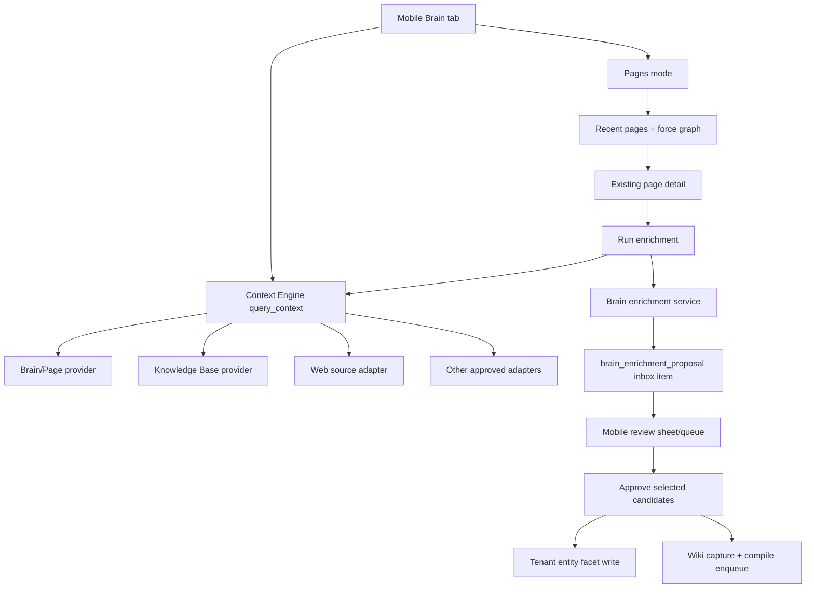

# feat: Mobile Company Brain search and enrichment

## Overview

Mobile should move from a page-first Wiki surface to a search-first Company Brain surface. The tab should help a user ask the Brain, inspect cited results across approved sources, browse pages/graph when that is the right mode, and turn useful findings into reviewed durable context for future automated agents.

The first implementation wedge is **agentic enrichment from an existing Brain page**. From a page detail screen, the user runs an enrichment pass across Brain, Web, and Knowledge Base sources, reviews grouped candidate additions with citations, selects what belongs, and applies those additions through the page update/recompile path.

This plan intentionally reuses the existing Context Engine, compiled page graph, tenant entity page/facet model, and inbox review primitives. The mobile app should become the user's curation surface, not a parallel Brain backend.

## Problem Frame

The current mobile tab is still labeled and shaped as Wiki: a segmented `Threads | Wiki` control, a recent page list, graph entry point, and `Search wiki...` footer. That was right when the feature was compiled page browse. It is too narrow for the Company Brain direction now taking shape in admin and the API.

The product shift is not just a rename. Mobile is the surface where a user can search their current Brain, explore external or tenant-approved source adapters, and decide what should become better context for agents. The app needs to preserve page/graph browsing while making search, enrichment, and review the primary path.

## Requirements Trace

- R1-R6. Rename/reframe the mobile Wiki surface as Brain, make unified Company Brain search primary, show citations and provider health, keep Pages and graph as modes, and expose page-oriented result actions.
- R7-R13. Launch enrichment from an existing page, run Brain + Web + KB source families, return grouped cited candidates, require user review, apply only accepted additions, and ensure rejected additions are not treated as durable evidence.
- R14-R16. Add a mobile review surface for proposed enrichments with approve, reject, edit before approve, and defer semantics.
- R17-R19. Prepare search result actions for convert-to-page and add-to-page without creating duplicate/orphan pages.
- R20-R23. Ship sequencing stays: existing page enrichment first, review queue second, convert-to-page third, general search-answer save actions fourth.

### Acceptance Mapping

- AE1 is covered by Units 1-2: mobile Brain search renders ranked cited results and provider status when one source times out.
- AE2 is covered by Unit 1: Pages mode and graph browsing remain inside Brain.
- AE3 is covered by Units 3-5: existing page enrichment runs Brain + Web + KB, returns cited candidates, and applies only selected additions.
- AE4 is covered by Unit 4: rejected candidates do not write durable Brain context.
- AE5 is covered by Unit 6: the review queue exposes target page, citations, and approve/edit/reject/defer actions.
- AE6 is designed by Unit 7 and deferred as full follow-up work: result actions reserve the convert-to-page path without creating orphan pages before duplicate detection/verification exists.

## Scope Boundaries

### In Scope

- Mobile Brain tab label/navigation and search-first surface.
- Reusing Context Engine `query_context` for unified mobile Brain search and provider statuses.
- Preserving page list and force graph as Brain browse modes.
- A mobile page enrichment flow for an existing page.
- Brain + Web + Knowledge Base source selection for enrichment.
- Cited enrichment candidate proposals persisted through review state.
- Applying accepted candidates to durable Brain context or queueing recompilation where the compiled page pipeline owns page content.
- A v0 mobile review queue for pending Brain enrichment proposals.

### Out of Scope

- Removing the force graph.
- Rebuilding all mobile wiki routes under new URLs in the first pass.
- Making CRM, ERP, support, or catalog enrichment live.
- Letting unreviewed Web or KB results write directly into durable page context.
- Exposing every admin provider setting in mobile.
- Writing back to external systems such as CRM or ERP.
- Solving convert-to-page and general save actions in the first implementation wedge. These are designed for, but follow after enrichment and review.

## Context and Research

### Existing Mobile Surface

- `apps/mobile/app/(tabs)/index.tsx` owns the home tab segmented control and currently models `activeTab` as `threads | wiki`.
- `apps/mobile/components/wiki/WikiList.tsx` displays recent/search Wiki results and already separates list behavior from the tab shell.
- `apps/mobile/components/wiki/CaptureFooter.tsx` owns the current `Search wiki...` footer affordance.
- `apps/mobile/components/wiki/WikiResultRow.tsx` renders page-shaped results.
- `apps/mobile/app/wiki/[type]/[slug].tsx` renders page detail and already has a header-right slot that can host enrichment/review actions.
- Existing page and graph work from `docs/plans/2026-04-19-006-feat-mobile-wiki-force-graph-plan.md` and `docs/plans/2026-04-20-015-feat-mobile-graph-refinements-plan.md` should be preserved as browse modes.

### Existing SDK and API

- `packages/react-native-sdk/src/context-engine.ts` already exposes `queryContext(args)` against the HTTP MCP Context Engine facade.
- `packages/react-native-sdk/src/hooks/use-context-query.ts` exists but is not yet the primary mobile Brain search hook.
- `packages/react-native-sdk/src/hooks/use-mobile-memory-search.ts` and `packages/react-native-sdk/src/hooks/use-wiki-graph.ts` support the existing Wiki page/search/graph behavior.
- `packages/api/src/lib/context-engine/router.ts` already fans out providers, ranks/dedupes hits, and returns provider statuses with timing and failure isolation.
- `packages/api/src/lib/context-engine/providers/wiki.ts` adapts compiled page search as "Company Brain Pages."
- `packages/api/src/lib/context-engine/providers/bedrock-knowledge-base.ts` provides KB retrieval and status reporting.
- `packages/api/src/lib/context-engine/providers/wiki-source-agent.ts` and `packages/api/src/lib/context-engine/providers/sub-agent-base.ts` establish the source-agent seam.
- `packages/api/src/handlers/mcp-context-engine.ts` exposes `query_context`, `query_wiki_context`, and provider listing/configuration tools.
- `packages/database-pg/graphql/types/brain.graphql` and `packages/api/src/graphql/resolvers/brain/*` expose tenant entity page/facet read and mutation surfaces.
- `packages/api/src/lib/brain/repository.ts`, `packages/api/src/lib/brain/write-service.ts`, and `packages/api/src/lib/brain/facet-types.ts` contain the durable Brain write/facet/citation foundation.
- `packages/database-pg/graphql/types/inbox-items.graphql`, `packages/database-pg/src/schema/inbox-items.ts`, and `packages/api/src/graphql/resolvers/inbox/*` provide a generic review queue substrate.

### Institutional Learnings

- `docs/solutions/logic-errors/mobile-wiki-search-tsv-tokenization-2026-04-27.md` applies to the preserved Pages mode: page search must stay centralized and separator-aware instead of moving filtering into mobile UI.
- `docs/solutions/best-practices/context-engine-adapters-operator-verification-2026-04-29.md` applies directly: mobile must show provider hit count, skipped/degraded/timeout state, and no-data state so users can distinguish "nothing found" from "source unavailable."
- `docs/solutions/architecture-patterns/inert-to-live-seam-swap-pattern-2026-04-25.md` guides Web/CRM/ERP source adapters. Mobile should expose only live or explicitly unavailable states, not fake source-agent success.
- `docs/solutions/best-practices/activation-runtime-narrow-tool-surface-2026-04-26.md` applies to enrichment adapters: source agents get narrow read-only tool surfaces and explicit source-family allowlists.
- `docs/solutions/best-practices/every-admin-mutation-requires-requiretenantadmin-2026-04-22.md` matters because current tenant entity GraphQL mutations are admin-oriented. Mobile review/write flows need a deliberate user-facing authorization model instead of copying admin-only gates blindly.

### External Research

No external research is required before this implementation plan. The relevant architecture, source adapters, and mobile surfaces are local. The only execution-time unknown is the exact Web adapter backing: implementation should first reuse an approved MCP/sub-agent Web provider if one is configured; if none exists, add a bounded read-only Web search source adapter rather than pretending Web enrichment is available.

## Key Decisions

1. **Mobile search uses Context Engine, not a new search backend.** The existing `query_context` facade already returns normalized hits, provider statuses, and source-family metadata. Mobile should build a Brain search surface over this contract and keep `mobileWikiSearch` for Pages mode fallback only.
2. **Brain replaces Wiki at the top level; Pages and graph remain internal modes.** The main segmented control becomes `Threads | Brain`. Inside Brain, the user can search all sources, filter to Pages, open recent pages, or enter graph visualization.
3. **Enrichment proposals use review state before durable writes.** A run returns candidate additions and persists a pending review proposal. Nothing becomes durable Brain context until the user approves candidates.
4. **Use `inbox_items` for v0 enrichment proposals.** A `brain_enrichment_proposal` inbox item can carry target page, selected source families, provider statuses, candidates, citations, edits, and status without adding a second review table.
5. **Apply paths depend on page ownership.** Tenant entity pages can accept reviewed candidates through tenant entity facet writes. Personal compiled `wiki_pages` should not be edited by hand; accepted candidates should create a cited source/capture and enqueue the existing compile path so the page is recompiled.
6. **Web source availability is explicit.** The source picker should show Web only when a tenant-approved Web provider exists or the implementation adds one. If Web is unavailable, the UI shows unavailable/skipped status rather than silently dropping the source from the proof.
7. **Mobile user authorization is separate from admin editing.** Existing admin mutations can stay admin-only. New mobile enrichment/review mutations must resolve caller tenant/user membership and enforce page ownership/tenant membership on every side effect.
8. **Convert-to-page is designed but deferred.** Result context menus can reserve action structure for add/convert flows, but the first shippable work focuses on enriching existing pages and reviewing proposals.

### Deferred Planning Questions Resolved Here

- Mobile navigation shape: `Threads | Brain` at the top level, with Search/Pages/Graph/Review modes inside Brain.
- Mobile search contract: use existing Context Engine `query_context` through the SDK for search; add typed GraphQL only for enrichment/review/write decisions.
- Enrichment lifecycle: bounded request/response run that persists a pending proposal immediately; background progress/retry can follow later.
- Knowledge Base selection: default tenant-approved KB source family in v0; per-KB selection is deferred.
- Accepted addition format: typed candidates that apply to tenant entity facets directly or to personal wiki pages through compile-owned capture/recompile.
- Review location: inside the Brain tab as a queue/sheet, not a new top-level tab.
- Context-menu naming: v0 exposes only actions with real backing behavior; convert-to-page remains hidden/disabled until verification exists.

## Proposed Architecture

## Data and API Shape

### Search

Mobile search should call the existing SDK `queryContext` path with:

- `query`: user search text.
- `scopes`: default-safe mobile scopes from provider configuration.
- `depth`: quick by default, deep when the user asks to broaden.
- Optional source-family filters for Brain, Pages, KB, Web, and later CRM/ERP.

The mobile UI maps `ContextEngineResponse.hits` into Brain result rows and maps `ContextEngineResponse.providers` into a compact provider status strip.

### Enrichment Proposal

Add a GraphQL/API contract that lets mobile start and review page enrichment without speaking directly to `inbox_items` internals:

- `runBrainPageEnrichment(input)` returns an enrichment proposal with candidates and provider statuses.
- `approveBrainEnrichmentProposal(input)` applies selected/edited candidates.
- `rejectBrainEnrichmentProposal(input)` rejects all or selected candidates.
- `deferBrainEnrichmentProposal(input)` leaves the proposal pending/deferred.

Directional types:

- `BrainPageRefInput`: `{ pageTable, pageId, slug?, type? }`
- `BrainEnrichmentSourceFamily`: `BRAIN | WEB | KNOWLEDGE_BASE | ...`
- `BrainEnrichmentCandidate`: proposed summary/fact, source family, citations, confidence/trust label, target facet/section hint.
- `BrainEnrichmentProposal`: proposal id, target page, source statuses, candidates, status, created/updated timestamps.

Implementation may store the proposal as `inbox_items.type = 'brain_enrichment_proposal'` with structured `config`, but mobile should use the typed Brain API so storage can evolve.

## Implementation Units

### Unit 1: Mobile Brain tab and search-first surface

**Goal:** Replace the mobile Wiki framing with a Brain search surface while preserving page list and graph browse modes.

**Files**

- Modify: `apps/mobile/app/(tabs)/index.tsx`
- Modify: `apps/mobile/components/wiki/CaptureFooter.tsx`
- Modify: `apps/mobile/components/wiki/WikiList.tsx`
- Add: `apps/mobile/components/brain/BrainSearchSurface.tsx`
- Add: `apps/mobile/components/brain/BrainResultRow.tsx`
- Add: `apps/mobile/components/brain/BrainProviderStatusStrip.tsx`
- Add: `apps/mobile/components/brain/BrainModeSwitch.tsx`
- Modify: `packages/react-native-sdk/src/hooks/use-context-query.ts`
- Modify: `packages/react-native-sdk/src/index.ts`

**Approach**

- Rename the top-level segmented tab text from `Wiki` to `Brain`.
- Introduce a Brain surface with modes: `Search`, `Pages`, and `Graph`.
- Make search the default mode when a query exists or when the user enters the Brain tab for the first time.
- Use `queryContext`/`useContextQuery` for Brain search.
- Keep `WikiList` and the existing graph behind the Pages/Graph modes.
- Change the footer placeholder from `Search wiki...` to `Search Brain...` when the Brain tab is active.
- Render provider status chips for success, skipped, degraded, timeout, and no-data states.
- Keep the existing page route shape in this unit to avoid route churn.

**Test Scenarios**

- `pnpm --filter @thinkwork/mobile typecheck` passes after the new components and SDK hook wiring.
- Manual simulator check: opening mobile home shows `Threads | Brain`, not `Threads | Wiki`.
- Manual simulator check: submitting a Brain query renders unified search results and provider statuses.
- Manual simulator check: switching to Pages shows the existing page list and preserves current page row behavior.
- Manual simulator check: switching to Graph opens the existing force graph path.
- Manual simulator check: a provider timeout or skipped provider is visible as source status while successful providers still render results.

### Unit 2: Source-family normalization for mobile Brain

**Goal:** Give mobile stable source-family labels and availability semantics for Brain, Pages, Web, and Knowledge Base.

**Files**

- Modify: `packages/api/src/lib/context-engine/types.ts`
- Modify: `packages/api/src/lib/context-engine/router.ts`
- Modify: `packages/api/src/handlers/mcp-context-engine.ts`
- Modify: `packages/api/src/lib/context-engine/providers/wiki.ts`
- Modify: `packages/api/src/lib/context-engine/providers/bedrock-knowledge-base.ts`
- Modify or add: `packages/api/src/lib/context-engine/providers/web-search.ts`
- Add: `packages/api/src/lib/context-engine/source-families.ts`
- Add: `packages/api/src/lib/context-engine/source-families.test.ts`
- Modify: `packages/react-native-sdk/src/context-engine.ts`

**Approach**

- Add a stable source-family normalization helper for provider descriptors and hits.
- Map compiled wiki/page providers to `brain` or `pages` display families as appropriate for mobile.
- Map Bedrock KB results to `knowledge-base`.
- Map tenant-approved Web search providers to `web`.
- If no Web provider is configured, return Web as unavailable/skipped when explicitly requested by enrichment instead of omitting it.
- Preserve the underlying Context Engine provider IDs for diagnostics and admin traceability.
- Do not expose inactive CRM/ERP/support adapters as selectable mobile enrichment sources unless they are live or intentionally shown as unavailable.

**Test Scenarios**

- `packages/api/src/lib/context-engine/source-families.test.ts` maps wiki, KB, Web, MCP, and inert sub-agent descriptors to stable mobile families.
- `packages/api/src/lib/context-engine/source-families.test.ts` proves unavailable Web requests return an explicit skipped/unavailable provider status.
- Existing Context Engine tests still pass for provider ranking and failure isolation.
- Manual mobile check: source filters show Brain, Pages, Web, and KB labels consistently across results and provider status chips.

### Unit 3: Brain enrichment proposal service

**Goal:** Add a server-side enrichment run that queries selected source families, groups cited candidates, and persists a review-first proposal.

**Files**

- Modify: `packages/database-pg/graphql/types/brain.graphql`
- Modify: `packages/api/src/graphql/resolvers/brain/index.ts`
- Add: `packages/api/src/graphql/resolvers/brain/runBrainPageEnrichment.mutation.ts`
- Add: `packages/api/src/lib/brain/enrichment-service.ts`
- Add: `packages/api/src/lib/brain/enrichment-service.test.ts`
- Add or modify: `packages/react-native-sdk/src/brain.ts`
- Add: `packages/react-native-sdk/src/hooks/use-brain-enrichment.ts`
- Modify: `packages/react-native-sdk/src/index.ts`

**Approach**

- Add typed GraphQL inputs/results for `runBrainPageEnrichment`.
- Resolve the caller tenant/user with the same mobile-safe auth pattern used by other user-facing resolvers.
- Validate the target page exists and the caller can view/enrich it.
- Call Context Engine with selected source families and a bounded depth.
- Normalize hits into candidate additions grouped by source family and target section/facet hints.
- Preserve citations, provenance IDs, provider statuses, freshness/as-of values, and trust labels.
- Persist a pending `brain_enrichment_proposal` review item in `inbox_items.config`.
- Return the persisted proposal to mobile so the user can review immediately.

**Test Scenarios**

- `packages/api/src/lib/brain/enrichment-service.test.ts` creates a proposal when Brain, Web, and KB return cited hits.
- `packages/api/src/lib/brain/enrichment-service.test.ts` persists provider timeout/skipped state without failing the whole proposal.
- `packages/api/src/lib/brain/enrichment-service.test.ts` rejects enrichment when the caller cannot access the target page.
- `packages/api/src/lib/brain/enrichment-service.test.ts` stores citations and source families for every candidate.
- Resolver tests prove `runBrainPageEnrichment` does not require tenant admin privileges but does require tenant/page membership.

### Unit 4: Apply/reject/defer enrichment proposals

**Goal:** Turn reviewed enrichment candidates into durable Brain context through the right write path, and ensure rejected candidates stay non-durable.

**Files**

- Modify: `packages/database-pg/graphql/types/brain.graphql`
- Add: `packages/api/src/graphql/resolvers/brain/approveBrainEnrichmentProposal.mutation.ts`
- Add: `packages/api/src/graphql/resolvers/brain/rejectBrainEnrichmentProposal.mutation.ts`
- Add: `packages/api/src/graphql/resolvers/brain/deferBrainEnrichmentProposal.mutation.ts`
- Modify: `packages/api/src/lib/brain/enrichment-service.ts`
- Modify: `packages/api/src/lib/brain/repository.ts`
- Modify: `packages/api/src/lib/brain/write-service.ts`
- Modify or add: `packages/api/src/lib/wiki/repository.ts`
- Add: `packages/api/src/lib/brain/enrichment-apply.test.ts`
- Modify: `packages/react-native-sdk/src/brain.ts`
- Modify: `packages/react-native-sdk/src/hooks/use-brain-enrichment.ts`

**Approach**

- Add approve/reject/defer mutations over typed Brain proposal IDs.
- Allow approve to include edited candidate text and a selected candidate list.
- For `tenant_entity_pages`, write reviewed candidates into the appropriate facet/section through existing Brain repository/write-service helpers and record citations in tenant entity source tables.
- For personal `wiki_pages`, avoid direct compiled section edits. Write an approved enrichment capture/source record that the existing wiki compile flow can consume, then enqueue or mark the page for recompile.
- Mark applied candidates as accepted, rejected candidates as rejected, and deferred proposals as deferred/pending.
- Ensure idempotency: approving the same proposal twice should not duplicate facts or citations.
- Keep rejected candidate content in review history for audit/debugging, but do not expose it as accepted Brain context.

**Test Scenarios**

- `packages/api/src/lib/brain/enrichment-apply.test.ts` applies selected tenant entity candidates with citations and leaves unselected candidates unapplied.
- `packages/api/src/lib/brain/enrichment-apply.test.ts` queues personal wiki page recompilation rather than editing compiled page sections directly.
- `packages/api/src/lib/brain/enrichment-apply.test.ts` proves reject does not write Brain facts, sources, or compile jobs.
- `packages/api/src/lib/brain/enrichment-apply.test.ts` proves approve is idempotent.
- Resolver tests prove approve/reject/defer enforce caller access to the target proposal/page.

### Unit 5: Mobile page enrichment UI

**Goal:** Let a user run enrichment from a page, choose sources, review candidates, and approve/reject/defer from mobile.

**Files**

- Modify: `apps/mobile/app/wiki/[type]/[slug].tsx`
- Add: `apps/mobile/components/brain/BrainEnrichmentSheet.tsx`
- Add: `apps/mobile/components/brain/BrainSourcePicker.tsx`
- Add: `apps/mobile/components/brain/BrainEnrichmentCandidateList.tsx`
- Add: `apps/mobile/components/brain/BrainCitationList.tsx`
- Add: `apps/mobile/components/brain/BrainProposalActions.tsx`
- Modify: `packages/react-native-sdk/src/hooks/use-brain-enrichment.ts`

**Approach**

- Add a page header action that opens an enrichment sheet.
- Default selected source families to Brain, Web, and Knowledge Base when available.
- Show source availability before the run; disabled/unavailable sources should explain their status compactly.
- Run enrichment, then render grouped candidates with citations and provider status.
- Let the user select/deselect candidates, edit candidate text before approving, reject specific candidates, reject all, or defer the proposal.
- After approval, refresh the page data and show a queued/recompiled state depending on page type.
- Keep the interaction usable one-handed: short source labels, large touch targets, and context menus/long press only for secondary actions.

**Test Scenarios**

- `pnpm --filter @thinkwork/mobile typecheck` passes.
- Manual simulator check: a page detail screen exposes an enrichment action in the header.
- Manual simulator check: Brain, Web, and KB appear as selected sources when available.
- Manual simulator check: unavailable Web is visible and disabled rather than silently absent.
- Manual simulator check: approving two of three candidates applies only the selected two and refreshes/queues the page.
- Manual simulator check: rejecting a candidate removes it from the pending approval set and does not update page context.
- Manual simulator check: citations remain visible before approve/reject decisions.

### Unit 6: Mobile Brain review queue

**Goal:** Reuse the enrichment proposal model for a Brain review surface after page-launched enrichment is working.

**Files**

- Add: `apps/mobile/components/brain/BrainReviewQueue.tsx`
- Add: `apps/mobile/components/brain/BrainReviewItemRow.tsx`
- Add: `apps/mobile/components/brain/BrainReviewDetailSheet.tsx`
- Modify: `apps/mobile/components/brain/BrainSearchSurface.tsx`
- Add: `packages/react-native-sdk/src/hooks/use-brain-review-queue.ts`
- Modify: `packages/react-native-sdk/src/brain.ts`
- Modify: `packages/api/src/graphql/resolvers/inbox/*` only if typed Brain proposal filtering cannot be layered through Brain resolvers.

**Approach**

- Add a Brain review entry point inside the Brain tab, not as a top-level mobile tab.
- Query pending/deferred `brain_enrichment_proposal` items through typed Brain SDK helpers.
- Show target page, source family, candidate count, source status, and freshness in the row.
- Reuse the candidate sheet/actions from Unit 5 for approve/edit/reject/defer.
- Keep background agent proposals and user-launched enrichment proposals visually consistent.

**Test Scenarios**

- `pnpm --filter @thinkwork/mobile typecheck` passes.
- API tests from Units 3 and 4 cover filtering pending/deferred proposals.
- Manual simulator check: pending enrichment proposals appear in the Brain review queue.
- Manual simulator check: opening a review item shows target page, candidate additions, and citations.
- Manual simulator check: approve, edit before approve, reject, and defer update queue state without navigating to admin.

### Unit 7: Result action scaffold for add/convert flows

**Goal:** Prepare search result actions without overbuilding convert-to-page before enrichment/review semantics are proven.

**Files**

- Modify: `apps/mobile/components/brain/BrainResultRow.tsx`
- Add: `apps/mobile/components/brain/BrainResultActions.tsx`
- Modify: `apps/mobile/components/brain/BrainSearchSurface.tsx`

**Approach**

- Add long-press/context-menu action structure on Brain search results.
- Ship only actions backed by current implementation: open source/page, add to existing page as enrichment candidate if target selection is available, mark useful/not useful if already supported.
- Hide or disable `Convert to page` until duplicate detection and verification are implemented.
- Document the follow-up contract for convert-to-page: find likely existing pages, route unresolved identity through verification, then create or attach as a reviewed proposal.

**Test Scenarios**

- `pnpm --filter @thinkwork/mobile typecheck` passes.
- Manual simulator check: long-pressing a Brain result opens available actions.
- Manual simulator check: disabled convert-to-page cannot create orphan pages.
- Manual simulator check: add-to-page routes through the same candidate/review model when enabled.

## Sequencing

1. Unit 1: mobile Brain shell and search-first surface.
2. Unit 2: source-family normalization and Web availability semantics.
3. Unit 3: enrichment proposal backend.
4. Unit 4: proposal apply/reject/defer.
5. Unit 5: mobile page enrichment UI.
6. Unit 6: mobile Brain review queue.
7. Unit 7: result action scaffold.

Unit 1 can start while Units 2-4 are being designed, but Unit 5 should wait for Units 3-4 because the page UI needs real proposal/apply behavior. Unit 6 should wait until Unit 5 proves the review shape.

## Verification Plan

- Run `pnpm --filter @thinkwork/api test` or targeted Vitest files for Context Engine source-family and Brain enrichment services.
- Run `pnpm --filter @thinkwork/api typecheck`.
- Run `pnpm --filter @thinkwork/react-native-sdk build`.
- Run `pnpm --filter @thinkwork/mobile typecheck`.
- Copy `apps/mobile/.env` from the main checkout before Expo verification in this worktree.
- Build `@thinkwork/react-native-sdk` before mobile verification if Expo cannot resolve `dist/index.js`.
- Verify on an iOS simulator:
  - Brain tab label and search-first behavior.
  - Provider statuses with partial failures.
  - Pages mode and force graph still work.
  - Page-launched enrichment with Brain + Web + KB.
  - Approve selected candidates, reject candidates, defer proposal.
  - Review queue state changes.

## Rollout and Migration Notes

- The first UI pass can keep existing `wiki` route paths to reduce churn. Product copy can say Brain while internal routes migrate later.
- Keep `WikiList` and `WikiResultRow` until Brain-specific components fully cover their behavior. Avoid moving search logic into UI components.
- If GraphQL schema changes are made, regenerate codegen for consumers with codegen scripts: `apps/cli`, `apps/admin`, `apps/mobile`, and `packages/api`.
- Source provider availability must respect admin governance. Mobile should never make an unavailable or tenant-disabled source appear live.
- Because mobile user review is not admin editing, do not reuse admin-only tenant entity mutations for mobile side effects without adding mobile-safe authorization gates.

## Risks and Mitigations

- **Risk: Web adapter is not actually available.** Mitigation: make Web availability explicit in provider status and add a bounded read-only Web source adapter before claiming Brain + Web + KB enrichment is live.
- **Risk: Enrichment proposals duplicate existing page facts.** Mitigation: compare candidate citations/text against existing page sections/facets during proposal generation and again during apply.
- **Risk: Personal wiki pages are manually edited outside compile ownership.** Mitigation: route accepted personal wiki candidates through capture/source + compile enqueue, not direct compiled section edits.
- **Risk: Mobile writes become too permissive.** Mitigation: new mobile mutations must resolve caller tenant/user and check page/proposal access on every side effect; admin-only mutations remain admin-only.
- **Risk: Provider failures make Brain search feel broken.** Mitigation: keep Context Engine failure isolation and surface skipped/degraded/timeout states in mobile.
- **Risk: The tab becomes crowded.** Mitigation: search is primary; Pages, Graph, Review, and Actions are secondary modes/sheets instead of more top-level tabs.

## Deferred Follow-Up Work

- Full convert-to-page flow with duplicate detection and unresolved identity verification.
- General "save this answer" actions after add-to-page semantics are proven.
- CRM/ERP/support/catalog enrichment once those source adapters are live.
- Push notifications for background enrichment proposals.
- Route/file rename from `wiki` to `brain` once behavior is stable and deep links are planned.
- Mobile analytics around source usage, candidate approval rate, rejection reasons, and provider failure rates.
