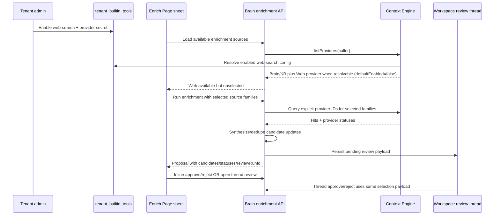

# feat: Improve Enrich Page web search and review UX

## Overview

Add a real Web Search path to Brain page enrichment and bring the inline and thread review experiences to parity.

The work has three linked pieces:

1. Context Engine gets a tenant-opt-in Web Search provider backed by the existing `tenant_builtin_tools` Web Search configuration. It is never a tenant default provider.
2. Brain enrichment stops treating raw hits as the final proposal for web-backed runs and instead produces cited, reviewable candidate updates.
3. Mobile keeps both inline and thread review, but both surfaces share the same candidate selection semantics, source/status language, and approve/reject behavior.

---

## Problem Frame

The mobile Enrich Page source picker currently exposes Web, but the backend has no first-party Web Search Context Engine provider. Web only works if some approved MCP/source-agent provider happens to classify as web, which makes the source picker misleading. At the same time, enrichment review is split between the Enrich Page sheet and the thread HITL screen. Both review paths should stay, but they should behave like two views over the same pending proposal rather than two different products.

The origin document defines the product posture: Web is tenant/client opt-in and unselected per run; web output must be synthesized into candidate updates; inline review and thread review both remain complete paths (see origin: `docs/brainstorms/2026-05-01-enrich-page-web-and-review-ux-requirements.md`).

---

## Requirements Trace

- R1. Enrich Page only offers Web when the tenant has opted into a Web Search Context Engine adapter.
- R2. Web Search is not part of the default adapter set for non-opted-in tenants.
- R3. Even after tenant opt-in, Web is not selected by default per Enrich Page run.
- R4. Disabled, missing-credential, and errored Web states surface as provider status instead of silent Brain/KB-only results.
- R5. Web suggestions are visibly external/lower-trust and carry URL/source citation when available.
- R6. Enrichment proposals contain reviewable candidate page updates, not raw result dumps.
- R7. Web enrichment synthesizes current public information into concise page-worthy suggestions.
- R8. Duplicate or near-duplicate candidates collapse where possible while preserving useful source metadata.
- R9. Inline and thread review operate on the same pending proposal and same selection/note/apply semantics.
- R10. Inline review remains a complete approve/reject path.
- R11. Thread review remains available for durable workspace review or return-later review.
- R12. The two UIs share labels, status language, candidate grouping, selection affordances, and empty/error states.

**Origin actors:** A1 mobile user, A2 tenant/client admin, A3 Context Engine, A4 review agent/thread workflow.

**Origin flows:** F1 inline enrichment review, F2 thread-based enrichment review, F3 web-enriched proposal generation.

**Origin acceptance examples:** AE1 Web absent without tenant opt-in, AE2 Web visible but unselected after tenant opt-in, AE3 invalid Web credential surfaces status, AE4 Web returns candidate updates not raw rows, AE5 inline/thread review parity.

---

## Scope Boundaries

- Do not make Web Search globally enabled or default-selected.
- Do not auto-apply Web suggestions without human approval.
- Do not remove the thread review flow.
- Do not collapse Enrich Page into thread-only review.
- Do not build scheduled web refresh, monitoring, or alerting.
- Do not make external web facts outrank Brain or KB facts in trust language.

---

## Context & Research

### Relevant Code and Patterns

- `packages/api/src/lib/context-engine/providers/index.ts` registers built-in and tenant MCP Context Engine providers. This is the seam where a tenant-configured Web Search provider should join the provider list.
- `packages/api/src/lib/context-engine/router.ts` already handles explicit provider IDs, disabled provider errors, partial provider status, timeout/error states, and hit dedupe/ranking.
- `packages/api/src/lib/context-engine/source-families.ts` already maps web-like MCP/sub-agent providers to `sourceFamily: "web"` and has tests in `packages/api/src/lib/context-engine/source-families.test.ts`.
- `packages/database-pg/src/schema/builtin-tools.ts` owns tenant Web Search opt-in and provider credentials via `tenant_builtin_tools`, `enabled`, `provider`, and `secret_ref`.
- `packages/api/src/handlers/skills.ts` already implements tenant Web Search list/upsert/test/delete and a private `loadTenantBuiltinTools` helper used by agent runtime config. It should be factored rather than duplicated.
- `packages/agentcore-strands/agent-container/container-sources/web_search_tool.py` shows the runtime provider behavior for Exa and SerpAPI; the TypeScript Context Engine provider should match observable result normalization.
- `packages/api/src/lib/brain/enrichment-service.ts` loads target pages, chooses Context Engine providers by source family, builds candidates, stores review payloads, and creates review threads.
- `packages/api/src/lib/brain/enrichment-apply.ts` already applies selected candidates from a `brain_enrichment_selection` JSON response, but it currently falls back to applying all candidates when selection parsing yields no matches.
- `apps/mobile/components/brain/BrainEnrichmentSheet.tsx`, `BrainSourcePicker.tsx`, and `BrainEnrichmentCandidateList.tsx` own inline enrichment UI.
- `apps/mobile/app/thread/[threadId]/index.tsx` owns thread HITL review and already has selection state for Brain enrichment reviews.
- `apps/mobile/components/brain/BrainProviderStatusStrip.tsx` and `BrainProviderStatusSheet.tsx` provide reusable provider-status display patterns from the Brain search surface.
- `packages/react-native-sdk/src/brain.ts` and `packages/react-native-sdk/src/hooks/use-brain-enrichment.ts` provide the mobile SDK boundary for enrichment.

### Institutional Learnings

- `docs/solutions/best-practices/injected-built-in-tools-are-not-workspace-skills-2026-04-28.md`: `web_search` is an injected built-in, not a workspace skill. This plan keeps Web Search credentials/policy in platform configuration and does not add a workspace skill.
- `docs/plans/2026-04-29-001-feat-admin-memory-knowledge-center-plan.md`: tenant adapter configuration is separate from runtime providers; Context Engine resolves effective provider selection at query time.
- `docs/plans/2026-04-30-001-refactor-company-brain-nav-docs-plan.md`: user-facing Admin copy should prefer Company Brain/Sources language, while `Context Engine` remains the internal API/service name.

### External References

- Exa Search API docs: `https://exa.ai/docs/reference/search`. Exa supports `POST /search` with `x-api-key` and can return extracted contents/highlights; the existing Python runtime currently calls this endpoint.
- SerpApi Google Search API docs: `https://serpapi.com/search-api` and `https://serpapi.com/organic-results`. SerpApi uses `api_key`, returns structured JSON including `organic_results`, and exposes result/error status metadata.

---

## Key Technical Decisions

- **Use `tenant_builtin_tools` as the Web Search opt-in and credential source.** This preserves the existing admin surface and disabled-by-default Web Search policy. Context Engine should not introduce a second API-key store.
- **Register Web Search as a Context Engine provider only when resolvable for the tenant.** A tenant with no enabled Web Search config should not see Web as available in mobile enrichment.
- **Keep Web provider `defaultEnabled: false`.** This satisfies the per-run explicit selection requirement while still allowing explicit provider ID selection.
- **Add an enrichment source availability query instead of hard-coding mobile source chips.** The mobile sheet needs to know whether Web is available before the user runs enrichment.
- **Prefer a dedicated enrichment candidate synthesis step over overloading generic Context Engine `answer` mode.** Generic `answer` currently concatenates hits; enrichment needs structured candidate updates with citation preservation and source-family-specific trust language.
- **Share review model logic before sharing large UI.** Extract selection serialization, candidate grouping/dedupe, status labeling, and source labels into reusable mobile helpers/components. The sheet and thread screen can keep different layout shells.

---

## Open Questions

### Resolved During Planning

- **Where does tenant Web Search opt-in live?** Use existing `tenant_builtin_tools` Web Search rows and Secrets Manager `secret_ref`, not a duplicate config in `tenant_context_provider_settings`.
- **Should Web be default-selected after tenant opt-in?** No. It is visible/available but unselected per run.
- **Should inline review remain complete?** Yes. Inline and thread review both approve/reject the same pending proposal.

### Deferred to Implementation

- **Exact prompt/schema wording for candidate synthesis:** The plan defines the contract and tests; implementation can iterate on wording while keeping output validation strict.
- **Exact mobile component split:** The plan requires shared semantics and reusable helpers; the implementer may choose the final component boundaries if layout constraints make a single shared component awkward.

---

## High-Level Technical Design

> *This illustrates the intended approach and is directional guidance for review, not implementation specification. The implementing agent should treat it as context, not code to reproduce.*

---

## Implementation Units

- U1. **Add tenant-configured Web Search Context Engine provider**

**Goal:** Make Web Search available to Context Engine only for tenants with an enabled, credential-backed Web Search built-in tool, and never as a default provider.

**Requirements:** R1, R2, R4, R5; F3; AE1, AE3.

**Dependencies:** None.

**Files:**
- Create: `packages/api/src/lib/builtin-tools/web-search.ts`
- Create: `packages/api/src/lib/context-engine/providers/web-search.ts`
- Modify: `packages/api/src/handlers/skills.ts`
- Modify: `packages/api/src/lib/context-engine/providers/index.ts`
- Modify: `packages/api/src/lib/context-engine/source-families.ts`
- Test: `packages/api/src/lib/builtin-tools/web-search.test.ts`
- Test: `packages/api/src/lib/context-engine/providers/web-search.test.ts`
- Test: `packages/api/src/lib/context-engine/source-families.test.ts`

**Approach:**
- Factor Web Search provider/key resolution and provider API calls out of `packages/api/src/handlers/skills.ts` into a shared API library under `packages/api/src/lib/builtin-tools/`.
- Keep `skills.ts` behavior intact by calling the factored helper from existing built-in tool list/test/runtime-injection code.
- Add a Context Engine provider factory that:
  - resolves the tenant's enabled `web-search` config from `tenant_builtin_tools`;
  - returns no provider when the tenant has no enabled config or no usable secret;
  - sets `family: "mcp"` or another existing provider family with explicit `sourceFamily: "web"`;
  - sets `defaultEnabled: false`;
  - normalizes Exa and SerpAPI results into `ContextHit` with title, snippet, URL citation, provider metadata, rank/score, and `sourceFamily: "web"`.
- Register the provider from `createContextProvidersForCaller`, not `createCoreContextProviders`, because it depends on the caller tenant and Secrets Manager.
- Preserve existing Context Engine partial failure behavior: provider API failures become provider statuses through the router, not whole-query failures.

**Execution note:** Start with tests around disabled/no-secret/enabled-provider behavior before wiring registration.

**Patterns to follow:**
- `packages/api/src/lib/context-engine/providers/mcp-tool.ts` for normalized provider construction.
- `packages/api/src/handlers/skills.ts` existing Exa/SerpAPI test logic for API shape.
- `packages/agentcore-strands/agent-container/container-sources/web_search_tool.py` for provider behavior parity.

**Test scenarios:**
- Happy path: enabled Exa row with resolvable secret produces a provider with `sourceFamily: "web"`, `defaultEnabled: false`, and normalized URL-cited hits.
- Happy path: enabled SerpAPI row with resolvable secret maps `organic_results` to URL-cited hits.
- Edge case: tenant has no `web-search` row; provider registration returns no Web provider.
- Edge case: row exists but `enabled=false`; provider registration returns no Web provider.
- Error path: row is enabled but secret cannot resolve; provider registration returns no Web provider and does not throw during provider listing.
- Error path: provider API returns an error payload; Context Engine query returns Web provider status `error` with no hits.
- Integration: `list_context_providers` for an opted-in tenant includes Web with `defaultEnabled=false`; a default `query_context` call omits it unless explicitly selected.

**Verification:**
- Tenants without Web Search config do not see a Web Context Engine provider.
- Tenants with Web Search config can explicitly select the Web provider and receive normalized web hits with URL citations.
- Existing agent runtime Web Search injection continues to work through the built-in tool path.

---

- U2. **Expose enrichment source availability and safe defaults**

**Goal:** Let mobile render only sources that are available for the tenant, and make Brain/KB the default per-run selection while Web remains unselected.

**Requirements:** R1, R2, R3, R4; F1, F3; AE1, AE2, AE3.

**Dependencies:** U1.

**Files:**
- Modify: `packages/database-pg/graphql/types/brain.graphql`
- Modify: `packages/api/src/graphql/resolvers/brain/index.ts`
- Modify: `packages/api/src/lib/brain/enrichment-service.ts`
- Modify: `packages/react-native-sdk/src/brain.ts`
- Modify: `packages/react-native-sdk/src/hooks/use-brain-enrichment.ts`
- Modify: `apps/mobile/components/brain/BrainEnrichmentSheet.tsx`
- Modify: `apps/mobile/components/brain/BrainSourcePicker.tsx`
- Test: `packages/api/src/lib/brain/enrichment-service.test.ts`
- Test: `packages/api/src/graphql/resolvers/brain/enrichment-sources.test.ts`

**Approach:**
- Add a lightweight GraphQL query for available Brain enrichment sources for a tenant/page context. It should return source family, label, availability/default-selected state, and any unavailable reason that is safe to show.
- Use Context Engine `listProviders({ caller })` and `sourceFamilyForProvider` to compute availability:
  - Brain is available when memory/wiki/page-family providers are enabled.
  - KB is available when a knowledge-base provider is enabled.
  - Web is available only when U1 registered the tenant Web provider.
- Change backend enrichment defaults from `["BRAIN", "WEB", "KNOWLEDGE_BASE"]` to Brain/KB only, subject to availability. If a caller explicitly passes Web and no Web provider is available, return a clear skipped/unavailable status.
- Update SDK to expose source availability alongside `runBrainPageEnrichment`.
- Update mobile source picker to render dynamic sources, with Web visible but unselected when available.

**Patterns to follow:**
- `packages/api/src/handlers/mcp-context-engine.ts` `list_context_providers` structured response.
- `apps/mobile/components/brain/BrainProviderStatusSheet.tsx` status label conventions.
- Existing GraphQL codegen workflow described in `AGENTS.md`.

**Test scenarios:**
- Covers AE1. Tenant without Web provider receives Brain/KB source options only; Web is absent.
- Covers AE2. Tenant with Web provider receives Web option with `selectedByDefault=false`.
- Happy path: Brain and KB available sources preserve existing labels and run behavior.
- Edge case: no KB provider available; KB source appears unavailable or is omitted according to the chosen response contract, and running Brain-only enrichment still works.
- Error path: explicit Web source with no Web provider yields a Web skipped/unavailable provider status rather than silent omission.
- Integration: mobile SDK query shape includes availability fields needed by the sheet without requiring a full enrichment run.

**Verification:**
- Enrich Page does not show Web for tenants that have not opted into Web Search.
- Enrich Page shows Web unselected after tenant opt-in.
- Running enrichment without selecting Web never calls the Web provider.

---

- U3. **Synthesize enrichment candidates instead of dumping raw hits**

**Goal:** Convert selected Context Engine hits, especially Web hits, into concise candidate page updates with citations and source/trust metadata.

**Requirements:** R5, R6, R7, R8; F3; AE4.

**Dependencies:** U1, U2.

**Files:**
- Create: `packages/api/src/lib/brain/enrichment-candidate-synthesis.ts`
- Modify: `packages/api/src/lib/brain/enrichment-service.ts`
- Modify: `packages/api/src/lib/brain/enrichment-apply.ts`
- Test: `packages/api/src/lib/brain/enrichment-candidate-synthesis.test.ts`
- Test: `packages/api/src/lib/brain/enrichment-service.test.ts`
- Test: `packages/api/src/lib/brain/enrichment-apply.test.ts`

**Approach:**
- Add a dedicated synthesis module that accepts target page context, requested source families, normalized hits, and provider statuses, and returns `BrainEnrichmentCandidate[]`.
- Use deterministic validation and fallback behavior around synthesis:
  - candidate title and summary are required;
  - citation is required for Web candidates when a URL/source exists;
  - candidate source family comes from normalized hit/source metadata;
  - invalid synthesized items are dropped rather than persisted.
- For Web hits, synthesize page-worthy candidate updates rather than exposing search-result titles/snippets verbatim. Use existing Bedrock Converse helper patterns from `packages/api/src/lib/wiki/bedrock.ts` if model synthesis is used.
- Preserve non-web behavior with a simple fallback so Brain/KB enrichment continues working even if synthesis fails.
- Improve candidate dedupe across source families by normalizing title/summary and preserving strongest citation metadata. Do not let Web overwrite higher-trust Brain/KB language; instead keep Web as supporting/external source metadata.
- Tighten `selectApprovedCandidates` in `enrichment-apply.ts` so an explicit empty selection applies zero candidates rather than falling back to all candidates. This is necessary for inline/thread parity when users deselect everything.

**Execution note:** Add characterization coverage for current Brain/KB candidate behavior before changing synthesis.

**Patterns to follow:**
- `packages/api/src/lib/wiki/bedrock.ts` for Bedrock Converse invocation and JSON parsing if using model synthesis.
- `packages/api/src/lib/context-engine/router.ts` dedupe/ranking normalization.
- Existing `dedupeBrainEnrichmentCandidates` behavior in `apps/mobile/app/thread/[threadId]/index.tsx`, moving the authoritative dedupe earlier into backend proposal generation.

**Test scenarios:**
- Covers AE4. Web hits with title/snippet/URL produce concise candidate updates with URL citation and `sourceFamily: "WEB"`.
- Happy path: Brain and KB hits still produce candidates when no Web source is selected.
- Happy path: mixed Brain/KB/Web hits with near-duplicate facts produce one candidate with preserved useful citation metadata.
- Edge case: synthesis returns malformed/empty output; backend falls back safely for non-web hits and reports no candidate for invalid Web output.
- Edge case: explicit empty selected-candidate payload applies zero suggestions and completes the review with "No Brain enrichment suggestions were applied."
- Error path: model synthesis timeout or provider error does not prevent review creation; provider status and candidate count make the degraded state visible.

**Verification:**
- Web-backed enrichment proposals read like proposed page updates, not raw search result rows.
- Approved Web suggestions append with visible source/citation language.
- Deselecting all candidates in either review surface does not accidentally apply all candidates.

---

- U4. **Add shared mobile review model and decision API helpers**

**Goal:** Give inline and thread review one shared client-side model for candidate grouping, selection serialization, status labeling, and approve/reject mutations.

**Requirements:** R5, R9, R10, R11, R12; F1, F2; AE5.

**Dependencies:** U2, U3.

**Files:**
- Create: `apps/mobile/lib/brain-enrichment-review.ts`
- Create: `apps/mobile/components/brain/BrainEnrichmentReviewPanel.tsx`
- Create: `apps/mobile/vitest.config.ts`
- Modify: `apps/mobile/package.json`
- Modify: `packages/react-native-sdk/src/brain.ts`
- Modify: `packages/react-native-sdk/src/index.ts`
- Test: `apps/mobile/lib/__tests__/brain-enrichment-review.test.ts`

**Approach:**
- Extract pure helpers for:
  - parsing review payloads;
  - deduping/grouping candidates for display;
  - serializing `brain_enrichment_selection` with selected IDs and optional note;
  - source labels and lower-trust Web labeling;
  - provider status labels for Brain/KB/Web.
- Add SDK functions for accepting/cancelling an enrichment review by `reviewRunId` using the existing `acceptAgentWorkspaceReview` and `cancelAgentWorkspaceReview` GraphQL mutations. These functions should send the same selection JSON that thread review already sends.
- Create a shared review panel component for candidate list, selection toggles, provider status summary, empty state, and optional note. Keep action buttons supplied by the parent so the sheet and thread can use their own footers.
- Add a minimal mobile Vitest setup for pure TypeScript helper coverage only. Do not attempt React Native component rendering tests in this PR; keep component layout verification manual/Expo-based.

**Patterns to follow:**
- Existing thread HITL selection JSON in `apps/mobile/app/thread/[threadId]/index.tsx`.
- `apps/mobile/components/brain/BrainProviderStatusStrip.tsx` and `BrainProviderStatusSheet.tsx` for status display language.
- SDK GraphQL helper style in `packages/react-native-sdk/src/brain.ts`.

**Test scenarios:**
- Covers AE5. Given the same proposal payload, helper output returns the same candidate IDs and serialized response for inline and thread callers.
- Happy path: selecting a subset serializes `kind: "brain_enrichment_selection"`, selected IDs, and note.
- Edge case: selecting zero candidates serializes an empty selected ID list, not null.
- Edge case: duplicate candidates collapse consistently for display without losing the selected canonical candidate ID.
- Error path: malformed/non-enrichment payload returns a non-review state instead of throwing in UI helpers.

**Verification:**
- Both mobile surfaces consume the same helper output for candidate selection and response serialization.
- SDK exposes enough review-decision helpers for inline review without duplicating low-level GraphQL documents in the sheet.

---

- U5. **Make the Enrich Page sheet a complete inline review path**

**Goal:** Let users run enrichment and approve/reject selected suggestions directly from the Enrich Page sheet, while still offering a clear path into the thread review.

**Requirements:** R3, R4, R5, R9, R10, R11, R12; F1; AE2, AE3, AE5.

**Dependencies:** U2, U3, U4.

**Files:**
- Modify: `apps/mobile/components/brain/BrainEnrichmentSheet.tsx`
- Modify: `apps/mobile/components/brain/BrainSourcePicker.tsx`
- Modify: `apps/mobile/components/brain/BrainEnrichmentCandidateList.tsx`
- Modify: `apps/mobile/app/wiki/[type]/[slug].tsx`
- Test: `apps/mobile/lib/__tests__/brain-enrichment-review.test.ts`

**Approach:**
- Load source availability when the sheet opens; initialize selected sources from backend defaults, which exclude Web.
- Disable the run button if no source is selected or source availability is still loading.
- After a proposal is created, render the shared `BrainEnrichmentReviewPanel` inline instead of the current passive candidate list.
- Add inline approve/reject actions that call the SDK review-decision helpers from U4 with selected candidate IDs and note.
- Keep "Open review thread" available as a secondary action; opening the thread should preserve the same pending proposal and selection semantics rather than creating another run.
- Surface provider statuses in the sheet, including Web skipped/error states and invalid-credential status when present.
- Preserve compact mobile layout: no nested cards; fixed footer/buttons should not overlap candidate list or note field.

**Patterns to follow:**
- Current `BrainEnrichmentSheet.tsx` modal structure and toast behavior.
- `apps/mobile/app/thread/[threadId]/index.tsx` decision handling and refresh behavior.
- Existing design constraint from AGENTS.md: tool surfaces should be ergonomic and avoid explanatory in-app prose.

**Test scenarios:**
- Covers AE2. Source initialization for an opted-in tenant leaves Web unselected until the user toggles it.
- Covers AE3. Proposal with Web error status renders provider status and still shows any Brain/KB candidates.
- Covers AE5. Inline approving selected candidates sends the same selection JSON as thread review helper.
- Edge case: proposal has zero candidates; sheet shows empty review state and allows reject/close without applying.
- Error path: accept/reject mutation failure leaves the proposal visible and shows an error toast.

**Verification:**
- A user can run enrichment, select/deselect candidates, add a note, approve, or reject without leaving the page.
- A user can still open the generated review thread.
- Web is visible only when available and unselected by default.

---

- U6. **Bring thread enrichment review to UI/semantic parity**

**Goal:** Update the thread HITL review surface to use the shared Brain enrichment review model and match inline review behavior.

**Requirements:** R5, R9, R10, R11, R12; F2; AE5.

**Dependencies:** U3, U4.

**Files:**
- Modify: `apps/mobile/app/thread/[threadId]/index.tsx`
- Modify: `apps/mobile/components/brain/BrainEnrichmentReviewPanel.tsx`
- Test: `apps/mobile/lib/__tests__/brain-enrichment-review.test.ts`

**Approach:**
- Replace local thread-only candidate parsing/dedupe/serialization with helpers from U4.
- Render provider statuses, source labels, and Web lower-trust/citation treatment consistently with inline review.
- Keep the existing Review/Thread segmented control and sticky approve/reject footer; only swap the enrichment-specific review body.
- Ensure note handling stays compatible with non-enrichment workspace reviews: enrichment review serializes selection JSON; ordinary HITL reviews keep using raw notes.
- Preserve current thread cleanup behavior (`clearThreadActive` for completed enrichment review) after accept/cancel.

**Patterns to follow:**
- Current `ThreadHitlPrompt` separation of enrichment vs generic workspace review behavior.
- Existing workspace review state helpers in `apps/mobile/lib/workspace-review-state.ts`.

**Test scenarios:**
- Covers AE5. Thread review and inline review helpers produce identical selected-candidate JSON for the same candidate set and note.
- Happy path: thread review renders Web candidates with external/source citation label.
- Edge case: reopening a different review run resets selected candidates from that run's payload.
- Error path: malformed enrichment payload falls back to generic review display rather than crashing.

**Verification:**
- Thread review still approves/rejects Brain enrichment proposals.
- Candidate grouping, labels, note semantics, and empty/error states match the inline sheet.

---

## System-Wide Impact

- **Interaction graph:** Tenant admin Web Search configuration in Built-in Tools now affects Context Engine provider availability, which affects GraphQL enrichment source availability and mobile source picker rendering.
- **Error propagation:** Web provider failures should surface as provider status where possible. Missing/disabled tenant config should remove Web from available sources; explicit stale/invalid credential states should produce skipped/error statuses when a run requested Web.
- **State lifecycle risks:** Enrichment runs create workspace review runs/threads. Inline approve/reject must close the same run that thread review would close, using idempotency keys and review ETag semantics already supported by workspace review mutations.
- **API surface parity:** GraphQL schema changes require codegen for `apps/mobile`, `apps/admin`, `packages/api`, and `apps/cli` if generated types include the new query. The SDK's manual GraphQL strings also need matching type updates.
- **Integration coverage:** Unit tests should cover provider registration, source availability, candidate synthesis, selection serialization, and apply behavior. The plan adds a minimal mobile pure-helper test harness, while manual mobile verification should cover the sheet and thread screens because React Native component rendering tests are not established in this workspace.
- **Unchanged invariants:** Web Search remains disabled-by-default at tenant level and template-gated for agent runtime injection. This plan does not change the `web_search` built-in skill policy for normal agent turns; it only reuses the same tenant credential/opt-in to expose an explicit Context Engine source for enrichment.

---

## Risks & Dependencies

| Risk | Mitigation |
|------|------------|
| Duplicate Web Search credential paths diverge | Reuse `tenant_builtin_tools` and factor existing helpers instead of adding a new secret/config store. |
| Web accidentally becomes a default source | Set Context Engine Web provider `defaultEnabled: false`; add tests for default query omission and mobile default selection. |
| Inline review applies all candidates when none selected | Tighten `selectApprovedCandidates` semantics and test explicit empty selection. |
| Candidate synthesis introduces flaky model output | Validate structured output, drop invalid candidates, and preserve deterministic fallback for Brain/KB. |
| Mobile shared component becomes awkward in one surface | Share model/helpers and reusable subcomponents first; allow sheet/thread layout wrappers to differ. |
| Provider API docs drift | Keep provider request/response parsing isolated in one TypeScript helper so Exa/SerpAPI updates do not scatter across Context Engine and runtime code. |

---

## Documentation / Operational Notes

- Update Admin/Web Search operator copy only if needed to clarify that enabling Web Search also makes Web available as an explicit Company Brain enrichment source.
- Update docs under `docs/src/content/docs/applications/admin/builtin-tools.mdx` or `docs/src/content/docs/applications/admin/agent-templates.mdx` if the operator-visible Web Search behavior changes.
- No database migration is expected unless implementation discovers that `tenant_builtin_tools` is insufficient for the provider bridge.

---

## Sources & References

- **Origin document:** `docs/brainstorms/2026-05-01-enrich-page-web-and-review-ux-requirements.md`
- Related requirements: `docs/brainstorms/2026-04-28-context-engine-requirements.md`, `docs/brainstorms/2026-04-29-company-brain-v0-requirements.md`
- Related plans: `docs/plans/2026-04-29-001-feat-admin-memory-knowledge-center-plan.md`, `docs/plans/2026-04-30-001-refactor-company-brain-nav-docs-plan.md`
- Institutional learning: `docs/solutions/best-practices/injected-built-in-tools-are-not-workspace-skills-2026-04-28.md`
- External docs: `https://exa.ai/docs/reference/search`, `https://serpapi.com/search-api`, `https://serpapi.com/organic-results`
