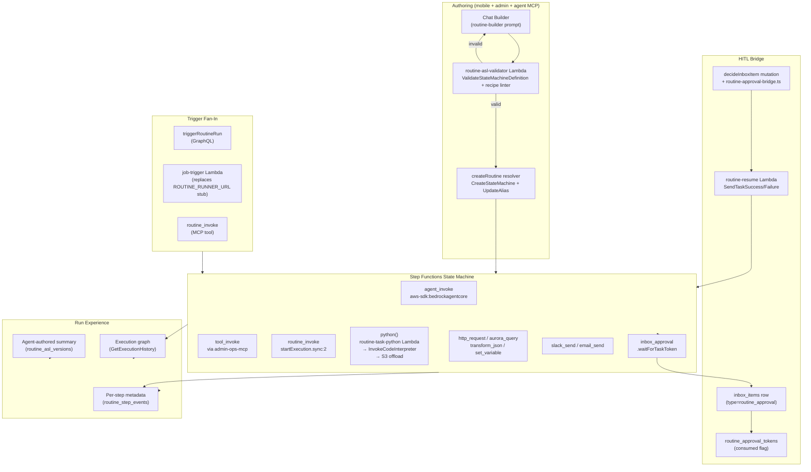

# feat: Routines Step Functions rebuild and Automations integration

## Summary

Implementation plan for a five-phase rebuild of Routines as first-class AWS Step Functions state machines: substrate (Terraform/IAM/schema/validator/recipe catalog) → runtime (Task wrappers, publish flow, trigger swap, HITL bridge) → authoring (MCP tools, builder retarget, admin chat) → UI (Automations nav, run-detail graph, run-list) → cleanup/observability (legacy archival, `python()` dashboard). Sixteen implementation units sequenced for inert-to-live seam swaps so each PR can land on `main` without breaking the prior path.

**This master plan is the design artifact.** Execution is split across five phase-scoped plans that can each be `/lfg`'d or `/ce-work`'d independently in dependency order:

- Phase A (Substrate, U1-U5): `docs/plans/2026-05-01-004-feat-routines-phase-a-substrate-plan.md`
- Phase B (Runtime, U6-U9): `docs/plans/2026-05-01-005-feat-routines-phase-b-runtime-plan.md`
- Phase C (Authoring, U10-U11): `docs/plans/2026-05-01-006-feat-routines-phase-c-authoring-plan.md`
- Phase D (UI, U12-U14): `docs/plans/2026-05-01-007-feat-routines-phase-d-ui-plan.md`
- Phase E (Cleanup + observability, U15-U16): `docs/plans/2026-05-01-008-feat-routines-phase-e-cleanup-plan.md`

Each phase plan carries its slice of the U-IDs verbatim and references this master for the full Context & Research, Key Technical Decisions, and unchanged origin requirements.

---

## Problem Frame

The marketing positioning treats Routines as the cornerstone "agentic → robotic" feature, but the existing implementation is a half-built Python-script-on-thread_turn shim with no Step Functions backing, an unbacked GraphQL `RoutineRun.steps` field, no execution substrate (the `ROUTINE_RUNNER_URL` Lambda referenced by `packages/lambda/job-trigger.ts` is never provisioned), and no admin nav presence. Origin doc (`docs/brainstorms/2026-05-01-routines-step-functions-rebuild-requirements.md`) defines the WHAT; this plan defines HOW.

---

## Requirements

All R-IDs trace back to the origin requirements doc.

- R1. One chat builder, two surfaces (mobile + admin), one ASL generator. (origin R1)
- R2. Builder produces three artifacts: validated ASL, agent-authored markdown summary, structured step manifest. (origin R2)
- R3. HITL signal recognition + automatic `inbox_approval` insertion. (origin R3)
- R4. Agent-side MCP tool `create_routine` calls the same generator path. (origin R4)
- R5. Visual ASL graph is read-only; no canvas, no raw ASL editor. (origin R5)
- R6. Locked v0 recipe set: control flow + invocation (`agent_invoke`/`tool_invoke`/`routine_invoke`) + IO (`http_request`/`aurora_query`/`transform_json`/`set_variable`) + notification (`slack_send`/`email_send`) + HITL (`inbox_approval`) + escape hatch (`python`). (origin R6)
- R7. Invocation recipes expose existing tenant inventory (agents, tools, MCP methods, prior routines). (origin R7)
- R8. `python()` runs in AgentCore code sandbox, time-bounded, network-explicit, output captured as step events. (origin R8)
- R9. Recipes ThinkWork-eng-owned; customers compose, don't author new recipes. (origin R9)
- R10. Publish-time validation = ASL syntax + recipe-arg type check + dry-run trace, errors actionable in chat. (origin R10)
- R11. `inbox_approval` step pauses via task token, creates Inbox item with markdown context, resumes on decision. (origin R11)
- R12. Per-step approval routing, timeout behavior, decision-payload shape. (origin R12)
- R13. Decisions recorded as run events with operator + value + timestamp. (origin R13)
- R14. Run UI = Step Functions execution graph from native APIs + per-node panel. (origin R14)
- R15. Markdown summary regenerated on edit, agent-authored, persisted. (origin R15)
- R16. ThinkWork persists step metadata Step Functions doesn't natively carry. (origin R16)
- R17. Run list paginated, status-filterable, near-real-time. (origin R17)
- R18. Reuse existing `scheduled_jobs` triggers for routines. (origin R18)
- R19. Agent-tool `routine_invoke(routineId, args)` shape mirrors `tool_invoke`. (origin R19)
- R20. `routine_invoke` is a v0 recipe; cycles rejected at publish. (origin R20)
- R21. Three visibility classes; agent-stamped private-by-default until operator promotes. (origin R21, locked decision)
- R22. Admin sidebar Automations becomes a real parent (Routines + Schedules + Webhooks); Inbox stays separate. (origin R22)
- R23. Mobile Routines tab parity with run-detail experience. (origin R23)
- R24. Legacy Python `code` rows archived, not auto-converted. (origin R24)
- R25. Mobile Python-generation prompt + `update_routine`-with-code path deprecated then removed. (origin R25)
- R26. `python()` usage dashboard: frequency + signature clusters + drill-down. (origin R26)
- R27. Dashboard surfaces promoted-recipe candidates for refactor. (origin R27)

**Origin actors:** A1 (end user), A2 (tenant operator), A3 (tenant agent), A4 (ThinkWork engineer)
**Origin flows:** F1 (end-user authoring), F2 (operator authoring), F3 (agent self-stamps), F4 (HITL execution), F5 (recipe promotion)
**Origin acceptance examples:** AE1 (HITL phrase recognition; covers R3/R11/R12), AE2 (no-recipe → python() with explicit grants; covers R6/R7/R8), AE3 (validator rejects bad ASL with chat-actionable error; covers R10), AE4 (run UI surfaces awaiting_approval state; covers R14/R16/R17), AE5 (cycle detection; covers R20), AE6 (signature clustering; covers R26)

---

## Scope Boundaries

Origin Scope Boundaries carried forward unchanged:

- Notebook-style run UI (linear cells, click-to-reveal code)
- Visual drag-and-drop ASL canvas authoring in v0
- Raw ASL JSON editor exposed to operators or end users
- Auto-conversion of legacy Python-script routines into ASL
- End-user-authored custom recipes
- Cross-tenant routine sharing / marketplace
- Pause-and-edit of in-flight Step Functions executions
- Versioning UI for diffing routine versions or rolling back
- Multi-stage approval chains, parallel approval-from-N-of-M, delegation
- Mobile push-notification UX beyond existing Inbox
- Per-step retry / timeout overrides authored at routine level

### Deferred to Follow-Up Work

- Async-with-callback for `agent_invoke` (when customer routines hit the 15-minute Step Functions Task ceiling)
- Express nested workflows for transform-only sub-routines (cost optimization)
- LLM-summarized `python()` signature clustering (signature-hash sufficient for v0)
- Cross-account state machine support
- Structured cost-allocation reports beyond ABAC tagging

---

## Context & Research

### Relevant Code and Patterns

- `packages/database-pg/src/schema/routines.ts` — current schema; legacy Python `code` lives in `config: jsonb`
- `packages/database-pg/src/schema/scheduled-jobs.ts` — `scheduled_jobs.trigger_type` already supports `routine_schedule`/`routine_one_time`
- `packages/database-pg/graphql/types/routines.graphql` — `RoutineRun.steps` is currently unbacked
- `packages/lambda/job-trigger.ts` (lines 568-619) — single insertion point for the SFN execution-start swap
- `packages/api/src/graphql/resolvers/triggers/triggerRoutineRun.mutation.ts` — manual-trigger insertion point
- `packages/api/src/graphql/resolvers/inbox/workspace-review-bridge.ts` — exact shape for `routine-approval-bridge.ts`
- `packages/api/src/graphql/resolvers/inbox/{approveInboxItem,decideInboxItem,rejectInboxItem}.mutation.ts` — already dispatch on `inbox_item.type`
- `packages/lambda/admin-ops-mcp.ts` — canonical MCP tool registration; `create_routine` and `routine_invoke` slot in
- `packages/api/agentcore-invoke.ts` — `InvokeAgentRuntimeCommand` shape (port for sync `agent_invoke` pattern)
- `packages/agentcore-strands/agent-container/container-sources/sandbox_tool.py` — `InvokeCodeInterpreterCommand` raw-boto3 shape (port for `python()` Task)
- `packages/api/src/handlers/sandbox-quota-check.ts` + `sandbox-invocation-log.ts` — narrow REST service-endpoint pattern (Bearer `API_AUTH_SECRET`)
- `apps/mobile/app/routines/{builder,builder-chat,new,edit}.tsx` + `apps/mobile/prompts/routine-builder.ts` — existing chat builder UI to retarget
- `apps/admin/src/routes/_authed/_tenant/routines/{index,$routineId}.tsx` — current list + read-only detail
- `apps/admin/src/components/Sidebar.tsx` (lines 199-233) — flat nav; `SidebarMenuSub` shadcn primitive available, not yet imported
- `terraform/modules/app/agentcore-code-interpreter/main.tf` — sandbox stage substrate
- `terraform/modules/app/lambda-api/handlers.tf` — `for_each` Lambda registry; `scripts/build-lambdas.sh` is the matching build entry point
- `scripts/build-lambdas.sh` — `BUNDLED_AGENTCORE_ESBUILD_FLAGS` list controls Bedrock/AgentCore SDK inlining

### Institutional Learnings

- `docs/solutions/architecture-patterns/inert-to-live-seam-swap-pattern-2026-04-25.md` — load-bearing pattern for this multi-PR plan; ship structurally first, swap to live with body-swap safety test
- `docs/solutions/workflow-issues/agentcore-completion-callback-env-shadowing-2026-04-25.md` — snapshot `THINKWORK_API_URL` + `API_AUTH_SECRET` at coroutine/handler entry; never re-read `os.environ`
- `docs/solutions/workflow-issues/agentcore-runtime-no-auto-repull-requires-explicit-update-2026-04-24.md` — `UpdateAgentRuntime` required for new container code; verify with `get-agent-runtime`
- `docs/solutions/integration-issues/agentcore-runtime-role-missing-code-interpreter-perms-2026-04-24.md` — IAM `bedrock-agentcore:StartCodeInterpreterSession` + `InvokeCodeInterpreter` is its own grant
- `docs/solutions/best-practices/invoke-code-interpreter-stream-mcp-shape-2026-04-24.md` — terminal `result.structuredContent` is authoritative; intermediate `result.content[]` is streaming chunks
- `docs/solutions/best-practices/bedrock-agentcore-sdk-version-drift-prefer-raw-boto3-2026-04-24.md` — use raw `boto3.client("bedrock-agentcore")`, not `code_session` helper
- `docs/solutions/build-errors/multi-arch-image-lambda-vs-agentcore-split-tags-2026-04-24.md` — Lambda gets amd64-only; AgentCore needs arm64; never push manifest list
- `docs/solutions/build-errors/dockerfile-explicit-copy-list-drops-new-tool-modules-2026-04-22.md` — update Dockerfile COPY + `_boot_assert` manifest for every new agent-container module
- `docs/solutions/patterns/apply-invocation-env-field-passthrough-2026-04-24.md` — pass payloads forward intact; no subset-dict reconstruction at seams
- `docs/solutions/workflow-issues/manually-applied-drizzle-migrations-drift-from-dev-2026-04-21.md` — hand-rolled SQL needs `-- creates: public.X` headers; `db:migrate-manual` is the deploy gate
- `docs/solutions/design-patterns/audit-existing-ui-and-data-model-before-parallel-build-2026-04-28.md` — Inbox-pivot pattern; HITL materializes as `inbox_items` rows, not parallel storage
- `docs/solutions/best-practices/every-admin-mutation-requires-requiretenantadmin-2026-04-22.md` — gate before any side effect (especially `StartExecution` / `SendTaskSuccess`); critical at 4-tenant scale
- `docs/solutions/best-practices/service-endpoint-vs-widening-resolvecaller-auth-2026-04-21.md` — narrow REST endpoints with `API_AUTH_SECRET`; don't widen `resolveCaller`
- `docs/solutions/build-errors/worktree-stale-tsbuildinfo-drizzle-implicit-any-2026-04-24.md` — fresh worktree bootstrap: delete tsbuildinfo, build database-pg before typecheck

### External References

- AWS `ValidateStateMachineDefinition` API — semantic validator (use beyond `--dry-run`)
- Step Functions versions and aliases (2024+) — pointer-flip rollback, last-N retention, free
- ABAC tenant isolation pattern — single execution role, tenant tag matching, scales to 400+ machines
- 256KB state-payload + 25,000-event execution-history caps — mandatory S3 offload for `python()` output
- Standard vs Express — Standard required for `.waitForTaskToken` / `.sync`; Express only as nested children
- JSONata query language (newer `` syntax) — preferred over legacy JSONPath; lower LLM hallucination surface
- `arn:aws:states:::aws-sdk:bedrockagentcore:invokeAgentRuntime` direct integration — sync `agent_invoke` without wrapper Lambda
- State-machine quota raised to 100K (Feb 2025); 4 tenants × 100+ routines well within range
- `/aws/vendedlogs/states/` log-group prefix — dodges resource-policy size cap at scale

---

## Key Technical Decisions

- **Step Functions Standard workflows** for all routines: HITL via `.waitForTaskToken` and compose via `startExecution.sync:2` both require Standard. Express deferred for v1.1 transform-only sub-routines.
- **Single execution role with tenant ABAC tags**, not per-tenant roles: scales to 400+ state machines without IAM proliferation; tag-based cost-allocation comes free.
- **Step Functions versions and aliases as ASL source of truth**: alias pointer-flip provides rollback, native versioning costs nothing extra, executions started against an alias resolve to the version active at start time (clean audit trail).
- **`routine_asl_versions` table mirrors ASL JSON for query/audit only**: not the source of truth (the state machine is); table exists so the run UI and validator don't pay AWS API calls per render.
- **Dedicated `routine_executions` + `routine_step_events` tables**, not extension of `thread_turns`: routines are structurally different (multi-step, native SFN history); clean separation lets the run UI query without the agent-turn join overhead.
- **`routine_approval_tokens` mapping table with `consumed` boolean**: keyed on Inbox item id; `inbox_items.config.taskToken` is mirrored for backward compat with existing inbox payload renderers; conditional update prevents double-decision.
- **`python()` Task = thin Lambda wrapping `InvokeCodeInterpreterCommand`** (raw boto3): output streamed to S3 (`s3://<routine-output-bucket>/<tenant>/<execution>/<state>/`); state returns only `{exitCode, stdoutS3Uri, stderrS3Uri, stdoutPreview, truncated}`. Mandatory S3 offload — 256KB + 25K-event caps make in-state output untenable.
- **`agent_invoke` sync via `arn:aws:states:::aws-sdk:bedrockagentcore:invokeAgentRuntime`**: no wrapper Lambda needed; 15-min Task timeout acceptable for v0; async-with-callback deferred.
- **`routine_invoke` defaults to `.sync:2`**: cycle detection at compose time (DAG walk in validator); async-mode flag exists but defaults off in v0.
- **JSONata query language** for ASL emissions: lower LLM hallucination surface than legacy JSONPath; AWS's preferred path forward.
- **Single MCP tool surface (`admin-ops-mcp`)** carries new tools `create_routine` and `routine_invoke`: matches existing 34-tool pattern; no new IAM, no new Lambda.
- **`tenantToolInventory` GraphQL query unifies fragmented inventory**: aggregates `tenant_mcp_servers`, `tenant_mcp_context_tools`, `tenant_builtin_tools`, `tenant_skills`, `agents`, `routines`. Owned by U4 (recipe catalog spec).
- **Admin nav: `SidebarMenuSub` shadcn primitive** for the Automations parent/children pattern (already in package, not yet imported).
- **Validator is a server-side Lambda the chat builder also calls during a session**: single source of truth for valid-ASL feedback in chat + at publish.
- **Service-to-service callbacks on narrow REST endpoints**: `POST /api/routines/step/complete`, `POST /api/routines/run/complete` with `Bearer API_AUTH_SECRET`. Don't widen `resolveCaller`.
- **Every new admin mutation gates with `requireTenantAdmin(ctx, tenantId)` BEFORE any external side effect**: critical for `StartExecution` and `SendTaskSuccess`; tenant id derived from row on update/delete, from args on create.
- **Snapshot `THINKWORK_API_URL` + `API_AUTH_SECRET` at coroutine/handler entry** in every new Python wrapper and TS Lambda that calls back into ThinkWork: never re-read `os.environ` after a Strands turn or sandbox invocation.

---

## Open Questions

### Resolved During Planning

- **Where does ASL live?** Step Functions versions+aliases is source of truth; `routine_asl_versions` mirrors for query/audit. (origin Outstanding R2)
- **Run record storage shape?** New `routine_executions` + `routine_step_events` tables, separate from `thread_turns`. (origin Outstanding R14/R16)
- **`python()` Task integration shape?** Lambda Task wrapping `InvokeCodeInterpreterCommand` with S3 offload. (origin Outstanding R8)
- **`agent_invoke` sync vs async?** Sync via `aws-sdk:bedrockagentcore:invokeAgentRuntime` for v0; async deferred to follow-up. (origin Outstanding R7)
- **Task token storage?** `routine_approval_tokens` mapping table with `consumed` boolean. (origin Outstanding R11/R12)
- **`python()` clustering algorithm?** Signature hash (function name + arg shape from AST) for v0. (origin Outstanding R26)
- **Validation pipeline shape?** Server-side Lambda with chat-builder + publish-time integration. (origin Outstanding R10)
- **Admin nav restructuring?** `/automations` parent route with `routines`/`schedules`/`webhooks` children via `SidebarMenuSub`. (origin Outstanding R22)

### Deferred to Implementation

- **Phantom `evaluate_routine` MCP call** in `apps/mobile/app/routines/new.tsx` — replace with the new validator call as part of U10. Verify whether other consumers exist.
- **Recipe argument JSON Schema authoring conventions** — define one or two recipe arg shapes during U4; remaining 18 follow the established convention.
- **Markdown summary template structure** — agent decides freeform within the new builder prompt; revisit if quality is uneven after first 5-10 routines ship.
- **Subscription wiring for run-list near-real-time** — AppSync vs polling decision pinned to existing pattern in `apps/admin/src/routes/_authed/_tenant/scheduled-jobs/index.tsx`'s `OnThreadTurnUpdatedSubscription`; reuse if it cleanly extends.
- **Tenant routine count cap** — guardrail against runaway agent-stamped routines TBD; defer until any tenant approaches 100 routines.

---

## High-Level Technical Design

> *This illustrates the intended approach and is directional guidance for review, not implementation specification. The implementing agent should treat it as context, not code to reproduce.*



---

## Output Structure

The plan creates a new Terraform module and several new Lambdas plus schema/UI additions; the new top-level surfaces are:

```
terraform/modules/app/routines-stepfunctions/
  main.tf              # IAM execution role with ABAC, log group, alias support
  variables.tf
  outputs.tf

packages/database-pg/
  src/schema/
    routine-executions.ts        # new
    routine-step-events.ts       # new
    routine-asl-versions.ts      # new
    routine-approval-tokens.ts   # new
  graphql/types/
    routine-executions.graphql   # new
  drizzle/
    NNNN_routines_stepfunctions_substrate.sql  # auto-generated

packages/lambda/
  routine-asl-validator.ts       # new (U3)
  routine-task-python.ts         # new (U5; Lambda for python() Task)
  routine-resume.ts              # new (U7; SendTaskSuccess/Failure)

packages/api/src/handlers/
  routine-step-callbacks.ts      # new narrow REST endpoint (U5/U6 callback target)

packages/api/src/graphql/resolvers/
  routines/                      # restructured (currently triggers/ folder)
    createRoutine.mutation.ts
    publishRoutineVersion.mutation.ts
    routine.query.ts
    routineExecutions.query.ts
    routineExecution.query.ts
    routineStepEvents.query.ts
    pythonUsageDashboard.query.ts
  inbox/
    routine-approval-bridge.ts   # new (U8)

apps/admin/src/routes/_authed/_tenant/
  automations/                   # new parent route (U12)
    index.tsx                    # redirects to /automations/routines
    routines/
      index.tsx
      $routineId.tsx
      new.tsx                    # admin chat surface (U11)
    schedules/                   # moved from /scheduled-jobs
      index.tsx
      $scheduledJobId.tsx
    webhooks/                    # moved from /webhooks
      index.tsx
      $webhookId.tsx
    python-usage/                # admin-only python() dashboard (U16)
      index.tsx

apps/mobile/
  prompts/routine-builder.ts     # rewritten for ASL (U10)
  app/routines/                  # retargeted (U10)
```

---

## Implementation Units

### Phase A — Substrate

- U1. **Step Functions Terraform module + IAM substrate**

**Goal:** Stand up the Step Functions execution substrate with a single tenant-ABAC-tagged execution role, log groups, and alias support so subsequent units have an environment to provision into.

**Requirements:** R8, R11, R14 (substrate prereq for all)

**Dependencies:** None

**Files:**
- Create: `terraform/modules/app/routines-stepfunctions/main.tf`
- Create: `terraform/modules/app/routines-stepfunctions/variables.tf`
- Create: `terraform/modules/app/routines-stepfunctions/outputs.tf`
- Modify: `terraform/modules/app/main.tf` (wire the new module)
- Modify: `terraform/modules/thinkwork/main.tf` (pass through stage variables)

**Approach:**
- One execution role for all routines: trust `states.amazonaws.com`; inline policy includes `lambda:InvokeFunction` (scoped to routine task wrappers via tag condition), `bedrock-agentcore:StartCodeInterpreterSession` + `InvokeCodeInterpreter` + `StopCodeInterpreterSession`, `bedrock-agentcore:InvokeAgentRuntime`, `secretsmanager:GetSecretValue`, `states:StartExecution` + `DescribeExecution` + `StopExecution` (for `routine_invoke`), `s3:PutObject` + `GetObject` on the routine-output bucket scoped by tenant prefix
- Tenant ABAC: `aws:PrincipalTag/tenantId` matched against `aws:ResourceTag/tenantId` for cross-routine reads
- Log group `/aws/vendedlogs/states/thinkwork-${stage}-routines` with `INFO` retention 30d; `ALL` log level enabled per state machine via opt-in tag
- Output: routine-output S3 bucket ARN, execution role ARN, log group ARN — exported via outputs for downstream Lambdas
- Add `aws_iam_role_policy_attachment` lines to `lambda-api/main.tf` for the new Lambdas to invoke `states:StartExecution`, `SendTaskSuccess`, `SendTaskFailure`, `CreateStateMachine`, `UpdateStateMachine`, `CreateAlias`, `UpdateAlias`, `DeleteStateMachine`, `ValidateStateMachineDefinition`

**Patterns to follow:**
- `terraform/modules/app/agentcore-code-interpreter/main.tf` — analogous per-stage substrate module
- `terraform/modules/app/job-triggers/main.tf` — analogous IAM-role-for-AWS-managed-service module

**Test scenarios:**
- Test expectation: none — pure infrastructure; verification is `terraform plan` + `thinkwork plan -s dev` returning `+ 4 to add` without errors. Dev deploy happens at the next `pnpm deploy:terraform`.

**Verification:**
- `thinkwork plan -s dev` shows the new module's resources without referencing nonexistent IAM principals
- After `thinkwork deploy -s dev`, the role ARN, log group ARN, and bucket ARN are queryable via `terraform output`

---

- U2. **Schema additions: routine_executions, routine_step_events, routine_asl_versions, routine_approval_tokens**

**Goal:** Add Drizzle schema and migrations for the new run/step/version/token tables. GraphQL changes follow in U3.

**Requirements:** R14, R15, R16, R17, R20

**Dependencies:** U1 (need the routine-output bucket name from outputs to wire into the schema's `s3_uri_prefix` defaults; can also be hardcoded with a TODO and then refactored)

**Files:**
- Create: `packages/database-pg/src/schema/routine-executions.ts`
- Create: `packages/database-pg/src/schema/routine-step-events.ts`
- Create: `packages/database-pg/src/schema/routine-asl-versions.ts`
- Create: `packages/database-pg/src/schema/routine-approval-tokens.ts`
- Modify: `packages/database-pg/src/schema/index.ts` (export new tables)
- Modify: `packages/database-pg/src/schema/routines.ts` (add `engine` text NOT NULL DEFAULT 'legacy_python' column with CHECK in (`legacy_python`, `step_functions`); add `state_machine_arn` text NULL; add `state_machine_alias_arn` text NULL; add `documentation_md` text NULL)
- Create: `packages/database-pg/drizzle/NNNN_routines_stepfunctions_substrate.sql` (auto-generated by `pnpm --filter @thinkwork/database-pg db:generate`)

**Approach:**
- `routine_executions`: id, tenant_id, routine_id, alias_arn, version_arn, state_machine_arn, sfn_execution_arn (UNIQUE), trigger_id (nullable FK to scheduled_jobs), trigger_source (manual/schedule/webhook/event/agent_tool/routine_invoke), input_json, output_json, status (running/succeeded/failed/cancelled/awaiting_approval/timed_out), started_at, finished_at, error_code, error_message, total_llm_cost_usd_cents (cumulative for the execution), created_at
- `routine_step_events`: id (bigserial), tenant_id, execution_id (FK), node_id (the ASL state name), recipe_type (one of v0 recipe ids + `python` + `agent_invoke` + `tool_invoke` + `routine_invoke`), status, started_at, finished_at, input_json, output_json, error_json, llm_cost_usd_cents (per-step), retry_count, stdout_s3_uri (NULLable), stderr_s3_uri (NULLable), stdout_preview (text NULLable), truncated boolean, created_at
- `routine_asl_versions`: id, tenant_id, routine_id, version_number (sequential per routine), state_machine_arn, version_arn, alias_was_pointing (text NULL — alias state captured at publish time), asl_json (canonical), markdown_summary, step_manifest_json, validation_warnings_json, published_by_actor_id, published_by_actor_type (user/agent/operator), created_at — UNIQUE (routine_id, version_number)
- `routine_approval_tokens`: id, tenant_id, execution_id (FK), inbox_item_id (FK, UNIQUE), node_id, task_token (text NOT NULL), heartbeat_seconds int NULLable, consumed boolean NOT NULL DEFAULT false, decided_by_user_id NULLable, decision_value_json NULLable, decided_at NULLable, created_at, expires_at — partial UNIQUE on (execution_id, node_id) WHERE consumed=false
- All `tenant_id` columns get FK to `tenants.id`; indices on (tenant_id, status), (tenant_id, started_at) for hot list queries
- Routines `engine` column is the legacy/SFN partition; existing rows default to `legacy_python` so the new query paths can filter without a join

**Execution note:** Run `pnpm --filter @thinkwork/database-pg db:generate` after editing the TS schema; verify the auto-generated SQL is clean (no manual edits needed). If a hand-rolled file is needed for partial-unique-index, follow the `-- creates: public.X` header convention.

**Patterns to follow:**
- `packages/database-pg/src/schema/scheduled-jobs.ts` — for thread_turn_events shape (high-volume append-only)
- `packages/database-pg/src/schema/inbox-items.ts` — for tenant-scoped + decision-shape patterns

**Test scenarios:**
- Test expectation: none for the schema itself (Drizzle handles types). Verification is `pnpm --filter @thinkwork/database-pg build` + `pnpm db:push -- --stage dev` succeeds without errors and no schema drift reported by `pnpm db:migrate-manual`.

**Verification:**
- `\d routine_executions` (and the other 3) in psql against dev shows the expected columns
- `routines.engine` column exists with the CHECK constraint enforced (insert with `engine = 'invalid'` rejected)
- Existing routine rows on dev all have `engine = 'legacy_python'` (no NULL, no other value)

---

- U3. **GraphQL schema: replace unbacked RoutineRun.steps + add RoutineExecution / RoutineStepEvent / RoutineAslVersion**

**Goal:** Update the canonical GraphQL types and ripple through `pnpm schema:build` + per-consumer codegen. Resolvers come in subsequent units; this unit ships the type signatures + codegen.

**Requirements:** R14, R15, R16, R17

**Dependencies:** U2

**Files:**
- Modify: `packages/database-pg/graphql/types/routines.graphql`
- Modify: `apps/admin/src/gql/graphql.ts` (regenerated)
- Modify: `apps/mobile/src/gql/graphql.ts` (regenerated; path may be `apps/mobile/gql/graphql.ts` — verify)
- Modify: `apps/cli/src/gql/graphql.ts` (regenerated; verify path)
- Modify: `packages/api/src/gql/graphql.ts` (regenerated; verify path)
- Modify: `terraform/schema.graphql` (regenerated by `scripts/schema-build.sh`)

**Approach:**
- Deprecate `RoutineRun` and `RoutineStep` types via `@deprecated(reason: "Use RoutineExecution and RoutineStepEvent")`. Don't remove yet — legacy resolvers still reference them; removal happens in U15.
- Add `Routine.engine: String!`, `Routine.stateMachineArn: String`, `Routine.aliasArn: String`, `Routine.documentationMd: String`, `Routine.currentVersion: Int`
- Add `RoutineExecution` (mirrors `routine_executions` table; FK fields resolve to nested types)
- Add `RoutineStepEvent` (mirrors `routine_step_events`)
- Add `RoutineAslVersion` (mirrors `routine_asl_versions`)
- Add new queries: `routineExecutions(routineId: ID!, status: RoutineExecutionStatus, limit: Int, cursor: String): RoutineExecutionConnection`, `routineExecution(id: ID!): RoutineExecution`, `routineStepEvents(executionId: ID!): [RoutineStepEvent!]!`, `routineAslVersion(id: ID!): RoutineAslVersion`, `tenantToolInventory(tenantId: ID!): TenantToolInventory!` (unified read for `tool_invoke` recipe; aggregates agents, MCP tools, builtin tools, prior routines)
- Add new mutations: `publishRoutineVersion(routineId: ID!, asl: AWSJSON!, markdownSummary: String!, stepManifest: AWSJSON!): RoutineAslVersion!` (replaces the legacy `update_routine` Python-code path), `decideRoutineApproval(inboxItemId: ID!, decision: AWSJSON!): InboxItem!` (the HITL endpoint; reuses existing decide pattern)
- Add subscription: `OnRoutineExecutionUpdated(routineId: ID!): RoutineExecution!` for run-list near-real-time

**Execution note:** After editing the .graphql file, run `pnpm schema:build` (regenerates `terraform/schema.graphql`), then `pnpm --filter @thinkwork/<pkg> codegen` for each of `apps/admin`, `apps/mobile`, `apps/cli`, `packages/api`.

**Patterns to follow:**
- `packages/database-pg/graphql/types/scheduled-jobs.graphql` — analogous shape for execution + event types

**Test scenarios:**
- Test expectation: none — type-only change. Verification is `pnpm typecheck` passes across all consumers and `pnpm build` succeeds.

**Verification:**
- After codegen, all four consumers compile against the new schema
- The new types and mutations appear in `apps/admin/src/gql/graphql.ts`

---

- U4. **Recipe catalog: v0 recipe definitions + tenantToolInventory resolver**

**Goal:** Define the v0 recipe set as a typed in-repo catalog (TS module, not a DB table — ThinkWork-eng-owned per R9), implement the `tenantToolInventory` resolver, and wire the recipe argument JSON Schemas the validator (U3 in next phase) consumes.

**Requirements:** R6, R7, R9

**Dependencies:** U3

**Files:**
- Create: `packages/api/src/lib/routines/recipe-catalog.ts` (the v0 recipe set as a TS const with JSON-Schema arg shapes)
- Create: `packages/api/src/lib/routines/recipe-catalog.test.ts`
- Create: `packages/api/src/graphql/resolvers/routines/tenantToolInventory.query.ts`
- Modify: `packages/api/src/graphql/resolvers/index.ts` (wire new resolver)

**Approach:**
- `recipe-catalog.ts` exports a typed array of `{ id, displayName, description, argSchema (JSON Schema), aslEmitter (function (args, context) => ASLState), category, hitlCapable: bool }` — 12 entries for the v0 set per R6
- `aslEmitter` returns the ASL state JSON for that recipe; uses JSONata for input/output queries per the JSONata-over-JSONPath decision
- `tenantToolInventory` resolver aggregates from `agents`, `tenant_mcp_servers.tools`, `tenant_mcp_context_tools`, `tenant_builtin_tools`, `tenant_skills`, and `routines` (only `engine = 'step_functions'` + visibility-permitted)
- Visibility: agent-stamped routines filter on owning agent unless promoted (per R21)
- Each recipe's `argSchema` is the contract the validator type-checks LLM emissions against

**Patterns to follow:**
- `packages/api/src/graphql/resolvers/agents/agents.query.ts` — tenant-scoped query shape
- `packages/api/src/lib/derive-agent-skills.ts` — analogous derivation pattern

**Test scenarios:**
- Happy path: catalog exports 12 entries with non-empty argSchema and aslEmitter
- Happy path: each recipe's argSchema is a valid JSON Schema (assertion via Ajv)
- Happy path: each recipe's aslEmitter returns valid ASL state shape (Type, Resource if Task, Next or End)
- Happy path: `tenantToolInventory` returns agents + tools + skills + prior step_functions routines for a tenant
- Edge case: tenant with zero agents returns empty `agents` array, not error
- Edge case: agent-stamped routine with `visibility: 'agent_private'` is omitted unless current actor is the owning agent
- Integration: covers AE2 partially — the no-recipe-match path falls through to `python()` in U10 (builder retarget), but the catalog must not include a stub for the missing recipe

**Verification:**
- `pnpm --filter @thinkwork/api test recipe-catalog` passes
- `tenantToolInventory` query returns correct shape against dev tenant fixture

---

- U5. **routine-asl-validator Lambda + recipe-aware linter**

**Goal:** Server-side ASL validator Lambda that combines `ValidateStateMachineDefinition` API (semantic syntax) with the recipe-catalog linter (recipe arg type check, Resource ARN catalog match, Choice rule field-existence check, cycle detection for `routine_invoke`).

**Requirements:** R10, R20

**Dependencies:** U4 (recipe catalog), U1 (Terraform IAM grants `states:ValidateStateMachineDefinition`)

**Files:**
- Create: `packages/lambda/routine-asl-validator.ts`
- Create: `packages/lambda/routine-asl-validator.test.ts`
- Modify: `scripts/build-lambdas.sh` (add `build_handler routine-asl-validator` entry)
- Modify: `terraform/modules/app/lambda-api/handlers.tf` (add `for_each` entry)
- Modify: `terraform/modules/app/lambda-api/main.tf` (IAM `states:ValidateStateMachineDefinition` on the validator role)

**Approach:**
- Bearer `API_AUTH_SECRET` service endpoint at `POST /api/routines/validate` (handler routed through the `graphql-http` Lambda's REST mux, or a dedicated Lambda — implementer decides; prefer the latter for blast-radius isolation)
- Pipeline: (1) `ValidateStateMachineDefinition` AWS API call; (2) Recipe-arg type check via Ajv against each Task state's recipe-id and arg payload; (3) Resource ARN catalog match (every Task `Resource` field must point at a known v0 wrapper or be a `routine_invoke` shape); (4) Choice rule field validation — for each `Choice` state, walk back to the prior step and assert the JSONata path resolves; (5) `routine_invoke` cycle detection — DAG walk over recursive `routine_invoke` references; reject cycles
- Returns `{ valid: bool, errors: ValidationError[], warnings: ValidationWarning[] }`. Errors are actionable in chat (file/line/state-name + plain-language message); warnings (e.g., deprecated recipe) don't block publish.
- Snapshot env vars at handler entry (per institutional learning)

**Execution note:** Test-first — the linter logic is the highest-value test target since LLM emissions are the primary failure mode. Land 6+ unit tests covering each error class before wiring to the publish flow.

**Patterns to follow:**
- `packages/api/src/handlers/sandbox-quota-check.ts` — narrow REST service-endpoint pattern
- `packages/api/src/handlers/sandbox-invocation-log.ts` — Bearer secret auth + env-snapshot pattern

**Test scenarios:**
- Happy path: valid ASL with all v0 recipes returns `{ valid: true, errors: [], warnings: [] }`
- Happy path: covers AE3 — invalid `Resource` ARN (references nonexistent agent_invoke wrapper) returns actionable error with the offending state name
- Edge case: empty ASL `States` map returns `valid: false`
- Edge case: ASL with only a `Pass` state and `End: true` is valid (smallest legal routine)
- Error path: invalid JSONata expression in InputPath/OutputPath returns actionable parse error
- Error path: recipe `python` step with non-string `code` arg returns Ajv arg-type error
- Error path: covers AE5 — `routine_invoke(B)` from routine A while A→B→A cycle exists returns "cycle detected: A → B → A" error
- Error path: `Choice` state references a field the prior step doesn't produce returns "unresolved field" warning (warning, not error — the step might emit it dynamically)
- Integration: (deferred to U6) end-to-end validator → publish flow tested in U6

**Verification:**
- `pnpm --filter @thinkwork/lambda test routine-asl-validator` passes all 8+ scenarios above
- `terraform plan` shows the new Lambda + IAM grants

---

### Phase B — Runtime

- U6. **Routine task wrappers: routine-task-python (S3 offload) + routine-resume**

**Goal:** Land the two new Lambdas for the runtime substrate: the `python()` task wrapper that invokes AgentCore code sandbox with mandatory S3 offload, and the resume Lambda for HITL `SendTaskSuccess`/`SendTaskFailure`. The `agent_invoke` recipe uses the AWS-SDK direct integration and needs no wrapper Lambda.

**Requirements:** R8, R11, R13

**Dependencies:** U1, U2

**Files:**
- Create: `packages/lambda/routine-task-python.ts`
- Create: `packages/lambda/routine-task-python.test.ts`
- Create: `packages/lambda/routine-resume.ts`
- Create: `packages/lambda/routine-resume.test.ts`
- Modify: `scripts/build-lambdas.sh` (add both, with `BUNDLED_AGENTCORE_ESBUILD_FLAGS` for python wrapper since it imports `@aws-sdk/client-bedrock-agentcore`)
- Modify: `terraform/modules/app/lambda-api/handlers.tf` (two new `for_each` entries)
- Modify: `terraform/modules/app/lambda-api/main.tf` (IAM grants: `bedrock-agentcore:StartCodeInterpreterSession`/`InvokeCodeInterpreter`/`StopCodeInterpreterSession` on the python wrapper role; `states:SendTaskSuccess`/`SendTaskFailure` on the resume wrapper role; `s3:PutObject` on routine-output bucket scoped by tenant prefix)

**Approach:**
- `routine-task-python` accepts `{ tenantId, executionArn, nodeId, code, networkAccess (default false), timeoutSeconds (default 300, max 900), env (filtered allowlist) }`. Calls `boto3.client("bedrock-agentcore").start_code_interpreter_session` (raw boto3 per institutional learning), then `invoke_code_interpreter`, consumes the stream parsing terminal `result.structuredContent` plus concatenated `result.content[]` text blocks, writes full stdout/stderr to `s3://routine-output/<tenantId>/<executionArn>/<nodeId>/{stdout,stderr}.log`, returns `{ exitCode, stdoutS3Uri, stderrS3Uri, stdoutPreview: first 4KB, truncated: bool }`. Always calls `stop_code_interpreter_session` in a `finally`. Snapshots env at handler entry.
- TypeScript variant: this Lambda is TS-side (not the Strands container), so reproduce the boto3 stream-parsing in `@aws-sdk/client-bedrock-agentcore`. Validate the stream shape against `docs/solutions/best-practices/invoke-code-interpreter-stream-mcp-shape-2026-04-24.md`.
- `routine-resume` accepts `{ taskToken, decision: 'success' | 'failure', output?, errorCode?, errorMessage? }`. Calls `SendTaskSuccess` or `SendTaskFailure` accordingly. Idempotent: if token already consumed, returns success without retrying.
- Both Lambdas snapshot env at handler entry.

**Execution note:** Mock the AWS SDK in unit tests (don't hit AgentCore in CI). Add an integration test that exercises the path through dev (manual or sandbox-tagged).

**Patterns to follow:**
- `packages/agentcore-strands/agent-container/container-sources/sandbox_tool.py` — sandbox invocation shape (Python; port to TS)
- `packages/api/agentcore-invoke.ts` — AgentCore SDK client setup pattern in TS
- `packages/lambda/sandbox-log-scrubber.ts` — TS Lambda accessing the sandbox bucket

**Test scenarios:**
- Happy path (python wrapper): code with stdout returns `{ exitCode: 0, stdoutS3Uri: 's3://...', stdoutPreview, truncated: false }`
- Happy path (python wrapper): large stdout (>4KB) returns `truncated: true` and full output landed in S3
- Happy path (resume): valid token `success` decision calls `SendTaskSuccess` with provided output
- Happy path (resume): valid token `failure` decision calls `SendTaskFailure` with errorCode/errorMessage
- Edge case (python wrapper): code times out at `timeoutSeconds` returns `{ exitCode: 124 (or sandbox's timeout exit), stderrS3Uri, truncated: true }`
- Edge case (python wrapper): network access not requested but code attempts network — sandbox raises, captured to stderr
- Error path (python wrapper): InvokeCodeInterpreter throws — stderr captured, `exitCode: -1`, `errorClass: 'sandbox_invoke_failed'`
- Error path (resume): token already consumed (SFN `TaskTimedOut`/`TaskDoesNotExist`) — return success with note `alreadyConsumed: true`
- Integration (python wrapper): real call to dev AgentCore sandbox returns exitCode + S3 keys
- Integration (resume): real `SendTaskSuccess` to a paused execution releases the wait

**Verification:**
- Both Lambdas pass unit tests
- `terraform deploy -s dev` provisions both with correct IAM
- Manual test: invoke `routine-task-python` with `print("hello")` returns exitCode 0, S3 keys exist with expected content
- Manual test: `routine-resume` releases a paused dev execution

---

- U7. **createRoutine / publishRoutineVersion / triggerRoutineRun resolvers — ASL flow live**

**Goal:** Wire the publish flow end-to-end: validator → `CreateStateMachine` (or `UpdateStateMachine` + `PublishStateMachineVersion`) → `UpdateAlias`. Replace the legacy `update_routine`-with-Python-code path. Trigger flow swaps from `ROUTINE_RUNNER_URL` POST to `SFN.StartExecution`.

**Requirements:** R1, R2, R10, R18, R19

**Dependencies:** U5 (validator), U2 (schema)

**Files:**
- Create: `packages/api/src/graphql/resolvers/routines/createRoutine.mutation.ts` (rewrite of existing; new ASL targeting)
- Create: `packages/api/src/graphql/resolvers/routines/publishRoutineVersion.mutation.ts`
- Create: `packages/api/src/graphql/resolvers/routines/updateRoutine.mutation.ts` (preserves name/description/visibility edits; ASL changes go through publishRoutineVersion)
- Modify: `packages/api/src/graphql/resolvers/triggers/triggerRoutineRun.mutation.ts` (swap `thread_turns` insert for `SFN.StartExecution` against the alias)
- Modify: `packages/lambda/job-trigger.ts` (lines 568-619 swap ROUTINE_RUNNER_URL POST for `SFN.StartExecution`)
- Modify: `packages/api/src/handlers/routines.ts` (REST surface mirrors GraphQL changes)

**Approach:**
- `createRoutine` (mutation): takes `{ tenantId, name, description?, agentId?, teamId?, visibility, asl, markdownSummary, stepManifest }`. Gates with `requireTenantAdmin` BEFORE any side effect. Calls validator; on success, calls `CreateStateMachine` with `tenantId`/`agentId`/`routineId` tags, `LoggingConfiguration` pointing at the shared log group, `Type=STANDARD`. Then `CreateAlias` pointing at version 1. Inserts `routines` row (`engine = 'step_functions'`, `state_machine_arn`, `alias_arn`). Inserts first `routine_asl_versions` row.
- `publishRoutineVersion`: takes existing routine + new asl/markdown/manifest. Validates. Calls `UpdateStateMachine` + `PublishStateMachineVersion` + `UpdateAlias` (pointer-flip). Inserts new `routine_asl_versions` row with sequential version_number.
- `triggerRoutineRun`: gates, calls `SFN.StartExecution` against the alias ARN with `Input` payload, inserts `routine_executions` row pre-emptively (status `running`) keyed on the SFN execution ARN. Returns the new execution. RequestResponse semantics — surface AWS errors.
- `job-trigger`: same swap; trigger source is `schedule` instead of `manual`.
- All resolvers snapshot env at handler entry.

**Execution note:** Land a happy-path integration test (test-first) for `publishRoutineVersion` exercising validator → CreateStateMachine → DB write end-to-end against dev. The IAM and alias mechanics are the highest-value bug surface.

**Patterns to follow:**
- `packages/api/src/graphql/resolvers/triggers/createRoutine.mutation.ts` (existing) — auth pattern + REST handler shape
- `packages/api/src/graphql/resolvers/threads/createThread.mutation.ts` — RequestResponse + error-surfacing shape
- `packages/api/src/graphql/utils.ts` — `resolveCallerTenantId` (use because Google-federated users have null `ctx.auth.tenantId`)

**Test scenarios:**
- Happy path: `createRoutine` with valid ASL creates state machine + alias + DB row; returns routine with `engine: 'step_functions'`
- Happy path: `publishRoutineVersion` increments version_number, points alias at new version, retains prior version_arn
- Happy path: `triggerRoutineRun` creates `routine_executions` row and a real SFN execution; row status is `running` until execution completes
- Edge case: `createRoutine` against tenant at the routine count cap (TBD — probably none in v0, but assert no silent-failure path)
- Error path: `createRoutine` with invalid ASL returns the validator's error array unchanged; no state machine created, no DB row inserted
- Error path: `publishRoutineVersion` AWS API throttle returns retryable error; partial state (version published, alias not flipped) is rolled back via `DeleteStateMachineVersion`
- Error path: `triggerRoutineRun` against a routine with `engine = 'legacy_python'` returns deprecation error (not silent failure)
- Error path: covers AE3 — `createRoutine` with bogus `agent_invoke` agentId returns validator error chained back to the chat builder
- Integration: end-to-end create → trigger → execution-completes against dev; verify `routine_executions.status` flips to `succeeded`

**Verification:**
- All resolvers pass unit + integration tests
- `pnpm typecheck` passes
- A real routine created against dev appears in the AWS Step Functions console with correct tags

---

- U8. **HITL bridge: inbox_approval recipe + routine-approval-bridge.ts + token persistence**

**Goal:** Wire HITL end-to-end. The `inbox_approval` recipe in U4's catalog maps to an ASL Task state with `.waitForTaskToken`. When SFN reaches that state, a callback Lambda creates an `inbox_items` row + persists the task token in `routine_approval_tokens` + sends a notification. The existing `decideInboxItem` mutation gains a routine-aware bridge.

**Requirements:** R3, R11, R12, R13

**Dependencies:** U4 (recipe catalog defines `inbox_approval` ASL emitter), U6 (routine-resume Lambda), U2 (token table)

**Files:**
- Create: `packages/api/src/graphql/resolvers/inbox/routine-approval-bridge.ts`
- Modify: `packages/api/src/graphql/resolvers/inbox/decideInboxItem.mutation.ts` (dispatch on `inbox_item.type === 'routine_approval'`)
- Modify: `packages/api/src/graphql/resolvers/inbox/approveInboxItem.mutation.ts` (same dispatch)
- Modify: `packages/api/src/graphql/resolvers/inbox/rejectInboxItem.mutation.ts` (same dispatch)
- Create: `packages/api/src/handlers/routine-approval-callback.ts` (narrow REST endpoint hit by the SFN `inbox_approval` Task — receives task token + node context, creates inbox row + token mapping)
- Modify: `scripts/build-lambdas.sh` and `terraform/modules/app/lambda-api/handlers.tf` (wire the callback handler)

**Approach:**
- `inbox_approval` recipe ASL: `Task` state with `Resource: arn:aws:states:::lambda:invoke.waitForTaskToken`, parameter `FunctionName: routine-approval-callback`, `Payload: { taskToken: $$.Task.Token, executionArn: $$.Execution.Id, nodeId: 'StateName', tenantId, routineId, decisionShape, approvalRouting, timeoutBehavior, contextPreviewMd }`. The Lambda runs sync, creates the inbox row + persists the token, returns immediately. Step Functions parks the execution awaiting `SendTaskSuccess`/`SendTaskFailure`.
- `routine-approval-callback` Lambda: gates with API_AUTH_SECRET, inserts `inbox_items` row (type `routine_approval`, config containing taskToken + nodeId + decisionShape + previewMd), inserts `routine_approval_tokens` row (consumed=false), notifies (existing inbox notification path is fine in v0). Snapshots env.
- `routine-approval-bridge`: when an inbox item of type `routine_approval` is decided, conditional UPDATE the `routine_approval_tokens` row (consumed=false → consumed=true) atomically; if already consumed, return success with `alreadyDecided: true`. Then call `routine-resume` Lambda with `{ taskToken, decision, output: decisionPayload }`. Update `routine_executions.status` based on final state via the routine-resume callback path (U6's resume Lambda also POSTs back to a `routine-step-callback` REST endpoint — see U9 for that loop).
- Update the `inbox_items.config` shape to support `taskToken` and `nodeId` typed fields (handled in U2 schema; renderers in U13).

**Execution note:** Test-first the bridge — the consume-once invariant is the most important safety property. Land tests covering double-decide, decide-after-cancel, and decide-after-timeout before wiring SFN.

**Patterns to follow:**
- `packages/api/src/graphql/resolvers/inbox/workspace-review-bridge.ts` — exact shape; mirror it for routines

**Test scenarios:**
- Happy path: covers AE1 — `inbox_approval` step pauses, inbox item created with markdown context naming the approval point
- Happy path: operator approves → token consumed → SFN resumes on success branch with decision payload
- Happy path: operator rejects → token consumed → SFN resumes on failure branch (or whichever branch the routine routes rejection to)
- Edge case: operator decides twice (double-click) → second decide returns `alreadyDecided: true`, no second `SendTaskSuccess` call
- Edge case: routine deleted while approval pending → operator decision returns `executionAlreadyEnded: true`, token row marked consumed, no SFN call
- Error path: SFN execution timeout fires before operator decides → token row never marked consumed; reaper job (deferred) flags expired tokens
- Integration: covers AE4 — pending approval execution surfaces in run-list with `awaiting_approval` filter; clicking the awaiting node opens the inbox item

**Verification:**
- `pnpm --filter @thinkwork/api test routine-approval-bridge` passes
- A real routine with `inbox_approval` step against dev creates an inbox item; approving releases the execution

---

- U9. **routine-step-callback REST endpoint + step-event ingestion**

**Goal:** Narrow REST endpoint that Step Functions Task wrappers (and CloudWatch event-bridge piping execution-history events) callback to in order to persist `routine_step_events` rows. Also handles execution start/finish boundary updates to `routine_executions`.

**Requirements:** R13, R14, R16, R17

**Dependencies:** U6 (Task wrappers callback to this), U2 (tables)

**Files:**
- Create: `packages/api/src/handlers/routine-step-callback.ts`
- Create: `packages/api/src/handlers/routine-execution-callback.ts` (start/end of execution)
- Modify: `scripts/build-lambdas.sh` and `terraform/modules/app/lambda-api/handlers.tf`
- Modify: `packages/lambda/routine-task-python.ts` (POST to step-callback before/after sandbox invocation)
- Modify: `packages/lambda/routine-resume.ts` (POST to step-callback after `SendTaskSuccess`)
- Modify: `terraform/modules/app/routines-stepfunctions/main.tf` (add EventBridge rule routing SFN execution-state-change events to `routine-execution-callback` Lambda for start/end sync)

**Approach:**
- `POST /api/routines/step` accepts `{ tenantId, executionArn, nodeId, recipeType, status, startedAt, finishedAt?, inputJson?, outputJson?, errorJson?, llmCostUsdCents?, retryCount?, stdoutS3Uri?, stderrS3Uri?, stdoutPreview?, truncated? }`. Bearer `API_AUTH_SECRET`. Inserts (or updates by composite key) `routine_step_events` row.
- `POST /api/routines/execution` accepts `{ executionArn, status, startedAt?, finishedAt?, totalLlmCostUsdCents? }`. Updates `routine_executions` row.
- Both snapshot env at handler entry.
- The `agent_invoke` recipe doesn't have a wrapper Lambda (uses AWS-SDK direct integration); CloudWatch event-bridge path picks up its step events and POSTs to the step-callback. This is the seam where SFN execution history → ThinkWork DB happens for non-wrapped recipes.

**Execution note:** Land tests covering the happy path for both endpoints, plus idempotency (CloudWatch may double-deliver events).

**Patterns to follow:**
- `packages/api/src/handlers/sandbox-quota-check.ts` — narrow REST + Bearer auth
- `packages/api/src/handlers/sandbox-invocation-log.ts` — append-only event ingestion

**Test scenarios:**
- Happy path: `POST /api/routines/step` inserts new step event row
- Happy path: re-POST same event idempotently (no duplicate row)
- Happy path: `POST /api/routines/execution` flips status from `running` → `succeeded`
- Edge case: out-of-order events (finish before start) merge correctly
- Error path: invalid token returns 401
- Integration: real SFN execution piped through EventBridge populates `routine_step_events` correctly for an `agent_invoke`-only routine

**Verification:**
- Tests pass; manual test confirms a dev SFN execution leaves `routine_step_events` rows queryable by execution_id

---

### Phase C — Authoring

- U10. **Routine builder system prompt rewrite + mobile chat retarget**

**Goal:** Replace `apps/mobile/prompts/routine-builder.ts` with an ASL-targeting system prompt, retarget mobile builder UI to call `publishRoutineVersion` instead of `update_routine`-with-code, and wire the validator into the chat session for live feedback.

**Requirements:** R1, R2, R3, R5, R10

**Dependencies:** U7 (publishRoutineVersion exists), U5 (validator), U4 (recipe catalog — agent needs to know recipe shapes)

**Files:**
- Modify: `apps/mobile/prompts/routine-builder.ts` (full rewrite)
- Modify: `apps/mobile/app/routines/builder.tsx` (Build button calls `publishRoutineVersion`; remove Python `code` references)
- Modify: `apps/mobile/app/routines/builder-chat.tsx` (live validator integration)
- Modify: `apps/mobile/app/routines/new.tsx` (replace phantom `evaluate_routine` MCP call with new validator call)
- Modify: `apps/mobile/app/routines/edit.tsx` (load latest `routine_asl_versions` row instead of legacy code field)
- Modify: `apps/mobile/lib/hooks/use-routines.ts` (codegen consumer of new fields)

**Approach:**
- New prompt: scopes the agent to the v0 recipe catalog (injected at session start from `tenantToolInventory`), instructs JSONata-syntax usage, instructs HITL signal recognition (R3 phrase patterns), instructs markdown summary structure (intro + step-by-step + HITL points), forbids raw ASL emission outside the `publishRoutineVersion` tool, demands one tool call only at Build phase.
- Mobile builder UI: Build button now calls `publishRoutineVersion` with `{ asl, markdownSummary, stepManifest }`; on validator error, the response is fed back into the chat thread as a system message and the agent retries (per AE3).
- Phantom `evaluate_routine` removed; use `validateRoutineAsl` query (or REST call) before Build to give live feedback.

**Execution note:** Hand-test against the dev tenant — the prompt's recipe-set + JSONata syntax compliance is hardest to verify via unit tests; ship behind a tenant-flag if the rollout needs gating.

**Patterns to follow:**
- `apps/mobile/prompts/routine-builder.ts` (existing) — for chat structure conventions
- `apps/mobile/app/threads/$threadId.tsx` — for tool-call → mutation flow

**Test scenarios:**
- Happy path: user describes "fetch from API hourly, post to Slack" → builder emits ASL with `http_request` + `slack_send` recipes; validator passes; routine created
- Happy path: covers AE1 — user phrase "require approval before sending" inserts `inbox_approval` step before the send recipe
- Happy path: covers AE2 — user describes routine that needs un-recipe'd third-party API → builder falls back to `python()` step with explicit network grants
- Edge case: validator rejects emitted ASL → agent retries; if it fails 3x in a row, the chat surfaces "I'm having trouble building this routine — let's try a different approach"
- Error path: phantom `evaluate_routine` call removed; existing routes don't call it
- Integration: end-to-end against dev — describe a routine in the chat, click Build, routine created with correct ASL

**Verification:**
- New routine creation flow works end-to-end on dev tenant
- The phantom `evaluate_routine` is removed; no remaining MCP call references it
- `pnpm --filter @thinkwork/mobile typecheck` passes

---

- U11. **MCP tools: create_routine + routine_invoke in admin-ops-mcp**

**Goal:** Add `create_routine` and `routine_invoke` MCP tool definitions to `admin-ops-mcp.ts`. Ship inert until U10 lands and dev runtime has been bumped (per the AgentCore deploy race learning).

**Requirements:** R4, R7 (tool_invoke side already covered), R19, R20, R21

**Dependencies:** U7, U10 (admin-ops surface needs validator + publishRoutineVersion path)

**Files:**
- Modify: `packages/lambda/admin-ops-mcp.ts` (two new tool definitions in `buildTools()` + dispatch cases)
- Modify: `packages/agentcore-strands/agent-container/Dockerfile` (verify tool modules COPY list — for the `routine_builder` skill if any new Python tool wrapper is needed; per institutional learning, update boot-assert manifest in same PR)
- Create: `packages/api/src/lib/routines/agent-stamp.ts` (helper for agent-default visibility = `agent_private` per R21)

**Approach:**
- `create_routine` tool: `{ tenantId, agentId (= caller), name, description?, intent: string, suggestedSteps?: string[] }`. Calls an internal `agent-stamp` helper that constructs a routine via the validator + publish path with `visibility: 'agent_private'`. Returns the new routine ID.
- `routine_invoke` tool: `{ tenantId, routineId, args }`. Calls `triggerRoutineRun` mutation under the hood (or directly to SFN via `StartExecution.sync` for sync flow). Returns execution result. Mirrors `tool_invoke` shape.
- Both tools snapshot env at coroutine entry (per institutional learning — `THINKWORK_API_URL` + `API_AUTH_SECRET`).
- Inert pattern: the tool definitions exist; the dispatch returns `not_yet_enabled` until a `ROUTINES_AGENT_TOOLS_ENABLED=true` env var on the runtime is set. This lets Phase C land while Phase D UI rolls out without exposing half-baked agent tools.
- Agents calling `routine_invoke` against a routine they don't own (and that isn't tenant-promoted) get a permission error. Visibility check is centralized in the helper.

**Execution note:** After landing this unit, force-flush AgentCore warm containers (`UpdateAgentRuntime` per institutional learning) so the new tool list propagates before the live wire-up in U17.

**Patterns to follow:**
- `packages/lambda/admin-ops-mcp.ts` — existing 34 tools; add cases following the same pattern
- `packages/agentcore-strands/agent-container/container-sources/server.py:560` — `_build_mcp_clients`; tool list is fetched at session start

**Test scenarios:**
- Happy path: covers F3 — agent calls `create_routine` with intent, gets back routine ID; routine row has `engine: 'step_functions'`, `visibility: 'agent_private'`, `owning_agent_id: caller`
- Happy path: agent calls `routine_invoke` against own routine; execution starts, returns success with output
- Edge case: agent calls `create_routine` with empty intent — returns validator error that "intent must be specific enough to generate ASL"
- Error path: agent calls `routine_invoke` against another agent's private routine — permission error
- Error path: `ROUTINES_AGENT_TOOLS_ENABLED` not set — both tools return `not_yet_enabled` (inert state)
- Integration: end-to-end — agent in dev tenant stamps a routine, then invokes it on the next turn

**Verification:**
- `tools/list` MCP call from the runtime returns `create_routine` and `routine_invoke` (after warm flush)
- Tools work end-to-end in dev when `ROUTINES_AGENT_TOOLS_ENABLED=true`

---

### Phase D — UI

- U12. **Admin nav restructure: /automations parent + Routines + Schedules + Webhooks**

**Goal:** Introduce the `/automations` parent route, move `/scheduled-jobs` → `/automations/schedules` (with redirect), move `/webhooks` → `/automations/webhooks` (with redirect), restructure sidebar with `SidebarMenuSub` shadcn primitive.

**Requirements:** R22

**Dependencies:** None hard; ship after authoring is functional so users have something to find under Routines

**Files:**
- Create: `apps/admin/src/routes/_authed/_tenant/automations/index.tsx` (redirects to `/automations/routines`)
- Create: `apps/admin/src/routes/_authed/_tenant/automations/routines/index.tsx` (moved + reskinned from `_authed/_tenant/routines/index.tsx`)
- Create: `apps/admin/src/routes/_authed/_tenant/automations/routines/$routineId.tsx`
- Create: `apps/admin/src/routes/_authed/_tenant/automations/routines/new.tsx` (admin chat surface — see U13)
- Move: `apps/admin/src/routes/_authed/_tenant/scheduled-jobs/*` → `apps/admin/src/routes/_authed/_tenant/automations/schedules/*`
- Move: `apps/admin/src/routes/_authed/_tenant/webhooks/*` → `apps/admin/src/routes/_authed/_tenant/automations/webhooks/*`
- Create: `apps/admin/src/routes/_authed/_tenant/scheduled-jobs/index.tsx` (301-redirect shim → `/automations/schedules`)
- Create: `apps/admin/src/routes/_authed/_tenant/webhooks/index.tsx` (301-redirect shim → `/automations/webhooks`)
- Create: `apps/admin/src/routes/_authed/_tenant/routines/index.tsx` (301-redirect shim → `/automations/routines`)
- Modify: `apps/admin/src/components/Sidebar.tsx` (introduce `SidebarMenuSub`; new "Automations" parent with Routines/Schedules/Webhooks children; remove the standalone "Webhooks" entry from "Manage")

**Approach:**
- Use shadcn's `SidebarMenuSub`, `SidebarMenuSubItem`, `SidebarMenuSubButton` primitives — already in the shadcn package, just not imported. The pattern is `SidebarMenuItem > SidebarMenuButton + SidebarMenuSub > SidebarMenuSubItem*`.
- Redirects via TanStack Router `redirect()` in route loaders.
- Visual: the Automations parent row has a chevron and badge (active scheduled jobs count, like today). Clicking the parent navigates to `/automations/routines` (default child).
- Verify all deep-linked URLs in docs/Slack/etc. continue to land via the redirects.

**Patterns to follow:**
- shadcn-ui sidebar examples (the `SidebarMenuSub` primitives are widely documented)
- `apps/admin/src/components/Sidebar.tsx` — existing structure to extend

**Test scenarios:**
- Happy path: visiting `/scheduled-jobs` 301-redirects to `/automations/schedules`
- Happy path: visiting `/webhooks` 301-redirects to `/automations/webhooks`
- Happy path: visiting `/routines` 301-redirects to `/automations/routines`
- Happy path: clicking Automations in sidebar opens the section and navigates to `/automations/routines`
- Edge case: user lands on `/automations` directly → redirected to `/automations/routines`
- Integration: existing breadcrumbs in scheduled-jobs/webhooks still render correctly under the new path

**Verification:**
- Manual test in dev admin: every old URL still works; new URLs render correctly; sidebar reflects the new shape
- `pnpm --filter @thinkwork/admin typecheck` passes
- `pnpm --filter @thinkwork/admin test` passes (if any route-level tests exist)

---

- U13. **Run-detail surface: ASL graph + markdown summary + step panel**

**Goal:** Render a routine execution as a visualization (Step Functions execution graph from `GetExecutionHistory`) plus the agent-authored markdown summary, plus a per-node panel showing input/output/duration/retries/cost. Cover both admin and mobile (per R23).

**Requirements:** R14, R15, R16, R23, AE4

**Dependencies:** U12 (admin nav), U7 (data exists), U9 (step events ingested)

**Files:**
- Create: `apps/admin/src/routes/_authed/_tenant/automations/routines/$routineId.executions.$executionId.tsx`
- Create: `apps/admin/src/components/routines/ExecutionGraph.tsx`
- Create: `apps/admin/src/components/routines/StepDetailPanel.tsx`
- Create: `apps/admin/src/components/routines/MarkdownSummary.tsx`
- Create: `apps/mobile/app/routines/[id]/executions/[executionId].tsx` (mobile parity)
- Create: `apps/mobile/components/routines/ExecutionGraphMobile.tsx`

**Approach:**
- `ExecutionGraph`: derive node positions from the parsed step manifest (U2's `routine_asl_versions.step_manifest_json`); overlay step status from `routine_step_events` rows. Use a lightweight graph rendering primitive (existing `apps/admin/src/components/threads/ExecutionTrace.tsx` is the closest precedent — extend or reskin).
- `StepDetailPanel`: shows on click; renders input/output JSON, recipe type, retry count, llm_cost_usd_cents, duration. For `python()` steps, includes a "View full output" link to the S3 stdout/stderr (presigned URL via a narrow REST endpoint).
- `MarkdownSummary`: renders the routine's `routine_asl_versions.markdown_summary` (latest version that ran). HITL points are linkable (anchor scrolls to corresponding node in the graph).
- Mobile parity: simpler graph (vertical list with status icons), same step panel, same summary. Pull-to-refresh.
- Real-time updates via `OnRoutineExecutionUpdated` subscription (U3) or polling (decision deferred to implementation; pin to existing pattern).

**Patterns to follow:**
- `apps/admin/src/components/threads/ExecutionTrace.tsx` — closest existing graph render
- `apps/admin/src/routes/_authed/_tenant/scheduled-jobs/$scheduledJobId.tsx` — for run-detail layout convention

**Test scenarios:**
- Happy path: view a completed execution's graph — every node renders with status, click reveals step panel
- Happy path: covers AE4 — view an in-progress execution with `inbox_approval` pending; the awaiting node shows `awaiting_approval` state, deep links to the inbox item
- Happy path: markdown summary renders alongside graph; HITL anchors scroll the graph
- Edge case: execution with zero step events (just-started) renders the graph from manifest with all states `pending`
- Edge case: execution that hit a `Map` over 100 items renders the Map node with a child-execution drilldown count
- Integration: mobile run-detail surface matches admin parity for the same execution

**Verification:**
- Manual: dev tenant routine execution renders correctly in both admin + mobile
- `pnpm --filter @thinkwork/admin typecheck` + mobile typecheck pass

---

- U14. **Run-list surface with status filters + near-real-time**

**Goal:** Per-routine run list (paginated, filterable, near-real-time) on the routine detail page. Connects subscription wiring to `routine_executions` updates.

**Requirements:** R17

**Dependencies:** U13

**Files:**
- Modify: `apps/admin/src/routes/_authed/_tenant/automations/routines/$routineId.tsx` (run list as default tab)
- Create: `apps/admin/src/components/routines/ExecutionList.tsx`
- Modify: `apps/mobile/app/routines/[id]/index.tsx` (mobile run list)
- Modify: `apps/admin/src/lib/graphql-queries.ts` (`routineExecutions` query + `OnRoutineExecutionUpdated` subscription)

**Approach:**
- Run list shows: started_at, duration, status badge, trigger source, total_llm_cost (formatted). Click → run detail (U13).
- Status filter: pill buttons for `all` / `running` / `succeeded` / `failed` / `awaiting_approval` / `cancelled` / `timed_out`. Stored in URL search params for deep-linkability.
- Pagination: cursor-based using `started_at` as the cursor (existing pattern in `routineRuns` query).
- Near-real-time: subscription if AppSync wires cleanly; otherwise polling at 5s while the page is visible.

**Patterns to follow:**
- `apps/admin/src/routes/_authed/_tenant/scheduled-jobs/index.tsx` — `OnThreadTurnUpdatedSubscription` precedent

**Test scenarios:**
- Happy path: routine with multiple executions paginated correctly
- Happy path: covers AE4 — `awaiting_approval` filter surfaces only paused-for-HITL executions
- Edge case: routine with zero executions shows empty state with link to "Trigger now"
- Integration: live execution updates the row in real-time (subscription or polling)

**Verification:**
- Manual: dev routine list updates as executions complete

---

### Phase E — Cleanup + Observability

- U15. **Legacy Python routine archival + deprecation**

**Goal:** Mark legacy Python routines as archived (R24), remove the deprecated GraphQL fields and code path (R25), surface deprecation warnings in any remaining consumer.

**Requirements:** R24, R25

**Dependencies:** All preceding units (cleanup is last)

**Files:**
- Create: `packages/database-pg/drizzle/NNNN_archive_legacy_python_routines.sql` (UPDATE routines SET status='archived' WHERE engine='legacy_python')
- Modify: `packages/database-pg/graphql/types/routines.graphql` (remove deprecated `RoutineRun` and `RoutineStep` types; remove deprecated `update_routine` if it was kept)
- Modify: `packages/api/src/graphql/resolvers/triggers/routineRuns.query.ts` (delete or redirect to `routineExecutions`)
- Modify: `packages/api/src/graphql/resolvers/triggers/routineRun.query.ts` (delete)
- Modify: `apps/mobile/prompts/routine-builder.ts` (final scrub for any Python-code references)
- Modify: `apps/admin/src/routes/_authed/_tenant/automations/routines/index.tsx` (filter `engine = 'step_functions'` only)

**Approach:**
- Pre-flight: query dev DB for `engine = 'legacy_python'` row count; share count + tenant breakdown with the user before running the archival migration.
- Archival is set-status, not delete — recoverable if a customer demo turns out to depend on one.
- Survey consumers (existing tenant routines, scheduled_jobs rows, GraphQL queries) before deleting types.
- Bump GraphQL schema; codegen ripples through to apps; remove now-orphaned imports.

**Test scenarios:**
- Happy path: archival migration on dev results in 0 active legacy routines
- Happy path: GraphQL deprecated types removed; codegen rebuilds without them
- Edge case: a scheduled_job pointing at an archived routine surfaces a clear "routine archived" message instead of silent failure
- Verification: no residual references to `update_routine` Python code path in any source file

**Verification:**
- `pnpm typecheck` clean across all consumers
- `grep -rn "update_routine.*code" apps/ packages/` returns zero results

---

- U16. **`python()` usage dashboard (admin only)**

**Goal:** Operator dashboard surfacing `python()` step frequency + signature clusters across the tenant's routines, with drill-down to the routines using each pattern.

**Requirements:** R26, R27, AE6

**Dependencies:** U7 (data exists), U12 (admin nav)

**Files:**
- Create: `apps/admin/src/routes/_authed/_tenant/automations/python-usage/index.tsx`
- Create: `apps/admin/src/components/routines/PythonUsageDashboard.tsx`
- Create: `packages/api/src/graphql/resolvers/routines/pythonUsageDashboard.query.ts`
- Modify: `packages/database-pg/graphql/types/routines.graphql` (add the `pythonUsageDashboard(tenantId: ID!): PythonUsageDashboard!` query type)

**Approach:**
- Dashboard query: aggregates `routine_step_events` rows where `recipe_type = 'python'` over a window (default 30 days), groups by signature hash. Signature hash = SHA-256 over `(function-name, sorted-arg-shape, network-grant)` extracted from the recipe's `input_json`.
- Each cluster row: signature label, count, % of total `python()` use, last_seen, top 5 routines using this pattern (drill-down).
- Promotion candidate badge: show if the signature has been previously promoted to a curated recipe in a later release (R27); link to the recipe.
- Admin-only route, gated with `requireTenantAdmin`.

**Patterns to follow:**
- `apps/admin/src/routes/_authed/_tenant/analytics.tsx` — admin-only dashboard pattern
- `packages/api/src/graphql/resolvers/analytics/*` — aggregate query pattern

**Test scenarios:**
- Happy path: covers AE6 — five routines with same Stripe-API signature cluster together
- Edge case: tenant with zero `python()` steps shows empty state
- Integration: drill-down from cluster row navigates to one of the routines; the `python` step is highlighted in the run-detail graph

**Verification:**
- Manual on dev — generate 3 routines with similar `python()` steps; dashboard clusters them

---

## System-Wide Impact

- **Interaction graph:** New touch points across `scheduled_jobs` (trigger → SFN start), `inbox_items` (HITL pause/resume), `agentcore-runtime` (agent_invoke direct integration), `agentcore-code-interpreter` (python() Task), `admin-ops-mcp` (create_routine + routine_invoke). Existing thread_turns flow is untouched (that's the agentic path; routines are the parallel robotic path).
- **Error propagation:** SFN execution failures must propagate to `routine_executions.status = 'failed'` via U9's callback. SFN throttle/retry is handled by SFN itself (Standard workflows); plan trusts native retry semantics for v0.
- **State lifecycle risks:** The double-decide HITL path (U8) is the most acute risk; the consume-once invariant in `routine_approval_tokens` is the load-bearing safety. Token reaper for expired (1-year SFN limit) tokens deferred to follow-up.
- **API surface parity:** GraphQL + REST + MCP all need updating. Matrix: `createRoutine` (GraphQL ✓ / REST ✓ / MCP create_routine ✓), `triggerRoutineRun` (GraphQL ✓ / REST ✓ / MCP routine_invoke ✓), `decideInboxItem` (GraphQL ✓ / no REST / no MCP).
- **Integration coverage:** End-to-end flow tests for: F1 (mobile chat → publish → trigger → execution → run-list), F4 (HITL pause → inbox decide → resume → completion). Both fixtured against dev tenant, run during U10 + U8 verification.
- **Unchanged invariants:** thread_turns continues to record agent loops; existing scheduled_jobs schema unchanged; existing agent invocations through `triggerAgentTurn` unchanged; existing webhook + scheduled-job admin pages unchanged in behavior (only path changed).

---

## Risks & Dependencies

| Risk | Likelihood | Impact | Mitigation |
|------|-----------|--------|------------|
| LLM emits invalid ASL repeatedly during chat | High | Medium | Validator (U5) returns actionable errors back into chat; agent retries up to 3x; if still failing, surface "I'm having trouble — try rephrasing" |
| Step Functions IAM grants miss a permission, fails silently | Medium | High | Pre-stage IAM in U1; integration test (U7) exercises the full execution path on dev before further units |
| AgentCore code sandbox SDK version drift | Medium | Medium | Use raw boto3 (per institutional learning); pin SDK version in `routine-task-python` |
| Task token leak (SFN execution paused indefinitely) | Low | Medium | `expires_at` column on `routine_approval_tokens`; reaper job in v1.1 |
| Multi-arch Docker image regression | Medium | High | Single-platform tags only (per learning); CI gate verifies arch |
| Stale tsbuildinfo breaks parallel-worktree typecheck | High | Low | Document the bootstrap command in unit verification steps; multi-PR plan implies multiple worktrees |
| 256KB state-payload limit hit by undersized stdoutPreview | Low | High | S3 offload is mandatory; `stdoutPreview` capped at 4KB in code |
| Per-tenant cost shape unknowns at 400+ state machines | Medium | Low | ABAC tagging gives cost-allocation visibility; revisit after first month of v0 use |
| Fire-and-forget Lambda invokes regress (CreateStateMachine, SendTaskSuccess) | Medium | High | All resolvers use RequestResponse + surface errors; learning is in the loop's CLAUDE.md |
| Agent-stamped routines pollute the tenant before promotion gate | Low | Low | `agent_private` default (R21); operator promotion required for tenant-wide visibility |
| `evaluate_routine` MCP phantom call breaks mobile flow during transition | Low | Medium | U10 explicitly removes the call before the new flow ships |

---

## Phased Delivery

### Phase A — Substrate (U1–U5)
Lands the foundations: Terraform module, schema, GraphQL types, recipe catalog, validator. None of this user-visible. Each lands as its own PR; PR ordering A1→A2→A3→A4→A5. Phase A unblocks Phase B.

### Phase B — Runtime (U6–U9)
Lands the live runtime: Task wrappers, publish/trigger flow, HITL bridge, callback ingestion. Routine creation works end-to-end after Phase B; nothing user-visible yet (no admin UI). PR ordering B6→B7+B8 (parallel)→B9.

### Phase C — Authoring (U10–U11)
Mobile chat builder retargeted; MCP tools shipped inert. Routines are creatable via mobile chat after Phase C, executable from admin (via the legacy detail page or a temporary surface).

### Phase D — UI (U12–U14)
Admin nav restructured; run-detail and run-list surfaces ship in admin and mobile. After Phase D, the customer-facing "agentic → robotic" demo is fully feasible.

### Phase E — Cleanup + Observability (U15–U16)
Legacy archival; `python()` dashboard. Cosmetic and observability polish; can interleave with Phase D's tail end.

---

## Documentation / Operational Notes

- Update `docs/src/content/docs/concepts/automations/routines-and-execution-model.mdx` to match the implementation (the existing doc is broadly accurate to ASL framing; tighten where the old aspirational language drifts from what shipped).
- Add `docs/src/content/docs/concepts/automations/recipe-catalog.mdx` listing the v0 recipes with arg schemas and expected behavior.
- Update `docs/src/content/docs/applications/admin/automations.mdx` for the new admin nav structure.
- Add operator runbook: "How to debug a routine execution" (run-detail surface walkthrough).
- Add operator runbook: "Promoting an agent-stamped routine to tenant-wide".
- CloudWatch dashboard for SFN: per-routine execution count, p95 duration, retry rate, dead-letter count. Provision via Terraform in U1.

---

## Sources & References

- **Origin document:** `docs/brainstorms/2026-05-01-routines-step-functions-rebuild-requirements.md`
- Repo research: see Context & Research above for the 14 highest-relevance institutional learnings and the technology context summary.
- AWS Step Functions service quotas, ValidateStateMachineDefinition API, versions+aliases (2024+) blog posts.
- Bedrock AgentCore Code Interpreter introduction blog.
- Step Functions production pitfalls reference (256KB / 25K events / Map=40).
