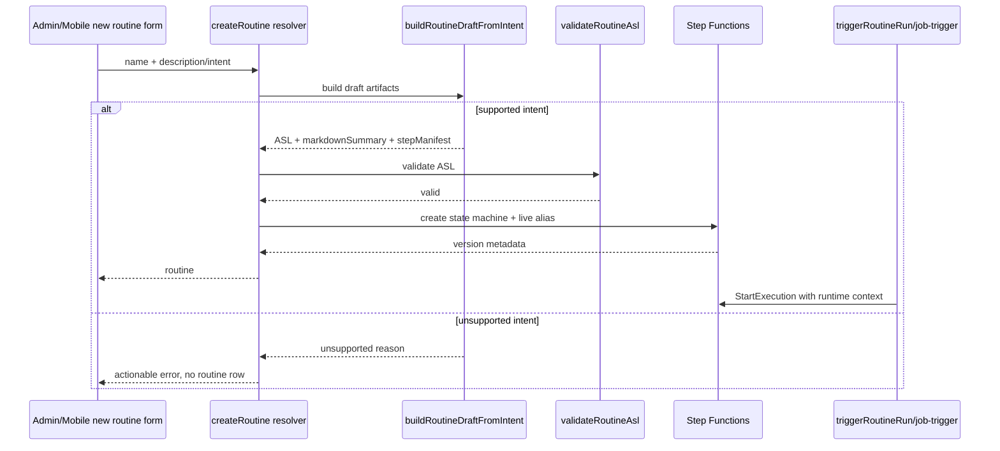

# feat: Real routine authoring MVP

## Overview

Replace the current no-op routine creation path with a real recipe-backed authoring path for the first supported routine shape. Admin and mobile "new routine" surfaces should either create a Step Functions routine with executable ASL or return an actionable unsupported-intent message. They should no longer mint a `Succeed` placeholder that looks active but does no useful work.

---

## Problem Frame

The Step Functions runtime, Test button, run list, and Austin weather/email proof path now work, but routine authoring still creates placeholder ASL in `apps/admin/src/routes/_authed/_tenant/automations/routines/new.tsx` and `apps/mobile/app/routines/new.tsx`. That means a user can create a routine from the product surface, click Test, see a successful execution, and still have nothing real happen. The master plan calls for recipe-catalog authoring and validator feedback; this slice lands the first non-chat, server-side authoring path so the app can create a meaningful routine while the fuller chat builder remains a follow-up.

---

## Requirements Trace

- R1. Admin and mobile new-routine creation must stop creating no-op `Succeed` state machines for supported intents.
- R2. The first supported intent is "fetch Austin weather and email it"; it must publish executable ASL and metadata through the existing `createRoutine` path.
- R3. Unsupported intents return an actionable error instead of creating a fake active routine.
- R4. The authored ASL must pass `validateRoutineAsl` and use recipe-catalog markers so run metadata remains inspectable.
- R5. `triggerRoutineRun` and scheduled routine triggers must seed execution input with every runtime function name required by authored recipe ASL, not only the inbox approval callback.
- R6. Tests must cover authoring success, unsupported-intent rejection, validator compatibility, and trigger input enrichment.

**Origin actors:** A1 (end user), A2 (tenant operator)
**Origin flows:** F1 (end-user authoring), F2 (operator authoring)
**Origin acceptance examples:** AE3 (validator rejects bad ASL with chat-actionable error)

---

## Scope Boundaries

- This is not the full conversational RoutineChatBuilder migration. The chat session stubs in mobile remain follow-up work.
- This does not add arbitrary natural-language planning or an LLM call. The MVP is deterministic, intentionally narrow, and extensible.
- This does not expose a raw ASL editor or visual authoring canvas.
- This does not introduce new recipe ids unless implementation proves the existing catalog cannot represent the Austin weather/email shape safely.
- This does not repair or rewrite existing routines other than through normal new-routine creation and later publish flows.

### Deferred to Follow-Up Work

- Full chat builder session migration to GraphQL and validator-feedback retry loop.
- General recipe planning for Slack, webhook, database, approval, and custom API flows.
- Agent-side `create_routine` producing a real initial recipe graph instead of an agent-private placeholder.

---

## Context & Research

### Relevant Code and Patterns

- `apps/admin/src/routes/_authed/_tenant/automations/routines/new.tsx` currently constructs `Draft routine -- awaiting builder` ASL with a terminal `NoOp` state.
- `apps/mobile/app/routines/new.tsx` mirrors the same placeholder ASL before routing into the still-stubbed builder chat.
- `packages/api/src/graphql/resolvers/routines/createRoutine.mutation.ts` is the authoritative publish path for first versions and already validates ASL before creating Step Functions resources.
- `packages/api/src/graphql/resolvers/routines/triggerRoutineRun.mutation.ts` seeds only `inboxApprovalFunctionName`, while recipe catalog states may also require `emailSendFunctionName`, `slackSendFunctionName`, `routineTaskPythonFunctionName`, `adminOpsMcpFunctionName`, and other execution-input values.
- `packages/lambda/job-trigger.ts` has the scheduled equivalent of `triggerRoutineRun` and must seed the same runtime context for scheduled runs.
- `packages/api/src/lib/routines/recipe-catalog.ts` is the source of truth for recipe ASL emitters and marker comments.
- `packages/api/src/handlers/routine-asl-validator.ts` reverse-maps states from recipe comments and Ajv-validates recipe arguments.
- `packages/api/src/handlers/routine-task-weather-email.ts` proved the weather/email domain behavior, but it is a special proof handler, not the general authoring architecture.

### Institutional Learnings

- `docs/solutions/architecture-patterns/recipe-catalog-llm-dsl-validator-feedback-loop-2026-05-01.md` says LLM or authoring surfaces should compose recipe ids and args, then let platform-owned emitters produce ASL; raw target-language emission is the unsafe path.
- `docs/solutions/architecture-patterns/inert-to-live-seam-swap-pattern-2026-04-25.md` supports landing structural authoring helpers before broadening the surface area.
- `docs/solutions/best-practices/every-admin-mutation-requires-requiretenantadmin-2026-04-22.md` applies through the existing `createRoutine` resolver; new authoring inputs must not bypass that gate.
- `docs/solutions/best-practices/service-endpoint-vs-widening-resolvecaller-auth-2026-04-21.md` supports keeping runtime callback/function-name enrichment server-side instead of trusting clients to pass it.

### External References

- No new external research needed. The Step Functions and recipe-catalog decisions were already researched in the master routines plan; this slice follows those local patterns.

---

## Key Technical Decisions

- **Server-side composer, not client-authored ASL:** Add a `buildRoutineDraftFromIntent` helper in `packages/api` and use it from admin/mobile request paths. Clients submit name + natural-language intent; the server chooses whether it can build real ASL.
- **Use the existing first-version publish boundary:** The composer returns `{ asl, markdownSummary, stepManifest }` that flows into `createRoutine`; it does not create Step Functions resources itself.
- **Narrow deterministic MVP:** Support the Austin weather/email shape first. Unsupported intents fail with an actionable message so users are not misled by no-op success.
- **Recipe marker fidelity:** Authored states must use recipe-catalog emitters or equivalent marker-compatible states so validator, run-detail, and step-event logic can identify recipe types.
- **Runtime context enrichment lives in trigger fan-in:** Manual and scheduled triggers seed the function names and runtime context required by recipe ASL, keeping clients and routine definitions portable across stages.

---

## Open Questions

### Resolved During Planning

- **Should the MVP call an LLM?** No. The existing mobile/admin chat plumbing is stubbed, and the high-confidence next step is a deterministic server composer for the supported proof case.
- **Should unsupported intents create placeholder routines?** No. That is the bug this slice removes.

### Deferred to Implementation

- **Exact recipe representation for dynamic weather body:** Prefer existing recipe emitters. If `email_send` cannot safely accept dynamic body input without broadening its schema, implement the smallest validator/composer change needed and cover it with tests.
- **Mobile codegen churn:** If GraphQL operation shape changes, regenerate only the affected admin/mobile GraphQL artifacts.

---

## High-Level Technical Design

> _This illustrates the intended approach and is directional guidance for review, not implementation specification. The implementing agent should treat it as context, not code to reproduce._

---

## Implementation Units

- U1. **Server-side routine draft composer**

**Goal:** Add a deterministic authoring helper that turns the first supported natural-language intent into validated routine artifacts.

**Requirements:** R1, R2, R3, R4

**Dependencies:** Existing recipe catalog and validator.

**Files:**

- Create: `packages/api/src/lib/routines/routine-draft-authoring.ts`
- Create: `packages/api/src/lib/routines/routine-draft-authoring.test.ts`
- Modify: `packages/api/src/lib/routines/recipe-catalog.ts`
- Modify: `packages/api/src/lib/routines/recipe-catalog.test.ts`
- Modify: `packages/api/src/handlers/routine-asl-validator.ts`
- Modify: `packages/api/src/handlers/routine-asl-validator.test.ts`

**Approach:**

- Introduce a pure helper that accepts `{ name, intent, recipient? }`.
- Detect the Austin weather/email intent using conservative keyword checks: weather + Austin + email/send.
- Return an unsupported result for every other intent with a message that names the currently supported pattern.
- Compose ASL through recipe-catalog-owned shapes so state comments carry `recipe:<id>` and validator compatibility stays intact.
- Keep markdown summary and step manifest operator-readable: intent, steps, recipient, runtime assumptions.

**Patterns to follow:**

- `packages/api/src/lib/routines/recipe-catalog.ts`
- `packages/api/src/handlers/routine-asl-validator.ts`
- `packages/api/src/handlers/routine-task-weather-email.test.ts`

**Test scenarios:**

- Happy path: input "check the weather in Austin and email it to ericodom37@gmail.com" returns ASL with weather-fetch and email-send behavior, markdown summary, and non-empty step manifest.
- Happy path: returned ASL passes `validateRoutineAsl` with the local mocked AWS validator.
- Edge case: supported intent without an email address returns unsupported with an actionable missing-recipient message.
- Error path: unrelated intent such as "post to Slack" returns unsupported and does not produce ASL.
- Error path: dynamic payload fields introduced for recipe output piping are accepted by the validator only for the intended recipe fields.

**Verification:**

- Composer tests prove no supported path emits `NoOp` or terminal-only `Succeed` ASL.
- Validator tests prove the composed ASL is acceptable before the resolver calls AWS.

---

- U2. **CreateRoutine authoring integration**

**Goal:** Let `createRoutine` build real artifacts when clients submit intent-only input, while preserving explicit ASL input for existing callers and tests.

**Requirements:** R1, R2, R3, R4

**Dependencies:** U1

**Files:**

- Modify: `packages/database-pg/graphql/types/routines.graphql`
- Modify: `packages/api/src/graphql/resolvers/routines/createRoutine.mutation.ts`
- Modify: `packages/api/src/__tests__/routines-publish-flow.test.ts`
- Modify: `apps/admin/src/lib/graphql-queries.ts`
- Modify: `apps/admin/src/gql/graphql.ts`
- Modify: `apps/admin/src/gql/gql.ts`
- Modify: `apps/mobile/lib/hooks/use-routines.ts`
- Modify: `apps/mobile/lib/gql/graphql.ts`
- Modify: `apps/mobile/lib/gql/gql.ts`

**Approach:**

- Extend `CreateRoutineInput` to allow intent-first creation while retaining explicit `{ asl, markdownSummary, stepManifest }`.
- In the resolver, if ASL artifacts are omitted, call the composer before ASL validation and AWS side effects.
- Throw an actionable error on unsupported intent before creating Step Functions resources or DB rows.
- Keep explicit ASL callers unchanged so tests, MCP, and future chat builder publish paths are not forced through the MVP composer.

**Patterns to follow:**

- `packages/api/src/graphql/resolvers/routines/createRoutine.mutation.ts`
- `packages/api/src/__tests__/routines-publish-flow.test.ts`

**Test scenarios:**

- Happy path: intent-only `createRoutine` calls the composer, validates the returned ASL, and creates state machine + DB rows.
- Happy path: explicit ASL `createRoutine` remains backward-compatible.
- Error path: unsupported intent rejects before any SFN command is sent.
- Error path: invalid composer ASL surfaces validator errors and does not insert rows.

**Verification:**

- Existing publish-flow tests still pass.
- New resolver test proves unsupported intents are side-effect-free.

---

- U3. **Admin and mobile new-routine surfaces stop sending placeholders**

**Goal:** Update product entry points to request real server-side authoring artifacts instead of constructing no-op ASL in the client.

**Requirements:** R1, R2, R3

**Dependencies:** U2

**Files:**

- Modify: `apps/admin/src/routes/_authed/_tenant/automations/routines/new.tsx`
- Modify: `apps/mobile/app/routines/new.tsx`
- Test: `apps/admin/src/routes/_authed/_tenant/automations/routines/new.test.tsx`
- Test: `packages/api/src/__tests__/routines-publish-flow.test.ts`

**Approach:**

- Remove client-side `placeholderAsl` construction.
- Submit name + description/intent to `createRoutine`.
- Render unsupported-intent errors inline in admin and as an alert in mobile.
- On success, navigate to routine detail as today.

**Patterns to follow:**

- Current admin new routine form structure.
- Current mobile new routine form structure.

**Test scenarios:**

- Happy path: admin submits Austin weather/email intent and receives a routine id without sending `asl`.
- Error path: unsupported admin intent leaves the form in place and shows the resolver's actionable message.
- Error path: mobile unsupported intent resets from loading phase and displays the resolver message.

**Verification:**

- Grep confirms no client-side `Draft routine -- awaiting builder` or `NoOp` placeholder creation remains in admin/mobile new-routine files.

---

- U4. **Trigger runtime context enrichment**

**Goal:** Ensure authored recipe ASL can resolve every stage-specific runtime function name when manually or schedule-triggered.

**Requirements:** R5

**Dependencies:** U1

**Files:**

- Modify: `packages/api/src/graphql/resolvers/routines/triggerRoutineRun.mutation.ts`
- Modify: `packages/lambda/job-trigger.ts`
- Modify: `terraform/modules/app/lambda-api/handlers.tf`
- Modify: `packages/api/src/__tests__/routines-publish-flow.test.ts`
- Modify: `packages/lambda/__tests__/job-trigger.skill-run.test.ts`

**Approach:**

- Snapshot required env vars at handler entry and fail loudly if a referenced recipe helper is missing.
- Seed execution input with existing user input plus `inboxApprovalFunctionName`, `emailSendFunctionName`, `slackSendFunctionName`, `routineTaskPythonFunctionName`, and `adminOpsMcpFunctionName` where configured.
- Keep user-provided fields from overriding server-owned function-name fields.
- Add the same env values to both GraphQL and job-trigger Lambda Terraform configuration.

**Patterns to follow:**

- Existing `ROUTINE_APPROVAL_CALLBACK_FUNCTION_NAME` handling in `triggerRoutineRun.mutation.ts` and `packages/lambda/job-trigger.ts`.
- `docs/solutions/workflow-issues/agentcore-completion-callback-env-shadowing-2026-04-25.md`

**Test scenarios:**

- Happy path: `triggerRoutineRun` includes server-owned function names in `StartExecution` input.
- Edge case: caller supplies `emailSendFunctionName` in user input; server value wins.
- Error path: required env for an authored recipe is missing; resolver errors before `StartExecution`.
- Integration: scheduled job-trigger path uses the same enriched input keys.

**Verification:**

- Manual and scheduled trigger tests show the same runtime context shape.

---

- U5. **End-to-end browser proof**

**Goal:** Prove the product authoring path creates and tests a real routine from the admin UI.

**Requirements:** R1, R2, R3, R4, R5, R6

**Dependencies:** U1, U2, U3, U4

**Files:**

- No additional source files expected.

**Approach:**

- Run the admin dev server against the updated branch.
- Create a new routine with the Austin weather/email intent from the admin UI.
- Click the routine detail **Test** button.
- Confirm the run appears in the admin run list and succeeds in Step Functions with non-placeholder state names.

**Patterns to follow:**

- `docs/plans/2026-05-02-001-fix-routine-weather-email-test-plan.md`

**Test scenarios:**

- Integration: admin authoring form creates a routine whose first ASL version has real states, not `NoOp`.
- Integration: Test button starts an execution and the execution succeeds.
- Integration: unsupported form submission shows an error and creates no routine row.

**Verification:**

- Browser-observed success plus AWS/DB evidence for the created routine execution.

---

## System-Wide Impact

- **Interaction graph:** Admin/mobile new routine form → `createRoutine` → routine composer → ASL validator → Step Functions creation. Manual/scheduled triggers → enriched execution input → recipe states.
- **Error propagation:** Unsupported authoring fails synchronously before AWS side effects. Missing runtime env fails before Step Functions execution starts.
- **State lifecycle risks:** Avoids orphan state machines for unsupported intents by composing before `CreateStateMachine`. Existing create rollback logging remains for AWS/DB mid-flight failures.
- **API surface parity:** Admin and mobile share the same `CreateRoutineInput` pathway; explicit ASL remains available for future chat builder and MCP tooling.
- **Integration coverage:** Unit tests cover pure composer and resolver boundaries; browser proof covers admin UI + deployed GraphQL + Step Functions.
- **Unchanged invariants:** `publishRoutineVersion` remains the edit path for existing routines. Raw ASL remains server-side and validator-gated.

---

## Risks & Dependencies

| Risk                                                               | Mitigation                                                                                                  |
| ------------------------------------------------------------------ | ----------------------------------------------------------------------------------------------------------- |
| The first supported intent is too narrow                           | Return actionable unsupported errors and document the current supported shape; do not create fake routines. |
| Existing `email_send` schema cannot represent dynamic body content | Add the smallest typed dynamic-field extension needed and cover it in recipe catalog + validator tests.     |
| Trigger fan-in misses a runtime function name                      | Centralize enrichment shape in tests for manual and scheduled triggers.                                     |
| Client codegen drift                                               | Regenerate admin/mobile GraphQL artifacts only if schema or operations change.                              |
| AWS dev deploy needed for final browser proof                      | Keep local tests green first, then rely on PR/deploy or a targeted dev verification path after merge.       |

---

## Documentation / Operational Notes

- Update any inline comments in admin/mobile that still describe no-op placeholder routine creation.
- The final PR description should call out that unsupported intents now fail honestly instead of creating active-looking no-op routines.

---

## Sources & References

- **Master design plan:** `docs/plans/2026-05-01-003-feat-routines-step-functions-rebuild-plan.md`
- **Phase C authoring plan:** `docs/plans/2026-05-01-006-feat-routines-phase-c-authoring-plan.md`
- **Austin test proof plan:** `docs/plans/2026-05-02-001-fix-routine-weather-email-test-plan.md`
- **Recipe-catalog architecture:** `docs/solutions/architecture-patterns/recipe-catalog-llm-dsl-validator-feedback-loop-2026-05-01.md`
