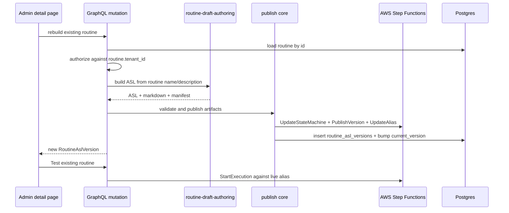

# fix: Keep routine republish state synchronized

## Overview

The Austin weather routine succeeded only after manually updating the Step Functions definition, publishing a new version, and retargeting the `live` alias. That manual escape hatch proves the runtime plumbing works, but it bypasses `routine_asl_versions`, `routines.current_version`, validation warnings, actor attribution, and any UI or API that expects the database to be the source of routine version history.

This plan makes that refresh product-owned: callers can rebuild the currently configured routine from its persisted metadata/intent and publish the rebuilt ASL through the existing `publishRoutineVersion` transaction, so Step Functions, the `live` alias, and ThinkWork's DB version metadata stay synchronized.

---

## Problem Frame

The Phase B runtime already has the durable publish primitive in `packages/api/src/graphql/resolvers/routines/publishRoutineVersion.mutation.ts`: validate ASL, update the state machine, publish a Step Functions version, flip the alias, insert `routine_asl_versions`, and bump `routines.current_version`. The gap is that routine authoring fixes can change server-side recipe emitters after a routine has already been created. Existing routines then keep stale ASL until someone manually rebuilds and republishes them.

For the current Austin-weather demo, the stale version lacked execution identity fields in recipe payloads. Manually retargeting the Step Functions alias fixed the run, but it left the product contract incomplete. Rebuild/republish must go through the same resolver path users, agents, and scheduled triggers depend on.

---

## Requirements Trace

- R1. Rebuilding an existing step-functions routine must publish through ThinkWork's versioning path, not direct AWS console/CLI mutation.
- R2. The rebuilt ASL, markdown summary, step manifest, validation warnings, actor attribution, and `current_version` must be persisted consistently with the Step Functions version and `live` alias.
- R3. The rebuild path must reuse the existing validation and tenant authorization semantics from `publishRoutineVersion`.
- R4. The admin routine detail page should expose a safe refresh action for step-functions routines so the operator can update stale ASL without creating a new routine.
- R5. Tests must prove that server-authored Austin-weather routines can be republished from persisted routine metadata and that the Test button will execute the newly published alias version.

**Origin actors:** A2 (operator approving or managing routines), A3 (agent invoking via `routine_invoke`).
**Origin flows:** F4 (runtime execution visibility), publish/version flow from Phase B.
**Origin acceptance examples:** AE3 (publish-time validation), AE4 (operator run visibility).

---

## Scope Boundaries

- No raw ASL editor exposed to operators.
- No version diff or rollback UI; v0 still ships native Step Functions versioning behavior only.
- No generalized natural-language authoring planner beyond the existing deterministic Austin-weather MVP.
- No automatic background migration of every existing routine. This plan adds an explicit rebuild/republish path; bulk drift repair can be follow-up operational work.

### Deferred to Follow-Up Work

- A richer version history/diff/rollback surface remains outside this fix.
- Bulk repair or drift detection for all tenant routines can be added after the product-owned republish path exists.

---

## Context & Research

### Relevant Code and Patterns

- `packages/api/src/graphql/resolvers/routines/createRoutine.mutation.ts` already builds deterministic Austin-weather artifacts when explicit ASL artifacts are omitted.
- `packages/api/src/graphql/resolvers/routines/publishRoutineVersion.mutation.ts` owns the correct validation → Step Functions update/version/alias flip → DB transaction sequence.
- `packages/api/src/lib/routines/routine-draft-authoring.ts` is the current deterministic authoring MVP and can rebuild the same ASL artifacts from routine name/description.
- `packages/api/src/__tests__/routines-publish-flow.test.ts` is the existing mocked SFN/DB/Auth coverage for create/publish/trigger flows.
- `packages/database-pg/graphql/types/routines.graphql` defines the GraphQL input surface. Schema changes require codegen in `packages/api`, `apps/admin`, `apps/mobile`, and `apps/cli`.
- `apps/admin/src/routes/_authed/_tenant/automations/routines/$routineId.tsx` is the routine detail page with the Test button and route-level mutations.
- `apps/admin/src/lib/graphql-queries.ts` is the local admin GraphQL operation source for generated documents.

### Institutional Learnings

- `docs/solutions/workflow-issues/manually-applied-drizzle-migrations-drift-from-dev-2026-04-21.md` reinforces that manual production mutations must become first-class product or migration paths, with drift visibility instead of silent console work.
- `docs/solutions/workflow-issues/agentcore-completion-callback-env-shadowing-2026-04-25.md` reinforces snapshotting environment-sensitive runtime configuration before async side effects; the existing routines resolvers already follow this for SFN env.

### External References

- External research skipped. The relevant behavior is repository-owned AWS Step Functions publish/version/alias plumbing with strong local patterns.

---

## Key Technical Decisions

- Add a rebuild/republish mutation instead of teaching the UI to reconstruct ASL: server-side authoring owns the deterministic MVP, validation, and SFN/DB consistency.
- Implement rebuild by sharing publish plumbing rather than duplicating Step Functions calls: the new entry point should produce artifacts, then use the same core publish sequence as `publishRoutineVersion`.
- Use persisted routine fields as the rebuild source for now: `name` and `description` are sufficient for the Austin-weather MVP and avoid inventing a new authoring state model in this fix.
- Treat unsupported routines as explicit errors: if the deterministic authoring MVP cannot rebuild the routine, return the authoring reason without changing AWS or DB.
- Keep the admin action scoped and operator-facing: a "Rebuild" or "Republish" button belongs near Test on the detail page, with loading/error feedback and query invalidation.

---

## Open Questions

### Resolved During Planning

- **Should refresh be a direct AWS alias retarget?** No. It must go through the GraphQL publish path so DB version rows and Step Functions versions remain synchronized.
- **Should the client submit rebuilt ASL?** No. The server already owns the deterministic authoring MVP and should keep recipe emitter details off the UI surface.
- **Should this bulk-update all existing routines automatically?** No. This fix creates the product-owned path first; bulk repair can be a follow-up once the path is testable.

### Deferred to Implementation

- **Exact mutation name:** Choose a clear schema name while editing, likely `republishRoutine` or `rebuildRoutineVersion`, matching existing GraphQL naming.
- **Button label and placement:** Keep it concise in the existing routine detail header actions; final copy can follow surrounding admin UI conventions.
- **Whether mobile/CLI need first-class UI exposure now:** Codegen must stay current, but user-facing exposure outside admin can remain deferred unless type generation requires operation additions.

---

## High-Level Technical Design

> *This illustrates the intended approach and is directional guidance for review, not implementation specification. The implementing agent should treat it as context, not code to reproduce.*

---

## Implementation Units

- U1. **Extract Shared Publish Core**

**Goal:** Make the existing `publishRoutineVersion` sequence reusable by both explicit ASL publishing and server-side rebuild/republish.

**Requirements:** R1, R2, R3

**Dependencies:** None

**Files:**
- Modify: `packages/api/src/graphql/resolvers/routines/publishRoutineVersion.mutation.ts`
- Test: `packages/api/src/__tests__/routines-publish-flow.test.ts`

**Approach:**
- Keep the public `publishRoutineVersion` mutation behavior unchanged.
- Extract the artifact publishing sequence behind a resolver-local helper or small shared module: routine lookup/authorization stays explicit, but validation, prior-version capture, SFN update/version/alias flip, and DB transaction should be one path.
- Preserve existing validation error text, legacy routine rejection, alias invariant check, and actor attribution.

**Patterns to follow:**
- Current `publishRoutineVersion` pipeline comments and test shape.
- `createRoutine.mutation.ts` separation between artifact construction and state-machine creation.

**Test scenarios:**
- Happy path: explicit `publishRoutineVersion` still issues UpdateStateMachine, PublishStateMachineVersion, UpdateStateMachineAlias, and returns version 2.
- Error path: invalid ASL still returns validator errors and makes no SFN calls.
- Error path: legacy Python routine still rejects before SFN calls.

**Verification:**
- Existing publish-flow tests remain green without changing the mutation contract.

---

- U2. **Add Server-Side Rebuild/Republish Mutation**

**Goal:** Add a product-owned mutation that rebuilds an existing step-functions routine from persisted metadata and publishes the rebuilt ASL through the shared publish core.

**Requirements:** R1, R2, R3, R5

**Dependencies:** U1

**Files:**
- Modify: `packages/database-pg/graphql/types/routines.graphql`
- Modify: `packages/api/src/graphql/resolvers/routines/index.ts`
- Create or modify: `packages/api/src/graphql/resolvers/routines/rebuildRoutineVersion.mutation.ts`
- Modify: `packages/api/src/__tests__/routines-publish-flow.test.ts`
- Generated: `packages/api/src/gql/graphql.ts`
- Generated: `apps/admin/src/gql/graphql.ts`
- Generated: `apps/admin/src/gql/gql.ts`
- Generated: `apps/mobile/src/gql/graphql.ts`
- Generated: `apps/mobile/src/gql/gql.ts`
- Generated: `apps/cli/src/gql/graphql.ts`

**Approach:**
- Add an input carrying `routineId`.
- Resolver loads the routine, rejects missing or non-step-functions routines, and authorizes against the routine's tenant.
- Rebuild artifacts with `buildRoutineDraftFromIntent({ name: routine.name, intent: routine.description ?? routine.name })`.
- If authoring returns `ok: false`, throw the reason and avoid SFN/DB writes.
- Publish rebuilt artifacts through U1's shared path so version number, alias target, warnings, and actor fields behave exactly like explicit publish.

**Patterns to follow:**
- `createRoutine.mutation.ts` intent-only artifact authoring.
- `publishRoutineVersion.mutation.ts` admin/API-key authorization and SFN versioning behavior.
- GraphQL codegen workflow documented in `AGENTS.md`.

**Test scenarios:**
- Happy path: rebuild of an Austin-weather routine produces a new version row and flips alias using rebuilt ASL that includes current recipe emitter payload fields.
- Edge case: routine description is null but name contains unsupported text -> authoring error, no SFN calls, no DB transaction.
- Error path: missing routine id returns not found.
- Error path: legacy Python routine rejects before authoring or SFN calls.
- Error path: validator rejection from rebuilt ASL is surfaced without alias flip.

**Verification:**
- GraphQL schema/codegen outputs compile.
- Mocked resolver tests prove rebuild uses the same SFN/DB path as explicit publish.

---

- U3. **Expose Rebuild Action in Admin Routine Detail**

**Goal:** Let an operator refresh the currently configured routine from the routine detail page without leaving the product.

**Requirements:** R4, R5

**Dependencies:** U2

**Files:**
- Modify: `apps/admin/src/lib/graphql-queries.ts`
- Modify: `apps/admin/src/routes/_authed/_tenant/automations/routines/$routineId.tsx`
- Generated: `apps/admin/src/gql/graphql.ts`
- Generated: `apps/admin/src/gql/gql.ts`

**Approach:**
- Add an admin GraphQL operation for the rebuild mutation.
- Add a header action near Test, visible for step-functions routines. The routine detail query currently includes `engine`; if it does not after generated types are updated, extend the query.
- On success, invalidate routine detail and runs/version-adjacent queries as needed. Do not automatically trigger a run; the operator should still click Test so the test action is explicit.
- Show mutation errors in the same toast/error idiom used by the Test button.

**Patterns to follow:**
- Existing Test button mutation in the same route.
- Existing admin button/loading/toast conventions in nearby automation pages.

**Test scenarios:**
- Happy path: clicking Rebuild calls the mutation, disables while pending, and leaves Test available after success.
- Error path: rebuild authoring error surfaces to the operator and does not change the runs list.
- Edge case: legacy/non-step-functions routine does not show the rebuild action.

**Verification:**
- Admin typecheck/build passes.
- Browser verification confirms the action appears on the current routine detail page and the existing Test button still works after rebuild.

---

- U4. **End-to-End Verification of Product-Owned Refresh**

**Goal:** Prove the manual ASL refresh is no longer needed for the current Austin-weather routine path.

**Requirements:** R1, R2, R5

**Dependencies:** U1, U2, U3

**Files:**
- Test: `packages/api/src/__tests__/routines-publish-flow.test.ts`
- Test: `packages/api/src/lib/routines/routine-draft-authoring.test.ts`
- Manual verification target: `apps/admin/src/routes/_authed/_tenant/automations/routines/$routineId.tsx`

**Approach:**
- Add or extend API coverage to assert rebuilt ASL uses the current recipe catalog payload shape, including server-owned execution identity fields.
- After deploy, use the admin page's Rebuild action for the existing Austin-weather routine, then click Test. Confirm the resulting execution uses the new alias version and succeeds.
- Capture the execution id and version number in the handoff notes.

**Patterns to follow:**
- Prior manual verification from the successful `b921790e` run.
- Existing Step Functions execution polling via AWS CLI for final status confirmation.

**Test scenarios:**
- Integration: rebuild existing Austin weather routine -> current_version increments -> Test button starts execution against `live` alias -> execution succeeds with weather stdout and email message id.
- Error path: old failed executions remain historical rows but do not affect the latest successful run.

**Verification:**
- Local unit/type/build checks pass.
- Browser Test button succeeds after a product-owned rebuild rather than a manual AWS alias update.

---

## System-Wide Impact

- **Interaction graph:** Admin UI calls GraphQL rebuild mutation; GraphQL rebuilds artifacts, validates ASL, updates Step Functions, writes DB version metadata, then Test continues to call `triggerRoutineRun` against the `live` alias.
- **Error propagation:** Authoring, validation, AWS, and DB errors should surface through the mutation and leave prior alias/version state intact where possible.
- **State lifecycle risks:** SFN update/version publish can succeed before DB writes fail. This risk already exists in explicit publish; the shared core should not make it worse, and tests should keep the sequencing visible.
- **API surface parity:** GraphQL schema/codegen consumers must regenerate. Admin uses the mutation now; mobile/CLI can defer UI usage while retaining generated type parity.
- **Integration coverage:** Unit tests can prove command order and DB writes; live verification must prove AWS alias version and Test execution success.
- **Unchanged invariants:** `publishRoutineVersion` remains the explicit-ASL path. `triggerRoutineRun` still starts executions against the alias ARN and injects server-owned execution input fields.

---

## Risks & Dependencies

| Risk | Mitigation |
|------|------------|
| Rebuild only works for the Austin-weather MVP | Return explicit authoring errors for unsupported routines; do not invent generalized authoring in this fix. |
| Shared publish extraction accidentally changes explicit publish semantics | Keep existing explicit publish tests and add rebuild-specific tests around the shared path. |
| DB and Step Functions diverge on partial failure | Reuse existing publish sequencing and preserve prior alias metadata; do not add a second divergent AWS mutation path. |
| Codegen churn misses one consumer | Regenerate every package with a `codegen` script after GraphQL schema changes. |
| Admin action encourages accidental republish | Keep action explicit, disabled while pending, and do not chain it automatically into Test. |

---

## Documentation / Operational Notes

- PR notes should state that manual Step Functions alias refresh is no longer the recommended path.
- After deploy, republish the current Austin-weather routine through the new admin action and record the successful execution id.

---

## Sources & References

- **Origin document:** `docs/brainstorms/2026-05-01-routines-step-functions-rebuild-requirements.md`
- Related plan: `docs/plans/2026-05-01-005-feat-routines-phase-b-runtime-plan.md`
- Related code: `packages/api/src/graphql/resolvers/routines/publishRoutineVersion.mutation.ts`
- Related code: `packages/api/src/graphql/resolvers/routines/createRoutine.mutation.ts`
- Related code: `packages/api/src/lib/routines/routine-draft-authoring.ts`
- Related code: `apps/admin/src/routes/_authed/_tenant/automations/routines/$routineId.tsx`
