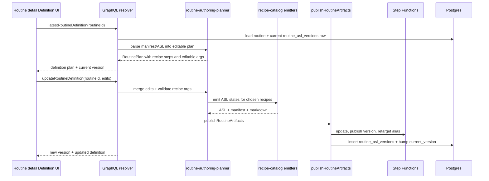

# feat: Routine definition editing MVP

## Overview

Add a product-owned routine definition surface so operators can inspect the latest published Step Functions routine, see the recipe steps that define it, edit supported parameters such as recipient email, and republish without touching raw ASL. At the same time, replace the one-off Austin-weather detector with a small authoring planner that selects from the recipe catalog and emits a structured editable definition before recipe emitters produce ASL.

## Closeout Status

Completed. Routine definitions became visible and editable through product-owned GraphQL/UI paths, with ASL remaining generated infrastructure. The following step-config plan corrected the initial top-level field model into per-step recipe config.

This is the bridge between the current deterministic Austin-weather MVP and the fuller Phase C/D chat builder. The key product shift: routine definition becomes a first-class, editable recipe graph, while Step Functions ASL remains generated infrastructure.

---

## Problem Frame

The current routine path can create, rebuild, and test the Austin weather email routine. However, the only editable source is the routine name/description, and `rebuildRoutineVersion` regenerates from that prose. Users cannot see the configured steps, cannot safely change a parameter like the email recipient, and cannot tell which recipe catalog primitives the routine uses.

The master plan covers a future chat builder and read-only execution graph, but not the immediate admin workflow: inspect an existing routine's definition, adjust its supported recipe args, and publish a new version through the same validation and Step Functions alias path.

---

## Requirements Trace

- R1. Admin users can view the latest routine definition as recipe steps, not raw ASL.
- R2. Admin users can edit supported recipe parameters for the first supported routine shape: Austin weather fetch plus email send.
- R3. Saving edits must republish through `publishRoutineArtifacts`, preserving validation, `routine_asl_versions`, `routines.current_version`, actor attribution, Step Functions versioning, and `live` alias retargeting.
- R4. Authoring must use a planner that chooses from `recipe-catalog.ts`, not hard-coded state assembly hidden in UI code.
- R5. Unsupported planner requests must return actionable errors before any Step Functions or DB side effects.
- R6. The UI must clearly separate routine definition from routine executions.
- R7. Tests must cover planner recipe selection, structured definition editing, republish side-effect ordering, and admin UI wiring.

**Origin actors:** A2 (tenant operator), A1 (end user authoring later through mobile/chat).
**Origin flows:** F1/F2 (authoring), F4 (execution visibility; definition must not be confused with runs).
**Related acceptance examples:** AE3 (validator errors are surfaced), AE4 (operator can reason about what happened after Test).

---

## Scope Boundaries

- No raw ASL editor.
- No arbitrary drag-and-drop workflow builder.
- No LLM chat planning in this slice.
- No support for every recipe in the catalog in the UI. The planner should be catalog-shaped and extensible, but the editable admin form only needs the Austin weather/email routine shape.
- No schema migration unless implementation proves current persistence is insufficient. Prefer deriving the first editable definition from `routine_asl_versions.step_manifest_json` and `asl_json`, then persisting changes as a new ASL version.
- No mobile edit UI in this slice; mobile can consume the same planner later.

### Deferred Follow-Ups

- Full conversational RoutineChatBuilder for admin and mobile.
- Visual graph editing and branching/choice authoring.
- Editable Slack, webhook, approval, SQL, and agent-invoke recipes.
- Bulk migration of old routines into richer definition metadata.

---

## Context & Research

### Relevant Code and Patterns

- `packages/api/src/lib/routines/recipe-catalog.ts` defines the recipe ids, schemas, ASL emitters, and `recipe:<id>` markers. Current ids include `wait`, `agent_invoke`, `tool_invoke`, `routine_invoke`, `http_request`, `aurora_query`, `transform_json`, `set_variable`, `slack_send`, `email_send`, `inbox_approval`, and `python`.
- `packages/api/src/lib/routines/routine-draft-authoring.ts` currently detects Austin/weather/email directly and builds two states (`python`, `email_send`). This should become planner-backed rather than a closed one-off composer.
- `packages/api/src/graphql/resolvers/routines/createRoutine.mutation.ts` already routes intent-only creation through `buildRoutineDraftFromIntent`, then validates and creates the first Step Functions version.
- `packages/api/src/graphql/resolvers/routines/rebuildRoutineVersion.mutation.ts` rebuilds from persisted routine name/description and calls `publishRoutineArtifacts`.
- `packages/api/src/graphql/resolvers/routines/publishRoutineVersion.mutation.ts` owns the correct validation -> Step Functions update/version/alias -> DB transaction.
- `packages/api/src/graphql/resolvers/routines/routineExecutions.query.ts` exposes `routineAslVersion(id)` with `aslJson`, `markdownSummary`, and `stepManifestJson`.
- `apps/admin/src/routes/_authed/_tenant/automations/routines/$routineId.tsx` is the routine detail page; it currently shows header actions and `ExecutionList`.
- `apps/admin/src/components/routines/ExecutionGraph.tsx` and `apps/admin/src/routes/_authed/_tenant/automations/routines/$routineId.executions.$executionId.tsx` already read step manifests for execution visualization.
- `apps/admin/src/routes/_authed/_tenant/agent-templates/index.tsx` is a useful compact-data-table style reference.

### Institutional Learnings

- `docs/solutions/architecture-patterns/recipe-catalog-llm-dsl-validator-feedback-loop-2026-05-01.md` says authoring should compose recipe ids and args, then let platform-owned emitters produce ASL; raw target-language emission is unsafe.
- `docs/solutions/workflow-issues/manually-applied-drizzle-migrations-drift-from-dev-2026-04-21.md` reinforces that manual console edits must become product-owned, auditable flows.
- `docs/solutions/best-practices/every-admin-mutation-requires-requiretenantadmin-2026-04-22.md` applies to the new edit/republish mutation.

### External Research

Skipped. This is driven by local Step Functions, GraphQL, recipe-catalog, and admin UI patterns already established in the repo.

---

## Key Technical Decisions

- **Structured definition is the editable source, ASL is generated.** The UI edits recipe arguments and planner fields; API regenerates ASL through recipe emitters.
- **Planner selects recipe ids, not UI.** The server planner returns a `RoutinePlan` with steps `{ nodeId, recipeId, label, args }`. The current Austin-weather shape is represented as `python` + `email_send`, but the code path is intentionally catalog-shaped.
- **Read latest version for display, save as new version.** The detail page should fetch the latest `routine_asl_versions` row via `currentVersion` and render its manifest/ASL-derived definition. Save should publish version N+1.
- **Use `publishRoutineArtifacts` for all saves.** No direct `UpdateStateMachine` calls outside the publish helper.
- **Do not auto-test after save.** Saving definition and testing execution stay separate, explicit operator actions.
- **Keep run list as the primary content, with a Definition section above it.** Definition is compact, editable, and does not reintroduce the removed Details side panel.

---

## Open Questions

### Resolved During Planning

- **Should this be raw ASL editing?** No. Users need recipe-level editing, not infrastructure JSON.
- **Should schedules appear in routine editing?** No. Scheduled Jobs owns schedule configuration.
- **Should the planner choose from the recipe catalog?** Yes. The one-off detector should become a catalog-shaped planner even if the editable UI initially supports only one routine shape.

### Deferred to Implementation

- **Persistence format for structured plan:** Prefer deriving from current `stepManifestJson` plus ASL args first. If this is too brittle, add a `definition` object inside `stepManifestJson` for newly published versions rather than a DB migration.
- **Exact UI layout:** Implementation should use existing admin components and compact dashboard style; likely a `Definition` section with step rows and an edit form.
- **Whether to hide the legacy Rebuild button after Save exists:** Implementation can keep Rebuild for emergency refresh if it remains useful, but Save Definition should become the primary path for parameter changes.

---

## High-Level Technical Design

---

## Implementation Units

- U1. **Recipe-catalog authoring planner**

**Goal:** Replace the closed Austin-weather composer with a small planner that chooses recipe catalog entries and produces a structured editable routine plan.

**Requirements:** R4, R5, R7

**Dependencies:** Existing recipe catalog and validator.

**Files:**
- Create: `packages/api/src/lib/routines/routine-authoring-planner.ts`
- Create: `packages/api/src/lib/routines/routine-authoring-planner.test.ts`
- Modify: `packages/api/src/lib/routines/routine-draft-authoring.ts`
- Modify: `packages/api/src/lib/routines/routine-draft-authoring.test.ts`
- Modify: `packages/api/src/lib/routines/recipe-catalog.test.ts` if recipe metadata helpers need coverage.

**Approach:**
- Define `RoutinePlan` with `kind`, `title`, `description`, `steps`, and `editableFields`.
- Define `RoutinePlanStep` with `nodeId`, `recipeId`, `label`, and `args`.
- Implement `planRoutineFromIntent({ name, intent, recipient? })`.
- Implement first planner strategy: weather + Austin + email -> `python` step for weather fetch and `email_send` step using `bodyPath`.
- Planner must look up recipes through `getRecipe`; missing recipe returns an explicit misconfiguration error.
- `buildRoutineDraftFromIntent` becomes a thin adapter: planner -> recipe emitters -> `{ asl, markdownSummary, stepManifest }`.
- Include a `definition` object in `stepManifest` for newly authored versions so future UI can round-trip edits without parsing raw ASL.

**Patterns to follow:**
- `packages/api/src/lib/routines/recipe-catalog.ts`
- `packages/api/src/handlers/routine-asl-validator.ts`
- `docs/solutions/architecture-patterns/recipe-catalog-llm-dsl-validator-feedback-loop-2026-05-01.md`

**Test scenarios:**
- Happy path: Austin weather/email intent chooses `python` then `email_send`.
- Happy path: generated draft still validates via `validateRoutineAsl`.
- Edge case: missing recipient returns actionable unsupported reason.
- Error path: unrelated intent returns unsupported and no artifacts.
- Error path: temporarily missing recipe returns misconfiguration reason naming the missing recipe id.
- Regression: no planner path emits a no-op terminal-only `Succeed` ASL.

**Verification:**
- `pnpm --filter @thinkwork/api test -- src/lib/routines/routine-authoring-planner.test.ts src/lib/routines/routine-draft-authoring.test.ts`

---

- U2. **Routine definition GraphQL read/update surface**

**Goal:** Add API operations to read an editable definition for the current routine version and update supported definition fields through the publish path.

**Requirements:** R1, R2, R3, R5, R7

**Dependencies:** U1

**Files:**
- Modify: `packages/database-pg/graphql/types/routines.graphql`
- Create: `packages/api/src/graphql/resolvers/routines/routineDefinition.query.ts`
- Create: `packages/api/src/graphql/resolvers/routines/updateRoutineDefinition.mutation.ts`
- Modify: `packages/api/src/graphql/resolvers/routines/index.ts`
- Modify: `packages/api/src/__tests__/routines-publish-flow.test.ts`
- Modify: `apps/admin/src/lib/graphql-queries.ts`
- Generated: `apps/admin/src/gql/graphql.ts`
- Generated: `apps/admin/src/gql/gql.ts`
- Generated: `apps/mobile/lib/gql/graphql.ts`
- Generated: `apps/cli/src/gql/graphql.ts`

**Approach:**
- Add GraphQL types such as `RoutineDefinition`, `RoutineDefinitionStep`, `RoutineDefinitionField`, and `UpdateRoutineDefinitionInput`.
- `routineDefinition(routineId: ID!)` loads the routine, verifies tenant auth, finds the latest `routine_asl_versions` by `routine.current_version`, and returns editable plan metadata.
- `updateRoutineDefinition(input)` loads the current definition, merges supported edits, validates recipe args, regenerates artifacts, and calls `publishRoutineArtifacts`.
- Initial supported edit fields: `recipientEmail`, optional `location` only if the planner can safely regenerate weather code and labels.
- Unsupported step/field edits return explicit errors before SFN calls.
- Update routine `description` only if the edited definition changes the user-facing summary/recipient, so list and detail remain consistent.

**Patterns to follow:**
- `packages/api/src/graphql/resolvers/routines/rebuildRoutineVersion.mutation.ts`
- `packages/api/src/graphql/resolvers/routines/publishRoutineVersion.mutation.ts`
- `packages/api/src/graphql/resolvers/routines/routineExecutions.query.ts`
- `packages/api/src/__tests__/routines-publish-flow.test.ts`

**Test scenarios:**
- Happy path: query returns current definition for an Austin weather routine with two steps and editable recipient field.
- Happy path: update recipient email publishes version N+1, inserts `routine_asl_versions`, bumps `current_version`, and retargets alias.
- Error path: invalid email rejects before any SFN command.
- Error path: legacy/non-step-functions routine rejects.
- Error path: unsupported definition shape rejects with actionable message and no SFN command.
- Authorization: resolver gates on the routine's tenant, not caller-supplied tenant.

**Verification:**
- `pnpm --filter @thinkwork/api test -- src/__tests__/routines-publish-flow.test.ts`
- `pnpm --filter @thinkwork/api typecheck`
- Codegen succeeds for admin/mobile/CLI consumers.

---

- U3. **Admin routine Definition UI**

**Goal:** Let operators see and edit supported recipe steps on the routine detail page without confusing definition with runs.

**Requirements:** R1, R2, R6, R7

**Dependencies:** U2

**Files:**
- Modify: `apps/admin/src/routes/_authed/_tenant/automations/routines/$routineId.tsx`
- Create: `apps/admin/src/components/routines/RoutineDefinitionPanel.tsx`
- Modify: `apps/admin/src/lib/graphql-queries.ts`
- Generated: `apps/admin/src/gql/graphql.ts`
- Generated: `apps/admin/src/gql/gql.ts`

**Approach:**
- Add a compact `Definition` section above `ExecutionList`.
- Render latest version number, recipe step rows, and editable field controls.
- For Austin weather/email: show two steps (`Fetch Austin weather`, `Send email`) and a single-line recipient email input.
- Save button calls `updateRoutineDefinition`; success refreshes routine detail, definition, and run list-adjacent data.
- Keep `Test Routine` in the header; do not trigger it automatically after Save.
- Show errors inline; disabled/loading states must prevent duplicate publish clicks.

**Patterns to follow:**
- `apps/admin/src/routes/_authed/_tenant/automations/routines/$routineId.tsx`
- `apps/admin/src/components/routines/ExecutionList.tsx`
- `apps/admin/src/routes/_authed/_tenant/agent-templates/index.tsx` for compact table/list style.
- Existing button/input patterns in `apps/admin/src/components/ui/`.

**Test scenarios:**
- Happy path: page renders Definition with current version, two recipe steps, and recipient field.
- Happy path: changing recipient and saving shows new version message and updates displayed recipient.
- Error path: invalid email shows API error and leaves current value visible.
- Edge case: unsupported definition renders read-only explanation and no Save button.
- Regression: ExecutionList remains below Definition and status filters still work.

**Verification:**
- `pnpm --filter @thinkwork/admin build`
- Browser verification on `localhost:5174/automations/routines/<routineId>` confirms definition section, edit/save state, and no layout overlap.

---

- U4. **End-to-end dev routine edit/test verification**

**Goal:** Prove the product-owned definition edit path changes actual Step Functions behavior for the Austin weather routine.

**Requirements:** R2, R3, R6, R7

**Dependencies:** U1-U3 deployed to dev.

**Files:**
- Test/support only: `packages/api/src/__tests__/routines-publish-flow.test.ts`
- Manual target: `apps/admin/src/routes/_authed/_tenant/automations/routines/$routineId.tsx`

**Approach:**
- After PR deploy, open the current Austin weather routine.
- Change recipient to a controlled test email.
- Save definition.
- Confirm `currentVersion` increments.
- Click `Test Routine`.
- Confirm execution succeeds and output/email target reflect the edited recipient.

**Test scenarios:**
- Integration: edit recipient -> publish version N+1 -> Test starts execution against `live` alias -> email_send receives edited recipient.
- Regression: Rebuild still works or is clearly secondary if retained.

**Verification:**
- CI plus browser/manual dev proof.
- Record execution id in PR comment or final handoff.

---

## Sequencing

1. U1 planner first, because every later surface should consume the structured plan.
2. U2 API read/update next, reusing `publishRoutineArtifacts`.
3. U3 admin UI once GraphQL contract is available.
4. U4 after deploy, because only deployed Step Functions can prove the email target changed.

---

## Risks & Mitigations

| Risk | Mitigation |
| ---- | ---------- |
| UI becomes a raw workflow builder too early | Limit editable fields to planner-supported fields; render unsupported definitions read-only |
| Step manifest cannot reliably reconstruct older routines | For current routines, parse known Austin-weather shape; for newly saved versions, include `definition` metadata in `stepManifestJson` |
| Planner hard-codes too much despite catalog goal | Tests assert recipe ids are selected via catalog and missing recipes fail explicitly |
| Saving definition accidentally skips validation/version history | Route all saves through `publishRoutineArtifacts`; tests assert SFN command sequence and DB insert |
| Operator expects save to run the routine | Keep Save and Test as separate buttons with success messaging that says a new version was published |

---

## Sources & References

- Master plan: `docs/plans/2026-05-01-003-feat-routines-step-functions-rebuild-plan.md`
- Phase C plan: `docs/plans/2026-05-01-006-feat-routines-phase-c-authoring-plan.md`
- Phase D plan: `docs/plans/2026-05-01-007-feat-routines-phase-d-ui-plan.md`
- Current authoring MVP: `docs/plans/2026-05-02-002-feat-real-routine-authoring-plan.md`
- Republish sync plan: `docs/plans/2026-05-02-003-fix-routine-republish-sync-plan.md`
- Recipe catalog learning: `docs/solutions/architecture-patterns/recipe-catalog-llm-dsl-validator-feedback-loop-2026-05-01.md`
