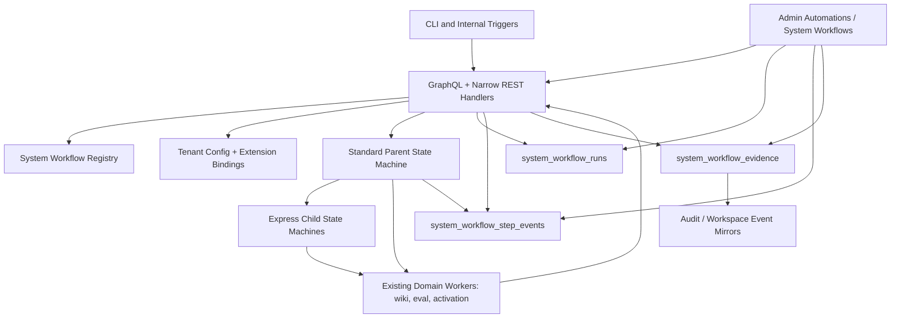

# System Workflows Step Functions Foundation

## Problem Frame

ThinkWork already has real system workflows: wiki compilation, evaluation runs, activation, scheduled triggers, audit mirrors, and operational jobs. Today those workflows are scattered across Lambdas, GraphQL mutations, job tables, docs, CLI commands, and CloudWatch. Operators can inspect pieces, but they cannot see a coherent ThinkWork-owned workflow definition, current version, run graph, durable evidence bundle, or bounded customization surface.

System Workflows make ThinkWork internals inspectable and governed. They live under Automations, next to Routines, Schedules, and Webhooks, but they are not another tenant-authored routine builder. ThinkWork owns the core definitions. Tenants can tune approved configuration, attach blessed extension hooks, review agent-proposed improvements, and inspect durable evidence.

The implementation should use AWS Step Functions as the orchestration substrate where orchestration earns its keep: multi-step coordination, retries, branching, fan-out/fan-in, approvals, long waits, and compliance evidence. The default runtime shape is a Standard parent state machine for governance and durable coordination, plus Express child state machines for short, high-volume, idempotent stages.

## Source Requirements Trace

Origin document: `docs/brainstorms/2026-05-02-system-workflows-step-functions-requirements.md`

Carried-forward actors:

- A1 Tenant operator inspects workflows, tunes allowed configuration, reviews evidence, and handles approvals.
- A2 Compliance/security operator reconstructs audit, SOC2, incident, and policy evidence.
- A3 ThinkWork engineer owns default definitions, upgrade paths, extension contracts, and support boundaries.
- A4 Tenant agent can trigger workflows indirectly and later propose reviewed improvements.
- A5 End user benefits from more reliable memory, evaluations, activation, and governance.

Carried-forward flows:

- F1 Operator inspects a System Workflow from Automations.
- F2 System Workflow runs with governed evidence.
- F3 Operator customizes a System Workflow safely.
- F4 Agent proposes an operational improvement for human review.

Carried-forward requirements:

- R1-R5: System Workflows live under Automations, use a data table index, expose operational columns, show definition/config/extensions/runs/evidence, and make ThinkWork ownership clear.
- R6-R12: Step Functions is the runtime where multi-step orchestration helps; Standard parents own governance, approvals, long-running state, version identity, and evidence boundaries; Express children handle short idempotent work; durable ThinkWork records outlive Step Functions history; large artifacts pass by pointer.
- R13-R16: First workflows are Wiki Build Process, Evaluation Runs, and Tenant/Agent Activation, chosen to exercise long-running pipelines, fan-out/fan-in, approvals, quality gates, and evidence.
- R17-R21: Customization is tiered: config knobs first, blessed extension points next, agent-proposed patches as reviewed suggestions, full forks deferred.
- R22-R25: Every run and workflow change records tenant, actor/source, version, runtime shape, status, timestamps, evidence summary, approvals, and audit events.

Acceptance examples AE1-AE6 from the origin document remain acceptance constraints for this plan.

## Planning Decisions

### 1. Provision state machines per stage, not per tenant

System Workflow definitions are ThinkWork-owned operating procedures, so v1 should provision one Standard parent state machine per workflow per stage and one or more Express child state machines per workflow per stage. Tenant-specific behavior belongs in versioned config rows and execution input, not in separate tenant-created state machines.

This avoids state machine fan-out, keeps IAM and Terraform supportable, and still gives per-tenant evidence, status, and configuration isolation in ThinkWork storage. If enterprise isolation later requires per-tenant state machines, the registry can add a provisioning strategy without changing the product model.

### 2. Create a separate System Workflow domain, mirroring Routine patterns

Do not reuse `routine_executions` or `routine_step_events`. Routines are tenant/user/agent-authored workflow primitives. System Workflows are platform-owned controls and need different ownership, config, evidence, and compliance semantics.

Do mirror the proven shape:

- `system_workflow_runs` mirrors Step Functions execution lifecycle for list/detail/status.
- `system_workflow_step_events` stores append-only per-step state and metrics.
- `system_workflow_evidence` stores durable artifact pointers, summaries, approvals, and compliance tags.
- `system_workflow_configs` stores tenant-scoped config versions.
- `system_workflow_extension_bindings` stores validated hook bindings.
- `system_workflow_change_events` records config, extension, approval, and proposal decisions.

### 3. Use a platform-owned registry with DB mirrors

Workflow definitions should live in a shared code registry, similar to the Routine recipe catalog, with metadata, runtime shape, config schema, extension-point schema, and ASL emitters. That registry must be able to export committed ASL JSON for Terraform-managed state machines so API metadata and AWS definitions do not drift. The database mirrors active definition/version/config/run metadata for UI, search, and audit. Step Functions versions and aliases remain the AWS execution source, while ThinkWork records the portable operational view.

### 4. Put System Workflows under Automations as a data table

Navigation order should be: Routines, System Workflows, Schedules, Webhooks. Routines stay first because they are user-authored. System Workflows comes next because it is the operator view into ThinkWork-owned automation. The index must be a data table, not cards.

### 5. Treat current wiki/eval/activation code as workflow stages first

The first implementation should wrap and gradually refactor existing flows instead of rebuilding them wholesale. For each workflow, preserve the existing GraphQL/CLI entry points and route them through a System Workflow launcher when the substrate is enabled. Existing tables such as `wiki_compile_jobs`, `eval_runs`, and `activation_sessions` remain domain stores; System Workflow runs become the orchestration and evidence layer around them.

## Existing Patterns To Follow

- `terraform/modules/app/routines-stepfunctions/main.tf` provisions execution role, logs, output bucket, EventBridge callback, and scoped Step Functions permissions.
- `packages/database-pg/src/schema/routine-executions.ts` and `packages/database-pg/src/schema/routine-step-events.ts` model execution lifecycle and append-only step events.
- `packages/database-pg/src/schema/routine-asl-versions.ts` mirrors canonical ASL, summaries, and step manifests.
- `packages/api/src/handlers/routine-execution-callback.ts` handles EventBridge Step Functions state-change events with idempotent terminal status updates.
- `packages/api/src/handlers/routine-step-callback.ts` uses a narrow `API_AUTH_SECRET` REST boundary for step events.
- `packages/api/src/lib/routines/recipe-catalog.ts` demonstrates a code-owned catalog, config schemas, ASL emitters, and definition markers.
- `apps/admin/src/routes/_authed/_tenant/automations/routines/index.tsx` is the data-table shape to follow for the System Workflows index.
- `apps/admin/src/components/routines/ExecutionGraph.tsx`, `StepDetailPanel.tsx`, and `ExecutionList.tsx` should be generalized or reused for run detail views.
- `packages/api/src/handlers/wiki-compile.ts`, `packages/api/src/lib/wiki/enqueue.ts`, and `docs/src/content/docs/concepts/knowledge/compounding-memory-pipeline.mdx` are the current wiki build path.
- `packages/api/src/handlers/eval-runner.ts`, `packages/api/src/graphql/resolvers/evaluations/index.ts`, and `packages/database-pg/src/schema/evaluations.ts` are the current evaluation run path.
- `packages/api/src/handlers/activation.ts`, `packages/api/src/handlers/activation-apply-worker.ts`, and `packages/database-pg/src/schema/activation.ts` are the current activation path.
- `docs/src/content/docs/concepts/control/budgets-usage-and-audit.mdx` and `packages/api/src/lib/workspace-events/processor.ts` show the durable audit mirror pattern.

Institutional learnings to carry forward:

- `docs/solutions/architecture-patterns/recipe-catalog-llm-dsl-validator-feedback-loop-2026-05-01.md` - use a platform catalog and validator loop instead of free-form generated definitions.
- `docs/solutions/architecture-patterns/inert-to-live-seam-swap-pattern-2026-04-25.md` - ship structural visibility first, then route live traffic through it.
- `docs/solutions/design-patterns/audit-existing-ui-and-data-model-before-parallel-build-2026-04-28.md` - audit and reuse existing surfaces before creating parallel ones.
- `docs/solutions/best-practices/service-endpoint-vs-widening-resolvecaller-auth-2026-04-21.md` - prefer narrow service endpoints over widening caller auth.

External references checked:

- AWS Step Functions workflow types: `https://docs.aws.amazon.com/step-functions/latest/dg/choosing-workflow-type.html`
- AWS Step Functions service quotas: `https://docs.aws.amazon.com/step-functions/latest/dg/service-quotas.html`
- AWS Step Functions pricing: `https://aws.amazon.com/step-functions/pricing/`
- AWS Step Functions service integrations: `https://docs.aws.amazon.com/step-functions/latest/dg/integrate-services.html`

Key AWS constraints reflected in the plan: Standard workflows are suited to long-running durable workflows, callback patterns, and non-idempotent actions; Express workflows are suited to short high-volume idempotent work; workflow type is immutable after creation; Express does not support `.sync` or `.waitForTaskToken`; execution history is not a sufficient long-term compliance store.

## High-Level Design

## Runtime Mapping For The First Three Workflows

| Workflow                | Standard Parent Responsibilities                                                                                       | Express Child Candidates                                                           | Existing Domain Store                            | Evidence Outputs                                                               | Customization Demo                                                                     |
| ----------------------- | ---------------------------------------------------------------------------------------------------------------------- | ---------------------------------------------------------------------------------- | ------------------------------------------------ | ------------------------------------------------------------------------------ | -------------------------------------------------------------------------------------- |
| Wiki Build Process      | Run identity, cursor/job claim, destructive rebuild approval, phase checkpoints, quality gates, final evidence summary | Leaf/page enrichment shards, link validation batches, deterministic quality checks | `wiki_compile_jobs`, wiki page/link tables       | Compile job summary, page/link deltas, quality gate results, rebuild approval  | Approval gates, model/threshold knobs, pre/post validation hooks                       |
| Evaluation Runs         | Run identity, test pack snapshot, fan-out/fan-in coordination, pass/fail gate, cost guard, final result aggregation    | Test-case batches, scorer/evaluator batches, trace lookup batches                  | `eval_runs`, `eval_results`, `eval_test_cases`   | Test pack snapshot, evaluator results summary, pass-rate gate, cost summary    | Thresholds, categories, model/judge choices, pre-run connector check hook              |
| Tenant/Agent Activation | Session/run identity, setup checklist, connector/policy readiness, approvals, attestation gates, launch decision       | Short readiness probes or validation checks only                                   | `activation_sessions`, `activation_apply_outbox` | Activation timeline, connector readiness, policy attestations, launch approval | Security attestation, required connectors, notification targets, approval requirements |

## Implementation Plan

### Unit 1 - System Workflow Data Model And GraphQL Contract

Create the separate durable domain for System Workflows.

Files:

- `packages/database-pg/src/schema/system-workflows.ts`
- `packages/database-pg/src/schema/index.ts`
- `packages/database-pg/graphql/types/system-workflows.graphql`
- `packages/database-pg/drizzle/00XX_system_workflows.sql`
- `packages/api/src/graphql/resolvers/system-workflows/index.ts`
- `packages/api/src/graphql/resolvers/index.ts`
- `packages/api/src/__tests__/system-workflows-contract.test.ts`

Design:

- Add tables for definitions, config versions, extension bindings, runs, step events, evidence, and change events.
- Use tenant-scoped indexes for workflow inventory, recent runs, status triage, and evidence lookup.
- Store AWS identifiers as nullable fields where the run may begin before Step Functions returns an ARN.
- Include idempotency keys on step events and evidence rows.
- Keep domain IDs stable and human-friendly: `wiki-build`, `evaluation-runs`, `tenant-agent-activation`.
- Model runtime shape as explicit metadata: `STANDARD_PARENT`, `EXPRESS_CHILD`, `HYBRID`.

Test scenarios:

- GraphQL schema exposes workflow inventory, workflow detail, runs, step events, evidence, config, and extension bindings.
- Run rows can be filtered by tenant, workflow id, status, and started timestamp.
- Duplicate step event inserts are idempotent.
- Evidence rows can be queried after a run without requiring Step Functions history.
- Tenant A cannot read Tenant B runs, configs, or evidence.

### Unit 2 - Platform Registry, Definition Validation, And ASL Mirrors

Introduce the code-owned System Workflow registry and definition validator.

Files:

- `packages/api/src/lib/system-workflows/registry.ts`
- `packages/api/src/lib/system-workflows/types.ts`
- `packages/api/src/lib/system-workflows/validation.ts`
- `packages/api/src/lib/system-workflows/asl.ts`
- `packages/api/src/lib/system-workflows/export-asl.ts`
- `packages/api/src/lib/system-workflows/definitions/wiki-build.ts`
- `packages/api/src/lib/system-workflows/definitions/evaluation-runs.ts`
- `packages/api/src/lib/system-workflows/definitions/tenant-agent-activation.ts`
- `scripts/build-system-workflow-asl.ts`
- `terraform/modules/app/system-workflows-stepfunctions/asl/wiki-build-standard.asl.json`
- `terraform/modules/app/system-workflows-stepfunctions/asl/evaluation-runs-standard.asl.json`
- `terraform/modules/app/system-workflows-stepfunctions/asl/tenant-agent-activation-standard.asl.json`
- `packages/api/src/__tests__/system-workflow-registry.test.ts`
- `packages/api/src/__tests__/system-workflow-validation.test.ts`

Design:

- Define each workflow's metadata, category, owner, runtime shape, state machine logical names, config schema, extension points, evidence contract, and UI manifest.
- Validate config knobs and extension bindings before activation.
- Generate ASL from typed definitions rather than storing free-form user ASL.
- Export deterministic ASL JSON artifacts consumed by Terraform. The generated files should be reviewed in PRs just like GraphQL codegen output.
- Mirror active registry definitions into database rows during deployment/bootstrap or first resolver access.
- Include a definition marker in ASL comments so AWS state machines can be mapped back to ThinkWork workflow ids and versions.

Test scenarios:

- Registry lists exactly the three v1 workflows with stable ids and categories.
- Invalid config is rejected with field-level errors.
- Unknown extension points are rejected.
- Generated ASL includes the workflow id, version, and expected Standard/Express type.
- Re-running the ASL export without definition changes produces no diff.
- Definition metadata can produce the table columns required by AE1.

### Unit 3 - System Workflow Step Functions Substrate

Add a dedicated Terraform substrate for platform-owned System Workflows.

Files:

- `terraform/modules/app/system-workflows-stepfunctions/main.tf`
- `terraform/modules/app/system-workflows-stepfunctions/variables.tf`
- `terraform/modules/app/system-workflows-stepfunctions/outputs.tf`
- `terraform/modules/app/system-workflows-stepfunctions/tests/basic.tftest.hcl`
- `terraform/modules/thinkwork/main.tf`
- `terraform/modules/thinkwork/variables.tf`
- `terraform/modules/thinkwork/outputs.tf`
- `terraform/modules/app/lambda-api/main.tf`
- `terraform/modules/app/lambda-api/variables.tf`
- `terraform/modules/app/lambda-api/handlers.tf`

Design:

- Create a dedicated execution role scoped to `thinkwork-${stage}-system-workflow-*` state machines.
- Create a CloudWatch log group such as `/aws/vendedlogs/states/thinkwork-${stage}-system-workflows`.
- Create or designate an output/artifact bucket for large workflow outputs and evidence pointers.
- Provision one Standard parent state machine per v1 workflow from exported ASL JSON.
- Provision Express child state machines from exported ASL JSON where the workflow definition declares them.
- Wire EventBridge execution-state-change events to a System Workflow execution callback handler.
- Grant the GraphQL Lambda and relevant domain Lambdas only the Step Functions actions they need.
- Keep Routine Step Functions IAM and System Workflow IAM separate.

Verification scenarios:

- Terraform validates the module with required handler ARNs, role ARNs, stage, region, and artifact bucket wiring.
- State machine names stay within AWS name length and character limits.
- EventBridge rules target the System Workflow callback, not the Routine callback.
- Lambda role policies cannot create or mutate arbitrary Step Functions state machines outside the system workflow prefix.

### Unit 4 - Runtime Launch, Callback, Evidence, And Audit Services

Build the service layer that starts workflows, updates lifecycle status, records step events, persists evidence, and audits changes.

Files:

- `packages/api/src/lib/system-workflows/start.ts`
- `packages/api/src/lib/system-workflows/events.ts`
- `packages/api/src/lib/system-workflows/evidence.ts`
- `packages/api/src/lib/system-workflows/config.ts`
- `packages/api/src/handlers/system-workflow-execution-callback.ts`
- `packages/api/src/handlers/system-workflow-step-callback.ts`
- `packages/api/src/handlers/system-workflow-evidence-callback.ts`
- `packages/api/src/graphql/resolvers/system-workflows/mutations.ts`
- `packages/api/src/graphql/resolvers/system-workflows/queries.ts`
- `packages/api/src/__tests__/system-workflow-start.test.ts`
- `packages/api/src/__tests__/system-workflow-callbacks.test.ts`
- `packages/api/src/__tests__/system-workflow-evidence.test.ts`

Design:

- `startSystemWorkflow` pre-inserts `system_workflow_runs`, starts the Standard parent by alias ARN, and updates the row with the returned execution ARN.
- Step callbacks use the narrow `API_AUTH_SECRET` pattern and resolve execution ARN to the run id before insert.
- EventBridge callbacks perform no-regression terminal status updates, matching Routine execution callback behavior.
- Evidence writes store summaries in Postgres and large artifacts in S3, with stable object keys stored in evidence rows.
- Config, extension, approval, and proposal decisions emit audit/change events.
- Preserve existing domain entry points by routing them through this service where enabled.

Test scenarios:

- Starting a workflow inserts a run before the first callback arrives.
- A failed `StartExecution` marks the pre-inserted run failed with a visible error.
- Duplicate EventBridge terminal events do not regress a succeeded or failed run.
- Step callbacks reject invalid bearer tokens.
- Step callbacks for unknown execution ARNs return a clear not-found response.
- Evidence callbacks are idempotent and preserve tenant isolation.
- Config changes and extension changes create audit/change events.

### Unit 5 - Admin Automations UI

Add the operator UI under Automations using a data table and reusable workflow run components.

Files:

- `apps/admin/src/components/Sidebar.tsx`
- `apps/admin/src/routes/_authed/_tenant/automations/system-workflows/index.tsx`
- `apps/admin/src/routes/_authed/_tenant/automations/system-workflows/$workflowId.tsx`
- `apps/admin/src/routes/_authed/_tenant/automations/system-workflows/$workflowId.runs.$runId.tsx`
- `apps/admin/src/components/system-workflows/SystemWorkflowTable.tsx`
- `apps/admin/src/components/system-workflows/SystemWorkflowConfigPanel.tsx`
- `apps/admin/src/components/system-workflows/SystemWorkflowEvidencePanel.tsx`
- `apps/admin/src/components/system-workflows/SystemWorkflowExtensionsPanel.tsx`
- `apps/admin/src/components/workflows/ExecutionGraph.tsx`
- `apps/admin/src/components/workflows/StepDetailPanel.tsx`
- `apps/admin/src/components/workflows/ExecutionList.tsx`
- `apps/admin/src/__tests__/system-workflows-table.test.tsx`
- `apps/admin/src/__tests__/system-workflow-detail.test.tsx`

Design:

- Add System Workflows under Automations after Routines.
- Index is a sortable/filterable table with workflow name, category, runtime shape, status, last run, next run, active version, evidence status, customization status, and owner.
- Detail page separates ThinkWork-owned definition from tenant-owned configuration and extensions.
- Run detail reuses generalized graph/detail components instead of duplicating Routine UI code.
- Evidence panel shows artifact summaries and object pointers without exposing raw S3 implementation details.
- Agent-proposed changes appear as reviewed suggestions, not as auto-applied edits.

Test scenarios:

- The Automations nav links to System Workflows.
- The index renders 30 workflows as a data table and supports sorting/filtering.
- Runtime shape, evidence status, and customization status render from GraphQL data.
- Detail pages clearly separate fixed definition, config, extension points, runs, and evidence.
- Run detail polls while non-terminal and stops polling at terminal status.
- Empty states distinguish "no runs yet" from query errors.

### Unit 6 - Wiki Build System Workflow Adapter

Route wiki compile/rebuild operations through the System Workflow layer while preserving the existing wiki domain model.

Files:

- `packages/api/src/lib/system-workflows/definitions/wiki-build.ts`
- `packages/api/src/lib/system-workflows/wiki-build.ts`
- `packages/api/src/handlers/wiki-compile.ts`
- `packages/api/src/lib/wiki/enqueue.ts`
- `packages/api/src/graphql/resolvers/wiki/compileWikiNow.mutation.ts`
- `packages/api/src/graphql/resolvers/wiki/resetWikiCursor.mutation.ts`
- `apps/cli/src/commands/wiki.ts`
- `packages/api/src/__tests__/system-workflow-wiki-build.test.ts`
- `packages/api/src/__tests__/wiki-enqueue.test.ts`
- `packages/api/src/__tests__/wiki-resolvers.test.ts`

Design:

- Make wiki compile requests create or attach to a `system_workflow_runs` row for `wiki-build`.
- Keep `wiki_compile_jobs` as the canonical domain job queue.
- Standard parent owns run identity, job claim, destructive rebuild approval gate, phase checkpoints, and final evidence.
- Use Express child stages only for bounded idempotent batches, such as enrichment/link validation or deterministic quality checks, where implementation can summarize durable output back to the parent.
- Preserve best-effort post-turn enqueue behavior, but record visible skipped/deduped outcomes when a System Workflow run exists.
- Emit evidence for compile job id, owner scope, page/link deltas, quality gates, destructive rebuild approval, and final status.

Test scenarios:

- `compileWikiNow` starts or attaches to a wiki-build System Workflow run.
- Post-turn enqueue dedupe does not create duplicate system workflow runs for the same bucket/job.
- Destructive rebuild requires the configured approval gate when enabled.
- Existing wiki compile success updates both `wiki_compile_jobs` and System Workflow evidence.
- Existing wiki compile failure marks the System Workflow run failed with a useful error summary.
- Evidence remains queryable after the compile job completes.

### Unit 7 - Evaluation Runs System Workflow Adapter

Move evaluation orchestration into a Standard parent with cost-aware Express child batches.

Files:

- `packages/api/src/lib/system-workflows/definitions/evaluation-runs.ts`
- `packages/api/src/lib/system-workflows/evaluation-runs.ts`
- `packages/api/src/handlers/eval-runner.ts`
- `packages/api/src/handlers/eval-test-batch-runner.ts`
- `packages/api/src/graphql/resolvers/evaluations/index.ts`
- `packages/database-pg/src/schema/evaluations.ts`
- `packages/database-pg/graphql/types/evaluations.graphql`
- `apps/admin/src/routes/_authed/_tenant/evaluations/index.tsx`
- `apps/admin/src/routes/_authed/_tenant/evaluations/runs/$runId.tsx`
- `packages/api/src/__tests__/system-workflow-evaluation-runs.test.ts`
- `packages/api/src/__tests__/eval-runner.test.ts`

Design:

- `startEvalRun` continues to create `eval_runs`, then starts the `evaluation-runs` System Workflow parent instead of fire-and-forget invoking one long Lambda.
- Standard parent snapshots the test pack, enforces cost/threshold gates, dispatches idempotent batches, aggregates results, and writes final evidence.
- Express children process test/scorer batches and return summarized outputs to the parent through synchronous Express execution where appropriate, or through durable batch-result rows plus parent polling where the batch needs async handling. Do not depend on Express `.sync` or callback task-token support.
- `eval_results` remains the canonical per-test result store.
- Existing Evaluations UI remains the authoring/result surface; System Workflow UI links to the related eval run and evidence.
- Preserve current scheduled eval behavior by routing scheduled triggers through the same launcher.

Test scenarios:

- `startEvalRun` creates an eval run and a linked System Workflow run.
- A 500-case evaluation splits into deterministic batches with stable idempotency keys.
- Batch retries do not duplicate `eval_results`.
- Pass-rate threshold gates mark the parent workflow succeeded or failed correctly.
- Cost summaries are recorded as evidence.
- Existing evaluation result pages still load from `eval_runs` and `eval_results`.
- Scheduled evaluation triggers use the System Workflow launcher.

### Unit 8 - Tenant/Agent Activation System Workflow Adapter

Wrap activation in a mostly-Standard workflow that tracks readiness, policy checks, attestations, and launch approvals.

Files:

- `packages/api/src/lib/system-workflows/definitions/tenant-agent-activation.ts`
- `packages/api/src/lib/system-workflows/tenant-agent-activation.ts`
- `packages/api/src/handlers/activation.ts`
- `packages/api/src/handlers/activation-apply-worker.ts`
- `packages/api/src/graphql/resolvers/activation/index.ts`
- `packages/database-pg/src/schema/activation.ts`
- `packages/database-pg/graphql/types/activation.graphql`
- `packages/api/src/__tests__/system-workflow-activation.test.ts`
- `packages/api/src/__tests__/activation-handler.test.ts`
- `packages/api/src/__tests__/activation-apply-worker.test.ts`

Design:

- Activation sessions create or attach to a `tenant-agent-activation` System Workflow run.
- Standard parent owns setup progress, connector readiness, policy checks, approval waits, attestations, and launch decision.
- Short readiness probes can use Express child stages if they are idempotent and bounded.
- Existing `activation_sessions` and `activation_apply_outbox` remain the domain truth for session state and apply work.
- Activation APIs emit System Workflow step events and evidence without exposing end-user activation internals as editable workflow code.
- Launch approvals and security attestations are first-class evidence and audit/change events.

Test scenarios:

- Starting activation creates or attaches to a System Workflow run.
- Activation checkpoint calls create step events with stable dedupe keys.
- Apply outbox completion updates evidence for `user_md`, `memory_seed`, and `wiki_seed`.
- Required connector readiness failures block launch and show in the workflow graph.
- Security attestation gates can be enabled by tenant config.
- Approval decisions are audited and visible in evidence.

### Unit 9 - Documentation, CLI Visibility, And Operational Guardrails

Document the new operating model and add CLI/operator affordances for support.

Files:

- `docs/src/content/docs/concepts/automations/system-workflows.mdx`
- `docs/src/content/docs/applications/admin/automations.mdx`
- `docs/src/content/docs/guides/evaluations.mdx`
- `docs/src/content/docs/concepts/knowledge/compounding-memory-pipeline.mdx`
- `docs/src/content/docs/concepts/control/budgets-usage-and-audit.mdx`
- `apps/cli/src/commands/system-workflows.ts`
- `apps/cli/src/index.ts`
- `apps/cli/__tests__/system-workflows.test.ts`

Design:

- Explain the difference between Routines and System Workflows.
- Document Standard vs Express selection rules and the durable evidence model.
- Add CLI read-only commands for listing workflows, inspecting runs, and fetching evidence summaries.
- Keep existing `thinkwork wiki` and eval commands functional, but cross-link to System Workflow run ids where applicable.
- Add runbook notes for quota monitoring, callback failures, evidence write failures, and state machine drift.

Test scenarios:

- CLI lists system workflows for the authenticated tenant.
- CLI shows a run detail with status, version, related domain id, and evidence summary.
- CLI refuses tenant-crossing run ids.
- Docs describe where to inspect the first three workflows from Admin.
- Docs state that Step Functions history is not the long-term compliance record.

## Suggested Sequencing

1. Build Units 1-4 as the platform substrate with no live traffic switch. Seed the three definitions and make inert runs queryable.
2. Build Unit 5 so operators can inspect the inventory, definitions, configs, runs, and evidence before all workflows are live.
3. Convert Evaluation Runs first. `docs/plans/2026-05-02-008-feat-system-workflow-runtime-eval-adapter-plan.md` covers the first live conversion slice: launcher/callback runtime plus a Standard parent that invokes the existing eval runner. Express fan-out remains the next Evaluation Runs refinement after this substrate is proven.
4. Convert Wiki Build second. Keep existing compile behavior stable while adding run/evidence visibility, then introduce Express child stages only for clearly idempotent batches.
5. Convert Tenant/Agent Activation third. Treat this as the compliance/governance showcase with approvals and attestations.
6. Finish docs and CLI support after at least one workflow is live, then update docs again after all three adapters are enabled.

## Risks And Mitigations

| Risk                                                 | Why It Matters                                                                       | Mitigation                                                                                          |
| ---------------------------------------------------- | ------------------------------------------------------------------------------------ | --------------------------------------------------------------------------------------------------- |
| Over-orchestrating simple handlers                   | Step Functions ceremony can make small jobs harder to operate                        | Use System Workflows only where multi-step coordination, evidence, approvals, or fan-out earn it    |
| Confusing Routines and System Workflows              | Users may expect full editing/forking of ThinkWork-owned internals                   | Separate nav copy, schema names, resolvers, and UI labels; keep System Workflow definitions managed |
| Express duplicate execution                          | Express asynchronous workflows are at-least-once                                     | Require idempotency keys and durable per-batch result writes before enabling Express children       |
| Step Functions history retention                     | Compliance evidence may need longer than AWS execution history                       | Persist canonical run, step, evidence, and audit records in ThinkWork storage                       |
| Per-stage state machines reduce tenant isolation     | A bug could leak tenant run metadata if resolver guards fail                         | Tenant-scope every run/config/evidence query and add explicit tenant isolation tests                |
| Eval conversion increases complexity                 | Current runner is simple but timeout-bound                                           | Convert behind the existing `startEvalRun` contract and keep `eval_runs`/`eval_results` canonical   |
| Wiki rebuild approvals can block background compiles | Approval gates should not block routine post-turn compiles unnecessarily             | Gate destructive rebuilds and sensitive operations, not normal incremental compiles by default      |
| Terraform/IAM drift                                  | Routines and System Workflows both use Step Functions but different trust boundaries | Separate Terraform modules, prefixes, roles, callbacks, and tests                                   |

## Open Questions For Implementation

- Exact ASL shape and child batch size for each workflow should be finalized during Unit 2 and Unit 6-8 implementation after inspecting payload sizes and retry behavior.
- SOC2 evidence bundle fields should be validated with the compliance/SOC2 plan before locking the long-term evidence taxonomy. This plan creates the generic evidence substrate now.
- Decide whether System Workflow definitions are mirrored into DB at deploy time, GraphQL cold start, or an explicit bootstrap command. The plan favors explicit bootstrap or deploy-time sync, but implementation can choose the least surprising repo-local pattern.
- Decide whether to use Step Functions Distributed Map for Evaluation Runs where available. It belongs in Unit 7 if it fits the workload and quota profile.

## Verification Plan

Core verification:

- `pnpm --filter @thinkwork/database-pg codegen`
- `pnpm --filter @thinkwork/api codegen`
- `pnpm --filter @thinkwork/admin codegen`
- `pnpm --filter @thinkwork/mobile codegen`
- `pnpm --filter @thinkwork/cli codegen`
- `pnpm --filter @thinkwork/api test`
- `pnpm --filter @thinkwork/admin test`
- `pnpm --filter @thinkwork/cli test`
- Terraform validation for `terraform/modules/app/system-workflows-stepfunctions` and the root example stack.

Deployment verification:

- Deploy to a dev stage.
- Confirm the three System Workflow definitions exist under Admin -> Automations -> System Workflows.
- Start a small evaluation run and confirm a linked System Workflow run, step events, and evidence summary.
- Trigger an incremental wiki compile and confirm run/evidence visibility without changing wiki page output semantics.
- Run an activation session through checkpoint/apply and confirm attestations/readiness appear in evidence.
- Confirm EventBridge state-change callbacks update terminal statuses.
- Confirm audit/change events are emitted for config, extension, approval, and proposal decisions.

## Out Of Scope For This Plan

- Customer-facing full workflow clone/fork editing.
- Marketplace or cross-tenant sharing of workflow variants.
- Auto-applied agent-authored workflow patches.
- General visual workflow builder for System Workflows.
- SOC2/Audit Pipeline as one of the first three workflows.
- Automatic Standard-to-Express cost optimizer.
- Replacing Routines, audit logs, or every background Lambda with Step Functions.

## Recommendation

Proceed with the hybrid Step Functions architecture. It is the right construct for the strategic layer because it gives ThinkWork a native, inspectable, serverless orchestration substrate without asking the product to invent workflow execution, retries, callbacks, fan-out, or AWS integration mechanics. The important guardrail is to keep Step Functions as orchestration, not evidence. ThinkWork must own the durable run, step, evidence, audit, config, and extension records that make the system explainable to operators and compliance reviewers.

The first live conversion should be Evaluation Runs, then Wiki Build, then Tenant/Agent Activation. That order proves high-volume Express fan-out early, then adds long-running knowledge workflow visibility, then lands the governed approval/attestation story.
