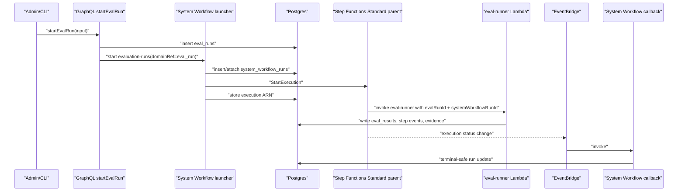
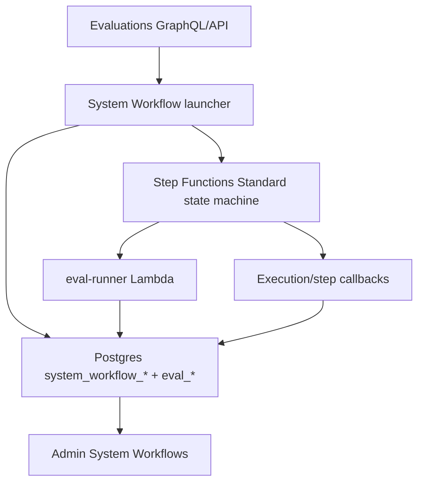

# feat: Add System Workflow Runtime And Evaluation Adapter

## Overview

This plan turns the merged System Workflows foundation into a live execution path. The first vertical slice adds a runtime launcher, Step Functions execution callbacks, step/evidence writers, Terraform/Lambda wiring, and routes `startEvalRun` through the `evaluation-runs` System Workflow while preserving the existing Evaluations UI, CLI, and `eval_runs` / `eval_results` domain model.

The slice intentionally uses a Standard parent state machine that invokes the existing `eval-runner` Lambda as the first live adapter. Express child batching remains follow-up work after the launcher and callback contract are proven in production-like paths.

---

## Problem Frame

The System Workflow foundation currently exposes definitions, config, read-side GraphQL, Admin pages, ASL mirrors, and Terraform state machines, but existing domain triggers still bypass the System Workflow substrate. Evaluation Runs remain a GraphQL mutation that inserts `eval_runs` and asynchronously invokes one Lambda. Operators cannot yet see a durable System Workflow run, lifecycle callback, step trail, or evidence record for the evaluation.

The next step is to make one real ThinkWork-owned process run through Step Functions without breaking existing product behavior. Evaluation Runs are the best first adapter because they already have a clear domain run row, a long-running Lambda, cost/pass-rate outputs, and operator-facing result pages.

---

## Requirements Trace

- R1. Existing Evaluations API, Admin, and CLI behavior remains stable: `startEvalRun` still returns an `EvalRun` and existing result pages still read `eval_runs` / `eval_results`.
- R2. Starting an evaluation creates or attaches a durable `system_workflow_runs` row for workflow id `evaluation-runs`.
- R3. The System Workflow launcher starts the stage-owned Standard Step Functions state machine and records the returned execution ARN before callbacks need it.
- R4. Step Functions lifecycle callbacks update System Workflow runs without regressing terminal status on duplicate or out-of-order EventBridge delivery.
- R5. Evaluation execution emits System Workflow step events and evidence records with idempotency keys.
- R6. Large or detailed evaluation artifacts stay in domain tables or S3/object pointers; System Workflow records store summaries and references.
- R7. Terraform wires the callback Lambda and grants only the required launcher/callback/state-machine permissions.
- R8. The implementation keeps the foundation's product boundary: System Workflows remain ThinkWork-owned and visible under Automations, while customer workflow authoring remains Routines.
- R9. Domain-ref-backed launches have a database-enforced idempotency boundary so concurrent retries cannot create duplicate System Workflow runs for the same evaluation run.

**Origin actors:** A1 tenant operator, A2 compliance/security operator, A3 ThinkWork engineer.

**Origin flows:** F1 operator inspects a System Workflow, F2 System Workflow runs with governed evidence.

**Origin acceptance examples:** AE2 Evaluation Runs demonstrate Standard parent plus later Express fan-out; AE3 durable ThinkWork evidence remains available beyond Step Functions history.

---

## Scope Boundaries

- Do not rename `system_workflow_*` tables to generic `workflow_*`.
- Do not replace `eval_runs` or `eval_results`; they remain the canonical evaluation domain store.
- Do not add a general customer-facing System Workflow editor or fork flow.
- Do not rewrite all evaluation work into Express children in this PR.
- Do not convert Wiki Build or Tenant/Agent Activation in this PR.

### Deferred to Follow-Up Work

- Express child fan-out for evaluation test/scorer batches.
- Wiki Build System Workflow adapter.
- Tenant/Agent Activation System Workflow adapter.
- Admin affordances that link directly from an Evaluation Run detail page to its System Workflow Run, unless the backend contract makes this trivial during implementation.

---

## Context & Research

### Relevant Code and Patterns

- `packages/database-pg/src/schema/system-workflows.ts` already defines `system_workflow_runs`, `system_workflow_step_events`, `system_workflow_evidence`, and idempotency indexes for step/evidence writes.
- `packages/api/src/lib/system-workflows/registry.ts` defines `evaluation-runs` with config knobs, evidence contract, and step manifest.
- `packages/api/src/graphql/resolvers/system-workflows/queries.ts` is the read-side pattern to preserve while adding write-side services.
- `packages/api/src/graphql/resolvers/evaluations/index.ts` owns `startEvalRun`; today it inserts `eval_runs` and calls `fireEvalRunner`.
- `packages/api/src/handlers/eval-runner.ts` owns current evaluation execution, status updates, cost/result aggregation, and AppSync notifications.
- `packages/api/src/handlers/routine-execution-callback.ts` is the closest local lifecycle callback pattern: dual API Gateway/EventBridge input, SFN status translation, and no-regression terminal updates.
- `terraform/modules/app/system-workflows-stepfunctions/main.tf` already provisions stage-scoped state machines and has callback EventBridge wiring gated by `execution_callback_lambda_arn`.
- `terraform/modules/app/lambda-api/handlers.tf` and `scripts/build-lambdas.sh` are the deployment surfaces for adding new API Lambda handlers.

### Institutional Learnings

- `docs/solutions/logic-errors/compile-continuation-dedupe-bucket-2026-04-20.md`: idempotent no-op paths must be visible and tested; do not hide important dedupe behavior behind silent `ON CONFLICT DO NOTHING`.
- `docs/solutions/workflow-issues/manually-applied-drizzle-migrations-drift-from-dev-2026-04-21.md`: hand-rolled migration objects must be durable, idempotent, and observable through the manual migration reporter.
- Existing Routine callback lessons apply: callbacks should authenticate narrowly, resolve by SFN execution ARN, and treat duplicate terminal events as successful no-ops rather than retry storms.

### External References

- AWS Step Functions `StartExecution` API: Standard executions are idempotent only for the same execution name and identical input while the execution is running; closed executions or changed input return `ExecutionAlreadyExists`. Execution input is capped at 262,144 UTF-8 bytes, so ThinkWork should pass compact pointers/summaries.
- AWS Step Functions workflow type guide: Standard workflows are suited to long-running, durable, auditable orchestration with up to 90 days of execution history; Express workflows are high-volume, short-duration, and require idempotent work because asynchronous Express is at-least-once.
- AWS Step Functions EventBridge integration: Standard workflow status changes are emitted to EventBridge, while Express monitoring depends on CloudWatch Logs.

---

## Key Technical Decisions

- **Use a Standard parent first:** The first live adapter should prove durable launch, lifecycle, status, evidence, and UI inspectability before the evaluation runner is split into Express batches.
- **Keep Evaluation domain rows canonical:** `eval_runs` and `eval_results` remain the product/result source of truth; System Workflow rows are orchestration/evidence metadata around them.
- **Use DB idempotency in addition to Step Functions idempotency:** AWS Standard execution-name idempotency is helpful but too narrow. The launcher should derive a deterministic execution name from the domain run and keep `system_workflow_runs` as the replay boundary.
- **Mirror Routine callback semantics, not Routine tables:** The status mapping and terminal no-regression pattern should be reused conceptually, but System Workflows need their own run/evidence tables and error summaries.
- **Make callbacks service-auth only:** Step/evidence callbacks use `API_AUTH_SECRET` or EventBridge direct invocation; tenant end users do not get direct mutation access to internal workflow events in this slice.
- **Build ASL from registry with workflow-specific runtime hooks:** The generic Pass-state ASL remains fine for inert workflows, but `evaluation-runs` needs a Task state that invokes the eval runner Lambda with the System Workflow context.

---

## Open Questions

### Resolved During Planning

- Should this PR include Express evaluation batches? No. First land the launcher/callback/runtime adapter and use the existing `eval-runner` behind a Standard parent. Express child batching follows once the System Workflow contract is proven.
- Should `workflows` replace `system_workflow_*` naming? No. The tables represent ThinkWork-owned operating workflows, not a universal workflow model.
- Should the GraphQL `startEvalRun` return type change? No. Existing Admin and CLI consumers should not need to learn System Workflows to start an evaluation.

### Deferred to Implementation

- Exact environment variable names for state-machine ARN lookup: choose the least surprising pattern while wiring Terraform and Lambda handler env.
- Exact Step Functions execution-name format: derive a stable, valid, <=80-character name from workflow id and eval run id during implementation.
- Whether the eval runner should be directly invoked by the state machine or through a thin adapter handler: choose based on the smallest safe change after inspecting payload and timeout behavior.

---

## High-Level Technical Design

> _This illustrates the intended approach and is directional guidance for review, not implementation specification. The implementing agent should treat it as context, not code to reproduce._

---

## Implementation Units

- U1. **System Workflow Launcher Service**

**Goal:** Add the runtime service that creates or attaches System Workflow runs and starts Standard Step Functions executions.

**Requirements:** R2, R3, R6, R8, R9.

**Dependencies:** Existing foundation from `docs/plans/2026-05-02-007-feat-system-workflows-step-functions-plan.md`.

**Files:**

- Create: `packages/api/src/lib/system-workflows/start.ts`
- Modify: `packages/database-pg/src/schema/system-workflows.ts`
- Create: `packages/database-pg/drizzle/0060_system_workflow_run_domain_ref_dedup.sql`
- Create: `packages/database-pg/drizzle/0060_system_workflow_run_domain_ref_dedup_rollback.sql`
- Modify: `packages/api/src/lib/system-workflows/types.ts`
- Modify: `packages/api/src/lib/system-workflows/registry.ts`
- Test: `packages/api/src/lib/system-workflows/start.test.ts`

**Approach:**

- Implement a typed `startSystemWorkflow` service that accepts workflow id, tenant id, trigger source, actor metadata, domain reference, and compact input.
- Resolve the active definition/config and pre-insert or attach a `system_workflow_runs` row before calling Step Functions.
- Add a database-enforced domain-ref uniqueness boundary for rows with non-null `domain_ref_type` and `domain_ref_id`, scoped by tenant and workflow, so retrying `startEvalRun` for the same `eval_runs.id` cannot create duplicate System Workflow runs even under concurrent requests.
- Use `INSERT ... ON CONFLICT` or the Drizzle equivalent against that boundary where practical; if Drizzle cannot target the partial index cleanly, catch the conflict and select the existing row explicitly.
- Call `StartExecution` against the configured state-machine ARN and update the run with `sfn_execution_arn`, `state_machine_arn`, and timestamps.
- On `StartExecution` failure, mark the pre-inserted run failed with a useful error code/message.

**Execution note:** Implement service behavior test-first because launch idempotency is the safety boundary for the rest of the slice.

**Patterns to follow:**

- `packages/api/src/graphql/resolvers/system-workflows/queries.ts` for shaping workflow definitions.
- `packages/api/src/handlers/routine-execution-callback.ts` for lifecycle status vocabulary and terminal no-regression thinking.

**Test scenarios:**

- Happy path: starting `evaluation-runs` with an eval run domain ref inserts a System Workflow run and stores the returned execution ARN.
- Idempotency: starting again with the same tenant/workflow/domain ref returns the existing non-terminal run instead of creating another row.
- Concurrency: two simultaneous launcher calls for the same evaluation run produce one `system_workflow_runs` row and both callers observe the same run identity.
- Error path: `StartExecution` failure marks the run failed and preserves the error message for Admin inspection.
- Edge case: missing or unknown state-machine ARN fails closed before inserting an ambiguous running record.
- Migration: applying the domain-ref dedupe migration twice is safe, and rollback removes only the new index/constraint.

**Verification:**

- Launcher tests prove pre-insert, idempotency, failure handling, and compact execution input shape.

---

- U2. **Callbacks, Step Events, And Evidence Writers**

**Goal:** Persist lifecycle status, step events, and evidence from System Workflow executions.

**Requirements:** R4, R5, R6.

**Dependencies:** U1.

**Files:**

- Create: `packages/api/src/lib/system-workflows/events.ts`
- Create: `packages/api/src/lib/system-workflows/evidence.ts`
- Create: `packages/api/src/handlers/system-workflow-execution-callback.ts`
- Create: `packages/api/src/handlers/system-workflow-step-callback.ts`
- Test: `packages/api/src/lib/system-workflows/events.test.ts`
- Test: `packages/api/src/lib/system-workflows/evidence.test.ts`
- Test: `packages/api/src/handlers/system-workflow-execution-callback.test.ts`
- Test: `packages/api/src/handlers/system-workflow-step-callback.test.ts`

**Approach:**

- Add service functions for step event and evidence inserts using the existing nullable idempotency keys.
- Make duplicate step/evidence writes visible in return values and logs, following the local dedupe learning.
- Add an EventBridge-compatible execution callback handler that translates Step Functions statuses into System Workflow statuses and refuses to regress terminal rows.
- Add a narrow API callback for step events authenticated by `API_AUTH_SECRET`, resolving execution ARN or run id to the tenant-owned run.
- Keep large evidence artifacts out of inline callback payloads; accept summaries, domain refs, and optional artifact URIs/JSON pointers.

**Patterns to follow:**

- `packages/api/src/handlers/routine-execution-callback.ts`
- `packages/api/src/handlers/routine-step-callback.ts`
- `packages/database-pg/src/schema/system-workflows.ts`

**Test scenarios:**

- Happy path: EventBridge `SUCCEEDED` updates a running System Workflow run to succeeded with output summary.
- Idempotency: duplicate terminal events return success/no-op and do not regress status.
- Edge case: stale `RUNNING` after `SUCCEEDED` does not change the row.
- Error path: invalid bearer token on the step callback returns unauthorized.
- Error path: unknown execution ARN returns a clear not-found response without inserting orphan step events.
- Idempotency: repeated evidence idempotency key creates one row and surfaces a dedupe result.

**Verification:**

- Callback and writer tests cover EventBridge shape translation, auth, status mapping, duplicate delivery, and tenant-safe run resolution.

---

- U3. **Terraform, Lambda Build, And IAM Wiring**

**Goal:** Deploy the runtime handlers and connect System Workflow state machines to callbacks and runner tasks.

**Requirements:** R3, R7.

**Dependencies:** U1, U2.

**Files:**

- Modify: `scripts/build-lambdas.sh`
- Modify: `terraform/modules/app/lambda-api/handlers.tf`
- Modify: `terraform/modules/app/lambda-api/main.tf`
- Modify: `terraform/modules/app/system-workflows-stepfunctions/main.tf`
- Modify: `terraform/modules/thinkwork/main.tf`
- Modify: `terraform/modules/app/system-workflows-stepfunctions/asl/evaluation-runs-standard.asl.json`
- Modify: `packages/api/src/lib/system-workflows/asl.ts`
- Test: `packages/api/src/lib/system-workflows/registry.test.ts`

**Approach:**

- Add new callback handler bundles to the Lambda build script and lambda-api handler list.
- Wire API routes only where a service-auth HTTP callback is required; EventBridge lifecycle callback can invoke the Lambda directly.
- Pass the concrete System Workflow callback Lambda ARN into `module "system_workflows_stepfunctions"` instead of the current empty string.
- Grant launcher code permission to call `states:StartExecution` for stage System Workflow state machines.
- Grant the System Workflow execution role permission to invoke only the required Lambda task targets for this slice.
- Update ASL export generation so `evaluation-runs` uses a Lambda task for the live eval runner path while other definitions can remain inert Pass-state mirrors until their adapters land.

**Patterns to follow:**

- `terraform/modules/app/routines-stepfunctions/main.tf` EventBridge callback wiring.
- `terraform/modules/app/lambda-api/handlers.tf` routine callback handler registration.
- `scripts/build-lambdas.sh` existing `routine-execution-callback` and `eval-runner` entries.

**Test scenarios:**

- Happy path: generated `evaluation-runs` ASL contains a Task state for the eval runner and remains valid JSON.
- Error path: Terraform validation catches missing callback ARN references or malformed handler keys.
- Regression: other System Workflow ASL files still export deterministic definitions.

**Verification:**

- Terraform validation succeeds for the touched modules.
- The build script can bundle the new handlers.

---

- U4. **Evaluation Runs Adapter**

**Goal:** Route evaluation starts and runner progress through the System Workflow layer without changing external Evaluations behavior.

**Requirements:** R1, R2, R5, R6.

**Dependencies:** U1, U2, U3.

**Files:**

- Create: `packages/api/src/lib/system-workflows/evaluation-runs.ts`
- Modify: `packages/api/src/graphql/resolvers/evaluations/index.ts`
- Modify: `packages/api/src/handlers/eval-runner.ts`
- Test: `packages/api/src/graphql/resolvers/evaluations/evaluation-system-workflow.test.ts`
- Test: `packages/api/src/handlers/eval-runner.test.ts`

**Approach:**

- Keep `startEvalRun`'s mutation signature and response unchanged.
- After inserting `eval_runs`, call the System Workflow launcher with domain ref `{ type: "eval_run", id: evalRun.id }`.
- Pass `evalRunId`, tenant id, and System Workflow run context into the state-machine input so the `eval-runner` can update both the evaluation domain tables and System Workflow evidence/steps.
- Update `eval-runner` to accept optional System Workflow context and emit visible steps for snapshot, runner execution, aggregation, pass/fail gate, and final evidence.
- Preserve direct/manual `eval-runner` compatibility for any deployed schedule or retry path not yet routed through Step Functions by treating missing System Workflow context as legacy mode.

**Patterns to follow:**

- Existing `startEvalRun` and `fireEvalRunner` behavior in `packages/api/src/graphql/resolvers/evaluations/index.ts`.
- Existing eval status/cost/result aggregation in `packages/api/src/handlers/eval-runner.ts`.

**Test scenarios:**

- Happy path: `startEvalRun` creates an eval run and a linked System Workflow run while returning the same GraphQL shape as before.
- Compatibility: eval runner still completes a run when invoked with only `runId`.
- Integration: eval runner invoked with System Workflow context writes step events and final evidence summary.
- Error path: eval runner failure marks both `eval_runs.status = failed` and System Workflow evidence/status with a useful error summary.
- Idempotency: retrying runner work with the same System Workflow idempotency keys does not duplicate final evidence.

**Verification:**

- Existing Evaluations UI/CLI queries remain generated-compatible.
- Evaluation resolver and runner tests prove both legacy and System Workflow invocation paths.

---

- U5. **Operational Visibility And Follow-Up Guardrails**

**Goal:** Make the live adapter observable and leave a clean path for later Express batching, Wiki, and Activation conversions.

**Requirements:** R1, R5, R8.

**Dependencies:** U1, U2, U3, U4.

**Files:**

- Modify: `docs/plans/2026-05-02-007-feat-system-workflows-step-functions-plan.md`
- Modify: `docs/residual-review-findings/codex-system-workflows-step-functions.md`
- Modify: `apps/admin/src/lib/graphql-queries.ts` if a small cross-link query field is needed
- Test: `apps/admin/src/gql/graphql.ts` if GraphQL operations change through codegen

**Approach:**

- Update planning/residual docs to record that the live launcher and Evaluation Runs Standard-parent adapter have landed, while Express fan-out, Wiki, and Activation remain follow-up.
- If implementation naturally exposes the System Workflow run id in existing Evaluation result data without schema churn, add a small Admin link from the evaluation run detail to the System Workflow run; otherwise keep UI changes out of this PR.
- Avoid broad Admin redesign. The System Workflows table/detail/read model already exists.

**Patterns to follow:**

- Current System Workflows Admin pages under `apps/admin/src/routes/_authed/_tenant/automations/system-workflows/`.
- Existing GraphQL codegen process for Admin/CLI/mobile if schema or operation files change.

**Test scenarios:**

- Test expectation: none for documentation-only updates unless a GraphQL/Admin cross-link is added.
- If a cross-link is added: evaluation run detail renders the System Workflow link only when a linked run exists.

**Verification:**

- Residual tracking clearly distinguishes completed live runtime work from remaining adapters and Express batching.

---

## System-Wide Impact

- **Interaction graph:** `startEvalRun` now participates in GraphQL, System Workflow launch, Step Functions, eval runner execution, EventBridge callbacks, and Admin read-side queries.
- **Error propagation:** `StartExecution` failure must surface as a failed System Workflow run and avoid leaving an eval run permanently pending. Eval runner failure must preserve existing `eval_runs.error_message` behavior and add System Workflow evidence/error detail.
- **State lifecycle risks:** Duplicate resolver retries, Lambda retries, and EventBridge duplicate delivery can create double runs or double evidence unless domain-ref and idempotency keys are enforced.
- **API surface parity:** Admin and CLI `startEvalRun` responses remain unchanged. System Workflow internals are additive.
- **Integration coverage:** Unit tests should cover services directly; Terraform validation and a browser smoke should prove the deployed surfaces still load.
- **Unchanged invariants:** Routines remain separate from System Workflows. Existing evaluation result pages continue to use `eval_runs` / `eval_results`.

---

## Risks & Dependencies

| Risk                                                                                | Mitigation                                                                                                                                                                                                      |
| ----------------------------------------------------------------------------------- | --------------------------------------------------------------------------------------------------------------------------------------------------------------------------------------------------------------- |
| Step Functions starts successfully but callback arrives before DB update stores ARN | Pre-insert the run, update ARN immediately after `StartExecution`, and make callbacks return safe not-found/no-op behavior that EventBridge can retry.                                                          |
| Existing evaluation launches break because the state machine path is misconfigured  | Keep the GraphQL return contract stable, test launcher failures, and fail visibly instead of silently losing runs.                                                                                              |
| Duplicate evaluation starts create multiple System Workflow runs                    | Add a database-enforced uniqueness boundary for `(tenant_id, workflow_id, domain_ref_type, domain_ref_id)` when both domain ref fields are present, then make the launcher return the existing row on conflict. |
| EventBridge duplicate/out-of-order delivery regresses status                        | Reuse the routine callback terminal no-regression update pattern.                                                                                                                                               |
| ASL drift between registry exports and Terraform artifacts                          | Keep deterministic ASL generation and update registry tests to assert the evaluation Task-state shape.                                                                                                          |
| Lambda timeout remains a bottleneck                                                 | This PR does not solve evaluation batching; record Express child batching as follow-up once the live substrate is proven.                                                                                       |

---

## Documentation / Operational Notes

- This PR should include a small additive migration for domain-ref launch idempotency unless implementation discovers an already-equivalent unique constraint.
- Deploy order matters: the SQL migration from PR #765 must already be applied so `system_workflow_*` tables exist before the launcher is used.
- After deploy, the smoke path is: start a small evaluation run, open Automations -> System Workflows -> Evaluation Runs, and confirm a linked run with execution ARN, step events, and evidence.
- If a stage does not yet have System Workflow state machines deployed, `startEvalRun` should fail closed with a visible error rather than silently falling back to async Lambda in production paths.

---

## Sources & References

- **Origin document:** [docs/brainstorms/2026-05-02-system-workflows-step-functions-requirements.md](../brainstorms/2026-05-02-system-workflows-step-functions-requirements.md)
- **Foundation plan:** [docs/plans/2026-05-02-007-feat-system-workflows-step-functions-plan.md](2026-05-02-007-feat-system-workflows-step-functions-plan.md)
- **Residual issue:** [#764 Add live System Workflow launcher and adapters](https://github.com/thinkwork-ai/thinkwork/issues/764)
- AWS Step Functions `StartExecution`: https://docs.aws.amazon.com/step-functions/latest/apireference/API_StartExecution.html
- AWS Step Functions workflow types: https://docs.aws.amazon.com/step-functions/latest/dg/choosing-workflow-type.html
- AWS Step Functions EventBridge integration: https://docs.aws.amazon.com/step-functions/latest/dg/eventbridge-integration.html
