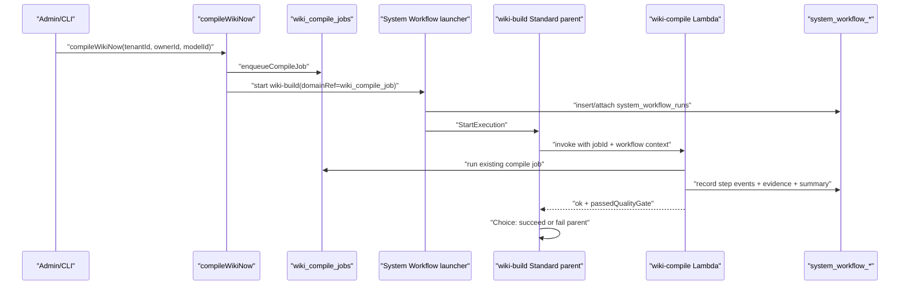

# feat: Add Wiki Build System Workflow Adapter

## Overview

This plan converts the operator-triggered Wiki Build Process into the second live System Workflow adapter. It preserves the existing `wiki_compile_jobs` domain model and `compileWikiNow` GraphQL/CLI contract, but starts the `wiki-build` Standard parent state machine for admin/CLI compiles. The state machine invokes the existing `wiki-compile` Lambda, and the Lambda records System Workflow steps, evidence, and run summaries around the existing compile job.

This is intentionally a Standard-parent-first slice. Express shard workflows, destructive rebuild approval UI, and full post-turn memory-retain routing stay deferred until the runtime/evidence contract has two live adapters in production-like paths.

---

## Problem Frame

Wiki compilation is one of the clearest examples of a real ThinkWork system workflow: it has queued work, idempotency, long-running model calls, continuation chains, derived page/link artifacts, quality concerns, rebuild semantics, and compliance value. Today it is visible primarily as `wiki_compile_jobs`, CLI polling, and CloudWatch logs. Operators can see whether a compile job succeeded, but they do not get a governed System Workflow run with a step trail and durable evidence bundle.

The freshly merged System Workflow runtime and Evaluation Runs adapter prove the shared launcher, callbacks, Step Functions wiring, and evidence writers. The next slice should use those primitives with the existing wiki pipeline rather than replatforming the compiler. The result should make Wiki Build Process runs inspectable under Automations while keeping wiki pages, sections, links, cursors, and compile jobs as the wiki domain source of truth.

---

## Requirements Trace

- R1. Operator-triggered wiki compiles create or attach a durable `system_workflow_runs` row for workflow id `wiki-build`.
- R2. Existing GraphQL and CLI behavior remains stable: `compileWikiNow` still returns a `WikiCompileJob`, and `thinkwork wiki compile` / `status` continue to work from `wiki_compile_jobs`.
- R3. The `wiki-build` Standard parent invokes the existing `wiki-compile` Lambda with compact input that references the compile job, tenant, owner, model override, and System Workflow run context.
- R4. `wiki-compile` records System Workflow step events and evidence when context is present, while direct legacy invocations with only `jobId` still work.
- R5. System Workflow evidence records summarize compile status, owner scope, job metrics, page/link outputs when available, errors, and durable domain references rather than embedding large artifacts.
- R6. Failed wiki compile jobs fail the parent state machine through a clear `Choice` / `Fail` gate, while succeeded or already-done jobs succeed idempotently.
- R7. Terraform grants the System Workflow execution role permission to invoke `wiki-compile` and templates the `wiki-build` ASL with the deployed Lambda ARN.
- R8. High-volume post-turn memory-retain compiles remain direct Lambda invokes for this slice so the cost and throughput model can be designed deliberately before routing every background compile through Standard Step Functions.

**Origin actors:** A1 tenant operator, A2 compliance/security operator, A3 ThinkWork engineer.

**Origin flows:** F1 operator inspects a System Workflow, F2 System Workflow runs with governed evidence.

**Origin acceptance examples:** AE3 durable Wiki Build evidence remains available beyond Step Functions history; AE4 destructive rebuild approval remains a design constraint but is deferred from this adapter slice.

---

## Scope Boundaries

- Do not replace `wiki_compile_jobs`, `wiki_compile_cursors`, wiki pages, wiki sections, or wiki links.
- Do not change `compileWikiNow`'s GraphQL return type or CLI JSON contract.
- Do not route post-turn memory-retain compiles through Standard Step Functions in this PR.
- Do not add customer-facing workflow editing, workflow forks, or agent-authored workflow patching.
- Do not implement the destructive rebuild approval UI or new approval state in this slice.

### Deferred to Follow-Up Work

- Express child fan-out for enrichment, validation, and quality-check shards.
- Destructive rebuild approval gate and evidence binding for `thinkwork wiki rebuild`.
- Optional System Workflow routing for post-turn memory-retain compiles after the cost/throughput policy is explicit.
- Admin links from Wiki compile job detail/status views into the matching System Workflow run, unless implementation makes this trivial.

---

## Context & Research

### Relevant Code and Patterns

- `packages/api/src/lib/system-workflows/start.ts` starts Standard state machines and dedupes by workflow/domain reference.
- `packages/api/src/lib/system-workflows/evaluation-runs.ts` wraps domain-specific step/evidence writes around a legacy runner.
- `packages/api/src/handlers/eval-runner.ts` demonstrates the adapter pattern: accept optional System Workflow context, keep legacy direct invocation working, record evidence, and return a gate result to Step Functions.
- `packages/api/src/lib/system-workflows/asl.ts` already emits custom ASL for `evaluation-runs`; `wiki-build` should follow this pattern instead of staying as placeholder Pass states.
- `terraform/modules/app/system-workflows-stepfunctions/main.tf` already templates `evaluation-runs` with a Lambda ARN and grants the state machine execution role `lambda:InvokeFunction`.
- `packages/api/src/graphql/resolvers/wiki/compileWikiNow.mutation.ts` currently enqueues a compile job and fire-and-forget invokes `wiki-compile`.
- `packages/api/src/lib/wiki/enqueue.ts` keeps post-turn memory-retain compiles best-effort and should remain direct for this slice.
- `packages/api/src/handlers/wiki-compile.ts` is the existing worker and the right place to emit System Workflow evidence when invoked by the Standard parent.
- `packages/api/src/lib/wiki/repository.ts` owns compile-job dedupe, claim, status, metrics, and continuation-chain behavior.
- `apps/cli/src/commands/wiki/compile.ts` and `apps/cli/src/commands/wiki/status.ts` should remain compatible because they poll `wiki_compile_jobs`.

### Institutional Learnings

- `docs/solutions/logic-errors/compile-continuation-dedupe-bucket-2026-04-20.md`: compile dedupe keys and continuation bucket math are load-bearing; do not hide or reinterpret `inserted=false` paths.
- `docs/solutions/database-issues/brain-enrichment-approval-must-sync-wiki-sections-2026-05-02.md`: wiki writes have multiple durable read surfaces; evidence should reference the actual domain rows/operators inspect, not only a summarized page body.
- `docs/solutions/workflow-issues/manually-applied-drizzle-migrations-drift-from-dev-2026-04-21.md`: durable workflow records and hand-rolled migration objects need explicit drift visibility.

### External References

- No new external research was needed for this slice. The repo now has direct Step Functions launcher, callback, ASL templating, and Lambda-task patterns to follow.

---

## Key Technical Decisions

- **Route only operator-triggered compiles first:** Admin/CLI compiles are high-intent, inspectable workflows. Post-turn compiles may be much higher volume and should not be pushed through Standard Step Functions until Express/cost policy is explicit.
- **Keep `wiki_compile_jobs` canonical:** System Workflow rows describe orchestration and evidence; wiki compile jobs remain the domain queue and status source for existing GraphQL, CLI, and operational SQL.
- **Use domain-ref idempotency on `wiki_compile_job`:** The launcher should use `domainRef: { type: "wiki_compile_job", id: job.id }` so retries attach to the same System Workflow run.
- **Preserve legacy direct invocation:** `wiki-compile` must continue to accept `{ jobId, modelId }` without System Workflow context for memory-retain, continuation chains, tests, and operational replay.
- **Fail the parent on compile failure:** The Step Functions parent should not show success when the underlying compile job returns `failed`; the Lambda should return a boolean gate result that ASL checks.
- **Summarize evidence, do not duplicate artifacts:** System Workflow evidence should include job id, owner id, trigger, status, metrics summary, and domain pointers. Wiki pages/sections/links remain in wiki tables and S3 pack outputs remain artifact pointers.

---

## Open Questions

### Resolved During Planning

- Should this slice include Express children? No. `wiki-build` should mirror the Evaluation Runs adapter first by proving a Standard parent around the existing worker.
- Should post-turn compiles route through System Workflows immediately? No. That risks turning a high-volume background path into a Standard Step Functions cost center before the smart workflow policy is designed.
- Should `compileWikiNow` return a System Workflow run? No. Existing Admin/CLI consumers expect `WikiCompileJob`; the System Workflow run is inspectable through Automations.

### Deferred to Implementation

- Exact evidence metrics mapping: implementation should use the existing compile result `metrics` shape without inventing unavailable page/link counts.
- Exact ASL state names: use the existing registry `stepManifest` where possible, but choose names that keep the Lambda task and final gate unambiguous.
- Exact launcher-fallback classification: preserve local/test behavior when the workflow substrate is unconfigured, but avoid silently reporting a successful compile while a configured System Workflow run is durably marked failed.

---

## High-Level Technical Design

> _This illustrates the intended approach and is directional guidance for review, not implementation specification. The implementing agent should treat it as context, not code to reproduce._

---

## Implementation Units

- U1. **Wiki Build Workflow ASL And Terraform Wiring**

**Goal:** Make the `wiki-build` Standard parent invoke `wiki-compile` instead of placeholder Pass states.

**Requirements:** R3, R6, R7.

**Dependencies:** Runtime base from `docs/plans/2026-05-02-008-feat-system-workflow-runtime-eval-adapter-plan.md`.

**Files:**

- Modify: `packages/api/src/lib/system-workflows/asl.ts`
- Modify: `packages/api/src/lib/system-workflows/registry.test.ts`
- Modify: `scripts/build-system-workflow-asl.ts`
- Modify: `terraform/modules/app/system-workflows-stepfunctions/main.tf`
- Modify: `terraform/modules/app/system-workflows-stepfunctions/asl/wiki-build-standard.asl.json`
- Modify: `terraform/modules/thinkwork/main.tf`
- Test: `packages/api/src/lib/system-workflows/registry.test.ts`

**Approach:**

- Add a custom `buildWikiBuildAsl` branch similar to `buildEvaluationRunsAsl`.
- Pass `wikiCompileJobId`, `tenantId`, `ownerId`, `modelId`, `systemWorkflowRunId`, and `systemWorkflowExecutionArn` to the Lambda task.
- Add a Choice state that succeeds when the Lambda reports a successful/already-done compile and fails when the worker reports `ok: false`.
- Template the ASL with `wiki_compile_lambda_arn`, grant the System Workflow execution role invoke permission, and pass the deterministic deployed Lambda ARN from the thinkwork module.

**Patterns to follow:**

- `packages/api/src/lib/system-workflows/asl.ts` for `evaluation-runs`.
- `terraform/modules/app/system-workflows-stepfunctions/main.tf` for `eval_runner_lambda_arn` templating and IAM.

**Test scenarios:**

- Happy path: generated `wiki-build` ASL contains a Lambda Task for `wiki-compile`, a retry policy for Lambda service errors, and a terminal success path.
- Error path: generated `wiki-build` ASL contains a Choice/Fail path for `ok: false`.
- Regression: generated ASL still includes the definition marker `thinkwork-system-workflow:wiki-build:<version>`.
- Terraform: validation accepts the new Lambda ARN variable and invoke policy.

**Verification:**

- Registry/ASL tests assert the `wiki-build` parent is no longer placeholder-only and generated ASL is deterministic.

---

- U2. **Wiki Build System Workflow Recording Helpers**

**Goal:** Add wiki-specific helpers for System Workflow step events, evidence, and run summaries.

**Requirements:** R4, R5.

**Dependencies:** U1 can proceed in parallel, but worker instrumentation depends on these helpers.

**Files:**

- Create: `packages/api/src/lib/system-workflows/wiki-build.ts`
- Test: `packages/api/src/lib/system-workflows/wiki-build.test.ts`

**Approach:**

- Mirror the evaluation adapter helper shape with a `WikiBuildSystemWorkflowContext`.
- Provide helpers to record `ClaimCompileJob`, `CompilePages`, `ValidateGraph`, and `PublishEvidence` events when System Workflow context exists.
- Provide an evidence helper for `compile-summary` and `quality-gates` evidence.
- Provide a run-summary updater that writes `evidence_summary_json` and leaves cost null unless compile metrics already expose a cost value.
- Treat absent context as a no-op so direct legacy wiki invocations remain unchanged.

**Patterns to follow:**

- `packages/api/src/lib/system-workflows/evaluation-runs.ts`
- `packages/api/src/lib/system-workflows/events.ts`
- `packages/api/src/lib/system-workflows/evidence.ts`

**Test scenarios:**

- Happy path: helpers insert step events and evidence with deterministic idempotency keys for a workflow run.
- Idempotency: repeated helper calls with the same key dedupe through the shared System Workflow writers.
- Legacy path: helper calls with null context return without touching the database.
- Summary path: metrics from a succeeded compile job are stored in `evidence_summary_json` without requiring large page artifacts inline.

**Verification:**

- Focused tests prove the wiki helper layer is no-op-safe, idempotent, and uses the existing System Workflow evidence writer contract.

---

- U3. **Instrument `wiki-compile` For Workflow Context**

**Goal:** Make the existing compile Lambda emit workflow progress/evidence and return a parent gate result when invoked by Step Functions.

**Requirements:** R4, R5, R6.

**Dependencies:** U2.

**Files:**

- Modify: `packages/api/src/handlers/wiki-compile.ts`
- Test: `packages/api/src/handlers/wiki-compile.test.ts`

**Approach:**

- Extend the event type with optional `systemWorkflowRunId`, `systemWorkflowExecutionArn`, `tenantId`, and `ownerId`.
- When context is present, record the claim/checkpoint step before reading or claiming the compile job.
- Record compile step success/failure from the existing `runJobById` / `runCompileJob` result.
- Record evidence after terminal outcomes, including already-done/no-job outcomes as idempotent no-op evidence rather than workflow crashes.
- Return an explicit gate field such as `passedQualityGate` or `workflowSucceeded` based on the existing compile result status, so ASL can fail the parent on real compile failures.
- Preserve all existing behavior for direct `{ jobId, modelId }` and queue-head invocations.

**Patterns to follow:**

- `packages/api/src/handlers/eval-runner.ts`
- `packages/api/src/handlers/wiki-compile.ts`
- `packages/api/src/lib/wiki/repository.ts`

**Test scenarios:**

- Happy path: a successful compile job returns `ok: true`, emits compile-summary evidence, and updates the System Workflow run summary.
- Already done: invoking a succeeded/skipped job returns success and records idempotent already-done evidence.
- Error path: a failed compile job returns `ok: false`, records failure evidence, and gives ASL enough data to fail the parent.
- Legacy path: invoking without System Workflow context behaves like the current handler and emits no System Workflow records.
- Edge case: missing job id with no claimable jobs returns `no_job` without creating misleading compile-success evidence.

**Verification:**

- Handler tests cover both Step Functions context and legacy invocation paths.

---

- U4. **Route Admin Wiki Compile Through The Launcher**

**Goal:** Start the `wiki-build` System Workflow for `compileWikiNow` while preserving the existing job return value and fallback behavior.

**Requirements:** R1, R2, R8.

**Dependencies:** U1, U3.

**Files:**

- Modify: `packages/api/src/graphql/resolvers/wiki/compileWikiNow.mutation.ts`
- Test: `packages/api/src/__tests__/wiki-resolvers.test.ts`
- Test: `packages/api/src/lib/system-workflows/start.test.ts`

**Approach:**

- After `enqueueCompileJob`, call `startSystemWorkflow` with workflow id `wiki-build`, domain ref `{ type: "wiki_compile_job", id: job.id }`, trigger source `admin`, actor metadata from the GraphQL context where available, and compact input `{ wikiCompileJobId, ownerId, modelId, trigger }`.
- If the launcher succeeds or dedupes, return the same `WikiCompileJob` response as today.
- If the launcher fails before a System Workflow run is created because the state machine is not configured, log the failure and fall back to the existing direct async Lambda invoke so local/test/admin behavior does not regress.
- If the launcher creates a System Workflow run and then `StartExecution` fails, do not silently hide that configured-workflow failure behind a successful-looking direct invoke. Return the job row only if the failure can be made visible through the run/error summary and operator logs; otherwise surface a clear error consistent with the Evaluation Runs adapter.
- Leave `maybeEnqueuePostTurnCompile` direct for this slice.

**Patterns to follow:**

- `packages/api/src/graphql/resolvers/evaluations/index.ts` for starting a System Workflow around an existing domain row.
- Existing `invokeWikiCompile` fallback in `compileWikiNow.mutation.ts`.

**Test scenarios:**

- Happy path: `compileWikiNow` enqueues a wiki job, starts `wiki-build`, and returns the job row unchanged.
- Idempotency: a deduped compile job attaches to the existing System Workflow run instead of starting another execution.
- Fallback: missing state-machine ARN logs and directly invokes `wiki-compile`, preserving the current contract.
- Regression: `modelId: ""` is still treated as absent and not forwarded as an empty override.
- Scope: post-turn `maybeEnqueuePostTurnCompile` remains direct and is not accidentally changed.

**Verification:**

- Resolver tests prove the mutation contract is stable while the System Workflow launch path is used when available.

---

- U5. **Verification, Codegen, And Operator Surface Check**

**Goal:** Regenerate artifacts and verify the Wiki Build Process remains visible and inspectable under Automations.

**Requirements:** R1, R2, R3, R5.

**Dependencies:** U1-U4.

**Files:**

- Modify: generated GraphQL/codegen outputs only if implementation changes GraphQL documents or schema.
- Modify: `docs/residual-review-findings/codex-system-workflows-step-functions.md` if residual follow-up scope changes.

**Approach:**

- Regenerate System Workflow ASL after the registry/ASL changes.
- Run focused API tests around System Workflows and wiki compile behavior.
- Run Terraform validation for `system-workflows-stepfunctions`.
- Smoke the Admin System Workflows table/detail page to ensure Wiki Build still renders with the updated definition/manifest.

**Patterns to follow:**

- Verification coverage used by `docs/plans/2026-05-02-008-feat-system-workflow-runtime-eval-adapter-plan.md`.

**Test scenarios:**

- Integration: the System Workflow detail page still renders Wiki Build Process metadata, steps, evidence contract, and recent runs table.
- Build: generated ASL artifacts match the registry and Terraform accepts the templated Lambda ARN.
- Regression: wiki compile CLI GraphQL documents do not require a schema change unless the implementation deliberately adds one.

**Verification:**

- The implementation is complete when focused tests, typecheck, lambda build, Terraform validate, ASL generation, and browser smoke all pass.

---

## System-Wide Impact

- **Interaction graph:** `compileWikiNow` becomes a launcher into Step Functions for admin/CLI compiles; `wiki-compile` becomes both a legacy direct worker and a System Workflow task worker.
- **Error propagation:** Existing compile enqueue remains best-effort. Step Functions parent failures should reflect compile failures, while launcher failures should fall back to the legacy direct invoke path to preserve operator behavior.
- **State lifecycle risks:** `wiki_compile_jobs` dedupe remains the first domain idempotency layer; `system_workflow_runs` domain-ref dedupe becomes the orchestration idempotency layer.
- **API surface parity:** GraphQL and CLI return shapes should stay unchanged. Automations gains the durable run/evidence view.
- **Integration coverage:** Unit tests should prove mutation-to-launch behavior; browser smoke should prove the System Workflow UI still renders the updated Wiki Build definition.
- **Unchanged invariants:** Wiki pages/sections/links remain rebuildable derived stores scoped by tenant and owner; System Workflow evidence does not become the wiki content source of truth.

---

## Risks & Dependencies

| Risk                                                                          | Mitigation                                                                                                                                                                                               |
| ----------------------------------------------------------------------------- | -------------------------------------------------------------------------------------------------------------------------------------------------------------------------------------------------------- |
| Standard Step Functions cost grows if every post-turn compile runs through it | Route only operator-triggered compiles in this slice; defer post-turn routing until Express/cost policy exists.                                                                                          |
| System Workflow parent succeeds while wiki job failed                         | Add explicit ASL Choice/Fail gate on the Lambda's returned compile outcome.                                                                                                                              |
| Launcher outage breaks existing admin compile behavior                        | Use direct fallback only for unconfigured/local substrate cases; make configured Step Functions launch failures visible so operators do not see a successful compile with a failed orchestration record. |
| Evidence diverges from wiki's real read surfaces                              | Store domain refs and metrics summaries, and keep wiki tables/S3 packs as artifact sources.                                                                                                              |
| Compile continuation chains double-record evidence                            | Use idempotency keys derived from run id, job id, and step/evidence type; direct continuation invocations without workflow context remain no-op for System Workflow writes.                              |

---

## Documentation / Operational Notes

- PR notes should call out that admin/CLI compiles now create System Workflow runs, while post-turn memory-retain compiles remain direct.
- Deployment requires the already-merged System Workflow migrations and runtime wiring from PRs #765 and #767.
- No new SQL migration is expected for this slice unless implementation discovers a missing index or domain-ref contract.
- Operators should continue using `thinkwork wiki status` for job polling; Automations -> System Workflows becomes the durable orchestration/evidence view.

---

## Sources & References

- **Origin document:** [docs/brainstorms/2026-05-02-system-workflows-step-functions-requirements.md](../brainstorms/2026-05-02-system-workflows-step-functions-requirements.md)
- Related plan: [docs/plans/2026-05-02-007-feat-system-workflows-step-functions-plan.md](2026-05-02-007-feat-system-workflows-step-functions-plan.md)
- Related plan: [docs/plans/2026-05-02-008-feat-system-workflow-runtime-eval-adapter-plan.md](2026-05-02-008-feat-system-workflow-runtime-eval-adapter-plan.md)
- Related code: `packages/api/src/graphql/resolvers/wiki/compileWikiNow.mutation.ts`
- Related code: `packages/api/src/handlers/wiki-compile.ts`
- Related code: `packages/api/src/lib/system-workflows/start.ts`
- Related learning: `docs/solutions/logic-errors/compile-continuation-dedupe-bucket-2026-04-20.md`
- Related learning: `docs/solutions/database-issues/brain-enrichment-approval-must-sync-wiki-sections-2026-05-02.md`
