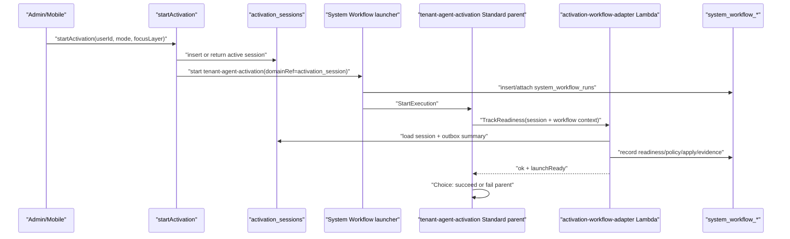

# feat: Add Tenant/Agent Activation System Workflow Adapter

## Overview

This plan converts Tenant/Agent Activation into the third live System Workflow adapter. It preserves the existing `activation_sessions`, `activation_session_turns`, and `activation_apply_outbox` domain model, but routes activation start through the `tenant-agent-activation` Standard parent state machine and records readiness, policy, apply, and evidence steps in `system_workflow_*`.

The slice intentionally keeps the activation product flow simple: starting activation still returns an `ActivationSession`, and existing checkpoint/apply mutations continue to operate on the activation domain tables. The System Workflow layer becomes the governed, inspectable operating trail around activation, proving the third representative Step Functions shape after Evaluation Runs and Wiki Build.

---

## Problem Frame

Activation already behaves like a workflow: it starts or resumes a session, progresses through operating-model layers, receives runtime callbacks, writes apply outbox items, and eventually reaches review/applied states. Today that progress is visible through activation tables and UI state, but operators do not get a durable System Workflow run with readiness checks, policy checkpoints, apply evidence, or launch-attestation evidence.

The System Workflow foundation, runtime launcher, Evaluation Runs adapter, and Wiki Build adapter have proven the shared launcher, callbacks, ASL templating, Terraform wiring, and evidence writers. The next adapter should use those primitives for activation without replatforming the activation runtime or changing the mobile/admin activation UX.

---

## Requirements Trace

- R1. Starting a new activation session creates or attaches a durable `system_workflow_runs` row for workflow id `tenant-agent-activation`.
- R2. Existing GraphQL behavior remains stable: `startActivation` still returns an `ActivationSession`, and existing checkpoint/apply/notify paths continue to use activation domain tables.
- R3. The `tenant-agent-activation` Standard parent invokes a narrow activation workflow adapter Lambda with compact input referencing the activation session, tenant, user, mode, focus layer, and System Workflow run context.
- R4. The adapter records System Workflow step events for readiness, policy checks, apply-readiness, and launch/evidence decisions when System Workflow context is present.
- R5. Evidence records summarize activation timeline, mode/focus scope, layer progress, outbox/apply state, and launch readiness without embedding large or user-authored content inline.
- R6. The parent state machine succeeds only when the activation session is in an expected non-error state; malformed sessions, tenant mismatch, and missing session rows fail the workflow clearly.
- R7. Terraform templates the activation ASL with the deployed adapter Lambda ARN and grants only the System Workflow execution role permission to invoke it.
- R8. Existing activation runtime REST callbacks remain service-authenticated and compatible with direct calls; they may enrich System Workflow evidence only when a matching run exists.

**Origin actors:** A1 tenant operator, A2 compliance/security operator, A3 ThinkWork engineer, A5 end user.

**Origin flows:** F1 operator inspects a System Workflow, F2 System Workflow runs with governed evidence, F3 operator customizes a System Workflow safely.

**Origin acceptance examples:** AE5 Tenant/Agent Activation records attestation/launch decisions as audit evidence.

---

## Scope Boundaries

- Do not replace `activation_sessions`, `activation_session_turns`, `activation_apply_outbox`, or `activation_automation_candidates`.
- Do not change `startActivation`'s GraphQL return type.
- Do not make the workflow wait on human task tokens in this slice; activation's human conversation remains in the existing product flow.
- Do not introduce customer-facing workflow editing, workflow forks, or agent-authored workflow patching.
- Do not require new activation-session columns unless implementation proves a durable link from session to workflow run cannot be recovered by domain ref.

### Deferred to Follow-Up Work

- True HITL approval states using Step Functions callback tokens for launch/security attestation.
- Connector readiness probes backed by real connector inventory and tenant policy configuration.
- Admin deep links from activation session detail into the matching System Workflow run.
- Routing apply-outbox worker batches through an Express child workflow if apply volume warrants it.

---

## Context & Research

### Relevant Code and Patterns

- `packages/api/src/lib/system-workflows/start.ts` starts Standard state machines and dedupes by workflow/domain reference.
- `packages/api/src/lib/system-workflows/evaluation-runs.ts` and `packages/api/src/lib/system-workflows/wiki-build.ts` provide domain-specific helper shapes for step/evidence/run summary writes.
- `packages/api/src/lib/system-workflows/asl.ts` emits custom Lambda-task ASL for `evaluation-runs` and `wiki-build`; activation should stop using placeholder Pass states.
- `terraform/modules/app/system-workflows-stepfunctions/main.tf` templates Lambda ARNs and grants the execution role invoke permission for live adapters.
- `packages/api/src/graphql/resolvers/activation/startActivation.mutation.ts` creates or returns an in-progress activation session and invokes the runtime before insert.
- `packages/api/src/graphql/resolvers/activation/checkpointActivationLayer.mutation.ts` advances layer state and marks sessions `ready_for_review`.
- `packages/api/src/graphql/resolvers/activation/applyActivationBundle.mutation.ts` writes operating-model apply outbox rows.
- `packages/api/src/handlers/activation.ts` handles service-authenticated runtime callbacks for notify/checkpoint/complete.
- `packages/api/src/handlers/activation-apply-worker.ts` processes `activation_apply_outbox` items.
- `packages/database-pg/src/schema/activation.ts` defines activation statuses, session rows, turns, outbox items, and automation candidates.

### Institutional Learnings

- `docs/solutions/best-practices/activation-runtime-narrow-tool-surface-2026-04-26.md`: activation runtime surfaces should stay narrow and avoid granting broad mutation power to runtime callers.
- `docs/solutions/best-practices/service-endpoint-vs-widening-resolvecaller-auth-2026-04-21.md`: prefer narrow service-authenticated endpoints over widening user auth semantics.
- `docs/solutions/workflow-issues/manually-applied-drizzle-migrations-drift-from-dev-2026-04-21.md`: hand-rolled durable workflow objects and migrations need drift visibility.
- `docs/solutions/design-patterns/audit-existing-ui-and-data-model-before-parallel-build-2026-04-28.md`: wrap and reuse existing domain surfaces before creating parallel product models.

### External References

- No new external research is required for this adapter. The local System Workflow adapters now define the relevant Step Functions, Lambda task, callback, and evidence patterns.

---

## Key Technical Decisions

- **Route `startActivation` through System Workflows after session creation:** The activation session id is the durable domain ref. The resolver should insert or return the existing session, then call `startSystemWorkflow` with `domainRef: { type: "activation_session", id: session.id }`.
- **Keep activation tables canonical:** System Workflow rows describe orchestration/evidence. Activation session state, layer data, outbox items, and automation candidates remain the product source of truth.
- **Use a thin adapter Lambda instead of invoking the runtime handler directly:** The state machine needs deterministic workflow evidence around an existing activation session. A narrow adapter can validate session ownership, record events/evidence, and avoid changing the REST callback contract.
- **Make absent workflow context a no-op in helpers:** Existing activation callbacks, tests, and operational replays should remain compatible without a System Workflow run id.
- **Use Standard parent only for v1:** Activation demonstrates governed Standard orchestration and evidence. Express children and callback-token HITL approvals are follow-up work.
- **Fail closed on invalid session inputs:** Missing session, tenant mismatch, or unsupported status should return `ok: false` so the parent marks the workflow failed rather than producing misleading evidence.

---

## Open Questions

### Resolved During Planning

- Should this adapter change activation UI/API contracts? No. `ActivationSession` remains the GraphQL return shape and domain state remains in activation tables.
- Should this slice implement real security attestation task tokens? No. The registry advertises the extension point, but real callback-token approvals require a follow-up UI and policy model.
- Should apply outbox processing move into Step Functions now? No. The adapter should summarize current outbox/apply readiness first; Express or Standard orchestration of outbox processing can follow after volume and failure policy are clear.

### Deferred to Implementation

- Exact activation adapter payload shape: choose the smallest stable event contract after inspecting handler build conventions.
- Exact run summary fields: map existing activation session and outbox data without inventing unavailable connector-readiness fields.
- Whether runtime callback handler should opportunistically update the matching System Workflow run: implement only if it can be done by domain ref without widening auth or adding fragile coupling.

---

## High-Level Technical Design

> _This illustrates the intended approach and is directional guidance for review, not implementation specification. The implementing agent should treat it as context, not code to reproduce._

---

## Implementation Units

- U1. **Activation Workflow ASL And Terraform Wiring**

**Goal:** Make the `tenant-agent-activation` Standard parent invoke a deployed activation workflow adapter instead of placeholder Pass states.

**Requirements:** R3, R6, R7.

**Dependencies:** Existing System Workflow runtime and wiki/eval ASL patterns.

**Files:**

- Modify: `packages/api/src/lib/system-workflows/asl.ts`
- Modify: `packages/api/src/lib/system-workflows/registry.test.ts`
- Modify: `scripts/build-system-workflow-asl.ts`
- Modify: `terraform/modules/app/system-workflows-stepfunctions/main.tf`
- Modify: `terraform/modules/app/system-workflows-stepfunctions/asl/tenant-agent-activation-standard.asl.json`
- Modify: `terraform/modules/thinkwork/main.tf`
- Modify: `scripts/build-lambdas.sh`
- Test: `packages/api/src/lib/system-workflows/registry.test.ts`

**Approach:**

- Add a custom `buildTenantAgentActivationAsl` branch similar to `buildEvaluationRunsAsl` and `buildWikiBuildAsl`.
- Use Pass states for `TrackReadiness` and `RunPolicyChecks` to shape compact input, then a Lambda Task state for `ApplyActivationBundle` / adapter execution.
- Include `activationSessionId`, `tenantId`, `userId`, `mode`, `focusLayer`, `systemWorkflowRunId`, and `systemWorkflowExecutionArn` in the task payload.
- Add a Choice state that succeeds when the adapter returns `ok: true` and fails otherwise.
- Template the ASL with `activation_workflow_adapter_lambda_arn`, grant invoke permission, and pass the ARN from the app/thinkwork module.

**Patterns to follow:**

- `packages/api/src/lib/system-workflows/asl.ts` for `evaluation-runs` and `wiki-build`.
- `terraform/modules/app/system-workflows-stepfunctions/main.tf` for Lambda ARN templating and execution-role IAM.

**Test scenarios:**

- Happy path: generated activation ASL contains a Lambda Task for the adapter and a success path.
- Error path: generated activation ASL contains a Choice/Fail path for `ok: false`.
- Regression: generated ASL includes `thinkwork-system-workflow:tenant-agent-activation:<version>`.
- Terraform: validation accepts the new Lambda ARN variable and invoke policy.

**Verification:** Registry/ASL tests prove the activation parent is no longer placeholder-only and generated ASL is deterministic.

---

- U2. **Activation System Workflow Recording Helpers**

**Goal:** Add activation-specific helpers for readiness, policy, apply, evidence, and run summary writes.

**Requirements:** R4, R5, R8.

**Dependencies:** U1 can proceed in parallel, but adapter instrumentation depends on these helpers.

**Files:**

- Create: `packages/api/src/lib/system-workflows/activation.ts`
- Test: `packages/api/src/lib/system-workflows/activation.test.ts`

**Approach:**

- Mirror the evaluation/wiki helper shape with an `ActivationSystemWorkflowContext`.
- Provide helpers to record `TrackReadiness`, `RunPolicyChecks`, `ApplyActivationBundle`, and `RecordLaunchDecision` events.
- Provide evidence helpers for `activation-timeline` and `launch-approval`.
- Provide a run-summary updater that writes `evidence_summary_json` with activation session status, mode, focus layer, current layer, known layer count, outbox counts, and launch readiness.
- Treat absent context as a no-op.

**Patterns to follow:**

- `packages/api/src/lib/system-workflows/evaluation-runs.ts`
- `packages/api/src/lib/system-workflows/wiki-build.ts`
- `packages/api/src/lib/system-workflows/events.ts`
- `packages/api/src/lib/system-workflows/evidence.ts`

**Test scenarios:**

- Happy path: helpers insert step events and evidence with deterministic idempotency keys for a workflow run.
- Idempotency: repeated helper calls with the same key dedupe through shared System Workflow writers.
- Legacy path: helper calls with null context return without touching the database.
- Summary path: activation session/outbox counts are stored in `evidence_summary_json` without embedding layer content.

**Verification:** Focused tests prove the activation helper layer is no-op-safe, idempotent, and uses the shared evidence writer contract.

---

- U3. **Activation Workflow Adapter Lambda**

**Goal:** Add a narrow Lambda Task target that validates an activation session, records workflow progress/evidence, and returns a parent gate result.

**Requirements:** R3, R4, R5, R6.

**Dependencies:** U2.

**Files:**

- Create: `packages/api/src/handlers/activation-workflow-adapter.ts`
- Test: `packages/api/src/handlers/activation-workflow-adapter.test.ts`

**Approach:**

- Accept compact Step Functions input containing activation session id, tenant id, user id, mode/focus metadata, and System Workflow context.
- Load the activation session by id and verify tenant/user match.
- Summarize layer progress from `layer_states` and apply state from `activation_apply_outbox`.
- Record readiness and policy-check step events; for v1, policy checks are evidence-backed summaries of known config/registry knobs rather than real connector probes.
- Record apply-readiness and launch decision evidence.
- Return `ok: true` for valid activation sessions in expected statuses (`in_progress`, `ready_for_review`, `applied`) and `ok: false` for missing/mismatched/unsupported states.

**Patterns to follow:**

- `packages/api/src/handlers/eval-runner.ts` for optional System Workflow context and parent gate returns.
- `packages/api/src/handlers/wiki-compile.ts` for Step Functions Lambda task output shape.
- `packages/api/src/graphql/resolvers/activation/shared.ts` for session semantics.

**Test scenarios:**

- Happy path: valid in-progress session records readiness/policy/evidence and returns `ok: true`.
- Happy path: ready-for-review session records launch-ready evidence and returns `ok: true`.
- Error path: missing session returns `ok: false` with a useful reason.
- Error path: tenant or user mismatch returns `ok: false` and does not write misleading success evidence.
- Edge case: empty `layer_states` produces a readiness summary with zero completed layers.
- Idempotency: repeated adapter invocation for the same workflow run does not duplicate evidence rows.

**Verification:** Handler tests cover valid sessions, invalid inputs, evidence writes, gate output, and no large activation content embedded inline.

---

- U4. **Route `startActivation` Through The System Workflow Launcher**

**Goal:** Start or attach the `tenant-agent-activation` System Workflow whenever activation starts or resumes through GraphQL.

**Requirements:** R1, R2, R8.

**Dependencies:** U1, U3.

**Files:**

- Modify: `packages/api/src/graphql/resolvers/activation/startActivation.mutation.ts`
- Test: `packages/api/src/__tests__/activation-system-workflow.test.ts`

**Approach:**

- After selecting or creating an activation session, call `startSystemWorkflow` with workflow id `tenant-agent-activation`, domain ref type `activation_session`, tenant id, actor metadata, and compact activation input.
- Preserve existing behavior if the workflow substrate is unconfigured in tests/local paths by falling back to returning the activation session only for the explicit "no configured state machine" error class.
- Do not change the GraphQL return shape.
- Avoid starting duplicate System Workflow runs for an existing in-progress session by relying on domain-ref idempotency.

**Patterns to follow:**

- `packages/api/src/graphql/resolvers/evaluations/index.ts`
- `packages/api/src/graphql/resolvers/wiki/compileWikiNow.mutation.ts`
- `packages/api/src/lib/system-workflows/start.ts`

**Test scenarios:**

- Happy path: new activation session calls `startSystemWorkflow` with domain ref `activation_session:<session.id>` and returns the session.
- Idempotency: existing in-progress activation session returns the existing session and attaches/starts at most one workflow run.
- Error path: unknown workflow configuration falls back only for the expected unconfigured-substrate error.
- Regression: `focusLayer` validation for refresh mode remains unchanged.

**Verification:** Resolver tests prove activation API compatibility and System Workflow launch behavior.

---

## System-Wide Impact

- **Operators:** Tenant/Agent Activation becomes inspectable under Automations -> System Workflows with step/evidence rows comparable to Wiki Build and Evaluation Runs.
- **Compliance/security:** Activation evidence starts producing durable records for timeline and launch/readiness decisions, aligned with AE5.
- **Engineers:** The third adapter proves System Workflows can wrap a product/session lifecycle, not only batch workers.
- **End users:** Activation UX should remain unchanged; this is an observability/governance layer around existing behavior.

---

## Verification Plan

- Run focused API tests for activation ASL, helpers, adapter handler, and resolver launch behavior.
- Run API typecheck.
- Regenerate System Workflow ASL and verify deterministic output.
- Run Terraform format/validation for the changed System Workflow module.
- After merge/deploy, smoke dev through deployed GraphQL `startActivation` or a narrow service-auth trigger, then verify `system_workflow_runs`, step events, evidence rows, and Step Functions execution status for workflow id `tenant-agent-activation`.
