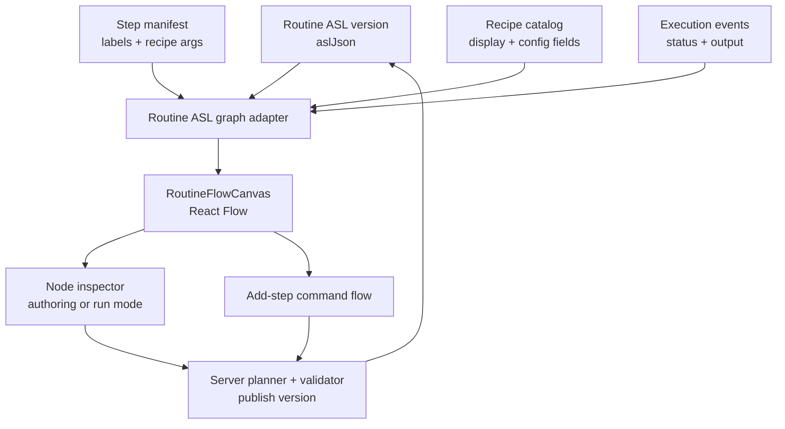
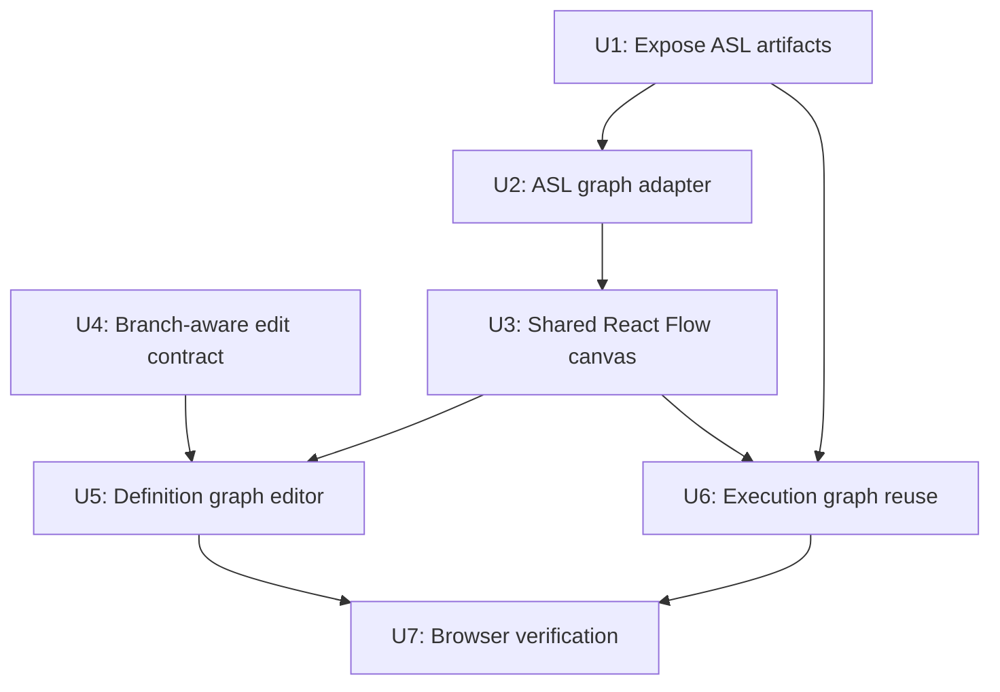

# feat: Routine visual workflow UX

## Overview

Replace the current list-heavy Routine Definition and execution stepper surfaces with a shared, ASL-first visual workflow graph. The graph becomes the primary comprehension surface for authoring and run inspection, while configuration moves into a focused inspector and recipe selection moves into an add-step command flow. This plan deliberately includes the server-side graph definition contract because the current editable model is an ordered recipe-step list and cannot represent real `Choice`, `Map`, or `Parallel` topology.

---

## Problem Frame

The shipped admin Routine MVP can create, edit, save, test, and inspect recipe-backed Step Functions routines, but the UI still feels like catalog metadata rendered directly to the page. It uses nested scrolling regions, a permanent recipe palette, inline config, and vertical lists where operators need a workflow. The origin requirements define the desired UX: visualizer-first, shared between authoring and run detail, ASL-first topology, branch-aware from day one, guided edits only, and no permanent recipe pane (see origin: `docs/brainstorms/2026-05-03-routine-visual-workflow-ux-requirements.md`).

The implementation must respect the existing Routines architecture: Step Functions ASL remains the executable substrate, recipe catalog metadata remains the authoring vocabulary, and publish/update still flows through server-side validation and versioning.

---

## Requirements Trace

- R1. Use one shared graph component for routine authoring and routine execution detail.
- R2. Make the graph the primary Definition surface and move step detail into an inspector.
- R3. Derive topology from ASL: `StartAt`, `States`, `Next`, `End`, `Choices`, `Default`, `Catch`, `Map`, and `Parallel`.
- R4. Overlay recipe, config, dirty, validation, and execution metadata on the ASL-derived graph.
- R5. Treat branching as first-class in the first visual pass.
- R6. Render readable Choice/default branch labels.
- R7. Preserve nested Map/Parallel context without losing parent workflow navigation.
- R8. Show execution status and path information on the same graph where possible.
- R9. Provide guided graph edits only; no freehand edge drawing.
- R10. Replace the permanent recipe palette with an add-step flow.
- R11. Preserve recipe-backed config field editing in the selected-node inspector.
- R12. Preserve dirty/save/test safety.
- R13. Avoid nested scrolling in the main routine Definition experience.
- R14. Keep the UX ThinkWork-native rather than an AWS console clone.
- R15. Preserve server-authoritative publish and validation.

**Origin actors:** A1 tenant operator, A2 run investigator, A3 ThinkWork planner/implementer.
**Origin flows:** F1 visual routine editing, F2 branch-aware workflow comprehension, F3 execution inspection on the same graph.
**Origin acceptance examples:** AE1 two-step Definition graph, AE2 Choice branch edit, AE3 Map/Parallel grouped rendering, AE4 execution graph with failed branch detail, AE5 validation blocks save/test.

---

## Scope Boundaries

- No freehand drag-to-connect edge authoring.
- No raw ASL editor.
- No embedded AWS Workflow Studio.
- No replacement of the Step Functions publish/version/validation pipeline.
- No mobile routine authoring parity in this plan.
- No schedule/webhook trigger editing in Routine definition.
- No pause-and-edit of in-flight executions.
- No full visual diff/rollback between versions.

### Deferred to Follow-Up Work

- Full Map/Parallel authoring beyond display and basic inspection: first pass should render these structures and preserve them safely, but guided creation/editing can focus on sequence and Choice operations unless implementation proves Map/Parallel edits are cheap.
- Advanced graph ergonomics such as undo/redo stacks, keyboard graph editing, bulk selection, and version diffing.

---

## Context & Research

### Relevant Code and Patterns

- `apps/admin/src/components/routines/RoutineWorkflowEditor.tsx` currently owns the permanent recipe palette plus workflow list layout that this plan replaces.
- `apps/admin/src/components/routines/RoutineStepConfigEditor.tsx` owns config field rendering and mutation conversion; reuse its value conversion and field controls rather than reimplementing field semantics.
- `apps/admin/src/components/routines/RoutineDefinitionPanel.tsx` owns definition query, dirty state, save behavior, and Test Routine coordination.
- `apps/admin/src/components/routines/ExecutionGraph.tsx`, `StepDetailPanel.tsx`, and `routineExecutionManifest.ts` own the current execution stepper and manifest normalization.
- `apps/admin/src/routes/_authed/_tenant/automations/routines/$routineId.tsx` coordinates Test Routine disabled state with Definition editor state.
- `apps/admin/src/routes/_authed/_tenant/automations/routines/$routineId_.executions.$executionId.tsx` already resolves `RoutineExecution.aslVersion` for historical run context.
- `packages/api/src/lib/routines/routine-authoring-planner.ts` currently converts ordered `RoutinePlanStep[]` into linear ASL. This is the main model gap for branch-aware editing.
- `packages/database-pg/graphql/types/routines.graphql` currently exposes `RoutineAslVersion.aslJson`, but `RoutineDefinition` only returns ordered editable steps.
- `apps/admin/src/components/ui/sheet.tsx` and `command.tsx` provide the side-sheet and searchable command primitives needed for the inspector and add-step flow.

### Institutional Learnings

- `docs/solutions/architecture-patterns/recipe-catalog-llm-dsl-validator-feedback-loop-2026-05-01.md` is load-bearing: recipe catalog metadata and server validation remain the safety boundary; the graph must not become a raw ASL authoring bypass.
- `docs/solutions/developer-experience/routine-rebuild-closeout-checkpoints-2026-05-03.md` warns that workflow products have multiple sources of truth: authoring metadata, generated ASL, Step Functions versions, execution rows, step events, and UI-derived graph state. This plan must explicitly connect those rather than adding another parallel model.
- `docs/solutions/logic-errors/admin-graph-dims-measure-ref-2026-04-20.md` applies to any new graph surface: use a stable outer container or callback-ref measurement so cold-loading graph views do not render blank.
- `docs/solutions/best-practices/graph-filter-states-no-restart-2026-04-20.md` reinforces that graph interactions should preserve spatial context and avoid unnecessary layout/camera churn.

### External References

- React Flow current package is `@xyflow/react` 12.10.2. Its docs describe `<ReactFlow />` as the core controlled/uncontrolled nodes-and-edges component and call out node/edge event handlers such as `onNodesChange` and `onEdgeClick`.
- React Flow does not ship a built-in layout engine; its layouting docs list Dagre, D3 hierarchy/force, and ELK as options. Dagre is simple and MIT-licensed, while React Flow docs note a sub-flow caveat; ELK supports richer sub-flow layout but is more complex and `elkjs` is EPL-2.0.
- AWS Step Functions documents ASL as a JSON language for state machines with states such as `Task`, `Choice`, and `Fail`; ASL is the correct topology source for the graph.
- `asl-viewer` is Apache-2.0 and useful prior art for ASL-to-node/edge conversion, artificial start/end nodes, and group-node concepts, but it depends on legacy `reactflow` v11 packages and lacks ThinkWork recipe/config/run metadata.

---

## Key Technical Decisions

- Build a ThinkWork-owned graph adapter around current `@xyflow/react`, rather than adopting `asl-viewer` directly. This avoids legacy React Flow dependency drift and lets the graph model include recipe, validation, dirty, and execution metadata.
- Start with `@dagrejs/dagre` for deterministic directed layout because it is small and MIT-licensed. Keep the adapter isolated so Map/Parallel group layout can evolve if Dagre's sub-flow limitations become real in ThinkWork workflows.
- Extend the server definition read shape to expose ASL artifacts alongside editable metadata. The Definition surface should not need a second query or latest-version guesswork to render the authoritative current topology.
- Introduce a graph definition/edit contract in `routine-authoring-planner.ts` instead of forcing branch-aware authoring through ordered `steps`.
- Treat sequence and Choice edits as the first guided authoring target. Render Map/Parallel accurately in the shared graph, inspect them, and preserve them during saves, but defer full Map/Parallel creation/editing unless the new graph contract makes it straightforward.
- Use the side sheet as the selected-node inspector in authoring mode and run-inspection mode. The inspector content changes by mode, but selection state and graph semantics stay shared.
- Keep execution path highlighting best-effort from persisted ThinkWork events in this plan; deeper Step Functions history ingestion is a follow-up unless already available from existing fields.

---

## Open Questions

### Resolved During Planning

- Should `asl-viewer` be a direct dependency? No. Use it as reference material only because it depends on legacy React Flow packages and does not model ThinkWork metadata.
- Should the graph render from ordered recipe steps? No. ASL is the topology source; recipe steps/manifest decorate the ASL graph.
- Should branch editing be freehand? No. Guided edits only.
- Should Map/Parallel authoring be complete in the first pass? No. Branch-aware rendering lands in the first pass, with guided Choice editing as the first authoring target and Map/Parallel authoring deferred unless cheap.

### Deferred to Implementation

- Exact node dimensions and visual styling: finalize after rendering real Austin weather, Choice, and Map/Parallel fixtures in the admin app.
- Exact branch condition editor controls: start with the current supported ASL condition shapes and keep the contract extensible.
- Whether Dagre is enough for grouped Map/Parallel layouts: prove with fixtures before considering a heavier layout engine.
- Whether execution branch highlighting needs Step Functions `GetExecutionHistory`: implement from existing `routine_step_events` first; escalate only if the graph cannot show executed paths correctly.

---

## High-Level Technical Design

> _This illustrates the intended approach and is directional guidance for review, not implementation specification. The implementing agent should treat it as context, not code to reproduce._



The graph adapter is the seam. Authoring and run detail both feed ASL plus overlays into the adapter; React Flow receives a presentation graph. Guided edits flow back through the existing server planner/validator instead of mutating raw ASL in the browser.

---

## Implementation Units



- U1. **Expose routine definition ASL artifacts**

**Goal:** Make the current editable routine definition query carry the authoritative ASL artifacts needed by the graph.

**Requirements:** R1, R3, R4, R15; supports F1, AE1.

**Dependencies:** None.

**Files:**

- Modify: `packages/database-pg/graphql/types/routines.graphql`
- Modify: `packages/api/src/graphql/resolvers/routines/routineDefinition.shared.ts`
- Modify: `packages/api/src/graphql/resolvers/routines/routineDefinition.query.ts`
- Modify: `packages/api/src/graphql/resolvers/routines/updateRoutineDefinition.mutation.ts`
- Modify: `apps/admin/src/lib/graphql-queries.ts`
- Generated: `apps/admin/src/gql/`
- Generated: `apps/mobile/lib/gql/`
- Generated: `apps/cli/src/gql/`
- Test: `packages/api/src/lib/routines/routine-authoring-planner.test.ts`
- Test: `packages/api/src/__tests__/routines-publish-flow.test.ts`

**Approach:**

- Add current-version ASL artifacts to `RoutineDefinition`: `aslJson`, `markdownSummary`, and `stepManifestJson`.
- Return these fields from `routineDefinitionPayload` using the already-loaded `routine_asl_versions` row.
- Keep the existing ordered `steps` field for config forms and compatibility while the graph adapter becomes the topology reader.
- Regenerate GraphQL clients for every workspace with codegen scripts because the canonical schema changed.

**Patterns to follow:**

- Existing `RoutineAslVersion` field names in `packages/database-pg/graphql/types/routines.graphql`.
- Existing version-backed execution detail query shape in `apps/admin/src/lib/graphql-queries.ts`.

**Test scenarios:**

- Happy path: querying `routineDefinition` for a Step Functions routine returns `steps`, `aslJson`, `markdownSummary`, and `stepManifestJson` for the current version.
- Edge case: legacy Python routines still produce the existing "not editable Step Functions routine" error.
- Integration: saving an updated routine definition returns refreshed ASL artifacts matching the new version.

**Verification:**

- The admin Definition page can load one query and has enough data to render both editable config and ASL topology.

---

- U2. **Build ASL-to-routine graph adapter**

**Goal:** Convert ASL plus ThinkWork overlays into a stable graph view model that can power both authoring and execution inspection.

**Requirements:** R1, R3, R4, R5, R6, R7, R8, R14; supports F2, F3, AE2, AE3, AE4.

**Dependencies:** U1.

**Files:**

- Create: `apps/admin/src/components/routines/routineAslGraph.ts`
- Create: `apps/admin/src/components/routines/routineAslGraph.test.ts`
- Modify: `apps/admin/package.json`
- Modify: `pnpm-lock.yaml`

**Approach:**

- Add `@dagrejs/dagre` as the first layout helper and keep layout calculation behind the adapter API.
- Parse ASL states into graph nodes and edges, including artificial start/end nodes.
- Support `Next`, terminal `End`, `Choice`/`Default`, `Catch`, `Map.Iterator`, `Map.ItemProcessor`, and `Parallel.Branches`.
- Derive readable Choice edge labels from common JSONPath comparison operators and JSONata `Condition` strings; fall back to concise generic labels only when summarization is impossible.
- Overlay recipe metadata from `Comment` markers, `stepManifestJson`, and recipe catalog data.
- Overlay execution status by node id when step events are provided.
- Preserve stable node ids so selection, inspector state, and execution events all line up.

**Execution note:** Add adapter tests before wiring React components. This adapter is the highest-leverage safety net for branch correctness.

**Patterns to follow:**

- `apps/admin/src/components/routines/routineExecutionManifest.ts` for tolerant AWSJSON parsing.
- `ExecutionGraph.test.ts` for status inference behavior.
- `asl-viewer`'s `createConnections` and artificial start/end concepts as reference material only.

**Test scenarios:**

- Happy path: linear Austin-weather ASL produces start, two task nodes, end, and the expected next edges.
- Happy path: Choice ASL produces one Choice node with labeled outgoing condition edges and a Default edge.
- Happy path: Catch ASL produces an error edge with a readable error label.
- Edge case: Map with `Iterator` and Map with `ItemProcessor` both produce a grouped child region.
- Edge case: Parallel branches produce grouped child regions with branch-local node ids that cannot collide with parent state ids.
- Error path: malformed or missing ASL returns a typed empty/error graph model rather than throwing during render.
- Integration: recipe labels from `stepManifestJson` override raw state ids while ASL still defines edges.

**Verification:**

- Adapter unit tests prove topology, labeling, grouping, and status overlays without depending on the browser.

---

- U3. **Create the shared RoutineFlowCanvas**

**Goal:** Render the adapter view model with React Flow and provide shared selection, viewport, controls, and node/edge presentation.

**Requirements:** R1, R2, R4, R5, R6, R7, R8, R13, R14; supports F1, F2, F3, AE1, AE2, AE3, AE4.

**Dependencies:** U2.

**Files:**

- Create: `apps/admin/src/components/routines/RoutineFlowCanvas.tsx`
- Create: `apps/admin/src/components/routines/RoutineFlowNode.tsx`
- Create: `apps/admin/src/components/routines/RoutineFlowEdge.tsx`
- Create: `apps/admin/src/components/routines/RoutineFlowInspector.tsx`
- Create: `apps/admin/src/components/routines/RoutineFlowCanvas.test.tsx`
- Modify: `apps/admin/package.json`
- Modify: `pnpm-lock.yaml`

**Approach:**

- Add `@xyflow/react` and import its stylesheet through the admin app's normal CSS entry.
- Render as a controlled read-mostly flow: nodes are selectable, pannable, zoomable, and clickable, but not draggable/connectable in the first pass.
- Use custom nodes for recipe/task/control-flow/status presentation and custom edges for branch labels.
- Keep graph viewport state stable across selection and inspector changes; do not recompute layout unless ASL topology changes.
- Use a stable graph container with callback-ref measurement or fixed viewport constraints, following the admin graph cold-mount lesson.
- Keep the inspector component mode-aware: authoring mode shows config/actions; run mode shows event/output/error detail.

**Patterns to follow:**

- `apps/admin/src/components/ui/sheet.tsx` for inspector shell.
- `apps/admin/src/components/ui/tooltip.tsx` for compact icon affordances.
- `docs/solutions/logic-errors/admin-graph-dims-measure-ref-2026-04-20.md` for graph container measurement.

**Test scenarios:**

- Happy path: selecting a node calls the selection handler and marks that node selected.
- Happy path: selected node metadata is passed to the inspector in authoring mode and run mode.
- Edge case: empty/error graph renders an explicit empty or unsupported state, not a blank panel.
- Edge case: rerendering with the same topology but different selected node does not regenerate layout positions.
- Accessibility: node buttons and edge action affordances have labels usable by keyboard/screen readers.

**Verification:**

- The shared canvas renders a nonblank linear and Choice fixture in component tests and in the admin dev browser.

---

- U4. **Add branch-aware routine edit contract**

**Goal:** Extend the server-side editable definition model so guided graph edits can represent Choice topology without raw ASL editing.

**Requirements:** R3, R5, R6, R9, R12, R15; supports F1, F2, AE2, AE5.

**Dependencies:** U1, U2.

**Files:**

- Modify: `packages/database-pg/graphql/types/routines.graphql`
- Modify: `packages/api/src/lib/routines/routine-authoring-planner.ts`
- Modify: `packages/api/src/graphql/resolvers/routines/planRoutineDraft.mutation.ts`
- Modify: `packages/api/src/graphql/resolvers/routines/updateRoutineDefinition.mutation.ts`
- Modify: `apps/admin/src/lib/graphql-queries.ts`
- Generated: `apps/admin/src/gql/`
- Generated: `apps/mobile/lib/gql/`
- Generated: `apps/cli/src/gql/`
- Test: `packages/api/src/lib/routines/routine-authoring-planner.test.ts`
- Test: `packages/api/src/__tests__/routines-publish-flow.test.ts`

**Approach:**

- Introduce a graph-shaped editable definition input alongside the existing ordered `steps` input. Preserve the current ordered input for backwards compatibility and simple sequence edits.
- Model sequence nodes, Choice nodes, branch edges, and default paths in a recipe-aware structure that the server can emit to ASL.
- Keep recipe node args validated through the existing catalog field definitions.
- For the first pass, support guided sequence edits and Choice branch creation/editing. Preserve existing Map/Parallel ASL in read-only/display mode unless implementation can safely round-trip it.
- Reject unsupported graph edits with actionable validation messages instead of producing partial ASL.

**Technical design:** Directional shape only:

```text
Editable graph input
  nodes: recipe nodes + control nodes
  edges: next edges + choice edges + default edge
  branches: condition metadata owned by server-safe schema

Server publish path
  editable graph input -> RoutinePlan graph model -> ASL -> validator -> version row
```

**Patterns to follow:**

- Existing `planRoutineFromSteps` and `applyRoutineDefinitionEdits` validation style.
- Existing recipe catalog arg normalization in `routine-authoring-planner.ts`.
- Existing ASL validation before publish in `publishRoutineVersion.mutation.ts`.

**Test scenarios:**

- Happy path: explicit graph input for a linear two-step routine emits the same ASL shape as the current ordered steps path.
- Happy path: Choice graph input with two branches and a default emits ASL with a Choice state, readable branch targets, and correct terminal/next wiring.
- Edge case: duplicate node ids are rejected.
- Edge case: a Choice node without a default is rejected unless all branches are terminal and the server validator accepts it.
- Error path: a Choice edge pointing at a missing node returns a validation error naming the missing target.
- Error path: unsupported Map/Parallel edit attempts return an actionable unsupported-edit error instead of dropping nested states.
- Integration: `updateRoutineDefinition` publishes a new version from graph input and returns refreshed ASL artifacts.

**Verification:**

- Backend tests prove graph input can round-trip through publish validation for sequence and Choice workflows.

---

- U5. **Replace Definition list editor with graph editor**

**Goal:** Make routine Definition authoring graph-first, with side-sheet config and add-step command flow replacing the permanent recipe palette.

**Requirements:** R1, R2, R4, R9, R10, R11, R12, R13, R14, R15; supports F1, AE1, AE2, AE5.

**Dependencies:** U3, U4.

**Files:**

- Modify: `apps/admin/src/components/routines/RoutineDefinitionPanel.tsx`
- Modify: `apps/admin/src/components/routines/RoutineWorkflowEditor.tsx`
- Modify: `apps/admin/src/components/routines/RoutineStepConfigEditor.tsx`
- Create: `apps/admin/src/components/routines/RoutineAddStepCommand.tsx`
- Create: `apps/admin/src/components/routines/RoutineDefinitionGraphEditor.tsx`
- Create: `apps/admin/src/components/routines/RoutineDefinitionGraphEditor.test.tsx`
- Modify: `apps/admin/src/routes/_authed/_tenant/automations/routines/new.tsx`

**Approach:**

- Replace the default two-pane recipe/workflow layout with the shared canvas and selected-node inspector.
- Extract reusable config field rendering/conversion from `RoutineStepConfigEditor` so the inspector can render the same fields without the old step-list shell.
- Add a command dialog/sheet for recipes. It opens from graph actions such as `Add step after`, not as a permanent left rail.
- For existing routines, compute dirty state from the editable graph definition plus field values, not only ordered steps.
- For new routines, render graph-first after prompt planning or manual first-step addition; show a clear empty graph state before steps exist.
- Preserve current Test Routine disabled-state handoff to the route-level button.

**Patterns to follow:**

- Existing dirty-state callback from `RoutineDefinitionPanel` to `$routineId.tsx`.
- Existing command dialog primitive in `apps/admin/src/components/ui/command.tsx`.
- Existing config conversion helpers in `RoutineStepConfigEditor.tsx`.

**Test scenarios:**

- Covers AE1. Opening a two-step routine shows the graph as the primary surface and no permanent recipe palette.
- Happy path: clicking a recipe node opens its config in the inspector and editing a field marks the definition dirty.
- Happy path: `Add step after` opens the add-step command flow, selecting `email_send` inserts a node through the editable graph model.
- Happy path: adding/editing a Choice branch uses guided controls and produces a dirty graph edit.
- Error path: missing required config blocks Save and keeps Test Routine disabled.
- Edge case: removing the selected node closes or moves the inspector selection without crashing.
- Responsive: narrow widths keep graph and inspector usable without nested scroll competing with the page.

**Verification:**

- Existing routine editing, saving, and Test Routine coordination still work, but Definition no longer shows a permanent recipe pane or inline list-config dump.

---

- U6. **Replace execution stepper with shared graph inspection**

**Goal:** Render routine execution detail using the same ASL graph component, overlaid with historical execution status and selected-node run details.

**Requirements:** R1, R3, R4, R5, R6, R7, R8, R13, R14; supports F2, F3, AE3, AE4.

**Dependencies:** U1, U2, U3.

**Files:**

- Modify: `apps/admin/src/components/routines/ExecutionGraph.tsx`
- Modify: `apps/admin/src/components/routines/StepDetailPanel.tsx`
- Modify: `apps/admin/src/routes/_authed/_tenant/automations/routines/$routineId_.executions.$executionId.tsx`
- Modify: `apps/admin/src/lib/graphql-queries.ts`
- Test: `apps/admin/src/components/routines/ExecutionGraph.test.ts`
- Test: `apps/admin/src/components/routines/routineAslGraph.test.ts`

**Approach:**

- Update the execution detail query to request `aslVersion.aslJson` alongside `markdownSummary` and `stepManifestJson`.
- Feed historical ASL, manifest, and step events through the shared graph adapter.
- Replace the vertical `ExecutionGraph` stepper UI with `RoutineFlowCanvas` in run-inspection mode.
- Preserve `StepDetailPanel` semantics by moving it into the inspector or adapting it as inspector content.
- Keep output-backed success inference where explicit step events are missing, but apply it as an overlay on graph nodes.
- Highlight executed branches only when existing events/output make it trustworthy; avoid implying a branch ran when data is absent.

**Patterns to follow:**

- Existing historical-version fallback logic in `$routineId_.executions.$executionId.tsx`.
- Existing `deriveNodes` status inference tests.
- `routineExecutionManifest.ts` tolerance for legacy manifest shapes.

**Test scenarios:**

- Covers AE4. A failed execution with events highlights the failed node and shows output/error in the inspector.
- Happy path: succeeded execution with output-backed step data marks missing-event nodes as succeeded.
- Edge case: out-of-band execution with no `aslVersion` falls back to an explicit events-only/unsupported graph state.
- Edge case: execution route refuses to render a run whose `routineId` does not match route params.
- Integration: markdown summary anchor clicks select the matching graph node.

**Verification:**

- Run detail and Definition now share graph language, with execution-specific overlays and inspector detail.

---

- U7. **Browser verification and visual hardening**

**Goal:** Prove the redesigned graph UX works in the real admin shell across authoring and execution inspection.

**Requirements:** R1-R15; supports all origin flows and acceptance examples.

**Dependencies:** U5, U6.

**Files:**

- Modify: PR/demo assets if captured during implementation.
- Test expectation: no new unit test file solely for this unit; verification is browser evidence and any fixes discovered during the smoke.

**Approach:**

- Start the admin dev server with the required admin `.env` copied when working from a worktree.
- Verify an existing two-step routine, a Choice fixture routine, and at least one Map/Parallel fixture if one exists or can be safely created.
- Exercise edit -> save -> test -> view run output.
- Check desktop and narrower viewport behavior for graph/inspector layout, text fit, and absence of nested-scroll traps.
- Hard refresh graph routes to catch cold-mount blank graph regressions.

**Patterns to follow:**

- Admin dev server notes in `AGENTS.md`.
- Routine closeout verification lessons in `docs/solutions/developer-experience/routine-rebuild-closeout-checkpoints-2026-05-03.md`.

**Test scenarios:**

- Browser: Definition view opens to a graph-first two-step routine with no permanent recipe pane.
- Browser: node click opens inspector; field edit marks dirty; Save clears dirty after refresh.
- Browser: add-step command flow inserts a recipe node and preserves existing config.
- Browser: Choice routine renders labeled branches and guided branch controls.
- Browser: Test Routine is disabled while dirty and enabled after save.
- Browser: run detail renders the historical graph and clicking a failed/succeeded node shows run detail.
- Browser: hard refresh on Definition and run detail does not produce a blank graph.

**Verification:**

- Screenshots or concise demo notes prove AE1-AE5 against the local/deployed admin surface.

---

## System-Wide Impact

- **Interaction graph:** GraphQL definition query -> admin graph adapter -> React Flow canvas -> inspector/add-step flow -> `planRoutineDraft`/`updateRoutineDefinition` -> publish validation -> execution detail graph.
- **Error propagation:** Client-side validation should guide obvious missing fields, but server validation remains authoritative and must surface actionable errors in the inspector/save toast.
- **State lifecycle risks:** Unsaved local graph state, selected node state, generated ASL artifacts, and refreshed server version can drift; saving must reset local state from the refreshed definition payload.
- **API surface parity:** GraphQL schema/codegen changes affect admin, mobile, and CLI generated clients even if only admin consumes the new fields immediately.
- **Integration coverage:** Unit tests cover adapter/model correctness; browser verification must prove graph render, save/test coordination, and run-detail inspection together.
- **Unchanged invariants:** Routines remain Step Functions-backed, recipe-catalog-authored, server-validated workflows. Test Routine still runs the saved version, not unsaved local edits.

---

## Risks & Dependencies

| Risk                                                            | Mitigation                                                                                                              |
| --------------------------------------------------------------- | ----------------------------------------------------------------------------------------------------------------------- |
| Branch-aware editing balloons into a full Workflow Studio clone | Keep freehand edges/raw ASL out of scope; support guided sequence and Choice operations first.                          |
| Graph UI renders but cannot round-trip through server publish   | Land U4 before Definition integration; require backend graph input tests for publish flow.                              |
| Dagre layout struggles with grouped Map/Parallel subflows       | Hide layout behind `routineAslGraph.ts`; render fixtures early; defer heavier layout engines until proven necessary.    |
| Execution graph implies an unverified branch path               | Highlight only from explicit step events or trustworthy output inference; otherwise show status as unknown/pending.     |
| New graph cold-loads blank due container measurement race       | Use stable container/callback-ref pattern from the existing admin graph lesson and hard-refresh browser smoke.          |
| Additional GraphQL fields break generated consumers             | Regenerate all consumer codegen outputs and keep new fields additive.                                                   |
| `asl-viewer` code copying creates attribution/licensing drift   | Prefer conceptual borrowing. If code is copied/adapted, add clear Apache-2.0 attribution in source comments or notices. |

---

## Documentation / Operational Notes

- Update the PR description with before/after screenshots because this is a major operator UX change.
- If guided Choice authoring ships, add a short admin docs note explaining branch editing in Routine definitions.
- Record any `asl-viewer` code adaptation explicitly in the PR body and source comments.
- Keep mobile parity out of this plan, but note any reusable graph-model decisions that will affect future mobile work.

---

## Sources & References

- **Origin document:** [docs/brainstorms/2026-05-03-routine-visual-workflow-ux-requirements.md](../brainstorms/2026-05-03-routine-visual-workflow-ux-requirements.md)
- **Original Routines rebuild requirements:** [docs/brainstorms/2026-05-01-routines-step-functions-rebuild-requirements.md](../brainstorms/2026-05-01-routines-step-functions-rebuild-requirements.md)
- **Prior graph editor plan:** [docs/plans/2026-05-02-007-feat-routine-graph-editor-plan.md](2026-05-02-007-feat-routine-graph-editor-plan.md)
- **Prior builder polish plan:** [docs/plans/2026-05-02-008-feat-routine-builder-ux-polish-plan.md](2026-05-02-008-feat-routine-builder-ux-polish-plan.md)
- **Recipe catalog pattern:** [docs/solutions/architecture-patterns/recipe-catalog-llm-dsl-validator-feedback-loop-2026-05-01.md](../solutions/architecture-patterns/recipe-catalog-llm-dsl-validator-feedback-loop-2026-05-01.md)
- **Routine closeout lessons:** [docs/solutions/developer-experience/routine-rebuild-closeout-checkpoints-2026-05-03.md](../solutions/developer-experience/routine-rebuild-closeout-checkpoints-2026-05-03.md)
- **Admin graph cold-mount lesson:** [docs/solutions/logic-errors/admin-graph-dims-measure-ref-2026-04-20.md](../solutions/logic-errors/admin-graph-dims-measure-ref-2026-04-20.md)
- React Flow layouting docs: https://reactflow.dev/learn/layouting/layouting
- React Flow component docs: https://reactflow.dev/api-reference/react-flow
- AWS ASL docs: https://docs.aws.amazon.com/step-functions/latest/dg/concepts-amazon-states-language.html
- `asl-viewer` prior art: https://github.com/cleissonbarbosa/asl-viewer
