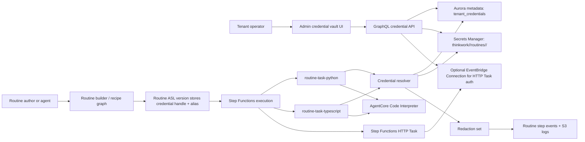

# feat: Tenant credential vault and n8n routine migration

## Overview

Build the tenant-shared credential foundation ThinkWork needs before n8n workflow replacement can move safely. The plan adds a tenant credential vault backed by Secrets Manager, credential references and bindings for Step Functions routine recipes, a TypeScript code-step peer to the existing Python recipe, and the first vertical migration path for the n8n `PDI Fuel Order` workflow.

The product stance from the origin document is preserved: v1 is tenant-shared credentials only, custom n8n nodes become editable TypeScript/Python code steps, and ThinkWork promotes only repeated migration patterns into first-class recipes later.

---

## Problem Frame

Complex n8n workflows can call external services because n8n nodes resolve stored credentials at runtime. ThinkWork routines cannot replace those workflows if secrets have to be copied into code, ASL JSON, Lambda environment variables, or visible step configuration. The missing primitive is a tenant-owned credential vault with safe runtime bindings for routines and agents (see origin: `docs/brainstorms/2026-05-04-tenant-credential-vault-n8n-routine-migration-requirements.md`).

The immediate forcing workflow is n8n `PDI Fuel Order`: a POST webhook, LastMile transform custom node, PDI SOAP add fuel order custom node, and webhook response. The migration should make that routine observable in ThinkWork without cloning the LastMile/PDI n8n node libraries.

---

## Requirements Trace

- R1. Support tenant-shared service credentials as the v1 credential scope for routines and agents.
- R2. Support API key/header tokens, bearer tokens, basic auth, SOAP username/password/partner fields, webhook signing secrets, and arbitrary JSON.
- R3. Store credential handles, aliases, and metadata in routines, versions, ASL, visible config, and code buffers; never raw secret values.
- R4. Let tenant operators create, inspect metadata, rotate, disable, delete, and audit tenant-shared credentials.
- R5. Defer per-user OAuth and run-as-user semantics.
- R6. Add a TypeScript routine code step beside Python.
- R7. Make TypeScript and Python code steps first-class recipes with source, timeout, network policy, environment/credential bindings, captured output previews, and step status.
- R8. Resolve credentials only through declared bindings.
- R9. Redact secret values and secret-shaped output from logs, errors, persisted previews, and step events.
- R10. Reuse CodeMirror editing patterns for routine code editing.
- R11. Migrate workflows vertically, one workflow at a time.
- R12. Add first-class recipes only for stable, reusable mappings.
- R13. Map custom n8n/code nodes to TypeScript or Python code steps first.
- R14. Block test/activation when required credential mappings are missing.
- R15. Use n8n `PDI Fuel Order` as the first target workflow.
- R16. Preserve execution UI visibility for credentialed runs.
- R17. Preserve synchronous webhook response contracts where workflows expect them.
- R18. Make repeated code-step patterns visible for future recipe promotion.

**Origin actors:** A1 tenant operator, A2 routine author/migration operator, A3 routine runtime, A4 agent runtime, A5 ThinkWork engineer.

**Origin flows:** F1 tenant-shared credential setup, F2 one-workflow n8n migration, F3 credentialed routine execution.

**Origin acceptance examples:** AE1 tenant PDI credential storage/reference, AE2 TypeScript credential binding and redaction, AE3 `PDI Fuel Order` migration mapping, AE4 synchronous migrated webhook run, AE5 repeated PDI code pattern visibility.

---

## Scope Boundaries

- Per-user delegated OAuth, run-as-user credentials, and mobile-owned token semantics stay deferred.
- This does not recreate the full n8n custom node catalog.
- This does not require a fully automated n8n importer before migrating `PDI Fuel Order`.
- This does not expose raw ASL editing as the primary migration surface.
- This does not support revealing saved secret values in the browser.
- This does not allow customer-authored first-class recipes; code steps are tenant-authored, recipes remain ThinkWork-engineered.
- This does not solve cross-tenant credential sharing, credential marketplace distribution, or per-environment promotion.

### Deferred to Follow-Up Work

- Per-user OAuth credential bindings for routines and agents, modeled after the existing MCP OAuth flow.
- Automated recipe promotion from code-step similarity. This plan captures pattern metadata but leaves promotion as engineering review.
- Fine-grained per-Lambda IAM role separation for every API handler. This plan narrows new runtime roles where it can and documents the existing shared Lambda role caveat.

---

## Context & Research

### Relevant Code and Patterns

- `packages/database-pg/src/schema/integrations.ts` has per-user connection credentials, but its `connection_id` and `user_id` shape is wrong for tenant-shared service credentials.
- `packages/database-pg/src/schema/mcp-servers.ts` and `packages/database-pg/src/schema/builtin-tools.ts` already store tenant-scoped secret references for platform-owned integration config.
- `packages/api/src/lib/oauth-client-credentials.ts`, `packages/api/src/lib/stripe-credentials.ts`, and `packages/api/src/handlers/skills.ts` show current Secrets Manager helper patterns and JSON `SecretString` handling.
- `packages/api/src/lib/routines/recipe-catalog.ts` is the canonical recipe source, ASL emitter source, and validator contract. Python is already an escape-hatch recipe.
- `packages/lambda/routine-task-python.ts` is the existing AgentCore Code Interpreter wrapper for code execution, S3 output offload, stdout/stderr previews, and routine step callbacks.
- `packages/lambda/sandbox-log-scrubber.ts` provides a pattern-redaction backstop for known token shapes.
- `terraform/modules/app/routines-stepfunctions/main.tf` already grants the Step Functions execution role access to `thinkwork/${stage}/routines/*` Secrets Manager paths.
- `apps/admin/src/components/routines/RoutineStepConfigEditor.tsx` currently renders `control: "code"` as a textarea; CodeMirror-backed routine code editing belongs behind that control.
- `apps/admin/package.json` includes CodeMirror packages for Python/JSON/YAML/Markdown but not `@codemirror/lang-javascript` yet.
- Reference repo `lastmile/n8n`: `nodes/LastMile/actions/transformations/TransformOrderToPDI.action.ts` and `nodes/PDI/actions/order/AddFuelOrder.action.ts` are the source behavior for the first migrated code steps.

### Institutional Learnings

- `docs/solutions/best-practices/oauth-client-credentials-in-secrets-manager-2026-04-21.md`: use Secrets Manager for shared sensitive credentials, JSON `SecretString`, and keep secret material out of env vars/tfvars/CloudWatch; note that the shared Lambda role can read broad `thinkwork/*` secrets until a larger IAM refactor.
- `docs/solutions/best-practices/service-endpoint-vs-widening-resolvecaller-auth-2026-04-21.md`: prefer narrow service endpoints over widening general auth paths for service credentials.
- `docs/solutions/best-practices/injected-built-in-tools-are-not-workspace-skills-2026-04-28.md`: platform tools needing tenant secrets or runtime context should be injected by the platform, not represented as workspace skills.
- `docs/solutions/workflow-issues/agentcore-completion-callback-env-shadowing-2026-04-25.md`: snapshot environment at handler/coroutine entry before async work.
- `docs/solutions/architecture-patterns/recipe-catalog-llm-dsl-validator-feedback-loop-2026-05-01.md`: recipe catalog TypeScript remains the source of truth for routine arg schemas, ASL emitters, and validator feedback.

### External References

- AWS Step Functions HTTP Tasks require EventBridge Connections for authentication, and EventBridge stores connection auth material in Secrets Manager: https://docs.aws.amazon.com/step-functions/latest/dg/call-https-apis.html
- AWS Secrets Manager best practices emphasize encryption, caching, rotation, monitoring, and least-privilege access: https://docs.aws.amazon.com/secretsmanager/latest/userguide/best-practices.html
- Step Functions synchronous responses require Synchronous Express workflows via `StartSyncExecution`; Standard workflows are not the direct synchronous webhook primitive: https://docs.aws.amazon.com/step-functions/latest/dg/choosing-workflow-type.html
- AgentCore Code Interpreter supports TypeScript with `nodejs` and `deno` runtimes: https://docs.aws.amazon.com/bedrock-agentcore/latest/devguide/code-interpreter-runtime-selection.html
- AgentCore credential guidance warns that code running in the VM can access the interpreter execution role credentials; interpreter roles must be least-privilege: https://docs.aws.amazon.com/bedrock-agentcore/latest/devguide/security-credentials-management.html
- CodeMirror JavaScript language support exposes TypeScript parsing via `@codemirror/lang-javascript`: https://www.npmjs.com/package/%40codemirror/lang-javascript

---

## Key Technical Decisions

- **Create a dedicated tenant credential vault instead of extending `connections.credentials`.** Existing integration credentials are user-connection scoped; tenant service credentials need independent lifecycle, usage metadata, and routine/agent reference semantics.
- **Use Secrets Manager as the secret store and Aurora as metadata/audit.** Aurora stores labels, kind, schema, status, secret reference, optional EventBridge connection ARN, timestamps, and usage summaries. Secret values live only in Secrets Manager or EventBridge-managed connection secrets.
- **Use ThinkWork credential handles as the routine contract.** Routine args store `credentialBindings` as handle/alias pairs. Wrappers validate tenant ownership before resolving secret values at execution time.
- **Agent runtime v1 gets reference authority, not raw secret material.** Agents can discover non-secret credential handles and author/invoke routines that bind them. Raw values are only resolved inside approved routine step wrappers.
- **Pair simple HTTP credentials with EventBridge Connections when useful.** Step Functions HTTP Tasks already require EventBridge Connections. For API key/basic/bearer-like HTTP credentials, ThinkWork should optionally maintain an EventBridge connection ARN as a derived runtime artifact. Arbitrary JSON and SOAP credentials resolve through code-step wrappers.
- **TypeScript code steps use AgentCore Code Interpreter, not an unsafe in-Lambda `vm` sandbox.** The TypeScript recipe should mirror Python’s Lambda-wrapper pattern and invoke AgentCore with `language: "typescript"`. The interpreter role must not have Secrets Manager or broad AWS access.
- **Step Functions execution role should not be the generic secret reader.** Existing routine IAM already has a broad routines secret path allowance; this plan should either remove/narrow that allowance for ThinkWork-managed credential secrets or document the exact remaining need. Code-step secrets should be read by wrapper Lambdas, while HTTP Task credentials should flow through EventBridge Connection permissions.
- **Credential values are injected as runtime context, not source text or env vars by default.** Code should refer to declared aliases, and wrappers should build the context at runtime. Environment bindings remain for non-secret values.
- **Redaction happens before persistence.** Code-step wrappers scrub stdout/stderr/error/output previews and S3-offloaded logs using both known token patterns and exact values from resolved credential bindings.
- **Webhook sync support is explicit, not assumed.** Existing Standard Step Functions routines can remain the durable execution engine, but n8n-style synchronous webhook responses need a bounded adapter or Express-backed path for workflows expected to finish inside API Gateway limits.

---

## Open Questions

### Resolved During Planning

- **Where should tenant-shared credentials live?** In a new dedicated tenant credential vault, not existing per-user `connections.credentials`.
- **Should custom n8n nodes become first-class recipes?** No for v1. They become TypeScript/Python code steps until repetition justifies a ThinkWork-owned recipe.
- **Can AgentCore run TypeScript?** Yes, current AWS docs list TypeScript support for `nodejs` and `deno`.
- **Can Standard Step Functions directly preserve n8n synchronous webhook responses?** Not by itself. AWS positions synchronous waiting around Express `StartSyncExecution`; Standard routines need an adapter and timeout policy.

### Deferred to Implementation

- **Exact admin route placement:** Prefer Automations/Integrations navigation, but final route naming should follow the current admin sidebar conventions while implementing U2.
- **Exact generated migration SQL number:** Determined by Drizzle when U1 schema lands.
- **Whether to create EventBridge Connections for every eligible credential at save time or lazily on first HTTP recipe publish:** Decide while implementing U1/U3 after checking AWS API ergonomics and error surfaces.
- **Whether TypeScript defaults to `nodejs` or `deno`:** Start with `nodejs` for n8n TypeScript compatibility unless implementation discovers missing runtime support in the deployed AgentCore region.
- **Whether current `networkAllowlist` is enforceable or only declared policy:** Implementation must verify existing Python behavior. If there is no host-level enforcement path, credentialed public-network code steps must either be limited to trusted ThinkWork-authored migrations or blocked until enforcement lands.

---

## High-Level Technical Design

> *This illustrates the intended approach and is directional guidance for review, not implementation specification. The implementing agent should treat it as context, not code to reproduce.*



---

## Implementation Units

- U1. **Tenant credential vault data model and API**

**Goal:** Add tenant-shared credential metadata, secret storage helpers, GraphQL CRUD operations, and optional EventBridge Connection lifecycle support for HTTP-compatible credentials.

**Requirements:** R1, R2, R3, R4, R5, AE1

**Dependencies:** None

**Files:**
- Create: `packages/database-pg/src/schema/tenant-credentials.ts`
- Modify: `packages/database-pg/src/schema/index.ts`
- Create: `packages/database-pg/graphql/types/tenant-credentials.graphql`
- Create: `packages/api/src/graphql/resolvers/tenant-credentials/index.ts`
- Create: `packages/api/src/graphql/resolvers/tenant-credentials/tenantCredentials.query.ts`
- Create: `packages/api/src/graphql/resolvers/tenant-credentials/createTenantCredential.mutation.ts`
- Create: `packages/api/src/graphql/resolvers/tenant-credentials/updateTenantCredential.mutation.ts`
- Create: `packages/api/src/graphql/resolvers/tenant-credentials/rotateTenantCredential.mutation.ts`
- Create: `packages/api/src/graphql/resolvers/tenant-credentials/deleteTenantCredential.mutation.ts`
- Create: `packages/api/src/lib/tenant-credentials/secret-store.ts`
- Create: `packages/api/src/lib/tenant-credentials/eventbridge-connections.ts`
- Test: `packages/api/src/graphql/resolvers/tenant-credentials/tenant-credentials.test.ts`
- Test: `packages/api/src/lib/tenant-credentials/secret-store.test.ts`
- Modify: `terraform/modules/app/lambda-api/main.tf`
- Modify: `terraform/modules/app/routines-stepfunctions/main.tf`
- Generated: `terraform/schema.graphql`
- Generated: `packages/api/src/gql/graphql.ts`
- Generated: `apps/admin/src/gql/graphql.ts`
- Generated where required: `apps/mobile/src/gql/graphql.ts`
- Generated where required: `apps/cli/src/gql/graphql.ts`
- Generated: `packages/database-pg/drizzle/NNNN_tenant_credentials.sql`

**Approach:**
- Add `tenant_credentials` with `tenant_id`, `display_name`, `slug`, `kind`, `status`, `secret_ref`, `eventbridge_connection_arn`, `schema_json`, `metadata_json`, `last_used_at`, `last_validated_at`, `created_by_user_id`, `created_at`, `updated_at`, and soft-delete/disabled state.
- Supported `kind` values should cover the origin shapes: `api_key`, `bearer_token`, `basic_auth`, `soap_partner`, `webhook_signing_secret`, and `json`.
- Secret payloads are JSON `SecretString` values under `thinkwork/${stage}/routines/${tenantId}/credentials/${credentialId}`.
- Return only non-secret metadata after create/rotate. Do not implement a reveal endpoint.
- Enforce tenant membership/admin authorization in every mutation. Agents do not create or rotate credentials in v1.
- For HTTP-compatible kinds, store enough non-secret config to create or update an EventBridge Connection when the credential is used by `http_request`. Keep EventBridge connection ARNs as derived artifacts, not user-entered secrets.
- Revisit `terraform/modules/app/routines-stepfunctions/main.tf` so the Step Functions execution role has only the credential permissions needed for EventBridge HTTP Task connection retrieval, not generic read access to ThinkWork-managed credential secrets.
- Delete should disable first; physical secret deletion should use a recovery window unless implementation finds existing hard-delete conventions.

**Execution note:** Implement the API tests before wiring admin UI so authorization, metadata-only responses, and secret-store behavior are locked before UX work.

**Patterns to follow:**
- `packages/database-pg/src/schema/mcp-servers.ts`
- `packages/database-pg/src/schema/builtin-tools.ts`
- `packages/api/src/lib/oauth-client-credentials.ts`
- `packages/api/src/handlers/skills.ts`
- `packages/api/src/graphql/resolvers/core/authz.ts`

**Test scenarios:**
- Happy path: creating a `soap_partner` PDI credential stores secret JSON in Secrets Manager and returns metadata with no password, token, or partner secret value.
- Happy path: listing tenant credentials returns active/disabled metadata and usage timestamps only.
- Happy path: rotating a credential updates the secret payload, bumps rotation metadata, and does not change routine definitions that reference the handle.
- Edge case: two credentials in the same tenant cannot share the same slug; two different tenants may use the same slug.
- Error path: non-admin tenant member cannot create, rotate, disable, or delete tenant credentials.
- Error path: a user from tenant A cannot query or mutate tenant B credentials by ID.
- Error path: malformed secret payload for a selected kind is rejected with field-level guidance.
- Integration: deleting/disabling a credential used by a routine marks future validation as blocked without deleting historical routine execution records.

**Verification:**
- GraphQL callers can create, list, rotate, disable, and delete tenant credentials without receiving raw secret values.
- Secrets Manager contains the secret payload under the stage/tenant/credential path, and Aurora contains only metadata plus the secret reference.
- Existing per-user connection/OAuth flows still compile and remain unchanged.

---

- U2. **Admin tenant credential vault UI**

**Goal:** Add an operator-facing admin surface for tenant-shared credentials, including create, metadata inspect, rotate, disable/delete, and routine usage visibility.

**Requirements:** R1, R2, R3, R4, R5, R14, AE1

**Dependencies:** U1

**Files:**
- Create: `apps/admin/src/routes/_authed/_tenant/automations/credentials/index.tsx`
- Create: `apps/admin/src/routes/_authed/_tenant/automations/credentials/$credentialId.tsx`
- Create: `apps/admin/src/components/credentials/TenantCredentialForm.tsx`
- Create: `apps/admin/src/components/credentials/TenantCredentialUsageList.tsx`
- Create: `apps/admin/src/components/credentials/__tests__/TenantCredentialForm.test.tsx`
- Modify: `apps/admin/src/routes/_authed/_tenant/automations/index.tsx`
- Modify: `apps/admin/src/routeTree.gen.ts`
- Modify: `apps/admin/package.json`
- Modify: `apps/admin/src/gql/graphql.ts`
- Modify: `packages/api/src/gql/graphql.ts`

**Approach:**
- Surface tenant credentials near Automations because v1 is routine-driven, while keeping labels broad enough for future integrations.
- Use a create/rotate form that accepts secret values and immediately clears them after mutation success.
- Show only metadata after save: display name, kind, status, created/updated/rotated timestamps, optional EventBridge connection status, and known routine usage.
- For arbitrary JSON credentials, use a JSON editor-style textarea with validation. For TypeScript code editing, U5 adds CodeMirror; this unit can stay focused on credential forms.
- Add usage visibility from routine definitions/versions that reference the credential handle so operators understand blast radius before disabling.

**Patterns to follow:**
- `apps/admin/src/routes/_authed/_tenant/automations/routines/index.tsx`
- `apps/admin/src/routes/_authed/_tenant/automations/webhooks/index.tsx`
- `apps/admin/src/components/agents/AgentConfigSection.tsx`
- `apps/admin/src/lib/api-fetch.ts`

**Test scenarios:**
- Happy path: creating a PDI SOAP credential submits the expected GraphQL input and clears password/partner fields after success.
- Happy path: credential detail renders metadata and usage without rendering secret values.
- Happy path: rotating a credential requires entering new secret values and shows updated rotation metadata.
- Edge case: JSON credential form rejects invalid JSON before submitting.
- Error path: API validation errors render beside the relevant field.
- Error path: disabled credentials are visually distinct and cannot be selected as new routine bindings.
- Integration: routine usage list includes a routine that references the credential in a code-step binding.

**Verification:**
- Admin users can manage tenant credentials end to end without seeing saved secret material.
- The credentials route participates in TanStack Router generation and GraphQL codegen.

---

- U3. **Routine credential bindings and validation**

**Goal:** Extend routine recipe metadata, definition editing, publish validation, and ASL emission so code steps and HTTP tasks can declare credential dependencies by handle.

**Requirements:** R3, R7, R8, R12, R14, R16, AE1, AE2, AE3

**Dependencies:** U1

**Files:**
- Modify: `packages/api/src/lib/routines/recipe-catalog.ts`
- Modify: `packages/api/src/lib/routines/recipe-catalog.test.ts`
- Modify: `packages/api/src/lib/routines/routine-authoring-planner.ts`
- Modify: `packages/api/src/lib/routines/routine-authoring-planner.test.ts`
- Modify: `packages/api/src/graphql/resolvers/routines/routineRecipeCatalog.query.ts`
- Modify: `packages/api/src/graphql/resolvers/routines/updateRoutineDefinition.mutation.ts`
- Modify: `packages/api/src/graphql/resolvers/routines/publishRoutineVersion.mutation.ts`
- Modify: `packages/api/src/handlers/routine-asl-validator.ts`
- Test: `packages/api/src/graphql/resolvers/routines/routine-credential-bindings.test.ts`
- Test: `packages/api/src/handlers/routine-asl-validator.test.ts`
- Modify: `packages/database-pg/graphql/types/routines.graphql`
- Modify: `apps/admin/src/components/routines/RoutineStepConfigEditor.tsx`

**Approach:**
- Add a common `credentialBindings` argument shape for `python` and the new `typescript` recipe. Each binding includes an alias safe for code, a credential ID/slug, and optional required field names.
- Keep secret values out of recipe default args, visible config fields, ASL, markdown summaries, and step manifests.
- Add credential config controls that let authors select from active tenant credentials by metadata. The selected value is the handle, not the secret.
- Update `http_request` so it can use either an explicit `connectionArn` for current compatibility or a ThinkWork credential handle that resolves to an EventBridge connection ARN at publish time.
- Publish validation should fail when a step references a missing, disabled, deleted, cross-tenant, or incompatible credential.
- The routine step manifest may include non-secret credential labels/kinds for UI status, but not secret refs or values.

**Technical design:** Directional binding shape:

```text
credentialBindings:
  - alias: "pdi"
    credentialId: "<tenant credential id or slug>"
    requiredFields: ["apiUrl", "username", "password", "partnerId"]
```

**Patterns to follow:**
- `packages/api/src/lib/routines/recipe-catalog.ts`
- `packages/api/src/lib/routines/recipe-catalog.test.ts`
- `packages/api/src/handlers/routine-asl-validator.ts`
- `docs/solutions/architecture-patterns/recipe-catalog-llm-dsl-validator-feedback-loop-2026-05-01.md`

**Test scenarios:**
- Happy path: a Python step with alias `pdi` and active tenant PDI credential publishes successfully and emitted ASL contains only the credential handle.
- Happy path: `http_request` with an HTTP-compatible credential emits an HTTP task with an EventBridge connection ARN, not raw auth headers.
- Edge case: duplicate aliases in one step are rejected.
- Edge case: alias values that are unsafe as code identifiers are rejected.
- Error path: missing/disabled/cross-tenant credential blocks publish with an actionable validation warning.
- Error path: a SOAP-only credential cannot be used as a native `http_request` EventBridge credential unless it has compatible HTTP auth metadata.
- Integration: `routineDefinition` and `routineRecipeCatalog` expose enough non-secret metadata for the admin editor to render credential selectors.

**Verification:**
- Routine versions and ASL artifacts reference credentials by handle only.
- Existing routines without credential bindings continue to publish and execute.

---

- U4. **Credential resolver and redaction for code-step wrappers**

**Goal:** Add a shared Lambda-side credential resolver and redaction layer, then update the existing Python routine task wrapper to use declared credential bindings safely.

**Requirements:** R3, R7, R8, R9, R16, AE2, AE4

**Dependencies:** U1, U3

**Files:**
- Create: `packages/lambda/routine-credential-resolver.ts`
- Create: `packages/lambda/routine-output-redactor.ts`
- Modify: `packages/lambda/routine-task-python.ts`
- Test: `packages/lambda/__tests__/routine-credential-resolver.test.ts`
- Test: `packages/lambda/__tests__/routine-output-redactor.test.ts`
- Modify: `packages/lambda/__tests__/routine-task-python.test.ts`
- Modify: `scripts/build-lambdas.sh`
- Modify: `terraform/modules/app/lambda-api/handlers.tf`
- Modify: `terraform/modules/app/routines-stepfunctions/main.tf`

**Approach:**
- Resolve credentials in the wrapper Lambda before invoking AgentCore, using tenant ID plus credential handle and alias from the step payload.
- The resolver validates tenant ownership, status, and required fields before returning a runtime object.
- Do not grant AgentCore interpreter roles direct Secrets Manager permissions. The wrapper Lambda reads secrets and passes only declared credential values into the sandbox runtime context.
- Build a redaction set from all resolved secret leaf values plus existing token-shape patterns. Apply it before writing stdout/stderr to S3 and before returning previews/errors to Step Functions callbacks.
- Snapshot relevant env values at handler entry, matching the prior AgentCore callback learning.
- Preserve the current Python response shape so the execution UI does not regress.

**Patterns to follow:**
- `packages/lambda/routine-task-python.ts`
- `packages/lambda/__tests__/routine-task-python.test.ts`
- `packages/lambda/sandbox-log-scrubber.ts`
- `docs/solutions/workflow-issues/agentcore-completion-callback-env-shadowing-2026-04-25.md`

**Test scenarios:**
- Covers AE2. Happy path: Python step with `credentialBindings: [{alias: "pdi"}]` receives a runtime `pdi` object with required fields and returns normal stdout preview.
- Happy path: non-secret `environment` bindings still work for existing Python routines.
- Edge case: credential value appears in stdout/stderr; both S3 payload and preview redact it.
- Edge case: empty or null secret leaf values are not added to the exact-value redaction set.
- Error path: disabled credential returns a structured step failure without invoking AgentCore.
- Error path: missing required credential field returns a structured validation/runtime error without leaking available fields.
- Error path: Secrets Manager failure records a failed step event with a non-secret error message.
- Integration: routine step callbacks still record `recipeType: "python"` and preserve `stdoutS3Uri`, `stderrS3Uri`, `stdoutPreview`, and `truncated`.

**Verification:**
- Existing Python routine tests remain green with no credential bindings.
- New credentialed Python tests prove secret values cannot appear in persisted previews or S3 offloads.

---

- U5. **TypeScript code step recipe and editor**

**Goal:** Add `typescript` as a first-class routine recipe, AgentCore Code Interpreter wrapper, Terraform/IAM wiring, tests, and CodeMirror TypeScript editing in the admin routine editor.

**Requirements:** R6, R7, R8, R9, R10, R13, R16, AE2, AE3

**Dependencies:** U3, U4

**Files:**
- Create: `packages/lambda/routine-task-typescript.ts`
- Test: `packages/lambda/__tests__/routine-task-typescript.test.ts`
- Modify: `packages/api/src/lib/routines/recipe-catalog.ts`
- Modify: `packages/api/src/lib/routines/recipe-catalog.test.ts`
- Modify: `packages/api/src/lib/routines/routine-authoring-planner.ts`
- Modify: `packages/api/src/handlers/routine-asl-validator.ts`
- Modify: `packages/api/src/handlers/routine-asl-validator.test.ts`
- Modify: `terraform/modules/app/lambda-api/handlers.tf`
- Modify: `terraform/modules/app/lambda-api/main.tf`
- Modify: `terraform/modules/app/routines-stepfunctions/main.tf`
- Modify: `scripts/build-lambdas.sh`
- Modify: `apps/admin/package.json`
- Create: `apps/admin/src/components/routines/RoutineCodeEditor.tsx`
- Modify: `apps/admin/src/components/routines/RoutineStepConfigEditor.tsx`
- Test: `apps/admin/src/components/routines/__tests__/RoutineCodeEditor.test.tsx`
- Modify: `apps/admin/src/gql/graphql.ts`

**Approach:**
- Mirror the Python recipe’s Step Functions Lambda invoke shape, output contract, S3 offload behavior, timeout handling, status callback behavior, and credential binding payload.
- Invoke AgentCore Code Interpreter with TypeScript language support and a default `nodejs` runtime unless implementation discovers `deno` is a better fit for the deployed region.
- Give the AgentCore interpreter role only the minimum permissions required for code execution and S3 data operations. Do not add Secrets Manager to the interpreter role.
- Treat `networkAllowlist` as an enforced control only after implementation proves how it is enforced. If AgentCore public-network mode is the only available path, gate credentialed public-network code steps behind tenant-admin activation and clearly mark the allowlist as policy/audit metadata rather than a hard network boundary.
- Add `@codemirror/lang-javascript` and use its TypeScript mode for `typescript` recipe code fields.
- The editor should show TypeScript syntax highlighting and basic lint/parse feedback where practical, but server-side recipe validation remains authoritative.
- Keep custom n8n TypeScript close to the source behavior. The migration slice can paste translated LastMile/PDI logic into code steps rather than building `lastmile_transform` or `pdi_add_fuel_order` recipes.

**Patterns to follow:**
- `packages/lambda/routine-task-python.ts`
- `packages/api/src/lib/routines/recipe-catalog.ts`
- `apps/admin/src/routes/_authed/_tenant/capabilities/skills/builder.tsx`
- `apps/admin/src/components/agent-builder/FileEditorPane.tsx`
- AWS AgentCore Code Interpreter runtime selection docs

**Test scenarios:**
- Covers AE2. Happy path: TypeScript step runs with code, timeout, network allowlist metadata, and a bound PDI credential alias; output matches the standard code-step response shape.
- Happy path: TypeScript recipe appears in `routineRecipeCatalog` with default args and editable CodeMirror-backed code config.
- Happy path: TypeScript ASL emitter includes server-owned tenant/routine/execution identity and no raw secret values.
- Edge case: TypeScript compile/runtime error returns a failed step with redacted error preview and persisted status.
- Error path: timeout terminates the Code Interpreter session and records a timed-out/failed step without leaving an open session.
- Error path: code prints the PDI password or bearer token; previews and S3 logs contain redaction markers instead.
- Integration: adding TypeScript increases the locked recipe catalog count and validator ARN mapping without breaking existing 12 recipes.
- UI: switching between Python and TypeScript code steps selects the correct CodeMirror language support and preserves edited source.

**Verification:**
- TypeScript and Python recipes behave as peers from recipe catalog, ASL validation, routine editor, Lambda execution, and execution UI perspectives.

---

- U6. **n8n workflow inspection and PDI Fuel Order migration draft**

**Goal:** Add a narrow migration helper that turns the inspected `PDI Fuel Order` workflow into a ThinkWork routine draft with credential TODOs, TypeScript code steps for custom nodes, and no cloned custom-node library.

**Requirements:** R11, R12, R13, R14, R15, R18, AE3, AE5

**Dependencies:** U1, U3, U5

**Files:**
- Create: `packages/api/src/lib/routines/n8n/workflow-types.ts`
- Create: `packages/api/src/lib/routines/n8n/workflow-mapper.ts`
- Create: `packages/api/src/lib/routines/n8n/pdi-fuel-order-fixture.json`
- Test: `packages/api/src/lib/routines/n8n/workflow-mapper.test.ts`
- Modify: `packages/api/src/lib/routines/routine-authoring-planner.ts`
- Modify: `apps/admin/src/routes/_authed/_tenant/automations/routines/new.tsx`
- Create: `docs/routines/migrations/pdi-fuel-order.md`

**Approach:**
- Keep this intentionally thin: it accepts an n8n workflow JSON fixture/export and emits a routine draft plus migration TODOs. It is not a general importer.
- Map `n8n-nodes-base.webhook` and `respondToWebhook` to routine trigger/response metadata for U7.
- Map supported reusable built-ins to existing recipes only when a stable mapping exists.
- Map `CUSTOM.lastMile` transform and `CUSTOM.pdi` add fuel order to TypeScript code steps seeded from the reference n8n node behavior.
- Emit missing credential requirements only for credentials the translated draft actually uses at runtime. For `PDI Fuel Order`, `PDIApi` is required by the SOAP submission step; `LastMileApi` should be provenance/compatibility metadata unless the migrated transform code makes a LastMile API call.
- Record migration metadata in the routine draft so engineers can later query which code snippets came from which n8n node type.

**Patterns to follow:**
- `packages/api/src/lib/routines/routine-authoring-planner.ts`
- Reference repo `lastmile/n8n`: `nodes/LastMile/actions/transformations/TransformOrderToPDI.action.ts`
- Reference repo `lastmile/n8n`: `nodes/PDI/actions/order/AddFuelOrder.action.ts`

**Test scenarios:**
- Covers AE3. Happy path: the PDI Fuel Order fixture maps to four logical stages: webhook trigger metadata, LastMile transform TypeScript step, PDI SOAP TypeScript step, and response metadata.
- Happy path: PDI SOAP step includes required credential binding fields `apiUrl`, `username`, `password`, and `partnerId`.
- Edge case: unknown n8n custom node maps to a TypeScript placeholder step with source comments and TODO metadata, not a new recipe.
- Error path: fixture with missing connection edges produces a migration error instead of a malformed routine draft.
- Error path: missing credential mapping blocks activation/test with actionable setup guidance.
- Integration: routine authoring can load the generated draft into the existing step config editor without raw secret values.
- Observability: generated steps include source node type/name metadata for future recipe-promotion reports.

**Verification:**
- The first migration path creates a draft that is testable once credentials are configured, without introducing `lastmile` or `pdi` first-class recipes.

---

- U7. **Webhook trigger adapter for synchronous migrated workflows**

**Goal:** Preserve n8n-style synchronous webhook response behavior for migrated routines that expect caller-facing output, starting with `PDI Fuel Order`.

**Requirements:** R15, R16, R17, AE4

**Dependencies:** U3, U5, U6

**Files:**
- Modify: `packages/database-pg/src/schema/webhook-deliveries.ts`
- Modify: `packages/database-pg/graphql/types/webhooks.graphql`
- Modify: `packages/api/src/handlers/webhooks/_shared.ts`
- Modify: `packages/api/src/handlers/webhooks/README.md`
- Create: `packages/lambda/routine-webhook-dispatch.ts`
- Test: `packages/lambda/__tests__/routine-webhook-dispatch.test.ts`
- Modify: `terraform/modules/app/lambda-api/handlers.tf`
- Modify: `terraform/modules/app/lambda-api/main.tf`
- Modify: `terraform/modules/app/routines-stepfunctions/main.tf`
- Modify: `apps/admin/src/routes/_authed/_tenant/automations/webhooks/$webhookId.tsx`

**Approach:**
- Add explicit webhook response mode metadata: asynchronous acceptance versus bounded synchronous response.
- For workflows requiring a synchronous response, use a bounded dispatch path that starts the routine and waits only within API Gateway/Lambda timeout limits. If the routine does not finish in time, return the configured timeout response and keep execution observability intact.
- For Standard workflows, the bounded adapter should start the execution and then poll a single authoritative completion source, either `DescribeExecution` or the `routine_executions` row updated by the callback path. The plan should not depend on an unimplemented push channel to the webhook Lambda.
- Evaluate Express `StartSyncExecution` as a future optimization or per-routine engine option, but do not silently move all routines from Standard to Express because the current routine substrate expects durable Standard semantics.
- Persist webhook delivery metadata without raw headers or secrets, following the existing `headers_safe` convention.
- The response step in the migrated draft should define which prior step output becomes the webhook response body.

**Patterns to follow:**
- `packages/database-pg/src/schema/webhook-deliveries.ts`
- `packages/api/src/handlers/webhooks/_shared.ts`
- `packages/api/src/handlers/webhooks/README.md`
- `packages/api/src/graphql/resolvers/routines/triggerRoutineRun.mutation.ts`

**Test scenarios:**
- Covers AE4. Happy path: `PDI Fuel Order` webhook dispatch receives a POST payload, routine completes before timeout, and caller receives the configured PDI response body.
- Happy path: execution detail shows webhook trigger source, step statuses, timing, and non-secret outputs.
- Edge case: routine exceeds sync timeout; caller receives timeout/accepted response while execution continues or terminates according to configured policy.
- Error path: invalid webhook signature or disabled webhook does not start a routine.
- Error path: missing credential binding prevents activation before webhook traffic can use the routine.
- Integration: webhook delivery records include target routine/execution IDs and safe headers only.

**Verification:**
- Migrated webhook routines have an explicit response-mode contract, and `PDI Fuel Order` can preserve its n8n caller-facing behavior inside documented timeout limits.

---

- U8. **Execution observability, usage audit, and recipe-promotion signals**

**Goal:** Make credentialed routine runs debuggable without exposing secrets, and capture enough metadata for ThinkWork engineers to decide when repeated code steps should become recipes.

**Requirements:** R4, R9, R16, R18, AE4, AE5

**Dependencies:** U1, U4, U5, U6

**Files:**
- Modify: `packages/database-pg/src/schema/routine-step-events.ts`
- Modify: `packages/database-pg/src/schema/tenant-credentials.ts`
- Modify: `packages/database-pg/graphql/types/routines.graphql`
- Modify: `packages/database-pg/graphql/types/tenant-credentials.graphql`
- Modify: `packages/api/src/graphql/resolvers/routines/routineExecutions.query.ts`
- Modify: `packages/api/src/graphql/resolvers/routines/routineDefinition.query.ts`
- Modify: `packages/api/src/graphql/resolvers/tenant-credentials/tenantCredentials.query.ts`
- Modify: `apps/admin/src/routes/_authed/_tenant/automations/routines/$routineId_.executions.$executionId.tsx`
- Modify: `apps/admin/src/components/routines/ExecutionList.tsx`
- Create: `apps/admin/src/components/routines/CodeStepProvenanceBadge.tsx`
- Test: `packages/api/src/graphql/resolvers/routines/routineExecutions.query.test.ts`
- Test: `apps/admin/src/components/routines/__tests__/CodeStepProvenanceBadge.test.tsx`

**Approach:**
- Add non-secret credential usage markers to step events: credential ID/slug, alias, kind, and resolution status, not secret refs or values.
- Update credential metadata `last_used_at` and usage counters from successful resolver access.
- Add code-step provenance metadata such as `sourceSystem: "n8n"`, source node type/name, and stable hash of normalized code. Store hashes only for similarity; do not treat them as security controls.
- Show redacted stdout/stderr previews and credential binding status in execution detail.
- Expose a narrow internal query/report for repeated code-step hashes across routines so engineers can spot candidates like `pdi_add_fuel_order`.

**Patterns to follow:**
- `packages/database-pg/src/schema/routine-step-events.ts`
- `packages/api/src/graphql/resolvers/routines/routineExecutions.query.ts`
- `apps/admin/src/routes/_authed/_tenant/automations/routines/$routineId_.executions.$executionId.tsx`

**Test scenarios:**
- Covers AE5. Happy path: two migrated routines with identical normalized PDI SOAP code produce the same provenance hash in non-secret metadata.
- Happy path: execution detail displays credential alias/kind/status but not secret ref or value.
- Edge case: redaction marker appears in output preview; UI labels it as redacted output without implying failure.
- Error path: credential resolution failure displays the alias and failure reason but not the secret path.
- Integration: credential `last_used_at` updates when a code step successfully resolves it.

**Verification:**
- Operators can debug credentialed code-step failures from routine execution UI without access to raw secret material.
- Engineers can identify repeated migrated code patterns for future recipe proposals.

---

## System-Wide Impact

- **Interaction graph:** Admin GraphQL writes credentials; routine authoring reads metadata; publish validation checks handles; Step Functions passes handles to Lambda wrappers; wrappers resolve secrets and emit redacted step events; webhook adapter starts routines and returns bounded responses.
- **Error propagation:** Credential validation errors block publish/test. Runtime resolution failures fail the specific step with structured non-secret errors. Webhook sync timeouts return the configured caller response and preserve execution records.
- **State lifecycle risks:** Credential rotation must update Secrets Manager and any derived EventBridge Connection consistently. Deletion must not orphan historical execution records. Disabling must block new activations while preserving old metadata.
- **API surface parity:** GraphQL schema changes require codegen in `packages/api`, `apps/admin`, `apps/mobile`, and `apps/cli` where affected. Admin gets the full operator surface; mobile per-user OAuth remains unchanged.
- **Integration coverage:** Cross-layer tests must prove create credential -> bind routine -> publish -> execute code step -> redact output -> render execution UI.
- **Unchanged invariants:** Existing MCP OAuth, per-user connections, legacy Python routines, and non-credentialed Step Functions routines should keep working without migration.

---

## Risks & Dependencies

| Risk | Mitigation |
|------|------------|
| Code running in AgentCore can access interpreter execution role credentials. | Use least-privilege interpreter roles and keep Secrets Manager permission in wrapper Lambdas, not interpreter roles. Follow AWS credential guidance. |
| Secrets leak through stdout/stderr, errors, or S3 offloaded logs. | Build exact-value redaction sets from resolved credentials and apply redaction before all persistence; keep existing token-pattern scrubber as a backstop. |
| EventBridge Connection secrets duplicate ThinkWork vault secrets for HTTP tasks. | Treat EventBridge connection ARN as a derived artifact, update it on rotation, and surface drift/validation errors in credential metadata. |
| Synchronous webhook behavior conflicts with Standard workflow latency. | Make response mode explicit and bounded; consider Express only for routines whose semantics fit synchronous Express guarantees. |
| Credentialed code can intentionally exfiltrate service credentials over any reachable network path. | Limit credentialed code-step authoring/activation to tenant admins or ThinkWork-authored migrations, enforce network policy before treating allowlists as hard controls, and keep all execution roles least-privilege. |
| The credential vault becomes a generic secret dumping ground. | Require credential kind/schema, display name, intended use metadata, status, and usage visibility. No reveal endpoint. |
| n8n migration grows into a custom-node clone project. | Keep the first mapper fixture-driven and map custom nodes to code steps unless repetition justifies a ThinkWork-owned recipe. |
| Existing shared Lambda role can read broad `thinkwork/*` secrets. | Do not worsen it with env-var secrets; narrow new routine/interpreter roles and document per-Lambda role scoping as follow-up. |

---

## Phased Delivery

### Phase 1: Credential Foundation

- U1 and U2. Land tenant credential storage, GraphQL API, and admin operator UX.

### Phase 2: Routine Binding and Code Execution

- U3, U4, and U5. Add credential bindings, redaction, Python wrapper support, TypeScript recipe, and CodeMirror editing.

### Phase 3: First n8n Vertical Slice

- U6 and U7. Migrate `PDI Fuel Order` as a manual-assisted draft and preserve webhook response behavior.

### Phase 4: Operational Feedback Loop

- U8. Add usage visibility and recipe-promotion signals.

---

## Documentation / Operational Notes

- Add operator docs for tenant credential setup, rotation, disable/delete, and no-reveal behavior.
- Add migration docs for `PDI Fuel Order` with required PDI credential fields and sample non-secret payloads.
- Update routine authoring docs to explain credential aliases and how code steps receive them.
- Update webhook docs to describe synchronous response mode limits and timeout behavior.
- Add an internal note that TypeScript/Python code steps are escape hatches, not a recipe authoring surface.

---

## Success Metrics

- A tenant PDI credential can be created, rotated, disabled, and selected in a routine without exposing raw values after save.
- A TypeScript routine step can resolve a PDI credential by alias at runtime and redact that credential from stdout/stderr/errors.
- `PDI Fuel Order` can be represented as a ThinkWork routine draft using TypeScript steps for LastMile/PDI custom node behavior.
- Publish/test is blocked when required credential mappings are absent.
- The migrated workflow produces observable routine executions with non-secret step output and a caller-facing webhook response.
- Repeated migrated code snippets can be identified by provenance metadata for future recipe promotion.

---

## Sources & References

- Origin document: `docs/brainstorms/2026-05-04-tenant-credential-vault-n8n-routine-migration-requirements.md`
- Routine recipe catalog: `packages/api/src/lib/routines/recipe-catalog.ts`
- Python code-step wrapper: `packages/lambda/routine-task-python.ts`
- Routine Step Functions IAM: `terraform/modules/app/routines-stepfunctions/main.tf`
- Existing credential-like schema patterns: `packages/database-pg/src/schema/mcp-servers.ts`, `packages/database-pg/src/schema/builtin-tools.ts`, `packages/database-pg/src/schema/integrations.ts`
- Existing redaction backstop: `packages/lambda/sandbox-log-scrubber.ts`
- n8n reference workflow URL: https://n8n.lastmile-tei.com/workflow/_JUTpWjHOd4jtUSQ66sYr
- AWS Step Functions HTTP Task docs: https://docs.aws.amazon.com/step-functions/latest/dg/call-https-apis.html
- AWS Secrets Manager best practices: https://docs.aws.amazon.com/secretsmanager/latest/userguide/best-practices.html
- AWS Step Functions workflow type docs: https://docs.aws.amazon.com/step-functions/latest/dg/choosing-workflow-type.html
- AWS AgentCore Code Interpreter runtime selection: https://docs.aws.amazon.com/bedrock-agentcore/latest/devguide/code-interpreter-runtime-selection.html
- AWS AgentCore credential management: https://docs.aws.amazon.com/bedrock-agentcore/latest/devguide/security-credentials-management.html
- CodeMirror JavaScript/TypeScript support: https://www.npmjs.com/package/%40codemirror/lang-javascript
