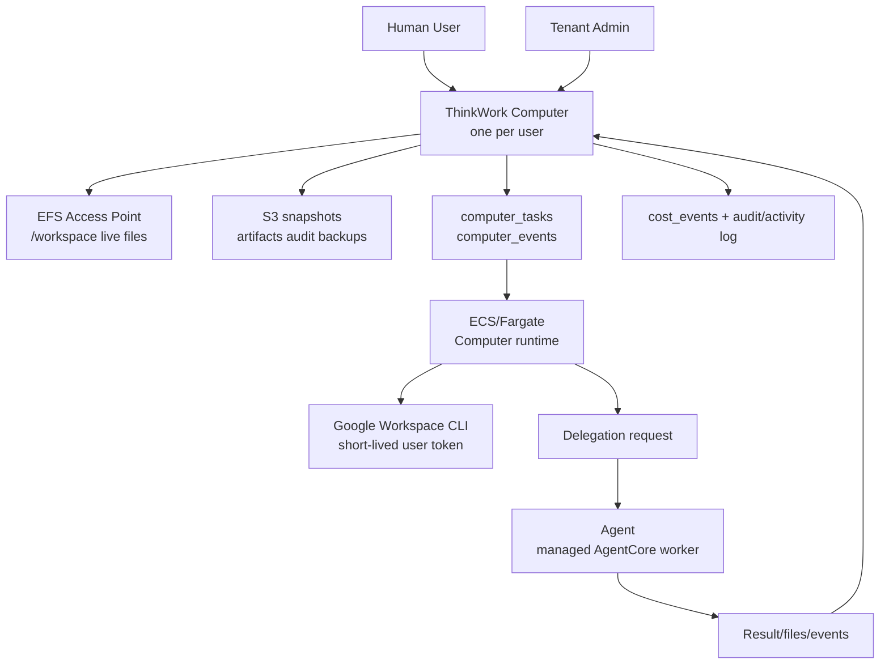
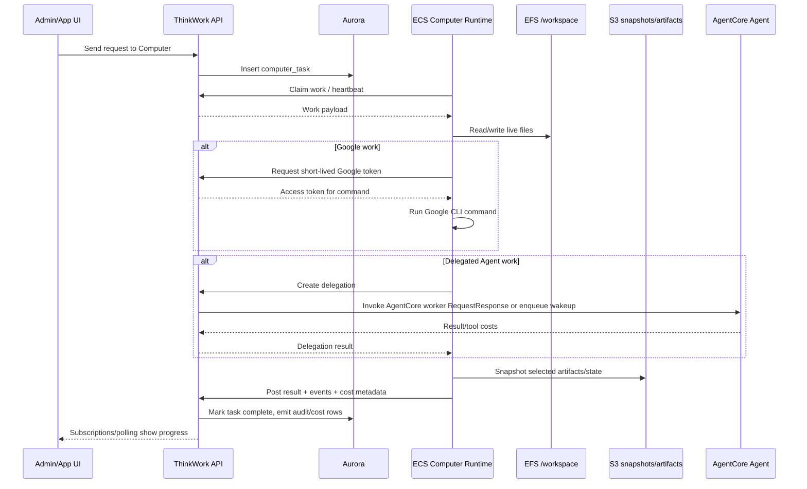

# feat: ThinkWork Computer product reframe and runtime migration

## Overview

Reframe ThinkWork around **Computers** as the primary durable product object. Each human user gets exactly one always-on Computer in v1. The Computer owns user work state, live files, schedules, credentials, orchestration, and delegation. **Agents** remain, but become shared/delegated managed workers that Computers call for bounded tasks.

This plan is a hard product/domain migration, not a nav rename. It introduces first-class Computer data/API contracts, migrates existing user-paired Agents into Computers, provisions an ECS/Fargate + EFS always-on coordinator runtime per Computer, proves personal work orchestration with Google Workspace CLI-backed commands, and updates admin/docs/product language so the system no longer treats user-specific Agents as the primary object.

The first implementation should preserve operational continuity by retaining legacy `agent_id` references where they are history or compatibility anchors, while making `computer_id` the active target for new user-owned work.

---

## Problem Frame

The current `agents` domain is overloaded. In the database, an Agent can be a user-paired personal actor (`agents.human_pair_id`), a runtime invocation target, a template-linked configuration instance, a budget subject, a workspace owner, a schedule target, and a delegated/sub-agent relationship participant. Runtime paths such as `chat-agent-invoke.ts` and `wakeup-processor.ts` dynamically assemble template, skill, connector, workspace, browser, sandbox, guardrail, human, and history context into AgentCore payloads on every invocation. That work is real, but the product noun is wrong.

The origin requirements establish the new product ontology: a Computer is the durable per-user AI workplace; Agents are shared/delegated managed workers; Templates become typed as Computer Templates or Agent Templates; EFS is the live workspace; S3 remains the durable artifact/audit/snapshot layer; Google Workspace personal orchestration is the v1 proof (see origin: `docs/brainstorms/2026-05-06-thinkwork-computer-product-reframe-requirements.md`).

---

## Requirements Trace

- R1. Computers replace user-specific Agents as the primary product model.
- R2. Each human user has exactly one Computer in v1.
- R3. Computers are always-on by default.
- R4. Computers own persistent user work state.
- R5. ThinkWork Computer is positioned as a governed AWS-native workplace.
- R6. Existing user-specific Agents migrate into Computers.
- R7. After migration, Agents mean shared/delegated managed workers.
- R8. Templates remain, but become typed.
- R9. Primary nav changes to Computers.
- R10. Computers delegate bounded work to Agents.
- R11. Delegated results return into the Computer.
- R12. Audit preserves delegation attribution.
- R13. "Managed Agent" remains valid category language in docs/technical comparison.
- R14. v1 proves the Computer with personal work orchestration.
- R15. Google CLI/tooling is part of the v1 proof.
- R16. The Computer has a live filesystem workspace.
- R17. S3 remains durability and audit infrastructure, not the primary live workspace.
- R18. Streaming and lower latency are architectural upsides, not v1 acceptance gates.
- R19. The Computer cost target is acceptable below roughly `$10/month/user` before variable storage/network effects.
- R20. Per-user credentials remain user-owned.
- R21. Governance applies to Computers and Agents.

**Origin actors:** A1 human user, A2 tenant admin/operator, A3 Computer runtime, A4 Agent, A5 planner/implementer.
**Origin flows:** F1 User gets a Computer, F2 Existing user-specific Agents migrate into Computers, F3 Computer delegates work to an Agent, F4 Computer performs personal work orchestration.
**Origin acceptance examples:** AE1 primary Computer surface, AE2 Agent-to-Computer migration, AE3 delegated Agent writeback, AE4 Google Workspace + live files, AE5 success without streaming guarantee.

---

## Scope Boundaries

### Deferred for later

- Multiple Computers per user.
- Shared/team-owned Computers.
- Rich remote desktop or full browser session UI for the Computer.
- Sleep/wake scheduling as a default product behavior.
- Streaming/first-token latency guarantees.
- A marketplace-style Agent catalog.
- Advanced Agent specialization, marketplace packaging, or customer-uploaded Agent runtimes.
- Deep migration cleanup that removes every legacy Agent-named internal table/API in the first implementation pass, if planning determines a compatibility layer is safer.

### Outside this product's identity

- ThinkWork Computer is not generic VM hosting.
- ThinkWork Computer is not a cloud desktop replacement for humans.
- ThinkWork Computer is not "browser automation with a nicer name."
- ThinkWork Computer is not a replacement for AgentCore managed execution; it coordinates and delegates to managed Agents.
- ThinkWork Computer is not a consumer personal assistant detached from tenant governance, audit, budgets, and AWS ownership.

### Deferred to Follow-Up Work

- Full removal or renaming of every `agent_*` database table and generated GraphQL field: v1 introduces Computers as the active model while preserving historical compatibility where replacement would make the rollout unsafe.
- Public marketing relaunch: update docs/product copy in this plan, but a broader homepage campaign can ship separately.
- ECS capacity-provider/EC2 pricing lane: v1 uses Fargate ARM for operational simplicity; EC2 capacity providers remain a later cost optimization.
- Direct inbound HTTP routing to each Computer task: v1 uses an API-mediated work queue and outbound Computer polling/heartbeats. Direct private routing can follow if streaming/live interaction becomes a product requirement.

---

## Context & Research

### Relevant Code and Patterns

- `packages/database-pg/src/schema/agents.ts` already distinguishes user-paired personal Agents through `human_pair_id`, template linkage through `template_id`, runtime selection through `runtime`, and budget status through `budget_paused`.
- `packages/database-pg/src/schema/agent-templates.ts` is the existing configuration/security boundary for model, guardrail, runtime, built-in tool opt-ins, skills, knowledge bases, and blocked tools. This should become the typed Template substrate rather than being discarded.
- `packages/api/src/graphql/resolvers/templates/createAgentFromTemplate.mutation.ts` creates an Agent from a template, installs skills/knowledge/MCP rows, provisions email capability, and bootstraps S3 workspace. Computer creation should reuse the "template materializes defaults" shape but target a Computer.
- `packages/api/src/graphql/resolvers/templates/syncTemplateToAgent.mutation.ts` snapshots before sync, preserves per-agent permission narrowing, replaces template-owned resources, overlays workspace, and regenerates manifests. Template sync for Computers should mirror this safety posture.
- `packages/api/src/handlers/chat-agent-invoke.ts` and `packages/api/src/handlers/wakeup-processor.ts` are the main invocation paths and use `RequestResponse` when invoking AgentCore. Computer delegation should keep this surfaced-error behavior.
- `packages/database-pg/src/schema/heartbeats.ts` defines `agent_wakeup_requests`, the current queue for agent invocations. v1 should introduce a Computer queue rather than forcing Computer work through `agent_id`.
- `packages/database-pg/src/schema/agent-workspace-events.ts` already models workspace run/event/wait records with status, parent runs, and durable events. Computer delegation can reuse the event vocabulary ideas while adding `computer_id` as the active owner.
- `packages/api/src/lib/workspace-bootstrap.ts` and `workspace-copy.ts` establish the current S3 prefix model: template/defaults copy into `tenants/{tenantSlug}/agents/{agentSlug}/workspace/`, and manifest regeneration follows writes.
- `terraform/modules/app/hindsight-memory/main.tf` is the repo's existing ECS/Fargate pattern: ECS cluster, roles, security groups, CloudWatch logs, task definition, service, ARM64 runtime platform, and optional ALB. Computers should follow the ECS role/log/service conventions but avoid one ALB per Computer.
- `apps/admin/src/components/Sidebar.tsx` owns the primary navigation groups. Today the Work group includes Agents; v1 should put Computers there and move Agents to the delegated-worker/config area.
- `docs/src/content/docs/concepts/agents.mdx` and `docs/src/content/docs/architecture.mdx` currently define Agents as the execution layer and primary concept. These docs must be rewritten around Computers owning work and Agents performing delegated work.

### Institutional Learnings

- `docs/brainstorms/2026-04-21-bundled-cli-skills-gogcli-google-workspace-requirements.md` already frames Google Workspace CLI tooling as the way to expand beyond hand-written Gmail/Calendar skills, with typed wrappers, non-interactive auth, command allowlists, and no raw shell exposure.
- `docs/plans/2026-04-27-003-refactor-materialize-at-write-time-workspace-bootstrap-plan.md` moved runtime workspace behavior toward materialized prefixes and simpler bootstrapping. Computers should not resurrect read-time S3 overlay composition as the live workspace.
- `docs/solutions/best-practices/service-endpoint-vs-widening-resolvecaller-auth-2026-04-21.md` says service callers should use narrow REST endpoints instead of widening resolver auth. The Computer runtime should call service-auth REST endpoints for heartbeats, work claiming, delegation, token hydration, and snapshots.
- `docs/solutions/workflow-issues/agentcore-runtime-no-auto-repull-requires-explicit-update-2026-04-24.md` means Computer image rollout must explicitly update ECS services and should not assume mutable tags refresh running tasks.
- `docs/solutions/build-errors/multi-arch-image-lambda-vs-agentcore-split-tags-2026-04-24.md` warns against mixed architecture/image assumptions. Computer Fargate tasks should use an ARM64-specific image tag and not reuse Lambda image tags.
- `docs/solutions/workflow-issues/manually-applied-drizzle-migrations-drift-from-dev-2026-04-21.md` applies to any hand-rolled migration with partial indexes, CHECKs, or FK ordering. Computer migration SQL must include drift markers when generated SQL is insufficient.
- AGENTS.md requires AWS-only architecture, enterprise scale (4 enterprises × 100+ agents × ~5 templates), per-user OAuth on mobile/client side, and no fire-and-forget user-initiated Lambda invokes.

### External References

- AWS Fargate pricing confirms Linux/ARM billing in US East is based on requested CPU and memory per second; the current example shows `$0.0000089944` per vCPU-second and `$0.0000009889` per GB-second for Linux/ARM. At 730 hours, a `0.25 vCPU / 0.5 GB` always-on task is roughly `$7.21/month`, and `0.25 vCPU / 1 GB` is roughly `$8.51/month`, before storage/log/network charges. Source: [AWS Fargate Pricing](https://aws.amazon.com/fargate/pricing/).
- Fargate includes 20 GB default ephemeral storage and bills extra storage only above that default; the same pricing page calls out additional charges for CloudWatch Logs, data transfer, and public IPv4 addresses. Source: [AWS Fargate Pricing](https://aws.amazon.com/fargate/pricing/).
- Amazon EFS pricing is usage-based with no setup charge; users pay for storage and read/write/tiering activity. EFS Standard has a 5 GB/month free tier for the first 12 months, and cross-AZ EFS access can incur EC2 data-transfer charges. Source: [Amazon EFS Pricing](https://aws.amazon.com/efs/pricing/).
- Amazon ECS Service Connect provides service discovery and a service-mesh-like service-to-service communication layer, but v1 should avoid per-Computer inbound routing unless needed. Source: [Amazon ECS Service Connect docs](https://docs.aws.amazon.com/AmazonECS/latest/developerguide/service-connect.html).
- ECS Exec can run commands remotely inside a task and is useful for operator debugging, but it should not be the user-facing Computer command path. Source: [AWS CLI ecs execute-command reference](https://docs.aws.amazon.com/cli/latest/reference/ecs/execute-command.html).
- ECS quotas currently list 5,000 services per cluster, which is enough for the repo's stated 400+ Computer enterprise scale, but Fargate On-Demand vCPU resource count defaults to 6 vCPUs per supported Region and is adjustable. At `0.25 vCPU` per Computer, 400 always-on Computers need roughly 100 concurrent Fargate vCPUs, so quota requests/checks are a launch gate. Source: [Amazon ECS endpoints and quotas](https://docs.aws.amazon.com/general/latest/gr/ecs-service.html).
- The current Google Workspace CLI project (`gws`) is built for humans and AI agents, covers Drive/Gmail/Calendar and Workspace APIs, emits structured JSON, and supports a pre-obtained access token through `GOOGLE_WORKSPACE_CLI_TOKEN`. It also says it is not an officially supported Google product and is pre-v1/breaking-change prone. Source: [googleworkspace/cli](https://github.com/googleworkspace/cli).
- `gog`/gogcli remains a viable fallback with JSON output, `--no-input`, command allow/deny env vars, Gmail no-send safety, and broad Google Workspace coverage. Source: [gogcli spec](https://gogcli.sh/spec.html).

---

## Key Technical Decisions

- **Create first-class `computers` instead of renaming `agents` in place.** The product cutover is hard, but a direct table rename would force every historical `agent_id` FK, thread, cost row, workspace event, and generated client to move at once. v1 adds `computers` as the active owner and preserves old Agent references for history/compatibility.
- **Use `template_kind` on `agent_templates` rather than a separate template table in v1.** Existing template infrastructure is valuable and already owns security/capability posture. Add `template_kind = 'computer' | 'agent'`, then rename the UI/docs to "Templates" with Computer/Agent filters.
- **Treat `agents.human_pair_id IS NOT NULL` as migration input, not a permanent product state.** The migration creates one Computer per user from user-paired Agents, then Agents are reclassified as delegated/shared workers and should not retain human-pair ownership.
- **Use `computer_id` for new active work while retaining `agent_id` for delegated workers and historic rows.** New Computer queues, tasks, snapshots, cost metadata, and UI should use `computer_id`; delegated AgentCore work should keep `agent_id` and attach `computer_id` for owner attribution.
- **Use one ECS Fargate service per Computer with desired count 1.** A service gives restart-on-failure and lifecycle control. The plan avoids one ALB/public endpoint per Computer and uses API-mediated work claiming to keep marginal cost close to the Fargate task + EFS usage.
- **Use a shared EFS filesystem with one access point per Computer.** EFS access points provide per-Computer POSIX root isolation under a shared filesystem, matching the one-Computer-per-user invariant without Terraform managing per-user resources directly.
- **Computer runtime communicates outbound to ThinkWork API.** The coordinator polls/long-polls for work, posts heartbeats/events/results, requests short-lived credential hydration, and snapshots files. This avoids an inbound routing layer in v1 and keeps "streaming" a future optimization.
- **EFS is live; S3 is snapshot/artifact/audit.** The coordinator mounts EFS at `/workspace`, uses it for CLI/browser/cache/live files, and snapshots selected state to S3 for UI reads, durable artifacts, event triggers, backup, and audit.
- **Use narrow service-auth REST endpoints for Computer runtime callbacks.** Do not widen GraphQL resolver auth so a container can impersonate a user. Follow the service endpoint pattern for `/api/computers/runtime/*`.
- **Prefer `googleworkspace/cli` for the Computer Google proof if the token-based smoke passes; keep `gog` as fallback.** `gws` has strong agent-oriented JSON/token behavior but is pre-v1. `gog` has richer command safety flags and prior ThinkWork brainstorm context. U8 makes the binary selection observable and pins the chosen release.
- **Keep user credentials short-lived and user-owned.** The Computer runtime asks the API to mint or inject a short-lived access token for a single command; it does not persist refresh tokens into EFS.
- **Do not promise streaming latency in v1.** The runtime shape should not block future streaming, but success is persistence, governance, Google work orchestration, live files, and basic delegation.

---

## Open Questions

### Resolved During Planning

- **Computer vs. Agent table shape:** Add first-class `computers`; keep `agents` for delegated workers and compatibility.
- **Template split:** Add `template_kind` to the existing template table in v1; UI/docs call the surface Templates with Computer/Agent filters.
- **ECS routing:** Use outbound polling/heartbeats in v1 instead of per-Computer ALBs or a custom EC2 gateway.
- **Live workspace store:** Use EFS for live state and S3 for snapshots/artifacts/audit.
- **Cost lane:** Low-profile Fargate ARM is viable for the order-of-magnitude target; networking/log/storage are the risk drivers.
- **Google CLI binary:** Prefer `gws` if U8's token-based smoke passes; otherwise use `gog`.

### Deferred to Implementation

- Exact conflict policy for tenants with multiple active user-paired Agents per user: U3 should produce a dry-run report first. The default is deterministic primary selection plus secondary conversion to delegated Agents, but implementation may require a manual override list for real tenant data.
- Exact `computer_id` backfill coverage for old historical rows: U3 should preserve history visibility without rewriting every old audit/cost row if metadata joins are sufficient.
- Final Fargate memory size: start at `0.25 vCPU / 0.5 GB`; bump to `1 GB` if Google CLI/browser cache smoke tests require it.
- Exact Google OAuth scope rollout for Drive/Docs/Sheets: U8 should use existing OAuth plumbing where possible and surface re-consent behavior rather than guessing.
- Whether the admin UI should keep an "Agents" nav item immediately or expose Agents only inside Templates/Computer detail in the first PR. Product target is Computers primary; UI sequencing can choose the least confusing rollout.

---

## Output Structure

```text
packages/
  database-pg/
    graphql/types/computers.graphql
    src/schema/computers.ts
  api/src/
    graphql/resolvers/computers/
    handlers/computer-runtime.ts
    lib/computers/
    lib/google-workspace-cli/
  computer-runtime/
    Dockerfile
    pyproject.toml
    src/thinkwork_computer/
    tests/
  lambda/
    computer-manager.ts
terraform/modules/app/
  computers/
docs/
  src/content/docs/concepts/computers.mdx
  src/content/docs/concepts/agents.mdx
  src/content/docs/concepts/agents/templates.mdx
  runbooks/computer-runtime-runbook.md
```

---

## High-Level Technical Design

> *This illustrates the intended approach and is directional guidance for review, not implementation specification. The implementing agent should treat it as context, not code to reproduce.*





---

## Implementation Units

- U1. **Add Computer and typed Template data model**

**Goal:** Introduce first-class Computer persistence and typed Templates while preserving existing Agent rows for delegated workers and historical compatibility.

**Requirements:** R1, R2, R4, R6, R7, R8, R21; F1, F2; AE1, AE2.

**Dependencies:** None.

**Files:**
- Create: `packages/database-pg/src/schema/computers.ts`
- Modify: `packages/database-pg/src/schema/index.ts`
- Modify: `packages/database-pg/src/schema/agent-templates.ts`
- Modify: `packages/database-pg/src/schema/agents.ts`
- Modify: `packages/database-pg/src/schema/scheduled-jobs.ts`
- Modify: `packages/database-pg/src/schema/heartbeats.ts`
- Modify: `packages/database-pg/src/schema/cost-events.ts`
- Modify: `packages/database-pg/src/schema/agent-workspace-events.ts`
- Create: `packages/database-pg/drizzle/NNNN_thinkwork_computers.sql`
- Test: `packages/database-pg/src/schema/computers.test.ts`

**Approach:**
- Add `computers` with at minimum `tenant_id`, unique `owner_user_id`, `template_id`, `name`, `slug`, `status`, `desired_runtime_status`, `runtime_status`, `runtime_config`, `live_workspace_root`, `efs_access_point_id`, `ecs_service_name`, `last_heartbeat_at`, `last_active_at`, cost/budget fields, `created_by`, timestamps, and migration metadata such as `migrated_from_agent_id`.
- Add Computer-owned work tables in the same schema unit, even if they live in `computers.ts` initially: `computer_tasks`, `computer_events`, `computer_snapshots`, and `computer_delegations`. U6/U7/U9 should build API behavior on these tables rather than overloading `agent_wakeup_requests` with Computer-first work.
- Add `computer_templates` only if implementation proves `template_kind` cannot fit cleanly. The planned default is to add `agent_templates.template_kind` with allowed values `computer` and `agent`.
- Add optional `computer_id` columns to active work and history tables that need owner attribution: `scheduled_jobs`, `thread_turns` if needed, `cost_events`, and `agent_workspace_runs/events`. Keep `agent_wakeup_requests` as legacy/delegated-Agent infrastructure unless implementation proves a compatibility bridge is necessary.
- Keep `agents.human_pair_id` for read compatibility during migration, but add a CHECK or application invariant that new non-system Agents cannot be created as user-paired once the Computer feature flag is live.
- Generated Drizzle output is preferred. If hand-rolled SQL is needed for partial unique indexes such as one Computer per `(tenant_id, owner_user_id)`, include `-- creates:` markers for drift reporting.

**Execution note:** Start with schema/relationship tests and migration dry-run tests before updating resolvers.

**Patterns to follow:**
- `packages/database-pg/src/schema/agents.ts` for tenant indexes and runtime/budget fields.
- `packages/database-pg/src/schema/agent-workspace-events.ts` for status/event tables.
- `packages/database-pg/src/schema/sandbox-invocations.ts` and `sandbox-quota-counters.ts` for feature-specific audit/counter tables.

**Test scenarios:**
- Covers AE1. Happy path: inserting one Computer for a `(tenant_id, owner_user_id)` succeeds and returns a Computer linked to a Computer Template.
- Edge case: inserting a second active Computer for the same `(tenant_id, owner_user_id)` fails.
- Happy path: an Agent Template with `template_kind = 'agent'` remains valid and can still link delegated Agents.
- Error path: a Computer cannot link to an Agent Template if the DB or application invariant requires `template_kind = 'computer'`.
- Integration: `computer_id` FKs in active work tables preserve tenant alignment and do not allow cross-tenant references.
- Migration safety: schema supports existing Agent rows with `human_pair_id` during rollout without breaking reads.

**Verification:**
- Schema exports compile through `@thinkwork/database-pg`.
- Migration applies to an empty DB and a DB with existing user-paired Agents.
- One-Computer-per-user invariant is enforced structurally, not only by UI.

---

- U2. **Add Computer GraphQL/API contracts**

**Goal:** Expose Computers, typed Templates, and delegated Agents through stable GraphQL/API contracts for admin/mobile/CLI consumers.

**Requirements:** R1, R2, R4, R7, R8, R9, R21; F1, F2; AE1, AE2.

**Dependencies:** U1.

**Files:**
- Create: `packages/database-pg/graphql/types/computers.graphql`
- Modify: `packages/database-pg/graphql/types/agent-templates.graphql`
- Modify: `packages/database-pg/graphql/types/agents.graphql`
- Create: `packages/api/src/graphql/resolvers/computers/index.ts`
- Create: `packages/api/src/graphql/resolvers/computers/computers.query.ts`
- Create: `packages/api/src/graphql/resolvers/computers/computer.query.ts`
- Create: `packages/api/src/graphql/resolvers/computers/createComputer.mutation.ts`
- Create: `packages/api/src/graphql/resolvers/computers/updateComputer.mutation.ts`
- Create: `packages/api/src/graphql/resolvers/computers/computerTemplateSyncDiff.query.ts`
- Modify: `packages/api/src/graphql/resolvers/templates/createAgentFromTemplate.mutation.ts`
- Modify: `packages/api/src/graphql/resolvers/templates/index.ts`
- Modify: `packages/api/src/graphql/schema.ts`
- Test: `packages/api/src/graphql/resolvers/computers/computers.query.test.ts`
- Test: `packages/api/src/graphql/resolvers/computers/createComputer.mutation.test.ts`
- Test: `packages/api/src/__tests__/graphql-contract.test.ts`
- Generate: `apps/admin/src/gql/graphql.ts`
- Generate: `apps/admin/src/gql/gql.ts`
- Generate: `apps/mobile/lib/gql/graphql.ts`
- Generate: `apps/cli/src/gql/graphql.ts`

**Approach:**
- Add `Computer`, `ComputerTemplate`, or `Template.kind` fields so clients can query Computers without reading Agents.
- Add Computer mutations for create/update/lifecycle intent, but make tenant member/admin permissions explicit: tenant members can read their own Computer; tenant admins can list and govern all tenant Computers.
- Modify Agent queries so default `agents` returns delegated/shared Agents only after cutover. Provide an explicit include/legacy option only if implementation needs an operator migration view.
- Keep GraphQL naming product-clean even if underlying DB still uses `agent_templates`.
- Use `resolveCallerTenantId(ctx)`/tenant membership helpers for Google-federated callers instead of trusting `ctx.auth.tenantId`.

**Patterns to follow:**
- `packages/api/src/graphql/resolvers/agents/agents.query.ts`
- `packages/api/src/graphql/resolvers/templates/createAgentFromTemplate.mutation.ts`
- `packages/api/src/graphql/resolvers/core/authz.ts`

**Test scenarios:**
- Covers AE1. Happy path: a tenant member queries `myComputer` or equivalent and receives exactly their Computer.
- Happy path: a tenant admin queries `computers(tenantId)` and sees tenant Computers with runtime and cost summary fields.
- Error path: a tenant member cannot query another user's Computer.
- Error path: create Computer refuses when the user already has one.
- Integration: generated GraphQL types include `Computer`, template kind fields, and updated Agent semantics in admin/mobile/CLI consumers.
- Compatibility: existing delegated Agent queries continue to return shared Agents and do not expose migrated Computers as Agents by default.

**Verification:**
- API contract tests pass across GraphQL schema and generated clients.
- Clients have typed access to Computers without importing Agent-specific generated fields for the primary surface.

---

- U3. **Build Agent-to-Computer migration and cutover gates**

**Goal:** Migrate existing user-specific Agents into one Computer per user, reclassify remaining Agents as delegated workers, and provide dry-run/rollback-safe migration reporting.

**Requirements:** R1, R2, R6, R7, R8, R9, R21; F2; AE2.

**Dependencies:** U1, U2.

**Files:**
- Create: `packages/api/src/handlers/migrate-agents-to-computers.ts`
- Create: `packages/api/src/lib/computers/migration.ts`
- Create: `packages/api/src/lib/computers/migration-report.ts`
- Modify: `scripts/build-lambdas.sh`
- Modify: `terraform/modules/app/lambda-api/handlers.tf`
- Test: `packages/api/src/lib/computers/migration.test.ts`
- Test: `packages/api/src/handlers/migrate-agents-to-computers.test.ts`

**Approach:**
- Add a migration handler with dry-run and apply modes.
- Dry-run groups Agents by `(tenant_id, human_pair_id)` and reports: single straightforward migration, multiple candidate Agents for one user, missing templates, duplicate slugs, orphaned schedules, workspace prefix state, and unsupported connected-agent shapes.
- Apply creates one Computer per user. Default primary selection is most recently active non-system user-paired Agent; secondary user-paired Agents are converted to delegated Agents or archived according to explicit report policy.
- Copy durable state into the Computer: template link, runtime config, budget fields, pinned versions where relevant, S3 workspace snapshot pointer, schedules, thread attribution metadata, and migration provenance.
- New writes after cutover should target Computer APIs. Legacy create/update Agent paths should refuse `human_pair_id` unless in migration/admin override mode.
- Preserve rollback by not deleting old Agent rows in the first migration. Mark migrated rows with status/source/type metadata and keep `migrated_from_agent_id` on Computers.

**Patterns to follow:**
- `packages/api/src/handlers/migrate-existing-agents-to-overlay.ts`
- `packages/api/src/handlers/migrate-agents-to-fat.ts`
- `packages/api/src/graphql/resolvers/templates/syncTemplateToAgent.mutation.ts` snapshot-before-mutating posture.

**Test scenarios:**
- Covers AE2. Happy path: one user-paired Agent migrates into one Computer and the Agent is no longer returned as a primary user-owned Agent.
- Edge case: two user-paired Agents for one user produce a deterministic dry-run report before apply.
- Edge case: an Agent without `human_pair_id` is left as a delegated Agent.
- Error path: apply refuses when dry-run detects unresolvable missing template data unless an explicit override is provided.
- Integration: schedules/workspace/cost metadata that referenced the migrated Agent can be reached from the new Computer view.
- Rollback: migration provenance is sufficient to map a Computer back to the source Agent row.

**Verification:**
- Dry-run produces an actionable report for dev/staging data.
- Apply is idempotent: re-running after success does not create duplicate Computers.
- Post-migration, no new user-paired Agents are created through normal APIs.

---

- U4. **Provision ECS/Fargate + EFS Computer substrate**

**Goal:** Add AWS infrastructure for always-on per-user Computer coordinator runtimes: shared ECS cluster, ECR repo, EFS filesystem/access points, task roles, logs, security groups, and a manager Lambda that creates/updates per-Computer services.

**Requirements:** R3, R5, R16, R17, R19, R21; F1; AE5.

**Dependencies:** U1.

**Files:**
- Create: `terraform/modules/app/computers/main.tf`
- Create: `terraform/modules/app/computers/variables.tf`
- Create: `terraform/modules/app/computers/outputs.tf`
- Create: `terraform/modules/app/computers/README.md`
- Modify: `terraform/modules/thinkwork/main.tf`
- Modify: `terraform/modules/app/lambda-api/variables.tf`
- Create: `packages/lambda/computer-manager.ts`
- Modify: `scripts/build-lambdas.sh`
- Test: `packages/lambda/__tests__/computer-manager.test.ts`

**Approach:**
- Create one stage-level ECS cluster or reuse/extract a shared app cluster if implementation can do that safely. If Hindsight still owns `thinkwork-${stage}-cluster`, avoid name collision by using `thinkwork-${stage}-computers` or by extracting a shared cluster in a separate preparatory refactor.
- Create a stage-level EFS filesystem and mount targets/security group. The manager Lambda creates one EFS access point per Computer at runtime.
- Create ECR repo for `thinkwork-${stage}-computer-runtime` and ARM64 task definitions. Default profile: `0.25 vCPU / 0.5 GB`; allow `0.25 / 1 GB` through `compute_profile`.
- The manager Lambda owns per-Computer ECS service lifecycle: create service, update task definition/image tag, force deployment, scale desired count, describe health, delete/deprovision.
- Avoid per-Computer ALB and public inbound port. The service runs without public ingress and communicates outbound to the API. Network choice should minimize marginal per-user cost; fixed NAT/VPC endpoint costs should be accounted separately from per-user task cost.
- Grant narrow IAM: EFS AP operations scoped by tags/name prefix, ECS service/task definition operations scoped to the Computer cluster/families, IAM PassRole only for the Computer task role, CloudWatch logs access for the Computer log group.
- Add a quota/readiness check in the manager or rollout tooling: services-per-cluster, Fargate On-Demand vCPU resource count, task launch rate, ENI/subnet capacity, and EFS access point quota. 400 Computers at the default `0.25 vCPU` profile require about 100 concurrent Fargate vCPUs, so the plan must request/verify quota before broad rollout.

**Patterns to follow:**
- `terraform/modules/app/hindsight-memory/main.tf` for ECS/Fargate task/service/log conventions.
- `terraform/modules/app/agentcore-runtime/main.tf` for ECR and IAM naming conventions.
- `packages/lambda/agentcore-admin.ts` for AWS resource provisioning/reconciliation style.

**Test scenarios:**
- Happy path: manager creates an EFS access point and ECS service for a Computer with desired count 1.
- Happy path: manager updates the Computer service to a new image tag and records the active task definition.
- Error path: manager refuses to create resources for a Computer whose tenant/user is missing or mismatched.
- Error path: ECS service creation failure surfaces to the caller; no fire-and-forget success is returned.
- Integration: Terraform exposes cluster, task role, execution role, EFS, and manager Lambda outputs required by API.
- Cost guard: default task definition uses ARM64 and low-profile CPU/memory.
- Rollout guard: quota check fails closed when requested Computer count exceeds current Fargate vCPU or ECS service capacity.

**Verification:**
- Terraform plan includes the Computer module without colliding with Hindsight ECS resources.
- The manager Lambda can create/update/deprovision a dev Computer service in a deployed stage.
- Per-Computer ECS services have no public ALB or public inbound security-group rule.

---

- U5. **Create Computer coordinator runtime container**

**Goal:** Build the always-on lightweight orchestration image that mounts EFS, polls for Computer work, posts heartbeats/events/results, runs local CLI/file operations, and delegates heavy work to ThinkWork APIs.

**Requirements:** R3, R4, R10, R11, R12, R14, R16, R17, R18, R20, R21; F1, F3, F4; AE3, AE4, AE5.

**Dependencies:** U1, U2, U4.

**Files:**
- Create: `packages/computer-runtime/pyproject.toml`
- Create: `packages/computer-runtime/Dockerfile`
- Create: `packages/computer-runtime/src/thinkwork_computer/main.py`
- Create: `packages/computer-runtime/src/thinkwork_computer/api_client.py`
- Create: `packages/computer-runtime/src/thinkwork_computer/work_loop.py`
- Create: `packages/computer-runtime/src/thinkwork_computer/workspace.py`
- Create: `packages/computer-runtime/src/thinkwork_computer/cli_runner.py`
- Create: `packages/computer-runtime/src/thinkwork_computer/delegation.py`
- Create: `packages/computer-runtime/tests/test_work_loop.py`
- Create: `packages/computer-runtime/tests/test_cli_runner.py`
- Modify: `pyproject.toml`
- Modify: `.github/workflows/deploy.yml`
- Modify: `scripts/post-deploy.sh`

**Approach:**
- Use a small Python runtime because the repo already uses Python/uv for agent runtime work and Python is a good fit for subprocess CLI orchestration and filesystem snapshots.
- The runtime receives environment variables such as `COMPUTER_ID`, `TENANT_ID`, `OWNER_USER_ID`, `THINKWORK_API_URL`, and a service token reference. Snapshot env at process start and do not reread mutable env inside long-running loops.
- Mount EFS access point at `/workspace`. Keep runtime cache/config under `/workspace/.thinkwork/`.
- Run a heartbeat loop and a work-claim loop. Work payloads are claimed via service-auth REST endpoints, not direct DB access.
- Implement bounded command execution with allowlisted command kinds. v1 exposes typed work actions, not arbitrary user shell.
- Report structured events: heartbeat, task claimed, command started, command completed, command failed, delegation started/completed, snapshot written.
- Keep ECS Exec available for operator debugging only; never model it as the product command path.

**Patterns to follow:**
- `packages/agentcore-strands/agent-container` Python package/test structure.
- `docs/solutions/workflow-issues/agentcore-completion-callback-env-shadowing-2026-04-25.md` snapshot pattern.

**Test scenarios:**
- Happy path: runtime starts, posts heartbeat, claims one pending task, executes a no-op file command, posts completion.
- Error path: API claim returns 401/403 and the runtime backs off without dropping local state.
- Error path: command timeout marks the task failed with a bounded error summary.
- Edge case: runtime restarts with pending local cache and resumes heartbeat without duplicating the last completed task.
- Integration: Docker image contains the runtime entrypoint, can write to `/workspace`, and emits CloudWatch-friendly JSON logs.
- Security: arbitrary command strings are refused unless they map to an allowlisted work action.

**Verification:**
- Runtime container passes unit tests and a local container smoke.
- Deployed ECS service posts healthy heartbeat for a dev Computer.
- Restarting the ECS task does not lose `/workspace` state.

---

- U6. **Add Computer runtime API endpoints and work queue**

**Goal:** Add narrow service-auth endpoints and database queues for Computer tasks, events, heartbeats, and results.

**Requirements:** R3, R4, R10, R11, R12, R18, R21; F1, F3, F4; AE3, AE5.

**Dependencies:** U1, U2, U5.

**Files:**
- Create: `packages/api/src/handlers/computer-runtime.ts`
- Create: `packages/api/src/lib/computers/runtime-auth.ts`
- Create: `packages/api/src/lib/computers/task-queue.ts`
- Create: `packages/api/src/lib/computers/events.ts`
- Modify: `terraform/modules/app/lambda-api/handlers.tf`
- Modify: `scripts/build-lambdas.sh`
- Test: `packages/api/src/handlers/computer-runtime.test.ts`
- Test: `packages/api/src/lib/computers/task-queue.test.ts`

**Approach:**
- Add REST endpoints under `/api/computers/runtime/*`: heartbeat, claim task, complete task, fail task, post event, request credential token, request delegation, snapshot complete.
- Authenticate with service bearer plus Computer identity headers. Verify the `computer_id` exists and matches tenant/user state before accepting any event.
- Store task/event state in Computer-specific tables from U1. Claims should be atomic and idempotent.
- User/admin GraphQL mutations enqueue Computer tasks; runtime endpoints claim and complete them.
- AppSync/GraphQL subscriptions can observe task status through existing event fanout patterns, but v1 does not require streaming response chunks.

**Patterns to follow:**
- `packages/api/src/handlers/scheduled-jobs.ts` route/auth handling.
- `packages/api/src/handlers/artifact-deliver.ts` service-secret auth.
- `packages/api/src/lib/idempotency.ts` for idempotent work operations.

**Test scenarios:**
- Happy path: GraphQL mutation enqueues task, runtime claim returns it once, completion stores result and events.
- Edge case: duplicate completion for the same task is idempotent and does not duplicate events.
- Error path: wrong Computer service token or mismatched tenant header returns 403.
- Error path: runtime cannot claim tasks for another Computer.
- Integration: task completion notifies UI-visible state without direct ECS inbound routing.

**Verification:**
- Deployed Computer can claim/complete a no-op task through API Gateway.
- Failed tasks retain enough event detail for admin debugging.

---

- U7. **Implement live EFS workspace with S3 snapshots and artifact bridge**

**Goal:** Make EFS the Computer's live filesystem while preserving S3 for durable snapshots, UI-visible artifacts, audit, and backup.

**Requirements:** R4, R11, R14, R16, R17, R21; F3, F4; AE3, AE4.

**Dependencies:** U4, U5, U6.

**Files:**
- Create: `packages/api/src/lib/computers/snapshots.ts`
- Create: `packages/api/src/graphql/resolvers/computers/computerFiles.query.ts`
- Create: `packages/api/src/graphql/resolvers/computers/createComputerSnapshot.mutation.ts`
- Modify: `packages/api/src/lib/workspace-bootstrap.ts`
- Modify: `packages/api/src/lib/workspace-manifest.ts`
- Modify: `packages/api/workspace-files.ts`
- Test: `packages/api/src/lib/computers/snapshots.test.ts`
- Test: `packages/api/src/graphql/resolvers/computers/computerFiles.query.test.ts`
- Test: `packages/computer-runtime/tests/test_workspace_snapshot.py`

**Approach:**
- On Computer provisioning, seed EFS from the migrated Agent S3 workspace prefix or from the selected Computer Template/defaults.
- The runtime snapshots selected `/workspace` paths to S3 under a Computer prefix such as `tenants/{tenantSlug}/computers/{computerSlug}/snapshots/...` and writes manifest metadata.
- Keep old Agent S3 workspace prefixes readable for migration/historical purposes, but new Computer work reads/writes EFS live.
- API/UI file browsing can read the latest S3 snapshot in v1. Direct EFS browsing through the Computer runtime can be added later if live file browsing becomes required.
- Before delegating to an Agent, the Computer snapshots the relevant workspace subset to S3 so AgentCore workers can receive stable artifact references without mounting EFS.
- After delegated work returns, the Computer writes results into EFS and snapshots durable outputs back to S3.

**Patterns to follow:**
- `packages/api/src/lib/workspace-bootstrap.ts` for seeding defaults/template bytes.
- `packages/api/src/lib/workspace-manifest.ts` for manifest generation.
- `packages/database-pg/src/schema/artifacts.ts` for durable file/artifact references.

**Test scenarios:**
- Covers AE4. Happy path: Computer EFS seed from template/defaults creates expected workspace files.
- Happy path: runtime writes a file to `/workspace`, snapshots it to S3, and GraphQL `computerFiles` exposes it.
- Integration: delegation snapshot creates stable S3 object refs that an AgentCore worker can read.
- Edge case: deleted live file is reflected in the next snapshot manifest rather than resurrected from old S3 state.
- Error path: S3 snapshot failure marks the task/delegation blocked or failed rather than claiming durable output exists.
- Security: Computer A cannot snapshot into or read Computer B's S3 prefix.

**Verification:**
- A dev Computer can persist files across ECS restarts through EFS.
- Latest snapshot is visible in admin UI/API and has tenant/computer-scoped object keys.

---

- U8. **Add Google Workspace CLI orchestration proof**

**Goal:** Prove personal work orchestration through Google email/calendar/docs/files using CLI-backed commands, user-owned OAuth, and Computer workspace artifacts.

**Requirements:** R14, R15, R16, R17, R20, R21; F4; AE4.

**Dependencies:** U5, U6, U7.

**Files:**
- Create: `packages/api/src/lib/google-workspace-cli/token.ts`
- Create: `packages/api/src/lib/google-workspace-cli/commands.ts`
- Modify: `packages/api/src/lib/oauth-token.ts`
- Modify: `packages/computer-runtime/Dockerfile`
- Create: `packages/computer-runtime/src/thinkwork_computer/google_workspace.py`
- Create: `packages/computer-runtime/tests/test_google_workspace.py`
- Create: `packages/api/src/lib/google-workspace-cli/commands.test.ts`
- Modify: `packages/skill-catalog/google-email/` or document retirement if superseded in this workstream
- Modify: `packages/skill-catalog/google-calendar/` or document retirement if superseded in this workstream

**Approach:**
- Implement a Google Workspace command adapter with typed actions for v1: Gmail search/read/draft-or-send according to policy, Calendar list/create/update, Drive list/search/upload/download, Docs create/read/update/export.
- First smoke `gws` with `GOOGLE_WORKSPACE_CLI_TOKEN` using an API-minted fresh access token. If it passes coverage and stability checks, pin `gws`. If it fails or pre-v1 breakage is too high, pin `gog` and use its `--json`, `--no-input`, and allow/deny guard flags.
- Do not persist refresh tokens in EFS. The runtime requests a short-lived access token for each Google command or short task window.
- Output from CLI commands is parsed to structured JSON before it is recorded or handed to delegated Agents. Large file outputs land in `/workspace` and S3 artifacts rather than inline task results.
- Preserve least-privilege posture: read-only by default for Drive/Docs/Sheets; sending/mutation commands require template/policy allowlist.
- If replacing legacy `google-email`/`google-calendar` skills is too wide for this plan's first execution, keep them for delegated Agents and use the new CLI adapter only in the Computer runtime. Document the coexistence and migration boundary.

**Patterns to follow:**
- `packages/api/src/lib/oauth-token.ts` token refresh and provider lookup.
- `docs/brainstorms/2026-04-21-bundled-cli-skills-gogcli-google-workspace-requirements.md` for CLI safety and typed-wrapper requirements.

**Test scenarios:**
- Covers AE4. Happy path: with a mocked access token, a Gmail search command maps to the selected CLI invocation and parses JSON output into a bounded result.
- Happy path: Calendar create writes structured result and audit metadata without logging the access token.
- Happy path: Docs/Drive export writes file bytes to `/workspace` and returns an artifact reference.
- Error path: missing Google connection returns a clear `MissingConnection` task failure.
- Error path: expired/revoked token marks the connection needing re-auth and does not retry forever.
- Security: token value is absent from logs, task results, snapshots, and stderr summaries.
- Integration: one deployed smoke can list Drive files or Calendar events for a consenting dev user through the Computer runtime.

**Verification:**
- CLI binary is pinned by version/checksum in the Computer image.
- At least one deterministic Google Workspace read and one write/draft flow completes in dev.
- Users with existing Google connections are not forced through full re-auth unless expanded scopes require re-consent.

---

- U9. **Implement Computer-to-Agent delegation contract**

**Goal:** Let a Computer delegate bounded work to managed Agents, return results into the Computer workspace/context, and preserve attribution.

**Requirements:** R10, R11, R12, R13, R16, R17, R21; F3; AE3.

**Dependencies:** U1, U2, U6, U7.

**Files:**
- Create: `packages/api/src/lib/computers/delegation.ts`
- Create: `packages/api/src/graphql/resolvers/computers/delegateComputerWork.mutation.ts`
- Modify: `packages/api/src/handlers/wakeup-processor.ts`
- Modify: `packages/api/src/handlers/chat-agent-invoke.ts`
- Modify: `packages/database-pg/src/schema/agent-workspace-events.ts`
- Test: `packages/api/src/lib/computers/delegation.test.ts`
- Test: `packages/api/src/graphql/resolvers/computers/delegateComputerWork.mutation.test.ts`
- Test: `packages/api/src/handlers/wakeup-processor.computer-delegation.test.ts`

**Approach:**
- Add a Computer delegation record with `computer_id`, `agent_id`, `task_id`, status, input artifact refs, output artifact refs, thread/turn refs, and attribution metadata.
- Delegated Agents execute through existing AgentCore invocation paths. For synchronous bounded tasks, use `RequestResponse` and surface errors. For longer tasks, enqueue a wakeup with `source = 'computer_delegation'` and `computer_id` metadata.
- Delegated Agent payloads include only the relevant Computer snapshot/artifacts and task instructions; they do not mount the Computer EFS.
- Results are written back through the Computer runtime/API path: structured result, files/artifacts, and events appear under the Computer.
- Cost events and audit rows include both `computer_id` (owner) and `agent_id` (worker).

**Patterns to follow:**
- `packages/api/src/handlers/chat-agent-invoke.ts` and `wakeup-processor.ts` RequestResponse invocation behavior.
- `packages/database-pg/src/schema/agent-workspace-events.ts` run/event/wait lifecycle.
- `docs/plans/2026-04-25-002-feat-u9-delegate-to-workspace-tool-plan.md` if implementation needs existing delegation context.

**Test scenarios:**
- Covers AE3. Happy path: Computer delegates a task to an Agent; the Agent result is recorded under the Computer and attribution includes the Agent.
- Happy path: delegated task with output files writes artifact refs and snapshots them into the Computer workspace.
- Error path: delegated Agent invocation failure marks the Computer task failed or blocked with visible error metadata.
- Edge case: delegated Agent attempts to write outside the allowed artifact/workspace target and is rejected.
- Integration: cost event rows include `computer_id` metadata and `agent_id` worker attribution.
- Permission: tenant member cannot delegate from a Computer they do not own unless admin policy allows it.

**Verification:**
- A dev Computer can delegate a simple research/no-op task to an existing managed Agent and receive a result back into the Computer detail view.
- Audit/event trail answers "which Computer owned this" and "which Agent did it."

---

- U10. **Update admin UI navigation and product surfaces**

**Goal:** Make Computers the primary user-facing surface, keep Agents as delegated managed workers, and type Templates as Computer/Agent templates.

**Requirements:** R1, R2, R7, R8, R9, R13, R14, R21; F1, F2, F3, F4; AE1, AE2, AE3, AE4.

**Dependencies:** U2, U3, U6, U7, U9.

**Files:**
- Modify: `apps/admin/src/components/Sidebar.tsx`
- Create: `apps/admin/src/routes/_authed/_tenant/computers/index.tsx`
- Create: `apps/admin/src/routes/_authed/_tenant/computers/$computerId.tsx`
- Create: `apps/admin/src/routes/_authed/_tenant/computers/-components/ComputerStatusPanel.tsx`
- Create: `apps/admin/src/routes/_authed/_tenant/computers/-components/ComputerWorkspacePanel.tsx`
- Create: `apps/admin/src/routes/_authed/_tenant/computers/-components/ComputerDelegationsPanel.tsx`
- Modify: `apps/admin/src/routes/_authed/_tenant/agents/index.tsx`
- Modify: `apps/admin/src/routes/_authed/_tenant/agent-templates/index.tsx`
- Modify: `apps/admin/src/lib/graphql-queries.ts`
- Test: `apps/admin/src/routes/_authed/_tenant/computers/-computers.target.test.ts`
- Test: `apps/admin/src/components/Sidebar.test.tsx`

**Approach:**
- Put `Computers` in the primary Work nav where Agents currently sits. Use a computer/monitor icon from lucide.
- Move `Agents` to the configuration/delegation area or keep it visible as a secondary surface for shared managed workers. The UI copy must say Agents are delegated workers, not user-owned primary workplaces.
- Rename `Agent Templates` to `Templates` and add filters/tabs for Computer Templates and Agent Templates.
- Computer list shows one row per user Computer with owner, status/heartbeat, runtime health, last activity, monthly runtime estimate, and delegation count.
- Computer detail includes status/control, live workspace snapshot, Google Workspace proof actions/status, delegations, events, and cost/audit links.
- Avoid a remote-desktop/browser UI in v1; do not add fake terminal affordances unless the backend supports them.

**Patterns to follow:**
- `apps/admin/src/routes/_authed/_tenant/agents/index.tsx`
- `apps/admin/src/routes/_authed/_tenant/agents/$agentId.tsx`
- `apps/admin/src/routes/_authed/_tenant/automations/schedules/index.tsx`
- `apps/admin/src/routes/_authed/_tenant/analytics/cost.tsx`

**Test scenarios:**
- Covers AE1. Happy path: Sidebar shows Computers as primary nav and does not show user-specific Agents as primary work items.
- Covers AE2. Happy path: migrated Computer appears in Computers list with the migrated user's identity and status.
- Happy path: Agents list shows delegated/shared Agents, not migrated Computers.
- Happy path: Templates page filters Computer Templates and Agent Templates.
- Error path: Computer detail handles runtime offline/provisioning/failed states without blank panels.
- Integration: Computer detail displays latest workspace snapshot and delegation attribution.

**Verification:**
- Admin UI can navigate list/detail for Computers using generated GraphQL types.
- Product copy in UI consistently says Computers own work and Agents perform delegated work.

---

- U11. **Apply Computer cost, audit, and governance accounting**

**Goal:** Ensure Computers and delegated Agents remain governed by budgets, audit, tool controls, cost accounting, and tenant boundaries.

**Requirements:** R5, R12, R19, R20, R21; F1, F3, F4; AE3, AE4, AE5.

**Dependencies:** U1, U4, U6, U8, U9.

**Files:**
- Modify: `packages/database-pg/src/schema/cost-events.ts`
- Modify: `packages/api/src/graphql/resolvers/costs/costSummary.query.ts`
- Modify: `packages/api/src/graphql/resolvers/costs/costTimeSeries.query.ts`
- Modify: `packages/api/src/graphql/resolvers/costs/costByAgent.query.ts`
- Create: `packages/api/src/lib/computers/costing.ts`
- Create: `packages/api/src/lib/computers/audit.ts`
- Modify: `packages/api/src/handlers/computer-runtime.ts`
- Modify: `apps/admin/src/routes/_authed/_tenant/analytics/cost.tsx`
- Test: `packages/api/src/lib/computers/costing.test.ts`
- Test: `packages/api/src/graphql/resolvers/costs/computer-costs.test.ts`
- Test: `packages/api/src/lib/computers/audit.test.ts`

**Approach:**
- Add event types such as `computer_runtime`, `computer_storage_estimate`, `computer_cli`, and `computer_delegation` or equivalent metadata under existing `cost_events`.
- Estimate runtime cost from service desired/running intervals and task profile. Store enough metadata to reconcile with AWS Cost Explorer later.
- Preserve existing `agentcore_compute`/`llm` costs for delegated Agents, but attach `computer_id` metadata or column so reports can roll them up to the owning Computer.
- Add budget checks for Computer runtime and delegated Agent usage. If a Computer budget pauses, the Computer should stop accepting new work and optionally scale down only if product policy permits.
- Audit Computer lifecycle changes, runtime events, CLI commands, credential hydration, snapshots, and delegations. Redact command args/outputs where needed.
- Do not log user OAuth access tokens or CLI credential files.

**Patterns to follow:**
- `packages/database-pg/src/schema/cost-events.ts`
- `packages/api/src/handlers/chat-agent-invoke.ts` cost persistence.
- `packages/api/src/lib/hindsight-cost.ts` if a helper-based costing pattern is useful.
- `docs/src/content/docs/concepts/control/budgets-usage-and-audit.mdx` governance model.

**Test scenarios:**
- Covers AE5. Happy path: a running Computer produces a monthly runtime estimate under the Computer.
- Covers AE3. Happy path: delegated Agent LLM/tool costs roll up to both Agent worker and Computer owner views.
- Happy path: Google CLI command cost/event is categorized as Computer tool usage, not generic opaque tool spend.
- Error path: budget-paused Computer refuses new tasks and surfaces visible state.
- Security: audit rows for Google commands omit token values and redact sensitive args.
- Integration: cost summary distinguishes Computer runtime from LLM/AgentCore compute/tools/eval buckets.

**Verification:**
- Cost analytics can answer per-Computer monthly runtime, per-Computer delegated Agent spend, and per-Agent worker spend.
- Audit log reconstructs a Computer task end to end.

---

- U12. **Update docs, product copy, and operator rollout guidance**

**Goal:** Rewrite product/docs language around Computers, Agents as delegated workers, typed Templates, and AWS-governed workplace positioning.

**Requirements:** R1, R5, R7, R8, R9, R13, R14, R17, R18, R21; all origin flows.

**Dependencies:** U1-U11.

**Files:**
- Create: `docs/src/content/docs/concepts/computers.mdx`
- Modify: `docs/src/content/docs/concepts/agents.mdx`
- Modify: `docs/src/content/docs/concepts/agents/managed-agents.mdx`
- Modify: `docs/src/content/docs/concepts/agents/templates.mdx`
- Modify: `docs/src/content/docs/architecture.mdx`
- Modify: `docs/src/content/docs/roadmap.mdx`
- Modify: `apps/www/src/lib/copy.ts`
- Create: `docs/src/content/docs/applications/admin/computers.mdx`
- Create: `docs/runbooks/computer-runtime-runbook.md`
- Test: `docs/src/content/docs/concepts/-computers-copy.test.ts` or existing docs test location if present

**Approach:**
- Define the hierarchy clearly: Computers own work; Agents perform delegated work; Templates configure both.
- Update architecture diagrams so Computers become the durable workplace layer and AgentCore runtimes are delegated managed execution.
- Preserve governed AWS-native positioning: customer AWS account, audit, budget, file control, credential ownership.
- Avoid claiming remote desktop/browser UI, streaming latency, multiple Computers per user, or generic VM hosting.
- Update marketing copy with noun-first, verifiable claims per `apps/www/src/lib/copy.ts` copy guardrails.
- Add operator runbook for provisioning, failed ECS service, EFS snapshot issue, Google token failure, budget pause, and migration rollback.

**Patterns to follow:**
- `docs/src/content/docs/concepts/agents.mdx`
- `docs/src/content/docs/architecture.mdx`
- `apps/www/src/lib/copy.ts` voice constraints.

**Test scenarios:**
- Happy path: docs describe Computers as primary and Agents as delegated workers without contradicting UI labels.
- Error path: docs do not promise rich desktop/browser UI or streaming latency in v1.
- Consistency: roadmap and architecture pages no longer say Agents are the primary durable user-owned work surface.
- Product claim check: every new capability claim maps to a shipped admin/API/runtime surface in this plan.

**Verification:**
- Docs build succeeds.
- A reader can understand the v1 product model without knowing the old Agent ontology.

---

- U13. **Run end-to-end rollout, smoke, and rollback verification**

**Goal:** Prove the full Computer v1 path in a deployed stage before rollout: migration, provisioning, heartbeat, Google work, EFS persistence, S3 snapshot, delegation, cost, audit, and UI.

**Requirements:** R1-R21; F1-F4; AE1-AE5.

**Dependencies:** U1-U12.

**Files:**
- Create: `scripts/smoke/computer-smoke.sh`
- Create: `scripts/smoke/computer-google-smoke.sh`
- Create: `scripts/smoke/computer-delegation-smoke.sh`
- Modify: `scripts/smoke/README.md`
- Create: `docs/runbooks/thinkwork-computer-rollout-checklist.md`
- Test: `packages/api/src/lib/computers/rollout-readiness.test.ts`

**Approach:**
- Add smoke scripts that operate on a dev/staging deployed stack, not local-only behavior.
- Smoke path: dry-run migration, apply for one test user, provision Computer ECS service, confirm heartbeat, write/read EFS file, snapshot to S3, run Google read command with consenting account, delegate no-op/research task to a managed Agent, verify result writeback, verify cost/audit rows, open admin Computer detail.
- Add rollback checklist: stop Computer service, preserve EFS AP/file system, keep migrated source Agent rows, disable Computer nav flag if used, and restore old Agent query surface if necessary.
- Include cost observation: expected low-profile runtime estimate and alerts for logs/network/storage anomalies.
- Include quota observation: current Fargate vCPU quota, current Computer count, expected vCPU consumption, and whether the stage can safely scale to the next rollout batch.

**Patterns to follow:**
- `scripts/smoke/README.md`
- `scripts/smoke/scheduled-smoke.sh`
- `scripts/smoke/CHECKS.md`

**Test scenarios:**
- Covers AE1-AE5. Integration: complete end-to-end smoke passes for a test user in dev/staging.
- Error path: smoke detects Computer ECS service not running or heartbeat stale.
- Error path: smoke detects Google connection missing or token expired and reports re-auth action.
- Error path: smoke detects delegated Agent result not attached to Computer.
- Rollback: checklist can return UI/API to pre-Computer behavior without deleting EFS/S3 evidence.

**Verification:**
- Go/no-go checklist is complete for dev/staging.
- The v1 launch claim is backed by actual deployed evidence, not only unit tests.

---

## System-Wide Impact

- **Interaction graph:** User/app/admin requests target Computers; Computer runtime claims work through service-auth REST; Computer delegates to Agents through existing AgentCore paths; results return to Computer workspace/events; UI observes Computer task/event state.
- **Error propagation:** User/admin-triggered lifecycle operations must use `RequestResponse` or synchronous API responses. Runtime failures become visible Computer task failures. Delegated Agent failures attach to the Computer task and retain Agent attribution.
- **State lifecycle risks:** Migration can create duplicate user ownership if one-user-one-Computer invariant is not structural. ECS services can drift from DB desired state. EFS and S3 snapshots can diverge. U3/U4/U7 address these with unique constraints, manager reconciliation, and explicit snapshot manifests.
- **API surface parity:** GraphQL, REST runtime endpoints, admin UI, CLI generated types, mobile generated types, docs, and smoke scripts all need Computer-aware changes. Existing Agent APIs should either be filtered to delegated workers or explicitly marked legacy/migration-only.
- **Integration coverage:** Unit tests will not prove deployed ECS/EFS/IAM/Google/AgentCore behavior. U13 requires deployed smoke tests.
- **Unchanged invariants:** Per-user OAuth remains user-owned; tenant governance remains server-enforced; AgentCore remains the managed execution substrate for delegated Agents; S3 remains audit/artifact infrastructure; streaming latency is not a v1 contract.

---

## Alternative Approaches Considered

- **Rename Agents to Computers in place:** Rejected because it would force all existing `agent_id` FKs, historical rows, codegen, docs, and runtime paths to move at once. Product cutover can be hard without making data migration unnecessarily brittle.
- **Wrap/relabel existing Agents first:** Rejected by product direction. It would preserve the overloaded Agent ontology too long and undercut the Computer category claim.
- **Parallel Computer beta:** Rejected by product direction. It is technically safer but makes Computers feel optional/advanced rather than primary.
- **One shared ECS service for all Computers:** Rejected for v1 because it weakens the "one persistent Computer" isolation/story and makes per-user EFS/process state more complex. A shared service may become an internal optimization later.
- **Per-Computer ALB or direct inbound routing:** Rejected for v1 because it adds cost/ops and is not required to prove persistence, Google work, files, or delegation.
- **EC2 capacity providers for lower cost:** Deferred. Fargate ARM is simpler and already fits the expected cost lane before variable charges; EC2 capacity providers can follow once runtime behavior stabilizes.

---

## Success Metrics

- 100% of active human users in a migrated tenant have exactly one Computer.
- 0 newly-created normal Agents have `human_pair_id` after cutover.
- A test user can complete the v1 proof flow: Google email/calendar/docs/files, EFS file persistence, S3 snapshot visibility, and Agent delegation result writeback.
- Computer runtime monthly estimate for default profile remains near the expected Fargate lane, with alerts for outlier logs/network/storage.
- Admin UI primary nav and docs consistently present Computers as the durable workplace and Agents as delegated workers.
- Audit/cost can answer: which Computer owned the task, which Agent did delegated work, what files/results were produced, and what it cost.

---

## Risk Analysis & Mitigation

| Risk | Likelihood | Impact | Mitigation |
|------|------------|--------|------------|
| Migration discovers multiple user-paired Agents per user | High | High | U3 dry-run report, deterministic primary selection, manual override path, no source Agent deletion in first rollout |
| Cost exceeds `$10/month/user` due logs/network/storage rather than compute | Medium | Medium | No per-Computer ALB/public ingress, low-profile ARM task, log sampling/retention limits, EFS lifecycle/snapshot policy, explicit cost events |
| Fargate quota blocks broad always-on rollout | Medium | High | U4 quota/readiness check, request Fargate On-Demand vCPU increases before tenant-wide rollout, phase batches by available quota |
| Google CLI selected for v1 is unstable or lacks required non-interactive behavior | Medium | Medium | U8 smoke gate, prefer `gws` only if token flow passes, keep `gog` fallback with prior requirements context |
| EFS live state and S3 snapshots diverge | Medium | High | Snapshot manifests, explicit snapshot states/events, UI reads latest completed snapshot only, failure states visible |
| Agent/Computer naming confuses users during migration | Medium | Medium | U10 UI hierarchy and U12 docs: "Computers own work; Agents perform delegated work" everywhere |
| Runtime service drift from DB desired state | Medium | Medium | Computer manager reconciliation, heartbeat stale detection, smoke checks |
| Credential leakage through CLI logs or workspace files | Medium | High | Short-lived access tokens, no refresh tokens in EFS, stderr/args redaction, tests asserting token absence |
| Existing schedules/webhooks still target Agents after cutover | Medium | High | U1/U3 add `computer_id` ownership and migration report; U6/U9 route new work through Computer queue |
| Large scope delays visible product value | Medium | Medium | Phase delivery: land ontology/API/migration first, then runtime/proof slice, then docs/admin polish |

---

## Phased Delivery

### Phase 1 — Ontology And Contracts

- U1. Add Computer and typed Template data model.
- U2. Add Computer GraphQL/API contracts.
- U3. Build Agent-to-Computer migration and cutover gates.

### Phase 2 — Runtime Substrate

- U4. Provision ECS/Fargate + EFS Computer substrate.
- U5. Create Computer coordinator runtime container.
- U6. Add Computer runtime API endpoints and work queue.
- U7. Implement live EFS workspace with S3 snapshots and artifact bridge.

### Phase 3 — Product Proof

- U8. Add Google Workspace CLI orchestration proof.
- U9. Implement Computer-to-Agent delegation contract.
- U10. Update admin UI navigation and product surfaces.

### Phase 4 — Governance, Docs, Launch Evidence

- U11. Apply Computer cost, audit, and governance accounting.
- U12. Update docs, product copy, and operator rollout guidance.
- U13. Run end-to-end rollout, smoke, and rollback verification.

---

## Documentation / Operational Notes

- Update docs before broad rollout so operators do not see a UI vocabulary that conflicts with docs vocabulary.
- Keep a migration runbook and dry-run report artifact for every deployed stage.
- Treat EFS retention and S3 snapshot retention as separate policies: live workspace cleanup is not the same as audit retention.
- Add CloudWatch alarms or admin warnings for stale heartbeat, failed ECS deployment, snapshot failures, Google auth failures, and budget-paused Computers.
- Computer image rollout must force ECS service deployment; mutable image tags alone are not sufficient proof that Computers are running the new code.

---

## Sources & References

- Origin document: `docs/brainstorms/2026-05-06-thinkwork-computer-product-reframe-requirements.md`
- Related brainstorm: `docs/brainstorms/2026-04-21-bundled-cli-skills-gogcli-google-workspace-requirements.md`
- Related plan: `docs/plans/2026-04-27-003-refactor-materialize-at-write-time-workspace-bootstrap-plan.md`
- Relevant docs: `docs/src/content/docs/concepts/agents.mdx`, `docs/src/content/docs/architecture.mdx`
- Relevant code: `packages/database-pg/src/schema/agents.ts`, `packages/database-pg/src/schema/agent-templates.ts`, `packages/api/src/handlers/chat-agent-invoke.ts`, `packages/api/src/handlers/wakeup-processor.ts`, `terraform/modules/app/hindsight-memory/main.tf`
- External docs: [AWS Fargate Pricing](https://aws.amazon.com/fargate/pricing/), [Amazon EFS Pricing](https://aws.amazon.com/efs/pricing/), [Amazon ECS endpoints and quotas](https://docs.aws.amazon.com/general/latest/gr/ecs-service.html), [Amazon ECS Service Connect](https://docs.aws.amazon.com/AmazonECS/latest/developerguide/service-connect.html), [AWS ECS Execute Command](https://docs.aws.amazon.com/cli/latest/reference/ecs/execute-command.html), [googleworkspace/cli](https://github.com/googleworkspace/cli), [gogcli spec](https://gogcli.sh/spec.html)
