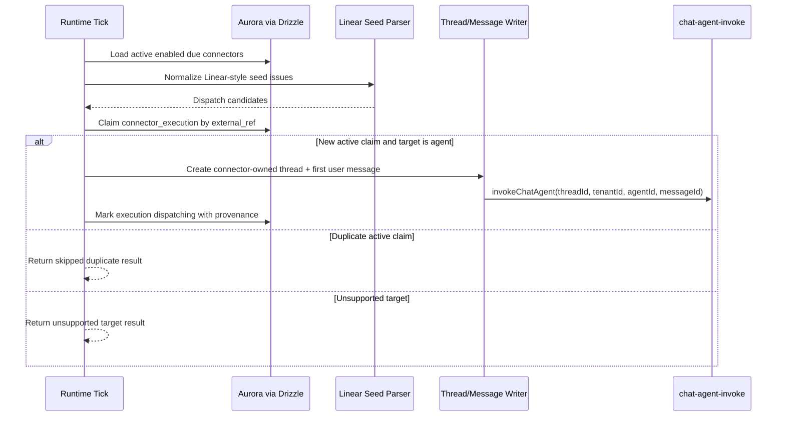

# Connector Runtime Skeleton

## Overview

Add the first connector runtime chassis slice behind the merged Symphony admin
page. This PR should make a configured Linear-style connector capable of
claiming a deterministic seed issue, creating a `connector_executions` row, and
dispatching an agent-targeted thread through the existing `chat-agent-invoke`
path. It remains a library-level runtime skeleton: no EventBridge schedule,
polling Lambda, Linear API client, OAuth, callback loop, or Step Functions
chassis deployment lands here.

---

## Problem Frame

The connector data model, GraphQL API, and thin admin surface are merged, but the
rows are still inert. The first checkpoint needs a narrow proof that the data
model can drive real Thinkwork work: Symphony appears in the dashboard, an admin
configures a Linear-like connector, and a deterministic task can be converted
into a thread/message that reaches the existing agent invocation harness. This
PR proves that internal handoff without committing to the full tracker poller or
external Linear contract yet.

---

## Requirements Trace

- R1. Select only active, enabled, due connector rows for runtime consideration.
- R2. Normalize a minimal Linear-style issue seed from connector config into a
  stable dispatch candidate with an external reference, title, body, and
  metadata.
- R3. Create `connector_executions` idempotently per connector/external ref so
  duplicate ticks do not launch duplicate active work.
- R4. For agent-targeted connectors, create a connector-owned thread and first
  user message, then invoke the same chat-agent Lambda path used by normal
  thread creation.
- R5. Keep this PR intentionally non-deployed: no scheduler, poll Lambda,
  external Linear API, OAuth, Step Functions, routine dispatch, or callback
  finalization.

---

## Scope Boundaries

- No real Linear API calls, webhook signature validation, or OAuth token use.
- No EventBridge Scheduler, Terraform, new Lambda bundle, or background worker.
- No Step Functions per-execution chassis or spend/kill enforcement.
- No routine or hybrid routine dispatch beyond returning an explicit unsupported
  result for those target types.
- No UI changes; the previously merged Symphony admin page remains the setup
  surface.

### Deferred to Follow-Up Work

- Deployed poll handler and EventBridge schedule wiring: next connector chassis
  PR.
- Real Linear adapter and cursor/pagination behavior: Linear connector PR.
- Routine and hybrid routine execution through the universal chassis: later
  chassis PR.
- Callback/result reconciliation and terminal state transitions: callback PR.

---

## Context & Research

### Relevant Code and Patterns

- `packages/database-pg/src/schema/connectors.ts` defines connector lifecycle,
  target, cadence, and config fields.
- `packages/database-pg/src/schema/connector-executions.ts` defines execution
  state and the partial active `(connector_id, external_ref)` uniqueness rule.
- `packages/api/src/graphql/resolvers/threads/createThread.mutation.ts` shows
  the atomic thread + first message + `invokeChatAgent` pattern this PR should
  mirror at library level.
- `packages/api/src/graphql/utils.ts` provides `invokeChatAgent`, `db`, Drizzle
  helpers, and shared schema exports already used by resolver-side dispatch.
- `packages/api/src/handlers/webhooks/task-event.ts` shows the style for small
  focused runtime helpers with dependency-light tests.

### Institutional Learnings

- `docs/plans/2026-05-06-001-feat-connector-admin-mutations-plan.md` explicitly
  deferred connector chassis work, Linear adapter behavior, and Flue invocation
  from the admin mutation PR.
- `docs/plans/2026-05-06-003-feat-symphony-target-pickers-plan.md` introduced a
  Linear starter config affordance but kept runtime dispatch out of scope.
- `docs/residual-review-findings/feat-flue-auto-retain.md` highlights the
  importance of preserving tenant/thread provenance when invoking Flue-backed
  agent work.

### External References

- None. Local patterns and the already-agreed roadmap provide enough guidance
  for this bounded skeleton.

---

## Key Technical Decisions

- Runtime as a library, not a deployed handler: this proves the data and handoff
  path while leaving scheduler, IAM, Terraform, and real Linear API work to the
  next PR.
- Deterministic Linear-style seeds: use explicit issue seed data from connector
  config or direct test input so this PR can be fully unit-tested without
  network access.
- Dispatch through existing chat-agent path: create the thread and first message
  with connector provenance, then call `invokeChatAgent` so Flue/Strands routing
  remains owned by the existing agent runtime resolver.
- Idempotency at execution-row creation: treat an existing active
  connector/external-ref row as an already-claimed candidate rather than
  dispatching again.
- Explicit unsupported target result for `routine` and `hybrid_routine`: those
  targets are valid configuration but not runnable until the universal chassis
  PR lands.

---

## Open Questions

### Resolved During Planning

- Should this PR add Terraform or a Lambda entrypoint? No. The checkpoint needs
  the runtime handoff primitive first; deploying a poller would pull in IAM,
  scheduling, and operational rollback concerns too early.
- Should the skeleton call Linear? No. The admin page already supplies a starter
  JSON shape, and deterministic seed issues are enough to prove execution-row
  and Flue-harness handoff behavior.

### Deferred to Implementation

- Exact config field names accepted by the seed parser: implementation should
  support the merged starter shape and a small compatibility surface if tests
  reveal the helper name differs.
- Whether to reuse GraphQL `createThread` logic directly or extract a shared
  helper: implementation should choose the lowest-risk path after inspecting
  type constraints and testability.

---

## High-Level Technical Design

> _This illustrates the intended approach and is directional guidance for review, not implementation specification. The implementing agent should treat it as context, not code to reproduce._

---

## Implementation Units

- U1. **Runtime Module Shape**

**Goal:** Create a connector runtime module with clear types, dependency
injection, and no deployed entrypoint.

**Requirements:** R1, R5

**Dependencies:** None

**Files:**

- Create: `packages/api/src/lib/connectors/runtime.ts`
- Test: `packages/api/src/lib/connectors/runtime.test.ts`

**Approach:**

- Define a `ConnectorRuntimeDeps` interface that accepts a Drizzle-like DB,
  current time, and optional agent dispatch function.
- Define result types for `dispatched`, `duplicate`, `unsupported_target`,
  `skipped`, and `failed` outcomes.
- Keep exported functions usable by a future Lambda handler without importing
  AWS SDK clients directly.

**Patterns to follow:** `packages/api/src/handlers/webhooks/task-event.ts` for a
small testable runtime helper; `packages/api/src/lib/wiki/enqueue.ts` for
dependency-light side-effect boundaries.

**Test scenarios:**

- Runtime helper accepts injected dependencies and does not read environment
  variables or instantiate AWS clients.
- Unsupported or empty connector config returns a skipped/empty result without
  throwing.

**Verification:** Focused Vitest coverage proves the helper can run without
network, Terraform, or Lambda configuration.

- U2. **Due Connector Selection**

**Goal:** Select active connector rows that are enabled and due for a tick.

**Requirements:** R1

**Dependencies:** U1

**Files:**

- Modify: `packages/api/src/lib/connectors/runtime.ts`
- Test: `packages/api/src/lib/connectors/runtime.test.ts`

**Approach:**

- Query `connectors` where `status = 'active'`, `enabled = true`, and
  `next_poll_at` is null or less than/equal to the injected current time.
- Allow optional tenant/connector filters so the future poller and tests can
  drive narrow ticks.
- Keep tenant scoping explicit on every query path.

**Patterns to follow:** Connector read resolvers in
`packages/api/src/graphql/resolvers/connectors/query.ts` for tenant-scoped
filters and result limits.

**Test scenarios:**

- Active enabled due connector is selected.
- Paused, archived, disabled, or future `next_poll_at` connectors are ignored.
- Optional tenant and connector filters are included in the selection criteria.

**Verification:** Tests assert query criteria through existing mock-chain style
or equivalent focused mocks.

- U3. **Linear Seed Candidate Normalization**

**Goal:** Convert minimal Linear-style seed issues into dispatch candidates.

**Requirements:** R2, R5

**Dependencies:** U1

**Files:**

- Modify: `packages/api/src/lib/connectors/runtime.ts`
- Test: `packages/api/src/lib/connectors/runtime.test.ts`

**Approach:**

- Support `linear_tracker` connectors with config-provided seed issues matching
  the admin starter config direction.
- Require a stable external ref from issue id or identifier.
- Produce a prompt body containing issue title, description, URL, labels, and
  connector metadata when present.
- Skip malformed seed entries with structured reasons rather than throwing the
  whole tick.

**Patterns to follow:** JSON config parsing in connector mutations and the
starter config behavior from the Symphony admin page.

**Test scenarios:**

- Valid seed issue with id/identifier/title becomes one dispatch candidate.
- Missing external reference is skipped with a reason.
- Unknown connector type produces no candidates and no dispatch attempt.
- Candidate metadata preserves connector id/type and Linear issue fields needed
  for later callback reconciliation.

**Verification:** Pure tests cover candidate normalization without database
setup.

- U4. **Execution Claim and Agent Dispatch**

**Goal:** Claim new execution rows idempotently and dispatch agent-targeted
claims into the existing thread/message/chat-agent path.

**Requirements:** R3, R4, R5

**Dependencies:** U1, U2, U3

**Files:**

- Modify: `packages/api/src/lib/connectors/runtime.ts`
- Test: `packages/api/src/lib/connectors/runtime.test.ts`

**Approach:**

- Insert a `connector_executions` row in `pending` state for each candidate,
  relying on the existing partial active unique constraint to reject duplicates.
- For duplicate active claims, return a duplicate result and do not call the
  dispatch function.
- For `dispatch_target_type = 'agent'`, create a connector-owned thread and
  first user message with metadata linking connector id, execution id, and
  external ref, then call the injected/default `invokeChatAgent` boundary.
- Mark successfully handed-off executions as `dispatching` with `started_at`.
- For non-agent targets, leave the claim pending and return
  `unsupported_target` until the routine chassis exists.

**Patterns to follow:** `packages/api/src/graphql/resolvers/threads/createThread.mutation.ts`
for atomic thread/message creation and `packages/api/src/graphql/utils.ts` for
chat-agent Lambda invocation.

**Test scenarios:**

- New agent candidate creates one execution, one connector-owned thread, one
  first user message, and one chat-agent invoke payload.
- Duplicate active external ref does not create a thread or invoke the agent.
- Unsupported routine/hybrid target creates or identifies the execution but does
  not invoke the agent.
- Dispatch failure records a failed result without losing the execution id.
- Thread/message metadata includes tenant id, connector id, execution id,
  connector type, and external ref for provenance.

**Verification:** Focused tests prove the dispatch handoff contract and
idempotency behavior.

- U5. **Exports and Verification**

**Goal:** Expose the runtime helper for future handlers and verify the package.

**Requirements:** R1, R2, R3, R4, R5

**Dependencies:** U1, U2, U3, U4

**Files:**

- Modify: `packages/api/src/lib/connectors/runtime.ts`
- Test: `packages/api/src/lib/connectors/runtime.test.ts`

**Approach:**

- Export only the runtime types/functions future connector handlers need.
- Avoid changing GraphQL SDL, generated types, Terraform, or Lambda build
  scripts.
- Keep browser testing as a no-route verification note because this PR is
  backend-only.

**Patterns to follow:** Existing API package test and typecheck workflow.

**Test scenarios:**

- End-to-end unit tick over mixed connectors reports dispatched, duplicate,
  skipped, and unsupported outcomes in deterministic order.

**Verification:** Run focused API tests for the new runtime module, API
typecheck, and repo formatting checks where feasible.

---

## System-Wide Impact

- Admin users get no new UI in this PR, but existing Symphony connector rows
  become meaningful inputs to a testable runtime primitive.
- Future connector PRs gain a reusable library boundary for deployed pollers.
- Operators are not exposed to new schedules, Lambdas, or IAM permissions until
  a separate deployment-focused PR.

---

## Risks

- Thread creation duplicates existing GraphQL resolver behavior. Keep the helper
  small and consider extraction only if implementation shows meaningful reuse
  without increasing risk.
- Partial writes can occur if dispatch fails after execution creation. The
  result should surface that failure clearly so the future poller can retry or
  mark unhealthy.
- Seed config is not a real Linear adapter. PR copy should make clear this is a
  deterministic harness for the checkpoint, not external Linear integration.
