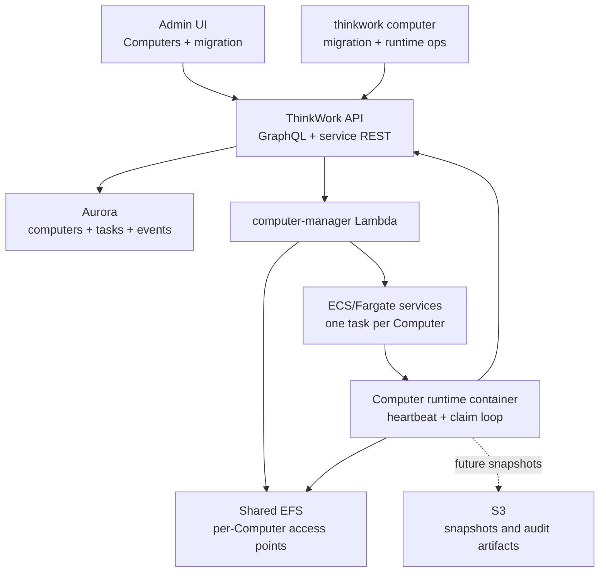
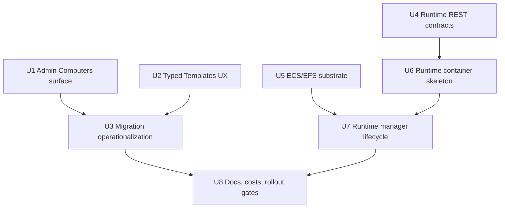

# feat: ThinkWork Computer phase two product surface and runtime skeleton

## Overview

Phase 1 created the durable Computer data model, typed Templates, GraphQL contracts, and dry-run/apply migration foundation. Phase 2 turns that foundation into an operable bridge toward the real ThinkWork Computer experience:

- A primary admin product surface under `Computers`, with one Computer per user visible as the durable workplace.
- Typed Template UX, so Computer Templates and Agent Templates stop feeling like the same object with different marketing.
- Migration operationalization, so operators can dry-run, inspect blockers, apply, and audit the Agent-to-Computer cutover without calling an internal Lambda by hand.
- An ECS/EFS runtime skeleton, with shared infrastructure, per-Computer provisioning control, service-auth runtime endpoints, and a minimal container that can heartbeat and claim no-op work.

This phase should not attempt full Google Workspace orchestration, live browser/computer-use, streaming, or delegated Agent execution. It should create the surface and runtime spine that those follow-up capabilities can attach to cleanly.

---

## Problem Frame

The product reframe is clear: a Computer is the user-owned workplace and Agents are delegated managed workers. Phase 1 made that true in the database and API, but the product still looks like Agents in the admin nav, Templates are still presented as Agent Templates, migration is hidden behind a service-auth endpoint, and no ECS/EFS runtime exists for a Computer to be "always-on-ish" in practice.

Phase 2 needs to close the gap between ontology and lived product shape without overbuilding the runtime. The key architectural boundary is that Terraform should provision shared substrate, while per-user Computer runtime resources are created and reconciled by a control-plane handler. Terraform cannot know tenant/user Computer rows at apply time, and one Terraform resource per user would make tenant growth operationally brittle.

---

## Requirements Trace

- R1. Computers replace user-specific Agents as the primary product model.
- R2. Each human user has exactly one Computer in v1.
- R3. Computers are always-on by default.
- R4. Computers own persistent user work state.
- R5. ThinkWork Computer is positioned as a governed AWS-native workplace.
- R6. Existing user-specific Agents migrate into Computers.
- R7. After migration, Agents mean shared/delegated managed workers.
- R8. Templates remain, but become typed.
- R9. Primary nav changes to Computers.
- R10. Computers delegate bounded work to Agents.
- R11. Delegated results return into the Computer.
- R12. Audit preserves delegation attribution.
- R13. Managed Agent remains valid category language where it clarifies delegated-worker architecture.
- R14. v1 proves the Computer with personal work orchestration.
- R15. Google CLI/tooling is part of the v1 proof.
- R16. The Computer has a live filesystem workspace.
- R17. S3 remains durability and audit infrastructure, not the primary live workspace.
- R18. Streaming and lower latency are architectural upsides, not v1 acceptance gates.
- R19. The Computer cost target is acceptable below roughly `$10/month/user` before variable storage/network effects.
- R20. Per-user credentials remain user-owned.
- R21. Governance applies to Computers and Agents.

**Origin actors:** A1 human user, A2 tenant admin/operator, A3 Computer runtime, A4 Agent, A5 planner/implementer.
**Origin flows:** F1 User gets a Computer, F2 Existing user-specific Agents migrate into Computers, F3 Computer delegates work to an Agent, F4 Computer performs personal work orchestration.
**Origin acceptance examples:** AE1 primary Computer surface, AE2 migration, AE3 delegation writeback, AE4 Google Workspace plus live files, AE5 governed/cost-accounted success without streaming guarantee.

---

## Scope Boundaries

### Deferred for later

- Multiple Computers per user.
- Shared/team-owned Computers.
- Rich remote desktop or full browser session UI for the Computer.
- Sleep/wake scheduling as a default product behavior.
- Streaming/first-token latency guarantees.
- A marketplace-style Agent catalog.
- Advanced Agent specialization, marketplace packaging, or customer-uploaded Agent runtimes.
- Deep migration cleanup that removes every legacy Agent-named internal table/API in the first implementation pass, if planning determines a compatibility layer is safer.

### Outside this product's identity

- ThinkWork Computer is not generic VM hosting.
- ThinkWork Computer is not a cloud desktop replacement for humans.
- ThinkWork Computer is not "browser automation with a nicer name."
- ThinkWork Computer is not a replacement for AgentCore managed execution; it coordinates and delegates to managed Agents.
- ThinkWork Computer is not a consumer personal assistant detached from tenant governance, audit, budgets, and AWS ownership.

### Deferred to Follow-Up Work

- Google Workspace CLI execution beyond a runtime-image smoke. Phase 2 can pin/install the selected CLI and expose capability placeholders, but actual Gmail/Calendar/Docs/Drive task execution belongs in Phase 3.
- Delegated AgentCore execution from a Computer task. Phase 2 can preserve the `computer_delegations` contract and API shape, but should not invoke delegated Agents yet.
- Mobile Computer home. Phase 2 updates generated mobile types if GraphQL changes require it, but the primary product surface in this phase is the admin SPA.
- User-facing live filesystem browser/editor backed by EFS. Phase 2 should show runtime and snapshot metadata, not expose raw EFS browsing.
- Direct inbound routing to a Computer task. The skeleton uses outbound heartbeat/task claiming through the API.
- EC2 capacity-provider cost optimization. The skeleton uses Fargate ARM to validate the product spine before committing to a lower-level fleet manager.

---

## Context & Research

### Relevant Code and Patterns

- `docs/plans/2026-05-06-005-feat-thinkwork-computer-phase-one-foundation-plan.md` is completed and introduced `computers`, `computer_tasks`, `computer_events`, `computer_snapshots`, `computer_delegations`, `TemplateKind`, and Computer GraphQL queries/mutations.
- `packages/database-pg/src/schema/computers.ts` already carries runtime placeholder fields: `desired_runtime_status`, `runtime_status`, `live_workspace_root`, `efs_access_point_id`, `ecs_service_name`, `last_heartbeat_at`, and `last_active_at`.
- `packages/api/src/lib/computers/migration.ts` and `packages/api/src/handlers/migrate-agents-to-computers.ts` provide the first dry-run/apply migration path, but it is service-auth only and not yet operator-friendly.
- `packages/api/src/handlers/agents-runtime-config.ts` is the model for narrow service-auth runtime endpoints. It validates `API_AUTH_SECRET`, rejects bad UUIDs, and keeps runtime auth out of GraphQL caller auth.
- `apps/admin/src/components/Sidebar.tsx` owns the primary nav. `Agents` currently sits in the Work group and `Agent Templates` sits under the Agents group.
- `apps/admin/src/components/CommandPalette.tsx` hard-codes navigation and creation commands, including `Agents` and `New Agent`.
- `apps/admin/src/routes/_authed/_tenant/agents/index.tsx` is the strongest local list/detail pattern for status, runtime, budget, heartbeat, table filtering, and empty states.
- `apps/admin/src/routes/_authed/_tenant/agent-templates/index.tsx` is the existing Template list/use surface. It should become typed rather than duplicated.
- `apps/cli/src/api-client.ts` already resolves API URL plus `api_auth_secret` and supports service-auth REST calls for operator commands.
- `apps/cli/src/cli.ts` registers command groups centrally. A `computer` command group should follow the existing registration pattern.
- `terraform/modules/app/hindsight-memory/main.tf` is the closest ECS/Fargate pattern in the repo: ECS cluster, task/execution roles, task security group, log group, task definition, ARM64 runtime platform, and ECS service.
- `terraform/modules/app/lambda-api/handlers.tf` is where real REST handlers are registered and where Phase 1 wired `POST /api/migrations/agents-to-computers`.
- `terraform/modules/thinkwork/main.tf` wires app submodules through the published root module and is the correct place to expose shared Computer runtime substrate outputs to the API module.

### Institutional Learnings

- `docs/solutions/best-practices/oauth-client-credentials-in-secrets-manager-2026-04-21.md` reinforces using Secrets Manager ARN indirection and narrow helpers for credential material. Phase 2 must not place user refresh tokens or provider client secrets in Computer EFS.
- `docs/solutions/best-practices/service-endpoint-vs-widening-resolvecaller-auth-2026-04-21.md` applies directly: Computer runtime callbacks should use service-auth REST endpoints, not widened GraphQL auth.
- `docs/solutions/workflow-issues/agentcore-runtime-no-auto-repull-requires-explicit-update-2026-04-24.md` warns that runtime image rollout needs explicit update/reconciliation. The Computer runtime should carry an image/version marker and a manager path that updates ECS services or task definitions deliberately.
- `docs/solutions/build-errors/multi-arch-image-lambda-vs-agentcore-split-tags-2026-04-24.md` warns against cross-wiring image architectures. Computer Fargate should use a dedicated ARM64 image/tag and not reuse Lambda or AgentCore image tags.
- `docs/solutions/architecture-patterns/workspace-skills-load-from-copied-agent-workspace-2026-04-28.md` says editable skill/workspace state should have one filesystem truth. Phase 2 should avoid reintroducing S3 as the live workspace; EFS is live, S3 snapshots are durable/auditable.

### External References

- AWS Fargate pricing is based on requested vCPU, memory, operating system, CPU architecture, and storage from image pull through task termination, rounded per second with a 1-minute minimum. Linux/ARM `0.25 vCPU` supports `0.5 GB`, `1 GB`, or `2 GB` memory, and 20 GB ephemeral storage is included by default. Source: [AWS Fargate Pricing](https://aws.amazon.com/fargate/pricing/).
- AWS's current Linux/ARM pricing example for US East lists `$0.0000089944` per vCPU-second and `$0.0000009889` per GB-second. At 730 hours/month, `0.25 vCPU / 0.5 GB` is about `$7.21` in Fargate compute and `0.25 vCPU / 1 GB` is about `$8.51`, before EFS, logs, public IPv4, NAT, and data transfer. Source: [AWS Fargate Pricing](https://aws.amazon.com/fargate/pricing/).
- AWS documents additional Fargate charges for CloudWatch Logs and public IPv4 addresses, so the runtime skeleton should stay in private subnets and keep log volume bounded. Source: [AWS Fargate Pricing](https://aws.amazon.com/fargate/pricing/).
- ECS/Fargate quotas list an adjustable default Fargate On-Demand vCPU resource count of 6 per supported Region. Four enterprises with 100 Computers each at `0.25 vCPU` need roughly 100 Fargate vCPUs, so quota checks and launch-rate handling are launch gates. Source: [Amazon ECS endpoints and quotas](https://docs.aws.amazon.com/general/latest/gr/ecs-service.html).
- ECS task definitions support EFS volumes. When an EFS access point is specified, the task definition root directory must be omitted or `/`, and transit encryption must be enabled when IAM authorization is used. Source: [Amazon ECS EFS task definition docs](https://docs.aws.amazon.com/AmazonECS/latest/developerguide/specify-efs-config.html).
- `googleworkspace/cli` supports Drive, Gmail, Calendar, Docs, Sheets, structured JSON output, and a pre-obtained access token through `GOOGLE_WORKSPACE_CLI_TOKEN`. It is promising for Phase 3, but Phase 2 should only pin/smoke the binary because the project is moving quickly. Source: [googleworkspace/cli](https://github.com/googleworkspace/cli).

---

## Key Technical Decisions

- **Phase 2 product surface is admin-first.** The admin SPA is where tenant operators govern Computers, run migration, inspect runtime state, and understand the ontology shift. Mobile can consume generated types later without blocking this bridge.
- **Rename the navigation concept without deleting Agent routes.** Add `Computers` under Work and move `Agents` toward delegated workers/configuration. Preserve `/agents` deep links until the delegated-worker surface is intentionally redesigned.
- **Use typed Template filtering in one Template surface.** Do not create two unrelated template subsystems. The existing Template route should become "Templates" with `Computer Templates` and `Agent Templates` filters/actions.
- **Operationalize migration through CLI plus admin read surface.** The CLI is the safest first apply surface for privileged data changes; the admin UI can show dry-run reports and blockers. Apply should require an explicit operator action and stay service-auth/admin-gated.
- **Use Terraform for shared substrate and a manager handler for per-Computer resources.** Terraform creates the ECR repo, shared EFS filesystem/security, ECS roles, log group, and manager permissions. The manager creates per-Computer EFS access points, task definitions, and services because Computers are database rows, not static Terraform resources.
- **Register per-Computer task-definition revisions.** ECS EFS access point IDs live in the task definition. To mount a unique access point per Computer, the control plane should register a task definition for that Computer rather than trying to inject an access point into a static shared task definition at service run time.
- **Use private, outbound runtime communication.** The Computer runtime heartbeats and claims work through service-auth API endpoints. There is no public load balancer, Service Connect mesh, or per-Computer inbound URL in Phase 2.
- **Keep the runtime container minimal.** A TypeScript/Node package is enough for heartbeat, task polling, CLI binary smoke, and future child-process wrappers. Full AI orchestration and browser/computer-use should wait until the skeleton is deployable and observable.
- **Do not store user OAuth refresh tokens in EFS.** Runtime tasks request short-lived command credentials from the API later. Phase 2 may define placeholders, but must preserve user-owned consent and Secrets Manager/token-store boundaries.
- **Cost model is a product constraint, not a hard test gate.** The Fargate ARM baseline is within the expected order of magnitude, but EFS, CloudWatch Logs, NAT/data transfer, and quota increases must be called out before any broad tenant rollout.

---

## Open Questions

### Resolved During Planning

- **Should Phase 2 create the full Computer runtime?** No. It creates the runtime skeleton: infrastructure, control-plane lifecycle, service-auth endpoints, and heartbeat/no-op task behavior.
- **Should per-Computer resources be Terraform-managed?** No. Terraform creates shared substrate; a manager handler reconciles per-Computer EFS/ECS resources.
- **Should the admin UI hide Agents completely?** No. Phase 2 makes Computers primary and Templates typed, while preserving Agents routes until delegated-worker UX is redesigned.
- **Should Google Workspace work be included in this phase?** Only image-level binary pin/smoke and future config placeholders. Real Google tasks are Phase 3.
- **Should the runtime expose inbound HTTP?** No. The skeleton uses outbound API polling/heartbeats.

### Deferred to Implementation

- Exact route composition for Computer detail tabs. Implementation should follow existing Agent detail ergonomics but choose the smallest tab set that avoids empty product chrome.
- Exact migration report fields needed by real dev/staging data. Start from Phase 1 groups, then add fields only when operator dry-runs prove they are necessary.
- Whether `packages/computer-runtime` should be TypeScript compiled to `dist` or a single-file bundle. Use existing package conventions and image build constraints.
- Whether the control plane creates ECS services eagerly for all migrated Computers or only when runtime is enabled. The plan assumes eager skeleton provisioning can be toggled per stage.
- Exact log retention and heartbeat intervals. Keep them conservative in Phase 2 and tune from dev runtime behavior.

---

## Output Structure

```text
apps/
  admin/src/routes/_authed/_tenant/computers/
packages/
  api/src/
    handlers/computer-runtime.ts
    handlers/computer-manager.ts
    lib/computers/runtime-control.ts
    lib/computers/runtime-report.ts
  computer-runtime/
    Dockerfile
    package.json
    src/
terraform/modules/app/
  computer-runtime/
docs/
  runbooks/computer-runtime-runbook.md
```

---

## High-Level Technical Design

> _This illustrates the intended approach and is directional guidance for review, not implementation specification. The implementing agent should treat it as context, not code to reproduce._





---

## Implementation Units

- U1. **Add the admin Computers product surface**

**Goal:** Make Computers visible as the primary user-owned workplace in the admin app without breaking existing Agent routes.

**Requirements:** R1, R2, R4, R5, R9, R18, R21; F1; AE1, AE5.

**Dependencies:** Phase 1 Computer GraphQL contracts.

**Files:**

- Modify: `apps/admin/src/components/Sidebar.tsx`
- Modify: `apps/admin/src/components/CommandPalette.tsx`
- Modify: `apps/admin/src/lib/graphql-queries.ts`
- Create: `apps/admin/src/routes/_authed/_tenant/computers/index.tsx`
- Create: `apps/admin/src/routes/_authed/_tenant/computers/$computerId.tsx`
- Create: `apps/admin/src/routes/_authed/_tenant/computers/-components/ComputerStatusPanel.tsx`
- Create: `apps/admin/src/routes/_authed/_tenant/computers/-components/ComputerRuntimePanel.tsx`
- Create: `apps/admin/src/routes/_authed/_tenant/computers/-components/ComputerMigrationPanel.tsx`
- Test: `apps/admin/src/routes/_authed/_tenant/computers/-computers-route.test.ts`
- Test: `apps/admin/src/components/agents/__tests__/AgentDetailRoutes.target.test.ts`

**Approach:**

- Add `Computers` to the Work nav with a computer/monitor icon and a count badge from `computers(tenantId)`.
- Move the existing `Agents` entry out of the primary Work meaning where feasible, but do not delete `/agents`; route preservation is part of the rollout safety.
- Add GraphQL documents for `ComputersList`, `ComputerDetail`, `MyComputer`, and `UpdateComputer` using the generated `Computer` types from Phase 1.
- Build a dense operator list that shows owner, status, desired/runtime status, template, budget, last heartbeat, last active time, and migration source.
- Build a Computer detail view with compact panels for identity, runtime, budget, and migration provenance. Avoid empty "future feature" panels; show only data Phase 2 can back.
- Provide status actions only when backed by existing GraphQL mutation fields, such as desired runtime status. Do not imply full runtime start/stop works until U7 wires it.
- Update the command palette to include `Computers` and avoid positioning `New Agent` as the primary create action. If create Computer remains admin-only, expose it through the Computers page rather than global quick-create.

**Patterns to follow:**

- `apps/admin/src/routes/_authed/_tenant/agents/index.tsx`
- `apps/admin/src/components/Sidebar.tsx`
- `apps/admin/src/components/CommandPalette.tsx`
- `apps/admin/src/routes/_authed/_tenant/analytics/performance.tsx`

**Test scenarios:**

- Happy path: a tenant admin sees `Computers` in the Work nav and the list renders a Computer with owner, status, template, budget, and heartbeat values.
- Happy path: selecting a Computer row navigates to the detail route and renders identity/runtime/migration panels.
- Edge case: an empty tenant shows an empty state that directs the operator to migration or user provisioning rather than Agent creation.
- Error path: GraphQL errors render the existing page-level error behavior without hiding nav.
- Integration: command palette navigation includes `Computers` and does not route to a missing path.

**Verification:**

- Admin route generation/typecheck accepts the new routes and GraphQL documents.
- A browser smoke on `/computers` and `/computers/$computerId` shows no layout overlap at desktop and mobile widths.

---

- U2. **Retype the Template surface around Computer Templates and Agent Templates**

**Goal:** Make `templateKind` a real operator concept so Computer creation and delegated Agent creation use the correct template types.

**Requirements:** R7, R8, R9, R13, R21; F2; AE2.

**Dependencies:** Phase 1 `TemplateKind` GraphQL field.

**Files:**

- Modify: `apps/admin/src/routes/_authed/_tenant/agent-templates/index.tsx`
- Modify: `apps/admin/src/routes/_authed/_tenant/agent-templates/$templateId.index.tsx`
- Modify: `apps/admin/src/routes/_authed/_tenant/agent-templates/$templateId.$tab.tsx`
- Modify: `apps/admin/src/routes/_authed/_tenant/agent-templates/defaults.tsx`
- Modify: `apps/admin/src/lib/graphql-queries.ts`
- Modify: `apps/admin/src/components/Sidebar.tsx`
- Test: `apps/admin/src/lib/__tests__/skill-authoring-templates.test.ts`
- Test: `apps/admin/src/routes/_authed/_tenant/capabilities/__tests__/-CapabilitiesLayout.target.test.ts`

**Approach:**

- Rename the nav label from `Agent Templates` to `Templates`, then add visible filters or tabs for `Computer Templates` and `Agent Templates`.
- Ensure list rows display `templateKind` and that "Use Template" routes to the right action: Computer Templates create/update Computers, Agent Templates create delegated Agents.
- Prevent the admin UI from offering `createAgentFromTemplate` for `COMPUTER` templates. Phase 1 already protects the server; Phase 2 should make the UI honest.
- Update breadcrumbs and default workspace language so defaults apply to Templates, not only Agent Templates.
- Keep route paths stable (`/agent-templates`) unless route churn is clearly worth it. Product copy can say `Templates` while preserving deep links.

**Patterns to follow:**

- `apps/admin/src/routes/_authed/_tenant/agent-templates/index.tsx`
- `packages/api/src/graphql/resolvers/templates/createAgentFromTemplate.mutation.ts`
- `packages/database-pg/graphql/types/agent-templates.graphql`

**Test scenarios:**

- Happy path: `COMPUTER` and `AGENT` templates appear under their corresponding filter with the correct badge.
- Happy path: using an Agent Template opens the existing delegated Agent creation flow.
- Happy path: using a Computer Template opens or pre-fills the Computer creation/update flow.
- Error path: a Computer Template never calls `createAgentFromTemplate`.
- Edge case: legacy templates with omitted kind display as Agent Templates because the schema default is `agent`.

**Verification:**

- Admin generated GraphQL types and route targets compile.
- Existing Agent Template management remains reachable from old deep links.

---

- U3. **Operationalize Agent-to-Computer migration**

**Goal:** Turn the Phase 1 migration handler into an operator-safe workflow with dry-run visibility, CLI access, and auditable apply behavior.

**Requirements:** R1, R2, R6, R7, R8, R9, R21; F2; AE2.

**Dependencies:** U1, U2.

**Files:**

- Modify: `packages/api/src/lib/computers/migration-report.ts`
- Modify: `packages/api/src/lib/computers/migration.ts`
- Modify: `packages/api/src/handlers/migrate-agents-to-computers.ts`
- Create: `packages/api/src/handlers/migrate-agents-to-computers.test.ts`
- Create: `apps/cli/src/commands/computer.ts`
- Modify: `apps/cli/src/cli.ts`
- Test: `apps/cli/__tests__/registration-smoke.test.ts`
- Test: `apps/cli/__tests__/no-required-options.test.ts`
- Test: `apps/cli/__tests__/api-client.test.ts`
- Modify: `apps/admin/src/routes/_authed/_tenant/computers/-components/ComputerMigrationPanel.tsx`
- Test: `apps/admin/src/routes/_authed/_tenant/computers/-migration-panel.test.tsx`

**Approach:**

- Expand the dry-run report with operator-ready fields: candidate owner identity when available, source Agent/template names, recommended action, blocker severity, and whether apply would create/skip/refuse.
- Add `mode: dry-run | apply` validation, idempotency key handling, and structured `409` blocker responses that are easy for CLI/admin to render.
- Record migration attempts in an existing audit/activity surface if available, or add a minimal `computer_events` entry so apply is not invisible.
- Add `thinkwork computer migration dry-run --tenant <id> --stage <stage> --json` and `thinkwork computer migration apply --tenant <id> --stage <stage> --confirm` using `apps/cli/src/api-client.ts`.
- In admin, show dry-run summary and blockers on the Computers page, but keep destructive apply behind CLI or an owner-only explicit action until real tenant data proves the UI path is safe.
- Keep source Agent rows untouched in Phase 2; do not archive, delete, or mass-reclassify them here.

**Execution note:** Start with handler and report tests before changing the CLI. The migration report is the contract both UI and CLI depend on.

**Patterns to follow:**

- `packages/api/src/handlers/migrate-agents-to-fat.ts`
- `packages/api/src/handlers/agents-runtime-config.ts`
- `apps/cli/src/commands/mcp.ts`
- `apps/cli/src/api-client.ts`

**Test scenarios:**

- Happy path: dry-run returns ready groups with source Agent and target Computer details.
- Happy path: apply creates Computers for ready groups and returns created/skipped IDs.
- Edge case: already migrated groups are reported as skipped, not blockers.
- Error path: multiple candidates return `409` with blocker details and do not create Computers.
- Error path: invalid mode, invalid tenant ID, or missing auth secret returns structured 400/401 responses.
- Integration: CLI dry-run renders a table in human mode and exact JSON in `--json` mode.
- Integration: admin migration panel renders ready, skipped, and blocked groups without requiring apply.

**Verification:**

- A dev dry-run can be executed from the CLI and produces an actionable report.
- Apply remains idempotent against fixture or dev data.

---

- U4. **Add Computer runtime service-auth API contracts**

**Goal:** Provide narrow REST endpoints for the ECS Computer runtime to fetch config, heartbeat, claim work, emit events, and complete no-op tasks.

**Requirements:** R3, R4, R10, R11, R12, R16, R17, R20, R21; F3, F4; AE3, AE4, AE5.

**Dependencies:** Phase 1 Computer task/event tables.

**Files:**

- Create: `packages/api/src/handlers/computer-runtime.ts`
- Create: `packages/api/src/handlers/computer-runtime.test.ts`
- Create: `packages/api/src/lib/computers/runtime-api.ts`
- Modify: `scripts/build-lambdas.sh`
- Modify: `terraform/modules/app/lambda-api/handlers.tf`
- Modify: `terraform/modules/app/lambda-api/main.tf`
- Modify: `terraform/modules/app/lambda-api/variables.tf`

**Approach:**

- Add one handler that routes a small service-auth surface under `/api/computers/runtime/*`.
- Initial endpoints should cover:
  - Runtime config lookup for `tenantId` + `computerId`.
  - Heartbeat update with runtime version, workspace path, and observed status.
  - Claim next pending task for a Computer with a lease/claimed timestamp.
  - Append task event.
  - Complete/fail task.
- Validate `API_AUTH_SECRET`, UUIDs, method/path combinations, and tenant ownership on every endpoint.
- Do not expose user OAuth tokens in this unit. The token hydration endpoint belongs with Phase 3 Google execution.
- Use `computer_events` for runtime logs that matter to product/audit, not for every stdout line. CloudWatch remains the verbose log surface.
- Keep task claiming single-Computer scoped. The runtime should never be able to claim another Computer's task by accident.

**Patterns to follow:**

- `packages/api/src/handlers/agents-runtime-config.ts`
- `packages/api/src/lib/auth.ts`
- `packages/api/src/lib/response.ts`
- `packages/api/src/handlers/sandbox-invocation-log.ts`

**Test scenarios:**

- Happy path: valid service auth and Computer IDs return runtime config with workspace/runtime metadata.
- Happy path: heartbeat updates `last_heartbeat_at`, `last_active_at`, and `runtime_status`.
- Happy path: claim marks one pending task as running and returns it.
- Edge case: no pending task returns a 204 or explicit empty response without error.
- Error path: missing/invalid bearer token returns 401.
- Error path: tenant/computer mismatch returns 404 or 403 without leaking cross-tenant existence.
- Error path: completing a task not owned by the Computer is rejected.
- Integration: handler routes are registered in Terraform and included by `scripts/build-lambdas.sh`.

**Verification:**

- Runtime handler tests prove the service-auth contract independent of GraphQL auth.
- Lambda build includes `computer-runtime`.

---

- U5. **Provision shared ECS/EFS Computer runtime substrate**

**Goal:** Add Terraform-managed shared infrastructure that can host per-Computer runtime services without creating one Terraform resource per user.

**Requirements:** R3, R5, R16, R17, R19, R21; F1, F4; AE4, AE5.

**Dependencies:** U4.

**Files:**

- Create: `terraform/modules/app/computer-runtime/main.tf`
- Create: `terraform/modules/app/computer-runtime/variables.tf`
- Create: `terraform/modules/app/computer-runtime/outputs.tf`
- Modify: `terraform/modules/thinkwork/main.tf`
- Modify: `terraform/modules/thinkwork/variables.tf`
- Modify: `terraform/modules/app/lambda-api/variables.tf`
- Modify: `terraform/modules/app/lambda-api/main.tf`
- Modify: `terraform/modules/app/lambda-api/handlers.tf`
- Create: `terraform/modules/app/computer-runtime/README.md`

**Approach:**

- Create a dedicated ECR repository for the Computer runtime image, separate from AgentCore/Lambda images.
- Create or reuse an ECS cluster. If reusing the Hindsight cluster would create optional-module coupling, create a small shared `thinkwork-${stage}-computer` cluster in this module.
- Create a shared encrypted EFS filesystem, mount targets in the selected subnets, a Computer task security group, and an EFS security group that only allows NFS from Computer tasks.
- Create ECS execution/task roles, CloudWatch log group, and IAM policies for the runtime to call only the ThinkWork API and AWS services needed for the skeleton.
- Create IAM permissions for the manager handler to create/delete EFS access points, register task definitions, create/update/delete ECS services, describe services/tasks, and pass only the Computer runtime roles.
- Expose outputs the API module needs: EFS file system ID, cluster ARN/name, subnet IDs, security group IDs, task/execution role ARNs, log group name, image repository URL, and default CPU/memory.
- Use ARM64 Fargate defaults of `256 CPU units` and `512 MB` memory initially, with variables for `1024 MB` fallback.
- Do not create ALBs, public IPs, or direct inbound listeners for Computers in Phase 2.

**Patterns to follow:**

- `terraform/modules/app/hindsight-memory/main.tf`
- `terraform/modules/app/lambda-api/main.tf`
- `terraform/modules/thinkwork/main.tf`
- `docs/solutions/build-errors/multi-arch-image-lambda-vs-agentcore-split-tags-2026-04-24.md`

**Test scenarios:**

- Static validation: Terraform config defines no public ALB/listener for Computer runtime.
- Static validation: runtime task definition/platform defaults to Linux ARM64.
- Static validation: EFS ingress is scoped to the Computer task security group.
- Static validation: manager IAM can pass only the Computer runtime roles, not arbitrary roles.
- Cost check: module variables expose CPU/memory/log retention and default to the low-cost lane.

**Verification:**

- Terraform formatting and validation pass for the new module and root wiring.
- A plan shows shared substrate only, not per-user services.

---

- U6. **Create the minimal Computer runtime container**

**Goal:** Add a lightweight runtime image that starts inside ECS, mounts `/workspace`, heartbeats to the API, claims tasks, and safely handles a no-op task type.

**Requirements:** R3, R4, R15, R16, R17, R20, R21; F4; AE4, AE5.

**Dependencies:** U4, U5.

**Files:**

- Create: `packages/computer-runtime/package.json`
- Create: `packages/computer-runtime/tsconfig.json`
- Create: `packages/computer-runtime/Dockerfile`
- Create: `packages/computer-runtime/src/index.ts`
- Create: `packages/computer-runtime/src/api-client.ts`
- Create: `packages/computer-runtime/src/workspace.ts`
- Create: `packages/computer-runtime/src/task-loop.ts`
- Create: `packages/computer-runtime/src/google-cli-smoke.ts`
- Create: `packages/computer-runtime/test/task-loop.test.ts`
- Create: `packages/computer-runtime/test/workspace.test.ts`
- Modify: `pnpm-workspace.yaml`
- Modify: `scripts/build-lambdas.sh` only if shared build helpers are reused; otherwise leave Lambda build untouched.
- Modify: `.github/workflows/deploy.yml` if image build/push should happen in CI during this phase.

**Approach:**

- Build the runtime as a Node/TypeScript package because Phase 2 behavior is API polling, filesystem checks, and future CLI child-process orchestration. Avoid pulling in the Strands runtime until AI orchestration is actually needed.
- Required environment should include `THINKWORK_API_URL`, `THINKWORK_API_SECRET`, `TENANT_ID`, `COMPUTER_ID`, `WORKSPACE_ROOT`, `RUNTIME_VERSION`, and polling/heartbeat intervals.
- On startup, verify `/workspace` is writable and emit a heartbeat with version, workspace root, and runtime status.
- Poll or long-poll the U4 claim endpoint. Handle `noop` and `health_check` tasks only in Phase 2.
- Write a small marker file for health-check tasks to prove EFS write access, but do not implement user file browsing or snapshots yet.
- Include a Google CLI smoke helper that can verify the selected binary exists and can print version/help in the image. It must not require user tokens in Phase 2.
- Keep logs structured and bounded; avoid logging task input/output bodies that may later contain user data.

**Patterns to follow:**

- `packages/agentcore-strands/agent-container/server.py` for runtime environment discipline, not for implementation language.
- `packages/api/src/handlers/agents-runtime-config.ts` for service-auth expectations.
- `docs/solutions/architecture-patterns/workspace-skills-load-from-copied-agent-workspace-2026-04-28.md` for filesystem truth.

**Test scenarios:**

- Happy path: runtime API client sends bearer auth and parses config/heartbeat/claim responses.
- Happy path: workspace check creates or updates a health marker in the configured root.
- Happy path: no-op task transitions to completed with a small structured result.
- Edge case: no task available sleeps/backoffs without crashing.
- Error path: API 401 or repeated 5xx moves the runtime into degraded logging without writing user data to logs.
- Error path: missing `/workspace` write permission fails fast and sends a failed heartbeat if possible.
- Smoke: Google CLI binary check reports available/unavailable without requiring OAuth.

**Verification:**

- Runtime package tests pass.
- Docker image builds for Linux ARM64.
- Running the container locally with mocked endpoints completes a heartbeat/no-op loop.

---

- U7. **Add Computer runtime manager lifecycle controls**

**Goal:** Reconcile a Computer row into EFS/ECS runtime resources and keep `computers.runtime_*` fields accurate enough for operators.

**Requirements:** R2, R3, R4, R5, R16, R19, R21; F1; AE1, AE5.

**Dependencies:** U4, U5, U6.

**Files:**

- Create: `packages/api/src/handlers/computer-manager.ts`
- Create: `packages/api/src/handlers/computer-manager.test.ts`
- Create: `packages/api/src/lib/computers/runtime-control.ts`
- Create: `packages/api/src/lib/computers/runtime-control.test.ts`
- Modify: `packages/api/src/graphql/resolvers/computers/updateComputer.mutation.ts`
- Modify: `scripts/build-lambdas.sh`
- Modify: `terraform/modules/app/lambda-api/handlers.tf`
- Modify: `terraform/modules/app/lambda-api/main.tf`
- Modify: `terraform/modules/app/lambda-api/variables.tf`

**Approach:**

- Add a service-auth or operator-gated handler with actions such as `provision`, `start`, `stop`, `restart`, and `status`.
- `provision` should create an EFS access point rooted under a per-Computer path, register a Computer-specific task definition revision with that access point, create/update an ECS service with desired count 1, and persist `efs_access_point_id`, `ecs_service_name`, `live_workspace_root`, and runtime status fields.
- `start` and `stop` should update ECS desired count and `desired_runtime_status`; they are operational controls, not the default product promise.
- `status` should describe ECS service/task state and reconcile `runtime_status` without requiring the runtime heartbeat to be live.
- Use idempotent resource names derived from stage, tenant, and Computer ID/slug. Handle partial provisioning by reconciling discovered resources rather than blindly creating duplicates.
- Add strict IAM scoping through Terraform outputs from U5. The manager should not be able to create arbitrary ECS services outside the Computer cluster.
- Keep `updateComputer` GraphQL as metadata/status mutation; do not let normal GraphQL callers create AWS resources directly.

**Patterns to follow:**

- `packages/api/src/handlers/agentcore-admin.ts`
- `packages/api/src/handlers/mcp-admin-provision.ts`
- `packages/api/src/lib/computers/migration.ts`
- `terraform/modules/app/lambda-api/main.tf`

**Test scenarios:**

- Happy path: provision creates an access point, registers task definition, creates service, and updates the Computer row.
- Idempotency: re-running provision for an already-provisioned Computer reconciles and returns existing resource names.
- Happy path: stop sets ECS desired count 0 and records desired runtime status `stopped`.
- Happy path: start sets desired count 1 and records desired runtime status `running`.
- Error path: ECS create failure after EFS access point creation records failed status and leaves enough metadata for retry/cleanup.
- Error path: caller cannot provision a Computer from another tenant.
- Integration: manager Lambda has required AWS SDK clients bundled and route wiring works.

**Verification:**

- Handler tests cover AWS SDK command sequencing through mocks.
- A dev-stage provision can create one sandbox Computer runtime service and see heartbeats after U6 is deployed.

---

- U8. **Update docs, runbooks, and rollout gates**

**Goal:** Make the Phase 2 ontology and operational constraints understandable to reviewers, operators, and future implementers.

**Requirements:** R5, R9, R13, R17, R18, R19, R20, R21; AE5.

**Dependencies:** U1 through U7.

**Files:**

- Create: `docs/src/content/docs/concepts/computers.mdx`
- Modify: `docs/src/content/docs/concepts/agents.mdx`
- Modify: `docs/src/content/docs/architecture.mdx`
- Modify: `docs/src/content/docs/applications/admin/agents.mdx`
- Create: `docs/src/content/docs/applications/admin/computers.mdx`
- Create: `docs/runbooks/computer-runtime-runbook.md`
- Modify: `docs/src/content/docs/roadmap.mdx`

**Approach:**

- Add a Computers concept page: one per user, owns context/workspace/tools/orchestration, delegates to Agents.
- Update Agents docs so Agents are managed workers and not the user's durable workplace.
- Update admin docs to describe the Computers page, migration panel, Template kind filters, and runtime status fields.
- Add a runbook covering migration dry-run/apply, runtime provisioning, quota checks, cost drivers, log locations, EFS access point cleanup, and rollback posture.
- Include a current cost note using the Fargate ARM baseline, but frame it as an estimate with storage/log/network variables, not a guarantee.
- Include quota guidance: 400 Computers at `0.25 vCPU` need about 100 Fargate vCPUs, above the default Fargate On-Demand vCPU quota documented by AWS.

**Patterns to follow:**

- `docs/src/content/docs/concepts/agents.mdx`
- `docs/src/content/docs/applications/admin/authentication-and-tenancy.mdx`
- `docs/src/content/docs/applications/admin/automations.mdx`
- `docs/runbooks/` existing style if present, otherwise concise operator markdown.

**Test scenarios:**

- Test expectation: none for behavior. Documentation links and docs build should verify the pages render.

**Verification:**

- Docs build succeeds.
- The docs no longer describe Agents as the only primary execution/workplace object.

---

## System-Wide Impact

- **Interaction graph:** Admin and CLI now address Computers directly; runtime callbacks enter through new service-auth REST endpoints; ECS services call back outbound rather than receiving inbound traffic.
- **Error propagation:** Migration and runtime manager failures must return structured operator-facing errors. Runtime task failures should be recorded in `computer_tasks`, `computer_events`, and CloudWatch without leaking sensitive task input in logs.
- **State lifecycle risks:** Per-Computer provisioning can partially create EFS or ECS resources. U7 must reconcile retries and leave cleanup metadata in the Computer row or events.
- **API surface parity:** Admin GraphQL documents, CLI REST commands, generated admin/mobile/CLI types, and docs need to agree on Computer terminology. Mobile UI is deferred, but generated types should not drift.
- **Integration coverage:** Unit tests alone will not prove the ECS/EFS skeleton. A dev-stage smoke should provision one Computer, observe an ECS task, see heartbeat update in the Computer detail page, and then stop the service.
- **Unchanged invariants:** Phase 2 does not remove Agent APIs, does not delete source Agent rows, does not put refresh tokens in EFS, and does not promise streaming or browser/computer-use.

---

## Risks & Dependencies

| Risk                                                         | Likelihood | Impact | Mitigation                                                                                                         |
| ------------------------------------------------------------ | ---------- | ------ | ------------------------------------------------------------------------------------------------------------------ |
| Product surface says "Computer" before runtime works         | Medium     | Medium | Show runtime skeleton status honestly and avoid unsupported actions until U7 is wired.                             |
| Migration apply changes real tenant state incorrectly        | Medium     | High   | Keep dry-run-first, structured blockers, idempotency, source Agent preservation, and CLI/admin confirmation gates. |
| Terraform accidentally creates per-user resources            | Low        | High   | Keep Terraform shared-substrate only; manager Lambda owns per-Computer reconciliation.                             |
| Fargate quota blocks enterprise-scale rollout                | High       | Medium | Add quota check/runbook and do not claim broad launch until requested vCPU quota matches target tenant size.       |
| EFS access point design forces per-Computer task definitions | High       | Medium | Accept per-Computer task-definition registration in U7 because ECS requires access point IDs in task definitions.  |
| Runtime logs leak user task data                             | Medium     | High   | Keep Phase 2 task types no-op/health only and enforce structured, bounded logs.                                    |
| Google CLI project changes before Phase 3                    | Medium     | Medium | Pin the binary/image version and treat Phase 2 as smoke-only.                                                      |
| Existing Agent docs/routes confuse operators                 | Medium     | Medium | Preserve compatibility but update nav, breadcrumbs, docs, and copy to make Computers primary.                      |

---

## Documentation / Operational Notes

- Phase 2 should create a dev-only smoke path for one Computer runtime before enabling tenant-wide provisioning.
- Runtime image rollout must be explicit and versioned; do not rely on mutable `latest` tags.
- Keep CloudWatch log retention short by default and revisit after observing log volume from heartbeat/task loops.
- The manager handler should record enough resource names to support manual cleanup of ECS services, task definitions, and EFS access points.
- Add rollout notes that existing `agents.human_pair_id` rows remain as migration provenance until a later cleanup phase.

---

## Alternative Approaches Considered

- **Rename Agents to Computers in place:** Rejected for Phase 2 because it would require broad database/API/client/history churn before runtime value is visible.
- **Make ECS resources fully Terraform-managed per Computer:** Rejected because Computers are tenant/user data rows created after deploy, and Terraform would not scale cleanly to hundreds of per-user resources.
- **Use one shared EFS access point with per-Computer directories:** Rejected as the primary design because EFS access points give a cleaner isolation root. A shared access point can remain an emergency fallback if dynamic task-definition registration proves too heavy.
- **Expose each Computer through an ALB or Service Connect in Phase 2:** Rejected because outbound service-auth polling proves the runtime skeleton without public/private routing complexity.
- **Build full Google Workspace orchestration now:** Rejected because the runtime and migration spine should be observable first. Phase 3 can add token hydration and CLI task execution onto stable endpoints.

---

## Success Metrics

- Admin navigation and command palette present Computers as a primary surface.
- Operators can inspect Computer list/detail state and migration provenance.
- Operators can dry-run Agent-to-Computer migration through CLI and admin read surfaces, with blockers rendered clearly.
- Shared ECS/EFS substrate appears in Terraform plans without per-user resources.
- One dev Computer can be provisioned into an ECS service, write to its EFS access point, heartbeat through the API, claim a no-op task, and show updated runtime status in admin.
- Docs explain the Computer/Agent split without treating Computers as generic VM hosting.

---

## Sources & References

- **Origin document:** [docs/brainstorms/2026-05-06-thinkwork-computer-product-reframe-requirements.md](../brainstorms/2026-05-06-thinkwork-computer-product-reframe-requirements.md)
- **Phase 1 plan:** [docs/plans/2026-05-06-005-feat-thinkwork-computer-phase-one-foundation-plan.md](2026-05-06-005-feat-thinkwork-computer-phase-one-foundation-plan.md)
- Related code: `packages/database-pg/src/schema/computers.ts`
- Related code: `packages/api/src/lib/computers/migration.ts`
- Related code: `packages/api/src/handlers/agents-runtime-config.ts`
- Related code: `apps/admin/src/components/Sidebar.tsx`
- Related code: `apps/admin/src/routes/_authed/_tenant/agents/index.tsx`
- Related code: `terraform/modules/app/hindsight-memory/main.tf`
- Institutional learning: `docs/solutions/best-practices/oauth-client-credentials-in-secrets-manager-2026-04-21.md`
- Institutional learning: `docs/solutions/workflow-issues/agentcore-runtime-no-auto-repull-requires-explicit-update-2026-04-24.md`
- Institutional learning: `docs/solutions/build-errors/multi-arch-image-lambda-vs-agentcore-split-tags-2026-04-24.md`
- AWS Fargate pricing: [https://aws.amazon.com/fargate/pricing/](https://aws.amazon.com/fargate/pricing/)
- ECS quotas: [https://docs.aws.amazon.com/general/latest/gr/ecs-service.html](https://docs.aws.amazon.com/general/latest/gr/ecs-service.html)
- ECS EFS task definition docs: [https://docs.aws.amazon.com/AmazonECS/latest/developerguide/specify-efs-config.html](https://docs.aws.amazon.com/AmazonECS/latest/developerguide/specify-efs-config.html)
- Google Workspace CLI: [https://github.com/googleworkspace/cli](https://github.com/googleworkspace/cli)
