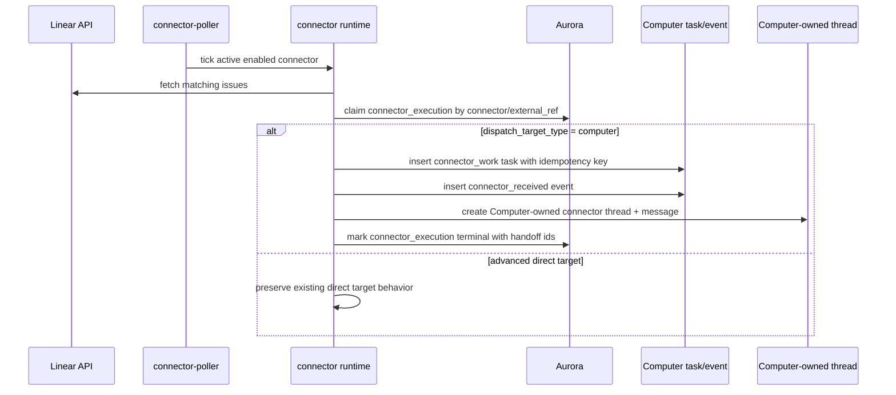

# feat: Computer-first connector routing

## Overview

Redirect the current Linear connector proof from "connector dispatches directly to an Agent-owned thread" to "connector hands work to an explicitly bound Computer, and the Computer owns the visible thread/run." This is a course-correction child plan for the connector-platform roadmap after the ThinkWork Computer reframe.

The goal is not to finish the full connector chassis or add another connector type. The goal is to make the next checkpoint honest: a real Linear issue matching the `symphony` label creates connector execution provenance, a Computer task/event, and a Computer-owned thread/run. Direct Agent/routine/hybrid targets remain supported as advanced/admin paths.

---

## Problem Frame

The merged connector foundation already has connector rows, connector executions, a deployed poller, Linear API fetching, run history, and a thin Symphony admin page. But the current runtime and UI still treat `agent` as the normal dispatch target. That conflicts with the newer Computer product model, where the Computer is the user's durable workplace/orchestrator and Managed Agents are delegated workers.

This plan updates the connector routing seam before more connector work compounds around the wrong owner. Linear remains the only proof target; Slack-facing Computers and additional connector types are follow-up plans.

---

## Requirements Trace

- R1. Connector events should route to Computers by default, not directly to Managed Agents.
- R2. The v0 Linear proof should use explicit connector-to-Computer binding; no automatic actor mapping or team queue routing is required yet.
- R3. The visible thread/run created from a connector event should be Computer-owned.
- R4. Managed Agents, routines, and hybrid workflows remain valid delegated execution substrates behind the Computer.
- R5. Existing direct connector targets such as Managed Agent, routine, and hybrid routine may remain as advanced/admin automation paths.
- R6. User-facing connector setup should default to Computer as the target and should not present "make this an Agent" as the happy path.
- R7. Connector execution records should represent provenance and operational state, not the durable owner of the work.
- R8. Delegation attribution must remain auditable when a Computer uses a Managed Agent or routine to complete connector-originated work.
- R9. The immediate proof remains Linear-only.
- R10. Slack-facing Computers, GitHub-facing Computers, and other connector types should be covered by follow-up connector plans rather than expanding this proof.

**Origin actors:** A1 Computer owner, A2 tenant admin/operator, A3 connector runtime, A4 ThinkWork Computer runtime, A5 Managed Agent or routine, A6 external system.

**Origin flows:** F1 Linear issue routes to a Computer, F2 Computer delegates after connector pickup.

**Origin acceptance examples:** AE1 Computer-bound Linear pickup, AE2 delegated worker attribution, AE3 Computer-default setup with advanced direct targets, AE4 Linear-only proof scope.

---

## Scope Boundaries

- No additional connector types.
- No Slack, GitHub, Google Workspace, or channel-ingress work.
- No automatic external actor-to-Computer routing.
- No tenant/team unassigned connector queue.
- No removal of existing direct Agent/routine/hybrid target paths.
- No full Computer runtime orchestration loop for connector tasks.
- No signed callback ingress, spend enforcement, Step Functions chassis, or bidirectional Linear mirror completion in this slice.

### Deferred to Follow-Up Work

- True Computer runtime handling of `connector_work` tasks: later Computer orchestration/delegation plan.
- Managed Agent delegation from a Computer-owned connector task: later delegation contract plan.
- Slack-facing Computers and additional connector types: separate connector plans.
- Full thread mirror lifecycle and external terminal-state sync: connector thread-mirror plan.
- Full connector chassis hardening: claim CAS refinements, pending-row reconciler, DLQ/alarm enforcement, and spend/callback layers.

---

## Context & Research

### Relevant Code and Patterns

- `docs/brainstorms/2026-05-07-computer-first-connector-routing-requirements.md` is the origin addendum and defines the product routing decision.
- `docs/brainstorms/2026-05-06-thinkwork-computer-product-reframe-requirements.md` defines Computers as durable per-user workplaces and Agents as delegated workers.
- `docs/plans/2026-05-06-004-feat-connector-runtime-skeleton-plan.md` documents the current agent-targeted connector runtime skeleton that this plan redirects.
- `packages/database-pg/src/schema/connectors.ts` currently CHECKs `dispatch_target_type IN ('agent', 'routine', 'hybrid_routine')`.
- `packages/database-pg/graphql/types/connectors.graphql` exposes `DispatchTargetType` with `agent`, `routine`, and `hybrid_routine` only.
- `packages/api/src/graphql/resolvers/connectors/mutation.ts` validates connector targets against `agents` and `routines`.
- `packages/api/src/lib/connectors/runtime.ts` currently supports Linear candidates and dispatches only `agent` targets by creating an Agent-owned connector thread and invoking `chat-agent-invoke`.
- `packages/api/src/lib/computers/tasks.ts` already provides idempotent Computer task enqueueing and emits `computer_task_enqueued` events.
- `packages/database-pg/src/schema/computers.ts` already has `computer_tasks` and `computer_events`; `task_type` is freeform in SQL but GraphQL/API currently constrains exposed task types.
- `packages/database-pg/src/schema/threads.ts` has generic ownership fields (`created_by_type`, `created_by_id`, `assignee_type`, `assignee_id`, `metadata`) that can express Computer ownership without a new `threads.computer_id` column in this slice.
- `apps/admin/src/routes/_authed/_tenant/symphony.tsx` owns the thin connector page, create/edit dialog, target picker, run button, and connector/runs tabs.
- `apps/admin/src/lib/connector-admin.ts` owns connector form defaults, target labels, Linear starter config, and result formatting.

### Institutional Learnings

- `docs/solutions/best-practices/every-admin-mutation-requires-requiretenantadmin-2026-04-22.md` applies to connector create/update/run-now mutations: gate before any side effect, using row-derived tenant IDs for existing rows.
- `docs/solutions/design-patterns/audit-existing-ui-and-data-model-before-parallel-build-2026-04-28.md` supports reusing existing Computer task/event and thread surfaces instead of inventing a parallel connector-owned work table or page.
- `docs/solutions/runtime-errors/stale-agentcore-runtime-image-entrypoint-not-found-2026-04-25.md` cautions that runtime proofs should use canonical product paths. Here, the canonical path becomes Computer-owned work, not a direct Agent thread.
- `docs/solutions/developer-experience/routine-rebuild-closeout-checkpoints-2026-05-03.md` warns that "checkpoint works" does not equal "full roadmap complete"; this plan should name what remains after the proof.

### External References

- None. Local product requirements and current repo patterns are sufficient for this routing correction.

---

## Key Technical Decisions

- **Add `computer` as a connector dispatch target type.** This is the smallest durable contract change that lets connector rows bind explicitly to a Computer while preserving existing advanced direct targets.
- **Use existing Computer task/event tables for handoff.** Connector execution remains provenance; the Computer task/event is the durable Computer-owned queue/audit record.
- **Use thread generic ownership fields for v0.** A Computer-owned connector thread should set `created_by_type='computer'`, `created_by_id=<computerId>`, `assignee_type='computer'`, `assignee_id=<computerId>`, and metadata links to connector/execution/task. Avoid a `threads.computer_id` migration until real query/UI pressure proves it is needed.
- **Mark connector execution terminal after successful Computer handoff.** Connector execution proves ingestion and handoff. It should not sit in `dispatching` while Computer work continues; Computer task/thread state owns the remaining lifecycle.
- **Add `CONNECTOR_WORK` as a Computer task type.** The Computer runtime does not need to execute it yet, but the task type should be visible through the existing task GraphQL surface and events.
- **Keep direct Agent/routine/hybrid paths advanced.** Do not remove current paths in this slice; update UI copy/defaults so they are no longer the happy path.
- **Preserve Linear-only scope.** Do not add Slack/channel abstractions while redirecting ownership.

---

## Open Questions

### Resolved During Planning

- **Should this add automatic actor-to-Computer routing?** No. The origin addendum chooses explicit connector-to-Computer binding for v0.
- **Should this add a `threads.computer_id` column?** No for this slice. Existing generic ownership and metadata fields are enough for the checkpoint, and a dedicated column can be added later if Computer thread queries need it.
- **Should connector execution remain active until the Computer finishes?** No. The connector execution is provenance and should become terminal once the Computer task/thread handoff succeeds.
- **Should direct Agent/routine/hybrid targets be deleted?** No. They remain advanced/admin paths.

### Deferred to Implementation

- Exact connector execution outcome payload shape: implementation should keep it compact but include connector id, external ref, Computer id, task id, thread id, and Linear identifier when available.
- Exact admin advanced-target affordance: implementation should choose the smallest UI that makes Computer the default and keeps advanced targets discoverable without visual clutter.
- Whether `runConnectorNow` should return `computerTaskId` immediately in all result branches or only in `dispatched` results: implementation should align with generated GraphQL type ergonomics.

---

## High-Level Technical Design

> _This illustrates the intended approach and is directional guidance for review, not implementation specification. The implementing agent should treat it as context, not code to reproduce._

---

## Implementation Units

- U1. **Add Computer Dispatch Target Contract**

**Goal:** Make `computer` a first-class connector dispatch target across database, GraphQL, resolver validation, and generated client types.

**Requirements:** R1, R2, R5, R6; AE1, AE3.

**Dependencies:** None.

**Files:**

- Modify: `packages/database-pg/src/schema/connectors.ts`
- Create: `packages/database-pg/drizzle/NNNN_connector_computer_dispatch_target.sql`
- Create: `packages/database-pg/drizzle/NNNN_connector_computer_dispatch_target_rollback.sql`
- Modify: `packages/database-pg/graphql/types/connectors.graphql`
- Modify: `packages/api/src/graphql/resolvers/connectors/mutation.ts`
- Test: `packages/api/src/graphql/resolvers/connectors/mutation.test.ts`
- Modify: `apps/admin/src/gql/graphql.ts`
- Modify: `apps/cli/src/gql/graphql.ts`
- Modify: `apps/mobile/src/gql/graphql.ts`
- Modify: `packages/api/src/gql/graphql.ts`

**Approach:**

- Extend the Drizzle CHECK constraint and hand-rolled SQL CHECK constraint to allow `computer`.
- Extend `DispatchTargetType` in GraphQL.
- Update create/update connector validation so `computer` targets resolve against `computers` by tenant.
- Keep existing validation behavior for `agent`, `routine`, and `hybrid_routine`.
- Regenerate GraphQL consumers after SDL changes.

**Execution note:** Start with resolver tests for accepting same-tenant Computer targets and rejecting cross-tenant Computer targets.

**Patterns to follow:**

- `packages/api/src/graphql/resolvers/connectors/mutation.ts`
- `packages/api/src/graphql/resolvers/computers/shared.ts`
- `docs/solutions/best-practices/every-admin-mutation-requires-requiretenantadmin-2026-04-22.md`
- `docs/solutions/workflow-issues/manually-applied-drizzle-migrations-drift-from-dev-2026-04-21.md`

**Test scenarios:**

- Happy path: creating a connector with `dispatchTargetType=computer` and a same-tenant Computer succeeds.
- Happy path: updating an existing connector from `agent` to `computer` validates the Computer and persists the new target.
- Error path: creating a connector with a cross-tenant Computer id is rejected before insert.
- Error path: creating a connector with an unknown Computer id is rejected with the same bad-input class as other invalid targets.
- Regression: existing `agent`, `routine`, and `hybrid_routine` target validation still works.
- Integration: GraphQL schema includes `computer` in `DispatchTargetType` and generated clients compile.

**Verification:**

- Manual migration reporter recognizes the CHECK constraint marker.
- API connector mutation tests cover same-tenant and cross-tenant Computer targets.
- Generated GraphQL types expose `DispatchTargetType.Computer` in admin.

---

- U2. **Create Computer Connector Handoff Path**

**Goal:** Update the connector runtime so a Computer-targeted Linear issue creates connector execution provenance, a Computer task/event, and a Computer-owned thread/message without invoking a Managed Agent directly.

**Requirements:** R1, R2, R3, R4, R7, R8; F1, F2; AE1, AE2.

**Dependencies:** U1.

**Files:**

- Modify: `packages/api/src/lib/connectors/runtime.ts`
- Test: `packages/api/src/lib/connectors/runtime.test.ts`
- Modify: `packages/api/src/lib/computers/tasks.ts`
- Test: `packages/api/src/lib/computers/tasks.test.ts`
- Modify: `packages/database-pg/graphql/types/computers.graphql`
- Modify: `packages/database-pg/graphql/types/connectors.graphql`

**Approach:**

- Extend connector runtime result typing to include Computer handoff identifiers such as `computerId`, `computerTaskId`, `threadId`, and `messageId`.
- Add `CONNECTOR_WORK` / `connector_work` to the Computer task API allowlist and GraphQL enum.
- For `dispatch_target_type='computer'`, claim the connector execution as today, then run a single transaction that:
  - verifies the Computer exists in the connector tenant;
  - inserts or reuses a `computer_tasks` row with an idempotency key derived from connector id and external ref;
  - inserts a `computer_events` row such as `connector_work_received`;
  - creates a thread with Computer ownership fields and connector provenance metadata;
  - creates the first connector-origin user message from the Linear candidate body.
- Mark the connector execution terminal once the Computer handoff succeeds, with outcome payload pointing to the Computer task and thread.
- Preserve the current direct Agent path as an advanced branch, but stop treating it as the default.
- Keep routine/hybrid direct targets in their current unsupported/advanced state unless already implemented.

**Execution note:** Implement behavior test-first around `runConnectorDispatchTick` so the old agent-owned-thread behavior cannot remain as the default unnoticed.

**Patterns to follow:**

- `packages/api/src/lib/connectors/runtime.ts`
- `packages/api/src/lib/computers/tasks.ts`
- `packages/database-pg/src/schema/threads.ts`
- `packages/api/src/lib/brain/draft-review-writeback.ts` for transaction-style thread/message writeback patterns

**Test scenarios:**

- Covers AE1. Happy path: a Computer-targeted Linear seed issue returns `dispatched`, records a connector execution, inserts a `connector_work` Computer task/event, creates a thread/message, and marks execution terminal with all handoff ids.
- Edge case: duplicate active external ref returns `duplicate` and creates no extra Computer task or thread.
- Edge case: duplicate Computer task idempotency key reuses the existing task and does not create duplicate work.
- Error path: missing Computer target marks the claimed connector execution failed and returns a failed result.
- Error path: thread/message insert failure marks the claimed connector execution failed and does not leave a terminal success payload.
- Regression: direct Agent target still creates the existing Agent-owned thread and invokes the agent path.
- Regression: routine/hybrid targets still return their existing explicit unsupported result until their chassis lands.

**Verification:**

- `runConnectorDispatchTick` produces Computer handoff results for Computer-targeted connectors.
- Connector execution terminal payload distinguishes connector provenance from Computer-owned work.
- Computer task/event rows are queryable through existing Computer GraphQL task/event queries.

---

- U3. **Expose Computer Handoff in Connector GraphQL Results**

**Goal:** Let admin and CLI clients see Computer handoff identifiers from run-now and connector execution payloads without reverse-engineering JSON.

**Requirements:** R3, R6, R7; AE1, AE3.

**Dependencies:** U1, U2.

**Files:**

- Modify: `packages/database-pg/graphql/types/connectors.graphql`
- Modify: `packages/api/src/graphql/resolvers/connectors/mutation.ts`
- Test: `packages/api/src/graphql/resolvers/connectors/mutation.test.ts`
- Modify: `apps/admin/src/gql/graphql.ts`
- Modify: `apps/cli/src/gql/graphql.ts`
- Modify: `apps/mobile/src/gql/graphql.ts`
- Modify: `packages/api/src/gql/graphql.ts`

**Approach:**

- Add nullable `computerId` and `computerTaskId` fields to `ConnectorDispatchResult`.
- Map runtime results to GraphQL without requiring clients to parse `outcomePayload`.
- Keep `threadId` and `messageId` as common fields, because direct Agent and Computer paths both create a visible thread/message.
- Avoid adding provider-specific Linear fields to the GraphQL result; Linear identifiers remain in connector execution outcome payload and UI helper parsing.

**Patterns to follow:**

- `packages/api/src/graphql/resolvers/connectors/mutation.ts::connectorDispatchResultToGraphql`
- `packages/database-pg/graphql/types/connectors.graphql`
- `apps/admin/src/lib/connector-admin.ts::connectorExecutionThreadId`

**Test scenarios:**

- Happy path: `runConnectorNow` maps a Computer dispatch result with `computerId`, `computerTaskId`, `threadId`, and `messageId`.
- Regression: direct Agent dispatch results still map `threadId` and `messageId` with null Computer fields.
- Error path: failed and duplicate results map null handoff fields without throwing.
- Integration: generated GraphQL clients expose the new fields.

**Verification:**

- Admin can show the Computer handoff id fields from typed query data.
- Existing connector run table continues to render old execution rows.

---

- U4. **Make Symphony Connector Setup Computer-First**

**Goal:** Update the thin Symphony admin page so connector creation/editing defaults to Computer targets and treats direct Agent/routine/hybrid targets as advanced options.

**Requirements:** R2, R5, R6, R9, R10; AE3, AE4.

**Dependencies:** U1.

**Files:**

- Modify: `apps/admin/src/routes/_authed/_tenant/symphony.tsx`
- Modify: `apps/admin/src/lib/connector-admin.ts`
- Test: `apps/admin/src/lib/connector-admin.test.ts`
- Modify: `apps/admin/src/lib/graphql-queries.ts`

**Approach:**

- Fetch Computers for the current tenant alongside Agents and Routines.
- Change default connector form values to `DispatchTargetType.Computer` when at least one Computer is available.
- Update target option helpers to include Computers and label the default target type as "Computer".
- Put Agent/routine/hybrid direct targets behind a compact advanced affordance or clearly secondary selector treatment.
- Keep manual target id fallback for legacy rows and advanced targets.
- Keep the Linear starter config pinned to label `symphony`.
- Preserve the existing tabs, no-multiline table behavior, and run history UI.

**Execution note:** Start with `connector-admin.test.ts` defaults/labels/options so the old Agent default cannot silently return.

**Patterns to follow:**

- `apps/admin/src/routes/_authed/_tenant/symphony.tsx`
- `apps/admin/src/lib/connector-admin.ts`
- `apps/admin/src/routes/_authed/_tenant/computers/index.tsx`
- `apps/admin/src/routes/_authed/_tenant/agent-templates/index.tsx` for typed tab/advanced filtering patterns

**Test scenarios:**

- Covers AE3. Happy path: new connector form defaults to Computer target type and selects a Computer option when available.
- Edge case: tenant with no Computers can still use manual/advanced target entry without crashing the form.
- Regression: editing an existing Agent-targeted connector preserves its Agent target and shows it as an advanced direct target.
- Regression: Linear starter config still uses the `symphony` label.
- Regression: target id validation still prevents submit without a target id.

**Verification:**

- Symphony page can create a Linear connector bound to a Computer without raw target id entry.
- Existing Agent-targeted connectors remain editable.
- No new table horizontal-scroll or multiline-row regressions are introduced.

---

- U5. **Document and Verify the Linear Checkpoint**

**Goal:** Capture the operator proof for the corrected checkpoint and make clear what remains outside this slice.

**Requirements:** R7, R9, R10; AE1, AE4.

**Dependencies:** U1, U2, U3, U4.

**Files:**

- Create: `docs/runbooks/computer-first-linear-connector-checkpoint.md`
- Modify: `docs/src/content/docs/applications/admin/computers.mdx`
- Modify: `docs/src/content/docs/applications/admin/index.mdx`

**Approach:**

- Document the expected checkpoint path: Linear issue with `symphony` label → connector execution terminal handoff → Computer task/event → Computer-owned thread/run.
- State explicitly that this is still not the full connector-platform roadmap: no Slack, no automatic actor matching, no signed callback, no spend enforcement, no full Computer runtime delegation loop.
- Add admin docs language that Computers are now valid connector-facing actors.
- Include a concise operator checklist for verifying one fresh Linear issue after deploy, including duplicate-check expectations.

**Patterns to follow:**

- `docs/src/content/docs/applications/admin/computers.mdx`
- `docs/src/content/docs/applications/admin/index.mdx`
- `docs/plans/2026-05-06-004-feat-connector-runtime-skeleton-plan.md`
- `docs/solutions/developer-experience/routine-rebuild-closeout-checkpoints-2026-05-03.md`

**Test scenarios:**

- Test expectation: none -- documentation and operator-runbook only.

**Verification:**

- Runbook describes exactly one Linear-only proof and names deferred work.
- Admin docs no longer imply connectors primarily surface Agents as the user-owned actor.

---

## System-Wide Impact

- **Interaction graph:** Connector create/update mutations, connector runtime tick, connector poller handler, Computer task/event queries, thread list/detail UI, and Symphony admin connector form all touch this path.
- **Error propagation:** Connector runtime should fail the connector execution when Computer handoff cannot be created; after handoff succeeds, Computer task/thread state owns subsequent lifecycle.
- **State lifecycle risks:** Connector executions, Computer tasks/events, and threads can drift if the handoff is not transactional. U2 must keep the handoff write path together and use idempotency keys for retries.
- **API surface parity:** GraphQL SDL changes require codegen for admin, CLI, mobile, and API consumers.
- **Integration coverage:** Unit tests prove handoff mechanics; a deployed Linear checkpoint proves credential, poller, GraphQL, and admin UI paths together.
- **Unchanged invariants:** Direct Agent/routine/hybrid target values remain supported as advanced paths. The Linear API query config and `symphony` label remain the immediate proof filter.

---

## Risks & Dependencies

| Risk | Mitigation |
| --- | --- |
| Computer handoff creates a task but no visible work, making the checkpoint feel inert | U2 also creates a Computer-owned thread/message synchronously so the user can see the work immediately. |
| Connector execution and Computer task disagree after partial writes | U2 uses one transaction for Computer task/event/thread/message handoff and marks connector execution terminal only after that succeeds. |
| Direct Agent integrations regress | U2 and U4 include regression tests for existing Agent-targeted connectors and edit flows. |
| UI hides advanced direct targets too aggressively | U4 keeps advanced/manual target entry and preserves existing connector edit compatibility. |
| Computer task type grows before runtime can process it | Scope states `connector_work` is a handoff/audit record for now; full runtime handling is deferred. |
| Existing terminal connector executions are treated as duplicates forever | This is current behavior in `createDrizzleConnectorRuntimeStore`; this plan does not change it. A later claim-policy hardening PR should revisit terminal reprocessing semantics. |

---

## Documentation / Operational Notes

- The runbook should use `symphony` as the Linear label for the proof.
- The plan does not change deployed scheduler cadence or Linear credential storage.
- After merge/deploy, the operator checkpoint should create one fresh Linear issue and verify only one connector execution, one Computer task/event, and one Computer-owned thread are created.

---

## Sources & References

- **Origin document:** [docs/brainstorms/2026-05-07-computer-first-connector-routing-requirements.md](../brainstorms/2026-05-07-computer-first-connector-routing-requirements.md)
- Related requirements: [docs/brainstorms/2026-05-06-thinkwork-computer-product-reframe-requirements.md](../brainstorms/2026-05-06-thinkwork-computer-product-reframe-requirements.md)
- Current runtime skeleton: [docs/plans/2026-05-06-004-feat-connector-runtime-skeleton-plan.md](2026-05-06-004-feat-connector-runtime-skeleton-plan.md)
- Related code: `packages/api/src/lib/connectors/runtime.ts`
- Related code: `packages/api/src/lib/computers/tasks.ts`
- Related code: `apps/admin/src/routes/_authed/_tenant/symphony.tsx`
