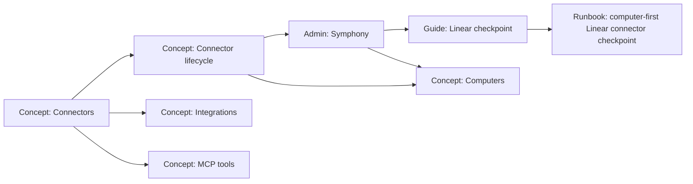

# docs: Symphony and connector documentation

## Overview

Build a complete documentation set for the now-shipped Linear-only Symphony connector path and the broader connector concept it proves. The current docs still describe connectors as mostly Agent-routed integrations and custom webhook recipes; they do not explain the Computer-first connector model, the Symphony admin surface, the Linear tracker lifecycle, or the PR-producing `connector_work` path that now exists in production.

This plan updates the public docs, admin docs, and operator runbook so a reader can answer three questions without reading source or SQL:

- What is a ThinkWork connector?
- What is Symphony in ThinkWork?
- How does a Linear issue labeled `symphony` become Computer-owned work, a draft PR, Linear comments, and an `In Review` card?

---

## Problem Frame

The Symphony implementation moved fast and is now functionally ahead of the documentation. The deployed path proves the key checkpoint: Linear issue with only the `symphony` label -> scheduled connector poller -> terminal connector execution -> completed `connector_work` Computer task/event -> Computer-owned thread -> managed-agent turn -> deterministic branch/commit/draft PR -> Linear writeback -> Symphony Runs lifecycle row.

But the docs still teach older assumptions:

- `docs/src/content/docs/concepts/connectors.mdx` says connectors route threads to agents by default.
- `docs/src/content/docs/guides/connectors.mdx` presents a custom webhook/skill-pack recipe with stale credential-vault examples and no Computer-first routing model.
- `docs/src/content/docs/applications/admin/index.mdx` mentions Symphony but there is no dedicated `applications/admin/symphony.mdx` page.
- `docs/runbooks/computer-first-linear-connector-checkpoint.md` is useful and current, but it is operator-runbook shaped, not product/reference documentation.
- The relationship between Connectors, Symphony, Computers, managed Agents, threads, connector executions, delegations, and Linear/GitHub writeback is only discoverable through code, prior PRs, or SQL.

The documentation needs to catch up without overclaiming. The shipped proof is Linear-only. Future Slack, GitHub Issues, Jira, Salesforce, Zendesk, and channel connectors remain follow-up connector plans.

---

## Requirements Trace

- R1. Explain Connectors as the system boundary that brings external systems into ThinkWork while preserving tenant isolation, credential control, auditability, and thread visibility.
- R2. Explain the Computer-first default: connector events normally hand work to a Computer; managed Agents, routines, and hybrid routines are delegated or advanced targets, not the main happy path.
- R3. Document Symphony as the first production connector experience: a Linear tracker connector plus admin surface for configuration and run visibility.
- R4. Document the Linear-only checkpoint lifecycle end to end, including scheduled polling, idempotency, Computer task/event handoff, Computer-owned thread, delegation, draft PR creation, Linear comments, and `In Review` writeback.
- R5. Document connector setup UX fields operators actually see: Linear label/team/credential/writeback state, target Computer, GitHub credential, repo owner/name, base branch, checkpoint file path, Advanced JSON, and missing-setup warnings.
- R6. Preserve honesty about scope: no additional connector types in this doc set, no automatic actor-to-Computer matching, no promise that Symphony is the whole future connector platform.
- R7. Replace stale Agent-default/custom-connector guidance with current Computer-first and tenant-credential patterns, while preserving useful custom connector authoring guidance as future-oriented.
- R8. Provide enough under-the-hood detail for developers and operators to debug without SQL first, but keep narrative-first documentation style per `docs/STYLE.md`.

**Origin actors:** A1 Computer owner, A2 tenant admin/operator, A3 connector runtime, A4 ThinkWork Computer runtime, A5 managed Agent or routine, A6 external system.

**Origin flows:** F1 Linear issue routes to a Computer, F2 Computer delegates after connector pickup.

**Origin acceptance examples:** AE1 Computer-bound Linear pickup, AE2 delegated worker attribution, AE3 Computer-default setup with advanced direct targets, AE4 Linear-only proof scope.

---

## Scope Boundaries

- No implementation changes to connector runtime, Computer runtime, Linear writeback, GitHub PR creation, or Symphony UI.
- No new connector type documentation beyond clearly marked future examples.
- No public marketing rewrite beyond docs pages and roadmap references.
- No screenshots required in the first pass unless the implementer finds existing screenshot capture cheap and stable.
- No attempt to document every GraphQL field exhaustively; link to API reference or keep schema-level detail in "Under the hood."

### Deferred to Follow-Up Work

- Customer-facing connector roadmap page once the next connector order is decided.
- Dedicated documentation for Slack/GitHub/Jira/Salesforce/Zendesk connectors after those plans exist.
- Full custom connector SDK or recipe rewrite if the connector recipe is productized beyond Linear.
- In-product help text or onboarding walkthrough inside the Symphony page.

---

## Context & Research

### Relevant Code and Patterns

- `docs/STYLE.md` defines the narrative-first docs structure, "Known limits" honesty sections, related links, and `## Under the hood` placement.
- `docs/src/content/docs/concepts/connectors.mdx` is the connector hub that needs the largest conceptual correction.
- `docs/src/content/docs/concepts/connectors/integrations.mdx` and `docs/src/content/docs/concepts/connectors/mcp-tools.mdx` are adjacent pages that need vocabulary alignment.
- `docs/src/content/docs/guides/connectors.mdx` is the existing custom connector guide; it should become future-oriented and stop teaching stale defaults.
- `docs/src/content/docs/applications/admin/index.mdx` already references Symphony under Work but has no dedicated Symphony page.
- `docs/src/content/docs/applications/admin/computers.mdx` explains Computers as durable workspaces and should cross-link connector handoff.
- `docs/src/content/docs/concepts/computers.mdx` explains the Computer model and should mention connector-origin work as a real inbound path.
- `docs/runbooks/computer-first-linear-connector-checkpoint.md` is the current operator runbook and should remain the detailed verification source.
- `apps/admin/src/routes/_authed/_tenant/symphony.tsx` owns the Connectors/Runs UI, setup dialog, lifecycle table, and admin actions.
- `apps/admin/src/lib/connector-admin.ts` contains the current structured setup defaults: `symphony` label, `linear` credential, `github` credential, `thinkwork-ai/thinkwork`, `main`, and `README.md`.
- `packages/api/src/lib/connectors/runtime.ts` on `origin/main` contains the Computer handoff and Linear writeback runtime shape.
- `packages/api/src/handlers/connector-poller.ts` is the scheduled poller entry point.
- `packages/api/src/lib/computers/tasks.ts` and `packages/api/src/handlers/computer-runtime.ts` cover Computer task claiming and completion.
- `packages/database-pg/graphql/types/connectors.graphql` and `packages/database-pg/graphql/types/computers.graphql` expose the API surface used by the admin UI.

### Institutional Learnings

- `docs/solutions/design-patterns/audit-existing-ui-and-data-model-before-parallel-build-2026-04-28.md` applies directly: docs should describe the shipped UI/data model before inventing new abstractions.
- `docs/solutions/developer-experience/routine-rebuild-closeout-checkpoints-2026-05-03.md` reinforces that a checkpoint runbook must name what it proves and what remains unproven.
- `docs/solutions/best-practices/every-admin-mutation-requires-requiretenantadmin-2026-04-22.md` matters for "Under the hood" security notes on connector admin mutations.
- `docs/solutions/workflow-issues/manually-applied-drizzle-migrations-drift-from-dev-2026-04-21.md` matters for under-the-hood schema and migration references.

### External References

External research skipped. This is an internal product documentation pass grounded in shipped code, internal runbooks, and the connector-platform planning trail.

---

## Key Technical Decisions

- **Document the shipped Linear path as the concrete example.** Use Linear/Symphony for specificity, then generalize carefully to the connector concept.
- **Keep Connectors as the concept hub; add Symphony as an admin/application page.** Connectors explain the architecture. Symphony explains the operator surface and Linear checkpoint experience.
- **Make the runbook the deep operational source, not the opening doc.** Public docs should teach the mental model first and link to `docs/runbooks/computer-first-linear-connector-checkpoint.md` for exact verification steps.
- **Introduce one lifecycle reference page under Connectors.** A focused page for "Linear tracker lifecycle" avoids stuffing the connector hub with too much operational detail.
- **Correct rather than delete custom connector guidance.** The custom connector guide should stop implying the stale Agent-default pattern and present current constraints: Computer-first default, tenant credentials, idempotency, threads, and provider writeback.
- **Use "Known limits" aggressively.** Every page that mentions Symphony should say the current production proof is Linear-only.
- **Use repo-relative code paths only in `## Under the hood`.** The docs should read cleanly for product readers and still serve implementers.

---

## Open Questions

### Resolved During Planning

- **Should this be one giant page or a docs set?** A docs set. One page would either be too shallow or too long; the concepts/admin/guide/runbook split matches the docs style guide.
- **Should Symphony be documented as its own product?** No. Symphony is the first connector experience and admin surface inside ThinkWork, not a separate product category.
- **Should future Slack/GitHub connectors be included?** Only as future examples. The current proof and operator instructions remain Linear-only.
- **Should the runbook be copied into Starlight docs?** No. Link and summarize it from a guide; keep the runbook as the exact operational checklist.

### Deferred to Implementation

- Exact page titles and descriptions can be adjusted during writing to match the final sidebar shape.
- Whether to add screenshots depends on how stable the local admin UI and auth state are when the docs PR is implemented.
- Exact amount of GraphQL schema detail should be decided while editing; docs should avoid duplicating the API reference.

---

## Output Structure

The intended docs shape is:

    docs/
    ├── astro.config.mjs
    ├── STYLE.md
    ├── runbooks/
    │   └── computer-first-linear-connector-checkpoint.md
    └── src/content/docs/
        ├── concepts/
        │   ├── connectors.mdx
        │   ├── computers.mdx
        │   └── connectors/
        │       ├── integrations.mdx
        │       ├── lifecycle.mdx
        │       └── mcp-tools.mdx
        ├── applications/admin/
        │   ├── index.mdx
        │   ├── computers.mdx
        │   └── symphony.mdx
        └── guides/
            ├── connectors.mdx
            └── symphony-linear-checkpoint.mdx

The implementer may collapse `concepts/connectors/lifecycle.mdx` and `guides/symphony-linear-checkpoint.mdx` if the writing pass proves one of them redundant, but the final docs must still cover both conceptual lifecycle and operator verification.

---

## High-Level Technical Design

> _This illustrates the intended approach and is directional guidance for review, not implementation specification. The implementing agent should treat it as context, not code to reproduce._

The reader path should be:

1. Connectors hub for vocabulary and ownership model.
2. Connector lifecycle for how external work becomes Computer-owned work.
3. Symphony admin page for the shipped UI.
4. Linear checkpoint guide/runbook for operating the proof.

---

## Implementation Units

- U1. **Refresh Connector Concept Model**

**Goal:** Rewrite the connector concept hub and adjacent connector concept pages so they describe Computer-first connector routing and stop teaching Agent-default routing.

**Requirements:** R1, R2, R6, R7, R8; AE1, AE3, AE4.

**Dependencies:** None.

**Files:**
<<<<<<< HEAD
=======

>>>>>>> 1a64e1bf (docs: document Symphony connector model)
- Modify: `docs/src/content/docs/concepts/connectors.mdx`
- Modify: `docs/src/content/docs/concepts/connectors/integrations.mdx`
- Modify: `docs/src/content/docs/concepts/connectors/mcp-tools.mdx`
- Modify: `docs/src/content/docs/concepts/computers.mdx`

**Test expectation:** No dedicated test file -- validate with docs build and targeted content checks.

**Approach:**
<<<<<<< HEAD
=======

>>>>>>> 1a64e1bf (docs: document Symphony connector model)
- Lead with connectors as the system boundary for external systems, not as "send a thread to an agent."
- Introduce the three connector shapes currently worth naming: integration/event sources, MCP tools, and tracker/work-item connectors.
- State the Computer-first default: external work routes to a Computer, and the Computer may delegate to managed Agents or routines.
- Keep direct managed Agent/routine/hybrid targets as advanced/admin paths.
- Remove or rewrite the old connector routing table that lists keyword/channel/user/default rules to agents.
- Add a concise "Known limits" section: Linear is the current production tracker proof; other connector types remain future work.
- Cross-link Computers, Threads, Symphony admin page, and the checkpoint guide.

**Patterns to follow:**
<<<<<<< HEAD
=======

>>>>>>> 1a64e1bf (docs: document Symphony connector model)
- `docs/STYLE.md`
- `docs/src/content/docs/concepts/computers.mdx`
- `docs/src/content/docs/applications/admin/index.mdx`

**Test scenarios:**
<<<<<<< HEAD
=======

>>>>>>> 1a64e1bf (docs: document Symphony connector model)
- Happy path: a reader can learn that connector-origin work is Computer-owned by default from the first half of the hub page.
- Regression: the page no longer claims the normal connector default is "route to an agent."
- Regression: Integrations and MCP Tools still read as connector subtypes rather than unrelated concepts.
- Edge case: future connector examples are clearly marked as future examples, not shipped surfaces.

**Verification:**
<<<<<<< HEAD
=======

>>>>>>> 1a64e1bf (docs: document Symphony connector model)
- Docs build succeeds.
- Search results for "default agent" or "default agent for the connector" in connector docs are either removed or explicitly framed as legacy/advanced.

---

- U2. **Add Connector Lifecycle Reference**

**Goal:** Add a narrative reference page that explains the lifecycle from external event/work item to connector execution, Computer task/event, thread, delegation, provider writeback, and Runs visibility.

**Requirements:** R1, R2, R4, R6, R8; AE1, AE2.

**Dependencies:** U1.

**Files:**
<<<<<<< HEAD
=======

>>>>>>> 1a64e1bf (docs: document Symphony connector model)
- Create: `docs/src/content/docs/concepts/connectors/lifecycle.mdx`
- Modify: `docs/astro.config.mjs`

**Test expectation:** No dedicated test file -- validate with docs build and link/sidebar checks.

**Approach:**
<<<<<<< HEAD
=======

>>>>>>> 1a64e1bf (docs: document Symphony connector model)
- Use the Linear tracker path as the worked example.
- Explain each durable record in plain language:
  - connector row: configured source and target;
  - connector execution: provenance for one external item;
  - Computer task/event: Computer-owned handoff and audit;
  - thread/message: visible work artifact;
  - delegation/thread turn: managed worker execution detail;
  - outcome metadata: Linear writeback, GitHub branch/PR, cleanup state.
- Include a compact sequence diagram.
- Include "What can go wrong" with the failure signals operators have already hit: wrong label, duplicate pickup comments, missing GitHub credential, card stuck in Todo/In Progress, old stale rows.
- Place code paths and schema references under `## Under the hood`.

**Patterns to follow:**
<<<<<<< HEAD
=======

>>>>>>> 1a64e1bf (docs: document Symphony connector model)
- `docs/src/content/docs/concepts/threads/lifecycle-and-types.mdx`
- `docs/runbooks/computer-first-linear-connector-checkpoint.md`
- `packages/database-pg/graphql/types/connectors.graphql`
- `packages/api/src/lib/connectors/runtime.ts`

**Test scenarios:**
<<<<<<< HEAD
=======

>>>>>>> 1a64e1bf (docs: document Symphony connector model)
- Happy path: page explains the fresh Linear checkpoint lifecycle without requiring SQL.
- Integration: page links to the Symphony admin page, Computers concept, Threads concept, and checkpoint guide.
- Error path: "What can go wrong" covers missing GitHub credential and duplicate pickup regressions.
- Scope guard: page does not imply Slack/Jira/GitHub Issues connector behavior is already shipped.

**Verification:**
<<<<<<< HEAD
=======

>>>>>>> 1a64e1bf (docs: document Symphony connector model)
- The sidebar includes the lifecycle page under Connectors.
- Docs build succeeds with the new Starlight page.

---

- U3. **Document Symphony Admin Surface**

**Goal:** Add the missing Admin: Symphony page so operators understand Connectors, Runs, setup fields, lifecycle columns, and warnings from the actual admin UI.

**Requirements:** R3, R5, R8; AE1, AE3.

**Dependencies:** U1.

**Files:**
<<<<<<< HEAD
=======

>>>>>>> 1a64e1bf (docs: document Symphony connector model)
- Create: `docs/src/content/docs/applications/admin/symphony.mdx`
- Modify: `docs/src/content/docs/applications/admin/index.mdx`
- Modify: `docs/astro.config.mjs`

**Test expectation:** No dedicated test file -- validate with docs build and sidebar/link checks.

**Approach:**
<<<<<<< HEAD
=======

>>>>>>> 1a64e1bf (docs: document Symphony connector model)
- Define Symphony as the admin surface for connector setup and connector-run visibility, currently centered on the Linear tracker proof.
- Document the two tabs:
  - Connectors: active/paused/archived connector rows, structured setup form, Advanced JSON, manual run, archive/pause/resume.
  - Runs: terminal/failed/cancelled rows, lifecycle chips, writeback status, PR link, thread link, stale cancelled rows hidden by default.
- Explain structured setup fields:
  - Linear team key, `symphony` label, Linear credential, target Computer, dispatch/writeback state, GitHub credential, owner/repo/base branch/file path.
- Explain warnings such as "GitHub setup required" and what operator action resolves them.
- Explicitly say the checkpoint label is `symphony`, not `symphony-eligible`.
- Keep rows/table UX detail brief; this is docs, not a UI spec.

**Patterns to follow:**
<<<<<<< HEAD
=======

>>>>>>> 1a64e1bf (docs: document Symphony connector model)
- `docs/src/content/docs/applications/admin/computers.mdx`
- `docs/src/content/docs/applications/admin/threads.mdx`
- `apps/admin/src/routes/_authed/_tenant/symphony.tsx`
- `apps/admin/src/lib/connector-admin.ts`

**Test scenarios:**
<<<<<<< HEAD
=======

>>>>>>> 1a64e1bf (docs: document Symphony connector model)
- Happy path: operator can identify where to configure the connector and where to verify a run.
- Error path: operator can identify what a missing GitHub setup warning means.
- Scope guard: page says Symphony currently proves the Linear path and does not document other connectors as shipped.
- Regression: admin index links to the dedicated Symphony page instead of leaving `/symphony` as plain text.

**Verification:**
<<<<<<< HEAD
=======

>>>>>>> 1a64e1bf (docs: document Symphony connector model)
- Admin sidebar docs include Symphony under Work.
- Docs build succeeds.

---

- U4. **Turn The Checkpoint Runbook Into A Reader-Friendly Guide**

**Goal:** Add a guide that explains how to run the Linear checkpoint through the UI and links to the detailed runbook for exact operator checks.

**Requirements:** R4, R5, R6, R8; AE1, AE2, AE4.

**Dependencies:** U2, U3.

**Files:**
<<<<<<< HEAD
=======

>>>>>>> 1a64e1bf (docs: document Symphony connector model)
- Create: `docs/src/content/docs/guides/symphony-linear-checkpoint.mdx`
- Modify: `docs/astro.config.mjs`
- Modify: `docs/runbooks/computer-first-linear-connector-checkpoint.md`

**Test expectation:** No dedicated test file -- validate with docs build and runbook consistency review.

**Approach:**
<<<<<<< HEAD
=======

>>>>>>> 1a64e1bf (docs: document Symphony connector model)
- Keep this as a guide, not another runbook copy.
- Start with entry criteria: deployed stack, active Computer, Linear credential, GitHub credential, active connector, scheduled poller, fresh issue, only `symphony` label.
- Walk the operator through:
  - inspect/save connector setup;
  - create fresh Linear issue;
  - wait for unattended poller;
  - verify Linear comments/state;
  - verify Symphony Runs row;
  - confirm no duplicates.
- Link to the runbook for SQL fallback, stale cleanup, scheduler checks, and failure table.
- Update the runbook only where needed to cross-link the new docs pages and keep it current with any wording changes.

**Patterns to follow:**
<<<<<<< HEAD
=======

>>>>>>> 1a64e1bf (docs: document Symphony connector model)
- `docs/runbooks/computer-first-linear-connector-checkpoint.md`
- `docs/src/content/docs/guides/compounding-memory-operations.mdx`
- `docs/src/content/docs/guides/evaluations.mdx`

**Test scenarios:**
<<<<<<< HEAD
=======

>>>>>>> 1a64e1bf (docs: document Symphony connector model)
- Happy path: guide has enough steps for a non-authoring operator to run a fresh checkpoint without SQL.
- Error path: guide points to the runbook for scheduler, stale cleanup, and SQL fallback instead of duplicating all operational detail.
- Regression: guide consistently says the label is `symphony`.
- Integration: guide links back to Connectors, Symphony admin, Computers, Threads, and the runbook.

**Verification:**
<<<<<<< HEAD
=======

>>>>>>> 1a64e1bf (docs: document Symphony connector model)
- Authoring Guides sidebar includes the guide.
- Docs build succeeds.

---

- U5. **Modernize Custom Connector Authoring Guide**

**Goal:** Update the custom connector guide so it reflects current connector architecture and stops teaching stale credential or Agent-default patterns.

**Requirements:** R1, R2, R6, R7, R8.

**Dependencies:** U1, U2.

**Files:**
<<<<<<< HEAD
=======

>>>>>>> 1a64e1bf (docs: document Symphony connector model)
- Modify: `docs/src/content/docs/guides/connectors.mdx`
- Modify: `examples/connector-recipe/README.md`

**Test expectation:** No dedicated test file -- validate with docs build and stale-pattern content checks.

**Approach:**
<<<<<<< HEAD
=======

>>>>>>> 1a64e1bf (docs: document Symphony connector model)
- Reframe the guide as future/custom connector guidance, not the main path for the shipped Linear/Symphony connector.
- Replace stale vault examples with tenant credential language that matches the current system.
- Replace `DEFAULT_AGENT_ID`-style defaults with Computer-first target language and clear advanced direct target exceptions.
- Add an idempotency section: external refs, connector executions, duplicate poll/webhook delivery, and no duplicate visible work.
- Add provider writeback and credential requirements as first-class concerns.
- Keep examples short and directional; avoid long code blocks that contradict `docs/STYLE.md`.
- Point to the connector lifecycle page and runbook rather than embedding operational detail.

**Patterns to follow:**
<<<<<<< HEAD
=======

>>>>>>> 1a64e1bf (docs: document Symphony connector model)
- `docs/STYLE.md`
- `examples/connector-recipe/README.md`
- `packages/api/src/lib/connectors/runtime.ts`
- `packages/api/src/lib/tenant-credentials/secret-store.ts`

**Test scenarios:**
<<<<<<< HEAD
=======

>>>>>>> 1a64e1bf (docs: document Symphony connector model)
- Happy path: a developer understands the current expected connector responsibilities without copying stale code.
- Regression: guide no longer presents SSM/DynamoDB token storage as the current ThinkWork credential vault path.
- Regression: guide no longer teaches "choose an agent" as the default happy path.
- Scope guard: guide says custom connector recipes are not the shipped Linear setup path.

**Verification:**
<<<<<<< HEAD
=======

>>>>>>> 1a64e1bf (docs: document Symphony connector model)
- Docs build succeeds.
- A targeted grep confirms stale phrases such as `DEFAULT_AGENT_ID` do not remain in the public guide unless explicitly framed as legacy.

---

- U6. **Cross-Link And Vocabulary Sweep**

**Goal:** Make the docs set coherent across Admin, Computers, Threads, Roadmap, and Connector pages so "Symphony", "Connector", "Computer", and "Managed Agent" mean the same thing everywhere.

**Requirements:** R1, R2, R3, R6, R8.

**Dependencies:** U1, U2, U3, U4, U5.

**Files:**
<<<<<<< HEAD
=======

>>>>>>> 1a64e1bf (docs: document Symphony connector model)
- Modify: `docs/src/content/docs/applications/admin/index.mdx`
- Modify: `docs/src/content/docs/applications/admin/computers.mdx`
- Modify: `docs/src/content/docs/concepts/computers.mdx`
- Modify: `docs/src/content/docs/concepts/threads.mdx`
- Modify: `docs/src/content/docs/roadmap.mdx`
- Modify: `docs/astro.config.mjs`

**Test expectation:** No dedicated test file -- validate with docs build and cross-link checks.

**Approach:**
<<<<<<< HEAD
=======

>>>>>>> 1a64e1bf (docs: document Symphony connector model)
- Add concise cross-links from Computers to connector-origin tasks and from Threads to connector-origin threads.
- Update Roadmap language only enough to point to Linear as the current connector proof and future connectors as roadmap work.
- Ensure "Agent" pages do not imply managed Agents are the default owner of connector-origin work.
- Ensure all new pages appear in Starlight sidebar in the correct sections.
- Keep this as a vocabulary sweep, not a site-wide docs rewrite.

**Patterns to follow:**
<<<<<<< HEAD
=======

>>>>>>> 1a64e1bf (docs: document Symphony connector model)
- `docs/STYLE.md`
- `docs/src/content/docs/applications/admin/index.mdx`
- `docs/src/content/docs/concepts/agents/managed-agents.mdx`

**Test scenarios:**
<<<<<<< HEAD
=======

>>>>>>> 1a64e1bf (docs: document Symphony connector model)
- Happy path: a reader moving from Admin -> Symphony -> Connectors -> Computers sees consistent ownership language.
- Regression: no new broken sidebar slug is introduced.
- Regression: Roadmap does not claim additional connectors have shipped.
- Edge case: "managed Agents" remains capitalized and positioned as delegated workers, not erased from the product model.

**Verification:**
<<<<<<< HEAD
=======

>>>>>>> 1a64e1bf (docs: document Symphony connector model)
- Docs build succeeds.
- Manual link scan of new/changed pages finds no dead internal links.

---

- U7. **Docs Quality And Operator Accuracy Pass**

**Goal:** Validate the completed docs against the style guide, current production behavior, and the checkpoint runbook before opening the PR.

**Requirements:** R4, R5, R6, R8.

**Dependencies:** U1, U2, U3, U4, U5, U6.

**Files:**
<<<<<<< HEAD
=======

>>>>>>> 1a64e1bf (docs: document Symphony connector model)
- Modify: `docs/STYLE.md` only if the docs pass reveals a reusable connector-docs rule worth capturing

**Test expectation:** No dedicated test file -- validate with Starlight build and targeted content checks.

**Approach:**
<<<<<<< HEAD
=======

>>>>>>> 1a64e1bf (docs: document Symphony connector model)
- Build the docs site with the Starlight build.
- Check that each substantive page has:
  - a useful hook paragraph;
  - narrative before technical detail;
  - `Known limits` where scope could be overread;
  - `Related pages`;
  - `Under the hood` only where technical references are useful.
- Compare the operator flow against `docs/runbooks/computer-first-linear-connector-checkpoint.md`.
- Search for stale connector terms and old label references.
- Optionally run the fresh Linear checkpoint only if implementation drift makes docs accuracy uncertain; do not make a live external smoke mandatory for a docs-only PR.

**Patterns to follow:**
<<<<<<< HEAD
=======

>>>>>>> 1a64e1bf (docs: document Symphony connector model)
- `docs/STYLE.md`
- `docs/runbooks/computer-first-linear-connector-checkpoint.md`

**Test scenarios:**
<<<<<<< HEAD
=======

>>>>>>> 1a64e1bf (docs: document Symphony connector model)
- Happy path: docs build succeeds.
- Regression: no changed page tells operators to use `symphony-eligible`.
- Regression: no changed page says connector-origin work is Agent-owned by default.
- Scope guard: all Symphony pages say Linear-only where appropriate.
- Integration: new pages are reachable from the sidebar and from at least one related page.

**Verification:**
<<<<<<< HEAD
=======

>>>>>>> 1a64e1bf (docs: document Symphony connector model)
- Starlight build passes.
- The PR description lists the docs pages changed and the current production behavior they document.

---

## System-Wide Impact

- **Documentation IA:** Adds a dedicated Symphony admin page and likely two connector-related pages; sidebar order must remain readable.
- **Product vocabulary:** Shifts public docs from Agent-default connector ownership to Computer-first ownership.
- **Operator support:** Reduces SQL reliance by teaching the Symphony Runs row, writeback column, PR link, and setup warnings.
- **Future connector work:** Establishes the doc template future connector plans should extend.
- **Unchanged invariants:** No code behavior, database schema, GraphQL contract, UI behavior, or deployed infrastructure changes are part of this plan.

---

## Risks & Dependencies

<<<<<<< HEAD
| Risk | Mitigation |
|------|------------|
| Docs overclaim the connector platform as broader than the shipped Linear proof | Add `Known limits` to Symphony and lifecycle pages; keep future connector mentions clearly deferred |
| Stale local checkout hides latest post-merge behavior | Implement from `origin/main` after fetching; use the runbook and current admin/runtime files as sources |
| Custom connector guide becomes another stale code dump | Keep examples directional and short; move technical detail to `Under the hood` |
| Sidebar grows noisy | Keep Connectors to overview, lifecycle, integrations, MCP tools; keep Symphony under Admin |
| Operator guide duplicates the runbook and drifts | Summarize in the guide, link to runbook for exact checks |
=======
| Risk                                                                           | Mitigation                                                                                              |
| ------------------------------------------------------------------------------ | ------------------------------------------------------------------------------------------------------- |
| Docs overclaim the connector platform as broader than the shipped Linear proof | Add `Known limits` to Symphony and lifecycle pages; keep future connector mentions clearly deferred     |
| Stale local checkout hides latest post-merge behavior                          | Implement from `origin/main` after fetching; use the runbook and current admin/runtime files as sources |
| Custom connector guide becomes another stale code dump                         | Keep examples directional and short; move technical detail to `Under the hood`                          |
| Sidebar grows noisy                                                            | Keep Connectors to overview, lifecycle, integrations, MCP tools; keep Symphony under Admin              |
| Operator guide duplicates the runbook and drifts                               | Summarize in the guide, link to runbook for exact checks                                                |
>>>>>>> 1a64e1bf (docs: document Symphony connector model)

---

## Documentation / Operational Notes

- This plan should not trigger a deploy-env or runtime smoke. It is a docs-only pass unless implementation discovers that the docs expose a real product bug.
- If the implementer captures screenshots, they should be small, stable, and stored under `docs/public/images/` with descriptive names. Screenshots are optional for this plan.
- The final PR should call out that it documents the state proven by the Linear/Symphony checkpoint through PR #938.

---

## Sources & References

- **Origin document:** `docs/brainstorms/2026-05-07-computer-first-connector-routing-requirements.md`
- Related plan: `docs/plans/2026-05-07-003-feat-computer-first-connector-routing-plan.md`
- Related plan: `docs/plans/2026-05-05-001-feat-thinkwork-connector-data-model-plan.md`
- Related runbook: `docs/runbooks/computer-first-linear-connector-checkpoint.md`
- Existing docs: `docs/src/content/docs/concepts/connectors.mdx`
- Existing docs: `docs/src/content/docs/guides/connectors.mdx`
- Existing docs: `docs/src/content/docs/applications/admin/index.mdx`
- Existing docs: `docs/src/content/docs/applications/admin/computers.mdx`
- Existing docs: `docs/src/content/docs/concepts/computers.mdx`
- Related source: `apps/admin/src/routes/_authed/_tenant/symphony.tsx`
- Related source: `apps/admin/src/lib/connector-admin.ts`
- Related source: `packages/api/src/lib/connectors/runtime.ts`
- Related source: `packages/api/src/handlers/connector-poller.ts`
- Related source: `packages/database-pg/graphql/types/connectors.graphql`
- Related source: `packages/database-pg/graphql/types/computers.graphql`
- Background source in `symphony` repo: `docs/brainstorms/2026-05-05-thinkwork-connector-platform-evolution-requirements.md`
- Background source in `symphony` repo: `docs/plans/2026-05-05-004-feat-thinkwork-connector-platform-evolution-plan.md`
