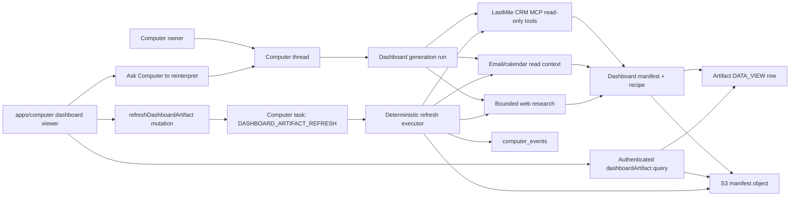

# feat: computer-generated dashboard artifacts

## Summary

Add a constrained, private dashboard-artifact lane for ThinkWork Computer. A Computer thread can create a read-only research dashboard artifact, with the v1 proof focused on a LastMile CRM pipeline-risk dashboard. The artifact stores a validated dashboard manifest and refresh recipe in S3, is listed as an existing `DATA_VIEW` artifact, renders inside `apps/computer`, and refreshes through a deterministic Computer task that re-runs saved source queries and transforms without invoking an open-ended LLM.

The plan intentionally does not generate arbitrary React bundles or serve public per-artifact apps from S3 in v1. The safer product shape is a generated dashboard specification rendered by ThinkWork-owned components. This preserves the user's desired "interactive app-like output" while keeping source access, user authorization, refresh behavior, and XSS controls understandable.

## Problem Frame

ThinkWork Computer is positioned as a long-running, connector-backed work environment that can research, analyze, and produce durable outputs. Existing artifacts are markdown-first and work well for reports, notes, plans, and digests, but some Computer sessions should end in an inspectable interactive surface rather than a static document.

The origin requirements narrow the idea from "generated apps" to "research dashboard artifacts." The first use case is a CRM analysis dashboard that pulls live LastMile CRM opportunities, groups them by stage, evaluates last contact and engagement freshness, and summarizes expected quantity and amount by product line. The differentiator over native CRM dashboards is cross-source context: CRM facts plus email/calendar engagement and bounded web research.

This plan assumes the separate end-user web app plan creates `apps/computer` and the separate Strands Computer plan creates the richer Computer runtime/tool surface. Where possible, this plan lands stable API/storage/viewer contracts against today's repo; where the implementation depends on those in-flight substrates, the unit calls that out explicitly.

## Requirements Trace

Origin: `docs/brainstorms/2026-05-08-computer-generated-research-dashboard-artifacts-requirements.md`

- R1-R2: The generated output is an interactive Computer research dashboard, first anchored on LastMile CRM pipeline risk.
- R3-R6: The dashboard must include stage grouping, stale-activity analysis, product-line quantity/amount exposure, and per-opportunity evidence.
- R7-R11: It must visibly distinguish CRM facts, email/calendar signals, and web signals, with source coverage and as-of timestamps.
- R12-R13: The dashboard opens privately inside ThinkWork Computer and is read-only in v1.
- R14-R16: Refresh reuses a saved recipe and deterministic executor; routine refresh does not re-run an open-ended Computer/LLM flow.
- R17: Reinterpretation, scoring changes, new source requests, and surprising-delta explanations start an explicit new Computer run.

Origin actors carried forward:
- A1 Computer owner
- A2 ThinkWork Computer
- A3 LastMile CRM MCP
- A4 Email/calendar sources
- A5 External web research
- A6 Dashboard artifact viewer

Origin flows carried forward:
- F1 Generate a pipeline-risk dashboard
- F2 Open and inspect the generated dashboard
- F3 Refresh without re-running the agentic flow
- F4 Ask the Computer to reinterpret or change the dashboard

Acceptance examples AE1-AE5 are covered by U3 through U8 below.

## Scope Boundaries

### In Scope

- A private dashboard-artifact model using existing `ArtifactType.DATA_VIEW`.
- A validated JSON manifest and refresh recipe stored in S3 behind ThinkWork auth.
- A LastMile CRM pipeline-risk dashboard shape with charts, filters, risk table, source coverage, and evidence drilldown.
- Read-only source access through approved LastMile CRM MCP tools, email/calendar context, and bounded web research.
- Deterministic refresh through a Computer task, with source-query, transform, scoring, chart, and templated-summary refresh.
- Explicit "ask Computer" path for changed analysis, changed scoring, added sources, or deeper reasoning.

### Deferred for Later

- External-system mutations from the dashboard.
- Slack/internal discussion as a v1 signal.
- ThinkWork memory as a first-class scoring signal.
- Shared/team dashboards, public links, comments, or collaboration.
- Arbitrary user-authored app generation.
- Fully live dashboards that re-query on every open.
- Scheduled background refresh.
- Rich version comparison between dashboard generations.
- In-view dashboard editing.

### Outside This Product Identity

- A generic BI platform.
- A replacement for LastMile CRM reporting.
- A public app-builder or website-generator product.
- Hidden autonomous reinterpretation during routine refresh.
- Workflow automation for external writes in v1.

## Context and Research

### Relevant Code and Patterns

- `packages/database-pg/graphql/types/artifacts.graphql` defines `Artifact`, `ArtifactType.DATA_VIEW`, `s3Key`, and `metadata`.
- `packages/database-pg/src/schema/artifacts.ts` describes artifacts as markdown-first today, with `content`, `s3_key`, and `metadata` already available for dashboard payload metadata.
- `packages/api/src/graphql/resolvers/artifacts/artifact.query.ts` and `packages/api/src/graphql/resolvers/artifacts/artifacts.query.ts` are too broad for private dashboard manifests as-is. The new dashboard read path must enforce caller/Computer ownership and should not rely on caller-supplied `tenantId`.
- `apps/admin/src/components/threads/ArtifactViewDialog.tsx` and `apps/admin/src/routes/_authed/_tenant/artifacts/index.tsx` are markdown-oriented operator surfaces. They are useful references for artifact listing, but not the dashboard viewer.
- `packages/database-pg/graphql/types/computers.graphql` and `packages/api/src/lib/computers/tasks.ts` define the task-type normalization surface that refresh will extend.
- `packages/database-pg/src/schema/computers.ts` already has `computer_tasks`, `computer_events`, and `computer_snapshots`; dashboard refresh should use tasks/events rather than inventing a parallel job system.
- `packages/computer-runtime/src/task-loop.ts` currently handles a narrow TypeScript runtime task set. The Strands plan in `docs/plans/2026-05-07-010-feat-thinkwork-computer-on-strands-plan.md` creates the richer runtime and stdlib this feature ultimately wants.
- `packages/database-pg/src/schema/mcp-servers.ts` includes `tenant_mcp_context_tools.declared_read_only`, `declared_search_safe`, and `approved`. These are the right policy gates for v1 CRM source eligibility.
- `packages/api/src/lib/mcp-configs.ts` resolves approved MCP configs and per-user OAuth tokens for agents. Dashboard source access should reuse the same principles: approved server, approved read-only tool, per-user token, explicit user predicate.
- `docs/src/content/docs/api/context-engine.mdx` documents the read-only/search-safe MCP tool eligibility model; dashboard refresh should align with it rather than bypass it.
- `docs/plans/2026-05-08-001-feat-computer-thinkwork-ai-end-user-app-plan.md` creates `apps/computer`; this plan's viewer units depend on that app existing.

### Institutional Learnings

- `docs/solutions/logic-errors/oauth-authorize-wrong-user-id-binding-2026-04-21.md` - always include the explicit `user_id` predicate for per-user OAuth and MCP token lookup. Tenant-only queries leak across multi-user tenants.
- `docs/solutions/best-practices/oauth-client-credentials-in-secrets-manager-2026-04-21.md` - keep connector secrets and OAuth material in Secrets Manager, with narrow runtime access and module-level caching only for non-user secrets.
- `docs/solutions/integration-issues/lambda-options-preflight-must-bypass-auth-2026-04-21.md` - if any REST route is added for manifests or refresh, CORS OPTIONS must bypass auth and all responses must include CORS headers. Prefer GraphQL for v1 unless REST is clearly needed.
- `docs/solutions/best-practices/every-admin-mutation-requires-requiretenantadmin-2026-04-22.md` - `ctx.auth.tenantId` can be null for Google-federated users; use existing caller-resolution helpers rather than trusting raw inputs.

### External References

- [Perplexity Computer](https://www.perplexity.ai/products/computer) and Perplexity enterprise docs frame the category as long-running, connector-backed work that can produce dashboards and reports.
- [Builder's Perplexity Computer review](https://www.builder.io/blog/perplexity-computer) highlights the product risk this plan avoids: black-box execution with no inspectable live output.
- [Amazon S3 website access permissions](https://docs.aws.amazon.com/AmazonS3/latest/userguide/WebsiteAccessPermissionsReqd.html) make public read a normal static website requirement, which is a poor fit for private per-user artifacts.
- [CloudFront private content](https://docs.aws.amazon.com/AmazonCloudFront/latest/DeveloperGuide/PrivateContent.html) supports signed URLs/cookies for private objects, but v1 does not need per-artifact CloudFront distribution complexity if the app fetches manifests through authenticated APIs.
- [CloudFront response headers policies](https://docs.aws.amazon.com/AmazonCloudFront/latest/DeveloperGuide/modifying-response-headers.html) can add CSP and other security headers. This matters if future versions serve generated bundles.
- [MCP authorization](https://modelcontextprotocol.io/specification/2025-06-18/basic/authorization) requires bearer tokens in authorization headers, not query strings, and audience-bound token validation. Dashboard source adapters must not pass user tokens through URLs or logs.

## Key Technical Decisions

- **Constrained manifest, not arbitrary React, for v1.** The Computer generates a dashboard specification and data snapshot; ThinkWork-owned React components render it. This is the main security and maintainability decision.
- **Reuse `DATA_VIEW` instead of adding a new artifact enum.** V1 can identify dashboard artifacts with `metadata.kind = "research_dashboard"` and `metadata.dashboardKind = "pipeline_risk"`. Add a new enum only when multiple application classes need first-class API filtering.
- **Store the manifest in S3 and fetch through an authenticated API.** `Artifact.s3Key` points at the current manifest object. The API verifies caller access, fetches the object, validates it, and returns sanitized JSON to the viewer.
- **Use versioned manifest schemas.** Start with `schemaVersion: 1`, explicit `dashboardKind`, `snapshot`, `recipe`, `sources`, `views`, `evidence`, and `refresh` sections. Unknown component types or source types are invalid.
- **Refresh is a Computer task.** `refreshDashboardArtifact` enqueues `DASHBOARD_ARTIFACT_REFRESH` with an idempotency key. The runtime executes the recipe, writes a new manifest snapshot, updates artifact metadata, and emits `computer_events`.
- **Refresh is deterministic by default.** It can call source APIs and deterministic transforms/scoring/templates. It must not call a general LLM during routine refresh.
- **Reinterpretation is explicit.** "Explain this delta," "add Slack," "change scoring," or "make a new view" routes to a new Computer run rather than hiding reasoning inside refresh.
- **Source adapters are partial-failure tolerant.** CRM can succeed while email/calendar or web sources fail. The manifest records provider status, coverage, errors safe for display, and timestamps.
- **Read-only source policy is enforced twice.** Planning assumes LastMile CRM tools are admin-approved and declared read-only/search-safe. The runtime also allowlists the exact tools a dashboard recipe can invoke.
- **No public S3 website for v1 dashboards.** The artifact can feel app-like inside `apps/computer` without making private business data public or creating per-artifact static hosting.
- **Initial generation may land on the Strands runtime.** If `packages/computer-stdlib/` from the Strands plan exists before implementation, generation and refresh should live there. If not, implement the deterministic refresh executor in `packages/computer-runtime/` and keep the GraphQL/API contract stable for later migration.

## Open Questions

### Resolved During Planning

- **Generated app shape:** v1 uses a constrained research-dashboard manifest, not arbitrary generated React.
- **Refresh model:** refresh re-runs saved recipes without open-ended agent reasoning.
- **Mutation posture:** v1 is read-only across CRM, email/calendar, and web sources.
- **First proof:** LastMile CRM pipeline-risk dashboard with risk table, charts, source coverage, and evidence.
- **Private serving model:** render inside authenticated `apps/computer`; do not serve a public S3 website artifact.

### Deferred to Implementation

- Exact LastMile CRM MCP server slug and tool names for opportunities, activities, product lines, quantities, and amounts.
- Whether LastMile CRM activity data directly includes contact recency or needs multiple tool calls per opportunity.
- Exact read surface for email/calendar in the Computer runtime. Today's TypeScript runtime has calendar-upcoming only; Strands stdlib may add richer Gmail/Calendar read tools.
- Bounded web research provider and citation policy for account/company signals.
- Exact S3 bucket/prefix convention for dashboard manifest objects. Use the existing artifact/snapshot bucket if one is available; otherwise add a single tenant-scoped artifacts prefix rather than a new bucket per artifact.
- Whether initial generation is implemented first in `packages/computer-runtime/` or waits for `packages/computer-stdlib/`.
- Exact `apps/computer` route paths after the end-user app plan lands.

## System Design



## Output Structure

The exact `apps/computer` route names may adjust to the end-user app plan when that work lands.

```
packages/api/src/lib/dashboard-artifacts/
  manifest.ts
  storage.ts
  access.ts

packages/api/src/graphql/resolvers/artifacts/
  dashboardArtifact.query.ts
  refreshDashboardArtifact.mutation.ts

packages/computer-runtime/src/
  dashboard-artifacts.ts
  dashboard-sources/
    crm-mcp.ts
    email-calendar.ts
    web-research.ts
  pipeline-risk-dashboard.ts

apps/computer/src/
  routes/_authed/_shell/artifacts.$id.tsx
  components/dashboard-artifacts/
    DashboardArtifactView.tsx
    DashboardSummaryBar.tsx
    SourceCoverage.tsx
    PipelineRiskCharts.tsx
    OpportunityRiskTable.tsx
    EvidenceDrawer.tsx
    RefreshControl.tsx
  lib/dashboard-artifacts.ts

docs/src/content/docs/concepts/computer/
  dashboard-artifacts.mdx
```

If `packages/computer-stdlib/` exists by implementation time, move runtime-side source adapters and transforms under:

```
packages/computer-stdlib/src/computer_stdlib/dashboard_artifacts/
```

and keep the GraphQL/API/viewer pieces unchanged.

## Implementation Units

### U1. Define dashboard manifest contract and S3 storage helpers

**Goal:** Create the versioned schema, validator, sanitizer, and S3 read/write helpers for dashboard artifacts.

**Requirements:** R1, R7, R8, R12, R13, R14, R15, R16

**Dependencies:** None.

**Files:**
- Create: `packages/api/src/lib/dashboard-artifacts/manifest.ts`
- Create: `packages/api/src/lib/dashboard-artifacts/storage.ts`
- Create: `packages/api/src/lib/dashboard-artifacts/access.ts`
- Create: `packages/api/src/__tests__/dashboard-artifacts-manifest.test.ts`
- Create: `packages/api/src/__tests__/dashboard-artifacts-storage.test.ts`

**Approach:**
- Define `DashboardManifestV1` and `DashboardRecipeV1` types with explicit discriminated unions for supported dashboard kinds and view/component types.
- Use existing `ajv` and `ajv-formats` from `packages/api/package.json` to validate manifests at API boundaries.
- Model the manifest with sections for `snapshot`, `recipe`, `sources`, `views`, `tables`, `charts`, `evidence`, and `refresh`.
- Store source coverage with `provider`, `status`, `asOf`, `recordCount`, and safe display errors.
- Store recipe steps as declarative source query specs plus transform/scoring/template identifiers. Do not store executable code strings.
- Keep labels and evidence text as plain text. No HTML, markdown HTML, inline scripts, arbitrary component names, or remote asset URLs in v1.
- `storage.ts` should read/write JSON through the existing S3 client pattern in `packages/api`; if no shared artifact bucket helper exists, create a tiny helper with stage/env-config lookup matching local API conventions.
- `access.ts` should centralize artifact ownership checks for dashboard APIs. It should verify tenant, owning user/Computer, and thread linkage rather than trusting `tenantId` args.

**Test Scenarios:**
- Valid v1 pipeline-risk manifest passes validation.
- Unknown `schemaVersion`, unknown `dashboardKind`, unknown component type, and executable recipe fragments are rejected.
- Opportunity/account labels containing `<script>` or HTML are retained as text and never promoted to trusted markup.
- Manifest missing source coverage or as-of timestamp is rejected.
- S3 keys outside the expected tenant/artifact prefix are rejected before read/write.
- Storage helpers round-trip a manifest and preserve schema version.

### U2. Add secure dashboard artifact GraphQL API

**Goal:** Expose dashboard-specific API operations without broadening the existing loose artifact resolvers.

**Requirements:** R8, R12, R13, R14, R15, R17

**Dependencies:** U1.

**Files:**
- Modify: `packages/database-pg/graphql/types/artifacts.graphql`
- Modify: `packages/api/src/graphql/resolvers/artifacts/index.ts`
- Create: `packages/api/src/graphql/resolvers/artifacts/dashboardArtifact.query.ts`
- Create: `packages/api/src/graphql/resolvers/artifacts/refreshDashboardArtifact.mutation.ts`
- Create: `packages/api/src/__tests__/dashboard-artifact-access.test.ts`
- Update generated GraphQL types in: `packages/api`, `apps/admin`, `apps/cli`, `apps/mobile`, and `apps/computer` if it exists.

**Approach:**
- Add types such as `DashboardArtifact`, `DashboardRefreshResult`, and fields for `artifact`, `manifest`, `latestRefreshTask`, and `canRefresh`.
- Add query `dashboardArtifact(id: ID!): DashboardArtifact` and mutation `refreshDashboardArtifact(id: ID!): DashboardRefreshResult!`.
- Require the artifact to be `type = data_view`, `metadata.kind = "research_dashboard"`, and `metadata.dashboardKind = "pipeline_risk"` for v1.
- Fetch the manifest server-side from S3 using `Artifact.s3Key`, validate it with U1, and return sanitized JSON as `AWSJSON` or a typed shape if codegen ergonomics warrant it.
- Enqueue refresh through `enqueueTask` with task type `dashboard_artifact_refresh` and an idempotency key like `dashboard-artifact-refresh:<artifactId>:<recipeVersion>`.
- Do not add write/update dashboard mutation surface for v1 beyond refresh.
- Leave existing `artifact(id)` and `artifacts(...)` behavior unchanged unless implementation chooses to harden them separately. Dashboard viewer must use the secure dashboard-specific query.

**Test Scenarios:**
- Owner can read their own dashboard manifest.
- A different user in the same tenant cannot read or refresh the dashboard.
- A user from a different tenant cannot read or refresh the dashboard.
- A non-dashboard `DATA_VIEW` artifact is rejected by `dashboardArtifact`.
- An artifact with missing or invalid S3 manifest returns a safe error and does not expose the raw S3 key.
- Refresh mutation enqueues exactly one pending task for repeated calls with the same idempotency key.
- Refresh mutation rejects artifacts whose manifest recipe requests non-read-only operations.

### U3. Add Computer task contract for dashboard refresh

**Goal:** Make dashboard refresh a first-class Computer task with lifecycle events and stable runtime input/output.

**Requirements:** R14, R15, R16

**Dependencies:** U2.

**Files:**
- Modify: `packages/database-pg/graphql/types/computers.graphql`
- Modify: `packages/api/src/lib/computers/tasks.ts`
- Modify: `packages/computer-runtime/src/api-client.ts`
- Modify: `packages/computer-runtime/src/task-loop.ts`
- Create: `packages/computer-runtime/src/dashboard-artifacts.ts`
- Create: `packages/computer-runtime/test/dashboard-artifacts-refresh.test.ts`

**Approach:**
- Add enum value `DASHBOARD_ARTIFACT_REFRESH` and lower-case task type `dashboard_artifact_refresh`.
- Normalize task input to `{ artifactId, requestedByUserId, recipeVersion? }`.
- Runtime flow:
  - Fetch task input and artifact manifest through a trusted runtime API endpoint or existing API client extension.
  - Re-check artifact/Computer ownership before work begins.
  - Emit `dashboard_refresh_started`, provider-specific source events, `dashboard_refresh_manifest_written`, and terminal success/failure events.
  - Write new manifest JSON to S3 and update artifact metadata with `lastRefreshAt`, `lastRefreshTaskId`, `recipeVersion`, and `sourceCoverageSummary`.
  - Complete the task with safe output metadata, not full business data.
- If `packages/computer-stdlib/` lands first, implement the executor there and keep the API task contract identical.

**Test Scenarios:**
- Task input normalization accepts only the expected shape.
- Unknown task type remains rejected.
- Refresh completes and writes a new manifest for a fixture recipe.
- Refresh failure marks the task failed and records a safe event without leaking OAuth tokens, raw emails, or S3 internals.
- Repeated task with same idempotency key does not create duplicate refresh work.
- Mock LLM/model provider is never called during refresh.

### U4. Implement read-only source adapters for dashboard recipes

**Goal:** Normalize CRM, email/calendar, and web signals into a safe source-result shape consumed by transforms.

**Requirements:** R4, R7, R8, R9, R10, R11, R13, R15, R16

**Dependencies:** U3. Exact runtime location depends on Strands work.

**Files:**
- Create: `packages/computer-runtime/src/dashboard-sources/types.ts`
- Create: `packages/computer-runtime/src/dashboard-sources/crm-mcp.ts`
- Create: `packages/computer-runtime/src/dashboard-sources/email-calendar.ts`
- Create: `packages/computer-runtime/src/dashboard-sources/web-research.ts`
- Create: `packages/computer-runtime/test/dashboard-sources.test.ts`
- If Strands stdlib exists, create equivalent files under `packages/computer-stdlib/src/computer_stdlib/dashboard_artifacts/sources/` and tests under `packages/computer-stdlib/tests/`.

**Approach:**
- Define a normalized `DashboardSourceResult` with `provider`, `status`, `asOf`, `records`, `evidence`, and `safeError`.
- CRM adapter:
  - Resolve LastMile CRM MCP by approved tenant server/tool metadata.
  - Require `declared_read_only = true`, `declared_search_safe = true`, and `approved = true` for every tool used in the recipe.
  - Use per-user OAuth token resolution with explicit `user_id` and `tenant_id` predicates.
  - Map opportunities, stages, activity history, products, quantities, and amounts into normalized records.
- Email/calendar adapter:
  - Start with available Computer Google Workspace read surfaces.
  - Use only metadata needed for engagement signals in v1: last inbound/outbound date, upcoming meeting date, participant/account matching confidence, and thread/message references safe for display.
  - Do not place raw email bodies into the dashboard manifest in v1.
- Web research adapter:
  - Use bounded, source-cited account/company research.
  - Store only concise snippets, source URL, source title, fetched-at time, and signal category.
- Adapters must return partial-failure statuses rather than throwing whole-dashboard failures when possible.

**Test Scenarios:**
- CRM fixture with multiple stages and product lines maps into normalized opportunity/product/activity records.
- CRM MCP server missing, disabled, pending approval, or non-read-only tool produces a blocked source status.
- Per-user MCP token lookup includes user predicate; another user's token is not selected.
- Email/calendar adapter emits engagement metadata without raw message body content.
- Web research adapter requires source URL and fetched-at timestamp for each signal.
- One failed provider still allows a manifest with partial source coverage.
- No adapter exposes access tokens in logs, events, manifest, task output, or safe errors.

### U5. Implement pipeline-risk transforms, scoring, and templated summaries

**Goal:** Convert normalized source results into the v1 dashboard's charts, tables, evidence, and deterministic "what changed" text.

**Requirements:** R2, R3, R4, R5, R6, R7, R8, R15, R16

**Dependencies:** U4.

**Files:**
- Create: `packages/computer-runtime/src/pipeline-risk-dashboard.ts`
- Create: `packages/computer-runtime/test/pipeline-risk-dashboard.test.ts`
- If Strands stdlib exists, create equivalent files under `packages/computer-stdlib/src/computer_stdlib/dashboard_artifacts/pipeline_risk.py` and `packages/computer-stdlib/tests/test_pipeline_risk_dashboard.py`.

**Approach:**
- Compute stage rollups: opportunity count, total amount, weighted amount if available, quantity, and risk count by stage.
- Compute stale engagement:
  - CRM stale if no CRM activity inside the configured window.
  - Relationship recency adjusted by email/calendar metadata.
  - Upcoming meeting reduces stale-contact severity but does not erase CRM stale signal.
- Compute product-line exposure: amount and quantity by product line, linked back to opportunities.
- Produce a risk table with stable fields: opportunity, account, stage, amount, product lines, last CRM activity, last email/calendar signal, next meeting, risk score, risk reasons, and evidence references.
- Produce deterministic text blocks from templates only. Examples: "7 opportunities are stale by CRM activity; 3 have recent email/calendar engagement." No LLM calls.
- Store evidence records with source kind, source title/label, timestamp, and short text snippet.

**Test Scenarios:**
- Fixture opportunities across stages produce exact expected stage rollups.
- Product-line amount and quantity aggregation matches fixture data.
- Opportunity with stale CRM activity but recent email reply shows both signals distinctly.
- Opportunity with upcoming meeting is not treated as fully fresh unless scoring config says so.
- Risk reasons are stable and deterministic for repeated runs.
- Templated "what changed" compares previous and current snapshots without calling an LLM.
- Missing amount or quantity data is represented as unknown/partial, not zero, unless the source explicitly reports zero.

### U6. Create initial dashboard generation path from a Computer thread

**Goal:** Let a Computer run create the first pipeline-risk dashboard artifact and saved refresh recipe.

**Requirements:** R1, R2, R3, R4, R5, R6, R7, R8, R9, R10, R11, R12, R13, R17

**Dependencies:** U1, U4, U5, and the active Strands Computer plan or an interim TypeScript task implementation.

**Files:**
- Preferred after Strands plan lands:
  - Create: `packages/computer-stdlib/src/computer_stdlib/dashboard_artifacts/__init__.py`
  - Create: `packages/computer-stdlib/src/computer_stdlib/dashboard_artifacts/create.py`
  - Create: `packages/computer-stdlib/tests/test_dashboard_artifact_create.py`
- Interim if staying in TS runtime:
  - Modify: `packages/database-pg/graphql/types/computers.graphql`
  - Modify: `packages/api/src/lib/computers/tasks.ts`
  - Modify: `packages/computer-runtime/src/task-loop.ts`
  - Create: `packages/computer-runtime/src/dashboard-artifact-create.ts`
  - Create: `packages/computer-runtime/test/dashboard-artifact-create.test.ts`

**Approach:**
- Add a Computer tool or task that creates a dashboard artifact from a structured request:
  - `dashboardKind = "pipeline_risk"`
  - selected CRM source/server
  - optional stage/product filters
  - source set: CRM, email/calendar, web
  - scoring window/config
- Initial generation may use the Computer agent to decide when a dashboard is appropriate, but the persisted recipe must be declarative and deterministic.
- Create an `artifacts` row with:
  - `type = data_view`
  - `status = final`
  - `summary` and/or markdown `content` for static fallback
  - `s3_key` pointing to the manifest
  - `source_message_id` linking back to the Computer response
  - `metadata.kind = "research_dashboard"`
  - `metadata.dashboardKind = "pipeline_risk"`
  - `metadata.schemaVersion = 1`
- Emit Computer events for source reads, manifest creation, and artifact creation.
- If the Computer cannot access LastMile CRM MCP or required read-only tools, create no dashboard and return a clear source-setup error.

**Test Scenarios:**
- Generation creates a `DATA_VIEW` artifact with correct metadata and S3 manifest.
- Generated artifact links back to the source thread/message when available.
- Missing LastMile CRM MCP tools block generation with an actionable source-setup error.
- Generated recipe contains only declarative query specs and transform/scoring/template IDs.
- Generation does not create any CRM/email/calendar/web mutation task.
- User asking for scoring changes after generation creates a new Computer run path, not a routine refresh.

### U7. Build `apps/computer` dashboard artifact viewer

**Goal:** Render the private dashboard artifact as an app-like, read-only experience in the Computer web app.

**Requirements:** R3, R4, R5, R6, R7, R8, R12, R13, R14, R17

**Dependencies:** U2 and `apps/computer` from `docs/plans/2026-05-08-001-feat-computer-thinkwork-ai-end-user-app-plan.md`.

**Files:**
- Create: `apps/computer/src/routes/_authed/_shell/artifacts.$id.tsx`
- Create: `apps/computer/src/components/dashboard-artifacts/DashboardArtifactView.tsx`
- Create: `apps/computer/src/components/dashboard-artifacts/DashboardSummaryBar.tsx`
- Create: `apps/computer/src/components/dashboard-artifacts/SourceCoverage.tsx`
- Create: `apps/computer/src/components/dashboard-artifacts/PipelineRiskCharts.tsx`
- Create: `apps/computer/src/components/dashboard-artifacts/OpportunityRiskTable.tsx`
- Create: `apps/computer/src/components/dashboard-artifacts/EvidenceDrawer.tsx`
- Create: `apps/computer/src/components/dashboard-artifacts/RefreshControl.tsx`
- Create: `apps/computer/src/lib/dashboard-artifacts.ts`
- Create: `apps/computer/src/components/dashboard-artifacts/DashboardArtifactView.test.tsx`
- Modify: `apps/computer/src/lib/graphql-queries.ts`

**Approach:**
- Use the secure `dashboardArtifact(id)` query and never fetch raw S3 directly from the browser.
- Render:
  - title, summary, last refreshed time, and recipe version
  - source coverage by provider
  - stage rollup chart
  - stale engagement by stage chart
  - product-line amount/quantity chart
  - risk table with filters for stage, risk reason, product line, and source coverage
  - evidence drawer for row-level source trails
  - refresh control that shows pending/running/completed/failed task state
- Keep controls read-only. No CRM update, email send, calendar create, task creation, or external-action buttons.
- Escape all labels/snippets through React text rendering. Avoid `dangerouslySetInnerHTML`.
- If manifest validation fails server-side, show a safe broken-artifact state with a route back to the thread.
- Add "Ask Computer" entry point for reinterpretation that starts or links to an explicit thread/run rather than executing analysis in the viewer.

**Test Scenarios:**
- Viewer renders stage chart, stale chart, product chart, risk table, and evidence drawer for a fixture manifest.
- Filters change the visible table and chart summary without refetching.
- Malicious labels/snippets render as text, not HTML.
- Refresh click calls `refreshDashboardArtifact` once and displays running/completed/failed states.
- Viewer has no controls that mutate CRM, email, calendar, or external systems.
- Source coverage clearly marks partial CRM/email-calendar/web failures.
- "Ask Computer" routes to the explicit Computer flow and is visually distinct from refresh.

### U8. Wire refresh end-to-end and artifact timeline integration

**Goal:** Make the dashboard artifact discoverable from Computer threads and keep refresh state visible.

**Requirements:** R8, R12, R14, R15, R16, R17

**Dependencies:** U2, U3, U7.

**Files:**
- Modify: `apps/computer/src/components/ComputerSidebar.tsx` or equivalent artifacts/thread navigation after `apps/computer` lands.
- Modify: `apps/computer/src/routes/_authed/_shell/threads.$id.tsx` or equivalent thread detail route.
- Modify: `packages/api/src/graphql/resolvers/threads/types.ts`
- Create: `packages/api/src/__tests__/thread-dashboard-artifact-link.test.ts`
- Create: `apps/computer/src/components/dashboard-artifacts/RefreshControl.test.tsx`

**Approach:**
- Surface dashboard artifacts from the thread message timeline through existing `Message.durableArtifact` linkage where possible.
- If a dashboard artifact is opened from a thread, maintain the context link back to the generating message.
- Poll or refetch task state after refresh starts; do not require a websocket/subscription for v1 unless `apps/computer` already has one.
- Update visible `lastRefreshAt` when the task completes.
- On refresh failure, display provider-level failures from the latest manifest if available and task-level failure otherwise.

**Test Scenarios:**
- A generated dashboard artifact appears in the thread as a durable artifact card.
- Opening the card routes to the dashboard viewer.
- Refresh pending/running/completed states are visible and do not duplicate tasks.
- Refresh failure shows safe task error text and a link back to Computer for reinterpretation.
- The artifact card still renders a markdown/summary fallback if the full dashboard route is unavailable.

### U9. Add documentation, fixtures, and end-to-end smoke

**Goal:** Make the behavior understandable to future implementers and verify the v1 happy path with realistic fixtures.

**Requirements:** AE1, AE2, AE3, AE4, AE5

**Dependencies:** U1-U8.

**Files:**
- Create: `docs/src/content/docs/concepts/computer/dashboard-artifacts.mdx`
- Create: `packages/api/test/integration/dashboard-artifacts.test.ts`
- Create: `packages/computer-runtime/test/fixtures/pipeline-risk-dashboard.json`
- Create: `packages/computer-runtime/test/fixtures/lastmile-crm-opportunities.json`
- Create: `scripts/smoke-dashboard-artifact.sh` if the deployed-stage smoke can be scripted without secrets in repo.
- Update generated GraphQL artifacts for: `packages/api`, `apps/admin`, `apps/cli`, `apps/mobile`, and `apps/computer`.

**Approach:**
- Document the v1 contract:
  - dashboard artifacts are private
  - refresh is deterministic
  - reinterpretation is explicit
  - v1 is read-only
  - manifests store source coverage and evidence, not raw external-system secrets
- Add integration test coverage around API access, manifest retrieval, refresh enqueue, and runtime fixture output.
- Smoke path should use fixture or dev-approved LastMile CRM MCP depending on environment readiness.
- Do not require live LastMile CRM for normal CI unless a stable test tenant/server exists.

**Test Scenarios:**
- End-to-end fixture path creates an artifact, fetches dashboard API, renders expected manifest shape, refreshes, and updates metadata.
- Read-only dashboard shows no mutation actions.
- Multi-user same-tenant fixture denies access to another user's dashboard.
- Partial source coverage remains visible and does not fail the entire viewer.
- Documentation examples match the manifest schema validator.

## Cross-Cutting Invariants

- All dashboard artifact access is bounded to the caller's identity and Computer.
- Dashboard manifests are data, not executable code.
- Recipe steps are declarative and allowlisted.
- Routine refresh never calls a general LLM.
- Source adapters never log or return OAuth tokens.
- CRM/email/calendar/web sources are read-only in v1.
- Provider failures are provider-local unless CRM is unavailable for the CRM-first dashboard.
- All displayed external text is rendered as plain text.
- Every dashboard has source coverage and as-of timestamps.

## Sequencing

1. U1 creates the manifest/storage/access foundation.
2. U2 exposes the secure dashboard API and refresh mutation.
3. U3 makes refresh a Computer task.
4. U4-U5 build source normalization and deterministic pipeline-risk logic.
5. U6 creates initial dashboard generation.
6. U7 builds the viewer inside `apps/computer`.
7. U8 wires thread/timeline discovery and refresh state.
8. U9 documents and verifies the whole path with fixtures and, when available, a dev LastMile CRM MCP smoke.

U7 can begin in parallel with U4-U6 using fixture manifests once U1-U2 stabilize. U6 should wait until the Computer runtime direction is clear enough to avoid writing the same generation tool twice.

## Risks and Mitigations

- **LastMile CRM MCP contract may not exist yet.** Mitigate with fixture-driven adapters and an explicit blocked-source status until tool names and fields are confirmed.
- **Existing artifact resolvers are broad.** Mitigate by adding dashboard-specific access checks and having the viewer use only the secure dashboard API.
- **Arbitrary app generation would expand XSS and supply-chain risk.** Mitigate by rendering a constrained manifest through trusted components in v1.
- **Email/calendar data can leak sensitive content.** Mitigate by storing metadata/signals and safe references, not raw message bodies.
- **Web research can become stale or uncited.** Mitigate with fetched-at timestamps, source URLs, and partial-coverage indicators.
- **Refresh can accidentally become a hidden agent run.** Mitigate with tests that mock and assert no LLM/model calls in refresh.
- **`apps/computer` and Strands runtime are in-flight.** Mitigate by keeping API/manifest contracts stable and isolating runtime-location decisions in U3/U6.

## Definition of Done

- A Computer-created pipeline-risk dashboard artifact can be opened privately in `apps/computer`.
- The dashboard renders stage rollups, stale engagement, product-line exposure, risk table, evidence, source coverage, and as-of timestamps.
- The dashboard has no external mutation actions.
- Refresh enqueues and completes a deterministic Computer task without LLM calls.
- Refresh updates the manifest, artifact metadata, and viewer state.
- Cross-user and cross-tenant access tests pass.
- Fixture-based CI covers generation, manifest validation, refresh, and viewer behavior.
- Documentation explains the dashboard artifact contract and the refresh vs reinterpretation boundary.
