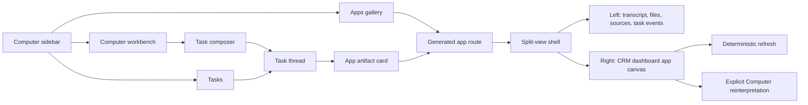

# feat: computer app artifact UI

## Overview

Build the `apps/computer` user experience for Computer tasks and generated app artifacts, using the live Perplexity Computer UI as the interaction reference. This is a UI companion plan to `docs/plans/2026-05-08-009-feat-computer-generated-dashboard-artifacts-plan.md`: it focuses on the shell, task thread, artifact gallery, split-view app viewer, and CRM dashboard demo presentation, while leaving manifest storage, deterministic refresh execution, and source adapters to the broader artifact plan.

The UI goal is not to copy Perplexity's brand. It is to borrow the product grammar that makes Computer outputs feel useful: a calm dark workspace, a persistent left navigation for ordinary task work, compact task provenance, and an app viewer where the generated dashboard is the primary surface while the Computer's transcript remains inspectable.

---

## Problem Frame

ThinkWork Computer needs to feel like an end-user workbench, not an admin console. The current plan for `computer.thinkwork.ai` scaffolds the app and sidebar, and the dashboard-artifact plan defines the data/API/runtime shape. What is missing is the UI plan for making generated "apps" feel compelling enough to demo: users should be able to start a task, see work unfold, open a generated app artifact, inspect how it was produced, and refresh or reinterpret it without losing trust.

Perplexity Computer provides a useful starting point:

- The `/computer` entry behaves like a Computer-focused launch surface with a central composer and a gallery of finished examples.
- The task dashboard uses a persistent left sidebar plus a main tasks list, tabs, search, credits/status, and a bottom composer.
- The task thread page presents a linear work transcript with collapsible tool/task rows, generated file cards, source counts, feedback, usage, and share controls.
- Generated apps open in a split view: left side is the Computer run transcript and files; right side is the embedded app. The global navigation disappears so the app can breathe.
- The embedded apps are allowed to be domain-specific: Health Dashboard uses KPI cards, charts, doctor report tabs, light/print controls; Macro Terminal uses terminal styling, keyboard-tab navigation, clickable indicator cards, and source links.

For ThinkWork, the demo target is a CRM pipeline-risk dashboard generated from a Computer thread. The UI should present it as a finished app-like artifact while retaining ThinkWork's enterprise-readiness: private access, source coverage, read-only posture, refresh recipe status, and explicit reinterpretation.

---

## Requirements Trace

- R1. The Computer web app has a Perplexity-inspired task workbench: sidebar navigation, central task composer, task list, and task thread view.
- R2. The Computer app has an "Apps" or "Artifacts" gallery showing generated interactive outputs as preview cards, not just rows in a table.
- R3. A generated app artifact opens in a split-view shell with transcript/provenance on the left and the interactive artifact on the right.
- R4. The split view supports the CRM pipeline-risk dashboard demo as the primary v1 app artifact.
- R5. The artifact viewer makes provenance visible: original prompt, task timeline/tool events, files, sources, refresh status, and as-of timestamps.
- R6. The artifact viewer keeps app interactions read-only in v1 and visually separates routine refresh from "Ask Computer" reinterpretation.
- R7. The app canvas supports domain-specific dashboard styling while using ThinkWork-owned components and manifest data from the dashboard-artifacts plan.
- R8. The generated app UI works at desktop widths first, with a mobile fallback that stacks transcript and app sections.
- R9. The UI must be implemented in `apps/computer` and use shared primitives from `@thinkwork/ui` after the end-user app plan lands.
- R10. The UI should be visually verified against fixture data for the CRM dashboard demo, including no overlapping text, usable scroll regions, and clear source coverage.

Origin requirements carried forward from `docs/brainstorms/2026-05-08-computer-generated-research-dashboard-artifacts-requirements.md`:
- R1-R2: interactive research dashboard generated from a Computer thread, first anchored on LastMile CRM pipeline risk.
- R3-R6: stage grouping, stale activity, product-line quantity/amount exposure, and per-opportunity evidence.
- R7-R13: source distinction, timestamps, private viewer, read-only posture.
- R14-R17: refresh recipe without hidden LLM; reinterpretation starts an explicit Computer run.

**Origin actors:** A1 Computer owner, A2 ThinkWork Computer, A3 LastMile CRM MCP, A4 email/calendar sources, A5 external web research, A6 dashboard artifact viewer.

**Origin flows:** F1 generate pipeline-risk dashboard, F2 open and inspect dashboard, F3 refresh without rerunning agent flow, F4 ask Computer to reinterpret.

**Origin acceptance examples:** AE1-AE5. This plan covers the UI portion of all five, especially AE2-AE5.

---

## Scope Boundaries

### In Scope

- Computer home/workbench UI patterns inspired by Perplexity Computer.
- Task list and task thread UI sufficient to reach and trust generated artifacts.
- Generated app gallery/cards inside `apps/computer`.
- Split-view generated app artifact route.
- CRM pipeline-risk dashboard presentation components using fixture/dashboard manifest data.
- Refresh and reinterpretation affordances, with clear read-only boundaries.
- Visual verification plan for desktop and mobile fallback.

### Deferred for Later

- Public sharing and anonymous app links.
- Team/collaborative app gallery.
- Arbitrary generated React app hosting.
- In-view editing of dashboard layout.
- Rich version diffing between generated artifact versions.
- Scheduled refresh UI.
- Mobile-native implementation in `apps/mobile`.
- Full visual-regression service such as Percy/Chromatic.

### Outside This Product Identity

- A generic app marketplace.
- A CRM replacement UI.
- A BI dashboard builder.
- A public website builder.
- A hidden automation console for mutating CRM/email/calendar records.

---

## Context and Research

### Perplexity Computer UI Observations

- **Persistent sidebar for workbench views:** narrow dark left rail with logo, collapse button, New, Computer, Spaces, Artifacts, Customize, History, recent task links, user avatar, and notifications.
- **Computer task dashboard:** top title "Computer", search, credits/status pill, New task button, Tasks/Archived tabs, filter, workflow banner, task rows with artifact chips, and a bottom task composer.
- **New thread/chat surface:** central composer with connector/source affordances, mode toggles, model/menu controls, voice controls, and starter cards such as Prototype, Create spreadsheet, Create slides, Connect apps, and Data visualization.
- **Use-case gallery:** dense 3-column preview cards, each with a screenshot thumbnail, title, and "App" label, plus a "Put Computer to work" CTA.
- **Task thread page:** back button, title, actions, file count, Usage, Share, centered transcript, collapsible tool rows, generated file cards, source count, feedback buttons, and bottom command composer.
- **Generated app split view:** no global sidebar; top outer bar with "Made with Perplexity Computer", "Build your own", and "Copy Link"; left transcript/provenance panel around one-third width; right embedded app panel around two-thirds width; both sides scroll independently.
- **Artifact card in transcript:** app artifacts show title/version, View full screen, Download as ZIP, embedded preview/open button, source count, and feedback.
- **Health Dashboard app:** dark dashboard shell with title, tabs, date range, Light toggle, Print button, KPI cards, chart grid, "Areas for Improvement", "Strengths", and data-source footer.
- **Macro Terminal app:** domain-specific terminal aesthetic, app-level tabs, keyboard shortcuts, live timestamp, dense market snapshot, source links, and clickable indicator cards with deeper explanations.
- **Trust pattern:** the app is not isolated from the work. The left transcript shows the data-gathering/build/QA/deploy process, and the final artifact keeps source counts and file evidence visible.

### Relevant Code and Patterns

- `docs/plans/2026-05-08-001-feat-computer-thinkwork-ai-end-user-app-plan.md` creates `apps/computer`, `@thinkwork/ui`, sidebar shell, auth, and placeholder routes.
- `docs/plans/2026-05-08-009-feat-computer-generated-dashboard-artifacts-plan.md` defines secure dashboard artifact API, manifest, refresh task, and viewer contract.
- `apps/admin/src/components/ui/sidebar.tsx` is the existing sidebar primitive planned for extraction into `@thinkwork/ui`.
- `apps/admin/src/routes/_authed/_tenant/artifacts/index.tsx` is table-oriented and operator-focused; the Computer gallery should be card-oriented and end-user-focused.
- `apps/admin/src/components/threads/ArtifactViewDialog.tsx` is markdown-only; generated app artifacts need a dedicated route, not a modal.
- `apps/admin/package.json` already includes Recharts, TanStack Router, urql, lucide-react, React 19, and Vite, which are enough for the CRM dashboard demo UI.
- `packages/database-pg/graphql/types/messages.graphql` exposes `Message.durableArtifact`, which is the natural thread timeline link for generated artifacts.
- `packages/database-pg/graphql/types/artifacts.graphql` already supports `s3Key`, `summary`, and `metadata`; UI should use the secure dashboard-specific API from plan 009 for manifest data.

### Institutional Learnings

- `docs/solutions/design-patterns/audit-existing-ui-and-data-model-before-parallel-build-2026-04-28.md` - do not invent a parallel UI/data model without auditing current primitives and GraphQL surfaces first.
- `docs/solutions/best-practices/inline-helpers-vs-shared-package-for-cross-surface-code-2026-04-21.md` - shared UI extraction needs drift detection. Computer-specific layout should consume `@thinkwork/ui` primitives but keep app-specific composition in `apps/computer`.
- `docs/solutions/logic-errors/oauth-authorize-wrong-user-id-binding-2026-04-21.md` - UI tests should include same-tenant multi-user denial states because generated artifacts are private.
- `docs/solutions/integration-issues/lambda-options-preflight-must-bypass-auth-2026-04-21.md` - avoid adding REST routes for UI-only needs; use existing GraphQL/client patterns where possible.

### External References

- Live reference inspected in Brave:
  - `https://www.perplexity.ai/computer`
  - `https://www.perplexity.ai/computer/tasks/gas-prices-over-last-90-days-x4kbwl2_RmefuVMWGHxJgA`
  - `https://www.perplexity.ai/computer/a/health-dashboard-vnW16rnqRKqu9HGrYz.zXg?view=split`
  - `https://www.perplexity.ai/computer/a/macro-terminal-mdwCDLA0SNukya_bpSHPTw?view=split`

---

## Key Technical Decisions

- **Use Perplexity's layout grammar, not its brand.** ThinkWork should adopt the workbench, gallery, task transcript, and split-view artifact patterns while using ThinkWork visual language and enterprise cues.
- **Keep app artifact viewing route-based.** Generated apps should open at routes like `apps.$id` or `artifacts.$id`, not inside a modal, because the app canvas needs most of the viewport.
- **Use split view as the default for generated apps.** The transcript/provenance panel is part of the trust model, especially for research dashboards.
- **Do not hide the transcript completely in v1.** Full-screen can be an affordance, but split view is the default demo mode so users see that the Computer did real work.
- **Represent "Apps" as a filtered artifact gallery.** Use `DATA_VIEW` artifacts with `metadata.kind = "research_dashboard"` / `metadata.uiSurface = "app"` for v1 rather than adding a separate app entity.
- **Build a ThinkWork dashboard renderer, not arbitrary iframe hosting.** For v1 CRM dashboard, the right panel renders trusted components from the dashboard manifest plan.
- **Make refresh feel operational, not magical.** Use a Refresh control with clear last refreshed/as-of/source coverage states; put "Ask Computer" beside it as a distinct reasoning action.
- **Give generated dashboards domain-specific style within guardrails.** The CRM dashboard can have its own operational sales-analysis feel, but it should use shared controls, spacing, typography, and safe chart/table components.
- **Favor dense, scan-friendly UI for CRM.** The demo is an operational research dashboard, so prioritize compact KPI cards, filters, tables, and charts over marketing-style hero composition.
- **Fixture-first visual verification.** Build the UI against a fixture manifest before live LastMile CRM is available, then swap to the secure API from plan 009.

---

## Open Questions

### Resolved During Planning

- **Should generated apps use a modal or full page?** Full route with split view.
- **Should the transcript remain visible?** Yes, split view by default because provenance is part of trust.
- **Should the Computer gallery be table-based like admin artifacts?** No, use preview cards for user-facing app artifacts.
- **Should routine refresh and reinterpretation be the same control?** No, routine refresh is deterministic; reinterpretation starts a Computer run.
- **Should v1 render arbitrary generated React apps?** No, render trusted CRM dashboard components from manifest data.

### Deferred to Implementation

- Exact route names once `apps/computer` exists in this worktree.
- Whether the main navigation label should be `Apps`, `Artifacts`, or `Apps & Artifacts`; this plan assumes `Apps` for demo clarity with artifact terminology preserved in code.
- Exact collapse/resizer behavior for the split view on desktop.
- Exact mobile breakpoint behavior; default plan is stacked transcript/app with app first and provenance below.
- Whether file/source/usage controls are available from existing GraphQL fields or need additional fields from plan 009.
- Whether `apps/computer` starts with subscriptions or simple polling for refresh/task state.

---

## High-Level Technical Design

> *This illustrates the intended approach and is directional guidance for review, not implementation specification. The implementing agent should treat it as context, not code to reproduce.*



---

## Output Structure

Expected `apps/computer` additions after the end-user app plan creates the workspace:

```
apps/computer/src/
  routes/_authed/_shell/
    computer.tsx
    tasks.index.tsx
    tasks.$id.tsx
    apps.index.tsx
    apps.$id.tsx
  components/computer/
    ComputerWorkbench.tsx
    ComputerComposer.tsx
    TaskDashboard.tsx
    TaskThreadView.tsx
    TaskEventRow.tsx
    GeneratedArtifactCard.tsx
    SourceCountButton.tsx
    UsageButton.tsx
  components/apps/
    AppsGallery.tsx
    AppPreviewCard.tsx
    AppArtifactSplitShell.tsx
    AppTranscriptPanel.tsx
    AppCanvasPanel.tsx
    AppTopBar.tsx
  components/dashboard-artifacts/
    CrmPipelineRiskApp.tsx
    CrmPipelineHeader.tsx
    CrmPipelineKpiStrip.tsx
    CrmPipelineStageCharts.tsx
    CrmProductLineExposure.tsx
    CrmOpportunityRiskTable.tsx
    CrmEvidenceDrawer.tsx
    CrmSourceCoverage.tsx
    CrmRefreshBar.tsx
  lib/
    app-artifacts.ts
    dashboard-fixtures.ts
  test/
    fixtures/
      crm-pipeline-risk-dashboard.json
```

---

## Implementation Units

### U1. Define Computer UI reference system and route map

**Goal:** Convert the Perplexity-inspired UI observations into route-level decisions and app-local design constants.

**Requirements:** R1, R2, R3, R8, R9

**Dependencies:** `apps/computer` scaffold from `docs/plans/2026-05-08-001-feat-computer-thinkwork-ai-end-user-app-plan.md`.

**Files:**
- Create: `apps/computer/src/lib/computer-ui.ts`
- Create: `apps/computer/src/lib/computer-routes.ts`
- Create: `apps/computer/src/components/computer/ComputerLayoutNotes.md` or document the reference in `docs/src/content/docs/concepts/computer/dashboard-artifacts.mdx`
- Test: `apps/computer/src/lib/computer-routes.test.ts`

**Approach:**
- Define app-local route helpers for `computer`, `tasks`, `task detail`, `apps gallery`, and `app artifact detail`.
- Define UI constants for sidebar width, transcript panel preferred width, split-view breakpoint, card aspect ratios, and empty/loading states.
- Capture the reference principles as developer-facing notes:
  - workbench views keep global sidebar
  - generated app views hide global sidebar and use split shell
  - transcript/provenance remains available by default
  - app canvas gets primary visual weight
- Keep this in `apps/computer`; do not push composition-specific shell decisions into `@thinkwork/ui`.

**Patterns to follow:**
- `apps/admin/src/routes/_authed.tsx`
- `apps/admin/src/components/ui/sidebar.tsx`
- `docs/plans/2026-05-08-001-feat-computer-thinkwork-ai-end-user-app-plan.md`

**Test scenarios:**
- Happy path: route helper builds app artifact URL for a given artifact id.
- Edge case: unknown artifact id input returns a safe route or throws a typed client error.
- Integration: route labels match sidebar/gallery links used by U2-U4.

**Verification:**
- Route helpers are used by the workbench, gallery, thread artifact cards, and split-view shell.

---

### U2. Build Computer workbench home and task composer

**Goal:** Create the Perplexity-like starting surface for new Computer work: central composer, mode/source controls, starter cards, and a persistent sidebar.

**Requirements:** R1, R8, R9

**Dependencies:** U1 and the `apps/computer` auth/sidebar scaffold.

**Files:**
- Modify: `apps/computer/src/routes/_authed/_shell/computer.tsx`
- Create: `apps/computer/src/components/computer/ComputerWorkbench.tsx`
- Create: `apps/computer/src/components/computer/ComputerComposer.tsx`
- Create: `apps/computer/src/components/computer/StarterCardGrid.tsx`
- Test: `apps/computer/src/components/computer/ComputerWorkbench.test.tsx`
- Test: `apps/computer/src/components/computer/ComputerComposer.test.tsx`

**Approach:**
- Center the workbench around a task composer with placeholder text appropriate to ThinkWork, such as "Ask your Computer to research, analyze, or build...".
- Include compact controls for adding files/sources, choosing Computer mode, and voice/dictation only if the backing surface exists; otherwise show the stable controls and keep future-only controls out.
- Add starter cards tuned to ThinkWork demos:
  - CRM pipeline risk dashboard
  - Account research brief
  - Board-ready summary
  - Spreadsheet analysis
  - Connect business apps
  - Data visualization
- Composer submission should create a Computer-scoped thread/task using the existing create-thread path from the end-user app plan, then route to the task/thread page.
- Sidebar keeps New, Computer, Apps, Tasks, Inbox/Automations if those routes exist, and recent tasks.

**Patterns to follow:**
- `docs/plans/2026-05-08-001-feat-computer-thinkwork-ai-end-user-app-plan.md`
- `apps/admin/src/components/ui/button.tsx`
- `apps/admin/src/components/ui/textarea.tsx` if available after extraction

**Test scenarios:**
- Happy path: entering a prompt and submitting calls the create-thread/task action and routes to the new task.
- Happy path: clicking the CRM starter card pre-fills or submits the CRM pipeline-risk prompt depending on chosen UX.
- Edge case: empty composer disables submit.
- Error path: create-thread failure leaves user text intact and displays a retryable error.
- Mobile: starter cards wrap and composer controls do not overflow.

**Verification:**
- The route looks like a focused Computer workbench, not an admin placeholder page.

---

### U3. Build task dashboard and task thread view

**Goal:** Provide the standard Computer task surfaces that lead naturally into generated artifacts.

**Requirements:** R1, R5, R8, R9

**Dependencies:** U1, U2, existing Computer task/thread GraphQL surfaces.

**Files:**
- Create: `apps/computer/src/routes/_authed/_shell/tasks.index.tsx`
- Create: `apps/computer/src/routes/_authed/_shell/tasks.$id.tsx`
- Create: `apps/computer/src/components/computer/TaskDashboard.tsx`
- Create: `apps/computer/src/components/computer/TaskThreadView.tsx`
- Create: `apps/computer/src/components/computer/TaskEventRow.tsx`
- Create: `apps/computer/src/components/computer/GeneratedArtifactCard.tsx`
- Create: `apps/computer/src/components/computer/SourceCountButton.tsx`
- Create: `apps/computer/src/components/computer/UsageButton.tsx`
- Modify: `apps/computer/src/lib/graphql-queries.ts`
- Test: `apps/computer/src/components/computer/TaskDashboard.test.tsx`
- Test: `apps/computer/src/components/computer/TaskThreadView.test.tsx`
- Test: `apps/computer/src/components/computer/GeneratedArtifactCard.test.tsx`

**Approach:**
- Task dashboard:
  - top title and actions
  - search
  - task status/credits if data exists
  - Tasks/Archived tabs
  - task rows/cards with generated artifact chips
  - bottom composer for starting another task
- Task thread:
  - top bar with back, title, actions, file count, usage, share placeholder if share is not v1
  - transcript centered inside readable max width
  - collapsible task/tool events
  - generated artifact cards
  - source count and feedback controls when available
  - bottom command composer for follow-up instructions
- `GeneratedArtifactCard` should route app artifacts to the split-view route and render non-app artifacts with a simpler download/preview behavior.
- Keep "share" inert or hidden until sharing is supported; do not imply public links exist.

**Patterns to follow:**
- `packages/api/src/graphql/resolvers/threads/types.ts`
- `packages/database-pg/graphql/types/messages.graphql`
- `apps/admin/src/lib/graphql-queries.ts`

**Test scenarios:**
- Happy path: task list renders a task with a generated app artifact chip.
- Happy path: task thread renders user prompt, assistant text, task event rows, generated artifact card, sources, and command composer.
- Happy path: clicking an app artifact card routes to `apps.$id`.
- Edge case: thread with no artifacts renders a normal transcript without app affordances.
- Error path: missing task/thread renders a not-found state and route back to Tasks.
- Integration: durable artifact from `Message.durableArtifact` appears as a generated artifact card.

**Verification:**
- A static chart artifact like the gas-prices example and a generated app artifact can coexist in the same task thread model.

---

### U4. Build Apps gallery with preview cards

**Goal:** Make generated app artifacts discoverable as a gallery, modeled on Perplexity's use-case and artifacts card grids rather than the admin artifact table.

**Requirements:** R2, R4, R8, R9

**Dependencies:** U1 and secure artifact list/query surfaces from plan 009, or fixture data until those APIs exist.

**Files:**
- Create: `apps/computer/src/routes/_authed/_shell/apps.index.tsx`
- Create: `apps/computer/src/components/apps/AppsGallery.tsx`
- Create: `apps/computer/src/components/apps/AppPreviewCard.tsx`
- Create: `apps/computer/src/lib/app-artifacts.ts`
- Test: `apps/computer/src/components/apps/AppsGallery.test.tsx`
- Test: `apps/computer/src/components/apps/AppPreviewCard.test.tsx`

**Approach:**
- Filter artifact data to app-like artifacts:
  - `type = DATA_VIEW`
  - `metadata.kind = "research_dashboard"` or `metadata.uiSurface = "app"`
- Card contents:
  - thumbnail or generated preview placeholder
  - title
  - type label such as "App"
  - source coverage/refresh badge when available
  - last generated/refreshed timestamp
- Use responsive 3-column desktop, 2-column tablet, 1-column mobile grid.
- Add search/filter controls only if there are enough artifacts; avoid a heavy BI gallery.
- Empty state should invite the user to ask Computer to build a dashboard.

**Patterns to follow:**
- `apps/admin/src/routes/_authed/_tenant/artifacts/index.tsx` for artifact query shape only, not table UI.
- Perplexity Computer gallery observation from Brave.

**Test scenarios:**
- Happy path: gallery renders CRM dashboard app preview card from fixture artifact metadata.
- Happy path: clicking a card routes to split-view app detail.
- Edge case: artifact without thumbnail renders deterministic fallback preview.
- Edge case: non-app artifacts are excluded or shown under a separate "Documents" area only if product chooses that.
- Mobile: cards stack without title/metadata overlap.

**Verification:**
- The Apps page is demo-ready with one CRM dashboard fixture and scales cleanly to multiple generated apps.

---

### U5. Build generated app split-view shell

**Goal:** Create the core artifact viewing experience: provenance/transcript on the left, app canvas on the right, with independent scroll regions and compact top actions.

**Requirements:** R3, R5, R6, R8, R9

**Dependencies:** U1, U3, U4, dashboard artifact API from plan 009 U2.

**Files:**
- Create: `apps/computer/src/routes/_authed/_shell/apps.$id.tsx`
- Create: `apps/computer/src/components/apps/AppArtifactSplitShell.tsx`
- Create: `apps/computer/src/components/apps/AppTranscriptPanel.tsx`
- Create: `apps/computer/src/components/apps/AppCanvasPanel.tsx`
- Create: `apps/computer/src/components/apps/AppTopBar.tsx`
- Test: `apps/computer/src/components/apps/AppArtifactSplitShell.test.tsx`
- Test: `apps/computer/src/components/apps/AppTranscriptPanel.test.tsx`

**Approach:**
- Hide the global sidebar on this route; use a minimal outer bar with ThinkWork attribution, "Build your own" or "New task", and Copy Link only if private-link semantics exist.
- Desktop layout:
  - left transcript/provenance panel: 320-420px preferred width
  - right app canvas: remaining viewport
  - independent scroll regions
  - app canvas frame with subtle border and no nested decorative card
- Mobile layout:
  - app canvas first
  - provenance collapsed below
  - sticky top actions
- Transcript/provenance panel should include:
  - artifact title
  - original prompt
  - task timeline/tool events
  - files/source count
  - usage if available
  - generated artifact versions if available
  - feedback controls if available
- App canvas chooses renderer by manifest/dashboard kind. For v1, CRM pipeline dashboard routes to U6 components.
- Include full-screen toggle only if it preserves access to provenance; otherwise defer.

**Patterns to follow:**
- Perplexity generated app split-view shell observations.
- `apps/admin/src/components/ui/resizable.tsx` if available after extraction; otherwise start with fixed CSS grid.

**Test scenarios:**
- Happy path: split shell renders top bar, transcript panel, and app canvas for CRM dashboard fixture.
- Happy path: transcript and app canvas scroll independently.
- Edge case: missing transcript renders artifact metadata and source coverage fallback.
- Edge case: app manifest fails validation and app panel shows safe error while provenance remains visible.
- Mobile: route stacks without horizontal overflow.
- Accessibility: top actions and panel controls are reachable by keyboard.

**Verification:**
- The split shell visually matches the Perplexity interaction pattern while using ThinkWork branding and private-access semantics.

---

### U6. Build CRM pipeline-risk dashboard app UI

**Goal:** Create the demo app canvas for the generated CRM research dashboard.

**Requirements:** R4, R6, R7, R8, R10; origin R3-R8, R12-R17; AE1-AE5 UI coverage.

**Dependencies:** U5 and manifest/fixture shape from plan 009 U1/U5.

**Files:**
- Create: `apps/computer/src/components/dashboard-artifacts/CrmPipelineRiskApp.tsx`
- Create: `apps/computer/src/components/dashboard-artifacts/CrmPipelineHeader.tsx`
- Create: `apps/computer/src/components/dashboard-artifacts/CrmPipelineKpiStrip.tsx`
- Create: `apps/computer/src/components/dashboard-artifacts/CrmPipelineStageCharts.tsx`
- Create: `apps/computer/src/components/dashboard-artifacts/CrmProductLineExposure.tsx`
- Create: `apps/computer/src/components/dashboard-artifacts/CrmOpportunityRiskTable.tsx`
- Create: `apps/computer/src/components/dashboard-artifacts/CrmEvidenceDrawer.tsx`
- Create: `apps/computer/src/components/dashboard-artifacts/CrmSourceCoverage.tsx`
- Create: `apps/computer/src/components/dashboard-artifacts/CrmRefreshBar.tsx`
- Create: `apps/computer/src/test/fixtures/crm-pipeline-risk-dashboard.json`
- Test: `apps/computer/src/components/dashboard-artifacts/CrmPipelineRiskApp.test.tsx`
- Test: `apps/computer/src/components/dashboard-artifacts/CrmOpportunityRiskTable.test.tsx`

**Approach:**
- Design as an operational CRM analysis dashboard, not a marketing hero:
  - compact header with dashboard title, as-of timestamp, source coverage, refresh status
  - KPI strip for total pipeline, at-risk amount, stale opportunities, product-line exposure, next meetings
  - stage rollup chart
  - stale activity by stage chart
  - product-line amount/quantity chart
  - risk table with filters and sorting
  - evidence drawer per opportunity
  - refresh bar and Ask Computer action clearly separated
- Use Recharts for charts because admin already carries it.
- Keep app-level visual language close to ThinkWork: dark, restrained, high-density, professional. Let the CRM dashboard have accent colors for risk/severity/product lines but avoid one-note palette.
- Render external text as plain text. Do not use `dangerouslySetInnerHTML`.
- Make missing source data visible as partial coverage, not as empty charts that look complete.

**Patterns to follow:**
- Perplexity Health Dashboard for app-level tabs/KPI/chart density.
- Perplexity Macro Terminal for source links, keyboard-friendly tabs, and explanatory cards.
- `apps/admin/package.json` Recharts dependency.

**Test scenarios:**
- Covers AE1. Fixture dashboard renders stage rollups, stale activity chart, product-line exposure, and risk table.
- Covers AE2. Opportunity with stale CRM activity and recent email/calendar engagement shows both signals distinctly.
- Covers AE3. UI contains no CRM update, email send, calendar create, or external mutation buttons.
- Covers AE4. Refresh control displays deterministic refresh status and last refreshed timestamp.
- Covers AE5. Ask Computer action is separate from Refresh and does not look like a background refresh.
- Edge case: empty product-line data shows partial/unknown state, not zeroed charts.
- Edge case: very long opportunity/account names truncate or wrap without overlapping adjacent cells.
- Security: malicious text fixture renders as text, not executable HTML.

**Verification:**
- The fixture CRM app is demo-ready without live LastMile CRM data and can later consume the real dashboard manifest unchanged.

---

### U7. Add refresh, source coverage, and reinterpretation UX states

**Goal:** Make the refresh recipe model understandable and prevent users from confusing routine refresh with agentic reinterpretation.

**Requirements:** R5, R6, R10; origin R14-R17; AE4-AE5.

**Dependencies:** U5, U6, refresh API from plan 009 U2/U3.

**Files:**
- Modify: `apps/computer/src/components/dashboard-artifacts/CrmRefreshBar.tsx`
- Modify: `apps/computer/src/components/dashboard-artifacts/CrmSourceCoverage.tsx`
- Modify: `apps/computer/src/components/apps/AppTranscriptPanel.tsx`
- Create: `apps/computer/src/components/dashboard-artifacts/RefreshStateTimeline.tsx`
- Test: `apps/computer/src/components/dashboard-artifacts/CrmRefreshBar.test.tsx`
- Test: `apps/computer/src/components/dashboard-artifacts/CrmSourceCoverage.test.tsx`

**Approach:**
- Refresh states:
  - never refreshed
  - refresh available
  - queued
  - running
  - succeeded
  - partial success
  - failed
- Show what refresh does: source queries, deterministic transforms, scoring, charts, templated changes.
- Show what refresh does not do: change scoring, add sources, explain surprising deltas, mutate systems.
- Source coverage should show CRM, email/calendar, and web statuses with as-of timestamps and partial-failure messaging.
- "Ask Computer" should open a new task/thread with context from the artifact id and selected opportunity/source if applicable.
- If refresh is already running, disable duplicate refresh and show the active task state.

**Patterns to follow:**
- `docs/plans/2026-05-08-009-feat-computer-generated-dashboard-artifacts-plan.md` U2-U3.

**Test scenarios:**
- Covers AE4. Clicking Refresh invokes refresh mutation and transitions from queued to running to succeeded with updated timestamp.
- Covers AE5. Clicking Ask Computer creates/routes to explicit Computer run context instead of calling refresh.
- Edge case: duplicate refresh click while running does not enqueue another task.
- Error path: failed CRM source shows failed CRM coverage and keeps prior snapshot visible.
- Partial success: email/calendar unavailable leaves CRM charts visible with source coverage warning.

**Verification:**
- Users can tell at a glance whether the dashboard is fresh, partially sourced, refreshing, or needs explicit Computer reasoning.

---

### U8. Add visual verification and responsive polish

**Goal:** Verify the UI with fixture data so the demo does not ship with text overlap, broken charts, or unusable scroll regions.

**Requirements:** R8, R10

**Dependencies:** U2-U7.

**Files:**
- Create: `apps/computer/src/test/visual/crm-dashboard.fixture.ts`
- Create: `apps/computer/src/test/visual/app-artifact-shell.test.tsx` or the repo's preferred component/browser test location when `apps/computer` exists.
- Create: `docs/src/content/docs/concepts/computer/app-artifact-ui.mdx`
- Modify: `docs/plans/2026-05-08-009-feat-computer-generated-dashboard-artifacts-plan.md` only if this UI plan needs to be linked from the broader plan.

**Approach:**
- Use fixture manifests with:
  - long opportunity names
  - many product lines
  - missing email/calendar source
  - failed web source
  - malicious text strings
  - large stage counts
- Verify desktop split view at typical laptop and wide desktop sizes.
- Verify mobile fallback stacks app/provenance without horizontal overflow.
- Verify chart containers have stable dimensions and do not resize when filters change.
- Verify all buttons have accessible labels and visible focus states.
- Document the UI contract and reference examples.

**Test scenarios:**
- Desktop: split shell shows transcript and app canvas without overlap at 1440px width.
- Desktop wide: CRM dashboard stays dense and does not stretch charts into unreadable aspect ratios.
- Mobile: app/provenance stack vertically and no text or controls overflow.
- Fixture with long names: table cells truncate/wrap correctly.
- Fixture with many product lines: chart legend remains usable.
- Fixture with malicious strings: no HTML execution or layout break.
- Fixture with partial source coverage: warning state remains visible and does not hide charts.

**Verification:**
- Screenshots or rendered test output show the app shell, gallery, task thread, and CRM dashboard in polished desktop and mobile states.

---

## System-Wide Impact

- **Interaction graph:** Workbench creates tasks/threads; task thread links to artifacts; app gallery links to artifacts; app split view triggers refresh or reinterpretation.
- **Error propagation:** API/artifact errors should appear in the app shell without collapsing the transcript/provenance panel.
- **State lifecycle risks:** Refresh state can lag behind the manifest; UI must tolerate stale task status and show last known snapshot.
- **API surface parity:** UI assumes secure dashboard artifact APIs from plan 009. It should not use broad admin artifact resolvers for private app rendering.
- **Integration coverage:** The key integration is `Message.durableArtifact` to generated artifact card to split-view app route to dashboard manifest.
- **Unchanged invariants:** V1 generated apps are private, read-only, and rendered from trusted manifest data. The UI must not imply sharing or mutation support that does not exist.

---

## Risks and Dependencies

| Risk | Mitigation |
|------|------------|
| `apps/computer` does not exist in this worktree yet | Keep this as a companion plan dependent on the end-user app scaffold plan |
| Perplexity-inspired UI could drift into mimicry | Adopt layout grammar only; use ThinkWork branding and enterprise trust cues |
| Split view could feel cramped | Use app-first responsive behavior, optional transcript collapse, and fixture-based visual checks |
| Dashboard demo could look like generic BI | Keep CRM-specific filters, opportunity evidence, product-line exposure, and source coverage central |
| Refresh and reinterpretation could be confused | Separate controls, copy, task states, and route behavior |
| Gallery could imply public app marketplace | Keep labels private/user-owned and avoid share/public affordances in v1 |
| Generated app styling could reintroduce arbitrary-code pressure | Keep v1 to trusted dashboard renderer components and manifest-driven data |

---

## Documentation and Operational Notes

- Add `docs/src/content/docs/concepts/computer/app-artifact-ui.mdx` with screenshots or diagrams after implementation.
- Link this plan from the broader generated-dashboard-artifacts plan if the team treats UI as its own implementation track.
- Demo fixture should be committed without real customer CRM data.
- Local verification should copy the ignored `apps/computer/.env` from the main checkout once `apps/computer` exists, per AGENTS guidance.

---

## Sources and References

- Origin requirements: `docs/brainstorms/2026-05-08-computer-generated-research-dashboard-artifacts-requirements.md`
- Related backend/artifact plan: `docs/plans/2026-05-08-009-feat-computer-generated-dashboard-artifacts-plan.md`
- Related app scaffold plan: `docs/plans/2026-05-08-001-feat-computer-thinkwork-ai-end-user-app-plan.md`
- Live UI references inspected in Brave:
  - `https://www.perplexity.ai/computer`
  - `https://www.perplexity.ai/computer/tasks/gas-prices-over-last-90-days-x4kbwl2_RmefuVMWGHxJgA`
  - `https://www.perplexity.ai/computer/a/health-dashboard-vnW16rnqRKqu9HGrYz.zXg?view=split`
  - `https://www.perplexity.ai/computer/a/macro-terminal-mdwCDLA0SNukya_bpSHPTw?view=split`
