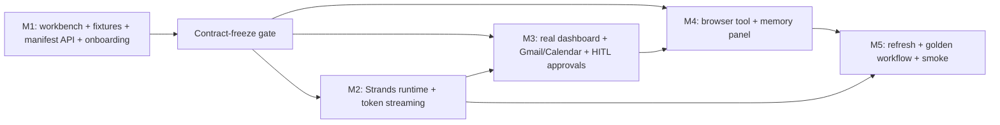
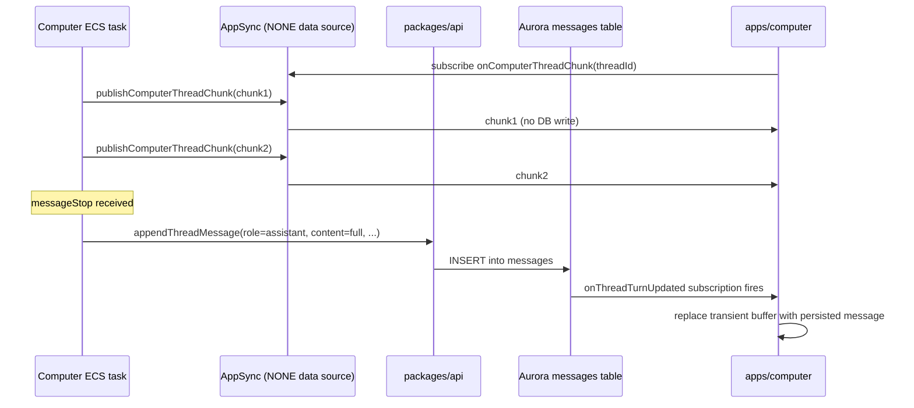

# feat: ThinkWork Computer v1 consolidated

## Summary

Sequence the four active Computer plans (010-runtime, 001, 009, 010-ui) into five testable milestones (M1–M5) that together deliver `apps/computer` v1 as the central end-user surface. The plan does not re-state existing source-plan units — it references them by stable U-ID and adds only the net-new work needed to bind the milestones together (the AppSync streaming wire, the apps/computer approval queue, the memory panel, and a handful of small carry-forwards). M1 ships fixture-driven UX with no runtime substrate; M2–M5 progressively replace fixtures with real Strands-backed Computer behavior and lock the demo behind a deployed-URL smoke gate.

---

## Problem Frame

Four overlapping plans accumulated in parallel sessions. The brainstorm at `docs/brainstorms/2026-05-08-thinkwork-computer-v1-consolidated-requirements.md` resolved the four open product questions (D1–D4) and proposed five testable milestones. This plan is the HOW — how each milestone composes existing source-plan units, what net-new work fills the gaps, and what gates the boundaries between milestones (see origin: `docs/brainstorms/2026-05-08-thinkwork-computer-v1-consolidated-requirements.md`).

Plan 012 (`apps-computer-scaffold`) was a strict subset of plan 001 slice C and is fully shipped via #962; it is superseded by this plan. Plan 001 has only three remaining unshipped units (U4, U12, U14) — U4 is deferred indefinitely; U12 and U14 roll into M5. The runtime substrate (plan 010-runtime) and the dashboard / UI plans (009, 010-ui) carry forward intact and are sequenced under M1–M5.

---

## Requirements

- R1. A pre-provisioned end user can sign into `apps/computer`, see a Perplexity-style workbench, click a starter card, and reach an opened generated dashboard end-to-end on dev (see origin R1).
- R2. Generated artifacts open in a split-view shell with provenance/transcript on the left and the app canvas on the right (see origin R2).
- R3. apps/computer renders the canonical AI streaming UX (token-by-token deltas) sourced from the AppSync subscription channel; per-message persistence flows through the existing `appendThreadMessage` path (see origin R3 + D2).
- R4. Computer-raised HITL approvals render in apps/computer with full payload preview and approve/deny/edit-and-approve controls per plan 010 U6's minimum bar; mobile push opens the same screen in apps/computer (see origin R4 + D1).
- R5. End users see what the Computer remembers about them and can forget any item; memory is cross-thread (see origin R5 + D4).
- R6. Onboarding: operator pre-provisions an end user in admin; first sign-in claims via the existing `bootstrapUser` claim path (see origin R6 + D3).
- R7. Refresh on a generated dashboard reuses the saved recipe deterministically and clearly distinguishes refresh from "Ask Computer" reinterpretation (see origin R7).
- R8. All five milestones are demonstrable on the dev stage by a real human (see origin R8).

**Origin actors:** A1 end user, A2 operator, A3 ThinkWork Computer, A4 delegated worker (out of scope), A5 LastMile CRM MCP, A6 email/calendar + bounded web research, A7 mobile.

**Origin flows:** F1 LastMile CRM dashboard end-to-end, F2 cross-tenant denial, F3 refresh fails on partial source, F4 memory forget, F5 onboarding edge — unprovisioned sign-in.

**Origin acceptance examples:** AE1–AE8.

---

## Scope Boundaries

### Deferred for later

- Mobile inbox rendering of `computer_approval` — push + deep-link only in v1.
- apps/computer mutations of CRM, email, calendar — read-only across all source systems.
- Computer delegation to AgentCore coding-worker (plan 010-runtime U13–U14).
- CE skills folder + `load_skill` shims.
- Routines (plan 010-runtime U11).
- Connector → Computer narrow dispatch endpoint (plan 010-runtime U15) — existing TS dispatcher path stays.
- Voice / BidiAgent mode.
- Multi-Computer-per-user.
- Generic desktop UI / live remote-desktop takeover.
- Real-time refresh subscription on dashboard manifests — short-poll is fine for v1.
- Self-serve sign-up.
- Edit memory items.
- AgentCoreMemorySessionManager — Aurora-backed `SessionManager` for v1.
- Drive / Docs / Sheets native API access — browser tool may operate the web UIs in v1 demos.
- `packages/computer-runtime/` (TS task-dispatcher) deletion — two-deploy grace period.
- Memory expiration / TTL — user-driven forget only.
- Public sharing, anonymous app links, team galleries.
- Arbitrary generated React app hosting.
- In-view dashboard editing.
- Visual regression service (Percy/Chromatic).
- Mobile-native dashboard implementation.

### Outside this product's identity

- A generic BI platform.
- A replacement for LastMile CRM reporting.
- A public app-builder or website-generator.
- Hidden autonomous reinterpretation during routine refresh.
- Workflow automation that mutates external systems.
- A generic app marketplace / CRM replacement UI / BI dashboard builder.
- A shared/public computer.thinkwork.ai (private per-user surface).

### Deferred to Follow-Up Work

- Plan 001 U4 (admin migrate to `@thinkwork/ui`): defer indefinitely. The drift-detection rationale weakens once `apps/computer` is the live consumer; admin migration is debt-cleanup, not feature work. Tracked here so future cleanup PRs can reference it.
- **Contract-freeze pattern solution doc** (was M5 U12 in earlier draft; moved here per scope-guardian review): post-v1 doc capturing the contract-freeze gate as a reusable pattern for future multi-agent plans. The mechanical "don't lose the contract" risk is already covered by the `MEMORY.md` reference and the Risks table; the standalone doc adds institutional value but is not v1 exit-critical.
- **Plan 001 U12 + U14 are integrated into Milestone M5 above; only U4 is deferred indefinitely** (clarification from coherence review).

---

## Context & Research

### Relevant Code and Patterns

- `terraform/schema.graphql` — existing AppSync subscription bridge. Pattern for the new `onComputerThreadChunk` subscription added in U4.
- `packages/database-pg/graphql/types/subscriptions.graphql` — canonical subscription source feeding `terraform/schema.graphql` via `pnpm schema:build`.
- `packages/api/src/graphql/resolvers/core/bootstrapUser.mutation.ts` — `bootstrapUser` claim path at lines 60–110. M1's onboarding wiring re-enables this for `apps/computer`.
- `packages/api/src/lib/memory/hindsight-bank-merge.ts` — Hindsight bank-merge surface that the M4 memory queries/mutations expose.
- `apps/computer/src/routes/_authed/_shell/` — TanStack Router shell where M1 routes land.
- `apps/computer/src/components/ComputerSidebar.tsx` — existing sidebar shell (post-#975 / #977) that M1 integrates with.
- `packages/database-pg/graphql/types/messages.graphql` — `Message.durableArtifact` link used by M1 + M3 for thread-to-artifact navigation.
- `packages/database-pg/graphql/types/computers.graphql` + `packages/api/src/lib/computers/tasks.ts` — existing Computer task-type surface plan 010-runtime U2 extends.
- Plan 010 U6 minimum-viable-UX bar — four required items (legible question, Approve/Deny, edit-and-approve, push notification) carried forward into M3's web approval queue.
- `packages/agentcore-strands/agent-container/container-sources/server.py` — canonical Strands `Agent(...)` setup pattern referenced by plan 010-runtime U3.
- `apps/admin/src/components/threads/ExecutionTrace.tsx` + `apps/admin/src/components/threads/ThreadTraces.tsx` — existing thread-event rendering patterns to mirror in apps/computer (plan 010-ui U3).

### Institutional Learnings

- `docs/solutions/architecture-patterns/inert-first-seam-swap-multi-pr-pattern-2026-05-08.md` — substrate-first ordering. M1 lands the manifest contract + secure API + UI shell against fixtures BEFORE M2 wires the runtime; this is the inert→live seam-swap pattern applied at milestone scale.
- `docs/solutions/runtime-errors/lambda-web-adapter-in-flight-promise-lifecycle-2026-05-06.md` — surface dispatch status in response payload. The AppSync mutation-publish in U4 must surface publish status (for at-least-once-attempted accounting) so smoke tests can pin chunks landed.
- `docs/solutions/architecture-patterns/flue-runtime-launch-2026-05-04.md` — 3-scenario deploy smoke gate pattern. M5's smoke is a Computer-specific extension of this pattern (5 scenarios per plan 010-runtime U4 + the streaming + approval + memory + browser scenarios added by D1–D4).
- `feedback_avoid_fire_and_forget_lambda_invokes` — the AppSync publish mutation in U4 is fire-and-forget by design (ephemeral). The durable persistence path (`appendThreadMessage` in U7) follows the user-driven RequestResponse pattern.
- `feedback_completion_callback_snapshot_pattern` — env vars snapshotted at agent-coroutine entry. Plan 010-runtime U5 already encodes this; carry forward.
- `feedback_hindsight_async_tools` + `feedback_hindsight_recall_reflect_pair` — Hindsight tool wrappers stay async; recall+reflect docstrings ship together. Apply when wiring U10's memory queries.

### External References

- AWS AppSync NONE-datasource mutations: documented pattern for ephemeral pub-sub-style subscriptions without DynamoDB writes. Used by U4 to fire `onComputerThreadChunk` per token chunk.
- Bedrock `converse_stream` / `contentBlockDelta` event shape — referenced by plan 010-runtime U5 for Strands token streaming.
- AgentCore Browser + Nova Act tool integration — already documented in `docs/plans/2026-04-25-002-feat-agentcore-browser-automation-plan.md` and reused by plan 010-runtime U9b.

---

## Key Technical Decisions

### Carried verbatim from origin (D1–D4) — NOT re-litigated here

- **D1 Approvals UX — web-primary, mobile push deep-links to apps/computer.** apps/computer is the canonical approval surface; mobile receives push notifications that deep-link into apps/computer. Mobile inbox rendering of `computer_approval` is deferred. Plan 010-runtime U6's mobile-side rendering is replaced by U8 below; the runtime side of the bridge (writing `inbox` rows, flipping task status) stays.
- **D2 Streaming wire — two-layer AppSync pattern.** Layer 1 (ephemeral): ECS calls `publishComputerThreadChunk(threadId, chunk)` AppSync mutation per Bedrock token chunk; NONE data source, no DB write. Layer 2 (durable): `appendThreadMessage(...)` writes one row per assistant turn at `messageStop`; powers history reload, Hindsight, audit, cost. Optional intermediate snapshot at tool-call boundaries for crash-resume.
- **D3 Onboarding — operator pre-provisions in admin; first sign-in claims.** apps/computer's auto-create-tenant path stays suppressed per plan 013 R8. The existing `bootstrapUser` claim path (`packages/api/src/graphql/resolvers/core/bootstrapUser.mutation.ts:60–110`) is re-enabled for apps/computer.
- **D4 Memory — Read + forget panel; cross-thread; Hindsight-backed.** apps/computer Memory panel lists what Hindsight has retained; user can forget items. No edit. No fixed expiration. Memory is user-scoped per the 2026-04-24 memory scope refactor.

### Plan-time technical decisions (this plan's scope)

- **Five milestones over a single big-bang ship.** M1 ships fixture-driven UX before any runtime work — earlier and stronger demo signal than waiting for the full stack.
- **Source-plan units carry forward intact.** This plan adds only net-new units (~10) to bind the existing ~50 units across plans 009/010-runtime/010-ui. Re-stating units would invite drift; referencing by stable U-ID keeps both documents truthful.
- **Plan 012 superseded, not deleted.** Frontmatter flip from `status: active` → `status: superseded` plus a `superseded_by` pointer preserves history and prevents stale references.
- **Plan 001 U4 deferred indefinitely**, not killed. The migration debt remains real, just not gating apps/computer v1.
- **AppSync subscription channel name = `onComputerThreadChunk(threadId: ID!)`.** Mirrors existing `onThreadUpdated`/`onThreadTurnUpdated` naming per `terraform/schema.graphql`. Frozen at end of M1; M2 implementations across A/B/C agents must agree before parallel work begins.
- **Memory query/mutation names = `computerMemory(userId: ID, limit: Int)` and `forgetComputerMemoryItem(memoryItemId: ID!)`.** Frozen at end of M3; M4 implementations across agents must agree before parallel work begins.

---

## Open Questions

### Resolved During Planning

- **Plan 012 supersede vs delete:** supersede with `status: superseded` + `superseded_by` pointer.
- **Plan 001 U4 scheduling:** deferred indefinitely.
- **Plan 001 U12 + U14 home:** roll into M5.
- **AppSync publish granularity:** per-chunk (~25–50 tokens) is the default in M2; tune in M5 if perceived UX warrants finer/coarser chunks.
- **AppSync auth method (per feasibility F3):** API_KEY for v1 (matches existing `chat-agent-invoke.ts:1163` pattern). IAM SigV4 deferred to compliance follow-up — no working SigV4 reference exists in the repo today, so adopting it is a spike risk we don't need in v1.
- **Cognito client detection for U2 (per feasibility F4):** apps/computer shares the `ThinkworkAdmin` Cognito client; "client-ID detection" is non-viable. U2 is rescoped to verification of the existing `inviteMember` + `myComputer` discovery path (no `bootstrapUser` modification).
- **Memory GraphQL surface (per feasibility F6):** prefer reusing existing `memoryRecords` + `deleteMemoryRecord` from apps/computer client; only add thin alias operations if existing arg shape doesn't fit.
- **Streaming event-type naming (per feasibility F10):** `ComputerThreadChunkEvent` (suffix `Event`) so `schema-build.sh` sed adds AppSync auth directives correctly.
- **U12 retroactive contract-freeze doc:** moved to Deferred Follow-Up Work per scope-guardian — post-v1 institutional cleanup, not M5 exit-critical.

### Deferred to Implementation

- Exact AppSync mutation argument shape (`chunk: AWSJSON` vs explicit fields) — settled in U4 against codegen ergonomics.
- Whether the M3 approval queue is a sidebar item (`/approvals`) or a notification-tray drawer in apps/computer — settled in U8 against existing apps/computer nav after #975.
- Whether memory list pagination is needed in v1 — defaults to `limit: 50` newest-first; revisit if Hindsight produces volumes that exceed the panel.
- Exact retry/timeout policy for the AppSync publish call from ECS — settled in U5 against observed Bedrock chunk cadence.
- Whether memory forget is hard-delete vs soft-delete — defaults to hard-delete (existing `hindsight-adapter.ts:390` behavior); revisit if compliance requires audit trail.
- **Memory item `kind` enum mismatch (per feasibility F6):** D4 names `entities, topics, decisions` (which matches the WikiPage compounding-memory enum), but raw Hindsight `memory_units.fact_type` is `world | experience | opinion | observation`. Decide at U10 implementation: (a) surface raw `memory_units` with their native enum, (b) surface compiled WikiPages instead, or (c) compute a category mapping. Defaults to (a) for the smallest-diff outcome; revisit if UX demands the WikiPage shape.
- **`ComputerMemoryItem.sourceThreadIds` field (per scope-guardian F10):** verify whether `hindsight-adapter` natively tracks per-item thread attribution before building the GraphQL field. If not, drop the field for v1.
- **Plan 010-runtime U10 MCP broker dependency (per scope-guardian F9):** M3's CRM MCP source adapter (plan 009 U4) may require plan 010-runtime U10's brokerage layer. If yes, pull U10 into M3. If plan 009 U4's adapter calls the MCP server directly (bypassing the stdlib broker), document the bypass at U4 implementation. Plan 010-runtime U11 (routines), U12 (delegation), U15 (connector dispatch) are deferred (already in Scope Boundaries).
- **Mobile push deep-link payload shape (per feasibility F7):** new `data.deepLinkUrl` field requires a mobile-side handler in `use-push-notifications.ts` that doesn't exist today. Settled in U9 implementation; a small spike to confirm `Linking.openURL` against the production scheme works on iOS + Android.
- **AppSync invocations-per-second quota (per feasibility F9):** request a quota raise (default 2K → request 5K) before M5 smoke gate to leave headroom for 4×100 enterprise rollout. Operational, not architectural.

---

## High-Level Technical Design

> *This illustrates the intended approach and is directional guidance for review, not implementation specification. The implementing agent should treat it as context, not code to reproduce.*

### Milestone dependency graph

The contract-freeze gate at end of M1 is the single coordination point. Once contracts (subscription event names, mutation signatures, payload shapes) are frozen, M2/M3/M4 can proceed in parallel along their natural dependency edges. M5 closes everything.

### Two-layer streaming wire (D2)

Layer 1 (chunks) and Layer 2 (turn-complete row) are independent channels. A page refresh mid-stream loses the transient buffer but recovers the persisted history on next load.

---

## Implementation Units

### U1. Mark plan 012 as superseded

**Goal:** Flip plan 012's frontmatter to reflect that it's a strict subset of work already shipped; preserve history without leaving a stale "active" plan.

**Requirements:** Plan-hygiene only; not user-visible.

**Dependencies:** None.

**Files:**
- Modify: `docs/plans/2026-05-08-012-feat-apps-computer-scaffold-plan.md` (frontmatter only)

**Approach:**
- Change `status: active` → `status: superseded`.
- Add `superseded_by: docs/plans/2026-05-08-014-feat-thinkwork-computer-v1-consolidated-plan.md`.
- Append one paragraph at the top of the body acknowledging that all units shipped via PR #962 and pointing readers at the consolidated plan.
- Do not delete the file. Do not edit any unit body.

**Test scenarios:**
- Test expectation: none — pure frontmatter/doc edit, no behavioral change.

**Verification:**
- Frontmatter reflects superseded status; consolidated plan path resolves.

---

## Milestone M1 — apps/computer workbench against fixtures + real manifest API + onboarding

**Goal:** Ship the full Perplexity-style apps/computer UX end-to-end against fixture data plus the real manifest contract + secure API. Operator can pre-provision themselves in admin, sign into apps/computer, click a starter card, and open a fixture-backed CRM dashboard in split view. Zero runtime substrate work.

**Demo target:** Real human (Eric) provisions himself in admin → signs into `https://computer.thinkwork.ai` (or local dev `:5180`) via Google → workbench renders → clicks "CRM pipeline risk" starter card → routes to a fixture-backed thread page → opens fixture dashboard in split view → fixture refresh button no-ops gracefully.

**Source-plan units pulled in:**
- Plan 009 U1 (manifest contract + S3 storage + access helpers).
- Plan 009 U2 (secure `dashboardArtifact` query + `refreshDashboardArtifact` mutation).
- Plan 010-ui U1 (Computer UI reference + route map).
- Plan 010-ui U2 (workbench home + composer).
- Plan 010-ui U3 (task dashboard + task thread view).
- Plan 010-ui U4 (Apps gallery with preview cards).
- Plan 010-ui U5 (split-view artifact shell).
- Plan 010-ui U6 (CRM pipeline-risk dashboard app components).
- Plan 010-ui U8 (visual verification + responsive polish — fixture-driven).

**Net-new units in this plan:**

### U2. Verify operator-invite + myComputer-discovery onboarding path

**Goal:** Verify the existing onboarding flow already satisfies D3 ("operator pre-provisions in admin; first sign-in claims") without modifying `bootstrapUser`. Add the integration test that proves it on dev.

**Brainstorm correction (per feasibility review F5):** D3 in the origin pointed at `bootstrapUser` as the resolver. The codebase actually implements the flow via two paths: (a) `inviteMember` mutation (`packages/api/src/graphql/resolvers/core/inviteMember.mutation.ts:62-83`) creates a Cognito user with `custom:tenant_id` set AND a `users` row tied to the operator's tenant, so JWT-based callers are already bound. (b) `apps/computer/src/context/TenantContext.tsx:30-70` deliberately does NOT call `bootstrapUser` (it would silently promote a Google-federated end user to operator of a fresh tenant); instead it uses `discoverTenantViaMyComputer` to resolve the tenant via DB email lookup for any JWT lacking `custom:tenant_id`. The product intent of D3 is met by these two existing paths; this unit verifies and locks them in, not modifies `bootstrapUser`.

**Requirements:** R6, F5; covers AE7.

**Dependencies:** None (M1 entry).

**Files:**
- Test: `packages/api/src/__tests__/inviteMember-computer-claim.test.ts` (integration: invite → Cognito user created with `custom:tenant_id` → users row created with correct tenant binding)
- Test: `apps/computer/src/routes/_authed/-shell-tenant-discovery.test.ts` (integration: invited user signs in → `myComputer` query returns the right tenant → shell renders normal product surface, NOT the "no tenant" CTA)
- Test: `apps/computer/src/routes/_authed/-shell-no-tenant-surface.test.ts` (integration: un-invited Google-federated sign-in → shell renders "no tenant" CTA; no tenant auto-created; matches existing TenantContext.tsx behavior)
- Verify: `apps/admin/src/routes/_authed/_tenant/people/index.tsx` (verify "Add User" wires to `inviteMember` and the operator flow surfaces no errors — no code change expected)

**Approach:**
- This is a verification + test-coverage unit, not a modification unit.
- Read `inviteMember.mutation.ts:62-83` and confirm it sets `custom:tenant_id` on the Cognito user creation. If it doesn't (Google-federated users may not get `custom:tenant_id` populated until first sign-in), the discovery path in TenantContext.tsx covers them.
- Read `apps/computer/src/context/TenantContext.tsx` and confirm `discoverTenantViaMyComputer` resolves the tenant for an invited Google-federated user.
- If the discovery path returns the wrong tenant or fails for invited users, surface the bug — but the bug is upstream in `myComputer` query or `users` lookup, not in onboarding glue. Plan a small follow-up fix unit; do not modify `bootstrapUser`.
- The "no tenant" surface from plan 013 R8 is the existing default when discovery returns nothing; verify it still works.

**Patterns to follow:**
- Existing `inviteMember` callers (admin "Add User" flow).
- Existing `discoverTenantViaMyComputer` integration tests if any exist.

**Test scenarios:**
- Happy path: operator invites `alex@acme.com`; Cognito user is created with `custom:tenant_id=acme`; `users` row exists with correct tenant binding.
- Happy path: alex signs in via Google on apps/computer; `myComputer` resolves the acme tenant; shell renders normal product surface.
- Edge case: alex signs in BEFORE invite; apps/computer renders "no tenant" surface; no tenant created; CTA links to "contact your operator". (Covers existing TenantContext.tsx default.)
- Cross-tenant (covers AE3): bob @ globex cannot sign in and end up in acme's tenant via any path. The discovery query enforces email-to-tenant binding.
- Integration (covers AE7): operator removes user in admin → next sign-in renders "no tenant" surface.

**Verification:**
- Operator flow demonstrable on dev: invite → sign-in → bound to invited tenant; un-invited sign-in → "no tenant" surface.
- No changes to `bootstrapUser.mutation.ts`. Admin's auto-create branch (`bootstrapUser`) remains the operator-self-signup path and is unchanged.

### U3. Commit fixture manifest for CRM pipeline-risk dashboard

**Goal:** Ship a hand-crafted fixture manifest at the path plan 010-ui U6 + U8 expect, so the apps/computer CRM dashboard renders end-to-end without any runtime work.

**Requirements:** R1 (fixture-backed flavor), AE1 (fixture-backed flavor).

**Dependencies:** Plan 009 U1 (manifest schema validator) — this fixture must validate against the v1 schema.

**Files:**
- Create: `apps/computer/src/test/fixtures/crm-pipeline-risk-dashboard.json`
- Test: `apps/computer/src/test/fixtures/crm-pipeline-risk-dashboard.validate.test.ts`

**Approach:**
- Author a realistic LastMile-CRM-shaped fixture: ~12 opportunities across 5 stages, 4 product lines, mixed stale/fresh activity, partial source coverage (CRM = success, email/calendar = success, web = partial), realistic dates within the last 90 days.
- Include malicious-text fixtures: at least one opportunity name with `` to lock in plan 009 U1's text-only rendering invariant.
- Include long-name fixtures: at least one opportunity with an account name that exceeds typical column width to exercise plan 010-ui U6's truncation.
- Manifest must validate against plan 009 U1's `DashboardManifestV1` schema.

**Test scenarios:**
- Happy path: validator from plan 009 U1 accepts the fixture without errors.
- Edge case: malicious-text fields are preserved as plain strings (no transformation that would smuggle markup).
- Integration (covers plan 010-ui U6 happy path): plan 010-ui U6 components render the fixture without text overlap or chart layout breaks.

**Verification:**
- Fixture loads via plan 010-ui U6's loader path; dashboard renders end-to-end in dev.

**M1 Exit Criteria:**
- AE1 against fixture path (workbench → starter → fixture dashboard renders).
- AE2 against fixture path (no real Computer; UI behaves as if Computer wrote the artifact).
- AE3 (cross-tenant denial via plan 009 U2 access checks).
- AE5 against fixture path (refresh control no-ops gracefully).
- AE7 (operator-removes-user revokes access).
- All plan 009 U1 + U2 + plan 010-ui U1–U6 + U8 unit verifications pass.

**Contract-freeze gate fires here.** Before M2/M3/M4 begin in parallel, agents A/B/C must agree on:
- AppSync subscription channel name (`onComputerThreadChunk(threadId: ID!)`) and payload shape.
- AppSync publish-mutation signature (`publishComputerThreadChunk(threadId: ID!, chunk: AWSJSON)`).
- Memory query/mutation signatures from D4 (`computerMemory(...)`, `forgetComputerMemoryItem(...)`).
- Computer task-input/output JSON for the new task types added in plan 010-runtime U2.
- Applet-package shape for the M3 applets reframe:
  `save_app` / `load_app` / `list_apps` tool signatures, `Applet` /
  `AppletPayload` / applet-state GraphQL shapes, allowed applet imports,
  metadata schema, tenant-scoped S3 key layout, browser transform contract,
  `useAppletAPI(appId, instanceId)` hook surface, and deterministic
  `refresh()` return shape. The frozen v1 contract is
  `docs/specs/computer-applet-contract-v1.md`.

Single-agent execution skips the gate (no coordination needed) but still benefits from the contract-fix moment as a self-review pause.

---

## Milestone M2 — Strands runtime replaces TS dispatcher; Computer thinks; token streaming live

**Goal:** Land the Python Strands runtime container, swap it in behind the existing per-Computer ECS reconciler, and wire token streaming end-to-end so apps/computer renders the canonical AI streaming UX. No tools, no dashboards yet — just "Computer thinks and types into the thread."

**Demo target:** Eric clicks New Thread, types a goal that needs no tools (e.g., "summarize what you know about the LastMile CRM opportunity dataset structure"). Watches the Computer's thinking land token-by-token in apps/computer. Refreshing the page mid-stream loses live tokens but the persisted final message reloads via `appendThreadMessage`.

**Source-plan units pulled in:**
- Plan 010-runtime U1 (`packages/computer-stdlib/` skeleton).
- Plan 010-runtime U2 (`computer_tasks.needs_approval` migration + task-type enum extension).
- Plan 010-runtime U3 (`packages/computer-strands/` Computer container scaffold + ECR build pipeline).
- Plan 010-runtime U4 (env-snapshot pattern + 5-scenario deploy smoke gate, partially inert).
- Plan 010-runtime U5 (runtime/session loader + goal loop with iteration budget).

**Net-new units in this plan:**

### U4. AppSync `publishComputerThreadChunk` mutation + `onComputerThreadChunk` subscription

**Goal:** Define the Layer-1 streaming wire from D2 — a NONE-datasource AppSync mutation that fires the per-token-chunk subscription without DB writes.

**Requirements:** R3, AE2; D2 Layer 1.

**Dependencies:** None (can land in parallel with U5 / U6 / U7 within M2).

**Grounding corrections (per feasibility review):**
- **F1:** `scripts/schema-build.sh:12-24` reads only `packages/database-pg/graphql/types/subscriptions.graphql`. The mutation, event type, and subscription must ALL live in that file (not split across `computers.graphql`), or the AppSync deploy silently misses the mutation. Match the existing `notifyNewMessage` + `NewMessageEvent` pattern.
- **F10:** `scripts/schema-build.sh:62-66` sed-appends auth directives only to return types ending in `Event`. The new event type is named **`ComputerThreadChunkEvent`** (not `ComputerThreadChunk`) so AppSync auth directives apply correctly.
- **F2:** Per-Computer ECS task IAM role at `terraform/modules/app/computer-runtime/main.tf:158-204` does NOT currently have `appsync:GraphQL` permission. Adding it is part of this unit's terraform work (or U5 — whoever lands first owns it).

**Files:**
- Modify: `packages/database-pg/graphql/types/subscriptions.graphql` (add `ComputerThreadChunkEvent` type + `publishComputerThreadChunk` mutation + `onComputerThreadChunk` subscription, all in this file)
- Modify: `terraform/schema.graphql` (regenerated via `pnpm schema:build`)
- Modify: `terraform/modules/app/appsync-subscriptions/main.tf` (NONE-datasource resolver for the new mutation)
- Modify: `terraform/modules/app/computer-runtime/main.tf` (add `aws_iam_role_policy` granting `appsync:GraphQL` on the AppSync API ARN; add `var.appsync_api_arn` input)
- Modify: `terraform/modules/app/main.tf` (wire `appsync_api_arn` from the AppSync module to the computer-runtime module)
- Modify: `packages/api/src/graphql/resolvers/computers/` (publish-mutation resolver; passthrough — no DB write)
- Test: `packages/api/src/__tests__/computer-thread-chunk-publish.test.ts`

**Approach:**
- Define `ComputerThreadChunkEvent` GraphQL type with: `threadId: ID!`, `chunk: AWSJSON`, `seq: Int`, `publishedAt: AWSDateTime`.
- Mutation signature: `publishComputerThreadChunk(threadId: ID!, chunk: AWSJSON!, seq: Int!): ComputerThreadChunkEvent!`. NONE data source — resolver returns the args augmented with `publishedAt`. No Aurora write. Subscription fires via `@aws_subscribe`: `onComputerThreadChunk(threadId: ID!): ComputerThreadChunkEvent @aws_subscribe(mutations: ["publishComputerThreadChunk"])`.
- Auth: see Resolved During Planning below for the SigV4-vs-API_KEY decision.
- Run `pnpm schema:build` to regenerate `terraform/schema.graphql`.
- Run `pnpm --filter @thinkwork/admin codegen` + `apps/computer codegen` per the `CLAUDE.md` GraphQL-types rule.

**Execution note:** Start with a failing integration test for the subscription wire (publish → subscribe → receive) before wiring ECS publish in U5.

**Patterns to follow:**
- `notifyNewMessage` mutation + `NewMessageEvent` type pattern in existing `subscriptions.graphql` — same shape, same NONE-datasource flavor.
- AWS AppSync NONE-datasource pattern (`feedback_avoid_fire_and_forget_lambda_invokes` does NOT apply here — this is intentionally fire-and-forget for ephemeral pub-sub).

**Test scenarios:**
- Happy path: integration test invokes `publishComputerThreadChunk` via AppSync; subscriber receives the chunk with correct `threadId`, `chunk`, `seq`, `publishedAt`.
- Edge case: subscriber filtered by a different `threadId` does not receive the chunk.
- Edge case: rapid publish (100 chunks in 1s) — all chunks delivered in order or with monotonically increasing `seq` (ordering fidelity acceptable to ±1 chunk for v1).
- Error path: malformed `chunk` payload (non-JSON) — mutation rejects with a typed error; subscription does not fire.
- Integration (covers AE2): combined with U5 + U6 + U7, the end-to-end wire delivers a full Bedrock token stream to apps/computer.

**Verification:**
- Subscription fires on publish; codegen produces typed clients in admin + apps/computer.

### U5. ECS chunk-publish wiring in Strands Agent loop

**Goal:** Wire the Computer ECS task to publish Bedrock token chunks to AppSync via the U4 mutation as `converse_stream` produces them.

**Requirements:** R3, AE2; D2 Layer 1.

**Dependencies:** U4 (AppSync mutation + subscription). Plan 010-runtime U5 (goal loop existence).

**Grounding corrections (per feasibility review):**
- **F3:** No existing IAM-SigV4 AppSync caller exists in the repo. The existing AppSync notify pattern at `packages/api/src/handlers/chat-agent-invoke.ts:1163-1200` uses `APPSYNC_API_KEY`, not SigV4. See "Resolved During Planning" below for the auth-method decision.
- **F2 (shared with U4):** If U4 hasn't already added the IAM policy to `terraform/modules/app/computer-runtime/main.tf`, U5 owns that change.

**Files:**
- Modify: `packages/computer-strands/agent-container/server.py` (or equivalent entrypoint after plan 010-runtime U3 lands)
- Create: `packages/computer-stdlib/src/computer_stdlib/streaming/appsync_publisher.py`
- Modify: `packages/computer-strands/Dockerfile` (ensure dependencies available — `boto3` for SigV4 OR plain `httpx` for API-key path)
- Modify: `terraform/modules/app/computer-runtime/main.tf` (only if U4 didn't already add the AppSync IAM policy + env vars; coordinate at contract-freeze)
- Test: `packages/computer-stdlib/tests/test_appsync_publisher.py`
- Test: `packages/computer-strands/tests/test_streaming_loop.py`

**Approach:**
- `appsync_publisher.py` exposes `publish_chunk(thread_id, chunk_dict, seq)` that POSTs to the AppSync endpoint with the `publishComputerThreadChunk` mutation body. Auth: API_KEY for v1 (matches `chat-agent-invoke.ts:1163` pattern); SigV4 deferred to compliance follow-up.
- Strands agent loop subscribes to Bedrock `contentBlockDelta` events; for each delta, increments `seq` and calls `publish_chunk(...)`.
- Failure mode: publish failure logs but does NOT fail the agent loop (Layer 1 is best-effort). Layer 2 persistence in U7 is the source of truth.
- Snapshot env vars at agent-coroutine entry per `feedback_completion_callback_snapshot_pattern` — this includes `APPSYNC_API_KEY` and `APPSYNC_ENDPOINT_URL`.
- Retry policy: single retry on transient failure (network, 5xx); no retry on 4xx; no retry budget consumed by streaming (agent loop never blocks on publish).

**Execution note:** Start with a unit test against a mock HTTPS responder before wiring against real AppSync. Follow with an integration test against dev AppSync (real endpoint).

**Patterns to follow:**
- AppSync API_KEY notify pattern at `packages/api/src/handlers/chat-agent-invoke.ts:1163-1200` (the only working AppSync-publish pattern in the repo today).
- Plan 010-runtime U5's goal loop structure.

**Test scenarios:**
- Happy path: single Bedrock turn produces 50 deltas; 50 successful publishes; subscriber receives all 50 in order.
- Edge case: publish times out on chunk 25 — single retry succeeds; loop continues without aborting; final message persists via U7.
- Edge case: publish fails twice on chunk 25 — failure logged; loop continues; chunk 25 is lost from the live stream but the persisted message in U7 is complete.
- Error path: AppSync rejects with 4xx (auth misconfig) — loop logs, alert fires (CloudWatch), agent loop completes the turn, U7 persistence still succeeds.
- Integration (covers AE2): paired with U6 + U7, end-to-end live streaming UX works on dev.

**Verification:**
- Live demo: trigger a Computer turn on dev; apps/computer renders streaming tokens; CloudWatch shows publish-success rate ≥ 99%.

### U6. apps/computer streaming-buffer renderer

**Goal:** Wire apps/computer's task thread view to subscribe to `onComputerThreadChunk(threadId)` and render the canonical AI streaming UX (token-by-token append into the assistant message bubble).

**Requirements:** R3, AE2; D2 Layer 1.

**Dependencies:** U4. Plan 010-ui U3 (task thread view exists).

**Files:**
- Modify: `apps/computer/src/components/computer/TaskThreadView.tsx`
- Create: `apps/computer/src/components/computer/StreamingMessageBuffer.tsx`
- Create: `apps/computer/src/lib/use-computer-thread-chunks.ts`
- Modify: `apps/computer/src/lib/graphql-queries.ts` (add subscription)
- Test: `apps/computer/src/components/computer/StreamingMessageBuffer.test.tsx`
- Test: `apps/computer/src/lib/use-computer-thread-chunks.test.ts`

**Approach:**
- `useComputerThreadChunks(threadId)` urql subscription hook returns an ordered chunk list keyed by `seq`; deduplicates and reorders out-of-order arrivals up to ±2 positions (drops anything farther out of order; logs).
- `StreamingMessageBuffer` receives the chunk list, concatenates `chunk.text`, and renders into a "streaming" message bubble with a subtle pulsing indicator.
- On `onThreadTurnUpdated` (the existing subscription that fires when U7's `appendThreadMessage` writes), replace the streaming buffer with the persisted message.
- Stale buffers (subscription dropped or page refreshed mid-stream) clear on next thread-load.

**Patterns to follow:**
- Existing urql subscription patterns in `apps/admin/src/routes/_authed/_tenant/threads/$threadId.tsx` (note: admin subscribes to `onThreadUpdated`/`onThreadTurnUpdated` only; the chunk subscription is new for apps/computer).
- Plan 010-ui U3's TaskThreadView component.

**Test scenarios:**
- Happy path: 50 chunks subscribed in order; buffer renders concatenated text; turn-complete event replaces buffer with persisted message.
- Edge case: chunks arrive out of order (seq 1, 3, 2, 4); buffer reorders; final text is correct.
- Edge case: subscription drops mid-stream; existing buffer text remains visible until turn-complete event fires from U7's persisted row.
- Error path: subscription re-establishes after drop; new chunks resume into the buffer at the right seq.
- Integration (covers AE2): paired with U4 + U5 + U7, end-to-end streaming UX renders correctly.

**Verification:**
- Live demo: streaming text appears in apps/computer; mid-stream refresh re-loads persisted message via U7's path.

### U7. `appendThreadMessage` durable persistence wiring on `messageStop`

**Goal:** Wire the Computer ECS task to write the canonical assistant message row to Aurora at turn completion via the existing `appendThreadMessage` GraphQL mutation. This is D2 Layer 2 — the source of truth for history reload, Hindsight, audit, cost.

**Requirements:** R3, AE2; D2 Layer 2.

**Dependencies:** Plan 010-runtime U5 (goal loop). U4 + U5 (so U7 can replace the streaming buffer with the persisted row via `onThreadTurnUpdated`).

**Files:**
- Modify: `packages/computer-strands/agent-container/server.py` (or equivalent)
- Create: `packages/computer-stdlib/src/computer_stdlib/persistence/append_message.py`
- Test: `packages/computer-stdlib/tests/test_append_message.py`
- Test: `packages/computer-strands/tests/test_message_persistence.py`

**Approach:**
- On Bedrock `messageStop`, ECS calls existing GraphQL mutation `appendThreadMessage(threadId, role=assistant, content=<full text>, toolCalls=<...>, toolResults=<...>, ...)` via the existing graphql-http endpoint with the per-Computer task IAM auth.
- Optional intermediate snapshot at tool-call boundaries: write a partial message row with `status=streaming` so a crashed ECS restart can resume from the last tool boundary. (Snapshot is plan 010-runtime U6 territory; this unit ships only the turn-complete write.)
- Use the `feedback_completion_callback_snapshot_pattern`: snapshot `THINKWORK_API_URL` + `API_AUTH_SECRET` at agent-coroutine entry; do NOT re-read os.environ after the agent turn.
- Failure mode: persistence failure is fatal to the turn (turn marked failed in `computer_tasks`); chunks already published in U5 are orphaned but the turn does not silently succeed.

**Execution note:** Test-first against the existing `appendThreadMessage` mutation; verify the mutation contract has not drifted.

**Patterns to follow:**
- Existing `appendThreadMessage` callers in `packages/api/src/lib/` (search for `appendThreadMessage` GraphQL clients).
- `feedback_completion_callback_snapshot_pattern`.

**Test scenarios:**
- Happy path: turn completes; `appendThreadMessage` succeeds; row visible in Aurora; `onThreadTurnUpdated` subscription fires; admin and apps/computer thread reload show the persisted message.
- Edge case: turn produces empty content (Bedrock returned no text) — still write a row with empty content + tool-call evidence; downstream UI handles gracefully.
- Error path: `appendThreadMessage` returns 5xx — turn is marked failed; alert fires; ECS does not retry indefinitely (single retry, then fail).
- Integration (covers AE2 + Hindsight): paired with M4's memory ingestion, persisted messages flow into Hindsight bank-merge.

**Verification:**
- Live demo: trigger turn, see persisted row in Aurora; refresh apps/computer page mid-stream; reload shows the final persisted message.

**M2 Exit Criteria:**
- AE2 against real Computer (not fixture).
- Plan 010-runtime U1 + U2 + U3 + U4 + U5 unit verifications pass.
- 5-scenario deploy smoke gate (plan 010-runtime U4) passes for `fresh-thread`, `multi-turn-history`, and `memory-bearing` (the latter two paired with U7's persistence).

---

## Milestone M3 — Computer creates a real dashboard from CRM + Gmail/Calendar with HITL approval on web

**Goal:** Replace M1's fixture path with a real Computer-driven dashboard generation. Computer reads LastMile CRM, raises HITL approval for Gmail metadata, user approves in apps/computer, dashboard generates end-to-end. Mobile push deep-links to apps/computer for the approval interaction.

**Demo target:** Eric asks for "pipeline risk on LastMile opps." Computer reads CRM, raises an approval to read Gmail metadata; Eric approves in apps/computer's approval queue (or via mobile push that deep-links into apps/computer); Computer completes; dashboard appears.

**Source-plan units pulled in:**
- Plan 009 U3 (Computer task contract `dashboard_artifact_refresh` + lifecycle events).
- Plan 009 U4 (read-only source adapters: CRM MCP, email/calendar, web research).
- Plan 009 U5 (pipeline-risk transforms, scoring, templated summaries).
- Plan 009 U6 (initial dashboard generation from a Computer thread).
- Plan 010-runtime U6 (approvals + Aurora SessionManager). **Adaptation:** mobile inbox rendering of `computer_approval` is replaced by U8 below; the runtime side of the bridge stays unchanged.
- Plan 010-runtime U7 (workspace/workpapers tools — required for evidence storage during dashboard generation).
- Plan 010-runtime U9 (Google Workspace read tools — Gmail metadata + Calendar upcoming).
- Plan 010-ui U7 (refresh + reinterpretation UX states wired to the real Computer task).

**Net-new units in this plan:**

### U8. apps/computer approval queue UI

**Goal:** Surface Computer-raised HITL approvals inside apps/computer per D1 + plan 010 U6 minimum bar (legible question, Approve/Deny, edit-and-approve for the email-send case, push-notification deep-link target).

**Requirements:** R4, AE4; D1.

**Dependencies:** Plan 010-runtime U6 (approval bridge writes to `inbox` rows).

**Files:**
- Create: `apps/computer/src/routes/_authed/_shell/approvals.index.tsx`
- Create: `apps/computer/src/routes/_authed/_shell/approvals.$approvalId.tsx`
- Create: `apps/computer/src/components/approvals/ApprovalQueue.tsx`
- Create: `apps/computer/src/components/approvals/ApprovalDetail.tsx`
- Create: `apps/computer/src/components/approvals/EditAndApproveForm.tsx`
- Modify: `apps/computer/src/components/ComputerSidebar.tsx` (add Approvals nav item with pending-count badge)
- Modify: `apps/computer/src/lib/graphql-queries.ts` (computer_approval inbox queries + respond mutation)
- Test: `apps/computer/src/components/approvals/ApprovalQueue.test.tsx`
- Test: `apps/computer/src/components/approvals/ApprovalDetail.test.tsx`
- Test: `apps/computer/src/components/approvals/EditAndApproveForm.test.tsx`

**Approach:**
- Approval queue route shows pending `computer_approval` inbox rows for the caller's user, sorted newest-first.
- Approval detail route shows full payload preview (question text, action description, evidence — e.g., the email draft for an email-send approval).
- Approve/Deny buttons call `POST /api/computers/approval/respond` (or equivalent — the existing endpoint plan 010-runtime U6 ships).
- Edit-and-approve: for `action_type=email_send` approvals, render the draft in an editable textarea; submitted edits override the draft before approval flips the task back to running.
- Sidebar pending-count badge reads from a lightweight count query.
- Empty state: "No pending approvals."

**Patterns to follow:**
- Plan 010 U6's mobile-side minimum bar (legible question, Approve/Deny, edit-and-approve, push notification) — the four items must all be supported on web.
- Existing `apps/admin` admin approval flows (if any) for routine-approval bridge.

**Test scenarios:**
- Happy path (covers AE4): pending approval appears in queue; user clicks Approve; mutation fires; task flips back to running; queue empty.
- Happy path (edit-and-approve): email-send approval renders editable draft; user edits draft and approves; submitted action carries edited content.
- Edge case: approval expires (task timed out) — queue still shows it with a "stale" badge; approve no-ops with a clear message.
- Error path: approve mutation fails (network, 5xx); button re-enables; user can retry; no double-respond.
- Integration: paired with U9 + plan 010-runtime U6, web approval flips the runtime task and the response includes the deep-link target for mobile push.

**Verification:**
- AE4 demonstrable end-to-end on dev.

### U9. Mobile push deep-link to apps/computer

**Goal:** On approval-creation, fire a push notification to mobile that deep-links into apps/computer's approval-detail route. Exclude `computer_approval` from the mobile inbox feed query so it doesn't double-render alongside the push.

**Requirements:** R4, AE4; D1.

**Dependencies:** Plan 010-runtime U6 (approval bridge writes to `inbox` rows). U8 (target route for the deep-link).

**Grounding corrections (per feasibility review F7 + scope-guardian):**
- The push module path is `packages/api/src/lib/push-notifications.ts`. There is no `notifications/` directory.
- Existing Expo push payload routes via `data.threadId` for deep-link interpretation in mobile's `use-push-notifications.ts`. There is NO existing support for arbitrary URL deep-links — that's new mobile-side work.
- **Scope reduction (scope-guardian F2):** Drop the "Open in Computer CTA row" component — it's mobile inbox UI that's deferred per the brainstorm scope boundary ("push + deep-link only"). Mobile-side work shrinks to (a) excluding `computer_approval` from the inbox feed query, and (b) the push handler.
- **Plan 010-runtime U6 conflict (scope-guardian F8):** plan 010-runtime U6 originally specs mobile-side `computer_approval` rendering. THIS unit supersedes that mobile rendering — implementers must NOT pull in U6's mobile rendering when applying this plan.

**Files:**
- Modify: `apps/mobile/src/inbox/...` (filter `type='computer_approval'` out of the inbox feed query — single-line filter, no UI components)
- Modify: `apps/mobile/src/notifications/use-push-notifications.ts` (add a new `data.type === 'computer_approval'` branch that opens the deep-link via `Linking.openURL(data.deepLinkUrl)`)
- Modify: `packages/api/src/lib/push-notifications.ts` (add `computer_approval` push template — title, body, `data.deepLinkUrl`)
- Modify: `packages/api/src/lib/computers/approvals.ts` (or wherever plan 010-runtime U6's approval-creation handler lands — fire the push on `inbox` row insert)
- Test: `apps/mobile/src/inbox/__tests__/computer-approval-feed-filter.test.ts`
- Test: `apps/mobile/src/notifications/__tests__/use-push-notifications-computer-approval.test.ts`
- Test: `packages/api/src/__tests__/computer-approval-push.test.ts`

**Approach:**
- Inbox feed query: extend the existing `WHERE type != 'computer_approval'` filter (or add it if not present). Single change, no new UI.
- Push template: title = "Approval needed", body = first 100 chars of question text, `data: { type: "computer_approval", approvalId, deepLinkUrl: "https://computer.thinkwork.ai/approvals/<id>" }`.
- Mobile-side push handler in `use-push-notifications.ts`: on `data.type === "computer_approval"`, call `Linking.openURL(data.deepLinkUrl)`. Existing `data.threadId` branch unchanged.
- Approval-creation handler fires the push synchronously after the `inbox` row insert succeeds. Push delivery failure is logged but does NOT fail the approval creation (the approval queue in apps/computer is the durable surface).

**Patterns to follow:**
- Existing `notifyNewMessage` push templates in `packages/api/src/lib/push-notifications.ts`.
- Mobile `use-push-notifications.ts` `data.threadId` branch — clone shape for `data.type === "computer_approval"`.

**Test scenarios:**
- Happy path (covers AE4 mobile leg): approval created → push fires → mobile shows notification → tapping opens apps/computer at the approval-detail screen via `Linking.openURL`.
- Edge case: user has push notifications disabled — apps/computer's approval queue (U8) still shows pending approval; web-primary flow works without mobile.
- Edge case: `computer_approval` row exists in the database — does NOT appear in mobile inbox feed (filter works).
- Error path: push delivery fails (FCM/APNs error) — failure logged; approval queue in apps/computer still surfaces the pending approval; approval-creation succeeds regardless.
- Integration: paired with U8, end-to-end web-primary approval flow works whether the user starts on web or receives a mobile push.

**Verification:**
- AE4 mobile leg demonstrable on dev with a real iOS device or browser-based push simulator.
- Mobile inbox does NOT render any `computer_approval` row (verify with a test row in the database).

**M3 Exit Criteria:**
- AE1 (real Computer end-to-end), AE4, AE5 all pass.
- Plan 009 U3 + U4 + U5 + U6 unit verifications pass.
- Plan 010-runtime U6 + U7 + U9 unit verifications pass (with U6's mobile-side adaptations honored).
- Plan 010-ui U7 unit verification passes.

---

## Milestone M4 — Browser tool feeds dashboard evidence; memory panel lands

**Goal:** Add the AgentCore Browser tool so Computer can browse for company/account signals and attach evidence to dashboards. Add the apps/computer Memory panel so users can see and forget what Hindsight has retained.

**Demo target:** Eric asks for "deeper risk analysis including company news for the top 3 stale opportunities." Computer browses public sources, captures screenshot evidence, attaches to dashboard's evidence drawer. Memory panel shows what was retained from the M3 run; Eric forgets one item; next thread doesn't recall it.

**Source-plan units pulled in:**
- Plan 010-runtime U9b (admin-enabled AgentCore Browser + Nova Act tool with policy gates, screenshot/session artifacts, cost attribution).
- Plan 010-runtime U8 (Hindsight memory module — recall + reflect tool wrappers).

**Net-new units in this plan:**

### U10. Surface user-scoped memory to apps/computer (reuse existing memoryRecords + deleteMemoryRecord)

**Goal:** Make user-scoped memory readable and forgettable from apps/computer per D4. Prefer reusing the existing GraphQL memory surface; only add a thin wrapper if scoping ergonomics demand it.

**Requirements:** R5, AE6; D4.

**Dependencies:** None (can land in parallel with U11 and plan 010-runtime U8).

**Grounding corrections (per feasibility review F6):**
- The recall/reflect/forget primitives live in `packages/api/src/lib/memory/adapters/hindsight-adapter.ts`, NOT in `hindsight-bank-merge.ts` (which is a legacy bank → user bank migration utility).
- `hindsight-adapter.ts:390` already exposes `async forget(recordId: string): Promise<void>` (`DELETE FROM hindsight.memory_units WHERE id = ${recordId}::uuid`). Hard-delete primitive exists.
- `packages/database-pg/graphql/types/memory.graphql` already exposes `memoryRecords(...)` query at line 94 and `deleteMemoryRecord(tenantId, userId, assistantId, memoryRecordId): Boolean!` mutation at line 101. **Default to reusing these from apps/computer rather than creating parallel `computerMemory` / `forgetComputerMemoryItem` operations.** Only add the wrapper queries if existing arg shape (e.g., requiring `assistantId`) is wrong for an apps/computer caller that may have multiple Computers but cares about user-level aggregation.
- The brainstorm's enum hint (`entity | topic | decision`) matches the WikiPage type (compounding-memory compiled artifacts), NOT raw Hindsight `memory_units` (whose `fact_type` is `world | experience | opinion | observation`). This is a real ambiguity in D4 — see Open Questions below.

**Files:**
- Verify: `packages/database-pg/graphql/types/memory.graphql` (existing `memoryRecords` + `deleteMemoryRecord` shape — confirm fits apps/computer caller)
- Verify: `packages/api/src/lib/memory/adapters/hindsight-adapter.ts` (existing `forget` primitive at line 390 — confirm wired to existing `deleteMemoryRecord` resolver)
- Modify (only if existing shape doesn't fit): `packages/database-pg/graphql/types/memory.graphql` (add `computerMemory` thin alias query and `forgetComputerMemoryItem` thin alias mutation that delegate to existing resolvers)
- Create (only if added above): `packages/api/src/graphql/resolvers/memory/computerMemory.query.ts`, `packages/api/src/graphql/resolvers/memory/forgetComputerMemoryItem.mutation.ts`
- Test: `packages/api/src/__tests__/computer-memory-apps-computer-caller.test.ts` (integration: apps/computer caller can list + forget without admin-scoped args)

**Approach:**
- **Step 1: try reuse.** Wire apps/computer's Memory panel (U11) to consume the existing `memoryRecords` and `deleteMemoryRecord` operations. If the existing arg shape works for the apps/computer caller (which has the user's tenant + user IDs from the JWT), no new GraphQL operations are needed. This is the smallest-diff outcome.
- **Step 2: if reuse fails,** add thin alias operations that delegate to the existing resolvers but with apps/computer-friendly default args (e.g., `userId` defaults to caller; `assistantId` is optional / ignored at the user-aggregate level). Document why the alias exists.
- Audit trail: existing `deleteMemoryRecord` may already log a `memory.forget` event; if not, add it.
- Hindsight wrappers stay async per `feedback_hindsight_async_tools`. Forget is hard-delete (existing behavior); soft-delete deferred to compliance follow-up.

**Patterns to follow:**
- Existing `memoryRecords` callers in admin (if any) for shape reuse.
- `feedback_hindsight_async_tools` + `feedback_hindsight_recall_reflect_pair`.

**Test scenarios:**
- Happy path: apps/computer caller queries `memoryRecords` (or alias) and receives their own user-scoped items; matches `hindsight-adapter` state.
- Happy path: caller forgets via `deleteMemoryRecord` (or alias); subsequent query does not return it; subsequent agent run does not recall it.
- Edge case: empty memory state returns `[]` not null.
- Edge case: caller queries another user's records — denied (existing tenant+user authz scoping).
- Error path: forget on a non-existent ID returns `false` without throwing (existing behavior).
- Integration (covers AE6): paired with U11 + plan 010-runtime U8, the full memory loop works end-to-end.

**Verification:**
- Live demo: list + forget visible via GraphQL playground or direct API call from apps/computer.
- Decision recorded in commit message: "reused `memoryRecords`+`deleteMemoryRecord`" OR "added thin aliases because <reason>".

### U11. apps/computer Memory panel UI

**Goal:** Add a Memory route + sidebar nav item to apps/computer that lists user-scoped memory items and lets the user forget any item per D4.

**Requirements:** R5, AE6; D4.

**Dependencies:** U10 (GraphQL surface).

**Files:**
- Create: `apps/computer/src/routes/_authed/_shell/memory.index.tsx`
- Create: `apps/computer/src/components/memory/MemoryPanel.tsx`
- Create: `apps/computer/src/components/memory/MemoryItemCard.tsx`
- Create: `apps/computer/src/components/memory/ForgetConfirmDialog.tsx`
- Modify: `apps/computer/src/components/ComputerSidebar.tsx` (add Memory nav item)
- Modify: `apps/computer/src/lib/graphql-queries.ts` (computerMemory query + forget mutation)
- Test: `apps/computer/src/components/memory/MemoryPanel.test.tsx`
- Test: `apps/computer/src/components/memory/ForgetConfirmDialog.test.tsx`

**Approach:**
- Memory panel renders items grouped by kind (Entities / Topics / Decisions).
- Each `MemoryItemCard` shows title, body, first-seen / last-seen timestamps, source thread links, and a "Forget" button.
- Clicking Forget opens `ForgetConfirmDialog` with the item title — confirm + Forget calls `forgetComputerMemoryItem(memoryItemId)`.
- After forget, item is optimistically removed from the panel; query refetches in the background to confirm.
- Empty state: "Your Computer hasn't remembered anything yet."

**Patterns to follow:**
- Existing apps/computer route + component patterns from M1 (e.g., the Apps gallery card UI).
- Existing dialog + confirm patterns from `apps/admin` (post-extraction these live in `@thinkwork/ui`).

**Test scenarios:**
- Happy path: panel renders memory items grouped by kind.
- Happy path (covers AE6): user clicks Forget → confirms → item removed; next agent run does not recall.
- Edge case: empty memory state shows the empty-state message.
- Error path: forget mutation fails (network); item re-appears with a toast error.
- Integration (covers AE6 end-to-end): paired with U10, the full read+forget loop works on dev.

**Verification:**
- AE6 demonstrable end-to-end on dev.

**M4 Exit Criteria:**
- AE6 passes.
- Browser evidence (screenshots + URL/title fetched-at metadata) appears in dashboard evidence drawers when the source kind is web research.
- Plan 010-runtime U8 + U9b unit verifications pass.

---

## Milestone M5 — Refresh + golden workflow + dev-URL smoke

**Goal:** Ship the deterministic refresh path end-to-end, lock the golden-workflow demo behind a smoke gate, and close the M5-deferred plan 001 leftovers.

**Demo target:** One scripted end-to-end demo runs reliably on dev: provision-user → sign-in → starter-card → Computer thread → applet generated → applet open path → deterministic refresh → applet state persistence → memory retained → cross-tenant denial confirmed. Smoke script gates regressions on every deploy.

**Source-plan units pulled in:**
- Plan 009 U7 (apps/computer dashboard artifact viewer — final polish on top of M1).
- Plan 009 U8 (refresh end-to-end + thread/timeline integration).
- Plan 009 U9 (documentation, fixtures, end-to-end smoke).
- Plan 010-runtime U16 (golden-workflow E2E + browser-backed acceptance gate).
- Plan 001 U12 (CORS audit).
- Plan 001 U14 (deployed-URL smoke + README).

**No net-new units in M5.** U12 (retroactive contract-freeze documentation) is moved to Deferred Follow-Up Work per scope-guardian review — it's post-v1 institutional cleanup, not exit-critical.

**M5 Exit Criteria:**
- AE7, AE8, all earlier AEs pass.
- `scripts/smoke-computer.sh dev` returns 0 against `https://computer.thinkwork.ai`.
- Smoke gate live in `deploy.yml` (5-scenario gate from plan 010-runtime U4 plus the streaming + approval + memory + browser scenarios).
- Applet smoke scenarios pass inside `scripts/smoke-computer.sh dev`: A1 writer path returns `ok`/`validated`/`persisted`; A2 `/apps/$appId` serves the SPA shell; A3 deterministic `refresh()` returns per-source statuses; A4 applet state write/read round-trips; A5 the canonical LastMile CRM applet fixture is seeded and opens through the applet route.
- Plan 001 U12 + U14 unit verifications pass.
- Plan 009 U7 + U8 + U9 unit verifications pass.
- Plan 010-runtime U16 unit verification passes.

---

## Execution Guidance

This plan supports two execution modes. Single-agent sequential is the default; the multi-agent split is optional acceleration after M1.

### Single-agent sequential (default)

A single agent works M1 → M2 → M3 → M4 → M5 with no cross-agent coordination overhead. The contract-freeze gate at end of M1 is still useful as a self-review pause but does not require cross-agent agreement.

### Three-agent A/B/C split (optional, from M2 onward)

| Agent | Surface | M1 load | M2–M5 load |
|---|---|---|---|
| **A — Frontend / UI** | apps/computer + apps/mobile inbox-feed filter + memory panel + approval queue + streaming buffer | Heavy (all UI) | M2 U6, M3 U8 + U9 (mobile-side), M4 U11 |
| **B — API / Manifest** | dashboard-artifacts module + GraphQL schema + AppSync subscription bridge + memory verification + onboarding verification | Heavy (plan 009 U1 + U2 + U2 verification) | M2 U4, M3 plan-009 units + U9 (server-side push), M4 U10 |
| **C — Runtime / Container** | computer-stdlib + computer-strands + browser tool + Hindsight integration + ECS chunk publish + appendThreadMessage wiring + smoke gate | Light (no runtime in M1) | M2 plan-010-runtime U1–U5 + U5 + U7, M3 plan-010-runtime U6 + U7 + U9, M4 plan-010-runtime U8 + U9b, M5 plan-010-runtime U16 + U14 smoke |

**Boundary contracts (frozen at end of M1):**
- A↔B: GraphQL schema (manifest types, dashboard query, refresh mutation, approval queue queries, memory queries, AppSync subscription `onComputerThreadChunk`).
- B↔C: Computer task input/output JSON, manifest schema validation, AppSync mutation-publish endpoint contract.
- A↔C: none direct (always via B).

**Conflict surfaces (must coordinate):**
- `packages/api/src/lib/computers/tasks.ts` — both B (approval helper wiring) and C (task-type enum). Land C first.
- `packages/database-pg/graphql/types/computers.graphql` — only B; A consumes via codegen.
- `packages/api/src/handlers/computer-runtime.ts` — both B and C may touch. Pre-agree ownership at contract-freeze.

**Dependency edges:** B's GraphQL schema lands first (M2 U4); A and C build against the contract. C's plan-010-runtime U2 schema migration must merge before B's any-route calls into the new task types.

The split is OPTIONAL — single-agent execution remains trivially valid. Do not block M2 on three-agent recruitment.

---

## System-Wide Impact

- **Interaction graph:** apps/computer is now central; admin remains operator-only; mobile inbox simplified for `computer_approval`. Computer ECS task gains a new outbound HTTPS surface (AppSync publish) plus the existing Aurora write surface. Hindsight gains a list+forget API surface alongside its existing recall+reflect surface.
- **Error propagation:** Layer 1 (streaming) failures are best-effort — logged but non-fatal. Layer 2 (durable persistence) failures are fatal to the turn — the task is marked failed; the turn does not silently succeed. Approval failures cascade to the runtime task being unable to proceed; UI surfaces this in the approval queue with a "stale" badge.
- **State lifecycle risks:** Mid-stream drops lose live tokens but persisted history is whole on next page load. Memory forget is hard-delete by default — once forgotten, gone (no recovery in v1).
- **API surface parity:** No mobile-side dashboard rendering in v1; mobile push deep-links to apps/computer for any rich interaction. Admin is unchanged outside the operator "Add User" flow (already wired pre-#982).
- **Integration coverage:** The full M1→M5 path exercises every cross-layer seam (auth claim → GraphQL → ECS task → AppSync publish → browser subscription → DB write → Hindsight ingestion → memory panel forget). M5's smoke gate locks this path.
- **Unchanged invariants:** apps/admin admin SPA; per-Computer ECS reconciler infrastructure; existing thread message subscriptions; Cognito setup; existing connector dispatch path.

---

## Risks & Dependencies

| Risk | Likelihood | Impact | Mitigation |
|---|---|---|---|
| AppSync publish rate exceeds quota at enterprise scale (4 enterprises × 100+ Computers, peak concurrent streams) | Medium | High | Burst budget planning at M2; monitor publish-success rate; coarsen chunk granularity (~100 tokens/chunk) if approaching quota. Documented in plan 010-runtime U10 observability. |
| Strands `converse_stream` chunk cadence too granular (overwhelming AppSync subscriber) | Medium | Medium | Server-side coalesce in U5: buffer chunks for ~50ms or until 50 tokens, whichever fires first. Tune in M5 against perceived UX. |
| `bootstrapUser` claim path regression breaks admin auto-create branch | Low | High | U2 must include explicit tests for both branches (admin auto-create vs apps/computer claim-only). Existing admin tests stay green. |
| Mobile push delivery fails silently (no fallback signal to user) | Medium | Medium | U9 surfaces approval in apps/computer queue regardless of push state — push is best-effort. CloudWatch alert on push-delivery-failure rate >5%. |
| Hindsight forget produces inconsistent state (recall still surfaces forgotten item) | Low | High | U10's hard-delete must clear Hindsight bank-merge AND any agent-side memory cache. Test scenario covers: forget → new thread → no recall. |
| Plan 010-runtime U6's Aurora SessionManager not battle-tested at scale | Medium | High | M2 starts with iteration-budget cap (already in plan 010-runtime U5) so a runaway loop can't exhaust DB connections. Monitor via plan 010-runtime U10 observability. |
| Contract-freeze gate skipped under single-agent execution → drift later if a second agent is added | Low | Medium | Document the frozen contract in U12 retroactive doc; reference in `MEMORY.md` so future plan additions catch the boundary explicitly. |
| Plan 012 supersede causes broken cross-references in existing plan bodies | Low | Low | U1 only modifies frontmatter + adds a paragraph; existing references resolve. |
| AppSync NONE-datasource mutation is unfamiliar pattern in this repo | Medium | Medium | U4 ships an integration test that exercises the wire end-to-end before U5 builds against it. Pattern documented in U12 retroactive solution doc. |

---

## Documentation Plan

- M1 lands a `docs/src/content/docs/concepts/computer/dashboard-artifacts.mdx` (per plan 009 U9 carry-forward).
- M3 extends the dashboard-artifacts doc with the approval flow (web-primary + mobile push deep-link per D1).
- M4 lands a `docs/src/content/docs/concepts/computer/memory.mdx` describing the read+forget contract per D4.
- M5 lands the U12 contract-freeze retroactive solution doc.
- README updates in `apps/computer/README.md` for the dev smoke script (plan 001 U14).

---

## Operational / Rollout Notes

- M2 swaps the per-Computer ECS image SHA. Existing TS task-dispatcher (`packages/computer-runtime/`) stays in repo for a two-deploy grace period (deferred-for-later); deletion is a separate cleanup PR.
- The AppSync NONE-datasource resolver added in U4 has minimal cost impact (no DynamoDB reads/writes per publish); cost is per-request only. Estimate: 50 chunks/turn × 100 turns/day × 100 Computers = 500K AppSync requests/day; well within the AppSync free tier for v1 enterprise scale.
- Hindsight bank-merge forget must be idempotent and audit-logged for compliance. U10 records `memory.forget` audit events.
- M5's smoke gate runs against the deployed dev stage; production rollout is a separate later concern (per plan 001 U10's existing Terraform).

---

## Sources & References

- **Origin document:** [docs/brainstorms/2026-05-08-thinkwork-computer-v1-consolidated-requirements.md](docs/brainstorms/2026-05-08-thinkwork-computer-v1-consolidated-requirements.md)
- **Source plans (consolidated):**
  - [docs/plans/2026-05-07-010-feat-thinkwork-computer-on-strands-plan.md](docs/plans/2026-05-07-010-feat-thinkwork-computer-on-strands-plan.md)
  - [docs/plans/2026-05-08-001-feat-computer-thinkwork-ai-end-user-app-plan.md](docs/plans/2026-05-08-001-feat-computer-thinkwork-ai-end-user-app-plan.md)
  - [docs/plans/2026-05-08-009-feat-computer-generated-dashboard-artifacts-plan.md](docs/plans/2026-05-08-009-feat-computer-generated-dashboard-artifacts-plan.md)
  - [docs/plans/2026-05-08-010-feat-computer-app-artifact-ui-plan.md](docs/plans/2026-05-08-010-feat-computer-app-artifact-ui-plan.md)
- **Plan superseded:** [docs/plans/2026-05-08-012-feat-apps-computer-scaffold-plan.md](docs/plans/2026-05-08-012-feat-apps-computer-scaffold-plan.md)
- **Adjacent shipped plan:** [docs/plans/2026-05-08-013-feat-computer-auth-and-threads-plan.md](docs/plans/2026-05-08-013-feat-computer-auth-and-threads-plan.md)
- **Origin brainstorm for plans 009 + 010-ui:** `docs/brainstorms/2026-05-08-computer-generated-research-dashboard-artifacts-requirements.md`
- **Recently merged context (admin reframe arc — done):** #963, #964, #965, #967, #969, #972, #973, #976
- **apps/computer infra (already shipped):** #966, #968, #970, #971, #974, #975
- **Scaffold (already shipped, plan 012 superseded):** #962
- **@thinkwork/ui (already shipped):** #959, #961
- **Plan 009 + 010-ui imports:** #978, #980
- **Consolidated brainstorm import:** #982
- **AppSync subscription bridge in repo:** `terraform/schema.graphql`
- **Hindsight bank-merge:** `packages/api/src/lib/memory/hindsight-bank-merge.ts`
- **bootstrapUser claim path:** `packages/api/src/graphql/resolvers/core/bootstrapUser.mutation.ts`
