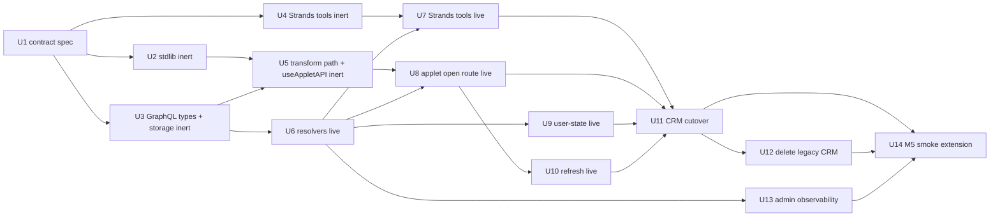

# feat: ThinkWork Computer applets reframe (M3 swap)

## Implementation Status

U1-U14 and the follow-up Computer route rename are merged. The end-user
collection route is now `/artifacts` and the detail route is
`/artifacts/$appId`; generated applets remain one artifact type alongside future
charts, documents, and other artifact kinds.

Admin observability intentionally remains applet-specific at `/applets` for
now. That route exposes applet source TSX, applet metadata, and generation
provenance rather than a generic artifact browser. Rename or broaden it only
when the admin surface supports multiple artifact kinds.

Remaining blocker as of 2026-05-09: the fresh prompt-driven E2E for "Build a
CRM pipeline risk dashboard for LastMile opportunities, including stale
activity, stage exposure, and the top risks to review." did not create a new
applet on dev. The thread completed by asking for CRM source data instead. Keep
this plan active until prompt-driven LastMile applet generation is fixed and
verified.

## Summary

Replace plan 014 M3's CRM-locked dashboard pipeline with a generic agent-generated TSX applet system, sequenced across 14 implementation units in four phases (substrate inert → live wire → cutover → smoke). Substrate locks the applet contract, ships `@thinkwork/computer-stdlib` with the seven viable CRM components rebranded as generic primitives, and adds the Strands tools, GraphQL surface, and apps/computer transform path all inert. Live wire activates each seam. Cutover migrates the CRM pipeline-risk fixture to a real applet path and deletes the legacy orchestrator + manifest schema. The plan deviates from origin on storage (S3 reuse instead of EFS, to avoid net-new Lambda VPC infra) and locks several plan-time decisions origin deferred (refresh contract, regenerate semantics, transform location, multi-instance state isolation).

---

## Problem Frame

Origin (`docs/brainstorms/2026-05-09-computer-applets-reframe-requirements.md`) covers the WHAT in full. This plan is the HOW: which units land, in what order, against which surfaces in the existing repo. Plan 014's M1 fixture-driven UX has shipped (#983–#996); M2 streaming is in flight on `codex/computer-v1-m2-streaming-buffer-ui`; the dashboard arc inside M3 (plan 009 U3–U6) has not started yet — the swap window is open.

---

## Requirements

All R1–R15 carry forward from origin. Acceptance examples AE1–AE6 are mirrored as test scenarios in the relevant units below.

- R1. Agent emits 1–3 TSX files plus metadata via a constrained tool surface (`save_app`), not raw filesystem write (see origin R1)
- R2. Applet sources stored on tenant-scoped private storage; never public (see origin R2 — note Key Technical Decisions for the EFS→S3 deviation)
- R3. Allowed imports: shadcn (`@thinkwork/ui`) + `@thinkwork/computer-stdlib` + the host API hook only; arbitrary npm rejected at validation time (see origin R3)
- R4. Per-applet metadata captures originating thread, prompt, generation timestamp, agent/model version (see origin R4)
- R5. apps/computer fetches source through the API (no direct storage mount); compiled output cached for instant re-open (see origin R5)
- R6. Lightweight transform — sucrase against pre-bundled externals, not a containerised builder (see origin R6)
- R7. Compiled chunk runs same-origin in the existing split-view shell (see origin R7)
- R8. Recoverable error surface for transform/runtime errors (see origin R8)
- R9. User-state flows through host API hook to thread/artifact persistence, not into source storage (see origin R9)
- R10. User-state scoped per applet _instance_ (see origin R10)
- R11. Applet exports a `refresh()` function the agent writes; apps/computer's Refresh button calls it; no agent re-prompt (see origin R11)
- R12. UI distinguishes deterministic refresh from "Ask Computer" reinterpretation (see origin R12)
- R13. Plan 009's manifest replaced outright, not extended with a discriminant (see origin R13)
- R14. Seven CRM components rebranded into `@thinkwork/computer-stdlib`; orchestrator file deleted (see origin R14)
- R15. Reframe slots inside plan 014 M3; M1 contract-freeze gate extended to lock the applet-package shape (see origin R15)

**Origin actors:** A1 end user, A2 Computer agent, A3 apps/computer shell, A4 operator, A5 `@thinkwork/computer-stdlib`.
**Origin flows:** F1 generate, F2 open, F3 fill-and-save, F4 refresh.
**Origin acceptance examples:** AE1–AE6.

---

## Scope Boundaries

All origin Scope Boundaries carry forward (public/shareable URLs, cross-user sharing, marketplace, sandboxed-iframe isolation, arbitrary npm imports, mutations of external systems from inside an applet, in-applet code editing, multi-applet composition, applet versioning beyond newest-writes-win, mobile-native applet rendering, etc.).

This plan adds these plan-local exclusions:

- No DB migration — applet artifacts are S3-only; the existing `Artifact` row keeps its current schema. The `ArtifactType` enum may gain an `APPLET` variant via codegen, no Aurora migration.
- No Lambda VPC promotion — S3 storage keeps the GraphQL Lambda outside VPC.
- TypeScript type-checking at save time — only import-allowlist + sucrase-parse validation in v1; type errors surface at mount via R8's recoverable error path.
- Esbuild-wasm — rejected in favor of sucrase (~150KB browser-side vs. 10MB+ for esbuild-wasm).

### Deferred to Follow-Up Work

- Operator inspection CLI (`thinkwork computer applet inspect <userId> <appId>`) — minimal admin observability lands here (U13); CLI is a follow-up.
- Pre-baked compile-at-save (transform runs in Lambda at save time so opens skip sucrase entirely) — only worth the complexity if cold-open latency proves bad in M5 smoke.
- Applet-version GC policy — newest-writes-win means previous source is discarded immediately; an explicit version-history-with-pruning policy is a v2 concern.
- Agent feedback loop on TypeScript errors during generation — v1 feeds back only import-allowlist and parse errors.

---

## Context & Research

### Relevant Code and Patterns

- `apps/computer/src/routes/_authed/_shell/artifacts.$id.tsx` — current artifact open route for applets (loads fixture; reframe rebinds resolver to live `applet(appId)` query)
- `apps/computer/src/routes/_authed/_shell/artifacts.index.tsx` — artifacts gallery list (formerly fixture-driven via `FIXTURE_APP_ARTIFACTS`)
- `apps/computer/src/components/apps/{AppArtifactSplitShell,AppCanvasPanel,AppTopBar,AppTranscriptPanel,AppsGallery,AppPreviewCard}.tsx` — host-shell pieces; canvas becomes dynamic-import mount point
- `apps/computer/src/components/dashboard-artifacts/*` — eight CRM components to harvest (seven primitives + one orchestrator); `dashboard-data.ts` derivation helpers move into `computer-stdlib` formatters or are deleted
- `packages/ui/src/index.ts` — existing shadcn surface (incl. `data-table`, `card`, `chart`, `table`, `dialog`, etc.); `@thinkwork/computer-stdlib` layers above this
- `packages/ui/src/theme.css` — shared theme; applet host inherits this via `apps/computer/src/index.css`
- `packages/database-pg/graphql/types/artifacts.graphql` — current `Artifact`, `DashboardArtifact`, `ArtifactType` enum; gets new `APPLET` variant + `Applet`/`AppletPayload` types
- `packages/api/src/graphql/resolvers/artifacts/dashboardArtifact.shared.ts` — `loadDashboardArtifact`, `assertDashboardArtifactAccess`, `dashboardRefreshIdempotencyKey` — applet equivalents follow this shape
- `packages/api/src/lib/dashboard-artifacts/{storage,access,manifest}.ts` — storage helpers, access checks, the CRM-locked manifest schema; `manifest.ts` const-locks at lines 161, 189, 216, 231, 244, 287–295 are torn out in U12
- `packages/agentcore-strands/agent-container/container-sources/server.py:704–752` — Strands tool registration site; `Agent(...)` assembly at `:1552`
- `packages/agentcore-strands/agent-container/container-sources/wake_workspace_tool.py` — reference pattern for `make_*_from_env()` factory; ~3.4K and minimal
- `terraform/modules/app/computer-runtime/main.tf:43–48, 132–138, 327–351` — EFS volume + mount targets for the Computer ECS task (untouched by this plan; Strands tools write to S3 via the API, not EFS)
- `apps/computer/vite.config.ts`, `apps/computer/package.json`, `apps/computer/src/index.css` — Vite 6 + Tailwind 4 + Tanstack Router setup; sucrase added here
- `apps/computer/src/lib/api-fetch.ts`, `apps/computer/src/context/TenantContext.tsx` — closest thing to a host-API pattern today; useAppletAPI builds on this
- `apps/computer/src/lib/computer-routes.ts` — `computerAppArtifactRoute` route helper

### Institutional Learnings

- `docs/solutions/architecture-patterns/inert-first-seam-swap-multi-pr-pattern-2026-05-08.md` — the spine of this plan's sequencing; substrate-first, factory-closure inert seams, body-swap forcing-function tests
- `docs/solutions/architecture-patterns/inert-to-live-seam-swap-pattern-2026-04-25.md` — Python-module-scoped predecessor for the Strands tool layer; `make_save_app_fn(seam_fn=None)` pattern
- `docs/solutions/best-practices/inline-helpers-vs-shared-package-for-cross-surface-code-2026-04-21.md` — guardrails for the new `computer-stdlib` workspace package (one-way dep edges, contract tests)
- `docs/solutions/workflow-issues/agentcore-completion-callback-env-shadowing-2026-04-25.md` + auto-memory `feedback_completion_callback_snapshot_pattern` — snapshot env at `make_save_app_fn` entry; never re-read `os.environ` inside the async tool body
- `docs/solutions/runtime-errors/lambda-web-adapter-in-flight-promise-lifecycle-2026-05-06.md` + auto-memory `feedback_avoid_fire_and_forget_lambda_invokes` — await S3 writes before returning from `save_app`; never fire-and-forget
- `docs/solutions/architecture-patterns/recipe-catalog-llm-dsl-validator-feedback-loop-2026-05-01.md` — informs the import-allowlist + parse-error feedback loop in U6
- `docs/solutions/build-errors/dockerfile-explicit-copy-list-drops-new-tool-modules-2026-04-22.md` — Dockerfile COPY list updates and tool-count startup assertion ship with U4
- Auto-memory `feedback_smoke_pin_dispatch_status_in_response` — `save_app` returns `{ok, persisted, validated}` so smoke can pin
- Auto-memory `feedback_lambda_zip_build_entry_required` — N/A here unless a new Lambda lands; this plan reuses graphql-http
- Auto-memory `feedback_oauth_tenant_resolver` — applet resolvers must use `resolveCallerTenantId(ctx)` (Google-federated callers)
- Auto-memory `feedback_pnpm_in_workspace` — all package work uses pnpm

### External References

- Sucrase docs (`https://sucrase.io`) — TypeScript/JSX → JS transform; ~150KB minified; suitable for browser Web Worker
- AppSync NONE-datasource pattern (already used by plan 014 M2) — applet refresh events do NOT use AppSync in v1; refresh is synchronous via the host hook

---

## Key Technical Decisions

- **Storage on S3 reuse, not EFS.** Origin's "EFS over S3" Key Decision is superseded. Rationale: GraphQL Lambda has no `fileSystemConfig` today; granting EFS read requires per-tenant `aws_efs_access_point`, Lambda VPC subnet placement, and incurs cold-start cost. The existing `dashboardArtifactsBucket()` is already wired with tenant-prefix safety (`assertDashboardManifestKey`); we extend it. Storage path: `tenants/{tenantId}/applets/{appId}/source.tsx` + `metadata.json`.
- **Transform location: browser-side sucrase in a Web Worker.** Honors origin's "transform at open" framing. Server-side sucrase parse runs at `save_app` time for _validation only_ (catches syntax errors before persist); the actual JSX→JS transform happens once per cold open in the browser. Cached in a service-worker-friendly shape. Esbuild-wasm rejected: 10MB+ browser payload vs. sucrase's ~150KB.
- **Regenerate semantics: stable `appId`, version-pinned mount, S3 stores newest only.** Per origin Scope Boundaries ("newest writes win, no version history"), regenerate overwrites the single S3 source object at the same `appId`. The `version` field on metadata is a monotonically-increasing label _only_ — there is no S3 version history, no historical bundles preserved. A mounted applet view holds its compiled blob in browser memory (transformed at the moment of open); the blob is not invalidated when the agent regenerates, so the user keeps interacting with v1 until they reload. The "newer version available" banner detects `metadata.version > mounted version` via a periodic poll and offers reload — reload always fetches the now-current source, which produces v2's blob. Closes the user-pulled-out-from-under gap without violating origin's no-version-history scope.
- **Regenerate-vs-new on the Strands tool surface.** Agents call a single `save_app(appId, name, files, metadata)` Strands tool. If `appId` is null/empty, the API generates a fresh UUID (new applet). If `appId` is provided, the API treats it as a regenerate against that stable identifier, increments `metadata.version`, and overwrites the source. There is NO separate `regenerate_app` Strands tool — the agent surface stays minimal. The GraphQL surface keeps `saveApplet` and `regenerateApplet` as distinct mutations for clarity at the resolver layer; the Strands tool dispatches to the appropriate one based on `appId` presence.
- **Writer-role authorization: service-auth only for v1.** `saveApplet` and `regenerateApplet` mutations require service-auth (`API_AUTH_SECRET` Bearer token). Plain Cognito-authenticated users (admin SPA, mobile, CLI) cannot write applets in v1. Only the Strands ECS task (which holds `API_AUTH_SECRET`) is the authorized writer. This narrows the attack surface introduced by U6 going live before U7. Read access (`applet`, `applets` queries) flows through `assertCallerCanReadApplet` with normal Cognito tenant scoping.
- **Operator (admin) reads via a separate resolver.** The admin route U13 calls a distinct `adminApplet(appId)` / `adminApplets(userId)` query path that explicitly checks the operator role first, then resolves the target tenant. End-user `applet`/`applets` queries do NOT take a `userId` argument and ignore operator-role tokens. This prevents future refactors from accidentally collapsing the two paths into one resolver where operator-tenant boundary becomes implicit.
- **`applets()` listing pagination.** Returns at most 50 most-recent applet metadata previews per call (newest-first by `generatedAt`), with a `nextCursor` field for pagination. Avoids the worst-case S3-LIST + N-sequential-GETs floor at scale (4 enterprises × 100+ agents × 5 templates from `AGENTS.md` enterprise-onboarding scale). The first page renders instantly; older applets paginate on demand.
- **`Message.durableArtifact` link survives.** Applets DO get an `artifacts` row in Aurora (matching the existing dashboardArtifact pattern: row in DB, manifest/source in S3). The row's `type = 'applet'`, `s3_key` points at the source object, `metadata` holds the applet metadata. This preserves `Message.durableArtifact` link semantics (existing FK still works) and the thread→artifact UX from plan 014 M1. The "no DB migration" claim still holds: `artifacts.type` is a `text` column accepting any string, no schema change. The `applet_state` user-state from U9 also reuses this pattern (an `artifacts` row of `type = 'applet_state'` linked from `Message.durableArtifact` for the filled-agenda case).
- **`httpx.AsyncClient` lifecycle in Strands tools (U4/U7).** Per-call `AsyncClient` (constructed inside the tool body, closed on return), 30-second total timeout, 2 retries with exponential backoff matching `delegate_to_workspace_tool.py`'s pattern. Locked in U1's contract spec. No process-shared client — each tool invocation gets a fresh one to avoid cross-turn state leak.
- **`applet_state` persistence path: extend `Message.durableArtifact`.** Per the row-per-artifact decision above, applet user-state lives as an `artifacts` row of `type = 'applet_state'` with `metadata: {appId, instanceId, key}`. Reads/writes flow through new `appletState(appId, instanceId, key)` query and `saveAppletState(...)` mutation. Smallest diff against existing `Message.durableArtifact` linkage; no schema change. Locked in U1's contract spec — U9 implementation does not re-decide.
- **Same-origin trust under prompt-injection: explicitly accepted in v1.** The brainstorm's "single-tenant private threat model" framing is preserved. We accept that a poisoned MCP data source (attacker-controlled email subject, CRM field, calendar entry) could influence a future agent generation turn that emits malicious TSX targeting the user themselves. Mitigations carried forward: (a) the content scan in `validation.ts` blocks the most direct exfil patterns (fetch, eval, etc.); (b) CSP `connect-src` blocks unauthorized network calls; (c) `dangerouslySetInnerHTML` is unavailable on stdlib primitives. The migration to Approach A (sandboxed iframe) remains the documented path if real-world incidents prove these controls insufficient. Out of v1 scope per origin.
- **Refresh return shape: `{data, sourceStatuses: {<sourceId>: success | partial | failed}, errors?}`.** Carries forward existing `CrmRefreshBar` UX; closes the partial-source-failure gap.
- **Cache key: `hash(source) + stdlibVersion + transformVersion`.** Invalidates on stdlib version bump, not just source change. Prevents the silent breakage when stdlib semver-major ships.
- **stdlib semver-locked.** `@thinkwork/computer-stdlib` follows semver; major bump triggers a tracked applet-recompile pass (script enumerates user applets, dispatches re-validation; cleanup beyond v1 is the deferred CLI work).
- **Multi-instance state isolation: `useAppletAPI(appId, instanceId)`.** `instanceId` derived from React mount-key (likely the route-param + a counter); two tabs of the same applet have isolated state. Prevents hook collisions per origin R10.
- **Empty-state ownership: stdlib primitives.** `DataTable`, `KpiStrip`, `EvidenceList` all render empty states by default; agent-authored applet code never thinks about it.
- **Strands tool seam: factory closure with `seam_fn=None`.** Per `inert-to-live-seam-swap-pattern`, `_inert_save_app` returns `{ok: false, reason: "INERT_NOT_WIRED"}`; live PR swaps only the body. Body-swap forcing-function test (`expect(get_save_app() is _inert_save_app)`) lands in U4 and is replaced by structural assertion in U7.
- **Dockerfile COPY + tool-count assertion in same PR as new tools.** Per learnings #7; container startup asserts `len(registered_tools) >= prior_count + 3`.
- **Env snapshot at factory construction.** `make_save_app_fn(*, tenant_id, agent_id, computer_id, api_url, api_secret)` reads env once; never re-read inside `async def save_app(...)`.
- **One-way dep edges:** `apps/computer` → `@thinkwork/computer-stdlib` → `@thinkwork/ui`. Stdlib never imports from apps/computer. Contract test in U2 enforces this with a build-time check.
- **Transform shim externalizes via `globalThis.__THINKWORK_APPLET_HOST__`.** Bare imports (`import { KpiStrip } from "@thinkwork/computer-stdlib"`) get rewritten at transform time to lookups against a host registry populated in `apps/computer/src/main.tsx`. This is what makes "constrained import surface" cheap to enforce — disallowed imports fail at transform time, not at runtime.
- **`useAppletAPI` is the single _intended_ entry point — but content-scan validation enforces it.** The import shim only operates on import declarations. Agent-emitted TSX could literally write `globalThis.fetch(...)`, `Function("return fetch")()`, `eval("...")`, `import("lodash")` (dynamic), `Reflect.get(globalThis, "fetch")`, `XMLHttpRequest`, `WebSocket` — none of which are import statements, all of which sucrase passes through. Therefore `validation.ts` (U3) runs a regex content scan for the patterns `\bfetch\b`, `\bXMLHttpRequest\b`, `\bWebSocket\b`, `\bglobalThis\b`, `\beval\b`, `\bFunction\s*\(`, `\bimport\s*\(`, `\bReflect\b` against the source body and rejects on match. This is the load-bearing security boundary for v1, not the import shim. False positives (e.g., `fetchData` user-defined function) are acceptable; the agent can rename and resubmit.
- **CSP + `dangerouslySetInnerHTML` constraints.** apps/computer sets a Content-Security-Policy `connect-src` restricted to the same origin and the GraphQL endpoint; `script-src` allows `'self'` plus `blob:` (for the dynamic-import compiled chunks) but no inline scripts. `@thinkwork/computer-stdlib` primitives must NOT expose `dangerouslySetInnerHTML` as a prop — locked in U1's contract spec and verified by U2's contract test. These are plan-level constraints; the implementer follows them in U2/U5 without re-litigating.
- **JSX runtime: automatic, not classic.** Sucrase configured with `jsxRuntime: "automatic"` (not the default classic). Compiled output uses `import { jsx as _jsx } from "react/jsx-runtime"` rather than `React.createElement`, which means React does NOT need to be a free identifier in the applet module's scope. The import-shim adds `react/jsx-runtime` and `react/jsx-dev-runtime` to its rewrite list (resolves to the host registry's pre-bundled jsx-runtime functions). This avoids the `ReferenceError: React is not defined` failure mode that classic-runtime would have introduced.
- **Import-specifier parsing strategy: `acorn`.** Sucrase has no plugin/visitor API for rewriting bare specifiers. Regex-based rewriting is fragile around comments, template strings, dynamic imports, and multi-line imports. Pick `acorn` (~200KB minified, well-trodden, maintains compatibility with the latest TC39 imports proposals) for the AST pass that powers `import-shim.ts`. The shim does its own walk; sucrase still does the JSX/TS transform.

---

## Open Questions

### Resolved During Planning

- **Storage substrate:** S3 reuse (this plan) vs. EFS (origin) — resolved to S3 to avoid net-new Lambda VPC infra. Origin "EFS over S3" Key Decision is superseded.
- **Transform location:** browser-side sucrase in Web Worker — honors origin's "transform at open" framing without committing to esbuild-wasm.
- **Regenerate semantics:** stable `appId` + version-pinned mount — fits origin Scope Boundaries' "newest writes win".
- **Refresh contract:** carry forward existing `CrmRefreshBar` per-source status semantics.
- **stdlib home:** new `packages/computer-stdlib`, layered above existing `packages/ui` (which already houses shadcn).
- **DB migration scope:** none — `Artifact` row carries an `APPLET` value via codegen; the Drizzle `artifacts.type` column is `text` (not `pgEnum` and no CHECK constraint), so no `ALTER TYPE` migration is needed. Confirmed by reading `packages/database-pg/src/schema/artifacts.ts:39`. Implementer should NOT tighten this column to a Postgres enum in this plan — that's a separate, larger change.
- **Tool-count assertion at container startup:** lands in U4 alongside the inert tools per learnings #7.

### Deferred to Implementation

- Exact `useAppletAPI` hook surface (e.g., does `useAppletQuery` accept arbitrary GraphQL or only a curated query catalog?) — settled in U5 against the second concrete applet (meeting brief) data needs.
- Whether the host externals registry is populated eagerly in `main.tsx` or lazily on first applet open — settled in U5 against bundle-size impact.
- Cache storage (in-memory `Map`, IndexedDB, service worker) — settled in U8 against perceived first-open latency.
- ~~Whether `applet_state` is a new artifact subtype or a thread-message attachment~~ — RESOLVED in Key Technical Decisions: `artifacts` row of `type = 'applet_state'` linked from `Message.durableArtifact`. New `appletState`/`saveAppletState` GraphQL surface. Locked in U1's contract spec.
- The `instanceId` derivation rule — settled in U9 (likely route-param + counter).
- Specific `ArtifactType` enum value: `APPLET`, `COMPUTER_APP`, or reuse `DATA_VIEW` with a metadata kind bump — settled in U3 against existing consumer impact.
- Whether the agent system prompt update (telling the model about `save_app`/`load_app`/`list_apps`) lands in U7 (live tool PR) or piggybacks on U11 (CRM cutover) — settled at implementation; both are reasonable.
- Whether the admin observability route (U13) shows compiled bundle.js or only the source TSX — settled in U13 against operator UX preference.

---

## Output Structure

This plan adds three new top-level surfaces and modifies several existing ones. New file tree under repo root:

```text
packages/
  computer-stdlib/                                  # NEW workspace package (U2)
    package.json
    tsconfig.json
    src/
      index.ts                                      # public API barrel
      primitives/
        AppHeader.tsx                               # rebranded from CrmPipelineHeader
        KpiStrip.tsx                                # rebranded from CrmPipelineKpiStrip
        DataTable.tsx                               # thin wrap over @thinkwork/ui data-table
        BarChart.tsx                                # rebranded from CrmPipelineStageCharts
        StackedBarChart.tsx                         # rebranded from CrmProductLineExposure
        EvidenceList.tsx                            # rebranded from CrmEvidenceDrawer
        SourceStatusList.tsx                        # rebranded from CrmSourceCoverage
        RefreshBar.tsx                              # rebranded from CrmRefreshBar (genericized)
        RefreshStateTimeline.tsx                    # rebranded
      hooks/
        useAppletAPI.ts                             # host-API hook (U5 inert, U9/U10 live)
      formatters/
        currency.ts, date.ts                        # extracted from dashboard-data.ts
      __tests__/
        primitives.test.tsx
        useAppletAPI.test.tsx
        contract.test.ts                            # one-way dep edge guard

apps/computer/src/
  applets/                                          # NEW dir (U5)
    transform/
      sucrase-worker.ts                             # Web Worker entry
      transform.ts                                  # main-thread API
      import-shim.ts                                # bare-specifier rewriter
      cache.ts                                      # in-memory + IDB compile cache
      __tests__/
        transform.test.ts
        import-shim.test.ts
    host-registry.ts                                # registers globalThis.__THINKWORK_APPLET_HOST__
  main.tsx                                          # MODIFIED to call host-registry

packages/api/src/
  lib/applets/                                      # NEW (U3)
    storage.ts                                      # S3 read/write (extends dashboardArtifactsBucket)
    access.ts                                       # assertCallerCanReadApplet, parseAppletMetadata
    metadata.ts                                     # applet metadata schema (ajv)
    validation.ts                                   # import-allowlist + sucrase parse
    __tests__/
      storage.test.ts, access.test.ts, validation.test.ts
  graphql/resolvers/applets/                        # NEW (U3 inert, U6 live)
    applet.query.ts
    applets.query.ts
    saveApplet.mutation.ts
    regenerateApplet.mutation.ts
    applet.shared.ts                                # loadApplet, idempotency keys
    index.ts
    __tests__/
      saveApplet.test.ts, applet.test.ts

packages/agentcore-strands/agent-container/container-sources/
  applet_tool.py                                    # NEW (U4)
  test_applet_tool.py                               # NEW

packages/database-pg/graphql/types/
  artifacts.graphql                                 # MODIFIED — add Applet, AppletPayload, queries, mutations, APPLET enum

apps/admin/src/routes/_authed/_tenant/
  applets/                                          # NEW (U13)
    index.tsx                                       # browse user applets
    $appId.tsx                                      # source + metadata view
```

This is a scope declaration; the implementer may adjust file boundaries within these directories.

---

## High-Level Technical Design

> _This illustrates the intended approach and is directional guidance for review, not implementation specification. The implementing agent should treat it as context, not code to reproduce._

### End-to-end flow (generate → open → refresh)

```mermaid
sequenceDiagram
  participant Agent as Computer agent (Strands ECS)
  participant API as graphql-http Lambda
  participant S3 as S3 (dashboardArtifactsBucket)
  participant App as apps/computer shell
  participant Worker as Sucrase Web Worker
  participant Browser as Applet canvas (DOM)
  participant Hook as useAppletAPI host hook

  Note over Agent: User prompt: "Build a meeting-prep brief…"
  Agent->>Agent: Draft TSX (constrained imports)
  Agent->>API: GraphQL saveApplet(input)
  API->>API: Import-allowlist + sucrase parse (validation)
  alt Validation fails
    API-->>Agent: { ok: false, errors: [...] }
    Note over Agent: Agent retries with corrected source
  else Validation passes
    API->>S3: Put source.tsx + metadata.json (await)
    API-->>Agent: { ok: true, persisted: true, appId, version }
  end

  Note over App: User clicks the applet card (apps.$id.tsx)
  App->>API: query applet(appId)
  API->>S3: Read source.tsx + metadata.json
  API-->>App: AppletPayload { source, metadata, version }
  App->>Worker: transform(source, version, stdlibVersion)
  Worker->>Worker: Sucrase JSX→JS + import-shim rewrite
  Worker-->>App: compiledModuleUrl (blob:)
  App->>Browser: dynamic import(compiledModuleUrl) → mount
  Browser->>Hook: useAppletAPI(appId, instanceId)
  Hook->>API: useAppletQuery / useAppletState (debounced)

  Note over Browser: User clicks Refresh
  Browser->>Hook: refresh()
  Hook->>Browser: applet-exported refresh()
  Browser-->>Hook: { data, sourceStatuses, errors? }
  Hook->>App: render delta; UI signals "refreshed"
```

### Inert-first sequencing across PRs



The boundary between Phase A (substrate inert) and Phase B (live wire) is the M1 contract-freeze gate addendum from U1 — once the contract is locked, U6 / U7 / U8 / U9 / U10 can proceed in parallel.

---

## Implementation Units

### U1. Lock applet contract spec; extend M1 contract-freeze gate

**Goal:** Produce the canonical contract document that all downstream units freeze against — `save_app`/`load_app`/`list_apps` Python signatures, `Applet`/`AppletPayload` GraphQL shapes, `useAppletAPI` hook surface, allowed-import allowlist, S3 path layout, metadata schema. Append to plan 014 M1 contract-freeze gate.

**Requirements:** R1, R3, R4, R5, R15.

**Dependencies:** None.

**Files:**

- Create: `docs/specs/computer-applet-contract-v1.md` (single-source spec)
- Modify: `docs/plans/2026-05-08-014-feat-thinkwork-computer-v1-consolidated-plan.md` (M1 contract-freeze gate section: add "applet-package shape" alongside streaming and memory contracts)

**Approach:**

- Spec captures: tool signatures, GraphQL types, hook surface, allowed-import list (`@thinkwork/ui` re-exports + `@thinkwork/computer-stdlib` re-exports + `useAppletAPI` + `react/jsx-runtime` + `react/jsx-dev-runtime`), forbidden-runtime patterns (validation.ts content-scan list: `\bfetch\b`, `\bXMLHttpRequest\b`, `\bWebSocket\b`, `\bglobalThis\b`, `\beval\b`, `\bFunction\s*\(`, `\bimport\s*\(`, `\bReflect\b`), metadata schema (`appId`, `version`, `tenantId`, `threadId`, `prompt`, `agentVersion`, `modelId`, `generatedAt`, `stdlibVersionAtGeneration`), S3 path layout (`tenants/{tenantId}/applets/{appId}/source.tsx` + `.../metadata.json`), refresh return shape `{data, sourceStatuses: {<sourceId>: success|partial|failed}, errors?}`, multi-instance state-key shape `(appId, instanceId, key)`, applet-state persistence path (`artifacts` row of `type = 'applet_state'` linked from `Message.durableArtifact`), Strands tool surface (`save_app(appId?, name, files, metadata)` — null `appId` = new applet, provided = regenerate), writer-role authorization model (service-auth Bearer token only for `saveApplet`/`regenerateApplet`), CSP constraints (`connect-src` restricted to same-origin + GraphQL endpoint, no `dangerouslySetInnerHTML` props on stdlib primitives), `httpx.AsyncClient` lifecycle (per-call, 30s timeout, 2 retries with exponential backoff), `applets()` pagination (50 newest-first per page, `nextCursor` field), JSX runtime (sucrase `jsxRuntime: "automatic"`), import-shim parsing strategy (`acorn`-based AST walk).
- Reference origin requirements doc; do not re-litigate origin decisions.
- Mark this as v1 of the contract; future revisions get `v2.md` siblings, never edits in place.

**Test scenarios:**

- Test expectation: none — decision artifact (pure documentation, no behavior).

**Verification:**

- Spec doc committed; plan 014 frontmatter unchanged but body has the new gate addendum.

---

### U2. Create `@thinkwork/computer-stdlib` workspace package (inert exports)

**Goal:** Stand up the new package with all rebranded primitives + `useAppletAPI` hook _signature_ (no live behavior). Harvested from `apps/computer/src/components/dashboard-artifacts/` and genericized; no consumer wiring yet.

**Requirements:** R3, R14.

**Dependencies:** U1.

**Files:**

- Create: `packages/computer-stdlib/package.json` (workspace package; deps on `@thinkwork/ui`, `react`, `react-dom`, `recharts`, `lucide-react` as peerDependencies)
- Create: `packages/computer-stdlib/tsconfig.json`
- Create: `packages/computer-stdlib/src/index.ts` (barrel)
- Create: `packages/computer-stdlib/src/primitives/AppHeader.tsx`
- Create: `packages/computer-stdlib/src/primitives/KpiStrip.tsx`
- Create: `packages/computer-stdlib/src/primitives/DataTable.tsx` (wraps `@thinkwork/ui`'s `data-table`)
- Create: `packages/computer-stdlib/src/primitives/BarChart.tsx`
- Create: `packages/computer-stdlib/src/primitives/StackedBarChart.tsx`
- Create: `packages/computer-stdlib/src/primitives/EvidenceList.tsx`
- Create: `packages/computer-stdlib/src/primitives/SourceStatusList.tsx`
- Create: `packages/computer-stdlib/src/primitives/RefreshBar.tsx`
- Create: `packages/computer-stdlib/src/primitives/RefreshStateTimeline.tsx`
- Create: `packages/computer-stdlib/src/hooks/useAppletAPI.ts` (hook signature + types; body throws `Error("INERT_NOT_WIRED")` when called outside the host)
- Create: `packages/computer-stdlib/src/formatters/currency.ts` + `date.ts` (extracted from `apps/computer/src/components/dashboard-artifacts/dashboard-data.ts`)
- Create: `packages/computer-stdlib/src/__tests__/primitives.test.tsx`
- Create: `packages/computer-stdlib/src/__tests__/useAppletAPI.test.tsx`
- Create: `packages/computer-stdlib/src/__tests__/contract.test.ts` (one-way dep edge guard)
- Modify: `pnpm-workspace.yaml` (no change expected — `packages/*` already covered, but verify)
- Modify: root `package.json` lint/test/typecheck globs if they don't already cover new packages (they should)

**Approach:**

- Each primitive takes typed props (no `manifest: DashboardArtifactManifest` — that coupling is dead). For example, `KpiStrip` takes `KpiCard[]`; `DataTable` takes `{ columns, rows, emptyState? }`.
- **These are structural rewrites, not renames.** The original CRM components (e.g., `CrmPipelineKpiStrip.tsx`) computed their KPIs internally by calling `getOpportunityRows`, `getAtRiskAmount`, `getStaleOpportunityCount` against the manifest. The genericized primitives are pure renderers — derivation logic moves out (into the agent's authored TSX or into `useAppletQuery` callers; pure formatters move into `formatters/`). U2's "harvest from `dashboard-artifacts/`" is shorthand for "extract the inner JSX + Tailwind classes from each Crm\* component into a reusable primitive AND drop all manifest-derivation code." Visual parity is achievable with care; semantic parity (same data shapes flowing through to the rendered DOM) is U11's job, not U2's.
- Empty-state rendering is built into each primitive (per Key Decision); apps importing the stdlib never see "props are present but data array is empty" gracelessly.
- `useAppletAPI` exports the type signature and a placeholder hook body that throws unless `globalThis.__THINKWORK_APPLET_HOST__.useAppletAPI` is registered; this is how U5's host registry overrides it in the running app.
- Contract test enforces one-way dep edge: `import { Imports } from '@thinkwork/computer-stdlib'` is allowed; reverse is not. Implemented as a build-time `import-graph` lint or a test that statically reads `package.json` deps and asserts no app/admin entries.
- Visual parity: snapshot tests (or visual contract tests using the same fixture data the CRM components were tested against) prove the rebranded primitives render the same output as their CRM ancestors.

**Patterns to follow:**

- `packages/ui/src/index.ts` barrel structure
- `apps/computer/src/components/dashboard-artifacts/Crm*.tsx` — source for harvested behavior

**Test scenarios:**

- Happy path: `KpiStrip` renders one card per `KpiCard` entry with currency/number formatting from the formatters module.
- Happy path: `DataTable` renders columns + rows; empty `rows` array renders the configured `emptyState` slot.
- Happy path: `EvidenceList` renders link cards; missing `url` renders text-only.
- Happy path: `BarChart` and `StackedBarChart` proxy data to `recharts` and surface a "no data" state when `data.length === 0`.
- Edge case: `KpiStrip` with zero cards renders nothing rather than an empty grid; no React warnings.
- Edge case: `RefreshBar` with `refreshState: failed` renders the error UI with retry control; with `disabled: true`, hides the button.
- Integration: `contract.test.ts` asserts the package's `package.json` does not depend on `apps/*` or `@thinkwork/admin`/`@thinkwork/computer` and asserts the source files don't import from those paths.
- Error path: calling `useAppletAPI` in a Vitest render without the host registry throws `Error("INERT_NOT_WIRED")` with a message naming the registry global.

**Verification:**

- `pnpm --filter @thinkwork/computer-stdlib build` succeeds.
- `pnpm --filter @thinkwork/computer-stdlib test` green.
- No consumer imports from the package yet (nothing in apps/_ or packages/api/_ references it).

---

### U3. Add applet GraphQL types + S3 storage helpers (inert resolvers)

**Goal:** Genericize the artifact GraphQL surface to support applets. Add `Applet`, `AppletPayload`, queries/mutations, and the new `APPLET` enum variant on `ArtifactType`. Resolvers exist as inert stubs that throw "not yet wired" until U6. S3 storage + access helpers built; consumed by U6.

**Requirements:** R1, R2, R4, R13.

**Dependencies:** U1.

**Files:**

- Modify: `packages/database-pg/graphql/types/artifacts.graphql` (add `Applet`, `AppletPayload`, `AppletState`, `applet(appId)`, `applets(cursor, limit)`, `appletState(appId, instanceId, key)`, `adminApplet(appId)`, `adminApplets(userId, cursor, limit)`, `saveApplet`, `regenerateApplet`, `saveAppletState`; extend `ArtifactType` with `APPLET` + `APPLET_STATE`). **Note:** `terraform/schema.graphql` is NOT regenerated for this change — `scripts/schema-build.sh` reads only `subscriptions.graphql` and produces the AppSync subscription-only schema. Edits to `artifacts.graphql` propagate to HTTP-API consumers via per-package `codegen`, not via `pnpm schema:build`.
- Create: `packages/api/src/lib/applets/storage.ts` (functions: `appletSourceKey`, `appletMetadataKey`, `appletBundleCacheKey`, `assertAppletKey`, `readAppletSourceFromS3`, `writeAppletSourceToS3`, `readAppletMetadataFromS3`, `writeAppletMetadataToS3`)
- Create: `packages/api/src/lib/applets/access.ts` (`parseAppletMetadata`, `assertCallerCanReadApplet`, `assertCallerCanWriteApplet` — modeled on `dashboardArtifact.shared.ts:assertDashboardArtifactAccess`)
- Create: `packages/api/src/lib/applets/metadata.ts` (ajv schema for `metadata.json`)
- Create: `packages/api/src/lib/applets/validation.ts` (import-allowlist + `parseSucraseSync`; allowlist enumerated from U1's spec)
- Create: `packages/api/src/lib/applets/__tests__/storage.test.ts`
- Create: `packages/api/src/lib/applets/__tests__/access.test.ts`
- Create: `packages/api/src/lib/applets/__tests__/validation.test.ts`
- Create: `packages/api/src/graphql/resolvers/applets/index.ts`
- Create: `packages/api/src/graphql/resolvers/applets/applet.query.ts` (inert: throws `INERT_NOT_WIRED`)
- Create: `packages/api/src/graphql/resolvers/applets/applets.query.ts` (inert)
- Create: `packages/api/src/graphql/resolvers/applets/saveApplet.mutation.ts` (inert)
- Create: `packages/api/src/graphql/resolvers/applets/regenerateApplet.mutation.ts` (inert)
- Create: `packages/api/src/graphql/resolvers/applets/applet.shared.ts` (`loadApplet`, idempotency keys; modeled on `dashboardArtifact.shared.ts`)
- Create: `packages/api/src/graphql/resolvers/applets/__tests__/saveApplet.test.ts` (inert verification)
- Create: `packages/api/src/graphql/resolvers/applets/__tests__/applet.test.ts` (inert verification)
- Modify: `packages/api/src/graphql/resolvers/index.ts` (register applet resolvers)
- Modify: every consumer with a `codegen` script (`apps/computer`, `apps/admin`, `apps/cli`, `apps/mobile`, `packages/api`): regenerate; commit the result. Per `AGENTS.md` "Common commands → Database / GraphQL schema", mobile is in the codegen-consumer set even though no source under `apps/mobile/` references applets in v1 — its generated `apps/mobile/lib/gql/graphql.ts` mirrors the canonical schema, so changes here AND deletions in U12 must regenerate it or its build diverges.

**Approach:**

- Reuse the existing `dashboardArtifactsBucket()` env var resolution; the new keys are siblings under `tenants/{tenantId}/applets/`.
- `assertAppletKey` enforces `tenants/<uuid>/applets/<uuid>/(source\.tsx|metadata\.json)` to prevent path traversal — model after `assertDashboardManifestKey`.
- `validation.ts` exports `validateAppletSource(source: string): { ok: true } | { ok: false, errors: ImportError[] | ParseError[] | RuntimePatternError[] }`; pulls allowed prefixes and forbidden runtime patterns from constants matching U1.
- Validation runs three checks in order: (1) parse with sucrase to catch syntax errors; (2) import-allowlist check (only allowed prefixes appear in `import` declarations); (3) **content scan** — regex-match the source against the forbidden-pattern list from U1 (`\bfetch\b`, `\bXMLHttpRequest\b`, `\bWebSocket\b`, `\bglobalThis\b`, `\beval\b`, `\bFunction\s*\(`, `\bimport\s*\(`, `\bReflect\b`) and reject on any hit with a `RuntimePatternError` naming the matched token and line number. False positives (`fetchOpportunities` user fn) are acceptable; the agent's retry feedback loop will get the structured error and rename. The content scan is the load-bearing security control for the same-origin trust model — the import-allowlist alone is insufficient because TSX has runtime escape hatches that don't appear as import statements.
- Resolvers use `resolveCallerTenantId(ctx)` (per `feedback_oauth_tenant_resolver`); inert bodies throw `Error("INERT_NOT_WIRED: U6 will activate")`.
- `parseAppletMetadata` throws `Error("MalformedAppletMetadata")` with field-level detail; never returns a partial object.

**Patterns to follow:**

- `packages/api/src/lib/dashboard-artifacts/storage.ts` for S3 helpers
- `packages/api/src/lib/dashboard-artifacts/access.ts` for tenant-prefix safety
- `packages/api/src/graphql/resolvers/artifacts/dashboardArtifact.shared.ts` for `loadApplet` shape

**Test scenarios:**

- Happy path: `appletSourceKey({ tenantId, appId })` returns the expected path; `assertAppletKey` accepts it.
- Edge case: `assertAppletKey` rejects keys missing the tenant prefix; rejects path traversal (`..`); rejects paths with a different artifact root.
- Happy path: `parseAppletMetadata` parses a valid metadata.json; rejects missing required fields with field-level errors.
- Happy path: `validateAppletSource` accepts source importing only `@thinkwork/ui`, `@thinkwork/computer-stdlib`, and `useAppletAPI`; emits no errors.
- Error path: `validateAppletSource` rejects `import lodash from "lodash"` with an error naming the disallowed import.
- Error path: `validateAppletSource` rejects syntactically invalid TSX with parse error including line/column.
- Error path: content-scan rejects source containing `globalThis.fetch("/x")`, `eval("...")`, `Function("return fetch")()`, `Reflect.get(globalThis, "fetch")`, dynamic `import("lodash")`, `XMLHttpRequest`, `WebSocket` — each returns a `RuntimePatternError` naming the matched token and line.
- Edge case: false-positive substrings (`fetchOpportunities`, `_globalThis_helper`) are also rejected; the agent's retry loop receives the error and renames. Verified by a test that `fetchOpportunities` triggers `RuntimePatternError` on the `\bfetch\b` boundary.
- Integration: `applet.query.ts` inert version throws when called; resolver registry includes it; GraphQL schema introspection returns the new types.
- Edge case: per-package `codegen` produces a deterministic diff for the new applet types across `apps/computer`, `apps/admin`, `apps/cli`, `apps/mobile`, and `packages/api` (no spurious reordering, no orphaned imports).

**Verification:**

- `pnpm -r --if-present typecheck` green; `pnpm -r --if-present test` green for new test files.
- `pnpm schema:build` regenerates `terraform/schema.graphql` and the diff is intentional.
- All consumer codegen passes (admin, computer, CLI, api); no orphaned types.
- Resolvers visible in GraphQL introspection but throw `INERT_NOT_WIRED` when called.

---

### U4. Add Strands `save_app`/`load_app`/`list_apps` tools (inert factory closures)

**Goal:** Land the three Strands tools in the agent container as inert factory closures. Tool registration site updated; Dockerfile COPY list updated; container startup asserts new tool count.

**Requirements:** R1, R3.

**Dependencies:** U1.

**Files:**

- Create: `packages/agentcore-strands/agent-container/container-sources/applet_tool.py` (exports `make_save_app_fn`, `make_load_app_fn`, `make_list_apps_fn`, plus `make_*_from_env()` helpers; inert seam returns `{ok: false, reason: "INERT_NOT_WIRED"}`)
- Create: `packages/agentcore-strands/agent-container/test_applet_tool.py` (inert + body-swap forcing tests)
- Modify: `packages/agentcore-strands/agent-container/container-sources/server.py` (register the three tools next to `wake_workspace_tool`/`write_memory_tool` block ~lines 716–727)
- Modify: `packages/agentcore-strands/agent-container/container-sources/_boot_assert.py` (add `applet_tool.py` to `EXPECTED_CONTAINER_SOURCES` — file-presence assertion at startup, NOT a per-request `len(tools)` check inside `_call_strands_agent`. The existing pattern is file-presence-based by design; per-request counting fires per request not at startup, and crashes the request pipeline if any try/except in the registration ladder swallows a missing dep)
- Modify: `packages/agentcore-strands/agent-container/Dockerfile` (add `COPY container-sources/applet_tool.py ./container-sources/`)

**Approach:**

- Each tool's factory snapshots env at construction time (`THINKWORK_API_URL`, `API_AUTH_SECRET`, `TENANT_ID`, `AGENT_ID`, `COMPUTER_ID`); never re-read inside the async tool body. Pair with auto-memory `feedback_completion_callback_snapshot_pattern`.
- Inert seams: `_inert_save_app(name, files, metadata)` returns `{"ok": False, "reason": "INERT_NOT_WIRED", "validated": False, "persisted": False}`. Same shape for load/list.
- Live seam interface (locked at U1) for U7 to swap into:
  - `save_app(name: str, files: dict[str, str], metadata: dict) -> {"ok": bool, "appId": str, "version": int, "validated": bool, "persisted": bool, "errors": list?}`
  - `load_app(app_id: str) -> {"ok": bool, "source": dict[str, str], "metadata": dict, "errors": list?}`
  - `list_apps() -> {"ok": bool, "applets": list[{appId, name, generatedAt, prompt}]}`
- Body-swap forcing-function test: `assert get_save_app_for_test() is _inert_save_app` — ensures U7 actually replaces the body, not adds a parallel one.
- File-presence assertion in `_boot_assert.py` catches the `try/except`-swallowed-import class of bug per learnings #7. (`server.py:704-752` is per-request, not startup; counting `len(tools)` there fires per turn and crashes the request pipeline on import error rather than failing fast at boot.)
- Smoke pin shape (`ok`/`persisted`/`validated`) is per auto-memory `feedback_smoke_pin_dispatch_status_in_response`.

**Execution note:** Test-first. Write the inert tests + body-swap forcing tests in the same commit as the inert tool, so U7's PR demonstrably swaps the body.

**Patterns to follow:**

- `packages/agentcore-strands/agent-container/container-sources/wake_workspace_tool.py` (~3.4K, simplest reference)
- `packages/agentcore-strands/agent-container/container-sources/delegate_to_workspace_tool.py` (factory-closure with `seam_fn=` pattern)

**Test scenarios:**

- Happy path: `make_save_app_fn(seam_fn=lambda *a, **kw: {"ok": True, "appId": "a1", "version": 1, "validated": True, "persisted": True})` returns a callable; calling it with valid input returns the seam result.
- Happy path: `make_save_app_from_env()` reads env and returns a function; calling it (no `seam_fn`) returns the inert payload.
- Edge case: `make_save_app_fn` called with missing required env raises immediately at construction, not on first call (env snapshot at entry).
- Edge case: factory called twice produces two independent functions with their own env snapshots.
- Error path: inert `save_app` returns `{ok: False, reason: "INERT_NOT_WIRED"}` regardless of input.
- Integration: container startup `_boot_assert.py` file-presence check fires when `applet_tool.py` is missing from `container-sources/` (simulated in test by removing the file).
- Body-swap forcing: `assert get_save_app_for_test() is _inert_save_app` — proves the inert is wired; in U7 this assertion will be replaced with `is _live_save_app`.

**Verification:**

- `uv run pytest packages/agentcore-strands/agent-container/test_applet_tool.py` green.
- Container builds and the agent-container Dockerfile COPY list is updated; running the container locally registers the three tools without `try/except` swallowing imports.

---

### U5. Add apps/computer applet transform path + `useAppletAPI` host registration (inert)

**Goal:** Wire the sucrase Web Worker, the import shim, the host externals registry, and the applet transform cache. None of it is reachable from a user route yet — purely substrate. `useAppletAPI` is registered on `globalThis.__THINKWORK_APPLET_HOST__` with a placeholder body.

**Requirements:** R5, R6, R7.

**Dependencies:** U1, U2 (stdlib externals exist), U3 (`Applet` GraphQL type for codegen).

**Files:**

- Modify: `apps/computer/package.json` (add `sucrase` + `acorn` + `acorn-walk` deps)
- Create: `apps/computer/src/applets/transform/sucrase-worker.ts` (Web Worker entry; receives `{ source, appId, version }`, returns `{ compiledModuleUrl }` or `{ error }`)
- Create: `apps/computer/src/applets/transform/transform.ts` (main-thread API: `transformApplet(source, version): Promise<TransformResult>`)
- Create: `apps/computer/src/applets/transform/import-shim.ts` (pure function: rewrites bare `import` specifiers to `globalThis.__THINKWORK_APPLET_HOST__["..."]` lookups; rejects disallowed imports)
- Create: `apps/computer/src/applets/transform/cache.ts` (in-memory `Map<cacheKey, BlobURL>` keyed on `hash(source) + stdlibVersion + transformVersion`)
- Create: `apps/computer/src/applets/transform/__tests__/transform.test.ts`
- Create: `apps/computer/src/applets/transform/__tests__/import-shim.test.ts`
- Create: `apps/computer/src/applets/transform/__tests__/cache.test.ts`
- Create: `apps/computer/src/applets/host-registry.ts` (registers React, ReactDOM, `@thinkwork/ui`, `@thinkwork/computer-stdlib`, `recharts`, `lucide-react`, and a placeholder `useAppletAPI` on `globalThis.__THINKWORK_APPLET_HOST__`)
- Modify: `apps/computer/src/main.tsx` (call `registerAppletHost()` before `<App />` renders)
- Create: `apps/computer/src/applets/__tests__/host-registry.test.ts`
- Modify: `apps/computer/vite.config.ts` (only if Web Worker imports need explicit handling)

**Approach:**

- Sucrase config: `transforms: ["typescript", "jsx"]`, `production: true`, `jsxRuntime: "automatic"`. Automatic runtime emits `import { jsx as _jsx } from "react/jsx-runtime"` so React does NOT need to be a free identifier in the compiled module's scope (avoids the `ReferenceError: React is not defined` failure mode classic-runtime would have introduced). Bundle size: sucrase ~150KB + acorn ~200KB gzipped on the worker bundle, not main thread.
- Import shim runs a separate `acorn` AST pass over the source: walks every `ImportDeclaration` node, validates each specifier is in the allowlist (`@thinkwork/ui`, `@thinkwork/computer-stdlib`, `react/jsx-runtime`, `react/jsx-dev-runtime`, `useAppletAPI`), rewrites each `ImportDeclaration` to `const { ... } = globalThis.__THINKWORK_APPLET_HOST__["..."]`. Sucrase then runs JSX/TS transforms over the rewritten source. Disallowed imports throw a structured error at transform time naming the specifier and line. Two-pass design (acorn for imports + sucrase for JSX/TS) is necessary because sucrase has no plugin/visitor API for specifier rewrites.
- Cache uses Blob URLs (`URL.createObjectURL(new Blob([compiled], { type: "application/javascript" }))`) so dynamic `import()` works against same-origin compile output. URLs are revoked on cache eviction.
- `host-registry.ts` exposes a typed surface; the placeholder `useAppletAPI` throws `Error("INERT_NOT_WIRED: U6/U9 will activate")` if invoked.
- Entry point in `main.tsx` is the _only_ module that should write to `globalThis.__THINKWORK_APPLET_HOST__`; tests assert single-write semantics.

**Patterns to follow:**

- `apps/computer/src/main.tsx` for router/provider mounting
- `apps/computer/src/lib/api-fetch.ts` for the closest existing host-side fetch pattern

**Test scenarios:**

- Happy path: `transformApplet(validTsxSource, "1.0.0")` resolves with a `compiledModuleUrl` that can be dynamically `import()`-ed and exports the expected component.
- Happy path: `import-shim` rewrites `import { KpiStrip } from "@thinkwork/computer-stdlib"` to a `globalThis.__THINKWORK_APPLET_HOST__["@thinkwork/computer-stdlib"].KpiStrip` reference.
- Happy path: `cache.get(key)` returns `undefined` on miss; `cache.set(key, url)` makes subsequent `get(key)` return the same URL.
- Edge case: `import-shim` rejects `import lodash from "lodash"` with an error naming the disallowed module.
- Edge case: `transformApplet` with invalid TSX rejects with a parse error containing line/column.
- Edge case: cache eviction calls `URL.revokeObjectURL` on the evicted entry.
- Integration: dynamically `import()`-ing a transformed module in JSDOM resolves to a module whose default export is a React component.
- Integration: `host-registry.ts` writes once on `main.tsx` mount; subsequent calls throw or no-op (deterministic single-init).
- Error path: `useAppletAPI` placeholder throws when called outside an applet context; error message names the registry global.

**Verification:**

- `pnpm --filter @thinkwork/computer test` green.
- `apps/computer` dev server starts, no console errors from `host-registry` registration.
- Bundle analysis: sucrase worker chunk < 200KB gzipped; main bundle increase < 50KB.

---

### U6. Activate applet GraphQL resolvers (live)

**Goal:** Replace inert resolver bodies from U3 with real S3 read/write, access checks, and regenerate semantics (stable `appId`, version increment, source overwrite). No UI consumer changes.

**Requirements:** R1, R2, R4, R5, R13.

**Dependencies:** U3.

**Files:**

- Modify: `packages/api/src/graphql/resolvers/applets/applet.query.ts` (live)
- Modify: `packages/api/src/graphql/resolvers/applets/applets.query.ts` (live)
- Modify: `packages/api/src/graphql/resolvers/applets/saveApplet.mutation.ts` (live)
- Modify: `packages/api/src/graphql/resolvers/applets/regenerateApplet.mutation.ts` (live)
- Modify: `packages/api/src/graphql/resolvers/applets/applet.shared.ts` (`loadApplet` reads source + metadata; `regenerateAppletInner` shared helper)
- Modify: `packages/api/src/graphql/resolvers/applets/__tests__/saveApplet.test.ts` (replace inert assertions with live behavior)
- Modify: `packages/api/src/graphql/resolvers/applets/__tests__/applet.test.ts` (live behavior)

**Approach:**

- `saveApplet`: validates input → runs `validateAppletSource` (import-allowlist + sucrase parse) → on success, writes `source.tsx` + `metadata.json` to S3 (await both writes) → returns `{ok: true, appId, version, persisted: true, validated: true}`. On validation failure, returns `{ok: false, errors: [...]}` and does NOT write to S3.
- `regenerateApplet`: identical to `saveApplet` but `appId` is provided in input (stable), version is incremented from existing metadata, `metadata.json` updated with new prompt/timestamp. Source overwrites in place.
- `applet(appId)` query: access check via `assertCallerCanReadApplet` → reads source + metadata from S3 → returns `AppletPayload`.
- `applets()` query: lists S3 keys under `tenants/{tenantId}/applets/`, returns metadata-only previews (no source bodies — too large).
- All write paths use `RequestResponse` Lambda invoke semantics through GraphQL (per `feedback_avoid_fire_and_forget_lambda_invokes`).
- Body-swap forcing test: assert resolver function references are no longer the inert ones (replace U3's `is _inert_save_applet_resolver` with `is _live_save_applet_resolver`).

**Patterns to follow:**

- `packages/api/src/graphql/resolvers/artifacts/dashboardArtifact.query.ts` for query shape
- `packages/api/src/graphql/resolvers/artifacts/refreshDashboardArtifact.mutation.ts` for mutation idempotency

**Test scenarios:**

- Happy path: `saveApplet` with valid input writes to S3, returns ok payload, metadata reflects current timestamp.
- Happy path: `regenerateApplet` increments version, overwrites source, preserves `appId`.
- Happy path: `applet(appId)` returns the source + metadata from S3 with version intact.
- Happy path: `applets()` returns metadata previews (no source bodies) for the caller's tenant.
- Edge case: `saveApplet` with disallowed import returns `{ok: false, errors}` without S3 write; subsequent `applet(appId)` returns null/not-found.
- Edge case: `saveApplet` with malformed TSX returns parse error; no S3 write.
- Edge case: `regenerateApplet` with non-existent `appId` returns `{ok: false, reason: "NOT_FOUND"}`; doesn't create.
- Error path: `applet(appId)` for a tenant the caller doesn't own returns access-denied; doesn't leak existence.
- Error path: S3 write failure causes `saveApplet` to return `{ok: false, persisted: false, validated: true}`; metadata is NOT written if source write failed.
- Integration (covers AE2): `saveApplet` rejects `import lodash from "lodash"` with a structured error naming the disallowed import; nothing written to S3.

**Verification:**

- All applet resolver tests green.
- Manual GraphQL playground call: `mutation { saveApplet(input: ...) { ok appId version } }` works against dev.

---

### U7. Activate Strands `save_app`/`load_app`/`list_apps` tool bodies (live)

**Goal:** Replace inert tool seams with live bodies that call the live GraphQL mutations. Strands agent can now actually generate applets that persist.

**Requirements:** R1, R3, R4.

**Dependencies:** U4 (inert tools), U6 (live resolvers).

**Files:**

- Modify: `packages/agentcore-strands/agent-container/container-sources/applet_tool.py` (replace `_inert_*` bodies with live ones; `_live_save_app` POSTs GraphQL `saveApplet` mutation via `httpx.AsyncClient`)
- Modify: `packages/agentcore-strands/agent-container/test_applet_tool.py` (replace inert body-swap assertions with structural assertions: `mock_api.calls` includes `saveApplet`)

**Approach:**

- `_live_save_app(snapshot)`: serializes input → POSTs to `{snapshot.api_url}/graphql` with `Authorization: Bearer {snapshot.api_secret}` → parses GraphQL response → returns the response payload as the tool result.
- Errors from the API surface are wrapped: `{ok: false, errors: [...], persisted: false, validated: false}`. Network errors get `{ok: false, reason: "API_UNAVAILABLE"}`. Validation errors come through as the API's structured `errors` array.
- Smoke-pin friendly: response includes `ok`, `validated`, `persisted` distinct fields so smoke can assert each transition.
- Awaits the API call before returning per `lambda-web-adapter-in-flight-promise-lifecycle-2026-05-06.md`. No fire-and-forget.
- Body-swap forcing-function test from U4 inverts: `assert get_save_app_for_test() is _live_save_app` — ensures the swap happened.

**Patterns to follow:**

- `packages/agentcore-strands/agent-container/container-sources/delegate_to_workspace_tool.py` (live HTTP-to-API pattern)
- `packages/agentcore-strands/agent-container/container-sources/wake_workspace_tool.py`

**Test scenarios:**

- Happy path: `save_app("CRM dashboard", {"App.tsx": "..."}, {prompt: "..."})` calls the GraphQL mutation; returns `{ok: True, appId: "...", version: 1, validated: True, persisted: True}`.
- Happy path: `load_app("a1")` calls `applet(appId)` query; returns source + metadata.
- Happy path: `list_apps()` calls `applets()` query; returns the user's applet previews.
- Edge case: `save_app` with disallowed import gets the API's `{ok: false, errors}` and returns it verbatim — agent can use it for retry feedback.
- Error path: API returns 500 → tool returns `{ok: False, reason: "API_ERROR", persisted: False}`.
- Error path: network timeout → tool returns `{ok: False, reason: "API_UNAVAILABLE"}`.
- Body-swap forcing: `assert get_save_app_for_test() is _live_save_app`.
- Integration: end-to-end test (with mocked API) — Strands agent in a test harness calls `save_app` and the mock receives a `saveApplet` mutation with the correct `Authorization` header.

**Verification:**

- `uv run pytest packages/agentcore-strands/agent-container/test_applet_tool.py` green.
- Container locally: agent prompt → calls `save_app` → applet appears in S3 (verified via U6's resolver smoke).

---

### U8. Live applet open route + dynamic-import mount in apps/computer

**Goal:** Wire the `/artifacts/$id` route to fetch via the live GraphQL `applet(appId)` query, run the transform, dynamic-import the compiled module, and mount in the canvas. Render error boundaries per R8. Replace fixture-driven CRM rendering on this route with the live applet path. (CRM fixture is the _only_ applet during the cutover gap; it gets migrated in U11.)

**Requirements:** R5, R7, R8.

**Dependencies:** U2, U5, U6.

**Files:**

- Modify: `apps/computer/src/routes/_authed/_shell/artifacts.$id.tsx` (rebind from fixture to live `applet(appId)` query; call transform; mount via dynamic `import()` in the canvas pane)
- Modify: `apps/computer/src/components/apps/AppArtifactSplitShell.tsx` (canvas pane accepts a mounted-component child; transcript pane unchanged)
- Modify: `apps/computer/src/components/apps/AppCanvasPanel.tsx` (becomes the dynamic-import mount target)
- Create: `apps/computer/src/components/apps/AppletErrorBoundary.tsx` (React error boundary; renders R8 recoverable error UI)
- Create: `apps/computer/src/lib/graphql-queries.ts` modifications: `AppletQuery` (or a new file `apps/computer/src/lib/applet-queries.ts`)
- Modify: `apps/computer/src/components/apps/AppPreviewCard.tsx` (drop CRM-specific KPI tiles in favor of generic preview from applet metadata)
- Modify: `apps/computer/src/components/apps/AppsGallery.tsx` (replace `FIXTURE_APP_ARTIFACTS` with `useQuery(AppletsQuery)`)
- Modify: `apps/computer/src/lib/app-artifacts.ts` (deprecate fixture re-exports; new file or redirect to live-data shape)
- Create: `apps/computer/src/routes/_authed/_shell/artifacts.$id.test.tsx` (E2E open route test)

**Approach:**

- Route loader: call `applet(appId)` → on success, hand source + version to `transformApplet` → dynamic `import(compiledModuleUrl)` → render the module's default export inside `AppletErrorBoundary` inside `AppCanvasPanel`.
- Error boundary: catches transform errors, runtime mount errors, and import errors. Renders a recoverable surface with a "Regenerate with Computer" CTA (stub link to the agent regenerate path; full agent dispatch wiring lands later).
- "Newer version available" banner: route loader subscribes to a polling refresh of the `metadata.version` field; if version > mounted version, show banner. Pure UI, no auto-reload.
- Keep transcript pane and TopBar intact; only the canvas pane is reframed.

**Execution note:** Test-first for the error boundary. The recoverable error path is hard to manually trigger; build a Vitest test that mounts a bad applet first, confirm the error UI renders, then implement.

**Patterns to follow:**

- `apps/computer/src/routes/_authed/_shell/tasks.$id.tsx` for loader + urql query + subscription pattern
- React Error Boundary class-component pattern (no `react-error-boundary` lib needed)

**Test scenarios:**

- Happy path (covers AE1): valid applet renders end-to-end — query → transform → mount → canvas displays applet content within the test render budget.
- Happy path: cache-warm second open skips the transform (cache hit observed in test instrumentation).
- Edge case: applet metadata.version > mounted version surfaces the "newer version available" banner; banner click reloads the canvas.
- Error path (covers AE5): applet whose TSX has a runtime mount error renders the error boundary with the error message and a "Regenerate with Computer" CTA; transcript pane and shell still functional.
- Error path: applet whose source fails the import shim at transform time renders the same error surface with a transform-error message.
- Error path: GraphQL `applet(appId)` returns access-denied; route renders a not-found (no leak).
- Integration: `useAppletAPI` registered by host-registry resolves to a working hook inside the mounted applet (placeholder from U5 has been replaced with the live one in U9 — but U8 can still test against an injected mock).

**Verification:**

- E2E test passes on local dev.
- Manual smoke on dev stage: pre-seed an applet via `saveApplet` mutation, navigate to `/artifacts/$id`, confirm canvas mounts and the route loads in < 2s warm.

---

### U9. Live `useAppletAPI` host hook + applet user-state persistence

**Goal:** Replace U5's placeholder `useAppletAPI` with the live implementation. User-state writes (filled agenda, etc.) flow through to a thread/artifact persistence path; reads restore state on re-mount; multi-instance scoping via `(appId, instanceId)`.

**Requirements:** R9, R10.

**Dependencies:** U6 (live mutations), U8 (mount path established).

**Files:**

- Modify: `packages/computer-stdlib/src/hooks/useAppletAPI.ts` (signature unchanged; impl moved into apps/computer host registry)
- Modify: `apps/computer/src/applets/host-registry.ts` (replace placeholder `useAppletAPI` with the live impl)
- Create: `apps/computer/src/applets/host-applet-api.ts` (the live hook impl: `useAppletQuery`, `useAppletState`, `useAppletMutation`, `refresh`)
- Applet-state persistence path is locked in U1's contract spec: extend `Message.durableArtifact` link with an `artifacts` row of `type = 'applet_state'`. New `appletState(appId, instanceId, key)` query and `saveAppletState(appId, instanceId, key, value)` mutation surface this; resolvers gate via `assertCallerCanReadAppletState` (caller's tenant matches artifact tenant). No schema migration — `artifacts.type` is `text` and accepts any string.
- Create: `apps/computer/src/applets/__tests__/host-applet-api.test.ts`
- Modify (if persistence chooses thread-message route): `packages/api/src/graphql/resolvers/messages/*` — add applet-state read/write
- Or modify (if separate artifact subtype): `packages/api/src/graphql/resolvers/applets/appletState.{query,mutation}.ts` (new) + `packages/database-pg/graphql/types/artifacts.graphql` (extend)

**Approach:**

- `useAppletState<T>(key: string, initial: T)` returns `[T, (next: T) => void]`. The setter debounces (~1s) and writes to the persistence path keyed on `(appId, instanceId, key)`. On mount, restores from the persistence path.
- `useAppletQuery` and `useAppletMutation` are thin urql wrappers that limit the GraphQL surface to a curated catalog (no arbitrary field selection from inside an applet — only types the agent has been told about). The catalog is enforced via TypeScript discriminated union types; runtime check rejects unknown query names.
- `refresh()` is the trigger surface for U10's `refresh` contract; this unit only exposes the hook surface and connects it to the applet-exported function via the host-registry indirection.
- `instanceId` is derived from a route param + a counter persisted across remounts of the same applet route. Two open tabs of the same `appId` get distinct `instanceId`s.

**Execution note:** Test-first for the multi-instance isolation case — render two `useAppletState` consumers with distinct `instanceId` values, write to one, assert the other is unaffected.

**Patterns to follow:**

- Existing urql usage in `apps/computer/src/routes/_authed/_shell/tasks.$id.tsx`
- `apps/computer/src/context/TenantContext.tsx` for context-injection patterns

**Test scenarios:**

- Happy path (covers AE3): `useAppletState("agenda", [])` set with `[{ topic: "..." }]` triggers a debounced save; second mount with the same `(appId, instanceId)` restores the value.
- Happy path: `useAppletQuery` calls a curated query (e.g., `crmOpportunities`) and returns data.
- Edge case: `useAppletQuery("unknownField")` throws with a clear message naming the unknown query.
- Edge case: two `useAppletState` consumers with distinct `instanceId` values do not collide (multi-tab isolation).
- Edge case: rapid sequential setters debounce correctly (only the last value is persisted).
- Error path: persistence write fails → state is preserved in memory, error surfaced via a hook-returned `error` field; UI can show a "save failed" banner; no data loss until next successful save.
- Integration: applet that uses `useAppletState`, dynamically imported via U8's mount path, renders, mutates state, re-renders with new state, persists across remount.

**Verification:**

- E2E test: mount meeting-brief style applet (test fixture), type into agenda, unmount, re-mount, content restored.
- All hook tests green.

---

### U10. Live `refresh()` contract with per-source status surfacing

**Goal:** Wire the apps/computer Refresh button → applet-exported `refresh()` function → return-shape rendering with per-source status. UI distinguishes deterministic refresh from "Ask Computer" reinterpretation.

**Requirements:** R11, R12.

**Dependencies:** U8 (mounted applet), U9 (host hook).

**Files:**

- Modify: `apps/computer/src/applets/host-applet-api.ts` (add `refresh()` to the host hook surface; calls the applet-exported `refresh` if present)
- Create: `apps/computer/src/components/apps/AppRefreshControl.tsx` (Refresh button in the canvas top bar; calls `host.refresh()`; renders the per-source status afterward)
- Modify: `apps/computer/src/components/apps/AppArtifactSplitShell.tsx` (mount the refresh control if the applet exports `refresh`)
- Modify: `packages/computer-stdlib/src/primitives/RefreshBar.tsx` (already harvested in U2; ensure it handles the new return shape `{data, sourceStatuses, errors?}`)
- Create: `apps/computer/src/components/apps/__tests__/AppRefreshControl.test.tsx`

**Approach:**

- `refresh()` contract (locked in U1 spec): `refresh(): Promise<{ data: any, sourceStatuses: Record<string, "success" | "partial" | "failed">, errors?: Error[] }>`.
- If the applet doesn't export `refresh`, the Refresh button hides (per Key Decision G10).
- Refresh visually distinguishes from regenerate — Refresh shows a subtle progress indicator + success/partial/failed source coverage; regenerate is a separate "Ask Computer" CTA outside the applet canvas.
- No agent re-prompt fires on refresh (assertion in test).
- On `failed` for all sources, show stale data (prior render preserved) with a banner explaining the failure.

**Patterns to follow:**

- Existing `apps/computer/src/components/dashboard-artifacts/CrmRefreshBar.tsx` for the source-coverage UX (now harvested into stdlib)
- `apps/computer/src/components/dashboard-artifacts/RefreshStateTimeline.tsx` for the timeline UI

**Test scenarios:**

- Happy path (covers AE4): applet exports `refresh()` returning all-success → Refresh button click invokes it → UI renders new data + all-green status indicator → no agent re-prompt fires (assert via instrumentation).
- Happy path: `refresh()` returns mixed `{ crm: "success", email: "partial" }` → UI shows mixed-status indicator; data renders with partial-source warning.
- Edge case: applet does NOT export `refresh` → Refresh button is hidden; canvas still functional.
- Error path: `refresh()` throws → prior data preserved (no blank canvas) + error banner; status shows all-failed.
- Error path: `refresh()` returns `{data: null, sourceStatuses: {all: "failed"}}` → same as throw.
- Integration: full flow — mount applet (from U8), click Refresh, re-render data → assert instrumentation: no agent invocation, no GraphQL `chat` mutation fired.

**Verification:**

- AE4 acceptance example covered end-to-end.
- All test scenarios green.

---

### U11. Migrate CRM pipeline-risk fixture to the new applet pipeline

**Goal:** Reproduce the existing CRM pipeline-risk dashboard as a real agent-generated applet that lives in S3 (via a one-time seed or a real Strands generation run). The legacy fixture-driven `apps.$id.tsx` rendering of `CrmPipelineRiskApp.tsx` is gone; the route renders the migrated applet.

**Requirements:** R14, R15.

**Dependencies:** U7, U8, U9, U10 (full live pipeline).

**Files:**

- Create: `apps/computer/src/test/fixtures/crm-pipeline-risk-applet/source.tsx` (the agent-style TSX that imports from `@thinkwork/computer-stdlib` and produces the same UX as `CrmPipelineRiskApp.tsx`)
- Create: `apps/computer/src/test/fixtures/crm-pipeline-risk-applet/metadata.json`
- Create: `scripts/seed-crm-pipeline-risk-applet.ts` (one-shot seeder: writes the fixture into S3 under a canonical `appId`)
- Modify: `apps/computer/src/test/fixtures/crm-pipeline-risk-dashboard.json` (remove or mark as deprecated; the JSON manifest is no longer the format)
- Modify: `apps/computer/src/test/visual/crm-dashboard.fixture.ts` (rebind to render the new applet via the same applet pipeline path used in production)
- Modify: `apps/computer/src/routes/_authed/_shell/artifacts.$id.test.tsx` (E2E test against the migrated applet — covers AE6)

**Approach:**

- Author the canonical CRM applet TSX by hand (this is the deliberate dogfood — what an agent would produce). Imports from `@thinkwork/computer-stdlib`: `AppHeader`, `KpiStrip`, `DataTable`, `BarChart`, `StackedBarChart`, `EvidenceList`, `SourceStatusList`, `RefreshBar`. Uses `useAppletQuery("crmOpportunities", ...)` for data; exports `refresh()` that re-queries.
- Visual parity gate: structural snapshot (rendered tree contains all seven primitive types in the expected layout regions) + interaction smoke (refresh button click invokes `refresh()`; evidence drawer opens and closes; opportunity table sorts) + human visual review on the migrated applet. NO 1%-pixel-diff threshold — the rebranded primitives' internal class composition will differ from the legacy CRM components by design (different prop shapes, different layout containers, different formatter call sites) and a strict pixel gate would block U11 indefinitely on cosmetic micro-tweaks. The real goal (origin Success Criterion: "visual work survives in `computer-stdlib` under generic names") is preserved by the structural+interaction gate.
- Seeder script is idempotent — if the applet already exists at the canonical `appId`, it overwrites; if not, it creates.
- Real users see a CRM applet just like before, but via the new pipeline.

**Patterns to follow:**

- The existing `CrmPipelineRiskApp.tsx` orchestrator is the reference for the layout the new TSX must reproduce
- `scripts/build-lambdas.sh` for one-shot Node script structure

**Test scenarios:**

- Happy path (covers AE6 + AE1): migrated CRM applet's rendered tree contains `AppHeader`, `RefreshBar`, `KpiStrip` (with KPI cards), `BarChart`, `StackedBarChart`, `DataTable` (with sortable opportunity rows), `SourceStatusList`, `EvidenceList` in the expected layout regions; clicking Refresh invokes the exported `refresh()`; clicking an evidence link opens the drawer; sorting the opportunity table reorders rows.
- Happy path: M5 smoke gate's CRM scenario (per plan 014) loads the route, sees the canvas mount, sees the seven primitive types render — confirms the new applet path is alive.
- Edge case: re-running the seeder overwrites without error; metadata version increments.
- Integration: an end-user prompt "Show me the CRM pipeline-risk dashboard" can theoretically be answered by the agent generating an applet that produces the same shape — this is dogfood, not a hard requirement (the seeded fixture lives in parallel until the agent is reliable).

**Verification:**

- Visual contract test green.
- M5 smoke (separate unit U14) extends to pin this path.

---

### U12. Delete legacy CRM orchestrator + dashboardKind const-locks + legacy storage

**Goal:** Remove the dead CRM-specific code now that the applet path is canonical. Clean up `dashboard-artifacts/` directory, the `manifest.ts` const-locks, the `dashboardArtifact` GraphQL surface (if no other consumers), and the legacy storage helpers.

**Requirements:** R13, R14.

**Dependencies:** U11 (cutover complete).

**Files:**

- Delete: `apps/computer/src/components/dashboard-artifacts/CrmPipelineRiskApp.tsx`
- Delete: `apps/computer/src/components/dashboard-artifacts/CrmPipelineHeader.tsx`
- Delete: `apps/computer/src/components/dashboard-artifacts/CrmPipelineKpiStrip.tsx`
- Delete: `apps/computer/src/components/dashboard-artifacts/CrmOpportunityRiskTable.tsx`
- Delete: `apps/computer/src/components/dashboard-artifacts/CrmPipelineStageCharts.tsx`
- Delete: `apps/computer/src/components/dashboard-artifacts/CrmProductLineExposure.tsx`
- Delete: `apps/computer/src/components/dashboard-artifacts/CrmEvidenceDrawer.tsx`
- Delete: `apps/computer/src/components/dashboard-artifacts/CrmRefreshBar.tsx`
- Delete: `apps/computer/src/components/dashboard-artifacts/CrmSourceCoverage.tsx`
- Delete: `apps/computer/src/components/dashboard-artifacts/RefreshStateTimeline.tsx`
- Delete: `apps/computer/src/components/dashboard-artifacts/dashboard-data.ts`
- Delete: `apps/computer/src/components/dashboard-artifacts/*.test.tsx` (visual tests now in stdlib)
- Delete: `apps/computer/src/components/dashboard-artifacts/` (the directory itself)
- Delete: `packages/api/src/lib/dashboard-artifacts/manifest.ts` (the const-locked schema)
- Modify (potentially): `packages/api/src/lib/dashboard-artifacts/storage.ts` and `access.ts` — keep only what's still used (the bucket helper, generic key validation); delete CRM-specific functions
- Modify: `packages/database-pg/graphql/types/artifacts.graphql` — remove `DashboardArtifact`, `DashboardRefreshResult`, `dashboardArtifact`, `refreshDashboardArtifact`, `recipeId`/`recipeVersion`/`dashboardKind` fields if no consumers remain (verify)
- Modify: `packages/api/src/graphql/resolvers/artifacts/dashboardArtifact.shared.ts`, `dashboardArtifact.query.ts`, `refreshDashboardArtifact.mutation.ts` — delete if removed from schema; or repoint to the new applet surface if a transitional consumer exists
- Modify: `apps/computer/src/lib/app-artifacts.ts` — delete fixture loader

**Approach:**

- Run a grep before each delete: `grep -r "CrmPipelineRiskApp\|dashboardKind\|pipeline_risk" apps/ packages/` to confirm zero remaining consumers (other than tests asserting deletion).
- Keep one assertive test per deleted file: `import('./CrmPipelineRiskApp')` rejects (file not found) — guards against accidental restoration.
- For the GraphQL surface deletion: confirm no codegen consumer (admin, mobile, CLI) references the removed types; if any do, update them in the same PR.
- Delete `apps/computer/src/lib/app-artifacts.ts` last — it's the loader for the deprecated fixture.

**Test scenarios:**

- Test expectation: the deletion itself is the change. A regression test that imports `CrmPipelineRiskApp` and expects the import to fail (file not found) guards against accidental restoration.
- Integration: full-repo `pnpm typecheck` green after deletion (no orphaned imports).
- Integration: GraphQL schema compiles (`pnpm schema:build`) with the removed types and no consumer breaks.
- Edge case: `apps.$id.tsx` no longer imports from `dashboard-artifacts/`; only from `@thinkwork/computer-stdlib`.

**Verification:**

- All tests green.
- `find apps/computer/src/components/dashboard-artifacts -type f` returns empty.
- `grep -r "dashboardKind" packages/` returns only references in this plan or tests asserting deletion.

---

### U13. Admin observability route — browse user applets, view source/metadata

**Goal:** Minimal admin surface for support engineers to inspect a user's applets without SSH-ing into ECS. Browse list + single-applet source + metadata view.

**Requirements:** Operator support (G6 from flow analysis).

**Dependencies:** U6 (live applet query).

**Files:**

- Create: `apps/admin/src/routes/_authed/_tenant/applets/index.tsx` (list user's applets — defaults to current tenant; operator filter for user-id)
- Create: `apps/admin/src/routes/_authed/_tenant/applets/$appId.tsx` (single applet view: source TSX, metadata JSON, generation provenance)
- Modify: `apps/admin/src/lib/graphql-queries.ts` (or wherever admin's GraphQL queries live) — add `AppletsQuery`, `AppletQuery`
- Modify: `apps/admin/src/components/sidebar/...` (whichever admin nav file) — add "Applets" entry
- Create: `apps/admin/src/routes/_authed/_tenant/applets/__tests__/index.test.tsx`
- Create: `apps/admin/src/routes/_authed/_tenant/applets/__tests__/$appId.test.tsx`

**Approach:**

- Read-only surface in v1; no edit, no delete. (Per origin "no in-applet code editing".)
- Source view renders TSX with a basic syntax-highlighter (whatever admin already uses or `prism-react-renderer`).
- Metadata view renders the JSON.
- Operators filter applets by user-id (via Cognito-trusted operator role).
- Per `feedback_user_opt_in_over_admin_config`: this is operator/support tooling, not user-facing — admin is the right place.

**Patterns to follow:**

- Existing admin route pattern in `apps/admin/src/routes/_authed/_tenant/`
- `apps/admin/src/components/threads/ExecutionTrace.tsx` for read-only inspection UX

**Test scenarios:**

- Happy path: list page renders applets for the current tenant; click into one; source + metadata visible.
- Happy path: operator filter switches to a different user; applets reflect that user's set.
- Edge case: empty list renders an empty state.
- Error path: applet not found renders 404 with a back-to-list CTA.
- Error path: non-operator user accessing the route is redirected (existing admin auth).

**Verification:**

- All admin route tests green.
- Manual smoke on dev: navigate to `/applets`, see the migrated CRM applet, click in, see source + metadata.

---

### U14. Extend plan 014 M5 smoke gate with applet path scenarios

**Goal:** Add applet-pipeline scenarios to the M5 smoke gate so deploys cannot ship a broken applet path.

**Requirements:** R15 (smoke pin), origin Success Criteria.

**Dependencies:** U11 (cutover), U12 (legacy gone). U13 (admin observability) is parallel — none of the smoke scenarios A1–A5 exercise the admin route, so admin observability does not gate the smoke gate.

**Files:**

- Modify: the M5 smoke gate script (location per plan 014 — likely `scripts/smoke/computer-m5-*.sh` or a CI workflow under `.github/workflows/`)
- Modify: `docs/plans/2026-05-08-014-feat-thinkwork-computer-v1-consolidated-plan.md` (M5 section) — add applet scenarios to the list
- Possibly create: `scripts/smoke/applet-pipeline.sh` (one scenario script)

**Approach:**

- New smoke scenarios (per `feedback_smoke_pin_dispatch_status_in_response`):
  - **A1.** Strands `save_app` writes to S3: smoke calls a test-only endpoint (or runs the agent against a canned prompt) and asserts the resulting `applet(appId)` query returns valid source + metadata.
  - **A2.** apps/computer open path: HTTP GET against `/artifacts/$id` for a seeded applet returns 200 and the page loads the applet source via the API.
  - **A3.** Refresh contract: an applet exporting `refresh()` is invoked via instrumentation and the response surfaces per-source statuses.
  - **A4.** User-state persistence: write via `useAppletState`, refetch, value persists.
  - **A5.** CRM cutover scenario: the canonical CRM applet renders via the new pipeline (replaces the existing fixture-renderer scenario in plan 014 M5).
- Each scenario surfaces a `dispatched`/`persisted`/`validated` payload so smoke can pin all three transitions.

**Test scenarios:**

- Test expectation: live deploy smoke — runs against dev stage; failure blocks merge to main per plan 014's smoke gate convention.
- Integration: each of A1–A5 has a CI assertion.
- Edge case: smoke timeout for a slow applet open is logged with appId so debugging is straightforward.

**Verification:**

- Smoke gate runs in CI on PR merge to main.
- Manual smoke against dev passes all five scenarios.
- Plan 014's M5 section reflects the new scenarios.

---

## System-Wide Impact

- **Interaction graph:** `apps/computer` (new transform path + applet routes), `apps/admin` (new applets browse), `packages/api` (new applet resolvers, replacing dashboardArtifact), `packages/agentcore-strands/agent-container` (new tools), `packages/database-pg` (schema additions, no migration), `packages/computer-stdlib` (new package), shared `packages/ui` (untouched). Mobile (`apps/mobile`) is untouched in v1.
- **Error propagation:** Strands `save_app` returns structured `{ok, errors}` for agent retry; GraphQL surfaces errors from validation or S3 to the caller; apps/computer wraps mount errors in a recoverable error boundary; admin observability surfaces metadata for post-hoc inspection.
- **State lifecycle risks:** stable `appId` overwrite on regenerate is the load-bearing assumption — a race between agent regenerate and user mount must surface the "newer version available" banner, not silently mismatch. Cache invalidation must catch stdlib-version bumps (cache key includes `stdlibVersion`).
- **API surface parity:** mobile has no applet rendering in v1 (deferred per origin Scope Boundaries). Mobile push deep-links existing per plan 014 D1 still target apps/computer; nothing changes there.
- **Integration coverage:** end-to-end happy path requires Strands tools + GraphQL + apps/computer + S3 all wired live — covered by U14 smoke; intermediate states (substrate-only, partial-live) are exercised by per-unit body-swap forcing tests during the inert→live ladder.
- **Unchanged invariants:** `Message.durableArtifact` link semantics (only the `kind` extends); apps/computer's bounded artifact canvas and artifacts gallery shell; AppSync streaming wire from plan 014 M2 (untouched); Hindsight memory tools (untouched); operator pre-provision flow from plan 014 M1 (untouched); apps/computer's Cognito auth + tenant discovery (untouched).

---

## Risks & Dependencies

| Risk                                                                                                 | Mitigation                                                                                                                                                                                                                                                                                                               |
| ---------------------------------------------------------------------------------------------------- | ------------------------------------------------------------------------------------------------------------------------------------------------------------------------------------------------------------------------------------------------------------------------------------------------------------------------ |
| Stdlib semver-major drift breaks user applets in flight                                              | Cache key includes `stdlibVersion`; major-bump triggers a tracked recompile pass; smoke gate exercises stdlib-version skew                                                                                                                                                                                               |
| Agent regenerates applet under a mounted user                                                        | Stable `appId` + version-pinned mount + "newer version available" banner; tested in U8                                                                                                                                                                                                                                   |
| Browser sucrase Web Worker cold-load latency exceeds AE1's ~2s warm budget on first open             | Cache compiled output in IndexedDB; if cold open exceeds budget, U14 smoke catches it; fallback is server-side pre-bake (in deferred follow-up)                                                                                                                                                                          |
| Strands tool count assertion masks a real registration failure                                       | Assertion is part of container startup; failure crashes the boot, surfaced in CloudWatch immediately                                                                                                                                                                                                                     |
| Disallowed import slips through validation and causes runtime mount failure                          | Belt and suspenders: import-allowlist at save time + content-scan for runtime escape patterns (fetch/eval/Function/import/Reflect/globalThis/XMLHttpRequest/WebSocket) + acorn-based import-shim at transform time + error boundary at mount time                                                                        |
| Agent emits TSX with runtime escape (e.g., `globalThis.fetch("/graphql")`) that exfiltrates user JWT | Content scan in `validation.ts` rejects on the patterns; CSP `connect-src` restricts allowed network destinations; stdlib primitives don't expose `dangerouslySetInnerHTML`. Same-origin trust is explicitly accepted in v1; sandboxed-iframe migration documented as the v2 escape if real incidents prove insufficient |
| Sucrase classic JSX runtime introduces `React is not defined` at applet mount                        | `jsxRuntime: "automatic"` configured; import-shim rewrites `react/jsx-runtime` and `react/jsx-dev-runtime` against the host registry; React free-identifier coupling avoided                                                                                                                                             |
| `saveApplet`/`regenerateApplet` exposed to non-agent callers between U6 and U7                       | Both mutations require service-auth (`API_AUTH_SECRET` Bearer); plain Cognito users cannot write applets in v1. Reads (`applet`, `applets`) flow through normal Cognito tenant scoping                                                                                                                                   |
| Operator-side `adminApplets(userId)` accidentally collapses with end-user `applets()` resolver       | Separate `adminApplet`/`adminApplets` resolver path that explicitly checks operator role first; end-user `applets()` does not accept a `userId` arg                                                                                                                                                                      |
| `pnpm schema:build` produces unexpected diff in `terraform/schema.graphql`                           | U3's test suite includes deterministic-diff guard; admin/computer/CLI codegen runs in same PR                                                                                                                                                                                                                            |
| Legacy dashboardArtifact GraphQL surface still has consumers when U12 deletes it                     | Pre-delete grep for `dashboardKind`, `pipeline_risk`, `dashboardArtifact` across apps/ and packages/; defer deletion if external consumers exist                                                                                                                                                                         |
| Multi-instance state hooks collide across browser tabs                                               | `useAppletAPI(appId, instanceId)` with mount-key derivation; tested in U9                                                                                                                                                                                                                                                |
| Cache hits across stdlib-version bump return stale compiled chunks                                   | Cache key includes `stdlibVersion`; bump invalidates all entries; tested in U5                                                                                                                                                                                                                                           |
| Strands tool factory env snapshot misses an env var that's only available in production              | Same env-shadowing class as `agentcore-completion-callback-env-shadowing-2026-04-25.md`; explicit env list in factory signature, not `**env` slurp; smoke surfaces missing env on first deploy                                                                                                                           |
| Post-cutover the seeded CRM applet diverges from the visual fixture                                  | Visual contract test in U11 + U14's smoke A5; pixel-diff threshold                                                                                                                                                                                                                                                       |

---

## Documentation / Operational Notes

- **Plan 014 milestone framing.** This plan's 14-unit scope is materially larger than M2's surface area (M2 streaming was ~3 commits) and approximates a milestone of its own. Recommend renaming plan 014's M3 from "real dashboard / Gmail / Calendar / HITL approvals" to **"M3: applets"** to reflect the actual content, and folding the previously-named M3 work into M3 as sub-arcs or moving Gmail/Calendar/HITL into M4. Plan 014 maintainers' call; no blocker for starting U1, but worth surfacing before substrate ships and reframing gets harder.
- Update agent system prompt to teach `save_app`/`load_app`/`list_apps` (folded into U7 or U11 per Open Questions).
- Update `AGENTS.md` with the applet-import allowlist and the `@thinkwork/computer-stdlib` workspace package note (add a section under "Common commands" referencing the new package).
- Operator runbook: short doc explaining the admin `/applets` route — how to inspect a user's applet when they report it broken.
- Rollout: each Phase A unit ships independently and is non-user-visible; Phase B units flip seams from inert to live; Phase C units are user-visible (CRM cutover renders via new pipeline). No feature flag — the cutover is the visible change.
- Monitoring: CloudWatch metrics on `saveApplet` mutation success/failure rates; alarm on >5% validation failure (signals agent generation drift).

---

## Sources & References

- **Origin document:** `docs/brainstorms/2026-05-09-computer-applets-reframe-requirements.md`
- **Host plan:** `docs/plans/2026-05-08-014-feat-thinkwork-computer-v1-consolidated-plan.md` (M3 swap target)
- **Inert-first seam-swap pattern:** `docs/solutions/architecture-patterns/inert-first-seam-swap-multi-pr-pattern-2026-05-08.md`
- **Inert-to-live seam swap (Strands precedent):** `docs/solutions/architecture-patterns/inert-to-live-seam-swap-pattern-2026-04-25.md`
- **Workspace package conventions:** `docs/solutions/best-practices/inline-helpers-vs-shared-package-for-cross-surface-code-2026-04-21.md`
- **Env shadowing in Strands tools:** `docs/solutions/workflow-issues/agentcore-completion-callback-env-shadowing-2026-04-25.md`
- **Lambda promise lifecycle:** `docs/solutions/runtime-errors/lambda-web-adapter-in-flight-promise-lifecycle-2026-05-06.md`
- **Recipe-catalog DSL feedback loop:** `docs/solutions/architecture-patterns/recipe-catalog-llm-dsl-validator-feedback-loop-2026-05-01.md`
- **Dockerfile COPY tool drift:** `docs/solutions/build-errors/dockerfile-explicit-copy-list-drops-new-tool-modules-2026-04-22.md`
- **Auto-memory:** `feedback_completion_callback_snapshot_pattern`, `feedback_avoid_fire_and_forget_lambda_invokes`, `feedback_smoke_pin_dispatch_status_in_response`, `feedback_oauth_tenant_resolver`, `feedback_pnpm_in_workspace`
