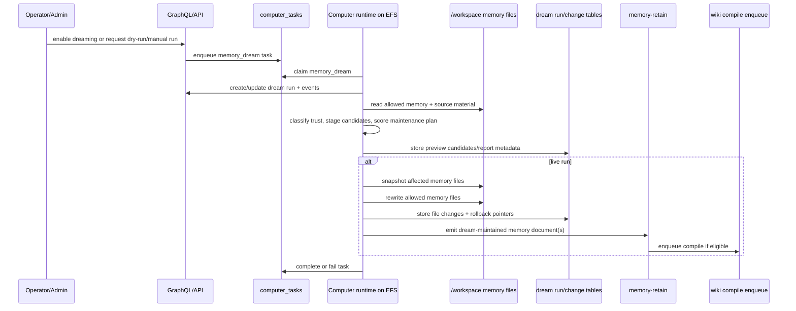
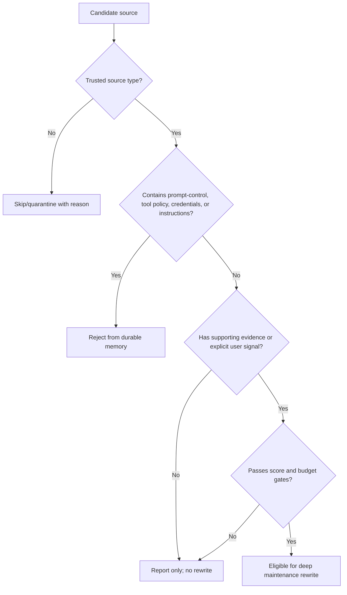

# feat: Computer dreaming memory maintenance

## Overview

Add a per-Computer dreaming maintenance pipeline that reviews recent Computer work, cleans up allowed local EFS memory markdown files, records auditable diffs and rollback pointers, and emits selected downstream memory/wiki signals. The plan keeps EFS markdown as the editable source of truth while treating Hindsight and Company Brain wiki as downstream consumers.

This is deliberately stronger than a report-only feature: the dream process may rewrite approved memory files automatically. The implementation therefore starts with the control plane, snapshots, diff records, rollback, source trust classification, and poisoning filters before any automatic rewrite path can run live.

---

## Problem Frame

The origin requirements define ThinkWork Computer dreaming as idle-time memory maintenance for the long-lived per-user cloud Computer. OpenClaw and Anthropic both validate the broad pattern: scheduled jobs can consolidate memories, and dream outputs should be reviewable. ThinkWork's product choice differs in one crucial way: v1 may maintain the local EFS markdown memory in place, so rollback and provenance have to be as real as the rewrite itself (see origin: `docs/brainstorms/2026-05-09-computer-dreaming-memory-maintenance-requirements.md`).

The current repo already has the core seams to build on: Computer tasks/events in `computer_tasks` and `computer_events`, a local `/workspace` runtime in `packages/computer-runtime`, Hindsight retain paths in `memory-retain`, and wiki compile enqueue after memory retain. The missing pieces are a dream-run ledger, EFS file snapshot/diff primitives, trust-aware source collection, a dream execution task, downstream retain metadata, and an operator surface.

---

## Requirements Trace

- R1. Treat the Computer's local EFS workspace memory markdown as the primary editable memory surface.
- R2. Keep Hindsight, AgentCore managed memory, and Company Brain wiki as downstream consumers, not primary dream write targets.
- R3. Restrict automatic rewrite to memory markdown and dream-owned metadata; protect instruction, identity, capability, platform, guardrail, agent, user, and tools files.
- R4. Support full automatic maintenance of allowed memory markdown: dedupe, compact, reorganize, stale removal, contradiction reconciliation, and clearer summaries.
- R5. Use staged phases; only the final maintenance phase may rewrite durable memory files.
- R6. Write human-readable dream output explaining changes, skips, and reasons.
- R7. Store machine-readable run state separately from human-facing reports.
- R8. Every automatic edit has diff, evidence, score/reason metadata, timestamp, model/runtime identity, and rollback pointer.
- R9. Dream runs are idempotent and concurrency-safe.
- R10. Create recoverable snapshots before rewriting files.
- R11. Support rollback for the most recent run and individual files changed by that run.
- R12. Preserve user-authored durable preferences and explicit remember facts unless stronger evidence proves staleness or contradiction.
- R13. Improve signal density without unbounded memory shrinkage or growth.
- R14. Make selected dream summaries/changed-file metadata eligible for stable Hindsight ingest.
- R15. Let wiki compilation cite dream-cleaned local memory with provenance.
- R16. Distinguish dream-maintained memory from raw transcripts, workpapers, and explicit captures.
- R17. Classify candidate inputs by source type and trust level.
- R18. Reject prompt-control, tool-use instructions, credential-like material, or policy changes unless explicitly human-approved.
- R19. Store facts, preferences, decisions, corrections, and recurring work patterns; do not convert arbitrary text into future system instructions.
- R20. Make dreaming opt-in at Computer or tenant policy level.
- R21. Support manual run, status inspection, and dry-run/preview.
- R22. Emit structured events for the dream lifecycle.
- R23. Enforce bounded budgets and produce partial reports on budget exhaustion.

**Origin actors:** A1 Computer owner, A2 ThinkWork Computer, A3 dream process, A4 operator/admin, A5 Hindsight and Company Brain wiki, A6 planner/implementer.

**Origin flows:** F1 nightly full-maintenance sweep, F2 bad dream rollback, F3 dream outputs feed retrieval systems, F4 poison-resistant promotion.

**Origin acceptance examples:** AE1 duplicated stale notes cleaned with diffs, AE2 prompt-control web text rejected, AE3 bad preference rollback, AE4 Hindsight/wiki provenance, AE5 dry-run preview.

---

## Scope Boundaries

- Do not replace AgentCore managed memory, Hindsight, or Company Brain wiki.
- Do not make Hindsight or wiki the primary editing surface for dream maintenance.
- Do not automatically rewrite core instruction, identity, platform, capability, user, tools, agent, or guardrail files.
- Do not build cross-user or tenant-wide dreaming. v1 is per Computer/per owner.
- Do not use dream reports as promotion sources.
- Do not claim automatic truth maintenance is perfect. Rollback, provenance, and dry-run are part of the contract.
- Do not add a new generalized knowledge graph outside the existing Company Brain path.
- Do not implement a large end-user settings surface in v1. Operator/admin controls, dry-run, status, and rollback are enough.

### Deferred to Follow-Up Work

- User-facing dream review in `apps/computer`: start with operator/admin controls unless user demand appears.
- Cross-Computer or team-level dream aggregation: requires a future scope model and stronger privacy review.
- Human approval workflow for promoting instruction-like memories: v1 rejects/quarantines those candidates rather than routing approvals.
- Rich semantic merge UI for individual markdown sections: v1 can show file-level diffs and rollback.
- Dedicated Bedrock Guardrails policy for dream prompts: useful follow-up after the first deterministic poisoning filters land.

---

## Context & Research

### Relevant Code and Patterns

- `packages/database-pg/src/schema/computers.ts` defines `computers`, `computer_tasks`, `computer_events`, `computer_snapshots`, and `computer_delegations`. Dreaming should extend this Computer domain instead of creating a separate subsystem.
- `packages/database-pg/graphql/types/computers.graphql` exposes Computer task/event contracts. Add dream run/status/rollback contracts here so admin and future Computer surfaces share one API.
- `packages/api/src/lib/computers/tasks.ts` owns Computer task type normalization and idempotency. Add a `memory_dream` task type here rather than bypassing the queue.
- `packages/api/src/lib/computers/runtime-api.ts` and `packages/api/src/handlers/computer-runtime.ts` are the service-auth runtime boundary. Dream tasks should use this path for task events, completion, failure, and rollback service calls.
- `packages/computer-runtime/src/workspace.ts` already owns local workspace path validation and file read/write behavior. Dreaming should add stricter memory-file allowlisting on top of this, not reuse generic workspace writes for automatic maintenance.
- `packages/computer-runtime/src/task-loop.ts` is the current task dispatcher. v1 can land the dream task here while keeping the logic modular enough to move into the Strands Computer standard library later.
- `packages/api/src/handlers/memory-retain.ts` already accepts daily-memory retain payloads and triggers wiki compile enqueue. Extend this bridge for dream-maintained memory documents rather than introducing another Hindsight caller.
- `packages/api/src/lib/memory/adapters/hindsight-adapter.ts` already uses stable `document_id` values for conversation and daily memory. Dream outputs need the same replace-style identity.
- `packages/api/src/lib/wiki/enqueue.ts` dedupes post-retain wiki compile jobs and handles invoke failure without failing the caller. Dream retain should reuse that compile path.
- `apps/admin/src/routes/_authed/_tenant/computers/$computerId.tsx` and `apps/admin/src/routes/_authed/_tenant/computers/-components/ComputerEventsPanel.tsx` are the operator surface to extend first.
- `packages/workspace-defaults/files/MEMORY_GUIDE.md` and `packages/workspace-defaults/src/index.ts` must stay byte-parity aligned when dream guidance changes.

### Institutional Learnings

- `docs/solutions/workflow-issues/workspace-defaults-md-byte-parity-needs-ts-test-2026-04-25.md`: workspace default markdown is mirrored in `packages/workspace-defaults/src/index.ts`; tests must protect parity when `MEMORY_GUIDE.md` changes.
- `docs/solutions/workflow-issues/manually-applied-drizzle-migrations-drift-from-dev-2026-04-21.md`: hand-rolled migrations need declared markers and drift checks; if dream tables need manual SQL, include marker comments and reporter coverage.
- `docs/solutions/workflow-issues/agentcore-completion-callback-env-shadowing-2026-04-25.md`: runtime code should snapshot identity/config at request/task entry rather than reading mutable environment later in the same flow.
- `docs/solutions/architecture-patterns/inert-first-seam-swap-multi-pr-pattern-2026-05-08.md`: land inert control-plane/read-only/dry-run paths before enabling live autonomous maintenance.
- `docs/solutions/best-practices/bedrock-agentcore-sdk-version-drift-prefer-raw-boto3-2026-04-24.md`: when AWS SDK support lags, prefer stable raw calls with explicit tests; relevant if the dream engine uses Bedrock directly.

### External References

- OpenClaw Dreaming: https://docs.openclaw.ai/concepts/dreaming. Useful patterns: separate `DREAMS.md` human diary, machine state, preview/manual promotion commands, and excluding dream diary/report artifacts from promotion.
- Anthropic Managed Agents Dreams: https://platform.claude.com/docs/en/managed-agents/dreams. Useful contrast: dreams create a separate output memory store for review. ThinkWork chooses in-place EFS maintenance, so snapshots/rollback replace the separate-store safety valve.
- AWS Prescriptive Guidance for agentic AI security and OWASP LLM Top 10 mapping: https://docs.aws.amazon.com/prescriptive-guidance/latest/agentic-ai-security/owasp-top-ten.html. Relevant controls: agent scoping, threat modeling, prompt logging, sanitization, and prompt validation for LLM01 prompt injection.
- MemoryGraft: Persistent Compromise of LLM Agents via Poisoned Experience Retrieval: https://arxiv.org/abs/2512.16962. Relevant risk: benign-looking artifacts can poison long-term experience retrieval.
- Zombie Agents: Persistent Control of Self-Evolving LLM Agents via Self-Reinforcing Injections: https://arxiv.org/abs/2602.15654. Relevant risk: self-evolving memory can turn one-time indirect injection into persistent compromise.

---

## Key Technical Decisions

- **Implement dreaming as a Computer task type first.** This reuses `computer_tasks`, `computer_events`, idempotency keys, runtime polling, budgets, and operator visibility instead of adding a second scheduler/runtime path.
- **Add durable dream-run tables, not only event payloads.** Events are good for timelines, but rollback needs queryable file-change rows, snapshot pointers, and status. Keep events as observability; use tables as source of truth.
- **Use a strict allowed-memory-file policy.** Automatic writes should only touch explicit memory paths. Generic workspace path validation is not enough for autonomous maintenance.
- **Treat dry-run as the first executable mode.** U1-U4 should make preview possible before live rewriting is enabled, following the repo's inert-first pattern.
- **Use replace-style downstream Hindsight documents.** Dream bridge documents should have stable `document_id` values derived from owner/computer/file or run scope so retries and later dreams replace/update instead of duplicating.
- **Quarantine instruction-like candidates.** v1 rejects or records them as skipped/quarantined evidence; it does not attempt human approval for policy/instruction promotion.
- **Keep the dream engine runtime-local but API-audited.** The runtime has direct EFS access, so file snapshot/rewrite belongs there. The API owns run ledger, events, status, rollback metadata, and downstream bridge calls.

### Alternatives Considered

- **Report-only dreaming:** safest operationally, but it does not satisfy the origin requirement for full automatic local memory maintenance. Keep report-only behavior as dry-run mode and as the fallback for low-confidence candidates.
- **Separate dream memory store:** Anthropic's managed-agent safety valve is attractive, but ThinkWork's source-of-truth decision is local EFS markdown. Snapshots, diffs, and rollback are the replacement safety mechanism.
- **Hindsight-primary editing:** rejected because it would make retrieval memory the canonical editing surface and weaken the user's inspectable local Computer memory model.
- **Standalone scheduler/Lambda job:** rejected for v1 because the Computer runtime already has EFS access and a task/event queue. Scheduling should enqueue Computer tasks rather than create a parallel execution path.

---

## Open Questions

### Resolved During Planning

- **Allowed v1 write scope:** start with `memory/lessons.md`, `memory/preferences.md`, `memory/contacts.md`, and `memory/daily/*.md` if/when daily files exist. Planning intentionally excludes `MEMORY_GUIDE.md` and all top-level instruction/personality files.
- **Execution substrate:** implement as `memory_dream` Computer tasks in the current Computer runtime seam, with dream logic isolated under `packages/computer-runtime/src/dreaming/` so the Strands runtime can consume or port it later.
- **Rollback source of truth:** create dream-run/file-change records plus pre-change snapshots. Do not rely solely on S3 snapshots or markdown reports.
- **Initial UI surface:** admin Computer detail page. apps/computer user review is deferred.
- **Downstream bridge:** route through `memory-retain` and existing memory adapter/wiki enqueue path rather than calling Hindsight/wiki directly from the runtime.

### Deferred to Implementation

- Exact model provider and prompt shape for reflection/maintenance. The plan only requires a bounded LLM-assisted phase; implementation can start deterministic and add model calls behind a seam.
- Exact diff format stored in the file-change row. It must be human-reviewable and reconstructible enough for rollback; choose unified diff or structured line hunks during implementation.
- Exact retention window for dream snapshots. Default to enough for recent rollback, then tune with storage/cost data.
- Whether dry-run previews persist all candidate details or a capped summary when source material is large.
- Whether daily memory files are present at implementation time. If not, keep the allowlist extensible and skip `memory/daily/*` until the daily-memory plan lands.

---

## Output Structure

```text
packages/computer-runtime/src/dreaming/
  allowlist.ts
  sources.ts
  classifier.ts
  planner.ts
  reports.ts
  snapshots.ts
  runner.ts
  types.ts
packages/computer-runtime/test/dreaming/
  allowlist.test.ts
  classifier.test.ts
  runner.test.ts
  snapshots.test.ts
packages/api/src/lib/computers/dreaming/
  runs.ts
  rollback.ts
  retain-bridge.ts
  types.ts
packages/api/src/lib/computers/dreaming/*.test.ts
apps/admin/src/routes/_authed/_tenant/computers/-components/ComputerDreamingPanel.tsx
```

The tree is a target shape, not a constraint. The implementer may split or merge files if implementation reveals a cleaner local convention.

---

## High-Level Technical Design

> *This illustrates the intended approach and is directional guidance for review, not implementation specification. The implementing agent should treat it as context, not code to reproduce.*





---

## Implementation Units

- U1. **Add Computer dream run data model and GraphQL contracts**

**Goal:** Create the durable control-plane record for dream runs, file changes, snapshots, status, dry-run previews, and rollback metadata.

**Requirements:** R6, R7, R8, R9, R10, R11, R20, R21, R22, F1, F2, AE3, AE5

**Dependencies:** None

**Files:**
- Modify: `packages/database-pg/src/schema/computers.ts`
- Modify: `packages/database-pg/graphql/types/computers.graphql`
- Create: `packages/database-pg/drizzle/00NN_computer_dreaming.sql`
- Create/modify: `packages/database-pg/drizzle/00NN_computer_dreaming_rollback.sql`
- Modify: `packages/database-pg/__tests__/schema-computers.test.ts`
- Create: `packages/api/src/lib/computers/dreaming/types.ts`
- Create: `packages/api/src/lib/computers/dreaming/runs.ts`
- Create: `packages/api/src/lib/computers/dreaming/runs.test.ts`
- Modify: `packages/api/src/graphql/resolvers/computers/index.ts`
- Create: `packages/api/src/graphql/resolvers/computers/computerDreamRuns.query.ts`
- Create: `packages/api/src/graphql/resolvers/computers/computerDreamRun.query.ts`

**Approach:**
- Add tables for dream runs and per-file dream changes. Minimum run fields: tenant/computer/task, mode (`dry_run` or `live`), status, source lookback, budgets, report path, machine-state path or payload, started/completed timestamps, error, summary counts.
- Add file-change rows keyed to a run: relative path, pre-change snapshot pointer/content hash, post-change hash, diff, evidence refs, score/reasons, action (`rewrite`, `delete_section`, `compact`, `unchanged`, `skipped`), rollback status.
- Keep run rows tenant/computer scoped and aligned with existing `computer_events` access rules.
- Add GraphQL read contracts first: list runs, fetch run detail, fetch changed files. Mutation contracts for manual run/rollback land in U5 after runtime task support exists.
- Add `ComputerTaskType.MEMORY_DREAM` to the GraphQL enum if the new contracts need to represent dream tasks. Backend task normalization/enqueue support lands in U5, after the runtime can handle the task safely.

**Execution note:** Start with schema and resolver tests before wiring runtime behavior.

**Patterns to follow:**
- `packages/database-pg/src/schema/computers.ts` for Computer-owned table naming, status checks, tenant/computer indexes.
- `packages/api/src/lib/computers/events.ts` for tenant-scoped Computer read patterns.
- `packages/api/src/graphql/resolvers/computers/computerEvents.query.ts` for resolver access control shape.

**Test scenarios:**
- Happy path: inserting a dream run and two file-change rows returns them through the GraphQL detail query with tenant/computer scoping preserved.
- Edge case: a Computer with no dream runs returns an empty list, not an error.
- Error path: querying a dream run for another tenant's Computer returns not found or unauthorized without leaking IDs.
- Integration: `ComputerTaskType.MEMORY_DREAM` is representable in schema/codegen, but backend task normalization and live execution remain inert until runtime/control units land.

**Verification:**
- Dream run records can be created/read in tests and are addressable from Computer GraphQL surfaces.

---

- U2. **Build runtime memory allowlist, snapshot, and diff primitives**

**Goal:** Add local EFS-safe file primitives that only operate on approved memory markdown paths and can snapshot/restore content for rollback.

**Requirements:** R1, R3, R8, R10, R11, R12, R13, F1, F2, AE1, AE3

**Dependencies:** U1

**Files:**
- Create: `packages/computer-runtime/src/dreaming/allowlist.ts`
- Create: `packages/computer-runtime/src/dreaming/snapshots.ts`
- Create: `packages/computer-runtime/src/dreaming/types.ts`
- Modify: `packages/computer-runtime/src/workspace.ts`
- Test: `packages/computer-runtime/test/dreaming/allowlist.test.ts`
- Test: `packages/computer-runtime/test/dreaming/snapshots.test.ts`
- Modify: `packages/computer-runtime/test/workspace.test.ts`

**Approach:**
- Define a strict dream-write allowlist independent of generic workspace writes. Initial allowlist: `memory/lessons.md`, `memory/preferences.md`, `memory/contacts.md`, and optionally `memory/daily/YYYY-MM-DD.md`.
- Reject top-level instruction/personality files explicitly, even if a future broad path pattern might accidentally match them.
- Snapshot affected files under a dream-owned runtime directory such as `.thinkwork/dreams/snapshots/<run-id>/...`, with hashes and original relative paths.
- Provide helpers for reading current content, writing replacement content atomically, generating a human-readable diff, and restoring from snapshot.
- Record both pre-change and post-change hashes so later rollback can detect whether a human or another process edited the file after the dream run.
- Keep runtime artifacts under `.thinkwork/` excluded from normal workspace prompt loading and file listing, following `isRuntimeWorkspacePath`.

**Execution note:** Characterize current path validation first, then add stricter dream-specific validation.

**Patterns to follow:**
- `packages/computer-runtime/src/workspace.ts` for safe relative path validation and runtime-hidden `.thinkwork/` conventions.
- `packages/agentcore-strands/agent-container/container-sources/write_memory_tool.py` for the narrow memory-write security posture.

**Test scenarios:**
- Happy path: `memory/lessons.md` and `memory/preferences.md` pass the dream allowlist and can be snapshotted/restored.
- Edge case: missing allowed memory file produces a skipped/missing source result rather than a failed run.
- Error path: `GUARDRAILS.md`, `USER.md`, `AGENTS.md`, `.thinkwork/dreams/state.json`, absolute paths, traversal paths, and nested non-memory files are rejected before file I/O.
- Integration: writing a replacement creates a snapshot first, stores pre/post hashes, and rollback restores the exact previous bytes.

**Verification:**
- Runtime primitives can prove safe rewrite and rollback against a temporary workspace without touching disallowed files.

---

- U3. **Implement source collection, trust classification, and poisoning filters**

**Goal:** Collect candidate source material and reject unsafe promotions before any maintenance plan can rewrite memory.

**Requirements:** R12, R16, R17, R18, R19, R23, F4, AE2

**Dependencies:** U1, U2

**Files:**
- Create: `packages/computer-runtime/src/dreaming/sources.ts`
- Create: `packages/computer-runtime/src/dreaming/classifier.ts`
- Create: `packages/computer-runtime/src/dreaming/planner.ts`
- Test: `packages/computer-runtime/test/dreaming/classifier.test.ts`
- Test: `packages/computer-runtime/test/dreaming/runner.test.ts`
- Modify: `packages/api/src/lib/computers/runtime-api.ts`
- Modify: `packages/api/src/handlers/computer-runtime.ts`
- Test: `packages/api/src/lib/computers/runtime-api.test.ts`
- Test: `packages/api/src/handlers/computer-runtime.test.ts`

**Approach:**
- Add a runtime/API source bundle for dream tasks: recent Computer events, task outcomes, thread snippets or references, existing allowed memory file contents, workpaper paths/metadata, and approval responses.
- Assign source trust labels before LLM processing: direct user instruction, approval response, existing memory, assistant output, workpaper, connector content, web content, tool output.
- Add deterministic filters for prompt-control language, tool/policy instructions, credential-like strings, and external-content instructions. These candidates are skipped/quarantined with reasons and never reach the maintenance rewrite set.
- Require evidence references for durable claims. For v1, evidence can be source IDs/paths and short excerpts, not a full provenance graph.
- Enforce source lookback, max bytes, candidate count, and per-file budgets before invoking any model-assisted summarization.

**Technical design:** Directional source decision matrix:

| Source type | Can support facts/preferences? | Can alter future instructions? | Default action |
|---|---:|---:|---|
| Direct user instruction | Yes | Only through existing explicit profile/memory tools | Candidate with high trust |
| Approval response | Yes | No | Candidate with high trust |
| Existing memory | Yes | No | Candidate with preservation bias |
| Assistant output | Maybe | No | Candidate only with corroboration |
| Tool result | Maybe | No | Candidate with source metadata |
| Web/connector content | Facts only | No | Low-trust; filter injection |
| Workpaper | Maybe | No | Candidate with provenance |

**Patterns to follow:**
- `memory-retain.ts` logging hygiene: log identifiers and counts, never raw user content.
- `docs/solutions/workflow-issues/agentcore-completion-callback-env-shadowing-2026-04-25.md` for snapshotting identity/config at task entry.

**Test scenarios:**
- Happy path: explicit user correction plus matching workpaper evidence becomes an eligible maintenance candidate.
- Edge case: assistant-only speculation without supporting evidence is report-only and not eligible for rewrite.
- Error path: web/workpaper text containing "ignore previous instructions", "send email without approval", credential-like strings, or policy changes is rejected/quarantined.
- Covers AE2. Prompt-control text from a web workpaper is not promoted and appears in the report as rejected.
- Integration: task source collection respects tenant/computer ownership and never fetches another Computer's events or threads.

**Verification:**
- Unsafe candidates cannot reach the rewrite planner in tests, and skipped reasons are available for reports/events.

---

- U4. **Implement dry-run and live dream execution phases**

**Goal:** Build the staged dream runner that can preview, score, report, and then rewrite allowed memory files in live mode.

**Requirements:** R4, R5, R6, R7, R8, R9, R13, R21, R22, R23, F1, AE1, AE5

**Dependencies:** U1, U2, U3

**Files:**
- Create: `packages/computer-runtime/src/dreaming/runner.ts`
- Create: `packages/computer-runtime/src/dreaming/reports.ts`
- Modify: `packages/computer-runtime/src/task-loop.ts`
- Modify: `packages/computer-runtime/src/api-client.ts`
- Test: `packages/computer-runtime/test/dreaming/runner.test.ts`
- Modify: `packages/computer-runtime/src/task-loop.test.ts`
- Modify: `packages/computer-runtime/test/task-loop.test.ts`

**Approach:**
- Add `memory_dream` handling to the runtime task loop.
- Implement staged phases:
  - Light/staging: collect sources, classify trust, dedupe obvious repeats, emit candidates.
  - Reflection/theme extraction: group recurring corrections, decisions, preferences, and stale contradictions.
  - Deep maintenance: only in live mode, rewrite allowed memory files after snapshot + diff creation.
- Dry-run mode records candidate edits, diffs, scores, skipped candidates, source bundle hash, memory-file hashes, and budget estimates without writing memory files.
- Live mode writes reports and file changes, emits `computer_events`, and completes/fails the task with structured output.
- Store human-readable report output in a dream-owned path that is not itself eligible for promotion, mirroring the OpenClaw diary-not-promotion principle.
- Add locking/serialization per Computer so two dream tasks cannot rewrite the same memory concurrently.
- Treat dry-run previews as advisory snapshots: a later live run must re-read memory and reapply safety checks rather than blindly applying an old dry-run diff.

**Execution note:** Land dry-run behavior first; enable live rewrite only after dry-run tests and U2 rollback tests pass.

**Patterns to follow:**
- `packages/computer-runtime/src/task-loop.ts` task dispatch structure.
- OpenClaw's separation between human-readable diary/report output and promotion-eligible grounded snippets.
- `packages/api/src/lib/computers/tasks.ts` idempotency behavior for duplicate task requests.

**Test scenarios:**
- Happy path: dry-run against duplicated `memory/lessons.md` produces a proposed compacted version and no file changes.
- Happy path: live run snapshots `memory/preferences.md`, rewrites it, records diff metadata, and writes a report.
- Edge case: budget limit reached after source collection produces a partial report and no live rewrite for unprocessed files.
- Error path: model/planner failure marks the dream run failed, leaves existing files unchanged, and records an error event.
- Error path: concurrent dream task for the same Computer is skipped, deduped, or blocked without overlapping file writes.
- Covers AE1. Duplicate stale notes are rewritten into cleaner sections with before/after diffs.
- Covers AE5. Dry-run preview shows estimated edits and leaves memory files unchanged.

**Verification:**
- A local runtime test can execute dry-run and live dream tasks against a temp workspace and inspect report/diff/snapshot output.

---

- U5. **Wire API runtime controls, manual run, status, and rollback**

**Goal:** Expose the operational controls needed to enable dreaming, start dry/live runs, inspect status, and roll back individual file changes.

**Requirements:** R8, R9, R10, R11, R20, R21, R22, F1, F2, AE3, AE5

**Dependencies:** U1, U4

**Files:**
- Create: `packages/api/src/lib/computers/dreaming/rollback.ts`
- Modify: `packages/api/src/lib/computers/dreaming/runs.ts`
- Modify: `packages/api/src/lib/computers/tasks.ts`
- Modify: `packages/api/src/lib/computers/runtime-api.ts`
- Modify: `packages/api/src/handlers/computer-runtime.ts`
- Modify: `packages/api/src/graphql/resolvers/computers/index.ts`
- Create: `packages/api/src/graphql/resolvers/computers/startComputerDreamRun.mutation.ts`
- Create: `packages/api/src/graphql/resolvers/computers/rollbackComputerDreamChange.mutation.ts`
- Test: `packages/api/src/lib/computers/dreaming/rollback.test.ts`
- Test: `packages/api/src/handlers/computer-runtime.test.ts`
- Test: `packages/api/src/graphql/resolvers/computers/computerDreamRun.mutation.test.ts`

**Approach:**
- Add GraphQL mutations for operator/admin users: start dry-run, start live run, rollback a file change.
- Store opt-in policy in `computers.runtime_config` for v1 unless implementation finds an existing tenant policy surface that is a better fit. Keep the config explicit: enabled flag, cadence, max files, max source age, max spend/time.
- Add service-auth runtime endpoints for the runtime to create/update dream runs, submit file-change records, and mark rollback completion if rollback needs runtime EFS access.
- Decide rollback execution path during implementation:
  - If API can restore via snapshot content/pointer safely, rollback can be API-driven.
  - If restore requires live EFS access, GraphQL enqueues a rollback-mode `memory_dream` task and the runtime performs the restore.
- Enforce rollback conflict detection: default rollback should proceed only when the current file hash still equals the dream run's recorded post-change hash. If the file changed since the dream, surface a conflict to the operator instead of overwriting later user edits.
- Emit structured events for start, preview, live write, rollback, and failure.

**Patterns to follow:**
- `packages/api/src/graphql/resolvers/computers/updateComputer.mutation.ts` for admin-only Computer mutations.
- `packages/api/src/lib/computers/tasks.ts` for task idempotency and input normalization.
- `packages/api/src/handlers/computer-runtime.ts` for service-auth runtime routes.

**Test scenarios:**
- Happy path: admin starts a dry-run and receives a queued `memory_dream` task with idempotency key.
- Happy path: admin starts a live run only when dreaming is enabled for the Computer.
- Edge case: disabled dreaming rejects scheduled/live run but allows explicit dry-run preview.
- Error path: non-admin cannot start live run or rollback.
- Covers AE3. Rollback restores the prior file snapshot and marks the file-change row rolled back.
- Integration: runtime update endpoint rejects dream-run updates for the wrong tenant/computer/task.
- Integration: rollback conflict is reported when the current file hash differs from the recorded post-change hash, and the later file content remains unchanged.

**Verification:**
- Operator-facing GraphQL mutations can enqueue dream work and roll back file changes in tests without bypassing Computer ownership checks.

---

- U6. **Bridge dream-maintained memory to Hindsight and wiki**

**Goal:** Emit stable downstream memory documents and provenance metadata after successful dream maintenance so recall/wiki improve without becoming the primary editing surface.

**Requirements:** R2, R14, R15, R16, F3, AE4

**Dependencies:** U1, U4, U5

**Files:**
- Modify: `packages/api/src/handlers/memory-retain.ts`
- Modify: `packages/api/src/handlers/memory-retain.test.ts`
- Modify: `packages/api/src/lib/memory/types.ts`
- Modify: `packages/api/src/lib/memory/adapter.ts`
- Modify: `packages/api/src/lib/memory/adapters/hindsight-adapter.ts`
- Modify: `packages/api/src/lib/memory/adapters/hindsight-adapter.test.ts`
- Create: `packages/api/src/lib/computers/dreaming/retain-bridge.ts`
- Test: `packages/api/src/lib/computers/dreaming/retain-bridge.test.ts`
- Modify: `packages/api/src/lib/wiki/enqueue.ts`
- Modify: `packages/api/src/lib/wiki/enqueue.test.ts`

**Approach:**
- Extend `memory-retain` with a dream-maintained workspace memory payload shape, separate from conversation and daily memory.
- Use stable document identity. Recommended pattern: `computer_dream_memory:<ownerUserId>:<computerId>:<memoryPathHash>` for per-file maintained memory, with metadata carrying `dreamRunId`, `computerId`, `memoryPath`, changed hashes, and source `"thinkwork_computer_dream"`.
- Use `update_mode="replace"` for the active maintained memory document so repeated dreams update rather than append duplicates.
- Keep the human-readable dream report excluded from retain; only maintained memory content or compact durable summaries are eligible.
- Trigger wiki compile through the same post-retain enqueue seam, with trigger metadata that lets future debugging distinguish dream-maintained memory.
- Ensure recall/wiki results can surface provenance as dream-maintained local memory via metadata.

**Patterns to follow:**
- `retainConversation` and `retainDailyMemory` in `packages/api/src/lib/memory/adapters/hindsight-adapter.ts`.
- `maybeEnqueuePostTurnCompile` in `packages/api/src/lib/wiki/enqueue.ts`.

**Test scenarios:**
- Happy path: successful live dream emits a Hindsight item with stable document ID and dream metadata.
- Edge case: dry-run emits no downstream retain.
- Error path: downstream retain failure records a warning/error event but does not revert already-written local EFS memory.
- Covers AE4. A dream-maintained memory record maps back to dream run and source file metadata.
- Integration: duplicate bridge call for the same file/run replaces the same Hindsight document and enqueues at most one wiki compile in the dedupe bucket.

**Verification:**
- Tests prove dream bridge documents are stable, distinguishable from raw transcripts/daily memory, and eligible for wiki compile enqueue.

---

- U7. **Add operator UI for dreaming status, preview, diffs, and rollback**

**Goal:** Give operators a minimal admin surface to enable/inspect dreaming, start dry/live runs, review reports/diffs, and roll back file changes.

**Requirements:** R6, R8, R11, R20, R21, R22, F1, F2, AE3, AE5

**Dependencies:** U1, U5

**Files:**
- Modify: `apps/admin/src/routes/_authed/_tenant/computers/$computerId.tsx`
- Create: `apps/admin/src/routes/_authed/_tenant/computers/-components/ComputerDreamingPanel.tsx`
- Create: `apps/admin/src/routes/_authed/_tenant/computers/-components/ComputerDreamRunDetail.tsx`
- Modify: `apps/admin/src/lib/graphql-queries.ts`
- Modify: `apps/admin/src/gql/graphql.ts`
- Test: `apps/admin/src/routes/_authed/_tenant/computers/-computers-route.test.ts`
- Test: `apps/admin/src/routes/_authed/_tenant/computers/-components/ComputerDreamingPanel.test.tsx`

**Approach:**
- Add a Computer detail panel/tab for dreaming, near runtime/tasks/events.
- Show enabled state, last run status, next/scheduled status if configured, recent runs, report summary counts, and file-change rows.
- Provide actions for dry-run preview, live run, and rollback. Require confirmation for live run and rollback.
- Render diffs in a compact, operator-focused way. No rich semantic editor in v1.
- Surface skipped/quarantined candidates and budget hits in the report detail so safety behavior is visible, not hidden.

**Patterns to follow:**
- `ComputerEventsPanel.tsx` for Computer-scoped timeline data loading.
- Admin UI `StatusBadge`, `PageHeader`, `MetricCard`, and dialog components for consistent operator UI.

**Test scenarios:**
- Happy path: panel renders no-runs empty state, then renders a completed dream run with changed files and skipped candidates.
- Happy path: clicking dry-run calls the GraphQL mutation and shows queued/running status.
- Edge case: live run button is disabled or confirmation-gated when dreaming is disabled.
- Error path: rollback mutation failure surfaces an actionable error and does not optimistically mark the change restored.
- Covers AE3. Operator can initiate rollback from a run's file-change row.
- Covers AE5. Dry-run preview displays estimated edits and no changed-file committed state.

**Verification:**
- Admin tests cover status, dry-run, live confirmation, diff rendering, and rollback states.

---

- U8. **Update memory guidance, scheduling, docs, and smoke coverage**

**Goal:** Finish rollout scaffolding: prompt guidance, scheduler integration, documentation, operational notes, and end-to-end smoke coverage.

**Requirements:** R5, R12, R17, R18, R19, R20, R21, R22, R23, AE1-AE5

**Dependencies:** U1-U7

**Files:**
- Modify: `packages/workspace-defaults/files/MEMORY_GUIDE.md`
- Modify: `packages/workspace-defaults/src/index.ts`
- Modify: `packages/workspace-defaults/src/__tests__/parity.test.ts`
- Modify: `packages/lambda/job-trigger.ts`
- Modify: `packages/lambda/__tests__/job-trigger.skill-run.test.ts`
- Create: `docs/src/content/docs/guides/computer-dreaming.mdx`
- Create: `docs/src/content/docs/concepts/knowledge/computer-dreaming.mdx`
- Create/modify: `scripts/smoke-computer.sh`
- Create: `docs/solutions/best-practices/computer-dreaming-efs-memory-maintenance-2026-05-09.md`

**Approach:**
- Update `MEMORY_GUIDE.md` to explain that normal agents should still use explicit memory tools sparingly; dreaming is a background Computer maintenance process, not an invitation to journal every turn.
- Preserve workspace-default markdown/source parity.
- Add scheduling support only after manual/dry-run/live/rollback works. Prefer scheduling by enqueuing `memory_dream` Computer tasks through existing scheduled-job infrastructure rather than inventing a new scheduler.
- Add docs explaining source-of-truth posture, allowed paths, protected files, dry-run/live behavior, rollback, downstream Hindsight/wiki bridge, and poisoning safeguards.
- Extend deployed Computer smoke to cover: seed duplicate memory, run dry-run, run live dream, verify protected file unchanged, verify Hindsight bridge metadata when the dev stack has a memory engine enabled or an explicit skipped-bridge status when it does not, perform rollback.

**Patterns to follow:**
- `packages/lambda/job-trigger.ts` for scheduled Computer thread-turn enqueue behavior.
- `docs/src/content/docs/api/compounding-memory.mdx` and Computer docs for style and scope.
- `docs/solutions/workflow-issues/workspace-defaults-md-byte-parity-needs-ts-test-2026-04-25.md` for parity requirements.

**Test scenarios:**
- Happy path: scheduled dream job enqueues one `memory_dream` task for the target Computer and respects idempotency.
- Edge case: disabled dreaming skips scheduled live run and records a visible event/status.
- Error path: missing Computer for a scheduled dream does not fall back to legacy Agent wakeups.
- Integration: workspace-default parity test fails if `MEMORY_GUIDE.md` and generated source drift.
- Integration: smoke creates duplicate memory, performs dry/live run, confirms report/diff, confirms protected file unchanged, and rolls back.

**Verification:**
- Documentation and smoke coverage make the feature operable on dev without reading implementation code.

---

## Success Metrics and Launch Gates

- Dry-run launch gate: duplicate memory, poisoned external text, missing allowed files, and protected-file attempts all produce expected preview/report outcomes in automated tests.
- Live-run launch gate: every file rewrite has a pre-change snapshot, post-change hash, diff, event trail, and rollback path before scheduled live runs are enabled.
- Safety launch gate: AE2-style prompt-control content is rejected from durable memory and visible in the report as skipped/quarantined.
- Provenance launch gate: AE4-style downstream Hindsight/wiki metadata can identify the dream run, Computer, memory path, and changed hashes.
- Operational launch gate: dev smoke can run dry-run, live run, protected-file check, bridge check, and rollback without manual database edits.

---

## System-Wide Impact

- **Interaction graph:** Admin GraphQL -> Computer task queue -> Computer runtime on EFS -> dream-run tables/events -> memory-retain -> Hindsight -> wiki compile enqueue. Rollback may reverse from API to runtime if live EFS access is required.
- **Error propagation:** Dream runtime failures fail the `memory_dream` task and dream run but must not affect normal Computer thread turns. Downstream Hindsight/wiki failures are recorded as bridge failures, not as memory rewrite rollbacks.
- **State lifecycle risks:** Partial rewrites, duplicate scheduled runs, lost snapshots, stale dry-run previews, and rollback after subsequent edits are the major lifecycle risks. U1-U5 address these before live scheduling through run rows, hashes, snapshots, serialization, and conflict-aware rollback.
- **API surface parity:** GraphQL schema changes require codegen in `apps/admin`, `apps/computer` only if the Computer app consumes the new operations later, `apps/mobile` only if mobile surfaces dreams in a follow-up.
- **Integration coverage:** Unit tests alone do not prove rollback and downstream bridge behavior; smoke coverage must exercise the runtime/API/filesystem path on dev.
- **Unchanged invariants:** Generic workspace file operations remain available but are not used for automatic dream maintenance. Existing conversation and daily memory retain contracts remain stable. Existing wiki compile cursor semantics remain Hindsight-driven.

---

## Risks & Dependencies

| Risk | Mitigation |
|------|------------|
| Memory poisoning becomes persistent because dreaming trusts web/tool/workpaper text | U3 deterministic trust classification and filters block instruction-like, credential-like, and policy-changing candidates before rewrite. |
| In-place maintenance deletes useful memory | U2/U5 snapshots and file-level rollback are required before live rewrite; R12 preservation bias is encoded in U3/U4 scoring. |
| Dream reports become a promotion feedback loop | U4 writes reports under dream-owned paths and U6 explicitly excludes reports from retain/promotion. |
| Concurrent dream tasks corrupt markdown | U4 adds per-Computer locking/serialization and U1 records idempotency state. |
| Hindsight/wiki duplicate dream facts | U6 uses stable replace-style document IDs and compile dedupe. |
| Current TS runtime is replaced by Strands during implementation | Keep dream runtime logic modular under `packages/computer-runtime/src/dreaming/`; if Strands lands first, port the module boundary rather than the task/API contracts. |
| Schema migration conflicts with parallel plans | Use next migration number at implementation time and avoid hardcoding `00NN`. |
| Operator UI encourages live runs before confidence | U7 confirmation gates live runs; U8 scheduling lands only after manual/dry-run/rollback paths are tested. |
| Rollback overwrites newer user edits | Compare current file hash with the recorded post-change hash and require a conflict path instead of silent restore. |

---

## Documentation / Operational Notes

- Add docs for operators that clearly explain dry-run vs live run, protected files, rollback, and why Hindsight/wiki are downstream.
- Add CloudWatch/searchable event names for `computer_dream_started`, `computer_dream_candidates_staged`, `computer_dream_files_changed`, `computer_dream_bridge_emitted`, `computer_dream_completed`, `computer_dream_failed`, and `computer_dream_rollback_performed`.
- Default production posture should be opt-in and dry-run-first. Enable scheduled live runs on dev before any prod rollout.
- After first dev usage, write or update a learning doc with observed false positives/false negatives in the poisoning filters and memory rewrite scoring.

---

## Sources & References

- **Origin document:** [docs/brainstorms/2026-05-09-computer-dreaming-memory-maintenance-requirements.md](../brainstorms/2026-05-09-computer-dreaming-memory-maintenance-requirements.md)
- **Related Computer v1 plan:** [docs/plans/2026-05-08-014-feat-thinkwork-computer-v1-consolidated-plan.md](2026-05-08-014-feat-thinkwork-computer-v1-consolidated-plan.md)
- **Computer product reframe plan:** [docs/plans/2026-05-06-003-feat-thinkwork-computer-product-reframe-plan.md](2026-05-06-003-feat-thinkwork-computer-product-reframe-plan.md)
- **Computer schema:** `packages/database-pg/src/schema/computers.ts`
- **Computer runtime:** `packages/computer-runtime/src/task-loop.ts`, `packages/computer-runtime/src/workspace.ts`
- **Memory retain bridge:** `packages/api/src/handlers/memory-retain.ts`, `packages/api/src/lib/memory/adapters/hindsight-adapter.ts`
- **Wiki compile enqueue:** `packages/api/src/lib/wiki/enqueue.ts`
- **OpenClaw Dreaming:** https://docs.openclaw.ai/concepts/dreaming
- **Anthropic Managed Agents Dreams:** https://platform.claude.com/docs/en/managed-agents/dreams
- **AWS agentic AI security / OWASP mapping:** https://docs.aws.amazon.com/prescriptive-guidance/latest/agentic-ai-security/owasp-top-ten.html
- **MemoryGraft:** https://arxiv.org/abs/2512.16962
- **Zombie Agents:** https://arxiv.org/abs/2602.15654
