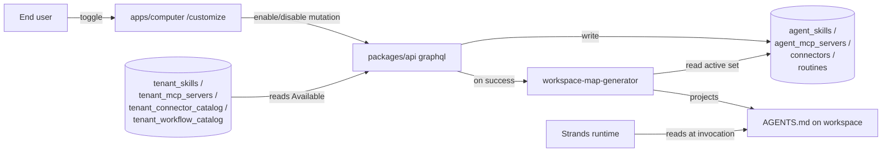
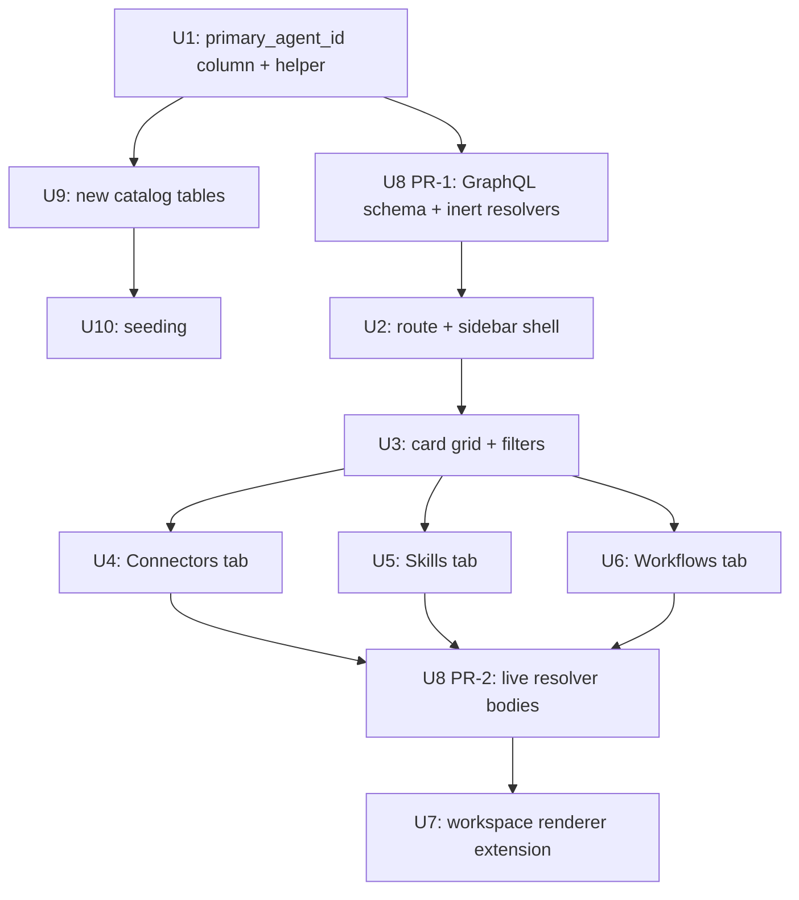

# feat: Computer Customization page (Connectors / Skills / Workflows)

## Summary

Ship a `/customize` route in `apps/computer` with three header pill tabs (Connectors / Skills / Workflows; MCP servers fold under Connectors with a type badge). The page browses a per-tenant catalog and toggles items on or off for the user's Computer. Toggles write to existing canonical bindings (`agent_skills`, `agent_mcp_servers`, `connectors`, `routines`) plus two new per-tenant catalog tables (`tenant_connector_catalog`, `tenant_workflow_catalog`). On every successful toggle, an extended workspace-map regenerator projects the active set into the Computer's `AGENTS.md` so the Strands runtime continues to see customization through its existing bootstrap path. Ships across multiple PRs using the substrate-first inert→live seam-swap pattern.

---

## Problem Frame

`apps/computer` exposes Computer / Tasks / Apps / Automations / Inbox in the sidebar but offers no surface for the user to see or change which Connectors, Skills, or Workflows their Computer can use. Bindings are produced today by template seeding plus admin-side tooling, leaving end users with no answer to "what does my Computer have?" and no path to add or remove an integration without operator help. With per-tenant variation real (4 enterprises × 100+ agents × ~5 templates), the lack of a self-serve customization surface forces every per-user variation through admin or template work.

The Memory module already established a header-pill segmented control inside the product — the Customize page is the second instance of that visual pattern (see origin: `docs/brainstorms/2026-05-09-computer-customization-page-requirements.md`). The repo already has the right canonical tables (`agent_skills`, `agent_mcp_servers`, `connectors`, `routines`), an active workspace-map regenerator that projects skills + KBs into `AGENTS.md`, and a tenant-scoped catalog seam in `tenant_skills` / `tenant_mcp_servers` — the missing pieces are catalog rows for Connectors and Workflows, GraphQL plumbing, the page itself, and the renderer extension that picks up active connectors and workflows.

---

## Requirements Trace

Origin requirements carried forward from `docs/brainstorms/2026-05-09-computer-customization-page-requirements.md`:

- R1 (new `/customize` route) → U2 (route + sidebar wiring)
- R2 (three pill tabs, no MCP pill) → U2, U3
- R3 (Discover / All / Connected / Available + search + category filter) → U3, U4
- R4 (card affordances) → U3
- R5 (MCP folds under Connectors with type badge) → U4
- R6 (Skills pill from per-tenant catalog) → U5
- R7 (Workflows pill from `routines`) → U6
- R8 (Connected reads canonical tables) → U4, U5, U6
- R9 (Available reads new per-tenant catalog tables) → U1, U4, U6
- R10 (catalog real per-tenant from day one) → U1, U10
- R11 (toggles write canonical bindings) → U4, U5, U6
- R12 (workspace renderer projects active set) → U7
- R13 (changes propagate on next invocation) → U7
- R14 (edits caller's own Computer only) → U1, U4, U5, U6 (resolver authz)
- R15 (browse + toggle only; "+ Custom" buttons stub) → U2, U3
- R16 (no real-time multi-client subscriptions) → U4, U5, U6 (urql cache invalidation only)

Acceptance examples AE1–AE7 are mapped to test scenarios on U2, U3, U4, U5, U6, U7.

---

## High-Level Technical Design

*This section illustrates the intended approach for review. It is directional guidance, not implementation specification — the implementing agent should treat it as context, not code to reproduce.*



**The four tabs collapse to two binding shapes:**

| Tab | Catalog source | Binding row | Anchor |
|---|---|---|---|
| Connectors (native) | `tenant_connector_catalog` (NEW) | `connectors` (existing) | `dispatch_target_type='computer', dispatch_target_id=computer.id` |
| Connectors (MCP) | `tenant_mcp_servers` (existing) | `agent_mcp_servers` (existing) | `agent_id = computer.primary_agent_id` |
| Skills | `tenant_skills` (existing) | `agent_skills` (existing) | `agent_id = computer.primary_agent_id` |
| Workflows | `tenant_workflow_catalog` (NEW) | `routines` (existing) | `agent_id = computer.primary_agent_id`; status `'active'` vs `'inactive'` |

**Computer ↔ agent_id seam:** Skills and MCP bind to `agent_id`, but `computers` has no stable agent FK today. U1 adds `computers.primary_agent_id` (hand-rolled migration with `-- creates-column:` marker), backfilled from `migrated_from_agent_id` where present and resolved from `(tenant_id, owner_user_id, template_id)` for greenfield Computers.

---

## System-Wide Impact

- `packages/database-pg` — schema additions (2 catalog tables + 1 column), GraphQL types, generated migration plus hand-rolled SQL for partial unique indices.
- `packages/api` — new resolvers (catalog reads, enable/disable mutations), extension of `workspace-map-generator.ts` to project connectors and routines.
- `apps/computer` — new route, sidebar entry, customize page component family (header, tabs, card grid, card detail panes), 6+ new GraphQL operations using plain `gql` (no codegen consistent with existing Phase 1 stance).
- `packages/workspace-defaults` — likely no changes; the renderer extension lives in api-side projection logic, not in defaults file content.
- `apps/admin` / `apps/mobile` — no changes in v1.
- Cognito CallbackURLs — `apps/computer` already has a port; this plan adds no new dev port.
- Per-tenant seeding — small idempotent CLI seeding step or seed migration for the two new catalog tables; covered in U10.

---

## Output Structure

New file paths created across the plan (per-unit `**Files:**` remain authoritative):

```
apps/computer/src/
  routes/_authed/_shell/
    customize.tsx                       # U2 layout route
  components/customize/
    CustomizeHeader.tsx                 # U3
    CustomizePillTabs.tsx               # U3
    CustomizeCardGrid.tsx               # U3
    CustomizeCard.tsx                   # U3
    CustomizeFilters.tsx                # U3
    ConnectorsTab.tsx                   # U4
    SkillsTab.tsx                       # U5
    WorkflowsTab.tsx                    # U6
    use-customize-mutations.ts          # U4, U5, U6
    CustomizeHeader.test.tsx            # U3
    CustomizeCard.test.tsx              # U3
    ConnectorsTab.test.tsx              # U4
    SkillsTab.test.tsx                  # U5
    WorkflowsTab.test.tsx               # U6
  test/visual/
    customize-shell.test.tsx            # U2
  lib/
    customize-routes.ts                 # U2
    customize-queries.ts                # U2 (extends existing graphql-queries.ts seam)

packages/database-pg/
  src/schema/
    tenant-customize-catalog.ts         # U1 (tenant_connector_catalog + tenant_workflow_catalog)
  drizzle/
    NNNN_customize_catalog.sql          # U1 generated
    NNNN_customize_catalog_indexes.sql  # U1 hand-rolled (-- creates: markers)
  graphql/types/
    customize.graphql                   # U8

packages/api/src/
  graphql/resolvers/customize/
    tenantConnectorCatalog.query.ts     # U8
    tenantWorkflowCatalog.query.ts      # U8
    customizeBindings.query.ts          # U8 (Connected lists per pill)
    enableConnector.mutation.ts         # U8
    disableConnector.mutation.ts        # U8
    enableSkill.mutation.ts             # U8
    disableSkill.mutation.ts            # U8
    enableMcpServer.mutation.ts         # U8
    disableMcpServer.mutation.ts        # U8
    enableWorkflow.mutation.ts          # U8
    disableWorkflow.mutation.ts         # U8
    index.ts                            # U8
  lib/
    workspace-map-generator.ts          # U7 extended (existing file)
    primary-agent-resolver.ts           # U1
```

---

## Implementation Units

### U1. Add `computers.primary_agent_id` and resolve helper

**Goal:** Establish a stable Computer↔agent seam so skills/MCP/workflow bindings have an unambiguous `agent_id` to write against.

**Requirements:** R8, R11, R14.

**Dependencies:** none (substrate-first).

**Files:**
- `packages/database-pg/src/schema/computers.ts` (modify)
- `packages/database-pg/drizzle/NNNN_computers_primary_agent_id.sql` (generated, modify if needed)
- `packages/database-pg/drizzle/NNNN_computers_primary_agent_id_backfill.sql` (hand-rolled, with `-- creates-column: public.computers.primary_agent_id` header marker per `docs/solutions/workflow-issues/manually-applied-drizzle-migrations-drift-from-dev-2026-04-21.md`)
- `packages/api/src/lib/primary-agent-resolver.ts` (new)
- `packages/api/src/lib/__tests__/primary-agent-resolver.test.ts` (new)
- `packages/api/src/graphql/utils.ts` (re-export new schema column if needed)

**Approach:**
- Add `primary_agent_id uuid REFERENCES agents(id) ON DELETE SET NULL` to `computers` table.
- Hand-rolled SQL backfill: for each existing computer row, set `primary_agent_id = COALESCE(migrated_from_agent_id, lookup-by-(tenant_id, owner_user_id, template_id))`. Include `-- creates-column:` header marker.
- New `primary-agent-resolver.ts` exports `resolveComputerPrimaryAgentId(db, computerId): Promise<string>` — reads the column, falls back to lookup by `(tenant_id, owner_user_id, template_id)` if null, throws if ambiguous (>1 match) or absent.
- All Customize mutations call this helper before writing to `agent_skills` / `agent_mcp_servers` / `routines`.

**Patterns to follow:**
- Hand-rolled migration header markers per `docs/solutions/workflow-issues/manually-applied-drizzle-migrations-drift-from-dev-2026-04-21.md`.
- Apply to dev with `psql -f` after merge (per `feedback_handrolled_migrations_apply_to_dev`).

**Test scenarios:**
- Happy path: returns column value when set.
- Backfill fallback: returns `migrated_from_agent_id` when column null and migration column populated.
- Greenfield fallback: returns the unique agent for `(tenant_id, owner_user_id, template_id)` when column null and no `migrated_from_agent_id`.
- Error path: throws `AmbiguousPrimaryAgentError` when multiple agents match the fallback lookup.
- Error path: throws `NoPrimaryAgentError` when no row matches.

**Verification:** Drift gate (`pnpm db:migrate-manual`) passes after `psql -f` to dev; helper unit tests pass.

---

### U2. New `/customize` route, sidebar entry, and shell

**Goal:** Land the Customize route, sidebar nav item, and an empty-but-renderable layout shell using the existing pill-tabs pattern.

**Requirements:** R1, R2, R15.

**Dependencies:** U1 (so resolver helpers are usable from queries this route eventually fires).

**Files:**
- `apps/computer/src/routes/_authed/_shell/customize.tsx` (new)
- `apps/computer/src/lib/customize-routes.ts` (new) — exports `COMPUTER_CUSTOMIZE_ROUTE = "/customize"`, `CUSTOMIZE_TABS`, `currentCustomizeTab(pathname)`, mirrors `apps/computer/src/lib/computer-routes.ts` shape.
- `apps/computer/src/lib/customize-routes.test.ts` (new)
- `apps/computer/src/components/ComputerSidebar.tsx` (modify) — add Customize nav entry with `Settings2` or `SlidersHorizontal` lucide icon to `PERMANENT_NAV`.
- `apps/computer/src/components/customize/CustomizeHeader.tsx` (new) — title + pill-tabs + filter chips strip; mirrors `apps/admin/src/routes/_authed/_tenant/knowledge.tsx` layout.
- `apps/computer/src/components/customize/CustomizePillTabs.tsx` (new) — wraps shadcn `Tabs` from `@thinkwork/ui`.
- `apps/computer/src/test/visual/customize-shell.test.tsx` (new) — visual contract test mirroring `apps/computer/src/test/visual/app-artifact-shell.test.tsx`.
- `apps/computer/src/lib/customize-queries.ts` (new, empty stubs initially) — companion to `apps/computer/src/lib/graphql-queries.ts`.

**Approach:**
- File-based TanStack Router pattern. Layout route `customize.tsx` owns header + pill tabs; for v1 the page renders all three tabs as in-page state (no nested file routes), keeping the surface compact.
- Pill component is shadcn `Tabs` from `@thinkwork/ui`. Tabs values: `connectors`, `skills`, `workflows`.
- Sidebar entry uses `lucide-react` icon (likely `Settings2`). Route constant from `customize-routes.ts`.

**Patterns to follow:**
- Sidebar wiring: `apps/computer/src/components/ComputerSidebar.tsx:43-49` (`PERMANENT_NAV` array).
- Pill tabs: `apps/admin/src/routes/_authed/_tenant/knowledge.tsx` (`KNOWLEDGE_TABS`, `currentKnowledgeTab`).
- Visual test: `apps/computer/src/test/visual/app-artifact-shell.test.tsx`.

**Test scenarios:**
- Happy path: route renders with default `connectors` tab active. **Covers AE1.**
- Tab switching: clicking each pill updates the active tab styling and the body region's `data-testid`.
- Sidebar entry: `Customize` appears in the permanent nav with the right icon and `to` value; isActive lights when pathname matches.
- `customize-routes.ts`: `currentCustomizeTab` returns the right value for the three tab paths and a default for `/customize` bare.

**Verification:** Sidebar renders the entry; `/customize` loads without console errors; vitest passes the visual contract.

---

### U3. Card grid, card component, and filter chips (presentation only)

**Goal:** Build the per-tab body chrome — Discover / All / Connected / Available filter chips, search input, category dropdown, category sections, and the `CustomizeCard` component — independent of which catalog backs each tab.

**Requirements:** R3, R4, R15.

**Dependencies:** U2.

**Files:**
- `apps/computer/src/components/customize/CustomizeCardGrid.tsx` (new)
- `apps/computer/src/components/customize/CustomizeCard.tsx` (new) — props: `name`, `description`, `iconUrl`, `category`, `typeBadge?` (for MCP), `connected: boolean`, `onAction`.
- `apps/computer/src/components/customize/CustomizeFilters.tsx` (new) — Discover / All / Connected / Available chips, search input, category dropdown.
- `apps/computer/src/components/customize/CustomizeCard.test.tsx` (new)
- `apps/computer/src/components/customize/CustomizeHeader.test.tsx` (new) — already touched in U2; expand here.

**Approach:**
- `CustomizeCard` is a single component reused for all four kinds (native connector, MCP-backed connector, skill, workflow). The optional `typeBadge` prop renders a small "MCP" pill (R5).
- Filters drive client-side filtering for v1 (no server-side filter-chip variants).
- Card primary action label flips based on `connected`: Connect → Disable; matches Perplexity reference.
- "+ Custom connector / skill / workflow" buttons are NOT rendered in v1 per planning decision (origin Outstanding Question, deferred-to-planning, resolved as "hide").

**Patterns to follow:**
- Tailwind class composition through `clsx` + `class-variance-authority` (already used elsewhere in `apps/computer`).
- Test pattern from `apps/computer/src/components/computer/GeneratedArtifactCard.test.tsx`.

**Test scenarios:**
- Happy path: card renders name / description / icon / connected primary action when `connected=true`; "Connect" when `connected=false`. **Covers AE3, AE4.**
- Type badge: card shows "MCP" badge when `typeBadge="mcp"`; absent otherwise. **Covers AE2.**
- Filter chips: switching from `All` to `Connected` filters the rendered grid to only `connected=true` items.
- Search: typing into the search input filters by `name` substring, case-insensitive.
- Category dropdown: filters cards by `category` field.
- "+ Custom" affordance: button is absent in v1 (regression guard for R15).

**Verification:** Component tests pass; manual smoke shows the chrome renders identically across all three tabs in U4-U6.

---

### U4. Connectors tab (native + MCP folded)

**Goal:** Wire the Connectors pill to read native connectors from `tenant_connector_catalog` + active `connectors` rows, and MCP servers from `tenant_mcp_servers` + active `agent_mcp_servers` rows, surfacing both in one unified card grid with a type badge for MCP-backed cards.

**Requirements:** R5, R8, R9, R11, R14, R16.

**Dependencies:** U1, U2, U3, U8 (depends on inert resolvers landing first).

**Files:**
- `apps/computer/src/components/customize/ConnectorsTab.tsx` (new)
- `apps/computer/src/components/customize/use-customize-mutations.ts` (new)
- `apps/computer/src/components/customize/ConnectorsTab.test.tsx` (new)
- `apps/computer/src/lib/customize-queries.ts` (modify) — add `ConnectorCatalogQuery`, `ConnectorBindingsQuery`, `EnableConnectorMutation`, `DisableConnectorMutation`, `McpCatalogQuery`, `McpBindingsQuery`, `EnableMcpServerMutation`, `DisableMcpServerMutation`.

**Approach:**
- Two queries (catalog + bindings) interleaved into one card list. MCP entries carry `typeBadge="mcp"`.
- Mutations use urql's `additionalTypenames: ["Connector", "AgentMcpServer"]` invalidation pattern (see `apps/computer/src/components/ComputerSidebar.tsx:78-82` for the documented idiom).
- Optimistic update flips card state immediately; error handler reverts and shows a toast (`sonner`).
- For MCP cards, "Connect" triggers the existing per-user OAuth path (out of scope to own here — see Scope Boundaries); the page issues the enable mutation against `agent_mcp_servers` and the OAuth completion is owned by the existing flow.

**Patterns to follow:**
- urql `gql` template literal pattern from `apps/computer/src/lib/graphql-queries.ts`.
- Mutation-after-toggle invalidation pattern from `ComputerSidebar.tsx`.
- Authz: `requireTenantAdmin(ctx, row.tenant_id)` is required at the resolver layer (U8) — this unit assumes it; per `docs/solutions/best-practices/every-admin-mutation-requires-requiretenantadmin-2026-04-22.md`.

**Test scenarios:**
- Happy path: tab renders both native and MCP cards with correct connected/available split. **Covers AE2, AE3.**
- Native enable: clicking Connect on a native catalog card fires `EnableConnectorMutation`, optimistically moves to Connected, then refetches. **Covers AE3.**
- MCP enable: clicking Connect on an MCP card fires `EnableMcpServerMutation`, optimistically moves to Connected.
- Disable: clicking Disable on a Connected card fires `DisableConnectorMutation` / `DisableMcpServerMutation`. **Covers AE5.**
- Error path: mutation failure reverts the optimistic flip and surfaces a toast.
- Authz: another user's bindings are not visible (regression guard for R14, primary assertion in U8 resolver tests). **Covers AE6.**
- Type badge: only MCP-backed cards carry the "MCP" badge.

**Verification:** Vitest passes; in dev stage, toggling a fixture connector or MCP server moves it between Connected and Available across page refresh.

---

### U5. Skills tab

**Goal:** Wire the Skills pill to read from `tenant_skills` (catalog) + `agent_skills` (bindings) with enable/disable mutations.

**Requirements:** R6, R8, R9, R11, R14.

**Dependencies:** U1, U2, U3, U8.

**Files:**
- `apps/computer/src/components/customize/SkillsTab.tsx` (new)
- `apps/computer/src/components/customize/SkillsTab.test.tsx` (new)
- `apps/computer/src/lib/customize-queries.ts` (modify) — add `SkillCatalogQuery`, `SkillBindingsQuery`, `EnableSkillMutation`, `DisableSkillMutation`.

**Approach:**
- Catalog source is `tenant_skills` (already exists). Binding rows live in `agent_skills` keyed by `agent_id` resolved via `Computer.primaryAgentId`.
- Mutation invalidates `["AgentSkill"]` typename.
- Built-in tools (`web_search`, `send_email`, etc.) must NOT appear as catalog rows in `tenant_skills` (they live in template/runtime config) — gate by `packages/api/src/lib/builtin-tool-slugs.ts` per `docs/solutions/best-practices/injected-built-in-tools-are-not-workspace-skills-2026-04-28.md`. Resolver filter lives in U8.

**Patterns to follow:**
- Same gql + invalidation idiom as U4.

**Test scenarios:**
- Happy path: tab renders skill cards from `tenant_skills`; Connected list reflects the user's `agent_skills` for the resolved primary agent.
- Enable: clicking Connect fires `EnableSkillMutation`, inserts an `agent_skills` row. **Covers AE3.**
- Disable: clicking Disable removes / soft-disables the row. **Covers AE5.**
- Built-in exclusion: built-in tool slugs do not appear in the rendered grid (regression guard).
- Error path: mutation failure reverts optimistic state.

**Verification:** Vitest passes; toggling a skill on dev stage updates `agent_skills` and propagates through U7's renderer extension on the next Computer turn.

---

### U6. Workflows tab

**Goal:** Wire the Workflows pill to read from `tenant_workflow_catalog` (catalog) and `routines` (bindings, scoped to caller's primary agent) with enable/disable mutations that flip routine `status`.

**Requirements:** R7, R8, R9, R11.

**Dependencies:** U1, U2, U3, U8.

**Files:**
- `apps/computer/src/components/customize/WorkflowsTab.tsx` (new)
- `apps/computer/src/components/customize/WorkflowsTab.test.tsx` (new)
- `apps/computer/src/lib/customize-queries.ts` (modify) — add `WorkflowCatalogQuery`, `WorkflowBindingsQuery`, `EnableWorkflowMutation`, `DisableWorkflowMutation`.

**Approach:**
- Catalog = `tenant_workflow_catalog` (NEW in U1; schema lives there). Binding = `routines` rows where `agent_id = primary_agent_id` and `status IN ('active', 'inactive')`.
- "Enable" path: if a `routines` row exists for `(agent_id, slug)` flip `status='active'`; otherwise create from catalog template.
- "Disable" path: flip `status='inactive'` (do not delete — preserves schedule/asl history).
- Workflow card affordances are deliberately enable-only in v1; run history and schedule editing belong to the existing Automations page (see Scope Boundaries).

**Patterns to follow:**
- routines schema and resolver patterns in `packages/database-pg/src/schema/routines.ts` and `packages/api/src/graphql/resolvers/routines/`.

**Test scenarios:**
- Happy path: tab renders catalog cards; Connected reflects active routines for the caller's agent.
- Enable creates new row: enabling a workflow with no existing routine creates one with `status='active'`.
- Enable revives existing: enabling a workflow with an existing inactive routine flips status to 'active' (does not duplicate). **Covers AE3.**
- Disable: flips status to 'inactive', does not delete the row.
- Error path: mutation failure reverts optimistic state.

**Verification:** Vitest passes; on dev stage, enabled workflows show in the existing Automations page as scheduled.

---

### U7. Workspace renderer extension — project active connectors and routines into AGENTS.md

**Goal:** Extend `packages/api/src/lib/workspace-map-generator.ts` so each Customize toggle re-derives the AGENTS.md skill catalog plus new sibling tables for active connectors and active routines, and fire the renderer from each enable/disable mutation.

**Requirements:** R12, R13.

**Dependencies:** U1, U4, U5, U6, U8.

**Files:**
- `packages/api/src/lib/workspace-map-generator.ts` (modify)
- `packages/api/src/lib/__tests__/workspace-map-generator.test.ts` (modify)
- `packages/api/src/graphql/resolvers/customize/index.ts` (modify) — invoke renderer after each successful mutation.

**Execution note:** This unit's behavior is exercised by the U4–U6 mutation paths. Add focused unit tests for the renderer's new projection paths before wiring it into the mutations, per the inert→live seam-swap pattern in `docs/solutions/architecture-patterns/inert-first-seam-swap-multi-pr-pattern-2026-05-08.md`.

**Approach:**
- Existing renderer reads `agent_skills` + `agent_knowledge_bases` and writes the Skill catalog + KB catalog tables in `AGENTS.md`. Extend it to also project active connectors (`connectors WHERE dispatch_target_type='computer' AND dispatch_target_id=<computer.id> AND status='active' AND enabled=true`) into a Connectors table and active routines into a Workflows table inside `AGENTS.md`.
- Filesystem stays the truth (per `docs/solutions/architecture-patterns/workspace-skills-load-from-copied-agent-workspace-2026-04-28.md`); `agent_skills` rows are derived. Customize mutations write the binding row first, then trigger the renderer; the renderer is the single seam between DB state and the prompt-readable view.
- Renderer is invoked synchronously from the mutation (after the binding write committed). Latency budget is generous because Computer turns are conversational; if this becomes an issue planning may revisit (Outstanding Question).
- Connectors and Workflows projection lives in AGENTS.md, NOT in new canonical workspace files — preserves `packages/workspace-defaults` `DEFAULTS_VERSION` stability per `docs/solutions/workflow-issues/workspace-defaults-md-byte-parity-needs-ts-test-2026-04-25.md`.

**Patterns to follow:**
- Existing skill catalog projection in `workspace-map-generator.ts`.
- Renderer signature stability per inert→live seam-swap; if PR-1 ships an inert renderer extension that returns same-shape no-op tables, PR-2 swaps the body with no signature drift.

**Test scenarios:**
- Happy path: enable connector → AGENTS.md regenerates with the connector in the Connectors table.
- Disable connector → AGENTS.md regenerates without the connector. **Covers AE4, AE5.**
- Skill regression: existing skill catalog projection still works (no behavioral change to skills path).
- Empty state: agent with zero active connectors / workflows produces empty tables (not absent tables).
- Built-in exclusion: built-in tools (`builtin-tool-slugs.ts`) do not appear in projected AGENTS.md skill rows even if present in `agent_skills` (regression guard).
- Renderer fire: every U4–U6 mutation invokes the renderer exactly once on success; mutation failures do not invoke it.

**Verification:** Unit tests pass; on dev stage, after toggling, the next Computer turn's runtime sees the updated AGENTS.md.

---

### U8. GraphQL types and resolvers (inert-first, then live)

**Goal:** Ship the GraphQL surface for catalog reads and enable/disable mutations across all four kinds, gated behind `requireTenantAdmin`, with the resolver bodies initially inert (returning empty arrays / no-op success) and swapped to live in a follow-on slice once the page can render.

**Requirements:** R8, R9, R11, R14.

**Dependencies:** U1.

**Files:**
- `packages/database-pg/graphql/types/customize.graphql` (new)
- `packages/api/src/graphql/resolvers/customize/index.ts` (new)
- `packages/api/src/graphql/resolvers/customize/tenantConnectorCatalog.query.ts` (new)
- `packages/api/src/graphql/resolvers/customize/tenantWorkflowCatalog.query.ts` (new)
- `packages/api/src/graphql/resolvers/customize/customizeBindings.query.ts` (new)
- `packages/api/src/graphql/resolvers/customize/enableConnector.mutation.ts` (new)
- `packages/api/src/graphql/resolvers/customize/disableConnector.mutation.ts` (new)
- `packages/api/src/graphql/resolvers/customize/enableMcpServer.mutation.ts` (new)
- `packages/api/src/graphql/resolvers/customize/disableMcpServer.mutation.ts` (new)
- `packages/api/src/graphql/resolvers/customize/enableSkill.mutation.ts` (new)
- `packages/api/src/graphql/resolvers/customize/disableSkill.mutation.ts` (new)
- `packages/api/src/graphql/resolvers/customize/enableWorkflow.mutation.ts` (new)
- `packages/api/src/graphql/resolvers/customize/disableWorkflow.mutation.ts` (new)
- `packages/api/src/graphql/resolvers/customize/__tests__/*.test.ts` (new, one per resolver file)
- `packages/api/src/graphql/resolvers/index.ts` (modify) — register new query/mutation resolvers.

**Execution note:** Inert-first per `docs/solutions/architecture-patterns/inert-first-seam-swap-multi-pr-pattern-2026-05-08.md`. PR-1 lands the resolver shells with inert bodies (empty catalogs, throw on mutation) so the schema is registered and the UI in U2-U6 can build against it. PR-2 swaps the bodies live.

**Approach:**
- New `Computer.primaryAgentId: ID` field on the existing `Computer` type, resolving via U1's helper.
- New union/interface `CustomizeCatalogItem` with concrete types `ConnectorCatalogItem`, `McpCatalogItem`, `SkillCatalogItem`, `WorkflowCatalogItem` carrying the per-card metadata.
- Mutations all take `(computerId: ID!, slug: ID!)` and return the updated card / binding.
- Every mutation calls `resolveCaller(ctx)` then `requireTenantAdmin(ctx, computer.tenant_id)` — the row's tenant pin, BEFORE any side effect — per `docs/solutions/best-practices/every-admin-mutation-requires-requiretenantadmin-2026-04-22.md`.
- `Computer.tenant_id` and `owner_user_id` together determine the caller's own Computer; mutations reject when the caller is neither the owner nor a tenant admin (R14).

**Patterns to follow:**
- One-file-per-resolver layout per `packages/api/src/graphql/resolvers/computers/`.
- Drizzle imports through `../../utils.js` re-export.
- AppSync subscription-only schema is auto-derived by `pnpm schema:build`; new mutation types do not need explicit subscription declaration unless we add real-time push (out of scope per R16).

**Test scenarios:**
- Authz: every mutation rejects when caller is not tenant admin and not the Computer owner. **Covers AE6.**
- Authz: catalog reads are scoped to caller's tenant (regression guard).
- Inert state (PR-1 only): catalog queries return empty, mutations throw `InertResolverError` with a clear message — confirms the schema seam is wired without enabling production behavior.
- Live: enableConnector inserts a `connectors` row with `dispatch_target_type='computer'`, `dispatch_target_id=<computerId>`. **Covers AE3.**
- Live: enableSkill / enableMcpServer insert into `agent_skills` / `agent_mcp_servers` keyed by `Computer.primaryAgentId`. **Covers AE3.**
- Live: enableWorkflow flips routine status, does not duplicate.
- Live: disable mutations remove or flip status without deleting historical state.
- Renderer hook: every successful mutation invokes the U7 renderer exactly once on commit.

**Verification:** Schema regenerated via `pnpm schema:build`; resolver tests pass; admin can hit the new operations from a graphql client.

---

### U9. New per-tenant catalog tables: `tenant_connector_catalog`, `tenant_workflow_catalog`

**Goal:** Land the two missing per-tenant catalog tables so U4 and U6 have an Available source.

**Requirements:** R9, R10.

**Dependencies:** U1.

**Files:**
- `packages/database-pg/src/schema/tenant-customize-catalog.ts` (new) — exports `tenantConnectorCatalog`, `tenantWorkflowCatalog`.
- `packages/database-pg/drizzle/NNNN_tenant_customize_catalog.sql` (generated)
- `packages/database-pg/drizzle/NNNN_tenant_customize_catalog_indexes.sql` (hand-rolled with `-- creates: public.tenant_connector_catalog` / `-- creates: public.tenant_workflow_catalog` markers)
- `packages/database-pg/src/schema/index.ts` (modify) — re-export.
- `packages/api/src/graphql/utils.ts` (modify) — re-export for resolver import.
- `packages/database-pg/src/schema/__tests__/tenant-customize-catalog.test.ts` (new) — schema parity / drift checks.

**Approach:**
- Both tables share the column shape from `tenant_credentials` and `tenant_skills`:
  `(id uuid PK, tenant_id uuid → tenants.id ON DELETE CASCADE, slug text, kind text, display_name text, description text, category text, icon text, default_config jsonb, status text CHECK enum, enabled bool default true, created_at, updated_at)`.
- `uq_<table>_tenant_slug(tenant_id, slug)` partial unique index.
- `idx_<table>_tenant_status(tenant_id, status)` for catalog listing.
- CHECK constraints: `tenant_connector_catalog.kind IN ('native','mcp')` (kept as a column even though MCP catalog actually lives in `tenant_mcp_servers` — the column is reserved for future extensions / native subkinds); `status IN ('active','draft','archived')`.
- Hand-rolled SQL applies the partial unique index plus CHECK constraints (Drizzle generator does not produce partial indexes faithfully).
- Author must `psql -f` the hand-rolled file to dev after merge per `feedback_handrolled_migrations_apply_to_dev`.

**Patterns to follow:**
- `tenant_credentials` schema shape in `packages/database-pg/src/schema/tenant-credentials.ts`.
- `-- creates:` header markers per `docs/solutions/workflow-issues/manually-applied-drizzle-migrations-drift-from-dev-2026-04-21.md`.

**Test scenarios:**
- Schema test: tables exist with the expected column shape.
- Drift test: `pnpm db:migrate-manual` reports the new tables as present after `psql -f` against a fresh DB.
- Constraint: inserting `(tenant_id, slug)` twice rejects via `uq_*_tenant_slug`.
- Constraint: invalid `status` values are rejected.

**Verification:** Drizzle build passes; drift gate green; schema tests pass.

---

### U10. Per-tenant catalog seeding (idempotent)

**Goal:** Populate the two new catalog tables for the dev tenant on initial deploy and provide a re-runnable seeding path so two tenants can have different catalog rows.

**Requirements:** R10.

**Dependencies:** U9.

**Files:**
- `packages/database-pg/drizzle/NNNN_seed_tenant_customize_catalog.sql` (new, hand-rolled with `-- creates:` markers per row, idempotent via `ON CONFLICT (tenant_id, slug) DO NOTHING`).
- `apps/cli/src/commands/customize-seed.ts` (new, optional) — `thinkwork customize seed --stage <stage>` for re-runs against existing tenants.

**Test scenarios:**
- Re-run idempotency: running the seed twice on the same tenant produces no duplicates.
- Per-tenant variation: seeding tenant A and tenant B with different sets produces different `Available` lists.
- No-op guard: seeding does not touch `tenant_skills` or `tenant_mcp_servers` (those are seeded by their existing flows).

**Verification:** Dev tenant catalog populated; `apps/computer` `/customize` shows ≥1 card per pill in dev; re-run seed produces no diff.

---

## Test Strategy

- **Unit tests** colocated with each component / lib / resolver (per repo convention).
- **Visual contract test** in `apps/computer/src/test/visual/customize-shell.test.tsx` mirrors `app-artifact-shell.test.tsx` — locks the layout invariants for the page.
- **Resolver authz tests** for every mutation (rejects non-admin, rejects cross-tenant, accepts owner of caller's Computer).
- **Renderer tests** for U7 cover happy paths, empty state, built-in exclusion, and the per-mutation invocation contract.
- **Schema/drift gate** via `pnpm db:migrate-manual` runs in CI; the new hand-rolled SQL files declare `-- creates:` markers so missing apply blocks deploy.
- **No new browser end-to-end** in the plan — `apps/computer` has no Playwright suite today; visual contract tests cover the chrome.

---

## Sequencing and Phased Delivery

Following the substrate-first inert→live seam-swap pattern (`docs/solutions/architecture-patterns/inert-first-seam-swap-multi-pr-pattern-2026-05-08.md`):



**Suggested PR slicing** (each PR small enough to review):
1. U1 + schema migration only (substrate).
2. U9 catalog tables + U10 seeding migration.
3. U8 PR-1: schema + inert resolvers.
4. U2 + U3: route shell, sidebar, card chrome.
5. U4: Connectors tab (depends on inert resolvers).
6. U5: Skills tab.
7. U6: Workflows tab.
8. U8 PR-2 (live bodies) + U7 (renderer extension), coordinated so the renderer fires only when bodies go live.

---

## Key Technical Decisions

- **Per-category catalog tables, reusing existing where present.** `tenant_skills` and `tenant_mcp_servers` already exist and are the right shape — reuse them. Add `tenant_connector_catalog` and `tenant_workflow_catalog` for the two missing kinds. Rejected the polymorphic `tenant_customize_catalog(kind, ...)` because per-kind metadata diverges materially (transport+OAuth for connectors, schedule+ASL for workflows, model_override+permissions for skills).
- **Add `computers.primary_agent_id` rather than resolve via lookup at every mutation.** A column makes the seam explicit and inspectable; the lookup remains as a backfill / fallback path for rows where the column is null. Hand-rolled SQL with `-- creates-column:` marker.
- **Workspace projection lands in `AGENTS.md`, not new canonical files.** Keeps `packages/workspace-defaults` `DEFAULTS_VERSION` stable; the existing renderer already projects skills + KBs into `AGENTS.md` and is the natural seam for connectors + workflows tables. Avoids the byte-parity test churn called out in `docs/solutions/workflow-issues/workspace-defaults-md-byte-parity-needs-ts-test-2026-04-25.md`.
- **Renderer fires synchronously from the mutation.** Latency budget is conversational; complexity of an event-driven invocation (S3-event substrate) is overkill for v1. If profiling shows the renderer is slow enough to feel laggy on toggle, planning revisits in a follow-on (Outstanding Question).
- **MCP servers fold under Connectors with a type badge.** No separate pill. `CustomizeCard` accepts an optional `typeBadge="mcp"` prop.
- **No codegen for `apps/computer`.** Continue the Phase-1 plain `gql` template-literal stance per the comment in `apps/computer/src/lib/graphql-queries.ts`. Six new operations is below the threshold where codegen earns its keep.
- **No subscriptions for catalog mutations in v1.** urql's `additionalTypenames` invalidation pattern is sufficient; AppSync subscriptions would require a broadcaster on every mutation and are over-engineered for the page's single-user-focused interaction surface.
- **"+ Custom" buttons hidden in v1.** Stub buttons that route to "coming soon" are noisy; when authoring lands in a follow-on, the buttons can ship with the working flow.
- **Built-in tools are filtered from the Skills catalog.** They live in template/runtime config, not workspace skills (per `docs/solutions/best-practices/injected-built-in-tools-are-not-workspace-skills-2026-04-28.md`).

---

## Risk Analysis & Mitigation

- **Risk: ambiguous Computer↔agent resolution for greenfield computers.** Mitigation: U1 backfill + helper throws explicit errors (`AmbiguousPrimaryAgentError`, `NoPrimaryAgentError`) that surface in the resolver layer. Greenfield Computers will get the column populated at creation in the natural Computer-creation flow (out-of-scope follow-on if not already wired).
- **Risk: hand-rolled migrations drift from dev.** Mitigation: `-- creates:` markers in every hand-rolled SQL file; CI drift gate via `pnpm db:migrate-manual`. Author must `psql -f` to dev after merge per existing repo discipline.
- **Risk: renderer regression breaks existing AGENTS.md skill catalog.** Mitigation: comprehensive renderer tests (U7) cover existing skill projection paths and add new connector/workflow projections.
- **Risk: optimistic UI flickers on slow renderer.** Mitigation: optimistic mutation flips card state immediately; renderer runs server-side and does not block the UI response. If a toggle's renderer call fails, the binding row stays written and a server-side retry path is wired in U8 (out-of-scope detail: surface an inbox/admin alert if renderer fails repeatedly).
- **Risk: MCP OAuth UX is opaque on Connect.** The Customize page does not own the OAuth handoff. Mitigation: card click triggers the existing per-user OAuth flow (mobile-driven today); page surfaces a "Connect on mobile" affordance if the desktop path doesn't have it. Documented in Scope Boundaries.
- **Risk: catalog seeding reuses slugs in ways that collide with existing rows** (per `docs/solutions/workflow-issues/skill-catalog-slug-collision-execution-mode-transitions-2026-04-21.md`). Mitigation: seeds use `ON CONFLICT (tenant_id, slug) DO NOTHING`; never UPSERT.

---

## Worktree Bootstrap

For sessions touching `packages/database-pg` and `packages/api` together (every unit in this plan does):

```
pnpm install
find . -name tsconfig.tsbuildinfo -not -path '*/node_modules/*' -delete
pnpm --filter @thinkwork/database-pg build
```

per `docs/solutions/build-errors/worktree-stale-tsbuildinfo-drizzle-implicit-any-2026-04-24.md`.

---

## Scope Boundaries

- A 4th MCP Servers pill on the Customize page — folded under Connectors with type badge.
- Custom-authoring sub-flows (custom connector wizard, skill markdown editor, workflow ASL paste/visual editor).
- Tenant-admin UI in `apps/admin` for managing per-tenant catalog rows — out of v1; seeding via migrations + optional `thinkwork customize seed` CLI.
- Public/shared catalog or marketplace beyond per-tenant rows.
- Cross-Computer or template-level edits from this page.
- Live multi-client subscription updates on Customize.
- Mobile parity — Customize is web-only in v1.
- Surfacing generated Apps / applets on this page — they continue in the Apps tab.
- Replacing or merging the Automations route — Workflows tab toggles `routines` status only.
- OAuth UX ownership for MCP cards — existing per-user OAuth flow (mobile-driven) is the owner.
- Computer-level budget / model / guardrail customization — belongs to other surfaces.

### Deferred to Follow-Up Work

- `Computer.primary_agent_id` column population on greenfield Computer creation — if not already wired in the Computer-creation flow at implementation time, file a follow-up to update that flow to write the column at creation rather than relying on backfill.
- Tenant-admin catalog management UI in `apps/admin`.
- Custom-authoring sub-flows (one PR per kind).
- Real-time subscription updates if multi-client churn becomes user-visible.
- Workflow card affordances beyond enable/disable (schedule editing, run history) — belongs to or extends Automations.
- Codegen adoption for `apps/computer` once operation count crosses the comfort threshold (~12+ ops).

---

## Outstanding Questions

### Resolve Before Implementation

- None — the brainstorm and planning research resolved the substantive blockers.

### Deferred to Implementation

- [Affects U7][Technical] Renderer latency profile — if synchronous fire from the mutation feels laggy on toggle, revisit by moving to event-driven invocation via S3-event substrate per `project_s3_event_orchestration_decision`.
- [Affects U4, U5][Technical] Whether to introduce `additionalTypenames: ["Connector"]` etc. into the urql `Client` exchanges or leave it per-operation — settled at implementation against existing `ComputerSidebar.tsx` precedent.
- [Affects U3][Product] Final lucide icon for the sidebar Customize entry (`Settings2` vs `SlidersHorizontal` vs `Wand2`).
- [Affects U6][Technical] Exact shape of the routine "creation from catalog" path — copy ASL template / config from catalog row, or invoke an existing routine factory? Settled against the routines-create resolver.
- [Affects U10][Operational] Whether the seeding step is invoked automatically as part of `thinkwork deploy` or remains a manual `psql -f` after migration.
- [Affects U8][Technical] Should the new GraphQL types use uppercase or lowercase enum values for status (existing precedent is mixed: `ComputerStatus.ACTIVE` uppercase, `ConnectorStatus.active` lowercase)? Settle once at implementation, document the choice in `customize.graphql`.
