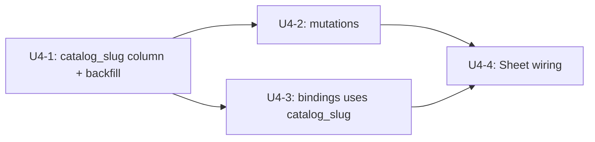

# feat: Customize Connectors live mutations (U4 from parent plan)

## Summary

Wire the Customize page's Connectors tab to live enable/disable mutations. Add a `catalog_slug` column on `connectors` so the Customize page can match Connected items unambiguously back to `tenant_connector_catalog`, replace the bindings resolver's best-effort `connectors.type == slug` heuristic with the new column, expose `enableConnector` / `disableConnector` GraphQL mutations gated by `requireTenantAdmin`, and wire the Sheet's Connect / Disable button to those mutations. MCP-kind cards stay read-only on this surface — actual MCP server enablement continues to flow through the existing per-user OAuth path on mobile (per origin Scope Boundaries).

---

## Problem Frame

PR #1076 wired the Customize page to live GraphQL reads. The Sheet's primary button still does nothing — `onAction` is plumbed through `CustomizeTabBody` but the per-tab pages don't pass a real handler. Connected detection for connectors uses a best-effort `connectors.type == catalog.slug` match (documented in the resolver header), which is fragile: not every catalog slug equals a real `connectors.type`, and seeded MCP-kind catalog items have no equivalent type in the connectors table at all.

This unit closes both seams: a real `catalog_slug` column on `connectors` makes the bindings join unambiguous, and the new mutations turn the Sheet button into a working toggle. Native-first scope keeps the PR shippable in one slice; MCP enablement is a documented follow-on because the underlying tenant_mcp_servers seam (per-user OAuth, transport / auth_config) is owned by the existing mobile path.

---

## Requirements Trace

Origin requirements carried forward from `docs/brainstorms/2026-05-09-computer-customization-page-requirements.md`:

- R5 (MCP folds under Connectors with type badge) — preserved; MCP cards still render under Connectors tab, just non-actionable on this surface
- R8 (Connected reads canonical tables) → U4-1 (catalog_slug join)
- R11 (toggles write canonical bindings) → U4-2 (enableConnector / disableConnector)
- R14 (edits caller's own Computer only) → U4-2, U4-3 (resolver authz)
- R16 (no real-time multi-client subscriptions) → U4-4 (urql `additionalTypenames`)

Acceptance examples AE3 (enable native connector creates a `connectors` row, card flips to Disable) and AE5 (disable removes / soft-disables, card flips to Connect) map to test scenarios on U4-2 and U4-4.

---

## System-Wide Impact

- `packages/database-pg` — schema column add, hand-rolled migration, backfill from `connectors.type` where the value matches an existing catalog slug for the same tenant.
- `packages/api` — two new mutations + resolver wiring; bindings resolver swaps from `connectors.type` join to `connectors.catalog_slug`.
- `apps/computer` — Sheet's `onAction` now resolves to a real urql mutation in each per-tab page; connectors tab gets the wiring this slice.
- No `apps/admin`, `apps/mobile`, or `packages/agentcore-strands` changes.

---

## Implementation Units

### U4-1. Add `connectors.catalog_slug` column + backfill

**Goal:** Give every connectors row a stable pointer to the `tenant_connector_catalog` slug it represents, so binding detection and mutation idempotency stop relying on `connectors.type` heuristics.

**Requirements:** R8.

**Dependencies:** none.

**Files:**
- `packages/database-pg/src/schema/connectors.ts` (modify — add nullable `catalog_slug text` column)
- `packages/database-pg/drizzle/0080_connectors_catalog_slug.sql` (new — hand-rolled migration with `creates-column:` marker, partial unique index, type-based backfill)
- `packages/database-pg/drizzle/0080_connectors_catalog_slug_rollback.sql` (new)

**Approach:**
- Add `catalog_slug text` to `connectors` schema, nullable. Index: `CREATE UNIQUE INDEX uq_connectors_catalog_slug_per_computer ON connectors (tenant_id, dispatch_target_id, catalog_slug) WHERE dispatch_target_type='computer' AND catalog_slug IS NOT NULL` so a Computer can hold at most one row per catalog slug.
- Backfill: `UPDATE connectors c SET catalog_slug = tcc.slug FROM tenant_connector_catalog tcc WHERE c.tenant_id = tcc.tenant_id AND c.type = tcc.slug AND c.catalog_slug IS NULL` — best-effort match preserves existing rows where `type` already aligned with a seeded catalog slug.
- Migration declares `-- creates-column: public.connectors.catalog_slug` and `-- creates: public.uq_connectors_catalog_slug_per_computer` markers per `docs/solutions/workflow-issues/manually-applied-drizzle-migrations-drift-from-dev-2026-04-21.md`.
- Apply manually with `psql -f` to dev after merge per `feedback_handrolled_migrations_apply_to_dev`.

**Patterns to follow:**
- `packages/database-pg/drizzle/0077_computers_primary_agent_id.sql` — same shape: hand-rolled DDL + backfill UPDATE in one transaction.

**Test scenarios:**
- Schema parity: column exists with text type, nullable, no FK.
- Unique-index enforcement: inserting a second connectors row with the same `(tenant_id, dispatch_target_id, catalog_slug)` triple where `dispatch_target_type='computer'` rejects with the expected constraint name.
- Index is partial: rows with `catalog_slug IS NULL` or `dispatch_target_type<>'computer'` do not collide with each other.

**Verification:** `pnpm db:migrate-manual` reports the column + index after `psql -f` on dev; Drizzle introspection round-trips cleanly.

---

### U4-2. `enableConnector` + `disableConnector` GraphQL mutations

**Goal:** Add the two mutations the Sheet button calls, gated by tenant authz.

**Requirements:** R11, R14.

**Dependencies:** U4-1.

**Files:**
- `packages/database-pg/graphql/types/customize.graphql` (modify — add `EnableConnectorInput`, `DisableConnectorInput`, mutations on `extend type Mutation`)
- `terraform/schema.graphql` (regenerate via `pnpm schema:build`)
- `packages/api/src/graphql/resolvers/customize/enableConnector.mutation.ts` (new)
- `packages/api/src/graphql/resolvers/customize/disableConnector.mutation.ts` (new)
- `packages/api/src/graphql/resolvers/customize/index.ts` (modify — add mutations to the aggregator)
- `packages/api/src/graphql/resolvers/index.ts` (modify — `customizeMutations` spread)
- `packages/api/src/graphql/resolvers/customize/__tests__/enableConnector.mutation.test.ts` (new)
- `packages/api/src/graphql/resolvers/customize/__tests__/disableConnector.mutation.test.ts` (new)

**Approach:**
- Mutation surface:
  - `enableConnector(input: EnableConnectorInput!): ConnectorBinding!` where input is `{ computerId: ID!, slug: String! }` — kind is implicit (only native handled this slice; MCP-kind cards short-circuit in the resolver with a typed error pointing the user at mobile OAuth).
  - `disableConnector(input: DisableConnectorInput!): Boolean!` — same input shape; idempotent (no-op if already disabled / removed).
- `ConnectorBinding` GraphQL type returns the relevant subset of the `connectors` row (`id`, `tenantId`, `computerId`, `catalogSlug`, `status`, `enabled`, `updatedAt`).
- Resolver flow:
  1. `resolveCaller(ctx)` → tenantId, userId; reject with null if either missing.
  2. Load `computers` row by `(id, tenant_id, owner_user_id, status<>'archived')` — confirms caller owns the Computer.
  3. `requireTenantAdmin(ctx, computer.tenant_id)` per `docs/solutions/best-practices/every-admin-mutation-requires-requiretenantadmin-2026-04-22.md`. (Computer owners are tenant admins on this surface; the helper centralizes the policy.)
  4. Look up the catalog row by `(tenant_id, slug)` → reject with typed `CustomizeCatalogNotFoundError` if missing.
  5. If catalog `kind='mcp'`, throw `CustomizeMcpNotSupportedError` with a stable code so the frontend can render the "Connect via mobile" hint.
  6. Native path: upsert into `connectors` keyed by the new partial unique index — `INSERT ... ON CONFLICT (tenant_id, dispatch_target_id, catalog_slug) DO UPDATE SET enabled=true, status='active', updated_at=now()`.
  7. Disable: `UPDATE connectors SET enabled=false, status='paused', updated_at=now() WHERE tenant_id=? AND dispatch_target_id=? AND catalog_slug=?`.
- Mutations are idempotent — safe to retry, safe to call when already in target state.

**Patterns to follow:**
- `packages/api/src/graphql/resolvers/computers/createComputer.mutation.ts` — resolver shape, error throwing.
- `packages/api/src/graphql/resolvers/templates/syncTemplateToAgent.mutation.ts` — `requireTenantAdmin` placement before any DB write.

**Test scenarios:**
- Happy path enable: new connectors row created with `catalog_slug=<slug>`, `enabled=true`, `status='active'`. **Covers AE3.**
- Idempotent enable: second call with same input returns the same row, no duplicate insert.
- Happy path disable: existing row flips to `enabled=false, status='paused'`. **Covers AE5.**
- Idempotent disable: call when no row exists returns true (no-op).
- Authz: caller without Computer ownership rejected before any DB write. **Covers AE6.**
- Authz: caller with non-matching tenantId rejected.
- MCP rejection: catalog row with `kind='mcp'` raises `CustomizeMcpNotSupportedError`; no `connectors` row created.
- Catalog miss: unknown slug raises `CustomizeCatalogNotFoundError`.

**Verification:** Resolver tests pass; calling `enableConnector` then re-querying `customizeBindings` shows the slug in `connectedConnectorSlugs`.

---

### U4-3. Update `customizeBindings` to use `catalog_slug`

**Goal:** Replace the best-effort `connectors.type == slug` join with a real `catalog_slug` join. Drop the heuristic comment.

**Requirements:** R8.

**Dependencies:** U4-1.

**Files:**
- `packages/api/src/graphql/resolvers/customize/customizeBindings.query.ts` (modify)
- `packages/api/src/graphql/resolvers/customize/__tests__/customizeBindings.query.test.ts` (new)

**Approach:**
- Replace the `connectors.type` selection with `connectors.catalog_slug`. Filter rows where `catalog_slug IS NOT NULL` so legacy rows that didn't backfill don't appear as bound.
- Header comment update: drop the "best-effort while connectors don't have a catalog_slug column" caveat for connectors. MCP and workflow caveats stay (each lands in its own follow-on slice).

**Patterns to follow:**
- The existing resolver already fetches connectors with the right authz scoping; only the projected column changes.

**Test scenarios:**
- Happy path: a connectors row with `catalog_slug='slack', enabled=true, status='active'` appears in `connectedConnectorSlugs`. **Covers AE3.**
- Disabled rows excluded: `enabled=false` row not in the result.
- Null catalog_slug excluded: pre-backfill rows with `catalog_slug IS NULL` not in the result.
- Tenant scoping: rows for another tenant not returned.

**Verification:** Existing customizeBindings tests still pass; new test covers the catalog_slug path.

---

### U4-4. Wire Sheet's Connect / Disable button to mutations (Connectors tab)

**Goal:** The user clicks Connect on a native connector card → row appears in `connectedConnectorSlugs` → table flips to Connected (via urql cache invalidation) → Sheet header status badge follows.

**Requirements:** R11, R14, R16.

**Dependencies:** U4-2, U4-3.

**Files:**
- `apps/computer/src/lib/graphql-queries.ts` (modify — add `EnableConnectorMutation`, `DisableConnectorMutation`)
- `apps/computer/src/components/customize/use-customize-mutations.ts` (new — `useConnectorMutation` hook returning `(slug, nextConnected) => void` plus pending state)
- `apps/computer/src/routes/_authed/_shell/customize.connectors.tsx` (modify — pass real `onAction` from the new hook, pass `pendingIds` if needed)
- `apps/computer/src/components/customize/CustomizeDetailSheet.tsx` (modify — surface MCP "Connect via mobile" hint when the action is suppressed)
- `apps/computer/src/components/customize/CustomizeTabBody.tsx` (modify only if needed to forward pendingIds)

**Approach:**
- `useConnectorMutation` wraps urql `useMutation` for both enable and disable, applies `additionalTypenames: ["Connector", "CustomizeBindings"]` so the bindings query refetches automatically. Returns `{ trigger, pendingId }`.
- Per-tab page passes `(slug, nextConnected) => trigger(slug, nextConnected)` as `onAction`. Optimistic UI happens through the cache invalidation; no manual `setItems` needed.
- For MCP-kind items, the hook short-circuits: it doesn't fire a mutation; instead, the per-tab page passes a sentinel handler that opens a small inline message in the Sheet ("Connect this MCP server from the mobile app"). The button stays disabled to avoid mutation attempts.
- Errors: surface via `sonner` toast (already a dep) — no inline retry UI. Failures revert nothing because we never optimistically wrote.

**Patterns to follow:**
- `apps/computer/src/components/ComputerSidebar.tsx:78-82` — `additionalTypenames` urql idiom that the customize-data hooks already documented.

**Test scenarios:**
- Native connect: clicking Connect on a non-connected connector fires `EnableConnectorMutation` with `(computerId, slug)`. **Covers AE3.**
- Native disconnect: clicking Disable on a connected connector fires `DisableConnectorMutation`. **Covers AE5.**
- MCP card: clicking Connect on an MCP-kind card does NOT fire a mutation; the Sheet shows the "Connect via mobile" hint and the button stays disabled.
- Pending state: while a mutation is in flight for a row, the Sheet button shows the disabled / pending state.
- Refetch: after a successful mutation, the row's Connected status reflects the new state without manual refresh.

**Verification:** Vitest passes; manual dev-stage smoke shows the row flipping between Connected and Available with native test cards.

---

## Test Strategy

- **Unit / integration tests** colocated per the existing repo convention (`__tests__/` for resolvers, alongside `*.tsx` for components).
- **Schema parity** lives in the Drizzle schema test pattern from `packages/database-pg/__tests__/`. If no test file exists for `connectors` parity yet, this slice does not introduce one — leave it to the broader schema-parity coverage gap that the customization parent plan already noted.
- **No browser end-to-end** in this slice; the existing visual contract test on the customize shell is sufficient.
- **Drift gate** runs in CI via `pnpm db:migrate-manual`; the new `-- creates:` markers must declare every object the migration adds.

---

## Sequencing



All four units land in a single PR — they're tightly coupled and the inert intermediate states are not user-facing.

---

## Key Technical Decisions

- **`catalog_slug text` column with partial unique index, not a FK.** Foreign key would require ON DELETE policy (catalog row deletion shouldn't cascade-drop bound connectors), and the catalog slug uniqueness is per-tenant — modeling that as a (tenant_id, slug) composite FK adds ceremony without payoff. Text column + partial unique on `(tenant_id, dispatch_target_id, catalog_slug)` for Computer dispatch is the minimal, idempotent shape mutations need.
- **Native-only enable/disable in this slice.** MCP enablement requires per-user OAuth + tenant_mcp_servers + agent_mcp_servers wiring; the origin doc explicitly puts OAuth ownership on the existing mobile path. Hint UI tells the user where to enable; deferred to a follow-on PR.
- **Idempotent mutations via `ON CONFLICT DO UPDATE`.** Re-clicking Connect on an already-connected row is a no-op. Re-clicking Disable on an already-disabled row is a no-op. urql cache invalidation alone is enough — no separate "current state" check.
- **Backfill best-effort, null otherwise.** Existing connectors rows whose `type` doesn't match any seeded catalog slug stay with `catalog_slug = NULL` and are excluded from the bindings query. They keep working through whatever existing connector dispatch logic ran them; only the Customize page can't see them.
- **`requireTenantAdmin` for both mutations.** Self-serve customization happens for the user's own Computer; the helper enforces caller-owns-tenant before any write, matching every other Customize-adjacent admin mutation.
- **Errors as typed GraphQL errors with stable codes.** `CustomizeCatalogNotFoundError`, `CustomizeMcpNotSupportedError`, plus the standard authz errors. The frontend keys off `code`, not message text.

---

## Risk Analysis & Mitigation

- **Risk: hand-rolled migration drifts from dev.** Mitigation: `-- creates-column:` and `-- creates:` markers in 0080 SQL header; CI drift gate via `pnpm db:migrate-manual`. Author must `psql -f` to dev after merge.
- **Risk: backfill collides where two old connector rows have the same `type` for a single Computer.** Mitigation: backfill uses `UPDATE ... FROM` rather than `INSERT`, so it can only set values; the partial unique index is created AFTER the backfill in the same transaction so any pre-existing duplicate `type` rows on the same Computer break the index creation loudly. If the migration fails on a real duplicate, the rollback drops the column and the operator can dedupe before retrying.
- **Risk: MCP-kind cards confuse users by being non-actionable.** Mitigation: Sheet renders a clear "Connect via mobile" hint and the button is visibly disabled; no silent failure.
- **Risk: optimistic-style UX expectations.** Mitigation: relying on urql cache invalidation + refetch keeps the source of truth on the server; a stale local optimistic state can't drift from the bindings response.

---

## Worktree Bootstrap

Sessions touching `packages/database-pg` and `packages/api` together (every unit in this plan does):

```
pnpm install
find . -name tsconfig.tsbuildinfo -not -path '*/node_modules/*' -delete
pnpm --filter @thinkwork/database-pg build
```

per `docs/solutions/build-errors/worktree-stale-tsbuildinfo-drizzle-implicit-any-2026-04-24.md`.

---

## Scope Boundaries

- MCP server enable / disable mutations from this surface — deferred to follow-on. Existing per-user OAuth on mobile remains the owner.
- Skill enable / disable wiring (parent plan U5).
- Workflow enable / disable wiring (parent plan U6).
- Workspace renderer extension that projects the active connector set into `AGENTS.md` (parent plan U7).
- Real-time multi-client subscription updates on Customize (parent plan R16).
- Custom-authoring sub-flows (parent plan R15).
- A FK on `connectors.catalog_slug → tenant_connector_catalog.slug` — text column with backfill is sufficient v1.

### Deferred to Follow-Up Work

- MCP enable/disable on the desktop Customize page once the agent_mcp_servers flow is unified with the catalog. Today's flow goes through mobile per-user OAuth.
- Tightening the partial unique index to also cover non-Computer dispatch targets if Customize ever surfaces them.
- A backfill audit script that lists `connectors` rows still on `catalog_slug = NULL` after the migration runs.

---

## Outstanding Questions

### Resolve Before Implementation

- None — the parent brainstorm + plan resolved the substantive blockers. This unit refines a known seam.

### Deferred to Implementation

- [Affects U4-2][Technical] Whether `requireTenantAdmin` should run before or after the Computer-ownership check. Either order is safe; pick the one that matches the existing customize resolver style discovered at implementation.
- [Affects U4-4][Technical] Whether to surface the MCP "Connect via mobile" hint inline in the Sheet or as a `sonner` toast. Sheet inline is cleaner; defer to implementer judgment if Sheet space gets tight.
- [Affects U4-1][Technical] Whether the partial unique index should also cover `dispatch_target_type='agent'` for parity with future agent-targeted Customize bindings. v1 only handles Computers; if the agent surface ever needs symmetric coverage, the index can be widened in a follow-on with no data migration.
