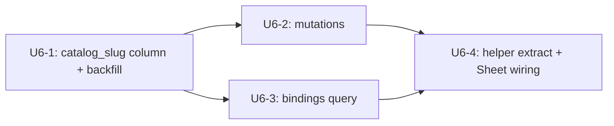

# feat: Customize Workflows live mutations + useToggleMutation helper (U6 from parent plan)

## Summary

Wire the Customize page's Workflows tab to live enable/disable mutations and close the third-call-site duplication that U4 + U5 reviews flagged. Adds a `routines.catalog_slug` column with a partial unique index so the Workflows tab can match catalog rows against `routines` unambiguously, ships `enableWorkflow` / `disableWorkflow` GraphQL mutations gated by `requireTenantMember` + Computer-ownership, populates `customizeBindings.connectedWorkflowSlugs` from the new column (no longer empty), and extracts a shared `useToggleMutation` helper that the connector / skill / workflow hooks compose. Mirrors the proven U4 (PR #1078) + U5 (PR #1082) shape end-to-end.

---

## Problem Frame

PRs #1076 (read paths), #1078 (Connectors mutations), and #1082 (Skills mutations) shipped two of the three Customize tabs end-to-end. The Workflows tab still has:

- **Inert binding detection.** `customizeBindings.query.ts` returns `connectedWorkflowSlugs: []` with a comment that says U6 will introduce a catalog-link column. Today every Workflows card renders as Available regardless of `routines` state.
- **No mutation surface.** The Workflows Sheet's `Connect` / `Disable` button has no `onAction` handler and is inert. There is no `enableWorkflow` / `disableWorkflow` resolver.
- **Three-call-site duplication.** `useConnectorMutation` and `useSkillMutation` are 70-line near-duplicates. The U4 + U5 reviews flagged the helper extraction as deferred until U6 made it the third call site.

This unit closes all three seams in one PR, identical in shape to U4. The schema seam (`routines.catalog_slug` + partial unique on `(agent_id, catalog_slug)`) mirrors the `connectors.catalog_slug` pattern. The mutation pair mirrors `enableSkill` / `disableSkill`. The helper extraction lands now because three call sites is the threshold the prior reviews picked.

---

## Requirements Trace

Origin requirements carried forward from `docs/brainstorms/2026-05-09-computer-customization-page-requirements.md`:

- R7 (Workflows pill from `routines`) — already met by PR #1076 catalog/list; binding detection completed by U6-1 + U6-3.
- R8 (Connected reads canonical tables) → U6-1 (column), U6-3 (bindings query swap).
- R9 (Available reads new per-tenant catalog tables) — already met by PR #1075 seed + #1076 query.
- R11 (toggles write canonical bindings) → U6-2 (`enableWorkflow` / `disableWorkflow`).
- R14 (edits caller's own Computer only) → U6-2 (resolver authz).
- R16 (no real-time multi-client subscriptions) → U6-4 (`additionalTypenames` invalidation only).

Acceptance examples AE3 (enable creates a routines row, card flips to Disable), AE5 (disable soft-disables, card flips to Connect), and AE6 (cross-tenant rejection) map to test scenarios on U6-2, U6-3, and U6-4.

The helper extraction (`useToggleMutation`) is closing review residual #6 from PR #1078 (`feat-customize-connectors-live-7c6c30aa.md`) and #5 from PR #1082 (`feat-customize-skills-live-452b172d.md`), both of which deferred this until the third call site landed.

---

## System-Wide Impact

- `packages/database-pg` — schema column add on `routines`, hand-rolled migration `0081_routines_catalog_slug.sql` with `-- creates-column:` + `-- creates:` markers + best-effort backfill.
- `packages/api` — two new mutation files, GraphQL types/extensions, resolver index wiring, `customizeBindings.query.ts` updated to compute `connectedWorkflowSlugs` from the new column.
- `apps/computer` — new `useToggleMutation` helper in `use-customize-mutations.ts`; existing `useConnectorMutation` / `useSkillMutation` refactored to compose it; new `useWorkflowMutation` added; Workflows tab page rewrites to pass `onAction`.
- No `apps/admin` / `apps/mobile` / Strands runtime changes.
- No new ports / Cognito CallbackURL changes.

---

## Implementation Units

### U6-1. Add `routines.catalog_slug` column + partial unique index + backfill

**Goal:** Give every routines row a stable pointer to the `tenant_workflow_catalog` slug it represents, so binding detection and mutation idempotency are unambiguous.

**Requirements:** R8.

**Dependencies:** none.

**Files:**
- `packages/database-pg/src/schema/routines.ts` (modify — add nullable `catalog_slug text` column)
- `packages/database-pg/drizzle/0081_routines_catalog_slug.sql` (new — hand-rolled migration with `-- creates-column:` + `-- creates:` markers, partial unique index, best-effort backfill)
- `packages/database-pg/drizzle/0081_routines_catalog_slug_rollback.sql` (new — drops index, drops column)

**Approach:**
- Add `catalog_slug text` to `routines` schema, nullable. Index: `CREATE UNIQUE INDEX uq_routines_catalog_slug_per_agent ON routines (agent_id, catalog_slug) WHERE agent_id IS NOT NULL AND catalog_slug IS NOT NULL` so an agent can hold at most one routine per catalog slug. Mirrors the U4 partial index shape (the analogue there was per-Computer; for routines the natural per-agent scope matches how `enableWorkflow` will key the upsert).
- Backfill: `UPDATE routines r SET catalog_slug = twc.slug FROM tenant_workflow_catalog twc WHERE r.tenant_id = twc.tenant_id AND r.name = twc.display_name AND r.catalog_slug IS NULL`. Best-effort match — most existing routines won't align (routines are user-named), so the backfill is mostly a no-op. The column stays nullable to keep that valid.
- Migration declares `-- creates-column: public.routines.catalog_slug` and `-- creates: public.uq_routines_catalog_slug_per_agent` markers per `docs/solutions/workflow-issues/manually-applied-drizzle-migrations-drift-from-dev-2026-04-21.md`.
- Apply manually with `psql -f` to dev after merge per `feedback_handrolled_migrations_apply_to_dev`. The drift gate (`pnpm db:migrate-manual`) will flag missing apply on next deploy.

**Patterns to follow:**
- `packages/database-pg/drizzle/0080_connectors_catalog_slug.sql` — same shape: hand-rolled DDL + backfill UPDATE + partial unique index in one transaction with `-- creates:` markers.

**Test scenarios:**
- Schema parity: column exists with text type, nullable, no FK.
- Unique-index enforcement: inserting a second routines row with the same `(agent_id, catalog_slug)` pair (both non-null) rejects with the expected constraint name.
- Index is partial: rows with `catalog_slug IS NULL` or `agent_id IS NULL` do not collide with each other.
- Test expectation: backfill behavior is a SQL UPDATE — covered implicitly by the binding-query tests in U6-3 (which seed routines rows with explicit `catalog_slug`). No dedicated backfill test.

**Verification:** `pnpm db:migrate-manual` reports the column + index after `psql -f` on dev; Drizzle introspection round-trips cleanly; existing routines suite still passes.

---

### U6-2. `enableWorkflow` + `disableWorkflow` GraphQL mutations

**Goal:** Add the two mutations the Workflows Sheet button calls. Write to `routines` keyed by the Computer's primary agent and the catalog `slug` via `catalog_slug`. Idempotent.

**Requirements:** R11, R14.

**Dependencies:** U6-1.

**Files:**
- `packages/database-pg/graphql/types/customize.graphql` (modify — add `WorkflowBinding`, `EnableWorkflowInput`, `DisableWorkflowInput`, mutations on `extend type Mutation`)
- `terraform/schema.graphql` (regenerate via `pnpm schema:build`)
- `packages/api/src/graphql/resolvers/customize/enableWorkflow.mutation.ts` (new)
- `packages/api/src/graphql/resolvers/customize/disableWorkflow.mutation.ts` (new)
- `packages/api/src/graphql/resolvers/customize/index.ts` (modify — register new resolvers in `customizeMutations`)
- `packages/api/src/graphql/resolvers/customize/__tests__/enableWorkflow.mutation.test.ts` (new)
- `packages/api/src/graphql/resolvers/customize/__tests__/disableWorkflow.mutation.test.ts` (new)

**Approach:**
- Mutation surface:
  - `enableWorkflow(input: EnableWorkflowInput!): WorkflowBinding!` where input is `{ computerId: ID!, slug: String! }`.
  - `disableWorkflow(input: DisableWorkflowInput!): Boolean!` — same input, idempotent.
- `WorkflowBinding` GraphQL type: `id: ID!, tenantId: ID!, agentId: ID!, catalogSlug: String!, status: String!, updatedAt: AWSDateTime!`. Returns the relevant subset of the `routines` row.
- Resolver flow (mirrors enableSkill exactly):
  1. `resolveCaller(ctx)` → tenantId, userId; reject with `UNAUTHENTICATED` if either missing.
  2. Load `computers` row keyed on `(id, owner_user_id, status<>'archived')` so caller-owns-Computer is enforced before any other read.
  3. `requireTenantMember(ctx, computer.tenant_id)`.
  4. Resolve `agentId` via `computer.primary_agent_id ?? computer.migrated_from_agent_id`. Reject with `CUSTOMIZE_PRIMARY_AGENT_NOT_FOUND` when both are null.
  5. Look up the catalog row by `(tenant_id, slug)` from `tenant_workflow_catalog`. Reject with `CUSTOMIZE_CATALOG_NOT_FOUND` when missing.
  6. Native (and only) path: upsert into `routines` keyed by the new partial unique index `(agent_id, catalog_slug)`:
     - `INSERT INTO routines (tenant_id, agent_id, name, description, type, status, schedule, config, catalog_slug) VALUES (...) ON CONFLICT (agent_id, catalog_slug) WHERE agent_id IS NOT NULL AND catalog_slug IS NOT NULL DO UPDATE SET status='active', updated_at=now()`.
     - Insert defaults: `name = catalog.display_name`, `description = catalog.description`, `type = 'scheduled'`, `status = 'active'`, `schedule = catalog.default_config->>'schedule'` (null-safe), `config = catalog.default_config`, `catalog_slug = slug`.
  7. Disable: `UPDATE routines SET status='inactive', updated_at=now() WHERE agent_id=? AND catalog_slug=?`. Idempotent — flips status, never deletes (preserves run history per parent plan U6 Approach).
- All mutations idempotent. No `requires_verification` side effects. The renderer extension that projects `routines` into AGENTS.md is U7 — out of scope here.

**Patterns to follow:**
- `packages/api/src/graphql/resolvers/customize/enableSkill.mutation.ts` — same auth flow, same upsert pattern, same error code shape.
- `packages/api/src/graphql/resolvers/customize/enableConnector.mutation.ts` — same `ON CONFLICT DO UPDATE` shape with a partial unique index.
- `packages/api/src/graphql/resolvers/customize/disableSkill.mutation.ts` — idempotent UPDATE shape.
- Resolver tests use the `vi.hoisted` mock harness pattern from `packages/api/src/graphql/resolvers/customize/__tests__/enableSkill.mutation.test.ts`.

**Test scenarios:**
- Happy path enable (new): no existing routine — new `routines` row created with `agent_id=primary_agent_id`, `catalog_slug=<slug>`, `status='active'`, defaults sourced from catalog `default_config`. **Covers AE3.**
- Happy path enable (revive existing inactive): a routines row already exists with `(agent_id, catalog_slug)` and `status='inactive'` — flips to `'active'`, does not duplicate.
- Idempotent enable: second call when already active returns the same row, no duplicate insert.
- Happy path disable: existing row flips to `status='inactive'`. Run history preserved (row not deleted). **Covers AE5.**
- Idempotent disable: call when no row exists returns true (no-op).
- Authz: caller without Computer ownership rejected before any DB write. **Covers AE6.**
- Authz: caller with non-matching tenantId rejected.
- Catalog miss: unknown `slug` raises `CUSTOMIZE_CATALOG_NOT_FOUND`.
- Missing primary agent: Computer with both `primary_agent_id` and `migrated_from_agent_id` null raises `CUSTOMIZE_PRIMARY_AGENT_NOT_FOUND`.

**Verification:** Resolver tests pass; calling `enableWorkflow` then re-querying `customizeBindings` shows the slug in `connectedWorkflowSlugs`.

---

### U6-3. Update `customizeBindings` to compute `connectedWorkflowSlugs`

**Goal:** Replace the empty stub for `connectedWorkflowSlugs` with a real query against `routines.catalog_slug`. Drop the U6-pending caveat in the resolver header.

**Requirements:** R8.

**Dependencies:** U6-1.

**Files:**
- `packages/api/src/graphql/resolvers/customize/customizeBindings.query.ts` (modify — add routines lookup; drop the workflows TODO comment)
- `packages/api/src/graphql/resolvers/customize/__tests__/customizeBindings.query.test.ts` (modify — add workflow scenarios; add a guard that asserts the empty stub is gone)

**Approach:**
- Add a third parallel query in the existing `Promise.all`: `db.select({ catalog_slug: routines.catalog_slug }).from(routines).where(and(eq(routines.agent_id, agentId), eq(routines.status, 'active'), isNotNull(routines.catalog_slug)))`. Skip when `agentId` is null (consistent with the existing `agentSkills` skip).
- Project: `connectedWorkflowSlugs = Array.from(new Set(routineRows.map(r => r.catalog_slug).filter(Boolean)))`.
- Header comment update: drop "Empty in v1; populated by U6 once routines carry a catalog slug link" — replace with the same shape as the connectors note ("`routines.catalog_slug` is the canonical pointer to the catalog row (added by plan 010 U6-1).").

**Patterns to follow:**
- The connectors block within the same resolver (`Promise.all` parallelism, `Array.from(new Set(...))` dedup, `isNotNull` filter).

**Test scenarios:**
- Happy path: a routines row with `catalog_slug='daily-digest'`, `status='active'`, `agent_id=primary_agent_id` appears in `connectedWorkflowSlugs`. **Covers AE3.**
- Inactive rows excluded: `status='inactive'` row not in the result. **Covers AE5.**
- Null `catalog_slug` excluded: pre-backfill rows with `catalog_slug IS NULL` not in the result.
- Cross-agent isolation: routines for another agent in the same tenant not returned.
- Cross-tenant isolation: routines for another tenant not returned (caller's `(tenantId, ownerUserId, computerId)` filter handles this transitively, so this is a regression guard).
- Regression: existing connector + skill projections still work unchanged.

**Verification:** Existing customizeBindings tests still pass; new test covers the workflow path. Frontend Workflows tab rendering picks up `connectedWorkflowSlugs` immediately on next render.

---

### U6-4. Extract `useToggleMutation` helper + add `useWorkflowMutation` + wire Sheet

**Goal:** Close the U4 + U5 review residual by extracting the shared mutation orchestration (`MyComputerQuery` resolution, pending Set, additionalTypenames invalidation, error-toast routing) into a single `useToggleMutation` helper. Refactor the existing `useConnectorMutation` and `useSkillMutation` to compose it, add `useWorkflowMutation` as the third caller, and wire the Workflows Sheet's Connect / Disable button.

**Requirements:** R11, R14, R16.

**Dependencies:** U6-2, U6-3.

**Files:**
- `apps/computer/src/lib/graphql-queries.ts` (modify — append `EnableWorkflowMutation`, `DisableWorkflowMutation`)
- `apps/computer/src/components/customize/use-customize-mutations.ts` (modify — extract `useToggleMutation` core, refactor `useConnectorMutation` + `useSkillMutation` to thin wrappers, add `useWorkflowMutation`; preserve back-compat exports `MCP_VIA_MOBILE_HINT`, `BUILTIN_TOOL_HINT`, `CONNECTOR_TYPENAMES`, `SKILL_TYPENAMES`; add new `WORKFLOW_TYPENAMES`)
- `apps/computer/src/components/customize/use-customize-mutations.test.tsx` (new — direct tests for the extracted helper covering pending-set semantics, error-code routing, computer-id resolution; in addition to the existing per-hook coverage that survives refactor)
- `apps/computer/src/routes/_authed/_shell/customize.workflows.tsx` (modify — pull `onAction` from `useWorkflowMutation`, pass to `CustomizeTabBody`)

**Approach:**
- `useToggleMutation` shape (extracted from the existing two hooks; same public contract as the back-compat aliases):
  ```ts
  // Directional sketch — not implementation specification.
  function useToggleMutation<TInput extends Record<string, unknown>>(opts: {
    enableMutation: TypedDocumentNode;
    disableMutation: TypedDocumentNode;
    typenames: readonly string[];
    buildInput: (computerId: string, key: string) => { input: TInput };
    errorCodeHints?: Record<string, string>; // e.g. { CUSTOMIZE_MCP_NOT_SUPPORTED: MCP_VIA_MOBILE_HINT }
  }): { toggle: (key: string, nextConnected: boolean) => Promise<void>; pendingSlugs: ReadonlySet<string> }
  ```
- `useConnectorMutation` becomes a 5-line wrapper around `useToggleMutation` with `{ enableMutation: EnableConnectorMutation, disableMutation: DisableConnectorMutation, typenames: CONNECTOR_TYPENAMES, buildInput: (id, slug) => ({ input: { computerId: id, slug } }), errorCodeHints: { CUSTOMIZE_MCP_NOT_SUPPORTED: MCP_VIA_MOBILE_HINT } }`.
- `useSkillMutation` similarly thin: `{ ..., buildInput: (id, skillId) => ({ input: { computerId: id, skillId } }), errorCodeHints: { CUSTOMIZE_BUILTIN_TOOL_NOT_ENABLEABLE: BUILTIN_TOOL_HINT } }`.
- `useWorkflowMutation`: `{ ..., buildInput: (id, slug) => ({ input: { computerId: id, slug } }), errorCodeHints: undefined }`. The mutation has no special-case error codes that route to a hint message; the default `toast.error(message)` path handles `CUSTOMIZE_CATALOG_NOT_FOUND` and `CUSTOMIZE_PRIMARY_AGENT_NOT_FOUND`.
- urql `additionalTypenames` for workflows: `["Routine", "WorkflowBinding", "CustomizeBindings"]`. Exported as `WORKFLOW_TYPENAMES`. The `Routine` typename is what existing routines queries return (verify at implementation; if the resolver returns a different typename, use that).
- The Workflows page passes `(slug, nextConnected) => trigger(slug, nextConnected)` as `onAction` to `CustomizeTabBody`. No special-case rendering — the Sheet button shape is shared across all three tabs.
- Errors: `sonner` toast surfaces server error message via the helper's existing path. Specific code-based hints route through `errorCodeHints`.

**Patterns to follow:**
- The current `useConnectorMutation` / `useSkillMutation` shape — verbatim public contract, internals collapse into the new helper.
- Existing `apps/computer/src/components/customize/CustomizeTabBody.tsx` `onAction` prop — already plumbed through.
- `apps/computer/src/components/computer/__tests__/` test patterns for hooks (renderHook + urql Provider mock).

**Execution note:** Refactor first — extract the helper and verify both existing hooks (`useConnectorMutation`, `useSkillMutation`) still behave identically before adding `useWorkflowMutation`. The existing test suites for the two hooks must continue to pass without modification; if they fail after refactor, the public contract drifted and the refactor needs adjustment.

**Test scenarios:**
- Helper happy path enable: calling `toggle(key, true)` fires `enableMutation` with `{ input: buildInput(computerId, key) }` and `additionalTypenames: typenames`.
- Helper happy path disable: calling `toggle(key, false)` fires `disableMutation` with the same input shape and typenames.
- Helper pending Set semantics: while a toggle is in flight for `key='a'`, `pendingSlugs.has('a')` is true; concurrent toggle for `key='b'` adds `'b'` without clobbering `'a'`; both clear after their own resolution.
- Helper missing computer: when `MyComputerQuery` returns null, `toggle` shows an error toast and skips both mutations.
- Helper error-code routing: when the server returns a GraphQL error with `extensions.code` matching `errorCodeHints`, the hinted message is shown via `toast.message`; other codes / no code fall back to `toast.error(message)`.
- Connectors regression: `useConnectorMutation` still surfaces `MCP_VIA_MOBILE_HINT` for `CUSTOMIZE_MCP_NOT_SUPPORTED`. The existing connector hook tests pass unchanged.
- Skills regression: `useSkillMutation` still surfaces `BUILTIN_TOOL_HINT` for `CUSTOMIZE_BUILTIN_TOOL_NOT_ENABLEABLE`. The existing skill hook tests pass unchanged.
- Workflow enable: clicking Connect on a non-connected workflow fires `EnableWorkflowMutation` with `(computerId, slug)`. **Covers AE3.**
- Workflow disable: clicking Disable on a connected workflow fires `DisableWorkflowMutation`. **Covers AE5.**
- Workflow refetch: after a successful mutation, the row's Connected status reflects the new state without manual refresh.

**Verification:** Vitest passes; manual dev-stage smoke shows the row flipping between Connected and Available with seeded workflows; the existing Connectors / Skills tab smoke from prior PRs still works.

---

## Sequencing



All four units land in a single PR — they're tightly coupled, the inert intermediate states are not user-facing, and shipping them together keeps the helper extraction in the same diff that adds the third call site (avoids a half-refactored intermediate).

---

## Key Technical Decisions

- **`routines.catalog_slug text` column with partial unique on `(agent_id, catalog_slug)`, not a FK.** Mirrors the U4 connectors decision exactly — a foreign key would require an `ON DELETE` policy (catalog row deletion shouldn't cascade-drop bound routines), and the catalog slug uniqueness is per-tenant. Modeling as `(tenant_id, slug)` composite FK adds ceremony without payoff. Text column + per-agent partial unique is the minimal, idempotent shape mutations need.
- **Per-agent partial unique, not per-Computer.** Routines bind to `agent_id`, not `computer_id` — there is no `dispatch_target_id` analogue on routines. The natural scope for "this Computer's binding for this catalog slug" is "this Computer's primary agent's binding for this catalog slug", matching the U5 `agent_skills` shape.
- **Disable flips status to `'inactive'`, never deletes.** Preserves run history (`last_run_at`, `next_run_at`, any associated `trigger_runs`). The parent plan's U6 Approach explicitly calls this out.
- **Re-enable revives the existing inactive row, never duplicates.** `ON CONFLICT (agent_id, catalog_slug) DO UPDATE SET status='active'` handles this in one statement — same idempotency property the U4 connectors mutation has.
- **No `requireTenantMember + 'admin'` escalation.** Self-serve customization is the same surface as Connectors and Skills; the Computer-ownership predicate is the per-Computer scope. `requireTenantMember` is the right gate.
- **Helper extraction lands in the same PR as the third call site.** U4 and U5 both deferred this to "when U6 makes it three"; that threshold is now. Splitting the helper into its own follow-up PR would mean the Workflows hook ships as a fresh near-duplicate — the wrong direction. Refactor-first execution note in U6-4 ensures the existing Connector/Skill hooks survive intact.
- **Errors as typed GraphQL errors with stable codes.** `CUSTOMIZE_CATALOG_NOT_FOUND`, `CUSTOMIZE_PRIMARY_AGENT_NOT_FOUND`, plus the standard `COMPUTER_NOT_FOUND` / `UNAUTHENTICATED`. No workflow-specific code (no MCP equivalent, no built-in equivalent — the catalog itself is the gate).
- **Defaults from `tenant_workflow_catalog.default_config` on insert.** First-time enable copies the catalog's default config + schedule into the new routines row. Per-routine config editing (schedule changes, ASL paste) belongs to the existing Automations page — not this surface.

---

## Risk Analysis & Mitigation

- **Risk: hand-rolled migration drifts from dev.** Mitigation: `-- creates-column:` and `-- creates:` markers in the SQL header; CI drift gate via `pnpm db:migrate-manual`. Author must `psql -f` to dev after merge per `feedback_handrolled_migrations_apply_to_dev`.
- **Risk: backfill collides if two existing routines share `name = catalog.display_name` for the same agent.** Mitigation: backfill uses `UPDATE ... FROM`, so it can only set values; the partial unique index is created AFTER the backfill in the same transaction, so any pre-existing duplicates surface loudly at index creation. The rollback drops the index + column so the operator can dedupe and retry.
- **Risk: a refactor of `useConnectorMutation` / `useSkillMutation` regresses MCP / built-in hint behavior.** Mitigation: the existing hook tests must pass without modification — that's the U6-4 execution-note guarantee. Direct helper tests cover the error-code routing surface explicitly.
- **Risk: refactor changes the typenames invalidation order in a way that masks a subtle race.** Mitigation: typenames stay as exported `*_TYPENAMES` constants; the helper accepts them as an opaque tuple. The refactor is shape-preserving; if behavior changes, the hook tests catch it.
- **Risk: enable on a routine that has an associated `triggers` schedule produces inconsistent state.** Mitigation: out of scope — this resolver only flips `routines.status`. The triggers / scheduled-jobs path observes status changes through its existing reconciler. If a triggers row needs status sync, that's a follow-up (Outstanding Question).
- **Risk: optimistic UX expectations.** Mitigation: relying on urql cache invalidation + refetch keeps the source of truth on the server; no optimistic local state to drift.

---

## Worktree Bootstrap

Sessions touching `packages/database-pg` and `packages/api` together:

```
pnpm install
find . -name tsconfig.tsbuildinfo -not -path '*/node_modules/*' -delete
pnpm --filter @thinkwork/database-pg build
```

per `docs/solutions/build-errors/worktree-stale-tsbuildinfo-drizzle-implicit-any-2026-04-24.md`.

After the migration lands and merges:

```
psql "$DATABASE_URL" -f packages/database-pg/drizzle/0081_routines_catalog_slug.sql
```

per `feedback_handrolled_migrations_apply_to_dev`.

---

## Scope Boundaries

- Workspace renderer extension projecting active routine set into `AGENTS.md` (parent plan U7).
- MCP server enable / disable from desktop Customize (deferred indefinitely; mobile per-user OAuth path remains owner).
- Real-time multi-client subscription updates on Customize (parent plan R16).
- Custom workflow authoring sub-flows — ASL paste / visual editor (parent plan R15).
- Schedule editing / run history surfacing — those stay on the Automations page.
- Triggers / scheduled-jobs reconciliation when a routine flips inactive — observed by the existing reconciler; out of scope here.
- A FK on `routines.catalog_slug → tenant_workflow_catalog.slug` — text column + best-effort backfill is sufficient v1.
- Helper extraction beyond `useToggleMutation` — `loadCallerComputer` (the duplicated resolver-side preamble across `enableConnector` / `disableConnector` / `enableSkill` / `disableSkill` / `enableWorkflow` / `disableWorkflow`) ships next slice.

### Deferred to Follow-Up Work

- Resolver-side `loadCallerComputer` helper extraction across the six Customize mutations (residual #7 from PR #1078, residual carried by PR #1082). Now that six call sites exist, the next slice should land it. This unit is intentionally frontend-helper-only because the resolver-side helper would touch all six existing mutation files and inflate the PR.
- Workspace renderer extension (parent plan U7). Until U7 lands, enabling a workflow updates the DB but not the agent's prompt-readable view; the Strands runtime won't see the change until U7 ships.
- Triggers reconciliation when a routine status flips — if disabling a workflow needs to also flip the associated `triggers` row, that's a separate slice owned by the scheduled-jobs reconciler.
- Backfill audit: a script that lists `routines` rows still on `catalog_slug = NULL` after migration runs (low priority — most user-authored routines won't ever map to a catalog slug, so the null is the steady state for those).

---

## Outstanding Questions

### Resolve Before Implementation

- None — the parent plan + brainstorm + U4 + U5 ships resolved the substantive blockers. This unit refines the third known seam.

### Deferred to Implementation

- [Affects U6-2][Technical] Whether to round-trip the `enabled` column through `WorkflowBinding` or omit it (workflows track via `status`, not `enabled`). Defer to implementer judgment — the `routines` table has both columns historically; using `status` mirrors the existing `routines` resolver convention.
- [Affects U6-2][Technical] Whether to copy `tenant_workflow_catalog.default_config` into the new `routines.config` on first enable, or leave it null. Plan calls for copying — confirm `default_config` shape at implementation matches what `routines.config` expects.
- [Affects U6-4][Technical] Exact urql typename for routines query results. Plan assumes `Routine`; verify against the existing routines resolver at implementation. If the resolver returns a different typename (e.g., `RoutineRow`), use that instead.
- [Affects U6-4][Technical] Whether `useToggleMutation` should accept `errorCodeHints` as a generic-keyed object or a strongly-typed union. Generic is simpler and matches how the existing two hooks use it; defer to implementation if a typing improvement emerges naturally.
- [Affects U6-1][Operational] Whether the partial unique index should also cover `agent_id IS NULL` rows (cross-agent / system routines). v1 only handles per-agent Customize bindings; the index can be widened in a follow-on with no data migration.
