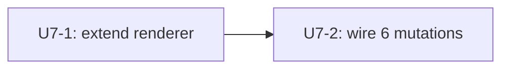

# feat: Workspace renderer extension — project active customize set into AGENTS.md (U7 from parent plan)

## Summary

Extend `packages/api/src/lib/workspace-map-generator.ts` so each Customize toggle re-derives `AGENTS.md` with new Connectors and Workflows sections alongside the existing Skills and Knowledge Bases catalogs. Wire the 6 Customize mutations (`enableConnector` / `disableConnector` / `enableSkill` / `disableSkill` / `enableWorkflow` / `disableWorkflow`) to invoke the renderer after their binding write commits so the Strands runtime sees customization changes on its next workspace sync. Filter built-in tool slugs out of the projected Skills section per the established rule. Make the renderer write-only-when-changed (hash compare against the existing S3 object) so no-op toggles don't churn manifests.

---

## Problem Frame

PRs #1078 (U4 connectors), #1082 (U5 skills), and #1084 (U6 workflows) wired live mutations into `connectors`, `agent_skills`, and `routines`. The customize-page-side UX is correct: clicking Connect / Disable flips DB rows and the urql cache invalidates Connected lists for the user. But the **agent runtime still sees the old AGENTS.md** because the workspace renderer only projects skills + KBs and only fires from the legacy `setAgentSkills` / `setAgentKnowledgeBases` paths. A user who connects Slack, enables a skill, and turns on a daily-digest workflow gets a Customize page that says "Connected" while their agent's prompt-readable view of the workspace is unchanged until the next setAgentSkills call (which may never come).

This unit closes that seam: the renderer becomes the single source of truth for projecting DB customization state into the prompt-readable workspace, the 6 Customize mutations all fire it after their writes, and built-in tools (which live in template/runtime config, not workspace skills) get filtered out of the projection so they don't double-surface.

The renderer’s existing fire-and-forget pattern (used by `setAgentSkills`) drops failures silently into CloudWatch. Per `feedback_avoid_fire_and_forget_lambda_invokes` and the parent plan's explicit "synchronous from the mutation" choice, the new wire-up uses `await` so renderer failures surface in the mutation response (logged + non-fatal to the toggle, but visible).

---

## Requirements Trace

Origin requirements carried forward from `docs/brainstorms/2026-05-09-computer-customization-page-requirements.md`:

- R12 (workspace renderer projects active set) → U7-1.
- R13 (changes propagate on next invocation) → U7-1, U7-2.
- R8 (Connected reads canonical tables) — already met for the user-facing read path; U7 closes the agent-facing read path.
- Built-in tool exclusion follows `docs/solutions/best-practices/injected-built-in-tools-are-not-workspace-skills-2026-04-28.md` — built-ins are template/runtime config, not workspace skills, and must not be projected into the AGENTS.md Skills table.
- Filesystem-as-source-of-truth invariant per `docs/solutions/architecture-patterns/workspace-skills-load-from-copied-agent-workspace-2026-04-28.md` — DB rows are derived; the renderer is the seam between DB state and the prompt-readable view.
- `DEFAULTS_VERSION` stability per `docs/solutions/workflow-issues/workspace-defaults-md-byte-parity-needs-ts-test-2026-04-25.md` — Connectors and Workflows projection lives **in AGENTS.md**, not in new canonical workspace files under `packages/workspace-defaults`.

Acceptance examples AE3 (enable creates binding row, card flips to Disable) extends here: AE3 also implies the next agent turn sees the new binding via AGENTS.md. AE4 / AE5 (disable removes / soft-disables) imply the next turn sees the binding removed.

---

## System-Wide Impact

- `packages/api/src/lib/workspace-map-generator.ts` — extend with Connectors + Workflows projection, built-in tool filter, idempotent write.
- `packages/api/src/graphql/resolvers/customize/{enableConnector,disableConnector,enableSkill,disableSkill,enableWorkflow,disableWorkflow}.mutation.ts` — wire renderer call after each binding write.
- `packages/api/src/lib/__tests__/workspace-map-generator.test.ts` — new tests for Connectors / Workflows projection, built-in filter, idempotent write.
- Existing renderer callers (`setAgentSkills`, `setAgentKnowledgeBases`, `syncTemplateToAgent`, `createAgentFromTemplate`, `rollbackAgentVersion`, `bootstrap-workspaces.ts`, `regen-all-workspace-maps.ts`) — pick up new behavior implicitly. The Connectors section is gated by Computer resolution, so non-Customize callers without a Computer key see an empty / absent Connectors section.
- No `packages/database-pg` schema changes.
- No `packages/workspace-defaults` changes (that's the explicit point of "renders into AGENTS.md").
- No Strands runtime / `packages/agentcore-strands` changes — the runtime already reads `AGENTS.md` from the synced workspace.
- No `apps/computer` / `apps/admin` / `apps/mobile` changes.

---

## Implementation Units

### U7-1. Extend `regenerateWorkspaceMap` with Connectors + Workflows projection, built-in filter, idempotent write

**Goal:** Project active connectors and active routines into new AGENTS.md sections; filter built-in tool slugs out of the existing Skills section; skip the S3 PutObject when the rendered content is unchanged from what's already on S3.

**Requirements:** R12, R13, R8.

**Dependencies:** none (substrate-first; mutation wire-up follows in U7-2).

**Files:**
- `packages/api/src/lib/workspace-map-generator.ts` (modify)
- `packages/api/src/lib/__tests__/workspace-map-generator.test.ts` (new — colocate test with existing patterns under `packages/api/src/__tests__/` if that's the established home; the unit's existing pattern places tests next to the implementation file).

**Approach:**
- **Computer resolution.** The renderer is keyed by `agentId` today. Connectors are scoped to Computer (`dispatch_target_id=computer.id`), so the renderer needs a Computer reference. Two-step:
  1. Add an optional `computerId` param to `regenerateWorkspaceMap(agentId, computerId?)`. Customize mutations pass it explicitly (they already loaded the row).
  2. When `computerId` is null, fall back to a single SELECT: `computers WHERE primary_agent_id=agentId OR migrated_from_agent_id=agentId LIMIT 1`. Existing callers (setAgentSkills etc.) continue to work; if no Computer is found, the Connectors section renders as "No connectors configured." (parity with current "No skills assigned." behavior).
- **Connectors projection.** Query: `connectors WHERE tenant_id=<tenant> AND dispatch_target_type='computer' AND dispatch_target_id=<computer.id> AND status='active' AND enabled=true AND catalog_slug IS NOT NULL`. Join `tenant_connector_catalog` on `(tenant_id, catalog_slug=slug)` for `display_name` + `category`. Render as a new "## Connectors" Markdown table mirroring the Skills table shape (`| Connector | Description | Category |`).
- **Workflows projection.** Query: `routines WHERE agent_id=<agentId> AND status='active' AND catalog_slug IS NOT NULL`. Join `tenant_workflow_catalog` on `(tenant_id, catalog_slug=slug)` for `display_name` + `default_schedule`. Render as a new "## Workflows" Markdown table (`| Workflow | Description | Schedule |`). When schedule is null, show "on-demand".
- **Built-in tool filter.** In the existing skills mapping, drop rows where `isBuiltinToolSlug(skill_id)` returns true. The current mapping returns all `agent_skills` rows; add a `.filter()` step before the catalog lookup loop. This is a **behavior change**: built-in tools that may currently appear in AGENTS.md will disappear on next regen. Document explicitly in commit message + test scenario.
- **Idempotent write (hash compare).** Before writing the new AGENTS.md to S3:
  1. Read the existing `AGENTS.md` from S3 (already happens partially — extend `readS3Text` reuse).
  2. Compute SHA-256 of both the new content and the existing content (or simpler: byte-equal compare, since the content is small).
  3. If equal, skip the `PutObjectCommand` and skip the manifest regen path.
  4. Same logic for `CONTEXT.md` (separate compare).
  5. Log the skip vs write outcome at info level so post-deploy smoke can see "0 of 6 toggles caused S3 churn" patterns.
- **Empty-state rendering.** Connectors section appears even when the list is empty (renders "No connectors configured.") so the section exists for the agent's workspace map regardless of binding state. Same for Workflows. Mirrors the existing Skills empty-state.
- **No new canonical workspace files.** Per the parent plan and `workspace-defaults-md-byte-parity-needs-ts-test-2026-04-25.md`, projection stays in AGENTS.md only. Do not introduce a new `CONNECTORS.md` or `WORKFLOWS.md`.

**Patterns to follow:**
- Existing `regenerateWorkspaceMap` shape (S3 read/write, Drizzle queries, manifest regen at the end).
- Existing skills + KBs join + render code paths — the new sections are direct analogues.
- `packages/api/src/lib/builtin-tool-slugs.ts` — `isBuiltinToolSlug(slug)` for the filter.
- `packages/api/src/graphql/resolvers/customize/customizeBindings.query.ts` — same SQL shape used to read connectors / routines for the user-facing bindings query; mirror it here.

**Execution note:** Add focused unit tests for each new projection path before changing the call-site behavior in U7-2, per the inert-first seam-swap pattern in `docs/solutions/architecture-patterns/inert-first-seam-swap-multi-pr-pattern-2026-05-08.md`. The renderer signature change (added optional `computerId`) is shape-preserving — existing callers compile unchanged.

**Test scenarios:**
- Happy path — Connectors: agent has 2 active `connectors` rows with `catalog_slug` set; renderer projects them into a "## Connectors" table with `display_name` from `tenant_connector_catalog`. **Covers AE3.**
- Happy path — Workflows: agent has 1 active `routines` row with `catalog_slug='daily-digest'`; renderer projects it with the catalog `display_name` and the catalog-derived schedule string.
- Built-in skill exclusion: agent has `agent_skills` rows for `web-search` and a regular catalog skill; renderer's Skills table contains only the regular skill. **Regression guard for the built-in filter.**
- Inactive routine exclusion: agent has a routine with `status='inactive'`; renderer's Workflows section does NOT include it. **Covers AE5 propagation.**
- Disabled connector exclusion: connector with `enabled=false` is excluded from Workflows section.
- Null catalog_slug exclusion: legacy connectors / routines with `catalog_slug IS NULL` not projected.
- Empty state — Connectors: agent with zero active connectors produces a section with "No connectors configured." (not absent section).
- Empty state — Workflows: same.
- Idempotent write — no diff: render twice with identical DB state; second call's S3 PutObject is skipped (verify via mock S3 client call count).
- Idempotent write — diff: render twice with one new connector enabled in between; second call's S3 PutObject fires.
- Computer fallback resolution: call renderer with no `computerId`; renderer auto-resolves via `computers WHERE primary_agent_id=agentId`. Connectors render. (Defensive guard for setAgentSkills caller path.)
- Computer not found: agentId has no associated Computer (rare); Connectors section renders as "No connectors configured." (Skills + Workflows still project normally — they're agent-keyed.)
- Existing Skills regression: pre-existing skill catalog projection still works unchanged.
- Existing KB regression: KB section still renders.
- Manifest regen runs after a successful PutObject; manifest regen skipped when content is unchanged.

**Verification:** Unit tests pass; manual smoke against dev — toggle a workflow on the Customize page, confirm via `aws s3 cp s3://<bucket>/tenants/<tenant>/agents/<agent>/workspace/AGENTS.md -` that the new "## Workflows" section reflects the new state.

---

### U7-2. Wire the 6 Customize mutations to fire the renderer after binding write

**Goal:** Each Customize mutation invokes `regenerateWorkspaceMap(agentId, computerId)` synchronously after its binding write commits; renderer failures are logged but non-fatal to the mutation response.

**Requirements:** R12, R13.

**Dependencies:** U7-1.

**Files:**
- `packages/api/src/graphql/resolvers/customize/enableConnector.mutation.ts` (modify)
- `packages/api/src/graphql/resolvers/customize/disableConnector.mutation.ts` (modify)
- `packages/api/src/graphql/resolvers/customize/enableSkill.mutation.ts` (modify)
- `packages/api/src/graphql/resolvers/customize/disableSkill.mutation.ts` (modify)
- `packages/api/src/graphql/resolvers/customize/enableWorkflow.mutation.ts` (modify)
- `packages/api/src/graphql/resolvers/customize/disableWorkflow.mutation.ts` (modify)
- `packages/api/src/graphql/resolvers/customize/enableConnector.mutation.test.ts` (modify — assert renderer invocation)
- `packages/api/src/graphql/resolvers/customize/enableSkill.mutation.test.ts` (modify — assert renderer invocation)
- `packages/api/src/graphql/resolvers/customize/enableWorkflow.mutation.test.ts` (modify — assert renderer invocation)
- (disable-side tests added too, mirroring the same assertion shape.)

**Approach:**
- After the binding INSERT/UPDATE commits and the response object is built, dynamically import the renderer (matches existing setAgentSkills pattern) and `await` the call: `await regenerateWorkspaceMap(agentId, computer.id)`. Wrap in try/catch — log on failure (`console.error('[<resolver>] workspace renderer failed:', err)`) but don't propagate (the binding write succeeded; toggle UX shouldn't fail because of a downstream renderer hiccup).
- All 6 mutations already have `agentId` and `computer.id` in scope from their existing auth + Computer-load preamble (the same preamble `loadCallerComputer` is the deferred extraction target — leave it for that follow-up; this unit just adds the renderer call).
- The disable paths handle the `agentId === null` edge case (no primary agent): they already silently no-op the binding write. For consistency, also silently no-op the renderer call when `agentId` is null — there's no agent workspace to project against.
- Renderer call sits **after** the response object is constructed but **before** the resolver returns, so the `await` blocks the resolver response. Latency budget per parent plan is conversational; if profiling shows toggle UX feels laggy, revisit by moving to S3-event-driven invocation per `project_s3_event_orchestration_decision`.

**Patterns to follow:**
- The existing fire-and-forget pattern in `packages/api/src/graphql/resolvers/agents/setAgentSkills.mutation.ts` is the precedent for **how to import the renderer**. The new pattern departs in one respect — `await` instead of fire-and-forget — per the parent plan's "synchronous" guidance and `feedback_avoid_fire_and_forget_lambda_invokes`.
- Mutation tests follow the existing `vi.hoisted` mock harness pattern in `packages/api/src/graphql/resolvers/customize/__tests__/`. Add a `mockRegenerateWorkspaceMap = vi.fn()` and assert `toHaveBeenCalledWith(agentId, computerId)` on the happy path.

**Test scenarios:**
- Renderer fired — enableConnector: after a successful binding write, `regenerateWorkspaceMap` is called once with `(agent_id, computer_id)`.
- Renderer fired — disableConnector: same.
- Renderer fired — enableSkill: same.
- Renderer fired — disableSkill: same.
- Renderer fired — enableWorkflow: same.
- Renderer fired — disableWorkflow: same.
- Renderer not fired on auth failure: when `requireTenantMember` rejects, no renderer call happens (binding write also didn't happen).
- Renderer not fired on COMPUTER_NOT_FOUND: same.
- Renderer not fired on CUSTOMIZE_PRIMARY_AGENT_NOT_FOUND (enable paths): same — agent_id is null, so there's nothing to project.
- Renderer no-op when disable returns silently because agentId is null: no renderer call (parity with the silent no-op for the binding write).
- Renderer failure non-fatal: when the renderer throws, the resolver still returns the success response (the binding write succeeded). The error is logged but not propagated.

**Verification:** Vitest passes; manual dev smoke confirms toggling a workflow updates AGENTS.md on S3 within the GraphQL response window.

---

## Sequencing



Both units land in a single PR.

---

## Key Technical Decisions

- **Synchronous (`await`) renderer call, not fire-and-forget.** Departure from the existing setAgentSkills precedent. Justified by (a) parent plan's explicit "synchronous" choice, (b) `feedback_avoid_fire_and_forget_lambda_invokes` rule, (c) Lambda response latency budget is comfortable for conversational UX. If profiling shows otherwise, revisit by moving to S3-event-driven invocation rather than reverting to fire-and-forget. Existing setAgentSkills callers are out of scope to convert (separate refactor).
- **Optional `computerId` param on `regenerateWorkspaceMap(agentId, computerId?)`.** Lets Customize mutations pass the Computer they already loaded; lets non-Customize callers (setAgentSkills, template flows, scripts) continue to work via the auto-resolve fallback. Cleaner than introducing a parallel `regenerateWorkspaceMapForComputer` function.
- **Connectors and Workflows projected into AGENTS.md, not new canonical files.** Preserves `DEFAULTS_VERSION` stability per `workspace-defaults-md-byte-parity-needs-ts-test-2026-04-25.md`. The Strands runtime already reads AGENTS.md from the synced workspace, so existing infrastructure handles the read path with no changes.
- **Built-in tools filtered at the renderer, not the catalog.** Built-ins are runtime/template config, not workspace skills (`injected-built-in-tools-are-not-workspace-skills-2026-04-28.md`). Filtering at the projection seam means a stray `agent_skills` row for `web-search` (e.g., from migration drift) never reaches the prompt — defense-in-depth on top of the U5 mutation-level rejection.
- **Idempotent write via byte-equal compare.** Skipping the S3 PutObject when content is unchanged saves S3 writes on no-op toggles (re-clicking Connect on already-active routine), avoids manifest churn, and prevents downstream consumers from observing spurious "AGENTS.md changed" events. Byte-compare is sufficient for correctness; a hash compare adds no value at this size.
- **Renderer failure is non-fatal to the mutation.** Binding write commits before the renderer fires. If S3 / DB / network blips the renderer, the user sees the toggle succeeded (UX matches the DB truth), and the renderer retries on the next toggle for the same agent. Trade-off: a stale AGENTS.md until next render, accepted because the alternative (transactional rollback of the binding) is heavy and rare.
- **Renderer accepts agentId-only path as legacy.** Existing callers (setAgentSkills etc.) keep their semantics; their projections gain the built-in filter as a bonus correctness improvement.

---

## Risk Analysis & Mitigation

- **Risk: built-in tool filter retroactively changes existing AGENTS.md.** First regen post-deploy will drop any existing built-in rows from the Skills table on workspaces where they appeared. Mitigation: this is the desired behavior — built-ins were never supposed to surface there per the established rule. Communicate in the commit message; a brief Slack note when deployed flags the visible-on-next-toggle change.
- **Risk: synchronous `await` adds visible latency to Customize mutations.** Renderer involves S3 reads + writes + manifest regen + DB queries — typical 200-800ms. Mitigation: latency budget for conversational UX is comfortable; profile in dev; if any mutation crosses 1500ms, revisit (Outstanding Question — move to S3-event-driven). Per-tab toggle is single-user single-shot, not a hot path.
- **Risk: renderer concurrent runs on the same agent (rapid Connect→Disable) write inconsistent state.** Two awaits race to PutObject. Last writer wins; the eventually-consistent state matches DB truth on the next render. Mitigation: each mutation's renderer call queues sequentially in the resolver; cross-mutation races (e.g., two browser tabs) are bounded by the byte-compare skip — at worst, both writes happen with the second matching DB truth.
- **Risk: Computer auto-resolve picks the wrong Computer when an agent is shared (e.g., migrated_from_agent_id collision).** Mitigation: query is `LIMIT 1` and Computers per agent are 1:1 in v1 per parent plan; if migrations create ambiguity, the renderer fall-through "No connectors configured." path is safe, no incorrect data exposed.
- **Risk: byte-compare on large AGENTS.md is expensive.** AGENTS.md is small (a few KB); compare is fine. Mitigation: not a real risk at this size; benchmark only if S3 read latency becomes a profile blocker.
- **Risk: `bootstrap-workspaces.ts` or `regen-all-workspace-maps.ts` calls the renderer at scale and the new sections explode CPU.** Mitigation: queries are O(skills + connectors + routines) per agent — same big-O as today. The added Computer-resolution lookup is one indexed SELECT.
- **Risk: existing setAgentSkills tests break because the renderer signature changed.** Mitigation: optional second param (`computerId?`). Existing callers remain source-compatible. Test files import the renderer mock and assert a specific call shape; verify on first test run after change.

---

## Worktree Bootstrap

```
pnpm install
find . -name tsconfig.tsbuildinfo -not -path '*/node_modules/*' -delete
pnpm --filter @thinkwork/database-pg build
```

Per `docs/solutions/build-errors/worktree-stale-tsbuildinfo-drizzle-implicit-any-2026-04-24.md`. (No `packages/database-pg` schema change in this plan, but the existing AGENTS.md generator imports `@thinkwork/database-pg/schema` and a stale tsbuildinfo can produce ghost type errors after pnpm install.)

---

## Scope Boundaries

- Converting existing setAgentSkills / setAgentKnowledgeBases / template renderer callers from fire-and-forget to synchronous (separate refactor PR; out of scope).
- Resolver-side `loadCallerComputer` helper extraction (parent-plan-deferred follow-up; the 6 mutations all keep their own preambles for now).
- MCP server enable/disable from desktop Customize (deferred indefinitely; mobile per-user OAuth is the owner).
- Custom skill / connector / workflow authoring sub-flows (parent plan R15).
- Real-time multi-client subscription updates on Customize (parent plan R16).
- New canonical workspace files for Connectors / Workflows (`CONNECTORS.md`, `WORKFLOWS.md`) — explicitly rejected; projection stays in AGENTS.md.
- Strands runtime changes — none. The runtime already syncs the workspace and reads AGENTS.md.
- Manifest regeneration semantics — unchanged. Renderer continues to call `regenerateManifest` after a successful AGENTS.md write; the new idempotent-write skips both the S3 PutObject and the manifest regen when content is unchanged.

### Deferred to Follow-Up Work

- Convert remaining renderer callers (setAgentSkills, setAgentKnowledgeBases, template flows) to `await` for consistency with the U7 wire-up.
- Resolver-side `loadCallerComputer` helper extraction across the 6 Customize mutations.
- A backfill script that runs `regenerateWorkspaceMap` for every active agent to apply the new built-in tool filter + new sections to existing AGENTS.md files (one-shot CLI; small, optional). Without it, existing AGENTS.md updates organically on the next toggle for that agent.
- Renderer profiling / move to S3-event-driven invocation if Customize toggle latency feels off.
- Routine-status reconciliation with `triggers` table (when a Customize disable flips routine status, the EventBridge schedule should also be paused). Out of scope for U7; surfaces in a separate scheduled-jobs reconciler PR.
- A Connectors / Workflows section count metric exposed via CloudWatch so on-call can spot agents with growing customization footprints.

---

## Outstanding Questions

### Resolve Before Implementation

- None — the parent plan + brainstorm + U4 / U5 / U6 ships resolved the substantive blockers.

### Deferred to Implementation

- [Affects U7-1][Technical] Whether to render Workflows schedule from `routines.schedule` (live column on the routine row) or `tenant_workflow_catalog.default_schedule` (catalog row). The catalog source is more authoritative for "what this workflow does"; the live column reflects user edits if/when those land. v1: render from the catalog row's `default_schedule`, fall back to the routine's `schedule` if catalog doesn't have one. Confirm at implementation against routines schema invariants.
- [Affects U7-1][Technical] Final Markdown column shape for Connectors / Workflows tables. Plan calls for `| Connector | Description | Category |` / `| Workflow | Description | Schedule |`; confirm against the existing Skills table column order and the routing-table convention so the rendered AGENTS.md reads consistently.
- [Affects U7-1][Operational] Whether to log "skipped S3 write — content unchanged" at info or debug level. Default: info, so post-deploy smoke can quantify churn savings; revisit if log volume becomes noisy.
- [Affects U7-2][Technical] Renderer call placement — before or after the `routines.UPDATE` (disable path). Plan calls for "after the binding write commits" — verify the existing Drizzle UPDATE returns before the await, not after; if Drizzle's UPDATE-with-no-RETURNING resolves immediately, the call placement is correct as written.
- [Affects U7-2][Technical] Whether to also fire the renderer from a hypothetical future `setRoutineSchedule` mutation (out of scope today; flag for the follow-up that introduces it).
