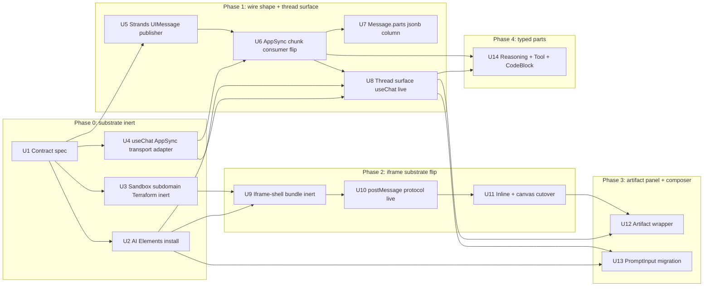

# feat: Computer LLM-UI adopts Vercel AI SDK end-to-end

## Summary

Replace the Computer client's raw-text streaming and same-origin applet runtime with a unified Vercel AI SDK stack — AI Elements components for visual vocabulary, `useChat` for chat-state lifecycle, and `UIMessage` shape end-to-end (Strands → AppSync → client). Reframe plan-001's substrate (sucrase + acorn import-shim, `@thinkwork/computer-stdlib`, applet GraphQL surface, Strands `save_app/load_app/list_apps` tools — code is in the working tree as of 2026-05-09; the plan-001 markdown file is still untracked draft) so that LLM-authored React fragments execute inside cross-origin iframes hosted at `sandbox.thinkwork.ai` rather than same-origin blob URLs. Plan-008 (chart-spec/map-spec markdown dialect) is documentary-superseded — it never committed code, so retirement is bookkeeping. The plan ships in five phases (Phase 0 substrate-inert → Phase 1 wire-shape + thread surface → Phase 2 iframe substrate flip → Phase 3 artifact + composer → Phase 4 typed parts) across 14 implementation units, sequenced with the inert-first seam-swap pattern so each PR is independently mergeable and the live cutover is one swap per surface.

---

## Goals / Operating Principles

This plan is implemented end-to-end. It is not a proof-of-concept and does not stop at a tiny vertical slice — only a real correctness, security, tenant-isolation, data-loss, deployability, or architecture-contract problem justifies replanning mid-flight.

**Priority order (when forced to choose):**

1. **Richer LLM UI in Computer.** AI Elements primitives, `useChat`, `UIMessage` parts, fragment substrate — the user-visible surface is the top reason this plan exists.
2. **Enterprise security and trust.** Cross-origin iframe isolation, CSP defense-in-depth, tenant scoping on `messages.parts`, source/channelId/nonce postMessage validation. Top of mind because the audience includes enterprise/security reviewers.

Both matter; ranking only resolves direct conflicts. A correctness or tenant-isolation problem is never "just a security nit" — it is a blocker.

**Audiences this plan optimizes for:**

- Internal Eric / operator usage (Computer is dogfooded daily).
- Early customers using Computer.
- Enterprise / security reviewers evaluating the platform.

**Architecture posture: prefer the right architecture, not the cheapest one.**

The sandbox subdomain + cross-origin iframe + CSP defense-in-depth path costs more Terraform / CloudFront / response-header work than a same-origin shortcut would. Take the cost. The static-site Terraform module is extended (not duplicated) to support a sandbox instance with response-header and CSP injection, but the sandbox instance itself is dedicated infrastructure (its own bucket, distribution, certificate). Do not regress to `srcdoc` + same-origin shortcuts to avoid Terraform churn.

**Reviewer policy for the implementation loop (`/lfg` / `/ce-work`).**

Reviewers (and reviewer subagents) keep implementation moving. They block PRs only on:

- Real correctness bugs (logic errors, broken state machines, race conditions that affect users).
- Security or tenant-isolation regressions.
- Data-loss risk (writes that drop information, migrations that strand rows).
- Deployability failure (CI red, deploy gate red, schema drift unaddressed).
- Architecture-contract problems (e.g., reintroducing same-origin agent-code execution, breaking the `UIMessage` shape).

Cosmetic cleanup, non-blocking simplification opportunities, and "could be tighter" reviews are filed as follow-up items in `Operational / Rollout Notes` or as small cleanup PRs — not as merge blockers on this plan's units.

---

## Problem Frame

The Computer client (`apps/computer`) renders thread content as raw text. `apps/computer/src/components/computer/TaskThreadView.tsx` wraps assistant message bodies in `<Streamdown>` and emits user messages as plain `<div>`. Streaming chunks travel through `apps/computer/src/components/computer/StreamingMessageBuffer.tsx` as a `chunks.map(c => c.text).join("")` concatenation — there is no part-type discriminator on the wire, no markdown for user messages, no thinking blocks, no tool-call UI, no inline fragments. Adding any new agent capability requires a custom client-side handler and yet another bespoke render path.

Several efforts have each addressed a slice of the gap and are now converging:

- Plan-001 (`docs/plans/2026-05-09-001-feat-computer-applets-reframe-plan.md`) shipped a same-origin TSX applet runtime in `apps/computer/src/applets/` plus `@thinkwork/computer-stdlib`, GraphQL applet resolvers, and Strands `save_app`/`load_app`/`list_apps` tools. It explicitly accepted same-origin trust under prompt injection in v1, citing iframe isolation as the documented path "if real-world incidents prove these controls insufficient" (`docs/plans/2026-05-09-001-feat-computer-applets-reframe-plan.md` line 142, 154).
- Plan-008 (the would-be `docs/plans/2026-05-09-008-feat-computer-thread-inline-visualizations-plan.md`) chose `react-markdown` + fenced `chart-spec`/`map-spec` blocks for inline visualizations. Confirmed: zero references to either dialect anywhere in the codebase — the plan never landed. Supersession is documentary.
- The recent landing of `streamdown ^2.5.0` as a direct dep (raising the Node floor to 22, recorded in CLAUDE.md) signals that AI SDK pieces are already creeping in transitively.

Without an explicit adoption decision, the codebase will accumulate inconsistent partial uses of AI SDK primitives instead of converging on a coherent stack. The brainstorm's commitment is decisive: the full AI SDK ecosystem (components + `useChat` + `UIMessage`) is the substrate, the existing applet runtime moves into iframe-isolated execution at `sandbox.thinkwork.ai`, and plan-001's runtime engine becomes one of two mount paths (inline + canvas) inside that single iframe substrate.

This plan is the HOW: which units land, in what order, against which surfaces. It carries forward plan-001's already-shipped substrate as a foundation but reverses plan-001's same-origin trust decision — the iframe flip is now the load-bearing security boundary, not a deferred v2 escape.

---

## Requirements

All R1–R17 carry forward from origin (`docs/brainstorms/2026-05-09-computer-ai-elements-adoption-requirements.md`). Acceptance examples AE1–AE5 are mirrored as test scenarios in the relevant units below, with one correction (see Key Technical Decisions: AE4 dead clause).

**Component vocabulary**
- R1. Adopt Vercel AI Elements as the consistent component vocabulary across the LLM UI in `apps/computer`. Components are installed via the shadcn-style copy-paste flow (`npx ai-elements add <component>`) into the app's source tree, not as a runtime dependency.
- R2. Component coverage at v1 includes at minimum: `<Conversation>`, `<Message>`, `<Response>`, `<Reasoning>`, `<Tool>`, `<CodeBlock>`, `<Artifact>`, `<WebPreview>`, `<Sandbox>`, `<PromptInput>`. Additional AI Elements components are added as `UIMessage` parts light them up. **`<JSXPreview>` is explicitly deferred to follow-up work, not v1 coverage** — it would imply same-origin untrusted-JSX rendering and contradict the iframe-substrate architecture; `react-jsx-parser` (its transitive dep) stays out of `apps/computer`'s direct deps.
- R3. The thread surface (`TaskThreadView`, `StreamingMessageBuffer`) renders messages via AI Elements primitives. No raw-text rendering remains in the LLM-UI surfaces.
- R4. The artifact surface (`AppArtifactSplitShell`, `GeneratedArtifactCard`, `InlineAppletEmbed`) is wrapped in `<Artifact>` and renders content via the iframe runtime substrate (R11) inside `<Artifact>`/`<WebPreview>` chrome where appropriate. Brainstorm origin's reference to "eight bespoke dashboard-artifact components" is stale — plan-001 U12 deleted that directory; the live applet path is `GeneratedArtifactCard` → `InlineAppletEmbed` → `AppletMount`.
- R5. The composer migrates to `<PromptInput>` (with `<Suggestions>` and `<Actions>` where useful). Both the empty-thread `ComputerComposer` AND the in-thread `FollowUpComposer` migrate; a single hook backs both instances.
- R6. Agent-authored UI (full-canvas artifacts and inline fragments) is constrained to the AI Elements + shadcn primitive vocabulary. The model is instructed and prompted to emit only that vocabulary; the runtime additionally enforces it via the import surface (R13).

**Chat-state and wire format**
- R7. The thread surface uses the AI SDK `useChat` hook for chat-state lifecycle: streaming status, error / retry handling, branch and regenerate, tool-call streaming.
- R8. A custom `useChat` transport adapter bridges the existing AppSync subscription chunk stream to the AI SDK message protocol. The AppSync streaming wire is preserved; HTTP SSE replacement is rejected.
- R9. Messages flow through the system in `UIMessage` shape end-to-end. The Strands runtime emits `UIMessage.part` shapes (text / reasoning / tool-${name} / file / source / data-${name}). AppSync `ComputerThreadChunkEvent` carries part-shaped chunks. The client consumes them directly through AI Elements components. **There is no custom `fragment` part type in v1.** LLM-authored React fragments are encoded as a `tool-renderFragment` part (or another contract-defined tool/data part if U1 chooses an alternative discriminator); rendering of that part mounts the iframe substrate (R11). The brainstorm origin's mention of "fragment" is interpreted through the tool/data-part vocabulary, not as a new top-level part discriminator.
- R10. Persisted message storage adopts `UIMessage` shape for new messages. Historical persisted messages keep their legacy text representation and render through a backwards-compatible path; no backfill is required. New `parts jsonb` column on `messages`; precedence rule: `parts` non-null wins over legacy `content text`.

**Fragment substrate**
- R11. Plan-001 (Applets reframe) generalizes from "full-canvas artifact runtime" to a unified LLM-authored React-fragment substrate. Each fragment renders inside its own iframe-isolated execution context — inline fragments inside a `<Response>`-adjacent slot and full-canvas fragments inside `<Artifact>`. Both mount paths share one iframe substrate served from `sandbox.thinkwork.ai`. The AI Elements `<JSXPreview>` component is **not** suitable for untrusted JSX (it renders via `react-jsx-parser` to a same-origin `<div>`); the iframe substrate is what enforces R13, with AI Elements providing the surrounding chrome (`<Artifact>`, `<WebPreview>`, `<Conversation>`).
- R12. Compilation of LLM-authored React fragments happens inside the client (within the iframe runtime), not on the server. The agent may use AgentCore code-interpreter tooling to compute or analyze data feeding a fragment, but the compile step itself runs in the browser and fragments are not pre-bundled before delivery.
- R13. Fragments execute against a constrained surface at two layers: (a) **import-time** — only AI Elements + shadcn primitives + a small whitelisted utility set are resolvable; arbitrary npm imports are rejected at compile time with a clear error the agent can self-correct from; (b) **runtime** — the iframe sandbox + cross-origin host (`sandbox.thinkwork.ai`) + CSP block agent-emitted side-effects (`fetch`, `localStorage`, parent-DOM access) from reaching the host origin. Same-origin execution of agent-authored fragments is rejected for blast-radius reasons.
- R17. Parent app ↔ fragment iframe communication uses an explicit message-passing protocol carrying theme tokens (so shadcn primitives inherit the app's visual style), layout signals (height / focus), and declared event callbacks. Fragments cannot reach the parent through shared globals, the DOM, or untyped channels — the protocol is the only contract.

**Migration and supersession**
- R14. Plan-008 (`docs/plans/2026-05-09-008-feat-computer-thread-inline-visualizations-plan.md`) and its requirements doc (`docs/brainstorms/2026-05-09-computer-thread-inline-visualizations-requirements.md`) are documentary-superseded — those files were never committed, so retirement is bookkeeping (note in `docs/brainstorms/2026-05-09-computer-thread-inline-visualizations-requirements.md` if the file later surfaces; otherwise no action). The fenced `chart-spec` / `map-spec` markdown dialect is dropped from any prompt scaffolding. Inline charts and maps are produced as agent-authored React fragments instead.
- R15. Plan-001 (Applets reframe) is **not edited in place** — it has fully shipped through U14 (smoke gate). This plan supersedes its same-origin trust decision and reframes the substrate; plan-001 stays as the historical record of the substrate that landed.
- R16. The full sweep is sequenced surface-first per Approach A in this order: **Phase 0** install AI Elements + theme tokens + transport-adapter scaffold + sandbox subdomain Terraform inert; **Phase 1** Strands `UIMessage` part emission + thread surface adopts `useChat` and `<Conversation>`/`<Message>`/`<Response>`; **Phase 2** fragment substrate iframe flip (plan-001 substrate moves to `sandbox.thinkwork.ai`); **Phase 3** artifact panel + composer migrate; **Phase 4** typed parts (`<Reasoning>`, `<Tool>`, `<CodeBlock>`, etc.) light up as Strands emits them.

---

## Scope Boundaries

All origin Scope Boundaries carry forward:

- Mobile (`apps/mobile`) — React Native + NativeWind, separate evolution track. AI Elements is web-only.
- Admin SPA (`apps/admin`) — operator surface, not LLM-facing chat.
- Replacing AppSync with HTTP SSE for chat streaming. AppSync stays; the transport adapter handles the impedance mismatch.
- Server-side React compilation or pre-bundled fragment delivery. Compilation is client-side only for v1 (now executes inside the iframe scope at `sandbox.thinkwork.ai`).
- Adopting AI SDK's full server runtime (`createDataStreamResponse`, the `ai` package's server helpers). Only the components, the `useChat` hook, and the `UIMessage` shape are adopted.
- Visual theme overhaul beyond what shadcn defaults give for free.
- Backfilling historical persisted threads to `UIMessage` shape — old threads keep the legacy text-rendering path indefinitely.
- Plan-009 onwards (skills/workflows/customize-workspace plans listed in the unstaged docs/plans/) — those are separate workstreams with their own brainstorms.
- Same-origin execution of LLM-authored fragments — rejected for security reasons. All fragments run in cross-origin iframe-isolated sandboxes regardless of size or surface (inline vs canvas).

This plan adds these plan-local exclusions:

- The iframe substrate at `sandbox.thinkwork.ai` ships as a single static iframe-shell HTML + bundle (sucrase worker + host registry + import shim moved into iframe scope). It is **not** a Lambda, **not** a separate React app — the iframe receives source via `postMessage`, compiles it inside its own scope, and renders. No server-side rendering.
- The legacy `seq < highest - 2` chunk-window heuristic in `apps/computer/src/lib/use-computer-thread-chunks.ts` is replaced wholesale with per-part-id append cursors. No partial migration window.
- AI Elements components are installed once per app (`apps/computer/components.json` configured) and committed to source. The shadcn registry is not a runtime dep and is not re-fetched on rebuild.
- Fragment iframe pooling/virtualization is deferred. Per-fragment iframe is the v1 default given expected density (1–3 inline + occasional canvas per assistant message).
- Python AI SDK adapter (the unofficial `ai-sdk-python` package) is rejected. The Strands emitter hand-rolls the documented wire-format chunk types directly; no third-party Python dependency.

### Deferred to Follow-Up Work

- Iframe lifecycle pooling/virtualization (only worth the complexity if fragment density exceeds the 1–3 inline budget under real load).
- Server-side replay buffer for `reconnectToStream` (`useChat` resume on reload). v1 returns `null` from `reconnectToStream` and accepts that page reloads lose in-flight assistant turns. A persistent partial-write Strands path is a future consideration.
- Deep adoption of AI Elements' `<Sandbox>` for E2B / AgentCore code-interpreter integration — current AgentCore tooling already provides this surface; `<Sandbox>` adoption follows once a code-interpreter `tool-` part lands in `UIMessage`.
- Branching UI (`<MessageBranch>`) — `useChat` exposes branch state; the visual surface is a v2 concern once parts vocabulary is stable.

---

## Context & Research

### Relevant Code and Patterns

**Streaming + rendering today (replacement target)**

- `apps/computer/src/components/computer/TaskThreadView.tsx` — 1120 lines, central thread surface. Owns the `<Streamdown>` mount, the `ResizeObserver`-driven autoscroll, `ProcessingShimmer`, `actionRowsForMessage` proto `<Tool>` derivation, and the `FollowUpComposer` in-thread composer. AI Elements adoption replaces autoscroll with `<Conversation>`, the Streamdown wrapper with `<Message>` + `<Response>`, the action-rows derivation with `<Tool>` keyed off `tool-${name}` parts.
- `apps/computer/src/components/computer/StreamingMessageBuffer.tsx` — 26 lines. Naive `chunks.map(c => c.text).join("")` concat. Legacy fallback kept for messages with no `parts` array.
- `apps/computer/src/components/computer/ComputerComposer.tsx` — 98 lines, empty-thread composer. Direct migration to `<PromptInput>`.
- `apps/computer/src/components/computer/ComputerThreadDetailRoute.tsx` — 404 lines, route entry. Owns 3 urql subscriptions, the message-list query, `useComputerThreadChunks`, optimistic-message UI state. **The custom-`useChat` transport adapter slots in here**, replacing the manual subscription wiring at lines 117–184.
- `apps/computer/src/lib/use-computer-thread-chunks.ts` — 89 lines, hand-rolled chunk merge. Drops `seq < highest - 2`. Switches to per-part-id append cursor in U6.
- `apps/computer/src/lib/graphql-client.ts` — `AppSyncSubscriptionClient` at lines 150–200; the subscription transport the `useChat` adapter wraps.
- `packages/database-pg/graphql/types/subscriptions.graphql:64–69` — `ComputerThreadChunkEvent { threadId, chunk: AWSJSON, seq, publishedAt }`. Chunk envelope is already opaque `AWSJSON` — wire-shape change is producer/consumer only, no schema change.
- `packages/agentcore-strands/agent-container/container-sources/appsync_publisher.py` — 410 lines. `AppSyncChunkPublisher.publish(text)` JSON-encodes `{"text": text}` into the `chunk: AWSJSON!` mutation. `extract_stream_text_deltas`, `extract_tool_use_starts`, `_normalize_chunk_locked` walk Bedrock `contentBlockDelta` / `contentBlockStart` / Strands `current_tool_use` / `reasoningContent` shapes — type info exists upstream, gets flattened to text. The U5 emitter stops flattening.
- `packages/database-pg/src/schema/messages.ts:25–56` — `messages` table. `content text` (legacy), plus `tool_calls jsonb`, `tool_results jsonb`, `metadata jsonb`. New `parts jsonb` column added in U7 via hand-rolled SQL.

**Existing applet substrate (iframe-flip target)**

- `apps/computer/src/applets/mount.tsx` — 203 lines. `AppletMount` orchestrates `loadAppletHostExternals` → `transformApplet` → `loadModule(compiledModuleUrl)` → render `module.default` via `import(/* @vite-ignore */ moduleUrl)` against a same-origin blob URL (line 28–29). **Iframe injection seam is `loadModule`** — Phase 2 swaps it for an iframe-postMessage loader.
- `apps/computer/src/applets/transform/transform.ts` — sucrase compiler (`jsxRuntime: "automatic"`, `keepUnusedImports`, `preserveDynamicImport`). Worker variant at `sucrase-worker.ts`. LRU cache (50 entries). **All three move into the iframe scope at `sandbox.thinkwork.ai` in U9**.
- `apps/computer/src/applets/transform/import-shim.ts` — 196 lines. Acorn-based AST walk. `ALLOWED_APPLET_IMPORTS` whitelist at line 6–13: `@thinkwork/ui`, `@thinkwork/computer-stdlib`, `react`, `react/jsx-runtime`, `react/jsx-dev-runtime`, `useAppletAPI`. Extended in U2 to add AI Elements primitive paths.
- `apps/computer/src/applets/host-registry.ts` — 143 lines. Single-owner symbol guard on `globalThis.__THINKWORK_APPLET_HOST__`. Registers React, ReactDOM, jsx-runtime, jsx-dev-runtime, `@thinkwork/ui`, `@thinkwork/computer-stdlib`, recharts, lucide-react, leaflet, react-leaflet. **Moves into iframe scope in U9**; parent stops registering.
- `apps/computer/src/applets/host-applet-api.ts` — 196 lines. `createHostAppletAPI` returns `{useAppletState, useAppletQuery, useAppletMutation, refresh}`. State persisted via `appletState` GraphQL with 1s debounce. **In Phase 2, this surface is re-exposed across the iframe boundary via the U10 postMessage protocol** — fragments call `useAppletAPI(...)` inside the iframe; the parent proxies GraphQL operations.
- `packages/computer-stdlib/` — already-shipped workspace package, exports 12 primitives + `useAppletAPI` hook + currency/date formatters. Source-as-published (no build). U2 adds AI Elements re-exports (or sibling installs into `apps/computer/src/components/ai-elements/`).
- `packages/api/src/lib/applets/` and `packages/api/src/graphql/resolvers/applets/` — live applet GraphQL surface. Untouched by this plan.
- `packages/agentcore-strands/agent-container/container-sources/applet_tool.py` — 464 lines. `make_save_app_fn` / `make_load_app_fn` / `make_list_apps_fn` factory closures. Untouched by this plan.

**App-wide stack signals (verified)**

- `apps/computer` — Vite 6 + React 19 + TanStack Router + urql 5 + TypeScript 5.7. Tailwind v4 via `@tailwindcss/vite`. Node engine `>=22`. Confirms AI Elements compatibility (React 19 + Tailwind v4 + Node ≥18 ✓).
- `packages/ui` — Tailwind v4, exports 44 shadcn primitives. **Missing for AI Elements**: `accordion`, `hover-card`, `resizable`. These will be added during U2 install via `pnpm shadcn add` into `@thinkwork/ui`.
- `streamdown ^2.5.0` — direct dep of `apps/computer` only. Consumed by `StreamingMessageBuffer.tsx:1,19` and `TaskThreadView.tsx:23,489`. Continues as `<Response>`'s underlying engine; no removal.
- No `ai`, `@ai-sdk/*`, `@ai-elements/*`, or AI Elements components anywhere — clean greenfield adoption.
- `apps/computer` has **no codegen script**. Manual `gql` strings in `apps/computer/src/lib/graphql-queries.ts`. Schema changes propagate via codegen to `apps/{cli,admin,mobile}` + `packages/api`; `apps/computer` requires a manual `graphql-queries.ts` edit.
- `apps/computer/index.html` has **no Content-Security-Policy meta tag**. CSP headers are not currently set anywhere — U1 specifies the CSP profile and U10 wires it via Vite/CloudFront response headers.

### Institutional Learnings

- `docs/solutions/architecture-patterns/inert-first-seam-swap-multi-pr-pattern-2026-05-08.md` — the spine of this plan's sequencing. Substrate-first; stubs **throw, never silently no-op**; body-swap forcing-function tests live in PR-1 to fail loudly when the live PR replaces the body. Applies to U3 (subdomain Terraform inert), U4 (transport adapter scaffold), U5 (Strands emitter), U9 (iframe-shell bundle inert).
- `docs/solutions/architecture-patterns/inert-to-live-seam-swap-pattern-2026-04-25.md` — Python factory-closure variant. Applies to U5 (`make_uimessage_publisher_fn(seam_fn=None)`).
- `docs/solutions/workflow-issues/agentcore-completion-callback-env-shadowing-2026-04-25.md` + auto-memory `feedback_completion_callback_snapshot_pattern` — env snapshot at factory entry; never re-read `os.environ` mid-turn. Applies to U5 (UIMessage publisher factory snapshots `THINKWORK_API_URL`, `API_AUTH_SECRET`, `TENANT_ID`, `THREAD_ID`).
- Auto-memory `feedback_hindsight_async_tools` — async Strands tools follow `async def` + fresh `httpx.AsyncClient` + 30s timeout + 2 retries + `aclose` in `finally`. Applies to U5 if the publisher needs out-of-band HTTP (not the AppSync mutation path, which already uses `httpx`).
- `docs/solutions/runtime-errors/lambda-web-adapter-in-flight-promise-lifecycle-2026-05-06.md` + auto-memory `feedback_avoid_fire_and_forget_lambda_invokes` — `await` Lambda invokes; never `InvocationType: "Event"` for user-driven actions. Applies to U7 (persisted message write must be awaited).
- Auto-memory `feedback_smoke_pin_dispatch_status_in_response` — surface `ok/persisted/validated` for smoke pinning. Applies to U5 (publisher returns dispatch status) and U8 (`useChat` adapter exposes `transportStatus` for smoke).
- `docs/solutions/workflow-issues/manually-applied-drizzle-migrations-drift-from-dev-2026-04-21.md` + auto-memory `feedback_handrolled_migrations_apply_to_dev` — hand-rolled `drizzle/*.sql` files with `-- creates:` markers must be applied via `psql -f` to dev after merge or the next deploy fails the drift gate. Applies to U7 (new `parts jsonb` column).
- `docs/solutions/best-practices/invoke-code-interpreter-stream-mcp-shape-2026-04-24.md` + auto-memory `feedback_verify_wire_format_empirically` — curl the live endpoint before bulk client refactors. Applies to U6 (verify AppSync chunk envelope before swapping consumer).
- Auto-memory `feedback_decisive_over_hybrid` — load-bearing for this plan. The brainstorm picks "all-in on AI SDK ecosystem" over "components-only / wrap our own hook". This plan does not regress to "AI Elements components but custom state hook" or "useChat-shaped but custom UIMessage." One package, full adoption, bridge via the custom transport adapter.
- Auto-memory `feedback_oauth_tenant_resolver` — use `resolveCallerTenantId(ctx)` for Google-federated users in any new GraphQL resolvers (U7 `Message.parts` field).
- Auto-memory `feedback_ship_inert_pattern` — multi-PR plans land new modules with tests but no live wiring; integration waits for the plan's own dependency gate.
- Plan-001 line 142, 154: "Same-origin trust under prompt-injection: explicitly accepted in v1... The migration to Approach A (sandboxed iframe) remains the documented path if real-world incidents prove these controls insufficient. Out of v1 scope per origin." This plan invokes that escape.
- Auto-memory `feedback_pnpm_in_workspace` — pnpm only; `npx` is fine for one-off CLI tools (e.g., `npx ai-elements add`).
- Auto-memory `feedback_pr_target_main` — PRs target `main`, never another PR's branch.
- Auto-memory `feedback_worktree_isolation` and `feedback_cleanup_worktrees_when_done` — use `.claude/worktrees/<name>` for parallel work; clean up on merge.

### External References

- [AI SDK Transport docs](https://ai-sdk.dev/docs/ai-sdk-ui/transport) — `ChatTransport<UIMessage>` interface with `sendMessages` + `reconnectToStream` returning `Promise<ReadableStream<UIMessageChunk>>`. Protocol-agnostic; AppSync subscription bridge is a clean fit.
- [ChatTransport source](https://github.com/vercel/ai/blob/main/packages/ai/src/ui/chat-transport.ts) — verbatim TypeScript signature.
- [Ably custom WebSocket transport guide](https://ably.com/topic/ai-stack/vercel-ai-sdk-chattransport-implementing-a-custom-websocket-transport) — published working pattern for non-HTTP transports.
- [AI Elements docs](https://elements.ai-sdk.dev/) — component manifest. Confirmed: `<JSXPreview>` is **not** iframe-isolated (renders to `<div>` via `react-jsx-parser`). `<WebPreview>` is iframe-based. `<Sandbox>` is a UI shell only.
- [vercel/ai-elements repo](https://github.com/vercel/ai-elements) — install via `npx ai-elements add <component>` or shadcn registry. Tailwind v4 + React 19 supported.
- [UI Message Stream Protocol](https://ai-sdk.dev/docs/ai-sdk-ui/stream-protocol) — wire-format chunk types. Used as the source vocabulary for the Python emitter (U5) and the AppSync transport adapter (U4).
- [UIMessage reference](https://ai-sdk.dev/docs/reference/ai-sdk-core/ui-message) — `UIMessagePart` discriminators: `text | reasoning | tool-${NAME} | source-url | source-document | file | data-${NAME} | step-start`.
- [Claude artifacts iframe-sandbox writeup](https://www.shareduo.com/blog/claude-artifacts) — industry pattern: separate-origin (`claudeusercontent.com`) + `<iframe sandbox="allow-scripts">` (no `allow-same-origin`). Direct precedent for `sandbox.thinkwork.ai`.
- [Claude Artifact postMessage origin bug](https://github.com/anthropics/claude-code/issues/42064) — failure mode of `postMessage` origin checks against the wrong target. Informs U10 protocol design.
- [MDN sandbox attribute reference](https://developer.mozilla.org/en-US/docs/Web/HTML/Element/iframe#sandbox).
- [Streamdown repo](https://github.com/vercel/streamdown) — already a direct dep; `<Response>` and `<Reasoning>` delegate Markdown rendering to it.

---

## Key Technical Decisions

- **Iframe hosting: dedicated subdomain `sandbox.thinkwork.ai`, served by extending the existing `terraform/modules/app/static-site` module** (user decision 2026-05-09). True cross-origin barrier matches the Anthropic Claude Artifacts pattern; defense-in-depth for SOC2 Type 2 motion (per `project_soc2_type2_ai_strategic_horizon`). Implementation: `terraform/modules/app/static-site/main.tf` gains an optional `response_headers_policy_id` input (and supporting variables for the static CSP / response headers), and a dedicated `module "computer_sandbox_site"` instance is added in `terraform/modules/thinkwork/main.tf` next to `module "computer_site"`, configured for the `sandbox.thinkwork.ai` domain with its own ACM cert and CloudFront distribution backed by a separate S3 bucket. Sandbox infrastructure is dedicated (its own bucket / distribution / cert) — sharing an origin with `computer_site` is explicitly rejected for blast-radius reasons. The `srcdoc` + same-origin-sandbox alternative is rejected. The introduction of a brand-new `sandbox-iframe-host` module is rejected — extension of `static-site` is preferred to keep the operator surface small.
- **Sandbox bundle deploy path**: `scripts/build-computer.sh` extends to also build the iframe-shell entry (`pnpm --filter @thinkwork/computer build:iframe-shell`) and `aws s3 sync` the iframe-shell artifacts to the dedicated sandbox bucket created by `module "computer_sandbox_site"`. The script reads bucket and distribution IDs from terraform outputs (or environment, per existing convention). CloudFront invalidation for the sandbox distribution runs after sync; bundle hashes in filenames keep most invalidations no-ops.
- **Parent ↔ iframe message protocol: source-identity + per-iframe channel nonce + iframe-side build-time origin allowlist. Origin equality on the parent side is NOT the trust mechanism, and `targetOrigin` cannot be the delivery filter for outbound parent → iframe messages either.** Because the iframe is loaded with `sandbox="allow-scripts"` (no `allow-same-origin`), the iframe document's effective origin is opaque (serialized as `"null"`). Two browser-API consequences fall out of this and dictate the protocol design:
  1. **Inbound to parent:** `event.origin` on a message *from* the iframe is the string `"null"`, so origin-equality checks on the parent side cannot validate the sender. Trust on inbound parent messages comes from `event.source === iframeWindow` (the specific `HTMLIFrameElement.contentWindow` the parent itself created) AND `envelope.channelId === expectedChannelId` (a nonce minted at parent-side iframe construction, sent down via `init`, and required on every subsequent envelope).
  2. **Outbound from parent (this is the correction reviewers blocked on):** the parent CANNOT use `targetOrigin: "https://sandbox.thinkwork.ai"` for `postMessage` to the sandboxed iframe. The browser checks `targetOrigin` against the iframe document's *effective* origin, which under `sandbox="allow-scripts"` (no `allow-same-origin`) is opaque/`"null"` — the message would be silently dropped. The parent therefore sends with `targetOrigin: "*"`. The architecture compensates as follows, and must NEVER be regressed back to "Never `targetOrigin: '*'`":
     - **Pinned iframe `src`**: the parent constructs the iframe with `src = "https://sandbox.thinkwork.ai/iframe-shell.html"` (build-time-injected `__SANDBOX_IFRAME_SRC__`) and never reassigns it during lifetime. The browser guarantees the iframe's loaded document is whatever that `src` points to (modulo a successful HTTPS load with the matching CSP); we control that origin's S3 bucket and distribution end-to-end. There is no scenario in which a hostile document inhabits the iframe we created without first compromising our own sandbox subdomain.
     - **Iframe-side build-time parent-origin allowlist**: the iframe verifies `event.origin` on every inbound parent message against a Vite `define`-injected allowlist of trusted parent origins (e.g. `https://thinkwork.ai`, dev/staging equivalents). Anything else is dropped silently and logged. This is the iframe-side answer to "is this message from a parent we trust?"
     - **No secrets in postMessage payloads**: the parent never includes API tokens, session credentials, Cognito JWTs, tenant IDs, or other secrets in any envelope sent into the iframe. The iframe runs untrusted LLM-authored code and has no need for raw credentials. State proxy operations (`state-read` / `state-write`) round-trip through the parent, which holds the credentials and runs the GraphQL mutation on the iframe's behalf — the iframe only sees the operation result. `targetOrigin: "*"` is therefore safe by construction: there is nothing in the payload that a hypothetically-hijacked iframe document could exfiltrate.
     - **Channel nonce on every envelope**: outbound envelopes carry `channelId` so a confused-deputy iframe (e.g., one that legitimately exists for a different fragment in the same parent) cannot consume messages addressed to a different controller.
  3. **Inbound to iframe (parent → iframe direction the iframe receives):** iframe verifies `event.origin` against the build-time-injected allowlist of trusted parent origins. The allowlist is baked into the iframe-shell bundle at build time (Vite `define` substitution); not runtime-discoverable.
  4. Envelope shape: `{ v: 1, kind: 'init' | 'theme' | 'resize' | 'callback' | 'state-read' | 'state-write' | 'state-write-ack' | 'state-read-ack' | 'error' | 'ready' | 'ready-with-component', payload, msgId, replyTo?, channelId }`. `MessageChannel`-port alternative is rejected — channels add complexity without ergonomic gain at this scale.

  **Implementation-agent guardrail:** any reviewer or follow-up who suggests "parent should pin `targetOrigin` to the sandbox URL" or "never use `targetOrigin: '*'`" is reasoning from a non-sandboxed mental model. The architecture is `sandbox="allow-scripts"` without `allow-same-origin`, which forces opaque iframe origin, which forces `targetOrigin: "*"`. The trust mechanism is the four bullets above (pinned src + allowlist + no-secrets + channelId), not `targetOrigin` enforcement.
- **Iframe lifecycle: per-fragment iframe; no pooling in v1**. Expected density (1–3 inline + occasional canvas per assistant message) does not justify the lifecycle complexity of an iframe pool. Pool/virtualization deferred to follow-up if perf bites under real load. `iframe.remove()` + `URL.revokeObjectURL()` cleanup pattern mirrors the existing `mount.tsx:107–110` `cancelled` flag.
- **AppletMount becomes an iframe renderer/controller, not a `loadModule` swap.** Plan-001's `loadModule(source, version) → Promise<ComponentType>` interface is structurally incompatible with iframe substrate — the rendered component lives inside the iframe, not in the parent's React tree. U10 replaces `AppletMount` so that it renders an `<iframe>` element directly and exposes a controller object (`{element, ready, dispose, sendCallback, applyTheme}`) rather than yielding a React component. The legacy same-origin `defaultAppletModuleLoader` (returning `ComponentType`) stays behind a temporary rollback/test-only flag (`VITE_APPLET_LEGACY_LOADER`, parent-only Vite build-time env, off by default) until Phase 2 stabilizes for at least 1 week, after which a follow-up cleanup PR deletes it. Inline + canvas mount paths consume the new iframe controller.
- **`useChat` is the single source of submit/regenerate; ChatTransport owns the backend turn-start call.** `ChatTransport.sendMessages({trigger, chatId, messages, abortSignal})` is responsible for:
  1. Invoking the existing GraphQL turn-start mutation (`startComputerThreadTurn` or equivalent — locked in U1's contract) **exactly once per submit/regenerate**.
  2. Establishing or reusing the AppSync subscription on `onComputerThreadChunk(threadId)`.
  3. Parsing chunk envelopes into `UIMessageChunk`, enqueueing into a `ReadableStream`.
  4. Tearing down on `abortSignal`.
  Composers (both `<PromptInput>` instances in U13) call ONLY `useChat().sendMessage({text, files})`. They do NOT also call the legacy mutation in parallel — double-submit is explicitly rejected. The mutation invocation moves entirely into the transport adapter's `sendMessages` body.
- **Persisted message schema: new `parts jsonb` column on `messages` table** (hand-rolled migration, `-- creates-column: public.messages.parts` marker). Precedence rule: `parts IS NOT NULL` wins over legacy `content text` at render time. JSON-column-on-existing-table is the production consensus per Vercel docs and the [10M-message v5 migration writeup](https://blog.web3nomad.com/p/how-we-migrated-atypicaai-to-ai-sdk-v5-without-breaking-10m-chat-histories). Decomposed `message_parts` table is rejected — heterogeneous part discriminators (especially `tool-${name}`) make typed-table queries fragile.
- **`useChat` transport contract: `ChatTransport<UIMessage>` with `sendMessages` + `reconnectToStream`**. Both return `Promise<ReadableStream<UIMessageChunk>>`. `reconnectToStream` returns `null` in v1 (page reload during a streaming turn loses the in-flight `useChat` stream; the persisted message-list query still hydrates the final assistant message once `finish` lands and the writer has committed `parts` — see U7). **No HTTP coupling** — the AppSync transport bypasses `DefaultChatTransport` entirely.
- **Strands `UIMessage` emitter: hand-rolled Python module against the documented wire format**. No third-party SDK. Chunk shapes match the [UI Message Stream Protocol](https://ai-sdk.dev/docs/ai-sdk-ui/stream-protocol) verbatim: `{type: "text-start", id: "..."}`, `{type: "text-delta", id: "...", delta: "..."}`, `{type: "tool-input-available", toolCallId: "...", toolName: "...", input: {...}}`, etc. `text-start` IDs are stable per part across deltas (failure mode: minting a new ID per delta renders as N separate text bubbles). Tool input is emitted as terminal `tool-input-available` only — `tool-input-delta` deltas are skipped in v1.
- **Typed emission gating is per-Computer-thread, not a runtime-wide env flag.** A naive `UI_MESSAGE_EMIT_ENABLED` env var on the AgentCore runtime would flip emission for every agent in the runtime — including non-Computer agents (Flue, sub-agents, etc.) that have no `useChat` consumer. Instead, U5/U6 gate typed emission on the *agent invocation context*: the Computer thread handler passes a `ui_message_emit=True` capability flag through to the publisher factory; non-Computer callbacks default to `False` and continue emitting the legacy `{text}` shape. The flag is wired through the existing AgentCore handler entrypoint, not as a global container env. (If a runtime-wide allow toggle is still desirable for staged rollout, it's an AND-gate on top of the per-thread capability — never a replacement.)
- **Out-of-order chunk handling: drop the `seq < highest - 2` window heuristic; switch to per-part-id append cursors**. Each `UIMessage.part` carries a stable `id`; the consumer maintains a per-id cursor and appends in arrival order. `seq` becomes a transport-only retry hint, not a render gate. Heterogeneous part streams (text → tool → reasoning → text → tool-renderFragment) cannot tolerate the legacy heuristic — a late tool-result chunk would silently disappear.
- **AE4 dead clause replaced**: brainstorm AE4 references searching for `react-markdown`. Confirmed: zero `react-markdown` source matches in `apps/computer`. The AE check passes vacuously. Replace with `Streamdown` — the actual incumbent in `StreamingMessageBuffer.tsx:1` and `TaskThreadView.tsx:23,489`. The acceptance criterion becomes "after the sweep, no LLM-UI rendering surface uses raw `<Streamdown>` directly outside of `<Response>`'s internal use."
- **AE check tightening**: AE4 also checks for raw `<span>{text}</span>` patterns. Confirmed `apps/computer` uses these in non-LLM-UI surfaces (sidebar labels, button text). Constrain the AE search to LLM-UI directories: `apps/computer/src/components/computer/` + `apps/computer/src/components/apps/` only.
- **AI Elements installation: shadcn-style copy-paste into `apps/computer/src/components/ai-elements/`, exposed via the existing `@/` alias.** `apps/computer/components.json` is configured to point AI Elements at this path; the iframe-shell bundle (U9) imports the same files via the relative or `@/` alias when bundled. **No new `@thinkwork/ai-elements` workspace package is created in v1.** Adoption that pattern would require its own implementation unit (codegen, source-as-published convention, build wiring) and is not in scope here. `@thinkwork/ui` continues to provide the underlying shadcn primitives. After install, AI Elements imports of `Button`/`Tooltip`/etc. are aliased to `@thinkwork/ui` to avoid shadcn duplicates (one-time per-component edit, committed). The iframe-shell's import-shim allowlists the alias path — fragments import `<CodeBlock>` etc. via the same path the parent uses. Smoke-add `<Message>` first to inspect the install diff before bulk-adding. **`<JSXPreview>` is deferred from v1 minimum coverage** — it renders untrusted JSX same-origin and would mislead readers about the architecture; if a trusted-JSX use case appears later it gets its own follow-up unit. `react-jsx-parser` therefore stays out of `apps/computer`'s direct deps.
- **Composer migration: two `<PromptInput>` instances sharing one hook**. `ComputerComposer` (empty-thread, `ComputerWorkbench.tsx:84`) and `FollowUpComposer` (in-thread, `TaskThreadView.tsx:227`) have different chrome but the same submit semantics. A new `useComposerState(threadId)` hook backs both, and `submit` calls `useChat().sendMessage` only — no parallel mutation invocation. Suggestions render only on the empty-thread variant; both expose `<Actions>`.
- **`<Reasoning>` defaults to closed with stable reserved layout.** The AI Elements default-open behavior for `<Reasoning>` would push subsequent thread content down on every reasoning chunk, causing layout shift during streaming. Override: pass `defaultOpen={false}` and reserve a fixed-height collapsed strip (showing the streaming indicator + token count) so expansion does not reflow the thread. User can open on click. This matches existing thread ergonomics where reasoning is metadata, not the primary content surface.
- **CSP profile** (set via CloudFront response-headers policy on each static-site distribution, NOT in `index.html` `<meta>`):
  - **Host (`computer_site` distribution serving `apps/computer`):**
    - `script-src 'self'` (parent no longer needs `blob:` after Phase 2 because sucrase moves into the iframe scope)
    - `frame-src https://sandbox.thinkwork.ai` (and dev/staging equivalents)
    - `connect-src 'self' https://*.appsync-api.us-east-1.amazonaws.com wss://*.appsync-realtime-api.us-east-1.amazonaws.com https://cognito-idp.us-east-1.amazonaws.com`
    - `worker-src 'self'` (parent no longer hosts the sucrase Web Worker)
    - `style-src 'self' 'unsafe-inline'` (Tailwind v4)
  - **Iframe (`computer_sandbox_site` distribution serving `sandbox.thinkwork.ai`):**
    - `script-src 'self' blob:` (sucrase blob URLs run inside iframe scope)
    - `worker-src 'self' blob:` (sucrase Web Worker runs inside iframe scope)
    - `style-src 'self' 'unsafe-inline'` (theme-token injection uses inline `<style>`)
    - `connect-src 'none'` — **iframe never makes outbound network calls**. All side-effecting work routes through the parent via the postMessage protocol.
    - `default-src 'none'` baseline; explicitly allow what's needed.
  - Defense-in-depth: even if the host CSP regresses, the iframe's `connect-src 'none'` blocks fetch/exfiltration inside the iframe boundary.
- **Deploy-time CSP smoke is an explicit Playwright/headless-browser dependency.** Real CSP enforcement only fires inside a browser execution context; a curl/header check confirms the *header is present* but not that the browser actually blocks the violating script. The smoke uses Playwright (added to `devDependencies` of `apps/computer` with rationale comment) to load a known-bad fragment in a headless Chromium, listen for `securitypolicyviolation` events from inside the iframe (the iframe-shell installs a violation listener that posts violations back to the parent via the `kind: "error"` envelope), and asserts at least one fires. Layered with `curl -I` header presence checks (cheap, run as part of every smoke pass) and Vitest/JSDOM protocol tests (validate the envelope shape and origin checks without a real browser). **Without browser-level enforcement testing, the cross-origin sandbox boundary is unverified — the user-priority architecture posture mandates real browser verification.**
- **Inert-first sequencing**: U3 (Terraform), U4 (transport adapter), U5 (Strands emitter), U9 (iframe-shell bundle) ship inert with body-swap forcing-function tests, then live-wire in U6/U8/U10/U11. Replace stubs with **throw-don't-no-op** (`throw new Error("INERT_NOT_WIRED")`) so silent no-ops can't mask integration gaps.
- **Smoke pin shape**: U5 publisher returns `{ok, persisted, validated}` (per `feedback_smoke_pin_dispatch_status_in_response`). U8 transport adapter exposes `transportStatus: 'idle' | 'streaming' | 'closed' | 'errored'` for smoke. U10 postMessage iframe handshake exposes a `data-ready` attribute on the iframe element that smoke can pin.
- **Tenant scoping for `Message.parts`.** The new `parts` field on the GraphQL `Message` type carries tool input/output and reasoning content — strictly more sensitive than the legacy `content` text. U7 audits the message-list query/resolver path: every read of `parts` must scope by `resolveCallerTenantId(ctx)` (per `feedback_oauth_tenant_resolver`) and pass the same tenant gate already enforced for legacy fields. If the audit finds the existing `messages` query already scopes correctly by tenant via thread/computer ownership, the new field inherits that gate (verified by a regression test). If the audit finds a pre-existing gap, U7 is the place to close it — `parts` exposure cannot widen the blast radius. Resolvers explicitly never use `ctx.auth.tenantId` directly (null for Google-federated users).
- **Codegen propagation discipline (clarified consumer scope)**: U7 (`Message.parts` GraphQL field) requires `pnpm schema:build` plus `pnpm --filter @thinkwork/{api,admin,cli,mobile} codegen` to keep generated types in sync. **Only `apps/computer` actively requests `parts`** in its message-list query (`apps/computer/src/lib/graphql-queries.ts`, manual edit — no codegen script in computer). `apps/admin`, `apps/mobile`, and `apps/cli` get the field in their generated types but their queries are left untouched in this plan; they continue selecting `content` only and never pay for `parts` unless a future plan opts them in. All four codegen runs land in the same PR per plan-001's precedent.

---

## Output Structure

This plan adds three new top-level surfaces and modifies several existing ones. New file tree under repo root:

```text
apps/computer/
  components.json                              # NEW (U2) — AI Elements + shadcn install config
  src/
    components/
      ai-elements/                             # NEW (U2) — AI Elements components installed via CLI
        conversation.tsx
        message.tsx
        response.tsx
        reasoning.tsx
        tool.tsx
        code-block.tsx
        artifact.tsx
        web-preview.tsx
        prompt-input.tsx
        suggestion.tsx
        actions.tsx
        ...                                    # other components per R2 coverage list
    lib/
      ui-message-types.ts                      # NEW (U1) — TS shapes for UIMessage/UIMessagePart
      use-chat-appsync-transport.ts            # NEW (U4) — ChatTransport implementation
      use-chat-appsync-transport.test.ts       # NEW (U4)
      use-composer-state.ts                    # NEW (U13) — shared hook for both PromptInput mounts
    iframe-shell/                              # NEW (U9) — iframe-side bundle source
      index.html                               # iframe-shell HTML
      main.ts                                  # entry: registers __THINKWORK_APPLET_HOST__, listens for postMessage
      iframe-host-registry.ts                  # MOVED from src/applets/host-registry.ts
      iframe-import-shim.ts                    # MOVED from src/applets/transform/import-shim.ts
      iframe-transform.ts                      # MOVED from src/applets/transform/transform.ts
      iframe-sucrase-worker.ts                 # MOVED from src/applets/transform/sucrase-worker.ts
      iframe-protocol.ts                       # NEW (U10) — message envelope types + handlers
      __tests__/
        iframe-protocol.test.ts
        iframe-host-registry.test.ts
    applets/
      iframe-controller.ts                     # NEW (U10) — IframeAppletController class; renders iframe + manages postMessage protocol; replaces loadModule interface
      iframe-controller.test.ts                # NEW (U10)
      iframe-protocol.ts                       # NEW (U10) — shared protocol envelope + types (parent + iframe-shell both import)
      iframe-protocol.test.ts                  # NEW (U10)
      mount.tsx                                # STRUCTURALLY REWRITTEN (U10) — renders iframe directly via IframeAppletController; new prop surface accepts TSX source + version + theme overrides + state callbacks; legacy ComponentType-yielding loader moved to _testing/legacy-loader.ts behind VITE_APPLET_LEGACY_LOADER rollback flag
      _testing/legacy-loader.ts                # NEW (U10) — gated behind VITE_APPLET_LEGACY_LOADER for emergency rollback; deleted in cleanup follow-up after Phase 2 stability window
      host-applet-api.ts                       # MODIFIED (U10) — production path uses postMessage state proxy; legacy in-process path stays for the rollback flag
    components/
      computer/
        TaskThreadView.tsx                     # HEAVILY MODIFIED — adopts <Conversation>, <Message>, <Response>, useChat, drops Streamdown direct mount, drops actionRowsForMessage in favor of <Tool>, retains FollowUpComposer slot but swaps to <PromptInput>
        StreamingMessageBuffer.tsx             # KEPT — fallback path for legacy messages with no parts array
        ComputerComposer.tsx                   # MODIFIED — swaps Textarea/Button for <PromptInput>
        ComputerThreadDetailRoute.tsx          # MODIFIED (U8) — uses useChat with custom AppSync transport; replaces manual subscription wiring
      apps/
        AppArtifactSplitShell.tsx              # MODIFIED (U12) — wraps canvas in <Artifact>
        InlineAppletEmbed.tsx                  # MODIFIED (U11) — uses iframe loader instead of same-origin import
        AppRefreshControl.tsx                  # MINOR — adapts to iframe message proxy

packages/agentcore-strands/agent-container/container-sources/
  ui_message_publisher.py                      # NEW (U5) — Python emitter producing UIMessageChunk JSON
  ui_message_publisher.test.py                 # NEW (U5)
  appsync_publisher.py                         # MODIFIED (U5) — delegates to ui_message_publisher; legacy {text} path retained behind feature flag
  server.py                                    # MODIFIED (U5) — wires ui_message_publisher into the streaming callback

packages/database-pg/
  drizzle/NNNN_messages_parts_jsonb.sql        # NEW (U7) — hand-rolled migration with -- creates-column: public.messages.parts marker
  src/schema/messages.ts                       # MODIFIED (U7) — adds parts jsonb column
  graphql/types/messages.graphql               # MODIFIED (U7) — adds Message.parts field

packages/api/src/graphql/resolvers/messages/
  message.parts.resolver.ts                    # NEW (U7) — resolves Message.parts from DB row
  message.parts.resolver.test.ts               # NEW (U7)

terraform/modules/app/static-site/
  main.tf                                      # MODIFIED (U3) — adds optional response_headers_policy_id input and supporting CSP/response-header variables; backwards compatible (default = no policy)
  variables.tf                                 # MODIFIED (U3) — new optional inputs
  outputs.tf                                   # unchanged

terraform/modules/thinkwork/
  main.tf                                      # MODIFIED (U3) — adds module "computer_sandbox_site" instance using static-site (separate domain, cert, bucket, distribution); MODIFIED (U10) — wires response_headers_policy_id for both computer_site (host CSP) and computer_sandbox_site (iframe CSP)

scripts/
  build-computer.sh                            # MODIFIED (U9, U10) — also builds iframe-shell bundle and aws s3 syncs to the sandbox bucket; runs CloudFront invalidation for the sandbox distribution
  smoke-csp-violation.mjs                      # NEW (U10) — Playwright-based post-deploy CSP violation smoke (browser-level enforcement test)
  smoke-computer.sh                            # MODIFIED (U10, U11) — extends with iframe handshake + CSP smoke (curl header check + Playwright violation gate)
```

**Removed from earlier drafts of this tree** (do not reintroduce without a new unit):
- `terraform/modules/app/sandbox-iframe-host/` — replaced by extension of `terraform/modules/app/static-site` plus a sandbox-specific instance in `terraform/modules/thinkwork/main.tf`.
- `packages/ai-elements/` or any `@thinkwork/ai-elements` workspace package — AI Elements lives app-locally inside `apps/computer/src/components/ai-elements/` and is bundled both into the host app and into the iframe-shell from there.

This is a scope declaration; the implementer may adjust file boundaries within these directories. Per-unit `**Files:**` sections remain authoritative.

---

## High-Level Technical Design

> *This illustrates the intended approach and is directional guidance for review, not implementation specification. The implementing agent should treat it as context, not code to reproduce.*

### End-to-end streaming flow

```mermaid
sequenceDiagram
  participant User
  participant Composer as <PromptInput> (parent)
  participant ChatHook as useChat (parent)
  participant Transport as AppSync ChatTransport (parent)
  participant AppSync as AppSync subscription
  participant Strands as Strands UIMessage publisher
  participant Bedrock as Bedrock model
  participant Thread as <Conversation>+<Message> (parent)
  participant Iframe as sandbox.thinkwork.ai iframe

  User->>Composer: types prompt, submits
  Composer->>ChatHook: sendMessage({text})
  ChatHook->>Transport: sendMessages({trigger: "submit-message", messages, abortSignal})
  Transport->>AppSync: subscribe(threadId)
  Transport->>ChatHook: ReadableStream<UIMessageChunk>
  Note over Strands,Bedrock: Bedrock streams contentBlockDelta
  Strands->>AppSync: publish({type: "text-start", id: "p1"})
  AppSync-->>Transport: chunk: AWSJSON
  Transport->>ChatHook: stream.enqueue({type: "text-start", id: "p1"})
  ChatHook->>Thread: parts.push({type: "text", id: "p1", state: "streaming"})
  Strands->>AppSync: publish({type: "text-delta", id: "p1", delta: "Hello"})
  AppSync-->>Transport: chunk
  Transport->>ChatHook: enqueue
  Thread->>Thread: <Response> renders streaming text via Streamdown
  Note over Strands: model emits a tool call
  Strands->>AppSync: publish({type: "tool-input-available", toolCallId: "t1", toolName: "renderFragment", input: {tsx: "..."}})
  AppSync-->>Transport: chunk
  ChatHook->>Thread: parts.push({type: "tool-renderFragment", state: "input-available", input})
  Note over Thread,Iframe: fragment part transitions to terminal; mount iframe
  Thread->>Iframe: <iframe src="https://sandbox.thinkwork.ai/iframe-shell.html">
  Iframe->>Thread: postMessage({v:1, kind:"init", payload:{ready:true}})
  Thread->>Iframe: postMessage({v:1, kind:"init", payload:{tsx, theme}})
  Iframe->>Iframe: sucrase compile + acorn import-shim
  Iframe->>Iframe: mount React component
  Iframe->>Thread: postMessage({v:1, kind:"resize", payload:{height: 480}})
  Thread->>Thread: <Artifact> sets iframe height
  Strands->>AppSync: publish({type: "finish"})
  Transport->>ChatHook: stream.close()
  ChatHook->>Thread: status="ready"
```

### Phase sequencing across PRs



The boundary between phases is the contract addendum from U1 — once the chunk vocabulary and postMessage envelope are locked, U5/U6/U7 can proceed in parallel against U8, and U9/U10 can proceed in parallel against U11.

---

## Implementation Units

### U1. Lock contract spec — UIMessage parts, AppSync chunk envelope, postMessage protocol, CSP profile

**Goal:** Produce the canonical contract document that all downstream units freeze against — the `UIMessage.part` discriminator vocabulary, the AppSync `ComputerThreadChunkEvent.chunk` JSON shape, the parent ↔ iframe `postMessage` envelope shape, the host CSP profile, the iframe CSP profile, and the AE4 / AE5 search-path constraints. This is a decision artifact, not running code.

**Requirements:** R1, R2, R6, R8, R9, R11, R13, R17.

**Dependencies:** None.

**Files:**
- Create: `docs/specs/computer-ai-elements-contract-v1.md` (canonical spec)
- Modify: `docs/plans/2026-05-09-001-feat-computer-applets-reframe-plan.md` — add a banner pointing to this plan as the supersession of the same-origin trust decision (no body edits to the merged plan)

**Approach:**
- Spec captures:
  1. **`UIMessagePart` discriminators** (carried from origin): `text | reasoning | tool-${name} | source-url | source-document | file | data-${name} | step-start`. Fragment rendering is `tool-renderFragment` (no custom top-level `fragment` part). The `tool-renderFragment` `input` shape is documented (TSX source string + version + theme-token requirement), and `output` shape is `{rendered: true}` once the iframe acknowledges mount.
  2. **AppSync chunk envelope**: `chunk` field of `ComputerThreadChunkEvent` is `AWSJSON` carrying a JSON object with shape `{type: "<wire-protocol-type>", ...fields}` per the [UI Message Stream Protocol](https://ai-sdk.dev/docs/ai-sdk-ui/stream-protocol); `seq` is preserved for transport retry but no longer drives render order.
  3. **Per-part-id append cursor rule** for the consumer.
  4. **postMessage envelope**: `{v: 1, kind: 'init' | 'ready' | 'ready-with-component' | 'theme' | 'resize' | 'callback' | 'state-read' | 'state-write' | 'state-read-ack' | 'state-write-ack' | 'error', payload, msgId, replyTo?, channelId}`. Trust mechanism on inbound to parent: `event.source === iframeWindow` + `envelope.channelId === expectedChannelId` (NOT origin equality, because the iframe runs at opaque `"null"` origin under `sandbox="allow-scripts"`). Outbound from parent: `targetOrigin: "*"` (required, not optional — a concrete origin like `"https://sandbox.thinkwork.ai"` would silently fail delivery against the opaque iframe document); security from pinned `iframe.src` (`__SANDBOX_IFRAME_SRC__`) + iframe-side build-time parent-origin allowlist (`__ALLOWED_PARENT_ORIGINS__`) + channelId nonce + no-secrets-in-payload invariant. Iframe-side inbound: `event.origin` validated against `__ALLOWED_PARENT_ORIGINS__`. **The contract spec explicitly bans the anti-pattern of "tightening" parent → iframe `targetOrigin` to a concrete origin string** — implementation agents must not "fix" `"*"` back into a concrete origin; doing so silently breaks delivery and is a regression, not a hardening.
  5. **AppletMount controller contract**: `AppletMount` returns `{element: HTMLIFrameElement, ready: Promise<void>, dispose: () => void, sendCallback, applyTheme, getState, setState}`. The legacy `loadModule(source, version) → Promise<ComponentType>` is deprecated; rollback flag `VITE_APPLET_LEGACY_LOADER` re-enables it for emergency recovery only.
  6. **`useChat` transport submit-ownership**: `ChatTransport.sendMessages` is the SOLE caller of the backend turn-start mutation. The mutation name (`startComputerThreadTurn` or current equivalent) is locked here. Composers do NOT also call this mutation. Spec includes the exact mutation signature so U4 implementers know what to call.
  7. **CSP profile** (host + iframe variants) per Key Technical Decisions; both profiles are reproduced verbatim in the spec.
  8. **AE4 search-path constraint**: `apps/computer/src/components/computer/` + `apps/computer/src/components/apps/`.
  9. **AE4 search target**: `<Streamdown>` outside `<Response>`'s internal use, plus literal `<span>{text}</span>` patterns.
  10. **Persistence boundary**: all parts persist into `messages.parts` jsonb on terminal-state transitions (`text-end`, `tool-output-available`, `reasoning-end`, `finish`). Intermediate `*-delta` chunks do not persist. Tenant scoping for the read path is documented (resolveCallerTenantId + thread/computer ownership gate).
  11. **Typed-emission gating contract**: capability flag is per-Computer-thread invocation, not a global env. Spec documents the handler-entry signature that injects `ui_message_emit=True`.
- Mark this v1 of the contract; future revisions get `v2.md` siblings, never edits in place.
- Reference the brainstorm requirements doc and plan-001's contract spec — do not re-litigate origin decisions.
- **Plan-001 substrate verification gate**: U1 includes a precondition checklist confirming the working-tree state of plan-001's substrate (`apps/computer/src/applets/`, `packages/computer-stdlib/`, applet GraphQL surface, Strands `save_app`/`load_app`/`list_apps`). The plan-001 markdown is still untracked draft as of 2026-05-09; if any substrate file is missing when U1 runs, U1 fails loudly so plan-001 ships first.

**Test expectation:** none — decision artifact (pure documentation).

**Verification:**
- Spec doc committed.
- Plan-001 banner added (pointer-only, no body edits).

---

### U2. Install AI Elements (app-local) + extend `@thinkwork/ui` shadcn surface

**Goal:** Land AI Elements components in `apps/computer/src/components/ai-elements/` via the shadcn-style copy-paste flow, exposed through `apps/computer`'s existing `@/` Vite alias. Configure `apps/computer/components.json`. Add the missing shadcn primitives (`accordion`, `hover-card`, `resizable`) that AI Elements depends on into `@thinkwork/ui`. Alias AI Elements internal shadcn imports to `@thinkwork/ui` to avoid duplicates. **Defer `<JSXPreview>` from v1 minimum coverage** — it would imply same-origin untrusted-JSX rendering and contradict the architecture; it returns in a follow-up unit if a trusted use case appears. None of these components are wired into the thread surface yet — purely substrate.

**Requirements:** R1, R2.

**Dependencies:** U1.

**Files:**
- Create: `apps/computer/components.json` (configures AI Elements install path and Tailwind v4 + CSS variables mode; aliases set so installed AI Elements files import shadcn primitives from `@thinkwork/ui`)
- Create: `apps/computer/src/components/ai-elements/conversation.tsx`, `message.tsx`, `response.tsx`, `reasoning.tsx`, `tool.tsx`, `code-block.tsx`, `artifact.tsx`, `web-preview.tsx`, `prompt-input.tsx`, `suggestion.tsx`, `actions.tsx` (and any other R2-coverage components surfaced as dependencies during install). **Do NOT install `jsx-preview.tsx`.**
- Create: `apps/computer/src/components/ai-elements/index.ts` — local barrel re-exporting the installed components so consumers (host app + iframe-shell bundle) import via a stable single path (`@/components/ai-elements`).
- Modify: `packages/ui/src/index.ts` — add `accordion`, `hover-card`, `resizable` exports
- Create: `packages/ui/src/components/accordion.tsx`, `hover-card.tsx`, `resizable.tsx` (via `pnpm shadcn add` against `@thinkwork/ui`)
- Modify: `apps/computer/src/components/ai-elements/*.tsx` — alias internal `@/components/ui/*` imports to `@thinkwork/ui` (one-time per-component edit, committed)
- Modify: `apps/computer/package.json` — confirm `streamdown` is direct dep (already at ^2.5.0); **do not add `react-jsx-parser`** (no `<JSXPreview>`)
- Create: `apps/computer/src/components/ai-elements/__tests__/install-smoke.test.tsx` — render each installed component with minimal props; verify no console errors, no shadcn import collisions

**Approach:**
- Smoke-add `<Message>` first (`npx ai-elements@latest add message`), inspect the install diff (which components it pulls in transitively), audit for shadcn duplicates, alias to `@thinkwork/ui`, then bulk-add the rest of the R2 coverage list (excluding `<JSXPreview>`).
- Verify Tailwind v4 picks up AI Elements component classes — add `@source "./src/components/ai-elements/**/*.{ts,tsx}"` directive to `apps/computer`'s Tailwind config if needed.
- Components are committed to source — the AI Elements CLI is a one-time event per app, not a runtime dep.
- **`<Reasoning>` defaults to closed** with reserved layout to avoid streaming-time layout shift. The wrapping component in `apps/computer/src/components/ai-elements/reasoning.tsx` overrides AI Elements' default `defaultOpen={true}` to `defaultOpen={false}`; the collapsed state reserves a fixed-height strip.
- **No `@thinkwork/ai-elements` workspace package.** The iframe-shell bundle (U9) imports AI Elements from `apps/computer/src/components/ai-elements/` directly via the same `@/` alias the host app uses — no cross-package indirection. If a future plan wants to share AI Elements across `apps/admin` or `apps/mobile`, that is a separate workspace-package implementation unit.
- `<WebPreview>` is iframe-based; its `WebPreviewBody` renders an `<iframe>`. Adopted in U12 for full-canvas artifact wrapping.

**Patterns to follow:**
- `packages/ui/src/index.ts` barrel structure
- shadcn install patterns already used in `@thinkwork/ui`

**Test scenarios:**
- Happy path: `<Conversation>` renders an empty state with no children.
- Happy path: `<Message from="user">` renders content with the user variant; `<Message from="assistant">` renders the assistant variant.
- Happy path: `<Response>` renders Markdown text via Streamdown without console errors.
- Happy path: `<Reasoning>` defaults to closed (`defaultOpen={false}` in this app's wrapper) with a stable reserved-height collapsed strip; `useReasoning` hook returns `{isStreaming, isOpen, setIsOpen, duration}`. Streaming a long reasoning block while collapsed does NOT push subsequent thread content down (layout-shift regression test).
- Happy path: `<Tool>` renders a `ToolHeader` with each `state` value (`input-streaming`, `input-available`, `output-available`, `output-error`).
- Happy path: `<CodeBlock>` highlights code via Shiki for at least `tsx` and `python` languages.
- Happy path: `<Artifact>` renders the `ArtifactHeader` + `ArtifactContent` shell.
- Happy path: `<PromptInput>`'s `onSubmit` callback receives `{text, files}`.
- Edge case: rendering each component with empty props produces no React warnings (no missing-key, no controlled/uncontrolled, no console.error).
- Integration: bundle analysis after install — `apps/computer` main bundle size delta is recorded and within budget (target: under 300KB gzipped delta, given AI Elements + Shiki + Streamdown's transitive footprint).
- Covers AE4 setup: `accordion`, `hover-card`, `resizable` exist in `@thinkwork/ui`'s exports; AI Elements components import them through the alias.

**Verification:**
- `pnpm --filter @thinkwork/computer test` green.
- `pnpm --filter @thinkwork/computer build` succeeds; bundle analysis recorded.
- Vite dev server starts; rendering each AI Elements component in a Vitest test produces no console errors.

---

### U3. Sandbox subdomain Terraform — extend `static-site` module + add `computer_sandbox_site` instance (inert)

**Goal:** Provision the `sandbox.thinkwork.ai` subdomain by **extending the existing `terraform/modules/app/static-site` module** with optional response-header / CSP injection, and adding a dedicated `module "computer_sandbox_site"` instance in `terraform/modules/thinkwork/main.tf` (next to `module "computer_site"`) that uses the extended module to create its own ACM cert, CloudFront distribution, and S3 bucket. The bucket is empty in this PR — `scripts/build-computer.sh` is extended in U9 to populate it with the iframe-shell. **No new module is created** — extension preserves operator surface area.

**Requirements:** R11, R13.

**Dependencies:** U1.

**Files:**
- Modify: `terraform/modules/app/static-site/main.tf` — add an optional `response_headers_policy_id` argument on the CloudFront distribution's default cache behavior; add a new `aws_cloudfront_response_headers_policy` resource gated on a CSP/header bundle variable
- Modify: `terraform/modules/app/static-site/variables.tf` — new optional inputs: `response_headers_policy_id` (string, default ""); `inline_response_headers` (object: csp, frame_options, content_type_options, etc.; default null) so callers can either pass an existing policy ARN OR have the module mint one
- Modify: `terraform/modules/app/static-site/outputs.tf` — expose new `response_headers_policy_id` output for callers that minted a policy
- Modify: `terraform/modules/thinkwork/main.tf` — add `module "computer_sandbox_site"` using `source = "../app/static-site"`, configured with `site_name = "computer-sandbox"`, `custom_domain = var.computer_sandbox_domain`, `certificate_arn = var.computer_sandbox_certificate_arn`, and the iframe CSP profile passed via `inline_response_headers`. Backwards compatible — default invocations of `static-site` are unchanged.
- Modify: `terraform/examples/greenfield/terraform.tfvars` (add `computer_sandbox_domain` and `computer_sandbox_certificate_arn` variables; existing tfvars secret hygiene still applies)
- Create: `apps/cli/__tests__/terraform-sandbox-host-fixture.test.ts` (snapshot test of generated terraform plan for the sandbox instance)

**Approach:**
- Module extension is backwards compatible: existing `module "computer_site"`, `module "admin_site"`, `module "docs_site"`, `module "www_site"` callers do not change. Only the sandbox instance opts into the new response-header policy injection.
- Sandbox instance: dedicated bucket, dedicated CloudFront distribution, dedicated ACM cert in `us-east-1`. **Sandbox does NOT share infrastructure with `computer_site`** — separate distribution and origin keep blast radius isolated and let the response-headers policy diverge cleanly.
- Module ships inert: sandbox bucket is empty in this PR; CloudFront serves a 404 (or a static "not yet wired" placeholder HTML at `/` if a placeholder is shipped). U9 populates the bucket via `scripts/build-computer.sh`.
- CSP profile (per Key Technical Decisions): `script-src 'self' blob:; worker-src 'self' blob:; style-src 'self' 'unsafe-inline'; connect-src 'none'; default-src 'none'`. `X-Frame-Options` is **omitted** (the iframe is meant to be framed by the parent). `X-Content-Type-Options: nosniff` is set.
- S3 bucket CORS: `Access-Control-Allow-Origin: https://thinkwork.ai` (and dev/staging equivalents from `var.computer_sandbox_allowed_parent_origins`); `Access-Control-Allow-Methods: GET`. Matters for fonts/static assets the iframe might fetch.
- Cache invalidation: deploys invalidate `/iframe-shell.html` and `/iframe-shell-*.js` paths. Bundle hashes are part of the filename so most invalidations are no-ops.
- Apply via the existing terraform pipeline (`thinkwork plan|deploy -s dev`).
- Body-swap forcing-function: the U9 PR replaces a placeholder `index.html` containing `<!-- INERT_NOT_WIRED -->` with the real iframe-shell HTML. A snapshot test in U9 asserts the placeholder comment is gone.

**Patterns to follow:**
- `terraform/modules/app/static-site/main.tf` — existing CloudFront / S3 / ACM / OAC structure; extension preserves the existing shape.
- `terraform/modules/thinkwork/main.tf:563–600` — `admin_site`, `computer_site`, `docs_site`, `www_site` instantiation pattern; sandbox follows the same convention.
- AGENTS.md guidance: AWS-only platform; Terraform Registry-shaped modules; **prefer module extension over duplication**.

**Test scenarios:**
- Test expectation: terraform fixture snapshot test only — infrastructure has no behavior to unit-test in isolation.
- Verification (manual): `thinkwork plan -s dev` after merging this PR shows the new CloudFront + S3 + Route53 records as additions; `thinkwork deploy -s dev` applies cleanly; `dig sandbox.thinkwork.ai` resolves; `curl https://sandbox.thinkwork.ai/` returns the placeholder HTML with the iframe CSP header.

**Verification:**
- `cd apps/cli && pnpm test` green for the terraform fixture snapshot.
- `thinkwork plan -s dev` succeeds with expected diff (new sandbox bucket + distribution + cert + DNS record).
- Dev deploy: `dig +short sandbox.thinkwork.ai` returns a CloudFront IP; `curl -I https://sandbox.thinkwork.ai/` shows the iframe CSP response header (with `connect-src 'none'`) and a 200 (or 404 for missing files until U9 populates the bucket).
- Backwards-compat verification: `terraform plan` shows no diff against existing `module "computer_site"`, `module "admin_site"`, `module "docs_site"`, `module "www_site"` instances — extension is opt-in only.

---

### U4. `useChat` AppSync `ChatTransport` adapter (inert scaffold) — sole owner of submit/regenerate

**Goal:** Implement the `ChatTransport<UIMessage>` interface against the existing AppSync subscription surface. **`sendMessages` is the SOLE caller of the existing GraphQL turn-start mutation** (`startComputerThreadTurn` or current equivalent, locked in U1) — composers do NOT also call this mutation. `sendMessages` calls the mutation exactly once per `submit-message` or `regenerate-message` trigger, opens (or reuses) a subscription on `onComputerThreadChunk(threadId)`, parses each `chunk: AWSJSON` payload as a `UIMessageChunk`, pushes into a `ReadableStream` controller, and tears down on `abortSignal`. `reconnectToStream` returns `null` (page reload during streaming loses the live `useChat` stream; the persisted `messages.parts` reads it back once `finish` lands and the writer commits). Adapter is exported but no consumer mounts it yet.

**Requirements:** R7, R8, R9.

**Dependencies:** U1, U2 (`ai` package becomes a dep when the first AI Elements component lands; pin the version range here).

**Files:**
- Create: `apps/computer/src/lib/use-chat-appsync-transport.ts` — exports `createAppSyncChatTransport({ urqlClient, threadId })` returning a `ChatTransport<UIMessage>` instance
- Create: `apps/computer/src/lib/use-chat-appsync-transport.test.ts`
- Create: `apps/computer/src/lib/ui-message-types.ts` — TypeScript shapes for `UIMessage`, `UIMessagePart` (re-export from `ai/react` if available; otherwise hand-mirror per [UIMessage reference](https://ai-sdk.dev/docs/reference/ai-sdk-core/ui-message))
- Create: `apps/computer/src/lib/ui-message-chunk-parser.ts` — parses an `AWSJSON` payload into a `UIMessageChunk` per the [Stream Protocol](https://ai-sdk.dev/docs/ai-sdk-ui/stream-protocol)
- Create: `apps/computer/src/lib/ui-message-chunk-parser.test.ts`
- Modify: `apps/computer/package.json` — add `ai` to direct deps (pin to v5.x)

**Approach:**
- `sendMessages({trigger, chatId, messageId, messages, abortSignal})` returns a `Promise<ReadableStream<UIMessageChunk>>`. Implementation:
  - **Invoke the existing turn-start GraphQL mutation exactly once** (this PR migrates the mutation invocation OUT OF the composer and INTO the transport — though the composer is not yet swapped in this PR; the migration is staged: U4 implements the transport's mutation call against the inert adapter, U8 wires the consumer, U13 deletes the composer's mutation call). The trigger discriminator selects which mutation: `submit-message` calls the existing turn-start; `regenerate-message` cancels the in-flight assistant message (via the existing cancellation mutation) and re-issues turn-start.
  - Subscribe to `onComputerThreadChunk(threadId: chatId)` via the existing urql client.
  - Construct a `ReadableStream` whose `start(controller)` registers the subscription handler.
  - On each subscription event, parse `event.chunk` (JSON.parse the `AWSJSON` string), validate against the chunk-type schema, enqueue into the controller.
  - Wire `abortSignal.addEventListener('abort', ...)` to unsubscribe and `controller.close()`.
  - Handle subscription errors by `controller.error(...)` — `useChat` surfaces these via its `status: 'error'`.
- **The transport is the single submit owner.** A test in this PR asserts the transport's `sendMessages` calls the turn-start mutation exactly once per invocation; a paired test in U13 asserts that the migrated composers do NOT call the mutation directly. Double-submit detection is a P0 regression gate.
- `reconnectToStream({chatId})` returns `null` in v1. When server-side replay is later added, this returns a stream replaying buffered chunks.
- Parser handles all wire-format chunk types from the [Stream Protocol](https://ai-sdk.dev/docs/ai-sdk-ui/stream-protocol): `start`, `text-start`, `text-delta`, `text-end`, `reasoning-start`, `reasoning-delta`, `reasoning-end`, `tool-input-start`, `tool-input-available`, `tool-output-available`, `source-url`, `source-document`, `file`, `data-${name}`, `error`, `start-step`, `finish-step`, `finish`, `abort`. Unknown types emit a structured warning but do not throw — forward-compatible with future Strands additions.
- Inert seam: this PR exports the adapter but the route still uses the legacy `useComputerThreadChunks` hook. U8 swaps the consumer.
- Body-swap forcing-function: a unit test asserts `ComputerThreadDetailRoute.tsx` does NOT yet import `createAppSyncChatTransport` (pre-swap state). U8 deletes this assertion as the body-swap.

**Execution note:** Test-first. The chunk parser is a pure function with a clear contract — write the parsing tests against the wire-protocol fixtures from `docs/specs/computer-ai-elements-contract-v1.md` first, then implement.

**Patterns to follow:**
- `apps/computer/src/lib/graphql-client.ts:150–200` — existing custom `subscriptionExchange` over hand-rolled `graphql-ws`. The transport adapter sits one layer above this.
- [Ably custom WebSocket transport guide](https://ably.com/topic/ai-stack/vercel-ai-sdk-chattransport-implementing-a-custom-websocket-transport).

**Test scenarios:**
- Happy path: `sendMessages({trigger: "submit-message", chatId, messages, abortSignal})` opens a subscription; chunks arriving on the subscription are enqueued in arrival order; closing the stream after `finish` chunk resolves correctly.
- Happy path: `reconnectToStream({chatId})` returns `null`.
- Happy path: parser correctly maps each wire-protocol chunk type to a typed `UIMessageChunk`.
- Edge case: malformed `AWSJSON` (invalid JSON, missing `type` field) results in a structured warning + dropped chunk — does NOT error the stream.
- Edge case: unknown `type` field forwards as a structured warning + dropped chunk — does NOT error the stream.
- Edge case: `abortSignal.abort()` mid-stream calls subscription unsubscribe + `controller.close()`; no further chunks are enqueued.
- Error path: subscription connection error triggers `controller.error(...)`; `useChat` consumer sees `status: 'error'`.
- Integration (covers AE3): a sequence of mixed-type parts (`text-start → text-delta → text-end → tool-input-available → tool-output-available → finish`) feeds through the adapter and produces the expected `UIMessage.parts` array shape after one full assistant turn.
- Smoke pin: `transportStatus` getter exposes `'idle' | 'streaming' | 'closed' | 'errored'` so deploy smoke can assert state transitions.
- Body-swap forcing: `ComputerThreadDetailRoute.tsx` does not yet import `createAppSyncChatTransport`.

**Verification:**
- `pnpm --filter @thinkwork/computer test` green for the new transport tests.
- No consumer references the new module yet (verified by a grep test).

---

### U5. Strands `UIMessage` publisher — refactor `appsync_publisher.py` to emit typed parts (per-thread capability gate)

**Goal:** Replace `appsync_publisher.py`'s flatten-to-`{text}` path with a typed `UIMessage` chunk publisher. The publisher reads Bedrock's `contentBlockDelta` / `contentBlockStart` / Strands' `current_tool_use` / `reasoningContent` shapes (already extracted by `extract_stream_text_deltas` etc.) and emits `UIMessageChunk` JSON per the [Stream Protocol](https://ai-sdk.dev/docs/ai-sdk-ui/stream-protocol). **Typed emission is gated per-Computer-thread invocation, NOT a global runtime env flag** — non-Computer agents (Flue, sub-agents) sharing the runtime continue emitting the legacy `{text}` shape unchanged.

**Requirements:** R8, R9.

**Dependencies:** U1.

**Files:**
- Create: `packages/agentcore-strands/agent-container/container-sources/ui_message_publisher.py` — `make_ui_message_publisher_fn` factory, `_inert_emit` returns `{ok: false, reason: "INERT_NOT_WIRED"}`, `_live_emit` does the AppSync mutation
- Create: `packages/agentcore-strands/agent-container/test_ui_message_publisher.py` — inert + body-swap forcing tests + chunk-shape conformance tests against the wire-protocol vocabulary
- Modify: `packages/agentcore-strands/agent-container/container-sources/appsync_publisher.py` — adds `publish_part(part: dict)` method that delegates to the new publisher; `publish(text)` retained for backwards compat
- Modify: `packages/agentcore-strands/agent-container/container-sources/server.py` — passes a per-invocation `ui_message_emit` capability flag through to the streaming callback. The Computer thread handler entry sets this flag to `True`; non-Computer entrypoints (Flue, sub-agent dispatch) leave it `False`. The flag is plumbed through the existing handler signature, NOT read from a process-wide env var.
- Modify: `packages/agentcore-strands/agent-container/container-sources/_boot_assert.py` — adds `ui_message_publisher.py` to `EXPECTED_CONTAINER_SOURCES`
- Modify: `packages/agentcore-strands/agent-container/Dockerfile` — adds `COPY container-sources/ui_message_publisher.py ./container-sources/`

**Approach:**
- Factory closure: `make_ui_message_publisher_fn(*, api_url, api_secret, tenant_id, thread_id, computer_id, agent_id, ui_message_emit: bool, seam_fn=None)`. Env snapshotted at construction (per `feedback_completion_callback_snapshot_pattern`). `seam_fn` defaults to `_inert_emit` for tests. `ui_message_emit` defaults to `False`; when `False`, the publisher's `publish_part` short-circuits to a no-op and the legacy `{text}` path runs.
- `_live_emit(part)` JSON-encodes `part`, posts to AppSync via the existing `httpx.AsyncClient` pattern (per `feedback_hindsight_async_tools`: fresh client, 30s timeout, 2 retries with exp backoff, `aclose` in `finally`). Returns `{ok, persisted, validated}` per `feedback_smoke_pin_dispatch_status_in_response`.
- Bedrock-to-`UIMessage` mapping table (locked in U1's contract):
  - `contentBlockDelta.text` → `text-delta` with stable `id` per content block
  - `contentBlockStart.text` → `text-start`
  - `contentBlockStop.text` → `text-end`
  - `reasoningContent.text` → `reasoning-{start,delta,end}` with stable `id` per reasoning block
  - `current_tool_use.input_complete` → `tool-input-available` with `toolCallId`, `toolName`, `input`
  - tool result events from Strands → `tool-output-available` with `toolCallId`, `output`
  - turn finalize → `finish`
- **Capability-gate vs. env-flag**: the publisher reads `ui_message_emit` from the closure; the closure is constructed at handler entry by the Computer thread handler with `ui_message_emit=True`. Non-Computer handlers omit the kwarg (default False). Tests cover both paths. U6 wires the Computer handler to pass `True` and is the live-flip point. **No `UI_MESSAGE_EMIT_ENABLED` env var is introduced** — earlier drafts of this plan referenced one; superseded.
- Body-swap forcing-function test in U5: `assert get_ui_message_publisher_for_test() is _inert_emit`. U6 inverts to `is _live_emit`.
- Tool input is emitted as terminal `tool-input-available` only — `tool-input-delta` is skipped per Key Technical Decisions (Strands does not stream tool-call argument tokens; they materialize all at once).
- Smoke pin: `_live_emit` return value `{ok: true, persisted: true, validated: true}` is logged at INFO level; smoke greps for it.

**Execution note:** Test-first. Write the chunk-shape conformance tests against U1's contract spec fixtures before implementing the mapping logic.

**Patterns to follow:**
- `packages/agentcore-strands/agent-container/container-sources/applet_tool.py:194–244` — factory-closure with `seam_fn=None` pattern.
- `packages/agentcore-strands/agent-container/container-sources/appsync_publisher.py:46–101` — existing publish path; legacy `{text}` shape is the reference.

**Test scenarios:**
- Happy path: `make_ui_message_publisher_fn(seam_fn=lambda part: {"ok": True, "persisted": True, "validated": True})` returns a callable; calling it with a valid `text-delta` part returns the seam result.
- Happy path: `make_ui_message_publisher_from_env()` reads env once and returns a function; calling it without `seam_fn` returns the inert payload.
- Edge case: factory called with missing required env raises immediately at construction (env snapshot at entry).
- Happy path: chunk-shape conformance — emitting each wire-protocol chunk type (`text-start`, `text-delta`, ..., `tool-input-available`, ..., `finish`) produces JSON exactly matching the Stream Protocol fixtures.
- Happy path: stable `id` per text part across `text-start` → many `text-delta` → `text-end` (verifies the failure mode "minting new ID per delta renders as N text bubbles" is avoided).
- Edge case: capability flag `ui_message_emit=False` (non-Computer agents) causes the streaming callback to use the legacy `{text}` path; new `publish_part` calls are no-op. Verified explicitly for the Flue and sub-agent entrypoints so cross-agent regression doesn't slip through.
- Edge case: Bedrock `contentBlockDelta` with no text field is silently dropped (no `text-delta` emitted).
- Error path: AppSync mutation 500 → `_live_emit` returns `{ok: False, reason: "API_ERROR"}`; retry with exp backoff up to 2 attempts before giving up.
- Body-swap forcing: `assert get_ui_message_publisher_for_test() is _inert_emit`.
- Integration: `_boot_assert.py` file-presence check fires when `ui_message_publisher.py` is missing from `container-sources/`.

**Verification:**
- `uv run pytest packages/agentcore-strands/agent-container/test_ui_message_publisher.py` green.
- Container builds locally; with `ui_message_emit=False` (default for tests and non-Computer agents) the publisher produces unchanged legacy `{text}` chunks (verified by an integration test against a mock AppSync mutation endpoint).

---

### U6. Activate `UIMessage` chunk emission for Computer threads + flip the consumer's append cursor

**Goal:** Wire the Computer thread handler in `packages/agentcore-strands/agent-container/container-sources/` to construct the publisher with `ui_message_emit=True`, while non-Computer handlers (Flue, sub-agent) stay at `False`. Replace the legacy `seq < highest - 2` chunk-window heuristic in `apps/computer/src/lib/use-computer-thread-chunks.ts` with per-part-id append cursors. The thread surface still renders via legacy paths (Streamdown + `actionRowsForMessage`) — U8 is the AI Elements cutover. This unit is the wire-shape flip; U8 is the rendering flip. **U7 is sequenced AFTER U6** — once typed parts are flowing on dev, U7 lands the persisted-shape changes; U6 alone does not write to a `parts` column that doesn't yet exist (write path is unchanged in U6).

**Requirements:** R8, R9.

**Dependencies:** U4 (transport adapter exists), U5 (publisher exists).

**Files:**
- Modify: `packages/agentcore-strands/agent-container/container-sources/server.py` (or the Computer thread handler entrypoint within container-sources/) — flip the Computer handler's `ui_message_emit` kwarg from `False` to `True`. The capability is per-invocation, plumbed through the existing handler signature; no Terraform env var change is required for this flip.
- (Optional) Modify: `terraform/modules/app/computer-runtime/main.tf` — only if a runtime-wide kill-switch is desired as belt-and-suspenders (an AND-gate above the per-thread capability). Default: not introduced. If introduced, document why and gate it `false`-by-default with the per-thread flag still required for emission.
- Modify: `apps/computer/src/lib/use-computer-thread-chunks.ts` — replace `mergeComputerThreadChunk` with `mergeUIMessagePart` keyed on part `id`; legacy `text`-only path retained for messages that arrive without a `parts`-shaped chunk (forward-compat for any straggler emission paths from non-Computer agents whose chunks could in principle arrive on a Computer subscription if mis-routed; defense-in-depth)
- Modify: `apps/computer/src/lib/use-computer-thread-chunks.test.ts` — update tests to cover per-part-id append; add an out-of-order test that the legacy heuristic would have failed
- Create: `apps/computer/src/lib/ui-message-merge.ts` — pure function `mergeUIMessageChunks(current, next): UIMessage[]` that the hook delegates to
- Create: `apps/computer/src/lib/ui-message-merge.test.ts`

**Approach:**
- New merge logic: maintain a `Map<partId, UIMessagePart>`; on each chunk, look up by `id`, append `delta` (for `*-delta` chunk types), or update state (for `*-start`, `*-end`, `tool-input-available`, etc.). `seq` is preserved on each chunk for transport-level retry detection but does NOT drive render order.
- Forward-compat shim: a chunk without an `id` field (legacy `{text}`-shape) falls through to the old append-text behavior. Once Phase 2 is fully shipped, this fallback is removed in a follow-up cleanup.
- Body-swap forcing-function: U5's test asserted `get_ui_message_publisher_for_test() is _inert_emit`; U6's test asserts `is _live_emit` for Computer entry **and** still `is _inert_emit` for Flue/sub-agent entries (capability isolation regression test).
- **Write-path stability gate**: U6 does NOT modify the message persistence write path. The legacy turn-finalize writer continues writing `content text` only. U7 is the unit that adds the `parts jsonb` column AND extends the writer to dual-write. Confirms U6 cannot fail by writing to a non-existent column.
- Verify wire format empirically (per `feedback_verify_wire_format_empirically`): `curl` the dev AppSync subscription before merging this PR, capture an actual chunk envelope from a live Computer thread to the PR description, confirm casing matches the spec; capture a Flue chunk and confirm it stays in legacy `{text}` shape.

**Patterns to follow:**
- `packages/agentcore-strands/agent-container/container-sources/applet_tool.py` — same body-swap pattern.
- Existing AppSync mutation/subscription patterns in `terraform/modules/app/`.

**Test scenarios:**
- Happy path: chunks arriving in order `text-start(p1) → text-delta(p1, "Hello") → text-delta(p1, " world") → text-end(p1)` produce a single `UIMessagePart` with `text: "Hello world"`.
- Happy path: chunks arriving in order `text-start(p1) → tool-input-available(t1) → text-delta(p1, "more")` correctly interleave — the tool part is added, the text part continues to receive deltas.
- Edge case: out-of-order `text-delta(p1, " world")` arriving before `text-delta(p1, "Hello")` (with both having lower `seq` than a later chunk) — the merge keeps both, ordered by arrival, and the rendered text is `Hello world` only if the producer ordered them correctly. (Out-of-order deltas WITHIN a single text part are a producer bug; the consumer does not attempt to reorder by content. Documented.)
- Edge case: chunk arrives with `id` referring to a part that was finalized (`text-end` already received) — the chunk is dropped with a structured warning.
- Edge case: legacy `{text}`-shape chunk (no `id`) appends to the catch-all "legacy text" buffer for backward compatibility.
- Integration: chunks arriving in interleaved part order (`text-start(p1) → text-delta(p1, "a") → tool-input-available(t1) → text-delta(p1, "b") → text-end(p1) → tool-output-available(t1) → finish`) produce the expected final `UIMessage.parts` array (covers AE3 directly).
- Body-swap forcing: `assert get_ui_message_publisher_for_test() is _live_emit` (Python side).
- Wire-format empirical verification: live AppSync subscription on dev produces chunks matching the spec's casing (manual gate before merge).

**Verification:**
- `pnpm --filter @thinkwork/computer test` green for new merge tests.
- `uv run pytest packages/agentcore-strands/agent-container/test_ui_message_publisher.py` green; capability-isolation test passes (Computer = typed, Flue/sub-agent = legacy).
- Dev deploy: Computer thread chunks arrive in typed `UIMessage` shape (subscription curl proves it); Flue thread chunks remain legacy `{text}` (subscription curl proves it); no regression in legacy thread rendering (still flows through Streamdown via the legacy fallback path).

---

### U7. `messages.parts` jsonb column + `Message.parts` GraphQL field + tenant-scoping audit

**Goal:** Persist `UIMessage.parts` for new messages. Add a `parts jsonb` column on the `messages` table via hand-rolled SQL (with `-- creates-column: public.messages.parts` marker). Add `parts: AWSJSON` field on the GraphQL `Message` type. Resolver returns the column as-is, gated by the same tenant scoping that already protects `Message.content`. Existing messages with `content text` and no `parts` continue to render through the legacy path; new messages persist `parts` and the legacy `content` is also populated (a flattened text representation) for the small number of internal callers that still read `content`.

**Requirements:** R10.

**Dependencies:** U6 (chunks now arrive in `UIMessage` shape; live for Computer threads on dev). U7 strictly follows U6.

**Files:**
- Create: `packages/database-pg/drizzle/NNNN_messages_parts_jsonb.sql` — hand-rolled SQL with header markers per CLAUDE.md drift-gate rules: `-- creates-column: public.messages.parts`
- Modify: `packages/database-pg/src/schema/messages.ts` — add `parts: jsonb("parts")` column (nullable, no default)
- Modify: `packages/database-pg/graphql/types/messages.graphql` — add `parts: AWSJSON` to the `Message` type
- Create: `packages/api/src/graphql/resolvers/messages/message.parts.resolver.ts` — resolver returns the column as-is; uses `resolveCallerTenantId(ctx)` for Google-federated users
- Create: `packages/api/src/graphql/resolvers/messages/message.parts.resolver.test.ts`
- Modify: every consumer with a `codegen` script (`apps/cli`, `apps/admin`, `apps/mobile`, `packages/api`): regenerate; commit the result so generated types stay current. **Their queries are NOT changed in this plan** — they keep selecting `content` only and never request `parts`, so adding the field cannot accidentally widen their exposure surface or shift bandwidth. **Only `apps/computer` actively requests `parts`** via a manual edit to `apps/computer/src/lib/graphql-queries.ts` (no codegen script in computer).
- Modify: `packages/api/src/graphql/resolvers/messages/message.shared.ts` (or equivalent) — when persisting a new assistant message at turn-finalize, write both `parts` (JSON-stringified `UIMessage.parts`) AND `content` (flattened text representation for legacy consumers)

**Approach:**
- Hand-rolled SQL because `parts` is `jsonb NULL` with no default — Drizzle's `db:generate` would produce a clean migration for a column add, but the marker convention requires explicit `-- creates-column:` headers per `feedback_handrolled_migrations_apply_to_dev`. Author must `psql -f` against dev after merge.
- Precedence rule (locked in U1's contract): client-side render path checks `message.parts` first; if non-null, render via AI Elements `<Message>` + `parts.map(...)`; if null, fall back to legacy `<Streamdown>{message.content}</Streamdown>`.
- Half-migrated rows (`parts` non-null AND `content` non-null) are expected — `parts` always wins. Documented in the contract spec.
- Write path: at turn finalize, the API serializes the final `UIMessage.parts` array to `parts`; also flattens text-typed parts into `content` for the existing internal callers that still read `content`. The flatten is lossy — only text parts are concatenated; tool/reasoning/`tool-renderFragment` parts are dropped from `content`. This is acceptable because anything that needs the rich shape reads `parts`.
- Body-swap forcing-function: a unit test asserts the resolver actually reads from `parts` column (not from `metadata.parts` or anywhere else) — protects against a refactor that accidentally reroutes through a different storage path.

**Tenant-scoping audit (P0 in this unit):**
- Trace every code path that selects `Message.parts` from the GraphQL surface back to the SQL query. Confirm each path filters by `resolveCallerTenantId(ctx)` (Google-federated user safe) AND by thread/computer ownership against the caller's tenant.
- Document explicitly in the PR description whether the audit found a pre-existing tenant gap (e.g., a query that joined messages without scoping), or whether the existing scoping was already correct and `parts` inherits it. **If a pre-existing gap is found, U7 closes it — `parts` exposure must not widen blast radius.** Tool input/output and reasoning content are categorically more sensitive than legacy text content; cross-tenant exposure is a P0 release blocker.
- Add a regression test that mounts the resolver with a foreign tenant context and asserts the foreign tenant cannot read another tenant's message parts.
- The `Message.parts` resolver explicitly never reads from `ctx.auth.tenantId` directly — uses `resolveCallerTenantId(ctx)` per `feedback_oauth_tenant_resolver`.

**Patterns to follow:**
- `packages/database-pg/drizzle/*.sql` hand-rolled examples with `-- creates:` / `-- creates-column:` markers.
- `packages/api/src/graphql/resolvers/` existing resolver shape; `resolveCallerTenantId(ctx)` pattern.
- Plan-001 U3 — codegen propagation across consumer packages.

**Test scenarios:**
- Happy path: new assistant message at turn-finalize persists both `parts` (UIMessage shape) and `content` (flattened text).
- Happy path: GraphQL `Message.parts` field resolver returns the persisted JSON unchanged.
- Happy path: legacy message with `parts IS NULL` and `content IS NOT NULL` returns `parts: null` from GraphQL; client falls back to `content` rendering.
- Edge case: half-migrated message with both `parts` and `content` populated returns both; client uses `parts` per precedence rule.
- Edge case: `parts` JSON containing unknown part types is returned as-is (forward-compat); client emits a structured warning at render time but does not crash.
- Error path: malformed `parts` JSON in DB (defensive case — should never happen if writers are well-behaved) returns null + structured server-side log.
- Migration smoke: a pre-migration row read after migration applies has `parts: null` (column added nullable, no backfill).
- Body-swap forcing: resolver reads from `messages.parts` (column-level grep test).
- Codegen: `pnpm --filter @thinkwork/{cli,admin,mobile,api} codegen` produces a deterministic diff with `parts: AWSJSON` added to `Message`; manual `apps/computer/src/lib/graphql-queries.ts` edit reflects same.

**Verification:**
- `pnpm --filter @thinkwork/database-pg test` green.
- `pnpm --filter @thinkwork/api test` green for new resolver test.
- Manual: `psql "$DATABASE_URL" -f packages/database-pg/drizzle/NNNN_messages_parts_jsonb.sql` against dev applies cleanly.
- `pnpm db:migrate-manual` reports `public.messages.parts` present after manual apply.
- `pnpm schema:build` regenerates terraform/schema.graphql with intentional diff; codegen passes.

---

### U8. Thread surface adopts `useChat` + `<Conversation>` / `<Message>` / `<Response>`

**Goal:** Replace the manual subscription wiring in `ComputerThreadDetailRoute.tsx` with `useChat({ transport: createAppSyncChatTransport(...) })`. Replace `TaskThreadView`'s autoscroll, message rendering, and `<Streamdown>` direct mount with `<Conversation>`, `<Message>`, `<Response>`, and `<Reasoning>` (where reasoning parts are present). The composer is still the legacy `ComputerComposer` (U13 swaps it). The artifact path is still the legacy `InlineAppletEmbed` (U11 swaps it). Tool-call rendering is still the legacy `actionRowsForMessage` (U14 swaps it).

**Requirements:** R3, R5 (partial — composer migration is U13), R7, R9, R10.

**Dependencies:** U2 (AI Elements installed), U4 (transport adapter exists), U6 (`UIMessage` chunks live), U7 (`Message.parts` field available in GraphQL).

**Files:**
- Modify: `apps/computer/src/components/computer/ComputerThreadDetailRoute.tsx` — replace 3 manual subscriptions + `useComputerThreadChunks` + optimistic-message UI state with `useChat({transport, id: threadId, messages: initialMessages})`. The legacy subscriptions for `onThreadTurnUpdated` and `onThreadUpdated` may still be needed for non-message thread state — audit and preserve where applicable.
- Modify: `apps/computer/src/components/computer/TaskThreadView.tsx` — adopt `<Conversation>` for the scrollable message list; replace per-message `<TranscriptMessage>` + `<Streamdown>` with `<Message from={role}><MessageContent><Response>{textPart.text}</Response></MessageContent></Message>` for each part; `<Reasoning>` for reasoning parts; legacy `actionRowsForMessage` still renders alongside (U14 deletes it)
- Modify: `apps/computer/src/components/computer/StreamingMessageBuffer.tsx` — kept for legacy fallback (messages with `parts: null`); the `useChat` path bypasses it
- Create: `apps/computer/src/lib/ui-message-render-fallback.tsx` — for messages with `parts: null`, wraps `<Streamdown>` in a `<Message><Response>` shell so the visual style is consistent
- Modify: `apps/computer/src/components/computer/TaskThreadView.test.tsx` — extend coverage for `useChat` integration
- Modify: `apps/computer/src/lib/graphql-queries.ts` — already updated in U7 to fetch `parts`
- Modify: `apps/computer/src/components/computer/ComputerThreadDetailRoute.test.tsx`

**Approach:**
- `useChat` integration: pass `id: threadId` so the hook namespaces state per thread; pass `messages: initialMessages` from the existing GraphQL message-list query; pass `transport: createAppSyncChatTransport({urqlClient, threadId})`; observe `status`, `error`, `messages` in the render.
- Render path: `messages.map(m => <Message from={m.role} key={m.id}>{m.parts.map(p => renderPart(p))}</Message>)`. `renderPart`:
  - `text` → `<Response>{p.text}</Response>` (Streamdown internally)
  - `reasoning` → `<Reasoning isStreaming={p.state === "streaming"}><ReasoningContent>{p.text}</ReasoningContent></Reasoning>`
  - `tool-${name}` → legacy `<ActionRow>` (U14 swaps to `<Tool>`)
  - `data-fragment` or `tool-renderFragment` → legacy `<InlineAppletEmbed>` (U11 swaps to iframe loader inside `<Artifact>`)
  - other types → forward-compat warning
- Fallback: `m.parts === null` → `<UiMessageRenderFallback message={m} />` which uses `<Message from><Response>{m.content}</Response></Message>` to preserve visual parity with the new path.
- Autoscroll moves into `<Conversation>` (it uses `StickToBottom` internally per AI Elements docs); the existing `ResizeObserver`-driven autoscroll is removed.
- Stop / regenerate: `useChat`'s `stop()` and `regenerate()` are wired into existing UI affordances.
- Composer reuse: `ComputerComposer` and `FollowUpComposer` are not migrated to `<PromptInput>` here (U13). They are migrated to call `chat.sendMessage({text})` (the `useChat` API) and **do not also call the legacy turn-start mutation directly**. The transport adapter (U4) is the sole owner of the mutation invocation; this PR completes the migration of the submit path off the composers' direct mutation calls. Any double-submit regression (composer + transport both firing the mutation) is a P0 blocker and must be caught by U13's regression test.
- Body-swap forcing-function (deletes U4's assertion): the test that asserted `ComputerThreadDetailRoute.tsx` does NOT import `createAppSyncChatTransport` is removed.

**Execution note:** Test-first for the fallback path. The legacy-message rendering is hard to manually trigger; build a Vitest test that mounts a mix of `parts`-having and `parts`-null messages first.

**Patterns to follow:**
- `apps/computer/src/components/computer/ComputerThreadDetailRoute.tsx:117–184` — existing subscription wiring; replace.
- AI Elements docs: `<Conversation>`, `<Message>`, `<Response>`, `<Reasoning>` minimal usage examples.
- AI SDK `useChat` docs: transport option, messages prop, status/error observation.

**Test scenarios:**
- Happy path: thread with one assistant message (parts: `[text]`) renders the text via `<Response>` (covers AE4 — no raw `<Streamdown>` outside `<Response>`'s internal use in LLM-UI surfaces).
- Happy path: thread with mixed parts (`text → tool-renderFragment → text`) renders text+text via `<Response>` and the fragment via legacy `InlineAppletEmbed` (until U11 cuts over).
- Happy path: streaming a turn (transport feeds `text-start → text-delta*N → text-end → finish`) produces a streaming `<Response>` that updates as deltas arrive.
- Happy path: legacy message (parts: null, content: "hi") renders via `<UiMessageRenderFallback>` with the same visual style as the new path.
- Edge case: half-migrated message (parts non-null AND content non-null) renders via parts (precedence rule).
- Edge case: `useChat`'s `status === "error"` surfaces an error UI; user can `clearError()` and retry.
- Edge case: user clicks stop mid-stream; `stop()` fires; `<Conversation>` finalizes the partial assistant message; transport closes the stream.
- Integration: covers AE3 — mixed-type stream produces correctly-rendered parts in arrival order.
- Integration: covers AE4 (corrected per Key Technical Decisions) — grepping `apps/computer/src/components/computer/` and `apps/computer/src/components/apps/` for raw `<Streamdown>` (outside `<Response>`'s internal use) returns no matches.
- Smoke pin: `transportStatus` exposed by the transport adapter is asserted in the post-deploy smoke against a fixture turn.

**Verification:**
- `pnpm --filter @thinkwork/computer test` green.
- `pnpm --filter @thinkwork/computer build` succeeds.
- Vite dev server: a fresh thread streams a real assistant turn and the rendered output matches the legacy thread surface byte-for-byte (modulo AI Elements' chrome differences).
- Post-deploy smoke: `scripts/smoke-computer.sh` extended to assert `transportStatus` transitions through `idle → streaming → closed` for a known fixture turn.

---

### U9. Iframe-shell bundle — move sucrase + acorn + host registry into iframe scope (inert)

**Goal:** Build the iframe-shell HTML + bundle that runs inside `sandbox.thinkwork.ai`. Move `apps/computer/src/applets/host-registry.ts`, `transform/transform.ts`, `transform/sucrase-worker.ts`, and `transform/import-shim.ts` into a new iframe-side bundle (`apps/computer/src/iframe-shell/`). The iframe-shell exposes a postMessage protocol entry point but no consumer mounts it yet — purely substrate. The S3 bucket from U3 gets populated.

**Requirements:** R11, R12, R13.

**Dependencies:** U1, U3 (subdomain Terraform), U2 (AI Elements installed — iframe needs them too if fragments use AI Elements primitives).

**Files:**
- Create: `apps/computer/src/iframe-shell/index.html` — iframe-shell HTML with strict CSP `<meta>`; bootstraps the iframe-shell entry; ships its own copy of the `@thinkwork/ui` theme CSS (the iframe is a separate document, so it must include its own theme stylesheet).
- Create: `apps/computer/src/iframe-shell/main.ts` — entry point: registers `__THINKWORK_APPLET_HOST__` inside the iframe scope, listens for `postMessage` from the parent. Build-time-injected allowed parent origins (Vite `define` substitution) used to validate inbound `event.origin`.
- Create: `apps/computer/src/iframe-shell/iframe-host-registry.ts` — adapted from `apps/computer/src/applets/host-registry.ts`; registers React, ReactDOM, jsx-runtime, jsx-dev-runtime, `@thinkwork/ui`, `@thinkwork/computer-stdlib`, the local AI Elements barrel from `apps/computer/src/components/ai-elements/index.ts`, recharts, lucide-react, leaflet, react-leaflet. **No `@thinkwork/ai-elements` workspace package is referenced** — AI Elements are imported app-locally and bundled into the iframe-shell from the same source the host app uses.
- Create: `apps/computer/src/iframe-shell/iframe-import-shim.ts` — adapted from `apps/computer/src/applets/transform/import-shim.ts`; allowlist extended to include the local AI Elements barrel path
- Create: `apps/computer/src/iframe-shell/iframe-transform.ts` — adapted from `apps/computer/src/applets/transform/transform.ts`
- Create: `apps/computer/src/iframe-shell/iframe-sucrase-worker.ts` — adapted from `apps/computer/src/applets/transform/sucrase-worker.ts`
- Create: `apps/computer/src/iframe-shell/iframe-content-scan.ts` — **migrated forward** from plan-001's same-origin compile-time content-scan validation (the AST/regex checks for forbidden globals, `eval`, top-level network calls, etc.). Belt-and-suspenders alongside the iframe sandbox + CSP. Plan-001's parent-side `host-registry`/`import-shim` logic moves into the iframe; the content-scan rules MUST move with it so the iframe boundary doesn't lose existing static checks.
- Create: `apps/computer/src/iframe-shell/__tests__/iframe-host-registry.test.ts`, `iframe-transform.test.ts`, `iframe-import-shim.test.ts`, `iframe-content-scan.test.ts`
- Create: `apps/computer/vite.iframe-shell.config.ts` — separate Vite build config that emits the iframe-shell as a distinct bundle (entry: `src/iframe-shell/main.ts`, output: `dist/iframe-shell/`); embeds the build-time allowlist of trusted parent origins via `define`.
- Modify: `apps/computer/package.json` — add `build:iframe-shell` script. **Do NOT remove `sucrase`, `acorn`, `acorn-walk` from `apps/computer`'s direct deps** — the iframe-shell builds from the same workspace and needs those deps available; removal is deferred until/unless the iframe-shell is split into its own workspace package (separate plan).
- Modify: `scripts/build-computer.sh` — extends to also run `pnpm --filter @thinkwork/computer build:iframe-shell` after the host app build, then `aws s3 sync apps/computer/dist/iframe-shell/ s3://${COMPUTER_SANDBOX_BUCKET}/` and trigger a CloudFront invalidation against the sandbox distribution. Reads bucket and distribution IDs from terraform outputs (or environment per existing convention).
- Modify: `apps/computer/src/applets/host-registry.ts` — keep for the moment, marked deprecated; U11 deletes it
- Modify: `apps/computer/src/applets/transform/*` — keep for the moment; U11 deletes them

**Approach:**
- The iframe-shell is a TINY app: `main.ts` does `postMessage` listener registration + `__THINKWORK_APPLET_HOST__` setup + delegate to the migrated transform/import-shim/host-registry/content-scan logic.
- Bundle considerations: the iframe-shell pulls in `react`, `react-dom`, `@thinkwork/ui`, `@thinkwork/computer-stdlib`, `recharts`, `leaflet`, `lucide-react`, `sucrase`, `acorn`, `acorn-walk`, `streamdown`, the local AI Elements barrel. Audit bundle size — target < 1.5MB gzipped.
- `iframe-host-registry.ts` registers an extended `__THINKWORK_APPLET_HOST__` that includes the AI Elements barrel — fragments can import e.g. `<Card>` from `@thinkwork/ui` AND `<CodeBlock>` from the local AI Elements path that the import-shim allowlists.
- `iframe-import-shim.ts` allowlist includes: `@thinkwork/ui`, `@thinkwork/computer-stdlib`, the AI Elements barrel path, `react`, `react/jsx-runtime`, `react/jsx-dev-runtime`, `useAppletAPI`. Disallowed imports throw `AppletImportRewriteError` at compile time inside the iframe.
- **Theme propagation**: the iframe ships its own `@thinkwork/ui` theme CSS (the static base tokens) so light-mode dark-mode default styles are never out of sync. Parent posts `kind: "theme"` envelopes carrying ONLY the dynamic overrides for the current theme/mode (e.g., on dark/light toggle); iframe applies via `document.documentElement.style.setProperty` for those tokens. Static base tokens are never re-posted at every init. Tested with parent-side dark/light toggle — iframe contents update without re-mount.
- The iframe-shell's `main.ts` registers a `postMessage` listener but no consumer connects yet — U11 wires the parent side.
- Body-swap forcing-function: a snapshot test in U9 asserts the iframe-shell HTML at `apps/computer/dist/iframe-shell/index.html` does NOT contain `<!-- INERT_NOT_WIRED -->` (replaces U3's placeholder).

**Patterns to follow:**
- `apps/computer/src/applets/transform/*` — source of the migrated logic.
- Vite multi-entry build pattern (existing `apps/computer/vite.config.ts` emits the main app).

**Test scenarios:**
- Happy path: `iframe-host-registry` registers all expected modules on `globalThis.__THINKWORK_APPLET_HOST__` inside the iframe scope.
- Happy path: `iframe-transform` compiles a valid TSX source via sucrase + acorn import-shim; produces a blob URL.
- Happy path: `iframe-import-shim` rewrites `import { Card } from "@thinkwork/ui"` to a registry lookup.
- Happy path: `iframe-import-shim` rewrites `import { CodeBlock } from "@/components/ai-elements"` (the local barrel path) to a registry lookup; the parent and iframe both resolve the same module from the same source files.
- Happy path: `iframe-content-scan` flags a fragment containing `eval(...)` or top-level `fetch(...)` and rejects compile (migrated belt-and-suspenders from plan-001).
- Edge case: `iframe-import-shim` rejects `import lodash from "lodash"` with `AppletImportRewriteError`.
- Edge case: `iframe-import-shim` rejects dynamic `import("./foo")`.
- Integration: the iframe-shell HTML bundle, served from a local fixture URL, accepts a `postMessage` with `{kind:"init", payload:{tsx}}` and responds with `{kind:"ready"}` (parent integration deferred to U10).
- Bundle size: `apps/computer/dist/iframe-shell/` total gzipped is under 1.5MB.
- Snapshot: `apps/computer/dist/iframe-shell/index.html` matches expected fixture (no `INERT_NOT_WIRED` comment).

**Verification:**
- `pnpm --filter @thinkwork/computer build:iframe-shell` succeeds.
- `pnpm --filter @thinkwork/computer test` green for new iframe-shell tests.
- Dev deploy: `curl https://sandbox.thinkwork.ai/iframe-shell.html` returns the iframe HTML with the iframe CSP header; bundle JS files load with correct `Cache-Control` and CORS headers.

---

### U10. AppletMount becomes iframe renderer/controller + postMessage protocol live + theme + CSP

**Goal:** Replace `AppletMount`'s `loadModule(source, version) → Promise<ComponentType>` interface with an iframe renderer/controller. The new `AppletMount` renders an `<iframe src="https://sandbox.thinkwork.ai/iframe-shell.html">` element directly and exposes a controller `{element, ready, dispose, sendCallback, applyTheme, getState, setState}` rather than yielding a React component. Parent waits for `kind:"ready"`, posts `kind:"init"` with `{tsx, version, channelId}` using `targetOrigin: "*"` (forced by `sandbox="allow-scripts"`-without-`allow-same-origin` opaque iframe origin; security comes from pinned iframe src + iframe-side build-time parent-origin allowlist + channelId nonce + no-secrets-in-payload), sends `kind:"theme"` only with dynamic overrides (static base theme is bundled with iframe-shell per U9), listens for `kind:"resize"`, `kind:"callback"`, `kind:"state-read"` / `kind:"state-write"` (proxied to existing `useAppletAPI` GraphQL operations on the parent), `kind:"error"`. **The legacy same-origin `defaultAppletModuleLoader` (returning `ComponentType`) stays behind a temporary rollback flag (`VITE_APPLET_LEGACY_LOADER`) for at least 1 week of Phase 2 stability before deletion follow-up.** Set the host CSP profile via the static-site response-headers policy (U3 extension). Add a layered CSP smoke (curl headers + JSDOM protocol tests + Playwright browser-level violation gate).

**Requirements:** R11, R13, R17.

**Dependencies:** U9 (iframe-shell exists at sandbox subdomain).

**Files:**
- Create: `apps/computer/src/applets/iframe-controller.ts` — parent-side `IframeAppletController` class that creates the iframe, manages the protocol, exposes `{element, ready, dispose, sendCallback, applyTheme, getState, setState}` as the public API consumed by callers of `AppletMount`. **Replaces `loadModule` interface; does not preserve `Promise<ComponentType>` return shape.**
- Create: `apps/computer/src/applets/iframe-controller.test.ts`
- Create: `apps/computer/src/applets/iframe-protocol.ts` — shared types between parent and iframe for the envelope (`{v, kind, payload, msgId, replyTo?, channelId}`); imported by both `apps/computer/src/applets/iframe-controller.ts` AND `apps/computer/src/iframe-shell/main.ts` (shared module). The Vite alias resolves identically in both build configs.
- Create: `apps/computer/src/applets/iframe-protocol.test.ts`
- Modify: `apps/computer/src/iframe-shell/main.ts` — adopts the protocol types from `iframe-protocol.ts`
- Modify: `apps/computer/src/applets/host-applet-api.ts` — surfaces re-exposed across the iframe boundary: parent receives `{kind:"state-read", key, msgId}` from iframe, runs the existing GraphQL `appletState` query, replies via `{kind:"state-read-ack", payload, replyTo: msgId}`. Writes correlate analogously.
- Modify: `apps/computer/src/applets/mount.tsx` — restructured: `<AppletMount>` now renders an `<iframe>` directly and uses an internal `IframeAppletController` for lifecycle. The new prop surface accepts a TSX source + version + theme overrides + state callbacks (instead of the legacy `loadModule` prop returning a component). Existing call sites are updated (`InlineAppletEmbed`, `AppArtifactSplitShell`) to consume the new shape. Legacy same-origin `defaultAppletModuleLoader` re-exported under a `_testing/legacy-loader.ts` namespace, gated behind `import.meta.env.VITE_APPLET_LEGACY_LOADER === "true"` for emergency rollback only.
- Modify: `apps/computer/vite.config.ts` — defines the build-time `__ALLOWED_PARENT_ORIGINS__` constant (consumed by the iframe-shell bundle for inbound `event.origin` validation) and the build-time `__SANDBOX_IFRAME_SRC__` constant (consumed by the parent controller as the pinned `iframe.src` value, e.g. `https://sandbox.thinkwork.ai/iframe-shell.html`). Stage-specific values from env. **No `__SANDBOX_TARGET_ORIGIN__` constant** — the parent uses `targetOrigin: "*"` for outbound posts (forced by opaque iframe origin under `sandbox="allow-scripts"`); pinning lives in `__SANDBOX_IFRAME_SRC__` instead. The host app's CSP comes from the CloudFront response-headers policy added in U3 / wired here, NOT from `index.html` `<meta>`.
- Modify: `terraform/modules/thinkwork/main.tf` — wires response-headers policies for both `module "computer_site"` (host CSP) and `module "computer_sandbox_site"` (iframe CSP) using the U3-extended `static-site` module's `inline_response_headers` input.
- Create: `scripts/smoke-csp-violation.mjs` — Playwright-based post-deploy CSP smoke (explicit Playwright dependency added to `apps/computer/devDependencies` with rationale comment); navigates to a smoke fixture, injects a known-bad fragment via the iframe substrate, listens for `securitypolicyviolation` events fired inside the iframe-shell (which the iframe-shell forwards to the parent via `kind:"error"` envelopes), asserts at least one fires.
- Modify: `scripts/smoke-computer.sh` — runs (a) `curl -I` header presence checks for both CSPs (host + iframe), (b) Vitest/JSDOM protocol tests on the postMessage envelope, (c) the Playwright violation gate.
- Create: `apps/computer/src/applets/__tests__/iframe-handshake.test.ts` (integration test using a JSDOM iframe fixture; non-Playwright)

**Approach:**
- Protocol envelope (locked in U1): `{v: 1, kind, payload, msgId, replyTo?, channelId}`. `kind:"init"` is parent-to-iframe; `kind:"ready"` and `kind:"resize"` and `kind:"callback"` are iframe-to-parent; `kind:"state-read"` / `kind:"state-write"` are bidirectional with reply correlation via `msgId`/`replyTo`.
- **Trust mechanism (Key Technical Decisions, restated — NOT origin equality):**
  - Parent → iframe outbound: `iframe.contentWindow.postMessage(envelope, "*")`. **`targetOrigin: "*"` is required**, not optional, because the iframe runs under `sandbox="allow-scripts"` without `allow-same-origin` and therefore has an opaque (`"null"`) effective origin; the browser will silently drop any post whose `targetOrigin` is a concrete URL like `https://sandbox.thinkwork.ai`. Security comes from: (a) pinned iframe `src` at `__SANDBOX_IFRAME_SRC__` (we own the document the iframe loads end-to-end via S3 + CloudFront + ACM), (b) the iframe-side build-time parent-origin allowlist, (c) the channelId nonce on every envelope, and (d) the no-secrets-in-payload invariant. Any of these alone is insufficient; together they replace origin equality.
  - Iframe → parent inbound (parent receives): parent verifies `event.source === iframeWindow` (the `HTMLIFrameElement.contentWindow` it created) AND `envelope.channelId === expectedChannelId` (a nonce minted at iframe init, embedded in every envelope). Origin equality is NOT used — iframe `event.origin` is `"null"` under `sandbox="allow-scripts"`.
  - Parent → iframe inbound (iframe receives): iframe verifies `event.origin` against the build-time `__ALLOWED_PARENT_ORIGINS__` allowlist. Since the iframe-shell is a static asset, origins are baked in at build time per stage.
  - **No-secrets invariant on parent → iframe payloads**: the parent never includes API tokens, Cognito JWTs, raw tenant IDs, session cookies, or other credentials in any envelope. The iframe runs untrusted LLM-authored code; it has no need for raw credentials. State-proxy `state-read` / `state-write` operations round-trip through the parent, which holds the credentials and runs the GraphQL operation on the iframe's behalf — the iframe sees only the operation result. This is what makes `targetOrigin: "*"` safe by construction.
- Parent-side controller (`IframeAppletController`): creates the iframe with `src = __SANDBOX_IFRAME_SRC__` and `sandbox="allow-scripts"` (NO `allow-same-origin`); never reassigns `src`; mints a fresh `channelId` nonce; on `load`, waits for `kind:"ready"`; posts `kind:"init"` with `{tsx, themeOverrides, version, channelId}` using `targetOrigin: "*"`. `controller.ready` Promise resolves once the iframe posts `kind:"ready-with-component"` (with matching `channelId`) or rejects on `kind:"error"`.
- Theme propagation: iframe ships with the app's static base theme CSS bundled (per U9). Parent posts `kind:"theme"` envelopes carrying ONLY dynamic overrides for the current theme/mode — sent at init AND on parent-side dark/light toggle. Iframe applies via `document.documentElement.style.setProperty` for the override tokens; static base tokens are never re-posted. Tested with parent-side dark/light toggle: iframe contents update without re-mount or visible flash.
- Resize protocol: iframe runs `ResizeObserver(document.body)` on its own `<body>`; on size change, posts `kind:"resize"` with `{height}`; parent applies to `iframe.style.height`.
- State proxy: iframe-side `useAppletAPI` (re-exposed from `@thinkwork/computer-stdlib` inside iframe-host-registry) calls `kind:"state-read"` / `kind:"state-write"`; parent listens, runs GraphQL operations against the existing `appletState` resolver, replies. Reply correlation via `msgId`/`replyTo`. Debounced 1s on writes to mirror existing behavior.
- Error handling: iframe posts `kind:"error"` with `{message, stack, securityPolicyViolation?}`; parent surfaces via `<AppletErrorBoundary>` and (for `securityPolicyViolation` payloads) records in the smoke pin.
- **CSP smoke (layered, browser-level enforcement is required):**
  - Layer 1 — `curl -I https://thinkwork.ai/` and `curl -I https://sandbox.thinkwork.ai/iframe-shell.html` confirm CSP headers are present and shaped correctly. Cheap, runs every deploy.
  - Layer 2 — Vitest/JSDOM tests verify `iframe-protocol.ts` envelope parsing, channelId nonce checks, source-identity checks. No browser dependency.
  - Layer 3 — Playwright-based `scripts/smoke-csp-violation.mjs` loads a known-bad fragment in a real Chromium context. The iframe-shell bundle installs a `securitypolicyviolation` listener that posts violations back to the parent over the `kind:"error"` channel; the smoke asserts the parent received at least one violation envelope. Without Layer 3, browser-level enforcement is unverified — the architecture posture (cross-origin sandbox + CSP defense-in-depth) requires real browser confirmation.
  - Playwright is added explicitly to `apps/computer/devDependencies` with a rationale comment (`# Required for CSP enforcement smoke; see plan 2026-05-09-012`). It is NOT silently introduced.

**Patterns to follow:**
- [Claude artifacts iframe-sandbox writeup](https://www.shareduo.com/blog/claude-artifacts) — origin allowlist, `allow-scripts` only, no `allow-same-origin`.
- Existing `apps/computer/src/applets/mount.tsx:107–110` cleanup pattern (cancelled flag) for iframe lifecycle.

**Test scenarios:**
- Happy path: parent creates iframe, waits for `kind:"ready"`, posts `kind:"init"` with TSX + theme overrides + channelId; iframe responds with `kind:"ready-with-component"` (echoing the channelId); the controller's `ready` Promise resolves; the parent's React tree renders the controller's `element` (the `<iframe>`) inline.
- Happy path: parent dark/light toggle posts `kind:"theme"` with dynamic overrides; iframe applies via `document.documentElement.style.setProperty` against the bundled base theme; rendered component reflects the new mode without re-mount.
- Happy path: iframe `kind:"resize"` event causes parent to set `iframe.style.height`.
- Happy path: iframe calls `useAppletAPI('saveState', value)`; parent receives `kind:"state-write"`; runs `saveAppletState` mutation; replies `kind:"state-write-ack"` with `{ok: true}`.
- Edge case: parent receives `postMessage` whose `event.source` is NOT the iframe's `contentWindow` (e.g., from a sibling iframe or window); message is dropped silently; security log entry is emitted. Source-identity is the trust boundary on the parent side, not origin equality.
- Edge case: parent receives `postMessage` whose envelope `channelId` does not match the expected nonce; dropped silently; security log entry. Defends against a hypothetical attacker that compromises a same-origin sibling iframe.
- Edge case: iframe receives `postMessage` from a non-allowlisted parent origin (e.g., `evil.example.com`); dropped silently. The iframe-side allowlist is build-time-injected, not runtime-mutable.
- Outbound contract: parent's `postMessage` is invoked with `targetOrigin: "*"` (asserted by spying on `iframe.contentWindow.postMessage`). A regression test fails the build if any code path passes a concrete origin string (e.g., `"https://sandbox.thinkwork.ai"`) — that would silently break delivery against the opaque iframe origin.
- Payload no-secrets regression: an automated check inspects every `kind: "init"` / `kind: "theme"` / `kind: "callback"` payload constructed by `IframeAppletController` and fails if a known-credential field name appears (`apiKey`, `token`, `accessToken`, `idToken`, `cognitoJwt`, `sessionCookie`, `tenantId`, `userId`). Defense-in-depth against accidental secret leakage given `targetOrigin: "*"`.
- Edge case: parent navigates away mid-iframe-load; cleanup removes iframe, revokes any blob URLs (parent-side).
- Edge case: iframe `kind:"error"` causes `<AppletErrorBoundary>` to render the error UI with a retry CTA.
- Edge case: `init` `payload.tsx` contains `import lodash from "lodash"`; iframe's `iframe-import-shim` rejects; iframe posts `kind:"error"` with the structured error; parent surfaces via error boundary (covers AE1).
- Edge case: iframe-side `fetch('/api/secrets')` (or any outbound network call) is blocked by iframe CSP `connect-src 'none'`; the fetch errors; iframe posts `kind:"error"` (covers AE5 — iframe CSP enforces blast-radius; the iframe is offline-by-policy and only communicates via postMessage).
- Smoke pin: `scripts/smoke-csp-violation.mjs` returns success if and only if a CSP violation fires for a known-bad fragment.
- Body-swap forcing: `apps/computer/dist/iframe-shell/index.html` does not contain `INERT_NOT_WIRED`.

**Verification:**
- `pnpm --filter @thinkwork/computer test` green for new iframe + protocol tests.
- Dev deploy: a smoke fragment loads inside an iframe at `https://sandbox.thinkwork.ai/iframe-shell.html`, completes the handshake, renders a `<Card>` from `@thinkwork/ui`, and a CSP violation smoke against a known-bad fragment passes.
- CloudFront response headers verified via `curl -I https://thinkwork.ai/` (host CSP) and `curl -I https://sandbox.thinkwork.ai/iframe-shell.html` (iframe CSP).

---

### U11. Cut over inline + canvas applet mount paths to iframe runtime

**Goal:** Replace the same-origin `defaultAppletModuleLoader` in `apps/computer/src/applets/mount.tsx` with the iframe loader from U10. Update `InlineAppletEmbed` and the canvas `AppArtifactSplitShell` route to use the iframe loader. Delete `apps/computer/src/applets/host-registry.ts`, `apps/computer/src/applets/transform/*` — they're superseded by the iframe-shell bundle. Tests are updated to use the iframe loader test harness.

**Requirements:** R6, R11, R12, R13.

**Dependencies:** U10 (iframe loader live).

**Files:**
- Modify: `apps/computer/src/applets/mount.tsx` — production path uses `IframeAppletController` (per U10). Same-origin loader remains importable from `apps/computer/src/applets/_testing/legacy-loader.ts` (re-exported behind the `VITE_APPLET_LEGACY_LOADER` flag from U10) for emergency rollback. Production code does not import from `_testing/`.
- Modify: `apps/computer/src/applets/host-registry.ts` — keep file but remove its production registration; iframe-shell registry takes over. The file can be retained as a thin shim that errors if loaded outside `_testing/legacy-loader.ts` to catch regressions. Full deletion is the follow-up cleanup PR after Phase 2 stability window (≥1 week).
- Modify: `apps/computer/src/applets/transform/*` — same posture as host-registry: production-unused after this unit but retained behind the rollback flag. Deletion follow-up.
- Delete: `apps/computer/src/applets/__tests__/host-registry.test.ts` (superseded by iframe-shell tests in U9).
- Modify: `apps/computer/src/applets/host-applet-api.ts` — production path now uses the postMessage state proxy (per U10).
- Modify: `apps/computer/src/applets/mount.test.tsx` — replaces same-origin transform expectations with iframe-controller expectations.
- Modify: `apps/computer/src/components/apps/InlineAppletEmbed.tsx` — explicitly consumes the new `<AppletMount>` controller-based prop surface.
- Modify: `apps/computer/src/main.tsx` — remove the call to `registerAppletHost()` (host registry is now iframe-side).
- **Do NOT modify** `apps/computer/package.json` to remove `sucrase`, `acorn`, `acorn-walk`. The iframe-shell builds from the same workspace package; those deps remain required at the workspace level. Stripping them now would break `pnpm --filter @thinkwork/computer build:iframe-shell`. They can be relocated only when/if the iframe-shell becomes a separate workspace package with its own `package.json` (separate planning unit).

**Approach:**
- Cleanup-only PR following U10. The iframe substrate is already wired and tested in U10; this PR is the production cutover for inline + canvas mount paths.
- Bundle size win: removing sucrase + acorn + recharts + leaflet **from the parent's runtime bundle** (parent code paths no longer reference them) drops the parent gzipped size — record actual delta in PR description; budget assertion at U11 lands. Note these deps remain installed at the package level for the iframe-shell build, so `node_modules` size is unchanged.
- Remove `registerAppletHost()` from `main.tsx` — the parent app no longer hosts applet primitives on `globalThis`.
- Verify no production code path references the legacy modules outside `_testing/` (grep test).

**Patterns to follow:**
- Plan-001 U12 (legacy CRM dashboard path deletion) — same shape, atomic deletion of superseded substrate.

**Test scenarios:**
- Happy path: a fragment loads via the iframe loader end-to-end; `<InlineAppletEmbed>` renders the iframe inline within a thread message (covers AE1 with iframe enforcement).
- Happy path: full-canvas artifact via `AppArtifactSplitShell` loads through the same iframe substrate (one substrate, two mount points).
- Edge case: a fragment with `import lodash` is rejected by the iframe-shell's `iframe-import-shim`; parent surfaces error via `<AppletErrorBoundary>` (covers AE1).
- Edge case: a fragment with `useEffect(() => fetch('/api/secrets'))` runs but the fetch is blocked by iframe CSP `connect-src 'self'`; iframe posts `kind:"error"`; parent surfaces (covers AE5).
- Integration: bundle size — `apps/computer` main bundle size delta is recorded; target is ≥ 400KB gzipped reduction. (Note: this measures the host-app runtime bundle; `node_modules` size is unchanged because the iframe-shell still pulls these deps from the same workspace.)
- Integration: grep test — no production source file under `apps/computer/src/` (excluding `iframe-shell/` and `_testing/`) imports `sucrase`, `acorn`, `acorn-walk`.
- Verification: legacy applet routes (`/artifacts/$id`) still work end-to-end; user opens an applet, iframe handshake completes, fragment renders, `useAppletAPI('saveState')` round-trips.

**Verification:**
- `pnpm --filter @thinkwork/computer test` green.
- `pnpm --filter @thinkwork/computer build` succeeds; bundle size reduction recorded in PR description.
- Dev deploy: live applet pipeline smoke (`scripts/smoke-computer.sh --stage dev`) extends the existing applet-pipeline smoke to verify iframe-mount (handshake completes, CSP violation smoke passes for known-bad fragment).

---

### U12. `<Artifact>` chrome wraps the canvas + inline applet surfaces

**Goal:** Wrap the existing `AppArtifactSplitShell` and `InlineAppletEmbed` in AI Elements `<Artifact>` (chrome only — no execution change; the iframe substrate from U11 is the engine). Adopt `<Artifact>`'s header / actions / close affordances. The iframe-substrate-rendered content sits inside `<ArtifactContent>`. Visual polish only — no behavior change beyond chrome.

**Requirements:** R2, R4.

**Dependencies:** U2 (Artifact component installed), U11 (iframe substrate live).

**Files:**
- Modify: `apps/computer/src/components/apps/AppArtifactSplitShell.tsx` — wraps existing canvas in `<Artifact>` chrome
- Modify: `apps/computer/src/components/apps/InlineAppletEmbed.tsx` — optionally wraps the iframe in `<Artifact>` (smaller variant); if `<Artifact>` chrome is too heavy for inline, retain a slimmer wrapper
- Modify: `apps/computer/src/components/computer/GeneratedArtifactCard.tsx` — adopts `<Artifact>` for the card preview state
- Create: `apps/computer/src/components/apps/__tests__/AppArtifactSplitShell.test.tsx` (extended)

**Approach:**
- `<Artifact>` provides `ArtifactHeader`, `ArtifactTitle`, `ArtifactDescription`, `ArtifactActions`, `ArtifactClose`, `ArtifactContent`. Wire the existing `AppRefreshControl` into `ArtifactActions`; the canvas content goes inside `<ArtifactContent>`.
- For inline embeds: a lighter wrapper that retains the `<Artifact>` semantic shell but drops actions (the parent thread provides regenerate / branch via `useChat`).
- Visual parity test: snapshot the rendered chrome before/after; minor differences acceptable.

**Patterns to follow:**
- AI Elements `<Artifact>` documentation.
- `apps/computer/src/components/apps/AppArtifactSplitShell.tsx` existing layout.

**Test scenarios:**
- Happy path: `<AppArtifactSplitShell>` renders the canvas wrapped in `<Artifact>`; header shows the artifact name; actions menu offers Refresh.
- Happy path: `<InlineAppletEmbed>` renders the iframe wrapped in a lighter `<Artifact>` variant.
- Happy path: `<GeneratedArtifactCard>` renders the preview using `<Artifact>` chrome.
- Edge case: artifact with no name renders a default placeholder title.
- Integration: existing `scripts/smoke-computer.sh` artifact open assertions still pass with new chrome.

**Verification:**
- `pnpm --filter @thinkwork/computer test` green.
- Visual smoke: open `/artifacts/<id>` on dev; chrome renders correctly; actions menu works.

---

### U13. Composer migration — `<PromptInput>` for both empty-thread and in-thread composers

**Goal:** Replace `ComputerComposer` (empty-thread) and `FollowUpComposer` (in-thread) with two `<PromptInput>` instances sharing a `useComposerState(threadId)` hook. Suggestions render only on the empty-thread variant. Both expose `<Actions>`. Submit flows through `useChat().sendMessage()`.

**Requirements:** R5.

**Dependencies:** U2 (PromptInput installed), U8 (useChat live).

**Files:**
- Modify: `apps/computer/src/components/computer/ComputerComposer.tsx` — replace existing form with `<PromptInput>`
- Modify: `apps/computer/src/components/computer/TaskThreadView.tsx` — replace `FollowUpComposer` (in-thread) with `<PromptInput>` mounted inside the thread surface
- Create: `apps/computer/src/lib/use-composer-state.ts` — hook providing `{text, setText, files, addFile, removeFile, submit, isSubmitting}`; submit calls `useChat().sendMessage({text, files})`
- Create: `apps/computer/src/lib/use-composer-state.test.ts`
- Modify: `apps/computer/src/components/computer/ComputerComposer.test.tsx`

**Approach:**
- `<PromptInput>` props: `onSubmit({text, files})`, `accept`, `multiple`, `globalDrop` (only on empty-thread variant), `maxFiles`, `maxFileSize`. Wire `onSubmit` to `useComposerState.submit`.
- `<PromptInputBody>` contains `<PromptInputTextarea>`, `<PromptInputFooter>`, `<PromptInputActions>` (submit button + attachments).
- Suggestions on empty-thread: render `<Suggestion>` chips above the input; click sets `text` and submits.
- Both composers share `useComposerState(threadId)` — but separate state per thread (the hook namespaces by threadId).
- Visual parity vs. legacy: empty-thread variant shows suggestions chip strip + composer; in-thread variant shows just the composer.
- **Single-submit invariant**: `useComposerState.submit` calls `useChat().sendMessage({text, files})` and ONLY that. The legacy direct mutation invocation (any remaining `startComputerThreadTurn` mutation calls in composer code) is removed in this unit. A regression test asserts the composer code does NOT import the turn-start mutation; if a refactor reintroduces a direct mutation call, the test fails. The transport adapter (U4) is the sole owner of the mutation invocation.
- File-size error handling: `<PromptInput>` validates against `maxFileSize` internally; if the AI Elements API surface does not expose `onError`, the composer wraps `<PromptInput>` in a try/catch wrapper around `onSubmit` and surfaces toast errors that way. **Verify the actual `<PromptInput>` API surface during U2 install audit and update this approach in U13 to match what the component exposes.**

**Patterns to follow:**
- AI Elements `<PromptInput>` documentation.
- `apps/computer/src/components/computer/ComputerComposer.tsx` existing layout.

**Test scenarios:**
- Happy path: empty-thread composer renders suggestions chip strip + `<PromptInput>`; clicking a suggestion sets text and submits via `useChat`.
- Happy path: in-thread composer renders `<PromptInput>` only (no suggestions); typing + submit calls `useChat().sendMessage`.
- Happy path: file attachment via drag-drop adds files to `useComposerState`; submit includes them.
- Edge case: composer disabled while `useChat().status === "streaming"`.
- Edge case: composer surfaces `useChat().error` and offers retry.
- Edge case: file > maxFileSize is rejected before submit; user-visible error toast (mechanism depends on the component API surface confirmed in U2 — either `<PromptInput>`'s `onError`, or a try/catch around `onSubmit`).
- Regression: composer source files do NOT import the legacy turn-start mutation (single-submit invariant); grep test fails if reintroduced.

**Verification:**
- `pnpm --filter @thinkwork/computer test` green.
- Vite dev: empty-thread compose + send + assistant response works end-to-end with new composer; in-thread follow-up compose works.

---

### U14. Typed parts light up — `<Reasoning>` + `<Tool>` + `<CodeBlock>`

**Goal:** As Strands emits `reasoning-start/delta/end` and `tool-input-start/available` and `tool-output-available` parts (already wired in U5), light up the corresponding AI Elements components. Replace the legacy `actionRowsForMessage` derivation in `TaskThreadView.tsx` with `<Tool>` rendering. Reasoning blocks render via `<Reasoning>`. Code parts inside `<Response>` Markdown render via `<CodeBlock>` (Streamdown handles this internally; verify the visual fits).

**Requirements:** R2, R3, R6.

**Dependencies:** U8 (thread surface adopts useChat), U6 (UIMessage chunks live).

**Files:**
- Modify: `apps/computer/src/components/computer/TaskThreadView.tsx` — `renderPart` switch adds:
  - `reasoning` → `<Reasoning isStreaming={p.state === "streaming"}><ReasoningContent>{p.text}</ReasoningContent></Reasoning>`
  - `tool-${name}` → `<Tool><ToolHeader type={p.type} state={p.state} /><ToolInput input={p.input} /><ToolOutput output={p.output} errorText={p.errorText} /></Tool>`
- Delete: `actionRowsForMessage` and `<ActionRow>` from `TaskThreadView.tsx` (now superseded by `<Tool>`)
- Modify: `apps/computer/src/components/computer/TaskThreadView.test.tsx` — replace `<ActionRow>` test coverage with `<Tool>` and `<Reasoning>` coverage
- Modify: `packages/agentcore-strands/agent-container/container-sources/ui_message_publisher.py` — verify reasoning emission path is wired (was already in U5; this is the consumer-side adoption)

**Approach:**
- AI Elements `<Reasoning>` is wrapped to default `defaultOpen={false}` (per Key Technical Decisions) with a stable reserved-height collapsed strip so streaming reasoning doesn't push thread content. User can open on click; `useReasoning` hook reflects state.
- `<Tool>` consumes the `tool-${name}` part directly — `state`, `input`, `output`, `errorText` are part fields. AI Elements' `<ToolHeader>` renders the name + state badge; `<ToolInput>` renders JSON input; `<ToolOutput>` renders the result.
- `<CodeBlock>` is invoked internally by Streamdown when it encounters fenced code in `<Response>` content — verify the visual matches our existing `<CodeBlock>` from `@thinkwork/ui`. If divergence, AI Elements' `<CodeBlock>` is the source of truth.

**Patterns to follow:**
- AI Elements `<Reasoning>`, `<Tool>`, `<CodeBlock>` documentation.

**Test scenarios:**
- Happy path: reasoning part renders inside `<Reasoning>`; collapses on click; `useReasoning` hook reflects state.
- Happy path: `tool-renderFragment` part renders `<Tool>` with the input (TSX source) shown in `<ToolInput>` and the rendered fragment in `<ToolOutput>`.
- Happy path: `tool-${arbitrary}` part renders `<Tool>` with the tool name surfaced in `<ToolHeader>`.
- Edge case: tool part with `state: "input-streaming"` shows a loading indicator; transitioning to `input-available` updates.
- Edge case: tool part with `state: "output-error"` and `errorText` surfaces the error in `<ToolOutput>`.
- Edge case: reasoning streaming with multiple `reasoning-delta` chunks renders progressively without flicker.
- Integration: covers AE3 — `text → tool → reasoning → text → fragment` stream renders each part with its correct primitive.
- Integration: `actionRowsForMessage` is deleted; grep test confirms no remaining references in `apps/computer/src/`.

**Verification:**
- `pnpm --filter @thinkwork/computer test` green.
- Vite dev: a turn that exercises reasoning + tool + text + fragment renders all part types via the right AI Elements primitives.
- Smoke: `scripts/smoke-computer.sh` extended to assert reasoning + tool parts arrive and render.

---

## Phased Delivery

| Phase | Units | Outcome |
|---|---|---|
| **Phase 0 — substrate inert** | U1, U2, U3, U4 | AI Elements installed; sandbox subdomain Terraform live (empty); `useChat` AppSync transport adapter exported; contract spec locked. No user-visible change. |
| **Phase 1 — wire shape + thread surface** | U5, U6, U7, U8 | Strands emits `UIMessage` parts; AppSync chunks carry typed parts; `messages.parts jsonb` column live; thread surface adopts `useChat` + `<Conversation>` + `<Message>` + `<Response>`. Visible change: thread renders typed parts via AI Elements primitives instead of raw Streamdown wrap. Tool parts still legacy. |
| **Phase 2 — fragment substrate iframe flip** | U9, U10, U11 | Iframe-shell bundle deployed to `sandbox.thinkwork.ai`; postMessage protocol live; same-origin sucrase substrate deleted. Visible change: applets now run inside cross-origin iframes. CSP violation smoke gates the deploy. |
| **Phase 3 — artifact panel + composer** | U12, U13 | `<Artifact>` chrome wraps canvas + inline; `<PromptInput>` replaces both composer instances. Visible change: more polished artifact UX; composer attachments + suggestions. |
| **Phase 4 — typed parts** | U14 | `<Reasoning>` + `<Tool>` + `<CodeBlock>` light up; `actionRowsForMessage` deleted. Visible change: reasoning blocks render as collapsible; tool calls render with input/output states. |

Phases sequence by dependency. PRs within a phase can land in parallel **only** where unit dependencies allow:

- U5 and U4 can land in parallel after U1 (independent: Python emitter vs. TS transport).
- U6 must follow U5 (server-side capability flip happens after publisher exists) AND U4 (client-side cursor flip happens after the transport-adapter scaffold).
- **U7 strictly follows U6** — the persisted-shape changes write into a column that doesn't yet exist before U7. U6 → U7 → U8 is a strict chain.
- U9 and U11 must be sequential because U11 cuts production over to the iframe substrate U9 + U10 deliver. U10 is the wiring step between them.
- U12 follows U11 (artifact chrome wraps the live iframe substrate).
- U13 follows U8 (composers go live after `useChat` is the consumer).
- U14 follows U6 + U8 (typed parts need both wire emission and AI Elements rendering).

Earlier drafts of this section noted "U5 and U7 can land in parallel" — that is incorrect (U7 depends on U6); the corrected chain above replaces it.

---

## System-Wide Impact

- **`apps/computer`** — primary surface. Gains AI Elements components (app-locally installed under `src/components/ai-elements/`), `useChat`, `UIMessage` shape, iframe controller (`AppletMount` rewritten as renderer/controller), iframe-shell bundle entry. Loses raw `<Streamdown>` mounts (kept inside `<Response>`), same-origin sucrase substrate from production code paths (kept behind `VITE_APPLET_LEGACY_LOADER` rollback flag for one stability window), hand-rolled chunk merge, direct turn-start mutation calls in composers. Host runtime bundle target: net delta ≤ 0 (AI Elements adds ~300KB gzipped; sucrase + acorn + recharts + leaflet leaving the parent runtime bundle reduces by ~600KB). Note: `node_modules` size is unchanged because the iframe-shell builds from the same workspace.
- **`packages/agentcore-strands`** — Strands runtime gains `ui_message_publisher.py`. Container Dockerfile + `_boot_assert.py` updated. Behavior change: when the Computer thread handler invokes the publisher with `ui_message_emit=True` (capability flag, per-invocation), the streaming callback emits typed `UIMessage` chunks instead of flattened text. Non-Computer agents (Flue, sub-agent) continue using the legacy `{text}` shape.
- **`packages/api`** — gains `Message.parts` resolver. Tenant-scoping audit on the message-list query (U7 P0). No write-path changes beyond turn-finalize persisting `parts` in addition to `content`.
- **`packages/database-pg`** — gains `messages.parts jsonb` column via hand-rolled migration. Drift gate enforces manual `psql -f` apply before deploy.
- **`apps/admin`, `apps/cli`, `apps/mobile`** — codegen adds the `parts: AWSJSON` field to their generated types. **Their queries are not changed** — they continue selecting `content` only. Future plans may opt them into `parts`.
- **`packages/computer-stdlib`** — unchanged. Continues to be re-exported by the iframe-shell host registry inside the iframe scope.
- **Terraform** — `terraform/modules/app/static-site` extended with optional response-header / CSP injection; new `module "computer_sandbox_site"` instance in `terraform/modules/thinkwork/main.tf` reuses the extended static-site module to provision the dedicated sandbox bucket, distribution, and ACM cert. No new Terraform module is created. `scripts/build-computer.sh` extends to sync the iframe-shell bundle to the sandbox bucket and trigger CloudFront invalidation.
- **CSP** — host CSP set via the response-headers policy on the `computer_site` distribution; iframe CSP set via the response-headers policy on the `computer_sandbox_site` distribution AND shipped inline in the iframe-shell HTML for defense-in-depth. Deploy-time CSP violation smoke (Playwright-layered) gates releases.
- **`apps/computer/devDependencies`** — Playwright added explicitly with rationale comment for the CSP enforcement smoke (U10).

---

## Risk Analysis & Mitigation

| Risk | Likelihood | Severity | Mitigation |
|---|---|---|---|
| `useChat`'s transport API changes between minor versions, breaking the AppSync adapter | Medium | High | Pin `ai` to v5.x in `apps/computer/package.json`. Add a CI check that fails if the `ChatTransport` type signature drifts from the expected shape (compile-time sentinel). |
| AI Elements bundle size delta exceeds budget (300KB target) | Medium | Medium | Smoke-add `<Message>` first; record bundle delta per component before bulk-add. If `<Sandbox>` pulls in Sandpack (multi-MB), defer to Phase 4 or omit. |
| `<JSXPreview>` is mistakenly used for untrusted JSX during implementation | Low | High | `<JSXPreview>` is excluded from R2 v1 coverage (deferred to follow-up). `react-jsx-parser` is not added to `apps/computer`'s deps. A grep test fails if either name appears outside docs/plans references. |
| Iframe handshake race: parent posts `init` before iframe's `kind:"ready"` listener is registered | Medium | Medium | Parent waits for iframe `load` event AND the explicit `kind:"ready"` postMessage before posting `init`. Timeout of 5s; retry once; fall back to error UI. |
| Implementer reintroduces `targetOrigin: "https://sandbox.thinkwork.ai"` (or any concrete origin string) for parent → iframe posts, breaking delivery silently | Medium | High | The opaque iframe origin under `sandbox="allow-scripts"` requires `targetOrigin: "*"`. Locked in U1 contract spec with explicit anti-pattern callout. U10 regression test asserts `postMessage` is called with `"*"` and fails the build if a concrete origin is passed. Trust comes from pinned src + iframe-side allowlist + channelId nonce + no-secrets-in-payload; do NOT add `targetOrigin` enforcement on top. |
| Implementer adds a credential or tenant ID to a parent → iframe payload, exposing it via `targetOrigin: "*"` | Low | Critical | No-secrets invariant in Key Technical Decisions. U10 payload regression test fails the build if a known-credential field name appears in any envelope payload constructed by `IframeAppletController`. State proxy round-trips through parent. |
| Iframe-side `event.origin` allowlist is misconfigured (allow `null` or wildcards), accepting messages from a hijacked sibling document | Low | High | Allowlist is build-time-injected (Vite `define`); concrete origin strings only; unit test asserts `null` and `*` are NEVER in the allowlist; iframe-shell drops + logs any non-allowlisted inbound. |
| CSP regression breaks streaming silently in prod (deploy-time-only failure) | Medium | High | Deploy-time CSP violation smoke (`scripts/smoke-csp-violation.mjs`) runs after every deploy; failure blocks promotion. |
| Hand-rolled migration for `messages.parts` not applied to dev after merge | Medium | Medium | `pnpm db:migrate-manual` drift gate fails the next deploy; documented in U7 verification. Author runs `psql -f` immediately after merging. |
| Strands `text-start` ID minted per delta instead of per-part, rendering as N text bubbles | Low | Medium | U5 chunk-shape conformance test asserts stable IDs across deltas. |
| Out-of-order chunk arrival breaks render order with new per-part-id cursor | Low | Medium | U6 test covers interleaved part stream. Out-of-order WITHIN a single text part is producer bug; documented. |
| Bedrock model fails to comply with constrained AI Elements + shadcn vocabulary | Medium | High | Smoke-test in Phase 2 (before U11 cuts over) with a curated set of fragment generation prompts; measure compliance rate. If < 80%, defer cutover and tune the system prompt. Outstanding question, deferred to implementation per origin. |
| AppSync subscription chunk envelope spec drifts from documented shape | Low | High | Per `feedback_verify_wire_format_empirically`: curl the live AppSync subscription on dev before merging U6; capture envelope to PR description. |
| Theme-token propagation lag — dark/light flip leaves iframes stale | Low | Low | Push-on-flip via `kind:"theme"`; iframe applies synchronously. Single-frame stale acceptable. |
| Per-fragment iframe memory cost exceeds budget under heavy thread load | Low | Medium | Per-fragment lifecycle is v1 default; pool/virtualize is deferred. Document budget assertion: 50-message thread with 2 inline fragments per message ≈ 100 iframes. Smoke-test for memory leaks (iframe `remove()` releases memory). |
| AI Elements component install pulls in dependencies that conflict with existing deps | Low | Medium | Smoke-add `<Message>` first; audit install diff for collisions; alias to `@thinkwork/ui` after install. |
| Plan-001's autopilot status has stale references that confuse implementers | Low | Low | U1 contract spec adds a banner pointer to plan-001's frontmatter; plan-001 body is not edited. |
| Plan-001 substrate not actually merged when this plan starts (markdown is still untracked draft) | Low | High | U1 includes a precondition checklist verifying the substrate files exist in the working tree. Failure of any check pauses this plan until plan-001 ships first. |
| Cross-tenant exposure via new `Message.parts` field if existing message-list query has a tenant gap | Low | Critical | U7 P0 task: explicit tenant-scoping audit + regression test. Audit results documented in PR description. Resolver uses `resolveCallerTenantId(ctx)`. |
| Double-submit (composer + transport both fire turn-start mutation) silently issues two turns per click | Medium | High | U4 transport test asserts single-call. U13 regression test asserts composer source does not import the mutation. Single-submit invariant is a P0 release gate. |
| Capability flag bug flips typed emission for non-Computer agents (Flue, sub-agents) | Low | High | U5/U6 capability isolation regression test asserts non-Computer paths stay legacy. Per-thread gate in publisher closure (no global env var). |
| Reviewer or follow-up agent assumes the parent CAN use origin equality / a concrete `targetOrigin`, doesn't realize the iframe is opaque-origin, and "fixes" the protocol back into a broken state | Medium | High | Trust mechanism is pinned src + iframe-side allowlist + channelId nonce + no-secrets-in-payload, NOT origin equality on the parent side and NOT a concrete `targetOrigin`. U1 contract spec includes the rationale paragraph + anti-pattern callout. U10 regression tests fail loudly if either is reintroduced. |
| CSP header present but browser doesn't actually enforce | Low | High | Layered smoke: curl headers + JSDOM protocol tests + Playwright browser-level violation gate. Without browser-level gate, enforcement is unverified. |
| Page reload mid-stream leaves user with a stuck "streaming" assistant message | Medium | Medium | `reconnectToStream` returns null in v1, but the persisted message-list query rehydrates the final assistant message once `finish` lands and the writer commits parts. U8 explicitly tests reload-during-stream behavior to confirm the user sees the final state, not stuck UI. |

---

## Dependencies / Prerequisites

- Plan-001 substrate code is in the working tree (✓ as of 2026-05-09 — `apps/computer/src/applets/`, `packages/computer-stdlib/`, applet GraphQL surface, Strands `save_app/load_app/list_apps`). Plan-001's markdown is still an untracked draft; if the markdown ships separately and this plan starts before the substrate code is merged to `main`, U1's precondition checklist must pass first.
- AWS Route53 zone for `thinkwork.ai` exists and is Terraform-managed
- ACM cert provisioning works (existing Terraform pipeline)
- `terraform/modules/app/static-site` is the canonical static-site module and supports extension (no parallel module needs to exist).
- `terraform/modules/thinkwork/main.tf` orchestrates `module "computer_site"` (line 577) and is the right place for `module "computer_sandbox_site"`.
- `scripts/build-computer.sh` is the canonical build/sync script and is extendable in place.
- AgentCore runtime accepts per-invocation kwargs through the existing handler-entry signature (capability gate plumbing point).
- `pnpm db:migrate-manual` drift gate is wired in the deploy pipeline (✓ per CLAUDE.md)
- AI SDK v5.x is the current major (verify before Phase 0 — if v6 has shipped, audit `ChatTransport` interface stability)
- `streamdown ^2.5.0` continues to work with React 19 + Tailwind v4 (✓ already shipped)
- Vercel AI Elements registry remains accessible via the shadcn CLI
- Playwright (added in U10) is acceptable as a `devDependencies` addition for the CSP enforcement smoke; the team accepts the test runtime cost.

---

## Documentation Plan

- `docs/specs/computer-ai-elements-contract-v1.md` — created in U1 (canonical contract)
- `docs/plans/2026-05-09-001-feat-computer-applets-reframe-plan.md` — gets a banner pointing to this plan as the supersession of the same-origin trust decision
- `docs/solutions/architecture-patterns/iframe-isolated-llm-fragment-substrate-2026-05-09.md` — created in a `/ce-compound` pass after Phase 2 ships (institutional knowledge for the iframe substrate pattern)
- `docs/solutions/best-practices/ai-sdk-appsync-transport-adapter-2026-05-09.md` — created in a `/ce-compound` pass after Phase 0 ships (the custom `ChatTransport` pattern)
- `apps/computer/README.md` — updated to mention AI Elements + `useChat` + iframe substrate
- `terraform/modules/app/static-site/README.md` — extended in U3 to document the new `response_headers_policy_id` / `inline_response_headers` inputs and the sandbox use case
- CLAUDE.md — already records Node 22 floor and `streamdown`; add a short section on the iframe substrate (origin, deploy path, CSP)
- `docs/src/content/docs/architecture/` (Astro Starlight) — add a page on the unified fragment substrate after Phase 2 ships

---

## Operational / Rollout Notes

- **Phase 0 deploys are no-op user-facing.** AI Elements components are installed but not mounted; sandbox subdomain is empty; transport adapter is unused. Safe to roll back at any point.
- **Phase 1 typed emission is per-Computer-thread.** Roll back by reverting U6's flip of the Computer handler kwarg (`ui_message_emit=False`) and re-deploying the AgentCore image. Non-Computer agents are unaffected because they never opted into typed emission. If a runtime-wide kill-switch is desired as belt-and-suspenders, U6 can additionally introduce an AND-gate env var defaulting to `true` so flipping it to `false` disables the capability for everyone (this is optional; per-thread revert is sufficient).
- **U6 → U7 ordering is strict.** U6 does not write to a `parts` column. U7 lands the column and the dual-write. Reverting U6 is independent of U7; reverting U7 (after U6 is live) requires the writer to fall back to legacy single-write only — fine because legacy fallback path is preserved.
- **Client-side, U6 + U8 are tightly coupled** — if Phase 1 needs partial rollback, revert U6/U8 commits together.
- **Phase 2 has the iframe substrate cutover.** This is the largest user-facing change. The legacy same-origin loader remains importable behind `VITE_APPLET_LEGACY_LOADER` for emergency rollback (set `true` and rebuild). **Once Phase 2 is stable for 1 week**, remove the legacy loader entirely (a follow-up cleanup PR).
- **CSP violation smoke is the deploy gate.** A failing smoke blocks promotion to dev/staging/prod. The smoke runs in three layers: curl header presence (cheap, every run); JSDOM protocol tests (no browser); Playwright browser-level violation gate (real Chromium, asserts the iframe-side CSP actually blocks a known-bad fragment via the `securitypolicyviolation` event forwarded over `kind:"error"`). If the Playwright layer false-passes, the iframe CSP has regressed silently.
- **Codegen propagation in U7** lands in one PR — `pnpm schema:build` + 4 codegen runs + 1 manual `apps/computer/src/lib/graphql-queries.ts` edit. PR description must enumerate all five. Other apps' generated types update; their queries are NOT changed in this plan.
- **Hand-rolled migration in U7** must be applied via `psql -f` to dev right after merge. The next deploy's `pnpm db:migrate-manual` gate fails if the column is absent — recovery is to apply the SQL and re-deploy.
- **Bundle size monitoring**: each PR records `apps/computer` main bundle gzipped delta in the PR description. A delta > +50KB triggers a review of which AI Elements component pulled in the surprise dep.
- **Iframe-shell deploy cadence**: the iframe-shell ships with the same release cycle as `apps/computer` (deployed by `scripts/build-computer.sh`). CloudFront invalidation against the sandbox distribution runs automatically on deploy.
- **Worktree isolation**: parallel work (e.g., U2 + U3 + U4 in Phase 0) uses `.claude/worktrees/<unit-name>` per `feedback_worktree_isolation`.
- **Reviewer policy in `/lfg` / `/ce-work`**: per Goals / Operating Principles above, reviewers block only on real correctness, security, tenant-isolation, data-loss, deployability, or architecture-contract problems. Cosmetic / non-blocking simplification → follow-up PR; reviewers do not block on style or "could be tighter" notes.
- **Follow-up cleanup PRs after this plan ships:**
  - Delete the legacy same-origin loader and `apps/computer/src/applets/_testing/` after Phase 2 stability window (≥1 week).
  - Decide whether to extract iframe-shell into a separate workspace package (would let `apps/computer/package.json` shed sucrase/acorn/acorn-walk).
  - Decide whether AI Elements gets promoted to a `@thinkwork/ai-elements` workspace package for cross-app reuse.
  - Backfill historical `messages.content` rows to `messages.parts` if visual inconsistency in mid-thread renders becomes user-noticeable.

---

## Open Questions

### Resolved During Planning

- **Iframe hosting:** dedicated subdomain `sandbox.thinkwork.ai` via extension of `terraform/modules/app/static-site` plus a sandbox instance in `terraform/modules/thinkwork/main.tf`. New `sandbox-iframe-host` module rejected. Sandbox infrastructure is dedicated (separate bucket, distribution, cert).
- **Sandbox bundle deploy:** `scripts/build-computer.sh` extends to also `aws s3 sync` `apps/computer/dist/iframe-shell/` to the sandbox bucket and invalidate the sandbox distribution.
- **Parent ↔ iframe protocol:** versioned envelope with `channelId` nonce + source-identity check on the parent (NOT origin equality, because iframe runs at `null` opaque origin under `sandbox="allow-scripts"`). Iframe-side validates parent `event.origin` against a build-time-injected allowlist (Vite `define`). **Parent → iframe `postMessage` uses `targetOrigin: "*"` (forced by opaque iframe origin); security comes from pinned `iframe.src` + iframe-side allowlist + channelId nonce + no-secrets-in-payload, NOT from `targetOrigin` enforcement.** Earlier drafts of this plan said "Never `targetOrigin: '*'`" — superseded; do not regress.
- **Iframe lifecycle:** per-fragment iframe; pool/virtualization deferred.
- **Schema migration shape:** new `parts jsonb` column on existing `messages` table via hand-rolled SQL with `-- creates-column:` marker.
- **`useChat` transport extension point:** first-class `ChatTransport<UIMessage>` interface with `sendMessages` + `reconnectToStream`. **`sendMessages` is the SOLE caller of the existing turn-start GraphQL mutation** — composers call only `useChat().sendMessage`, never the mutation directly. Single-submit invariant is a P0 release gate.
- **Strands Python `UIMessage` emitter:** hand-rolled against the [UI Message Stream Protocol](https://ai-sdk.dev/docs/ai-sdk-ui/stream-protocol) wire format. No third-party SDK.
- **Typed-emission gating:** per-Computer-thread capability flag (kwarg through publisher factory closure), NOT a process-wide AgentCore env var. Non-Computer agents (Flue, sub-agent) stay on legacy `{text}` shape.
- **AppletMount interface:** structural renderer/controller replacement. Renders an `<iframe>` and exposes `{element, ready, dispose, sendCallback, applyTheme, getState, setState}`. Legacy `loadModule` returning `Promise<ComponentType>` deprecated and gated behind `VITE_APPLET_LEGACY_LOADER` for emergency rollback only.
- **Import-map enforcement mechanism:** existing `import-shim.ts` (acorn AST walk) is moved into iframe scope (U9) and extended with the AI Elements local-barrel path. Plan-001's content-scan rules migrate forward into the iframe-shell as belt-and-suspenders.
- **AI Elements installation footprint:** shadcn-style copy-paste into `apps/computer/src/components/ai-elements/`; smoke-add `<Message>` first; bulk-add after audit; alias to `@thinkwork/ui` after install. **No `@thinkwork/ai-elements` workspace package in v1.** `<JSXPreview>` is deferred from v1 minimum coverage.
- **Theme propagation:** iframe ships its own static base `@thinkwork/ui` theme CSS bundled with iframe-shell; parent posts ONLY dynamic overrides for theme/mode (e.g., dark/light toggle).
- **Reasoning default open state:** `defaultOpen={false}` with stable reserved layout to avoid streaming-time layout shift.
- **Out-of-order chunk handling:** drop `seq < highest - 2` heuristic; per-part-id append cursor.
- **AE4 dead clause:** replaced — search `apps/computer/src/components/computer/` + `apps/computer/src/components/apps/` for raw `<Streamdown>` outside `<Response>`'s internal use.
- **Two `<PromptInput>` instances:** empty-thread (`ComputerComposer`) and in-thread (`FollowUpComposer`); shared by `useComposerState(threadId)` hook.
- **CSP smoke layering:** curl headers + JSDOM protocol tests + Playwright browser-level violation gate. Playwright is added to `apps/computer/devDependencies` with a rationale comment, not silently introduced.
- **Codegen consumer scope:** all four codegen consumers (`apps/cli`, `apps/admin`, `apps/mobile`, `packages/api`) regenerate to keep types current; only `apps/computer` actively requests `parts` in its query.
- **Tenant scoping for `Message.parts`:** U7 explicit audit + regression test against the existing message-list query. Documented in PR description.
- **Plan-001 supersession:** plan-001 substrate code stays as the foundation (markdown still untracked draft); this plan reverses the same-origin trust decision via U9–U11. U1 includes a precondition checklist.
- **Plan-008 supersession:** documentary only — never committed code; bookkeeping note if the file later surfaces.

### Deferred to Implementation

- Exact AI Elements component install order during U2 (smoke first, audit, bulk add — sequencing decided at PR time).
- Exact `<Tool>` rendering for legacy non-`UIMessage`-shape tool results (during the migration window): mapping TBD when U14 lands.
- Whether `<Sandbox>` is adopted in v1 or deferred — `<Sandbox>` is a UI shell, not an executor. Adoption follows a future code-interpreter `tool-` part landing.
- Bundle-size budget for AI Elements + iframe-shell — measured at U2 and U9 in PR descriptions; final budget assertion at U11.
- LLM compliance rate with constrained vocabulary — measured before U11 cutover; if < 80%, prompt tuning round before promotion.
- Whether the iframe's `useAppletAPI` GraphQL proxy needs request batching at scale — measure under load; defer optimization.
- Whether `reconnectToStream` ships a real implementation in v1 or stays at `null` — v1 is `null` with persisted-message fallback rendering after `finish` lands; future plan adds server-side replay if needed.
- Whether to extract iframe-shell into its own workspace package (allowing `apps/computer/package.json` to shed sucrase/acorn/acorn-walk) — separate planning unit.
- Whether to extract AI Elements into a `@thinkwork/ai-elements` workspace package for cross-app reuse — separate planning unit.
- Final AI Elements component coverage list — R2 minimum is locked (excluding `<JSXPreview>`); additional components added as `UIMessage` parts light them up.

---

*Plan written by `/ce-plan` 2026-05-09 from origin brainstorm `docs/brainstorms/2026-05-09-computer-ai-elements-adoption-requirements.md`.*
