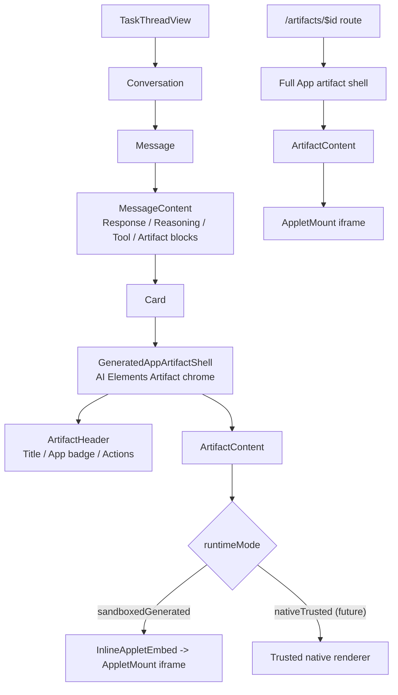

# refactor: Complete AI Elements Conversation and Artifact patterns for Computer

## Overview

Computer has adopted the AI Elements substrate, but the thread transcript and generated App artifacts still behave like custom ThinkWork surfaces with AI Elements primitives sprinkled underneath. This plan completes the AI Elements `Conversation` + `Message` pattern for Computer threads and the AI Elements `Artifact` pattern for generated Apps while preserving the product decisions that matter for ThinkWork:

- Thread transcripts use AI Elements `Conversation` and `Message` primitives intentionally.
- LLM-generated Apps continue to execute inside the cross-origin iframe sandbox.
- The visible shell uses AI Elements `Artifact` primitives intentionally: header, title, description, actions, and content.
- ThinkWork keeps ownership of App-specific runtime behavior: iframe lifecycle, sandbox security, theme propagation, fit-content sizing, full-page navigation, and future trusted-native rendering.
- The user-facing UI should remain visually close to the current Computer experience; this is a structural migration, not a redesign.

This plan treats the thread transcript and generated App shell as one cleanup because they meet in the same place: generated Apps should render as Artifact blocks inside AI Elements Message content.

---

## Problem Frame

PR #1101 landed the first AI Elements adoption pass: `Response`, `PromptInput`, `Reasoning`, `Tool`, typed UIMessage parts, iframe-shell execution, and shallow Artifact wrappers. The resulting architecture is directionally right but incomplete. `Conversation`, `ConversationContent`, `Message`, `MessageContent`, `MessageActions`, and `MessageResponse` are available, but `TaskThreadView` still owns a custom transcript layout. `ArtifactHeader`, `ArtifactTitle`, `ArtifactDescription`, `ArtifactActions`, `ArtifactAction`, and `ArtifactClose` are also available in `apps/computer/src/components/ai-elements/artifact.tsx`, but the main generated-App surfaces still hand-roll their visible chrome.

That creates two problems:

- **Conceptual drift:** future work cannot tell whether thread turns should follow AI Elements `Conversation`/`Message` conventions or custom ThinkWork transcript markup, and cannot tell whether generated Apps should follow AI Elements `Artifact` conventions or custom ThinkWork cards.
- **Runtime ambiguity:** there is no explicit model for trusted native artifact content versus sandboxed LLM-generated Apps. Today everything user-visible is effectively custom, even though the security-critical iframe runtime is correct.

The plan should make the product posture legible: Computer threads are first-class AI Elements Conversations, generated App blocks are first-class AI Elements Artifacts, and arbitrary LLM-authored code remains untrusted and sandboxed.

---

## Requirements Trace

- R1. Use AI Elements `Artifact` primitives as the structural shell for generated App artifacts in thread inline embeds and full artifact routes.
- R2. Preserve the cross-origin iframe runtime for all arbitrary LLM-generated App code.
- R3. Preserve current Computer UX constraints: dark theme, thread content width, `App` label, full-page route, "Open full" action, iframe fit-content behavior, readable composer/footer behavior, and no nested thread scroll regressions.
- R4. Make the runtime trust model explicit enough for future vetted/native Apps without implementing the native runtime in this plan.
- R5. Update prompts/defaults so future LLM-generated Apps assume host-provided Artifact chrome rather than generating their own outer artifact shell.
- R6. Keep the implementation compatible with `docs/specs/computer-ai-elements-contract-v1.md`, especially the iframe `postMessage` protocol and no-secrets sandbox invariant.
- R7. Use AI Elements `Conversation` and `Message` primitives as the structural shell for `TaskThreadView` transcript rendering, while preserving typed `UIMessage` part rendering and durable artifact blocks.

**Origin actors:** A1 user/operator, A2 Strands agent runtime, A3 Computer client.
**Origin acceptance examples:** AE1 import rejection, AE3 typed part rendering, AE5 iframe CSP/exfiltration boundary.

---

## Scope Boundaries

- Do not replace the iframe runtime with same-origin React mounting for LLM-generated Apps.
- Do not implement a trusted native App runtime in this plan; only shape the API/model so it can be added cleanly later.
- Do not redesign the full Computer thread visual language; migrate the transcript substrate to `Conversation` + `Message` with minimal UX disruption.
- Do not change AppSync streaming, `UIMessage` wire shape, or persisted `messages.parts`.
- Do not add new infrastructure, DNS, or CloudFront behavior.
- Do not reintroduce the `Applet` label in user-facing UI.

### Deferred to Follow-Up Work

- Trusted native artifact runtime for vetted workflows/components.
- Rich artifact lifecycle controls such as regenerate/version switcher, source viewer, or provenance drawer.
- Browser-level CSP smoke for generated Apps if not already covered by the broader iframe substrate follow-up.

---

## Context & Research

### Relevant Code and Patterns

- `apps/computer/src/components/ai-elements/artifact.tsx` defines the AI Elements Artifact primitives.
- `apps/computer/src/components/ai-elements/conversation.tsx` defines the AI Elements Conversation primitives.
- `apps/computer/src/components/ai-elements/message.tsx` defines the AI Elements Message primitives.
- `apps/computer/src/components/computer/TaskThreadView.tsx` owns custom transcript layout, optimistic/streaming message state, turn fallback rendering, typed part rendering, durable artifact blocks, and the in-thread follow-up composer.
- `apps/computer/src/components/computer/render-typed-part.tsx` renders typed UIMessage parts and should continue returning content that can live inside `MessageContent`.
- `apps/computer/src/components/computer/StreamingMessageBuffer.tsx` handles the legacy streaming fallback and should continue to render inside assistant `MessageContent`.
- `apps/computer/src/components/computer/GeneratedArtifactCard.tsx` owns the visible inline App artifact chrome in thread messages.
- `apps/computer/src/components/apps/InlineAppletEmbed.tsx` wraps inline generated Apps in `Artifact` + `ArtifactContent` and mounts the iframe substrate.
- `apps/computer/src/components/apps/AppCanvasPanel.tsx` wraps full-page App canvas content in `Artifact` + `ArtifactContent`.
- `apps/computer/src/routes/_authed/_shell/artifacts.$id.tsx` owns full artifact route behavior, header title, back navigation, and actions.
- `apps/computer/src/applets/iframe-controller.ts` and `apps/computer/src/applets/mount.tsx` own iframe execution and must remain the runtime boundary for LLM-authored code.
- `packages/workspace-defaults/files/skills/artifact-builder/SKILL.md` and related references steer generated App output and should describe Artifact chrome as host-provided.

### Institutional Learnings

- `docs/specs/computer-ai-elements-contract-v1.md` makes iframe execution load-bearing for untrusted LLM-authored React. Parent-to-iframe `targetOrigin: "*"` is required because the iframe has an opaque origin under `sandbox="allow-scripts"` without `allow-same-origin`; trust comes from pinned iframe source, iframe-side parent allowlist, channel nonce, and no secrets in payloads.
- `docs/plans/2026-05-09-012-feat-computer-ai-elements-adoption-plan-status.md` records that Artifact adoption shipped as a shallow wrapper in U12, while richer `Conversation`/`Message` and full Artifact chrome remained incomplete.

### External References

- AI SDK Elements Artifact docs: `https://ai-sdk.dev/elements/components/artifact`
- AI SDK Elements Conversation docs: `https://elements.ai-sdk.dev/components/conversation`
- AI SDK Elements Message docs: `https://elements.ai-sdk.dev/components/message`
- AI SDK Elements source-install model: `https://elements.ai-sdk.dev/docs/usage`

---

## Key Technical Decisions

- **Use AI Elements transcript, ThinkWork state.** `Conversation` and `Message` primitives provide transcript structure; `TaskThreadView` keeps ownership of thread data mapping, streaming state, optimistic turns, and follow-up submission behavior.
- **Use AI Elements shell, ThinkWork canvas.** `Artifact` primitives provide structure and semantic consistency; ThinkWork owns iframe runtime, theme, sizing, and full-route behavior.
- **LLM-generated Apps are always `sandboxedGenerated`.** Arbitrary model-authored TSX never renders directly in the authenticated parent React tree.
- **Introduce a trust-mode vocabulary now, but do not build native execution yet.** A narrow model such as `sandboxedGenerated` versus `nativeTrusted` lets future work add vetted native Apps without overloading the generated App path.
- **Artifact chrome is host-owned.** Generated TSX should render the App body only. The host provides title, description, actions, iframe wrapper, full-page navigation, and future provenance/version controls.
- **Keep visual disruption low.** Inline artifacts should remain quiet inside threads: muted header, no extra outer border noise, and app content constrained by existing thread layout rules.

---

## Open Questions

### Resolved During Planning

- **Should LLM-generated Apps continue to run in iframes?** Yes. The iframe is the enterprise security boundary for arbitrary generated JS.
- **Should Artifact be fully native even if the runtime remains custom?** Yes. Use full AI Elements Artifact chrome structurally, with ThinkWork-specific runtime inside `ArtifactContent`.
- **Should this plan include the full `Conversation` + `Message` migration?** Yes. The thread transcript and inline generated App artifacts should migrate together so generated Apps become normalized Artifact blocks inside Message content.

### Deferred to Implementation

- **Exact component names for the shared shell:** The implementing agent may choose the clearest local names after touching the files, but the shell should be explicit about artifact role and runtime mode.
- **Exact visual class names:** Preserve the current look; final spacing and border tokens should be verified visually.
- **Whether the full artifact route should show a compact `ArtifactHeader` or keep the existing app top bar as the only top-level header:** Decide during implementation after comparing duplication in the running UI.

---

## High-Level Technical Design

> *This illustrates the intended approach and is directional guidance for review, not implementation specification. The implementing agent should treat it as context, not code to reproduce.*

---

## Implementation Units

- U1. **Migrate TaskThreadView to Conversation and Message primitives**

**Goal:** Make the Computer transcript structurally use AI Elements `Conversation` and `Message` primitives while preserving current message rendering, streaming, durable artifact blocks, and follow-up composer behavior.

**Requirements:** R3, R7

**Dependencies:** None

**Files:**
- Modify: `apps/computer/src/components/computer/TaskThreadView.tsx`
- Modify: `apps/computer/src/components/computer/render-typed-part.tsx` if needed for Message-compatible part output
- Modify: `apps/computer/src/components/computer/StreamingMessageBuffer.tsx` if needed for Message-compatible streaming fallback
- Test: `apps/computer/src/components/computer/TaskThreadView.test.tsx`

**Approach:**
- Replace the custom transcript scroll/content wrapper with `Conversation` and `ConversationContent`.
- Render each persisted or optimistic turn through AI Elements `Message` and `MessageContent`, using `from={message.role}`.
- Keep `renderTypedParts`, `StreamingMessageBuffer`, fallback turn response rendering, and durable artifact rendering inside `MessageContent`.
- Preserve current visual constraints: max thread content width, muted assistant header behavior, user bubble alignment, composer/footer width/background, and page scroll behavior when the pointer is over iframe content.
- Do not change the `TaskThreadMessage` data shape or AppSync streaming model.

**Patterns to follow:**
- `apps/computer/src/components/ai-elements/conversation.tsx` for scroll container and scroll-to-bottom behavior.
- `apps/computer/src/components/ai-elements/message.tsx` for role-aware message structure.
- Current `TaskThreadView.tsx` state derivation for optimistic messages, turn fallbacks, and streaming chunks.

**Test scenarios:**
- Happy path: a thread with user, assistant, reasoning/tool parts, and a generated App artifact renders through `Conversation` and `Message`.
- Edge case: empty thread still shows the current empty state.
- Streaming: typed parts and legacy `StreamingMessageBuffer` continue to appear inside the latest assistant message.
- Regression: follow-up composer remains max-width constrained, opaque, readable, and does not cover the scrollbar.
- Regression: inline iframe content does not trap thread scroll.

**Verification:**
- `TaskThreadView` has one transcript substrate: AI Elements `Conversation` containing AI Elements `Message` turns.

---

- U2. **Define generated App Artifact shell contract**

**Goal:** Create a single host-owned shell concept for generated App artifacts so inline and full-page surfaces share the same AI Elements Artifact vocabulary.

**Requirements:** R1, R2, R3, R4

**Dependencies:** U1

**Files:**
- Modify/Create: `apps/computer/src/components/apps/GeneratedAppArtifactShell.tsx`
- Modify: `apps/computer/src/components/ai-elements/artifact.tsx`
- Test: `apps/computer/src/components/apps/GeneratedAppArtifactShell.test.tsx`

**Approach:**
- Add a small generated-App-specific wrapper around the existing AI Elements `Artifact` primitives.
- The wrapper should expose title, optional description, label text, action slot, runtime mode, and content slot.
- It should compose `Artifact`, `ArtifactHeader`, `ArtifactTitle`, `ArtifactDescription`, `ArtifactActions`, and `ArtifactContent` rather than duplicating their structure.
- The default visible label should be `App`.
- Runtime mode should default to the sandboxed generated path; any `nativeTrusted` variant should be modeled but not exercised by arbitrary LLM-generated Apps.

**Patterns to follow:**
- `apps/computer/src/components/computer/GeneratedArtifactCard.tsx` for current inline visual tone.
- `apps/computer/src/components/apps/InlineAppletEmbed.tsx` for iframe mount behavior.
- `apps/computer/src/components/ai-elements/artifact.tsx` for primitive composition.

**Test scenarios:**
- Happy path: rendering the shell with title and action slot produces `ArtifactHeader`, visible title, `App` label, actions, and content region.
- Edge case: missing description does not render an empty description row or extra spacing.
- Edge case: sandboxed generated runtime mode is represented in props/state without allowing same-origin rendering.
- Accessibility: title/action controls remain discoverable by role/name.

**Verification:**
- A generated App shell can be rendered in isolation using only AI Elements Artifact primitives plus ThinkWork styling.

---

- U3. **Migrate inline thread App embeds to full Artifact shell**

**Goal:** Replace `GeneratedArtifactCard`'s custom App chrome with the shared generated App Artifact shell while preserving current inline thread behavior.

**Requirements:** R1, R2, R3, R7

**Dependencies:** U1, U2

**Files:**
- Modify: `apps/computer/src/components/computer/GeneratedArtifactCard.tsx`
- Modify: `apps/computer/src/components/apps/InlineAppletEmbed.tsx`
- Test: `apps/computer/src/components/computer/GeneratedArtifactCard.test.tsx`
- Test: `apps/computer/src/components/apps/InlineAppletEmbed.test.tsx`
- Test: `apps/computer/src/components/computer/TaskThreadView.test.tsx`

**Approach:**
- For App artifacts, `GeneratedArtifactCard` should become a thin adapter from durable artifact metadata to the shared shell.
- Render the generated App artifact card inside assistant `MessageContent`; do not create a parallel transcript/card system outside `Message`.
- Keep `InlineAppletEmbed` responsible for querying source and mounting `AppletMount`; avoid moving GraphQL concerns into the shell.
- Preserve `Open full` behavior via an `ArtifactAction` or action-slot composition.
- Keep inline embeds quiet: no large duplicate header, no outer border noise beyond the intentional Artifact surface, and no nested scroll regression.

**Patterns to follow:**
- Current `GeneratedArtifactCard` muted header treatment.
- Current `InlineAppletEmbed` `fitContentHeight` behavior.
- Current thread composer/footer constraints in `TaskThreadView`.

**Test scenarios:**
- Happy path: an `APPLET`/`DATA_VIEW` artifact renders the shell with `App`, `Open full`, and an inline iframe mount.
- Edge case: non-App artifacts still render the existing non-preview fallback and are not forced through the generated App shell.
- Integration: an inline generated App with `fitContentHeight` still avoids nested thread scroll behavior.
- Regression: user-facing copy says `App`, not `Applet`.

**Verification:**
- Thread inline generated Apps look materially the same as before, but their visible chrome is built from Artifact primitives.

---

- U4. **Migrate full artifact route canvas to Artifact shell**

**Goal:** Make full generated App pages use the same Artifact shell vocabulary without sacrificing the immersive full-page canvas behavior.

**Requirements:** R1, R2, R3

**Dependencies:** U2

**Files:**
- Modify: `apps/computer/src/components/apps/AppCanvasPanel.tsx`
- Modify: `apps/computer/src/components/apps/AppArtifactSplitShell.tsx`
- Modify: `apps/computer/src/routes/_authed/_shell/artifacts.$id.tsx`
- Test: `apps/computer/src/components/apps/AppArtifactSplitShell.test.tsx`
- Test: `apps/computer/src/test/visual/app-artifact-shell.test.tsx`
- Test: `apps/computer/src/routes/_authed/_shell/-artifacts.$id.test.tsx`

**Approach:**
- Use the shared generated App shell for the full canvas when it improves consistency.
- Avoid duplicating the route-level app top bar and Artifact header; if both would show the same title/action, the route top bar remains primary and the Artifact header can be compact or omitted for full-page mode.
- Keep the iframe content full-bleed within the app body where that is the current expected behavior.
- Preserve history-based back navigation and full-route actions.

**Patterns to follow:**
- `apps/computer/src/routes/_authed/_shell/artifacts.$id.tsx` history fallback behavior.
- `apps/computer/src/components/apps/AppCanvasPanel.tsx` current borderless full-height canvas.

**Test scenarios:**
- Happy path: full artifact route displays title, back behavior, and sandboxed App content.
- Edge case: direct navigation to `/artifacts/$id` still falls back to `/artifacts` on back.
- Visual contract: full canvas remains full-height and does not acquire unwanted card padding or duplicate rounded-corner chrome.
- Regression: route still suppresses nested iframe scrolling where fit-content is expected and allows full-page scrolling where appropriate.

**Verification:**
- Full generated App pages feel like ThinkWork Apps while their internal structure is aligned with the Artifact primitive model.

---

- U5. **Codify sandboxed versus trusted Artifact runtime model**

**Goal:** Make the generated-App trust boundary explicit in local types/docs so future work can add vetted native artifacts without weakening LLM-generated App isolation.

**Requirements:** R2, R4, R6

**Dependencies:** U2

**Files:**
- Modify: `apps/computer/src/lib/app-artifacts.ts`
- Modify: `apps/computer/src/components/apps/InlineAppletEmbed.tsx`
- Modify: `apps/computer/src/components/apps/AppCanvasPanel.tsx`
- Test: `apps/computer/src/components/apps/InlineAppletEmbed.test.tsx`
- Test: `apps/computer/src/applets/iframe-controller.test.ts`

**Approach:**
- Introduce a small local runtime-mode vocabulary for artifact rendering.
- Ensure arbitrary generated App artifacts resolve to `sandboxedGenerated`.
- Keep `nativeTrusted` as a future-capable mode that cannot be selected by current LLM-generated artifact metadata.
- Add a regression test or assertion that generated artifact metadata cannot bypass `AppletMount`/iframe execution by naming a trusted mode.
- Do not change the iframe `postMessage` protocol or CSP contract.

**Patterns to follow:**
- `docs/specs/computer-ai-elements-contract-v1.md` trust model.
- `apps/computer/src/applets/iframe-controller.test.ts` security regression style.

**Test scenarios:**
- Happy path: generated App metadata maps to `sandboxedGenerated`.
- Error path: unrecognized or user-supplied runtime mode metadata does not enable native rendering.
- Security regression: iframe controller no-secrets and channel/source tests remain intact.

**Verification:**
- Reviewers can see where trust is decided, and generated Apps cannot opt themselves into native execution.

---

- U6. **Update generated App authoring guidance**

**Goal:** Align agent-facing guidance with host-owned Artifact chrome so generated TSX focuses on the App body rather than duplicating shells, headers, evidence panels, or labels.

**Requirements:** R3, R5, R6

**Dependencies:** U2, U3

**Files:**
- Modify: `packages/workspace-defaults/files/skills/artifact-builder/SKILL.md`
- Modify: `packages/workspace-defaults/files/skills/artifact-builder/references/crm-dashboard.md`
- Modify: `packages/workspace-defaults/files/CAPABILITIES.md`
- Modify: `packages/workspace-defaults/src/index.ts`
- Test: `packages/workspace-defaults/src/index.test.ts` if present, otherwise add/update the nearest workspace-defaults fixture test

**Approach:**
- State clearly that generated Apps render inside host-provided Artifact chrome.
- Instruct generated App TSX to render only the body/canvas content.
- Reinforce that generated Apps run in the sandboxed iframe runtime and should not assume access to parent app globals, credentials, local storage, or network.
- Preserve the `App` term and avoid `Applet`.
- Remove or soften guidance that encourages generated dashboards to include their own refresh recipe/evidence/source coverage panels unless explicitly requested by the user.

**Patterns to follow:**
- Current post-#1101 cleanup that removed unwanted refresh/evidence/source UI from generated dashboards.
- `docs/specs/computer-ai-elements-contract-v1.md` iframe and import-surface constraints.

**Test scenarios:**
- Happy path: built workspace defaults include guidance that Artifact chrome is host-provided.
- Regression: generated guidance does not reintroduce `Applet` as user-facing terminology.
- Regression: default guidance does not require refresh recipe/evidence/source coverage panels in every generated App.

**Verification:**
- Future generated Apps are less likely to duplicate host chrome or produce unwanted wrapper UI.

---

- U7. **Conversation and Artifact visual/regression verification**

**Goal:** Verify that the Conversation/Message and Artifact migrations preserve the current UX while making the structure more native to AI Elements.

**Requirements:** R1, R2, R3, R6, R7

**Dependencies:** U1, U3, U4, U5, U6

**Files:**
- Modify: `apps/computer/src/test/visual/app-artifact-shell.test.tsx`
- Modify: `apps/computer/src/components/computer/TaskThreadView.test.tsx`
- Modify: `apps/computer/src/routes/_authed/_shell/-artifacts.$id.test.tsx`

**Approach:**
- Add targeted regression tests for the current interaction pain points discovered during PR #1101: no unwanted outer border, no duplicate icon, no `Applet` label, no full-width composer/footer overlay, no nested scroll in inline thread Apps, no same-origin generated execution.
- Add transcript-structure assertions that `TaskThreadView` uses `Conversation` and role-aware `Message` turns rather than a separate custom transcript scaffold.
- Prefer component/visual-contract tests over brittle pixel assertions.
- Include manual browser verification notes in the PR description when the implementation ships.

**Patterns to follow:**
- Existing `app-artifact-shell.test.tsx` visual contract style.
- Existing `TaskThreadView.test.tsx` composer and artifact rendering tests.

**Test scenarios:**
- Integration: thread transcript renders through AI Elements `Conversation` and `Message`, including user/assistant role styling.
- Integration: thread with generated App artifact renders header/action/content without blocking the thread scrollbar.
- Integration: full artifact route renders sandboxed content and keeps back navigation behavior.
- Regression: generated App shell uses AI Elements Artifact primitives in both inline and full modes.
- Security regression: LLM-generated App path still routes through iframe-backed `AppletMount`.

**Verification:**
- Local tests pass and a browser smoke of a map App plus a dashboard App shows the same or better UX than PR #1101, with clearer Artifact structure.

---

## System-Wide Impact

- **Interaction graph:** durable artifact metadata flows through `GeneratedArtifactCard` or full artifact route into a generated App shell, then into `InlineAppletEmbed`/`AppletMount` for sandbox execution.
- **Error propagation:** artifact load/compile/runtime failures still surface through existing `AppletFailure` and iframe error envelope paths; the shell should display them inside `ArtifactContent` rather than swallowing them.
- **State lifecycle risks:** fit-content height and wheel-forwarding behavior must not regress. Inline Apps should continue avoiding nested thread scrolls where possible.
- **API surface parity:** no GraphQL, AppSync, or database schema changes are planned.
- **Integration coverage:** component tests prove shell composition; browser smoke remains valuable for real iframe sizing/theme behavior.
- **Unchanged invariants:** arbitrary LLM-generated TSX never executes in the authenticated parent origin; parent/iframe protocol carries no secrets.

---

## Risks & Dependencies

| Risk | Mitigation |
|------|------------|
| Artifact chrome adds duplicate headers or visual clutter | Keep a compact inline variant and allow full-page mode to rely on route top bar where appropriate. |
| A "trusted native" vocabulary accidentally opens a bypass for generated Apps | Model the vocabulary but keep selection host-owned; test that generated metadata cannot opt into native rendering. |
| Conversation migration changes transcript scroll/composer behavior | Keep `TaskThreadView` state derivation intact and cover empty, streaming, inline artifact, and composer/footer cases in U1/U7. |
| Thread scroll/iframe sizing regressions return | Carry current `fitContentHeight`, wheel-forwarding, and composer footer tests into U1/U3/U7. |
| Guidance changes cause generated Apps to under-render context | Prompt guidance should remove generic chrome, not domain content; app body remains responsible for the user's requested visualization/UI. |

---

## Documentation / Operational Notes

- Update the PR description to call out that this is structural Conversation/Message and Artifact adoption, not a new execution substrate.
- Any future plan for trusted native Apps should reference this plan's runtime-mode vocabulary and explicitly define what qualifies as trusted.
- Any future trusted native artifact plan should treat generated App artifact blocks as already normalized through the shared shell.

---

## Sources & References

- Origin document: `docs/brainstorms/2026-05-09-computer-ai-elements-adoption-requirements.md`
- Prior plan: `docs/plans/2026-05-09-012-feat-computer-ai-elements-adoption-plan.md`
- Prior status: `docs/plans/2026-05-09-012-feat-computer-ai-elements-adoption-plan-status.md`
- Contract: `docs/specs/computer-ai-elements-contract-v1.md`
- AI SDK Elements Artifact docs: `https://ai-sdk.dev/elements/components/artifact`
- AI SDK Elements Conversation docs: `https://elements.ai-sdk.dev/components/conversation`
- AI SDK Elements Message docs: `https://elements.ai-sdk.dev/components/message`
- AI SDK Elements usage docs: `https://elements.ai-sdk.dev/docs/usage`
