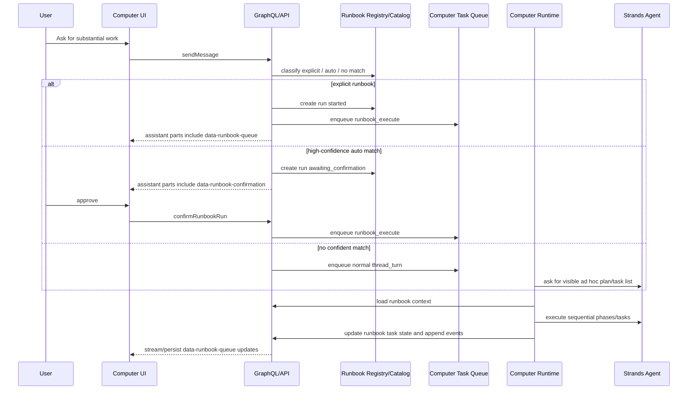
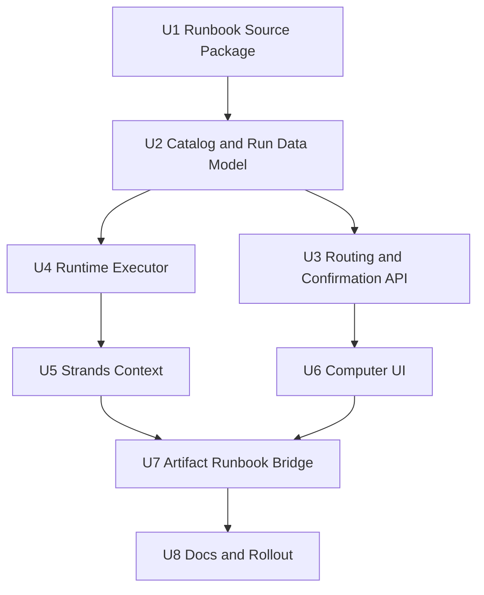
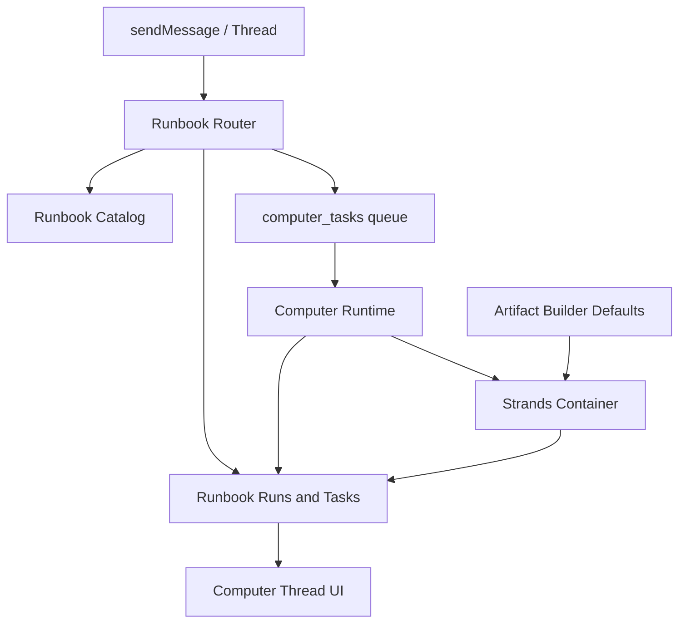

# feat: Add Computer Runbooks Foundation

## Overview

Computer runbooks become the foundation contract for substantial repeatable Computer work. Instead of hiding application-specific behavior inside one-off skills such as Artifact Builder, ThinkWork will publish versioned YAML plus Markdown runbooks that define routing hints, approval copy, phases, expected outputs, capability roles, and progress semantics. The runtime can then execute those definitions sequentially in v1 while preserving a dependency-ready model for later Strands agents-as-tools, Strands workflow, or state-machine execution.

The plan adds a runbook source package, a tenant-visible catalog and run lifecycle, API-side routing and confirmation, a sequential execution adapter, Strands runtime context, and Computer UI renderers for AI Elements Confirmation and Queue.

---

## Problem Frame

The current Artifact Builder path proves that workspace skill references can steer dashboard and app generation, but it is too narrow for the number of runbook families ThinkWork wants to publish. Users should be able to ask Computer for substantial work without knowing runbook names, approve auto-selected work before it starts, and watch a meaningful phase/task queue instead of raw internal tool calls (see origin: `docs/brainstorms/2026-05-10-computer-runbooks-foundation-requirements.md`).

The important architectural boundary is that ThinkWork runbooks are the product source of truth. Strands is an execution target. The implementation should keep the authored runbook stable while allowing v1 execution to be simple and sequential.

---

## Requirements Trace

- R1. V1 runbooks are ThinkWork-published YAML and Markdown files stored as versioned repo artifacts.
- R2. Runbook definitions include catalog metadata, triggers, inputs, phases, expected outputs, and confirmation/progress copy.
- R3. The definition shape reserves safe future operator override boundaries.
- R4. Auto-selected runbooks require user confirmation before execution.
- R5. Explicit named runbook invocation starts directly.
- R6. No confident match falls back to a visible ad hoc plan/task list.
- R7. YAML declares durable phases; Markdown gives phase execution guidance.
- R8. Approved runbooks expand phases into concrete user-meaningful tasks, each mapped to a phase.
- R9. Primary progress uses AI Elements Queue/Task-style presentation grouped by phase.
- R10. V1 execution is logically sequential while preserving dependency fields for later parallel/state-machine execution.
- R11. Runbooks are the source of truth; Strands agents-as-tools and workflow are execution targets.
- R12. Runbook tasks declare capability roles rather than concrete specialist-agent names.
- R13. Execution context supports passing task outputs forward.
- R14. Existing Artifact Builder dashboard/app behavior becomes a runbook family.
- R15. V1 targets all substantial Computer work, not only dashboards, maps, or app artifacts.

**Origin actors:** A1 End user, A2 ThinkWork Computer, A3 ThinkWork runbook author, A4 Future tenant operator, A5 Strands runtime, A6 Computer UI.

**Origin flows:** F1 Auto-selected runbook with confirmation, F2 Explicit runbook invocation, F3 Visible runbook execution, F4 Runbook execution through Strands capabilities.

**Origin acceptance examples:** AE1 map auto-selection confirmation, AE2 explicit CRM dashboard runbook, AE3 novel work falls back to ad hoc task plan, AE4 phase-to-task mapping and sequential execution, AE5 stable capability mapping.

---

## Scope Boundaries

- V1 runbooks are ThinkWork-authored only. Tenant authoring and operator editing are deferred.
- V1 phases execute sequentially. Parallel execution, fan-in/fan-out, and state-machine execution are deferred but the model must keep dependency fields.
- Strands workflow definitions are not the product source of truth.
- Users should not need to know runbook names for common work, but explicit named invocation remains supported.
- Raw internal tool calls must not become the primary task queue.
- Existing routines and scheduled jobs remain separate systems.
- A visual runbook builder is out of scope.
- This plan does not turn runbooks into a generic BI, app-builder, or workflow-automation product independent of Computer.

### Deferred to Follow-Up Work

- Tenant operator editing: add safe override UI and persistence after the v1 definition shape proves stable.
- Parallel/state-machine execution: compile the same runbook model into a richer runner after sequential v1 ships.
- Full visual runbook authoring: defer until there is enough production authoring experience to justify the UX.

---

## Context & Research

### Relevant Code and Patterns

- `packages/database-pg/src/schema/computers.ts` already has durable `computer_tasks` and `computer_events`. These are useful for runtime execution and operational history, but they do not directly model user-facing runbook phases, approvals, dependencies, or Queue state.
- `packages/database-pg/graphql/types/computers.graphql` exposes `computerTasks` and `computerEvents`; runbooks should add a higher-level API instead of forcing the UI to interpret raw events.
- `packages/api/src/graphql/resolvers/messages/sendMessage.mutation.ts` is the Computer-owned thread entry point. It inserts the user message and delegates Computer turns to `enqueueComputerThreadTurn`.
- `packages/api/src/lib/computers/thread-cutover.ts` dispatches Computer thread turns, ensures Artifact Builder defaults, marks tasks running, and invokes the Strands backing agent. This is the main routing seam for runbook auto-selection and explicit invocation.
- `packages/api/src/lib/computers/tasks.ts`, `packages/computer-runtime/src/task-loop.ts`, and `packages/computer-runtime/src/api-client.ts` are the durable task queue and runtime adapter surfaces to extend for runbook execution.
- `packages/api/src/lib/computers/runtime-api.ts` already owns claim/complete/fail/event behavior and thread-turn context/response recording.
- `packages/database-pg/src/schema/tenant-customize-catalog.ts`, `packages/database-pg/graphql/types/customize.graphql`, and `packages/api/src/graphql/resolvers/customize/enableWorkflow.mutation.ts` provide a useful tenant-scoped catalog and enablement pattern, but runbooks need a distinct catalog/run lifecycle rather than being hidden as Customize workflows.
- `packages/api/src/lib/workspace-map-generator.ts` shows how tenant-scoped skills, connectors, and workflows are rendered into workspace context and how Markdown table values are escaped.
- `packages/workspace-defaults/src/index.ts` and `packages/api/src/lib/computers/artifact-builder-defaults.ts` seed Artifact Builder defaults. They are compatibility material for the first artifact runbook family, not the long-term source of truth.
- `packages/agentcore-strands/agent-container/container-sources/server.py` builds Computer turn context, injects the Computer contract, and gates typed UIMessage emission on `COMPUTER_ID` and `COMPUTER_TASK_ID`.
- `packages/agentcore-strands/agent-container/container-sources/workflow_skill_context.py` is a good pattern for formatting runtime-supplied execution guidance into the Strands prompt.
- `packages/agentcore-strands/agent-container/container-sources/computer_task_events.py` is available for phase/task event emission from Python.
- `packages/agentcore-strands/agent-container/container-sources/ui_message_publisher.py` already emits typed UIMessage chunks, including `data-${name}` parts.
- `packages/database-pg/graphql/types/messages.graphql` exposes `Message.parts`, and `docs/specs/computer-ai-elements-contract-v1.md` defines `data-${name}` as the extension point for custom typed parts.
- `apps/computer/src/components/computer/render-typed-part.tsx` already renders known UIMessage parts and shows unknown `data-*` parts as debug strips. Runbook confirmation and queue should become first-class `data-runbook-*` renderers.
- `apps/computer/src/lib/ui-message-chunk-parser.ts`, `apps/computer/src/lib/ui-message-merge.ts`, and their tests already support streaming and accumulating `data-*` parts.
- `apps/computer/src/lib/graphql-queries.ts` sends messages and fetches Computer task/event data. It will need runbook queries/mutations and should include persisted `parts` where the thread view needs reload fidelity.

### Institutional Learnings

- `docs/solutions/workflow-issues/workspace-defaults-md-byte-parity-needs-ts-test-2026-04-25.md`: changing workspace default Markdown requires keeping `packages/workspace-defaults/src/index.ts` byte-parity constants and tests in sync.
- `docs/specs/computer-ai-elements-contract-v1.md`: custom Computer UI state should use typed UIMessage `data-${name}` parts rather than inventing non-standard message fragments.
- `docs/plans/2026-05-10-002-refactor-computer-artifact-pattern-plan.md`: generated app artifacts remain sandboxed; runbooks should orchestrate artifact generation rather than weakening the artifact isolation boundary.
- `docs/brainstorms/2026-04-21-structured-playbooks-for-business-problem-solving-requirements.md`: prior playbook work supports the YAML/Markdown authoring direction, but this plan should avoid overbuilding a separate async worker before Computer needs it.
- `docs/brainstorms/2026-05-03-routine-visual-workflow-ux-requirements.md`: routines/workflows are an adjacent product area, not something runbooks replace in v1.

### External References

- [Archon](https://github.com/coleam00/Archon) as prior art for workflow/runbook publication and agent-facing structure.
- [AI Elements Confirmation](https://elements.ai-sdk.dev/components/confirmation) for the auto-selected runbook approval card.
- [AI Elements Queue](https://elements.ai-sdk.dev/components/queue) for the phase/task progress presentation.
- [Strands agents-as-tools](https://strandsagents.com/docs/user-guide/concepts/multi-agent/agents-as-tools/) for future capability role execution through specialist agents.
- [Strands workflow](https://strandsagents.com/docs/user-guide/concepts/multi-agent/workflow/) for future sequential/parallel/state-machine-like execution targets.

---

## Key Technical Decisions

- Create a new `packages/runbooks` source package: Runbooks are product definitions, not workspace skills, Customize workflows, or database-only rows. The package can validate YAML/Markdown, export a typed registry, and publish seed definitions.
- Add runbook-specific catalog/run/task persistence: `computer_tasks` remains the low-level execution queue, while runbook catalog, run, and expanded task records model approval, phase grouping, dependencies, user-visible Queue state, and output handoff.
- Route Computer messages before dispatching the default `thread_turn`: `sendMessage` and `thread-cutover` are the right seam because they already own Computer turn enqueueing and Strands dispatch. High-confidence auto-selection creates a pending confirmation run instead of immediately invoking Strands.
- Use `data-runbook-confirmation` and `data-runbook-queue` UIMessage parts: This aligns with the existing AI Elements contract and keeps streaming, persistence, and reload behavior on one message protocol.
- Keep v1 execution sequential: Runbooks preserve dependency fields, but the first runner should be predictable and easy to reason about before adding parallel/state-machine scheduling.
- Use capability roles rather than agent names: Runbook YAML declares roles such as `research`, `analysis`, `artifact_build`, `map_build`, or `validation`; runtime mapping decides whether v1 uses the main Computer agent, an existing helper, or later Strands agents-as-tools.
- Bridge Artifact Builder rather than deleting it: Existing Artifact Builder defaults should feed the first artifact runbooks while existing Computers continue to work during rollout.
- Prefer API-side deterministic routing before model routing: Trigger examples, aliases, and explicit names should be evaluated in API code first. Ambiguous or novel work falls back to the normal Computer turn and asks the model to produce a visible ad hoc task plan.

---

## Open Questions

### Resolved During Planning

- Should runbooks be YAML/Markdown files or database-authored workflows? Use YAML/Markdown in `packages/runbooks`; seed catalog rows from those definitions.
- Should Queue state derive from raw `computer_events`? No. Add runbook-specific run/task state and keep raw events as evidence/detail.
- Should Strands workflow be the source format? No. Treat Strands workflow and agents-as-tools as execution targets so the product contract stays stable.
- Should explicit named invocation ask for confirmation? No. The origin requires explicit invocation to start directly.
- Should Artifact Builder be removed in the first PR? No. Bridge it into runbooks while preserving current behavior.

### Deferred to Implementation

- Exact route scoring thresholds: implement with conservative constants and tests around explicit, high-confidence, ambiguous, and no-match prompts.
- Final SQL/index shape: decide while writing migrations against the current Drizzle schema and existing tenant/computer/thread indexes.
- Exact AI Elements component API props: follow the installed component patterns at implementation time.
- Capability role names for every future runbook family: define the minimal initial registry and grow it as more runbooks ship.

---

## Output Structure

The exact structure may adjust during implementation, but the intended new package shape is:

```text
packages/runbooks/
  package.json
  src/
    capabilities.ts
    index.ts
    loader.ts
    registry.ts
    schema.ts
  runbooks/
    crm-dashboard/
      runbook.yaml
      phases/
        discover.md
        analyze.md
        produce.md
        validate.md
    research-dashboard/
      runbook.yaml
      phases/
        discover.md
        analyze.md
        produce.md
        validate.md
    map-artifact/
      runbook.yaml
      phases/
        discover.md
        analyze.md
        produce.md
        validate.md
```

---

## High-Level Technical Design

> _This illustrates the intended approach and is directional guidance for review, not implementation specification. The implementing agent should treat it as context, not code to reproduce._



Runbook definitions should carry phase and dependency semantics without forcing v1 to execute them in parallel:

```text
runbook
  metadata: slug, name, description, version, category
  routing: explicit aliases, trigger examples, confidence hints
  inputs: required and optional user/context fields
  approval: title, summary, expected outputs, likely tools/sources
  phases:
    - id, title, guidanceMarkdown, capabilityRoles, dependsOn
  outputs: named artifacts, summaries, evidence expectations
  overrides: future-safe allowlist for tenant operator edits
```

---

## Implementation Units



- U1. **Runbook Source Package**

**Goal:** Create the repo-authored runbook package, schema, loader, registry, and first seed definitions.

**Requirements:** R1, R2, R3, R7, R10, R12, R14, R15; supports A3 and F4.

**Dependencies:** None.

**Files:**

- Create: `packages/runbooks/package.json`
- Create: `packages/runbooks/src/index.ts`
- Create: `packages/runbooks/src/schema.ts`
- Create: `packages/runbooks/src/loader.ts`
- Create: `packages/runbooks/src/registry.ts`
- Create: `packages/runbooks/src/capabilities.ts`
- Create: `packages/runbooks/runbooks/crm-dashboard/runbook.yaml`
- Create: `packages/runbooks/runbooks/crm-dashboard/phases/discover.md`
- Create: `packages/runbooks/runbooks/crm-dashboard/phases/analyze.md`
- Create: `packages/runbooks/runbooks/crm-dashboard/phases/produce.md`
- Create: `packages/runbooks/runbooks/crm-dashboard/phases/validate.md`
- Create: `packages/runbooks/runbooks/research-dashboard/runbook.yaml`
- Create: `packages/runbooks/runbooks/research-dashboard/phases/discover.md`
- Create: `packages/runbooks/runbooks/research-dashboard/phases/analyze.md`
- Create: `packages/runbooks/runbooks/research-dashboard/phases/produce.md`
- Create: `packages/runbooks/runbooks/research-dashboard/phases/validate.md`
- Create: `packages/runbooks/runbooks/map-artifact/runbook.yaml`
- Create: `packages/runbooks/runbooks/map-artifact/phases/discover.md`
- Create: `packages/runbooks/runbooks/map-artifact/phases/analyze.md`
- Create: `packages/runbooks/runbooks/map-artifact/phases/produce.md`
- Create: `packages/runbooks/runbooks/map-artifact/phases/validate.md`
- Create: `packages/runbooks/src/__tests__/loader.test.ts`
- Create: `packages/runbooks/src/__tests__/schema.test.ts`
- Create: `packages/runbooks/src/__tests__/registry.test.ts`
- Modify: `pnpm-workspace.yaml` only if the existing `packages/*` workspace pattern proves insufficient during implementation.

**Approach:**

- Model runbooks as a package under `packages/*` so workspace tooling picks them up naturally.
- Validate YAML structure and phase Markdown references at package test time.
- Include `dependsOn` fields and capability role declarations even though v1 executes sequentially.
- Include an `overrides` allowlist section that is inert in v1 but makes future operator editing explicit.
- Seed the first three runbooks from existing Artifact Builder behavior and the generic research/dashboard use case: `crm-dashboard`, `research-dashboard`, and `map-artifact`.
- Treat `crm-dashboard` as the opinionated canonical dashboard recipe and `research-dashboard` as the generic dashboard stress test for discovery, evidence handling, synthesis, and flexible artifact shape.

**Execution note:** Implement the schema/loader test-first because later units depend on these definitions being trustworthy.

**Patterns to follow:**

- `packages/workspace-defaults/src/index.ts` for packaging repo-authored defaults.
- `docs/brainstorms/2026-04-21-structured-playbooks-for-business-problem-solving-requirements.md` for YAML/Markdown playbook prior art.

**Test scenarios:**

- Happy path: a valid runbook with four phases and matching Markdown files loads into the registry with stable slug, version, phases, capabilities, and routing hints.
- Happy path: registry exports `crm-dashboard`, `research-dashboard`, and `map-artifact` with approval copy and expected outputs.
- Edge case: duplicate runbook slugs fail validation with a clear error.
- Edge case: a phase references missing Markdown and validation fails.
- Error path: unknown capability role fails validation unless it is explicitly marked experimental.
- Error path: operator-overridable fields outside the v1 allowlist fail validation.
- Integration: importing the package from another workspace returns serializable definitions without reading runtime-only files.

**Verification:**

- Runbook definitions are reviewable files, validation blocks malformed definitions, and downstream packages can import typed definitions.

- U2. **Catalog and Run Data Model**

**Goal:** Add persistent runbook catalog, run, and expanded task state so approval and Queue progress are first-class domain data.

**Requirements:** R2, R3, R8, R9, R10, R13; supports A2, A4, A6, F3, F4, AE4, AE5.

**Dependencies:** U1.

**Files:**

- Create: `packages/database-pg/src/schema/runbooks.ts`
- Modify: `packages/database-pg/src/schema/index.ts`
- Create: `packages/database-pg/graphql/types/runbooks.graphql`
- Create: `packages/database-pg/drizzle/NNNN_computer_runbooks.sql`
- Create: `packages/api/src/lib/runbooks/catalog.ts`
- Create: `packages/api/src/lib/runbooks/runs.ts`
- Create: `packages/api/src/lib/runbooks/tasks.ts`
- Create: `packages/api/src/lib/runbooks/catalog.test.ts`
- Create: `packages/api/src/lib/runbooks/runs.test.ts`
- Create: `packages/api/src/graphql/resolvers/runbooks/index.ts`
- Create: `packages/api/src/graphql/resolvers/runbooks/runbookCatalog.query.ts`
- Create: `packages/api/src/graphql/resolvers/runbooks/runbookRun.query.ts`
- Create: `packages/api/src/graphql/resolvers/runbooks/runbookRuns.query.ts`
- Create: `packages/api/src/graphql/resolvers/runbooks/confirmRunbookRun.mutation.ts`
- Create: `packages/api/src/graphql/resolvers/runbooks/rejectRunbookRun.mutation.ts`
- Create: `packages/api/src/graphql/resolvers/runbooks/cancelRunbookRun.mutation.ts`
- Create: `packages/api/src/graphql/resolvers/runbooks/runbooks.test.ts`
- Modify: `packages/api/src/graphql/resolvers/index.ts`
- Modify: `packages/database-pg/graphql/schema.graphql` or generated schema outputs as required by existing schema build flow.

**Approach:**

- Introduce a runbook catalog table seeded from `packages/runbooks`, with tenant scoping and source/version metadata.
- Introduce runbook run records with statuses such as awaiting confirmation, queued, running, completed, failed, cancelled, and rejected.
- Introduce expanded runbook task records with phase id, dependency ids, status, summary, details, output pointer, and ordering.
- Keep `computer_tasks` as the execution queue by storing a coarse `runbook_execute` task that references the runbook run id.
- Expose GraphQL queries/mutations that are tenant-safe and use the same caller tenant fallback patterns as other GraphQL surfaces.
- Include migration object markers if the migration is hand-rolled so the drift reporter can verify production state.

**Patterns to follow:**

- `packages/database-pg/src/schema/computers.ts` for tenant-scoped Computer domain tables.
- `packages/database-pg/src/schema/tenant-customize-catalog.ts` for tenant catalog conventions.
- `packages/api/src/graphql/resolvers/customize/enableWorkflow.mutation.ts` for tenant-scoped catalog lookup and binding behavior.
- `packages/api/src/graphql/resolvers/core/resolve-auth-user.ts` and resolver patterns that handle Google-federated users through tenant fallback.

**Test scenarios:**

- Happy path: catalog seed upserts published runbooks by tenant, slug, and version without duplicating rows.
- Happy path: creating a run from a catalog entry stores the selected version and initial phase/task skeleton.
- Happy path: confirming an awaiting-confirmation run transitions it to queued and returns Queue-ready task state.
- Happy path: rejecting an awaiting-confirmation run records rejected state without enqueueing a `runbook_execute` task.
- Edge case: confirming an already confirmed run is idempotent or returns a stable domain error, with behavior covered by tests.
- Edge case: runs from one tenant cannot be read or mutated by another tenant.
- Error path: confirming a rejected, cancelled, failed, or missing run returns a clear GraphQL error.
- Error path: rejecting a started, running, completed, failed, or missing run returns a clear GraphQL error.
- Error path: catalog seed detects a published runbook removed from source and marks it unavailable rather than deleting historical runs.
- Integration: `computerTasks` can still be queried independently; runbook APIs do not break existing Computer task/event behavior.
- Covers AE4: generated runbook tasks all reference declared phase ids and preserve sequential order.

**Verification:**

- API callers can list catalog entries, create/read/confirm/cancel runs, and retrieve Queue-shaped task state without parsing raw `computer_events`.

- U3. **Routing and Confirmation API**

**Goal:** Route Computer user messages to explicit, auto-selected, or no-match runbook paths before dispatching default Computer turns.

**Requirements:** R4, R5, R6, R8, R9; supports A1, A2, A6, F1, F2, F3, AE1, AE2, AE3.

**Dependencies:** U1, U2.

**Files:**

- Create: `packages/api/src/lib/runbooks/router.ts`
- Create: `packages/api/src/lib/runbooks/confirmation-message.ts`
- Create: `packages/api/src/lib/runbooks/router.test.ts`
- Create: `packages/api/src/lib/runbooks/confirmation-message.test.ts`
- Modify: `packages/api/src/graphql/resolvers/messages/sendMessage.mutation.ts`
- Modify: `packages/api/src/lib/computers/thread-cutover.ts`
- Modify: `packages/api/src/lib/computers/tasks.ts`
- Modify: `packages/database-pg/graphql/types/computers.graphql`
- Modify: `packages/api/src/lib/computers/tasks.test.ts`
- Modify: `packages/api/src/lib/computers/thread-cutover.test.ts` or create it if absent.

**Approach:**

- Add a deterministic runbook router that detects explicit named invocation, high-confidence trigger matches, ambiguous matches, and no-match prompts.
- For explicit invocation, create and queue a run immediately, then persist/stream a Queue assistant message.
- For high-confidence auto-selection, create a run in awaiting-confirmation state and persist/stream an assistant message with `data-runbook-confirmation`.
- For ambiguous multiple matches, use a confirmation/choice response rather than starting work.
- For no match, dispatch the normal `thread_turn` and add Computer contract guidance that the model should produce a visible ad hoc plan/task list for substantial work.
- Add a `runbook_execute` Computer task type whose normalized input references `runbookRunId`, `threadId`, and the approving or invoking user message.
- Ensure internally-created assistant messages update thread state and notify the Computer UI the same way normal assistant responses do, including persisted `Message.parts`.

**Patterns to follow:**

- `packages/api/src/graphql/resolvers/messages/sendMessage.mutation.ts` for the user-message insertion and Computer-owned thread branch.
- `packages/api/src/lib/computers/thread-cutover.ts` for enqueueing and dispatching durable Computer work.
- `packages/api/src/lib/computers/tasks.ts` for task type parsing and input normalization.

**Test scenarios:**

- Happy path: `run the CRM dashboard runbook for LastMile` creates a started/queued run and enqueues `runbook_execute` without an extra confirmation.
- Covers AE1: `build me a map of supplier risk` creates an awaiting-confirmation map run and persists an assistant message containing `data-runbook-confirmation`; no execution task is enqueued until approval.
- Covers AE3: a novel prompt with no confident match enqueues a normal `thread_turn` and does not create a published runbook run.
- Edge case: two similarly matching runbooks return an ambiguity response and do not enqueue execution.
- Edge case: repeated sendMessage/idempotency for the same user message does not create duplicate runbook runs.
- Error path: a matched runbook unavailable for the tenant returns a graceful assistant response and falls back safely.
- Integration: confirmation approval calls enqueue exactly one `runbook_execute` task and emits Queue-ready assistant state.

**Verification:**

- Computer message routing cleanly separates explicit start, auto-confirm, ambiguous, and no-match behavior with no invisible auto-execution.

- U4. **Sequential Runbook Executor**

**Goal:** Execute approved runbook runs through the existing durable Computer runtime while updating user-visible runbook task state.

**Requirements:** R8, R9, R10, R12, R13; supports A2, A5, F3, F4, AE4, AE5.

**Dependencies:** U2, U3.

**Files:**

- Create: `packages/computer-runtime/src/runbooks.ts`
- Create: `packages/computer-runtime/src/runbooks.test.ts`
- Modify: `packages/computer-runtime/src/task-loop.ts`
- Modify: `packages/computer-runtime/src/api-client.ts`
- Modify: `packages/computer-runtime/src/task-loop.test.ts`
- Modify: `packages/api/src/handlers/computer-runtime.ts`
- Modify: `packages/api/src/lib/computers/runtime-api.ts`
- Modify: `packages/api/src/lib/computers/runtime-api.test.ts`
- Create: `packages/api/src/lib/runbooks/runtime-api.ts`
- Create: `packages/api/src/lib/runbooks/runtime-api.test.ts`

**Approach:**

- Extend the runtime task loop to claim `runbook_execute` tasks and load the associated runbook run/context from the API.
- Execute expanded tasks in declared order for v1, honoring dependency metadata only as validation.
- Update runbook task state before and after each task, and append raw `computer_events` for operational evidence.
- Pass task outputs into an execution context that later tasks can reference.
- Mark the coarse `computer_tasks` row completed/failed/cancelled based on the runbook run outcome.
- Keep cancellation checks between tasks so a user cancellation does not wait for the entire runbook to finish.

**Patterns to follow:**

- `packages/computer-runtime/src/task-loop.ts` existing task dispatch by `task.taskType`.
- `packages/computer-runtime/src/api-client.ts` existing runtime API client methods.
- `packages/api/src/lib/computers/runtime-api.ts` for task claim, event append, complete, and fail semantics.

**Test scenarios:**

- Happy path: a queued runbook run executes tasks in phase order, updates each task to running/completed, stores outputs, and completes the run.
- Happy path: output from a discovery task is available to a later produce task without recomputing discovery.
- Covers AE4: `discover`, `analyze`, and `produce` tasks execute sequentially and remain grouped by declared phase id.
- Covers AE5: `artifact_build` resolves through the capability registry rather than a hard-coded specialist agent name.
- Edge case: a task with unmet dependency metadata fails validation before execution starts.
- Edge case: cancellation between tasks marks remaining tasks skipped/cancelled and completes the `computer_tasks` row as cancelled.
- Error path: Strands invocation failure marks the current runbook task failed, records the error, marks the run failed, and preserves completed prior task outputs.
- Integration: runtime event append and runbook task updates are both visible through API queries.

**Verification:**

- Approved runbooks can execute end to end through the durable queue with phase/task state that the UI can render directly.

- U5. **Strands Runbook Context and Capability Mapping**

**Goal:** Give the Strands runtime structured runbook context and a stable capability mapping layer without making Strands workflow definitions the source of truth.

**Requirements:** R7, R11, R12, R13, R14, R15; supports A5, F4, AE5.

**Dependencies:** U1, U4.

**Files:**

- Create: `packages/agentcore-strands/agent-container/container-sources/runbook_context.py`
- Create: `packages/agentcore-strands/agent-container/container-sources/runbook_capabilities.py`
- Create: `packages/agentcore-strands/agent-container/test_runbook_context.py`
- Create: `packages/agentcore-strands/agent-container/test_runbook_capabilities.py`
- Modify: `packages/agentcore-strands/agent-container/container-sources/server.py`
- Modify: `packages/agentcore-strands/agent-container/container-sources/computer_task_events.py`
- Modify: `packages/agentcore-strands/agent-container/container-sources/ui_message_publisher.py` only if existing `data-*` publishing cannot express runbook queue updates as-is.
- Modify: `packages/agentcore-strands/agent-container/test_server_chunk_streaming.py` or the nearest existing streaming test file.

**Approach:**

- Add a formatter similar to `workflow_skill_context.py` that injects current runbook, phase, task, prior outputs, expected output contracts, and capability role guidance.
- Add a small capability mapping layer where v1 capabilities map to the main Computer agent and existing tools; future mappings can point to agents-as-tools or Strands workflow tasks.
- Update the Computer thread contract to prefer runbook-driven execution for substantial work and to produce visible ad hoc plans only when no runbook is active.
- Publish `data-runbook-queue` updates through the existing typed UIMessage publisher when task state changes during Strands execution.
- Keep Artifact Builder guidance available to artifact runbook phases while making the runbook the orchestration layer.

**Patterns to follow:**

- `packages/agentcore-strands/agent-container/container-sources/workflow_skill_context.py` for prompt context formatting.
- `packages/agentcore-strands/agent-container/container-sources/server.py` for Computer turn environment variables and typed UIMessage gating.
- `packages/agentcore-strands/agent-container/container-sources/computer_task_events.py` for runtime event append calls.
- `packages/agentcore-strands/agent-container/container-sources/ui_message_publisher.py` for typed `data-*` emission.

**Test scenarios:**

- Happy path: formatting a runbook task includes runbook metadata, current phase guidance, current task, prior outputs, expected outputs, and capability role.
- Happy path: an `artifact_build` task maps to the v1 main Computer/artifact path without embedding a concrete specialist agent in the runbook definition.
- Edge case: missing prior output referenced by a task produces a clear runtime error before the model call.
- Edge case: unknown capability role produces a validation/runtime error with the role name and task id.
- Error path: if typed UI publishing is unavailable, execution still records runbook task state through the API.
- Integration: a Strands Computer turn with runbook context emits `data-runbook-queue` updates that the existing chunk parser accepts as `data-*`.

**Verification:**

- Strands receives enough structured context to execute one task at a time, and runbook definitions remain independent of the exact Strands execution primitive.

- U6. **Computer UI Confirmation and Queue**

**Goal:** Render runbook approval and progress using AI Elements Confirmation and Queue in the Computer thread.

**Requirements:** R4, R5, R6, R8, R9; supports A1, A6, F1, F2, F3, AE1, AE2, AE3.

**Dependencies:** U2, U3.

**Files:**

- Create: `apps/computer/src/components/ai-elements/confirmation.tsx`
- Create: `apps/computer/src/components/ai-elements/queue.tsx`
- Create: `apps/computer/src/components/runbooks/RunbookConfirmation.tsx`
- Create: `apps/computer/src/components/runbooks/RunbookQueue.tsx`
- Create: `apps/computer/src/components/runbooks/RunbookConfirmation.test.tsx`
- Create: `apps/computer/src/components/runbooks/RunbookQueue.test.tsx`
- Modify: `apps/computer/src/components/computer/render-typed-part.tsx`
- Modify: `apps/computer/src/components/computer/TaskThreadView.tsx`
- Modify: `apps/computer/src/components/computer/TaskThreadView.test.tsx`
- Modify: `apps/computer/src/lib/graphql-queries.ts`
- Modify: `apps/computer/src/lib/ui-message-types.ts`
- Modify: `apps/computer/src/lib/ui-message-chunk-parser.test.ts`
- Modify: `apps/computer/src/lib/ui-message-merge.test.ts`
- Modify: `apps/computer/src/lib/use-chat-appsync-transport.test.ts`

**Approach:**

- Adapt AI Elements Confirmation and Queue components into the local `ai-elements` component directory following existing styling conventions.
- Teach `render-typed-part.tsx` to render `data-runbook-confirmation` and `data-runbook-queue` specifically while leaving unknown `data-*` debug rendering intact for forward compatibility.
- Add GraphQL mutations for approve/reject/cancel run actions and queries/subscriptions or polling hooks for run/task refresh.
- Ensure persisted messages include `parts` on reload so confirmation and queue cards do not disappear after navigation.
- Render raw tool calls only as optional task detail/evidence, never as the primary Queue entries.
- For no-match substantial work, render the model's ad hoc task plan with the same visual language when it arrives as `data-runbook-queue` without a catalog run id.

**Patterns to follow:**

- `apps/computer/src/components/ai-elements/message.tsx`, `response.tsx`, and `tool.tsx` for local AI Elements conventions.
- `apps/computer/src/components/computer/render-typed-part.tsx` for typed part routing.
- `apps/computer/src/lib/ui-message-chunk-parser.ts` and `apps/computer/src/lib/ui-message-merge.ts` for chunk parsing and accumulation.
- `apps/computer/src/lib/use-chat-appsync-transport.ts` for the single-submit-owner rule.

**Test scenarios:**

- Covers AE1: a `data-runbook-confirmation` part renders runbook name, summary, expected outputs, phase summary, and approve/reject actions; approving calls the confirm mutation once.
- Covers AE2: a `data-runbook-queue` part renders tasks grouped under declared phases with pending/running/completed/failed/skipped states.
- Covers AE3: an ad hoc queue without a published runbook id renders as a visible plan and does not show approval controls.
- Edge case: unknown task status renders a safe fallback rather than breaking the thread view.
- Edge case: long runbook names, phase names, and task labels wrap without overlapping other thread content.
- Error path: confirm mutation failure keeps the confirmation card visible and shows a recoverable error state.
- Integration: streamed `data-runbook-queue` updates merge into an existing queue card instead of creating duplicate cards for every update.
- Integration: reloading a thread with persisted `Message.parts` restores the confirmation/queue UI.

**Verification:**

- Users can approve auto-selected runbooks and follow phase/task progress in the thread with no raw tool-call interpretation required.

- U7. **Artifact Builder Runbook Bridge**

**Goal:** Move existing dashboard/app artifact behavior into the first runbook family while preserving compatibility for existing Computers.

**Requirements:** R1, R7, R8, R9, R14, R15; supports F2, F3, F4, AE2, AE4, AE5.

**Dependencies:** U1, U5, U6.

**Files:**

- Modify: `packages/api/src/lib/computers/artifact-builder-defaults.ts`
- Modify: `packages/workspace-defaults/files/skills/artifact-builder/SKILL.md`
- Modify: `packages/workspace-defaults/files/skills/artifact-builder/references/crm-dashboard.md`
- Modify: `packages/workspace-defaults/src/index.ts`
- Modify: `packages/workspace-defaults/src/__tests__/artifact-builder.test.ts`
- Modify: `packages/workspace-defaults/src/__tests__/parity.test.ts` or nearest existing parity test.
- Modify: `packages/agentcore-strands/agent-container/container-sources/server.py`
- Modify: `packages/runbooks/runbooks/crm-dashboard/runbook.yaml`
- Modify: `packages/runbooks/runbooks/crm-dashboard/phases/produce.md`
- Modify: `packages/runbooks/runbooks/research-dashboard/runbook.yaml`
- Modify: `packages/runbooks/runbooks/research-dashboard/phases/produce.md`
- Modify: `packages/runbooks/runbooks/map-artifact/runbook.yaml`
- Create: `packages/api/src/lib/runbooks/artifact-bridge.test.ts`

**Approach:**

- Keep seeding Artifact Builder defaults during rollout, but update the guidance so artifact work is framed as a runbook phase implementation detail.
- Move CRM dashboard, research dashboard, and map artifact recipes into runbook phase Markdown and keep the workspace skill as a compatibility shim.
- Ensure `ensureArtifactBuilderDefaults` continues to avoid overwriting custom user edits except for known safe upgrades.
- Keep generated app artifacts sandboxed according to the existing artifact pattern plan.
- Update byte-parity constants and tests whenever workspace default Markdown changes.

**Patterns to follow:**

- `packages/api/src/lib/computers/artifact-builder-defaults.ts` existing safe seeding and SHA upgrade behavior.
- `packages/workspace-defaults/src/index.ts` byte-parity pattern.
- `docs/solutions/workflow-issues/workspace-defaults-md-byte-parity-needs-ts-test-2026-04-25.md` for default file update discipline.
- `docs/plans/2026-05-10-002-refactor-computer-artifact-pattern-plan.md` for artifact sandboxing boundaries.

**Test scenarios:**

- Happy path: existing Computers still receive Artifact Builder defaults when needed.
- Happy path: a CRM dashboard runbook uses runbook phase guidance while still reaching the existing artifact save path.
- Happy path: a Research Dashboard runbook uses the same dashboard/artifact machinery while accepting broader discovery and evidence inputs than the CRM-specific recipe.
- Edge case: a customized Artifact Builder skill is not overwritten by the bridge update.
- Edge case: a known old default can still be upgraded safely.
- Error path: missing compatibility files produce a dispatch failure with the existing clear error event.
- Integration: workspace defaults Markdown and inlined constants remain byte-identical.
- Covers AE2: explicit CRM dashboard runbook starts and produces grouped Queue tasks, with artifact production represented as a phase task.

**Verification:**

- Artifact generation behavior continues to work while the visible orchestration comes from runbooks.

- U8. **Docs, Smoke Coverage, and Rollout Guardrails**

**Goal:** Document the runbook authoring/execution model and add smoke coverage for the high-risk user flows.

**Requirements:** R1 through R15; supports all actors, flows, and acceptance examples.

**Dependencies:** U1 through U7.

**Files:**

- Create: `docs/src/content/docs/concepts/computers/runbooks.mdx`
- Create: `docs/src/content/docs/reference/runbooks.mdx`
- Create: `scripts/smoke/computer-runbook-smoke.mjs`
- Modify: `apps/computer/README.md`
- Modify: `packages/runbooks/README.md`
- Modify: `docs/specs/computer-ai-elements-contract-v1.md`
- Modify: `docs/src/content/docs/concepts/computers/index.mdx` or nearest docs nav/index file if needed.

**Approach:**

- Document the authoring model, source package, YAML/Markdown split, capability roles, override boundaries, and sequential v1 execution.
- Document the user lifecycle: auto-selected confirmation, explicit invocation, Queue progress, cancellation, and no-match ad hoc plan.
- Add a smoke path that exercises one auto-selected map runbook, one explicit CRM dashboard runbook, and one generic research dashboard runbook against the local/dev Computer stack assumptions.
- Update the AI Elements contract spec with the runbook `data-*` part shapes and persistence expectations.
- Include rollout notes that v1 should be feature-flagged or conservatively enabled for published runbooks only.

**Patterns to follow:**

- `docs/specs/computer-ai-elements-contract-v1.md` for contract-style documentation.
- Existing `scripts/smoke/*` conventions if present.
- `apps/computer/README.md` for app-specific development notes.

**Test scenarios:**

- Happy path: smoke flow for auto-selected map runbook observes confirmation before execution and Queue after approval.
- Happy path: smoke flow for explicit CRM dashboard runbook observes immediate Queue without confirmation.
- Happy path: smoke or documented manual flow for Research Dashboard observes discovery/evidence tasks before artifact production.
- Edge case: smoke or documented manual check covers a no-match prompt showing an ad hoc visible plan.
- Error path: documented cancellation path leaves a run in cancelled state and does not continue later tasks.
- Integration: docs reference the same `data-runbook-*` part names used by API and UI tests.

**Verification:**

- Engineers can author a new ThinkWork-published runbook from docs, and core acceptance examples have repeatable smoke coverage.

---

## System-Wide Impact



- **Interaction graph:** The change touches GraphQL message sending, runbook catalog APIs, Computer task dispatch, runtime task claiming, Strands prompt/context construction, UIMessage streaming, and Computer thread rendering.
- **Error propagation:** Routing failures should produce safe assistant messages. Confirmation failures should remain recoverable in the UI. Execution failures should update both runbook task state and the underlying `computer_tasks` row.
- **State lifecycle risks:** Auto-selected runs can sit awaiting confirmation; explicit runs can be queued/running; cancelled runs must not continue later tasks; catalog updates must preserve historical run versions.
- **API surface parity:** GraphQL schema changes require downstream codegen in consumers that have codegen scripts. Computer app GraphQL literals must be updated manually where they are not generated.
- **Integration coverage:** The high-risk path crosses API, DB, runtime, Strands, AppSync/UIMessage streaming, and React rendering, so unit tests alone are not enough.
- **Unchanged invariants:** `computer_tasks` remains the runtime queue; `computer_events` remains operational evidence; routines/scheduled jobs remain separate; generated artifacts remain sandboxed.

---

## Alternative Approaches Considered

- Store runbooks only in database rows: rejected for v1 because the user explicitly wants YAML/Markdown files that are easy to review, modify, and publish.
- Use Customize workflows as runbooks: rejected because workflows are an adjacent tenant customization surface, while runbooks need approval, phases, expanded tasks, and execution semantics tied to Computer.
- Derive Queue from `computer_events`: rejected because events are too low-level and unstable for a user-facing phase/task contract.
- Compile directly to Strands workflow in v1: deferred because it would make the first release depend on a more complex execution target before the runbook product contract has proven itself.
- Keep Artifact Builder as the pattern for every application type: rejected because it repeats the current inflexibility and would multiply hidden skill paths.

---

## Success Metrics

- A new ThinkWork-published runbook can be added by creating YAML and phase Markdown plus tests, without bespoke Computer prompt changes.
- Auto-selected runbooks never execute before the user confirms.
- Explicit named runbooks start directly and show Queue progress.
- Queue tasks are grouped by declared phase and are meaningful to the user.
- Artifact dashboard/app generation continues working while using runbook orchestration.
- Runbook definitions do not mention concrete specialist agent names.

---

## Dependencies / Prerequisites

- AI Elements adoption must continue to support typed UIMessage `data-*` parts and persisted `Message.parts`.
- Existing deployed Computer stacks need the database migration and GraphQL schema/codegen rollout before UI and runtime changes depend on runbook APIs.
- The Strands runtime must continue to receive `COMPUTER_ID` and `COMPUTER_TASK_ID` for typed UIMessage publishing.
- Workspace default changes must preserve byte parity between Markdown files and inlined TypeScript constants.

---

## Risk Analysis & Mitigation

| Risk                                                     | Likelihood | Impact | Mitigation                                                                                                          |
| -------------------------------------------------------- | ---------- | ------ | ------------------------------------------------------------------------------------------------------------------- |
| Runbook routing starts work invisibly                    | Medium     | High   | Route auto-selection into awaiting-confirmation state, and test that no execution task is enqueued before approval. |
| Queue becomes a raw tool-call log                        | Medium     | High   | Persist expanded runbook tasks separately and treat tool calls/events only as detail/evidence.                      |
| Data model overfits sequential v1                        | Medium     | Medium | Store dependencies and phase ids now, while v1 executor processes tasks in order.                                   |
| Artifact Builder compatibility breaks existing Computers | Medium     | High   | Keep the compatibility shim and safe default seeding; add tests for customized skill preservation.                  |
| Runbook definitions drift from catalog rows              | Medium     | Medium | Seed/upsert catalog rows from the source package and store selected version snapshots on runs.                      |
| UI reload loses confirmation/queue state                 | Medium     | High   | Persist typed parts and expose runbook run/task queries so thread reload can reconstruct state.                     |
| Strands-specific concepts leak into product definitions  | Low        | Medium | Keep capability roles and runbook YAML independent of concrete agent/tool names.                                    |
| Cross-package schema changes miss a consumer             | Medium     | Medium | Include GraphQL/codegen and Computer app literal updates in implementation verification.                            |

---

## Phased Delivery

### Phase 1: Source and Persistence

- Land U1 and U2 to establish the package, validation, catalog, and run/task records.

### Phase 2: Routing and Execution

- Land U3, U4, and U5 so messages can create/confirm runs and the runtime can execute them sequentially.

### Phase 3: User Experience and Compatibility

- Land U6 and U7 so users see Confirmation/Queue and artifact generation moves behind runbook orchestration without breaking current behavior.

### Phase 4: Docs and Rollout

- Land U8 with docs, smoke coverage, and rollout notes before broadening published runbook coverage.

---

## Documentation / Operational Notes

- Document runbook authoring in `packages/runbooks/README.md` and user/operator behavior in docs.
- Update `docs/specs/computer-ai-elements-contract-v1.md` with `data-runbook-confirmation` and `data-runbook-queue` payload expectations.
- For database changes, follow the repo's schema build/codegen flow and include drift markers if using hand-rolled SQL.
- Consider a conservative rollout flag or catalog availability flag so only vetted published runbooks auto-route at first.
- Keep logging at both levels: user-facing runbook state for product progress and `computer_events` for operator evidence/debugging.

---

## Sources & References

- **Origin document:** `docs/brainstorms/2026-05-10-computer-runbooks-foundation-requirements.md`
- `docs/specs/computer-ai-elements-contract-v1.md`
- `docs/plans/2026-05-10-002-refactor-computer-artifact-pattern-plan.md`
- `docs/solutions/workflow-issues/workspace-defaults-md-byte-parity-needs-ts-test-2026-04-25.md`
- `packages/database-pg/src/schema/computers.ts`
- `packages/database-pg/graphql/types/computers.graphql`
- `packages/database-pg/graphql/types/messages.graphql`
- `packages/api/src/graphql/resolvers/messages/sendMessage.mutation.ts`
- `packages/api/src/lib/computers/thread-cutover.ts`
- `packages/api/src/lib/computers/tasks.ts`
- `packages/api/src/lib/computers/runtime-api.ts`
- `packages/computer-runtime/src/task-loop.ts`
- `packages/computer-runtime/src/api-client.ts`
- `packages/agentcore-strands/agent-container/container-sources/server.py`
- `packages/agentcore-strands/agent-container/container-sources/workflow_skill_context.py`
- `packages/agentcore-strands/agent-container/container-sources/ui_message_publisher.py`
- `apps/computer/src/components/computer/render-typed-part.tsx`
- `apps/computer/src/lib/ui-message-chunk-parser.ts`
- `apps/computer/src/lib/ui-message-merge.ts`
- [Archon](https://github.com/coleam00/Archon)
- [AI Elements Confirmation](https://elements.ai-sdk.dev/components/confirmation)
- [AI Elements Queue](https://elements.ai-sdk.dev/components/queue)
- [Strands agents-as-tools](https://strandsagents.com/docs/user-guide/concepts/multi-agent/agents-as-tools/)
- [Strands workflow](https://strandsagents.com/docs/user-guide/concepts/multi-agent/workflow/)
