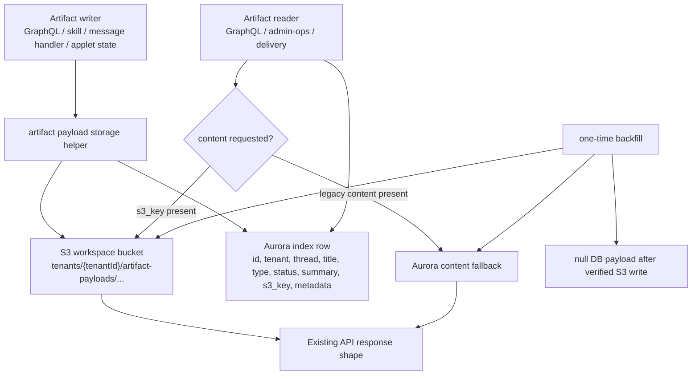

# refactor: Move artifact payloads out of Aurora

## Overview

Move artifact payload bodies out of Aurora and into the existing workspace S3 bucket while keeping Aurora as the searchable artifact index for now. The goal is cleanup and simplification, not a new artifact product model: applets, text/report artifacts, message attachments, and applet state should stop storing user-generated payload bodies in database columns, but existing list/detail/thread surfaces should continue to work through the same GraphQL/API contracts.

This plan intentionally preserves `artifacts` and `message_artifacts` rows as metadata/index rows during this phase. Dropping the tables or replacing all artifact indexing with S3 manifests is deferred until after payload migration is stable.

---

## Problem Frame

ThinkWork currently has a split artifact storage model:

- Generated applets already store source and metadata in S3, but still create an Aurora `artifacts` row for index, provenance, thread linking, and preview metadata.
- Older markdown/report artifacts can store the full payload in `artifacts.content`.
- Legacy message attachments can store payload in `message_artifacts.content`.
- Applet state stores arbitrary user-state payloads inside `artifacts.metadata.value` with `type = applet_state`.

That leaves Aurora carrying blobs it does not need to carry. It also makes the artifact model confusing: some payloads are in S3, some are inline in DB, and some are hidden inside metadata. The desired cleanup is to make S3 the only payload home while retaining Aurora only for queryable identity, ownership, status, summary, pointers, and lightweight metadata.

---

## Requirements Trace

- R1. No newly-created artifact payload body is written to `artifacts.content`, `message_artifacts.content`, or `artifacts.metadata.value`.
- R2. Existing GraphQL/API callers keep their current contracts during rollout; fields such as `Artifact.content` and `MessageArtifact.content` may hydrate from S3.
- R3. Aurora keeps lightweight index rows for artifact list/detail/thread lookup: IDs, tenant/agent/thread/message references, title, type, status, summary, `s3_key`, lightweight metadata, and timestamps.
- R4. S3 keys are tenant-scoped and deterministic enough to debug while preventing cross-tenant reads or writes.
- R5. Existing inline DB payloads are backfilled to S3 and nulled in Aurora only after successful object writes.
- R6. Delivery, admin-ops, Computer artifact list/detail, thread inline cards, and runtime tools continue to work after payload migration.
- R7. Applet source storage remains on the existing applet S3 path; this plan does not re-open the iframe/runtime architecture.

---

## Scope Boundaries

- Do not remove the `artifacts` table in this plan.
- Do not remove the `message_artifacts` table in this plan.
- Do not replace GraphQL artifacts with a new S3 manifest index in this plan.
- Do not change the public shape of `Artifact`, `Applet`, `AppletPayload`, `AppletState`, or `MessageArtifact` unless a nullable additive field is unavoidable.
- Do not migrate message content, memory records, routines, compliance payloads, or wiki pages.
- Do not redesign the Computer Artifacts UI.
- Do not change generated applet execution mode, CSP, iframe substrate, or legacy loader behavior.

### Deferred to Follow-Up Work

- Drop `artifacts.content` and `message_artifacts.content` columns after backfill has run cleanly in production and read paths no longer depend on inline fallback.
- Replace Aurora artifact indexing with S3 manifests/index objects if the product later decides artifacts should be file-primary end to end.
- Add retention/lifecycle policy tuning for artifact payload prefixes if storage volume warrants it.

---

## Context & Research

### Relevant Code and Patterns

- `packages/api/src/lib/applets/storage.ts` already centralizes applet S3 storage and uses `WORKSPACE_BUCKET` as the fallback bucket.
- `packages/api/src/graphql/resolvers/applets/applet.shared.ts` writes applet source/metadata to S3, then writes `artifacts` rows as the index.
- `packages/database-pg/src/schema/artifacts.ts` defines `artifacts.content`, `artifacts.s3_key`, `artifacts.summary`, and `artifacts.metadata`.
- `packages/database-pg/src/schema/messages.ts` defines `message_artifacts.content` and `message_artifacts.s3_key`.
- `packages/api/src/graphql/resolvers/artifacts/*` currently reads/writes artifact rows directly.
- `packages/api/src/handlers/messages.ts` currently creates/lists `message_artifacts` rows directly.
- `packages/skill-catalog/artifacts/scripts/artifacts.py` writes artifact content directly through the RDS Data API.
- `packages/api/src/handlers/artifact-deliver.ts` currently rejects S3-backed artifact content.
- `packages/api/src/graphql/resolvers/threads/types.ts` links assistant messages to durable artifact rows by `source_message_id`.
- `packages/api/src/handlers/chat-agent-invoke.ts` and `packages/api/src/handlers/wakeup-processor.ts` link orphan artifact rows created during a turn.

### Institutional Learnings

- `docs/solutions/workflow-issues/manually-applied-drizzle-migrations-drift-from-dev-2026-04-21.md` is relevant because this work includes persistent data migration/backfill. Any hand-rolled migration/backfill needs explicit drift visibility and should not rely on silent deploy-side assumptions.
- `docs/solutions/best-practices/injected-built-in-tools-are-not-workspace-skills-2026-04-28.md` is relevant because the `artifacts` capability is an injected built-in/tool-like surface. Runtime tool changes must be coordinated with the catalog/default-enabled skill shape rather than treating it as an ordinary workspace file only.

### External References

- AWS documents S3 as strongly consistent for object reads after successful writes, which supports writing a payload object before committing the DB pointer: https://aws.amazon.com/s3/consistency/
- AWS object key docs confirm prefixes are key naming conventions rather than real folders; this plan should treat `tenants/<tenantId>/...` as a key contract enforced in code: https://docs.aws.amazon.com/AmazonS3/latest/userguide/object-keys.html

---

## Key Technical Decisions

- **Keep Aurora as the index for this phase.** This limits blast radius: list, detail, thread inline cards, admin-ops, and existing GraphQL pagination can continue using indexed DB rows while payload bytes move to S3.
- **Create a shared artifact payload storage helper.** Do not duplicate S3 key construction and tenant-prefix validation across GraphQL resolvers, Lambda handlers, and tests.
- **Write S3 first, then DB pointer.** New writes should generate or know the artifact ID, write the payload object, and only then insert/update the row with `s3_key`. Failed S3 writes should not leave DB rows pointing to missing objects.
- **Hydrate existing `content` fields from S3 at read boundaries.** The GraphQL contract can stay stable while the persistence layer changes underneath.
- **Use explicit payload kind paths.** Separate applet source, applet state, durable artifact content, and message attachment payloads in S3 so future cleanup is obvious.
- **Leave nullable DB payload columns in place during rollout.** They serve as backward-compatible fallback during migration and give rollback room. Dropping columns is follow-up work.
- **Keep metadata lightweight.** Metadata may include identity, provenance, runtime mode, hashes, state key references, and display details; it should not include arbitrary user payload bodies.
- **Use `s3_key` as the primary payload pointer when a row has one payload.** For `artifacts.type = 'applet'`, `s3_key` already points at applet source. For markdown/report artifacts, it should point at the content object. For `applet_state`, it should point at the state JSON object. Metadata can describe the pointer, but should not be the only place that carries it.

---

## High-Level Technical Design

> *This illustrates the intended approach and is directional guidance for review, not implementation specification. The implementing agent should treat it as context, not code to reproduce.*

Proposed key families:

- `tenants/<tenantId>/artifact-payloads/artifacts/<artifactId>/content.md`
- `tenants/<tenantId>/artifact-payloads/message-artifacts/<messageArtifactId>/content`
- `tenants/<tenantId>/applets/<appId>/state/<instanceHash>/<keyHash>.json`

The exact state key encoding can be decided during implementation, but it must avoid raw user-controlled path segments.

---

## Implementation Units

- U1. **Add shared artifact payload S3 storage helpers**

**Goal:** Introduce one TypeScript module for artifact payload S3 key generation, tenant-prefix validation, content-type mapping, reads, writes, and optional checksum/hash metadata.

**Requirements:** R1, R3, R4

**Dependencies:** None

**Files:**
- Create: `packages/api/src/lib/artifacts/payload-storage.ts`
- Create: `packages/api/src/__tests__/artifact-payload-storage.test.ts`
- Modify: `packages/api/src/lib/applets/storage.ts` only if a shared lower-level S3 helper can reduce duplication without muddying applet source storage.

**Approach:**
- Follow the validation posture in `packages/api/src/lib/applets/storage.ts`: key builders produce known-good keys, and read/write helpers reject keys outside the tenant artifact prefix.
- Resolve the bucket from `ARTIFACT_PAYLOADS_BUCKET`, then `WORKSPACE_BUCKET`, matching the repo's existing env fallback style.
- Provide separate key builders for durable artifact content, message artifact content, and applet state.
- Treat S3 object keys as flat keys with enforced prefixes, not as trusted folder paths.
- Store text payloads with an explicit content type; JSON state payloads should use `application/json`.

**Patterns to follow:**
- `packages/api/src/lib/applets/storage.ts`
- `packages/api/src/__tests__/applets-storage.test.ts`

**Test scenarios:**
- Happy path: durable artifact key builder returns `tenants/<tenantId>/artifact-payloads/artifacts/<artifactId>/content.md`.
- Happy path: message artifact key builder returns a key under the same tenant-scoped payload prefix.
- Happy path: applet state key builder uses encoded/hash path components, not raw arbitrary `instanceId` or `key`.
- Error path: a key for another tenant is rejected before S3 read/write.
- Error path: keys containing `..`, double slashes, or invalid suffixes are rejected.
- Integration-style unit: write helper sends `PutObjectCommand` with expected bucket, key, body, and content type.
- Integration-style unit: read helper returns object body text and treats empty/missing body as an explicit error.

**Verification:**
- There is exactly one new TypeScript helper module responsible for artifact payload S3 key construction and validation.

---

- U2. **Move GraphQL artifact content writes and reads to S3**

**Goal:** Stop GraphQL `createArtifact` and `updateArtifact` from storing payload bodies in `artifacts.content`, while preserving the existing `Artifact.content` read contract through S3 hydration.

**Requirements:** R1, R2, R3, R4, R6

**Dependencies:** U1

**Files:**
- Modify: `packages/api/src/graphql/resolvers/artifacts/createArtifact.mutation.ts`
- Modify: `packages/api/src/graphql/resolvers/artifacts/updateArtifact.mutation.ts`
- Modify: `packages/api/src/graphql/resolvers/artifacts/artifact.query.ts`
- Modify: `packages/api/src/graphql/resolvers/artifacts/artifacts.query.ts`
- Modify: `packages/api/src/graphql/utils.ts`
- Test: `packages/api/src/__tests__/artifacts-resolvers.test.ts` or create `packages/api/src/__tests__/artifact-payload-resolvers.test.ts`

**Approach:**
- For creates with `input.content`, generate an artifact ID before writing, write content to S3, insert the DB row with `content: null` and `s3_key` set to the payload key.
- For updates with `input.content`, write the new payload to the existing artifact's S3 key or a deterministic replacement key, then update `content: null`, `s3_key`, and `updated_at`.
- Read paths should hydrate `Artifact.content` from S3 when `s3_key` is present. If no `s3_key` exists, fall back to legacy `content` so pre-backfill rows still work.
- List queries should avoid fetching S3 content for every row unless the GraphQL selection truly asks for `content`. If selection inspection is too much for this phase, keep list hydration off and document that list rows are metadata-only as they already are in admin/Computer usage.
- `artifactToCamel` should stay a shape mapper; do not hide async S3 reads inside a generic sync utility.

**Patterns to follow:**
- Existing per-domain GraphQL resolver folder shape in `packages/api/src/graphql/resolvers/artifacts/`.
- `packages/api/src/graphql/resolvers/applets/applet.shared.ts` write-S3-then-insert-row pattern.

**Test scenarios:**
- Happy path: `createArtifact` with content writes one S3 object, inserts row with `content = null`, and returns the same content through resolver hydration.
- Happy path: `createArtifact` without content preserves metadata-only artifact behavior.
- Happy path: `updateArtifact` with new content overwrites/replaces the S3 payload and leaves DB `content = null`.
- Edge case: legacy row with `content` and no `s3_key` still returns content.
- Error path: S3 write failure prevents DB insert/update and returns a resolver error without a dangling row.
- Error path: S3 read failure for a row with `s3_key` surfaces a clear artifact-content-unavailable error on detail reads.
- Regression: artifact list by tenant/thread/agent/type/status still filters using DB indexes and returns metadata fields.

**Verification:**
- New GraphQL artifact writes never store payload bodies in `artifacts.content`.

---

- U3. **Move applet state payloads out of artifact metadata**

**Goal:** Stop storing applet state `value` inside `artifacts.metadata` rows while preserving the `AppletState.value` GraphQL contract.

**Requirements:** R1, R2, R3, R4, R6

**Dependencies:** U1

**Files:**
- Modify: `packages/api/src/graphql/resolvers/applets/applet.shared.ts`
- Modify: `packages/api/src/lib/applets/metadata.ts` if metadata validation currently assumes state payload presence.
- Test: `packages/api/src/__tests__/applets-resolvers.test.ts`
- Test: `apps/computer/src/applets/__tests__/host-applet-api.test.ts` if client assumptions need coverage.

**Approach:**
- `saveAppletState` should write the JSON value to S3 under an applet-state key, store that key in `artifacts.s3_key`, and keep only lightweight state identity metadata in Aurora: app ID, instance ID, key, optional hash/version, schema version, and kind.
- `appletState` should load the row by app ID / instance ID / key, read the state JSON from S3, and return `value` unchanged to callers.
- Existing rows with `metadata.value` should remain readable until backfill runs.
- Avoid raw applet state keys as S3 path segments; use a stable hash or safe encoding to prevent path traversal and object-key weirdness.

**Patterns to follow:**
- `packages/api/src/graphql/resolvers/applets/applet.shared.ts` existing state lookup helpers.
- U1 payload storage helper.

**Test scenarios:**
- Happy path: saving state writes JSON to S3, stores the key in `s3_key`, and stores metadata with no `value`.
- Happy path: reading state returns the original JSON value from S3.
- Happy path: updating existing state writes the new S3 payload and updates `updated_at`.
- Edge case: legacy applet state with `metadata.value` and no payload key still reads correctly.
- Error path: missing applet still returns the existing applet-not-found behavior.
- Error path: S3 read failure returns a service-unavailable style GraphQL error instead of a null value that looks like legitimate saved state.
- Regression: state remains scoped by app ID, instance ID, and key.

**Verification:**
- New `applet_state` rows do not contain arbitrary user state under `metadata.value`.

---

- U4. **Move message artifact payloads to S3**

**Goal:** Stop legacy message artifact endpoints from writing inline payloads to `message_artifacts.content`, while preserving reads for existing callers.

**Requirements:** R1, R2, R3, R4, R6

**Dependencies:** U1

**Files:**
- Modify: `packages/api/src/handlers/messages.ts`
- Modify: `packages/database-pg/graphql/types/messages.graphql` only if nullable documentation comments need clarification; avoid contract changes if possible.
- Test: `packages/api/src/__tests__/messages-artifacts-handler.test.ts` or the nearest existing messages handler test.

**Approach:**
- Generate or retrieve the `message_artifacts.id` before payload write. If Drizzle insert generation makes this awkward, generate the UUID in the handler so the S3 key is deterministic before insert.
- For create requests with `body.content`, write content to S3 and insert row with `content: null` and `s3_key`.
- List/read responses should hydrate `content` from S3 when `s3_key` exists and fall back to legacy inline `content`.
- Preserve existing fields such as `artifact_type`, `mime_type`, `size_bytes`, and `metadata`.

**Patterns to follow:**
- Existing handler style in `packages/api/src/handlers/messages.ts`.
- U1 payload storage helper.

**Test scenarios:**
- Happy path: creating a message artifact with content writes to S3 and stores only `s3_key` in the row.
- Happy path: listing message artifacts hydrates content from S3 for new rows.
- Edge case: legacy rows with inline `content` still list correctly.
- Error path: S3 write failure returns an error and does not create a DB row.
- Error path: creating an artifact for a missing message keeps the existing not-found behavior and does not write S3.

**Verification:**
- New message artifact rows have `content = null` whenever a payload body was provided.

---

- U5. **Update runtime artifact tool and admin/delivery read surfaces**

**Goal:** Ensure all non-GraphQL artifact surfaces respect S3-backed payloads and stop introducing new DB payload writes.

**Requirements:** R1, R2, R5, R6

**Dependencies:** U1, U2

**Files:**
- Modify: `packages/skill-catalog/artifacts/scripts/artifacts.py`
- Modify: `packages/api/src/handlers/artifact-deliver.ts`
- Modify: `packages/api/src/lib/artifact-delivery.ts` only if payload loading moves into a shared function.
- Modify: `packages/admin-ops/src/artifacts.ts` only if field expectations need clarification.
- Test: `packages/agentcore-strands/agent-container/test_server_run_skill.py` or a new focused artifact skill test, depending on existing seams.
- Test: `packages/api/src/__tests__/artifact-deliver.test.ts` or create equivalent coverage.
- Test: `packages/lambda/__tests__/admin-ops-mcp.test.ts` if admin-ops output changes.

**Approach:**
- The Python `create_artifact` skill should generate an artifact ID, write content to S3 via boto3, and insert the Aurora row with `content = null` and `s3_key`.
- The Python `update_artifact` path should write new content to S3 and update `s3_key` / `updated_at` without writing DB content.
- `artifact-deliver` should load content from S3 when `s3_key` is present and fall back to legacy DB content, removing the current "inline delivery not supported yet" failure for S3-backed rows.
- Admin-ops can continue querying GraphQL; if GraphQL detail hydrates content, no admin-ops contract change is required.
- Keep list-style admin responses metadata-first to avoid accidental bulk S3 reads.

**Patterns to follow:**
- Python skill RDS Data API style in `packages/skill-catalog/artifacts/scripts/artifacts.py`.
- Existing AWS SDK usage in `packages/api/src/lib/applets/storage.ts`.

**Test scenarios:**
- Happy path: skill `create_artifact` writes content to S3 and inserts row with `s3_key`.
- Happy path: skill `list_artifacts` remains metadata-only and does not require reading S3.
- Happy path: delivery of an S3-backed markdown artifact renders email/SMS content.
- Edge case: delivery of a legacy inline artifact still works.
- Error path: S3 write failure from the skill returns a clear error and does not insert an index row.
- Error path: S3 read failure during delivery returns a clear 422/5xx style response instead of sending an empty email.

**Verification:**
- Runtime artifact tools and delivery no longer require payload content to live in Aurora.

---

- U6. **Backfill existing DB payloads to S3**

**Goal:** Provide a repeatable, idempotent backfill that copies existing inline artifact payloads to S3, verifies the write, updates pointers, and nulls DB payload columns.

**Requirements:** R1, R3, R4, R5

**Dependencies:** U1, U2, U3, U4

**Files:**
- Create: `packages/api/scripts/backfill-artifact-payloads-to-s3.ts`
- Create: `packages/api/src/__tests__/backfill-artifact-payloads-to-s3.test.ts` if the script is factored into testable helpers.
- Modify: `package.json` or `packages/api/package.json` only if adding a named script is consistent with existing maintenance scripts.
- Create: `docs/solutions/workflow-issues/artifact-payloads-move-to-s3-2026-05-10.md` after execution or as part of the follow-up learning capture.

**Approach:**
- Backfill three payload classes:
  - `artifacts.content` where content is non-null.
  - `message_artifacts.content` where content is non-null.
  - `artifacts.type = 'applet_state'` where `metadata.value` exists.
- Process in small batches by primary key / created time. Each item writes S3, reads or heads the object to verify presence, updates DB pointer/metadata, and nulls the inline payload in the same logical item step.
- Make the script idempotent: rows with existing `s3_key` and null content should be skipped; rows with both legacy content and `s3_key` should verify S3 before nulling content.
- Emit a summary with counts for scanned, skipped, migrated, failed, and legacy-fallback rows.
- Avoid a Drizzle schema drop migration in this plan. Column drops wait until after production verification.

**Patterns to follow:**
- `packages/api/scripts/backfill-materialize-workspaces.ts`
- `scripts/db-migrate-manual.sh` / existing migration drift learning for operational caution.

**Test scenarios:**
- Happy path: artifact content row migrates to S3, sets `s3_key`, nulls `content`.
- Happy path: message artifact content row migrates similarly.
- Happy path: applet state metadata value migrates to S3, `s3_key` points at the state JSON object, and metadata keeps only identity/hash details.
- Edge case: row already migrated is skipped without rewriting.
- Edge case: row has `s3_key` and legacy content; script verifies object then nulls content.
- Error path: S3 write failure leaves DB content intact and increments failed count.
- Error path: DB update failure after S3 write is reported for retry and does not delete payload.

**Verification:**
- Backfill can be run repeatedly without duplicating rows or losing payloads.

---

- U7. **Add rollout guardrails and cleanup documentation**

**Goal:** Make the payload migration observable and leave a clear follow-up path for eventually dropping DB payload columns.

**Requirements:** R5, R6

**Dependencies:** U2, U3, U4, U5, U6

**Files:**
- Modify: `docs/solutions/workflow-issues/artifact-payloads-move-to-s3-2026-05-10.md` if created in U6.
- Modify: `docs/plans/2026-05-10-004-refactor-artifact-payloads-s3-plan.md` only if implementation discovers a material plan correction.
- Create/Modify: an operational runbook under `docs/solutions/` or `docs/runbooks/` if the repo has a stronger convention by implementation time.
- Test: no new feature test expected beyond U1-U6.

**Approach:**
- Document the exact S3 prefixes, DB fields intentionally retained, and DB payload fields intentionally deprecated.
- Record pre/post verification queries for counts of remaining inline payload rows.
- Document rollback posture: reads still fall back to DB content until the later column-drop cleanup, so a failed backfill can be paused without taking the product down.
- Capture a follow-up checklist for dropping columns: all writers stopped, backfill complete, read fallback unused for a defined period, and production verification queries clean.

**Patterns to follow:**
- `docs/solutions/workflow-issues/manually-applied-drizzle-migrations-drift-from-dev-2026-04-21.md`

**Test scenarios:**
- Test expectation: none -- documentation and rollout guardrails only; behavioral coverage lives in U1-U6.

**Verification:**
- Operators can answer "how many inline artifact payloads remain?" and "where does this artifact payload live in S3?" without reading implementation code.

---

## System-Wide Impact

- **Interaction graph:** GraphQL resolvers, REST-ish message handlers, Python skill tools, delivery Lambda, Computer UI artifact reads, and admin-ops all depend on artifact payload availability.
- **Error propagation:** S3 write failures must fail before DB pointer writes. S3 read failures on detail/delivery paths should be explicit; list paths should stay metadata-only where possible.
- **State lifecycle risks:** Partial writes are the main risk. Write ordering and idempotent backfill mitigate dangling DB pointers and lost payloads.
- **API surface parity:** GraphQL, admin-ops MCP, the Python `artifacts` skill, and delivery Lambda all need the same payload-storage semantics.
- **Integration coverage:** Unit tests should cover helpers and resolvers, but at least one deployed-stage smoke after implementation should create an artifact, verify DB content is null, verify S3 object exists, and open/render it through Computer.
- **Unchanged invariants:** Applet source remains stored through the existing applet S3 path. Aurora remains the artifact index. Thread inline cards still derive from `source_message_id` / durable artifact rows.

---

## Risks & Dependencies

| Risk | Mitigation |
|------|------------|
| DB row points at a missing S3 object | Write S3 before DB pointer, verify in backfill, and make read failures explicit. |
| Backfill loses legacy content | Never null DB content until S3 write is verified; keep fallback reads until a later column-drop phase. |
| Bulk artifact lists become slow due to S3 hydration | Keep list responses metadata-only unless content is explicitly needed; hydrate detail/delivery paths. |
| Python runtime skill lacks bucket env or S3 permissions | Verify `WORKSPACE_BUCKET` and IAM access before flipping writes; fail loudly when missing. |
| Applet state path uses unsafe user-controlled keys | Hash or safely encode `instanceId` and state `key`; validate tenant prefix in helper. |
| Two storage helpers drift | Prefer shared TypeScript helper for API paths; keep Python key construction mechanically aligned and covered by tests/docs. |

---

## Documentation / Operational Notes

- This plan should ship behind backward-compatible read fallbacks. No immediate DB column drop.
- After deploy, run the backfill in dev first, then inspect counts of rows with non-null inline payloads before running in production.
- Capture exact verification queries and S3 prefix examples in a solution/runbook doc.
- After a confidence window, create a follow-up cleanup plan to remove deprecated payload columns and legacy fallback paths.

---

## Sources & References

- Related plan: `docs/plans/2026-05-10-002-refactor-computer-artifact-pattern-plan.md`
- Related plan: `docs/plans/2026-05-09-009-refactor-artifacts-datatable-plan.md`
- Related requirements context: `docs/brainstorms/2026-05-09-computer-applets-reframe-requirements.md`
- Related code: `packages/api/src/lib/applets/storage.ts`
- Related code: `packages/api/src/graphql/resolvers/applets/applet.shared.ts`
- Related code: `packages/api/src/graphql/resolvers/artifacts/`
- Related code: `packages/skill-catalog/artifacts/scripts/artifacts.py`
- Related code: `packages/api/src/handlers/messages.ts`
- AWS S3 consistency: https://aws.amazon.com/s3/consistency/
- AWS S3 object keys: https://docs.aws.amazon.com/AmazonS3/latest/userguide/object-keys.html
