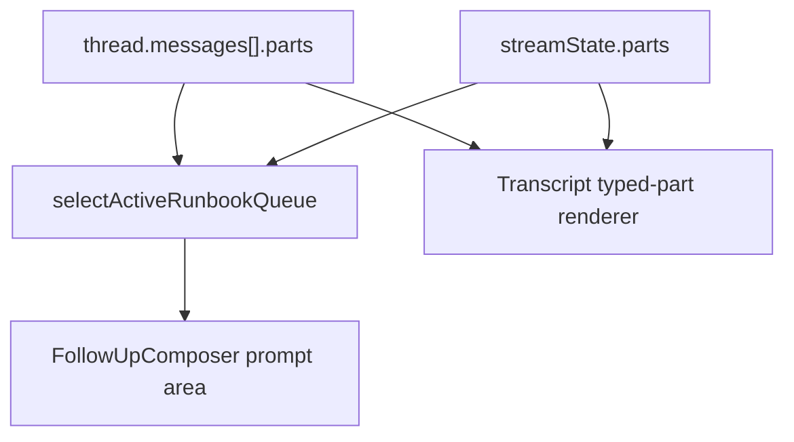

# Runbook Queue Prompt Integration

## Overview

Computer already streams and persists `data-runbook-queue` message parts, and the transcript can render them as AI Elements Queue cards. This plan moves the active runbook queue into the prompt area while a runbook is running, matching the AI Elements "With PromptInput" pattern: the user can see the current task list directly above the input, expand or collapse it, and watch statuses update as new queue data arrives.

---

## Problem Frame

Runbooks are long-running, multi-step Computer work. Showing the queue only as a transcript part makes progress easy to miss once the user scrolls or focuses on follow-up input. The prompt area should become the persistent work cockpit during runbook execution: compact by default, expandable on demand, and driven by the latest queue state from persisted or streaming `data-runbook-queue` parts.

This is a focused follow-up to the foundation plan's U6 Computer UI requirements for visible Queue progress and live runbook state.

---

## Requirements Trace

- R1. Render the active runbook queue directly above the in-thread `PromptInput` while a runbook is awaiting confirmation, queued, running, failed, cancelled, or recently completed.
- R2. Use the existing AI Elements Queue substrate and `RunbookQueue` data shape instead of introducing a parallel task-list component.
- R3. Provide an accessible expand/collapse control for the prompt-area queue.
- R4. Keep prompt-area queue state live as `data-runbook-queue` parts update through persisted messages or the streaming UI message state.
- R5. Preserve transcript rendering of queue parts for reload history and auditability.
- R6. Avoid disruptive layout shifts: the queue should be compact, bounded, and visually part of the composer area.
- R7. Cover active queue extraction, collapse behavior, and live status replacement with focused tests.

**Origin actors:** A1 End user, A2 ThinkWork Computer, A5 Strands runtime, A6 Computer UI.
**Origin flows:** F3 Visible runbook execution, F4 Runbook execution through Strands capabilities.
**Origin acceptance examples:** AE4 phase-to-task mapping and sequential execution, AE5 stable capability mapping.

---

## Scope Boundaries

- This plan does not change runbook routing, confirmation semantics, or runtime execution.
- This plan does not add administrator-authored runbooks.
- This plan does not replace transcript Queue cards; it adds a persistent active-queue projection near the prompt.
- This plan does not require a new GraphQL subscription if existing message/thread update subscriptions already refetch queue-bearing messages.

### Deferred to Follow-Up Work

- End-to-end browser coverage against a deployed runbook execution can follow once the runtime produces real artifact work for every seed runbook.
- Queue actions such as per-task retry, skip, pause, or inspect are intentionally deferred.

---

## Context & Research

### Relevant Code and Patterns

- `apps/computer/src/components/ai-elements/queue.tsx` provides the local Queue primitive.
- `apps/computer/src/components/runbooks/RunbookQueue.tsx` renders `RunbookQueueData` grouped by phase and task.
- `apps/computer/src/components/computer/render-typed-part.tsx` maps `data-runbook-queue` transcript parts to `RunbookQueue`.
- `apps/computer/src/components/computer/TaskThreadView.tsx` owns transcript layout, streaming typed parts, and the in-thread `FollowUpComposer`.
- `apps/computer/src/components/computer/ComputerThreadDetailRoute.tsx` already refetches the thread on message, thread, and turn updates.
- `apps/computer/src/lib/ui-message-merge.ts` replaces same-type/same-id data parts, which is the right mechanism for live queue status replacement.
- `apps/computer/src/lib/graphql-queries.ts` already includes `RunbookRunQuery` and runbook mutations, but the prompt queue can start from message parts before adding another polling surface.

### Institutional Learnings

- `docs/plans/2026-05-10-003-feat-computer-runbooks-foundation-plan.md` establishes `data-runbook-queue` as the UI contract and says raw `computer_events` should not be the UI's source of truth.
- `docs/plans/2026-05-10-002-refactor-computer-artifact-pattern-plan.md` reinforces preserving artifact/runbook boundaries rather than weakening sandbox or runtime responsibilities from UI code.

### External References

- AI Elements Queue docs describe Queue as suitable for workflow progress and show a "With PromptInput" pattern where the queue appears above the input area: https://elements.ai-sdk.dev/components/queue

---

## Key Technical Decisions

- Derive prompt queue data from latest `data-runbook-queue` parts: this reuses the existing stream/persist protocol and avoids adding a second backend status source for this UI slice.
- Prefer newest active queue over historical completed queue: the prompt area should reflect current work, while transcript cards remain the durable history.
- Keep the transcript renderer unchanged: historical queue cards still explain what happened at the message boundary.
- Add compact/collapsible rendering around `RunbookQueue`: `RunbookQueue` remains the canonical visualizer, and the prompt integration controls density and disclosure.
- Treat failed and cancelled runs as active until superseded: users need the status near the input so they can ask Computer to continue, retry, or explain.

---

## Open Questions

### Resolved During Planning

- Should the prompt queue use raw task/event rows? No. The foundation plan explicitly chose Queue-shaped runbook state over raw event interpretation.
- Should the queue replace transcript rendering? No. Prompt rendering is a live projection; transcript rendering preserves history and reload fidelity.

### Deferred to Implementation

- Exact completed-run retention heuristic: implementation may keep the latest completed queue visible only when it is the newest queue-bearing state, or hide it if it causes prompt clutter after another assistant response.

---

## High-Level Technical Design

The selector scans persisted assistant message parts and current streaming parts for `data-runbook-queue`, deduplicates by runbook run id or part id, and returns the newest relevant queue. The composer receives that queue as a prop and renders a collapsible compact `RunbookQueue` above the `PromptInput`.

---

## Implementation Units

- U1. **Active Queue Selection**

**Goal:** Add a reusable selector that extracts the newest prompt-worthy `RunbookQueueData` from persisted and streaming UI message parts.

**Requirements:** R1, R4, R7.

**Dependencies:** None.

**Files:**

- Modify: `apps/computer/src/components/computer/TaskThreadView.tsx`
- Test: `apps/computer/src/components/computer/TaskThreadView.test.tsx`

**Approach:**

- Add helper functions in `TaskThreadView.tsx` near existing message/part normalization helpers.
- Include persisted assistant `message.parts` and current `streamState.parts`.
- Prefer streaming queue data when present because it is the freshest in-flight state.
- Treat statuses such as `awaiting-confirmation`, `queued`, `running`, `failed`, and `cancelled` as prompt-worthy; allow the latest completed queue when it is the most recent runbook queue.
- Keep helper behavior pure and covered through rendered UI tests rather than exporting a new module prematurely.

**Patterns to follow:**

- `normalizePersistedParts` in `apps/computer/src/components/computer/TaskThreadView.tsx`.
- Same-id data replacement behavior in `apps/computer/src/lib/ui-message-merge.test.ts`.

**Test scenarios:**

- Happy path: a thread with a persisted running `data-runbook-queue` renders the prompt-area queue.
- Happy path: a streaming `data-runbook-queue` update replaces an older persisted queued status in the prompt area.
- Edge case: historical completed queue remains in the transcript but does not duplicate into prompt area when superseded by a newer active run.

**Verification:**

- Prompt queue always reflects the freshest runbook queue available to the view.

- U2. **Collapsible Prompt-Area Queue UI**

**Goal:** Render the selected runbook queue above the in-thread `PromptInput` with accessible expand/collapse controls and compact styling.

**Requirements:** R1, R2, R3, R5, R6.

**Dependencies:** U1.

**Files:**

- Modify: `apps/computer/src/components/runbooks/RunbookQueue.tsx`
- Modify: `apps/computer/src/components/computer/TaskThreadView.tsx`
- Test: `apps/computer/src/components/runbooks/RunbookQueue.test.tsx`
- Test: `apps/computer/src/components/computer/TaskThreadView.test.tsx`

**Approach:**

- Extend `RunbookQueue` with optional `compact` and `className` props so the same component works in transcript and prompt contexts.
- Add a small `RunbookPromptQueue` wrapper in `TaskThreadView.tsx` that owns disclosure state, count summary, current status, and the toggle button.
- Render the queue within the existing composer container above `FollowUpComposer`, using bounded max-height and overflow handling so long runbooks do not push the prompt off-screen.
- Default open while running/failed/cancelled so feedback is visible; allow the user to collapse it manually.
- Preserve transcript `RunbookQueue` rendering without compact styles.

**Patterns to follow:**

- `ThinkingRow` disclosure behavior in `apps/computer/src/components/computer/TaskThreadView.tsx`.
- Local Queue component composition in `apps/computer/src/components/runbooks/RunbookQueue.tsx`.

**Test scenarios:**

- Happy path: prompt queue appears above the follow-up input and shows task titles/statuses.
- Edge case: clicking the toggle collapses the task list while keeping a summary row visible.
- Accessibility: toggle has a stable accessible name and `aria-expanded` reflects state.
- Regression: transcript queue still renders for persisted assistant parts.

**Verification:**

- The prompt area matches the AI Elements Queue-with-PromptInput pattern and remains usable on narrow viewports.

- U3. **Live Update and Visual Verification**

**Goal:** Verify the prompt queue updates as runbook task statuses change and does not regress composer behavior.

**Requirements:** R4, R6, R7.

**Dependencies:** U1, U2.

**Files:**

- Modify: `apps/computer/src/components/computer/TaskThreadView.test.tsx`
- Modify: `apps/computer/src/components/computer/ComputerThreadDetailRoute.tsx` only if existing refetch/subscription behavior is insufficient during implementation.

**Approach:**

- Add a test that rerenders `TaskThreadView` with a changed `streamState` or message part and asserts the prompt queue status changes from pending/running to completed/failed.
- Confirm `FollowUpComposer` still submits through the existing `onSendFollowUp` path.
- Use browser verification against the local Computer UI when practical after implementation.

**Patterns to follow:**

- Existing `TaskThreadView` follow-up composer tests.
- `apps/computer/src/lib/use-chat-appsync-transport.test.ts` for typed data part replacement expectations.

**Test scenarios:**

- Happy path: status text updates from `running` to `completed` after rerender with fresher queue data.
- Error path: failed task status appears in the prompt queue and remains visible.
- Regression: follow-up submit still calls `onSendFollowUp` exactly once.

**Verification:**

- Unit tests prove the live projection changes when queue data changes, and local browser inspection confirms the prompt layout is stable.

---

## System-Wide Impact

- **Interaction graph:** `TaskThreadView` gains one more derived projection from existing message/stream parts; backend subscriptions and mutations stay unchanged unless implementation reveals a gap.
- **Error propagation:** Failed runbook/task statuses remain display data; no new error-handling path is introduced.
- **State lifecycle risks:** The selector must avoid resurfacing stale historical queues after a newer runbook starts.
- **API surface parity:** No new GraphQL API is expected for this slice.

---

## Risks & Dependencies

- Queue data freshness depends on existing message/thread/turn subscriptions refetching persisted parts and the AppSync stream emitting replacement `data-runbook-queue` parts.
- Long runbooks can crowd the composer; compact rendering and max-height scrolling are required.
- Completed queues could clutter the prompt area; implementation should prefer active statuses and only show completed when it is the newest relevant work state.

---

## Documentation / Operational Notes

- No public documentation change is required for this UI slice.
- PR notes should call out how operators can manually validate: start a runbook, observe the prompt queue, collapse/expand it, and watch statuses change.

---

## Sources & References

- `docs/plans/2026-05-10-003-feat-computer-runbooks-foundation-plan.md`
- `apps/computer/src/components/ai-elements/queue.tsx`
- `apps/computer/src/components/runbooks/RunbookQueue.tsx`
- `apps/computer/src/components/computer/TaskThreadView.tsx`
- https://elements.ai-sdk.dev/components/queue
