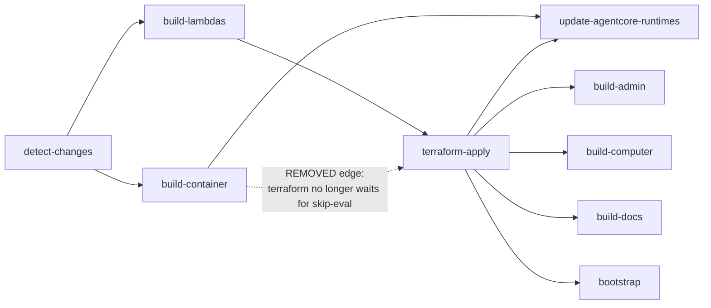

## Summary

Cut a no-source-change push-to-main deploy from ~35 minutes to under ~10 minutes by fixing three concrete problems in `.github/workflows/deploy.yml` and one in `scripts/build-lambdas.sh`, plus moving smoke-test wiring out of the deploy workflow and into a manual/scheduled `verify.yml`. All five fixes were diagnosed and approved against run [25647238301](https://github.com/thinkwork-ai/thinkwork/actions/runs/25647238301).

---

## Problem Frame

On run 25647238301 (push to main, no container source changes), the Deploy workflow's three biggest costs were:

1. **Lambda zip non-determinism (~8m of waste).** `terraform/modules/app/lambda-api/handlers.tf` keys `source_code_hash` on `filebase64sha256("${var.lambda_zips_dir}/${each.key}.zip")`. `scripts/build-lambdas.sh:97` produces those zips with `zip -qr …`, which embeds the current wall-clock mtime into every entry. Even byte-identical bundles produce a different SHA each run → all 89 Lambda handlers show "Modifying" → terraform calls `UpdateFunctionCode` + waits for each. Plan showed `5 to add, 89 to change, 0 to destroy` on a no-op deploy.
2. **20-minute pre-apply gap.** `terraform-apply` declares `needs: [build-lambdas, build-container]`. When `build-container`'s `if:` evaluates to skipped, GitHub Actions still queues a runner for the skip evaluation; in run 25647238301 the gap from `build-lambdas` completion (02:33:55) to `terraform-apply` start (02:53:31) was 19m 36s of pure wait. Terraform doesn't consume any output from `build-container`.
3. **Smoke-job clutter in the deploy workflow.** Four standalone smoke jobs live in `deploy.yml`. Per the current `if:` conditions they are already gated to `github.event_name == 'workflow_dispatch' && inputs.run_smokes == true`, so they don't run on push today — but they pollute the deploy workflow, and the user wants smoke verification to be a deliberate, separately-triggered surface. (Threads named like `Computer deterministic streaming smoke` and `*-runbook smoke` visible in the dev environment come from manual `scripts/smoke/*.mjs` runs, not from CI; `scripts/smoke/computer-runbook-smoke.mjs` is not referenced from any workflow.)

Two smaller, complementary wins also land in this plan:

4. **`terraform-apply` runs on every push regardless of what changed** (`if: always() && !cancelled()`). A docs-only or admin-only PR has no terraform reason to run.
5. **Every apply does a full state refresh** (~693 "Refreshing state…" lines, ~30s) even when no drift is suspected.

### Acceptance criteria

- Two consecutive deploys against an unchanged source tree: the second `terraform apply` shows `Plan: 0 to add, 0 to change, 0 to destroy.` (today shows `89 to change`).
- A docs-only PR on a test branch skips `terraform-apply` while still publishing docs through `build-docs`.
- Push-to-main no longer triggers any of the four standalone smoke jobs (they live in `verify.yml`).
- `verify.yml` is dispatch-only + scheduled nightly; running it manually still exercises the four smokes verbatim.
- Wall-clock on a typical no-source-change push drops from ~35 min to under ~10 min.

---

## Scope Boundaries

### In scope

- `scripts/build-lambdas.sh` — deterministic zip output.
- `.github/workflows/deploy.yml` — drop `build-container` from `terraform-apply.needs`, gate on detect-changes outputs, add `-refresh=false`, remove four smoke jobs, fix downstream `if:` so a skipped `terraform-apply` doesn't cascade-skip publish jobs.
- `.github/workflows/verify.yml` — new file: dispatch + nightly schedule; hosts the four moved smoke jobs and a drift-aware `terraform plan`.

### Out of scope

- Container build parallelization (multi-arch QEMU). Only hurts when container source changes; not in this plan.
- Increasing terraform `-parallelism`. Becomes negligible once Lambda no-ops actually no-op.
- Caching `.terraform/` directory. `terraform init` was 8s on this run.
- Hand-rolled `psql` migration steps in `terraform-apply`. Per `docs/solutions/workflow-issues/manually-applied-drizzle-migrations-drift-from-dev-2026-04-21.md`, they stay where they are.
- `scripts/smoke/computer-runbook-smoke.mjs` wiring. Grep confirms no workflow references it; it stays a manual-only script.

### Deferred to Follow-Up Work

- Smarter "code-only Lambda update" fast path (skip `terraform apply` and call `aws lambda update-function-code` directly when only `packages/api/src/lambdas/*.ts` changed).
- Splitting `build-container` into native amd64 + native arm64 jobs.
- Promoting the nightly drift-check workflow's findings to a Slack/PagerDuty surface.

---

## Key Technical Decisions

**D1. Zip determinism: pre-touch + `zip -X` (not a Python rewrite).** The minimal patch to `scripts/build-lambdas.sh` is to normalize file mtimes before zipping and pass `-X` to strip the extended-attribute/extra-field block. Sort entries deterministically so traversal order does not depend on filesystem inode order. Rationale: smallest diff, no new toolchain dependency, easy to read. A Python `zipfile.ZipInfo` rewrite is the alternative; it's cleaner but ~30 LoC for a single-line problem.

**D2. Drop `build-container` from `terraform-apply.needs` entirely.** The alternative — adding `needs.build-container.result == 'skipped' || …` to the `if:` — does not help. The wait is in GitHub's runner-allocation behavior for the skipped job's evaluation, not in the `if:` expression. Terraform reads runtime image state from SSM/AgentCore data sources, never from `build-container`'s outputs, and the post-terraform `update-agentcore-runtimes` job already gates on both `build-container` and `terraform-apply` succeeding. Safe to remove.

**D3. Smokes extract to a new `verify.yml`, not deleted.** Deletion loses the rare-but-real "verify dev is healthy after a risky change" surface. `verify.yml` triggers on `workflow_dispatch` + nightly `cron`. Each job's body is moved verbatim — same `aws-actions/configure-aws-credentials`, same `pnpm install`, same script invocation. The `needs:` chains that pointed at deploy.yml jobs are dropped (verify.yml runs standalone against the deployed dev stage).

**D4. `terraform apply -refresh=false` on the push path; a separate nightly job in `verify.yml` runs `terraform plan` WITH refresh and writes its diff to `$GITHUB_STEP_SUMMARY`.** Drift detection moves out of the synchronous deploy path. Worst case: out-of-band drift goes unnoticed for up to 24 hours. Acceptable for `dev`; reconsider when prod lands.

**D5. Downstream `if:` audit for the gated terraform-apply (Unit U3).** When `terraform-apply` is skipped because no infra changed, three classes of downstream jobs react differently:

| Downstream job | When terraform-apply is skipped | New `if:` |
|---|---|---|
| `build-admin`, `build-computer`, `build-docs` | should still publish app code to existing S3+CloudFront | `(needs.terraform-apply.result == 'success' \|\| needs.terraform-apply.result == 'skipped')` |
| `update-agentcore-runtimes` | depends on `build-container.result == 'success'`; if container changed but terraform didn't, the existing role+env are fine | `(needs.terraform-apply.result == 'success' \|\| needs.terraform-apply.result == 'skipped') && needs.build-container.result == 'success'` |
| `build-computer-runtime`, `bootstrap`, `compliance-bootstrap` | infra-coupled; safe to skip when terraform skipped | leave as-is (`result == 'success'` already short-circuits cleanly) |
| `summary` | runs `if: always() && !cancelled()` already | no change needed |

This audit happens inside U3 itself, not as a separate unit.

---

## High-Level Technical Design

**`scripts/build-lambdas.sh` zip step (directional sketch, not implementation):**

```text
build_handler():
  ...esbuild → $out_dir/index.mjs...
  ...optionally copy graphql schemas / runbooks into $out_dir...

  # NEW: normalize mtimes + sort entries so the zip is byte-identical
  # when contents are byte-identical
  find $out_dir -exec touch -t 198001010000 {} +
  (cd $out_dir && find . -type f -print0 | LC_ALL=C sort -z | xargs -0 zip -qrX "$DIST/$name.zip" -x '*.map' -x '__MACOSX/*')
```

This illustrates the intended approach and is directional guidance for review, not implementation specification. The `-X` flag strips the OS-specific extra-fields block; the `touch -t 198001010000` normalizes mtimes to 1980-01-01 (zip's epoch). The sort makes entry order independent of filesystem traversal order.

**Workflow dependency reshape:**



The dashed `build-container → terraform-apply` edge is the 20-minute wait we are deleting (Unit U2).

---

## Implementation Units

### U1. Deterministic Lambda zip output

**Goal:** `bash scripts/build-lambdas.sh` produces byte-identical `dist/lambdas/*.zip` artifacts run-to-run when source files are byte-identical, so `source_code_hash` is stable and terraform no-ops unchanged Lambda handlers.

**Dependencies:** none.

**Files:**
- `scripts/build-lambdas.sh` (modify the `build_handler()` function, around line 96-98).

**Approach:**
- Before the `zip` call: normalize mtimes of every file inside `$out_dir` to a fixed timestamp (1980-01-01 works for zip and is the standard reproducible-builds choice).
- Replace `zip -qr "$DIST/$name.zip" . -x '*.map' -x '__MACOSX/*'` with a deterministic invocation that (a) uses `zip -X` to drop the platform-specific extra-fields block, (b) feeds explicitly sorted file names from `find`, (c) keeps the same exclude patterns.
- Do not change esbuild flags. The bundler's output is already deterministic for fixed input + flags.
- Do not change anything in `terraform/modules/app/lambda-api/handlers.tf`. The hash mechanism is already correct; only the zip producer was wrong.

**Patterns to follow:** `scripts/build-lambdas.sh` already wraps the zip step inside a subshell `(cd "$out_dir" && …)`. Preserve that pattern. Match the existing two-space indentation and short echo style.

**Test scenarios:**
- Build twice on a clean tree (`pnpm install`-warm), then `sha256sum dist/lambdas/*.zip > /tmp/r1.txt`; clean; build again; `sha256sum dist/lambdas/*.zip > /tmp/r2.txt`; `diff /tmp/r1.txt /tmp/r2.txt` must exit 0.
- Build, modify a single handler's source file with a no-op whitespace change, rebuild: that handler's zip SHA changes, all others stay identical.
- Build the `graphql-http` handler specifically (it includes copied `.graphql` schema files): the zip is still deterministic across two clean runs.
- Spot-check that `unzip -l dist/lambdas/graphql-http.zip` shows entries in sorted order with the 1980-01-01 timestamp.
- Deploy the resulting zip locally to a sandbox Lambda (or `aws lambda update-function-code` against a scratch dev function) and confirm it imports and executes — no loader regression.

**Verification:** sha256 stability across two consecutive runs; one PR's CI shows `Plan: 0 to add, 0 to change, 0 to destroy.` on a follow-up no-op push.

---

### U2. Drop `build-container` from `terraform-apply.needs`

**Goal:** Eliminate the 20-minute pre-apply wait caused by GitHub Actions queueing a runner to evaluate `build-container`'s skip condition.

**Dependencies:** none (independent of U1, but lands in the same PR).

**Files:**
- `.github/workflows/deploy.yml` (line 441 — `terraform-apply.needs`).

**Approach:**
- Change `needs: [build-lambdas, build-container]` to `needs: [build-lambdas]` on the `terraform-apply` job.
- Keep `update-agentcore-runtimes.needs = [build-container, terraform-apply]` unchanged — that job still requires both to succeed before refreshing AgentCore image pins.
- Verify no terraform variable or step in the `terraform-apply` job consumes `needs.build-container.*` (grep confirms it does not).

**Patterns to follow:** the same workflow already uses focused `needs:` arrays that omit non-output-producing dependencies (e.g., `build-admin.needs = [terraform-apply]` does not list `detect-changes` even though detect-changes runs first).

**Test scenarios:**
- Push a no-source-change commit to a test branch: `terraform-apply` should start within ~2 minutes of `build-lambdas` completing (today: ~20 min wait).
- Push a container source change: `update-agentcore-runtimes` still runs after both `build-container` and `terraform-apply` complete (proves the post-terraform refresh path is intact).
- A run where `build-container` fails: `terraform-apply` still runs (acceptable — it can succeed against the previous image). `update-agentcore-runtimes` skips (cascade-skip from build-container.result != 'success').

**Verification:** the gap between `build-lambdas` completion and `terraform-apply` start in CI run timelines drops from 15-20 min to under 2 min.

---

### U3. Gate `terraform-apply` on actual changes and audit downstream `if:` conditions

**Goal:** Skip `terraform-apply` on docs-only / admin-only / mobile-only / docs+computer pushes, without cascade-skipping the app-publish jobs that should still run.

**Dependencies:** U2 (must drop `build-container` from `needs:` first so the new `if:` expression composes cleanly).

**Files:**
- `.github/workflows/deploy.yml` — `terraform-apply` (`needs:` and `if:`), plus the downstream `if:` audit from D5.

**Approach:**
- Add `detect-changes` to `terraform-apply.needs` (it's transitive via `build-lambdas` today, but `needs.detect-changes.outputs.*` must be in the direct `needs:` to be addressable from the `if:` expression).
- Change `terraform-apply.if` from `always() && !cancelled()` to:
  ```yaml
  if: |
    always() && !cancelled() && (
      needs.detect-changes.outputs.terraform == 'true' ||
      needs.detect-changes.outputs.lambdas == 'true' ||
      needs.build-container.result == 'success'
    )
  ```
  (Note: `needs.build-container.result` is still readable in expressions even though `build-container` is no longer in `terraform-apply.needs`, because GitHub evaluates the full job graph — but to be safe and explicit, treat `build-container` as out of `needs:`; if a reachable expression requires it, restore it as a `needs:` entry only for the gating check and document why.)
- Audit and update downstream `if:` per D5's table. The three publish jobs (`build-admin`, `build-computer`, `build-docs`) must tolerate `terraform-apply.result == 'skipped'` — they only need the deployed infra to exist, which it does on every push after the first.

**Patterns to follow:** the existing workflow already uses `needs.<job>.result == 'success'` gating extensively. The new pattern `(success || skipped)` is the standard GitHub Actions idiom for "ran or wasn't needed."

**Test scenarios:**
- Push a docs-only change: `terraform-apply` skips; `build-docs` runs and publishes; `summary` succeeds.
- Push an admin-only change: `terraform-apply` skips; `build-admin` runs and publishes.
- Push a Terraform-only change (e.g., new IAM policy): `terraform-apply` runs; everything downstream behaves normally.
- Push a Lambda code change: `terraform-apply` runs; the changed Lambda updates; the other 88 no-op (this depends on U1).
- Push a container source change: `build-container` runs; `terraform-apply` runs (because `build-container.result == 'success'`); `update-agentcore-runtimes` runs after both.

**Verification:** a test branch with a docs-only diff completes the full workflow without any `terraform apply` step running, while `build-docs` still publishes.

---

### U4. `terraform apply -refresh=false` on the push path

**Goal:** Skip the ~30s of "Refreshing state…" chatter that the push-time apply does not need.

**Dependencies:** none.

**Files:**
- `.github/workflows/deploy.yml` (the `Terraform Apply` step, around lines 545-569).

**Approach:**
- Append ` -refresh=false` to the `terraform apply -auto-approve …` command.
- Add a short comment in the workflow explaining that refresh moves to the nightly `verify.yml` drift-check.

**Patterns to follow:** existing workflow comments use `#` blocks above the step explaining trade-offs (e.g., the build-lambdas "always build" comment at deploy.yml:135).

**Test scenarios:**
- A push run where Terraform plan is `0 to change`: the apply step completes in well under 1 minute. The "Refreshing state…" lines do not appear.
- A push run that does change one resource: plan + apply still shows the change correctly. `-refresh=false` does not break planning of in-state diffs.
- A test run with deliberate out-of-band drift (manually edit a Lambda environment variable in the AWS console): the push-time apply does NOT detect or correct it (expected — that's now the nightly drift-check's job).

**Verification:** apply step duration drops by ~30s on a no-change push; the nightly drift-check (created in U5) catches drift within 24h.

---

### U5. Create `.github/workflows/verify.yml` with the four smoke jobs and a nightly drift-check

**Goal:** Provide a manual + scheduled surface for the four smoke jobs and a daily `terraform plan --refresh` drift-check, separate from the push-triggered Deploy workflow.

**Dependencies:** none for creation. U6 (the deletion from deploy.yml) must land in the same PR as U5 to avoid the smokes running in both workflows.

**Files:**
- `.github/workflows/verify.yml` (new).

**Approach:**
- Triggers: `workflow_dispatch:` (with the same `run_smokes` boolean input the deploy workflow used, for consistency) and `schedule: cron: '0 6 * * *'` (06:00 UTC nightly).
- Top-level `env:` carries `AWS_REGION: us-east-1`, `STAGE: dev` to match deploy.yml.
- Four smoke jobs moved verbatim from deploy.yml lines 714-880: `flue-smoke-test`, `computer-thread-streaming-smoke`, `compliance-anchor-smoke`, `compliance-export-runner-smoke`. Each retains its `timeout-minutes`, its `aws-actions/configure-aws-credentials@v4`, its pnpm setup, its `pnpm install --frozen-lockfile`, and its single `bash scripts/post-deploy-smoke-*.sh` step.
- Drop each smoke's existing `needs: […]` chains (they pointed at deploy.yml jobs that don't exist in verify.yml). Replace with `needs: []` (run independently against the already-deployed dev stage).
- Drop the `github.event_name == 'workflow_dispatch' && inputs.run_smokes == true` gate from individual smoke `if:` blocks (the entire workflow is dispatch/scheduled, so the gate is redundant). Keep the wrapper-script stage check intact (`scripts/post-deploy-smoke-flue.sh` already refuses non-dev STAGE unless explicit overrides are set — see deploy.yml:716-725 comment).
- Add a fifth job `drift-check`: runs only on the schedule (`if: github.event_name == 'schedule'`), does `terraform init` + `terraform plan -refresh=true -detailed-exitcode -out=tfplan` from `terraform/examples/greenfield/`, captures exit code 2 (drift detected) and writes a summary to `$GITHUB_STEP_SUMMARY`. No apply. Exit 0 even on drift so the workflow doesn't go red on benign noise.

**Patterns to follow:**
- Job structure mirrors the existing smoke jobs in deploy.yml — same indentation, same env exports.
- For the drift-check, mirror the `Terraform Init` step in deploy.yml:458-462 (same working directory, same workspace select pattern).
- Use `${{ secrets.* }}` for credentials the same way deploy.yml does.

**Test scenarios:**
- `gh workflow run verify.yml --field run_smokes=true`: the four smoke jobs run in parallel, succeed, and the `drift-check` job is skipped (`github.event_name == 'workflow_dispatch'`, not `schedule`).
- `gh workflow run verify.yml` (no `run_smokes`): smokes are dispatched but their wrapper scripts no-op gracefully OR all smokes are gated to require `run_smokes=true` — pick one shape consistent with the current behavior in deploy.yml (today they require the input).
- Wait for the nightly cron to fire (or trigger via `workflow_dispatch` and temporarily relax the `if: schedule` check): the `drift-check` job runs `terraform plan -refresh=true`, exits 0, and writes a summary block.
- Inject manual drift in AWS console (toggle a Lambda env var), wait for nightly drift-check: the summary block lists the diff.

**Verification:** `gh workflow view verify.yml` shows the workflow; manual dispatch with `run_smokes=true` runs the four smokes against dev and they pass; the nightly schedule fires the drift-check and produces a `$GITHUB_STEP_SUMMARY` whether or not drift is found.

---

### U6. Remove the four smoke jobs from `deploy.yml`; clean up `summary.needs[]`

**Goal:** Deploy workflow stops mentioning smoke jobs; CI graph on push is leaner.

**Dependencies:** U5 (verify.yml must exist first so the smokes have a home).

**Files:**
- `.github/workflows/deploy.yml` (delete lines ~714-880; update `summary.needs[]` at lines 1196-1209).

**Approach:**
- Delete the four jobs verbatim (`flue-smoke-test`, `computer-thread-streaming-smoke`, `compliance-anchor-smoke`, `compliance-export-runner-smoke`) and the comment blocks immediately above each that only describe those jobs.
- Update `summary.needs[…]` to remove `computer-thread-streaming-smoke` (the only smoke listed there today).
- Leave the `Fat-folder composed-tree smoke` step inside the `summary` job alone — it doesn't create dev threads, runs in ~10s, is already gated to `workflow_dispatch && inputs.run_smokes == true`, and serves as a deploy gate. Do not remove.
- Do not touch the `inputs.run_smokes` definition at the top of deploy.yml if present; `verify.yml` will introduce its own copy. If `run_smokes` is unreferenced after deletion, optionally remove it.

**Patterns to follow:** existing workflow comments use `# ── Section ──────` separator lines; keep them where they delineate non-smoke sections (e.g., the AgentCore refresh section header at deploy.yml:571).

**Test scenarios:**
- `gh workflow view deploy.yml` after merge: no smoke jobs listed.
- A push run: `summary` completes successfully without any smoke jobs in its `needs:` graph.
- A `workflow_dispatch` of `deploy.yml` with `run_smokes=true`: no smokes run (they live in `verify.yml` now); manually dispatch `verify.yml` to run them.
- Grep `.github/workflows/deploy.yml` for `smoke` shows only the `Fat-folder composed-tree smoke` step inside `summary`.

**Verification:** the next deploy run after merge has fewer jobs in the CI graph and shows zero smoke job executions on push.

---

## System-Wide Impact

- **Operators (deploy workflow consumers):** push-time CI runs faster and produces fewer dev threads. Manual verification of dev is a separate one-click action (`gh workflow run verify.yml -f run_smokes=true`).
- **Drift detection:** moves from synchronous (on every push) to once-daily (the nightly `verify.yml drift-check`). Worst-case detection lag goes from "next push" to "next morning." Acceptable for `dev`; revisit when `prod` lands.
- **Lambda deploys:** post-fix, only Lambda handlers whose source actually changed will redeploy on a given push. This is the intended Terraform behavior; we are restoring it, not introducing it.
- **The four smoke scripts themselves** are not modified. They continue to live in `scripts/post-deploy-smoke-*.sh` and `scripts/smoke-computer.sh`. `scripts/smoke/computer-runbook-smoke.mjs` remains a manual-only script (not wired into either workflow).

---

## Risks and Mitigations

| # | Risk | Likelihood | Impact | Mitigation |
|---|---|---|---|---|
| R1 | Deterministic zip change breaks the Lambda runtime loader (mtimes too old, file order changes a parser, etc.) | Low | High (every Lambda fails to deploy) | Test scenarios in U1 include a real `aws lambda update-function-code` invocation against a scratch dev Lambda before merging. Roll back the script change if anything fails. |
| R2 | Downstream `if:` audit misses a publish job → docs-only PR silently fails to publish | Medium | Medium | U3 enumerates the audit explicitly (D5 table). A test branch with a docs-only diff is required before merge. |
| R3 | `-refresh=false` masks meaningful drift between pushes | Low | Medium | U5's nightly drift-check is the safety net. If drift bites in practice, raise refresh cadence or promote drift-check to fail the workflow on detection. |
| R4 | Removing `build-container` from `terraform-apply.needs` lets a stale container image stay pinned while a fresh image was supposed to land | Low | Low | `update-agentcore-runtimes` still gates on both jobs succeeding; the AgentCore image refresh path is unchanged. The race only matters for the *Lambda* image (the amd64 tag), and that's handled in `build-container`'s own `aws lambda update-function-code` steps which run before terraform-apply in time order. |
| R5 | `verify.yml` nightly cron creates a new noisy notification surface | Low | Low | Make the drift-check exit 0 always (only write summary, never fail). Smokes only run on dispatch, not schedule. |

---

## Verification Strategy

1. **Local zip determinism check** (U1): two consecutive clean builds of `scripts/build-lambdas.sh`; `sha256sum dist/lambdas/*.zip` must match byte-for-byte.
2. **CI dry run on a test branch:** push a docs-only commit. Confirm `terraform-apply` skips, `build-docs` runs, no smokes run, summary succeeds.
3. **CI second push to a test branch with no source changes:** terraform plan shows `0 to change`.
4. **`verify.yml` dispatch:** `gh workflow run verify.yml -f run_smokes=true` runs all four smokes against dev; they pass.
5. **Nightly drift-check:** wait for or simulate the scheduled run; confirm it produces a `$GITHUB_STEP_SUMMARY` block and exits 0.
6. **Wall-clock target:** the next deploy run after merge, on a small (single-Lambda or docs-only) PR, completes in under 10 minutes end-to-end.

---

## Open Questions

- **Should `verify.yml`'s smokes drop the existing `inputs.run_smokes == true` gate**, given the entire workflow is now dispatch-only? Tentative answer in U5: yes, drop it inside `verify.yml` — the input is what `deploy.yml` used to disambiguate "I dispatched the deploy workflow but I want smokes too." With smokes in their own workflow, dispatching the workflow already signals intent.
- **Does `summary.needs[…]` reference any other job that's leaving with the smokes?** Grep confirms only `computer-thread-streaming-smoke` is in summary.needs[]. The other three smokes are referenced nowhere downstream.
- **Is `inputs.run_smokes` declared anywhere in `deploy.yml`'s top-level `on.workflow_dispatch.inputs`?** Read of lines 1-22 shows only `skip_container`; `run_smokes` is referenced but possibly undeclared. If undeclared, the existing `inputs.run_smokes == true` checks always evaluate false — which would explain why CI smokes don't actually run today on push. U6 removes those references; U5's new `verify.yml` should declare `run_smokes` in its own `on.workflow_dispatch.inputs` if it keeps the gate.

These are minor wiring questions that resolve inside the implementing PR. None block the plan.
