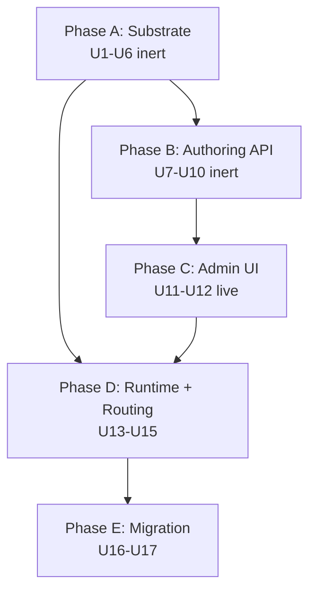

# feat: Tenant-authored, template-assigned Computer Runbooks

## Overview

Reshape the in-flight Computer Runbooks feature so tenants author runbooks through the admin UI, activate them per Computer template, and execute them under a `capability_roles` allowlist enforced inside Strands. Definition content stores as structured frontmatter (in `tenant_runbook_catalog`) plus per-phase markdown bodies in tenant S3. Field-level pin/live governance separates safety-critical fields from operator-self-service prose. The plan reuses the merged DB schema and the merged `RunbookConfirmation` / `RunbookQueue` React components; only the data sources and routing semantics change.

The work ships in five phases — substrate (inert), authoring API (inert), admin UI (live), runtime + routing (flips live with AgentCore reconciler propagation), and migration — using the inert-first seam-swap pattern proven in this repo (`docs/solutions/architecture-patterns/inert-first-seam-swap-multi-pr-pattern-2026-05-08.md`).

---

## Problem Frame

Runbooks shipped partway: the DB tables (`tenant_runbook_catalog`, `computer_runbook_runs`, `computer_runbook_tasks`), the `RunbookConfirmation` / `RunbookQueue` UI components, and three packaged YAML+Markdown runbooks at `packages/runbooks/runbooks/` are merged. Two product assumptions in the earlier scope no longer match intent (see origin: `docs/brainstorms/2026-05-11-computer-runbooks-tenant-authored-template-assigned-requirements.md`): runbook authorship needs to be a tenant-facing primary flow (engineering teams author their own; sales authors theirs), and outputs need to be flexible (Linear issue, PR, prose, app artifact) rather than artifact-mandatory. The plan reshapes the in-flight implementation around those two shifts without rewriting what already lands cleanly.

Additionally, the S3-event orchestration substrate from `docs/brainstorms/2026-04-25-s3-event-driven-agent-orchestration-requirements.md` is being deprecated, so runbook execution lifecycle stays inside DB-backed state with the existing schema rather than acquiring a folder-event dependency.

---

## Requirements Trace

- R1. Tenant authorship via admin UI; platform-published runbooks become starter content seeded into the tenant catalog
- R2. Tenant-scope storage as structured frontmatter + per-phase markdown
- R3. Frontmatter is a typed schema; per-phase content is freeform agent-facing markdown
- R4. Saving rebuilds the `tenant_runbook_catalog` index synchronously
- R5. Admin UI = structured form + per-phase markdown editor (no separate skills tab, no drag-drop builder)
- R6. `packages/runbooks/` repositioned as seed source
- R7. Runbook visible to a Computer iff template has an enabled assignment row
- R8. Computer templates equal `agent_templates`; M:N assignment with per-assignment `enabled` boolean
- R9. Disabling an assignment removes routing on next turn; in-flight runs continue on snapshot
- R10. Template-assignment gate applies to auto-selection AND explicit invocation
- R11. Auto-selected runbooks require Confirmation
- R12. Explicit invocation skips Confirmation but respects R10
- R13. No-match fallback to visible ad hoc task plan
- R14. Rejected runs / template-gate-blocked invocations audited
- R15. Sequential v1 execution via the existing schema; dependency fields preserved
- R16. Strands compiles phase guidance into its primitives; authors declare capability_roles
- R17. capability_roles is an execution-time skill/tool allowlist
- R18. `definition_snapshot` captures runbook content at execution start; immutable
- R19. Pin-class fields require elevated role + change-history record
- R20. Admin UI surfaces field class with governance affordance

**Origin actors:** A1 Tenant operator, A2 Elevated tenant role, A3 End user, A4 Computer runtime (Strands), A5 Admin UI, A6 ThinkWork platform.

**Origin flows:** F1 Author a tenant runbook, F2 Assign to Computer templates, F3 Auto-selected runbook with Confirmation, F4 Explicit invocation, F5 Run execution with audit.

**Origin acceptance examples:** AE1 template-segmentation gate, AE2 rejected-run audit, AE3 explicit invocation skips Confirmation, AE4 no-match ad hoc fallback, AE5 capability_roles allowlist + immutable snapshot, AE6 disable-assignment routing removal, AE7 elevated-role field guard, AE8 seed-on-tenant-create.

---

## Scope Boundaries

- SOC2-grade audit pipeline (`compliance.audit_events`) — lightweight `tenant_runbook_catalog_events` modeled on `tenant_policy_events` is the v1 audit substrate
- New top-level admin nav entry — runbook list lives under existing Capabilities navigation
- Parallel / state-machine / DAG phase execution — sequential v1; `computer_runbook_tasks.depends_on` field preserved for forward compatibility
- Per-tenant capability_roles registry — registry stays in platform code; tenants declare from the fixed set
- Visual workflow builder, version-history viewer UI, marketplace, cross-tenant publishing
- Rewriting the merged `apps/computer/src/components/runbooks/RunbookConfirmation.tsx` or `RunbookQueue.tsx` beyond data-source updates and the cancel affordance in U16
- Removing `packages/runbooks/` — kept as the seed-starter source; role changes from authoritative to bootstrap content
- Tenant-authored capability roles or runtime adapters — capability_roles is a platform-defined enum in v1
- A new template entity distinct from `agent_templates` — Computer templates equal agent templates in v1; no new entity
- S3-event-driven runbook execution — the substrate is being deprecated; runbook lifecycle stays DB-backed with no folder-event coupling

### Deferred to Follow-Up Work

- SOC2-grade compliance pipeline for runbook authoring + execution events
- Per-tenant capability_roles registry extension
- Run-history export (CSV/JSON)
- `definition_snapshot` diff viewer in run history
- Parallel / state-machine phase execution adapter
- Marketplace / cross-tenant runbook sharing

---

## Context & Research

### Relevant Code and Patterns

- `packages/database-pg/src/schema/runbooks.ts` — already-shipped DB schema for catalog/runs/tasks. Reused as-is; this plan extends with one new M:N table, one audit-event table, and a partial unique index for per-Computer concurrency.
- `packages/database-pg/src/schema/mcp-servers.ts` (`agent_template_mcp_servers`, L130-159) — exact precedent for the new `agent_template_runbook_assignments` M:N table: surrogate `uuid id` PK, `tenant_id` repeated for tenant isolation, `enabled boolean NOT NULL DEFAULT true`, `config jsonb` for per-binding overrides, `uniqueIndex` on the FK pair.
- `packages/database-pg/src/schema/tenant-policy-events.ts` — append-only audit precedent (`before_value` / `after_value` text + `actor_user_id` + `event_type` CHECK, indexed `(tenant_id, created_at)`). The shape this plan adopts for `tenant_runbook_catalog_events`.
- `packages/database-pg/drizzle/0083_computer_runbooks.sql` — hand-rolled SQL with `-- creates:` markers for the existing runbook tables. New tables that need CHECK constraints or partial unique indexes follow the same hand-rolled convention; the simple M:N table can be generated via Drizzle (`agent_template_mcp_servers` is generated Drizzle).
- `packages/database-pg/graphql/types/runbooks.graphql` — existing runbook GraphQL types + `confirmRunbookRun` / `rejectRunbookRun` / `cancelRunbookRun` mutations. New mutations extend this file; `pnpm schema:build` regenerates the AppSync subscription mirror.
- `packages/api/src/lib/runbooks/{catalog,runs,tasks,router,confirmation-message,runtime-api}.ts` — existing library layer. New authoring + assignment logic adds `catalog-indexer.ts`, `authoring.ts`, `assignments.ts`, `audit.ts`. State-machine enforcement extends `runs.ts`.
- `packages/api/src/graphql/resolvers/runbooks/confirmRunbookRun.mutation.ts` — template for new authoring/assignment resolvers (imports lib function, wraps in `RunbookRunTransitionError`, calls `requireRunbookRunAccess` + `resolveRunbookCaller` from `shared.ts`).
- `packages/api/src/handlers/skills.ts` (`tenantSkillsPrefix` at L1146, `saveTenantFile` at L1453) — the existing tenant-scoped file Lambda. The new `runbook-files.ts` Lambda mirrors this exactly, keyed at `tenants/{tenantSlug}/runbooks/{slug}/...`.
- `packages/runbooks/src/loader.ts` — existing YAML+Markdown loader. Extended to read tenant S3 first, packaged starter as fallback.
- `packages/agentcore-strands/agent-container/container-sources/skill_runner.py` (`register_skill_tools` L80-194) — capability_roles enforcement seam. The `skills_config` filter inserts here, before tool registration.
- `packages/agentcore-strands/agent-container/container-sources/server.py` (`skills_config` unpack L2364, `register_skill_tools` call L1491, `runbook_context` injection L2376) — payload passthrough for `capability_roles`. Both `apply_invocation_env` (subset-dict) and `_call_strands_agent` must be updated together per `docs/solutions/patterns/apply-invocation-env-field-passthrough-2026-04-24.md`.
- `packages/api/src/handlers/chat-agent-invoke.ts` (skills payload L566) — extends `skills_config` shape to carry `capability_roles` from the run's `definition_snapshot`.
- `apps/admin/src/components/agent-builder/{WorkspaceEditor,FileEditorPane,FolderTree,RoutingTableEditor}.tsx` and the agent-template route `apps/admin/src/routes/_authed/_tenant/agent-templates/$templateId.$tab.tsx` — admin authoring precedent. The runbook editor mirrors the route shape (`/runbooks/$slug/$tab`) and the WorkspaceEditor composition.
- `apps/admin/src/routes/_authed/_tenant/capabilities/skills/{$slug,builder}.tsx` and `apps/admin/src/lib/skills-api.ts` — closer file-tree-with-CodeMirror precedent for tenant runbook phase editing.
- `apps/computer/src/components/runbooks/{RunbookConfirmation,RunbookQueue}.tsx` — already merged; only data-source updates and a cancel affordance change.
- `packages/api/src/lib/computers/thread-cutover.ts` — Computer routing entry point; this plan extends it to consult assigned runbooks for the Computer's template before the default `thread_turn`.
- `scripts/build-lambdas.sh` (L88-93) — the existing special-case that copies `packages/runbooks/runbooks/.` into the graphql-http Lambda zip. The new `runbook-files` Lambda gets its own entry; runbook YAML/MD bundling is preserved.
- `terraform/modules/app/lambda-api/handlers.tf` — Lambda handler definitions; new `runbook-files` handler entry lands here alongside the existing skill-files entry.

### Institutional Learnings (docs/solutions/)

- `workflow-issues/manually-applied-drizzle-migrations-drift-from-dev-2026-04-21.md` — hand-rolled SQL needs `-- creates:` markers AND `psql -f` apply to dev before merge; deploy drift gate fails otherwise.
- `patterns/apply-invocation-env-field-passthrough-2026-04-24.md` — new `capability_roles` field in `skills_config` must be added to both `apply_invocation_env` AND `_call_strands_agent` subset-dicts or it silently drops.
- `workflow-issues/agentcore-completion-callback-env-shadowing-2026-04-25.md` — snapshot `THINKWORK_API_URL` + `API_AUTH_SECRET` at coroutine entry; never re-read `os.environ` after the agent turn.
- `workflow-issues/agentcore-runtime-no-auto-repull-requires-explicit-update-2026-04-24.md` — Strands container changes for `capability_roles` enforcement won't be live just because ECR pushed; verify `lastUpdatedAt` moves on `get-agent-runtime`; 15-min reconciler is the only DEFAULT-endpoint flush.
- `architecture-patterns/inert-first-seam-swap-multi-pr-pattern-2026-05-08.md` — substrate inert before routing flips live; each PR independently revert-safe.
- `best-practices/every-admin-mutation-requires-requiretenantadmin-2026-04-22.md` — every authoring/assignment mutation gates on `requireTenantAdmin(ctx)` + `resolveCallerTenantId(ctx)`.
- `architecture-patterns/workspace-skills-load-from-copied-agent-workspace-2026-04-28.md` — keep filesystem-as-truth for activation where possible; runbook activation is the deliberate exception (template-assignment-as-truth) because team segmentation can't be expressed by file presence.
- `design-patterns/audit-existing-ui-and-data-model-before-parallel-build-2026-04-28.md` — verified: no existing list/edit surface for `tenant_runbook_catalog` in the admin SPA; building new under Capabilities is correct.
- `workflow-issues/agent-builder-smoke-cleanup-needs-manifest-regeneration-2026-04-26.md` — runbook file edits must flow through the runbook-files Lambda so the manifest stays in sync; never bypass with direct S3 ops.
- `best-practices/service-endpoint-vs-widening-resolvecaller-auth-2026-04-21.md` — the Computer routing layer's auto-selection that creates `awaiting_confirmation` runs uses the existing `API_AUTH_SECRET` service path; do not widen `resolveCaller` to impersonate the user.
- `feedback_lambda_zip_build_entry_required` (memory) — `runbook-files` Lambda needs both `terraform/.../handlers.tf` AND `scripts/build-lambdas.sh` entries in the same PR.
- `feedback_graphql_deploy_via_pr` (memory) — GraphQL Lambda updates ride the merge pipeline; no `aws lambda update-function-code` direct edits.
- `feedback_handrolled_migrations_apply_to_dev` (memory) — author must `psql -f` to dev before merge or deploy drift gate fails.
- `feedback_avoid_fire_and_forget_lambda_invokes` (memory) — confirmation timeout cleanup uses `RequestResponse` invocation with surfaced errors, not fire-and-forget.

### Flow Analyzer Findings — Resolved as Plan Decisions

- **State-machine transitions** [P0] — resolved by U9 (legal transition table + DB CHECK + idempotency on approve/reject).
- **Per-Computer concurrency** [P0] — resolved by U2 (partial unique index `(computer_id) WHERE status IN active_set`).
- **Mid-run phase failure** [P0] — resolved by U9 (failure halts run with `status=failed`; no retry in v1).
- **Cross-tenant authorization** [P0] — resolved by U7/U8 (every mutation pins via `resolveCallerTenantId` + `requireTenantAdmin`).
- **Confirmation race (approve+reject)** [P0] — resolved by U9 (idempotency check on `(run_id, decision)` composite key; second decision returns the first's result).
- **Snapshot timing** [P1] — resolved by U9 (snapshot at claim, not at awaiting_confirmation creation; mid-window edits surface a "definition changed" notice to the user).
- **Disable-mid-routing** [P1] — resolved by U15 (router consults current assignment at run-start; in-flight runs continue on snapshot).
- **Confirmation card stale across sessions** [P1] — resolved by U12/U16 (Confirmation card subscribes to run-status via existing subscription mirror; terminal-state card switches to summary view).
- **Seed reconciliation** [P1] — resolved by U10 (idempotent; tenant edits preserved; slug collision on update surfaces a "starter update available" notice).
- **Explicit-invocation gate audit row class** [P1] — resolved by U9/U11 (template-gate blocks audit as a new `RUNBOOK_RUN_STATUSES` value `blocked` on the same row, not a separate table).
- **Elevated-role server-side validation** [P1] — resolved by U7/U8 (every pin-class mutation re-validates the role server-side; UI affordance is advisory only).
- **`ad_hoc` invocation mode** [P1] — resolved by U15 (used when no runbook confidently matches; an audit row records the visible plan even when no runbook fires).

---

## High-Level Technical Design

> *This illustrates the intended approach and is directional guidance for review, not implementation specification. The implementing agent should treat it as context, not code to reproduce.*

### Storage layout (hybrid: structured index + S3 bodies)

```
Aurora                                  S3 (WORKSPACE_BUCKET)
─────────────────────────────────       ─────────────────────────────────────────────
tenant_runbook_catalog                  tenants/{tenantSlug}/runbooks/{runbookSlug}/
  (slug, display_name, category,           runbook.yaml         (frontmatter source)
   definition jsonb [snapshot],             phases/{phaseId}.md  (per-phase markdown)
   source_kind, enabled, ...)
       │
       │ M:N (NEW: agent_template_runbook_assignments)
       ▼
agent_templates
       │
       │ FK (computers.template_id)
       ▼
computers / computer_runbook_runs / computer_runbook_tasks
                                        (definition_snapshot at claim time)
tenant_runbook_catalog_events
  (append-only pin-class edit log)
```

### Runbook run state machine

```mermaid
stateDiagram-v2
    [*] --> awaiting_confirmation: auto-select
    [*] --> queued: explicit invoke (assigned)
    [*] --> blocked: explicit invoke (unassigned)
    awaiting_confirmation --> queued: user approve
    awaiting_confirmation --> rejected: user reject
    awaiting_confirmation --> cancelled: 24h timeout / thread close
    queued --> running: runtime claim (+ snapshot)
    queued --> cancelled: user cancel
    running --> completed: all phases succeed
    running --> failed: phase failure (halt; no retry v1)
    running --> cancelled: user cancel mid-run
    completed --> [*]
    failed --> [*]
    rejected --> [*]
    cancelled --> [*]
    blocked --> [*]
```



Legal transitions are codified in `packages/api/src/lib/runbooks/runs.ts` and enforced both at application layer and by a DB CHECK on (current_status → new_status). Terminal states (`completed`, `failed`, `rejected`, `cancelled`, `blocked`) are immutable. Per-Computer concurrency: at most one row in `awaiting_confirmation | queued | running` per `computer_id`, enforced by a partial unique index.

### Phase sequencing (inert-first multi-PR)



Phase A and B may land in any order relative to each other; A is a prerequisite for D (schema), and B is a prerequisite for C (mutations). D requires the AgentCore reconciler delay (≤15 min) after U14 deploys before routing can flip.

### Pin-class vs live-class field policy

| Class | Fields | Edit gate | Audit |
|---|---|---|---|
| Pin | `capability_roles`, `triggers`, `auto_select_threshold`, template assignments | Elevated role server-side check | Row in `tenant_runbook_catalog_events` |
| Live | `display_name`, `description`, `category`, `confirmation copy`, per-phase markdown | Tenant admin role | No audit row (manifest version captures change) |

---

## Output Structure

New files (additions only; existing files modified in place):

```text
packages/database-pg/
  src/schema/
    runbook-assignments.ts                          (new)
    runbook-audit-events.ts                         (new)
  drizzle/
    NNNN_agent_template_runbook_assignments.sql     (new, drizzle-generated)
    NNNN_runbook_audit_events.sql                   (new, hand-rolled)
    NNNN_runbook_run_concurrency.sql                (new, hand-rolled)
  graphql/types/
    runbooks.graphql                                (extended)

packages/api/src/
  graphql/resolvers/runbooks/
    createRunbook.mutation.ts                       (new)
    updateRunbookFrontmatter.mutation.ts            (new)
    updateRunbookPhase.mutation.ts                  (new)
    deleteRunbook.mutation.ts                       (new)
    assignRunbookToTemplate.mutation.ts             (new)
    removeRunbookAssignment.mutation.ts             (new)
    setRunbookAssignmentEnabled.mutation.ts         (new)
    listTenantRunbooks.query.ts                     (new)
    tenantRunbook.query.ts                          (new)
    runbookAuditEvents.query.ts                     (new)
  lib/runbooks/
    catalog-indexer.ts                              (new)
    authoring.ts                                    (new)
    assignments.ts                                  (new)
    audit.ts                                        (new)
    runs.ts                                         (extended: state machine)
    router.ts                                       (extended: assignment-aware)
  lib/tenants/
    seed-runbook-starters.ts                        (new)
  handlers/
    runbook-files.ts                                (new)
  lib/computers/
    thread-cutover.ts                               (extended)

packages/runbooks/src/
  loader.ts                                         (extended: tenant S3 first)

packages/agentcore-strands/agent-container/container-sources/
  skill_runner.py                                   (extended: capability_roles filter)
  invocation_env.py                           (extended: passthrough)
  test_capability_roles_enforcement.py              (new)

apps/admin/src/
  routes/_authed/_tenant/capabilities/runbooks/
    index.tsx                                       (new: list)
    new.tsx                                         (new: create)
    $slug.$tab.tsx                                  (new: editor)
  components/runbook-editor/
    RunbookEditor.tsx                               (new)
    FrontmatterForm.tsx                             (new)
    PhaseEditor.tsx                                 (new)
    AssignmentTab.tsx                               (new)
    AuditTab.tsx                                    (new)
    PinClassField.tsx                               (new)
  lib/
    runbooks-api.ts                                 (new)

apps/computer/src/
  components/runbooks/
    RunbookQueue.tsx                                (extended: cancel button)
  lib/
    graphql-queries.ts                              (extended: CancelRunbookRunMutation if missing)

packages/lambda/ (or scheduled-jobs)
  runbook-confirmation-timeout/                     (new: 24h cleanup)

terraform/modules/app/lambda-api/
  handlers.tf                                       (extended: runbook-files entry, timeout entry)

scripts/
  build-lambdas.sh                                  (extended: runbook-files entry)

docs/src/content/docs/computer/
  runbooks-authoring.md                             (new: Starlight doc)
```

---

## Key Technical Decisions

- **Hybrid storage: structured index in Aurora, bodies in tenant S3.** Frontmatter that routing and field-governance queries consume lives in `tenant_runbook_catalog`; long-form per-phase prose lives in S3 at `tenants/{slug}/runbooks/{slug}/...`. Mirrors the tenant-skills pattern; matches `packages/runbooks/src/loader.ts`'s existing YAML+phases layout.
- **Filesystem-style content is source of truth; catalog row is derived.** Saving rebuilds the index synchronously; the catalog row exists for query (intent routing, enable/disable, listing), not authoring.
- **Per-Computer concurrency = one active run.** Enforced by partial unique index on `(computer_id) WHERE status IN ('awaiting_confirmation','queued','running')`. Application layer surfaces a clear "another runbook is in flight" error.
- **Snapshot at runtime claim, not at awaiting_confirmation creation.** Edits between confirmation render and approval take effect for the snapshot — and the Confirmation card surfaces a "definition changed since render" notice on a mid-window edit.
- **State-machine enforcement in `runs.ts` plus DB CHECK.** Legal transitions table + composite-key idempotency on approve/reject + DB CHECK on (current_status → new_status). Defense in depth; either layer is a backstop for the other.
- **Mid-run phase failure halts the run.** v1 has no retry policy; the failed task's error is captured in `computer_runbook_tasks.error`. Retry policy is future work.
- **`capability_roles` enforced at skill registration, not at tool dispatch.** Filter inside `skill_runner.register_skill_tools` before tools enter the agent's toolset. Single enforcement layer; simpler audit. (Dispatch-time enforcement is a future defense-in-depth follow-up if needed.)
- **`agent_template_runbook_assignments` is a generated-Drizzle migration; new audit + concurrency-index files are hand-rolled SQL.** Simple M:N tables don't need CHECK/partial-index ceremony; tables with those constraints follow the precedent set by `drizzle/0083_computer_runbooks.sql`.
- **Audit substrate is lightweight `tenant_runbook_catalog_events` (`tenant_policy_events`-shaped), not `compliance.audit_events`.** SOC2-grade audit is a separate plan; v1 needs pin-class edit history + run-lifecycle decisions, both of which the lightweight shape covers.
- **Runbook nav lives under Capabilities, not a new top-level slot.** Skills, MCP Servers, Plugins are already there; Runbooks sits alongside.
- **Admin authoring UI mirrors `WorkspaceEditor.tsx` composition.** Route `/capabilities/runbooks/$slug/$tab` with tabs for Configuration (form), Phases (file tree + CodeMirror), Assignments, History.
- **`ad_hoc` invocation mode is for the no-runbook-match fallback.** An audit row records the visible plan even when no runbook fires; this gives operators a complete view of every substantial Computer turn.
- **Inert-first seam-swap multi-PR.** Phase A schema lands without any consumer; Phase B mutations exist but no UI calls them; Phase C admin UI flips live; Phase D routing flips live after AgentCore reconciler propagation. Each PR is independently revert-safe.

---

## Open Questions

### Resolved During Planning

- Where do runbook bodies store — Aurora JSONB or S3? Hybrid: catalog row in Aurora, bodies in S3.
- Pin/live field classes and their gates? Pin = `capability_roles`, `triggers`, `auto_select_threshold`, template assignments; live = display, description, category, confirmation copy, per-phase markdown.
- Where is `capability_roles` enforced — boot, dispatch, or both? Boot only in v1 (`register_skill_tools` filter); dispatch is a future defense-in-depth follow-up.
- New top-level admin nav or under Capabilities? Under Capabilities.
- Hand-rolled vs Drizzle-generated migrations? Generated for simple M:N; hand-rolled for tables with CHECK constraints or partial indexes.
- Audit substrate? Lightweight `tenant_runbook_catalog_events` modeled on `tenant_policy_events`.
- Per-Computer concurrency rule? At most one active run; partial unique index.
- Snapshot timing? At runtime claim.
- Mid-run phase failure policy? Halt the run; no retry in v1.
- `ad_hoc` invocation mode? No-runbook-match fallback path.
- Seed reconciliation on tenant edits? Idempotent on deploy; tenant edits preserved; slug collision surfaces a notice.

### Deferred to Implementation

- Exact partial-index SQL syntax against the existing `computer_runbook_runs` table (apply via psql to dev first per `feedback_handrolled_migrations_apply_to_dev`).
- Exact GraphQL pagination shape for `runbookAuditEvents` (cursor vs offset).
- Final CodeMirror configuration for phase editing (theme tokens, max length, dirty state).
- Exact `requireElevatedRole` predicate — whether v1 uses the existing `requireTenantAdmin` (since admins are already elevated) or introduces a new role tier. If a new tier, the Cognito group + admin role assignment surface needs scoping.
- Exact confirmation-timeout job scheduling (EventBridge cron vs sched-jobs framework).
- Whether the existing `cancelRunbookRun.mutation.ts` already supports the new state-machine transitions or needs extension.
- Whether `data-runbook-confirmation` part state needs to expose a "definition_changed" boolean to render the mid-window-edit notice.

---

## Implementation Units

### U1. Add `agent_template_runbook_assignments` M:N table

**Goal:** Create the schema substrate that activates a runbook for a Computer template.

**Requirements:** R7, R8 (covers F2 partially).

**Dependencies:** none.

**Files:**
- `packages/database-pg/src/schema/runbook-assignments.ts` (new)
- `packages/database-pg/src/schema/index.ts` (export new schema)
- `packages/database-pg/drizzle/NNNN_agent_template_runbook_assignments.sql` (generated)
- `packages/database-pg/src/schema/__tests__/runbook-assignments.test.ts` (new)

**Approach:** Mirror `agent_template_mcp_servers` shape exactly: `id uuid PK`, `tenant_id uuid NOT NULL → tenants(id) ON DELETE CASCADE`, `template_id uuid NOT NULL → agent_templates(id) ON DELETE CASCADE`, `catalog_id uuid NOT NULL → tenant_runbook_catalog(id) ON DELETE CASCADE`, `enabled boolean NOT NULL DEFAULT true`, `config jsonb`, `created_at` / `updated_at` timestamps, `uniqueIndex("uq_agent_template_runbook_assignments").on(template_id, catalog_id)`, single-column index on `template_id`. Generated via `pnpm --filter @thinkwork/database-pg db:generate`.

**Patterns to follow:** `packages/database-pg/src/schema/mcp-servers.ts` `agentTemplateMcpServers`.

**Test scenarios:**
- Schema row inserts with valid `template_id` + `catalog_id`; duplicate pair raises unique-violation.
- Deleting the parent template cascades the assignment row.
- Deleting the catalog row cascades the assignment row.
- Default `enabled=true`.
- Cross-tenant: inserting an assignment where `template.tenant_id !== catalog.tenant_id` is caught by application layer (FK alone doesn't enforce this — note for U8).

**Verification:** `pnpm --filter @thinkwork/database-pg db:generate` produces the migration; new test file passes; `pnpm db:push -- --stage dev` applies cleanly.

---

### U2. Add per-Computer concurrency partial unique index and state-machine CHECK

**Goal:** Enforce "at most one active run per Computer" at the database layer.

**Requirements:** R15 (per-Computer concurrency invariant; R12's explicit-invocation gate is enforced in U14, not at the schema layer).

**Dependencies:** none.

**Files:**
- `packages/database-pg/drizzle/NNNN_runbook_run_concurrency.sql` (new, hand-rolled with `-- creates:` markers)
- `packages/database-pg/src/schema/__tests__/runbook-run-concurrency.test.ts` (new)

**Approach:** Hand-rolled SQL adds a partial unique index `CREATE UNIQUE INDEX uq_computer_active_runbook_run ON computer_runbook_runs (computer_id) WHERE status IN ('awaiting_confirmation','queued','running')`. Optionally add a CHECK on legal status-pair transitions if a trigger is acceptable; otherwise enforce in `runs.ts` (U9). Marker: `-- creates: public.uq_computer_active_runbook_run`.

**Execution note:** Apply via `psql -f` to the dev DB before merging (`feedback_handrolled_migrations_apply_to_dev`); deploy gate will otherwise fail.

**Patterns to follow:** `packages/database-pg/drizzle/0083_computer_runbooks.sql` for hand-rolled marker conventions.

**Test scenarios:**
- Inserting a second `awaiting_confirmation` row for the same `computer_id` raises a unique-violation.
- Inserting a `queued` row when an `awaiting_confirmation` row exists on the same Computer raises a unique-violation.
- Transitioning the first row to `completed` then inserting a new `queued` row succeeds.
- `cancelled` / `rejected` / `failed` / `blocked` rows do not block new inserts.

**Verification:** Migration applies cleanly via `psql` against the dev DB; tests pass; `pnpm db:migrate-manual` reports the new object as present.

---

### U3. Add `tenant_runbook_catalog_events` audit table

**Goal:** Append-only audit log for pin-class catalog edits.

**Requirements:** R19, R20, R14 (audit substrate).

**Dependencies:** none.

**Files:**
- `packages/database-pg/src/schema/runbook-audit-events.ts` (new)
- `packages/database-pg/src/schema/index.ts` (export)
- `packages/database-pg/drizzle/NNNN_runbook_audit_events.sql` (new, hand-rolled — append-only trigger)
- `packages/database-pg/src/schema/__tests__/runbook-audit-events.test.ts` (new)

**Approach:** Model on `tenant_policy_events`: `id uuid PK`, `tenant_id uuid NOT NULL`, `catalog_id uuid NOT NULL → tenant_runbook_catalog(id) ON DELETE CASCADE`, `event_type text NOT NULL CHECK (event_type IN (...))`, `actor_user_id uuid NULL → users(id)`, `field text NOT NULL`, `before_value text NULL`, `after_value text NULL`, `created_at timestamptz NOT NULL DEFAULT now()`. Index `(tenant_id, created_at DESC)` and `(catalog_id, created_at DESC)`. Hand-rolled adds a `BEFORE UPDATE OR DELETE` trigger raising an exception. Marker: `-- creates: public.tenant_runbook_catalog_events`.

**Patterns to follow:** `packages/database-pg/src/schema/tenant-policy-events.ts`.

**Test scenarios:**
- Insert succeeds with valid `event_type`; invalid `event_type` raises CHECK violation.
- `UPDATE tenant_runbook_catalog_events SET ...` raises a trigger exception.
- `DELETE FROM tenant_runbook_catalog_events ...` raises a trigger exception.
- Index `(tenant_id, created_at DESC)` is present.

**Verification:** Migration applies via psql to dev; tests pass; `db:migrate-manual` reports object present.

---

### U4. Extend `tenant_runbook_catalog` for source tracking and rebuild metadata

**Goal:** Distinguish platform-starter rows from tenant-authored rows; track when the catalog index was last rebuilt from S3 content.

**Requirements:** R1, R4, R6.

**Dependencies:** none.

**Files:**
- `packages/database-pg/src/schema/runbooks.ts` (extend `tenantRunbookCatalog`)
- `packages/database-pg/drizzle/NNNN_tenant_runbook_catalog_source.sql` (new, generated)
- `packages/database-pg/src/schema/__tests__/runbooks.test.ts` (extend)

**Approach:** Add columns: `source_kind text NOT NULL DEFAULT 'tenant_authored' CHECK (source_kind IN ('platform_starter','tenant_authored'))`, `last_rebuilt_at timestamptz NULL`, `starter_version text NULL` (for seed-reconciliation per U10). Generated via Drizzle.

**Test scenarios:**
- New rows default `source_kind='tenant_authored'`.
- Migration backfills existing rows to `source_kind='platform_starter'` (since current rows derive from `packages/runbooks/`).
- CHECK rejects unknown `source_kind`.

**Verification:** `db:generate` produces clean migration; tests pass.

---

### U5. Add `runbook-files` Lambda for tenant S3 read/write

**Goal:** Tenant-scoped storage Lambda for runbook YAML + phase markdown bodies.

**Requirements:** R2, R4, R5.

**Dependencies:** none (lands inert; no caller yet).

**Files:**
- `packages/api/src/handlers/runbook-files.ts` (new)
- `packages/api/src/handlers/__tests__/runbook-files.test.ts` (new)
- `terraform/modules/app/lambda-api/handlers.tf` (extend with `runbook-files` handler definition + route)
- `scripts/build-lambdas.sh` (extend with `runbook-files` entry)

**Approach:** Mirror `packages/api/src/handlers/skills.ts` tenant-file handling (`tenantSkillsPrefix` + `saveTenantFile`). Endpoints: `GET /tenants/{tenantSlug}/runbooks/{slug}/files`, `GET /tenants/{tenantSlug}/runbooks/{slug}/files/{path}`, `PUT /tenants/{tenantSlug}/runbooks/{slug}/files/{path}`, `DELETE /tenants/{tenantSlug}/runbooks/{slug}/files/{path}`. Key construction: `tenants/{tenantSlug}/runbooks/{slug}/{filePath}`. Validate `filePath` against an allowlist (`runbook.yaml`, `phases/*.md`) — no path traversal, no executable extensions. Auth via existing `API_AUTH_SECRET` service path. Manifest write on every PUT/DELETE.

**Execution note:** Lambda zip entry needs **both** `handlers.tf` AND `scripts/build-lambdas.sh` in the same PR (`feedback_lambda_zip_build_entry_required`); otherwise `filebase64sha256` errors block deploy.

**Patterns to follow:** `packages/api/src/handlers/skills.ts` `saveTenantFile` (L1453) + `tenantSkillsPrefix` (L1146).

**Test scenarios:**
- PUT to `tenants/T1/runbooks/foo/runbook.yaml` writes the S3 object at the constructed key.
- Cross-tenant PUT (caller tenant != path tenant) returns 403.
- Disallowed `filePath` (e.g., `../../etc/passwd`) returns 400.
- DELETE of a non-existent path returns 404 (or 204 idempotently — pick one and test it).
- Manifest regeneration fires on every PUT/DELETE.
- Disallowed extensions (e.g., `phases/foo.sh`) rejected.

**Verification:** Tests pass; Lambda deploys cleanly via the merge pipeline (`feedback_graphql_deploy_via_pr`); curl against dev with `API_AUTH_SECRET` round-trips a YAML file.

---

### U6. Extend `packages/runbooks/src/loader.ts` for tenant S3 reads

**Goal:** Loader resolves tenant S3 first, falls back to packaged starters at `packages/runbooks/runbooks/`.

**Requirements:** R6 (covers F1 read path).

**Dependencies:** U5.

**Files:**
- `packages/runbooks/src/loader.ts` (extend)
- `packages/runbooks/src/__tests__/loader.test.ts` (extend)

**Approach:** Add a `tenantSlug` parameter to loader functions; when provided, attempt to read `tenants/{tenantSlug}/runbooks/{slug}/runbook.yaml` from S3 (using the existing `WORKSPACE_BUCKET` env var). On `NoSuchKey`, fall back to the in-zip path under `runbooks/`. The packaged starter copy is the immutable bootstrap source; tenant copies are the authoring substrate.

**Patterns to follow:** Existing `packages/runbooks/src/loader.ts` package-path resolution + `packages/api/src/lib/workspace-manifest.ts` for tenant S3 read patterns.

**Test scenarios:**
- Loader with `tenantSlug='T1'` and tenant-S3 content present returns tenant content.
- Loader with `tenantSlug='T1'` and no tenant S3 falls back to packaged starter.
- Loader without `tenantSlug` reads from packaged starter (backward compat).
- Tenant S3 read error other than `NoSuchKey` surfaces (don't silently fall back on a permission error).
- Phase loader fetches `phases/{phaseId}.md` similarly.

**Verification:** Existing loader tests pass; new tenant-aware tests pass.

---

### U7. Catalog indexer + authoring GraphQL mutations

**Goal:** Server-side composer parses runbook frontmatter → catalog row; mutations `createRunbook`, `updateRunbookFrontmatter`, `updateRunbookPhase`, `deleteRunbook`.

**Requirements:** R1, R2, R3, R4, R19, R20 (covers F1).

**Dependencies:** U3, U4, U5, U6.

**Files:**
- `packages/api/src/lib/runbooks/catalog-indexer.ts` (new)
- `packages/api/src/lib/runbooks/authoring.ts` (new)
- `packages/api/src/lib/runbooks/__tests__/catalog-indexer.test.ts` (new)
- `packages/api/src/lib/runbooks/__tests__/authoring.test.ts` (new)
- `packages/api/src/graphql/resolvers/runbooks/createRunbook.mutation.ts` (new)
- `packages/api/src/graphql/resolvers/runbooks/updateRunbookFrontmatter.mutation.ts` (new)
- `packages/api/src/graphql/resolvers/runbooks/updateRunbookPhase.mutation.ts` (new)
- `packages/api/src/graphql/resolvers/runbooks/deleteRunbook.mutation.ts` (new)
- `packages/api/src/graphql/resolvers/runbooks/index.ts` (extend exports)
- `packages/database-pg/graphql/types/runbooks.graphql` (extend types + mutations)
- `packages/api/src/graphql/resolvers/runbooks/__tests__/authoring.test.ts` (new)

**Approach:** `catalog-indexer.ts` reads tenant S3 frontmatter via U6 loader, validates against the typed schema (uses `packages/runbooks/src/schema.ts`), parses + writes the resulting `definition jsonb` and structured columns into `tenant_runbook_catalog`, and emits a `tenant_runbook_catalog_events` row for any pin-class field change. `authoring.ts` orchestrates create/update/delete: write to S3 via U5 (no direct S3 calls from resolver), then call indexer. Every mutation gates on `requireTenantAdmin(ctx)` + `resolveCallerTenantId(ctx)`. Pin-class field updates additionally check `requireElevatedTenantRole(ctx)` — for v1 this maps to `requireTenantAdmin` (Open Questions §). After schema edits, run `pnpm schema:build` + `pnpm --filter @thinkwork/admin codegen` + `pnpm --filter @thinkwork/api codegen`.

**Execution note:** Test-first for the indexer — it's the integrity boundary between filesystem content and DB index.

**Patterns to follow:** `packages/api/src/graphql/resolvers/runbooks/confirmRunbookRun.mutation.ts` for resolver shape; `packages/api/src/lib/compliance/emit.ts` for in-tx audit-event pattern; `packages/api/src/graphql/resolvers/customize/enableSkill.mutation.ts` for the admin-mutation shape.

**Test scenarios:**
- **Happy path:** `createRunbook(slug='bug-triage', display_name='Bug Triage', category='engineering')` writes `runbook.yaml` to S3, inserts a catalog row with `source_kind='tenant_authored'`, returns the row.
- **Frontmatter update:** updating `description` (live-class) writes S3 + rebuilds index but does NOT write an audit event.
- **Pin-class edit:** updating `capability_roles` writes S3 + rebuilds index + writes `tenant_runbook_catalog_events` row with `before_value`, `after_value`, `actor_user_id`.
- **Pin-class without elevated role:** mutation refuses with explicit "elevated role required" error.
- **Phase markdown update:** writes `phases/{phaseId}.md` to S3; does NOT rewrite the catalog row (catalog content is frontmatter-only).
- **Cross-tenant:** caller tenant != target tenant returns 403.
- **Auth path:** Google-federated user with no admin role rejected via `requireTenantAdmin`.
- **Schema violation:** invalid frontmatter (missing required field, bad type) returns a validation error and does NOT write S3.
- **Idempotent create:** `createRunbook` with an existing slug returns the existing row with 409 (configurable; just specify and test).
- **Delete:** removes both catalog row (cascade deletes assignments) and S3 prefix.
- **Cancel on conflict:** delete of a runbook with active runs returns 409 listing the active run IDs.
- Covers AE7 (pin-class governance), AE8 (seed-on-create test happens in U10).

**Verification:** Tests pass; manual smoke via the admin SPA after U11-U12 ships.

---

### U8. Assignment GraphQL mutations + queries

**Goal:** Mutations `assignRunbookToTemplate`, `removeRunbookAssignment`, `setRunbookAssignmentEnabled`; queries `listTenantRunbooks`, `tenantRunbook`, `runbookAuditEvents`.

**Requirements:** R7, R8, R9, R19 (template assignments are pin-class).

**Dependencies:** U1, U3, U7.

**Files:**
- `packages/api/src/lib/runbooks/assignments.ts` (new)
- `packages/api/src/lib/runbooks/__tests__/assignments.test.ts` (new)
- `packages/api/src/graphql/resolvers/runbooks/assignRunbookToTemplate.mutation.ts` (new)
- `packages/api/src/graphql/resolvers/runbooks/removeRunbookAssignment.mutation.ts` (new)
- `packages/api/src/graphql/resolvers/runbooks/setRunbookAssignmentEnabled.mutation.ts` (new)
- `packages/api/src/graphql/resolvers/runbooks/listTenantRunbooks.query.ts` (new)
- `packages/api/src/graphql/resolvers/runbooks/tenantRunbook.query.ts` (new)
- `packages/api/src/graphql/resolvers/runbooks/runbookAuditEvents.query.ts` (new)
- `packages/database-pg/graphql/types/runbooks.graphql` (extend)

**Approach:** Standard resolver shape. Mutations gate on `requireTenantAdmin` + `resolveCallerTenantId` + elevated-role check (assignments are pin-class). `assignRunbookToTemplate` validates `template.tenant_id === catalog.tenant_id` server-side (FK alone doesn't enforce). `setRunbookAssignmentEnabled` writes an audit event capturing the enable/disable.

**Patterns to follow:** `packages/api/src/graphql/resolvers/customize/enableSkill.mutation.ts` for the assignment-shaped mutation; `packages/api/src/lib/runbooks/catalog.ts` for the query shape.

**Test scenarios:**
- **Happy path:** assign runbook A to template T, retrieve via `listTenantRunbooks`, see assignment with `enabled=true`.
- **Idempotent assignment:** re-assigning A→T returns the existing row (no error).
- **Cross-tenant template:** assigning runbook A in tenant T1 to template T2 in tenant T2 returns 403.
- **Cross-tenant catalog:** assigning runbook A from tenant T2 to template in tenant T1 returns 403.
- **Disable propagates to routing:** after `setRunbookAssignmentEnabled(enabled=false)`, `listTenantRunbooks` for that template's Computers excludes the disabled assignment (verified in U15 integration test).
- **Remove cascades:** removing an assignment does NOT cascade to in-flight runs (runs continue on snapshot).
- **Audit:** enable/disable writes a `tenant_runbook_catalog_events` row.
- **Query auth:** non-admin can list but cannot mutate.
- Covers AE6 (disable-assignment routing removal).

**Verification:** Tests pass; manual smoke.

---

### U9. State-machine enforcement + run-lifecycle audit in `runs.ts`

**Goal:** Codify legal run-state transitions; enforce idempotency on approve/reject; snapshot at claim; halt on phase failure; write audit rows for terminal states.

**Requirements:** R12, R14, R15, R17, R18.

**Dependencies:** U2, U3, U7 (audit table exists), existing `runs.ts`.

**Files:**
- `packages/api/src/lib/runbooks/runs.ts` (extend)
- `packages/api/src/lib/runbooks/audit.ts` (new — shared writer used by U7, U8, U9)
- `packages/api/src/lib/runbooks/__tests__/runs.test.ts` (extend)
- `packages/api/src/graphql/resolvers/runbooks/confirmRunbookRun.mutation.ts` (extend: idempotency)
- `packages/api/src/graphql/resolvers/runbooks/rejectRunbookRun.mutation.ts` (extend: idempotency)
- `packages/api/src/graphql/resolvers/runbooks/cancelRunbookRun.mutation.ts` (extend: state-machine check)

**Approach:** Define a `LEGAL_TRANSITIONS` table mapping each `RUNBOOK_RUN_STATUS` to its allowed next states. Every state-change function consults the table; illegal transitions throw `RunbookRunTransitionError`. Add a `decideRunbookRun(runId, decision)` function that handles approve+reject under a composite check: if the run is already in a terminal state matching the decision, return success idempotently; if terminal but mismatched, return a clear conflict error. Snapshot writer runs at claim (when runtime transitions `queued → running`), reading the current catalog row + S3 bodies via U6 loader. Phase-failure handler writes `computer_runbook_tasks.error`, transitions task to `failed`, transitions run to `failed` (halt; no retry v1). Audit writer emits `tenant_runbook_catalog_events` rows for `rejected`, `cancelled`, `blocked` run terminals.

**Execution note:** Test-first — the legal-transitions table is the integrity boundary for the entire run lifecycle, and the existing tests at `packages/api/src/lib/runbooks/__tests__/runs.test.ts` should be extended to characterize the current behavior before adding the table.

**Patterns to follow:** Existing `packages/api/src/lib/runbooks/runs.ts` transition functions; `packages/api/src/lib/compliance/emit.ts` for in-tx audit writes.

**Test scenarios:**
- **Each legal transition** in the state diagram: `awaiting_confirmation → queued` (approve), `awaiting_confirmation → rejected`, `awaiting_confirmation → cancelled` (timeout), `queued → running` (claim), `queued → cancelled` (user cancel), `running → completed`, `running → failed`, `running → cancelled`.
- **Each illegal transition** rejected with `RunbookRunTransitionError`: `completed → running`, `rejected → queued`, `cancelled → running`, etc.
- **Idempotent approve:** `confirmRunbookRun(id)` called twice on the same `awaiting_confirmation` run returns the same result; called twice across rapid network retries does not create two `queued` rows.
- **Race approve+reject:** simultaneous `confirmRunbookRun` + `rejectRunbookRun` on the same `awaiting_confirmation` row — one wins, the other returns the conflict error.
- **Snapshot at claim:** `claimRunbookRun(id)` reads the current `tenant_runbook_catalog.definition` + S3 phase bodies into `computer_runbook_runs.definition_snapshot`. Edits between confirm and claim are reflected.
- **Definition-changed notice:** if frontmatter changed between confirmation render and approve, the Confirmation card's data part carries `definition_changed: true` (data shape exposed via the existing `data-runbook-confirmation` part).
- **Phase failure halts run:** a `failed` task transitions the run to `failed`; subsequent phases are not attempted.
- **Audit row for rejected:** rejecting a run writes a `tenant_runbook_catalog_events` row with the rejecting user.
- **Cancel of completed:** rejected with state-machine error.
- **Per-Computer concurrency from DB:** application-layer race that bypasses the unique index (e.g., two `awaiting_confirmation` inserts arriving in the same millisecond) — one succeeds, the other surfaces the unique-violation as a clean error.
- Covers AE2 (rejected audit), AE5 (snapshot), AE6 (in-flight runs continue on snapshot — covered by snapshot test).

**Verification:** Tests pass.

---

### U10. Seed-on-tenant-create importer

**Goal:** Copy `packages/runbooks/runbooks/{slug}/*` to the new tenant's S3 prefix + write catalog rows on tenant creation; idempotent reseed on deploy.

**Requirements:** R6.

**Dependencies:** U4 (`source_kind`, `starter_version` columns), U5 (runbook-files Lambda), U7 (indexer).

**Files:**
- `packages/api/src/lib/tenants/seed-runbook-starters.ts` (new — creates the `lib/tenants/` directory)
- `packages/api/src/lib/tenants/__tests__/seed-runbook-starters.test.ts` (new)
- `packages/api/src/lib/stripe-provision-tenant.ts` (extend — this is the existing tenant-provisioning entry point; the seed step hooks in here, not in a separate seed module that doesn't yet exist)

**Approach:** On tenant create: for each starter at `packages/runbooks/runbooks/{slug}/`, copy `runbook.yaml` + every `phases/*.md` to `tenants/{tenantSlug}/runbooks/{slug}/` and insert a `tenant_runbook_catalog` row with `source_kind='platform_starter'` + `starter_version` = current `packages/runbooks/package.json` version. On reseed: only insert starters whose slug doesn't already exist in the tenant catalog; if the slug exists with `source_kind='platform_starter'` and an older `starter_version`, surface a "starter update available" notice (do NOT overwrite); if `source_kind='tenant_authored'` with the same slug, surface a "starter blocked by tenant-authored runbook with same slug" notice.

**Patterns to follow:** Existing tenant-creation seed code (look under `packages/api/src/lib/tenants/`); `packages/api/src/handlers/skills.ts` for the equivalent skill seed pattern.

**Test scenarios:**
- **New tenant:** all 3 starters (crm-dashboard, map-artifact, research-dashboard) materialize as tenant catalog rows + S3 files.
- **Idempotent reseed:** running the seed twice does not create duplicate rows.
- **Tenant-edited starter preserved:** tenant edits `runbook.yaml`; reseed leaves the edited row + S3 content alone.
- **Newer starter on reseed:** tenant has `source_kind='platform_starter'` at v1; `packages/runbooks` ships v2; reseed leaves the row alone but logs a "starter update available" event.
- **Slug collision with tenant-authored:** tenant authored a runbook with the same slug as a starter; reseed skips the starter without error.
- **Mid-seed failure:** an S3 write error during seed leaves partial state; the next seed run idempotently completes the missing pieces.
- Covers AE8 (seed on fresh tenant).

**Verification:** Tests pass; manual smoke against a fresh dev tenant.

---

### U11. Runbook list route + create flow under Capabilities

**Goal:** Admin UI route to list tenant runbooks; create-new flow with slug + display name + category.

**Requirements:** R1, R5 (admin authoring surface).

**Dependencies:** U7.

**Files:**
- `apps/admin/src/routes/_authed/_tenant/capabilities/runbooks/index.tsx` (new)
- `apps/admin/src/routes/_authed/_tenant/capabilities/runbooks/new.tsx` (new)
- `apps/admin/src/lib/runbooks-api.ts` (new — client wrapper for GraphQL mutations + queries from U7/U8)
- Existing capabilities nav (add Runbooks tab/section alongside Skills, MCP Servers, Plugins)
- `apps/admin/src/routes/_authed/_tenant/capabilities/runbooks/__tests__/index.test.tsx` (new)

**Approach:** List view shows tenant runbooks with columns: name, category, source (starter/tenant-authored), template-assignment count, status (enabled/disabled). Click row → navigate to editor (U12). Create flow is a small form that calls `createRunbook` then redirects to the editor.

**Patterns to follow:** `apps/admin/src/routes/_authed/_tenant/capabilities/skills/index.tsx` for list layout; `apps/admin/src/routes/_authed/_tenant/capabilities/skills/builder.tsx` for create-flow shape; `apps/admin/src/lib/skills-api.ts` for the API client wrapper.

**Test scenarios:**
- List loads with tenant's runbooks (after U10 seeds 3 starters).
- Empty state renders with prompt to create or seed.
- Search/filter by category or status.
- Create flow with valid slug + display name navigates to editor.
- Create with duplicate slug surfaces inline error from U7.
- Create with admin role works; non-admin sees disabled state.

**Verification:** Tests pass; manual smoke at `http://localhost:5174/capabilities/runbooks` (must be allowlisted on Cognito client per `feedback_worktree_dev_ports`).

---

### U12. Runbook editor route (frontmatter + phases + assignments + history)

**Goal:** Admin UI to edit a tenant runbook's frontmatter, per-phase markdown, template assignments, and audit history.

**Requirements:** R3, R5, R20 (pin/live affordance), R7/R8 (assignments).

**Dependencies:** U6, U7, U8, U11.

**Files:**
- `apps/admin/src/routes/_authed/_tenant/capabilities/runbooks/$slug.$tab.tsx` (new — mirrors `agent-templates/$templateId.$tab.tsx`)
- `apps/admin/src/components/runbook-editor/RunbookEditor.tsx` (new)
- `apps/admin/src/components/runbook-editor/FrontmatterForm.tsx` (new)
- `apps/admin/src/components/runbook-editor/PhaseEditor.tsx` (new)
- `apps/admin/src/components/runbook-editor/AssignmentTab.tsx` (new)
- `apps/admin/src/components/runbook-editor/AuditTab.tsx` (new)
- `apps/admin/src/components/runbook-editor/PinClassField.tsx` (new — wraps a form field with lock icon + elevated-role gate)
- `apps/admin/src/components/runbook-editor/__tests__/*.test.tsx` (new)

**Approach:** Route uses tab pattern `/runbooks/$slug/$tab` with tabs `configuration`, `phases`, `assignments`, `history`. Configuration tab = structured form for live-class fields with `PinClassField`-wrapped controls for pin-class fields. Phases tab = file tree (one entry per phase markdown) + CodeMirror editor (mirror `apps/admin/src/components/agent-builder/FileEditorPane.tsx`). Assignment tab = template multi-select + per-row enabled toggle. History tab = paginated list of audit events with before/after diffs.

**Patterns to follow:** `apps/admin/src/components/agent-builder/WorkspaceEditor.tsx` (composition shape); `apps/admin/src/routes/_authed/_tenant/agent-templates/$templateId.$tab.tsx` (route + tab shape); `apps/admin/src/components/skills/SkillFileTree.tsx` (file tree shape); `@uiw/react-codemirror` + `@codemirror/lang-markdown` (already used in skill builder).

**Test scenarios:**
- Configuration tab loads, frontmatter fields render, live-class edits save via `updateRunbookFrontmatter`.
- Pin-class fields render with lock icon for non-elevated users; edit attempts surface the elevated-role requirement.
- Phase tab loads file tree from tenant S3; opening a phase loads markdown into CodeMirror; save persists via `updateRunbookPhase`.
- Phase tab supports adding/removing phases (must update both file tree and frontmatter `phases` array).
- Assignment tab loads templates; toggling assignment writes via `assignRunbookToTemplate` / `removeRunbookAssignment`; per-row enabled toggle writes via `setRunbookAssignmentEnabled`.
- History tab loads audit events paginated; renders before/after diff for pin-class field events.
- Save retries on transient network errors; dirty state surfaces visibly before navigation.
- Covers AE7 (pin-class lock).

**Verification:** Tests pass; manual smoke (load a starter runbook, edit a phase, assign to a template, verify routing in U15).

---

### U13. Strands runtime — `capability_roles` allowlist enforcement

**Goal:** Filter `skills_config` inside `register_skill_tools` by the run's declared `capability_roles`; pass-through update for `apply_invocation_env` and `_call_strands_agent`.

**Requirements:** R16, R17.

**Dependencies:** none (lands inert until U15 wires the field into `skills_config`).

**Files:**
- `packages/agentcore-strands/agent-container/container-sources/skill_runner.py` (extend `register_skill_tools`)
- `packages/agentcore-strands/agent-container/container-sources/invocation_env.py` (extend subset-dict)
- `packages/agentcore-strands/agent-container/container-sources/server.py` (extend `_call_strands_agent` to pass `capability_roles`)
- `packages/agentcore-strands/agent-container/test_capability_roles_enforcement.py` (new)
- `packages/agentcore-strands/agent-container/test_invocation_env.py` (extend if exists; new otherwise)

**Approach:** When `skills_config` carries a non-empty `capability_roles` list, filter the per-skill registration loop in `register_skill_tools` to admit only skills whose declared roles intersect the list. Apply the same filter to `skill_dirs` from workspace discovery. When `capability_roles` is absent or empty, behavior is unchanged (backward compat). Update **both** `apply_invocation_env` and `_call_strands_agent` subset-dicts to include `capability_roles` — per `docs/solutions/patterns/apply-invocation-env-field-passthrough-2026-04-24.md`, missing one silently drops the field.

**Execution note:** Test-first — this is the security-critical seam for R17. Add a Python test that constructs a `skills_config` + `capability_roles` pair and asserts the registered tool set matches the allowlist exactly.

**Patterns to follow:** Existing `blocked_tools` filtering in `builtin_tool_filter.py` and `skill_meta_tool.py` (where the platform-level allow/deny logic already lives — not `skill_runner.py`); `packages/agentcore-strands/agent-container/test_delegate_to_workspace_tool.py` for the test shape.

**Test scenarios:**
- **No capability_roles:** registration matches today's behavior exactly (regression characterization).
- **capability_roles=['research', 'web_search']:** only skills declaring at least one of these roles register.
- **Workspace-discovered skill outside allowlist:** filter applies — skill is not registered even though its folder is present.
- **Skill declares no roles:** treated as "always allowed" (backward compat) — OR (decide and test consistently) as "denied by default" when an allowlist is present. Pick the safer "denied by default" and test that.
- **Empty allowlist:** no skills register (caller error; not the no-allowlist case).
- **Apply-invocation-env passthrough:** `capability_roles` survives the subset-dict; a test catches regression to the silent-drop bug.
- **Server-side pass:** `_call_strands_agent` forwards `capability_roles` into the agent context.

**Verification:** Python tests pass (`uv run pytest packages/agentcore-strands/agent-container/test_capability_roles_enforcement.py`); after deploy, smoke via a constructed `skills_config` payload over the chat-agent-invoke path; confirm `lastUpdatedAt` advances on `aws bedrock-agentcore get-agent-runtime` before treating the change as live (`agentcore-runtime-no-auto-repull` learning).

---

### U14. Computer routing — assignment-aware auto-selection + explicit invocation gate

**Goal:** Extend `thread-cutover.ts` and `lib/runbooks/router.ts` to consult `agent_template_runbook_assignments` before routing; emit `awaiting_confirmation` for auto-select; create `blocked`-status run for template-gated explicit invocation; populate `skills_config.capability_roles` from snapshot for the runtime.

**Requirements:** R7, R9, R10, R11, R12, R13, R14, R18.

**Dependencies:** U1, U8, U9, U13.

**Files:**
- `packages/api/src/lib/computers/thread-cutover.ts` (extend)
- `packages/api/src/lib/runbooks/router.ts` (extend or add `assignment-aware-router.ts`)
- `packages/api/src/handlers/chat-agent-invoke.ts` (extend `skills_config` payload to include `capability_roles` from snapshot)
- `packages/api/src/lib/runbooks/__tests__/router.test.ts` (extend)
- `packages/api/src/lib/computers/__tests__/thread-cutover.test.ts` (extend)

**Approach:** `router.ts` query for candidate runbooks filters by `agent_template_runbook_assignments.template_id = computer.template_id AND agent_template_runbook_assignments.enabled = true AND tenant_runbook_catalog.enabled = true`. Confidence scoring stays in v1's API-side deterministic path. Auto-select with high confidence creates a run in `awaiting_confirmation`. Explicit invocation: if the named slug has no enabled assignment for the Computer's template, create a run with `status='blocked'` and `invocation_mode='explicit'`, audit it via U9, and respond with a clear "not assigned to your template" message. No-match falls through to ad hoc; record a run with `invocation_mode='ad_hoc'` (this is the audit row for the visible task plan). When transitioning `queued → running`, runtime claim writes `definition_snapshot` and constructs the `skills_config` payload with `capability_roles` populated from the snapshot's `capability_roles` field.

**Execution note:** Characterization-first — wrap the existing `thread-cutover.ts` and `router.ts` behavior in tests before adding the assignment filter; the change shouldn't alter routing for Computers whose templates already have all runbooks assigned (which is everything today since assignments are new).

**Patterns to follow:** Existing `packages/api/src/lib/runbooks/router.ts`; `packages/api/src/handlers/chat-agent-invoke.ts` L566 for the skills payload shape.

**Test scenarios:**
- **AE1 / AE3:** runbook A assigned to engineering-template only; Computer on engineering template auto-selects A; Computer on sales template never sees A (no auto-select, explicit invocation creates a `blocked` run).
- **AE4:** prompt with no confident match creates an `ad_hoc` run row and renders the visible task plan.
- **AE6:** disable assignment between auto-select and approve — in-flight `awaiting_confirmation` run continues to resolve; new prompts no longer match.
- Confidence threshold honored (test with mocked scoring).
- `skills_config.capability_roles` populated from snapshot at claim time.
- Cross-tenant Computer cannot match cross-tenant runbook (defense-in-depth).
- Per-Computer concurrency: a second prompt while a run is in flight returns a clear "another runbook in flight" error or queues — pick one and test consistently.
- Covers AE1, AE3, AE4, AE6.

**Verification:** Tests pass; manual smoke against a Computer in dev — auto-select renders Confirmation card via the existing UI components.

---

### U15. Run cancellation affordance + confirmation timeout job

**Goal:** Add a cancel button to `RunbookQueue.tsx`; ship a 24h timeout job that cancels stale `awaiting_confirmation` runs.

**Requirements:** R12, R14, R15 (state machine).

**Dependencies:** U9.

**Files:**
- `apps/computer/src/components/runbooks/RunbookQueue.tsx` (extend with cancel button)
- `apps/computer/src/lib/graphql-queries.ts` (verify `CancelRunbookRunMutation` exists; extend if not)
- `apps/computer/src/components/runbooks/__tests__/RunbookQueue.test.tsx` (extend)
- `packages/lambda/runbook-confirmation-timeout/index.ts` (new — scheduled Lambda) or extend existing scheduled-jobs framework
- `terraform/modules/app/lambda-api/handlers.tf` (extend)
- `scripts/build-lambdas.sh` (extend)
- `packages/lambda/runbook-confirmation-timeout/__tests__/index.test.ts` (new)

**Approach:** Cancel button renders for `queued` and `running` runs (not for terminal states); calls existing `cancelRunbookRun` mutation; state machine in U9 enforces legality. Timeout Lambda runs on EventBridge cron (every 30 min); queries `computer_runbook_runs WHERE status='awaiting_confirmation' AND created_at < now() - interval '24 hours'`; transitions each to `cancelled` with `cancelled_by_user_id=NULL` and a `cancellation_reason='timeout'` field in the audit event.

**Patterns to follow:** Existing scheduled-job entries under `packages/lambda/`; `feedback_avoid_fire_and_forget_lambda_invokes` (use `RequestResponse` if any sub-invokes are required).

**Test scenarios:**
- Cancel button visible for queued/running runs only.
- Click cancel → mutation succeeds → Queue UI re-renders with `status='cancelled'`.
- Cancel of completed run shows a clear "already completed" error (state-machine enforced).
- Timeout job: insert a 25h-old `awaiting_confirmation` row; run the job; row transitions to `cancelled` with timeout reason; audit event written.
- Timeout job idempotent: running twice doesn't double-cancel.
- Recent runs (less than 24h) not affected.

**Verification:** Tests pass; manual smoke (cancel a running run from the Computer UI).

---

### U16. Migrate existing 3 packages/runbooks starters + artifact-builder framing

**Goal:** Reposition the 3 packaged YAML+Markdown runbooks as starter content; remove the "compatibility shim for runbooks" framing in the artifact-builder skill.

**Requirements:** R6 (seed source), origin "Out of scope" note re: artifact-builder.

**Dependencies:** U10.

**Files:**
- `packages/runbooks/runbooks/crm-dashboard/runbook.yaml` (extend YAML to declare `source_kind: platform_starter` + `starter_version`)
- `packages/runbooks/runbooks/map-artifact/runbook.yaml` (same)
- `packages/runbooks/runbooks/research-dashboard/runbook.yaml` (same)
- `packages/runbooks/README.md` (extend — clarify starter source role)
- `packages/workspace-defaults/files/skills/artifact-builder/SKILL.md` (edit — remove or reframe the "compatibility shim" prose; keep the Host Chrome + App Shape + Maps + Missing Data sections intact)
- `packages/workspace-defaults/src/__tests__/artifact-builder.test.ts` (update byte-parity expectation if applicable)

**Approach:** YAML edits only add the `starter_version` + `source_kind` markers (no breaking change to existing loader behavior). Artifact-builder edit removes the "This skill is a compatibility shim for the published ThinkWork runbooks..." paragraph and rewords the Runbook Bridge section so the skill stays a skill used by artifact-producing runbook phases.

**Patterns to follow:** Workspace-defaults byte-parity test pattern at `packages/workspace-defaults/src/__tests__/artifact-builder.test.ts`.

**Test scenarios:**
- Loader (U6) parses the new `starter_version` field without breaking.
- Workspace-defaults byte-parity tests pass with the updated SKILL.md.
- Manual smoke: an artifact-producing runbook (after U14 lands) still successfully invokes the artifact-builder skill end-to-end.

**Verification:** Tests pass; CI green.

---

### U17. Starlight authoring documentation

**Goal:** Document the new tenant-authoring flow in the Starlight docs site.

**Requirements:** R5 (operator-facing UX), success criterion "engineering team operator can ... in the admin UI alone."

**Dependencies:** U11–U14 shipped.

**Files:**
- `docs/src/content/docs/computer/runbooks-authoring.md` (new)
- `docs/src/content/docs/computer/runbooks-execution.md` (new — separate from authoring)

**Approach:** Walk through: authoring a runbook (slug, frontmatter, phases), the pin/live field model, template assignment, run lifecycle (Confirmation → Queue → audit), and the capability_roles allowlist. Include screenshots once U11–U14 land.

**Test scenarios:**
- *Test expectation: none — documentation only.*

**Verification:** Manual review; docs build cleanly via the existing Starlight build.

---

## Risk Analysis & Mitigation

| Risk | Likelihood | Impact | Mitigation |
|---|---|---|---|
| `capability_roles` filter silently drops in `apply_invocation_env` subset-dict | Medium | High (security boundary fails open) | U13 has an explicit subset-dict passthrough test; reference learning `apply-invocation-env-field-passthrough-2026-04-24.md` |
| AgentCore container deploy stale — `capability_roles` enforcement not live after merge | Medium | High | U13 verification step checks `lastUpdatedAt` on `get-agent-runtime`; rely on 15-min reconciler (`agentcore-runtime-no-auto-repull` learning) |
| Hand-rolled SQL not applied to dev → deploy gate fails | High | Medium | U2, U3 carry explicit "apply via psql -f to dev" execution notes; `db:migrate-manual` runs in CI |
| Per-Computer concurrency partial unique index masks application bugs | Low | Medium | U9 state-machine tests assert application-layer rejection BEFORE the DB raises unique-violation; DB index is defense in depth |
| Snapshot timing at claim breaks the `definition_changed` UX expectation | Low | Low | U9 explicit test for snapshot timing; data part exposes `definition_changed` boolean |
| Tenant slug collision on seed reseed silently overwrites tenant content | Low | High (data loss) | U10 explicitly tests tenant-edited preservation; reseed never overwrites, only inserts new |
| GraphQL Lambda deploy bypass (`aws lambda update-function-code`) for hotfix during rollout | Medium | Medium (drift, schema mismatch) | `feedback_graphql_deploy_via_pr`: PR-only deploy path; document in U7 unit |
| Cross-tenant template assignment via API bypass of admin UI | Low | High (privilege escalation) | U8 server-side `template.tenant_id === catalog.tenant_id` validation + explicit test |
| Confirmation card stale across two browser sessions | Low | Medium | Existing subscription mirror for run-state updates (RunbookConfirmation + Queue components subscribe to live status); add an integration test |
| Phase failure halt policy too strict for some runbook patterns | Medium | Low | v1 is intentional; retry policy is future work documented in Scope Boundaries |
| Confidence threshold (auto-selection) too aggressive or too conservative | Medium | Low (UX) | Conservative default (e.g., 0.8); tune from production observations; not a security boundary |

---

## Phased Delivery

### Phase A — Substrate (inert)

PRs: U1, U2, U3, U4, U5, U6 (1–2 PRs depending on review size).

- Lands schema + Lambda + loader changes with **no consumer**.
- Each PR independently revert-safe.
- Hand-rolled migrations (U2, U3) need `psql -f` to dev BEFORE merge.

### Phase B — Authoring API (inert)

PRs: U7, U8, U9, U10 (1–2 PRs).

- Adds GraphQL mutations and the catalog indexer / state-machine / seed logic.
- No admin UI calls them yet; still inert.
- Codegen update (`pnpm schema:build` + `pnpm --filter @thinkwork/{api,admin,cli,mobile} codegen`) lands in the same PR as the GraphQL changes.

### Phase C — Admin UI (live)

PRs: U11, U12 (probably 2 PRs — list/create first, editor second).

- First operator-visible change. Tenants can author runbooks but routing hasn't flipped, so authored runbooks don't execute yet.

### Phase D — Runtime + Routing (flips live)

PRs: U13 (Strands), U14 (router), U15 (UX polish + timeout) — 2–3 PRs.

- U13 must deploy and the AgentCore runtime must reconcile (≤15 min) before U14's routing changes are safe.
- U14 is the live-flip moment — Computer turns start using the assignment-aware router.

### Phase E — Migration polish

PRs: U16, U17.

- Reposition the 3 packaged starters as platform starters.
- Update the artifact-builder skill's prose to drop the runbook-shim framing.
- Ship Starlight docs.

---

## Operational / Rollout Notes

- **Hand-rolled migrations (U2, U3): apply to dev before merge.** Use `psql "$DATABASE_URL" -f packages/database-pg/drizzle/NNNN_*.sql` against the dev DB; verify `pnpm db:migrate-manual` reports the new objects present. Deploy gate fails otherwise (`docs/solutions/workflow-issues/manually-applied-drizzle-migrations-drift-from-dev-2026-04-21.md`).
- **AgentCore reconciler delay.** After U13 merges, the Strands container changes are live only after the 15-min DEFAULT-endpoint reconciler runs. Confirm `lastUpdatedAt` on `aws bedrock-agentcore get-agent-runtime` advances before merging U14.
- **GraphQL Lambda deploys via PR.** Do not `aws lambda update-function-code graphql-http`; let the merge pipeline deploy (`feedback_graphql_deploy_via_pr`).
- **Codegen after GraphQL changes.** Run `pnpm schema:build` + `pnpm --filter @thinkwork/admin codegen` + `pnpm --filter @thinkwork/api codegen` + `pnpm --filter @thinkwork/cli codegen` + `pnpm --filter @thinkwork/mobile codegen` in the same PR.
- **Worktree dev port.** When working in a worktree, the admin vite port must be in `5174/5175/5180` (registered Cognito callbacks) per `feedback_worktree_dev_ports`.
- **Seed reseed cadence.** First proposal: seed-on-tenant-create only (no automatic reseed on deploy). Operators trigger reseed explicitly via a CLI command. Revisit if the operator burden is high.
- **Capability_roles registry.** v1 starts with `research`, `analysis`, `artifact_build`, `validation`. Growth requires a code change in `packages/runbooks/src/capabilities.ts` + a Strands container release; tenants do not extend the registry.
- **Failure surface for misauthored runbooks.** A misauthored runbook (e.g., invalid frontmatter) is rejected at save (U7); a published runbook that fails at runtime halts with `failed` and writes the failed task's error to `computer_runbook_tasks.error` — operators see this in the admin run history.
