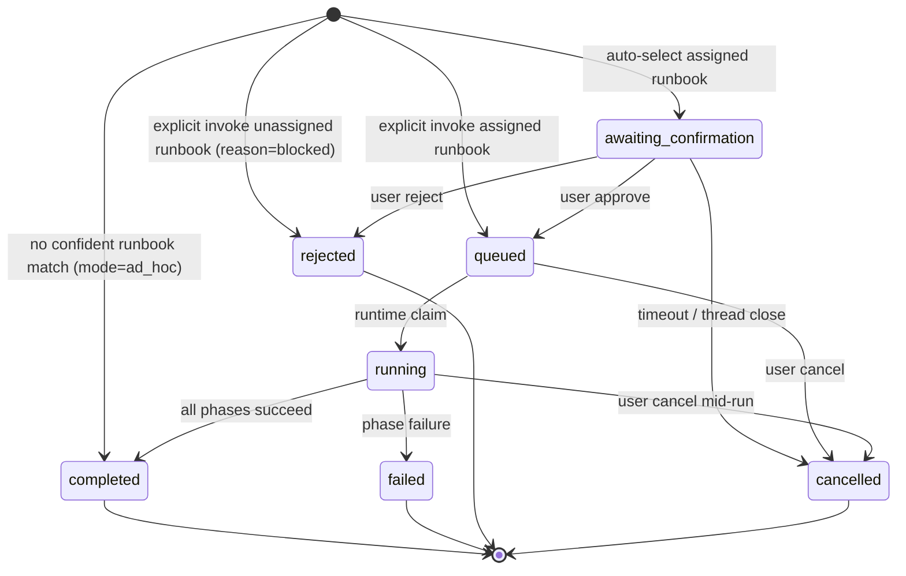

# feat: Template-assigned Computer Runbooks, tenant authoring later

## Overview

Re-scope Computer Runbooks around the smallest useful release: platform-published starter runbooks can be assigned to Computer templates, produce flexible outputs, and execute through a fail-closed runtime capability allowlist. Tenant-authored runbooks remain the product direction, but they do not ship in the first release.

The first release proves three bets before adding an admin authoring editor:

1. Template assignment is the right activation model for team-specific Computers.
2. Runbooks can produce useful non-artifact outputs such as Linear issues, PRs, prose, or app artifacts.
3. Strands can enforce runbook-scoped tool access reliably enough for tenant-controlled runbooks later.

This plan keeps execution lifecycle DB-backed and avoids the deprecated S3-event orchestration substrate. It reuses the already-merged runbook tables, packaged YAML+Markdown starters, and `RunbookConfirmation` / `RunbookQueue` UI components where they still fit.

---

## Problem Frame

The earlier runbooks work shipped partway: DB tables (`tenant_runbook_catalog`, `computer_runbook_runs`, `computer_runbook_tasks`), confirmation/queue UI components, and three packaged YAML+Markdown runbooks under `packages/runbooks/runbooks/`. The original direction assumed platform-published artifact-building runbooks. The new direction is broader: runbooks should be team-specific and output-flexible.

The reviewed tenant-authoring plan tried to solve that by shipping the full future shape at once: tenant S3 authoring, admin editor, pin/live governance, assignment, routing, audit, runtime allowlists, seed/reseed, and migration. That is too much surface for the next release. The safer path is to first make packaged starter runbooks assignable by template and executable with flexible outputs, then add tenant authoring after the runtime and operator learning loop are proven.

The v1 user outcome is:

> A tenant admin can assign platform starter runbooks to specific Computer templates. End users only see and invoke runbooks assigned to their Computer's template. Auto-selected runbooks require confirmation, explicit invocations respect the same assignment gate, and no-match turns fall back to a visible ad hoc task plan.

Tenant-authored runbooks stay explicitly deferred until v1 has a draft/publish and dry-run story.

---

## Requirements Trace

### Assignment & Routing

- R1. Platform starter runbooks are cataloged per tenant as starter rows, not tenant-authored files.
- R2. Runbook visible to a Computer iff the Computer's `agent_templates` row has an enabled assignment to that runbook.
- R3. Computer templates equal `agent_templates`; v1 does not introduce a separate template entity.
- R4. Template-assignment gate applies to auto-selection and explicit invocation.
- R5. Disabling an assignment removes routing on the next turn; in-flight runs continue from their immutable run snapshot.
- R6. No-match fallback produces a visible ad hoc task plan.

### Execution & Confirmation

- R7. Auto-selected runbooks require Confirmation.
- R8. Explicit invocation skips Confirmation only when the runbook is assigned to the Computer template.
- R9. Rejected, cancelled, blocked explicit invocations, failed runs, and ad hoc fallbacks are recorded in run-lifecycle history. Blocked/ad hoc are lifecycle outcomes, not new run statuses in v1.
- R10. Sequential v1 execution uses the existing `computer_runbook_tasks` schema; dependency fields remain preserved for future DAG/state-machine execution.
- R11. Mid-run phase failure halts the run; retry policy is deferred.
- R12. Per-Computer concurrency is at most one active run (`awaiting_confirmation`, `queued`, `running`).

### Runtime Safety

- R13. Run execution carries a required `capability_roles` list for runbook execution.
- R14. `capability_roles` is a fail-closed execution-time allowlist for the final tool surface, not only script skills.
- R15. Absent `capability_roles` is allowed only for non-runbook legacy execution; an empty array on a runbook execution denies all tools and reports configuration error.
- R16. The exact definition version shown at Confirmation is the version that executes, unless the user reconfirms after a pin-class change.

### Admin Surface

- R17. Admin v1 adds assignment management under existing Capabilities navigation.
- R18. Admin v1 does not add a tenant runbook editor, phase editor, or direct tenant S3 file API.
- R19. Admin v1 exposes run history enough to diagnose rejected, cancelled, blocked, failed, completed, and ad hoc outcomes.

**Actors:** A1 tenant admin, A2 end user, A3 Computer runtime (Strands), A4 Thinkwork platform.

**Flows:** F1 assign starter runbooks to templates, F2 auto-select with Confirmation, F3 explicit invocation, F4 no-match ad hoc fallback, F5 run execution with history.

**Acceptance examples:**

- AE1. Runbook A assigned to engineering template only; engineering Computers can auto-select and explicitly invoke it, sales Computers cannot.
- AE2. Explicit invocation of an unassigned runbook records a blocked lifecycle event without adding a new `RunbookRunStatus`, and returns a clear "not assigned to this Computer template" message.
- AE3. Auto-selected runbook captures a confirmation snapshot; later pin-class edits do not silently change what executes.
- AE4. No confident match creates an ad hoc plan visible to the user and visible in run history.
- AE5. `capability_roles` allowlist blocks built-ins, MCP tools, packaged skills, workspace skills, delegation, and future tool adapters unless mapped to an allowed role.
- AE6. Disabling an assignment affects new turns, while in-flight runs continue from snapshot.

---

## Scope Boundaries

- Tenant-authored runbook editor, per-phase markdown editor, direct runbook file API, and tenant S3 body management are deferred.
- Pin/live field governance for tenant-authored edits is deferred with tenant authoring.
- Per-tenant `capability_roles` registry is deferred; v1 uses a platform-defined enum.
- Visual workflow builder, marketplace, cross-tenant publishing, version-history UI, and run-history export are deferred.
- Parallel/DAG phase execution is deferred; v1 remains sequential.
- SOC2-grade compliance pipeline is deferred, but v1 still records operational lifecycle history for routing and debugging.
- `packages/runbooks/` remains the source for starter runbook definitions.
- S3-event-driven execution remains out of scope; lifecycle is DB-backed.

### Deferred Follow-Up

- Tenant-authored runbook editor with draft/publish, dry-run, validation, and secret scanning.
- Pin/live governance for tenant-authored fields.
- Tenant S3 body storage and catalog index rebuilds.
- Starter update/reseed command and "starter update available" notices.
- Snapshot diff viewer.
- Run-history export.
- Per-tenant capability role extension.

---

## Context & Research

### Relevant Code and Patterns

- `packages/database-pg/src/schema/runbooks.ts` — existing catalog, run, and task schema. v1 extends status/invocation surfaces only where needed.
- `packages/database-pg/src/schema/mcp-servers.ts` (`agent_template_mcp_servers`) — precedent for `agent_template_runbook_assignments`.
- `packages/database-pg/drizzle/0083_computer_runbooks.sql` — hand-rolled runbook SQL marker precedent.
- `packages/database-pg/graphql/types/runbooks.graphql` — existing runbook GraphQL surface and generated AppSync mirror.
- `packages/api/src/lib/runbooks/{catalog,runs,tasks,router,confirmation-message,runtime-api}.ts` — existing runbook library layer.
- `packages/api/src/lib/computers/thread-cutover.ts` — Computer routing entry point.
- `packages/runbooks/src/loader.ts` — packaged YAML+Markdown loader; remains package-first in v1.
- `packages/agentcore-strands/agent-container/container-sources/server.py` and tool registration helpers — runtime tool-surface inventory point for `capability_roles`.
- `packages/api/src/handlers/chat-agent-invoke.ts` — payload path that carries `skills_config`/runtime configuration to Strands.
- `apps/computer/src/components/runbooks/{RunbookConfirmation,RunbookQueue}.tsx` — already-merged end-user runbook UI.
- `apps/admin/src/routes/_authed/_tenant/capabilities/*` — Capabilities navigation precedent.

### Institutional Learnings

- `docs/solutions/architecture-patterns/inert-first-seam-swap-multi-pr-pattern-2026-05-08.md` — substrate lands inert before routing flips live.
- `docs/solutions/patterns/apply-invocation-env-field-passthrough-2026-04-24.md` — new invocation fields must be added to all subset-dicts or they silently drop.
- `docs/solutions/workflow-issues/agentcore-runtime-no-auto-repull-requires-explicit-update-2026-04-24.md` — Strands runtime updates require AgentCore reconciler verification before treating routing changes as live.
- `docs/solutions/workflow-issues/manually-applied-drizzle-migrations-drift-from-dev-2026-04-21.md` — hand-rolled SQL requires `-- creates:` markers and dev apply before merge.
- `docs/solutions/best-practices/service-endpoint-vs-widening-resolvecaller-auth-2026-04-21.md` — service paths should not widen `resolveCaller` impersonation.
- `feedback_graphql_deploy_via_pr` — GraphQL Lambda updates ride the merge pipeline.
- `feedback_avoid_fire_and_forget_lambda_invokes` — background cleanup invokes must surface errors.

---

## High-Level Design

### Storage and Assignment

```text
packages/runbooks/runbooks/*       Aurora
  runbook.yaml                       tenant_runbook_catalog
  phases/*.md                          starter rows, package source
        │
        │ seed/catalog sync
        ▼
agent_template_runbook_assignments
  tenant_id
  template_id -> agent_templates.id
  catalog_id -> tenant_runbook_catalog.id
  enabled
        │
        ▼
computers.template_id gates runbook visibility
```

In v1, packaged starter files remain the definition source. Tenant catalog rows make those starters queryable and assignable. No tenant S3 authoring path exists yet.

### Run Lifecycle



Run state transitions are enforced in `packages/api/src/lib/runbooks/runs.ts`. If v1 needs database-level transition enforcement, use a PostgreSQL trigger that compares `OLD.status` to `NEW.status`; do not describe this as a plain CHECK constraint. Per-Computer active-run concurrency is enforced with a partial unique index.

### Snapshot Contract

For auto-selected runs, the confirmation card displays the run's already-stored `definition_snapshot`. Approval queues that same snapshot. If the source catalog definition changes between render and approval, approval requires reconfirmation instead of silently executing the newer definition.

For explicit invocation, snapshot at run creation. If the runbook definition changes while queued, the queued run still executes its stored snapshot.

### Runtime Capability Boundary

`capability_roles` must apply to the final executable tool surface:

- packaged skills
- workspace-discovered skills
- built-in Strands tools
- MCP tools
- browser/computer tools
- memory/context tools
- delegation/meta-tools
- future adapters

Runbook execution requires `capability_roles` to be present. `[]` denies all tools and records a configuration error. Unclassified tools are denied whenever a runbook allowlist is present.

### Audit and History

Keep catalog assignment changes and run lifecycle events separate:

- `tenant_runbook_assignment_events` (or equivalent) records assignment enable/disable and future pin-class catalog edits.
- run lifecycle history records rejected, cancelled, blocked, failed, completed, and ad hoc outcomes keyed by `run_id`/`computer_id`, with nullable `catalog_id`.

Do not force ad hoc events through a catalog-event table that requires `catalog_id`.

---

## Key Decisions

- **First release is assignment + execution, not tenant authoring.** Prove routing and runtime safety before building an editor.
- **Packaged starter runbooks remain source-of-truth in v1.** Tenant catalog rows are assignable projections of starter definitions.
- **Template assignment is the activation model.** File presence does not determine visibility because team segmentation needs template scoping.
- **Flexible outputs are in scope.** Runbooks can produce Linear issues, PRs, prose, app artifacts, or other phase outputs.
- **Confirmation snapshot is binding.** Users approve the exact version that will execute.
- **`capability_roles` fail closed for runbook execution.** Missing is only allowed for legacy non-runbook paths; empty means no tools.
- **Run lifecycle history is separate from catalog edit history.** Ad hoc and blocked outcomes do not have to pretend they are catalog edits.
- **Tenant authoring requires a learning loop.** Draft/publish, dry-run, validation, secret policy, and retention semantics are prerequisites for opening authoring to tenants.

---

## Open Questions

### Resolved for v1

- Blocked explicit invocations do not add a new `RunbookRunStatus`; they record a lifecycle event with `event_type='blocked'` and return a user-visible gate message.
- Ad hoc fallback uses existing `invocation_mode='ad_hoc'` and lifecycle history; it does not add an `ad_hoc` status.
- Lifecycle history uses a new events table keyed by tenant/computer/run, with nullable `catalog_id`.
- Snapshots remain creation-bound because `computer_runbook_runs.definition_snapshot` is already non-null and task expansion happens at run creation.
- Assignment management is admin-only in v1. Non-admins see only Computer-facing runbook display metadata exposed through existing Computer surfaces.

### Deferred / Implementation-Time

- What is the first platform-defined `capability_roles` enum? Proposed start: `research`, `analysis`, `artifact_build`, `validation`, `code_change`, `browser_use`.
- What is the admin IA for run history: per-runbook, per-Computer, or both?

---

## Implementation Units

### U1. Catalog starter runbooks per tenant

**Goal:** Ensure packaged starter runbooks exist as tenant catalog rows without introducing tenant-authored S3 content.

**Requirements:** R1.

**Files:**
- `packages/api/src/lib/runbooks/catalog.ts` (extend existing seed/catalog path)
- `packages/runbooks/src/loader.ts` (verify package-source metadata)
- `packages/api/src/lib/runbooks/__tests__/catalog.test.ts` (extend)

**Approach:** Reuse the existing packaged loader. Catalog rows identify source as `platform_starter` and include a package/starter version where available. Do not overwrite tenant data from a future authoring path. Remove or constrain any read-time seed behavior that would surprise future tenant-authored rows.

**Tests:**
- Fresh tenant sees the three packaged starters as catalog rows.
- Re-running catalog sync is idempotent.
- Catalog sync never writes tenant S3 content.
- Existing starter row is not overwritten if marked tenant-modified by future metadata.

---

### U2. Add template-runbook assignment table

**Goal:** Assign catalog runbooks to `agent_templates` with enable/disable state.

**Requirements:** R2, R3, R5.

**Files:**
- `packages/database-pg/src/schema/runbook-assignments.ts` (new)
- `packages/database-pg/src/schema/index.ts` (export)
- `packages/database-pg/drizzle/NNNN_agent_template_runbook_assignments.sql` (hand-rolled with `-- creates:` markers; Drizzle generation currently prompts on unrelated stale metadata)
- `packages/database-pg/drizzle/NNNN_agent_template_runbook_assignments_rollback.sql` (hand-rolled)
- `packages/database-pg/src/schema/__tests__/runbook-assignments.test.ts` (new)

**Approach:** Mirror `agent_template_mcp_servers`: `id`, `tenant_id`, `template_id`, `catalog_id`, `enabled`, timestamps, unique `(template_id, catalog_id)`, indexes for lookup. Application layer validates template/catalog tenant match. Use a hand-rolled migration with drift markers so the table can land without pulling unrelated Drizzle snapshot drift into this slice.

**Tests:**
- Assignment inserts for same-tenant template/catalog.
- Duplicate pair is idempotent or unique-violates with clean handling.
- Cross-tenant assignment is rejected in API tests.
- Disabling assignment removes it from routing candidates.

---

### U3. Add run lifecycle status and concurrency contracts

**Goal:** Make run statuses and active-run concurrency explicit before routing flips live.

**Requirements:** R9, R10, R11, R12.

**Files:**
- `packages/database-pg/src/schema/runbooks.ts` (extend statuses if needed)
- `packages/database-pg/graphql/types/runbooks.graphql` (extend enum if needed)
- `packages/database-pg/drizzle/NNNN_runbook_run_concurrency.sql` (hand-rolled partial unique index)
- `packages/api/src/lib/runbooks/runs.ts` (legal transitions)
- `packages/api/src/lib/runbooks/__tests__/runs.test.ts` (extend)

**Approach:** Keep the existing run status enum. Blocked explicit invocations are represented by lifecycle events plus a user-visible gate response; ad hoc fallback uses existing `invocation_mode='ad_hoc'`. Enforce one active run per Computer with a partial unique index over active statuses. Use app-layer transition enforcement; add a PostgreSQL trigger only if DB-level transition enforcement is explicitly chosen.

**Tests:**
- One active run per Computer.
- Terminal states do not block future runs.
- Illegal transitions throw `RunbookRunTransitionError`.
- Blocked/ad hoc lifecycle representation is visible through the chosen history API without adding new `RunbookRunStatus` values.

---

### U4. Separate lifecycle history from catalog/assignment audit

**Goal:** Record routing and execution outcomes without overloading catalog edit history.

**Requirements:** R9, R19.

**Files:**
- `packages/database-pg/src/schema/runbook-lifecycle-events.ts` (new, if events table chosen)
- `packages/database-pg/src/schema/runbook-assignment-events.ts` (new, if assignment audit table chosen)
- `packages/api/src/lib/runbooks/audit.ts` (new)
- `packages/api/src/lib/runbooks/__tests__/audit.test.ts` (new)

**Approach:** Lifecycle events are keyed by tenant/computer/run and can have nullable catalog references. Assignment events are keyed by catalog/template and actor. Ad hoc and blocked events never require a non-null catalog row.

**Tests:**
- Rejected, cancelled, blocked, failed, completed, and ad hoc outcomes are recorded.
- Assignment enable/disable is recorded separately.
- Ad hoc lifecycle event inserts without `catalog_id`.

---

### U5. Enforce `capability_roles` across the final tool surface

**Goal:** Make R14 true before tenant-authored runbooks exist.

**Requirements:** R13, R14, R15.

**Files:**
- `packages/agentcore-strands/agent-container/container-sources/server.py`
- `packages/agentcore-strands/agent-container/container-sources/invocation_env.py`
- `packages/agentcore-strands/agent-container/container-sources/skill_runner.py`
- `packages/agentcore-strands/agent-container/test_capability_roles_enforcement.py` (new)
- `packages/agentcore-strands/agent-container/test_invocation_env.py` (extend/new)

**Approach:** Inventory every tool registration/execution path first. Apply a final allowlist filter after all tools are collected, or add dispatch-time defense in depth if final collection is not centralized. Update all invocation subset-dicts so `capability_roles` cannot silently drop. Deny unclassified tools for runbook execution.

**Tests:**
- Missing `capability_roles` allowed only on non-runbook legacy invocation.
- Empty array denies all runbook tools.
- Disallowed packaged skill absent.
- Disallowed workspace skill absent.
- Disallowed built-in absent.
- Disallowed MCP/browser/delegation tool absent.
- Passthrough survives `apply_invocation_env` and `_call_strands_agent`.

---

### U6. Build assignment GraphQL API

**Goal:** Let tenant admins assign starter runbooks to templates.

**Requirements:** R2, R3, R5, R17.

**Files:**
- `packages/api/src/lib/runbooks/assignments.ts` (new)
- `packages/api/src/graphql/resolvers/runbooks/assignRunbookToTemplate.mutation.ts` (new)
- `packages/api/src/graphql/resolvers/runbooks/removeRunbookAssignment.mutation.ts` (new)
- `packages/api/src/graphql/resolvers/runbooks/setRunbookAssignmentEnabled.mutation.ts` (new)
- `packages/api/src/graphql/resolvers/runbooks/listTenantRunbooks.query.ts` (extend/new)
- `packages/api/src/lib/runbooks/__tests__/assignments.test.ts` (new)
- `packages/database-pg/graphql/types/runbooks.graphql` (extend)

**Approach:** Mutations require `requireTenantAdmin(ctx)` and `resolveCallerTenantId(ctx)`. Validate `template.tenant_id === catalog.tenant_id`. Queries expose admin metadata only to tenant admins; non-admin visibility remains limited to Computer-facing assigned display data if needed.

**Tests:**
- Assign/remove/disable happy paths.
- Idempotent re-assignment.
- Cross-tenant template/catalog rejected.
- Non-admin cannot mutate.
- Query auth distinguishes admin from non-admin surfaces.
- Codegen updated for API/admin/mobile/CLI consumers as needed.

---

### U7. Add admin assignment UI under Capabilities

**Goal:** Provide a small admin surface for assigning starters to templates.

**Requirements:** R17, R19.

**Files:**
- `apps/admin/src/routes/_authed/_tenant/capabilities/runbooks/index.tsx` (new)
- `apps/admin/src/components/runbook-assignments/RunbookAssignmentTable.tsx` (new)
- `apps/admin/src/lib/runbooks-api.ts` (new)
- Existing Capabilities navigation (extend)

**Approach:** List starter runbooks with display name, category, source, assigned template count, and enabled state per assignment. Provide assignment management by template. Do not build a runbook editor or phase editor.

**States to specify in implementation:**
- loading
- empty starter catalog
- empty templates
- query failure
- mutation failure
- optimistic toggle rollback
- non-admin read-only/forbidden
- unsaved changes, if any bulk edit mode is used

**Tests:**
- List renders starter runbooks.
- Assign to template succeeds.
- Disable assignment updates UI and routing query expectations.
- Cross-tenant errors surface cleanly.
- Empty/error states render.

---

### U8. Make router assignment-aware

**Goal:** Gate auto-selection and explicit invocation by enabled template assignments.

**Requirements:** R2, R4, R5, R6, R7, R8, R9, R16.

**Files:**
- `packages/api/src/lib/runbooks/router.ts` (extend)
- `packages/api/src/lib/computers/thread-cutover.ts` (extend)
- `packages/api/src/handlers/chat-agent-invoke.ts` (include snapshot `capability_roles`)
- `packages/api/src/lib/runbooks/__tests__/router.test.ts` (extend)
- `packages/api/src/lib/computers/__tests__/thread-cutover.test.ts` (extend)

**Approach:** Candidate query joins assignments by `computer.template_id`, `assignment.enabled = true`, and catalog enabled/source constraints. Auto-select creates `awaiting_confirmation` with the displayed definition snapshot. Explicit invocation of unassigned slug records blocked lifecycle history and returns a clear message without creating a new run status. No confident match records ad hoc lifecycle history and proceeds with visible task plan.

**Tests:**
- AE1 template segmentation.
- AE2 blocked explicit invocation.
- AE3 confirmation snapshot version executes.
- AE4 no-match ad hoc fallback.
- AE6 disable assignment affects new turns only.
- Cross-tenant Computer cannot see cross-tenant runbook.
- Second active run surfaces clear concurrency error.

---

### U9. Add run cancellation and stale confirmation cleanup

**Goal:** Let users cancel queued/running runs and clean up abandoned confirmations.

**Requirements:** R9, R11, R12.

**Files:**
- `apps/computer/src/components/runbooks/RunbookQueue.tsx` (extend)
- `apps/computer/src/lib/graphql-queries.ts` (extend if needed)
- `packages/lambda/runbook-confirmation-timeout/index.ts` (new or use existing scheduled-jobs framework)
- Terraform/build entries for the chosen scheduled job

**Approach:** Cancel button renders for `queued` and `running` only. Timeout job cancels old `awaiting_confirmation` runs and records lifecycle history. Any sub-invokes use `RequestResponse` and surface errors.

**Tests:**
- Cancel visible only for cancellable states.
- Cancel mutation updates UI.
- Timeout job cancels stale confirmations once.
- Recent confirmations are untouched.

---

### U10. Migration and docs polish

**Goal:** Reframe existing starters and document the v1 operator flow.

**Requirements:** R1, R17.

**Files:**
- `packages/runbooks/README.md` (clarify starter-source role)
- `docs/src/content/docs/computer/runbooks.md` or similar (new/extend)
- `packages/workspace-defaults/files/skills/artifact-builder/SKILL.md` (only if current prose still calls itself a runbook compatibility shim)

**Approach:** Document assignment, confirmation, explicit invocation, no-match fallback, and capability role constraints. Avoid documenting tenant authoring until the editor/dry-run work exists.

**Tests:** Docs build.

---

## Phased Delivery

### Phase A — Inert Substrate

U1-U5.

- Catalog starter runbooks.
- Add assignment schema.
- Clarify lifecycle status/concurrency.
- Split lifecycle history from catalog/assignment audit.
- Enforce `capability_roles` across the final tool surface.

### Phase B — Admin Assignment

U6-U7.

- GraphQL assignment API.
- Admin assignment UI under Capabilities.
- Still no routing flip until Phase C.

### Phase C — Runtime Flip

U8-U9.

- Assignment-aware router.
- Confirmation snapshot contract.
- Explicit invocation gate.
- Ad hoc fallback history.
- Cancel/timeout cleanup.

U5 must be deployed and AgentCore runtime reconciliation verified before U8 routes real runbook executions through the new allowlist.

### Phase D — Polish

U10.

- Docs.
- Starter framing.
- Operator handoff.

### Phase E — Tenant Authoring Follow-Up

New plan after v1 validates routing and runtime safety:

- Tenant runbook editor.
- Draft/publish.
- Template-scoped dry run.
- Secret scanning and secret-reference model.
- Tenant S3 storage + catalog indexer.
- Pin/live governance.
- Retention/deletion policy for snapshots and task errors.

---

## Operational / Rollout Notes

- Hand-rolled SQL needs `-- creates:` markers and dev apply before merge.
- GraphQL changes deploy through PR only.
- Run codegen for every consumer with a `codegen` script after GraphQL schema edits.
- Strands runtime changes are not live until AgentCore reconciler updates the runtime; verify `lastUpdatedAt` before routing flips.
- Admin dev verification from worktrees needs the ignored admin env copied and a Cognito-allowlisted Vite port.
- Do not expose tenant authoring UI or tenant S3 file writes in this release.
