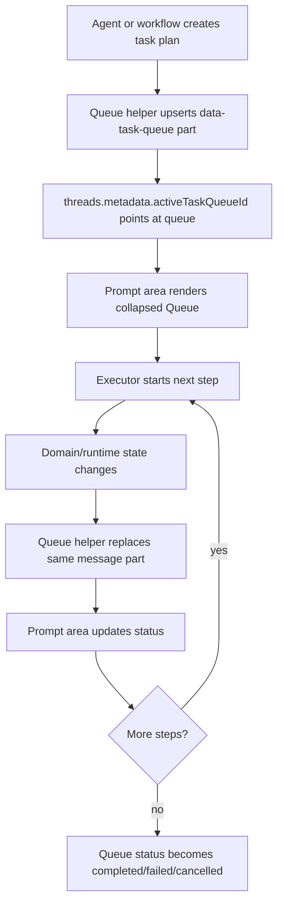
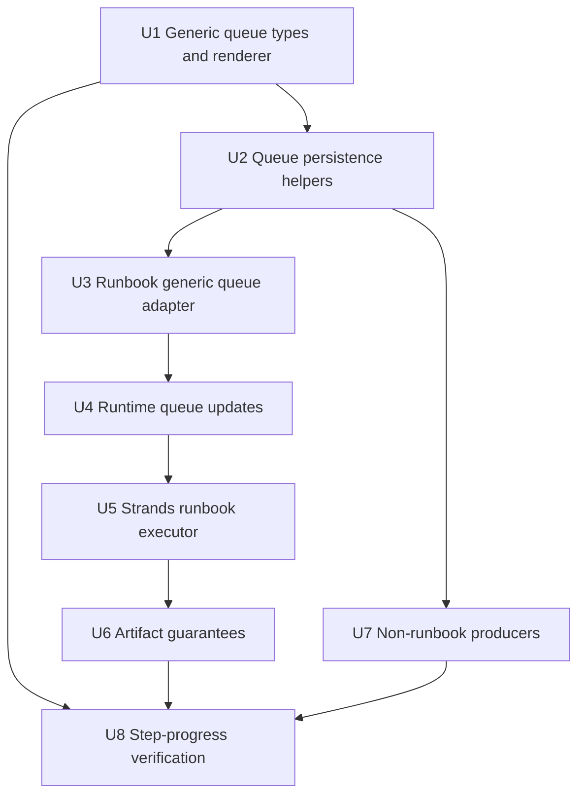

# feat: Add Generic Task Queue Progress

## Overview

The Queue UI should not be tightly coupled to runbooks. Runbooks are one
important producer of multi-step work, but the same progress primitive should
also support deep research plans, artifact builds, CRM investigations, map
generation, long-running connector work, and any future agent process that
breaks a goal into visible steps.

The current implementation proves the UI direction but couples the structured
part shape to `data-runbook-queue`. The better foundation is a generic
`data-task-queue` message part stored on `messages.parts`, with an optional
active queue pointer in `threads.metadata`. Execution systems can still use
their own domain state where appropriate, but the prompt-area Queue becomes a
shared rendering and progress contract.

The important distinction:

- **Queue display state** is a durable typed message part.
- **Execution lifecycle** stays in existing runtime/task mechanisms.
- **Runbook state** remains available for runbook-specific audit, snapshots,
  dependencies, and catalog provenance, but it is no longer the UI primitive.

This keeps us from creating another table just to display a task list, while
also avoiding the trap of parsing message JSON as the execution engine.

## Current Codebase Context

- `messages.parts` already stores durable typed UIMessage parts and takes
  render precedence over legacy `messages.content`.
- `threads.metadata` is already available for additive thread-level state and
  can hold an active task queue pointer without a schema migration.
- `computer_tasks` already provides claim/run/fail/completion lifecycle for
  runtime work items.
- `computer_runbook_runs` and `computer_runbook_tasks` already store
  runbook-specific state. They should feed the generic Queue part rather than
  define the Queue concept.
- `apps/computer/src/components/runbooks/RunbookQueue.tsx` currently renders
  runbook queue data. It should become or wrap a generic task queue renderer.

## Goals

- Introduce a generic `data-task-queue` typed part that any agent workflow can
  publish and update.
- Render the active task queue in the prompt area with collapsed and expanded
  states.
- Store queue display state in `messages.parts`, not new tables.
- Store the active queue pointer in `threads.metadata` when a thread has an
  ongoing visible multi-step process.
- Let runbooks, deep research, and future processes all update the same Queue
  contract.
- Preserve deterministic task status updates: pending, running, completed,
  failed, skipped, and cancelled.
- Keep runtime execution lifecycle in existing `computer_tasks` and domain
  code, not in message rendering state.

## Non-Goals

- No new generic task queue tables in this plan.
- No tenant-authored runbook editor work.
- No full state-machine or parallel executor yet.
- No replacement of `computer_tasks` as the runtime work queue.
- No attempt to make `messages.parts` the authoritative worker claim/retry
  system.

## Key Decisions

| Decision | Choice | Reason |
| --- | --- | --- |
| Queue UI primitive | `data-task-queue` | Any multi-step agent workflow can publish the same part shape. |
| Queue persistence | `messages.parts` | The UI already persists and reloads typed parts from messages. |
| Active queue pointer | `threads.metadata.activeTaskQueueId` | Lets the prompt area pin one active queue without scanning all messages. |
| Execution lifecycle | Existing runtime/domain mechanisms | `computer_tasks` and domain APIs already own claiming, retries, and terminal states. |
| Runbook integration | Runbooks become a producer/adapter | Runbook tables remain useful, but the UI no longer depends on runbook-specific shapes. |
| Status authority | Domain transition code updates Queue snapshots | Prevents UI-only or model-invented status. |

## Generic Task Queue Shape

```ts
type TaskQueuePart = {
  type: "data-task-queue";
  id: `task-queue:${string}`;
  data: {
    queueId: string;
    title: string;
    status: "pending" | "running" | "completed" | "failed" | "cancelled";
    source: {
      type:
        | "runbook"
        | "deep_research"
        | "artifact_build"
        | "map_build"
        | "connector_work"
        | "manual_plan";
      id?: string;
      slug?: string;
    };
    summary?: string;
    groups?: Array<{
      id: string;
      title: string;
      items: TaskQueueItem[];
    }>;
    items?: TaskQueueItem[];
  };
};

type TaskQueueItem = {
  id: string;
  title: string;
  summary?: string | null;
  status: "pending" | "running" | "completed" | "failed" | "skipped" | "cancelled";
  output?: unknown;
  error?: unknown;
  startedAt?: string | null;
  completedAt?: string | null;
  metadata?: Record<string, unknown>;
};
```

Runbooks can map phases to `groups`; simpler deep-research plans can use a flat
`items` array.

## High-Level Design



The Queue helper should support two update transports:

1. **Durable update:** replace the stable `data-task-queue` part in
   `messages.parts`.
2. **Live update:** notify the thread or publish a typed UIMessage part so the
   prompt-area Queue updates without reload.

Durable state is the source of truth. Live updates are a transport.

## State Semantics

Queue status:

- `pending`: task queue exists, work has not started.
- `running`: at least one item is running or the process is active.
- `completed`: all required items completed.
- `failed`: the process failed.
- `cancelled`: execution stopped by user or runtime.

Item status:

- `pending`: item has not started.
- `running`: executor is working on this item now.
- `completed`: item produced accepted output.
- `failed`: item failed.
- `skipped`: item was not run because the process failed, was cancelled, or a
  dependency made it unnecessary.
- `cancelled`: item was explicitly cancelled.

## Implementation Units

### U1. Define Generic Task Queue Types and Renderer

**Files**

- `apps/computer/src/lib/ui-message-types.ts`
- `apps/computer/src/components/runbooks/RunbookQueue.tsx`
- `apps/computer/src/components/runbooks/RunbookQueue.test.tsx`
- `apps/computer/src/components/computer/render-typed-part.tsx`
- `apps/computer/src/components/computer/TaskThreadView.test.tsx`

**Work**

- Add `data-task-queue` to the typed UIMessage part contract.
- Introduce a generic `TaskQueue` renderer that handles grouped and flat
  queues.
- Keep a backwards-compatible adapter for existing `data-runbook-queue` parts
  during rollout.
- Preserve the prompt-area collapsed/expanded behavior.
- Make the collapsed summary compact: title, counts, primary status, and
  Review/Hide tasks action on one row where space allows.

**Tests**

- Generic queue part renders in collapsed and expanded states.
- Mixed statuses summarize correctly.
- Existing `data-runbook-queue` snapshots still render through the adapter.
- Long task titles do not push controls off the prompt area.

### U2. Add Generic Queue Persistence Helpers

**Files**

- `packages/api/src/lib/task-queues/message-parts.ts`
- `packages/api/src/lib/task-queues/message-parts.test.ts`
- `packages/api/src/lib/computers/thread-cutover.ts`
- `packages/api/src/graphql/resolvers/messages/messages.query.ts`

**Work**

- Add a helper that upserts a stable `data-task-queue` part into a message's
  `parts` JSON.
- Add a helper to set or clear `threads.metadata.activeTaskQueueId`.
- Ensure updates replace the existing part by stable id instead of appending
  duplicate task lists.
- Keep the helper generic and source-agnostic.
- Notify subscribers after durable updates so the Computer UI can refresh.

**Tests**

- Upserting a queue part into an empty `parts` array works.
- Upserting the same queue id replaces the prior queue.
- Multiple queues can exist in a thread, but the active pointer selects the
  prompt-pinned one.
- Clearing the active pointer does not delete historical message parts.

### U3. Adapt Runbooks to Produce Generic Queues

**Files**

- `packages/api/src/lib/runbooks/confirmation-message.ts`
- `packages/api/src/lib/runbooks/runtime-api.ts`
- `packages/api/src/lib/runbooks/runtime-api.test.ts`
- `packages/api/src/lib/computers/thread-cutover.ts`
- `packages/agentcore-strands/agent-container/container-sources/runbook_context.py`
- `packages/agentcore-strands/agent-container/test_runbook_context.py`

**Work**

- Convert runbook phase/task rows into `data-task-queue` snapshots.
- Use `source.type = "runbook"` and `source.id = runbookRunId`.
- Preserve phase grouping through `groups`.
- Continue reading and writing `computer_runbook_runs` and
  `computer_runbook_tasks` for runbook-specific state.
- Stop making the UI depend on `data-runbook-queue` once the generic renderer
  is proven.

**Tests**

- A runbook confirmation creates a generic task queue message part.
- A runbook start transition updates only the active item to `running`.
- A completion transition updates that item to `completed`.
- A failed transition marks the failed item and skipped remaining items.

### U4. Make Runtime Queue Updates Part of Execution

**Files**

- `packages/api/src/lib/runbooks/runtime-api.ts`
- `packages/api/src/handlers/computer-runtime.ts`
- `packages/computer-runtime/src/runbooks.ts`
- `packages/computer-runtime/src/task-loop.ts`
- `packages/computer-runtime/src/runbooks.test.ts`
- `packages/computer-runtime/src/task-loop.test.ts`

**Work**

- After each domain transition, update the generic task queue snapshot.
- Keep `computer_tasks` as the outer execution lifecycle.
- Prevent the local `computer-runtime` default stub runner from silently
  completing production runbooks. It may stay available for tests, but
  production behavior should fail closed unless a real runner is configured.
- Avoid a race where local task polling claims `runbook_execute` while the
  Strands path is executing it. The direct dispatch path should atomically move
  the `computer_tasks` row to `running` before invoking AgentCore, and the
  generic local claim query should not return pending `runbook_execute` tasks
  once direct dispatch is enabled.

**Tests**

- Runtime transitions update `computer_runbook_tasks` and the generic Queue
  part in one coherent flow.
- The local stub runner cannot complete a production runbook task queue.
- Dispatch failure marks the `computer_tasks` row and the Queue as failed.

### U5. Add a Strands Runbook Executor Loop

**Files**

- `packages/api/src/graphql/utils.ts`
- `packages/api/src/handlers/chat-agent-invoke.ts`
- `packages/agentcore-strands/agent-container/container-sources/server.py`
- `packages/agentcore-strands/agent-container/container-sources/runbook_runtime_client.py`
- `packages/agentcore-strands/agent-container/container-sources/runbook_executor.py`
- `packages/agentcore-strands/agent-container/test_runbook_executor.py`
- `packages/agentcore-strands/agent-container/test_server_chunk_streaming.py`

**Work**

- Extend the chat-agent invoke payload to carry runbook execution context and
  a runbook execution mode for `computerTaskId`.
- Route runbook execution payloads through `runbook_executor.py` instead of one
  unconstrained agent turn.
- The executor loop should load current context, start one task, execute one
  focused Strands task with prior outputs, complete or fail the task, then
  repeat.
- Keep queue updates structured. Do not emit the task list as assistant prose.

**Tests**

- Executor calls start, model execution, and complete in order.
- Executor reloads context between tasks and passes prior outputs forward.
- Executor calls fail once and stops on task failure.
- Queue parts are not repeated as text content.

### U6. Preserve Artifact Completion Guarantees

**Files**

- `packages/api/src/lib/computers/runtime-api.ts`
- `packages/api/src/handlers/chat-agent-invoke.ts`
- `packages/agentcore-strands/agent-container/container-sources/server.py`
- `packages/agentcore-strands/agent-container/container-sources/runbook_executor.py`
- `packages/api/src/lib/computers/runtime-api.test.ts`
- `packages/agentcore-strands/agent-container/test_runbook_executor.py`

**Work**

- Carry `save_app` evidence, linked artifact ids, and tool invocation summaries
  from Strands execution into task output.
- For queue items sourced from artifact-producing roles such as
  `artifact_build` or `map_build`, require either a successful direct
  `save_app` result or a linked applet before marking the item completed.
- If artifact evidence is missing, fail the item with an actionable error
  instead of returning the generic "Please try again" message.

**Tests**

- Artifact item with successful `save_app` completes and includes the artifact
  id in output.
- Artifact item without a saved or linked applet fails and marks remaining
  dependent items skipped.
- Non-artifact items can complete with structured research/text output.

### U7. Enable Non-Runbook Producers

**Files**

- `packages/agentcore-strands/agent-container/container-sources/task_queue_context.py`
- `packages/agentcore-strands/agent-container/container-sources/server.py`
- `packages/api/src/lib/task-queues/message-parts.ts`
- `apps/computer/src/components/computer/TaskThreadView.test.tsx`

**Work**

- Add a small generic queue publisher API usable by non-runbook flows.
- Support deep research or ad hoc planning creating a `data-task-queue` with
  `source.type = "deep_research"` or `manual_plan`.
- Allow items to update over time from runtime code without requiring runbook
  rows.
- Keep this as a publisher contract only; it should not add a new scheduler or
  task table.

**Tests**

- A non-runbook queue can be created, updated, completed, and reloaded.
- The prompt area renders non-runbook queues the same way as runbook queues.
- Multiple queue sources do not collide if their `queueId`s differ.

### U8. Add Step-Progress Verification

**Files**

- `scripts/smoke/computer-task-queue-progress-smoke.mjs`
- `scripts/smoke/README.md` or existing smoke docs location
- `docs/solutions/` entry after the implementation is proven

**Work**

- Add an optional smoke that starts a CRM Dashboard or Research Dashboard
  runbook and observes `data-task-queue` status transitions.
- Add a simple non-runbook queue smoke or fixture if practical.
- Keep live smoke optional so CI/CD does not block on expensive or
  environment-sensitive execution unless explicitly requested.
- Document how to inspect a failed queue: queue id, thread id, message id,
  source type/id, computer task id, and CloudWatch log groups.

**Tests**

- Local unit tests remain the primary CI gate.
- Live smoke is manual or behind an explicit flag.

## Dependency Graph



## System-Wide Impact

- **Messages:** `messages.parts` becomes the durable queue display state for
  any producer.
- **Threads:** `threads.metadata.activeTaskQueueId` can pin the active queue in
  the prompt area.
- **Computer runtime:** `computer_tasks` remains the execution lifecycle and
  should not be replaced by message JSON.
- **Runbooks:** runbook tables remain for runbook-specific audit and execution
  state, but emit generic Queue snapshots.
- **Computer UI:** renders `data-task-queue` and keeps a compatibility adapter
  for `data-runbook-queue` during rollout.
- **Agent runtime:** Strands gains a real runbook executor loop and a generic
  queue publisher for future non-runbook multi-step work.

## Risks and Mitigations

- **Risk: message parts become an accidental scheduler.** Mitigation: keep
  `messages.parts` as display state only; execution remains in `computer_tasks`
  and domain runtime code.
- **Risk: active queue pointer goes stale.** Mitigation: terminal queue updates
  clear or mark the pointer completed; reload logic falls back to latest active
  queue part if needed.
- **Risk: multiple workflows fight over one prompt-area queue.** Mitigation:
  use stable `queueId`s and one explicit `activeTaskQueueId`.
- **Risk: generic shape loses runbook-specific detail.** Mitigation: preserve
  source metadata and task metadata while keeping core rendering fields common.
- **Risk: artifact tasks complete without applets.** Mitigation: require direct
  save or linked artifact evidence for artifact-producing items.

## Verification Plan

Run the smallest checks first:

```bash
pnpm --filter @thinkwork/computer test -- src/components/runbooks/RunbookQueue.test.tsx
pnpm --filter @thinkwork/api test -- src/lib/task-queues/message-parts.test.ts
pnpm --filter @thinkwork/api test -- src/lib/runbooks/runtime-api.test.ts
pnpm --filter @thinkwork/computer-runtime test -- runbooks.test.ts task-loop.test.ts
uv run pytest packages/agentcore-strands/agent-container/test_runbook_executor.py
```

Then run broader package checks:

```bash
pnpm --filter @thinkwork/computer typecheck
pnpm --filter @thinkwork/api typecheck
pnpm --filter @thinkwork/computer-runtime typecheck
uv run pytest packages/agentcore-strands/agent-container
```

Before merging, verify in a deployed or deployed-like environment:

- A runbook creates a `data-task-queue` and pins it above the prompt area.
- Only the active item changes to `running`.
- Completed items remain completed while the next item starts.
- Failed artifact save fails the current item and marks remaining dependent
  items skipped.
- Successful artifact save ends with all required items completed and a
  rendered applet.
- A non-runbook queue fixture can render and update without runbook rows.

## Rollout Notes

- Ship the generic `data-task-queue` renderer and adapter first.
- Keep `data-runbook-queue` compatibility during rollout.
- Do not require optional live smoke in CI by default.
- Watch for stale local Computer runtimes during rollout. Old local runtimes may
  still claim `runbook_execute` tasks and use the stub path.
- Once deployed, inspect the thread row, queue message parts, source runtime
  state, and prompt-area UI together.

## Done Criteria

- The prompt-area Queue renders from generic `data-task-queue` parts.
- Runbooks produce and update generic task queues.
- At least one non-runbook producer can create and update a generic task queue.
- No production path can complete a visible task queue through a metadata stub.
- Artifact-producing queue items fail honestly when no applet is saved.
- Unit tests cover generic queue rendering, message-part upserts, runbook
  adapter updates, executor ordering, artifact guarantees, and reload behavior.
- At least one CRM Dashboard or Research Dashboard runbook is manually verified
  end to end after deploy.
