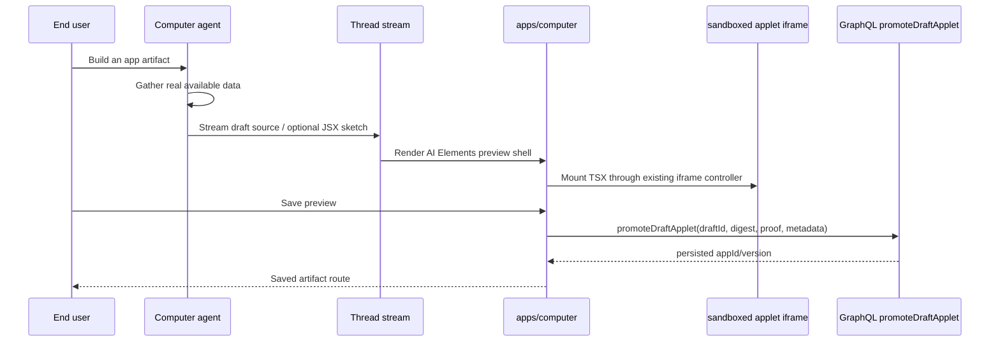

# feat: Fast TSX artifact preview

## Overview

Add a fast, unsaved preview path on top of the shadcn-only artifact-authoring direction from `docs/brainstorms/2026-05-12-computer-artifact-shadcn-vocabulary-and-mcp-requirements.md`. The Computer agent still authors React + Tailwind + shadcn TSX modules and the existing iframe-shell / sucrase runtime still executes them. The speed change is that the first visible result no longer waits for `save_app` persistence: the agent emits an ephemeral draft preview from real available data, the web UI mounts it through the existing sandboxed applet runtime, and the user explicitly promotes the draft to a saved artifact when it is worth keeping.

Preview and save both pass through the same shadcn composition gate defined by the origin brainstorm: common UI roles must be expressed with approved shadcn primitives, Recharts may be used only through the shadcn `ChartContainer` pattern, and the only non-shadcn component exception is the host map component.

The in-thread preview surface should leverage AI Elements rather than inventing new chrome. `WebPreview` is already vendored in `apps/computer` and should wrap the sandboxed iframe preview, console, and responsive preview controls. `JSXPreview` is a candidate for streaming JSX sketch/preflight while the final TSX module is still arriving, but it must not become a same-origin replacement for the sandboxed applet runtime unless a separate security review explicitly changes that invariant.

---

## Problem Frame

The current artifact-builder contract requires a complete app generation and successful `save_app` call before the user sees the artifact. That makes first preview feel slow and fragile: validation, metadata construction, S3 writes, artifact-row persistence, and GraphQL re-fetch all sit before the first useful visual feedback.

The origin brainstorm reframes the "bad artifact" problem as an authoring-vocabulary and catalog-discovery problem, not a reason to kill TSX. This plan keeps that diagnosis and adds a faster loop. The speed win comes from avoiding persistence on the first preview, not from weakening the shadcn vocabulary gate or showing fake business data.

---

## Requirements Trace

- R1. Agents author artifacts as TSX modules. The artifact payload format and iframe-shell runtime are unchanged from today's applet path.
- R2. The first preview is unsaved and ephemeral; saving is an explicit promotion step.
- R3. Previewed apps render through the same sandboxed generated-app runtime used by saved applets, so security posture does not weaken.
- R4. Draft previews use only real available data, partial real data, or honest empty states. They must not invent placeholder business data to look impressive.
- R5. Preview validation and save validation share one source policy for allowed imports, forbidden runtime patterns, shadcn composition rules, and Tailwind style constraints.
- R6. A shadcn MCP server is exposed to the Computer agent at artifact-generation time, with at least `list_components`, `get_component_source`, `get_block`, and `search_registry`.
- R7. A saved artifact created from a preview preserves provenance, original prompt, source, model, and recipe metadata at least as well as today's `save_app` flow.
- R8. Existing saved artifact routes, inline embeds, favorites, regeneration, and applet state behavior continue to work.
- R9. Generated TSX is rejected when it hand-rolls common shadcn roles that have approved primitives: cards, buttons, badges/status labels, tabs, tables/data grids, dialogs/sheets, form controls, scroll areas, separators, selects, checkboxes, switches, and tooltips.
- R10. Tailwind remains allowed for layout and responsive composition, but generated source must not define a bespoke visual system: no inline styles, hard-coded hex colors, arbitrary Tailwind values, custom shadow/radius/border/color palettes, or raw typography scales outside approved token classes.
- R11. The MCP catalog and the validator allowlist derive from the same authoritative registry. There is exactly one source of truth for what primitives are available to generated artifacts.
- R12. Recharts primitives are allowed only when rendered inside the shadcn `ChartContainer` pattern. Raw Recharts outside `ChartContainer` is rejected.
- R13. The host map component is the sole non-shadcn component exception. Raw `leaflet`, `react-leaflet`, map iframes, and custom map wrappers are rejected for new generated previews/saves.
- R14. `lucide-react` is not a general generated-source import. Icon use must come through approved shadcn/registry components unless a specific icon export is deliberately added to the generated-app allowlist by host PR.
- R15. A draft counts as a successful preview only if it passes source safety, real-data honesty metadata, shadcn composition validation, Tailwind style validation, and MCP/registry provenance checks.
- R16. The user-facing draft preview chrome uses AI Elements streaming/preview primitives where they fit the applet model, starting with the existing vendored `WebPreview` component.
- R17. Any use of AI Elements `JSXPreview` is limited to a whitelisted streaming JSX sketch/preflight surface or an explicitly validated same-origin subset. The authoritative generated app remains the sandboxed TSX iframe preview and saved applet runtime.

**Origin actors:** A1 (End user), A2 (Computer agent), A3 (`apps/computer` shell), A4 (save-artifact validator), A5 (shadcn MCP server), A6 (Operator).

**Origin flows:** F1 (agent authors shadcn-only TSX), F2 (end user opens shadcn-shaped artifact), F3 (validator rejects off-vocabulary imports/styling), F4 (operator expands allowlist by host PR), F5 (form/refresh/state unchanged).

**Origin acceptance examples:** AE1 (reject `lucide-react` import), AE2 (reject hand-rolled card-ish div), AE3 (reject Recharts outside `ChartContainer`), AE4 (allow Recharts inside `ChartContainer`), AE5 (shadcn MCP registry search returns primitives), AE6 (existing compliant applets still render), AE7 (allowlist grows by host PR), AE8 (host map exception passes).

---

## Scope Boundaries

- Do not integrate the Vercel v0 API in this feature. The chosen path is in-house model generation plus shadcn registry/MCP guidance.
- Do not revive the plain-HTML artifact substrate for generated app previews.
- Do not execute generated code in the parent Computer origin; drafts use the iframe runtime.
- Do not use `JSXPreview` as a loophole around the iframe sandbox for full generated TSX modules.
- Do not auto-save every preview as a durable artifact row.
- Do not generate fake fixture data for first preview. Empty, partial, and unavailable states are acceptable and should be honest.
- Do not broaden arbitrary npm import support. If the policy changes, it should become stricter and more consistent, not looser.
- Do not treat "imports `@thinkwork/ui`" as sufficient shadcn compliance. The source must actually compose approved primitives for their matching roles.
- Do not allow direct chart/map/table/control libraries in generated TSX except for the origin-defined Recharts-inside-`ChartContainer` rule and the host map component exception.
- Do not build a visual editor or code editor in this iteration.

### Deferred to Follow-Up Work

- A broad reusable block marketplace/catalog is out of this iteration. This plan needs a compact registry for existing `@thinkwork/ui` primitives and product-approved stdlib wrappers, not a new design-system platform.
- Rich preview history and multiple draft versions per thread can follow after the single-current-draft loop proves useful.

---

## Context & Research

### Relevant Code and Patterns

- `packages/workspace-defaults/files/skills/artifact-builder/SKILL.md` already instructs the agent to generate `App.tsx`, use `@thinkwork/ui` and `@thinkwork/computer-stdlib`, and call `save_app`.
- `docs/brainstorms/2026-05-12-computer-artifact-shadcn-vocabulary-and-mcp-requirements.md` is the origin document for this plan. It supersedes the same-day HTML substrate brainstorm and artifact-kinds plan; this plan implements the origin's shadcn-only TSX direction plus a faster unsaved preview loop.
- `packages/agentcore-strands/agent-container/container-sources/applet_tool.py` defines `save_app`, `load_app`, and `list_apps` as Strands tools and currently makes `save_app` the required endpoint for applet-build requests.
- `packages/api/src/graphql/resolvers/applets/applet.shared.ts` parses `files`, chooses `App.tsx` or the first `.tsx`, validates the source, writes source/metadata to S3, and inserts the artifact row.
- `packages/api/src/lib/applets/validation.ts` validates TSX syntax, allowed imports, and forbidden runtime patterns on the API side.
- `apps/computer/src/applets/mount.tsx` and `apps/computer/src/applets/iframe-controller.ts` mount TSX through the sandboxed iframe runtime.
- `apps/computer/src/components/apps/InlineAppletEmbed.tsx` and `apps/computer/src/routes/_authed/_shell/artifacts.$id.tsx` show the two existing mount contexts: inline thread preview for saved applets and full artifact page.
- `apps/computer/src/components/ai-elements/web-preview.tsx` is already vendored and provides preview chrome, URL/navigation scaffolding, and console display that can wrap the draft iframe surface.
- `apps/computer` already uses several AI Elements primitives for chat/thread rendering, but does not currently vendor `jsx-preview` or include `react-jsx-parser`.
- `apps/computer/components.json` and `packages/ui/components.json` already configure shadcn-compatible aliases, including `@thinkwork/ui`.
- `packages/ui/src/components/ui/chart.tsx` provides the shadcn `ChartContainer` surface referenced by the origin acceptance examples.
- `packages/computer-stdlib/src/primitives/MapView.tsx` is the likely implementation basis for the origin's `HostMap` exception, though the generated-app allowlist should expose it under a single host-approved name.

### Institutional Learnings

- `docs/brainstorms/2026-05-09-computer-applets-reframe-requirements.md` established the TSX applet direction: constrained imports, sandboxed rendering, and generated applets as real React programs.
- `docs/brainstorms/2026-05-12-computer-html-artifact-substrate-requirements.md` and `docs/plans/2026-05-12-002-feat-computer-artifact-kinds-plan.md` are superseded by the shadcn vocabulary/MCP brainstorm and must not drive implementation.
- `docs/solutions/architecture-patterns/inert-first-seam-swap-multi-pr-pattern-2026-05-08.md` is relevant if the preview tool needs to land inert before switching the runtime prompt.
- `docs/solutions/architecture-patterns/recipe-catalog-llm-dsl-validator-feedback-loop-2026-05-01.md` supplies the pattern to reuse: catalog as platform-owned TypeScript/data, injected at session start, synchronous validator at save/preview time, structured errors returned to the agent with a short retry loop.

### External References

- shadcn MCP docs: `https://ui.shadcn.com/docs/registry/mcp`
- shadcn `components.json` docs: `https://ui.shadcn.com/docs/components-json`
- shadcn CLI 3.0 / registry update: `https://ui.shadcn.com/docs/changelog/2025-08-cli-3-mcp`
- AI Elements Web Preview docs: `https://elements.ai-sdk.dev/components/web-preview`
- AI Elements JSX Preview docs: `https://elements.ai-sdk.dev/components/jsx-preview`
- v0 design systems docs: `https://v0.app/docs/design-systems` (background only; v0 API is not part of this implementation)

---

## Key Technical Decisions

- **Preview is a first-class tool result, not an artifact row.** Draft preview should travel through the thread/message stream and mount in the UI without writing the applet source to S3 or inserting an artifact row.
- **AI Elements provides the preview shell.** Use the existing `WebPreview` primitive for draft preview chrome, console surface, and responsive framing instead of building a bespoke preview frame. This aligns the app builder with the streaming AI UI system already used in the Computer thread.
- **JSXPreview is promising, but not the saved-app runtime.** AI Elements `JSXPreview` can render incomplete JSX strings with automatic tag completion, which is valuable for a "preview while source streams" experience. It does not replace the current TSX module compiler/iframe shell because full applets need imports, hooks, stdlib dependencies, sandboxing, and promotion into the durable applet runtime. If adopted, it should render only a constrained whitelisted JSX sketch or a post-policy preflight view, then hand off to the iframe once validated TSX is available.
- **Save is promotion through a verified draft.** A user-approved promotion must not bypass today's service-auth applet-write boundary. The draft payload should include a service-minted promotion token or signed source hash scoped to tenant, thread, draft id, and source digest; the UI submits that proof to a user-callable promotion mutation, which re-validates source and persists through the same internal save path.
- **One validation policy.** API validation and browser import rewriting currently disagree: the browser shim allows imports such as `lucide-react` and chart/map libraries that the API validator rejects. This feature should create a shared policy module or generated policy tests so preview and save accept/reject the same source, with the origin brainstorm's allowlist as the deciding contract.
- **shadcn compliance is structural, not just import-based.** A source file that imports `Card` but renders raw `button`, raw `table`, badge-like spans, or hand-styled card divs should fail the generated-app policy. The policy should inspect TSX structure well enough to reject common bypasses while still allowing ordinary layout wrappers such as `div`, `section`, `main`, `header`, and CSS grid/flex containers.
- **Tailwind is layout glue, not a second design system.** Generated code may use Tailwind for spacing, grid/flex layout, sizing, overflow, and responsive behavior, but visual styling should flow through shadcn/theme tokens and approved components rather than ad hoc color, border, radius, shadow, and typography systems.
- **Real data only.** The draft can render with real partial data and honest empty states, but not fake CRM/opportunity/customer values. The speed target is "preview sooner after source exists," not "invent data to avoid source work."
- **Charts follow the shadcn chart pattern.** Recharts primitives may be allowed only inside the shadcn `ChartContainer` pattern. Recharts imports and JSX outside `ChartContainer` fail validation, matching origin AE3/AE4.
- **Map is a single host exception.** The generated-app allowlist exposes one host map component, implemented by the existing map substrate if practical. Raw `leaflet`, `react-leaflet`, map iframes, or generated custom map wrappers are rejected.
- **shadcn guidance is MCP-backed when possible, registry-backed always.** shadcn's MCP server works with shadcn-compatible registries by reading a registry index from `components.json`; the plan should publish Thinkwork's actual `@thinkwork/ui` registry artifact and wire generation to consult it through MCP when available. The fallback is not a separate prompt snippet: it is the same registry JSON compacted into the prompt/tool context. If neither MCP lookup nor the local registry artifact is available, the artifact builder should fail closed with a structured guidance error instead of emitting TSX.
- **Agent retries are targeted.** Preview/save validation errors should include component/import/pattern, line when available, and suggested shadcn equivalent so the agent can recover in one short retry without restarting the whole build.

---

## Open Questions

### Resolved During Planning

- **Should previews use fake placeholder data for speed?** No. Previews use only real available data, partial real data, or honest empty states.
- **Should generation pivot to HTML for speed?** No. The desired substrate is TSX with React, Tailwind, and shadcn-compatible components.
- **Should v0 API be the default generator?** No. Keep generation in-house and use shadcn MCP/registry metadata to improve component correctness.
- **Should `lucide-react` remain a general generated-source import?** No. The origin acceptance example explicitly rejects `lucide-react`; icon access must be mediated by approved shadcn/registry components or deliberately added by host PR.
- **How are charts allowed?** Recharts only through the shadcn `ChartContainer` pattern.
- **How are maps allowed?** One host map component, no raw Leaflet/React-Leaflet imports.

### Deferred to Implementation

- **Exact transport for draft preview source:** Decide while implementing whether the existing `tool-renderFragment` message path can carry the TSX source cleanly or whether a new typed part/tool name is clearer.
- **Draft source lifetime:** Initial implementation can keep draft source in the active thread stream/client state. Durable draft history is follow-up work unless implementation reveals a cheap existing store.
- **Exact MCP deployment topology:** Choose whether the shadcn MCP server runs in-process inside the Strands container or as a separate host-side service/Lambda. This affects latency and operations, not the product contract: the agent must consult MCP or the same local registry artifact before TSX generation.
- **Exact JSXPreview role:** Decide during implementation whether v1 should include a streaming JSX sketch before iframe mount, or whether v1 should only use `WebPreview` around the iframe and defer `JSXPreview` until the source stream protocol can emit safe JSX body fragments.

---

## High-Level Technical Design

> _This illustrates the intended approach and is directional guidance for review, not implementation specification. The implementing agent should treat it as context, not code to reproduce._

---

## Implementation Units

- U1. **Unify and enforce generated app source policy**

**Goal:** Make preview and save validation use the same allowed imports, forbidden runtime rules, and shadcn composition rules.

**Requirements:** R1, R3, R5, R8, R9, R10, R11

**Dependencies:** None

**Files:**

- Modify: `packages/api/src/lib/applets/validation.ts`
- Modify: `apps/computer/src/applets/transform/import-shim.ts`
- Modify: `packages/api/src/__tests__/applets-validation.test.ts`
- Modify: `apps/computer/src/applets/transform/__tests__/import-shim.test.ts`
- Create or modify: `packages/api/src/lib/applets/source-policy.ts`
- Create or modify: `packages/api/src/lib/applets/source-policy.test.ts`
- Create: `packages/ui/registry/generated-app-components.json`
- Create or modify: `packages/ui/generated-app-policy.json`

**Approach:**

- Establish one canonical generated-app source policy for TSX applets, derived from the same catalog used by shadcn MCP.
- Allow only the origin-defined import categories: approved shadcn/registry exports, React core hooks/runtime imports, Recharts primitives when structurally nested inside `ChartContainer`, and one host map component.
- Reject `lucide-react` as a general import for generated source, matching origin AE1. Icon access must be mediated by approved shadcn/registry components unless a host PR adds a specific icon to the generated-app allowlist.
- Reject direct `leaflet` and `react-leaflet` imports for new generated drafts/saves. Map needs must go through the single host map component listed in the registry/policy artifact.
- Validate named imports from `@thinkwork/ui` and `@thinkwork/computer-stdlib` against `packages/ui/registry/generated-app-components.json`; reject unknown, deprecated, private, or not-approved-for-generated-app exports even if the package specifier itself is allowed.
- Add an AST-backed shadcn composition validator. It should reject raw elements where an approved primitive exists (`button`, `table`, `thead`, `tbody`, `tr`, `td`, `input`, `textarea`, `select`, checkbox/switch-like inputs) and reject common hand-rolled component shapes such as `div`/`span` elements with card/badge/button-like class combinations.
- Add an AST-backed chart rule: any Recharts JSX node must have an ancestor `ChartContainer` from the approved shadcn chart surface.
- Require imported approved primitives to match the roles present in the JSX. For example: tabbed UIs use `Tabs`/`TabsList`/`TabsTrigger`/`TabsContent`; metric panels use `Card` or `KpiStrip`; status labels use `Badge`; data grids use `DataTable` or `Table`; form rows use `Label` plus `Input`/`Textarea`/`Select`/`Checkbox`/`Switch`.
- Add a Tailwind class policy for generated source: allow layout, spacing, sizing, overflow, and responsive utilities; reject inline `style`, arbitrary values (`[...]`), hard-coded color classes outside semantic tokens, and custom visual-language clusters that duplicate shadcn primitives.
- Keep forbidden runtime patterns aligned with the sandbox assumptions.

**Patterns to follow:**

- `packages/api/src/lib/applets/validation.ts`
- `apps/computer/src/applets/transform/import-shim.ts`

**Test scenarios:**

- Happy path: TSX importing `Card`, `Button`, `Badge`, and `ChartContainer` from the approved registry surface plus React hooks/runtime imports passes both API validation and browser import rewriting.
- Happy path: TSX using `Card`, `Button`, `Badge`, `Tabs`, and `DataTable`/`Table` for their matching roles passes shadcn composition validation.
- Happy path: TSX rendering Recharts primitives inside `ChartContainer` passes validation.
- Happy path: TSX rendering the single host map component passes validation.
- Error path: TSX importing an arbitrary package such as `lodash` fails both validators with a clear disallowed-import message.
- Covers AE1. Error path: TSX importing `Calendar` from `lucide-react` fails with a structured disallowed-import error.
- Error path: TSX importing an unknown or not-approved export from `@thinkwork/ui` fails even though the package specifier is otherwise allowed.
- Covers AE3. Error path: TSX rendering a Recharts primitive outside `ChartContainer` fails and names the missing wrapper.
- Error path: TSX importing raw `leaflet` or `react-leaflet` fails for new draft preview/save validation and points to the host map component.
- Error path: TSX embedding an OpenStreetMap iframe or custom map wrapper fails with a structured host-map-only error.
- Error path: TSX that imports `Card` but renders a raw `<button>` or raw `<table>` fails with a message naming the matching `@thinkwork/ui` primitive.
- Covers AE2. Error path: TSX that creates card-like `div` wrappers with ad hoc `rounded border shadow bg-*` styling fails unless it uses `Card` or an approved layout-only wrapper.
- Error path: TSX with inline `style`, hex colors, arbitrary Tailwind values, or non-token color palettes fails before preview/save proceeds.
- Error path: TSX using `fetch`, `eval`, or dynamic `import()` is rejected before preview/save proceeds.
- Integration: a fixture accepted by API validation is also accepted by the browser import shim, preventing "previews but cannot save" drift.

**Verification:**

- Preview and save cannot diverge on generated-app source policy, and hand-rolled replacements for approved shadcn primitives are rejected before mount/persistence.

---

- U2. **Add draft app preview payload contract**

**Goal:** Define a typed, unsaved draft-preview payload that can flow through the existing thread stream without creating an artifact row.

**Requirements:** R2, R3, R4, R7

**Dependencies:** U1

**Files:**

- Modify: `packages/database-pg/graphql/types/messages.graphql`
- Modify: `packages/api/src/graphql/utils.ts`
- Modify: `packages/api/src/lib/computers/runtime-api.ts`
- Modify: `packages/agentcore-strands/agent-container/container-sources/server.py`
- Modify: `packages/agentcore-strands/agent-container/container-sources/applet_tool.py`
- Test: `packages/api/src/__tests__/computer-thread-cutover-routing.test.ts`
- Test: `packages/api/src/lib/computers/runtime-api.test.ts`
- Test: `packages/agentcore-strands/agent-container/test_applet_tool.py`
- Test: `packages/agentcore-strands/agent-container/test_ui_message_publisher.py`

**Approach:**

- Add or reuse a typed message/tool part for `draft_app_preview` containing source files, preview metadata, validation status, data-provenance notes, and a generated draft id.
- Keep the payload scoped to the active thread stream; it should not be listed in artifact galleries until saved.
- Preserve enough metadata to promote later: name, prompt, model id, agent version, recipe if known, and any real data source notes.
- Preserve shadcn catalog provenance: `uiRegistryVersion` or digest, MCP tool calls used (`list_components`, `get_component_source`, `get_block`, `search_registry`), and source-policy validation result.
- Include a source digest and service-minted promotion proof scoped to the tenant/thread/draft/source so the browser can ask the API to promote the exact preview without gaining arbitrary applet-write power.
- Mark drafts as unsaved in the payload so UI copy and actions do not imply persistence.

**Execution note:** Add characterization coverage around existing `tool-renderFragment` and durable artifact message parts before changing the streaming parser.

**Patterns to follow:**

- `apps/computer/src/lib/ui-message-chunk-parser.test.ts`
- `apps/computer/src/lib/use-chat-appsync-transport.test.ts`
- `packages/agentcore-strands/agent-container/container-sources/server.py`

**Test scenarios:**

- Happy path: when the agent emits a valid draft preview payload, the API/streaming layer forwards it as a typed message part without requiring `save_app`.
- Happy path: the draft preview payload includes a source digest/promotion proof that changes if the source changes.
- Happy path: the draft preview payload records the shadcn registry digest and which MCP catalog tools were called before generation.
- Edge case: a draft preview with missing `App.tsx` is represented as a validation failure payload rather than disappearing.
- Error path: if validation fails, the payload includes a structured error the UI can render and the agent can use for repair.
- Error path: a forged or mismatched promotion proof is rejected before any artifact write.
- Integration: a normal saved `save_app` response still links durable artifacts exactly as before.

**Verification:**

- A build turn can surface an unsaved draft preview while saved artifact linking remains unchanged for successful `save_app` calls.

---

- U3. **Render unsaved TSX previews in Computer**

**Goal:** Mount draft TSX previews in the thread immediately using the existing sandboxed iframe runtime and clear unsaved-state UI.

**Requirements:** R2, R3, R4, R8, R16, R17

**Dependencies:** U1, U2

**Files:**

- Modify: `apps/computer/src/components/computer/render-typed-part.tsx`
- Modify: `apps/computer/src/components/computer/TaskThreadView.tsx`
- Modify: `apps/computer/src/components/computer/GeneratedArtifactCard.tsx`
- Create: `apps/computer/src/components/apps/DraftAppletPreview.tsx`
- Modify: `apps/computer/src/applets/mount.tsx`
- Modify or reuse: `apps/computer/src/components/ai-elements/web-preview.tsx`
- Optional create: `apps/computer/src/components/ai-elements/jsx-preview.tsx`
- Test: `apps/computer/src/components/computer/render-typed-part.test.tsx`
- Test: `apps/computer/src/components/computer/GeneratedArtifactCard.test.tsx`
- Create: `apps/computer/src/components/apps/DraftAppletPreview.test.tsx`

**Approach:**

- Build `DraftAppletPreview` around AI Elements `WebPreview`, `WebPreviewBody`, and `WebPreviewConsole` rather than bespoke preview chrome.
- Reuse `AppletMount` inside the `WebPreviewBody` area for final draft source by passing a draft id, instance id, source, and synthetic version.
- Route iframe console events and validation errors into the AI Elements console surface when practical, so generated-app failures feel like part of the app-builder workflow rather than a separate artifact widget.
- Preserve streaming ergonomics: while draft source is still arriving, show a streaming preview state in the AI Elements frame instead of waiting for save/persistence.
- Evaluate adding AI Elements `JSXPreview` for an optional streaming JSX sketch/preflight path. If adopted, it must accept only whitelisted shadcn/registry components and safe bindings, must not execute generated imports/hooks/effects/event code in the parent origin, and must be replaced by the iframe-backed TSX preview once source passes validation.
- Make the preview visually distinct from saved artifacts with concise "Draft" and "Unsaved" status, but do not add bulky explanatory chrome inside the app body.
- Show honest unavailable/partial-data notes adjacent to the preview shell when the draft payload reports missing source data.
- Do not route draft previews to `/artifacts/$id`; that route remains for saved applets.

**Patterns to follow:**

- `apps/computer/src/components/apps/InlineAppletEmbed.tsx`
- `apps/computer/src/components/computer/GeneratedArtifactCard.tsx`
- `apps/computer/src/applets/mount.tsx`

**Test scenarios:**

- Happy path: a draft preview payload with valid `App.tsx` renders an iframe-backed preview in the thread.
- Happy path: the draft preview renders inside AI Elements `WebPreview` chrome rather than a bespoke frame.
- Happy path: iframe console/error events appear in `WebPreviewConsole` when available.
- Optional happy path: streaming JSX sketch renders through `JSXPreview` using only approved injected shadcn/registry components while the final TSX module is still streaming.
- Edge case: a draft with no real source rows renders an honest empty state from the generated app and an unsaved draft shell, not fake values.
- Error path: transform/import errors show the existing `AppletFailure` style and keep the thread usable.
- Error path: `JSXPreview`, if enabled, rejects or refuses to render JSX that references unapproved components, bindings, imports, hooks, effects, inline handlers, or arbitrary expressions outside the safe preview subset.
- Integration: saved artifact cards still render with `InlineAppletEmbed` and "Open full" behavior unchanged.

**Verification:**

- Users can see an unsaved generated app in the thread without an artifact id or persisted artifact row.

---

- U4. **Promote draft preview to saved artifact**

**Goal:** Let the user save the currently visible draft preview, reusing the existing `saveApplet` mutation and durable artifact behavior.

**Requirements:** R2, R7, R8

**Dependencies:** U2, U3

**Files:**

- Modify: `apps/computer/src/components/apps/DraftAppletPreview.tsx`
- Modify: `apps/computer/src/lib/graphql-queries.ts`
- Modify: `packages/database-pg/graphql/types/applets.graphql`
- Modify: `packages/api/src/graphql/resolvers/applets/saveApplet.mutation.ts`
- Create: `packages/api/src/graphql/resolvers/applets/promoteDraftApplet.mutation.ts`
- Modify: `packages/api/src/graphql/resolvers/applets/index.ts`
- Modify: `packages/api/src/lib/applets/access.ts`
- Test: `apps/computer/src/components/apps/DraftAppletPreview.test.tsx`
- Test: `packages/api/src/__tests__/applets-resolvers.test.ts`
- Test: `packages/api/src/__tests__/applets-metadata-access.test.ts`
- Test: `apps/computer/src/lib/graphql-queries.test.ts`

**Approach:**

- Add a Save action to the draft preview shell that submits the draft id, source/files, metadata, and promotion proof to a new user-callable promotion mutation.
- The promotion mutation verifies the proof, tenant, thread, and source digest, then reuses the existing internal save logic under the same validation/persistence rules as `saveApplet`.
- Keep the existing `saveApplet` service-auth boundary intact for direct writes; preview promotion is a narrower user-auth path for a previously service-minted draft.
- Keep the save path authoritative for validation and persistence; preview validation is a fast gate, not a substitute for promotion-time validation.
- On successful save, replace or augment the draft shell with the saved artifact route/action.
- If save validation fails, keep the draft visible and show the structured save error.

**Patterns to follow:**

- `packages/api/src/graphql/resolvers/applets/applet.shared.ts`
- `apps/computer/src/components/artifacts/ArtifactDetailActions.tsx`
- `apps/computer/src/components/apps/AppRefreshControl.tsx`

**Test scenarios:**

- Happy path: clicking Save on a valid draft calls `promoteDraftApplet`, returns an app id, and surfaces the saved route.
- Error path: save validation failure leaves the draft mounted and displays the validation message.
- Error path: promotion with a forged, expired, wrong-tenant, wrong-thread, or wrong-source proof is rejected with no artifact row or S3 write.
- Edge case: double-clicking Save cannot create duplicate artifacts for the same draft.
- Integration: saved preview appears in the artifact list and opens through `/artifacts/$id`.

**Verification:**

- Draft-to-saved promotion preserves today's artifact behavior while keeping first preview unsaved.

---

- U5. **Wire shadcn registry/MCP guidance to the generator**

**Goal:** Improve generated UI quality by making the shadcn MCP/registry surface the source of truth the agent consults before emitting TSX, with the same allowlist and role map feeding validation expectations.

**Requirements:** R1, R5, R6, R9, R10, R11

**Dependencies:** U1

**Files:**

- Modify: `apps/computer/components.json`
- Modify: `packages/ui/components.json`
- Create or modify: `packages/ui/registry.json`
- Create or modify: `packages/ui/registry/*.json`
- Create: `packages/ui/registry/generated-app-components.json`
- Create: `packages/ui/generated-app-policy.json`
- Create or modify: `packages/agentcore-strands/agent-container/container-sources/shadcn_registry.py`
- Modify: `packages/workspace-defaults/files/skills/artifact-builder/SKILL.md`
- Modify: `packages/workspace-defaults/src/index.ts`
- Test: `packages/workspace-defaults/src/__tests__/artifact-builder.test.ts`
- Test: `packages/ui/test/exports.test.ts`
- Test: `packages/agentcore-strands/agent-container/test_shadcn_registry.py`

**Approach:**

- Publish a shadcn-compatible registry description for the approved shadcn primitive surface, Recharts-through-`ChartContainer` pattern, and the single host map component. Do not build a broad app-block catalog in this iteration unless the block already exists and is needed by generated artifacts.
- Configure `apps/computer/components.json` with a Thinkwork registry namespace so standard shadcn MCP clients can discover the registry using the documented `registries` mechanism.
- Define `packages/ui/registry/generated-app-components.json` as the generated-app approval manifest. Each entry should include at least: `id`, `exportName`, `importSpecifier`, `approvedForGeneratedApps`, `role`, `replaces`, `allowedVariants` when relevant, `dependencies`, `registryDependencies`, `description`, and a short example.
- Include concise descriptions and dependency metadata so AI generation has exact names and intended use without long docs pasted into every prompt.
- Add role metadata to the registry/manifest so each approved primitive declares what it replaces (`button`, `table`, `badge`, `card`, `tabs`, form control, etc.) and which companion primitives are expected.
- Add explicit manifest entries for the shadcn chart pattern (`ChartContainer` + allowed Recharts children) and the host map component, with the validator using those entries for AE3/AE4/AE8.
- Include examples that demonstrate Thinkwork's shadcn style guide: use `Card` for framed panels, `Badge` for statuses, `Tabs` for tab groups, `DataTable`/`Table` for tabular data, `Button` for commands, `Label` + inputs for forms, semantic theme tokens for visual styling, and Tailwind primarily for layout.
- Add runtime-side lookup for the Thinkwork shadcn registry. When the shadcn MCP server is configured/reachable, the Artifact Builder must use MCP results from `list_components`, `get_component_source`, `get_block`, or `search_registry`; when it is not, it should consume the same registry/policy JSON in compact form. Both paths must expose the same component names, roles, variants, examples, and chart/map special cases.
- Update the Artifact Builder skill to require registry/MCP component lookup before emitting TSX for app-building requests. The skill should name this as a hard pre-generation step, not a preference, and should tell the agent to call the catalog for unfamiliar components instead of guessing props.
- If MCP lookup fails and the local registry artifact is missing, empty, stale, or cannot be parsed, the Artifact Builder should emit a structured validation/guidance error and not produce a draft preview.
- Update the Artifact Builder skill to state the hard rule: generated app source that hand-rolls an approved primitive role will be rejected by preview/save validation.
- Store the registry version/digest in draft preview metadata so a preview can be traced back to the component guidance used to generate it.
- Store evidence that shadcn MCP was used during generation in runtime traces; production traces should show catalog tool calls for artifact-generation turns.

**Patterns to follow:**

- `apps/computer/components.json`
- `packages/ui/components.json`
- `packages/workspace-defaults/files/skills/artifact-builder/SKILL.md`

**Test scenarios:**

- Happy path: the registry lists core primitives such as `button`, `card`, `tabs`, `table`, `badge`, and `data-table` with dependencies.
- Happy path: each listed primitive includes role/replacement metadata used by generator guidance and source-policy tests.
- Covers AE5. Happy path: `search_registry("dropdown")` returns `Select`, `DropdownMenu`, and `Combobox` with import paths and one-line descriptions.
- Happy path: a generation turn that needs a dropdown calls the shadcn registry/MCP path before emitting source and then uses the returned approved primitives rather than inventing a local dropdown.
- Happy path: runtime registry lookup returns the same component names/roles whether backed by shadcn MCP or by local compact registry JSON.
- Happy path: draft preview metadata records the registry version/digest used during generation.
- Happy path: artifact-generation traces record at least one shadcn MCP catalog call before draft source is emitted.
- Edge case: registry metadata stays in sync with exported `@thinkwork/ui` components.
- Error path: missing registry metadata for a component used in Artifact Builder guidance fails a test rather than drifting silently.
- Error path: nil, empty, stale, or unparsable registry metadata causes a structured no-preview guidance error instead of allowing TSX generation.
- Error path: Artifact Builder guidance that says "prefer" instead of "must use / rejected otherwise" for approved primitive roles fails a workspace-defaults test.

**Verification:**

- The generator has a compact, current description of the shadcn-compatible surface it is allowed to use, retrieves it through shadcn MCP when available, records the registry version used for each draft, and leaves trace evidence of catalog use.

---

- U6. **Relax runtime success accounting for preview-first turns**

**Goal:** Stop classifying successful draft-preview turns as failures solely because no direct `save_app` call happened.

**Requirements:** R2, R5, R7, R8, R9, R10, R11, R12, R13, R14, R15

**Dependencies:** U2

**Files:**

- Modify: `packages/api/src/lib/computers/runtime-api.ts`
- Modify: `packages/api/src/lib/computers/runtime-api.test.ts`
- Modify: `packages/agentcore-strands/agent-container/container-sources/server.py`
- Test: `packages/agentcore-strands/agent-container/test_server_chunk_streaming.py`

**Approach:**

- Update the build-turn completion logic so either a successful saved applet or a successful draft preview counts as an honest app-building output.
- Define "successful draft preview" as passing source safety, real-data honesty metadata, shadcn composition validation, Tailwind policy validation, chart/map special-case validation, and MCP/registry provenance checks. Syntax/import-only success is not enough.
- Keep failure accounting when neither preview nor save happened.
- Keep failure accounting when generated source bypasses the registry/MCP contract, even if the TSX compiles and the iframe can mount it.
- Preserve the stronger rule that the agent cannot claim a saved artifact unless `save_app` returned `ok=true` and `persisted=true`.

**Patterns to follow:**

- `packages/api/src/lib/computers/runtime-api.ts`
- `packages/agentcore-strands/agent-container/container-sources/server.py`

**Test scenarios:**

- Happy path: a turn with a valid draft preview and no `save_app` is recorded as previewed, not failed.
- Error path: a turn that claims an app but emits neither preview nor save remains a missing-output failure.
- Error path: a draft that mounts or parses but fails shadcn composition policy is not counted as a successful app-building output.
- Error path: a draft that lacks registry digest / MCP usage evidence is not counted as a successful app-building output.
- Error path: a draft using Recharts outside `ChartContainer`, raw Leaflet, or `lucide-react` is not counted as successful even if it renders locally.
- Integration: a turn with successful `save_app` still records linked applet ids as today.

**Verification:**

- Preview-first behavior is reflected in task/thread status without diluting saved-artifact honesty.

---

## System-Wide Impact

- **Interaction graph:** Agent tool output, runtime completion accounting, thread streaming, typed message rendering, iframe mounting, and GraphQL save promotion all participate in the new flow.
- **Error propagation:** Validation errors should be structured and visible at preview time, save time, and runtime mount time.
- **State lifecycle risks:** Drafts are intentionally ephemeral. Saved applet state still belongs to the existing applet state APIs after promotion.
- **API surface parity:** GraphQL schema/codegen consumers in `apps/computer`, `packages/api`, and potentially mobile/CLI need regeneration if message or applet types change.
- **Integration coverage:** Unit tests need to prove preview and save paths share validation, and browser-level tests should prove a draft can mount before save.
- **shadcn provenance:** Runtime traces and draft metadata become part of artifact-quality observability; operators should be able to tell which registry digest and MCP lookup path shaped a draft.
- **Unchanged invariants:** Saved artifacts remain private, sandbox-mounted, tenant-scoped, and accessible from `/artifacts/$id` only after persistence.

---

## Risks & Dependencies

| Risk                                                         | Mitigation                                                                                                                                                                                    |
| ------------------------------------------------------------ | --------------------------------------------------------------------------------------------------------------------------------------------------------------------------------------------- |
| Preview accepts source that save rejects                     | U1 creates one source policy and cross-path tests.                                                                                                                                            |
| Generated source imports shadcn but hand-rolls the actual UI | U1 adds AST-backed shadcn composition validation; U5 makes primitive role metadata explicit in the registry/manifest.                                                                         |
| Unsaved preview feels like a saved artifact                  | U3 uses clear Draft/Unsaved chrome and avoids `/artifacts/$id` until promotion.                                                                                                               |
| Browser promotion weakens applet-write authorization         | U2/U4 use a service-minted proof tied to source digest, tenant, thread, and draft id; direct `saveApplet` stays service-auth only.                                                            |
| Faster preview is achieved by fake data                      | U2/U3 carry data-availability metadata and enforce honest partial/empty states in prompt guidance and tests.                                                                                  |
| `JSXPreview` executes generated UI in the parent origin      | U3 limits `JSXPreview` to whitelisted sketch/preflight rendering, keeps full TSX in the iframe runtime, and treats any broader same-origin execution as out of scope without security review. |
| shadcn MCP runtime setup expands scope                       | U5 uses one registry artifact for both MCP and fallback lookup; deployment topology can vary, but the generation contract and trace/provenance requirements stay fixed.                       |
| Local registry fallback quietly diverges from MCP results    | U5 requires parity tests and a shared registry digest so fallback and MCP-backed paths expose the same approved primitives, roles, and examples.                                              |
| Large TSX payloads bloat message streams                     | Keep draft payload to the current visible draft and defer draft history; add payload-size guardrails during implementation.                                                                   |

---

## Documentation / Operational Notes

- Update Artifact Builder workspace defaults so new Computers learn preview-first behavior after defaults are seeded.
- Document how to update `packages/ui/registry/generated-app-components.json` when adding a generated-app primitive, including the host-PR path for deliberate allowlist growth.
- Add an operator note for verifying artifact-generation traces include shadcn MCP/catalog lookup and the registry digest used for the draft.
- If GraphQL schema changes, run codegen for `apps/computer`, `apps/admin` only if impacted, `apps/mobile` only if impacted, `apps/cli` only if impacted, and `packages/api`.
- Browser verification should use the admin/computer dev environment with copied env files per `AGENTS.md` if UI verification happens from a worktree.

---

## Sources & References

- Related requirements context: `docs/brainstorms/2026-05-09-computer-applets-reframe-requirements.md`
- Active origin requirements: `docs/brainstorms/2026-05-12-computer-artifact-shadcn-vocabulary-and-mcp-requirements.md`
- Superseded direction, do not implement: `docs/brainstorms/2026-05-12-computer-html-artifact-substrate-requirements.md`
- Superseded direction, do not implement: `docs/plans/2026-05-12-002-feat-computer-artifact-kinds-plan.md`
- Related plan/status: `docs/plans/2026-05-09-001-feat-computer-applets-reframe-plan.md`
- Related code: `packages/workspace-defaults/files/skills/artifact-builder/SKILL.md`
- Related code: `packages/agentcore-strands/agent-container/container-sources/applet_tool.py`
- Related code: `packages/api/src/graphql/resolvers/applets/applet.shared.ts`
- Related code: `apps/computer/src/applets/mount.tsx`
- Related code: `apps/computer/src/components/ai-elements/web-preview.tsx`
- External docs: `https://ui.shadcn.com/docs/registry/mcp`
- External docs: `https://ui.shadcn.com/docs/changelog/2025-08-cli-3-mcp`
- External docs: `https://elements.ai-sdk.dev/components/web-preview`
- External docs: `https://elements.ai-sdk.dev/components/jsx-preview`
- External docs: `https://v0.app/docs/design-systems`
