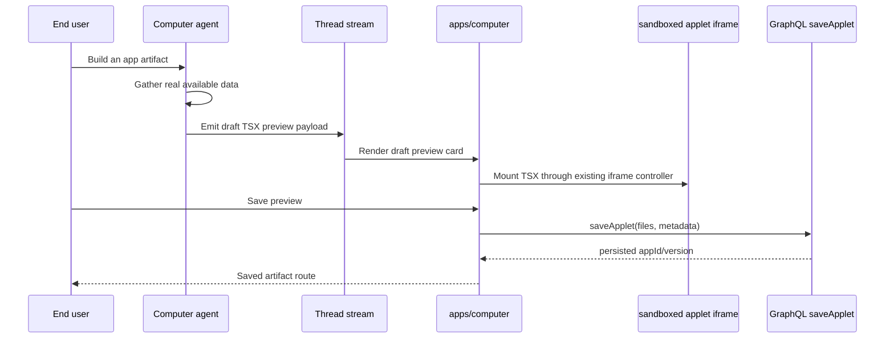

# feat: Fast TSX artifact preview

## Overview

Add a fast, unsaved preview path for Computer-generated artifact apps. The Computer agent should still generate React TSX, Tailwind classes, and shadcn-compatible `@thinkwork/ui` components, but the first visible result should not wait for `save_app` persistence. Instead, the agent can emit an ephemeral draft app preview from real available data, the web UI mounts it immediately through the existing sandboxed applet runtime, and the user can explicitly promote the draft to a saved artifact when it is worth keeping.

This plan supersedes the plain-HTML direction discussed in `docs/brainstorms/2026-05-12-computer-html-artifact-substrate-requirements.md` for this feature. The product direction for this work is TSX-first: React + Tailwind + shadcn components, with saving optional.

---

## Problem Frame

The current artifact-builder contract requires a complete app generation and successful `save_app` call before the user sees the artifact. That makes first preview feel slow and fragile: validation, metadata construction, S3 writes, artifact-row persistence, and GraphQL re-fetch all sit before the first useful visual feedback.

The new behavior should preserve the trust and quality constraints that matter: generated apps remain sandboxed, use real/available data only, and rely on approved shadcn-compatible primitives. The speed win comes from avoiding persistence on the first preview, not from showing fake business data.

---

## Requirements Trace

- R1. The artifact builder generates TSX apps, not HTML payloads, using React, Tailwind, and shadcn-compatible `@thinkwork/ui` components.
- R2. The first preview is unsaved and ephemeral; saving is an explicit promotion step.
- R3. Previewed apps render through the same sandboxed generated-app runtime used by saved applets, so security posture does not weaken.
- R4. Draft previews use only real available data, partial real data, or honest empty states. They must not invent placeholder business data to look impressive.
- R5. Preview validation and save validation share one source policy for allowed imports and forbidden runtime patterns.
- R6. The agent receives live component guidance from the repo's shadcn-compatible surface, preferably via shadcn registry/MCP metadata for `@thinkwork/ui`.
- R7. A saved artifact created from a preview preserves provenance, original prompt, source, model, and recipe metadata at least as well as today's `save_app` flow.
- R8. Existing saved artifact routes, inline embeds, favorites, regeneration, and applet state behavior continue to work.

---

## Scope Boundaries

- Do not integrate the Vercel v0 API in this feature. The chosen path is in-house model generation plus shadcn registry/MCP guidance.
- Do not revive the plain-HTML artifact substrate for generated app previews.
- Do not execute generated code in the parent Computer origin; drafts use the iframe runtime.
- Do not auto-save every preview as a durable artifact row.
- Do not generate fake fixture data for first preview. Empty, partial, and unavailable states are acceptable and should be honest.
- Do not broaden arbitrary npm import support. If the policy changes, it should become stricter and more consistent, not looser.
- Do not build a visual editor or code editor in this iteration.

### Deferred to Follow-Up Work

- Full shadcn MCP server installation inside the deployed Strands runtime may be split after the registry metadata contract lands, if runtime MCP configuration turns out to be a larger platform concern.
- Rich preview history and multiple draft versions per thread can follow after the single-current-draft loop proves useful.

---

## Context & Research

### Relevant Code and Patterns

- `packages/workspace-defaults/files/skills/artifact-builder/SKILL.md` already instructs the agent to generate `App.tsx`, use `@thinkwork/ui` and `@thinkwork/computer-stdlib`, and call `save_app`.
- `packages/agentcore-strands/agent-container/container-sources/applet_tool.py` defines `save_app`, `load_app`, and `list_apps` as Strands tools and currently makes `save_app` the required endpoint for applet-build requests.
- `packages/api/src/graphql/resolvers/applets/applet.shared.ts` parses `files`, chooses `App.tsx` or the first `.tsx`, validates the source, writes source/metadata to S3, and inserts the artifact row.
- `packages/api/src/lib/applets/validation.ts` validates TSX syntax, allowed imports, and forbidden runtime patterns on the API side.
- `apps/computer/src/applets/mount.tsx` and `apps/computer/src/applets/iframe-controller.ts` mount TSX through the sandboxed iframe runtime.
- `apps/computer/src/components/apps/InlineAppletEmbed.tsx` and `apps/computer/src/routes/_authed/_shell/artifacts.$id.tsx` show the two existing mount contexts: inline thread preview for saved applets and full artifact page.
- `apps/computer/components.json` and `packages/ui/components.json` already configure shadcn-compatible aliases, including `@thinkwork/ui`.

### Institutional Learnings

- `docs/brainstorms/2026-05-09-computer-applets-reframe-requirements.md` established the TSX applet direction: constrained imports, sandboxed rendering, and generated applets as real React programs.
- `docs/brainstorms/2026-05-12-computer-html-artifact-substrate-requirements.md` usefully names substrate complexity, but its HTML conclusion is rejected for this feature because the user wants React + Tailwind + shadcn.
- `docs/solutions/architecture-patterns/inert-first-seam-swap-multi-pr-pattern-2026-05-08.md` is relevant if the preview tool needs to land inert before switching the runtime prompt.

### External References

- shadcn MCP docs: `https://ui.shadcn.com/docs/registry/mcp`
- shadcn CLI 3.0 / registry update: `https://ui.shadcn.com/docs/changelog/2025-08-cli-3-mcp`
- v0 design systems docs: `https://v0.app/docs/design-systems`
- v0 model API docs: `https://vercel.com/docs/v0/api`

---

## Key Technical Decisions

- **Preview is a first-class tool result, not an artifact row.** Draft preview should travel through the thread/message stream and mount in the UI without writing the applet source to S3 or inserting an artifact row.
- **Save is promotion through a verified draft.** A user-approved promotion must not bypass today's service-auth applet-write boundary. The draft payload should include a service-minted promotion token or signed source hash scoped to tenant, thread, draft id, and source digest; the UI submits that proof to a user-callable promotion mutation, which re-validates source and persists through the same internal save path.
- **One validation policy.** API validation and browser import rewriting currently disagree: the browser shim allows imports such as `lucide-react` and chart/map libraries that the API validator rejects. This feature should create a shared policy module or generated policy tests so preview and save accept/reject the same source.
- **Real data only.** The draft can render with real partial data and honest empty states, but not fake CRM/opportunity/customer values. The speed target is "preview sooner after source exists," not "invent data to avoid source work."
- **shadcn guidance is local and registry-backed.** Use shadcn registry/MCP-compatible metadata for `@thinkwork/ui` and approved blocks. Do not send Thinkwork prompts or enterprise context to v0 for generation.

---

## Open Questions

### Resolved During Planning

- **Should previews use fake placeholder data for speed?** No. Previews use only real available data, partial real data, or honest empty states.
- **Should generation pivot to HTML for speed?** No. The desired substrate is TSX with React, Tailwind, and shadcn-compatible components.
- **Should v0 API be the default generator?** No. Keep generation in-house and use shadcn MCP/registry metadata to improve component correctness.

### Deferred to Implementation

- **Exact transport for draft preview source:** Decide while implementing whether the existing `tool-renderFragment` message path can carry the TSX source cleanly or whether a new typed part/tool name is clearer.
- **Exact shadcn MCP runtime setup:** If the deployed runtime cannot easily host the MCP server in this iteration, publish registry metadata and inject compact component guidance as an intermediate step.
- **Draft source lifetime:** Initial implementation can keep draft source in the active thread stream/client state. Durable draft history is follow-up work unless implementation reveals a cheap existing store.

---

## High-Level Technical Design

> *This illustrates the intended approach and is directional guidance for review, not implementation specification. The implementing agent should treat it as context, not code to reproduce.*

---

## Implementation Units

- U1. **Unify generated app source policy**

**Goal:** Make preview and save validation use the same allowed imports and forbidden runtime rules.

**Requirements:** R1, R3, R5, R8

**Dependencies:** None

**Files:**
- Modify: `packages/api/src/lib/applets/validation.ts`
- Modify: `apps/computer/src/applets/transform/import-shim.ts`
- Modify: `packages/api/src/__tests__/applets-validation.test.ts`
- Modify: `apps/computer/src/applets/transform/__tests__/import-shim.test.ts`
- Create or modify: shared policy location selected during implementation, likely under `packages/database-pg` only if GraphQL needs it, otherwise a small package or duplicated generated fixture with tests

**Approach:**
- Establish one canonical generated-app source policy for TSX applets.
- Include `@thinkwork/ui`, React runtime imports, `@thinkwork/computer-stdlib` if still accepted, and `lucide-react` if icons remain allowed.
- Decide whether direct `recharts`, `leaflet`, and `react-leaflet` imports remain allowed or move behind `@thinkwork/computer-stdlib`; prefer the stricter shadcn/product primitive path unless existing saved applets require compatibility.
- Keep forbidden runtime patterns aligned with the sandbox assumptions.

**Patterns to follow:**
- `packages/api/src/lib/applets/validation.ts`
- `apps/computer/src/applets/transform/import-shim.ts`

**Test scenarios:**
- Happy path: TSX importing `Card` from `@thinkwork/ui`, React hooks from `react`, and an icon from `lucide-react` passes both API validation and browser import rewriting.
- Error path: TSX importing an arbitrary package such as `lodash` fails both validators with a clear disallowed-import message.
- Error path: TSX using `fetch`, `eval`, or dynamic `import()` is rejected before preview/save proceeds.
- Integration: a fixture accepted by API validation is also accepted by the browser import shim, preventing "previews but cannot save" drift.

**Verification:**
- Preview and save cannot diverge on the allowed import set for generated app source.

---

- U2. **Add draft app preview payload contract**

**Goal:** Define a typed, unsaved draft-preview payload that can flow through the existing thread stream without creating an artifact row.

**Requirements:** R2, R3, R4, R7

**Dependencies:** U1

**Files:**
- Modify: `packages/database-pg/graphql/types/messages.graphql`
- Modify: `packages/api/src/graphql/utils.ts`
- Modify: `packages/api/src/lib/computers/runtime-api.ts`
- Modify: `packages/agentcore-strands/agent-container/container-sources/server.py`
- Modify: `packages/agentcore-strands/agent-container/container-sources/applet_tool.py`
- Test: `packages/api/src/__tests__/computer-thread-cutover-routing.test.ts`
- Test: `packages/api/src/lib/computers/runtime-api.test.ts`
- Test: `packages/agentcore-strands/agent-container/test_applet_tool.py`
- Test: `packages/agentcore-strands/agent-container/test_ui_message_publisher.py`

**Approach:**
- Add or reuse a typed message/tool part for `draft_app_preview` containing source files, preview metadata, validation status, data-provenance notes, and a generated draft id.
- Keep the payload scoped to the active thread stream; it should not be listed in artifact galleries until saved.
- Preserve enough metadata to promote later: name, prompt, model id, agent version, recipe if known, and any real data source notes.
- Include a source digest and service-minted promotion proof scoped to the tenant/thread/draft/source so the browser can ask the API to promote the exact preview without gaining arbitrary applet-write power.
- Mark drafts as unsaved in the payload so UI copy and actions do not imply persistence.

**Execution note:** Add characterization coverage around existing `tool-renderFragment` and durable artifact message parts before changing the streaming parser.

**Patterns to follow:**
- `apps/computer/src/lib/ui-message-chunk-parser.test.ts`
- `apps/computer/src/lib/use-chat-appsync-transport.test.ts`
- `packages/agentcore-strands/agent-container/container-sources/server.py`

**Test scenarios:**
- Happy path: when the agent emits a valid draft preview payload, the API/streaming layer forwards it as a typed message part without requiring `save_app`.
- Happy path: the draft preview payload includes a source digest/promotion proof that changes if the source changes.
- Edge case: a draft preview with missing `App.tsx` is represented as a validation failure payload rather than disappearing.
- Error path: if validation fails, the payload includes a structured error the UI can render and the agent can use for repair.
- Error path: a forged or mismatched promotion proof is rejected before any artifact write.
- Integration: a normal saved `save_app` response still links durable artifacts exactly as before.

**Verification:**
- A build turn can surface an unsaved draft preview while saved artifact linking remains unchanged for successful `save_app` calls.

---

- U3. **Render unsaved TSX previews in Computer**

**Goal:** Mount draft TSX previews in the thread immediately using the existing sandboxed iframe runtime and clear unsaved-state UI.

**Requirements:** R2, R3, R4, R8

**Dependencies:** U1, U2

**Files:**
- Modify: `apps/computer/src/components/computer/render-typed-part.tsx`
- Modify: `apps/computer/src/components/computer/TaskThreadView.tsx`
- Modify: `apps/computer/src/components/computer/GeneratedArtifactCard.tsx`
- Create: `apps/computer/src/components/apps/DraftAppletPreview.tsx`
- Modify: `apps/computer/src/applets/mount.tsx`
- Test: `apps/computer/src/components/computer/render-typed-part.test.tsx`
- Test: `apps/computer/src/components/computer/GeneratedArtifactCard.test.tsx`
- Create: `apps/computer/src/components/apps/DraftAppletPreview.test.tsx`

**Approach:**
- Reuse `AppletMount` for draft source by passing a draft id, instance id, source, and synthetic version.
- Make the preview visually distinct from saved artifacts with concise "Draft" and "Unsaved" status, but do not add bulky explanatory chrome inside the app body.
- Show honest unavailable/partial-data notes adjacent to the preview shell when the draft payload reports missing source data.
- Do not route draft previews to `/artifacts/$id`; that route remains for saved applets.

**Patterns to follow:**
- `apps/computer/src/components/apps/InlineAppletEmbed.tsx`
- `apps/computer/src/components/computer/GeneratedArtifactCard.tsx`
- `apps/computer/src/applets/mount.tsx`

**Test scenarios:**
- Happy path: a draft preview payload with valid `App.tsx` renders an iframe-backed preview in the thread.
- Edge case: a draft with no real source rows renders an honest empty state from the generated app and an unsaved draft shell, not fake values.
- Error path: transform/import errors show the existing `AppletFailure` style and keep the thread usable.
- Integration: saved artifact cards still render with `InlineAppletEmbed` and "Open full" behavior unchanged.

**Verification:**
- Users can see an unsaved generated app in the thread without an artifact id or persisted artifact row.

---

- U4. **Promote draft preview to saved artifact**

**Goal:** Let the user save the currently visible draft preview, reusing the existing `saveApplet` mutation and durable artifact behavior.

**Requirements:** R2, R7, R8

**Dependencies:** U2, U3

**Files:**
- Modify: `apps/computer/src/components/apps/DraftAppletPreview.tsx`
- Modify: `apps/computer/src/lib/graphql-queries.ts`
- Modify: `packages/database-pg/graphql/types/applets.graphql`
- Modify: `packages/api/src/graphql/resolvers/applets/saveApplet.mutation.ts`
- Create: `packages/api/src/graphql/resolvers/applets/promoteDraftApplet.mutation.ts`
- Modify: `packages/api/src/graphql/resolvers/applets/index.ts`
- Modify: `packages/api/src/lib/applets/access.ts`
- Test: `apps/computer/src/components/apps/DraftAppletPreview.test.tsx`
- Test: `packages/api/src/__tests__/applets-resolvers.test.ts`
- Test: `packages/api/src/__tests__/applets-metadata-access.test.ts`
- Test: `apps/computer/src/lib/graphql-queries.test.ts`

**Approach:**
- Add a Save action to the draft preview shell that submits the draft id, source/files, metadata, and promotion proof to a new user-callable promotion mutation.
- The promotion mutation verifies the proof, tenant, thread, and source digest, then reuses the existing internal save logic under the same validation/persistence rules as `saveApplet`.
- Keep the existing `saveApplet` service-auth boundary intact for direct writes; preview promotion is a narrower user-auth path for a previously service-minted draft.
- Keep the save path authoritative for validation and persistence; preview validation is a fast gate, not a substitute for promotion-time validation.
- On successful save, replace or augment the draft shell with the saved artifact route/action.
- If save validation fails, keep the draft visible and show the structured save error.

**Patterns to follow:**
- `packages/api/src/graphql/resolvers/applets/applet.shared.ts`
- `apps/computer/src/components/artifacts/ArtifactDetailActions.tsx`
- `apps/computer/src/components/apps/AppRefreshControl.tsx`

**Test scenarios:**
- Happy path: clicking Save on a valid draft calls `promoteDraftApplet`, returns an app id, and surfaces the saved route.
- Error path: save validation failure leaves the draft mounted and displays the validation message.
- Error path: promotion with a forged, expired, wrong-tenant, wrong-thread, or wrong-source proof is rejected with no artifact row or S3 write.
- Edge case: double-clicking Save cannot create duplicate artifacts for the same draft.
- Integration: saved preview appears in the artifact list and opens through `/artifacts/$id`.

**Verification:**
- Draft-to-saved promotion preserves today's artifact behavior while keeping first preview unsaved.

---

- U5. **Feed shadcn registry guidance to the generator**

**Goal:** Improve generated UI quality by giving the agent compact, current metadata for the approved shadcn-compatible component surface.

**Requirements:** R1, R5, R6

**Dependencies:** U1

**Files:**
- Modify: `apps/computer/components.json`
- Modify: `packages/ui/components.json`
- Create or modify: `packages/ui/registry.json`
- Create or modify: `packages/ui/registry/*.json`
- Modify: `packages/workspace-defaults/files/skills/artifact-builder/SKILL.md`
- Modify: `packages/workspace-defaults/src/index.ts`
- Test: `packages/workspace-defaults/src/__tests__/artifact-builder.test.ts`
- Test: `packages/ui/test/exports.test.ts`

**Approach:**
- Publish a shadcn-compatible registry description for the `@thinkwork/ui` primitives and any approved app blocks.
- Include concise descriptions and dependency metadata so AI generation has exact names and intended use without long docs pasted into every prompt.
- Update the Artifact Builder skill to prefer registry/MCP component lookup before emitting TSX when the tool is available.
- If MCP is not available in the deployed runtime yet, inject a compact generated component manifest as an interim source of truth.

**Patterns to follow:**
- `apps/computer/components.json`
- `packages/ui/components.json`
- `packages/workspace-defaults/files/skills/artifact-builder/SKILL.md`

**Test scenarios:**
- Happy path: the registry lists core primitives such as `button`, `card`, `tabs`, `table`, `badge`, and `data-table` with dependencies.
- Edge case: registry metadata stays in sync with exported `@thinkwork/ui` components.
- Error path: missing registry metadata for a component used in Artifact Builder guidance fails a test rather than drifting silently.

**Verification:**
- The generator has a compact, current description of the shadcn-compatible surface it is allowed to use.

---

- U6. **Relax runtime success accounting for preview-first turns**

**Goal:** Stop classifying successful draft-preview turns as failures solely because no direct `save_app` call happened.

**Requirements:** R2, R7, R8

**Dependencies:** U2

**Files:**
- Modify: `packages/api/src/lib/computers/runtime-api.ts`
- Modify: `packages/api/src/lib/computers/runtime-api.test.ts`
- Modify: `packages/agentcore-strands/agent-container/container-sources/server.py`
- Test: `packages/agentcore-strands/agent-container/test_server_chunk_streaming.py`

**Approach:**
- Update the build-turn completion logic so either a successful saved applet or a successful draft preview counts as an honest app-building output.
- Keep failure accounting when neither preview nor save happened.
- Preserve the stronger rule that the agent cannot claim a saved artifact unless `save_app` returned `ok=true` and `persisted=true`.

**Patterns to follow:**
- `packages/api/src/lib/computers/runtime-api.ts`
- `packages/agentcore-strands/agent-container/container-sources/server.py`

**Test scenarios:**
- Happy path: a turn with a valid draft preview and no `save_app` is recorded as previewed, not failed.
- Error path: a turn that claims an app but emits neither preview nor save remains a missing-output failure.
- Integration: a turn with successful `save_app` still records linked applet ids as today.

**Verification:**
- Preview-first behavior is reflected in task/thread status without diluting saved-artifact honesty.

---

## System-Wide Impact

- **Interaction graph:** Agent tool output, runtime completion accounting, thread streaming, typed message rendering, iframe mounting, and GraphQL save promotion all participate in the new flow.
- **Error propagation:** Validation errors should be structured and visible at preview time, save time, and runtime mount time.
- **State lifecycle risks:** Drafts are intentionally ephemeral. Saved applet state still belongs to the existing applet state APIs after promotion.
- **API surface parity:** GraphQL schema/codegen consumers in `apps/computer`, `packages/api`, and potentially mobile/CLI need regeneration if message or applet types change.
- **Integration coverage:** Unit tests need to prove preview and save paths share validation, and browser-level tests should prove a draft can mount before save.
- **Unchanged invariants:** Saved artifacts remain private, sandbox-mounted, tenant-scoped, and accessible from `/artifacts/$id` only after persistence.

---

## Risks & Dependencies

| Risk | Mitigation |
|------|------------|
| Preview accepts source that save rejects | U1 creates one source policy and cross-path tests. |
| Unsaved preview feels like a saved artifact | U3 uses clear Draft/Unsaved chrome and avoids `/artifacts/$id` until promotion. |
| Browser promotion weakens applet-write authorization | U2/U4 use a service-minted proof tied to source digest, tenant, thread, and draft id; direct `saveApplet` stays service-auth only. |
| Faster preview is achieved by fake data | U2/U3 carry data-availability metadata and enforce honest partial/empty states in prompt guidance and tests. |
| shadcn MCP runtime setup expands scope | U5 allows registry metadata first, with MCP wiring as follow-up if needed. |
| Large TSX payloads bloat message streams | Keep draft payload to the current visible draft and defer draft history; add payload-size guardrails during implementation. |

---

## Documentation / Operational Notes

- Update Artifact Builder workspace defaults so new Computers learn preview-first behavior after defaults are seeded.
- If GraphQL schema changes, run codegen for `apps/computer`, `apps/admin` only if impacted, `apps/mobile` only if impacted, `apps/cli` only if impacted, and `packages/api`.
- Browser verification should use the admin/computer dev environment with copied env files per `AGENTS.md` if UI verification happens from a worktree.

---

## Sources & References

- Related requirements context: `docs/brainstorms/2026-05-09-computer-applets-reframe-requirements.md`
- Superseded direction for this feature: `docs/brainstorms/2026-05-12-computer-html-artifact-substrate-requirements.md`
- Related plan/status: `docs/plans/2026-05-09-001-feat-computer-applets-reframe-plan.md`
- Related code: `packages/workspace-defaults/files/skills/artifact-builder/SKILL.md`
- Related code: `packages/agentcore-strands/agent-container/container-sources/applet_tool.py`
- Related code: `packages/api/src/graphql/resolvers/applets/applet.shared.ts`
- Related code: `apps/computer/src/applets/mount.tsx`
- External docs: `https://ui.shadcn.com/docs/registry/mcp`
- External docs: `https://ui.shadcn.com/docs/changelog/2025-08-cli-3-mcp`
- External docs: `https://v0.app/docs/design-systems`
