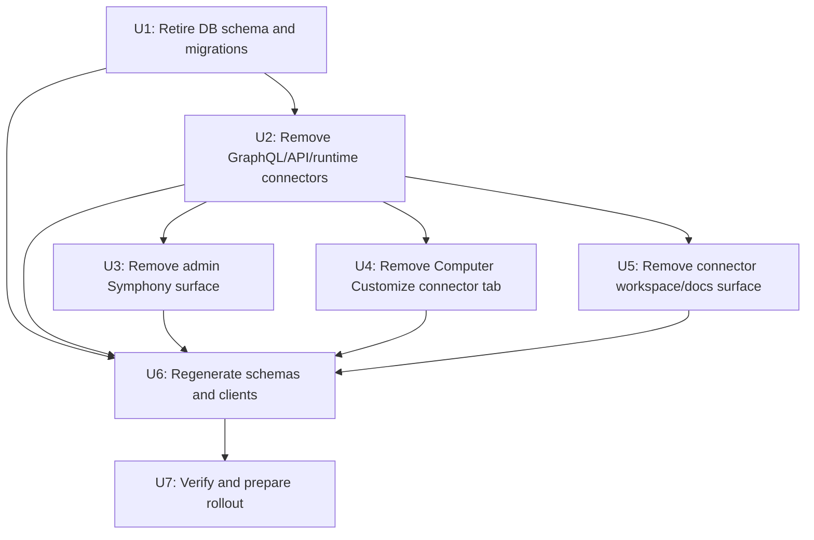

# Refactor: Retire OSS Symphony and Connectors

## Overview

Remove Symphony and the shared connector framework from OSS Thinkwork before limited-preview market release. The OSS product should expose the core agent harness, Computers, Threads, Skills, Workflows, OAuth credential primitives, and MCP-oriented integration foundations without carrying the current Symphony-shaped connector model.

Symphony becomes a private/premium extension surface. The open-source monorepo should not keep connector tables, connector GraphQL APIs, connector runtime hooks, Symphony admin routes, connector docs, or Computer Customize connector toggles as dormant placeholders.

## Problem Frame

Thinkwork is moving from exploratory implementation toward a first paying customer and a limited preview release. The existing connector model was introduced largely to support Symphony and Linear-oriented task flows. It now creates the wrong product signal: OSS users see partially supported connector concepts, while enterprise customers need private extension modules that can install into the same AWS account and appear in admin without being coupled to an OSS connector abstraction.

The cleanup should favor a smaller, clearer OSS product over compatibility with pre-release connector APIs.

## Requirements Trace

Primary source: `docs/brainstorms/2026-05-14-oss-symphony-and-connectors-retirement-requirements.md`.

- R1: No Symphony user-facing OSS surface.
- R2: No shared connector admin/runtime product surface.
- R3: Remove the Computer Customize Connectors tab and enable/disable behavior.
- R4: Preserve Computer Customize Skills and Workflows unless a direct dependency is discovered.
- R5: Fully retire the connector data model.
- R6: Preserve OAuth/provider credential primitives.
- R7: Model future Slack, Google, GitHub, and similar integrations as Computer/user OAuth or MCP capabilities, not as tenant-wide admin connectors.
- R8: Symphony moves private and owns its runtime, adapters, writeback model, admin UI, docs, install mechanism, and domain tables.
- R9: OSS may later expose extension mount points, but the connector framework is not preserved as that extension model.
- R10: Prefer removing under-proven surfaces over stabilizing them for limited preview.
- R11: Sweep docs, generated schemas, generated clients, tests, and operational runbooks.

Acceptance examples:

- AE1: A new OSS admin install has no Symphony navigation, route, docs page, runbook, or generated public API field.
- AE2: Computer Customize still supports Skills and Workflows, but not Connectors.
- AE3: Connector tables and APIs are absent from the OSS end state, while OAuth and MCP primitives remain.
- AE4: A future private Symphony extension can be installed without depending on OSS connector rows.

## Scope

### In Scope

- Delete OSS Symphony admin route, nav entry, docs, tests, and GraphQL usage.
- Delete connector GraphQL schema, resolvers, mutations, queries, generated client artifacts, runtime libraries, cleanup scripts, and tests.
- Drop connector tables and connector-specific schema fields through an explicit forward migration.
- Remove the connector half of tenant customize catalog while preserving workflow catalog behavior.
- Remove Computer Customize connector tab, connector catalog query, connector enable/disable mutations, and connected connector binding data.
- Remove connector-specific workspace-map projection and docs.
- Rewrite active docs that currently describe public OSS connectors into OAuth/MCP/integration language where that content still applies.

### Out of Scope

- Building the private Symphony extension.
- Designing a full extension marketplace, plugin registry, or admin mount-point framework.
- Rebuilding Slack, Google, GitHub, or Linear integrations in this pass.
- Removing OAuth credential vault/provider tables, MCP token/server primitives, Skills, Workflows, Computers, Threads, or core agent runtime behavior.
- Preserving backward compatibility for connector GraphQL fields or connector database rows. This is a pre-market cleanup.

## Context And Research

### Repo Survey Findings

Connector data currently spans:

- `packages/database-pg/src/schema/connectors.ts`
- `packages/database-pg/src/schema/connector-executions.ts`
- `packages/database-pg/src/schema/tenant-customize-catalog.ts`
- `packages/database-pg/src/schema/tenant-entity-external-refs.ts`
- `packages/database-pg/src/schema/index.ts`

Connector migrations currently span:

- `packages/database-pg/drizzle/0065_connector_tables.sql`
- `packages/database-pg/drizzle/0065_connector_tables_rollback.sql`
- `packages/database-pg/drizzle/0066_extend_external_refs_source_kind.sql`
- `packages/database-pg/drizzle/0066_extend_external_refs_source_kind_rollback.sql`
- `packages/database-pg/drizzle/0071_connector_computer_dispatch_target.sql`
- `packages/database-pg/drizzle/0071_connector_computer_dispatch_target_rollback.sql`
- `packages/database-pg/drizzle/0078_tenant_customize_catalog.sql`
- `packages/database-pg/drizzle/0078_tenant_customize_catalog_rollback.sql`
- `packages/database-pg/drizzle/0079_seed_tenant_customize_catalog.sql`
- `packages/database-pg/drizzle/0080_connectors_catalog_slug.sql`
- `packages/database-pg/drizzle/0080_connectors_catalog_slug_rollback.sql`

GraphQL/API connector surface currently spans:

- `packages/database-pg/graphql/types/connectors.graphql`
- `packages/database-pg/graphql/types/customize.graphql`
- `packages/api/src/graphql/resolvers/connectors/`
- `packages/api/src/graphql/resolvers/customize/connectorCatalog.query.ts`
- `packages/api/src/graphql/resolvers/customize/enableConnector.mutation.ts`
- `packages/api/src/graphql/resolvers/customize/disableConnector.mutation.ts`
- `packages/api/src/graphql/resolvers/customize/customizeBindings.query.ts`
- `packages/api/src/graphql/resolvers/index.ts`
- `packages/api/src/graphql/utils.ts`

Runtime and support code currently spans:

- `packages/api/src/lib/connectors/runtime.ts`
- `packages/api/src/lib/connectors/linear.ts`
- `packages/api/src/lib/computers/symphony-pr-harness.ts`
- `packages/api/src/lib/computers/runtime-api.ts`
- `packages/api/src/lib/workspace-map-generator.ts`
- `packages/api/scripts/cleanup-stale-connector-runs.ts`

Admin surface currently spans:

- `apps/admin/src/routes/_authed/_tenant/symphony.tsx`
- `apps/admin/src/routes/_authed/_tenant/-symphony.target.test.ts`
- `apps/admin/src/components/Sidebar.tsx`
- `apps/admin/src/lib/connector-admin.ts`
- `apps/admin/src/lib/graphql-queries.ts`

Computer Customize surface currently spans:

- `apps/computer/src/routes/_authed/_shell/customize.tsx`
- `apps/computer/src/routes/_authed/_shell/customize.index.tsx`
- `apps/computer/src/routes/_authed/_shell/customize.connectors.tsx`
- `apps/computer/src/lib/graphql-queries.ts`
- `apps/computer/src/components/customize/use-customize-data.ts`
- `apps/computer/src/components/customize/use-customize-mutations.ts`

Docs with likely connector/Symphony cleanup include:

- `docs/runbooks/computer-first-linear-connector-checkpoint.md`
- `docs/src/content/docs/applications/admin/symphony.mdx`
- `docs/src/content/docs/guides/symphony-linear-checkpoint.mdx`
- `docs/src/content/docs/concepts/connectors/lifecycle.mdx`
- `docs/src/content/docs/concepts/connectors.mdx`
- `docs/src/content/docs/concepts/integrations.mdx`
- `docs/src/content/docs/concepts/mcp-tools.mdx`
- `docs/src/content/docs/guides/connectors.mdx`
- `docs/src/content/docs/applications/admin/computers.mdx`
- `docs/src/content/docs/concepts/computers.mdx`
- `docs/src/content/docs/concepts/threads/routing-and-metadata.mdx`
- `docs/src/content/docs/architecture.mdx`
- `docs/src/content/docs/roadmap.mdx`
- `docs/astro.config.mjs`

### Existing Repo Learnings

- `docs/solutions/workflow-issues/manually-applied-drizzle-migrations-drift-from-dev-2026-04-21.md`: manual Drizzle migrations require explicit marker discipline and drift verification.
- `docs/solutions/workflow-issues/survey-before-applying-parent-plan-destructive-work-2026-04-24.md`: destructive cleanup should survey consumers before applying broad removals.
- `docs/plans/2026-04-20-009-refactor-remove-admin-connectors-plan.md`: prior admin connector cleanup pattern; generated route-tree diffs should be reviewed carefully.
- `docs/plans/2026-04-24-003-refactor-pre-launch-db-schema-cleanup-plan.md`: pre-launch cleanup can intentionally delete stale API/data surfaces when generated artifacts and tests are swept together.
- `docs/plans/2026-05-06-010-refactor-system-workflows-u6-postgres-schema-plan.md`: when dropping manually tracked database objects, old create-migration files may need to be deleted or narrowed so the drift reporter does not continue expecting removed objects to exist.

### External References

No external research is required for this plan. The work is a repo-internal product and architecture cleanup, and the relevant constraints are captured in the repository docs and existing migration patterns.

## Technical Decisions

### D1: Remove, Do Not Hide

Connector and Symphony APIs should be deleted from OSS instead of feature-flagged or hidden. This keeps generated schemas, docs, tests, and install behavior honest for limited preview.

### D2: Pair The Drop Migration With Migration-History Cleanup

The manual migration drift reporter walks historical non-rollback SQL files and validates `-- creates:` markers. A new drop migration alone would conflict with old connector create migrations. The implementation must add a forward drop migration and delete or narrow the old connector create migrations so the desired end state is internally consistent.

### D3: Preserve Workflow Catalog, Remove Connector Catalog

`tenant-customize-catalog.ts` and migrations `0078`/`0079` contain both connector and workflow catalog concepts. The plan removes `tenant_connector_catalog` while preserving `tenant_workflow_catalog` and workflow seed data.

### D4: Restore External Ref Source Kinds Away From Tracker Values

`tracker_issue` and `tracker_ticket` were introduced for connector-backed tracker writeback. The removal should delete connector-specific tracker external refs if present, then restore the `tenant_entity_external_refs` source-kind constraint to the non-connector set.

### D5: Preserve OAuth, Provider, Credential, MCP, Skill, And Workflow Primitives

The target state removes connector runtime abstractions, not lower-level authentication or tool foundations. Future Slack, Google, and GitHub behavior should be modeled at the Computer/user capability level, similar to mobile OAuth/MCP integrations.

### D6: Private Symphony Owns Its Integration Choices

Existing Linear work should not be preserved in OSS just because it exists. A private Symphony package can reuse or port Linear code and later add GitHub as the default tracker, but the OSS monorepo should not retain public Linear connector APIs.

## Design

The cleanup should proceed from persistence outward. Database and GraphQL removal create the new contract; admin, computer, docs, and generated clients then converge on that contract. Typecheck and codegen failures are useful signals and should drive residual cleanup.

## Implementation Units

### U1: Retire Connector Schema And Migrations

Goal: make the database end state connector-free while preserving workflow customization, OAuth, MCP, Computers, and Threads.

Requirements: R5, R6, R10, R11, AE3.

Files:

- Add `packages/database-pg/drizzle/0086_retire_oss_connectors.sql` unless a newer migration number exists at implementation time.
- Delete `packages/database-pg/src/schema/connectors.ts`.
- Delete `packages/database-pg/src/schema/connector-executions.ts`.
- Update `packages/database-pg/src/schema/index.ts`.
- Update `packages/database-pg/src/schema/tenant-customize-catalog.ts`.
- Update `packages/database-pg/src/schema/tenant-entity-external-refs.ts`.
- Delete `packages/database-pg/drizzle/0065_connector_tables.sql`.
- Delete `packages/database-pg/drizzle/0065_connector_tables_rollback.sql`.
- Delete `packages/database-pg/drizzle/0066_extend_external_refs_source_kind.sql`.
- Delete `packages/database-pg/drizzle/0066_extend_external_refs_source_kind_rollback.sql`.
- Delete `packages/database-pg/drizzle/0071_connector_computer_dispatch_target.sql`.
- Delete `packages/database-pg/drizzle/0071_connector_computer_dispatch_target_rollback.sql`.
- Narrow `packages/database-pg/drizzle/0078_tenant_customize_catalog.sql` to workflow catalog only.
- Narrow `packages/database-pg/drizzle/0078_tenant_customize_catalog_rollback.sql` to workflow catalog only.
- Narrow `packages/database-pg/drizzle/0079_seed_tenant_customize_catalog.sql` to workflow seed data only.
- Delete `packages/database-pg/drizzle/0080_connectors_catalog_slug.sql`.
- Delete `packages/database-pg/drizzle/0080_connectors_catalog_slug_rollback.sql`.
- Delete or rewrite `packages/database-pg/__tests__/connector-schema.test.ts`.
- Delete or rewrite `packages/database-pg/__tests__/migration-0066.test.ts`.

Approach:

1. Add a forward migration that drops `connector_executions`, `connectors`, and `tenant_connector_catalog`.
2. Remove connector-specific tracker external refs before tightening the source-kind check constraint.
3. Restore the external-ref source-kind constraint without `tracker_issue` or `tracker_ticket`.
4. Preserve `tenant_workflow_catalog` in schema and migration history.
5. Use `-- drops:` markers for dropped connector tables and indexes.
6. Use `-- creates-constraint:` for the restored external-ref source-kind constraint if covered by drift checks.
7. Do not add `-- drops-constraint:` markers because the current drift reporter does not parse them.
8. Delete or narrow old connector create migrations so the manual drift gate no longer expects removed connector objects to exist.

Tests and verification:

- Database schema exports should no longer expose connector tables.
- `tenantWorkflowCatalog` should still exist and remain seeded.
- `tenant_entity_external_refs` should reject connector tracker source kinds after migration.
- Manual migration drift reporting should not expect connector objects to exist after the drop migration is applied.

### U2: Remove Connector GraphQL And API Runtime

Goal: delete the public connector API contract and runtime execution path.

Requirements: R2, R5, R6, R10, R11, AE1, AE3.

Files:

- Delete `packages/database-pg/graphql/types/connectors.graphql`.
- Update `packages/database-pg/graphql/types/customize.graphql`.
- Delete `packages/api/src/graphql/resolvers/connectors/`.
- Delete `packages/api/src/graphql/resolvers/customize/connectorCatalog.query.ts`.
- Delete `packages/api/src/graphql/resolvers/customize/enableConnector.mutation.ts`.
- Delete `packages/api/src/graphql/resolvers/customize/disableConnector.mutation.ts`.
- Update `packages/api/src/graphql/resolvers/customize/customizeBindings.query.ts`.
- Update `packages/api/src/graphql/resolvers/customize/index.ts`.
- Update `packages/api/src/graphql/resolvers/customize/render-workspace-after-customize.ts`.
- Update `packages/api/src/graphql/resolvers/index.ts`.
- Update `packages/api/src/graphql/utils.ts`.
- Delete `packages/api/src/lib/connectors/runtime.ts`.
- Delete `packages/api/src/lib/connectors/linear.ts`.
- Delete `packages/api/src/lib/computers/symphony-pr-harness.ts`.
- Update `packages/api/src/lib/computers/runtime-api.ts`.
- Update `packages/api/src/lib/workspace-map-generator.ts`.
- Delete `packages/api/scripts/cleanup-stale-connector-runs.ts`.
- Delete or update connector resolver/runtime tests under `packages/api/src/**`.

Approach:

1. Remove connector SDL types, queries, mutations, and input types.
2. Remove connector resolver exports from the root resolver map.
3. Make `customizeBindings` return only skill and workflow bindings.
4. Remove connector runtime execution and Symphony-specific Computer task handling.
5. Remove connector/Linear libraries instead of keeping private-extension candidates in OSS.
6. Remove the Connectors section from workspace-map generation.
7. Keep OAuth, provider credential, MCP token, skill, and workflow utilities intact.

Tests and verification:

- GraphQL schema generation should omit connector types, queries, and mutations.
- API typecheck should fail on any remaining connector imports; resolve all such failures.
- Customize resolver tests should prove Skills and Workflows still bind correctly.
- Workspace-map tests should prove no Connectors projection remains.

### U3: Remove Admin Symphony Surface

Goal: remove Symphony from the OSS admin application.

Requirements: R1, R2, R8, R11, AE1, AE4.

Files:

- Delete `apps/admin/src/routes/_authed/_tenant/symphony.tsx`.
- Delete `apps/admin/src/routes/_authed/_tenant/-symphony.target.test.ts`.
- Delete `apps/admin/src/lib/connector-admin.ts`.
- Delete `apps/admin/src/lib/connector-admin.test.ts` if present.
- Update `apps/admin/src/components/Sidebar.tsx`.
- Update `apps/admin/src/lib/graphql-queries.ts`.
- Regenerate `apps/admin/src/routeTree.gen.ts`.
- Regenerate admin GraphQL artifacts under `apps/admin/src/gql/`.

Approach:

1. Remove the Symphony route file and sidebar navigation entry.
2. Remove admin connector/Symphony GraphQL documents.
3. Remove connector admin helpers and tests.
4. Let TanStack Router regeneration remove generated route-tree references.
5. Do not leave a public placeholder page or "premium coming soon" shell in OSS.

Tests and verification:

- Admin sidebar should not render Symphony.
- Admin route tree should not include a Symphony route.
- Admin generated GraphQL files should not include connector operations.
- Admin build/typecheck should not reference connector helpers.

### U4: Remove Computer Customize Connectors Tab

Goal: keep Computer Customize useful for Skills and Workflows while removing connector UX.

Requirements: R3, R4, R6, R7, R11, AE2.

Files:

- Delete `apps/computer/src/routes/_authed/_shell/customize.connectors.tsx`.
- Update `apps/computer/src/routes/_authed/_shell/customize.tsx`.
- Update `apps/computer/src/routes/_authed/_shell/customize.index.tsx`.
- Update `apps/computer/src/lib/graphql-queries.ts`.
- Update `apps/computer/src/components/customize/use-customize-data.ts`.
- Update `apps/computer/src/components/customize/use-customize-mutations.ts`.
- Update related Computer Customize tests:
  - `apps/computer/src/components/customize/CustomizeTabBody.test.tsx`
  - `apps/computer/src/components/customize/customize-filtering.test.ts`
  - `apps/computer/src/components/customize/use-customize-mutations.test.tsx`
  - `apps/computer/src/lib/graphql-queries.test.ts`
- Regenerate `apps/computer/src/routeTree.gen.ts`.

Approach:

1. Remove the Connectors tab and route.
2. Redirect `/customize` to `/customize/skills`.
3. Remove connector catalog, enable connector, disable connector, and connected connector binding GraphQL documents.
4. Keep the shared customization toggle mechanics for Skills and Workflows.
5. Remove connector-specific hints or copy from Computer Customize.

Tests and verification:

- Computer Customize should render Skills and Workflows tabs only.
- `/customize` should land on Skills.
- Skill and Workflow enable/disable flows should still pass tests.
- Computer app typecheck should contain no connector GraphQL types.

### U5: Remove Connector And Symphony Docs Surface

Goal: align public docs with the smaller OSS product and avoid implying a supported connector runtime.

Requirements: R1, R2, R6, R7, R8, R9, R11, AE1, AE4.

Files:

- Delete `docs/runbooks/computer-first-linear-connector-checkpoint.md`.
- Delete `docs/src/content/docs/applications/admin/symphony.mdx`.
- Delete `docs/src/content/docs/guides/symphony-linear-checkpoint.mdx`.
- Delete `docs/src/content/docs/concepts/connectors/lifecycle.mdx`.
- Update or remove `docs/src/content/docs/concepts/connectors.mdx`.
- Update or rename `docs/src/content/docs/guides/connectors.mdx`.
- Update `docs/src/content/docs/concepts/integrations.mdx`.
- Update `docs/src/content/docs/concepts/mcp-tools.mdx`.
- Update `docs/src/content/docs/applications/admin/computers.mdx`.
- Update `docs/src/content/docs/concepts/computers.mdx`.
- Update `docs/src/content/docs/concepts/threads/routing-and-metadata.mdx`.
- Update `docs/src/content/docs/architecture.mdx`.
- Update `docs/src/content/docs/roadmap.mdx`.
- Update `docs/astro.config.mjs`.

Approach:

1. Delete Symphony and Linear connector docs outright.
2. Remove connector lifecycle docs because the lifecycle model is being retired.
3. Reword useful OAuth/MCP content as "Integrations", "MCP tools", or "Computer capabilities" rather than public connector runtime.
4. Remove public claims that Slack, Google, GitHub, or Linear connectors are OSS features.
5. Keep docs for OAuth credential vault and MCP foundations if they are still accurate.

Tests and verification:

- Docs build should have no dead sidebar links.
- Active docs should have no Symphony product surface.
- Active docs should not describe connector catalogs, connector runs, connector lifecycle, or Linear connector setup as supported OSS features.
- Historical brainstorms/plans may keep connector references as archive context.

### U6: Regenerate Schemas And Generated Clients

Goal: converge generated artifacts on the new no-connector contract.

Requirements: R11.

Files:

- `terraform/schema.graphql`
- `apps/admin/src/gql/gql.ts`
- `apps/admin/src/gql/graphql.ts`
- `apps/admin/src/gql/index.ts`
- `apps/admin/src/gql/fragment-masking.ts`
- `apps/mobile/lib/gql/gql.ts`
- `apps/mobile/lib/gql/graphql.ts`
- `apps/mobile/lib/gql/index.ts`
- `apps/mobile/lib/gql/fragment-masking.ts`
- `apps/cli/src/gql/gql.ts`
- `apps/cli/src/gql/graphql.ts`
- `apps/cli/src/gql/index.ts`
- `apps/cli/src/gql/fragment-masking.ts`
- `apps/admin/src/routeTree.gen.ts`
- `apps/computer/src/routeTree.gen.ts`

Approach:

1. Regenerate AppSync schema after canonical GraphQL edits.
2. Run codegen for each consumer package that has a codegen script: admin, mobile, and CLI.
3. Regenerate route trees for admin and computer through their normal build/codegen path.
4. Treat generated diffs as acceptable only when they remove connector/Symphony operations, types, and routes or reflect the expected no-connector schema.
5. Stop and investigate if codegen introduces unrelated schema churn.

Tests and verification:

- Generated GraphQL types should not contain `Connector`, `ConnectorExecution`, `ConnectorCatalogItem`, `EnableConnectorInput`, or `DisableConnectorInput`.
- Generated operation maps should not contain connector operations.
- Generated route trees should not include Symphony or Computer Customize Connectors routes.

### U7: Verify And Prepare Rollout

Goal: prove the repo is internally consistent and define the operational sequence for destructive schema removal.

Requirements: R10, R11, AE1, AE2, AE3.

Approach:

1. Run focused database, API, admin, computer, docs, and generated-schema checks.
2. Run repo-wide typecheck/format checks if the focused checks pass.
3. Apply the drop migration to the development database before merging if the deployment gate requires drift to report dropped objects as absent.
4. Snapshot or otherwise preserve deployed data before applying to any customer-facing environment, even though connector data loss is intentional.
5. Record any private Symphony extraction follow-up as a separate plan or issue.

Suggested verification set:

- Database package tests covering schema exports, manual migration markers, workflow catalog preservation, and external-ref constraint tightening.
- API GraphQL tests for Customize Skills/Workflows and absence of connector resolver references.
- Admin typecheck/build and Symphony sidebar/route tests updated for absence.
- Computer typecheck/build and Customize tests for Skills/Workflows-only behavior.
- Docs build.
- `rg` sweeps for active code/docs references to `symphony`, `connectorCatalog`, `enableConnector`, `disableConnector`, `ConnectorExecution`, `tenantConnectorCatalog`, and `connector_executions`, excluding historical `docs/plans/` and `docs/brainstorms/` archive files.

## System-Wide Impact

### Data Model

Connector rows, connector execution history, connector catalog rows, and connector-specific external refs are intentionally removed. Workflow catalog rows remain. OAuth credentials, provider tokens, MCP state, skills, workflows, computers, and threads remain.

### API Contract

Connector GraphQL fields are deleted. Stale clients querying connector fields will receive GraphQL validation errors. This is acceptable because the feature is being removed before market release.

### Admin And Computer UX

Admin no longer shows Symphony. Computer Customize no longer shows Connectors. Skills and Workflows remain the customization model in OSS.

### Private Extension Path

The private Symphony extension should not assume OSS connector rows exist. It can bring its own tables, installer, admin module, runtime bridge, and tracker adapters. Existing Linear code can be ported privately if useful, but GitHub should be considered the default future tracker.

## Risks And Mitigations

### Risk: Drift Gate Expects Deleted Connector Objects

Mitigation: pair the new drop migration with deletion or narrowing of old connector create migrations. Verify with the manual migration drift reporter.

### Risk: Workflow Catalog Is Accidentally Removed With Connector Catalog

Mitigation: split `tenant-customize-catalog.ts` and migrations carefully. Keep workflow-specific tests and seed assertions.

### Risk: OAuth Or MCP Foundations Are Removed By Over-Broad Greps

Mitigation: review every "connector" reference semantically. OAuth/MCP/mobile integration primitives are preserved even when connector wording is removed.

### Risk: Runtime Still Dispatches Connector Work

Mitigation: remove `connector_work` and Symphony-specific runtime paths from `runtime-api.ts`; rely on typecheck and targeted tests to find stale imports.

### Risk: Generated Artifacts Hide Stale References

Mitigation: run schema/codegen after source removal and then grep generated artifacts for connector names.

### Risk: Existing Tracker External Refs Block Constraint Tightening

Mitigation: delete connector-specific tracker refs in the migration before restoring the stricter source-kind constraint. This is intentional data loss for a retired feature.

### Risk: Docs Still Market Connectors

Mitigation: delete lifecycle/Symphony/Linear connector docs and rename or rewrite active connector concepts as Integrations/MCP tools only where accurate.

## Implementation Order

1. U1: retire database schema and migrations.
2. U2: remove GraphQL/API/runtime connector surface.
3. U3: remove admin Symphony surface.
4. U4: remove Computer Customize connector tab.
5. U5: remove docs surface and public positioning.
6. U6: regenerate schemas, route trees, and generated clients.
7. U7: run verification and prepare rollout notes.

This order keeps the contract change explicit first, then lets typecheck/codegen guide cleanup outward.

## Open Questions

Resolved:

- Remove rather than hide connector/Symphony surfaces.
- Remove connector schema fully rather than keep dormant tables.
- Preserve Skills and Workflows.
- Preserve OAuth/MCP primitives.
- Treat the current connector framework as not suitable for future extension architecture.

Deferred:

- Confirm the exact next migration number at implementation time. The current survey saw `0085` as latest, so this plan expects `0086`.
- Decide during docs implementation whether to rename connector docs paths or delete them and replace with integration docs.
- Decide separately how private Symphony extension modules mount into admin and deploy into enterprise AWS accounts.
- Decide separately whether the private Symphony default tracker should be GitHub-only first or GitHub plus ported Linear.

## Done Definition

- OSS admin has no Symphony route, sidebar item, GraphQL operation, docs page, or runbook.
- Computer Customize exposes Skills and Workflows only.
- Connector GraphQL schema, API resolvers, runtime libraries, scripts, generated types, and tests are removed.
- Connector tables and connector catalog are removed from Drizzle schema and migration drift expectations.
- OAuth, credential vault, MCP, Skills, Workflows, Computers, and Threads still typecheck and test.
- Active docs describe integrations through OAuth/MCP and Computer capabilities, not through the retired connector framework.
- Generated schema/client/route artifacts contain no connector or Symphony public surface.
