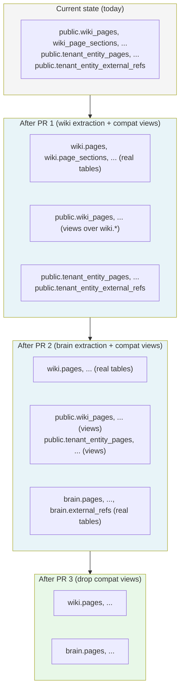

# refactor: Extract wiki and brain feature clusters into dedicated Postgres schemas

## Summary

Extract the wiki feature cluster (9 tables) and the brain / entity-pages feature cluster (6 tables) out of `public.*` into two dedicated Postgres schemas — `wiki.*` and `brain.*` — using the hand-rolled migration pattern established by the `compliance` schema. Shipped as two sequential PRs: PR 1 handles wiki and lands a thin reusable pattern doc; PR 2 finishes brain by consuming the pattern. Internal table names drop their now-redundant prefixes during the move (so `wiki.pages`, `brain.pages`, etc.) and one cross-cluster code path in `packages/api/src/lib/brain/repository.ts` is updated in phases. Wire-format discriminators stay opaque, no compatibility views are introduced, and no functional behavior changes.

---

## Problem Frame

`packages/database-pg/src/schema/` now holds ~55 files in a flat layout, and two of the largest — `wiki.ts` (22.8 KB, 9 tables) and `tenant-entity-pages.ts` (8.9 KB, 5 tables, plus the 1-table satellite `tenant-entity-external-refs.ts`) — define structurally similar features that both live in `public.*`. Operator-facing tools (`psql \dt`, BI tools, backups) see fifteen `wiki_*` / `tenant_entity_*` tables crowding the public namespace. Consumer code mirrors the same flatness across `packages/api/src/lib/{wiki,brain}/*`, `packages/api/src/handlers/wiki-*.ts`, GraphQL resolvers, scripts, and the mobile RN SDK.

The `compliance` schema (migration `packages/database-pg/drizzle/0069_compliance_schema.sql`, 2026-05-06) proved the `pgSchema(...)` + hand-rolled SQL pattern works in this codebase. What hasn't been done yet is applying the pattern to *live, populated tables* with non-trivial consumer surface — and wiki + brain absorb the highest density of "schema noise" in one motion (see origin: `docs/brainstorms/2026-05-16-wiki-brain-schema-extraction-requirements.md` Problem Frame).

The institutional learning `docs/solutions/workflow-issues/manually-applied-drizzle-migrations-drift-from-dev-2026-04-21.md` documents four prior drift incidents (0008, 0012, 0018/0019, 0036–0039) where hand-rolled migrations weren't applied to dev before merge. A wiki/brain schema move that ships without `psql -f` to dev + prod would cause every GraphQL resolver in `packages/api` to 500 on first call, because Drizzle's generated SQL would query `wiki.pages` against a DB still holding `public.wiki_pages`. The cost of leaving this alone is structural noise; the cost of doing it wrong is a production outage.

---

## Requirements

Carrying forward from origin (R-IDs preserved):

**Wiki schema move**
- R1. Nine wiki tables move from `public.*` to `wiki.*` in a single hand-rolled migration; `wiki_` prefix dropped during the move: `wiki.pages`, `wiki.page_sections`, `wiki.page_links`, `wiki.page_aliases`, `wiki.unresolved_mentions`, `wiki.section_sources`, `wiki.compile_jobs`, `wiki.compile_cursors`, `wiki.places`.
- R2. `packages/database-pg/src/schema/wiki.ts` declares `pgSchema("wiki")` and re-exports renamed tables via the canonical compliance pattern (see origin: Requirements R2).
- R3. **Narrowed from origin.** Wiki resolver pieces under `packages/api/src/graphql/resolvers/memory/*` that are functionally part of the wiki feature (`loaders.ts`, `recentWikiPages.query.ts`, `mobileWikiSearch.query.ts`, `types.ts`) get **import rewires only** in PR 1; physical relocation to `resolvers/wiki/*` is explicitly deferred (see Scope Boundaries → Deferred to Follow-Up Work).
- R4. Wiki PR audits and updates every wiki consumer: 11 wiki resolvers, 4 wiki-functional memory resolvers, ~17 files under `packages/api/src/lib/wiki/*`, 5 wiki-related handlers under `packages/api/src/handlers/` (not `packages/lambda/`), 12 maintenance scripts under `packages/api/scripts/wiki-*.ts`, and 9 wiki test files. Full enumeration in U4–U6.

**Brain schema move**
- R5. Six brain tables move from `public.*` to `brain.*` in a single hand-rolled migration; `tenant_entity_` prefix dropped during the move: `brain.pages`, `brain.page_sections`, `brain.page_links`, `brain.page_aliases`, `brain.section_sources`, `brain.external_refs`.
- R6. `packages/database-pg/src/schema/tenant-entity-pages.ts` + `tenant-entity-external-refs.ts` consolidate into `packages/database-pg/src/schema/brain.ts` declaring `pgSchema("brain")`.
- R7. Brain PR audits and updates every brain consumer: 5 brain resolvers, ~8 files under `packages/api/src/lib/brain/*` (notably `repository.ts` which holds the cross-cluster UNION), `packages/react-native-sdk/src/brain.ts` (queries update internally; public API names unchanged), brain-related scripts, and brain test files.
- R8. `lib/wiki/` and `lib/brain/` remain distinct module trees; nothing folds across the feature boundary.

**Migration mechanics (shared across both PRs)**
- R9. Each migration uses the hand-rolled SQL pattern mirroring `0069_compliance_schema.sql`: header documentation, `\set ON_ERROR_STOP on`, `BEGIN;` ... `COMMIT;`, `SET LOCAL lock_timeout / statement_timeout`, `current_database()` guard, and `CREATE SCHEMA IF NOT EXISTS <name>`. Body uses `ALTER TABLE public.<old> SET SCHEMA <name>` followed by `ALTER TABLE <name>.<old> RENAME TO <new>`.
- R10. Each migration declares `-- creates:` markers for every table in its new home plus `-- creates-constraint:` markers for FK constraints that move with the tables (the `pg_constraint` namespace path changes when the parent table moves — see Risks).
- R11. Each migration is applied manually to dev and prod via `psql -f` before its PR merges; the PR contains both the SQL file and all consumer-code changes.
- R12. Each migration creates compatibility views in `public.*` mirroring the new tables (e.g., `CREATE VIEW public.wiki_pages AS SELECT * FROM wiki.pages`) so old bundled Lambda code keeps reading during the deploy bridge window. Views remain until PR 3 (cleanup) drops them after Lambda redeploys have stabilized across all stages. This reverses the brainstorm's "no compat views" stance — the carrying cost (one tiny cleanup PR) is much smaller than the production outage window the original design produced.

**Pattern doc**
- R13. PR 1 lands a reusable pattern doc at `docs/solutions/database-issues/feature-schema-extraction-pattern.md` covering: when a feature earns its own schema, the migration template, `-- creates:` marker conventions, Drizzle `pgSchema(...)` wiring, deploy-order rule (psql before merge), consumer-audit checklist, tsbuildinfo cleanup, and bundled-Lambda redeploy verification.
- R14. Pattern doc enumerates next obvious candidates (routines, sandbox, evaluations, agents, mcp, webhooks) as a non-binding "future applicants" list.

**PR sequencing and review surface**
- R15. PR sequencing: PR 1 (wiki) ships first and lands the pattern doc + the pre-merge CI gate (R18). PR 2 (brain) ships second and references the doc. PR 3 (cleanup) drops the compat views in `public.*` after both schema-move PRs have been stable in prod for at least one deploy cycle.
- R16. Each schema-move PR (PRs 1 and 2) is forward-revertible. Compat views in `public.*` (R12) mean even a same-day rollback keeps application code functional during the window — old query paths via `public.<old_name>` views continue to resolve. Codegen artifacts and the shared `draft-review-writeback.test.ts` cross PR boundaries; emergency rollback after PR 2 has merged requires reverting in reverse order (PR 2 first, then PR 1).
- R17. PR 3 (cleanup) drops all compat views in `public.*` created by PRs 1 and 2. Authored as a single hand-rolled SQL file with `-- drops:` markers for the drift reporter. Pre-flight invariants confirm no application code still references the views (grep against `packages/api/src/` and `packages/react-native-sdk/src/` for `public.wiki_*` / `public.tenant_entity_*` returns zero hits). Ships independently and reverts independently of PRs 1 and 2.
- R18. PR 1 lands a pre-merge CI gate in `.github/workflows/ci.yml` that runs `pnpm db:migrate-manual` against the dev DB on every PR that touches `packages/database-pg/drizzle/*.sql`. Fails the PR check on MISSING or UNVERIFIED markers, blocking merge until the operator has applied the migration to dev. This is a single-connection job — distinct from the disabled deploy-time `migration-drift-check` gate (whose flake is about ~150 per-object connections, not relevant here).

---

## High-Level Technical Design

This illustrates the intended state transitions and is directional guidance for review, not implementation specification. The implementing agent should treat it as context.

**Cross-cluster JOIN handling.** `packages/api/src/lib/brain/repository.ts` UNIONs `wiki_pages` with `tenant_entity_pages` and emits `targetPageTable: "wiki_pages" | "tenant_entity_pages"` as a wire literal. The two PRs handle this asymmetry:

- **PR 1 (wiki):** updates the wiki-side of the UNION to `wiki.pages` while leaving the brain-side untouched (`public.tenant_entity_pages`). The wire-format literals stay unchanged — `"wiki_pages"` and `"tenant_entity_pages"` are opaque discriminators, decoupled from the storage location (see Key Technical Decisions → Wire-format discriminator stability).
- **PR 2 (brain):** updates the brain-side of the UNION to `brain.pages`. Wire literals still unchanged.

This keeps the mobile SDK (`packages/react-native-sdk/src/brain.ts`) unaffected across both PRs — it observes the same wire strings before and after.

**Compat-view bridge.** During the deploy window between `psql -f` apply and bundled-Lambda redeploy completion, old in-flight Lambda code continues to query `public.wiki_pages` (etc.). Each schema-move migration creates `CREATE VIEW public.<old> AS SELECT * FROM <new_schema>.<new>` for every moved table, so both query paths resolve simultaneously: old Lambdas read via the view, new Lambdas read the underlying table directly. PR 3 drops the views once deploys settle. Postgres simple views are auto-updatable, so any writes via the old name also pass through. This eliminates the deploy-window outage the original atomic-per-PR design would have produced.

---

## Implementation Units

### Phase A — Wiki PR (PR 1)

### U1. Author feature-schema-extraction pattern doc

**Goal:** Land a thin, reusable pattern doc that captures the migration template, deploy discipline, and consumer-audit checklist so the brain PR (and future schema-extract sessions) consume it as a real reader.

**Requirements:** R13, R14

**Dependencies:** None — independent first step

**Files:**
- `docs/solutions/database-issues/feature-schema-extraction-pattern.md` (new)

**Approach:**
- Follow the existing `docs/solutions/<category>/<topic>-YYYY-MM-DD.md` frontmatter convention.
- Sections to cover: when to extract a schema (multi-file feature cluster + operator-facing namespace win + clean lib boundary), the hand-rolled migration template (header, transactional wrapper, `lock_timeout`/`statement_timeout`, `current_database()` guard, `to_regclass()` pre-flight invariants, `SET SCHEMA + RENAME`, `-- creates:` and `-- creates-constraint:` markers), Drizzle `pgSchema(...)` wiring (mirroring `compliance.ts`), deploy-order rule (apply to dev + prod via `psql -f` before PR merge), consumer-audit checklist (Drizzle imports, raw SQL via `rg 'FROM public\.<table>|JOIN public\.<table>'`, codegen consumers, bundled Lambdas), tsbuildinfo cleanup discipline, bundled-Lambda redeploy verification, and a "future applicants" non-binding list (routines, sandbox, evaluations, agents, mcp, webhooks).
- Reference back to `0069_compliance_schema.sql` as the canonical example, and link the manually-applied-migrations learning at `docs/solutions/workflow-issues/manually-applied-drizzle-migrations-drift-from-dev-2026-04-21.md`.

**Patterns to follow:**
- Existing solutions docs under `docs/solutions/database-issues/` for frontmatter and structure
- `docs/solutions/workflow-issues/manually-applied-drizzle-migrations-drift-from-dev-2026-04-21.md` for the migration-discipline runbook style

**Test scenarios:** Test expectation: none — documentation only.

**Verification:** Doc renders cleanly via the Starlight build; cross-references resolve to existing files.

---

### U2. Wiki Drizzle source rewrite

**Goal:** Convert `wiki.ts` from `pgTable(...)` declarations in `public.*` to `pgSchema("wiki").table(...)` declarations matching the compliance precedent, with internal table names un-prefixed (`pages`, `page_sections`, `page_links`, `page_aliases`, `unresolved_mentions`, `section_sources`, `compile_jobs`, `compile_cursors`, `places`).

**Requirements:** R1, R2

**Dependencies:** U1 (pattern doc exists for reference; not a code dependency)

**Files:**
- `packages/database-pg/src/schema/wiki.ts` (modified)
- `packages/database-pg/src/schema/index.ts` (verify re-export still resolves)

**Approach:**
- Add `pgSchema` to the import list; declare `export const wiki = pgSchema("wiki");` at module top, mirroring `packages/database-pg/src/schema/compliance.ts` line 40.
- Replace every `pgTable("wiki_pages", ...)` with `wiki.table("pages", ...)`. Keep the TypeScript export identifiers (`wikiPages`, `wikiPageSections`, etc.) so consumer imports don't churn — only the second-argument table name changes.
- Preserve all `.references()` callbacks unchanged, including cross-schema references to `tenants` and `users` (see Key Technical Decisions → Cross-schema FKs).
- Preserve all index, unique index, and check constraint declarations. Note that GIN access methods (e.g., `wiki_pages.search_tsv`) are authoritative in the SQL migration, not the Drizzle source (per the comment at `compliance.ts:170–172` — the same applies here).
- Preserve all relations declarations and the schema-derived type exports.

**Patterns to follow:**
- `packages/database-pg/src/schema/compliance.ts` for `pgSchema(...).table(...)` shape, imports, and type-export layout
- `packages/database-pg/src/schema/index.ts:51–53` (existing `wiki` re-export) — no structural change required there, but verify it still works

**Test scenarios:**
- Happy path: `pnpm --filter @thinkwork/database-pg typecheck` passes. Drizzle-generated row types for `wikiPages` (and all 8 other tables) match pre-change shape — verified by importing into a test and asserting on the `InferSelectModel<typeof wikiPages>` type signature.
- Integration: `packages/api` typecheck passes against the rewritten schema after a clean `tsbuildinfo` rebuild (this catches any consumer that destructured a table by its old in-DB name vs the TS export identifier).

**Verification:** `pnpm --filter @thinkwork/database-pg build` succeeds; `pnpm --filter @thinkwork/api typecheck` succeeds after `find . -name "tsconfig.tsbuildinfo" -not -path "*/node_modules/*" -delete && pnpm --filter @thinkwork/database-pg build`.

---

### U3. Wiki hand-rolled migration SQL

**Goal:** Author the operator-applied SQL migration that moves wiki tables from `public.*` to `wiki.*` and renames them to drop the `wiki_` prefix, with full drift-gate marker coverage.

**Requirements:** R1, R9, R10, R11

**Dependencies:** U2 (Drizzle source matches the post-migration DB state)

**Files:**
- `packages/database-pg/drizzle/NNNN_wiki_schema_extraction.sql` (new — `NNNN` = next sequence per `pnpm --filter @thinkwork/database-pg db:generate` convention, currently 0086+)

**Approach:**
- Header block: file purpose, plan reference, brainstorm reference, manual-apply command (`psql "$DATABASE_URL" -f packages/database-pg/drizzle/NNNN_wiki_schema_extraction.sql`), verification commands (`pnpm db:migrate-manual`, `psql -c "\dt wiki.*"`), and the inverse runbook for rollback (`ALTER TABLE wiki.pages SET SCHEMA public; ALTER TABLE public.pages RENAME TO wiki_pages;` × 9).
- Marker block: one `-- creates: wiki.<table>` per moved table (9 total). For FK constraints whose `pg_constraint` namespace path changes when their parent table moves, add `-- creates-constraint: wiki.<table>.<constraint_name>` markers — the drift reporter's constraint probe (`scripts/db-migrate-manual.sh` constraint-marker handler) joins `pg_catalog.pg_constraint`/`pg_class`/`pg_namespace`, so the namespace move counts as a create from the reporter's view.
- Body: `\set ON_ERROR_STOP on`, `BEGIN;`, `SET LOCAL lock_timeout = '5s'; SET LOCAL statement_timeout = '60s';`, `DO $$ ... RAISE EXCEPTION IF current_database() != 'thinkwork' ... $$;`.
- Pre-flight invariants (one `DO $$` block per table): assert `to_regclass('public.wiki_pages') IS NOT NULL` AND `to_regclass('wiki.pages') IS NULL` before moving. Refuses to re-apply over a partially-completed previous run.
- `CREATE SCHEMA IF NOT EXISTS wiki;` followed by `COMMENT ON SCHEMA wiki IS '...';`.
- Per-table: `ALTER TABLE public.wiki_pages SET SCHEMA wiki;` then `ALTER TABLE wiki.wiki_pages RENAME TO pages;`. Order tables by FK topology — leaf tables first (`wiki_compile_cursors`, `wiki_compile_jobs`, `wiki_places`), then `wiki_pages` (depended on by everything else), then `wiki_page_sections`, `wiki_page_links`, `wiki_page_aliases`, `wiki_unresolved_mentions`, `wiki_section_sources`. Postgres preserves FKs across `SET SCHEMA` automatically.
- Compat-view creation per table: after each table is moved and renamed, `CREATE VIEW public.wiki_pages AS SELECT * FROM wiki.pages;` (etc.) so old bundled Lambda code keeps resolving its queries during the deploy bridge window. One `-- creates: public.wiki_pages` marker per view in the marker block.
- Advisory lock as the first statement after `BEGIN;` (before pre-flight invariants): `SELECT pg_advisory_xact_lock(hashtext('wiki_schema_extraction'));` — serializes concurrent application attempts (two operators racing, automation + operator overlap). Documented in the header.
- `COMMIT;`.

**Patterns to follow:**
- `packages/database-pg/drizzle/0069_compliance_schema.sql` for header, marker block, transactional wrapper, and idempotency conventions (every `CREATE SCHEMA` uses `IF NOT EXISTS`; tables only move once due to the pre-flight invariant)
- `docs/solutions/workflow-issues/manually-applied-drizzle-migrations-drift-from-dev-2026-04-21.md` header template

**Test scenarios:** Test expectation: none — SQL migration; verified via drift-gate probe and post-apply schema introspection (covered in Verification).

**Verification:**
- AE1 from origin: drift gate (`pnpm db:migrate-manual` against dev) reports all 9 `creates:` markers + all FK `creates-constraint:` markers present.
- Manual: `psql -c "\dt wiki.*"` returns the 9 expected tables; `psql -c "\dt public.wiki_*"` returns 0 rows.
- AE2 from origin (negative test, validated locally only): temporarily delete one `-- creates:` marker from the file, run `pnpm db:migrate-manual`, confirm exit 1 with MISSING report; restore the marker.
- Re-apply safety: running `psql -f` twice should fail cleanly on the pre-flight invariant rather than corrupt the schema.

---

### U4. Wiki resolver layer + memory-resolver import rewires

**Goal:** Update every GraphQL resolver that queries wiki tables to use the new schema-qualified Drizzle handles, including the 4 wiki-functional files under `resolvers/memory/*` (imports only — physical relocation deferred per R3).

**Requirements:** R3 (narrowed), R4

**Dependencies:** U2 (Drizzle source provides the new handles), U3 (migration must be applied to dev before tests run)

**Files (modified):**
- `packages/api/src/graphql/resolvers/wiki/index.ts`
- `packages/api/src/graphql/resolvers/wiki/wikiPage.query.ts`
- `packages/api/src/graphql/resolvers/wiki/wikiBacklinks.query.ts`
- `packages/api/src/graphql/resolvers/wiki/wikiConnectedPages.query.ts`
- `packages/api/src/graphql/resolvers/wiki/wikiSearch.query.ts`
- `packages/api/src/graphql/resolvers/wiki/wikiGraph.query.ts` (contains raw SQL `FROM wiki_pages`, `JOIN wiki_page_links` — must update to `wiki.pages`, `wiki.page_links`)
- `packages/api/src/graphql/resolvers/wiki/wikiCompileJobs.query.ts`
- `packages/api/src/graphql/resolvers/wiki/resetWikiCursor.mutation.ts`
- `packages/api/src/graphql/resolvers/wiki/compileWikiNow.mutation.ts`
- `packages/api/src/graphql/resolvers/wiki/bootstrapJournalImport.mutation.ts`
- `packages/api/src/graphql/resolvers/wiki/mappers.ts`
- `packages/api/src/graphql/resolvers/memory/loaders.ts` (wiki-functional — DataLoader for `wikiPagesByMemoryRecord`)
- `packages/api/src/graphql/resolvers/memory/recentWikiPages.query.ts`
- `packages/api/src/graphql/resolvers/memory/mobileWikiSearch.query.ts`
- `packages/api/src/graphql/resolvers/memory/types.ts`

**Approach:**
- For Drizzle-based queries: import changes only — the TS export identifier (`wikiPages`) stays the same; consumers were using the identifier, not the in-DB name.
- For raw SQL strings (`wikiGraph.query.ts` is the primary case): replace every `FROM wiki_pages`, `JOIN wiki_pages`, `FROM wiki_page_links`, etc. with the schema-qualified equivalent (`FROM wiki.pages`, etc.). Use `rg 'FROM public\.wiki|JOIN public\.wiki|FROM wiki_|JOIN wiki_' packages/api/src/graphql/resolvers/` to enumerate before editing — anything that hand-builds SQL bypasses Drizzle.
- Memory-resolver wiki-functional files: only update imports / raw SQL references. **Do not** move the files to `resolvers/wiki/*` in this PR (deferred per R3 and Scope Boundaries).
- Preserve all wire-format GraphQL field names (`wikiPages`, `wikiPage.sections`, etc.) — these are GraphQL contracts and renaming would break codegen consumers (admin, mobile, cli).

**Patterns to follow:**
- Existing resolver patterns in the same `resolvers/wiki/` directory
- For raw-SQL resolvers, mirror the schema-qualified SQL form used elsewhere when querying compliance tables (where `pgSchema` is already in production)

**Test scenarios:**
- Happy path: each wiki resolver returns identical results to pre-PR when called with the same inputs against a DB with the migration applied. Existing tests in `packages/api/src/__tests__/wiki-resolvers.test.ts`, `wiki-backlinks-resolver.test.ts`, `memory-wiki-pages.test.ts`, `mobile-wiki-search.test.ts` must pass after update.
- Edge case: `wikiGraph.query.ts` raw SQL returns the same graph topology (nodes + edges) on a populated dev DB before and after. Verified by snapshot-comparing the output of a small fixture run.
- Covers AE3 from origin: `mobileWikiSearch` query post-rewire returns shape-identical results to pre-PR; verified by the existing `mobile-wiki-search.test.ts` after migration apply.
- Error path: `wikiPage.query.ts` against a non-existent page ID still returns `null`/empty appropriately.

**Verification:**
- `pnpm --filter @thinkwork/api test -- src/__tests__/wiki-resolvers.test.ts src/__tests__/wiki-backlinks-resolver.test.ts src/__tests__/memory-wiki-pages.test.ts src/__tests__/mobile-wiki-search.test.ts` passes against dev DB with the migration applied.
- `rg 'FROM public\.wiki|JOIN public\.wiki|wiki_pages|wiki_page_' packages/api/src/graphql/resolvers/` returns zero hits (except in test fixtures that intentionally use the old names for migration-context assertions, if any).

---

### U5. Wiki lib, handlers, scripts + cross-cluster UNION (wiki-side)

**Goal:** Update every non-resolver wiki consumer — library code with raw SQL, Lambda handlers, maintenance scripts, and the wiki-side of the cross-cluster UNION in `lib/brain/repository.ts`.

**Requirements:** R4

**Dependencies:** U2, U3, U4 (resolver layer should be done first to localize raw-SQL fixes)

**Files (modified):**
- `packages/api/src/lib/wiki/repository.ts` (raw SQL on `wiki_unresolved_mentions`, multi-table queries)
- `packages/api/src/lib/wiki/compiler.ts`
- `packages/api/src/lib/wiki/enqueue.ts`
- `packages/api/src/lib/wiki/link-density-reporter.ts`
- `packages/api/src/lib/wiki/places-service.ts`
- `packages/api/src/lib/wiki/readPlaceMetadata.ts`
- `packages/api/src/lib/wiki/draft-compile.ts` (also references `tenant_entity_pages` — leave brain-side untouched in this PR)
- `packages/api/src/lib/wiki/aggregation-planner.ts`
- `packages/api/src/lib/wiki/planner.ts`
- `packages/api/src/lib/wiki/parent-expander.ts`
- `packages/api/src/lib/wiki/link-backfill.ts` (raw SQL UPDATE on wiki_pages)
- `packages/api/src/lib/wiki/rebuild-runner.ts` (raw SQL on `wiki_compile_jobs`)
- `packages/api/src/lib/wiki/search.ts` (raw SQL `FROM wiki_page_aliases`, `wiki_pages`)
- `packages/api/src/lib/wiki/templates.ts`
- `packages/api/src/lib/wiki/aliases.ts`
- `packages/api/src/lib/wiki/deterministic-linker.ts`
- `packages/api/src/lib/wiki/section-writer.ts`
- `packages/api/src/lib/brain/repository.ts` (**wiki-side of UNION only** — update `'wiki_pages'::text AS "pageTable"` literal references to query `wiki.pages` while emitting the literal string `'wiki_pages'` over the wire unchanged; leave the `tenant_entity_pages` side alone for PR 2)
- `packages/api/src/lib/context-engine/providers/memory.ts`
- `packages/api/src/lib/context-engine/providers/wiki-source-agent.ts`
- `packages/api/src/lib/user-storage.ts` (touches wiki rows via deletions)
- `packages/api/src/handlers/wiki-compile.ts`
- `packages/api/src/handlers/wiki-bootstrap-import.ts`
- `packages/api/src/handlers/wiki-lint.ts` (raw SQL inside)
- `packages/api/src/handlers/wiki-export.ts`
- `packages/api/src/handlers/memory-retain.ts` (touches wiki via compile-enqueue path)
- `packages/api/scripts/wiki-link-backfill.ts`
- `packages/api/scripts/wiki-places-refresh.ts`
- `packages/api/scripts/wiki-places-audit.ts`
- `packages/api/scripts/wiki-places-drift-snapshot.ts`
- `packages/api/scripts/wiki-link-density-baseline.ts`
- `packages/api/scripts/wiki-parent-link-audit.ts`
- `packages/api/scripts/wiki-rebuild-verify.ts`
- `packages/api/scripts/journal-import-resume.ts`
- `packages/api/scripts/wipe-external-memory-stores.ts`
- `packages/api/scripts/regen-all-workspace-maps.ts`
- `packages/api/scripts/backfill-materialize-workspaces.ts`

**Approach:**
- Run a consumer survey first as a sanity check, using the recipe from `docs/solutions/workflow-issues/survey-before-applying-parent-plan-destructive-work-2026-04-24.md`:
  - `rg -l 'wiki_pages|wiki_page_sections|wiki_page_links|wiki_page_aliases|wiki_unresolved_mentions|wiki_section_sources|wiki_compile_jobs|wiki_compile_cursors|wiki_places' packages/api/src/` plus `apps/admin/src/ apps/mobile/ packages/skill-catalog/ packages/agentcore-strands/`
  - `rg 'FROM public\.wiki|JOIN public\.wiki|FROM wiki_|JOIN wiki_' .`
  - Compare against this U-5 file list; investigate any deltas before editing.
- For Drizzle-based queries: update import paths (the TS export identifier stays the same).
- For raw SQL strings: replace `wiki_*` table references with `wiki.*` qualified names.
- For `lib/brain/repository.ts` UNION: update the `wiki_pages` side to `wiki.pages` in the SQL query body, but keep the `'wiki_pages'::text AS "pageTable"` literal *string* emission unchanged. The literal is a wire discriminator (see Key Technical Decisions → Wire-format discriminator stability).
- Lambda handlers must rebuild correctly via `pnpm build:lambdas`; the bundled handlers (`graphql-http`, `wiki-compile`, `wiki-bootstrap-import`, `memory-retain` per the `BUNDLED_AGENTCORE_ESBUILD_FLAGS` list in `scripts/build-lambdas.sh`) inline the Drizzle source, so a stale build means stale references.

**Patterns to follow:**
- Existing `packages/api/src/lib/wiki/*` patterns (the file shapes don't change, only references inside)
- Lambda build pattern via `pnpm build:lambdas` or `bash scripts/build-lambdas.sh <handler>`

**Test scenarios:**
- Happy path: existing lib + handler tests pass after migration apply (`packages/api/src/__tests__/wiki-enqueue.test.ts`, `wiki-journal-import.test.ts`, `wiki-draft-compile.test.ts`, `wiki-link-backfill.test.ts`, `wiki-compile.test.ts` colocated with handler).
- Edge case: `lib/brain/repository.ts` UNION query against a DB with both `wiki.pages` populated and `public.tenant_entity_pages` still populated returns the same combined results as pre-PR. Verified by running a fixture against dev between U3 apply and PR 2 merge.
- Integration: bundled Lambda `wiki-compile` runs end-to-end via a synthetic enqueue event in dev; produces a compiled wiki page identical in shape to pre-PR.
- Wire format: every emitted `pageTable: "wiki_pages"` literal still reads `"wiki_pages"` in the response. Verified by snapshot-asserting the brain enrichment fixture output.
- Error path: scripts under `packages/api/scripts/` exit cleanly when run against the dev DB (most are read-only; the destructive ones — `wipe-external-memory-stores.ts` — should not be exercised in this verification, only typechecked).

**Verification:**
- `pnpm --filter @thinkwork/api test` passes against dev DB with migration applied.
- `pnpm build:lambdas` succeeds; all five wiki-touching handlers build clean.
- `rg 'FROM public\.wiki|JOIN public\.wiki|wiki_pages|wiki_page_' packages/api/src/lib/ packages/api/src/handlers/ packages/api/scripts/` returns zero hits (in production SQL strings; tests may legitimately reference old names).

---

### U6. Wiki codegen sweep, test rewires, and PR-1 verification

**Goal:** Regenerate GraphQL codegen in every downstream consumer, update the wiki test suite, and verify the wiki PR is ready to ship (typecheck clean, tests green, bundled Lambdas rebuilt, drift gate clean against dev).

**Requirements:** R4, R11

**Dependencies:** U4, U5

**Files (modified):**
- `apps/admin/src/gql/` (codegen-generated — `pnpm --filter @thinkwork/admin codegen`)
- `apps/mobile/lib/gql/` (codegen-generated — `pnpm --filter @thinkwork/mobile codegen`)
- `apps/cli/src/gql/` (codegen-generated — `pnpm --filter @thinkwork/cli codegen`)
- `terraform/schema.graphql` (regenerated via `pnpm schema:build`)
- `packages/api/src/__tests__/wiki-resolvers.test.ts`
- `packages/api/src/__tests__/wiki-backlinks-resolver.test.ts`
- `packages/api/src/__tests__/wiki-enqueue.test.ts`
- `packages/api/src/__tests__/wiki-journal-import.test.ts`
- `packages/api/src/__tests__/wiki-draft-compile.test.ts`
- `packages/api/src/__tests__/wiki-link-backfill.test.ts`
- `packages/api/src/__tests__/memory-wiki-pages.test.ts`
- `packages/api/src/__tests__/mobile-wiki-search.test.ts`
- `packages/api/src/__tests__/draft-review-writeback.test.ts`

**Approach:**
- Run codegen in each consumer that has the script: admin, mobile, cli. `packages/api` has no codegen script (confirmed) — skip.
- Run `pnpm schema:build` to regenerate `terraform/schema.graphql` (AppSync subscription schema derivative).
- Update test files: any test that constructs raw SQL or asserts on specific table names. Tests that go through Drizzle handles don't need changes (the identifier stays the same). Tests that go through GraphQL don't need changes (GraphQL contract stays the same). The actual change is small.
- Bootstrap discipline before final typecheck (per `docs/solutions/build-errors/worktree-stale-tsbuildinfo-drizzle-implicit-any-2026-04-24.md`):
  - `find . -name "tsconfig.tsbuildinfo" -not -path "*/node_modules/*" -delete`
  - `pnpm --filter @thinkwork/database-pg build`
  - `pnpm -r --if-present typecheck`
- Verify drift gate against dev: `pnpm db:migrate-manual` (must report all wiki migration markers as APPLIED).
- Verify bundled Lambdas have fresh bundles: `pnpm build:lambdas` produces non-stale outputs; spot-check `dist/lambdas/wiki-compile/index.mjs` references `wiki.pages` (or the schema-qualified form Drizzle emits) rather than `public.wiki_pages`.

**Patterns to follow:**
- The codegen pattern documented in CLAUDE.md: "After editing GraphQL types, **regenerate codegen** in every consumer that has a `codegen` script"
- The tsbuildinfo cleanup discipline from `docs/solutions/build-errors/worktree-stale-tsbuildinfo-drizzle-implicit-any-2026-04-24.md`

**Test scenarios:**
- Full repo typecheck: `pnpm -r --if-present typecheck` passes after the bootstrap step.
- Full wiki test pass: every file in the Files list runs green via `pnpm --filter @thinkwork/api test -- <each file>`.
- Codegen idempotency: re-running codegen produces no diff (no spurious churn from non-deterministic generation).

**Verification:**
- All test files in the list pass.
- `pnpm format:check` clean.
- `pnpm db:migrate-manual` against dev reports all wiki migration markers APPLIED with zero MISSING.
- Manual smoke: admin SPA loads `/wiki/<some-page-slug>` against dev; mobile app's wiki search returns expected results; no GraphQL errors in either client.

---

### U10. Pre-merge CI gate for hand-rolled migration markers

**Goal:** Add a single-connection CI job that runs `pnpm db:migrate-manual` against the dev DB on every PR touching `packages/database-pg/drizzle/*.sql`. Mechanically enforces the operator-discipline rule that hand-rolled migrations must be applied to dev before merge.

**Requirements:** R18

**Dependencies:** None — independent. Ships in PR 1 alongside U1–U6 so the wiki migration is its own first beneficiary.

**Files:**
- `.github/workflows/ci.yml` (modified)

**Approach:**
- Add a new job `migration-drift-precheck` that runs on `pull_request` events. Conditional on the PR touching `packages/database-pg/drizzle/*.sql` (use `paths` filter or a `dorny/paths-filter` step).
- Resolve dev `DATABASE_URL` from Secrets Manager via the same pattern used by the disabled `migration-drift-check` job in `.github/workflows/deploy.yml` (Secrets Manager + terraform outputs + `sslmode=require` enforcement). Reuse the resolution snippet — do NOT copy-paste; extract a shared script if needed.
- Run `bash scripts/db-migrate-manual.sh`. Exit code 1 fails the job and blocks merge.
- Key difference from the disabled deploy-time gate: this runs once per PR (not on every deploy), opens a single short-lived connection (not ~150 per-object probes), and fails the PR check (not the deploy). The connection-rate flake that caused `migration-drift-check` to be disabled does not apply at this scale.
- Document the gate's purpose in a comment at the top of the job definition: "Pre-merge gate ensuring hand-rolled migrations are applied to dev before merge. See docs/solutions/workflow-issues/manually-applied-drizzle-migrations-drift-from-dev-2026-04-21.md."

**Patterns to follow:**
- `.github/workflows/deploy.yml` `migration-drift-check` job (lines ~816–879) for the DATABASE_URL resolution and script invocation pattern
- `scripts/db-migrate-manual.sh` for the underlying check

**Test scenarios:**
- Happy path: a PR adds `packages/database-pg/drizzle/NNNN_wiki_schema_extraction.sql` with all `-- creates:` markers; operator has applied via `psql -f` to dev; CI job exits 0 and reports APPLIED.
- Negative path: same PR but operator forgot to apply to dev; CI job exits 1 with `MISSING <object>` in the report; PR check shows red; merge is blocked.
- No-op path: a PR that doesn't touch `packages/database-pg/drizzle/*.sql` does not trigger the job (paths filter excludes it).
- Marker drift: a PR adds a migration file with no `-- creates:` markers at all; CI job exits 1 with `UNVERIFIED` reported.

**Verification:**
- Open a test PR locally (or use the wiki PR itself as the first test) and confirm the job runs.
- Run the script locally first (`bash scripts/db-migrate-manual.sh` after `export DATABASE_URL=...`) to verify behavior outside CI.
- Confirm the dev `DATABASE_URL` resolution works in the GHA environment (Secrets Manager + AWS credentials configured in the workflow).

---

### Phase B — Brain PR (PR 2)

### U7. Brain Drizzle source rewrite

**Goal:** Consolidate `tenant-entity-pages.ts` + `tenant-entity-external-refs.ts` into a single `brain.ts` declaring `pgSchema("brain")` with un-prefixed table names (`pages`, `page_sections`, `page_links`, `page_aliases`, `section_sources`, `external_refs`).

**Requirements:** R5, R6, R8

**Dependencies:** PR 1 merged (so the pattern doc exists and the wiki side of `lib/brain/repository.ts` UNION already references `wiki.pages`)

**Files:**
- `packages/database-pg/src/schema/brain.ts` (new — replaces the two existing files)
- `packages/database-pg/src/schema/tenant-entity-pages.ts` (deleted)
- `packages/database-pg/src/schema/tenant-entity-external-refs.ts` (deleted)
- `packages/database-pg/src/schema/index.ts` (update re-exports: remove the two old paths, add `export * from "./brain";`)

**Approach:**
- Mirror U2's approach: `pgSchema("brain")` declared at top, every `pgTable(...)` becomes `brain.table(...)` with un-prefixed names. Preserve `.references()` to `tenants` (cross-schema FK kept per Key Technical Decisions).
- Preserve all enum constants and TS type exports. Keep the existing TS export identifiers (`tenantEntityPages`, `tenantEntityPageSections`, etc.) so consumer imports don't churn — only the in-DB table name changes.
- Preserve the existing `RESTRICT` FK from `tenant_entity_section_sources` → `tenant_entity_page_sections` (deliberate, not `CASCADE`).
- Preserve all check constraints (`type IN ('entity','topic','decision')`, `entity_subtype IN ('customer','opportunity','order','person')`, `source_kind IN (...)`, `ttl_seconds > 0`).
- Update `index.ts` to re-export from `./brain` instead of the two old files.

**Patterns to follow:**
- U2's approach (now established for wiki)
- The pattern doc from U1

**Test scenarios:**
- Happy path: `pnpm --filter @thinkwork/database-pg typecheck` passes. Drizzle row types for `tenantEntityPages`, `tenantEntityPageSections`, etc. match pre-change shape.
- Integration: `packages/api` typecheck passes after tsbuildinfo cleanup.

**Verification:** `pnpm --filter @thinkwork/database-pg build` succeeds; `pnpm --filter @thinkwork/api typecheck` clean after bootstrap step.

---

### U8. Brain hand-rolled migration SQL

**Goal:** Author the operator-applied SQL migration that moves brain tables from `public.*` to `brain.*` and renames them.

**Requirements:** R5, R9, R10, R11

**Dependencies:** U7 (Drizzle source matches post-migration DB state), PR 1 merged + wiki migration already applied to all stages

**Files:**
- `packages/database-pg/drizzle/NNNN_brain_schema_extraction.sql` (new — next sequence)

**Approach:**
- Mirror U3 exactly, with the brain table list:
  - Advisory lock: `SELECT pg_advisory_xact_lock(hashtext('brain_schema_extraction'));` as the first statement after `BEGIN;`.
  - Leaf-first FK ordering: `tenant_entity_external_refs`, `tenant_entity_page_links`, `tenant_entity_page_aliases`, `tenant_entity_section_sources`, `tenant_entity_page_sections`, `tenant_entity_pages` (root).
  - 6 `-- creates: brain.<table>` markers + `-- creates-constraint:` markers for FK constraints whose namespace path moves.
  - Pre-flight `to_regclass()` invariants for each table, plus a dev-state-verification block at the top: `\dt wiki.*` must already return 9 tables (proving PR 1's migration is applied to this DB) — refuse to proceed otherwise. Catches the dev-reseed scenario where the brain migration is applied against a dev DB that was reset after PR 1.
  - Compat-view creation per table: `CREATE VIEW public.tenant_entity_pages AS SELECT * FROM brain.pages;` (etc.). One `-- creates: public.tenant_entity_*` marker per view.
  - Header references this plan + origin brainstorm + the U1 pattern doc (which now exists post-PR-1).
  - Inverse runbook in the header for rollback.

**Patterns to follow:**
- The U1 pattern doc (now the canonical reference)
- U3's migration as a concrete template

**Test scenarios:** Test expectation: none — SQL migration; verified via drift gate and post-apply introspection.

**Verification:**
- `pnpm db:migrate-manual` against dev reports all 6 brain `creates:` markers + FK `creates-constraint:` markers present.
- `psql -c "\dt brain.*"` returns 6 expected tables; `psql -c "\dt public.tenant_entity_*"` returns 0 rows.
- Re-apply safety: pre-flight invariant prevents corruption on duplicate `psql -f`.

---

### U9. Brain consumers, mobile SDK, codegen, and PR-2 verification

**Goal:** Update every brain consumer to use the new schema-qualified Drizzle handles and raw-SQL references, finish the brain side of the cross-cluster UNION in `lib/brain/repository.ts`, regenerate codegen, and verify the brain PR end-to-end.

**Requirements:** R7, R8, R11

**Dependencies:** U7, U8

**Files (modified):**

GraphQL resolvers (5):
- `packages/api/src/graphql/resolvers/brain/index.ts`
- `packages/api/src/graphql/resolvers/brain/tenantEntityPage.query.ts`
- `packages/api/src/graphql/resolvers/brain/tenantEntityFacets.query.ts`
- `packages/api/src/graphql/resolvers/brain/editTenantEntityFact.mutation.ts`
- `packages/api/src/graphql/resolvers/brain/rejectTenantEntityFact.mutation.ts`

Lib + cross-cluster (8):
- `packages/api/src/lib/brain/repository.ts` (**finish the cross-cluster UNION** — update the brain-side from `tenant_entity_pages` to `brain.pages`; keep the `'tenant_entity_pages'::text AS "pageTable"` literal unchanged for wire-format stability)
- `packages/api/src/lib/brain/write-service.ts`
- `packages/api/src/lib/brain/enrichment-service.ts`
- `packages/api/src/lib/brain/enrichment-apply.ts`
- `packages/api/src/lib/brain/draft-review-writeback.ts`
- `packages/api/src/lib/brain/promotion.ts`
- `packages/api/src/lib/kb-promotion/promotion-worker.ts`
- `packages/api/src/lib/workspace-events/review-actions.ts`

Scripts (2):
- `packages/api/scripts/brain-write-audit.ts`
- (any `tenant_entity_*` references surfaced in the consumer survey)

Mobile SDK (4):
- `packages/react-native-sdk/src/brain.ts` (internal GraphQL operations may reference field names — verify; public API names like `runBrainPageEnrichment` etc. do not change)
- `packages/react-native-sdk/src/hooks/use-brain-enrichment.ts`
- `packages/react-native-sdk/src/hooks/use-tenant-entity-page.ts`
- `packages/react-native-sdk/src/hooks/use-tenant-entity-facets.ts`

Codegen-generated (regenerated, not hand-edited):
- `apps/admin/src/gql/` — `pnpm --filter @thinkwork/admin codegen`
- `apps/mobile/lib/gql/` — `pnpm --filter @thinkwork/mobile codegen`
- `apps/cli/src/gql/` — `pnpm --filter @thinkwork/cli codegen`
- `terraform/schema.graphql` — `pnpm schema:build`

Tests (5):
- `packages/api/src/__tests__/draft-review-writeback.test.ts` (also touches wiki — already updated in PR 1; only the brain-side assertions need follow-up here)
- `packages/api/src/lib/brain/enrichment-service-draft.test.ts`
- `packages/api/src/lib/brain/enrichment-apply-draft.test.ts`
- `apps/mobile/lib/__tests__/brain-enrichment-draft-review.test.ts`
- `packages/database-pg/__tests__/migration-0066.test.ts` (existing test on the external-refs migration — verify it still passes against the new schema; update assertions if needed)

**Approach:**
- Run the same consumer survey recipe as U5 against `tenant_entity_*` patterns: `rg 'tenant_entity_pages|tenant_entity_page_|tenant_entity_section_|tenant_entity_external_refs' packages/api/src/ packages/react-native-sdk/src/ apps/`. Compare against this file list; investigate deltas.
- For Drizzle-based code: import-only changes (TS export identifiers preserved).
- For raw SQL in `lib/brain/repository.ts`: replace `tenant_entity_pages` with `brain.pages` in query bodies; keep the `'tenant_entity_pages'::text AS "pageTable"` wire literal unchanged. This finishes the wire-format stability invariant established in U5.
- Mobile SDK: internal GraphQL operations stay the same (GraphQL types unchanged). Verify by running mobile tests against the updated codegen output.
- Regenerate codegen in admin / mobile / cli; run `pnpm schema:build`; run tsbuildinfo cleanup + repo-wide typecheck.

**Patterns to follow:**
- U4 + U5 + U6 patterns (now established for wiki)
- The U1 pattern doc's consumer-audit checklist

**Test scenarios:**
- Happy path: every brain resolver returns identical results to pre-PR. Existing tests pass.
- Cross-cluster UNION: `lib/brain/repository.ts` UNION query returns combined wiki + brain results identical to PR-1 state. Verified by snapshot-asserting the brain enrichment fixture output (the same fixture used in U5's verification, now also exercising the brain-side query).
- Wire format: every emitted `pageTable: "wiki_pages"` and `pageTable: "tenant_entity_pages"` literal is unchanged across the brain enrichment flow. Mobile SDK tests pass with no fixture updates.
- Covers AE4 from origin: mobile SDK's brain enrichment public API returns the same function signatures and behaviors as pre-PR. Verified by `apps/mobile/lib/__tests__/brain-enrichment-draft-review.test.ts`.
- Edge case: a tenant with both wiki pages and entity pages renders the unified brain enrichment correctly in mobile dev build.
- Integration: bundled handlers that touch brain tables (verify via `pnpm build:lambdas`) build clean.

**Verification:**
- `pnpm db:migrate-manual` against dev reports all brain markers APPLIED (combined with the wiki markers from PR 1).
- `pnpm -r --if-present typecheck` clean after tsbuildinfo bootstrap.
- `pnpm --filter @thinkwork/api test` + `pnpm --filter @thinkwork/mobile test` pass.
- Manual smoke: mobile dev build renders a brain-enriched entity page correctly; admin SPA renders nothing brain-specific (admin doesn't have brain UI today, but typecheck must pass).
- `rg 'tenant_entity_pages|tenant_entity_page_|tenant_entity_section_|tenant_entity_external_refs' packages/api/src/lib/ packages/api/src/graphql/resolvers/brain/ packages/react-native-sdk/src/` returns zero hits in production code (test fixtures and wire-format literal strings excepted).

---

### Phase C — Compat-view cleanup (PR 3)

### U11. Drop compat views in `public.*`

**Goal:** Drop the compatibility views in `public.*` that were created by U3 and U8 once both schema-move PRs have been stable in prod for at least one deploy cycle and verification confirms no application code still references the old names.

**Requirements:** R17

**Dependencies:** PR 1 + PR 2 both merged and stable in prod (≥1 deploy cycle confirmed green); operator-confirmed zero hits on `rg 'public\.wiki_|public\.tenant_entity_' packages/ apps/` in production code.

**Files:**
- `packages/database-pg/drizzle/NNNN_drop_wiki_brain_compat_views.sql` (new)

**Approach:**
- Pre-merge check: run the grep above to confirm no production code still references `public.wiki_*` or `public.tenant_entity_*`. Test fixtures and wire-format literal strings (the `'wiki_pages'::text` discriminator) are explicitly excepted — those are not view references.
- Migration body: `BEGIN;` with `lock_timeout` / `statement_timeout` set; advisory lock (`pg_advisory_xact_lock(hashtext('wiki_brain_compat_view_cleanup'))`); `DROP VIEW IF EXISTS public.wiki_pages;` (×9) + `DROP VIEW IF EXISTS public.tenant_entity_pages;` (×6) for all 15 compat views; `COMMIT;`.
- Marker block uses `-- drops: public.<name>` markers (inverse of `creates:`) for the drift reporter. Per the reporter's drops-marker semantics, the migration verifies that the named views are DROPPED post-apply.
- Header documents the inverse: how to recreate the views if a rollback is needed (one `CREATE VIEW` per dropped view).
- Re-apply safety: `DROP VIEW IF EXISTS` is idempotent; re-running is safe.

**Patterns to follow:**
- U3 / U8 migration template (transactional wrapper, advisory lock, marker block, header documentation)
- `scripts/db-migrate-manual.sh` drops-marker semantics (lines that probe `to_regclass` returning NULL = DROPPED, NOT NULL = STILL_PRESENT)

**Test scenarios:** Test expectation: none — SQL migration; verified via drift gate (drops markers report DROPPED) and post-apply introspection.

**Verification:**
- `pnpm db:migrate-manual` against dev reports all 15 `drops:` markers as DROPPED.
- `psql -c "\dv public.wiki_*"` and `psql -c "\dv public.tenant_entity_*"` both return 0 rows.
- `psql -c "\dt wiki.*"` still returns 9 tables (unaffected); `psql -c "\dt brain.*"` still returns 6 tables (unaffected).
- Smoke test: admin SPA's wiki views render, mobile brain enrichment works — confirms zero remaining `public.*` view references.

---

## Key Technical Decisions

- **Wire-format `targetPageTable` discriminator stays opaque.** The literal strings `"wiki_pages"` and `"tenant_entity_pages"` continue to flow over the wire (mobile SDK ↔ GraphQL ↔ `lib/brain/repository.ts`) even after the underlying tables are renamed. Decouples wire format from storage; preserves the mobile SDK public API and avoids a coordinated mobile-app release. Rationale: the discriminator's job is to distinguish "which page store" downstream, not to name the SQL table. Alternative considered: migrate wire values to `"pages"` / `"pages"` — rejected (ambiguous after both renames, and a breaking change for any client persisting these values).
- **Cross-schema FKs to `tenants` / `users` kept, not stripped.** The wiki and brain tables continue to declare `.references()` callbacks across schema boundaries. Postgres supports cross-schema FKs natively; Drizzle's `.references(() => tenants.id)` works unchanged because it references the JS handle, not a table name. Compliance precedent strips these in favor of bare UUIDs for GDPR/isolation reasons, but compliance had a specific RTBF erasability requirement. This move keeps current cascade behavior to honor the brainstorm's "keep functionality" constraint.
- **Memory-resolver wiki-functional files get import-only rewires in PR 1.** Physical relocation to `resolvers/wiki/*` is explicitly deferred. Rationale: file moves disturb git blame, can affect codegen path resolution, and rebroadcast across the test suite — none of which are necessary for the schema-move goal. The 4 wiki-functional memory files (`loaders.ts`, `recentWikiPages.query.ts`, `mobileWikiSearch.query.ts`, `types.ts`) update their imports and stay put.
- **Mechanical pre-merge CI gate replaces operator-discipline-only enforcement.** The deploy-time `migration-drift-check` job in `.github/workflows/deploy.yml` stays `if: false` (its ~150-per-deploy connection flake is a separate problem). U10 adds a different gate to `.github/workflows/ci.yml` — a single-connection `migration-drift-precheck` job that runs `pnpm db:migrate-manual` against the dev DB once per PR. Mechanical enforcement replaces the operator-discipline-only regime that produced 5 documented prior incidents (the institutional learning at `docs/solutions/workflow-issues/manually-applied-drizzle-migrations-drift-from-dev-2026-04-21.md` catalogs migrations 0008, 0012, 0018/0019, 0036–0039, and the recent 0833/0835 episode). Reviewers can still skim the PR checklist for confidence, but the gate is now the load-bearing signal.
- **Compat-view bridge during deploy window.** Reverses the brainstorm's R12 stance after Phase 1 research showed the original "atomic per-PR with psql before merge" reasoning had the causality backwards: psql-on-prod-before-merge actually *creates* an outage window (live Lambdas, still on old bundled code, start 500ing the moment the table they reference disappears, and stay broken until PR merge → CI → terraform-apply → Lambda redeploy completes — minutes-to-hours). Each migration now creates `CREATE VIEW public.<old> AS SELECT * FROM <new_schema>.<new>` for every moved table, so old query paths via `public.*` continue to resolve during the bridge window. PR 3 drops the views once deploys have stabilized. Postgres simple views are auto-updatable, so write paths through the view also work transparently. The carrying cost is one tiny cleanup PR — much smaller than a guaranteed production outage. The institutional learning at `docs/solutions/architecture-patterns/inert-first-seam-swap-multi-pr-pattern-2026-05-08.md` notes `SET SCHEMA` has no inert state on its own — compat views are the way to construct one.
- **`brain.pages` over `brain.entities` for in-DB table name.** Defaults to the structural-parallel naming with `wiki.pages` rather than the domain-language naming. Rationale: low cost to revisit in a follow-up if the brain code reads poorly with `brain.pages`; revisiting `wiki.pages`/`brain.entities` asymmetry later is also cheap because the rename is a one-line SQL `ALTER TABLE`. The brainstorm's Outstanding Question on this is resolved here in favor of structural parallel.
- **Pattern doc lives at `docs/solutions/database-issues/feature-schema-extraction-pattern.md`.** The existing `docs/solutions/` taxonomy uses `database-issues/` for both retrospectives and forward-looking patterns. `architecture-patterns/` is also defensible but tends to hold cross-cutting concerns. Choosing `database-issues/` keeps the doc close to its operational use site.
- **Standard plan depth honored.** ~9 implementation units is at the upper end of Standard but consistent with the surface area (Phase 1 research found a meaningfully larger consumer surface than the brainstorm initially estimated). Group-by-phase (A: wiki, B: brain) preserves reviewability.

---

## Scope Boundaries

- Other obvious schema-extract candidates (routines, sandbox, evaluations, agents, mcp, webhooks) — pattern doc names them as future applicants, but they don't ship here.
- Compliance-style role/permission isolation per schema (`wiki_writer`, `wiki_reader`, etc.) — out of scope. This move is purely about noise reduction and namespace clarity; access hardening is a separate problem with separate trade-offs.
- Code-side-only solution (directory grouping without Postgres schemas) — considered and rejected in the brainstorm.
- Functional changes to either feature (new fields, new queries, new behaviors).
- Mobile SDK public-API rename (e.g., `brain.ts` → `wiki.ts` or merged surface).
- GraphQL type renames in `packages/database-pg/graphql/types/*.graphql`. Those are API contracts; only their resolver internals change.
- Compatibility shims (views in `public.*` mirroring the new locations).

### Deferred to Follow-Up Work

- **Physical relocation of memory-resolver wiki-functional files** to `resolvers/wiki/*`. Brainstorm R3 originally proposed this; the plan narrowed to import-only changes for PR 1. A follow-up PR can physically move the 4 files when the wiki PR has settled.
- **Re-enable the deploy-time `migration-drift-check` workflow gate** (`.github/workflows/deploy.yml`, currently `if: false`). Mostly addressed by U10's pre-merge CI gate, which catches drift before merge. The deploy-time gate would catch post-merge drift (e.g., a force-push that diverges from main) — lower priority now. Re-enabling likely requires refactoring `scripts/db-migrate-manual.sh` to share a single psql connection.
- **Brain table rename to `brain.entities`** if the structural-parallel `brain.pages` naming reads poorly once the brain code is updated. One-line `ALTER TABLE` follow-up.

---

## System-Wide Impact

| Surface | Impact | Mitigation |
|---|---|---|
| Aurora Postgres (dev + prod) | 15 tables move + rename across two PRs | Hand-rolled migrations with pre-flight invariants; operator-applied before merge |
| GraphQL API (`packages/api`) | ~50 files update imports / raw SQL | U4–U6 enumerated; codegen catches downstream type drift |
| Bundled Lambdas (`graphql-http`, `wiki-compile`, `wiki-bootstrap-import`, `memory-retain`, `eval-runner`) | Embed Drizzle source — stale bundles point to old tables | `pnpm build:lambdas` in each PR; verify `lastModified` post-deploy |
| Admin SPA (`apps/admin`) | Codegen regen only | `pnpm --filter @thinkwork/admin codegen` per PR |
| Mobile (`apps/mobile`, `packages/react-native-sdk`) | Codegen regen + brain SDK internal queries | Wire-format stability invariant means no app-side breaking change |
| CLI (`apps/cli`) | Codegen regen only | `pnpm --filter @thinkwork/cli codegen` per PR |
| AppSync subscription schema (`terraform/schema.graphql`) | Regenerated via `pnpm schema:build` | One run per PR |
| Drift gate (`scripts/db-migrate-manual.sh`) | New migrations must declare markers correctly | Marker discipline encoded in U1 pattern doc |
| BI / external readers querying `public.wiki_*` or `public.tenant_entity_*` directly | Hard break | Outstanding Question — verify none exist; if any, downgrade assumption to blocking |

---

## Risks & Mitigations

- **Risk: PR merges without `psql -f` to dev first.** Severity: low (down from high). **Mitigation:** U10's pre-merge CI gate (`migration-drift-precheck` job in `.github/workflows/ci.yml`) runs `pnpm db:migrate-manual` against dev and fails the PR check if any `-- creates:` marker reports MISSING or any file reports UNVERIFIED. The gate makes this risk mechanically catchable instead of relying on reviewer attention. The advisory lock in the migration body (`pg_advisory_xact_lock`) prevents concurrent application races. The compat-view bridge (R12) means that even an unlikely sequence where the gate is bypassed and the migration runs against prod without view creation would still degrade gracefully — old Lambdas keep working via the views — rather than 500ing every resolver.
- **Risk: Compat views in `public.*` are forgotten and never dropped.** Severity: low. **Mitigation:** PR 3 (U11) is explicitly scoped in this plan; the requirements section names it as a follow-up obligation. The drift reporter's `drops:` markers in PR 3's migration make the cleanup mechanically verifiable. If the views linger longer than intended, no functional harm — they're transparent read-throughs to the new tables.
- **Risk: Marker mismatch breaks drift gate when re-enabled later.** `pg_constraint` namespace path changes when parent table moves; FK constraints need `-- creates-constraint:` markers, not `-- creates:`. Severity: medium (gate currently disabled, but markers must be right for the future). **Mitigation:** U3 + U8 explicitly enumerate constraint markers. Test locally via `pnpm db:migrate-manual` after `psql -f` to dev confirms exit 0.
- **Risk: Stale bundled Lambda after deploy.** Lambda zips inline Drizzle source; if the deploy pipeline doesn't rebuild, the Lambda still queries `public.wiki_pages`. Severity: high. **Mitigation:** `pnpm build:lambdas` in U6 + U9; post-deploy verify `aws lambda get-function-configuration --function-name wiki-compile-<stage>` shows fresh `LastModified`. Plan PR template includes this check.
- **Risk: tsbuildinfo cache from prior session shows phantom typecheck errors.** `pgSchema(...).table(...)` changes Drizzle's row-type shape across the entire type graph; stale tsbuildinfo masks this. Severity: low (cosmetic, but wastes reviewer time). **Mitigation:** Bootstrap step in U6 + U9; PR template includes the command sequence.
- **Risk: Cross-cluster UNION query in `lib/brain/repository.ts` breaks between PRs.** PR 1 updates the wiki-side to `wiki.pages`; PR 2 hasn't shipped yet so the brain-side still queries `tenant_entity_pages`. Severity: low — the query still works because Postgres supports cross-schema queries; the WIRE format is unchanged. **Mitigation:** U5 explicitly handles this asymmetric state and includes a fixture-snapshot test confirming the query returns combined results across the staged schema state.
- **Risk: An undiscovered consumer queries `public.wiki_*` directly via raw SQL.** Severity: medium — would 500 in prod after the migration applies. **Mitigation:** Consumer-survey recipe in U5 + U9 (`rg 'FROM public\.wiki|JOIN public\.wiki|FROM wiki_|JOIN wiki_' .`). Run at PR-execution time, not from this plan's enumerated list alone.
- **Risk: External BI tool or backup script queries `public.wiki_*` or `public.tenant_entity_*` by name.** Severity: unknown — depends on whether any exist. **Mitigation:** Outstanding Question (see below); resolve in execution before PR 1's `psql -f` to prod.

---

## Outstanding Questions

### Deferred to Implementation

- [Affects R1, R5][Needs research] Full enumeration of every index, constraint, trigger, and function on wiki + brain tables in dev — to be done by reading `\d wiki_pages` (etc.) output against dev and cross-referencing the Drizzle source. Drives the marker list in U3 + U8.
- [Affects R4, R7][Technical] Final consumer survey via `rg` at PR-execution time may surface files outside the enumerated lists in U4–U6 and U9. Handle any deltas by extending the unit's file list before editing.
- [Affects System-Wide Impact][Needs research] Verify no external BI tool, dashboard, or backup process queries `public.wiki_*` or `public.tenant_entity_*` by literal table name. Check known integration points: AWS Backup configurations on Aurora, any read-replica consumers, any documented BI tool connections. If any exist, the plan's "atomic per PR" assumption must downgrade and a compat-view shim may be required.
- [Affects U6, U9][Technical] Confirm the codegen output diff after running `pnpm --filter @thinkwork/admin codegen` etc. — any incidental churn (formatting, reordering) should be a separate cleanup or noted in the PR.
- [Affects U3, U8][Technical] Exact migration sequence number (`NNNN_*`) determined at PR-author time based on the highest existing migration number plus 1. Repo high-water mark is `0085_*` (verify with `ls packages/database-pg/drizzle/` at PR-author time); the wiki migration will land at 0086+.

---

## References

- Origin brainstorm: `docs/brainstorms/2026-05-16-wiki-brain-schema-extraction-requirements.md`
- Canonical precedent: `packages/database-pg/drizzle/0069_compliance_schema.sql` + `packages/database-pg/src/schema/compliance.ts`
- Drift gate: `scripts/db-migrate-manual.sh`; deploy workflow position at `.github/workflows/deploy.yml` (currently `if: false`)
- Institutional learnings:
  - `docs/solutions/workflow-issues/manually-applied-drizzle-migrations-drift-from-dev-2026-04-21.md` — operator discipline runbook
  - `docs/solutions/workflow-issues/survey-before-applying-parent-plan-destructive-work-2026-04-24.md` — consumer survey recipe
  - `docs/solutions/architecture-patterns/inert-first-seam-swap-multi-pr-pattern-2026-05-08.md` — why this work cannot use the inert-first pattern (`SET SCHEMA` is not inert)
  - `docs/solutions/build-errors/worktree-stale-tsbuildinfo-drizzle-implicit-any-2026-04-24.md` — tsbuildinfo cleanup discipline
  - `docs/solutions/database-issues/brain-enrichment-approval-must-sync-wiki-sections-2026-05-02.md` — cross-table transactional invariants worth preserving across the move
