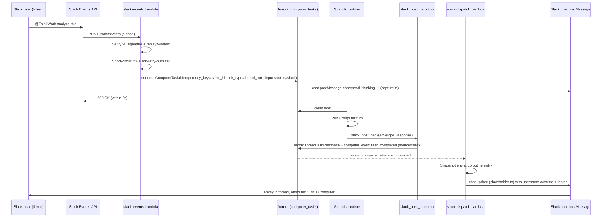

# feat: ThinkWork Computer Slack workspace app

## Summary

Ship a single ThinkWork Slack workspace app that lets each linked user invoke their own Computer from inside Slack via four trigger surfaces (@mention, DM, `/thinkwork` slash command, message-action shortcut). One bot per workspace; many workspaces per tenant. Inbound events enqueue `computer_tasks` (never `agent_wakeup_requests`); outbound replies post via a new `slack-dispatch` Lambda using per-message `username` + `icon_url` overrides hardened with an always-on context-block footer for IT-review resilience.

---

## Problem Frame

The ThinkWork Computer is currently reachable from mobile and admin web only. Operators routinely want their Computer in the moment a team discussion is already happening in Slack — most concretely, when a financial doc lands in a channel thread and they want analysis inline. The current workaround (copy to mobile, ask privately, paste back) loses the shared-room moment and silos the Computer's value to private 1:1 use. The brainstorm chose Approach B — a tenant-shared workspace app — as the only shape that survives enterprise IT review at 4 enterprises × 100+ users (see origin: `docs/brainstorms/2026-05-16-thinkwork-computer-slack-workspace-app-requirements.md`).

---

## Scope Boundaries

### Deferred for later

(carried from origin doc — these survive in v2/v3)

- Ambient channel reading and channel-scoped memory (origin Approach D); v1 has no Computer post without explicit invocation.
- Auto-volunteered responses on file drops or message keywords.
- Per-user Slack bots (origin Approach A explicitly rejected).
- TSX / interactive artifact rendering inside Slack; v1 output is text + markdown + Block Kit + file attachments.
- Slack Connect / shared-channel / external-org member handling.
- Slack-side admin reporting UI in the admin SPA beyond what's required for install; invocations observable through existing audit/compliance log.

### Deferred to Follow-Up Work

(plan-time deferrals discovered during planning research)

- **Enterprise Grid org-wide install** — v1 supports workspace-level OAuth install only. Grid customers can install per-workspace (still functional). Org-wide install (`enterprise_id`-keyed, single grant spanning many `team_id`s) deferred to v2 when a Grid pilot specifically requests it.
- **Slack token rotation** — v1 uses long-lived `xoxb-` bot tokens; rotation is opt-in in Slack App Settings and adds a 12h refresh loop with refresh-token storage. Adding it later is mechanical (new columns on `slack_workspaces`, no schema break).
- **`slack-send` Lambda orphan reference cleanup** — `terraform/modules/app/lambda-api/handlers.tf:191,218` and `packages/api/src/lib/routines/recipe-catalog.ts:825-878` reference a `thinkwork-${stage}-api-slack-send` Lambda that doesn't exist. U2's outbound `slack-dispatch` Lambda will subsume this; cleanup of the routines recipe reference is follow-up work.

---

## High-Level Technical Design

This illustrates the intended approach and is directional guidance for review, not implementation specification. The implementing agent should treat it as context, not code to reproduce.

### End-to-end flow (mention → Computer → reply)



### Trigger surface acknowledgement matrix

| Surface | Slack endpoint | Ack mechanism | Outbound path |
|---|---|---|---|
| `app_mention` (channel/thread) | Events API | 200 + ephemeral "thinking..." placeholder via `chat.postMessage`; capture `ts` | `slack-dispatch` `chat.update` |
| DM (`message.im`) | Events API | 200 + ephemeral placeholder in DM | `slack-dispatch` `chat.update` in DM |
| `/thinkwork` slash command | Slash command | Immediate `200` empty (defers to `response_url`) | Reply via `response_url` (ephemeral with "Post to channel" button) |
| Message-action shortcut | Interactivity | Immediate `views.open` modal within 3s (trigger_id expires) | Reply via `chat.postMessage` in originating thread |

---

## Output Structure

New directory + file additions (modifications to existing files are listed per-unit and not duplicated here):

```text
packages/database-pg/
  src/schema/
    slack.ts                              # new: slack_workspaces, slack_user_links, slack_threads
  drizzle/
    NNNN_slack_workspace_app.sql          # auto-generated migration

packages/api/
  src/handlers/slack/
    _shared.ts                            # Slack v0 signature verify, replay window, retry short-circuit
    _shared.test.ts
    events.ts                             # slack-events: app_mention + message.im
    events.test.ts
    slash-command.ts                      # slack-slash-command: /thinkwork
    slash-command.test.ts
    interactivity.ts                      # slack-interactivity: message_action shortcut + block_actions
    interactivity.test.ts
    oauth-install.ts                      # slack-oauth-install: oauth.v2.access callback
    oauth-install.test.ts
    README.md                             # mirrors webhooks/README.md shape
  src/lib/slack/
    workspace-store.ts                    # bot token Secrets Manager I/O
    thread-mapping.ts                     # (team_id, channel, thread_ts) -> thread_id
    envelope.ts                           # task input envelope shape + normalize
    attribution.ts                        # username override + footer block builder
  src/graphql/resolvers/slack/
    installSlackWorkspace.mutation.ts
    uninstallSlackWorkspace.mutation.ts
    slackWorkspaces.query.ts
    mySlackLinks.query.ts
    unlinkSlackIdentity.mutation.ts

packages/lambda/
  slack-dispatch.ts                       # outbound poster — drains task_completed where source=slack
  __tests__/slack-dispatch.test.ts

packages/agentcore-strands/agent-container/
  container-sources/tools/
    slack_post_back.py                    # platform-injected tool (NOT a workspace skill)
    test_slack_post_back.py

apps/admin/src/routes/_authed/_tenant/slack/
  index.tsx                               # workspaces list + install button
  -slack-install-dialog.tsx
  -workspaces-table.tsx

apps/mobile/components/credentials/
  # extends existing IntegrationsSection.tsx — no new files

terraform/modules/app/lambda-api/
  slack-app-secrets.tf                    # app-level signing secret + client creds
  # handlers.tf, oauth-secrets.tf: modified, not new
```

---

## Implementation Units

### U1. Database schema — Slack tables

**Goal:** Add `slack_workspaces`, `slack_user_links`, and `slack_threads` tables; rely on `computer_tasks.idempotency_key` for inbound-event dedupe (no separate dedup table).

**Requirements:** R1, R9, R10, R12, R14, R16

**Dependencies:** none

**Files:**
- `packages/database-pg/src/schema/slack.ts` (new)
- `packages/database-pg/src/schema/index.ts` (export new tables)
- `packages/database-pg/drizzle/NNNN_slack_workspace_app.sql` (auto-generated)
- `packages/database-pg/src/__tests__/slack-schema.test.ts` (new)

**Approach:** Three new tables. `slack_workspaces` keyed on `slack_team_id` (unique) with `tenant_id` FK (many workspaces per tenant; one tenant per workspace); columns include `bot_user_id`, `bot_token_secret_path`, `app_id`, `installed_by_user_id`, `installed_at`, `status`. `slack_user_links` dual-keyed on `(slack_team_id, slack_user_id)` with `user_id` FK to ThinkWork user; supports a user linked across multiple workspaces under the same tenant (R16). `slack_threads` keyed on `(slack_team_id, channel_id, root_thread_ts)` → `thread_id` for memory aggregation across surfaces. Use Drizzle auto-track unless partial indices/CHECK constraints are needed; if hand-rolled, declare `-- creates: public.X` markers and apply via `psql -f` to dev before merge.

**Patterns to follow:**
- Schema conventions: `packages/database-pg/src/schema/integrations.ts:43` (`connections` table — analogous per-user binding shape)
- Tenant FK convention: `packages/database-pg/src/schema/core.ts:274` (`tenant_members`)
- Hand-rolled migration markers: per `feedback_handrolled_migrations_apply_to_dev`

**Test scenarios:**
- Inserting a `slack_workspaces` row with duplicate `slack_team_id` is rejected.
- Inserting a `slack_user_links` row with duplicate `(slack_team_id, slack_user_id)` is rejected.
- A single ThinkWork user can have rows in `slack_user_links` for multiple `slack_team_id`s under the same tenant (R16 verification).
- A `slack_workspaces` row cannot be deleted while `slack_user_links` rows reference its `slack_team_id` (FK cascade behavior: choose `RESTRICT` for safety).
- `slack_threads` lookup by `(slack_team_id, channel_id, root_thread_ts)` returns the canonical `thread_id` for memory routing.

**Verification:** `pnpm --filter @thinkwork/database-pg db:generate` produces a clean diff; `pnpm db:push -- --stage dev` applies cleanly; migration-precheck CI gate passes.

---

### U2. Slack app secrets + Terraform plumbing

**Goal:** Provision Slack app-level secrets (signing secret, client_id, client_secret) in Secrets Manager; register the five new Lambdas and their routes in Terraform; allow Lambdas IAM access to per-workspace bot-token secret paths.

**Requirements:** R1, R12, R13, R14, R15

**Dependencies:** U1 (schema must exist for handler skeletons to compile during deploy)

**Files:**
- `terraform/modules/app/lambda-api/slack-app-secrets.tf` (new)
- `terraform/modules/app/lambda-api/handlers.tf` (modified — add 5 entries to `for_each` set + route map)
- `scripts/build-lambdas.sh` (modified — add 5 `build_handler` lines using default `ESBUILD_FLAGS`)

(No IAM change needed — the existing `lambda_secrets` policy on `thinkwork/*` in `terraform/modules/app/lambda-api/main.tf` already covers `thinkwork/tenants/{tenantId}/slack/workspaces/{slackTeamId}/bot-token`, matching the precedent set by `terraform/modules/app/lambda-api/oauth-secrets.tf`.)
- `packages/api/src/handlers/slack/README.md` (new — mirrors `webhooks/README.md`)

**Approach:** Single Slack app shared across all tenants and stages; per-stage signing/client secret. Lambda handlers use default esbuild flags (no Bedrock/AgentCore SDKs needed). Public ingress routes (signature-authenticated, no Cognito): `POST /slack/events`, `POST /slack/slash-command`, `POST /slack/interactivity`, `GET/POST /slack/oauth/install`. `slack-dispatch` is event-triggered (Postgres LISTEN/NOTIFY via existing event polling or scheduled drain), not a route. Bot tokens written at runtime by `slack-oauth-install` to `thinkwork/tenants/{tenantId}/slack/workspaces/{slackTeamId}/bot-token`.

**Patterns to follow:**
- Lambda registration: `terraform/modules/app/lambda-api/handlers.tf:274` (`for_each` pattern with `local.use_local_zips`)
- Route registration: `terraform/modules/app/lambda-api/handlers.tf:729`
- App-level OAuth secret: `terraform/modules/app/lambda-api/oauth-secrets.tf` (analogous pattern)
- esbuild: `scripts/build-lambdas.sh` default flags (NOT `BUNDLED_AGENTCORE_ESBUILD_FLAGS`)

**Test scenarios:**
- `Test expectation: none -- infrastructure-only, validated via `terraform plan` + deploy.`

**Verification:** `cd terraform/examples/greenfield && terraform plan` shows the 5 new Lambdas, the secret, and the IAM policy expansion. `pnpm build:lambdas` succeeds with all 5 stubs.

---

### U3. Slack signature verification + ingest shared helper

**Goal:** Build the Slack-specific shared helper that wraps every inbound Slack Lambda — raw-body capture, `v0` signature verification, 5-minute replay window, `x-slack-retry-num` short-circuit, and bot-token resolution.

**Requirements:** R14, R15

**Dependencies:** U1, U2

**Files:**
- `packages/api/src/handlers/slack/_shared.ts` (new)
- `packages/api/src/handlers/slack/_shared.test.ts` (new)
- `packages/api/src/lib/slack/workspace-store.ts` (new — Secrets Manager fetch for bot token, module-scope cache)

**Approach:** Fork the existing `packages/api/src/handlers/webhooks/_shared.ts` pattern into a parallel `slack/_shared.ts` rather than generalizing. Two key reasons: (1) Slack uses its own `x-slack-signature` v0 scheme that's incompatible with the existing GitHub-shaped HMAC; (2) inbound Slack events enqueue `computer_tasks`, while webhooks/_shared currently enqueues `skill_runs`. Generalization is a follow-up refactor once Slack ships; v1 ships the fork. Helper exposes `createSlackHandler(config)` with hooks for `verifySignature`, `getRawBody`, `lookupWorkspace`, and `dispatch`. Signature compare uses `crypto.timingSafeEqual`. Reject timestamps where `|now - ts| > 300`. If `x-slack-retry-num` header present, log and return `200` immediately (Slack thinks we missed a prior ack; we did not).

**Execution note:** Test-first — security-critical signature verification.

**Patterns to follow:**
- Webhook helper shape: `packages/api/src/handlers/webhooks/_shared.ts` (config object + handler factory + DI for tests)
- Secrets Manager module-scope cache: per `oauth-client-credentials-in-secrets-manager-2026-04-21` learning
- Auth-bypass for public ingress: per `lambda-options-preflight-must-bypass-auth-2026-04-21` learning (inverted — Slack handlers must bypass Cognito and rely on signature verification only)

**Test scenarios:**
- Valid signature + fresh timestamp + matching body → handler runs.
- Valid signature but timestamp 6 minutes old → 401 with replay-window error.
- Invalid signature → 401; does not invoke downstream.
- Constant-time comparison: signature differing only in last byte is rejected without timing leak (assert via `crypto.timingSafeEqual` is used, not `===`).
- `x-slack-retry-num: 1` header present → 200 immediately, no downstream invoke.
- Body parsed before signature verify breaks signature → assert raw bytes are used (regression test for API Gateway form-encoding gotcha on slash commands).
- Unknown `team_id` (no matching `slack_workspaces` row) → 404 with a structured error; does not reveal whether the signature was valid.

**Verification:** Unit tests pass; helper exposed as `createSlackHandler` is consumable by U6/U7/U8.

---

### U4. Workspace OAuth install — Lambda + GraphQL + admin SPA

**Goal:** Workspace admin installs the ThinkWork Slack app, OAuth flow completes, `slack_workspaces` row written, bot token stored in Secrets Manager; admin SPA exposes install/list/uninstall UI.

**Requirements:** R1, R12, R13, F6

**Dependencies:** U1, U2

**Files:**
- `packages/api/src/handlers/slack/oauth-install.ts` (new)
- `packages/api/src/handlers/slack/oauth-install.test.ts` (new)
- `packages/api/src/graphql/resolvers/slack/installSlackWorkspace.mutation.ts` (new)
- `packages/api/src/graphql/resolvers/slack/uninstallSlackWorkspace.mutation.ts` (new)
- `packages/api/src/graphql/resolvers/slack/slackWorkspaces.query.ts` (new)
- `packages/api/src/graphql/resolvers/slack/*.test.ts` (new)
- `packages/database-pg/graphql/types/slack.graphql` (new)
- `apps/admin/src/routes/_authed/_tenant/slack/index.tsx` (new)
- `apps/admin/src/routes/_authed/_tenant/slack/-slack-install-dialog.tsx` (new)
- `apps/admin/src/routes/_authed/_tenant/slack/-workspaces-table.tsx` (new)

**Approach:** The admin clicks "Install Slack" → admin SPA hits a `startSlackInstall` mutation that returns a Slack OAuth authorize URL (state token binds tenant_id + admin user_id). User redirected to Slack, approves scopes, redirected back to `/slack/oauth/install` Lambda which exchanges the `code` for `xoxb-` bot token via `oauth.v2.access`. Lambda writes the bot token to Secrets Manager path `thinkwork/tenants/{tenantId}/slack/workspaces/{slackTeamId}/bot-token` and inserts the `slack_workspaces` row with `installed_by_user_id`. Re-install into the same workspace updates the token in place and resets `installed_at`. Mutations use `requireTenantAdmin(ctx)` (per `every-admin-mutation-requires-requiretenantadmin-2026-04-22` learning) with `resolveCallerTenantId(ctx)` fallback for Google-federated users.

**Patterns to follow:**
- Admin mutation pattern: `packages/api/src/graphql/resolvers/tenant-credentials/createTenantCredential.mutation.ts`
- Webhook handler shape (no Bolt): `packages/api/src/handlers/webhooks/crm-opportunity.ts`
- Admin SPA table + dialog: `apps/admin/src/routes/_authed/_tenant/webhooks/`
- Cognito + tenantId fallback: per `feedback_oauth_tenant_resolver` memory

**Test scenarios:**
- Admin without `requireTenantAdmin` privilege calls `startSlackInstall` → GraphQL error before any external call.
- Successful OAuth callback inserts `slack_workspaces` row and writes bot token to Secrets Manager.
- Re-install into existing `slack_team_id` updates token + `installed_at` rather than creating a duplicate row.
- OAuth callback with mismatched `state` token → 400, no row written.
- `slack.oauth.v2.access` returns error → row is not written, secret is not written, install dialog surfaces the Slack error message.
- Uninstall mutation revokes the row, marks status `uninstalled`, deletes the Secrets Manager secret, but preserves `slack_user_links` for forensic audit (status: `orphaned`).
- **Covers AE5.** Two separate workspaces W1 and W2 binding to the same tenant T1 result in two `slack_workspaces` rows, both with `tenant_id=T1`, each with its own bot-token secret path; per-user linking is workspace-scoped.

**Verification:** Manual OAuth flow against a dev Slack app completes round-trip; `slack_workspaces` row visible in dev DB; admin SPA lists the workspace.

---

### U5. Per-user identity linking — mobile self-serve + Slack App Home fallback

**Goal:** Any linked Slack user can complete `(slack_team_id, slack_user_id) → thinkwork_user_id` binding via the mobile app (self-serve) or via an in-Slack App Home flow on first invocation.

**Requirements:** R9, R11, F5

**Dependencies:** U1, U4

**Files:**
- `scripts/seed-dev.sql` (modified — extend the existing `slack` connect-provider row scopes for `chat:write.customize` per KD-3; the row is already seeded at lines ~61-70 with `chat:write`/`channels:read`/`users:read`)
- `packages/api/src/handlers/oauth-authorize.ts` (modified — accept `provider=slack`)
- `packages/api/src/handlers/oauth-callback.ts` (modified — Slack callback handling, write `slack_user_links` row)
- `apps/mobile/components/credentials/IntegrationsSection.tsx` (modified — add Slack provider entry)
- `packages/api/src/graphql/resolvers/slack/mySlackLinks.query.ts` (new)
- `packages/api/src/graphql/resolvers/slack/unlinkSlackIdentity.mutation.ts` (new)
- `packages/api/src/graphql/resolvers/slack/*.test.ts` (new)

**Approach:** Two entry points to the same OAuth flow. (1) Mobile path: user taps "Connect Slack" in `IntegrationsSection`, `openAuthSessionAsync` opens the existing `/api/oauth/authorize?provider=slack&userId=…&tenantId=…` flow (NO `preferEphemeralSession: true` per `feedback_mobile_oauth_ephemeral_session`). (2) Slack-first path: when an unlinked user @mentions the bot, `slack-events` Lambda enqueues a special "needs-linking" task that does NOT invoke the Computer; instead it sends an ephemeral DM with a sign-in link, and posts an App Home view with a "Connect ThinkWork" button. Both paths write to `slack_user_links` keyed on `(slack_team_id, slack_user_id)` — never resolve user via `SELECT users WHERE tenant_id LIMIT 1` (per `oauth-authorize-wrong-user-id-binding-2026-04-21` learning).

**Patterns to follow:**
- Mobile OAuth section: `apps/mobile/components/credentials/IntegrationsSection.tsx`
- Existing OAuth flow: `packages/api/src/handlers/oauth-authorize.ts`, `oauth-callback.ts`
- App Home Block Kit: Slack docs (https://api.slack.com/surfaces/app-home)

**Test scenarios:**
- Mobile user completes OAuth → `slack_user_links` row created with correct `(team_id, slack_user_id, user_id)`.
- Same Slack user attempts to link from a second Slack workspace bound to the same tenant → second `slack_user_links` row created (R16 verification).
- Unlinked user invocation triggers App Home `views.publish` with a Connect button + DM with link (one DM per user, idempotent — don't re-DM on every invocation).
- Linking with mismatched tenant (Slack user's existing link is for tenant T1, but they try to link via a workspace bound to tenant T2) → reject with explicit error; do not silently re-tenant.
- `unlinkSlackIdentity` removes the row but preserves audit history (a `slack_user_links_history` row or audit event, choice deferred to implementation).
- **Covers AE2.** Unlinked user @mentions the bot → in-thread "I can't act for you yet" reply + ephemeral DM with link.

**Verification:** End-to-end test in dev — mobile-flow link succeeds; in-Slack App Home link succeeds; @mention by unlinked user produces both the in-thread message and the DM exactly once.

---

### U6. Inbound events Lambda — @mention + DM

**Goal:** Receive `app_mention` and `message.im` events, dedupe by `event_id`, enqueue a `computer_task` with `task_type=thread_turn` and `input.source=slack`, post a placeholder "thinking..." message, return 200 within 3s.

**Requirements:** R2, R3, R5, R7, R10, R14, R15, F1, F2

**Dependencies:** U1, U3, U5

**Files:**
- `packages/api/src/handlers/slack/events.ts` (new)
- `packages/api/src/handlers/slack/events.test.ts` (new)
- `packages/api/src/lib/slack/envelope.ts` (new — task input shape + thread-context bundling helpers)
- `packages/api/src/lib/computers/tasks.ts` (modified — `normalizeThreadTurnInput` accepts `source=slack` envelope)
- `packages/lambda/slack-dispatch.ts` (lightweight stub for U10 in this unit — placeholder posting only; full dispatcher in U10)

**Approach:** Lambda flow: verify signature (via U3) → handle Slack `url_verification` challenge → short-circuit on `x-slack-retry-num` → look up `slack_workspaces` row by `team_id` → look up `slack_user_links` for invoking user → if unlinked, trigger U5's needs-linking path → if linked, build envelope with `{slackTeamId, slackUserId, channelId, threadTs, sourceMessage, fileRefs, responseUrl: null}` → enqueue `computer_tasks` with `idempotency_key = event_id` (Slack's `event_id` is globally unique — this single dedupe key handles both retry-storm and at-least-once delivery) → post placeholder `chat.postMessage` ("Eric's Computer is thinking…") capturing the `ts` and storing it on the task's input metadata → return 200. Thread context bundling: for v1, last 50 messages from `conversations.replies` capped at ~4k tokens (deferred-to-implementation: exact slice rule).

**Execution note:** Test-first — security-critical and ack-window-sensitive.

**Patterns to follow:**
- External-trigger task enqueue: `packages/lambda/job-trigger.ts:285` (`computerTasks` insert with `onConflictDoNothing` on idempotency tuple)
- Task enqueue helper: `packages/api/src/lib/computers/tasks.ts:46` (`enqueueComputerTask`)
- `thread_turn` source discriminator: `normalizeThreadTurnInput:262`

**Test scenarios:**
- Valid `app_mention` from linked user enqueues exactly one `computer_tasks` row with `idempotency_key=event_id` and `input.source=slack`.
- Same event delivered twice (Slack retry) → `onConflictDoNothing` short-circuits the second insert; only one task.
- `app_mention` in a thread bundles the source message + thread history into `input.sourceMessage` and `input.threadContext`.
- `app_mention` with attached file → `input.fileRefs` includes the file's permalink (the Computer fetches actual file content later via Slack Web API).
- `message.im` from linked user enqueues task with `input.channelType=im`.
- `message.im` from unlinked user triggers U5 needs-linking flow; no task enqueued.
- Placeholder `chat.postMessage` failure does NOT prevent the task from being enqueued — placeholder failure is logged, dispatcher will create the response message fresh if no placeholder ts is stored.
- Lambda return latency under 3s for the 99th percentile event (measured in load test against dev).
- Slack `url_verification` challenge (`type: "url_verification"`) replied with `{challenge}` echo within the 3s window; no DB writes.
- **Covers AE1, F1.** Two linked users A and B in the same channel; A's @mention routes to A's Computer, not B's.
- **Covers AE4, R10.** Thread containing 4 prior messages + PDF; `input.threadContext` contains those 4 messages + PDF file_ref; events outside the thread are not bundled.

**Verification:** Synthetic Slack events posted to the Lambda in dev produce expected `computer_tasks` rows; integration test posts a real `app_mention` from a dev Slack workspace and observes Computer response in-thread.

---

### U7. Slash command Lambda — `/thinkwork`

**Goal:** Handle `/thinkwork <prompt>` slash command, ack within 3s, defer reply to `response_url`, default to ephemeral with "Post to channel" button.

**Requirements:** R4, R7, R8, F3

**Dependencies:** U1, U3, U5, U6 (envelope module stub), U9 (envelope finalization — U7 can begin against U6's stub but the stable envelope contract lands in U9)

**Files:**
- `packages/api/src/handlers/slack/slash-command.ts` (new)
- `packages/api/src/handlers/slack/slash-command.test.ts` (new)
- `packages/api/src/lib/slack/attribution.ts` (new — Block Kit builders including ephemeral-with-button shape)

**Approach:** Slash command POST body is `application/x-www-form-urlencoded` (signature verify needs raw bytes — see U3 regression test). Verify signature, look up workspace + user link, enqueue `computer_tasks` with `input.source=slack`, `input.channelType=slash`, `input.responseUrl=<form.response_url>`. Return `200` with empty body immediately (Slack's `response_url` path — defers up to 5 follow-up messages over 30 min). Dispatcher U10 will post the ephemeral response via `response_url` rather than `chat.postMessage`. Ephemeral message includes a "Post to channel" Block Kit button whose `action_id=slack_promote_response` is handled by U8.

**Patterns to follow:**
- Same shared helper as U6: `_shared.ts` from U3
- Slash command `response_url` pattern: Slack docs (https://docs.slack.dev/interactivity/handling-user-interaction/)

**Test scenarios:**
- Slash command from linked user returns 200 within 3s and enqueues a task with `input.responseUrl` populated.
- Form-encoded body parsing does not corrupt the raw bytes used for signature verification (regression test for U3).
- Slash command from unlinked user returns 200 + ephemeral text "Link your account via …" (one-shot; does not trigger App Home view from a slash command).
- Slash command with empty text returns 200 + ephemeral usage hint; no task enqueued.
- **Covers AE3.** Slash command → ephemeral response only the invoker sees, with "Post to channel" button block.

**Verification:** Live slash command in dev Slack workspace gets an ephemeral response within 3s; "Post to channel" button presence verified visually.

---

### U8. Interactivity Lambda — message-action shortcut + block actions

**Goal:** Handle Slack interactivity payloads — the `message_action` shortcut on messages/files, and the `block_actions` callback when a user clicks the "Post to channel" button from U7's ephemeral response.

**Requirements:** R6, R7, R8, R10, F4

**Dependencies:** U1, U3, U5, U6 (envelope), U7 (attribution module)

**Files:**
- `packages/api/src/handlers/slack/interactivity.ts` (new)
- `packages/api/src/handlers/slack/interactivity.test.ts` (new)

**Approach:** Slack routes both `message_action` payloads (shortcut from a message's "More actions" menu) and `block_actions` payloads (button clicks in ephemeral messages or App Home) to the same interactivity URL. Branch on `payload.type`. For `message_action`: `trigger_id` expires in 3 seconds — call `views.open` synchronously with a "Working…" modal **before** enqueuing the task (open-then-enqueue, not enqueue-then-open). Capture the modal `view_id` on the task envelope so U10 can `views.update` it on completion. For `block_actions` with `action_id=slack_promote_response`: read the original ephemeral message text from the payload, post a public `chat.postMessage` in the channel using the invoker's per-message attribution + footer, and `delete_original` the ephemeral via `response_url`. For the App Home Connect-ThinkWork button: redirect the user to the OAuth flow URL (no task enqueue).

**Execution note:** Test-first — `trigger_id` race condition is the highest implementation risk.

**Patterns to follow:**
- Same shared helper as U6/U7: `_shared.ts` from U3
- `views.open` modal: Slack docs (https://docs.slack.dev/reference/methods/views.open/)
- Promotion via `response_url` + `chat.postMessage`: Slack docs note that ephemeral cannot be type-changed; it's a two-message flow

**Test scenarios:**
- `message_action` from linked user opens `views.open` modal within 3 seconds AND enqueues the task (order: open first, then enqueue, both before returning 200).
- `message_action` with `trigger_id` older than 3s logs the failure and returns a graceful error message; no task enqueued.
- `block_actions` with `action_id=slack_promote_response` posts a public `chat.postMessage` in the channel with per-message attribution + footer, then deletes the original ephemeral.
- `block_actions` with `action_id=connect_thinkwork` from App Home returns a 200 and a redirect; no task enqueued.
- Unknown `payload.type` returns 400 with a structured error; does not invoke downstream.
- **Covers F4.** Message-action shortcut on a file in a thread → modal opens, task enqueues with file_ref, response posts back in originating thread on completion.

**Verification:** Live shortcut in dev Slack workspace opens modal under 3s; ephemeral-button promotion produces a public reply.

---

### U9. Thread mapping + envelope contract

**Goal:** Centralize the `(slack_team_id, channel_id, root_thread_ts) → thread_id` resolve-or-create logic and the canonical Slack task-input envelope shape used by all four inbound surfaces and consumed by the Computer.

**Requirements:** R5, R7, R10, R14

**Dependencies:** U1, U6 (envelope module created in U6 — U9 finalizes and exports it)

**Files:**
- `packages/api/src/lib/slack/thread-mapping.ts` (new)
- `packages/api/src/lib/slack/envelope.ts` (finalized from U6 stub — full schema)
- `packages/api/src/lib/slack/thread-mapping.test.ts` (new)
- `packages/api/src/lib/computers/tasks.ts` (modified — `normalizeThreadTurnInput` finalized contract)
- `packages/agentcore-strands/agent-container/container-sources/server.py` (modified — propagate Slack envelope through invoke payload, including `apply_invocation_env` key list expansion per `apply-invocation-env-field-passthrough-2026-04-24`)

**Approach:** Envelope schema (TypeScript shared type, serialized into `computer_tasks.input.slack`):

```text
{
  slackTeamId: string
  slackUserId: string
  slackWorkspaceRowId: uuid  // FK into slack_workspaces
  channelId: string
  channelType: "channel" | "group" | "im" | "mpim" | "slash"
  rootThreadTs: string | null  // null for top-level posts
  responseUrl: string | null   // present for slash commands and shortcuts
  triggerSurface: "app_mention" | "message_im" | "slash_command" | "message_action"
  sourceMessage: { ts, user, text, files? } | null
  threadContext: Array<{ ts, user, text }>  // last N from conversations.replies, capped
  fileRefs: Array<{ id, permalink, mimetype, name }>
  placeholderTs: string | null  // present for app_mention/message_im after placeholder post
  modalViewId: string | null    // present for message_action after views.open
}
```

`thread-mapping.ts` exposes `resolveOrCreateSlackThread(envelope) → threadId` that inserts a `slack_threads` row if absent and returns the canonical `thread_id` used by memory aggregation. `apply_invocation_env` (Python side) is updated to recognize the Slack envelope keys so they don't get dropped silently (the field-passthrough learning was real loss in PR pre-2026-04-24).

**Patterns to follow:**
- Envelope shape on existing `thread_turn` source: `normalizeThreadTurnInput:262`
- Strands runtime payload propagation: `packages/agentcore-strands/agent-container/container-sources/server.py:2483-2676`

**Test scenarios:**
- `resolveOrCreateSlackThread` for a new `(team, channel, thread_ts)` triple inserts a `slack_threads` row and returns a new `thread_id`.
- Repeated call for the same triple returns the existing `thread_id` (no duplicate insert).
- A `message_im` envelope (no `rootThreadTs`) maps to a thread keyed by `(team, channel, null)` — DM threads are per-channel, not per-message.
- Envelope normalization rejects payloads missing `slackTeamId` or `triggerSurface` with structured errors.
- Strands runtime test: `apply_invocation_env` includes all envelope keys (regression test for the field-passthrough learning).

**Verification:** A single conversation's repeated `app_mention`s in the same thread all resolve to the same `thread_id`; cross-surface invocation (same user invokes from mobile then Slack) produces user-level memory aggregation (verified by inspecting Hindsight/memory recall in the dev environment).

---

### U10. Computer-side Slack post-back tool + outbound dispatcher

**Goal:** Build the platform-injected `slack_post_back` tool the Strands runtime calls to deliver the Computer's response back to Slack; the `slack-dispatch` Lambda that handles event-triggered outbound posting; and the per-message attribution rendering with `chat:write.customize` override + always-on context-block footer hardening.

**Requirements:** R7, R8, R15, F1, F2, F3, F4

**Dependencies:** U1, U2, U3 (shared helper), U6 (envelope contract finalized in U9)

**Files:**
- `packages/agentcore-strands/agent-container/container-sources/tools/slack_post_back.py` (new)
- `packages/agentcore-strands/agent-container/container-sources/tools/test_slack_post_back.py` (new)
- `packages/lambda/slack-dispatch.ts` (new — finalized from U6 stub)
- `packages/lambda/__tests__/slack-dispatch.test.ts` (new)
- `packages/api/src/lib/slack/attribution.ts` (extended — final attribution builder)
- `packages/api/src/handlers/computer-runtime.ts` (modified — `recordThreadTurnResponse` triggers a `computer_events.task_completed` row with `source=slack` discriminator)

**Approach:** Two-piece outbound: (1) Strands-side `slack_post_back` tool is a platform-injected tool (NOT a workspace skill — per `injected-built-in-tools-are-not-workspace-skills-2026-04-28`). The tool snapshots `THINKWORK_API_URL`, `API_AUTH_SECRET`, and the full Slack envelope at coroutine entry (per `agentcore-completion-callback-env-shadowing-2026-04-25`); never re-reads `os.environ` post-turn. It POSTs to `/api/computers/runtime/tasks/{id}/thread-turn-response` with the response body and a `source=slack` flag. (2) On the API side, `recordThreadTurnResponse` (existing) inserts a `computer_events` row with `event_type=task_completed`; the new `slack-dispatch` Lambda is event-triggered on this row (Postgres NOTIFY or polled). Dispatcher reads the Slack envelope from `computer_tasks.input.slack`, fetches the workspace bot token from Secrets Manager (module-scope cache), and posts the response.

Attribution rendering: invoker's display name + avatar pulled from `users` (fallback to Slack `users.info` if missing). Username override: `"{User's Display Name}'s Computer"`, hard-coded suffix (not admin-configurable — review-friendly per best-practices research). `chat.postMessage` (or `chat.update` if `placeholderTs` present, or `views.update` if `modalViewId` present, or `response_url` POST if `responseUrl` present) with:
- `username` + `icon_url` overrides (requires `chat:write.customize`)
- Always-on Block Kit context block footer: `"Routed via @ThinkWork · {User's Display Name}'s Computer"`

If `chat:write.customize` scope is revoked at runtime (Slack returns `not_allowed_token_type` or `missing_scope`), the dispatcher falls back to constant bot identity + body-prefix `*{User}'s Computer:*` and logs an audit event. This is the graceful-degradation path for the "optional scope" decision (KD-3).

For DM (`channelType=im`), Slack adds extra sender-identity disclosure when username overrides differ from app identity — accept the slightly different render in DMs (don't fight Slack's display).

**Execution note:** Characterization-first — the Slack post-back is the moment everything observable about the system happens; build it with synthetic envelopes against a recorded `chat.postMessage` fixture before wiring it into the agent loop.

**Patterns to follow:**
- Existing thread-turn response: `packages/api/src/handlers/computer-runtime.ts:223` (`recordThreadTurnResponse`)
- Env snapshot at coroutine entry: per `completion_callback_snapshot_pattern` memory
- Dispatcher event-trigger pattern: `workspace-event-dispatcher` Lambda (already in `scripts/build-lambdas.sh`)
- Platform-injected tool: per `injected-built-in-tools-are-not-workspace-skills-2026-04-28` (NOT a workspace skill)

**Test scenarios:**
- Task completion with `input.source=slack` and `placeholderTs` present triggers `chat.update` against the placeholder ts; does NOT post a new message.
- Task completion with `responseUrl` present (slash command) POSTs to `response_url` with `response_type=ephemeral` and the "Post to channel" button; does NOT call `chat.postMessage`.
- Task completion with `modalViewId` (message_action) calls `views.update` against the modal AND a `chat.postMessage` in the originating thread; the modal closes after update.
- Username override succeeds → response renders as "Eric's Computer" with avatar.
- `chat:write.customize` returns `missing_scope` → dispatcher retries with bare bot identity + body prefix, logs audit event `slack.attribution_degraded`.
- Bot token missing from Secrets Manager (workspace recently uninstalled) → dispatcher logs and gives up; task row marked `failed` with descriptive error.
- Context footer is included on every outbound message regardless of attribution mode.
- Env snapshot test: Strands tool captures envelope + auth at coroutine entry; subsequent `os.environ` mutation does not affect post-back.
- **Covers AE1, AE3, AE4, AE6, R15.** Each surface's full ack-then-deliver loop produces the expected visible result.

**Verification:** End-to-end dev test: `@mention` in dev Slack workspace produces a placeholder, Computer runs, dispatcher updates the placeholder with the attributed response within 30s. Manual scope-revocation test: temporarily strip `chat:write.customize` from the bot's installed scopes (Slack App Settings) and observe graceful-degradation rendering.

---

### U11. Acceptance examples test coverage + observability

**Goal:** Add integration tests for all six origin Acceptance Examples; instrument CloudWatch metrics for ingest latency, dedupe hits, dispatch success, attribution-degraded events.

**Requirements:** AE1, AE2, AE3, AE4, AE5, AE6, R15

**Dependencies:** U1–U10

**Files:**
- `packages/api/test/integration/slack-acceptance.test.ts` (new)
- `packages/api/src/lib/slack/metrics.ts` (new — CloudWatch EMF metric emission helpers)
- `packages/api/src/handlers/slack/*.ts` (modified — metric emission calls)
- `packages/lambda/slack-dispatch.ts` (modified — dispatch metrics)

**Approach:** Integration tests stand up a recorded Slack fixture (against a dedicated dev workspace, or VCR-style replay), exercise each AE end-to-end, and assert visible outcomes. CloudWatch metrics emitted via Embedded Metric Format (EMF) — no extra deps. Metrics: `slack.events.ingest_ms` (histogram), `slack.events.dedupe_hits` (counter), `slack.events.unknown_team` (counter), `slack.dispatch.success` (counter, dimensioned by `surface`), `slack.dispatch.failure` (counter, dimensioned by `error_class`), `slack.attribution.degraded` (counter — triggers when KD-3 fallback fires; alarm-worthy).

**Patterns to follow:**
- Integration test layout: `packages/api/test/integration/`
- EMF metric emission: existing CloudWatch logger conventions in `packages/api/src/lib/observability/`

**Test scenarios:**
- **Covers AE1.** Two linked users A and B in `#finance`; A's @mention routes to A's Computer with A's memory + MCP; response attributed to A.
- **Covers AE2.** Unlinked user invocation produces in-thread "I can't act yet" + ephemeral DM with link; subsequent invocation after linking proceeds normally.
- **Covers AE3.** `/thinkwork what was Q3 revenue?` returns ephemeral with "Post to channel" button; clicking promotes to public attributed message.
- **Covers AE4.** Thread with 4 prior messages + PDF; Computer receives only those messages + PDF; events outside thread not included.
- **Covers AE5.** Tenant T1 has workspaces W1 and W2 bound; user U in both can invoke from either with workspace-scoped binding.
- **Covers AE6.** Each surface returns ack within 3s; placeholder/modal/response_url updated with actual response on completion.
- CloudWatch metric assertions per scenario.

**Verification:** All AE tests green in CI; dev CloudWatch dashboard shows the new metrics flowing.

---

### U12. Documentation + scope-degradation runbook

**Goal:** Document the Slack app for operators and customers; capture the graceful-degradation behavior; mark Slack as a first-class Computer surface in the agent-facing docs.

**Requirements:** R7, R13

**Dependencies:** U1–U11

**Files:**
- `docs/src/content/docs/integrations/slack.md` (new — Astro Starlight content)
- `docs/src/content/docs/compliance/slack-data-handling.md` (new — privacy disclosure per best-practices research)
- `docs/src/content/docs/operations/slack-dispatch-runbook.md` (new — degradation modes + recovery)
- `packages/api/src/handlers/slack/README.md` (modified from U2 stub — final per-Lambda doc)
- `packages/system-workspace/USER.md` (modified — add Slack as a known surface for the Computer)
- `packages/system-workspace/PLATFORM.md` (modified — `slack_post_back` tool documentation)

**Approach:** Three documentation surfaces. (1) Public docs (Starlight, rendered at `/integrations/slack/`) covers what the app does, scope requests, IT-review FAQ, the `chat:write.customize` justification. (2) Compliance docs covers data-handling disclosure expected by enterprise IT (per the best-practices research): what's sent to the LLM, where it's processed, no-training-on-customer-data, US-only data residency. (3) Operations runbook covers what to do when `slack.attribution.degraded` alarms fire, when bot tokens are revoked, when a workspace uninstalls.

**Patterns to follow:**
- Compliance content: `docs/src/content/docs/compliance/` (CLAUDE.md reference)
- USER.md is server-managed: per `feedback_workspace_user_md_server_managed` — full rewrite, not surgical injection

**Test scenarios:**
- `Test expectation: none -- documentation-only.`

**Verification:** `pnpm --filter @thinkwork/docs build` succeeds; docs pages render correctly; manual review confirms compliance disclosure is enterprise-ready.

---

## Key Technical Decisions

- **KD-1: Fork `_shared.ts` for Slack rather than generalizing.** Existing `packages/api/src/handlers/webhooks/_shared.ts` uses GitHub-shaped HMAC and enqueues `skill_runs`. Slack needs v0 signature + replay window + `computer_tasks` enqueue. Forking ships v1 faster with no risk of breaking the existing webhook handlers; generalization is a follow-up refactor once two Slack-shaped handlers exist (Slack + future provider). (origin: R14)

- **KD-2: Reuse `task_type=thread_turn` with `input.source=slack` discriminator** rather than introducing a new `slack_event` task type. Reuses the existing thread/memory model, the `normalizeThreadTurnInput` plumbing, and the Strands runtime's completion-callback path (`recordThreadTurnResponse`). Adding a new task type would require parallel runtime support for no behavioral gain. (origin: R14)

- **KD-3: `chat:write.customize` registered as OPTIONAL scope with always-on context-block footer fallback.** Diverges from a strict reading of origin R7 by hardening — keeps the per-message username/avatar override as the primary attribution mechanism, but registers it as an optional scope so install survives stricter IT reviews, and always includes a footer `"Routed via @ThinkWork · {User}'s Computer"` block so attribution survives even when the customize scope is stripped at runtime. Aligned with the best-practices research finding that both Claude-in-Slack and ChatGPT-for-Slack chose constant bot identity to avoid IT-review friction. (origin: R7, "What to ship" hardening)

- **KD-4: Postgres-based dedupe via `computer_tasks.idempotency_key = event_id`** rather than a separate DynamoDB or Redis dedupe store. Slack's `event_id` is globally unique; the existing partial unique index on `(tenant_id, computer_id, idempotency_key)` already handles at-least-once-delivery dedup. Avoids a new dependency (best-practice prefers AWS-native, and Postgres is already in the path). (origin: R14)

- **KD-5: Workspace-level install only in v1; Enterprise Grid org-wide install deferred.** Grid customers can install per-workspace (still functional, just less convenient). Adding org-wide install requires `connect:read` + `enterprise_id`-keyed install storage. Deferred until a Grid pilot specifically requests it. (origin: R12)

- **KD-6: Long-lived `xoxb-` tokens in v1; token rotation deferred.** Slack token-rotation is opt-in (App Settings flag) and adds a 12h refresh loop. Adding rotation later is mechanical (new columns on `slack_workspaces`, no schema break). Tradeoff: slightly weaker token compromise mitigation; acceptable for v1. (origin: R13)

- **KD-7: Direct Events API + `@slack/web-api` instead of `@slack/bolt`.** Bolt's bundle is 3-5MB esbuilt, which inflates cold-start under the 3s ack budget; a hand-rolled signature verifier + `WebClient` for outbound calls is ~80 lines and dramatically lighter. (Bolt's `AwsLambdaReceiver` is also broken on Node 24 per slackapi/bolt-js#2761 — not currently binding since the repo runs Node 22, but it would foreclose a future Node 24 upgrade.) Bolt remains an option if interactivity gets complex; we can adopt it for the dispatcher Lambda specifically without affecting the ingest path. (planning)

- **KD-8: `slack_post_back` is a platform-injected tool, NOT a workspace skill.** Per the `injected-built-in-tools-are-not-workspace-skills-2026-04-28` learning. The Slack post-back is platform plumbing the runtime owns deterministically; it should not be discoverable, removable, or customizable as part of a tenant's workspace skill catalog.

---

## Risk Analysis & Mitigation

| Risk | Likelihood | Impact | Mitigation |
|---|---|---|---|
| Slack 3s ack window exceeded → duplicate `app_mention` events fire duplicate Computer turns | Medium (Lambda cold start variance) | High (duplicate user-visible messages, billing overhead) | KD-4 dedupe via `event_id`; `x-slack-retry-num` short-circuit; placeholder posted in U6 ack-path is best-effort (failure does not block enqueue) |
| `trigger_id` expires before `views.open` succeeds → message-action shortcut fails | Medium (3s budget, cold start) | Medium (user gets nothing back, has to re-try) | U8 opens modal synchronously before enqueue (open-then-enqueue order); provisioned concurrency on the interactivity Lambda; monitored via `slack.events.ingest_ms` metric |
| `chat:write.customize` stripped by enterprise IT at install → attribution degrades silently | Medium | Medium (less-distinct attribution in shared channels) | KD-3 footer always-on; runtime fallback to constant identity + body-prefix; `slack.attribution.degraded` metric alarms ops |
| Bot token revoked outside our knowledge (admin uninstalls from Slack side, no webhook fires reliably) | Low-Medium | Medium (Computer fails silently for that workspace) | Catch `not_authed`/`token_revoked` from `chat.postMessage`, mark `slack_workspaces.status=revoked`, surface in admin SPA |
| Slack user deactivated → orphan `slack_user_links` row | Medium (employee turnover) | Low (no functional break; user can't invoke) | Reconcile periodically via `users.info`; on deactivation, suspend the link (don't delete — audit trail) |
| Marketplace listing rejected over `chat:write.customize` scope justification | Low-Medium | High (delays v1) | KD-3's optional-scope + footer pattern gives a clean review story; pre-draft justification (see deferred Q on `chat:write.customize` IT-review pre-draft) |
| Computer turn takes >5 minutes → Slack's `response_url` 30-minute window OK, but slash-command ephemeral has 5-message follow-up cap | Low (most turns under 60s) | Low (user just doesn't see the answer in slash-command surface) | For long turns, fall back to `chat.postMessage` in DM; document in U12 runbook |
| Strands runtime restart between enqueue and post-back loses in-flight task state | Low (existing CAS pattern covers this) | Low | Reuse existing claim/reclaim semantics; no Slack-specific work needed |

---

## Dependencies / Prerequisites

- **Slack app registration** — A new Slack app must be registered in the ThinkWork Slack workspace under "Distribute to other workspaces" with the scopes from U2 + KD-3 (optional `chat:write.customize`). The app manifest should be checked into the repo (deferred to implementation: exact manifest location).
- **Cognito callback URLs for admin** — The admin Slack install page may need a new redirect URL added to the `ThinkworkAdmin` Cognito client if a new dev port is bound (per `project_admin_worktree_cognito_callbacks`).
- **Worktree** — Per `feedback_worktree_isolation` and `feedback_cleanup_worktrees_when_done`, this multi-week plan should be developed in `.claude/worktrees/slack-app` off `origin/main`; close the worktree on PR merge.
- **Dev Slack workspace** — A dedicated dev Slack workspace (separate from the production ThinkWork org's workspace) is needed for end-to-end testing; capture install URL in the U12 runbook.

---

## Phased Delivery

| Phase | Units | What ships | Verification |
|---|---|---|---|
| **A. Foundation** | U1, U2, U3 | Schema, Terraform, signature verification | Migration applied, `terraform plan` clean, signature verify tests pass |
| **B. Install path** | U4 | Workspace OAuth install + admin SPA UI | Admin can install the Slack app into a dev workspace; bot token in Secrets Manager |
| **C. Linking path** | U5 | Per-user mobile + App Home OAuth linking | Mobile user can link Slack identity; `slack_user_links` rows populate |
| **D. Inbound surfaces** | U6, U7, U8 | `slack-events`, `slack-slash-command`, `slack-interactivity` Lambdas | All four trigger surfaces enqueue `computer_tasks` with envelope; ack < 3s |
| **E. Outbound + completion** | U9, U10 | Thread mapping, envelope contract, `slack_post_back` tool, `slack-dispatch` Lambda | Full round-trip: @mention → Computer turn → attributed in-thread reply |
| **F. Hardening** | U11, U12 | AE coverage, observability, documentation, runbook | All 6 AEs pass in dev; CloudWatch metrics live; docs published |

Each phase is one or more PRs; phases A-E gate each other on the dependency order. Phase F can begin during Phase E.

---

## Operational / Rollout Notes

- **Initial deploy is inert** — Lambdas + Terraform land first (Phase A-B), but no Slack workspace will have the app installed until U4 ships. The `slack-dispatch` Lambda is event-triggered, so it idles until a Slack-flavored task completes.
- **First production install** — Manual via the admin SPA in production once Phase B + E both ship; expect to install into the ThinkWork internal workspace first for self-dogfooding before exposing to enterprise pilots.
- **Slack rate limits** — `chat.postMessage`: Tier 4 (per workspace, no posted limit but throttled to ~1 msg/sec/channel sustained); `chat.update`: same tier; `users.info`: Tier 4. v1 traffic is well within these limits; no rate-limit handling needed beyond Slack SDK defaults.
- **Marketplace listing** — Not required for v1 (workspace-distributed apps don't require marketplace listing if installed via direct URL). Marketplace listing is a v2 motion when we want one-click install discoverability; the KD-3 footer pattern + privacy disclosure (U12) sets us up well for that review.
- **MaximumRetryAttempts=0 + DLQ** — Per `project_async_retry_idempotency_lessons`, the inbound ingest Lambdas should set `MaximumRetryAttempts=0` to avoid AWS-side retry on top of Slack's own retry; route to SQS DLQ for forensics. Terraform setup in U2.
- **Watch the post-merge Deploy run** — Per `feedback_watch_post_merge_deploy_run`, every PR for this plan: after merge, `gh run list --branch main` and confirm the Deploy job succeeded before assuming the change is live.

---

## Documentation Plan

Three new pages + two modified (covered in U12):

- `docs/src/content/docs/integrations/slack.md` (new) — End-user + admin install guide, scope explanations, IT-review FAQ
- `docs/src/content/docs/compliance/slack-data-handling.md` (new) — Enterprise privacy disclosure (data sent to LLM, processing region, no training on customer data, US-only residency)
- `docs/src/content/docs/operations/slack-dispatch-runbook.md` (new) — Operational runbook for degradation modes, token revocation, attribution-degraded alarm response
- `packages/system-workspace/USER.md` (modified) — Slack as a known Computer surface
- `packages/system-workspace/PLATFORM.md` (modified) — `slack_post_back` tool reference
- `packages/api/src/handlers/slack/README.md` (new in U2, expanded in U12) — Per-Lambda docs mirroring `webhooks/README.md` shape

---

## Deferred Questions

(Technical/research questions that surface during implementation; classified at brainstorm time but not blocking)

- [Affects U6, U10] Exact thread-context bundling rule when token-budget binds — last N messages, last N tokens, or smart-summary? Defer to implementation; start with `last 50 messages capped at 4k tokens` and tune from usage.
- [Affects U10] DM rendering when `chat:write.customize` is used differs from channel rendering (Slack adds extra disclosure). How does this affect the user experience? Validate empirically in dev Slack workspace; document expected DM behavior in U12.
- [Affects U6, U7, U8] Should the `slack-events` Lambda use SnapStart or provisioned concurrency for the 3s budget? Empirical question — measure cold-start latency on Node 22 with `@slack/web-api`'s ~500KB bundle; if p99 ack exceeds 2s, enable provisioned concurrency (3-5 warm instances per stage).
- [Affects U2, U4] Should the Slack app's signing secret + client_id/secret be per-stage (dev/prod) or globally shared? Slack's distribution model supports both; default to per-stage for cleaner secret rotation, accept the per-stage app-config burden.
- [Affects U5] What's the behavior when a user attempts to link via Slack workspace W1 but their existing Slack link is for W2 (same tenant)? Plan says "create second row" per R16; verify this matches the user's mental model in dev with a real second-workspace test.
- [Affects U10] Should the runtime tool `slack_post_back` be exposed in the Computer's tool-use surface at all (i.e., can the LLM "choose" to post to Slack), or should it be invoked unconditionally by the runtime on Slack-sourced task completion? Origin doc implies the latter (post-back is plumbing, not a deliberate tool choice). Confirm during U10 implementation.
- [Affects U2] Should the orphan `slack-send` Lambda reference in `terraform/modules/app/lambda-api/handlers.tf:191,218` and `packages/api/src/lib/routines/recipe-catalog.ts:825-878` be deleted as part of U2, or in a separate cleanup PR? Either is fine; current plan defers to follow-up.
- [Affects U4] Pre-draft the `chat:write.customize` IT-review justification copy — what's the exact paragraph we want to give an enterprise security team? Deferred to U4 implementation alongside the install dialog UI copy.
