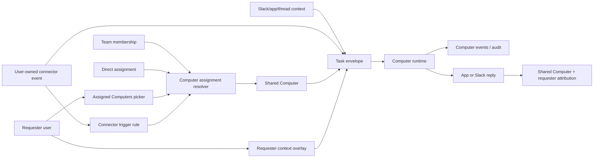

# feat: Shared Computers product reframe

## Overview

Reframe ThinkWork Computers from one-per-user personal assistants into tenant-managed shared work capabilities. Users route requests to assigned Computers such as Finance Computer, Sales Computer, or Admin Computer; the runtime attaches the invoking user's requester context and memory to each request without making the Computer personal. Personal connectors such as Gmail and Google Calendar remain user-owned credential/event sources, but their triggers route into assigned shared Computers rather than a private "My Computer."

This plan intentionally supersedes the personal-Computer assumptions in `docs/brainstorms/2026-05-06-thinkwork-computer-product-reframe-requirements.md` and requires the May 16 Slack workspace app plan to be rewritten around shared Computers before Slack work proceeds.

---

## Problem Frame

The current implementation encodes "one active Computer per user" in schema, GraphQL, app queries, authz, runtime config, thread routing, runbooks, scheduled jobs, and docs. That model risks recreating personal-assistant noise: many lightly maintained AI personalities speaking in Slack instead of a small governed roster of shared AI coworkers.

The origin document chooses shared-only v1. A Computer becomes a managed work capability; users access assigned Computers; personalization arrives through per-request requester memory/context; public Slack replies identify the shared Computer and requester rather than a private assistant.

The connector concern is the main place where the personal-Computer model had real utility: individual Gmail/Calendar accounts naturally emit user-scoped events. The reframe keeps that useful primitive but names it separately. A user-owned connector can trigger a shared Computer task when policy allows it; the selected Computer is the shared capability, the connector owner is the requester/credential subject, and the task envelope records both identities explicitly.

---

## Requirements Trace

- R1. Shared Computers replace personal Computers as the default and v1-only Computer model.
- R2. A Computer represents a managed shared work capability, not a private assistant owned by one human.
- R3. Users may send messages only to Computers they are assigned or otherwise authorized to use.
- R4. Tenant operators centrally manage shared Computer configuration, tools, runbooks, budgets, and lifecycle.
- R5. Shared capability improvements benefit all assigned users without per-user replication.
- R6. Assigned-Computers lists appear wherever users can start work.
- R7. Every request records selected Computer and invoking user as distinct identities.
- R8. Users with multiple assigned Computers can choose the target before or during submission.
- R9. Users with no assigned Computers fail closed with an assignment path.
- R10. Slack public replies are attributed to the shared Computer with requester attribution.
- R11. Request context does not grant ambient channel access.
- R12. The requester context layer injects invoking-user memory and preferences per request.
- R13. Requester context is a scoped overlay, not a mutation of shared Computer identity or default memory.
- R14. Personal context is not written into shared Computer memory or exposed to others without explicit sharing or tenant policy.
- R15. Audit records show which Computer acted, which user requested, which context class was used, and which capabilities ran.
- R16. v1 does not keep a private "My Computer" product surface.
- R17. Existing personal Computer state is migrated, archived, or remapped without silently orphaning state.
- R18. Docs, navigation, and Slack behavior stop teaching one human equals one Computer.
- R19. User-owned connectors such as Gmail and Google Calendar may trigger assigned shared Computers without creating personal Computer identities.
- R20. Connector-triggered work records the selected Computer, connector owner, requester user, credential subject, trigger source, and event metadata as distinct fields.
- R21. Connector-triggered work fails closed when the connector owner is not assigned to the target Computer, the OAuth credential is unavailable, or the trigger policy does not allow the event.

**Origin actors:** A1 end user, A2 tenant operator, A3 shared Computer, A4 requester context layer, A5 Slack workspace participant, A6 planner/implementer, A7 user-owned connector event source
**Origin flows:** F1 assigned shared Computer request, F2 shared Computer in Slack, F3 central capability management, F4 personal context overlay, F5 personal connector trigger routed to shared Computer
**Origin acceptance examples:** AE1 assigned chooser, AE2 no-assignment fail-closed, AE3 Slack attribution and audit, AE4 personal memory isolation, AE5 central capability update, AE6 migration away from personal Computers, AE7 Gmail/Calendar connector trigger routes to shared Computer with requester attribution

---

## Scope Boundaries

### Deferred for later

- Private personal Computers as an optional advanced feature.
- Team self-service creation of arbitrary new Computers without operator governance.
- A marketplace of shared Computer templates.
- Fully automatic routing that chooses a Computer without the user naming or selecting one.
- Organization-wide conversational memory learned passively from Slack channels.
- Slack Connect and external-org shared-channel handling.
- Shared mailbox/service-account connector triggers, such as `finance@company.com`, unless a future unit explicitly adds tenant-owned credential subjects.
- Admin-forced enablement of every user's personal connector triggers without per-user consent or a tenant policy primitive.

### Outside this product's identity

- ThinkWork is not a fleet of personal assistants that mirror each employee's personality.
- ThinkWork is not a Slack chatbot swarm.
- Shared Computers are not generic group chats with an LLM; they are governed work capabilities with assignments, skills, tools, memory boundaries, and audit.
- Requester context is not a way to bypass a shared Computer's permissions or capability boundaries.

### Deferred to Follow-Up Work

- Full Slack workspace app implementation remains a follow-up build plan after this reframe updates the core Computer contracts and rewrites the Slack plan around shared targets.
- HRIS/SCIM role sync is deferred; v1 uses existing Teams plus direct user assignments as the role/group primitive.
- Automatic promotion of personal workspace files into shared Computer workspaces is deferred; v1 preserves old workspaces read-only unless an operator explicitly promotes content.

---

## Context & Research

### Relevant Code and Patterns

- `packages/database-pg/src/schema/computers.ts` defines `owner_user_id` as required and has `uq_computers_active_owner`, the main schema assumption to unwind.
- `packages/database-pg/graphql/types/computers.graphql` exposes required `ownerUserId`, `myComputer`, and owner-based create input.
- `packages/api/src/graphql/resolvers/computers/shared.ts` enforces owner-based creation, one-active-Computer-per-user, and owner-or-admin read access.
- `packages/api/src/lib/computers/thread-cutover.ts` resolves a thread Computer by owner or requested id, then writes `created_by_user_id` on thread-turn tasks.
- `packages/api/src/lib/computers/runtime-api.ts` returns `ownerUserId` in runtime config and resolves Google OAuth tokens through the Computer owner, which must change to requester-scoped credential resolution.
- `packages/database-pg/src/schema/teams.ts` already provides `teams` and `team_users`, a good v1 assignment substrate for role/group-based Computer access.
- `apps/computer/src/lib/graphql-queries.ts`, `apps/mobile/lib/graphql-queries.ts`, and `apps/admin/src/lib/graphql-queries.ts` all use `myComputer` / `ownerUserId` and need generated-client updates.
- `packages/api/src/handlers/mcp-context-engine.ts` already has `scope: personal | team | auto` and split memory/query tools; requester-memory injection should use this family of abstractions rather than raw Hindsight calls wherever possible.
- `packages/api/src/lib/oauth-token.ts` already resolves active connections by exact `(tenantId, userId, providerName)`; personal connector triggers must build on that shape and avoid default-agent/personal-Computer fallbacks.
- `packages/database-pg/src/schema/scheduled-jobs.ts` already treats `trigger_type = event` and nullable schedule fields as non-timer work, a useful substrate for connector-trigger definitions if provider watch state can fit in `config`.
- `packages/api/src/handlers/connections.ts`, `apps/mobile/components/credentials/IntegrationsSection.tsx`, and `apps/mobile/lib/hooks/use-connections.ts` already model per-user connector ownership; shared Computers should consume these connections as credential subjects rather than replacing them with Computer-owned credentials.

### Institutional Learnings

- `docs/solutions/logic-errors/oauth-authorize-wrong-user-id-binding-2026-04-21.md` is directly relevant: never resolve per-user credentials by tenant-only fallback or arbitrary user selection. Requester identity must be explicit and fail closed.
- `docs/solutions/best-practices/context-engine-adapters-operator-verification-2026-04-29.md` applies to requester context: operators need provider/status visibility for memory/context injection, not a black-box "memory was used."
- `docs/solutions/workflow-issues/manually-applied-drizzle-migrations-drift-from-dev-2026-04-21.md` applies because this plan changes persistent Computer ownership and likely needs hand-rolled migration markers.
- `docs/solutions/best-practices/inline-helpers-vs-shared-package-for-cross-surface-code-2026-04-21.md` is a caution for shared envelope helpers across API/runtime/apps: extract only when the dependency direction is worth it; otherwise pin the contract with tests.

### External References

- Every's May 2026 article, ["We Gave Every Employee an AI Agent. Here's What We're Doing Differently Now"](https://every.to/source-code/we-gave-every-employee-an-ai-agent-here-s-what-we-re-doing-differently-now), supports the product direction: workplace agents should move from individual pets toward shared team resources with defined jobs.

---

## Key Technical Decisions

- **Direct user + Team assignments in v1:** Use explicit user assignments and existing Teams as role/group assignments. Tenant owner/admin users can manage all shared Computers but are not automatically end-user assignees unless policy says so.
- **Keep historical owner data, remove active owner invariant:** Make the runtime/product contract shared-first while preserving nullable/historical owner fields for migration traceability and read-only archives. Do not keep owner as the active access model.
- **Requester identity is mandatory for user-originated work:** Any user-originated task must carry a requester user id. Per-user OAuth and memory lookup use that requester, never an arbitrary Computer owner.
- **Shared Computer context and requester context are separate inputs:** Shared Computer configuration, runbooks, workspace, and shared memory stay tied to the Computer. Personal preferences and Hindsight/user memory are a scoped request overlay.
- **Personal connector triggers target shared Computers:** A user's Gmail/Calendar connection remains personal and consented by that user. Trigger rules route events from that connection to one assigned shared Computer, with requester and credential subject set to the connector owner. The Computer does not own or absorb the connector.
- **No automatic routing v1:** Users choose or name a Computer. This avoids hidden misrouting and keeps Slack legible.
- **Slack plan rewrite before Slack build:** The existing May 16 Slack plan is structurally personal-Computer-shaped and should be rewritten after core contracts land.

---

## Open Questions

### Resolved During Planning

- **Assignment model:** v1 uses direct user assignments plus Team assignments; Teams model role/group membership for Sales, Finance, Admin, and Engineering.
- **Personal workspace migration:** v1 preserves existing personal Computer workspaces as read-only historical state and does not auto-copy files into shared Computers.
- **Requester credential source:** user-originated shared Computer tasks resolve personal OAuth credentials from the requester, not from the Computer.
- **Personal connector trigger model:** v1 uses Option A: user-owned connector event triggers route to assigned shared Computers. Gmail/Calendar event watches are personal credential sources; the task target remains a shared Computer.
- **Slack target selection:** v1 should support explicit naming/selection (`/thinkwork finance ...`, message-action modal picker, App Home default), not automatic routing.

### Deferred to Implementation

- **Exact migration SQL shape:** implementation determines whether Drizzle can generate the needed DDL or a hand-rolled migration is clearer.
- **Exact context envelope field names:** implementation can choose final GraphQL/JSON names, but the semantic split is mandatory: Computer, requester, surface context, requester memory, shared context.
- **Read-only archive UI depth:** implementation should preserve reachability first; richer archive browsing can be minimized if historical threads/workspaces remain inspectable.

---

## High-Level Technical Design

> _This illustrates the intended approach and is directional guidance for review, not implementation specification. The implementing agent should treat it as context, not code to reproduce._

The central invariant: `computer_id` answers "which shared capability did the work?" and `requester_user_id` answers "who asked and whose personal context/credentials may be used for this request?" For connector-triggered work, the connector owner is also the initial `credential_subject_user_id`; later service/shared connector subjects must be represented explicitly rather than inferred from the Computer.

---

## Implementation Units

- U1. **Schema and migration for shared Computers and assignments**

**Goal:** Replace the one-active-Computer-per-owner invariant with shared Computer ownership and assignment records while preserving historical personal Computer data.

**Requirements:** R1, R2, R3, R4, R6, R9, R16, R17, AE1, AE2, AE6

**Dependencies:** None

**Files:**

- Modify: `packages/database-pg/src/schema/computers.ts`
- Modify: `packages/database-pg/src/schema/index.ts`
- Modify: `packages/database-pg/graphql/types/computers.graphql`
- Create: `packages/database-pg/drizzle/NNNN_shared_computers.sql`
- Test: `packages/database-pg/__tests__/schema-computers.test.ts`
- Test: `packages/database-pg/__tests__/shared-computer-assignments.test.ts`

**Approach:**

- Add an explicit Computer scope/type such as shared vs historical personal/archive.
- Make owner user semantics historical/nullable for shared Computers; drop or replace the active-owner unique invariant.
- Add assignment storage for direct user and Team assignment, using existing `teams` / `team_users` as the v1 role-group substrate.
- Add indexes for assigned-computer lookup by tenant, subject, status, and Computer.
- Preserve existing personal rows by marking them historical or archive-compatible rather than deleting them.
- Keep `computer_tasks`, `computer_events`, `computer_snapshots`, and `computer_delegations` tied to `computer_id`; do not duplicate those tables for assignments.

**Execution note:** Migration-first and characterization-heavy. Add tests around the current invariant before changing it so failures show exactly what contract moved.

**Patterns to follow:**

- Existing Computer schema in `packages/database-pg/src/schema/computers.ts`
- Existing Team schema in `packages/database-pg/src/schema/teams.ts`
- Manual migration markers from `docs/solutions/workflow-issues/manually-applied-drizzle-migrations-drift-from-dev-2026-04-21.md`

**Test scenarios:**

- Happy path: create a shared Computer with no owner user and active status.
- Happy path: assign a shared Computer directly to a user and resolve the assignment by tenant/user.
- Happy path: assign a shared Computer to a Team and resolve it for a user in that Team.
- Edge case: the same user can be assigned to multiple active shared Computers.
- Edge case: a historical personal Computer can coexist with shared Computer assignments.
- Error path: duplicate direct assignment for the same Computer/user is rejected.
- Error path: cross-tenant Team or user assignment is rejected.
- Migration path: existing personal Computer rows remain present and queryable as historical/archive-compatible rows.

**Verification:**

- Schema exports compile and the generated GraphQL schema no longer requires active owner semantics for shared Computers.
- Migration drift reporter can identify all new objects correctly.

---

- U2. **GraphQL Computer access model and assignment APIs**

**Goal:** Replace `myComputer` and owner-based read/write assumptions with assigned-Computers queries, assignment mutations, and shared-Computer-aware authz helpers.

**Requirements:** R3, R4, R6, R8, R9, R15, R16, AE1, AE2

**Dependencies:** U1

**Files:**

- Modify: `packages/database-pg/graphql/types/computers.graphql`
- Modify: `packages/api/src/graphql/resolvers/computers/index.ts`
- Modify: `packages/api/src/graphql/resolvers/computers/shared.ts`
- Modify: `packages/api/src/graphql/resolvers/computers/computers.query.ts`
- Modify: `packages/api/src/graphql/resolvers/computers/computer.query.ts`
- Modify: `packages/api/src/graphql/resolvers/computers/createComputer.mutation.ts`
- Modify: `packages/api/src/graphql/resolvers/computers/updateComputer.mutation.ts`
- Create: `packages/api/src/graphql/resolvers/computers/assignedComputers.query.ts`
- Create: `packages/api/src/graphql/resolvers/computers/computerAssignments.query.ts`
- Create: `packages/api/src/graphql/resolvers/computers/computerAccessUsers.query.ts`
- Create: `packages/api/src/graphql/resolvers/computers/userComputerAssignments.query.ts`
- Create: `packages/api/src/graphql/resolvers/computers/setComputerAssignments.mutation.ts`
- Create: `packages/api/src/graphql/resolvers/computers/setUserComputerAssignments.mutation.ts`
- Test: `packages/api/src/graphql/resolvers/computers/shared-computer-access.test.ts`
- Test: `packages/api/src/graphql/resolvers/computers/assignedComputers.query.test.ts`
- Test: `packages/api/src/graphql/resolvers/computers/setComputerAssignments.mutation.test.ts`
- Test: `packages/api/src/graphql/resolvers/computers/computerAccessUsers.query.test.ts`
- Test: `packages/api/src/graphql/resolvers/computers/userComputerAssignments.query.test.ts`

**Approach:**

- Introduce `assignedComputers` as the user-facing replacement for `myComputer`.
- Keep or deprecate `myComputer` only as a temporary compatibility shim that does not create or imply a personal Computer; clients in this plan should stop using it.
- Split auth helpers by intent: admin manage access, assigned-user invoke access, tenant-member read/archive access where appropriate, service-runtime access.
- Update create/update Computer inputs to support shared Computers and assignments without requiring `ownerUserId`.
- Ensure assignment mutations are admin-gated and tenant-pinned from row data, following existing authz patterns. Support both Computer-centric assignment edits and People-detail user-centric direct assignment edits.
- Add a Computer-centric access query that returns effective users with source metadata: direct assignment, Team-derived assignment, and combined direct + Team access.
- Update `toGraphqlComputer` / type resolvers so nullable historical owner data does not break shared Computer rows.

**Execution note:** Add authz tests before broad resolver rewrites; this is an access-control-sensitive change.

**Patterns to follow:**

- `packages/api/src/graphql/resolvers/teams/*` for team/member mutation shape and admin gates
- `packages/api/src/graphql/resolvers/core/resolve-auth-user.ts` for caller resolution
- `docs/solutions/logic-errors/oauth-authorize-wrong-user-id-binding-2026-04-21.md` for avoiding arbitrary same-tenant user fallback

**Test scenarios:**

- Covers AE1. Assigned user sees direct and Team-assigned Computers in `assignedComputers`.
- Covers AE2. User with no assignments receives an empty list and cannot invoke a Computer.
- Happy path: tenant admin can create a shared Computer and assign it to a Team.
- Happy path: tenant admin can assign Computers directly from a user-centric mutation.
- Happy path: Computer access users query returns each effective user once with direct/Team source details.
- Happy path: tenant admin can update shared Computer metadata without owner user fields.
- Error path: tenant member cannot assign Computers.
- Error path: user from the same tenant but without assignment cannot read invocation-only details for a shared Computer.
- Error path: cross-tenant assignment mutation fails before writing.
- Compatibility path: `myComputer` no longer auto-provisions or teaches personal Computer semantics.

**Verification:**

- GraphQL codegen succeeds for API consumers after the new schema is built.
- Existing admin-only Computer list still works for operators, but user-facing clients move to `assignedComputers`.

---

- U3. **Thread, task, and runtime envelope with requester identity**

**Goal:** Make every shared Computer turn carry explicit requester identity, credential subject, surface context, and audit payloads.

**Requirements:** R7, R11, R12, R13, R15, AE3, AE4

**Dependencies:** U1, U2

**Files:**

- Modify: `packages/api/src/lib/computers/tasks.ts`
- Modify: `packages/api/src/lib/computers/thread-cutover.ts`
- Modify: `packages/api/src/lib/computers/runtime-api.ts`
- Modify: `packages/api/src/handlers/computer-runtime.ts`
- Modify: `packages/api/src/graphql/resolvers/triggers/createScheduledJob.mutation.ts`
- Modify: `packages/lambda/job-trigger.ts`
- Modify: `packages/computer-runtime/src/api-client.ts`
- Modify: `packages/computer-runtime/src/task-loop.ts`
- Modify: `packages/agentcore-strands/agent-container/container-sources/computer_task_events.py`
- Modify: `packages/agentcore-strands/agent-container/container-sources/computer_thread_response.py`
- Test: `packages/api/src/lib/computers/tasks.test.ts`
- Test: `packages/api/src/lib/computers/thread-cutover.test.ts`
- Test: `packages/api/src/lib/computers/runtime-api.test.ts`
- Test: `packages/api/src/handlers/scheduled-jobs.computer-id.test.ts`
- Test: `packages/computer-runtime/src/task-loop.test.ts`
- Test: `packages/agentcore-strands/agent-container/test_computer_task_events.py`
- Test: `packages/agentcore-strands/agent-container/test_computer_thread_response.py`

**Approach:**

- Extend normalized `thread_turn` task input with a requester identity and surface metadata.
- Preserve `created_by_user_id` as the database-level requester pointer and make it required for user-originated turns.
- Change thread creation/routing so requested Computer id is validated through assignment access, not owner equality.
- Change runtime config so shared Computer identity no longer exposes `ownerUserId` as the credential/memory subject.
- For user-scoped OAuth work, resolve credentials from the requester carried by the task. For scheduled/system work without a requester, require an explicit service/shared credential policy or fail closed.
- Update scheduled-job creation and trigger dispatch so scheduled shared-Computer work either carries a configured requester/service subject or records that user-scoped context is unavailable.
- Emit audit events that record Computer id, requester user id, source surface, and context class.

**Execution note:** Characterization-first around thread creation and task enqueueing; these paths have many cross-surface callers.

**Patterns to follow:**

- Existing `created_by_user_id` writes in `packages/api/src/lib/computers/thread-cutover.ts`
- Existing runtime task claim/complete flow in `packages/api/src/lib/computers/runtime-api.ts`
- OAuth binding warning from `docs/solutions/logic-errors/oauth-authorize-wrong-user-id-binding-2026-04-21.md`

**Test scenarios:**

- Covers AE3. Slack/app thread turn records shared Computer id and requester user id in task and audit event.
- Happy path: assigned user creates a thread against Finance Computer and the task envelope carries requester metadata.
- Happy path: Team-assigned user sends a message and assignment access is accepted.
- Error path: unassigned user cannot enqueue a thread turn for a shared Computer.
- Error path: user-originated task without requester identity is rejected.
- Error path: credential lookup for a shared Computer never falls back to another tenant user.
- Edge case: scheduled shared-Computer job without requester identity does not silently use a historical owner.
- Integration: runtime claims a task and receives enough requester metadata to resolve user-scoped context without owner user config.

**Verification:**

- Thread turns can be created for assigned shared Computers and cannot be created for unassigned shared Computers.
- Runtime task payloads distinguish selected Computer, requester, and surface context.

---

- U4. **Requester context and personal memory overlay**

**Goal:** Attach invoking-user memory/preferences per request while preserving shared Computer memory boundaries and auditability.

**Requirements:** R12, R13, R14, R15, R20, AE4, AE7

**Dependencies:** U3

**Files:**

- Modify: `packages/api/src/handlers/mcp-context-engine.ts`
- Modify: `packages/api/src/lib/memory/recall-service.ts`
- Modify: `packages/api/src/lib/memory/types.ts`
- Modify: `packages/api/src/graphql/resolvers/memory/memorySearch.query.ts`
- Create: `packages/api/src/lib/computers/requester-context.ts`
- Test: `packages/api/src/lib/computers/requester-context.test.ts`
- Test: `packages/api/src/handlers/mcp-context-engine.requester-context.test.ts`
- Test: `packages/api/src/graphql/resolvers/memory/memorySearch.query.test.ts`

**Approach:**

- Add a request-context assembler that accepts tenant id, requester user id, Computer id, prompt, source surface, and optional credential subject/event context.
- Use the normalized memory/context services to retrieve requester-relevant memory under the requester's user scope.
- Return structured context with provenance and context class, not a raw text blob that hides source and privacy boundaries.
- Keep shared Computer context and requester memory as separate sections in the assembled prompt/runtime payload.
- Do not write requester memory into shared Computer memory by default.
- Add provider/status metadata so operators can see whether personal memory participated, was skipped, or failed.
- For connector-triggered requests, keep event metadata and credential subject provenance separate from retrieved personal memory so a Gmail/Calendar event does not become shared Computer memory by accident.

**Execution note:** Test-first around privacy boundaries: it should be hard to accidentally include another user's memory.

**Patterns to follow:**

- Context Engine provider visibility guidance in `docs/solutions/best-practices/context-engine-adapters-operator-verification-2026-04-29.md`
- Existing normalized recall service in `packages/api/src/lib/memory/recall-service.ts`
- Existing `scope: personal | team | auto` handling in `packages/api/src/handlers/mcp-context-engine.ts`

**Test scenarios:**

- Covers AE4. Requester context returns Eric's memory for Eric's request and does not persist it as shared Computer memory.
- Happy path: prompt with requester id retrieves personal memory hits with provenance.
- Edge case: no personal memory hits returns an explicit skipped/empty status, not an error.
- Error path: missing requester id for a user-originated request fails closed.
- Error path: requester from another tenant cannot be used to query memory.
- Privacy path: a second assigned user invoking the same Computer cannot receive the first user's personal memory.
- Operator visibility: context assembly result includes provider status and context class for audit.
- Connector path: a Gmail-triggered request for Eric can include Eric-scoped memory and connector event metadata, but another assigned user invoking the same Computer cannot see that memory or event payload.

**Verification:**

- Runtime payloads can include requester context with provenance.
- Tests prove personal context stays request-scoped and user-scoped.

---

- U4A. **Personal connector triggers routed to shared Computers**

**Goal:** Preserve the useful personal-connector behavior from the old personal-Computer model by letting user-owned Gmail/Calendar events target assigned shared Computers with explicit requester and credential-subject attribution.

**Requirements:** R3, R7, R11, R12, R15, R19, R20, R21, AE4, AE7

**Dependencies:** U2, U3, U4

**Files:**

- Modify: `packages/database-pg/src/schema/scheduled-jobs.ts`
- Modify: `packages/database-pg/graphql/types/scheduled-jobs.graphql`
- Modify: `packages/api/src/graphql/resolvers/triggers/createScheduledJob.mutation.ts`
- Modify: `packages/api/src/graphql/resolvers/triggers/scheduledJobs.query.ts`
- Modify: `packages/api/src/lib/oauth-token.ts`
- Modify: `packages/api/src/handlers/connections.ts`
- Create: `packages/api/src/lib/computers/connector-trigger-routing.ts`
- Create: `packages/api/src/lib/computers/connector-trigger-routing.test.ts`
- Test: `packages/api/src/graphql/resolvers/triggers/connector-computer-trigger.test.ts`
- Test: `packages/api/src/handlers/connections.connector-trigger.test.ts`

**Approach:**

- Model a personal connector trigger as a trigger definition whose credential subject is a user-owned connection and whose target is a shared Computer.
- Prefer extending the existing `scheduled_jobs` event-trigger shape and `config` payload before adding a new table; add schema only if provider watch state, dedupe keys, or trigger ownership cannot be represented safely.
- Store trigger configuration with explicit `computerId`, `connectionId`, `provider`, `eventType`, requester/credential subject, and selected event filters. Do not store a personal Computer id or owner-derived default target.
- At trigger creation, require the authenticated user to own the selected connection and be assigned to the target Computer. Admin-created templates may preselect Computers, but user-owned connector activation must still bind an explicit user connection.
- At event ingestion, resolve the connection by exact tenant/user/provider and verify the connector owner still has invoke access to the target Computer before enqueueing work.
- Enqueue shared Computer tasks with `contextClass = personal_connector_event`, `requesterUserId = connection.user_id`, `credentialSubjectUserId = connection.user_id`, and provider event metadata in `surfaceContext`.
- Fail closed when access, OAuth token resolution, provider watch state, or dedupe validation is missing. Record a skipped/audit event rather than falling back to a historical owner or arbitrary tenant user.
- Keep provider-specific watch mechanics narrow: the routing contract should support Gmail and Google Calendar first, while letting future provider handlers reuse the same Computer/requester/credential envelope.

**Execution note:** Test-first around authorization and credential subject resolution. This unit exists specifically to prevent personal connector support from reintroducing personal Computers through a side door.

**Patterns to follow:**

- Exact per-user OAuth resolution in `packages/api/src/lib/oauth-token.ts`
- Non-timer `event` trigger shape in `packages/database-pg/src/schema/scheduled-jobs.ts`
- Connector ownership patterns in `packages/api/src/handlers/connections.ts`
- U3 task envelope tests around requester identity and fail-closed credential lookup

**Test scenarios:**

- Covers AE7. Eric connects Gmail, enables a new-email trigger to Sales Computer, and an inbound email enqueues a Sales Computer task with Eric as requester and credential subject.
- Happy path: Google Calendar event trigger routes to Admin Computer when the connector owner is assigned to that Computer.
- Happy path: an assigned user can have multiple connector triggers targeting different assigned Computers.
- Edge case: a user can disable a trigger without disconnecting the underlying Gmail/Calendar connection.
- Error path: user cannot create a connector trigger targeting a Computer they are not assigned to.
- Error path: event ingestion drops/skips work if the connector owner lost access to the target Computer after trigger creation.
- Error path: event ingestion never falls back to `ownerUserId`, `defaultAgentId`, or another same-tenant user's connection.
- Privacy path: event metadata and personal memory remain requester-scoped and are not written into shared Computer memory.
- Audit path: skipped and enqueued events include Computer id, requester user id, credential subject, provider, event type, and context class.

**Verification:**

- Gmail/Calendar connector triggers can target assigned shared Computers without any `myComputer` dependency.
- Focused tests prove trigger creation and event ingestion enforce assignment and exact credential-subject resolution.

---

- U5. **Computer app and mobile assigned-Computer user experience**

**Goal:** Replace `myComputer`-centric app flows with assigned shared Computer selection and fail-closed empty states.

**Requirements:** R3, R6, R8, R9, R16, R18, AE1, AE2

**Dependencies:** U2, U3

**Files:**

- Modify: `apps/computer/src/lib/graphql-queries.ts`
- Modify: `apps/computer/src/context/TenantContext.tsx`
- Modify: `apps/computer/src/components/NewThreadDialog.tsx`
- Modify: `apps/computer/src/components/computer/ComputerWorkbench.tsx`
- Modify: `apps/computer/src/components/ComputerSidebar.tsx`
- Modify: `apps/computer/src/routes/_authed/_shell/threads.index.tsx`
- Modify: `apps/computer/src/routes/_authed/_shell/threads.$id.tsx`
- Modify: `apps/computer/src/routes/_authed/_shell/automations.index.tsx`
- Modify: `apps/computer/src/routes/_authed/_shell/customize.*.tsx`
- Modify: `apps/mobile/lib/graphql-queries.ts`
- Modify: `apps/mobile/app/(tabs)/index.tsx`
- Modify: `apps/mobile/app/chat/index.tsx`
- Modify: `apps/mobile/app/threads/index.tsx`
- Modify: `apps/mobile/lib/gql/graphql.ts`
- Modify: `apps/mobile/lib/gql/gql.ts`
- Test: `apps/computer/src/components/NewThreadDialog.test.tsx`
- Test: `apps/computer/src/components/computer/ComputerWorkbench.test.tsx`
- Test: `apps/computer/test/shell-tenant-discovery.test.tsx`
- Test: `apps/mobile/lib/__tests__/thread-query-contract.test.ts`

**Approach:**

- Replace `MyComputerQuery` usage with `assignedComputers`.
- Add a selected Computer state for composer/thread surfaces; persist the last selected Computer locally per tenant where appropriate.
- Update thread lists to filter by selected Computer while still allowing all-assigned view if the UX already supports it.
- When there are no assigned Computers, show a clear assignment-needed state and do not create a personal Computer.
- Update tenant discovery so invited Google-federated users are not dependent on `myComputer`; use membership/assigned Computers instead.
- Keep generated GraphQL clients synchronized in mobile/admin packages.

**Patterns to follow:**

- Existing mobile Computer chooser logic in `apps/mobile/app/(tabs)/index.tsx`
- Existing Computer app shell data flow in `apps/computer/src/components/computer/ComputerWorkbench.tsx`
- Admin/mobile env-copy guidance from `AGENTS.md` for verification later during implementation

**Test scenarios:**

- Covers AE1. User assigned to Finance and Admin sees both as selectable targets and no personal target.
- Covers AE2. User with no assignments sees assignment-needed state and cannot submit.
- Happy path: selecting a Computer changes the thread list/composer target.
- Edge case: only one assigned Computer auto-selects it without making it personal.
- Error path: stale selected Computer id that is no longer assigned falls back to the first available assigned Computer or empty state.
- Integration: sending a message from the app includes the selected shared Computer id and requester identity.

**Verification:**

- Computer app and mobile no longer depend on `myComputer` for the primary user flow.
- GraphQL generated artifacts match the updated schema.

---

- U6. **Admin shared Computer management and assignments**

**Goal:** Give tenant operators a coherent management surface for shared Computers, assignments, and central capability maintenance.

**Requirements:** R4, R5, R6, R15, AE5

**Dependencies:** U1, U2

**Files:**

- Modify: `apps/admin/src/lib/graphql-queries.ts`
- Modify: `apps/admin/src/routes/_authed/_tenant/computers/index.tsx`
- Modify: `apps/admin/src/routes/_authed/_tenant/computers/$computerId.tsx`
- Modify: `apps/admin/src/routes/_authed/_tenant/computers/-components/ComputerIdentityEditPanel.tsx`
- Modify: `apps/admin/src/routes/_authed/_tenant/people/$humanId.tsx`
- Modify: `apps/admin/src/components/humans/HumanMembershipSection.tsx`
- Modify: `apps/admin/src/components/computers/ComputerFormDialog.tsx`
- Create: `apps/admin/src/routes/_authed/_tenant/computers/-components/ComputerAssignmentsPanel.tsx`
- Create: `apps/admin/src/routes/_authed/_tenant/computers/-components/ComputerAccessUsersTable.tsx`
- Create: `apps/admin/src/components/humans/HumanComputerAssignmentsSection.tsx`
- Test: `apps/admin/src/routes/_authed/_tenant/computers/-computers-route.test.ts`
- Test: `apps/admin/src/routes/_authed/_tenant/computers/-components/ComputerIdentityEditPanel.test.ts`
- Test: `apps/admin/src/routes/_authed/_tenant/computers/-components/ComputerAssignmentsPanel.test.tsx`
- Test: `apps/admin/src/routes/_authed/_tenant/people/-human-computer-assignments.test.tsx`
- Test: `apps/admin/src/components/computers/ComputerFormDialog.test.ts`

**Approach:**

- Remove owner-user selection from the active shared Computer creation path.
- Add assignment controls for direct users and Teams, with clear indication that Teams are the v1 role/group primitive.
- Add a People detail assignment surface so operators can assign or remove direct Computer access for one user from `apps/admin/src/routes/_authed/_tenant/people/$humanId.tsx`.
- Add a Computer detail users DataTable that shows every user with access to that Computer, including whether access is direct, Team-derived, or both.
- Keep status/runtime/budget panels shared-Computer-oriented.
- Update list/detail columns from "Owner" to "Assignments" / "Access" / "Role".
- Preserve historical owner/migration metadata for archived personal rows but do not foreground it for new shared Computers.
- Ensure Skills, Workflows, Runbooks, and customization surfaces target the selected shared Computer and not an owner-derived `primary_agent_id` fallback.

**Patterns to follow:**

- Existing admin Computer dashboard components under `apps/admin/src/routes/_authed/_tenant/computers/-components/`
- Team mutation and membership GraphQL patterns in `packages/database-pg/graphql/types/teams.graphql`

**Test scenarios:**

- Covers AE5. Operator updates Sales Computer capability/assignment once and assigned sales users inherit access.
- Happy path: admin creates Finance Computer with Team assignment.
- Happy path: admin adds and removes a direct user assignment.
- Happy path: admin opens a People detail page and assigns Finance Computer directly to that user.
- Happy path: Computer detail shows a DataTable of users with access, including access source and Team names for inherited assignments.
- Edge case: archived historical personal Computer displays migration metadata read-only.
- Edge case: a user with both direct and Team-derived access appears once in the Computer users table with both sources shown.
- Error path: member-role caller cannot mutate assignments.
- Error path: assignment UI prevents cross-tenant users/Teams from being selected.

**Verification:**

- Admin UI supports creating and assigning shared Computers without owner users.
- Existing Computer runtime panels continue to work for shared Computers.

---

- U7. **Slack shared Computer invocation contract and plan rewrite**

**Goal:** Rebase Slack integration work on shared Computers: explicit target selection, shared-role attribution, requester context injection, and no personal-Computer fallback.

**Requirements:** R6, R7, R8, R10, R11, R12, R15, R18, F2, AE3

**Dependencies:** U2, U3, U4, U4A

**Files:**

- Modify: `docs/brainstorms/2026-05-16-thinkwork-computer-slack-workspace-app-requirements.md`
- Modify: `docs/plans/2026-05-16-004-feat-thinkwork-computer-slack-workspace-app-plan.md`
- Create: `docs/brainstorms/2026-05-17-shared-computers-slack-requirements.md`
- Create: `docs/plans/2026-05-17-NNN-feat-shared-computers-slack-plan.md`
- Modify: `packages/database-pg/graphql/types/computers.graphql`
- Create: `packages/api/src/lib/slack/shared-computer-targeting.ts`
- Create: `packages/api/src/lib/slack/shared-computer-targeting.test.ts`

**Approach:**

- Mark the May 16 Slack docs as superseded by the shared Computers direction or rewrite them in place if the team prefers one canonical Slack plan.
- Define Slack target semantics before any Slack handler implementation:
  - `/thinkwork finance <prompt>` targets Finance Computer by slug/name if assigned.
  - Message-action and ambiguous slash command open a picker of assigned Computers.
  - App Home may store a per-user default target per Slack workspace.
  - Public replies attribute to the shared Computer with requester attribution.
- Ensure Slack thread context is bounded to explicit invocation context and never ambient channel reading.
- Ensure Slack task envelopes carry requester user id and selected shared Computer id.
- Keep Slack user linking as user identity binding, not personal Computer binding.

**Patterns to follow:**

- Existing May 16 Slack plan for Slack OAuth/install mechanics, signature verification, and 3-second ack constraints
- Origin shared Computers requirements for attribution and requester context

**Test scenarios:**

- Covers AE3. Assigned user invokes Finance Computer in Slack and reply is attributed to Finance Computer with requester attribution.
- Happy path: `/thinkwork finance analyze this` resolves Finance Computer when assigned.
- Happy path: ambiguous command returns/presents assigned Computer picker rather than guessing.
- Error path: unassigned Slack user gets linking/assignment guidance and no task is enqueued.
- Error path: linked but unassigned user cannot target a shared Computer by name.
- Privacy path: Slack thread context is limited to the invoked thread/message and does not grant ambient channel reads.

**Verification:**

- A future Slack implementer can build from shared Computer targeting without reintroducing "Eric's Computer" semantics.
- Personal Slack plan language is removed or clearly superseded.

---

- U8. **Migration, docs, generated clients, and verification sweep**

**Goal:** Remove personal-Computer product language and regenerate cross-surface contracts after the shared-only model lands.

**Requirements:** R16, R17, R18, AE6

**Dependencies:** U1, U2, U4A, U5, U6, U7

**Files:**

- Modify: `docs/src/content/docs/concepts/computers.mdx`
- Modify: `docs/src/content/docs/applications/admin/computers.mdx`
- Modify: `docs/src/content/docs/concepts/connectors.mdx`
- Modify: `docs/src/content/docs/concepts/threads/routing-and-metadata.mdx`
- Modify: `packages/system-workspace/USER.md`
- Modify: `packages/system-workspace/PLATFORM.md`
- Modify: `apps/admin/src/gql/graphql.ts`
- Modify: `apps/admin/src/gql/gql.ts`
- Modify: `apps/mobile/lib/gql/graphql.ts`
- Modify: `apps/mobile/lib/gql/gql.ts`
- Test: `packages/api/src/__tests__/computer-thread-cutover-routing.test.ts`
- Test: `apps/admin/src/routes/_authed/_tenant/computers/-computers-route.test.ts`
- Test: `apps/computer/test/shell-tenant-discovery.test.tsx`
- Test: `apps/mobile/lib/__tests__/thread-query-contract.test.ts`

**Approach:**

- Update docs to define Computer as a shared managed capability and requester context as per-request personalization.
- Remove "one per user", "owner", and "My Computer" language from active product docs.
- Keep migration notes explaining how prior personal Computer state is preserved.
- Regenerate codegen for API consumers with codegen scripts.
- Add a focused grep/test sweep for old owner assumptions: `ownerUserId` in active user surfaces, `myComputer` in app flows, and owner-based authz in invocation paths.

**Patterns to follow:**

- Existing docs pages under `docs/src/content/docs/concepts/`
- Codegen guidance in `AGENTS.md`

**Test scenarios:**

- Covers AE6. Primary surfaces/docs no longer present personal Computers as active targets.
- Happy path: generated clients include assigned Computer operations and nullable/historical owner fields.
- Edge case: historical personal Computer threads remain inspectable after migration.
- Error path: stale queries selecting required `ownerUserId` fail typecheck until updated.
- Documentation check: docs build has no broken links to superseded personal Computer pages.

**Verification:**

- Typecheck/codegen surfaces no remaining active `myComputer` dependency in primary app flows.
- Docs build succeeds with shared Computer language.

---

## System-Wide Impact

- **Interaction graph:** Thread creation, message send, scheduled jobs, connector event triggers, runbooks, runtime task claim, OAuth token resolution, memory recall, Slack ingress, AppSync chunks, and admin/mobile/computer clients all touch Computer identity.
- **Error propagation:** Assignment failures must surface as access/assignment errors, not missing Computer or silent fallback to a personal Computer.
- **State lifecycle risks:** Historical personal Computers, workspaces, schedules, and threads need read-only preservation during migration. Shared Computers must not accidentally absorb private requester memory.
- **API surface parity:** GraphQL schema, generated clients, REST runtime endpoints, Slack payloads, and Python Strands callbacks all need the same Computer/requester split.
- **Integration coverage:** Unit tests alone will not prove the model. Implementation should include at least one end-to-end app or API scenario: assigned user selects shared Computer, sends a turn, runtime claims task, requester context is attached, and audit records both identities.
- **Unchanged invariants:** Tenant isolation, service-auth runtime boundaries, budget enforcement, tool/capability allowlists, and user-owned OAuth consent remain unchanged.

---

## Risks & Dependencies

| Risk                                                            | Mitigation                                                                                                                                                                               |
| --------------------------------------------------------------- | ---------------------------------------------------------------------------------------------------------------------------------------------------------------------------------------- |
| Migration breaks existing personal Computer state               | Preserve historical rows and read-only access first; defer automatic workspace promotion.                                                                                                |
| Per-user OAuth resolves to wrong requester                      | Require explicit requester identity; never fall back to arbitrary same-tenant user; add tests from prior OAuth binding failure pattern.                                                  |
| Personal connector triggers recreate personal Computers         | Model connectors as user-owned credential/event sources that target assigned shared Computers; task envelopes record requester and credential subject separately from Computer identity. |
| Shared Computer leaks one user's memory to another              | Keep requester memory as a scoped overlay with provenance; test cross-user isolation.                                                                                                    |
| Apps regress because `myComputer` was used for tenant discovery | Replace tenant discovery with membership/assigned Computers and cover Google-federated invited-user tests.                                                                               |
| Slack plan continues with personal-Computer assumptions         | Make Slack rebase a required unit before Slack implementation proceeds.                                                                                                                  |
| Assignment model grows too complex                              | Use direct user + Team only in v1; defer HRIS/SCIM role sync and automatic routing.                                                                                                      |
| GraphQL breaking changes ripple across generated clients        | Phase changes so schema, API, and client codegen land together.                                                                                                                          |

---

## Phased Delivery

### Phase A: Core model

- U1. Schema and migration for shared Computers and assignments
- U2. GraphQL Computer access model and assignment APIs

### Phase B: Invocation and context

- U3. Thread, task, and runtime envelope with requester identity
- U4. Requester context and personal memory overlay
- U4A. Personal connector triggers routed to shared Computers

### Phase C: User and operator surfaces

- U5. Computer app and mobile assigned-Computer user experience
- U6. Admin shared Computer management and assignments

### Phase D: Slack and cleanup

- U7. Slack shared Computer invocation contract and plan rewrite
- U8. Migration, docs, generated clients, and verification sweep

---

## Documentation / Operational Notes

- Update public/product docs before customer-facing Slack demos so the product story is shared Computers from the first conversation.
- Migration release notes should explain that personal Computer state is preserved historically but new work routes to shared Computers.
- Add operator guidance for creating first Computers: Finance, Sales, Admin, Engineering, plus assignment via Teams.
- Add connector guidance explaining that Gmail/Calendar remain personal connections and can trigger assigned shared Computers without creating personal Computers.
- Add audit/compliance documentation explaining requester context classes and personal-memory boundaries.
- Any hand-rolled migration must include correct drift markers and be applied to dev before merge.

---

## Sources & References

- **Origin document:** [docs/brainstorms/2026-05-17-shared-computers-product-reframe-requirements.md](docs/brainstorms/2026-05-17-shared-computers-product-reframe-requirements.md)
- Related requirements: [docs/brainstorms/2026-05-16-thinkwork-computer-slack-workspace-app-requirements.md](docs/brainstorms/2026-05-16-thinkwork-computer-slack-workspace-app-requirements.md)
- Related plan to supersede: [docs/plans/2026-05-16-004-feat-thinkwork-computer-slack-workspace-app-plan.md](docs/plans/2026-05-16-004-feat-thinkwork-computer-slack-workspace-app-plan.md)
- Related code: `packages/database-pg/src/schema/computers.ts`
- Related code: `packages/database-pg/src/schema/teams.ts`
- Related code: `packages/api/src/graphql/resolvers/computers/shared.ts`
- Related code: `packages/api/src/lib/computers/thread-cutover.ts`
- Related code: `packages/api/src/lib/computers/runtime-api.ts`
- Related code: `packages/api/src/lib/oauth-token.ts`
- Related code: `packages/api/src/handlers/connections.ts`
- Related code: `packages/database-pg/src/schema/scheduled-jobs.ts`
- Institutional learning: [docs/solutions/logic-errors/oauth-authorize-wrong-user-id-binding-2026-04-21.md](docs/solutions/logic-errors/oauth-authorize-wrong-user-id-binding-2026-04-21.md)
- Institutional learning: [docs/solutions/best-practices/context-engine-adapters-operator-verification-2026-04-29.md](docs/solutions/best-practices/context-engine-adapters-operator-verification-2026-04-29.md)
- External reference: [Every, "We Gave Every Employee an AI Agent. Here's What We're Doing Differently Now"](https://every.to/source-code/we-gave-every-employee-an-ai-agent-here-s-what-we-re-doing-differently-now)
